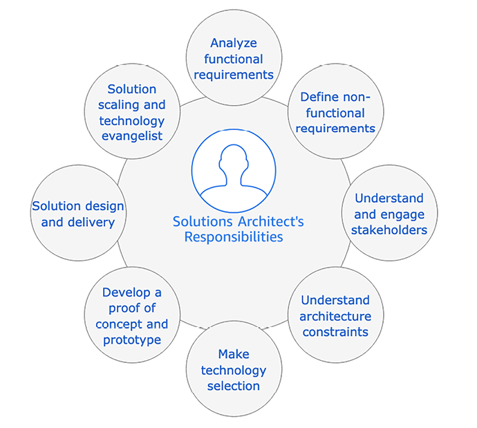
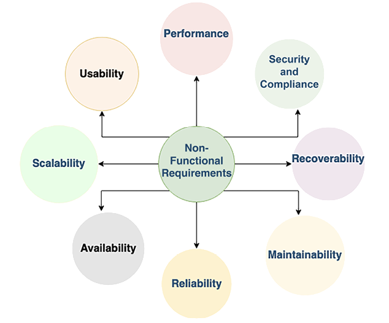

# Solutions Architects in Organizations

This book is your ultimate guide to solution architecture, designed to help you become a skilled solutions architect. In this chapter, you will explore the meaning of solution architecture and its significance as the foundation of solutions development in organizations. Solution architecture involves designing a robust framework that covers important areas like IT infrastructure, application security, reliability, and operational considerations.

Solutions architects work closely with stakeholders, analyzing requirements and considering constraints such as cost, budget, timeline, and regulations to create a comprehensive solution.

Solutions architects also actively engage in post-launch to ensure scalability, availability, and maintainability. Additionally, they collaborate with the sales team to promote the product and its technological benefits.

In this chapter, you will learn about the following topics:

- What is solution architecture?
- The solutions architect’s role
- Understanding a solutions architect’s responsibilities
- Solutions architects in an Agile organization
- Common challenges in the solutions architect role
- Career path and skill development for solutions architects

By the end of this chapter, you’ll gain valuable insights into the role of solutions architects and the challenges they face. You’ll discover how solutions architects handle constraints and contribute to an organization’s technical vision and overall success.

# What is solution architecture?

The concept of solution architecture may vary depending on the perspective of different professionals and organizations. However, at its core, solution architecture involves defining and envisioning various aspects of a business solution, considering both strategic and transactional considerations.

From a strategic standpoint, a solutions architect is responsible for developing a long-term vision for a software application. This vision ensures that the solution remains relevant and adaptable to future changes, with the ability to accommodate extensions to meet evolving user demands and workload.

On the other hand, from a tactical perspective, solution architecture focuses on the immediate needs of the business. It involves designing an application that can handle the current workload and effectively address the day-to-day challenges faced by the organization.

However, solution architecture goes beyond software alone. It encompasses the entire system, including aspects such as system infrastructure, networking, security, compliance requirements, system operation, cost considerations, and reliability.

By considering these various elements, a solutions architect creates a comprehensive blueprint that guides the development and implementation of the solution. This blueprint not only ensures that the solution meets the present needs of the business but also lays the groundwork for its future growth and success.

## The benefits of solution architecture

Solution architecture is of utmost importance for several reasons. Firstly, it provides a solid foundation for the development of enterprise software solutions. As projects grow in size and teams become geographically distributed, having a well-defined solution architecture ensures long-term sustainability and effective collaboration.

Solution architecture addresses the diverse needs of a solution while maintaining alignment with the overall business context. It encompasses crucial elements such as technology platforms, application components, data requirements, resource needs, and essential **non-functional requirements** (**NFRs**). These NFRs include scalability, reliability, performance, availability, security, and maintainability. By considering these aspects, solution architecture ensures that the developed solution meets the necessary standards and expectations.

_Figure 1.1_ shows a breakdown of the potential benefits bestowed upon an organization when employing the role of solutions architect in the business.

Figure 1.1: A solution architecture’s beneficial attributes

The preceding diagram highlights the following attributes of a good solution architecture:

- **Technology in alignment with business requirements**: The solutions architect evaluates which technologies an organization or project should adopt in order to meet business requirements and achieve long-term sustainability, maintainability, and the team skill set.
- **Market opportunity** **evaluation**: Solution architecture involves the process of analyzing and continuously evaluating the latest trends in the market to ensure the solution developed meets customer needs, as well as business needs. It also helps with building and promoting new products.\* **Minimizing target date slippage**: A solutions architect continuously works with all stakeholders, including the business team, customers, and the development team. They make sure that the overall solution is in alignment with the business objective and launch timeline, to ensure minimal chances of target date slippage.
- **Facilitation of effective collaboration**: Solution architecture serves as a common reference point and communication tool for stakeholders involved in the project. It facilitates effective collaboration between business teams, developers, designers, and other stakeholders. Clear documentation and visualization of the solution architecture enable better understanding, alignment, and decision making among team members, ensuring everyone is on the same page and working towards shared objectives.
- **Scalability and flexibility**: A well-designed solution architecture considers scalability and flexibility as key factors. It allows the solution to adapt and grow seamlessly as the business evolves and the user workload increases. By anticipating future growth and incorporating scalability measures, the solution architecture ensures that the system can handle expanding demands without significant disruptions or costly rework.
- **Meets business goals**: The primary responsibility of a solution architecture design is to accommodate the needs of the stakeholders and adapt it to their requirements. Solution architecture converts business goals into a technical vision by analyzing market trends and implementing best practices. Solution architecture needs to be flexible enough to meet new, challenging, demanding, and rapidly changing business requirements.
- **Better resource planning**: With a clear solution architecture, organizations can precisely determine the type and amount of resources required. This facilitates strategic planning of human resources, ensuring appropriate financial resources and time, ensuring that projects are adequately staffed and resources are optimally utilized, leading to smoother project execution and adherence to timelines.
- **Better budget forecasting**: Investing in accurate estimation is crucial for effective budget forecasting. A well-defined solution architecture provides clear insights into the resources needed for project completion. Understanding the scope and requirements in detail enables organizations to predict costs more accurately and reduces the risk of budget overruns.
- **Risk mitigation**: A good solution architecture includes risk assessment and mitigation strategies. By identifying potential risks early on, solutions architects can implement measures to mitigate them. This proactive approach helps minimize the impact of risks on project timelines, budgets, and overall success. Risk mitigation strategies can include backup plans, redundancy measures, security considerations, and disaster recovery plans.
- **Increased ROI**: Solution architecture determines the ROI and helps to measure the success of the project. It forces a business to think about how to reduce costs and remove process wastage by applying automation in order to improve the overall ROI.\* **Defining a project timeline**: Defining an accurate project timeline is critical for solution implementation. A solutions architect determines the resources and effort that will be required during the design phase, which should help define the schedule for solutions development.

Now that you have had a high-level overview of solution architecture and its benefits, let’s learn about the solutions architect role and how it helps to build a good solution architecture.

# The solutions architect’s role

If you wish to know how a solution should be organized and delivered, then a solutions architect plays an essential role in this context. A solutions architect designs the overall system and how different systems integrate across different groups. A solutions architect defines the expected outcome by working with business stakeholders and providing a clear understanding of the delivery objective on the part of the technical team.

_Figure 1.2_ contains a flowchart that shows the solution delivery life cycle. The solutions architect is involved in all the phases of solution design and delivery.

Figure 1.2: Solution delivery life cycle

As shown, the solution delivery life cycle includes the following, with the ways in which a solutions architect is involved:

- **Business Requirement and Vision**: A solutions architect works with business stakeholders to understand their vision.
- **Requirement Analysis and Technical Vision**: Analysis of the requirements, defining a technical vision in order to execute the business strategy.
- **Prototyping and Recommendation**: A solutions architect makes a technology selection by developing proof-of-concept (POC) and showcasing prototypes.
- **Solution Design**: A solutions architect develops solution designs in line with an organization’s standards and in collaboration with other impacted groups.
- **Development**: They work with the development team on solutions development, and as a bridge between the business and technical team.
- **Integration and Testing**: They make sure that the final solution is working as expected with all functional requirements and NFRs.
- **Implementation**: They work with the development and deployment team for smooth implementation and guide them through any issues.
- **Operation and Maintenance**: They ensure logging and monitoring are in place and guide the team on scaling and disaster recovery as required.

The overall life cycle is an iterative process. Once the application goes into production and customers start using it, more requirements may be discovered from customer feedback, which will drive the product vision for future enhancements.

The solutions architect has major ownership during solution design, in which they do the following:

- Document solution standards
- Define high-level design
- Define cross-system integration
- Define different solution phases
- Define an implementation approach
- Define a monitoring and alert approach
- Document the pros and cons of design choices
- Document audit and compliance requirements

Solutions architects are not only responsible for solution design; they also help project managers with resource and cost estimation, defining the project’s timeline and milestones, the project’s release, and its support plan. The solutions architect works through different phases of the solution life cycle, from design to delivery and launch. The solutions architect helps the development team overcome obstacles and hurdles by providing expertise and a broad understanding.

Depending on the project’s size and complexity, there may be a need for multiple solutions architects within a team. In general, this book explores the role of a solutions architect generically. Still, you often see solutions architects with different titles, as per the organization’s structure; for example, enterprise solution, software, or technical architects. In this section, you will find some distinct attributes related to the various titles. However, the responsibilities of the solutions architects may overlap, depending on an organization’s structure.

Solutions architects can be categorized as either generalists or specialists. Generalist solutions architects possess broad knowledge across multiple technical domains. They have a comprehensive understanding of various aspects of solution architecture and can provide holistic guidance. On the other hand, **specialist solutions architects** (**SSAs**) have deep expertise in specific areas such as big data, security, networking, or industry domains. They possess specialized knowledge and can provide in-depth guidance in their respective areas of expertise.

In many cases, a generalist solutions architect collaborates with SSAs to align the project’s requirements and complexity. This collaboration allows for the leveraging of the specialized knowledge of specialists while ensuring that the overall solution architecture remains cohesive and well integrated.

The presence of both generalist solutions architects and SSAs within an organization allows for a balanced and comprehensive approach to solution architecture. It ensures that the architectural decisions and recommendations align with the project’s needs, encompassing both breadth and depth of knowledge.

By combining the skills and expertise of different types of solutions architects, organizations can effectively address the unique challenges and requirements of their projects, leading to the successful design and implementation of robust solutions.

## Generalist solutions architect roles

Generalist solutions architects play a critical role in solution architecture by having a broad understanding of multiple technical domains. They possess a comprehensive knowledge base that allows them to provide guidance and make informed decisions across various aspects of solution design and implementation. The following are the various types of generalist solutions architect roles.

### Enterprise solutions architect

Do you ever think about how products launch in the information technology industry? This is where an enterprise solution role comes into the picture—they define best practices, culture, and suitable technologies. An enterprise architect works closely with stakeholders, subject matter experts, and management to identify organizational strategies for information technology and make sure that their knowledge aligns with company business rules.

Enterprise architects handle solution design across the organization; they create long-term plans and solutions with stakeholders and leadership. One of the most important aspects is to finalize which technologies should be used by the company and ensure the company is using these technologies with consistency and integrity.

Another important aspect of the enterprise architect’s role is defining the business architecture. In some organizations, you may see _business architect_ as the job title. Business architecture fills the gap between organizational strategy and its successful execution. It helps convert a map strategy into executable action items and takes this to a tactical level for implementation.

The key difference between a solutions architect and an enterprise solutions architect lies in their scope of work and focus. A solutions architect focuses on specific projects or solutions, designing and guiding the implementation of applications or systems in line with business and technology requirements. Their role is often project centric, concentrating on particular technologies or functional areas. In contrast, an enterprise solutions architect operates at a more strategic level, overseeing the organization’s overall IT infrastructure and strategy. They ensure alignment of the IT strategy with business goals, integrating various solution architectures across departments. This role covers a wider range of technologies and business processes, focusing on the holistic technological landscape and strategic direction of the organization.

Overall, enterprise architects are more aligned with company visions and responsibilities when it comes to defining organization-wide standards for the successful implementation of the business’ vision.

### Application Architect

An application architect, sometimes referred to as a software architect, plays a vital role in software design and development. They collaborate with the organization to define technical details for software development projects. The application architect focuses on ensuring that the software aligns with industry best practices and adheres to the organization’s standards. They work across different teams to understand how integration with other software modules will occur.

For example, a healthcare organization might ensure that a new patient management system integrates seamlessly with existing electronic health record systems, adhering to both healthcare regulations and internal protocols; or in a financial institution, they might oversee the development of a new banking application, ensuring it integrates securely with existing transaction processing systems and complies with financial industry standards. In both cases, the application architect ensures the software not only meets functional needs but also adheres to critical industry and organizational standards.

One of the key responsibilities of an application architect is managing the technical aspects of software development. They oversee API design, ensuring that it is well designed and performs optimally. They also consider scalability requirements, ensuring that the software can handle increasing workloads. Additionally, the application architect ensures seamless integration with other software components, making sure they can easily interact with each other.

The application architect serves as a point of contact for technical inquiries from the engineering team. They troubleshoot issues and provide guidance to ensure smooth system operation.

While smaller software development projects may not have a dedicated application architect, a senior engineer often takes on this responsibility and works on software architecture design.

In addition to technical expertise, the application architect plays a mentoring role. They support and guide the software engineering team, addressing any obstacles that arise during cross-team integration or due to evolving business requirements. Their close collaboration with the team ensures a cohesive and successful software development process.

Overall, the application architect contributes to the overall success of software projects by providing technical leadership, ensuring adherence to best practices, and supporting the engineering team throughout the development life cycle.

### Cloud Architect

The cloud architect role has only come into existence in the last decade, but as cloud adoption is increasing among enterprises, this is one role that is in great demand. The role of cloud architect emerged in response to the increasing adoption of cloud technology by enterprises. As organizations move towards cloud computing, the demand for skilled professionals to plan, design, and manage cloud environments has soared.

Cloud architects are responsible for developing and implementing the company’s cloud computing strategies. They possess in-depth knowledge of various cloud services and can design solutions that leverage the full potential of cloud-native capabilities.

The use of the cloud is now very popular, and it has become the norm for organizations to move onto a public cloud. With the popularity of public cloud platforms like **Amazon Web Services** (**AWS**), Microsoft Azure, and **Google Cloud Platform** (**GCP**), cloud architects play a crucial role in guiding organizations through the cloud adoption process. You will learn more about cloud architectures in _Chapter 3_, _Cloud Migration and Hybrid Cloud Architecture Design_.

One of the key tasks of a cloud architect is assisting organizations in migrating their existing workloads to the cloud. They develop comprehensive cloud migration strategies and design hybrid cloud architectures that seamlessly integrate on-premises applications with cloud-based resources. This enables organizations to take advantage of scalability, cost efficiency, and ease of management offered by the cloud.

For start-ups and businesses starting from scratch in the cloud, a cloud architect can design cloud-native architectures that are optimized for the cloud environment. These architectures leverage the pay-as-you-go model to optimize costs and capitalize on the automation capabilities provided by the cloud platform.

In today’s business landscape, the cloud has become an integral part of enterprise strategies. To thrive in this modern era and keep up with the rapid pace of innovation and automation, having a skilled cloud architect is essential. They play a vital role in helping companies succeed by harnessing the power of the cloud and unlocking its potential for scalability, efficiency, and business growth.

### Architect Evangelist

The role of an architect evangelist, also known as a technology evangelist, has emerged as a game changer in marketing, particularly in the context of complex solution platforms. In a competitive environment, people seek guidance from experts who possess in-depth knowledge and can address their queries, enabling them to make informed decisions. This is where architect evangelists step in with their expertise in specific subjects.

An architect evangelist plays a crucial role in designing architectures that cater to customer requirements and resolve their pain points. By becoming a trusted advisor for customers and partners, they possess a deep understanding of architectural concepts, issues, and market trends. This expertise helps secure platform adoption and contributes to revenue growth through increased market capture.

To drive platform adoption within the target audience, architect evangelists create public content such as blogs, whitepapers, and articles. They also actively participate in public platforms, including industry summits, technical talks, and conferences. Conducting technical workshops and publishing tutorials are also part of their repertoire, allowing them to spread awareness and generate interest in their products. Excellent written and verbal communication skills are essential for architect evangelists, and it is not uncommon to see solutions architects taking on technology evangelism as an additional responsibility.

Overall, architect evangelists serve as influential figures who promote their products and solutions to a wider audience. They leverage their expertise and communication skills to engage with customers, partners, and the community, ultimately driving adoption, growth, and market success.

## Specialist solutions architect roles

In addition to the generalist solutions architects, there are specialized roles within the realm of solution architecture, depending on the organization’s structure and project complexity. These SSAs focus on specific areas of expertise to address unique challenges and requirements.

The specific roles and titles of SSAs may vary across organizations. Depending on the project and organizational complexity, a solutions architect may take on multiple roles, or different solutions architects may have overlapping responsibilities. The key is to ensure that the organization has the necessary expertise and skills in each specialized area to effectively address the unique challenges and requirements of the project. Let’s learn about some of the most common specialist architect roles.

### Infrastructure Architect

An infrastructure architect is a specialist architect role heavily focused on enterprise IT infrastructure design, security, and data center operation. They work closely with solutions architects to make sure that the organization’s infrastructure strategy is aligned with its overall business requirements, and they allocate appropriate resource capacity to fulfill this need by analyzing both the system requirements and the existing environment. They help reduce capital expenditure that could be utilized for operational spending to increase organizational efficiency and ROI.

The infrastructure architect plays a critical role in defining and planning the organization’s IT resources, ranging from storage servers to individual workspaces. They develop detailed plans for procuring and setting up IT infrastructure, establish software standards, and coordinate system updates and patching across the organization. Security is a key aspect of their responsibilities, as they ensure that all environments are safeguarded against potential virus attacks. Disaster recovery planning and system backups are also part of their focus, ensuring continuous business operations.

For example, in most e-commerce businesses, planning for periods when demands will peak, such as Thanksgiving in the USA, Boxing Day in Canada and the UK, or Diwali in India, when most consumers start shopping, presents a challenge to infrastructure architects. They need to prepare enough server and storage capacity to accommodate the peak season, whose workload may be ten times higher than normal, thus increasing the cost of IT infrastructure. This system will be sitting idle for most of the year outside of the peak season.

They need to plan for cost optimization and better user experience, which is another reason they may use the cloud to fulfill additional capacity and scale on demand to reduce the cost. They need to ensure that systems are occupied while supporting the growth of new features.

In the context of the cloud, a **cloud infrastructure architect** is a specialized role within the field of infrastructure architecture that focuses specifically on designing and managing cloud-based IT infrastructures. They have in-depth knowledge of cloud platforms and services offered by major providers such as AWS, Microsoft Azure, and GCP.

Cloud infrastructure architects work closely with organizations to determine the optimal cloud architecture that meets their specific needs, considering factors such as scalability, cost efficiency, security, and performance. They design and implement cloud-based solutions, ensuring seamless integration with existing systems and applications.

Cloud infrastructure architects are responsible for planning resource allocation, managing cloud security measures, and optimizing the cloud environment for optimal performance and cost-effectiveness. Their expertise in cloud technologies enables organizations to leverage the benefits of cloud computing while ensuring a reliable and scalable infrastructure.

Overall, an infrastructure architect needs to have a good understanding of data center operation and the components involved, such as heating, cooling, security, racking and stacking, server, storage, backup, software installation and patching, load balancers, and virtualization.

### Network Architect

Have you ever wondered how large enterprises with multiple offices or stores are able to connect and communicate seamlessly? Well, that’s where the network architect comes into play, orchestrating the organization’s network communication strategy and bringing the IT infrastructure to life.

A network architect is responsible for designing the computer network, **local area network** (**LAN**), **wide area network** (**WAN**), internet, intranet, and other communication systems. They manage organizational information and network systems and ensure low network latency and high network performance are available for users to increase their productivity. They establish secure connectivity between user workspaces and the internal network using **virtual private network** (**VPN**) connectivity.

The network architect works closely with the infrastructure architect; you may sometimes see this as an overlapping role to ensure all IT infrastructures are connected. They work with the security team and design the organization’s firewall to protect against unethical attacks. They are responsible for monitoring and protecting the network via packet monitoring, port scanning, and putting an **intrusion detection system** (**IDS**) and **intrusion prevention system** (**IPS**) into place. You will learn more about IDS/IPS systems in _Chapter 7_, _Security Considerations_.

A network architect must stay up to date with the latest network strategies, operations, and secure connectivity techniques using VPNs. They configure load balancers, fine-tune **domain name system** (**DNS**) routing, and master the art of IT infrastructure connectivity. It’s like building a complex web of connections, ensuring that data flows smoothly and efficiently across the organization.

### Data Architect

In the age of data explosion, the role of a data architect has become increasingly vital. Think about it—every solution design revolves around data, whether it’s customer information, product details, or insights derived from complex datasets. As data continues to grow exponentially, from gigabytes to terabytes and beyond, the need for effective data management and architecture is paramount. A data architect may have a different title, including analytics architect or big data architect. (I am not including the title database architect as their scope is limited to structured data inside relational databases like Oracle and Amazon **Relational Database System** (**RDS**).)

Traditionally, data was stored in structured relational databases. However, with the rise of unstructured data from sources like social media, the **Internet of Things** (**IoT**), and application logs, the landscape has shifted. Enter the data architect, the visionary behind the organization’s data strategy. Their role is to define rules, policies, standards, and models that govern the type of data collected and used within the organization’s database. They design, create, and manage the data architecture, ensuring consistent performance and quality.

The data architect collaborates with various stakeholders, including business executives, analysts, data engineers, data scientists, and development teams. Their customers range from executives using **business intelligence** (**BI**) tools for data visualization to data scientists leveraging **machine learning** (**ML**) techniques. The data architect’s goal is to meet the organization’s data needs and empower users with valuable insights.

To fulfill these needs, a data architect tackles a wide range of responsibilities. They choose the right database technology, determine the storage options for structured and unstructured data, manage streaming and batch data processing, and design data lakes as centralized data stores. They also ensure data security, compliance, and encryption to protect sensitive information. Data warehousing, datamart design, and data transformation are additional areas where their expertise shines.

With the growing prominence of ML in enterprises, dedicated ML architect roles are emerging. These specialists work closely with data architects to design and implement ML algorithms and models, taking data-driven insights to the next level.

In an ever-evolving technological landscape, data architects must stay up to date with the latest database technologies, BI tools, and security measures. Their expertise in data engineering and architecture paves the way for effective data utilization, empowering organizations to unlock the full potential of their data assets.

### ML Architect

In the era of **artificial intelligence** (**AI**) and ML, the role of ML architect has gained tremendous importance. With organizations increasingly adopting ML in their solutions, the need for experts who can design and implement robust ML architectures has become crucial.

ML architects are responsible for applying systems thinking to implement and adopt ML in the enterprise software stack. They analyze and identify the most suitable tools and technologies for ML and AI implementation based on the organization’s requirements. They architect the information and data architecture to support ML, ensuring efficient data ingestion, processing, and storage for training and inference.

One of the key responsibilities of an ML architect is to modify the existing software stack and infrastructure to integrate ML capabilities seamlessly. This involves incorporating ML frameworks, libraries, and APIs into the existing ecosystem, enabling efficient data preprocessing, model training, and deployment.

Operationalizing ML solutions is another critical aspect of the ML architect’s role. They establish mechanisms for continuous monitoring and improvement of ML models, ensuring optimal performance, accuracy, and reliability over time. They work closely with data scientists, data engineers, and software developers to enable the seamless deployment and scaling of ML models in production environments.

ML architects must have a deep understanding of architecture best practices, performance optimization techniques, security considerations, compliance requirements, cost optimization strategies, and operational excellence in the context of AI and ML solutions. They design architectures that adhere to these principles while considering the cloud-native aspects of modern ML technology stacks.

In _Chapter 13_ of this book, you will dive deeper into the world of ML architecture, exploring design pillars, advanced design patterns, anti-patterns, and the cloud-native aspects of modern AI and ML technology stacks. It will equip you with the knowledge and skills needed to architect and deploy robust and scalable ML solutions.

ML is transforming industries and driving innovation across various domains. As organizations continue to leverage the power of ML, the role of an ML architect becomes indispensable in helping organizations harness the full potential of AI and ML for business success.

### GenAI architect

In addition to ML, another emerging field that has gained significant attention is **generative artificial intelligence** (**GenAI**). GenAI focuses on creating intelligent systems that possess human-like cognitive abilities and can perform a wide range of tasks across multiple domains.

GenAI architects are responsible for designing and developing advanced AI systems that go beyond specific use cases and can exhibit general intelligence. They explore cutting-edge technologies such as deep learning, reinforcement learning, natural language processing, and computer vision to build intelligent systems capable of reasoning, learning, and adapting in real time.

GenAI architects leverage their expertise in neural networks, cognitive science, and computational models to create architectures that enable machines to understand complex data, make decisions, and solve problems in a manner that simulates human intelligence. They work closely with interdisciplinary teams, including data scientists, computer scientists, and domain experts, to shape the overall GenAI solution.

Designing a GenAI architecture involves addressing challenges such as ethical considerations, and the ability to handle uncertainty and ambiguity. GenAI architects focus on building systems that can learn from limited data, transfer knowledge across domains, and exhibit robust performance in dynamic and unpredictable environments.

In _Chapter 14_ of this book, you will delve into the fascinating world of GenAI architecture, exploring the principles, techniques, and challenges associated with building intelligent systems that can achieve GenAI. You will gain insights into the latest advancements, architectural paradigms, and ethical considerations in GenAI, empowering you to design and develop intelligent systems that push the boundaries of AI capabilities.

As the field of AI continues to advance, GenAI offers immense potential for transforming industries, revolutionizing automation, and enabling machines to perform complex tasks that were previously thought to be the sole domain of human intelligence. The role of GenAI architects is pivotal in driving this transformation and shaping the future of intelligent systems.

The integration of ML and GenAI into solution architecture has brought about exciting possibilities for intelligent automation, personalized experiences, and breakthrough innovations in various industries.

### Security Architect

In today’s digital landscape, ensuring the security of organizational data and systems is of paramount importance. The role of a security architect becomes crucial in designing and implementing robust security measures to protect against potential threats and vulnerabilities.

A security architect collaborates with various teams and external vendors to prioritize security across the organization. They are responsible for designing and deploying network and computer security solutions, safeguarding information systems, and securing company networks and websites. They also play a key role in vulnerability testing, risk analysis, and security audits to identify potential weaknesses and develop mitigation strategies.

As part of their responsibilities, security architects review and approve the installation of firewalls, VPNs, routers, and other security measures. They conduct thorough testing of security processes to ensure their effectiveness and provide technical guidance to security teams. Compliance with industry standards and regulations is a crucial aspect of their role, ensuring that applications adhere to necessary security protocols and that data is appropriately encrypted and accessible.

Security architects possess a deep understanding of security technologies, tools, and techniques, and are skilled in designing comprehensive security architectures that cover data, network, infrastructure, and applications. Their expertise and knowledge play a critical role in protecting organizations from cyber threats and ensuring the confidentiality, integrity, and availability of sensitive information.

In _Chapter 7_ of this book, you will delve into the security considerations, exploring the principles, best practices, and emerging trends in security architecture. You will gain insights into the methodologies for assessing risks, implementing security controls, and fostering a culture of security within organizations. By understanding the role of security architects and the intricacies of security design, you will be equipped to create robust security architectures that fortify organizations against potential threats and safeguard their valuable assets.

### DevOps architect

In today’s fast-paced and highly competitive landscape, organizations are seeking ways to streamline their development and operations processes to deliver applications faster, more efficiently, and with higher quality. This is where the role of a DevOps architect becomes crucial.

DevOps is a collaborative approach that bridges the gap between development and operations teams, enabling them to work together seamlessly. A DevOps architect plays a pivotal role in driving this collaboration and implementing practices and tools that automate various aspects of the software delivery life cycle.

One of the key responsibilities of a DevOps architect is to establish and optimize **continuous integration and** **continuous deployment** (**CI/CD**) pipelines. They automate the build, testing, and deployment processes to ensure that code changes are thoroughly tested and seamlessly deployed to production environments. By automating these processes, organizations can reduce errors, accelerate release cycles, and deliver software more reliably.

**Infrastructure as code** (**IaC**) is another important aspect of a DevOps architect’s role. They leverage tools like Chef, Puppet, Ansible, and Terraform to define and automate the provisioning and configuration of infrastructure resources. This enables the development and operations teams to easily create, replicate, and manage environments, providing greater flexibility and scalability.

Monitoring and alerting are essential components of a robust DevOps architecture. A DevOps architect plans and implements monitoring solutions that continuously monitor the application, infrastructure, and security incidents. Automated alerts are set up to promptly notify the appropriate teams in case of any issues or significant changes, allowing for quick response and resolution.

Disaster recovery is also a critical consideration for a DevOps architect. They design and implement deployment strategies that ensure organizations can recover from failures or disasters with minimal data loss (**recovery point objective** (**RPO**)) and downtime (**recovery time objective** (**RTO**)). By planning for disaster recovery in advance, organizations can minimize the impact of potential disruptions and maintain business continuity.

In _Chapter 11_ of this book, you will dive deeper into the world of DevOps in the aspect of the solution architecture framework. You will explore the principles, methodologies, and tools used in DevOps, and understand how to integrate DevOps practices into your solution architecture. By embracing DevOps under the guidance of a skilled DevOps architect, organizations can enhance collaboration, accelerate delivery, and achieve greater agility in today’s dynamic technology landscape.

### Industry Architect

Industry architect is a specialist role that focuses on designing solutions specifically tailored to a particular industry or vertical. They possess deep knowledge and expertise in the specific domain and understand the unique challenges, requirements, and regulations associated with that industry.

The role of an industry architect is to collaborate closely with stakeholders, including business executives, subject matter experts, and technology teams, to understand the specific needs and goals of the industry. They analyze industry trends, emerging technologies, and best practices to develop architectural strategies that align with the industry’s objectives.

Industry architects are responsible for translating business requirements into technical solutions that address industry-specific challenges. They design and develop industry-specific software applications, systems, and platforms that cater to the specific needs of the industry. This includes considering factors such as compliance, data privacy, security, scalability, and interoperability.

In addition, industry architects play a crucial role in staying up to date with the latest innovations and advancements within the industry. They continuously evaluate new technologies, tools, and frameworks that can enhance the industry’s operations and drive competitive advantage.

Collaboration and communication skills are essential for industry architects as they need to work closely with diverse stakeholders, including business leaders, developers, data analysts, and regulatory authorities. They act as trusted advisors, providing guidance and recommendations on technology adoption, architectural decisions, and digital transformation initiatives within the industry.

By leveraging their industry expertise and architectural knowledge, industry architects contribute to the growth, efficiency, and digital transformation of organizations operating in specific sectors. Their role is critical in ensuring that technology solutions align with industry standards, regulations, and best practices, ultimately driving innovation and success within the industry.

Here are some examples of industry architects in specific sectors:

- **Finance industry architect**: They specialize in technology solutions for financial institutions, understanding complex regulations and security needs. They develop solutions for risk management, fraud detection, and compliance in the finance sector.
- **Manufacturing industry architect**: They design solutions for manufacturing sectors like automotive and consumer goods, focusing on supply chain optimization, production planning, and industrial IoT for enhanced efficiency and productivity.
- **Retail industry architect**: They develop technology solutions for retail, including POS systems, CRM, and omnichannel experiences. They address data security and integrate physical and digital retail channels.
- **Healthcare industry architect**: They focus on healthcare solutions, designing systems for EHR, patient management, and telemedicine. They address privacy, security, and compliance with healthcare regulations.

These are just a few examples of industry architects and the sectors they specialize in. Each industry has its unique challenges, requirements, and technology landscape, and industry architects play a critical role in designing tailored solutions that meet the specific needs of that industry.

The SSA role extends beyond industry and technology domains to include specific SaaS providers like Salesforce, ServiceNow, Databricks, and Snowflake, as well as enterprise workloads from SAP, VMware, Microsoft, Oracle, and cloud platforms like AWS, GCP, and Azure. Covering every variant of the SSA role in one section is challenging; therefore, this section focuses on the general concept of the SSA role, emphasizing its diversity and the breadth of specialization within the field.

As you have learned about various solutions architect roles, let’s now dive deep into their responsibilities.

# Understanding a solutions architect’s responsibilities

Now that we have broken down the various roles of a solutions architect, we will next take a look at the details of the responsibilities of a solutions architect. A solutions architect is a technical leader in a customer-facing role, which comes with many responsibilities. The primary responsibility of a solutions architect is to convert an organization’s business visions into a technical solution and work as a liaison between businesses and technical stakeholders. A solutions architect uses broad technological expertise and business experience to ensure the success of the solution’s delivery.

A solutions architect’s responsibilities may differ slightly based on the nature of the organization. Often, in a consulting organization, a solutions architect may be dedicated to a particular project and customer, while in a product-based organization, a solutions architect may be working with multiple customers to educate them on a product and review their solution design.

A solutions architect carries various responsibilities at different stages of the application development cycle, even before the project is kicked off. During the project incubation phase, the solutions architect works with business stakeholders to prepare and evaluate the **request for response** (**RFR**) document.

Once a project is kicked off, the solutions architect analyzes the requirements to decide on the feasibility of technical implementation, while defining NFRs such as scalability, high availability, performance, and security. A solutions architect understands various project constraints and makes the technology selection by developing a POC.

Once development starts, the solutions architect mentors the development team and adjusts both technical and business needs.

After the application has launched, the solutions architect makes sure that the application performs as per the defined NFRs, and identifies the next iteration based on user feedback.

You will learn more about the solutions architect role at various stages of the product development life cycle in this section. Overall, a solutions architect holds the following primary responsibilities, detailed in _Figure 1.3_.

Figure 1.3: A solutions architect’s responsibilities model

As shown, there are various significant responsibilities for a solutions architect. In the following sections, you will learn about the various aspects of the solutions architect’s responsibilities.

## Analyze functional requirements (FRs)

At the onset of any project, defining business requirements is fundamental to solution design. These requirements, initially presented in basic form, necessitate the involvement of a varied group from the start, including those with technical expertise, to accurately identify and understand these requirements. Business stakeholders initially set these requirements, but as the project technologically evolves, frequent adjustments are often required. This is where the role of a solutions architect becomes pivotal, not just in designing the application but also in shaping the overall business outcome.

Solutions architects go beyond technical expertise, integrating deep business insights to align technology with business goals. They work closely with product managers and stakeholders, bridging FRs with technical solutions and becoming trusted advisors. Their role is crucial in visualizing the end product and its implementation, guiding projects to not only meet technical specifications but also fulfill strategic business objectives and meet user expectations.

In essence, the role of a solutions architect transcends traditional boundaries of technical expertise. They are pivotal in bridging the gap between technical possibilities and business realities, ensuring that the final solution not only adheres to technical specifications but also delivers real business value. Their ability to work with a diverse set of stakeholders, understand the nuances of business needs, and foresee potential challenges makes them indispensable in the journey from conceptualization to the realization of a project. The success of a project often hinges on their capacity to translate complex requirements into a coherent, functional, and efficient solution architecture.

FRs specify what a system should do, detailing the behaviors, functions, and features the application must support. They are directly related to the user interactions and tasks the application will perform. NFRs, on the other hand, define how a system performs certain functions, outlining the system’s quality attributes, such as performance, usability, reliability, and security. These requirements describe the system’s operation conditions and constraints that affect the user experience but not the specific behaviors. Let’s learn more about NFRs and how solution architects help to uncover them.

## Define NFRs

NFRs may not be visible to users and customers directly, but their absence may impact the overall user experience in a negative way, and hamper the business. NFRs include critical aspects of the system, such as performance, latency, scalability, high availability, and disaster recovery. The most common NFRs are shown in _Figure 1.4_:

Figure 1.4: NFRs in a solution design

In relation to NFRs, solutions architects ask themselves the following questions:

- **Performance**:
  - What will the application load time be for users?
  - How can we handle network latency?
- **Security and compliance**:
  - How can we secure an application from unauthorized access?
  - How can we protect an application from malicious attacks?
  - How do we adhere to local laws and audit requirements?
- **Recoverability**:
  - How can we recover an application from an outage?
  - How can we minimize recovery time in the event of an outage?
  - How can we recover lost data?
- **Maintainability**:
  - How can we ensure application monitoring and alerts?
  - How can we ensure application support?
- **Reliability**:

  - How can we make sure the application performs consistently?
  - How do we inspect and correct glitches?\* **Availability**:

  - How can we ensure the high availability of an application?
  - How can we make an application fault-tolerant?

- **Scalability**:
  - How can we meet the increasing demand for resources?
  - How can we accommodate scaling for a sudden spike in utilization?
- **Usability**:
  - How can we simplify an application’s use?
  - How can we achieve a seamless user experience?
  - How can we make the application accessible to a diverse set of users?

Depending on the nature of the project, however, there may be certain NFRs that are suitable only for that particular project (for example, voice clarity for a call center solution).

You will learn more about these attributes in _Chapter 2_, _Principles of Solution Architecture Design_.

The solutions architect becomes engaged in a project from a very early stage, which means they need to design a solution by gauging requirements across the stakeholders within an organization. The solutions architect needs to ensure consistency in solution design across system components and requirements. They are responsible for defining NFRs across these different components and across different groups since they make sure that the desired usability of a solution is achieved across the board.

NFRs are an integral and essential aspect of solution design that tends to slip when teams are too focused on business requirements, which can impact the user experience. A good solutions architect has the primary responsibility of conveying the importance of NFRs and ensuring that they are implemented as part of solution delivery.

## Understand and engage stakeholders

A stakeholder is anyone who has an interest in the project, whether directly or indirectly. As well as the customer and user, stakeholders may also be the development, sales, marketing, infrastructure, network, or support team, or the project funding group. Stakeholders can also be internal or external to the project. Internal stakeholders include the project team, sponsors, employees, and senior management; external stakeholders include customers, suppliers, vendors, partners, shareholders, auditors, and the acting government of a country.

Stakeholders often have a different understanding of the same business problem as per the context they find themselves in; for example, a developer may look at a business requirement from a coding perspective, while an auditor may look at it from one of compliance and security.

A solutions architect’s role involves working with both technical and non-technical stakeholders to ensure the success of a project. They need to understand the project requirements from various perspectives, which necessitates engaging with a diverse group of stakeholders. This includes translating complex technical concepts for non-technical stakeholders and ensuring the technical team understands the business objectives. By collaborating with all involved parties, the solutions architect ensures that the technical solution aligns with the broader business goals. This broad collaboration is essential for developing a comprehensive and effective solution that meets everyone’s needs.

Solutions architects possess excellent communication skills and negotiation techniques, which help them to ascertain the optimal path for a solution while keeping everyone on board. A solutions architect works as a liaison between technical and non-technical resources and fills the communication gap. Often, those communication gaps between a businessperson and the technical team become a reason for failure. The businessperson tries to look at things from more of a feature and functionality perspective, while the development team strives to build a more technically compatible solution, which may sometimes lean toward the non-functional side of the project.

The solutions architect needs to make sure both teams are on the same page, and that the suggested features are also technically compatible. They mentor and guide the technical team as required and put their perspective into simple language that everyone can understand.

## Understand architecture constraints

Architecture constraints are one of the most challenging attributes of solution design. Architecture constraints significantly challenge solution design because they limit flexibility and innovation. Ensuring new solutions are technically compatible with existing systems within these constraints requires considerable effort and resources. Additionally, constraints related to budget, resources, and timelines can impact the quality and scope of the solution. Complying with industry standards and regulatory requirements while meeting functional needs is a delicate balance to maintain.

A solutions architect needs to manage architectural constraints carefully and be able to negotiate between them to find an optimal solution. Often, these constraints depend on each other, and emphasizing one limitation can inflate others. The most common constraints are presented in _Figure 1.5_.

Figure 1.5: Architectural constraints in a solution design

The solution design should consider the following constraints:

- **Cost**:
  - How much funding is available for solution implementation?
  - What is the expected ROI?
- **Quality**:
  - How closely should outcomes match FRs and NFRs?
  - How can we ensure and track the quality of the solution?
- **Time**:
  - When should the output be delivered?
  - Is there any flexibility regarding delivery time?
- **Scope**:
  - What are the exact expectations from business and customer requirements?
  - How does the requirement gap need to be handled and accommodated?
- **Technology**:

  - What technology can be utilized?
  - What flexibility does using legacy versus new technologies provide?
  - Should we build in-house or source from a vendor?\* **Risk**:

  - What can go wrong and how can we mitigate it?\* What is the risk tolerance of stakeholders?

- **Resource**:
  - What is required to complete solution delivery?
  - Who will work on the solution’s implementation?
- **Compliance**:
  - What are the local legal requirements that might impact the solution?
  - What are the audit and certification requirements?

A solutions architect needs to balance constraints and analyze the trade-off of each; for example, saving costs by reducing resources may impact the delivery timeline.

Achieving a schedule with limited resources may affect quality, which in turn increases costs due to unwanted bug fixes. So, finding the balance between cost, quality, time, and scope is significant. **Scope creep** is one of the most challenging situations that a solutions architect may be faced with, as it can negatively impact all other constraints and increase the risks to solution delivery.

Scope creep refers to the gradual expansion of a project’s objectives and deliverables, often without corresponding increases in resources, time, or budget.

It is essential for a solutions architect to understand all the aspects of every constraint and to be able to identify any resulting risk. They must put risk mitigation plans into place and find a balance between them. Handling any scope creep can help a lot in delivering the project on time.

## Make technology selections

Technology selection is the key aspect of a solutions architect’s role and may involve the most complexity. There is a broad range of technologies available, and a solutions architect is required to identify the right ones for the solution.

The solutions architect needs to have breadth and depth in their knowledge of technologies to make the best decision since the chosen technology stack can impact the overall delivery of the product.

Each problem can have multiple solutions and an available range of technologies. To make the right selection, a solutions architect needs to keep FRs and NFRs in mind, and define selection criteria while making a technology decision. The selected technology needs to consider different perspectives, whether the goal is the ability to integrate with other frameworks and APIs or to meet performance requirements and security needs.

A solutions architect should be able to choose the technology that not only satisfies current requirements but also scales for future needs.

## Develop a POC and prototype

Creating a prototype is probably the most fun part of being a solutions architect. To choose a proven technology, a solutions architect needs to develop a POC in various technology stacks to analyze their fit for the FRs and NFRs of the solution. The solution design POC is when a solutions architect is trying to figure out the building blocks of the solution.

The idea of developing a POC is to evaluate technology with a subset of critical functional implementations, which can help us decide on a technology stack based on its capabilities. It has a short life cycle and is limited to being reviewed by experts within a team or organization.

After evaluating multiple platforms using a POC, the solutions architect may proceed with prototyping to a technology stack. A prototype is developed for demonstration purposes and given to the customer so that it can be used to secure funding. POCs and prototyping are far from being production ready; solutions architect builds have limited functionality, which can prove to be a challenging aspect of solution development.

## Solution design and delivery

Solutions architects work on solution design after understanding different aspects of FRs, NFRs, solution constraints, and technology selection. In an agile environment, this is an iterative approach where the requirements may change over time and need to accommodate the solution design.

The solutions architect needs to design a future-proof solution, which should have strong building blocks and be flexible enough to adjust to changes that can occur due to user demands or technology enhancements. For example, if the user demands increase ten times, then an application should be able to scale and accommodate user demands without significant changes to the architecture. Similarly, if new technology, such as ML or blockchain, gets introduced to solve a problem, your architecture should be able to accommodate them; for example, using AI to build a recommendation system on top of existing data for an e-commerce application.

The solutions architect needs to be careful about drastic changes to the requirements and apply a risk mitigation plan.

For future-proof design, you can take the example of a loosely coupled microservice architecture based on RESTful APIs. These architectures can be extended to new requirements and have the ability to integrate easily. You will learn more about different architecture designs in _Chapter 4_, _Solution Architecture Design Patterns_, and _Chapter 5_, _Cloud-Native Architecture Design Patterns_.

### Ensuring post-launch operability and maintenance

The solutions architect plays an integral role after the solution’s launch with respect to product operability. To handle the increasing user base and product utilization, a solutions architect should know how to scale the product to meet demands and ensure high availability without impacting the user experience.

In unforeseen events such as outages, a solution architecture guides infrastructure, IT support, and software deployment teams to execute a disaster recovery plan for business process continuation. The solutions architect satisfies the organization’s RPOs and RTOs. RPOs define how much data loss an organization can tolerate in terms of the volume of data lost during the outage interval—for example, a loss of 15 minutes of data. RTOs define how much time the system should take to get back up and running. You will learn more about RTOs and RPOs in _Chapter 11_, _DevOps and Solution Architecture Framework_.

In the event of performance issues due to an increase in demand, the solutions architect helps scale the system horizontally to mitigate application bottlenecks, or vertically to alleviate database bottlenecks. You will learn more about different scaling mechanisms and self-healing in _Chapter 8_, _Architectural Reliability Considerations_.

The solutions architect plans to accommodate any new requirements in an existing product that arise from usage patterns or for any other reason. They can make changes to NFRs based on monitoring user behavior; for example, users may leave a page if it takes more than three seconds to load. The solutions architect works through this and guides the team in handling issues that may occur post release.

## Solution scaling and technology evangelism

Being an evangelist is the most exciting part of the solutions architect role. The solutions architect increases product and platform adoption by spreading the word through public forums. They write blogs about solution implementation and conduct workshops to showcase the potential benefits and the use of technology platforms.

They build mass support for technologies and help establish a standard. A solutions architect should be passionate about technology. They should be an excellent public speaker and possess excellent writing skills to perform the technology evangelist role.

# Solutions architect in an Agile organization

The Agile model is becoming very popular. It represents a significant shift from traditional project management methodologies. Unlike the traditional waterfall model, which follows a linear and sequential approach, Agile emphasizes flexibility, collaboration, and adaptability. It involves iterative development, where projects are divided into small, manageable units allowing for frequent reassessment and adaptation. This approach encourages continuous feedback and customer involvement throughout the project life cycle, contrasting with the traditional model’s rigid structure and tendency to incorporate feedback only at specific stages. Agile’s dynamic nature makes it particularly suitable for projects where requirements are expected to evolve or are not fully defined at the outset.

What comes to mind when thinking about the solutions architect in an agile model? There are many myths, such as thinking that solution architecture is a very complex activity, and with agile you will be asked to submit your design right away or in the next sprint cycle. Another myth is that agile architecture will not be robust to such architecture design and development, or that testing is not possible.

A solutions architect in an agile environment needs to follow an iterative re-architect concept by inspecting and adapting the approach. It’s about choosing the right solution for enterprises, communicating well, taking continuous feedback, and modeling in an agile way. The development team needs a solid architectural foundation and the ability to adapt to changing requirements; they need guidance and mentoring from a solutions architect.

The foundation of the agile architecture should involve reducing the cost of changes, reducing unnecessary requirements by challenging them, and creating a framework to reverse incorrect requirements rapidly. The agile architect builds prototypes to minimize risk and plans for change by understanding them. They design the prototypes while balancing the needs of all stakeholders and creating a loosely coupled architecture that can easily integrate with other modules.

Agile architecture advocates designing decoupled and extendable interfaces, automation, rapid deployment, and monitoring. Solutions architects can build decoupled designs using microservice architecture and rapid deployment using test framework automation with a continuous deployment pipeline. You will learn more about various loosely coupled architecture patterns in _Chapter 4_, _Solution Architecture Design Patterns_.

# Common challenges in the solutions architect role

While it is an exciting and dynamic position, the role of a solutions architect comes with its fair share of challenges. Understanding and addressing these challenges is crucial for success in the role.

Here are some of the common challenges in the solutions architect role:

- **Balancing business and technical requirements**: Solutions architects need to strike a balance between meeting the business objectives and ensuring the technical feasibility of the solution. This requires understanding both the business needs and the technical capabilities and finding the optimal solution that satisfies both aspects.
- **Managing complexity**: Solutions architects often work with complex systems and technologies, which can be challenging to understand and integrate. They need to navigate through intricate technical landscapes, incorporating different components and ensuring seamless interoperability.
- **Keeping up with technology advancements**: The technology landscape is constantly evolving, with new tools, frameworks, and methodologies emerging regularly. Solutions architects must stay up to date with the latest advancements and industry trends to provide innovative and effective solutions.
- **Stakeholder management**: Solutions architects work with various stakeholders, including business leaders, developers, project managers, and end users. Managing different expectations, requirements, and priorities can be demanding. Effective communication, collaboration, and negotiation skills are essential to address diverse stakeholder needs.
- **Addressing scalability and performance**: Solutions architects must design solutions that can handle increasing data volumes, user loads, and evolving business requirements. Ensuring scalability, performance, and reliability are critical challenges, as solutions need to accommodate future growth without sacrificing efficiency.
- **Security and compliance**: Data security and regulatory compliance are major concerns in today’s digital landscape. Solutions architects must incorporate robust security measures, encryption techniques, and compliance frameworks into their designs to protect sensitive data and ensure adherence to industry standards.
- **Resolving conflicting requirements**: Different stakeholders often have conflicting requirements or priorities. Solutions architects must navigate these conflicts, identify trade-offs, and find the best compromise that satisfies the overall goals of the solution.\* **Managing project constraints**: Solutions architects need to work within the constraints of budgets, timelines, and resources. They must make informed decisions, optimize resource allocation, and adapt to changing project dynamics to ensure successful solution delivery.
- **Adoption of cloud technologies**: With the growing popularity of cloud computing, solutions architects often face the challenge of effectively leveraging cloud platforms and services. They need to understand the intricacies of cloud architecture, deployment models, and vendor-specific tools to design scalable and cost-effective cloud-based solutions.
- **Continuous learning and skill development**: Given the fast-paced nature of technology, solutions architects must invest in continuous learning and skill development. They need to acquire new knowledge, enhance their technical expertise, and stay updated with industry best practices to remain effective in their role.

By recognizing these challenges and proactively addressing them, solutions architects can navigate the complexities of their role and deliver successful solutions that meet business objectives while aligning with technical requirements.

# Career path and skill development for solutions architects

The career path of a solutions architect can vary depending on the organization, industry, and individual aspirations. Here, we look at a general outline of the career path and skills development for solutions architects.

**Career path**

The career path of a solutions architect typically involves a series of progressive roles, starting from an educational foundation:

- **Educational foundatio\*\***n\*\*: A bachelor’s degree in computer science, software engineering, or a related field is typically required to start a career as a solutions architect. Building a strong foundation in software development, system design, and IT concepts is essential.
- **Professional experience**: Solutions architects usually begin their careers as software developers, systems analysts, or technical consultants. Gaining hands-on experience in designing and implementing software solutions helps develop a deep understanding of practical application development and IT infrastructure.\* **Solution design and architecture**: As professionals progress in their careers, they transition into solution design and architecture roles. They work closely with stakeholders, analyze business requirements, and design scalable, reliable, and cost-effective solutions. Developing expertise in solution architecture frameworks and methodologies, such as **The Open Group Architecture Framework** (**T\*\***OGAF\*\*) or the Zachman Framework, is beneficial.

**Skill development**

To enhance their career prospects, solutions architects should focus on developing skills in the following areas:

- **Technica\*\***l expertise\*\*: Solutions architects need a broad range of technical skills across different domains, such as application development, database management, networking, cloud computing, and security. They should continuously enhance their technical knowledge to stay updated on the latest technologies and industry trends.
- **Communication and collaboration**: Effective communication and collaboration skills are crucial for solutions architects. They must be able to translate technical concepts into understandable terms for non-technical stakeholders, facilitate discussions, and build consensus. Developing strong interpersonal and leadership skills is essential to effectively work with cross-functional teams.
- **Business acumen**: Solutions architects need to align technology solutions with business objectives. Developing business acumen helps them understand organizational strategies, industry dynamics, and customer needs. They should be able to analyze the impact of technology decisions on the overall business and make recommendations accordingly.
- **Leadership and management**: As solutions architects progress in their careers, they may take on leadership and management roles, overseeing teams of architects or managing solution delivery projects. Developing skills in project management, team leadership, and strategic planning enhances their ability to drive successful outcomes.\* **Continuous learning**: The field of technology is constantly evolving, and solutions architects need to be proactive in their learning journey. Staying updated on emerging technologies, industry best practices, and new architectural patterns is essential. Pursuing certifications and attending industry conferences and workshops can help in continuous professional development.

In today’s digital landscape, cloud computing has become integral to solution architecture. Cloud platforms offer scalability, flexibility, and cost efficiency, enabling rapid deployment and scaling of applications. They also provide access to advanced technologies like AI, big data analytics, and IoT, which are integral to digital transformation strategies. Therefore, proficiency in cloud solutions is essential for solutions architects to design effective, future-proof, and competitive technology solutions.

Here are some key points regarding cloud knowledge and certifications for solutions architects:

- **Cloud platforms**: Solutions architects should be familiar with major cloud platforms such as **Amazon Web Services** (**AWS**), Microsoft Azure, and **Google Cloud Platform** (**GCP**). They should understand the core services, architectural patterns, scalability options, and security features offered by these platforms.
- **Cloud architecture**: Solutions architects need to be proficient in designing cloud-based architectures that leverage the capabilities of cloud platforms effectively. This includes designing highly available and scalable solutions, implementing fault-tolerant systems, and optimizing cost and performance in the cloud environment.
- **Cloud security**: Security is a critical aspect of cloud computing. Solutions architects should have knowledge of cloud security best practices, encryption mechanisms, identity and access management, and compliance standards specific to the cloud environment. Understanding how to design and implement secure cloud architectures is essential.
- **Cloud storage and databases**: Solutions architects should have a good understanding of cloud storage options such as object storage, block storage, and file storage, and how to choose the appropriate storage solution based on specific requirements. Additionally, knowledge of cloud-based database services like Amazon RDS, Azure SQL Database, and Google Cloud Spanner is beneficial.\* **Cloud certifications**: Cloud certifications validate an individual’s expertise in cloud technologies and provide credibility in the industry. Popular cloud certifications for solutions architects include AWS Certified Solutions Architect, Microsoft Certified: Azure Solutions Architect Expert, and Google Cloud Certified – Professional Cloud Architect. These certifications demonstrate proficiency in designing and implementing cloud-based solutions.

Having cloud knowledge and certifications not only enhances the skill set of solutions architects but also demonstrates their ability to design and implement scalable, reliable, and secure cloud-based solutions. It boosts their professional credibility and increases their marketability in an increasingly cloud-centric industry. You can learn more about developing a career as an AWS-focused cloud solutions architect by referring to the book _AWS for Solutions Architects_ ([https://www.amazon.com/gp/product/180323895X/](https://www.amazon.com/gp/product/180323895X/)).

# Summary

In this chapter, we explored the role of a solutions architect within an organization, providing a comprehensive overview of their responsibilities, skills, and challenges. It began by defining solution architecture and tracing its evolution over time, highlighting its significance in driving successful project outcomes and aligning technical solutions with business goals.

The chapter introduced various roles within the solutions architect domain, both generalist and specialist. Each role was described, shedding light on their unique responsibilities and expertise.

A deep dive into the responsibilities of a solutions architect followed, covering essential aspects such as analyzing user requirements, defining NFRs, engaging with stakeholders, managing architecture constraints, selecting appropriate technologies, developing POCs, designing and delivering solutions, ensuring post-launch operability and maintenance, and acting as a technology evangelist.

The chapter also acknowledged the integration of solutions architects in agile teams, emphasizing the importance of collaboration, adaptability, and continuous improvement within the agile development process.

Common challenges faced by solutions architects were addressed, providing insights into overcoming these hurdles effectively. The chapter emphasized the need for continuous career development and skill enhancement to stay abreast of evolving technologies and industry trends.

By delving into the core aspects of the solutions architect role, this chapter served as a comprehensive guide for aspiring and practicing professionals. The provided overview sets the stage for a comprehensive exploration of solution architecture.

Subsequent chapters delve into the principles of designing scalable, resilient, and high-performance architectures. They cover crucial aspects such as applying security measures, navigating architectural constraints, and implementing changes through testing and automation.
