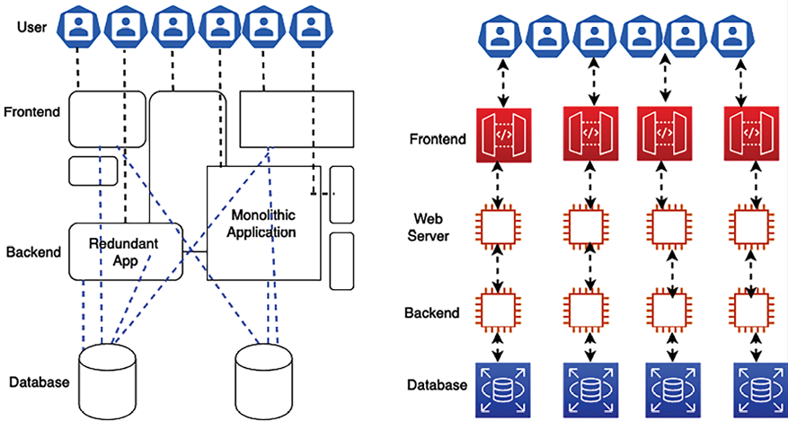
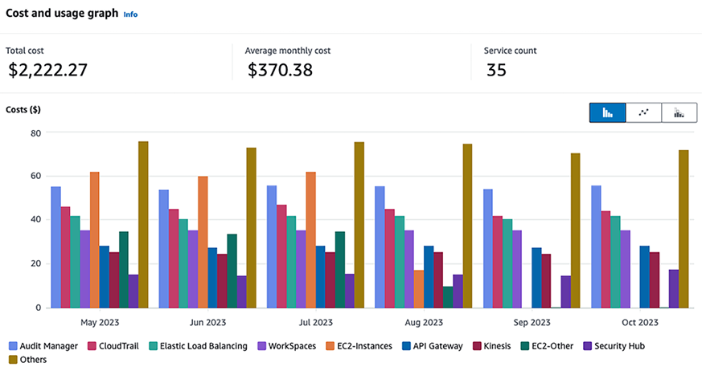

# Cost Considerations

In the previous chapter, you learned about operational excellence and the use of automation to optimize post-production operations, resulting in reduced human error, increased efficiency, and, ultimately, cost savings. Optimizing the cost of your architecture is a vital aspect of maintaining an efficient and sustainable IT environment. This involves understanding and managing the resources that your applications consume and ensuring that you’re only paying for what you need. In this chapter, we’ll explore various strategies for cost optimization, including right-sizing resources, selecting appropriate pricing models, and utilizing budgeting and cost management tools.

One of the primary goals of any business is to increase profitability while serving customers. Cost is a crucial topic of discussion when a project is initiated. Application upgrades and the addition of new product features heavily depend on the funding available. The product’s costs are everyone’s responsibility and need to be considered in every phase of the product life cycle (from planning to post-production). This chapter will help you understand the best practices for optimizing costs for your IT solutions and operations.

**Cost optimization** is a continuous process and needs to be managed carefully without sacrificing customer experience. Cost optimization doesn’t mean cost reduction but it reduces business risk by maximizing **return on investment** (**ROI**). You will need to understand your customers’ needs before planning any cost optimization strategies and act accordingly. Often, if customers are looking for quality, they are willing to pay a higher price.

In this chapter, you will learn about various design principles for the cost optimization of your solution. The cost aspect needs to be considered for every phase and component of the architecture. You will understand the right technology selection to optimize costs at every layer. You will learn about the following best practices of cost optimization in this chapter:

- Design principles for cost optimization
- Understanding techniques for cost optimization
- Driving cost optimization in the public cloud
- Green IT and its influence on cost considerations

By the end of the chapter, you will have learned about various techniques to optimize costs without risking business agility and outcomes. You will have learned different methods to monitor costs and apply governance for cost control. First things first, let’s start with the design principles for cost optimization, which will lay the foundation for building a cost-aware architecture.

# Design principles for cost optimization

Cost optimization includes increasing business value and minimizing risk while reducing business costs. It would be best if you planned your application costs by estimating the budget and forecasting expenditure. To realize cost savings, you need to implement a cost optimization plan and closely monitor your expenditures.

There are several principles that can help you achieve cost optimization; common design principles for this are covered in the following sections. You will find that all cost optimization design principles are closely related and complement each other. Let’s have a look at these.

## Calculating the total cost of ownership

Often, organizations tend to overlook the **total cost of ownership** (**TCO**) and decide based on the upfront cost to acquire software and services, known as **capital expenditure** (**CapEx**). While the upfront cost determination is essential, the TCO matters the most in the long run. The TCO includes both CapEx and **operational expenditure** (**OpEx**), covering all the dimensions of the application life cycle. The CapEx cost consists of the price that organizations pay upfront to acquire services and software, while OpEx includes the cost of the operation, maintenance, training, and retirement of software applications. Consider both CapEx and OpEx costs to help make more strategic decisions while calculating your ROI in the long run.

For example, when you buy a refrigerator that will run 24/7, you look for an energy-saving rating to keep your electricity bill low. You are ready to pay a higher price upfront as you know the total cost over time will be lower due to the savings on your energy bill. Now, let’s take the example of a data center. There is an upfront hardware acquisition cost involved (CapEx). However, the data center setup requires additional ongoing costs (OpEx), which include heating, cooling, rack maintenance, infrastructure administration, security, and so on.

For a typical use case, when you are purchasing and implementing software, consider the following costs to calculate the TCO:

Figure 10.1: TCO for an IT application

Let’s look at this at a more granular level. Each TCO component has the following common costs involved for _off-the-shelf_ software, such as Oracle or an MS SQL database:

Off-the-shelf software refers to pre-built, mass-produced applications that are designed to cater to a wide audience with similar needs, as opposed to custom software that is tailored to meet the specific requirements of a particular business or user.

- **Purchase and setup costs**: These are the upfront costs to acquire the software and the services to deploy it. This includes the following:

  - Software cost includes the software purchase price with user licenses
  - Hardware costs include purchasing a server and storage to deploy the software
  - Implementation costs consist of the time and effort to get the software ready for production
  - Migration costs include moving data to the new system\* **Operational and maintenance costs**: These are the continuous costs to keep the software running for the business use case, including the following:

  - Software maintenance and support
  - Patching and updates, which software vendors often release to fix any potential bugs
  - Custom enhancements to fit software to your organization’s needs
  - Data center cost to maintain the hardware server
  - Security
  - License renewals

- **Human resources and training costs**: These are the overhead costs to train staff to use the software to address business activities. These costs include the following:
  - Application admin staff
  - IT support staff
  - Functional and technical consultants
  - Training and training tools

To optimize costs, you have numerous options, including taking out a subscription for a **Software as a Service** (**SaaS**) product, such as Salesforce’s **customer relationship management** (**CRM**) platform. The SaaS model is per-user subscription-based primarily, so you need to determine whether you are getting the desired cost savings. For a more significant number of users, you can take a hybrid approach and use the cloud to handle your hardware by choosing an **Infrastructure as a Service** (**IaaS**) option and installing off-the-shelf software. Overall, if the software doesn’t meet your requirements, you can build it yourself. In any scenario, calculate the TCO to decide where to make the maximum ROI. Let’s look at budget and forecast planning, which can help to control total costs and achieve ROI.

## Planning the budget and forecast

Every business needs to plan its expenditures and calculate ROI. Budget planning gives guidance to organizations and teams on cost control. Organizations plan a long-term budget for 1 to 5 years, which helps them run the business based on the funding required. This budget then comes down to the individual projects and applications. During solution design and development, the team needs to consider the available budget and plan accordingly. The budget helps to quantify what the business wants to achieve. The forecast provides an estimate of what the company is doing.

Budget planning is important strategic planning in the long run, and the forecast provides an estimate at a more tactical level to decide the business direction. In application development and operation, without a budget and a forecast, you can quickly lose track and overrun estimated costs. These two terms may be confusing, so let’s understand the clear difference between a budget and a forecast:

| **Aspect**                  | **Budget**                                                                                                       | **Forecast**                                                                                                              |
| --------------------------- | ---------------------------------------------------------------------------------------------------------------- | ------------------------------------------------------------------------------------------------------------------------- |
| **Definition**              | A detailed financial plan outlining expected revenues, expenses, and resource allocations for a specific period. | An updated projection of a company’s financial performance based on current trends and near-term expectations.            |
| **Time frame**              | Typically set for a longer term, such as annually.                                                               | More dynamic; updated regularly (monthly or quarterly).                                                                   |
| **Frequency of adjustment** | Adjusted infrequently, maybe once a year or during significant changes.                                          | Updated regularly based on actual business progress and near-term outlook.                                                |
| **Purpose**                 | Used to guide business decisions, strategic planning, and resource allocation.                                   | Used to make informed operational decisions and adjustments based on recent trends and predictions.                       |
| **Performance evaluation**  | Used to determine performance by comparing planned versus actual costs and revenues.                             | Not typically used for performance evaluation against goals but for understanding potential future financial positions.   |
| **Examples**                | Deciding on organization restructuring, planning annual marketing spend, and setting annual sales targets.       | Adjusting staffing levels, modifying marketing strategies based on recent performance, and updating revenue expectations. |

Table 10.1: Budget versus forecast

Forecast information helps you take immediate action, while the budget may become unachievable due to changes in the market. As shown in the following diagram, while you are working on day-to-day solutions, developments based on historic expenditure forecasts can prompt you to adjust the next month’s costs:

Figure 10.2: Forecast report

As shown in the preceding _Cost and usage_ forecast report, if your monthly budget is $450, you will reach your budget by the end of November 2024. Here, the forecast helps you to act and control costs to stay within budget.

In the next section, let’s look at the mechanism to improve cost efficiency by managing demand and services.

## Managing demand and service catalogs

Almost every organization has a centralized IT team that works with internal business partners such as application development and support teams of various business units. The IT team manages the demand for IT infrastructure, including the cost of all software and hardware and support to manage application hosting. Business partners often need a greater understanding of the cost drivers for their IT services. For example, application development teams tend to overprovision their development or test environment, resulting in an additional cost.

You can get demand forecasts from various organizational units in advance, which can help you to better align supply of IT Infrastructure across organization. By consolidating all requirements in one place, an organization can benefit from economies of scale. You might achieve a lower variable cost because a large contract can achieve higher economies of scale. The right demand from all organization units is aggregated, translating into lower prices.

For instance, when leveraging public cloud services such as AWS, GCP, or Azure, businesses have the opportunity to secure more favorable pricing through **private pricing agreements** (**PPAs**) or **enterprise discount programs** (**EDPs**). These agreements are especially beneficial for organizations that commit to larger workloads by consolidating their resources within a single cloud provider. By committing to a certain level of usage or spending, companies can negotiate lower prices, translating into significant cost savings.

Organizations can take one of the following two approaches to manage demand and services:

- **Demand management**: To save costs in your existing IT environments (where you may observe that overspending is prevalent), you can take the _demand-led approach_. It will help in improving cost efficiency in the short term as you introduce a few new services. You can analyze historical data to understand factors that are driving demand and capture cases of overprovisioning. Establish a process between the IT team and business partners to streamline operational costs for IT services.
- **Service catalog management**: If there is a demand for new services and you don’t have much historical data, you can take the _service-led approach_. In this approach, you need to understand the demand for the most frequently used services and create a catalog. For example, suppose the development team asks for a Linux server with a MySQL database to create a dev environment. In that case, the IT team can create a service catalog that helps the dev team acquire a small Linux server and a database server. Similarly, the IT team can identify the most common set of services and attach a granular cost.

Each approach can have significant cost savings in the short and long term. However, these transformations present substantial challenges as you need to change the project planning and approval process. The business and finance teams need to align and understand the clear relationship between business growth and increased IT capacity. The cost model needs to be built around the most efficient approach by combining cloud, on-premises, and off-the-shelf offerings.

## Keeping track of expenditure

You can find the costs of individual systems by tracking expenditures and linking them to the system or business owner. Transparent expenditure data helps identify ROI and reward owners, optimizing resources and reducing cost. It can help you determine the monthly costs for a department or project.

Cost-saving is a shared responsibility, and you need to have a mechanism to hold everyone accountable. Often, organizations introduce a **show-back** or **charge-back** mechanism to share cost responsibility between organizational units.

The centralized billing account informs each organizational unit regarding their expenditure in the **show-back approach** but doesn’t charge the actual amount. Each business unit within an organization manages its budget under a master payee account in the **charge-back approach**. The master account charges back the amount to the business units per their monthly IT resource consumption. These approaches make each organizational unit more cost-aware and responsible in their expenditures.

When implementing cost control for your organization, it is better to start with show-back as a stepping stone and move to charge-back as the organizational model matures.

For each business unit, you should create expenditure awareness by configuring notifications so that teams get an alert as they approach the forecasted or budgeted amount of consumption. Create a mechanism to monitor and control your costs by appropriately assigning them to the right business initiative. Provide visibility to create accountability for cost expenditures for each team. Cost tracking will help you understand team operations.

Each workload is different; you should use the pricing model that suits your workload to minimize costs. Establish mechanisms that ensure business objectives are achieved by applying cost optimization best practices. You can avoid overspending by defining a tagging strategy to link business units with specific expenditures and using the **check-and-balance** approach.

## Continuous cost optimization

If you follow cost optimization best practices, you should have a good cost comparison with existing activity. It’s always possible to reduce the cost of your migrated and matured applications over time. Cost optimizations should not end until the cost of identifying money-saving opportunities exceeds the amount of money you will save. Until that point is reached, you should continually monitor your expenditure and look for new ways to save on costs. You should keep finding an area to save costs by removing idle resources. For instance, consider a scenario where a company uses cloud services for its development, testing, and production environments. By continuously monitoring its cloud expenditure, the company identifies that several instances in the development environment remain underutilized or idle, especially during off-peak hours. To save costs, the company implements a schedule to shut down these instances automatically when they are not in use, such as during nights and weekends. This approach significantly reduces their cloud expenditure as they only pay for the resources when they are actively being used. Over time, this practice of identifying and eliminating idle resources can lead to substantial cost savings, allowing the company to allocate its budget more effectively.

For a balanced architecture in terms of its cost and performance, ensure that the cost paid for resources is well utilized and avoids significantly underutilized IT resources such as server instances.

A biased utilization metric showing exceptionally high or low costs will harm your organization’s business. When organizations evaluate utilization metrics without considering the context, it can lead to skewed interpretations and decisions. For instance, basing infrastructure provisioning on data from peak periods like Black Friday for an e-commerce site can result in significant overprovisioning. During less busy times, this leads to substantial underutilization of resources, which is not cost-effective. It’s crucial to analyze these metrics within the proper context to avoid such pitfalls and ensure that resources are allocated efficiently, aligning with actual demand and not just peak or atypical usage periods. This approach prevents unnecessary expenditure and supports more strategic, effective cost management.

Application-level metrics for cost optimization need to be considered carefully. For example, introduce archival policies to control data storage capacity. To optimize the database, you should check for appropriate database deployment needs, such as whether multi-location deployments for the database are essential or whether provisioned **input/output operations per second** (**IOPS**) are applicable as per your database utilization needs. You can use the SaaS model to help your employees focus on applications and business activities to reduce your administrative and operational overhead.

To identify a gap and apply necessary changes for cost-saving, you should implement resource management and change control processes during the project life cycle. The aim is to help your organization design the architecture as optimally and cost-effectively as possible. Keep looking for new services and features that directly reduce your costs.

In this section, you explored various design principles aimed at cost optimization, starting from effective budget planning to proactive cost monitoring and continuous cost-saving strategies. These principles are essential for ensuring that your architecture not only meets performance and operational requirements but also aligns with financial goals, enabling your organization to maximize the value of its investments and minimize unnecessary expenditures. Let’s learn some techniques that can help you optimize costs and increase ROI.

# Understanding techniques for cost optimization

Enterprises are investing more in technology to gain a competitive edge and keep up with rapid growth. With economic instability, cost optimization becomes an essential but challenging task. Companies spend a lot of time researching and reducing costs in procurement, operations, and vendors. Many companies even share data centers, call centers, and workspaces as a cost-saving method. Sometimes, organizations need more time to upgrade to avoid buying new, expensive hardware.

An organization can save more by looking into its IT architecture across the organization. Improving existing architecture can open doors to bring more opportunities and business to the company, even if it requires a bit of adjustment to the budget. Let’s identify focus areas where companies can save money and gain more revenue with techniques such as moving to the cloud, simplified architecture, virtualization, and shared resources.

## Reducing architectural complexity

Organizations often need a centralized IT architecture, resulting in each business unit trying to build its own set of tools. Lack of overall control causes a lot of duplicate systems and data inconsistency. IT initiatives in individual business units are driven by a short-term goal.

In such cases, business units need to be better aligned with long-term organizational vision, such as the digital transformation of the entire organization. Furthermore, it adds complexity to maintaining and upgrading those systems. A simple step to define standards and avoid duplication can help save costs.

The following diagram shows a complex architecture on the left-hand side, where business units work in their application without standardization, causing duplicate applications with many dependencies—this kind of architecture results in high costs and risks. Any new experiment takes a long time to market, which results in losing the competitive edge. Process standardization, the development of reusable architecture patterns, and the establishment of a suite of shared services collectively provide a comprehensive and flexible framework that supports an agile environment. By applying automation within this framework, organizations can streamline operations, avoid redundant efforts, and significantly reduce costs. This holistic approach not only enhances operational efficiency but also boosts ROI, demonstrating a strategic alignment of architectural practices with business objectives for optimal financial performance.

Figure 10.3: Architectural standardization

The first thing is to eliminate duplication and identify function reuse across the business unit to reduce the architectural complexity. Incorporating all these reusable components across the organization into a service catalog can significantly enhance accessibility and efficiency. A service catalog acts as a centralized repository where teams can find and leverage predefined architecture patterns, services, and resources. During the _gap analysis_ of existing architecture, you will find there is so much code, so many existing components, and a project that can be reused across the organization to support your business requirements. To reduce the complexity of IT architecture, think of an out-of-the-box solution that fits your business needs and provides ROI. Customization should be your last approach if no other option is available.

Any new application needs to have an accessible integration mechanism to interact with the existing system using **RESTful architecture**. Harmonizing the UI design across the application provides a set of standard UI packages that can be reused for any new application.

Similarly, other modules can be reutilized with service-oriented design. You learned about RESTful patterns in _Chapter 4_, _Solution Architecture Design Patterns_; these help you keep all the different pieces of software working separately and still communicating with each other to build an entire system.

In the modular approach, each team is responsible for developing a service that every team across the organization can use to avoid duplication. As an architect, you should help the team create a service-oriented design, where each team handles individual architecture components as a service that can be developed independently. With the help of microservices architecture, you can deploy an entire application modularly. If one component is not working, you can rework it without impacting the whole application. For example, a payment service developed to collect payment from a customer visiting an e-commerce website can also be used to pay vendors in the vendor management system.

Once you set up a centralized IT architecture, taking a modular approach helps you keep the cost down. Empowering your IT architecture team can help align organizational units with the company’s vision and support other parallel projects to follow the overall strategy. It also helps to provide consistency in other critical services that are often overlooked, such as legal, accounting, and human resources.

With the help of the IT architecture team, you can get excellent feedback and ensure that projects are aligned with business needs and requirements. By overseeing the overall architecture across teams, an architect can advise whether any duplicate effort, project, process, or system needs to be aligned with the business need. The centralized architecture will reduce complexity and tech debt, bring more stability, and increase quality. The overall idea of centralized architecture is to increase IT efficiency, so let’s learn more about that.

## Increasing IT efficiency

Nowadays, every company uses and consumes IT resources. Having too many servers, laptops, and software licenses and a high storage capacity consumes a lot of funding. Licenses are one of the resources that are sometimes underused, undiscovered, idle, or installed incorrectly and consume a lot of funding. A centralized IT team can lead the effort for license optimization by keeping track of used software licenses and retiring additional licenses. They can save costs by negotiating a bulk discount with the vendor.

To increase IT efficiency, cancel non-compliant projects that take additional funding and resources. Also, you should help teams revisit the strategy to support or continuously terminate unused and non-aligned projects.

The following methods can be considered for cost optimization:

- Re-evaluate projects with high costs, as they may need to be better aligned with the business vision. Reshape projects with high value but no direct impact on the IT strategy.
- De-prioritize projects with little to no business value, even if aligned with the IT strategy.
- Cancel non-compliant projects with low business value.
- Decommission or retire unused applications.
- Replace old legacy systems by modernizing them to reduce maintenance costs.
- Avoid duplicate projects by reutilizing existing applications.
- Wherever possible, consolidate data and develop an integrated data model. You will learn about maintaining a centralized data lake in _Chapter 12_, _Data Engineering for Solution Architecture_.
- Consolidate vendor procurement across the organization to save IT support and maintenance expenditure costs.
- Consolidate any system that does the same thing as payment and access management.
- Eliminate costly, wasteful, overprovisioned projects and expenditures.

Moving to the cloud can be an excellent consideration for increasing IT resources efficiently and reducing costs. Public cloud providers, such as **Amazon Web Services** (**AWS**), offer a _pay-as-you-go_ model, which means you only pay for what you are using. For example, the developer desktop can shut down during non-working hours and weekends, reducing workspace costs by up to _70%_.

The batch processing system needs to be spin-up only to process jobs and can be shut down immediately afterward. It works just like any electrical appliance that you switch off when not required to save electricity costs.

Applying automation is a great mechanism to increase overall IT efficiency. Automation helps eliminate costly human labor and reduces the time spent performing daily routine jobs without error. Automate things wherever possible to provision servers, run monitoring jobs, and process data.

Make sure to make a suitable trade-off to improve results while deciding to optimize costs. Let’s take an example. If you go to a theme park where you want to go on lots of good rides, you are willing to pay a higher price to see the value of your spending. To attract more customers, if the vendor decides to reduce the price and make adjustments by lowering the number of enjoyable rides, you may go to another theme park as you are looking for a good time. Here, competitors will gain an edge and attract existing customers, while the current vendor will lose business. In this case, cost reduction adds business risk, which is not the right cost-optimization approach.

Your goal should be measurable, and these measures should focus on both business output and the cost of your system. Quantitative measures help you understand the impact of increasing output and reducing costs. The organizational and team-level goals must align with the application’s end users. At the organizational level, the goals will be across organizational business units. At the team level, they will be more aligned with individual systems. For example, you can set up a goal at the business unit level to reduce the cost per transaction by 10% every quarter or 15% every six months. Defining goals ensures that systems improve over their lifetime. Let’s look at how we can apply standardization and governance.

## Applying standardization and governance

Organizations need a strategy to analyze misalignment and overconsumption, reduce complexity, define guidelines to use appropriate and efficient systems, and implement a process wherever it is required. Creating and implementing these guidelines will help companies develop a standard infrastructure and reduce duplicate projects and complexity.

To implement governance, you must set up resource limits across the organization. Putting the service catalog in place with **Infrastructure as Code** (**IaC**) helps ensure teams are not overprovisioned with resources beyond their allocated capacity. You should have a mechanism to quickly understand and take action on business requirements. Consider resource creation and decommissioning when applying resource limits and defining the process to change them.

With IaC, the entire infrastructure setup from networks and servers to databases and application services can be defined in code files using languages like YAML or JSON. These files can then be version-controlled, allowing teams to track changes over time, roll back to previous configurations, and apply the same configurations across different environments, ensuring consistency and reducing configuration drift. Popular tools like Terraform, AWS CloudFormation, and Ansible enable IaC, allowing teams to define IaC and apply these definitions to create or change infrastructure.

Businesses operate multiple applications by various teams. These teams can belong to different business units within their revenue stream. Determining resource costs to the application, business unit, or team drives efficient usage behavior and helps reduce costs. You can define resource capacity based on cost attribution and the group, organization unit, or department requirements. You can use resource tagging and account structuring to organize the cost structure.

As shown in the following screenshot, you can organize your accounts in different **organization units** (**OUs**), such as HR and Finance, and each department under the OU can have its own accounts. For example, here, **HR** has separate accounts for **Payroll** and **Marketing**, while **Finance** has individual accounts for **Sales** and **Marketing**:

Figure 10.4: Enterprise account structure for OUs

You can control costs at each business unit and department level in the preceding account structuring strategy. Adopting a charge-back mechanism for each department increases accountability for costs at a more granular level, which helps to optimize costs.

Account structuring helps you to apply high security and compliance standards across the organization. As each account is linked to a parent account, you can significantly deal with the mass utilization of vendor resources by consolidating expenditures across the organization.

### Resource cost tagging

Almost every public cloud provider provides tagging capabilities out of the box. You can embed server metadata such as the DNS name or hostname for on-premises. Tagging helps you organize costs and define a capacity limit, security, and compliance. It can be an excellent tool for inventory management and keeping an eye on the growing need for resources at every level of the organization.

Resource tagging is a powerful strategy for managing and optimizing costs in cloud computing environments. It involves assigning metadata tags to cloud resources, such as virtual machines, storage instances, or databases, to categorize and track them based on various criteria like project, environment, department, or cost center.

As shown in the following screenshot, to get complete cost visibility and consolidation across resources, you can tag each resource provisioned at the team level, which provides more granular control:

Figure 10.5: Resource tagging for cost visibility

In the preceding diagram, you can see the tagging strategy, which indicates that the given server is for application deployment and is utilized by the development team. The Marketing department of the Finance business unit owns this server. In this way, the organization can get a granular level of cost expenditure visibility, and the team will be more frugal in their spending. However, you can adopt the show-back mechanism at the team level and charge-back mechanisms at the department and business unit levels.

You can define your mechanism for tagging, where you can attach a name and value such as resource name and owner name to any resource. The following screenshot shows the costs sorted by the **aws:createdBy** tag, which helps to determine the cost of each resource that is auto-created by AWS:

Figure 10.6: Resources expenditures dashboard for a cost tag

Business leaders should evaluate the overall requirements to create efficient IT architectures. Collaboration is required to develop a robust IT architecture and define governance across functional teams to set up accountability. Also, set up a standard to review the architecture, create the baseline for any new project initiative, and explain the process to ensure that the system complies with the correct architecture, and identify the route to improvement.

Engage all impacted stakeholders within your business in usage and cost discussions. The CFO and application owners must understand resource consumption and purchasing options. Department owners must understand the overall business model and the monthly billing process. This will help to set the direction for the business units and the whole company.

Make sure third-party vendors are aligned with your financial goals and can adjust their engagement models. Vendors should provide a cost analysis of any application they own and develop. Each team within the organization should be able to translate business, cost, and usage factors from management into system adjustments, which helps the application implement and achieve the company’s desired goals.

## Monitoring cost usage and reports

Accurate cost factors help you to determine the profitability of business units and products. Cost tracking helps you allocate resources in the right places to increase ROI. Understanding cost drivers helps you control your business expenditure.

To optimize costs, you must know your expenditure pattern across the organization. You need to have insights into IT expenditure over time to determine cost-saving opportunities. You can take the required steps for cost optimization and understand the impact by creating a visualization of cost trends, which shows historical costs and forecasts by resources and departments across the organization.

Your team needs to gather data by logging all data points, analyze them with monitoring, and create a visualization report.

You need detailed insights into your workload resource utilization to identify cost-saving opportunities. Cost optimization depends on your ability to forecast future spending and implement methods to align cost and usage as per your forecast. The following are the primary areas where you should have data visualizations for cost-saving:

- Determine the most significant investments in resources
- Analyze and understand your expenditure and usage data
- Budget and forecast
- Receive an alert when you exceed your budgeted or forecasted thresholds

The following report shows resource expenditures in AWS over six months. The visualization shows that the cloud computing server **EC2**, represented by the fifth bar in each month in orange, consumed the highest costs singularly from May 2023 to July 2023. As the business unit can visualize the consistently high cost, it prompts the system admin to look in depth at cost optimization and find idle resources. The admin performed a cleanup by stopping those EC2 servers, which brought down the cost in August and eliminated it completely from September onward:

Figure 10.7: Resource cost and usage report by service

The preceding report helped business owners understand cost patterns and take a reactive approach to cost control. The reactive approach caused hidden costs, which went undetected for a specified period. With the proactive approach, the forecast helped business owners to make a decision ahead of time.

The following report shows monthly cost expenditure in the filled bars and forecast spending in the empty bars with estimated ranges. Looking at the report, you can see that it is likely that costs may increase in the next couple of months, and you can take action to understand cost attributes and control costs:

Figure 10.8: Cost trend and cost forecast report

Monitoring your costs against the budget can give you another proactive measure to control costs. Setting up an alert when expenditure reaches a certain proportion of the budget (50% or 80%) helps you review and adjust your ongoing costs.

In the following report, you can visually determine the current cost against the budgeted cost, which was high a year ago. Based on the following report, IT admins could take action to optimize the cost and bring it down to within the monthly budget.

Figure 10.9: Cost and budget report

Cost and budget reports help you to control costs by taking proactive action. Combining your actual running costs with budgets and forecasts provides a great deal of cost control daily.

You can also set up an alert when your actual cost reaches a certain threshold in the budget or forecast, which alerts you proactively via email or SMS and tells you to take proactive action to control costs.

The following screenshot shows that an alert has been set up for when the estimated cost goes above $500. You can set up multiple alerts to get information when the cost reaches, for example, $300 and $400 of the estimated charge:

Figure 10.10: Alert based on actual cost

One way to control cost is by right-sizing your environment with resource monitoring and triggering alarms for over- or underutilization. Analysis of resources can be performed using monitoring tools such as **Splunk** or **CloudWatch** and custom logs, where customized metrics such as application memory utilization of your system can be monitored to perform right-sizing. Low resource utilization could be a criterion for identifying opportunities for cost optimization. For example, CPU utilization, RAM utilization, network bandwidth, and the number of connections to the application can be analyzed and monitored.

You must be careful when resizing your environment to ensure you are not affecting the customer experience. The following are best practices to apply when you perform right-sizing:

- Make sure monitoring reflects the end-user experience. Select the correct period. For example, performance metrics should cover 99% of the user’s request-response time rather than taking an average response time.
- Select the correct monitoring cycle, such as every hour, day, or week. For example, if you conduct daily analyses, you might miss a weekly or monthly cycle of high utilization and underprovision your system.
- Assess the cost of change against the cost saving. For example, you may have to perform additional testing or engage resources to perform resizing. This cost-benefit analysis will help you assign resources.
- Identify application utilization against your business requirement. For example, look at how many user requests are expected to come by the end of the month or during the peak season. Identifying and optimizing the utilization gap allows you to save costs. To do this, use the right tool that covers all dimensions, from cost-saving to system utilization and the impact on customer experience due to changes, and then utilize reports to understand the business ROI impact due to cost changes. The public cloud follows a different cost model, often an on-demand pay-as-you-go cost structure.

You have to be very diligent when using cloud resources, as every second counts toward your cost, and it can be costly if you overlook cost optimization and monitoring. Let’s learn more about cost optimization in the public cloud.

# Driving cost optimization in the public cloud

Public clouds, such as **AWS**, **Microsoft Azure**, and GCP, provide excellent cost optimization with a _pay-as-you-go_ model. This model allows customers to trade CapEx for variable expenses, paying for IT resources as they consume them. OpEx is usually lower due to economies of scale. It can be cost-effective to be in the cloud and benefit from continued price reductions that occur over time. The other advantage is that you get additional tools and functionality out of the box with a cloud provider such as AWS, which helps you achieve better agility.

You need a different mindset when defining the cloud cost structure model, as it differs from traditional cost models, which most enterprises have been following for decades. You have all the infrastructure available at your fingertips in the cloud, which requires greater control and regulation. Clouds provide several tools for cost governance and regularization. For example, in AWS, you can set up service limits for each account so the development team cannot utilize more than 10 servers, and production can have the required number of servers and databases with a buffer.

All resources are associated with accounts in the cloud, so it’s easy to keep track of IT resource inventories in a single place and monitor their utilization. In addition to that, you get tools to collect data across various IT resources and provide suggestions. As shown in the following screenshot, **AWS Trusted Advisor** crawls through all resources in the account and offers cost-saving recommendations based on resource utilization:

Figure 10.11: Cost-saving suggestions from AWS Trusted Advisor

In the preceding screenshot, AWS Trusted Advisor has detected an idle load balancer and advises shutting it down to save monthly costs of up to $40. Further checks have identified a Lambda function with a high error rate, which needs to be fixed to reduce costs.

The cloud can provide an excellent value proposition for cost-saving. To begin with, you can create a hybrid cloud, where you establish connectivity between your on-premises data center and the cloud. You can move development and test servers to the cloud to determine the cost structure and potential savings. Once you have set up cost governance in the cloud, move more workloads as per the cost-benefit analysis. However, you need to assess your workload and whether it can be moved to the cloud and, if so, define a strategy. You learned about cloud migration in _Chapter 3_, _Cloud Migration and Hybrid Cloud Architecture Design_.

Increasingly, public cloud providers offer managed services, eliminating any infrastructure maintenance costs and overheads for alerting and monitoring configurations. A managed service reduces the total cost of ownership by reducing cost as service adoption increases.

The public cloud offers savings plans or reserved instances, which allow organizations to commit to a certain amount of usage in exchange for a significantly lower price compared to on-demand rates. By analyzing resource usage data, organizations can make informed decisions about purchasing these plans, aligning their commitments with actual usage patterns to maximize cost savings.

Incorporating savings plans into a cloud cost optimization strategy enables organizations to strike a balance between flexibility and cost efficiency. They can retain the pay-as-you-go model’s agility for variable workloads while capitalizing on savings plans for predictable, steady usage, ensuring they optimize their cloud expenditure effectively.

Green IT refers to the environmentally responsible and eco-friendly use of computers and their resources. It encompasses practices like reducing energy consumption, minimizing e-waste, and designing data centers that are less energy-intensive. Let’s learn more about it.

# Green IT and its influence on cost considerations

Green IT, also known as green computing, refers to environmentally sustainable computing or IT. It is the study and practice of using computers and IT resources in a more efficient and environmentally sustainable way. Green IT practices can significantly influence cost considerations in several ways:

- **Energy efficiency**: Utilizing energy-efficient hardware and practices can reduce the power consumption of data centers and IT infrastructure, leading to substantial savings in electricity costs. For example, using Energy Star-rated equipment or optimizing data center layouts for cooling can lower energy bills.
- **Virtualization**: Virtualizing servers and storage can lead to a reduction in physical hardware needs. This reduces energy consumption and costs associated with cooling and minimizes the space required for data centers.
- **Cloud computing**: Moving to cloud services can be more energy-efficient than maintaining on-premises data centers. Cloud providers often have economies of scale and more modern, efficient, and green data centers. This can translate into lower costs for power and cooling and reduced carbon footprints.\* **Hardware recycling and reuse**: Proper IT equipment recycling and reuse can lead to cost savings. Companies can recoup some of their initial investment by recycling or selling old equipment. Additionally, buying refurbished hardware can be significantly cheaper than new purchases.
- **Telecommuting**: Promoting remote work reduces the need for office space, energy consumption, and employee commuting costs. This can result in direct and indirect cost savings for the organization and employees while also benefitting the environment.
- **Electronic document management**: Reducing paper use through electronic document management systems can lead to cost savings on paper, printing, and storage, as well as the environmental benefits of less paper waste.
- **Sustainable IT procurement**: Choosing suppliers and products that prioritize sustainability can result in long-term cost savings. Products designed to be more durable or with longer extended warranties may have higher upfront costs but a lower total cost of ownership over time.
- **Maintenance optimization**: Regular maintenance and updates can extend the life of IT equipment, delaying the need for costly replacements and reducing electronic waste.
- **IT asset disposal**: Efficiently managing IT asset disposal can reduce waste management costs and ensure compliance with environmental regulations, avoiding potential fines.\* **Carbon credits**: By reducing carbon emissions through green IT practices, organizations can earn carbon credits that can be sold or traded, offering a potential revenue stream or savings on carbon taxes.

Green IT can lead to significant cost savings for organizations by reducing energy consumption, minimizing waste, optimizing equipment usage, and improving overall sustainability. These savings often offset the initial investment required to implement green IT initiatives. Let’s look at how cloud providers like AWS can help improve your green IT posture.

## Cost-effective and green application hosting on AWS

A use case for green IT involving AWS might focus on leveraging AWS’s cloud infrastructure to achieve environmental and cost benefits. AWS provides services that support green IT initiatives, such as serverless architectures, energy-efficient data centers, and resource optimization tools. AWS has been proactive in supporting green IT and sustainability goals through various initiatives and services that enable customers to reduce their carbon footprint and optimize energy use.

AWS has launched a customer carbon footprint tool, as shown in the following diagram. This tool provides data visualizations of historical carbon emissions, trends in emissions as the usage of AWS evolves, estimated emissions avoided by using AWS instead of on-premises data centers, and forecasted emissions based on current usage.

Figure 10.12: Carbon footprint report

The preceding report shows the carbon footprint for the last two years, which shows carbon emission consumption and savings. Carbon footprints will change as AWS moves toward 100% renewable energy by 2025 and net-zero carbon by 2040.

AWS has built comprehensive guidance on building sustainable architecture. You can find more details by visiting the sustainability pillar of the AWS Well-Architected Framework here: [https://docs.aws.amazon.com/wellarchitected/latest/sustainability-pillar/sustainability-pillar.html](https://docs.aws.amazon.com/wellarchitected/latest/sustainability-pillar/sustainability-pillar.html).

Suppose you plan to deploy a new web application that expects variable traffic. You can aim to optimize costs and adhere to green IT principles using the following steps:

- **Planning and design**:

  - The company decided to use AWS due to its commitment to sustainability and the energy efficiency of its infrastructure.
  - They opt for a serverless architecture using AWS Lambda for computing, which allows them to run code without provisioning or managing servers. This choice is cost-effective and green since it eliminates the need for underutilized servers.2. **Implementation**:

  - The web application’s frontend is hosted using Amazon S3 and delivered globally via Amazon CloudFront, reducing latency and minimizing the energy required to serve end users by using energy-efficient data centers near the users’ locations to serve content like video and images.
  - The application’s backend is built on AWS Lambda and Amazon DynamoDB, which provides a serverless database solution that automatically scales to match the workload.

- **Optimization**:
  - For continuous integration and deployment, AWS CodePipeline and AWS CodeBuild are used, which helps to avoid the overhead of maintaining dedicated build servers.
- **Monitoring and management**:
  - AWS CloudWatch monitors the application’s performance and resource utilization, ensuring efficient operation.
  - AWS Trusted Advisor recommendations are applied to optimize costs further and ensure the company uses the most efficient resources possible.
- **Cost management**:
  - The company uses AWS Budgets to set cost thresholds and receives alerts if their costs are likely to exceed the budget, allowing them to adjust usage proactively.
  - They use AWS Cost Explorer to analyze and understand their AWS spending and usage over time, ensuring continuous cost optimization.

The company successfully deploys its web application with a scalable and cost-effective infrastructure by leveraging AWS’s serverless services and resource optimization tools. They reduce their carbon footprint by utilizing AWS’s energy-efficient global infrastructure and only consuming computing power when needed, adhering to green IT principles. Additionally, the pay-as-you-go pricing model of AWS services ensures they only pay for the resources they consume, optimizing both costs and energy usage.

AWS can facilitate green IT practices, allowing you to deploy a scalable, high-performance web application while being mindful of environmental impact and operational costs. AWS’s serverless offerings and efficient resource management align with the company’s goal of cost optimization and sustainability.

# Summary

Cost optimization is a continuous effort from application inception (from proof of concept to implementation and post-production). You need to review architecture and cost-saving efforts continuously.

In this chapter, you learned about the various design principles to optimize costs. Before making any purchase decision, you should consider the total cost of ownership for the entire software or hardware life cycle. Budget planning and tracking forecasts help you to stay on the cost optimization path. Always keep track of your expenditures and look for possible opportunities for continuous cost optimization by managing demand without affecting the user experience or business value.

You learned about various cost optimization techniques, including reducing architectural complexity by simplifying enterprise architecture and setting a standard that everyone can follow. It’s recommended to avoid duplication by identifying and consolidating idle and repeated resources to negotiate the bulk purchase cost. Apply standardization across the organization to limit resource provision and develop a standard architecture. Tracking data for your actual costs against budgets and forecasts can help you to take proactive action. You learned about various reports and alerts that can help control costs. You also learned about cost optimization in the cloud, which can help you further optimize value. Sustainability is an essential aspect of today’s IT workload and you learned about how green IT is influencing cost considerations. You also learned about building and tracking green IT consumption using AWS.

Automation and agility are major factors that increase resource efficiency, and DevOps can provide a great deal of automation. In the next chapter, you will learn about various DevOps components and strategies to efficiently deploy your workload in the most automated way.
