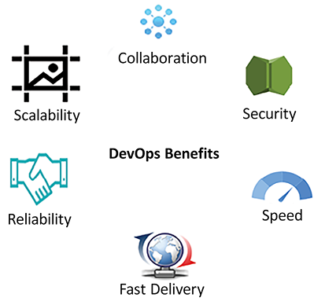
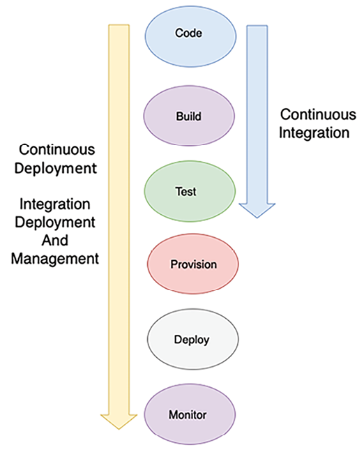
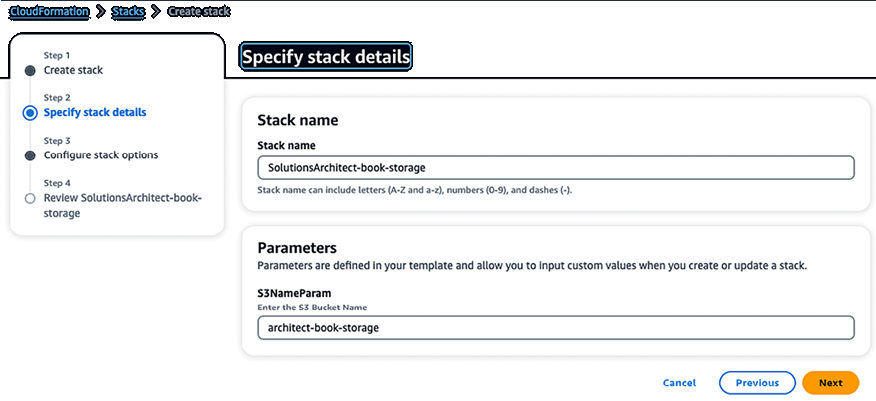
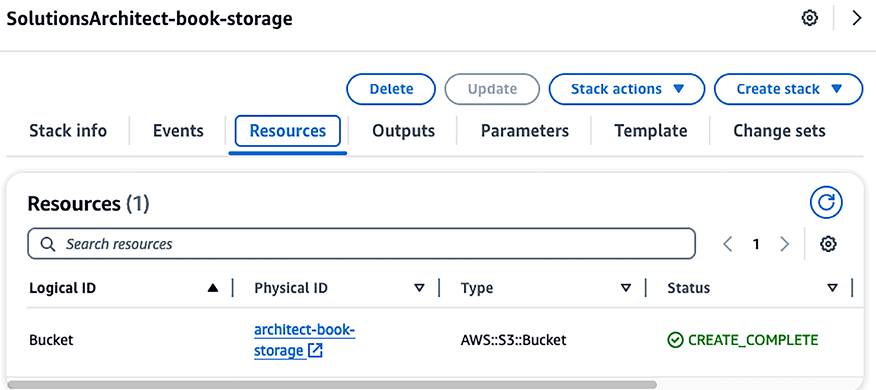
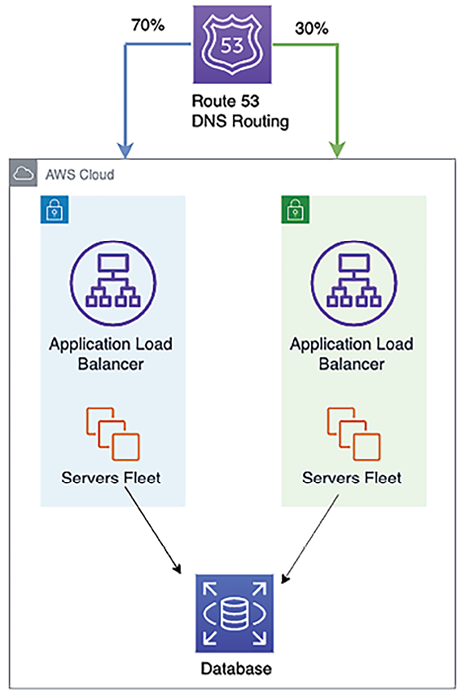
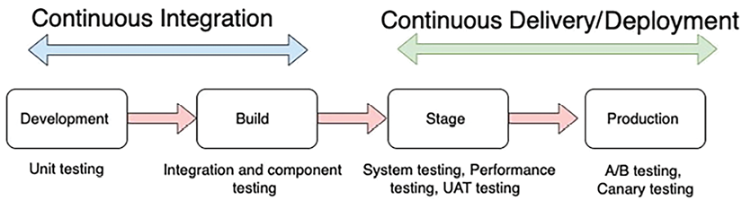
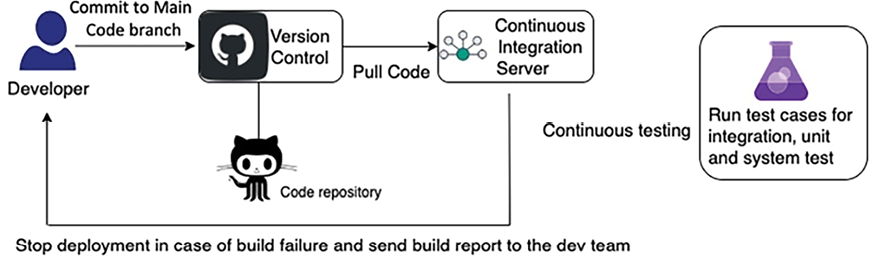
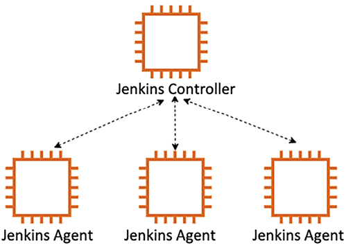
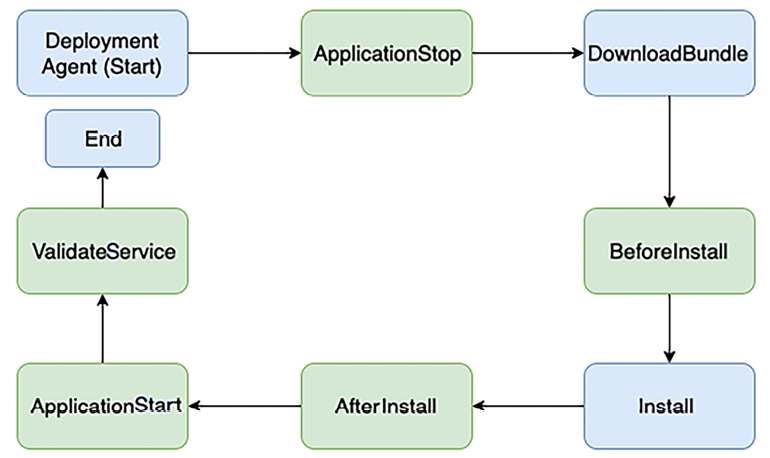
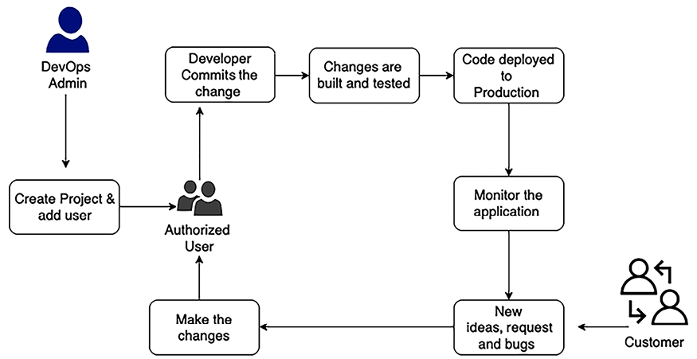

# DevOps and Solution Architecture Framework

In the previous chapter, you explored creating a cost-aware architecture and methods to continually optimize costs without compromising performance. Automation and collaboration across teams are crucial for developing robust applications and saving costs. This chapter will delve into DevOps, a methodology that fosters collaboration between development and operations teams while automating the processes of application deployment and monitoring.

In traditional environments, the development team and the IT operations team work in silos. The development team gathers requirements from business owners and develops the applications. System administrators are solely responsible for operations and for meeting uptime requirements. These teams generally have little direct communication during the development life cycle, and each team rarely understands the processes and needs of the other team.

Each team has its own tools, processes, and redundant approaches, sometimes resulting in conflict. For example, the development and **quality assurance** (**QA**) teams could test the build on a specific **operating system** (**OS**) patch. However, the operations team deploys the same build on a different OS version in the production environment, causing issues and delays in the delivery.

DevOps is a methodology that promotes collaboration and coordination between developers and operational teams to deliver products or services continuously. This approach is constructive in organizations where the teams rely on multiple applications, tools, technologies, platforms, databases, devices, and so on in the process of developing or delivering a product or service. Although there are different approaches to the DevOps culture, all are about achieving a common goal. DevOps is about delivering a product or service in the shortest amount of time by increasing operational efficiency through shared responsibilities.

Security is the top priority for any application, and security incidents can have a severe business impact. Despite this, security is often an afterthought in the deployment process, treated as a separate concern handled reactively by specialized security teams within an organization.

Embedding security in the DevOps process as a crucial aspect can be achieved by implementing DevSecOps. DevSecOps is about integrating security early and throughout the software development life cycle, thus breaking down silos and fostering collaboration between development, operations, and security teams. DevSecOps helps deliver without compromising quality, reliability, stability, resilience, or security.

In this chapter, you will learn about the following DevOps topics:

- Introducing DevOps
- Understanding the components of DevOps
- Continuous integration/Continuous deployment (CI/CD)
- Introducing DevSecOps in security
- Combining DevSecOps and CI/CD
- Implementing a CD strategy
- Implementing continuous testing in the CI/CD pipeline
- Using DevOps tools for CI/CD
- Implementing DevOps best practices
- Building DevOps and DevSecOps in the cloud

By the end of this chapter, you will have learned about the importance of DevOps in application deployment, testing, and security. You will also learn about the best practices of DevOps and DevSecOps and their different implementation tools and techniques.

# Introducing DevOps

In a **DevOps** (short for **development and operations**) approach, the development and operations teams work collaboratively during the build and deployment phases of the software development life cycle, sharing responsibilities and providing continuous feedback. The software builds are tested frequently throughout the build phase in production-like environments, allowing the early detection of defects.

DevOps is a combination of culture and practices. It requires organizations to change their culture by breaking down the barriers between all teams in the product development and delivery life cycle. DevOps is not just about development and operations; it involves the entire organization, including management, business/application owners, developers, QA engineers, release managers, the operations team, and system administrators.

Speed enables organizations to stay ahead of the competition and address customer requirements quickly. Good DevOps practices encourage software development engineers and operations professionals to work better together. This results in closer collaboration and communication, leading to a shorter **time to market**, reliable release, improved code quality, and better maintenance.

Sometimes with DevOps, you will find that a software application’s development and operations are handled by a single team, where engineers work across the entire application life cycle. Such a team needs to develop a range of skills that are not limited to a single function. Application testing and security teams may also work more closely with the operations and development teams from the inception to the production launch of an application.

Developers benefit from feedback provided by the operations teams and create strategies for testing and deployment.

System administrators don’t have to implement defective or untested software in production environments because they participate in the _build phase_. As all software development and delivery life cycle stakeholders collaborate, they can also evaluate the tools they intend to use at each step of the process, verify compatibility between the devices, and determine whether any tools can be shared across the teams.

DevOps is gaining popularity as the preferred operating culture, especially for organizations that leverage cloud or distributed computing technologies. Let’s learn about some of the various benefits of DevOps and why it is essential for your application workload.

## Understanding the benefits of DevOps

The goal of DevOps is a **CI/CD** model that can be utilized to make the software development life cycle repeatable, reliable, stable, resilient, and secure. These characteristics of the model help in improving operational efficiency. To achieve this goal, teams must collaborate and participate in the development and delivery process. All technical team members should have experience with the processes and tools involved in the development pipeline.

A mature DevOps process provides a number of benefits, as shown in the following diagram:

Figure 11.1: Benefits of DevOps

The benefits provided by DevOps are elaborated on here:

- **Speed**: Releasing product features faster helps to accommodate your customers’ changing business needs and expand your market. A DevOps model enables an organization to achieve results faster.
- **Fast delivery**: DevOps processes facilitate efficiency by automating end-to-end pipelines, from code build to code deployment and production launch. Rapid delivery helps you to innovate faster. The faster release of bug fixes and features allows you to gain a competitive edge.
- **Reliability**: DevOps processes provide checks to ensure delivery quality and the safety of rapid application updates. DevOps practices like CI and CD embed automation testing and security checks for a positive end-user experience.
- **Scalability**: DevOps helps to scale your infrastructure and application on an on-demand basis by including automation everywhere.
- **Collaboration**: The DevOps model builds a culture of ownership whereby the teams consider their actions. The operations and dev teams work together in a shared responsibility model. Collaboration simplifies the process and increases efficiency.
- **Security**: In an agile environment, frequent changes require stringent security checks. The DevOps model automates security and compliance best practices, monitors them, and takes corrective action in an automated way.

Teams take full ownership of the services they deliver, often beyond the traditional scope of their roles, and develop thinking from a customer point of view to solve any issue. Let’s look at understanding the different components of DevOps processes.

# Understanding the components of DevOps

DevOps tools and automation bring together development and system operations. The following are the critical components of a DevOps practice:

- CI/CD
- Continuous monitoring and improvement
- Infrastructure as code
- Configuration management

A common best practice across all the elements is **automation**. Automation can involve scripts, templates, and other tools. In a thriving DevOps environment, infrastructure is managed as code. Automation enables DevOps teams to set up and tune test and production environments rapidly. Let’s explore more details about each component.

## Continuous integration/Continuous deployment

In **CI**, developers commit code frequently to a code repository. The code is built frequently. Each build is tested using automated unit tests and integration tests. In **CD**, you go further and frequently deploy your code in production. Builds are deployed to test environments and are tested using automated and possibly manual tests. Successful builds pass tests and are deployed to staging or production environments.

The following diagram illustrates the impact of CI versus CD in the software development life cycle:

Figure 11.2: CI/CD

As shown in the preceding diagram, CI refers to the software development life cycle’s building and unit testing stages. Every update that is committed in the code repository creates an automated build and test. The CD is an essential aspect of CI that extends the CI process further to deploy the build in production. In CI/CD practices, several people work on the code. They all must use the latest working build for their efforts. Code repositories maintain different versions of the code and also make the code accessible to the team. You check out the code from the repository, make changes, write new code in your local copy, compile and test your code, and frequently commit your code back to the main repository. In CI/CD, software development life cycle phases such as code, build, deploy, and test are automated using the DevOps pipeline.

CI automates most of the software release process. It creates an automated flow that builds, tests, and then stages the update. However, a developer must trigger the final deployment to a live production environment that is not automated. It expands upon CD by deploying all code changes to testing and/or production environments after the build stage. Developers will always have a tested and deployment-ready build if CD is implemented correctly.

The following diagram illustrates everything related to the automation of an application, ranging from code commits into a code repo to the deployment pipeline. It shows an end-to-end flow from the build to the production environment, where the developer checks the code change into the code repository, which the CI server pulls. The CI server triggers the build to create a deployment package with new application binaries and corresponding dependencies. These new binaries are deployed in a targeted development or testing environment. Binaries also get checked into the artifact repository for safe version-controlled storage:

Figure 11.3: CI/CD for DevOps

A robust CD pipeline also automates the provisioning of infrastructure for testing and production environments and enables the monitoring and management of test and production environments. CD does not mean that every change committed by the developer goes into production. Instead, it means that every change is _ready_ to go into production. When the changes are staged and tested in the stage environment, a manual approval process initiates and gives a green signal to deploy to production. Thus, in CD, deploying to production becomes a business decision and is still automated with tools.

## Continuous monitoring and improvement

Continuous monitoring helps us to understand the impact of application and infrastructure performance on the customer. You can learn how code changes impact users by analyzing data and logs. Active monitoring is essential in the era of 24/7 services and constant updates to applications and infrastructure.

You can proactively monitor services by creating alerts and performing real-time analysis. You can track various metrics to monitor and improve your DevOps practice.

Examples of DevOps-related metrics are as follows:

- **Change volume**: This is the number of user stories developed, the number of lines of new code, and the number of bugs fixed.
- **Deployment frequency**: This indicates how often a team is deploying an application. This metric should generally remain stable or show an upward trend.
- **Lead time from development to deployment**: The time between the beginning of a development cycle and the end of deployment can be used to identify inefficiencies in the intermediate steps of the release cycle.
- **Percentage of failed deployments**: The percentage of failed deployments, including the number of deployments that resulted in outages, should be low.
- This metric should be reviewed in conjunction with the change volume. Analyze potential points of failure if the change volume is low but the number of failed deployments is high.
- **Availability**: Track how many releases caused failures that possibly resulted in violations of **service-level agreements** (**SLAs**). What is the average downtime for the application?
- **Customer complaint volume**: The number of complaint tickets filed by customers indicates the quality of your application.
- **Percentage change in user volume**: The number of new users signing up to use your application and the resulting increase in traffic can help you scale your infrastructure to match the workload.

After your deploy builds to the production environment, monitoring your application’s performance is essential. As we discussed automating environments, let’s explore **Infrastructure as code** (**IaC**) in detail.

## Infrastructure as code

Provisioning, managing, and even deprecating infrastructure is a costly activity in terms of human effort. Furthermore, errors can be made by repeated attempts to build and modify environments manually. Whether working from prior experience or a well-documented runbook, the tendency for a human to make a mistake is a statistical probability.

We can automate the task of creating a complete environment. Task automation can help to complete repetitive tasks and provide significant value effortlessly.

With IaC, we can define our infrastructure in the form of **templates**. A single template may consist of a part or the entirety of an environment. More importantly, this template can be used repeatedly to create the same environment again.

In IaC, infrastructure is spun up and managed using code. An IaC model helps you interact with infrastructure programmatically at scale and avoid human errors by automating resource configuration. That way, you can work with infrastructure the same way you would with code by using code-based tools. As the infrastructure is managed through code, the application can be deployed using a standardized method, and any patches and versions can be updated repeatedly without errors.

Some of the most popular IaC scripting tools are Ansible, Terraform, Azure Resource Manager, Google Cloud Deployment Manager, Chef, Puppet, AWS **Cloud Development Kit** (**CDK**) and AWS CloudFormation.

The following is a code sample from AWS CloudFormation, which provides IaC capability to automate infrastructures on the AWS cloud platform.

    AWSTemplateFormatVersion: '2010-09-09'
    Description: 'Create an S3 Storage with a parameter to choose own bucket name.'
    Parameters:
    S3NameParam:
    Type: String
    Default: 'architect-book-storage'
    Description: 'Enter the S3 Bucket Name'
    MinLength: '5'
    MaxLength: '30'
    Resources:
    Bucket:
    Type: 'AWS::S3::Bucket'
    DeletionPolicy: Retain
    Properties:
    AccessControl: Private
    BucketName:
    Ref: S3NameParam
    Tags:
    - Key: 'Name'
    Value: 'MyBucket'
    Outputs:
    BucketName:
    Description: 'BucketName'
    Value:
    Ref: S3NameParam

The preceding code creates Amazon S3 object storage with an option for the user to provide their choice of storage name, as shown below:

Figure 11.4: IaC using AWS CloudFormation

After execution of the code, the Amazon S3 bucket gets created, as you can see in **Resources**:

Figure 11.5: Automated AWS S3 object storage creation using AWS CloudFormation

Multiple teams can use the provided code to create any amount of Amazon S3 storage. As data is so essential, the admin chose to add bucket `"DeletionPolicy": "Retain,"` which ensures storage doesn’t get deleted when infrastructure comes down and that data is safe.

You can see how you can implement standardization, consistency, and compliance across organizations using IaC. Configuration management is another vital aspect of the DevOps process. Let’s learn more about it.

## Configuration management

**Configuration management** (**CM**) is the process of using automation to standardize resource configurations across your entire infrastructure and applications. CM tools such as Chef, Puppet, and Ansible can help you manage IaC and automate most system administration tasks, including provisioning, configuring, and managing IT resources.

By automating and standardizing resource configurations across the development, build, test, and deployment phases, you can ensure consistency and eliminate failures caused by misconfiguration. CM can also increase the productivity of your operations by allowing you to deploy the same configuration to hundreds of servers automatically at the push of a button. CM can also be leveraged to deploy changes to configurations.

Although you can use registry settings or databases to store system configuration settings, a CM application allows you to maintain version control as well, in addition to storage. CM is also a way to track and audit configuration changes. If necessary, you can even maintain multiple configuration settings versions for various software versions.

CM tools include a controller machine that manages server nodes. For example, Chef requires a client agent application installed on each server to manage, and a master Chef application is installed on the controller machine. Puppet also works the same way with a centralized server. However, Ansible has a decentralized approach that doesn’t require installing agent software on the server nodes.

The following table shows a high-level comparison between the various popular configuration management tools:

| **Aspect**                | **Ansible**                                                                    | **Puppet**                                 | **Chef**                                                                                 |
| ------------------------- | ------------------------------------------------------------------------------ | ------------------------------------------ | ---------------------------------------------------------------------------------------- |
| **Mechanism**             | Controller machine applies changes to servers using **Secure Shell** (**SSH**) | Master synchronizes changes to Puppet node | The Chef workstation looks for changes in Chef servers and pushes them to the Chef node. |
| **Architecture**          | Any server can be the controller                                               | Centralized control by the Puppet master   | Centralized control by Chef server                                                       |
| **Script Language**       | YAML                                                                           | Domain-specific on Ruby                    | Ruby                                                                                     |
| **Scripting Terminology** | Playbook and roles                                                             | Manifests and modules                      | Recipes and cookbooks                                                                    |
| **Test Execution**        | Sequential order                                                               | Non-sequential order                       | Sequential order                                                                         |

Table 11.1 – Popular CM tools comparison chart

CM tools provide a domain-specific language and set of features for automation. Some of these tools have a steep learning curve whereby the team has to learn the tool. AWS provides a managed platform called OpsWorks to manage Chef and Puppet in the cloud. It provides various attributes to manage IT infrastructure through automation, as shown below:

Figure 11.6: AWS OpsWorks service capabilities for managed Chef and Puppet

Security has become a priority for any organization, so complete security automation is the need of the hour. Organizations are moving to tight security implementations and monitoring to avoid human error, using the DevOps process popularly known as **DevSecOps**. In the next section, let’s explore **DevSecOps** (short for **development, security, and operations**).

# Introducing DevSecOps for Security

We are now more focused on security than ever. In many situations, security is the only way to win customer trust. DevSecOps is about the automation of security and the implementation of security at scale. The development team constantly makes changes, and the DevOps team publishes them in production (changes are often customer-facing). DevSecOps ensures application security in the overall process.

DevSecOps is not there to audit code or CI/CD artifacts. Organizations should implement DevSecOps to enable speed and agility, but not at the expense of validating security which slows down the development and deployment process. The power of automation is in increasing product feature launch agility while implementing the required security measures. A DevSecOps approach results in built-in security; security is not applied only as an afterthought. DevOps is about adding efficiency to speed up the product launch life cycle, while DevSecOps validates all building blocks without slowing the life cycle.

To institute a DevSecOps approach in your organization, start with a solid DevOps foundation across the development environment, as security is everyone’s responsibility. It would be best to embed security in the architecture design from inception to create collaboration between development and security teams. Automate continuous security testing and build it into the CI/CD pipeline to avoid any security gaps. To keep track of any security breach, extend monitoring to include security and compliance by monitoring for drift from the design state in real time. Monitoring should enable alerting, automated remediation, and removal of non-compliant resources.

Codifying everything is an essential requirement that opens up infinite possibilities. DevSecOps aims to keep the pace of innovation, which should meet the pace of security automation. A scalable infrastructure needs scalable security, requiring automatic incident response remediation to implement continuous compliance and validation.

# Combining DevSecOps and CI/CD

A DevSecOps practice must be embedded with every CI/CD pipeline step. DevSecOps ensures the security of the CI/CD pipeline by managing the proper access and roles assigned to each server and making sure the build servers, such as Jenkins, are hardened to be protected from any security glitch. In addition to that, we need to ensure that all artifacts are validated, and code analysis is in place.

It’s advisable to be ready for incident response by automating continuous compliance validation and incident response remediation. For instance, if an organization needs to comply with the Payment Card Industry Data Security Standard (PCI-DSS), continuous compliance validation would involve setting up automated tools and processes to constantly check that the handling, processing, and storage of credit card information meet PCI-DSS requirements.

The following diagram provides us with multiple stages to test security boundaries and catch security issues and ensure compliance with policies as early as possible:

Figure 11.7: DevSecOps and CI/CD

At each integration point, you can identify different issues, as illustrated in the preceding diagram:

- In the **Code** phase, scan all code to ensure no secret or access key is hardcoded between code lines.
- During the **Build** phase, include all security artifacts, such as the encryption key and access token management, and tag them for easy identification.
- During the **Test** phase, scan the configuration to make sure all security standards are met by test security.
- In the **Deploy** and **Provision** phases, ensure all security components are registered. Perform a checksum to ensure no changes in the build files. A checksum is a technique used to determine the authenticity of received files. Operating systems provide a `checksum` command to validate the file and ensure no changes are made during file transfer.
- Monitor all security standards during the **Monitor** phase. Perform continuous audits and validation in an automated way.

You can integrate multiple tools into DevSecOps pipelines to identify security vulnerabilities at various stages and aggregate the vulnerability findings.

**Application security testing** (**AST**), which involves using tools to automate the testing, analysis, and reporting of security vulnerabilities, is a critical component of application development. AST can be broken down into the following four categories to scan security vulnerabilities in software applications:

- **Software composite analysis** (**SCA**): SCA evaluates the open-source software’s security, license compliance, and code quality in a codebase. SCA attempts to detect publicly disclosed vulnerabilities contained within a project’s dependencies. Popular SCA tools are OWASP Dependency-Check, Synopsys’ Black Duck, WhiteSource, Synk, and GitLab.
- **Static application security testing** (**SAST**): SAST involves scanning an application’s code prior to compilation. These tools provide developers with immediate feedback during the coding process, allowing for the early correction of issues before the code build phase. As a white-box testing method, SAST analyzes the source code to identify vulnerabilities that could make applications prone to attacks. Its key advantage is its integration early in the DevOps cycle, during the coding stage, as it doesn’t require a functioning application or code execution. Popular SAST tools include SonarQube, PHPStan, Coverity, Synk, Appknox, Klocwork, CodeScan, and Checkmarx.
- **Dynamic application security testing** (**DAST**): DAST identifies security vulnerabilities by mimicking external attacks on an application while it is running. It assesses the application from the outside, probing exposed interfaces for vulnerabilities. Known as black-box security testing or a web application vulnerability scanner, DAST tools include OWASP ZAP, Netsparker, Detectify Deep Scan, StackHawk, Appknox, HCL AppScan, GitLab, and Checkmarx.
- **Interactive application security testing** (**IAST**): IAST examines code for security vulnerabilities while the application is actively being tested or used, thus reporting issues in real time without causing delays in the CI/CD pipeline. IAST tools are typically implemented in QA environments alongside automated functional tests. Notable IAST tools are GitLab, Veracode, CxSAST, Burp Suite, Acunetix, Netsparker, InsightAppSec, and HCL AppScan.

You will learn about integrating some of the above tools in the DevOps pipeline later in the chapter, under the _Building DevOps and DevSecOps in the cloud_ section. DevSecOps CI/CD confirms that the code is validated against the corporate security policy.

It helps to avoid any infrastructure and application failure in later deployment due to different security configurations. DevSecOps maintains agility and ensures security at scale without affecting DevOps’ pace of innovation. Let’s learn about the CD strategy in the DevOps pipeline.

# Implementing a CD strategy

CD provides seamless migration of the existing version of an application to the new version. Some of the most popular techniques to implement through CD are as follows:

- **In-place deployment**: Update application on a current server
- **Rolling deployment**: Gradually roll out the new version in the existing fleet of servers
- **Blue-green deployment**: Gradually replace the existing server with the new server
- **Red-black deployment**: Instant cutover to the new server from the existing server
- **Immutable deployment**: Stand up a new set of servers altogether

Let’s explore each option in more detail.

## In-place deployment

In-place deployment is a method of rolling out a new application version on an existing fleet of servers. The update is done in one deployment action, requiring some downtime. Hardly any infrastructure changes are needed for this update. There is also no need to update existing **Domain Name System** (**DNS**) records. The deployment process itself is relatively quick. If the deployment fails, redeployment is the only option for restoration.

As a simple explanation, you are replacing the existing application version (v1) on the application infrastructure with the new version (v2). In-place updates are low-cost and fast to deploy.

## Rolling deployment

With a rolling deployment, the server fleet is divided into groups, so it doesn’t need to be updated simultaneously. The deployment process runs old and new software versions on the same server fleet but with different subgroups. A rolling deployment approach helps to achieve zero downtime. If a new version deployment fails, then only a subset of servers is impacted from the entire fleet, and the risk is minimal because half of the fleet will still be up and running. A rolling deployment helps to achieve zero downtime; however, deployment time is little more than in-place deployment.

A rolling deployment not only helps achieve zero downtime, enhancing the user experience, but it is also cost-neutral in terms of additional resource allocation. Unlike blue-green deployments that require doubling the environment for a period, rolling deployments update existing resources one by one, avoiding the need for extra infrastructure. While the deployment time might be slightly longer compared to in-place deployments, this method doesn’t incur extra costs from provisioning additional resources, making it an efficient strategy for continuous delivery without impacting your budget. Let’s learn about blue-green deployment now.

## Blue-green deployment

The idea behind blue-green deployment is that your blue environment is your existing production environment carrying live traffic. In parallel, you provide a green environment, which is identical to the blue environment, other than having the new version of your code. When it’s time to deploy, you route production traffic from the blue to the green environment. If you encounter any issues with the green environment, you can roll it back by reverting traffic to the original blue environment. DNS cutover and swapping auto-scaling groups are the two most common methods to re-route traffic in blue-green deployment.

Using auto-scaling policies, you can gradually replace existing instances with instances hosting the new version of your application as your application scales out. This option is best used for minor releases and small code changes. Another option is to leverage DNS routing to perform sophisticated load balancing between different versions of our application.

As illustrated in the following diagram, after creating a production environment that hosts the new version of our application, you can use the DNS route to shift a small portion of traffic to the new environment:

Figure 11.8: Blue-green deployment DNS gradual cutover

Test the green environment with a fraction of production traffic, called **canary analysis**. If the environment has functional issues, you can immediately tell and switch traffic back before impacting your users significantly. Continue to gradually shift traffic, testing the ability of the green environment to handle the load. Monitor the green environment to detect issues, providing an opportunity to change traffic back, thus limiting the blast radius. Finally, decommission the blue environment and release the resources when all the metrics are correct.

Blue-green deployment helps to achieve zero downtime and provides easy rollback. You can customize the time to deploy as per your needs. However, these zero downtimes do come with a cost consideration as this approach requires maintaining two identical production environments, one active (blue) and one idle (green). The need to duplicate the environment means higher operational costs due to the additional resources required. However, this cost is often justified by the value it adds in terms of risk mitigation and uninterrupted user experience.

## Red-black deployment

Before standing up a new version of a system in red-black deployment, perform canary testing. The canary replaces around 1% of its existing production system with the latest version of the application and monitors the newest version for errors. The system is deemed ready for deployment if the canary clears this initial test. A new system version stands up alongside the old version in preparation for the switchover. The initial capacity of the new system is set manually by examining how many instances are currently running in production and setting this number as the desired capacity for the new auto-scaling group. Once the new system is up and running, both systems are red. The current version is the only version accepting traffic.

The system is then cut over from the existing version to the new version using the DNS service. At this point, the old version is regarded as black; it is still running but is not receiving any traffic. If any issues are detected with the new version, reverting becomes as simple as pointing the DNS server back to the old version’s load balancer.

Red-black deployment is also known as **dark launch** and is slightly different from blue-green deployment. In red-black deployment, you do a sudden DNS cutover from the old version to the new version, while in blue-green deployment, the DNS gradually increases traffic to the new version. Blue-green deployments and dark launches can be combined to deploy both versions of software side by side. Two separate code paths are used, but only one is activated. A feature flag activates the other code path. This deployment can be used as a beta test where you can explicitly enable the new features.

Red-black deployment, similar to blue-green deployment, involves running two identical environments to ensure zero downtime and facilitate easy rollbacks. The cost implications are primarily associated with the need to double resources during the deployment phase. You’ll have a “red” environment (the current live version) and a “black” environment (the new version). Both environments must be fully operational, which effectively doubles the resource requirements—including compute, storage, and network resources—during the transition period. While this approach significantly reduces deployment risks and provides a seamless user experience, the duplicated environment leads to increased costs. However, since the additional resources are only needed for the duration of the deployment window, this cost is temporary and can be considered an investment in stability and reliability.

## Immutable deployment

An immutable or disposable upgrade is more straightforward if your application has unknown dependencies. An older application infrastructure that has been patched and re-patched over time becomes increasingly difficult to upgrade. This type of upgrade technique is more common in an immutable infrastructure.

During the new release, a new server instance set is rolled out by terminating older instances. For disposable upgrades, you can set up a cloned environment with deployment services such as Chef, Puppet, Ansible, and Terraform or use them combined with an auto-scaling configuration to manage the updates.

In addition to downtime, you must consider the cost while designing your deployment strategy. Consider the number of instances you need to replace and your deployment frequency to determine the cost. Use the approach that best fits, taking your budget and downtime into consideration.

In this section, you learned about various CD strategies that help make your application release more efficient and hassle-free. Let’s see the best practices for choosing the right deployment type.

# Best practices for choosing the right deployment strategy

Choosing the right deployment strategy is crucial for successful application updates and a seamless user experience. Here are the best practices for choosing among the various deployment strategies:

- **In-place deployment**: In-place deployment is ideal for scenarios where simplicity is key and the application is relatively small or has a limited user base. For instance, updating a company’s internal tool with a small team fits this approach well. It involves updating the application on the current server, but it’s important to note that it can cause downtime. This strategy is not the best fit for large-scale or high-availability applications. A notable example would be updating a small-scale web service overnight with low user traffic. It’s crucial to have a rollback strategy in case the update fails to restore the previous version and minimize disruption quickly.\* **Rolling deployment**: Rolling deployment is suitable for applications that need minimal downtime but don’t require additional resources. This approach updates the application gradually across the existing fleet of servers. An example would be deploying an update to an e-commerce website’s servers in stages, ensuring that only a portion of users experience any potential issues at a time. However, this method is unsuitable for applications that cannot simultaneously handle different versions. Continuous monitoring of application performance during the deployment is key to addressing issues as they arise.
- **Blue-green deployment**: Blue-green deployment is best for critical applications where zero downtime is essential. A financial services company might use this strategy to update its customer-facing application. Once the green environment is thoroughly tested and ready, traffic is switched from blue to green. This method requires double the resources but offers a seamless user experience and quick rollback capability. It’s crucial to ensure that load balancing and DNS switching mechanisms are robust and reliable.
- **Red-black deployment**: Red-black deployment is similar to blue-green but focuses on a faster cutover to the new version. It is particularly effective for quickly releasing new versions and is often used in containerized environments. For example, a media streaming service might deploy a new version of its platform using this strategy, ensuring immediate availability of new features to all users. While it offers rapid release and immediate switching, thorough testing of the new version is crucial as rollback involves reverting to the old environment.
- **Immutable deployment**: Immutable deployment ensures consistency and reliability, especially in cloud environments. Each deployment involves setting up new servers, guaranteeing a predictable and stable state. This approach could benefit an application with complex dependencies, as it avoids the “configuration drift” seen in long-lived environments. This strategy requires efficient management of infrastructure resources, as it involves provisioning new servers and decommissioning old ones with each release.

In each of these strategies, it’s important to assess factors like the application’s complexity, scale, user base, and the impact of potential downtime.

Additionally, resource availability, infrastructure costs, and the application’s criticality should guide the deployment strategy choice. Regularly updating and refining the deployment approach in line with technological and organizational changes is also key to maintaining an effective deployment process.

You need to perform application testing at every step for high-quality delivery, which often requires significant effort. A DevOps pipeline can help you automate the testing process and increase the quality and frequency of feature releases. Let’s learn more about continuous testing in the CI/CD pipeline.

# Implementing continuous testing in the CI/CD pipeline

DevOps is key for continually changing business scenarios based on customer feedback, demand for new features, or shifts in market trends. A robust CI/CD pipeline ensures further features/feedback are incorporated in less time, and customers can use the new features faster.

With frequent code check-ins, having a good testing strategy baked into your CI/CD pipeline ensures you close that feedback loop with quality. Continuous testing is essential in balancing the CI/CD pipeline. While adding software features rapidly is good, ensuring that the features adhere to good quality standards is achieved by continuous testing.

Unit tests form the most significant amount of your testing strategy. They typically run on the developer’s machine and are the fastest and cheapest. A general rule of thumb is to incorporate 70% of your testing efforts in unit testing. Bugs caught at this stage can quickly be fixed with fewer complexities.

The developer often performs unit tests, and once the code is ready, it is deployed for integration and system testing. These tests require their own environments and sometimes separate testing teams, which makes the testing process costlier. Once the team ensures that all intended features work as expected, the operations team needs to run performance and compliance tests. These tests need production-like environments and are costly. Also, **user acceptance testing** (**UAT**) needs a replica of production-like environments, causing more expense.

As illustrated in the following diagram, developers perform unit tests to test code changes/new features in the development phase. Testing is usually done on a developer’s machine after coding is complete. It is also recommended to run static code analysis on the code changes and do code coverage, adherence to coding guidelines, and so on. Smaller unit tests with no dependencies run faster. Therefore, the developer can find out quickly if the test has failed:

Figure 11.9: Continuous testing in CI/CD

The **build phase** is the first test for integration between different components and individual components. The build phase is also an excellent time to test if the code committed by a developer breaks any existing features and to perform regression testing.

A **staging environment** is a mirror of the production environment. An end-to-end system test is performed at this stage (the UI, backend logic, and API are tested extensively). Performance testing tests the application performance under a particular workload. Performance tests include load tests and stress tests. UAT is also performed at this stage in readiness for production deployment. Compliance testing is done to test for industry-specific regulatory compliance.

For example, let’s assume you are integrating continuous testing into the CI/CD pipeline for a video personalization feature in an online streaming platform. When your development team commits their code changes, the CI tool, such as Jenkins, automatically initiates the build process and conducts a series of automated tests. These include unit tests to validate individual components of the personalization feature, integration tests to ensure compatibility with existing system components, and UI tests to confirm user interaction flows smoothly. Performance tests are particularly critical in this scenario to verify that the new feature does not degrade the streaming experience. If any issues arise during these tests, the pipeline is halted, allowing developers to make necessary corrections, thus ensuring that only thoroughly vetted code progresses to the next stages. After passing automated testing, the feature advances to a staging environment, mimicking production, for further testing and validation. This additional layer of scrutiny ensures the feature performs well under various scenarios and user behaviors through user acceptance testing before deployment.

## A/B testing

Often, in software development, which feature’s implementation will be most successful in the real world needs to be clarified. An entire computer science discipline—**human/computer interaction** (**HCI**)—is devoted to answering this question. While UI experts have several guidelines to help design suitable interfaces, the best choice of design often can only be determined by giving it to users and seeing whether they can use the design to complete a given task.

A strategy such as A/B testing or canary analysis tests the new application version in the production phase. In A/B testing, the new application version is deployed to a small percentage of production servers and tested for user feedback. Gradually, depending on how well the users receive the new application, the deployment is increased to span all production servers.

As shown in the following diagram, A/B testing is a methodology in which two or more versions of features are given to different sets of users. Detailed metrics on the usage of each implementation are gathered, and UI engineers examine this data to determine which implementation should be adopted going forward:

Figure 11.10: Split users by feature experiment using A/B testing

The preceding diagram represents an A/B testing scenario where different versions of a web application are being tested simultaneously to evaluate their performance, user engagement, or other defined metrics. Here’s how the A/B testing process is depicted in this architecture:

1.  **Traffic distribution**: The application load balancer plays a crucial role by directing incoming user traffic to different versions of the web application. In this scenario, the majority of the traffic (90%) is routed to the stable production version (V1.1), while the new versions under test, V1.2 and V1.3, receive a smaller fraction of the traffic, 7% and 3% respectively.
2.  **Web server fleet**: Each version of the application runs on a separate set of web servers or instances, ensuring that changes in one version do not affect the others. This isolation is essential for obtaining accurate test results. The version receiving the most traffic serves as the control group, while the other versions with changes or new features are the test groups.
3.  **Database**: All versions of the application interact with the same backend database. This is common in A/B tests where the underlying data remains consistent across different user experiences. However, care must be taken to ensure database schemas and interactions are compatible across all versions to prevent errors or inconsistencies in data handling.

You need to make sure that throughout the A/B test, performance metrics are continuously monitored to assess how each version of the application performs in real-world conditions. This includes evaluating response times, error rates, and resource utilization, among other factors. After a significant amount of data has been collected, the results are analyzed to determine which version of the application performs best based on the testing criteria. Decisions can then be made on whether to fully roll out a new version, make further modifications, or roll back changes based on the insights gained from the A/B test.

# Using DevOps tools for CI/CD

To build a CI/CD pipeline, a developer requires various tools. These include a code editor, a source repository, a build server, a deployment tool, and orchestrating an overall CI pipeline. Let’s explore some popular technology choices of developer tools for DevOps, both in the cloud and on-premises.

## Code editor

DevOps is a hands-on coding role where you often need to write a script to automate the environment. You can use the **Ace editor** or the **cloud-based AWS Cloud9 integrated development environment** (**IDE**). Ace provides syntax highlighting and other features that are valuable for developers. Cloud9 is integrated with the AWS platform, making it easy for developers to create serverless applications, and work with AWS services. It also supports collaborative coding and is equipped with essential tools for popular programming languages.

You can use a web-based code editor on your local computer or install a code editor on your local server that connects to the application environments—such as dev, test, and prod—to interact. In an environment, you store your project’s files and run the tools to develop your apps. You can save these files locally on the instance or server or clone a remote code repository into your environment. The AWS Cloud9 IDE is a cloud-native IDE provided as a managed service.

The Ace editor lets you write code quickly and easily. It’s a web-based code editor but provides performance similar to popular desktop-based code editors such as Eclipse, Vim, **Visual Studio Code** (**VS Code**), and so on. It has standard IDE features such as live syntax and matching parentheses highlighting, auto-indentation and completion, toggling between tabs, integration with version control tools, and multiple cursor selections. It works with large files, having hundreds of thousands of lines without typing lag. It has built-in support for all popular coding languages and debugging tools, and you can also install your tools. For a desktop-based IDE, VS Code and Eclipse are other popular code editor options that DevOps engineers can choose.

## Source code management

There are multiple choices available for your source code repository. You can set up, run, and manage your Git server, where you will be responsible for everything.

You can choose to use a hosting service such as GitHub or Bitbucket. If you are looking for a cloud solution, **AWS CodeCommit** offers a secure, highly scalable, and managed source control system to host private Git repositories.

You need to set up authentication and authorization for your code repository to provide access to authorized team members for code to read or write. You can apply data encryption in transit and at rest. When you push into the code repository (`git push`), it encrypts and stores the data. When you pull from the code repository (`git pull`), it decrypts the data and then sends it back to the caller. The user must be authenticated with the proper access level to the code repository. Data can be encrypted in transit by transmitting through encrypted network connections using HTTPS or SSH protocols.

## CI server

A CI server is also known as a **build server**. With teams working on multiple branches, merging back into the main branch is complicated. CI, in this scenario, plays a key role. CI server hooks provide a way to trigger the build based on the event when code is committed to the repository. Hooks, incorporated in almost every version control system, refer to custom scripts triggered by specified necessary actions in a repository. Hooks can run either on the client side or the server side.

Pull requests are common for developers to notify and review each other’s work before it is merged into common code branches. A CI server provides a web interface to review changes before adding them to the final project. If there are any problems with the proposed changes, the source code can be sent back to the developer to tweak as per the organization’s coding requirements.

As shown in the following diagram, server-side hooks in combination with the CI server are used to increase the velocity of integration:

Figure 11.11: Automation of CI

As illustrated in the preceding diagram, using `post-receive`, you can direct new branches to trigger tests on a CI server to verify that the new build integrates correctly and that all units function correctly. The developer is notified of test failures and then knows to merge their branch with the mainline only after fixing the problems. The developer can build from their branch, test the changes there, and get feedback on how well their changes work before deciding whether to merge their branch into the mainline.

Running integration and unit tests significantly reduces resistance when merging that branch into the mainline. Hooks can also be customized to test merges into the mainline and block any merges that don’t pass. Integration is best accomplished with a CI server.

Jenkins is the most popular choice for building the CI server. As illustrated in the following diagram, you can host the Jenkins cluster in the AWS **Elastic Compute Cloud** (**EC2**) server’s fleet and auto-scale as per build load:

Figure 11.12: Auto-scaling of Jenkins CI servers

The **Jenkins Controller** offload builds to the agent node instance in the case of overload. When the load goes down, the **Jenkins Controller** automatically terminates agent instances.

However, you have to maintain security and patch the server by yourself. For native cloud options and managed services, you can use managed code-build services such as AWS CodeBuild, eliminating the need for server administration and significantly reducing costs with a **pay-as-you-go** model—the service scales as per your demand. Your team is empowered to focus on pushing code and lets a service build all the artifacts.

While a CI server helps you build the correct version of code from a source code repository by collaborating across team members of the development team, code deployment helps the team get code ready for testing and release for end-user consumption. Let’s learn about code deployment in more detail.

## Code deployment

Once your build is ready, you can deploy the Jenkins server or choose AWS CodeDeploy as a cloud-native managed service. You can use other popular tools, such as Chef or Puppet, to create a deployment script. The options for specifying a deployment configuration are as follows:

- **OneAtATime**: Only a single instance in a deployment group at a time installs a new deployment. Suppose a deployment on a given instance fails. In that case, the deployment script will halt the deployment and return an error response detailing the number of successful versus the number of failed installations.
- **HalfAtATime**: Half of the instances in the deployment group install a new deployment. The deployment succeeds if half of the instances successfully install the revision. HalfAtATime is a good option for production/test environments where half of the instances are updated to a new revision, and the other half remain available in production at an older revision.
- **AllAtOnce**: Each instance installs the latest revision available whenever it next polls the deployment service. This option is best used for development and test deployments as it has the potential to install a non-functioning deployment on every instance in a deployment group.
- **Custom**: You can use this command to create a custom deployment configuration specifying a fixed number of healthy hosts that must exist in a deployment group at any given time. This option is a more flexible implementation of the OneAtATime option. It allows for the possibility that a deployment may fail on one or two instances that have become corrupt or are improperly configured.

The following diagram illustrates life cycle events during deployment:

Figure 11.13: Deployment life cycle events

The deployment agent runs through a series of steps to execute a deployment. These steps are called life cycle events. In the preceding diagram, the steps shown in lighter boxes can be controlled by human intervention; however, the steps shown in darker boxes are automated and controlled by a deployment agent. Let’s go into some detail for each of these steps:

1.  **ApplicationStop**: To trigger a deployment, the first requirement is to stop the application server so that traffic stops serving while files are copied. Examples of software application servers are Tomcat, JBoss, or WebSphere servers.
2.  **DownloadBundle**: After stopping the application server, the deployment agent starts downloading a pre-built deployment bundle from an artifactory such as JFrog Artifactory. The artifactory stores the application binary, which can be deployed and tested for application before the new version launch.
3.  **BeforeInstall**: The deployment agent triggers pre-install steps such as creating a backup of the current version and any required configuration update via a script.
4.  **Install**: In this step, deployment agents start the installation—for example, running an Ant or Maven script to install a Java application.
5.  **AfterInstall**: The deployment agent triggers this step after completing your application installation. It may include updating post-installation configuration, such as local memory settings and log parameters.
6.  **ApplicationStart**: In this step, the agent starts the application and notifies the success or failure operations team.
7.  **ValidateService**: The validation step fires after everything else is done, allowing you to check the app quickly. It includes steps such as performing automated sanity tests and integration tests to verify if the new version of the application has been installed correctly. The agent also sends a notification to the team when testing is successful.

You have learned about various code deployment strategies and steps as independent components. However, you must stitch all the DevOps steps together to set up an automated CI/CD pipeline. Let’s learn more about the code pipeline, which can help you build an end-to-end CI/CD pipeline.

## Code pipeline

The code pipeline is about orchestrating everything together to achieve CD. The entire software release process is fully automated in CD, including building and deploying to the production release. Over some time, with experiments, you can set up a mature CI/CD pipeline. The path to the production launch is automated, thus enabling the rapid deployment of features and immediate customer feedback. You can use cloud-native managed services such as AWS CodePipeline to orchestrate the overall code pipeline or use the Jenkins server.

The code pipeline enables you to add actions to stages in your CI/CD pipeline. Each action can be associated with a provider that executes the action. The code pipeline action categories and examples of providers are as follows:

- **Source**: Your application code needs to be stored in a central repository with version control called **source code repositories**. Some popular code repositories are AWS CodeCommit, Bitbucket, GitHub, **Concurrent Versions System** (**CVS**), **Subversion** (**SVN**), and so on.
- **Build**: The build tool pulls code from the source code repository and creates an application binary package. Some of the popular build tools are AWS CodeBuild, Jenkins, Solano CI, and so on. Once the build is completed, you can store binaries in an artifactory such as JFrog.
- **Deploy**: The deployment tool helps you to deploy application binaries on the server. Some popular deployment tools are AWS Elastic Beanstalk, AWS CodeDeploy, Chef, Puppet, Jenkins, and so on.
- **Test**: Automated testing tools help you to complete and perform post-deployment validation. Some popular test-validating tools are Jenkins, BlazeMeter, Ghost Inspector, etc.\* **Invoke**: You can use an events-based script to invoke activities such as backup and alert. Any scripting language, such as a shell script, PowerShell, and Python, can be used to invoke various customized activities.
- **Approval**: Approval is an essential step in CD. You can either ask for manual approval by an automated email trigger, or approval can be automated from tools.

In this section, you learned about various DevOps tools to manage the **software development life cycle** (**SDLC**), such as a code editor, a repository, and build, test, and deployment tools. The other tools you need to integrate into DevOps pipelines are continuous logging, continuous monitoring, and operation handling, which you learned in _Chapter 9_, _Operational Excellence Considerations_. As of now, you have learned about various DevOps techniques for each SDLC phase. Let’s learn more about best practices and anti-patterns.

# Implementing DevOps best practices

While building a CI/CD pipeline, consider your need to create a project and add team members to it. The project dashboard provides visibility to the code flow through the deployment pipeline, monitors the build, triggers alerts, and tracks application activities. The following diagram illustrates a well-defined DevOps pipeline:

Figure 11.14: CI/CD workflow best practice

Consider the following points while designing the pipeline:

- **The number of stages**: Stages could be development, integration, system, user acceptance, and production. Some organizations also include dev, alpha, beta, and release stages.
- **Types of tests in each stage**: Each stage can have multiple types of tests, such as unit tests, integration tests, system tests, UATs, smoke tests, load tests, and A/B tests at the production stage.
- **The sequence of a test**: Test cases can be run in parallel or need to be in sequence.
- **Monitoring and reporting**: Monitor system defects and failures and send notifications as failures occur.
- **Infrastructure provisioning**: Methods to provision infrastructure for each stage.
- **Rollback**: Define the rollback strategy to fall back to the previous version if required.

Having a system that requires manual intervention where it’s avoidable slows down your process. So, automating your process using CD will accelerate it.

Another common anti-pattern is keeping configuration values for a build inside the code or even having developers use different tools in their build processes, leading to inconsistent builds between developers. It takes lots of time and effort to troubleshoot why particular builds work in one environment rather than in others. To overcome this, it is better to store build configurations outside of code. Externalizing these configurations to tools that keep them consistent between builds enables better automation and allows your process to scale much more quickly. Not using a CD process can lead to last-minute, middle-of-the-night rushes to get a build to work. Design your CD process to _fail fast_ to reduce the likelihood of any last-minute surprises.

Externalizing environment-specific configurations is crucial for maintaining consistency and scalability across builds. Some tools and services that facilitate this abstraction include:

- **AWS Systems Manager Parameter Store**: Provides secure, hierarchical storage for configuration data management and secrets management. You can store data such as passwords, database strings, and license codes as parameter values.
- **ConfigMaps and Secrets in Kubernetes**: Kubernetes objects that allow you to separate configuration artifacts from image content to keep containerized applications portable.
- **Docker Swarm secrets**: Used to manage sensitive data with Docker containers, offering a way to securely transmit and store secrets within the Swarm cluster.
- **Consul by HashiCorp**: A service networking solution to automate network configurations with distributed key-value stores.

By using these tools, you can manage your configurations and secrets outside of your application code and templates, making it easier to manage and rotate them securely without redeploying or changing the application.

To effectively gauge the impact of CI/CD within your DevOps framework, monitoring **key performance indicators** (**KPIs**) is essential. Key CI/CD KPIs include:

- Deployment frequency, which signals how often updates reach production, reflecting the agility of your release process
- Lead time for changes, which shows the duration from code commitment to live deployment, with shorter spans indicating a more efficient development cycle
- Change failure rate, which identifies the proportion of deployments causing failures, with a lower rate denoting better deployment stability\* **Mean time to recovery** (**MTTR**), which measures the average recovery duration from a failure, with quicker recoveries exemplifying a team’s effective incident management
- Automated test pass rate, which highlights the reliability of your code through the success rate of automated tests in each CI/CD cycle

The twelve-factor methodology can be used to apply architecture best practices at each step of application development, as recommended by The Twelve-Factor App ([https://12factor.net/](https://12factor.net/)), which enterprises adopt for the end-to-end development and delivery of web applications. This applies to all coding platforms regardless of programming languages. Nowadays, most applications are built as web apps and utilize a cloud platform. Let’s learn how to build end-to-end DevOps and security automation in the cloud.

# Building DevOps and DevSecOps in the cloud

As you have learned in previous sections, building a CI/CD pipeline requires multiple tools, and adding security automation on top of that increases the complexity. Integrating a range of tools and consolidating the results of vulnerability assessments from the ground up can be a complex task. A public cloud provider like AWS offers the adaptability required to construct DevSecOps pipelines. This includes the straightforward integration of both cloud-native and third-party tools, as well as the capability to aggregate security findings effectively.

DevSecOps pipeline architecture covers CI/CD practices, including SCA, SAST, and DAST tools:

- **Software composition analysis** (**SCA**) tools analyze open-source components in your application to identify known vulnerabilities, licensing issues, and outdated libraries. They can automate the process of checking for updates and security patches, making it easier to manage your application’s dependencies.
- **SAST** tools are designed to analyze source code or compiled versions of code to detect security vulnerabilities. They can identify issues such as input validation errors, insecure dependencies, and potential backdoors without executing the code.
- **DAST** tools assess running applications for vulnerabilities. Unlike SAST tools that analyze static code, DAST tools interact with the application from the outside, performing black-box testing to detect issues such as SQL injection, cross-site scripting, and authentication problems.

Integrating these tools into a CI/CD pipeline allows for continuous and automated security testing, enabling teams to detect and resolve security issues promptly and improve the overall security posture of their applications. The following diagram visualizes the concepts of security automation in the pipeline:

Figure 11.15: DevSecOps CI/CD pipeline architecture in the AWS cloud

The preceding diagram shows that the CI/CD pipeline gets triggered when a developer commits the code in GitHub. An event gets generated to start the AWS CodePipeline using AWS CloudWatch. AWS CodePipeline orchestrates the CI/CD pipeline, including code commit, build, and deployment. AWS CodeBuild compiles the build and then uploads the resulting artifacts to AWS CodeArtifact. For initiating the scanning process, AWS CodeBuild fetches authentication details, including tokens for scanning tools, from the AWS Parameter Store.

Once the deployment is successfully completed, CodeBuild initiates DAST. If this process uncovers any vulnerabilities, CodeBuild triggers a Lambda function. This function then proceeds to log the security findings in AWS Security Hub. Suppose DAST finds no security issues. In that case, the build can advance for approval, and the pipeline notifies the approver for action to push the build into the production AWS ECS environment. During the CI/CD pipeline run, AWS CloudWatch monitors all the changes and sends email notifications to DevOps and the dev team through SNS notifications.

AWS CloudTrail tracks any critical changes, such as pipeline updates, deletions, and creation, and sends notifications to the DevOps team for audit purposes. Further, AWS Config tracks all the configuration changes.

In DevSecOps, securing the CI/CD pipeline is achieved through AWS **Identity and Access Management** (**IAM**) roles, which restricts access strictly to the necessary resources. Encryption and **Secure Sockets Layer** (**SSL**) are employed to protect pipeline data both at rest and in transit. Sensitive details like API tokens and passwords are securely stored in the AWS Parameter Store.

Centralizing security findings in AWS Security Hub facilitates the automation of remediation processes. Depending on the nature of the security issue, a Lambda function can be triggered to perform the required remedial actions. For instance, if an SSH port is inadvertently exposed, the system can automatically restrict server access from the internet. This automation relieves the burden on DevOps and security teams, allowing them to address vulnerabilities from a single tool, rather than managing multiple dashboards.

Addressing security threats early in the application development life cycle can significantly reduce the cost of making changes to the application. Automating this process can further expedite the delivery of these changes, making a DevSecOps pipeline an essential component for successful application development.

DevOps integrates culture, practices, and tools to merge application development with operations, enabling rapid delivery of new application features. DevSecOps extends this by weaving security into the DevOps process, ensuring that secure and compliant application changes are delivered swiftly and operations are consistently automated. This integration is key to maintaining a secure, efficient, and resilient application development environment.

# Summary

In this chapter, you have learned about the key components of a strong DevOps practice along with its benefits, CI/CD, and continuous monitoring and improvement. The agility of CI/CD can be achieved only by applying automation everywhere. To automate, you learned about IaC and configuration management. You also looked at various automation tools such as Chef, Puppet, and Ansible to automate configuration management.

As security is the priority, you learned about DevSecOps, which is DevOps in security. CD is one of the critical aspects of DevOps. You learned about various deployment strategies: rolling, blue-green, and red-black. Testing is another aspect of ensuring the quality of your product. You learned about the concept of continuous testing in DevOps and how A/B testing can help improve the product by taking direct feedback from a customer in the live environment.

You have learned about the stages in a CI/CD pipeline. You have learned about the tools and services you can use and the best practices you can follow for a robust CI/CD pipeline. You have learned how individual services work and discussed how to integrate services to build a sophisticated solution.

Until this point, you have learned about various aspects of solution architecture. As every organization has lots of data, they put great effort into getting insight into their data. In the next chapter, you will learn about collecting, processing, and consuming data to get a more in-depth insight.
