# Data Engineering for Solution Architecture

In the previous chapter, you learned about the DevOps process, which automates the application deployment pipeline and fosters a culture of collaboration among development, operations, and security teams. This chapter will introduce you to data engineering, including the various tools and techniques used to collect data from different parts of your application to gain insights that can drive your business.

Data is being generated everywhere with high velocity and volume in the internet and digitization era. Getting insights from these enormous amounts of data at a fast pace is challenging. We must continuously innovate to ingest, store, and process this data to derive business outcomes.

With the convergence of cloud, mobile, and social technologies, advancements in many fields, such as genomics and life sciences, are growing ever-increasingly. Tremendous value is found in mining this data for more insight. Modern stream processing systems must produce continual results based on data with high input rates at low latency.

The concept of _big data_ refers to more than just the collection and analysis of data. The actual value for organizations in their data can be used to gain insight and create competitive advantages. Not all big data solutions must end in visualization. Many solutions, such as **machine learning** (**ML**) and other predictive analytics, feed these answers programmatically into other software or applications, extracting the information and responding as designed.

As with most things, getting faster results costs more, and big data is no exception. Some answers might not be needed immediately, so the solution’s latency and throughput can be flexible enough to take hours to complete. Other responses, such as in predictive analytics, may be needed as soon as the data is available.

In this chapter, you will learn about the following topics to handle and manage your big data needs:

- What is big data architecture?
- Designing big data processing pipelines
- Data ingestion, storage, processing, and analytics
- Visualizing data
- Designing big data architectures
- Big data architecture best practices

By the end of this chapter, you will know how to design big data and analytics architecture. You will learn about the big data pipeline steps, including data ingestion, storage, processing, visualization, and architecture patterns.

# What is big data architecture?

The sheer volume of collected data can cause problems. With the accumulation of more and more data, managing and moving data along with its underlying big data infrastructure becomes increasingly difficult. The rise of cloud providers has facilitated the ability to move applications to the cloud. Multiple sources of data result in increased volumes, velocity, and variety. The following are some common computer-generated data sources:

- **Application server logs**: Application logs and games
- **Clickstream logs**: From website clicks and browsing
- **Sensor data**: Weather, water, wind energy, and smart grids
- **Images and videos**: Traffic and security cameras

Computer-generated data can vary from semi-structured logs to unstructured binaries. Computer-generated data sources can produce pattern matching or correlations in data that generate recommendations for social networking and online gaming. You can also use computer-generated data, such as blogs, reviews, emails, pictures, and brand perceptions, to track applications or service behavior.

Human-generated data includes email searches, natural language queries, sentiment analysis on products or companies, and product recommendations. Social graph analysis can produce product recommendations based on your circle of friends, jobs you may find interesting, or even reminders based on your circle of friends’ birthdays, anniversaries, and so on.

Typical barriers you hear from analytics teams that prevent them from delivering the most value to their organizations are:

- **Limited insight into customer experiences and operations**: To create new customer experiences, organizations need better visibility into their business. Complex and costly data collection, processing systems, and added scale costs require organizations to limit the types and amount of data they collect and analyze.
- **Need to make quicker decisions**: This is a two-part problem:
  - Traditional data systems are overwhelmed, resulting in workloads taking a long time to complete.
  - More decisions need to be made in seconds or minutes, requiring systems to collect and process data in real time.
- **Enabling innovation with ML**: Organizations are adding and growing their data science teams to help optimize and grow their business. These users need more access to data with their choice of tools without the traditional red tape and processes that will slow them down.
- **Technical staff and cost to scale self-managed infrastructures**: Customers who manage infrastructure on-premises need help to quickly scale to meet business demand. Managing infrastructure, high availability, scaling, and operational monitoring takes time, especially at scale.

In **big data architecture**, the general flow of a significant data pipeline starts with data and ends with insight. How you get from start to finish depends on a lot of factors. The following diagram illustrates a data workflow pipeline that will help you design your data architecture:

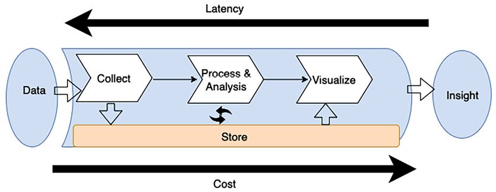

Figure 12.1: Big data pipeline for data architecture design

As shown in the preceding diagram, the standard workflow of the big data pipeline includes the following steps:

- Data is collected (ingested) by an appropriate tool.
- The data is stored persistently.
- The data is processed or analyzed. The data processing/analysis solution takes the data from storage, performs operations, and then stores the processed data again.
- The data is then used by other processing/analysis tools or by the same tool again to get further answers from the data.2. To make answers useful to business users, they are visualized using a **business intelligence** (**BI**) tool or fed into an ML algorithm to make future predictions. Once the appropriate answers have been presented to the user, this gives them insight into the data they can use to make further business decisions.

The tools you deploy in your pipeline determine your _time to answer_, which is the latency between when your data was created and when you can get insight from it. The best way to architect data solutions while considering latency is to determine how to balance throughput with cost because a higher performance and reduced latency usually result in a higher price. For example, a financial trading platform requires real-time analytics to provide its users with immediate insights for quick decision making.

To achieve this, the platform might employ an expensive data processing pipeline that includes in-memory databases, real-time stream processing, and high-speed data ingestion services. This setup ensures low latency, allowing traders to respond to market changes instantaneously. Here, the business necessity for real-time analytics justifies the high costs associated with the low-latency architecture.

# Designing big data processing pipelines

One of the critical mistakes many big data architectures make is handling multiple data pipeline stages with one tool. A fleet of servers managing the end-to-end data pipeline, from data storage and transformation to visualization, may be the most straightforward architecture, but it is also the most vulnerable to breakdowns in the pipeline. Such tightly coupled big data architecture typically does not provide the best possible balance of throughput and cost for your needs. When you are designing a data architecture, use FLAIR data principles as explained in the following:

- **F – Findability**: This refers to the capability to easily locate available data assets and access their metadata, which includes information like ownership and data classification, along with other crucial attributes necessary for data governance and compliance.
- **L – Lineage**: The ability to trace the origin of data, track its movement and history, and understand as well as visualize how data flows from its sources to its points of consumption.
- **A – Accessibility**: This involves the facility to request and obtain security credentials that grant the right to access a specific data asset. It also implies the need for a networking infrastructure that supports efficient data access.
- **I – Interoperability**: Ensuring that data is stored in formats that are accessible and usable by most, if not all, internal processing systems within the organization.\* **R – Reusability**: Data should be documented with a known schema, and the source of the data should be clearly attributed. This aspect often includes principles of **master data management** (**MDM**), which focuses on the management of critical data from different domains to provide, with accuracy and consistency, a single point of reference.

Big data architects recommend decoupling the pipeline between ingestion, storage, processing, and getting insight. There are several advantages to decoupling storage and processing in multiple stages, including increased _fault tolerance_. For example, if something goes wrong in the second round of processing and the hardware dedicated to that task fails, you won’t have to start again from the beginning of the pipeline; your system can resume from the second storage stage. Decoupling your storage from various processing tiers allows you to read and write to multiple data stores.

The following diagram illustrates various tools and processes to consider when designing a big data architecture pipeline:

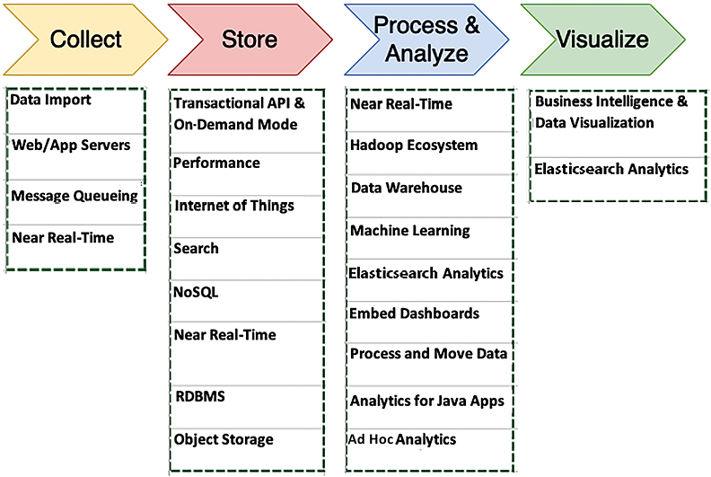

Figure 12.2: Tools and processes for big data architecture design

The things you should consider when determining the right tools for your big data architectures include the following:

- The structure of your data
- Maximum acceptable latency
- Minimum acceptable throughput
- Typical access patterns of your system’s end users

Your data structure impacts both the tools you use to process it and where you store it. The ordering of your data and the size of each object you’re storing and retrieving are also essential considerations. How your solution weighs latency/throughput and cost determines the time to answer.

User access patterns are another essential component to consider. Some jobs require regularly joining many related tables, and others require daily or less frequent data storage. Some jobs require comparing data from a wide range of data sources, and other jobs pull data from only one unstructured table. Knowing how your end users will most often use the data will help you determine the breadth and depth of your big data architecture. Let’s dive deep into each process and the tools involved in big data architecture.

# Data ingestion, storage, processing, and analytics

To turn raw data into actionable intelligence that can inform decision making and strategic planning for businesses, data needs to be managed through several key stages, beginning with **data ingestion**—the collection of data from various sources. This can include everything from user-generated data to machine logs, or real-time streaming data. Once collected, the data needs to be stored in **data storage**, which can be done in databases, data lakes, or cloud storage solutions, depending on the data type and intended use.

Following storage, **data processing and analytics** come into play, which involves sorting, aggregating, or transforming the data into a more usable form, where analytics can be performed on the processed data to extract meaningful insights. Analytics can range from simple queries and reporting to complex ML algorithms and predictive modeling. Let’s learn about these stages in detail.

## Data ingestion

Data ingestion is the act of collecting data for transfer and storage. There are lots of places from where data can be onboarded. Predominantly, data ingestion falls into one of the categories of databases, streams, logs, and files. Among these, databases are the most popular. These typically consist of your main upstream transactional systems that are the primary data storage for your applications. They take on both relational and non-relational flavors, and several techniques for extracting data from them exist.

Streams are open-ended sequences of time-series data, such as clickstream data from websites or **Internet of Things** (**IoT**) devices, usually published in an API we host. Applications, services, and operating systems generate logs. As shown in the following diagram, use the type of data your environment collects, and how it is collected, to determine what kind of ingestion solution is ideal for your needs:

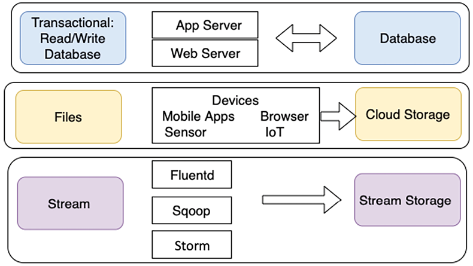

Figure 12.3: Type of data ingestion

As shown, transactional data storage must be able to store and retrieve data quickly. End users need quick and straightforward data access, making app and web servers the ideal ingestion methods. For the same reasons, NoSQL and **relational database management system** (**RDBMS**) databases are usually the best solutions for these kinds of processes.

Data transmitted through individual files is typically ingested from connected devices. A large amount of file data does not require fast storage and retrieval compared to transactional data. For file data, often a transfer is one way, where data is produced by multiple resources and ingested into a single object or file storage for later use.

Stream data such as clickstream logs should be ingested through an appropriate solution such as **Apache Kafka** or **Fluentd**. Apache Kafka is a popular choice for this purpose, offering robust publish-subscribe capabilities that can handle massive amounts of data efficiently. Fluentd is another tool that can be used for data ingestion, particularly known for its log aggregation capabilities.

Initially, these logs are stored in stream storage solutions such as Kafka, so they’re available for real-time processing and analysis. Long-term storage of these logs is best in a low-cost solution such as object storage.

Streaming storage decouples your collection system (producers) from the processing system (consumers). It provides a persistent buffer for your incoming data. The data can be processed, and you can pump the data at a rate dependent on your needs. Let’s learn about some popular data ingestion technologies.

### Technology choices for data ingestion

Let’s look at some popular open source tools for data ingestion and transfer:

- **Apache DistCp**: DistCp stands for _distributed copy_ and is part of the Hadoop ecosystem. The DistCp tool is used to copy large data within a cluster or between clusters. DistCp achieves efficient and fast data copying by utilizing MapReduce’s parallel processing distribution capability. It distributes directories and files into map tasks to copy file partitions from source to target. DistCp also does error handling, recovery, and reporting across clusters.
- **Apache Sqoop**: Sqoop is also part of the Hadoop ecosystem project and helps to transfer data between Hadoop and relational data stores such as RDBMS. Sqoop allows you to import data from a structured data store into the **Hadoop Distributed File System** (**HDFS**) and to export data from the HDFS into a structured data store. Sqoop uses plugin connectors to connect to relational databases. You can use the Sqoop extension API to build a new connector or use one of the included connectors that support data exchange between Hadoop and standard relational database systems.
- **Apache Flume**: Flume is open source software mainly used to ingest a large amount of log data. Apache Flume collects and aggregates data to Hadoop reliably and distributes it. Flume facilitates streaming data ingestion and allows analytics.

More open source projects, such as Apache Storm and Apache Samza, are available for streaming to process unbounded data streams reliably.

### Ingesting data to the cloud

Ingesting data into the cloud is critical to managing and leveraging big data. The three major cloud providers—AWS, **Google Cloud Platform** (**GCP**), and Azure—offer various data ingestion services. Each has unique features and capabilities tailored to different needs and data volumes. Let’s look at some of the unique features of these three cloud providers:

- AWS data ingestion services:

  - **AWS Direct Connect**: This offers a high-speed, private network connection to AWS, reducing latency and increasing bandwidth. It’s ideal for transferring large volumes of data and provides a more consistent network speed than internet-based transfers.
  - **AWS Snowball and Snowmobile**: These services provide physical devices for transferring vast volumes of data (in terabytes and **petabytes** (**PBs**)) to AWS. Snowball is suitable for hundreds of terabytes, while Snowmobile can handle up to 100 PBs in a single transfer, ideal for huge datasets.\* **AWS Database Migration Service (DMS)**: This facilitates the migration of databases to AWS. It supports both homogeneous and heterogeneous migrations and can handle ongoing data replication through **change data capture** (**CDC**).

- GCP data ingestion services:

  - **Google Cloud Storage Transfer Service**: This allows for the transfer of large volumes of data to Google Cloud Storage from online data sources like Amazon S3 and HTTP/HTTPS locations, as well as from on-premises data storage.\* **Pub/Sub**: This offers real-time messaging and streaming data ingestion. It’s a scalable and flexible service that enables the ingestion of streaming data like logs and event data for real-time analytics.
  - **Dataflow**: An integrated service for both data ingestion and processing. It’s handy for **extract, transform, and load** (**ETL**) tasks and real-time event stream processing.

- Azure data ingestion services:

  - **Azure Data Factory**: This data integration service supports both on-premises and cloud data movements and transformations. It enables the ingestion of data from a variety of sources, processing it using computing services like Azure HDInsight and Azure Batch, and subsequently publishing the processed data to storage solutions such as Azure SQL Data Warehouse.
  - **Azure Event Hubs**: A robust and scalable data streaming platform and event ingestion service, Azure Event Hubs is capable of handling millions of events per second. This makes it an ideal solution for real-time analytics on data originating from various sources like applications, websites, or IoT devices.
  - **Azure Import/Export service**: This service is designed for the bulk transfer of large data volumes to and from Azure Blob Storage and Azure Files. It leverages physical disks for data transfer, making it a viable option for situations where transferring large amounts of data over a network might be too slow or expensive.

Each cloud provider offers a unique set of tools to meet various data ingestion needs, from real-time streaming to large-scale data migration, ensuring flexibility and scalability in big data management.

Streaming data is also becoming very important to ingest and analyze. You will learn more about streaming data in the _Streaming data stores_ section. Let’s learn more about the techniques you can use to choose the right storage and the available storage choices.

## Storing data

One of the most common mistakes when setting up storage for a big data environment is using one solution, frequently an RDBMS, to handle all of your data storage requirements.

You will have many tools available, but they need to be optimized for the task they need to complete. One solution is not necessarily the best for all of your needs; the best solution for your environment might be a combination of storage solutions that carefully balance latency with cost. An ideal storage solution uses the right tool for the right job. The following diagram combines multiple factors related to your data and the storage choice associated with it:

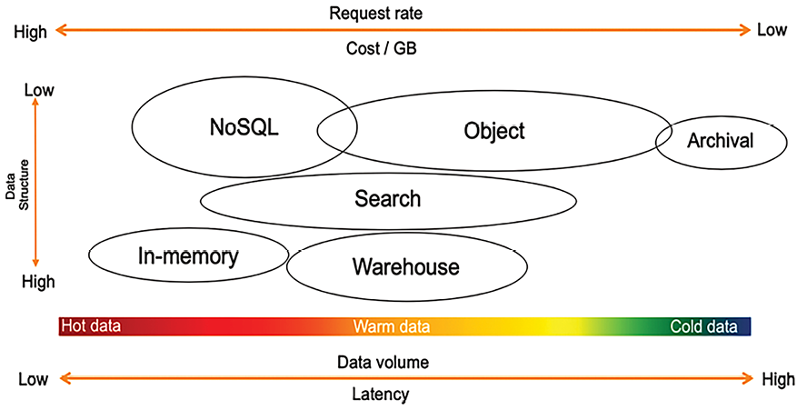

Figure 12.4: Understanding data storage

As shown in the proceeding diagram, choosing a data store depends upon the following factors:

- **How structured is your data?** Does it adhere to a specific, well-formed schema, as with Apache weblogs (logs are generally poorly structured and unsuitable for relational databases), standardized data protocols, and contractual interfaces? Is it completely arbitrary binary data, as in images, audio, video, and PDF documents? Or is it semi-structured with a general structure but potentially high variability across the records, as in JSON or CSV?\* **How quickly does new data need to be available for querying?** Is it a real-time scenario where decisions are made as new records stream in, such as campaign managers adjusting based on conversion rates or a website making product recommendations based on user behavior similarity? Is it a daily, weekly, or monthly batch scenario, such as model training, financial statement preparation, or product performance reporting? Or is it somewhere in between, such as with user engagement emails, where it doesn’t require real-time action, and you can have a buffer of a few minutes or even a few hours between the user action and the touchpoint?
- **What is the size of the data ingest?** Is the data ingested recorded by the record as data comes in, such as with JSON payloads from REST APIs that measure at least a few KBs at best? Is it a large batch of records arriving simultaneously, such as system integrations and third-party data feeds? Or is it somewhere in between, such as with a few micro-batches of clickstream data aggregated together for more efficient processing?
- **What is the total volume of data and its growth rate?** Are you in GBs and TBs, or do you intend to store data in PBs or **exabytes** (**EBs**)? How much of this data is required for your specific analytics use cases? Do most of your queries only require a specific rolling window of time? Or, do you need a mechanism to query the entirety of your historical dataset?
- **What will the cost be to store and query the data in any particular location**? When it comes to any computing environment, we generally see a _triangle of constraints_ between performance, resilience, and low cost. The better the performance and the higher the resilience you want your storage to have, the more expensive it will be. You can have quick queries over PBs of data but settle on querying TBs of data in a compressed format to meet your cost requirements.

Finally, what type of analytic queries will run against the data? Will it power a dashboard with a fixed set of metrics and drill down? Will it participate in large numerical aggregations rolled up by various business dimensions? Or will it be used for diagnostics, leveraging string tokenization for full-text searching and pattern analysis?

When you determine your data’s characteristics and understand the data structure, you can assess which solution you need to use for your data storage. Let’s learn about the various solutions for storing data.

### Technology choices for data storage

As we discussed, a single tool can only do a few things. It would be best if you used the right tool for the right job, and a data lake enables you to build a highly configurable big data architecture to meet your specific needs. Business problems need to be narrower, deeper, and more complex for one tool to solve everything, especially big data and analytics.

For example, hot data will need to be stored and processed in memory, so caches or in-memory databases like Redis or SAP HANA are appropriate. AWS offers the ElastiCache service, providing a managed Redis or memcached environment. NoSQL databases are ideal when facing high-velocity but small-sized records, for example, user-session information or IoT data. NoSQL databases are also useful for content management to store data catalogs. Let’s learn about the most popular and commonly used storage for structured data.

### Structured data stores

Structured data stores have been around for decades and are the most familiar technology choice for storing data. Most transactional databases such as Oracle, MySQL, SQL Server, and PostgreSQL are row-based due to dealing with frequent data writes from software applications. Organizations often repurpose transactional databases for reporting purposes, requiring frequent data reads but much fewer data writes. Looking at high data-read requirements, more innovation is coming into querying on structured data stores, such as the columnar file format, which helps to enhance data-read performance for analytics requirements.

Row-based formats store the data in rows in a file. Row-based writing is the fastest way to write the data to the disk, but it is not necessarily the quickest read option because you need to skip over a lot of irrelevant data. Column-based formats store all the column values together in the file. This leads to better compression because the same data types are grouped. It also typically provides better read performance because you can skip columns that are not required.

Let’s look at common choices for the structured data store. For example, you need to query the total number of sales in a given month from the order table, which has fifty columns. The query will scan the entire table with all fifty columns in a row-based architecture. In columnar architecture, the query will scan the order sales column, thus improving data query performance. Let’s look into more details about relational databases, focusing on transaction data and data warehousing to handle data analytics needs.

#### Relational databases

A RDBMS is more suitable for **online transaction processing** (**OLTP**) applications. Some popular relational databases are Oracle, MSSQL, MariaDB, PostgreSQL, and so on. Some of these traditional databases have been around for decades. Many applications, including e-commerce, banking, and hotel booking, are backed by relational databases. Relational databases are very good at handling transaction data where complex joint queries between tables are required. Looking at transaction data needs, the relational database should adhere to the **atomicity, consistency, isolation, and durability** (**ACID**) principles as follows:

- **Atomicity**: Atomicity means the transaction will be executed fully from end to end, and, in the case of any error, the entire transaction will roll back.
- **Consistency**: Consistency means that all data should be committed to the database when transactions are completed.
- **Isolation**: Isolation requires multiple transactions to run concurrently in isolation without interfering with each other.
- **Durability**: In case of any interruption, such as a network or power failure, the transaction should be able to resume to the last known state.

Data from relational databases is often offloaded to data warehousing solutions for reporting and aggregation purposes. Let’s learn more about data warehousing.

#### Data warehousing

Data warehouses are central repositories that store accumulations of data from one or multiple sources. They store current and historical data to help create analytical reports for business data analytics. However, data warehouses store data centrally from various systems, but they cannot be treated as data lakes. Data warehouses handle only structured relational data, while data lakes work with structured and unstructured data, such as JSON logs and CSV data.

Data warehouse databases are more suitable for **online analytical processing** (**OLAP**) applications. These databases are optimized for operations that involve reading large amounts of data, allowing for the aggregation and summarization of data to extract valuable business insights.

Take, for example, a banking scenario where a bank maintains a data warehouse that stores comprehensive information about customer accounts, transactions, loan details, and branch information. Additionally, the bank collects and stores data on customer interactions, service usage, and online banking activities in a related system.

Through OLAP, the bank can perform complex analyses of this combined data. It can query the data warehouse to uncover trends, such as identifying the most popular types of accounts or loans, analyzing transaction volumes over time, or assessing the usage patterns of online versus in-branch banking services. This analytical capability enables the bank to make informed decisions on product offerings, customer service improvements, and operational strategies, ultimately enhancing customer satisfaction and driving business growth.

Data warehouses provide fast aggregation capabilities over vast volumes of structured data. While these technologies, such as Amazon **Redshift**, **Netezza**, and **Teradata**, are designed to execute complex aggregate queries quickly, they must be optimized for high volumes of concurrent writes. So, data needs to be loaded in batches, preventing warehouses from serving real-time insights over hot data.

Modern data warehouses use a columnar base to enhance query performance. Examples of this include Amazon Redshift, Snowflake, and Google BigQuery. These data warehouses provide fast query performance due to columnar storage and improved I/O efficiency. In addition, data warehouse systems such as Amazon Redshift increase query performance by parallelizing queries across multiple nodes and taking advantage of **massively parallel processing** (**MPP**).

Columnar storage enhances query performance by storing data in columns rather than rows, enabling improved data compression, selective data reading, and faster operations. This approach allows for more effective compression as similar data is stored sequentially, facilitating faster data retrieval as only necessary columns are accessed during queries. It also optimizes CPU cache utilization by loading relevant data into memory, enhancing the processing speed. Additionally, columnar storage supports massive parallel processing, where multiple processors can work on different data segments simultaneously, significantly boosting performance for analytical tasks that involve large datasets and require quick aggregation and filtering.

Data warehouse solutions such as Amazon Redshift can process PBs of data and provide decoupled compute and storage capabilities to save costs. In addition to columnar storage, Redshift uses data encoding, distribution, and zone maps to increase query performance. More traditional row-based data warehousing solutions include Netezza, Teradata, and Greenplum.

Data warehouses lead to the physical separation of data from different applications, necessitating data architects to construct new infrastructures around these warehouses. The constraints of traditional data warehouses have become more pronounced with the growing diversity of enterprise data, including text, IoT data, images, audio, and video. Moreover, the advent of ML and **artificial intelligence** (**AI**) has brought forth iterative algorithms that demand direct data access and do not rely on SQL, thus highlighting the limitations of conventional data warehouse models. You will learn more about overcoming these challenges later in this chapter, in the _Designing big data architectures_ section.

### NoSQL databases

NoSQL databases such as DynamoDB, Cassandra, and MongoDB address the scaling and performance challenges you often experience with a relational database. As the name suggests, NoSQL is a non-relational database. NoSQL databases store data without an explicit and structured mechanism to link data from different tables (no joins, foreign keys, or normalization enforced).

NoSQL utilizes several data models, including columnar, key-value, search, document, and graph. NoSQL databases provide scalable performance, high availability, and resilience. NoSQL typically does not enforce a strict schema, and every item can have an arbitrary number of columns (attributes), meaning one row can have four columns. In contrast, another can have ten columns in the same table. The partition key is used to retrieve values or documents containing related attributes. NoSQL databases are highly distributed and can be replicated. They are durable and don’t experience performance issues when highly available.

#### SQL versus NoSQL databases

SQL databases have existed for decades, and most are already familiar with relational databases. Let’s learn about some significant differences between SQL and NoSQL databases:

| **Properties**  | **SQL Databases**                                                                                                                                                                                                                                                                       | **NoSQL Databases**                                                                                                                                                                                                                                                                                                                                                        |
| --------------- | --------------------------------------------------------------------------------------------------------------------------------------------------------------------------------------------------------------------------------------------------------------------------------------- | -------------------------------------------------------------------------------------------------------------------------------------------------------------------------------------------------------------------------------------------------------------------------------------------------------------------------------------------------------------------------- |
| **Data model**  | The relational model normalizes data in SQL databases into tables containing rows and columns. A schema includes tables, columns, relationships between tables, indexes, and other database elements.                                                                                   | NoSQL databases operate without enforcing a fixed schema, offering flexibility in data storage and retrieval. They often utilize a partition key to access values from sets of columns. This type of database is well-suited for storing semi-structured data, including formats like JSON, XML, and various other document types, such as data catalogs and file indexes. |
| **Transaction** | SQL-based traditional RDBMSs support and comply with ACID transactional data properties.                                                                                                                                                                                                | NoSQL databases sometimes trade certain ACID properties, which are characteristic of traditional RDBMSs, in order to facilitate horizontal scaling and enhance flexibility in their data models.                                                                                                                                                                           |
| **Performance** | SQL-based RDBMSs were used to optimize storage when storage was expensive and minimize the disk footprint. For traditional RDBMSs, performance has mostly relied on the disk. Index creation and table structure modifications are required to achieve performance query optimizations. | In NoSQL systems, the performance is significantly influenced by factors such as the size of the underlying hardware cluster, network latency, and the manner in which the application interacts with the database.                                                                                                                                                        |
| **Scale**       | SQL-based RDBMS databases are most straightforward to scale vertically with high-configuration hardware. The additional effort requires relational tables to span distributed systems, such as performing data sharding.                                                                | NoSQL databases are engineered to scale out horizontally, utilizing distributed clusters composed of cost-effective hardware. This approach is aimed at boosting throughput while minimizing any impact on latency.                                                                                                                                                        |

Table 12.1 – SQL versus NoSQL database comparison

Depending on your data, various categories of NoSQL data stores exist to solve a specific problem. Let’s learn about the types of NoSQL databases.

#### Types of NoSQL databases

The following are the major NoSQL database types:

- **Columnar databases**: Apache Cassandra and Apache HBase are the popular columnar databases. A columnar data store helps you scan a particular column when querying the data rather than scanning the entire row. Suppose an item table has ten columns with one million rows, and you want to query the number of items available in inventory. In that case, the columnar database will apply the query to the item quantity column rather than scanning the entire table.
- **Document databases**: Some of the most popular document databases are **MongoDB**, **Couchbase**, **MarkLogic**, **DynamoDB**, **DocumentDB**, and **Cassandra**. You can use a document database to store semi-structured data in JSON and XML formats.
- **Graph databases**: Popular graph database choices include **Amazon Neptune**, **JanusGraph**, **TinkerPop**, **Neo4j**, **OrientDB**, **GraphDB**, and **GraphX** in Spark. A graph database stores vertices and links between vertices called **edges**. Graphs can be built on both relational and non-relational databases.
- **In-memory key-value stores**: Some of the most popular in-memory key-value stores are Redis and Memcached. They store data in memory for heavy reading applications. Any query from an application first goes to an in-memory database, and if the data is available in the cache, it doesn’t hit the master database. The in-memory database is suitable for storing user-session information, which results in complex queries and frequently requests data such as user profiles.

NoSQL has many use cases, but you must index all your data to build a search. Let’s learn more about search data stores.

### Search data stores

The Elasticsearch service is one of the most popular search engines for big data use cases like clickstream and log analysis. Search engines work well for warm data that can be queried ad hoc across any number of attributes, including string tokens.

Amazon OpenSearch Service provides data search capabilities and the support of open source Elasticsearch clusters, including API access. It also provides Kibana as a visualization mechanism to search for indexed data stores. AWS manages capacity, scaling, and patching of clusters, removing any operational overhead. Log search and analysis is a popular big data use case where OpenSearch helps you analyze log data from websites, server fleets, IoT sensors, and so on. Various applications in industries such as banking, gaming, marketing, application monitoring, advertisement technology, fraud detection, recommendations, and IoT utilize OpenSearch and Elasticsearch. ML-based search services, such as Amazon Kendra, are also available, providing more advanced search capabilities using **natural language processing** (**NLP**).

### Unstructured data stores

When you look at the requirements for an unstructured data store, Hadoop is a perfect choice because it is scalable, extensible, and very flexible. It can run on consumer hardware, has a vast ecosystem of tools, and appears cost-effective. Hadoop uses a _master-and-child-node_ model, where data is distributed between multiple child nodes, and the primary node coordinates jobs for running queries on data. The Hadoop system is based on MPP, making it fast to perform queries on all data types, whether structured or unstructured.

When a Hadoop cluster is created, each child node created from the server comes with a block of the attached disk storage called a local HDFS disk store. You can run the query against stored data using common processing frameworks like Hive, Pig, and Spark. However, data on the local disk persists only for the life of the associated instance.

If you use Hadoop’s storage layer (HDFS) to store your data, you are coupling storage with compute. Increasing storage space means adding more machines, which also increases compute capacity. For maximum flexibility and cost-effectiveness, you need to separate compute and storage and scale them independently. Overall, object storage is more suited to data lakes to store all kinds of data cost-effectively and efficiently. Cloud-based data lakes backed by object storage provide flexibility to decouple compute and storage. Let’s learn more about object storage.

### Object storage

Object storage refers to data stored and accessed with units often referred to as objects stored in buckets. In object storage, files or objects are not split into data blocks, but data and metadata are kept together. There is no limit on the number of objects stored in a bucket, and they are accessed using API calls (usually through `HTTP`, `GET`, or `PUT`) to read and write to and from buckets. Typically, object storage is not mounted as a filesystem on operating systems because the latency of API-based file requests and lack of file-level locking provide poor performance as a filesystem.

Object storage offers scale and has a flat namespace, reducing management overhead and metadata management. Object storage has become more popular with the public cloud and is the go-to storage to build a scalable data lake in the cloud. Amazon S3, Azure Blob Storage, and Google Cloud Storage in GCP are the most popular object storage options.

### Vector Database (VectorDB)

**VectorDB** has become very popular recently due to an increased focus on generative AI and ML. Vector data typically refers to high-dimensional data points, often used in the context of ML models. For example, an image, text, or audio file can be converted into a vector representation (a list of numbers) that captures its essential features. These vectors are used in ML tasks such as similarity search (finding the most similar items), clustering, or classification. For example, if you want to build customer segmentation, vector embeddings can be used to cluster customers into different groups based on their purchasing behavior or preferences. By analyzing the vector representations of customers’ purchase histories or interactions with a website, businesses can identify distinct clusters of similar customers. This enables them to tailor marketing strategies, personalize offers, or develop targeted products for each specific customer group, enhancing customer satisfaction and loyalty.

**VectorDB**, or vector databases, represent an emerging category in the database technology landscape, primarily focused on efficiently handling vector data. This data type is often associated with ML, particularly in areas like image recognition, NLP, and recommendation systems.

A vector database’s core functionality is storing and managing vector data efficiently. This involves storing the high-dimensional data points and optimizing the database architecture to support quick and efficient querying, often in the form of nearest neighbor search.

Advanced vector databases may incorporate ML models directly into the database, enabling on-the-fly transformation of raw data (like images or text) into vectors, which can then be stored or queried.

A common use case is finding items similar to a given query item. For instance, the database can quickly retrieve images most similar to the query image in an image search. Vector databases can power recommendation engines by matching user profiles with product vectors to suggest relevant items. They can efficiently handle and query large-scale text data transformed into vector space for various NLP applications. The following are the pros of **VectorDB**:

- **Speed and efficiency**: Tailored to handle high-dimensional data, vector databases can perform similarity searches much faster than traditional databases.
- **Scalability**: They are designed to scale with the size of the data, which is crucial in ML applications where datasets are often large.
- **Integration with ML/AI pipelines**: Seamless integration with ML workflows, allowing direct querying and manipulation of vector data.

Let’s look at some of the cons of **VectorDB** as well:

- **Complexity**: The management and indexing of high-dimensional vector data can be complex.
- **Resource intensive**: These databases might require significant computational resources, especially for large-scale datasets.
- **Emerging technology**: Being relatively new, the ecosystem around vector databases might not be as mature as traditional databases, which can be a consideration for enterprise adoption.

Vector databases are part of a broader trend towards specialized databases tailored for specific types of data and workloads, particularly in the context of ML and AI. They represent a significant step in evolving database technology to keep pace with data science and analytics advancements. As this technology matures, it’s likely to become an integral part of the data infrastructure in organizations heavily invested in ML and AI.

### Blockchain data stores

Blockchain technology, commonly associated with cryptocurrencies, offers a revolutionary approach to data management and transaction processing in various sectors beyond finance. Blockchain data stores offer a robust mechanism for decentralized verification, fundamentally altering how transactions are recorded and validated across various sectors. In a blockchain-based land registry system, for instance, every transaction involving property sales or purchases is recorded on a shared ledger, instantly accessible and verifiable by all network participants. This transparency contrasts with traditional centralized systems, where data is managed by a single authority, reducing the risk of fraud and enhancing trust among participants.

The immutability and security features of blockchain further increase its application across industries. In healthcare, for example, blockchain ensures that once patient records are entered into the system, they remain unchanged and secure. This immutability is vital for medical professionals who depend on accurate historical data for treatment decisions. Additionally, the cryptographic security of blockchain protects sensitive health information, allowing access only to authorized users and ensuring patient privacy. These attributes make blockchain an invaluable tool in sectors where data integrity and security are paramount.

To achieve immutability, blockchain networks play a key role, which is a decentralized digital ledger that records transactions across multiple computers in a way that ensures the integrity and security of the data. In a blockchain network, transactions are grouped into blocks, and each block is linked to the previous one, forming a chain. This structure makes it extremely difficult to alter information retroactively without the consensus of the network participants. The following are the types of blockchain networks:

- **Public blockchain**: Ethereum is often used for **decentralized applications** (**DApps**) and smart contracts. Ethereum is open, and anyone can join and participate in the network. For instance, a developer might create a DApp for **decentralized finance** (**DeFi**) on the Ethereum network, allowing users to engage in financial transactions without traditional banks.
- **Private blockchain**: This type of blockchain is restricted and controlled by an organization, offering more privacy and control. A pharmaceutical company might use a private blockchain to manage its drug development process. Access to the blockchain is restricted to company researchers and regulators, ensuring sensitive data is kept confidential.
- **Consortium blockchain**: This involves multiple organizations managing a blockchain network, balancing decentralization with control. An example would be a group of shipping companies forming a consortium to manage a shared blockchain. This blockchain could be used to track cargo shipments across the globe, with each company maintaining a node on the network.

Cloud providers like **Amazon Web Services** (**AWS**) offer blockchain as a service, simplifying the setup and management of blockchain networks. Amazon **Quantum Ledger Database** (**QLDB**) is an example of a centralized ledger database that provides an immutable and cryptographically verifiable record of transactions. Popular managed blockchain services include **Amazon Managed Blockchain** (**AMB**), **R3 Corda**, **Ethereum**, and **Hyperledger**, catering to various needs from financial transactions to supply chain management.

Streaming data processing used to be a niche technology, but now it’s becoming common as every organization wants to get fast insight from real-time data processing. Let’s learn more about streaming data stores.

### Streaming data stores

Streaming data has a continuous data flow with no start and end. Lots of data from various real-time resources, such as stock trading, autonomous cars, smart spaces, social media, e-commerce, gaming, ride apps, and so on, needs to be stored and processed quickly. Netflix provides real-time recommendations based on the content you are watching, and Lyft uses streaming to connect passengers to a driver in real time.

Storing and processing streaming data is challenging as there is a continuous stream of data coming in, and you cannot predict the storage capacity. Along with high volume, streaming data comes with very high velocity, which requires a scalable storage system that can store the data and provide the ability to replay it. Data streams can become very expensive to maintain and complex to manage over time. Popular streaming data storage services are Apache Kafka, Apache Flink, Apache Spark Structured Streaming, Apache Samza, and Amazon Kinesis. AWS provides managed Kafka, known as Amazon Managed Streaming for Kafka. Let’s learn more details about streaming data ingestion and storage technology:

- **Amazon Kinesis**: Amazon Kinesis offers three capabilities. The first, **Kinesis Data Streams** (**KDS**), is a place to store a raw data stream to perform any downstream processing of the desired records. The second is **Amazon Kinesis Data Firehose** (**KDF**), which facilitates transferring these records into common analytic environments like Amazon S3, Elasticsearch, Redshift, and Splunk. Firehose will automatically buffer up all the records in the stream and flush out to the target as a single file or set of records based on either a time or data-size threshold that you can configure or whichever is reached first.
- The third is **Kinesis Data Analytics** (**KDA**), which performs analytics on stream records using Apache Flink. The output can subsequently flow into further streams you create to build an entire serverless streaming pipeline.
- **Amazon Managed Streaming for Kafka** (**MSK**): MSK is a fully managed, highly available, and secure service. Amazon MSK runs applications on Apache Kafka in the AWS cloud without needing Apache Kafka infrastructure management expertise. Amazon MSK provides a managed Apache Kafka cluster with a ZooKeeper cluster to maintain configuration and build a producer/consumer for data ingestion and processing.
- **Apache Flink**: Flink is another open source platform for streaming data and batch data processing. Flink consists of a streaming dataflow engine that can process bounded and unbounded data streams. A bounded data stream has a defined start and end, while an unbounded data stream has a start but no end. Flink can perform batch processing on its streaming engine and supports batch optimizations.
- **Apache Spark Streaming**: Spark Streaming helps ingest live data streams with high throughput and a fault-tolerant, scalable manner. Spark Streaming divides the incoming data streams into batches before sending them to the Spark engine for processing. Spark Streaming uses DStreams, which are sequences of **resilient distributed datasets** (**RDDs**).
- **Apache Kafka**: Kafka is one of the most popular open source streaming platforms that helps you publish and subscribe to a data stream. A Kafka cluster stores a recorded stream in a Kafka topic. A producer can publish data in a Kafka topic, and consumers can take the output data stream by subscribing to the Kafka topic.
- Streaming storage needs to persist a continuous stream of data and provide the ability to maintain the order if required. You will learn more about streaming architecture in the upcoming section, _Streaming data architecture_.

# Data storage in the cloud

Cloud data storage is a crucial aspect of modern IT infrastructure, offering scalability, flexibility, and cost-effectiveness. The leading cloud service providers – AWS, GCP, and Azure – provide various data storage options to cater to different needs, from simple file storage to complex databases and data warehousing solutions. The following lists the key characteristics of cloud data storage across these platforms.

- AWS:

  - **Amazon Simple Storage Service (S3)**: This is a highly scalable object storage service known for its high data availability, security, and performance. Amazon S3 is versatile, perfect for storing any volume of data applicable in various scenarios like websites, mobile apps, backup and restoration, archival needs, enterprise applications, IoT devices, and big data analytics.
  - **Amazon Elastic Block Store (EBS)**: EBS offers block-level storage volumes for use with EC2 instances. It’s particularly suitable for data that demands consistent and low-latency performance, such as databases or ERP (Enterprise Resource Planning) systems.
  - **Amazon Relational Database Service** **(RDS)**: RDS streamlines the setup, operation, and scaling of a relational database in the cloud. It offers a cost-effective solution with resizable capacity while automating many of the time-consuming tasks associated with database administration.
  - **Amazon S3 Glacier**: This service provides secure, durable, and low-cost cloud storage for archiving and long-term backup. Amazon S3 Glacier is ideal for storing data that is accessed infrequently, offering a solution for long-term data retention.

- GCP:

  - **Google Cloud Storage**: This offers object storage for companies of all sizes. It’s highly scalable and flexible, providing secure and durable storage for high-demand applications and workloads.
  - **Persistent Disk**: This provides block storage for Google Compute Engine instances. It offers high-performance SSD and HDD storage that can be attached to instances running in Compute Engine or **Google Kubernetes Engine** (**GKE**).
  - **Cloud SQL**: A fully managed database service that makes it easy to set up, maintain, manage, and administer relational databases on Google Cloud.
  - **Google Cloud Bigtable**: A scalable, fully managed NoSQL database service for large analytical and operational workloads.

- Microsoft Azure:

  - **Azure Blob Storage**: This is Azure’s object storage solution designed for the cloud. It excels at storing large amounts of unstructured data, such as text or binary data. This includes various types of content like documents, media files, backups, and logs, making it highly versatile for a wide range of uses.
  - **Azure File Storage**: Offers cloud-based, fully managed file shares that are accessible using the standard SMB protocol. This service is particularly useful for businesses looking to migrate their existing on-premises file shares to the cloud environment.
  - **Azure SQL Database**: A comprehensive, fully managed relational database service in the cloud. It provides the capabilities of SQL Server, but without the need for extensive infrastructure and database administration tasks, simplifying database management.
  - **Azure Disk Storage**: This delivers high-performance, reliable block storage for Azure Virtual Machines. Azure Disk Storage includes both SSD and HDD options, catering to a range of requirements from high-speed performance to cost efficiency.

Cloud data storage services across these platforms are designed to provide secure, scalable, and accessible storage solutions, accommodating various applications and use cases. Each service has its specific strengths, making them suitable for different performance, scalability, data access, and cost requirements.

Once you ingest and store data, processing the data in the desired structure is essential to visualize and analyze it for business insights. Let’s learn more about data processing and transformation.

## Processing data and performing analytics

Data analytics is the process of ingesting, transforming, and visualizing data to discover valuable insights for business decision making. Over the previous decade, more data has been collected than ever before, and customers are looking for greater insights into their data.

These customers also want these insights in the least amount of time, sometimes even in real time. They want more ad hoc queries to answer more business questions. To answer these questions, customers need more powerful and efficient systems.

Batch processing typically involves querying large amounts of cold data. In batch processing, it may take hours to get answers to business questions. For example, you may use batch processing to generate a billing report at the end of the month. Stream processing in real time typically involves querying small amounts of hot data, and it takes only a short amount of time to get answers. MapReduce-based systems such as Hadoop are examples of platforms that support the batch jobs category, while data warehouses are examples of platforms that support the query engine category.

Streaming data processing activities ingest a data sequence and incrementally update functions in response to each data record. Typically, they ingest continuously produced streams of data records, such as metering data, monitoring data, audit logs, debugging logs, website clickstreams, and location-tracking events for devices, people, and physical goods.

The following diagram illustrates a data lake pipeline for processing, transforming, and visualizing data using the AWS cloud tech stack:

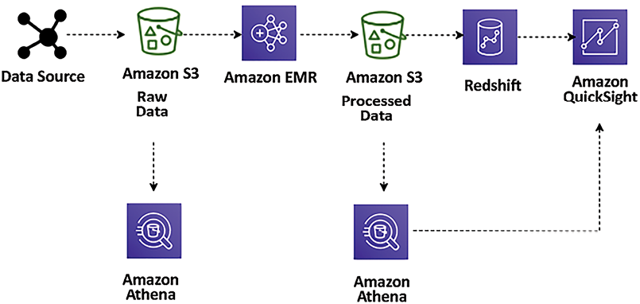

Figure 12.5: Data lake ETL pipeline for big data processing

Here, the ETL pipeline uses Amazon Athena for ad hoc querying of data stored in Amazon S3. The data ingested from various data sources (for example, web application servers) generates log files that persist into S3. These files are then transformed and cleansed into a set form required for meaningful insights using Amazon **Elastic MapReduce** (**EMR**) and loaded into Amazon S3. Amazon EMR provides a managed Hadoop server in the cloud to perform data processing using various open source technologies such as **Hive**, **Pig**, and **Spark**.

These transformed files are loaded into Amazon Redshift using the `COPY` command and visualized using Amazon QuickSight. Using Amazon Athena, you can query the data directly from Amazon S3 when the data is stored and after transformation (with aggregated datasets). You can visualize the data from Athena in Amazon QuickSight. You can easily query these files without changing your existing dataflow.

Let’s look at some popular tools for data processing.

### Technology choices for data processing and analysis

The following are some of the most popular data processing technologies that help you to perform transformation and processing for a large amount of data:

- **Apache Hadoop** uses a distributed processing architecture in which a task is mapped to a cluster of commodity servers for processing. Each piece of work distributed to the cluster servers can be run or re-run on any server. The cluster servers frequently use the HDFS to store data locally for processing. The Hadoop framework takes a big job, splits it into discrete tasks, and processes them in parallel. It allows for massive scalability across an enormous number of Hadoop clusters. It’s also designed for fault tolerance, where each worker node periodically reports its status to a primary node, and the primary node can redistribute work from a cluster that doesn’t respond positively. Some of the most popular frameworks used with Hadoop are **Hive**, **Presto**, **Pig**, and **Spark**.
- **Apache Spark** is an in-memory processing framework. Apache Spark is a massively parallel processing system with different executors that can take apart a Spark job and run tasks in parallel. To increase the parallelism of a job, add nodes to the cluster. Spark supports batch, interactive, and streaming data sources. Spark uses **directed acyclic graphs** (**DAGs**) for all the stages during the execution of a job. The DAGs can keep track of your data or lineage transformations during the jobs and efficiently minimize the I/O by storing the DataFrames in memory. Spark is also partition-aware to avoid network-intensive shuffles.
- **Hadoop User Experience** (**HUE**) enables you to run queries and scripts on your cluster through a browser-based **user interface** (**UI**) instead of the command line. HUE provides the most common Hadoop components in a UI. It enables browser-based viewing and tracking of Hadoop operations. Multiple users can access the cluster via HUE’s login portal, and administrators can manage access manually or with **Lightweight Directory Access Protocol** (**LDAP**), **Pluggable Authentication Modules** (**PAM**), **Simple and Protected GSSAPI Negotiation Mechanism** (**SPNEGO**), OpenID, OAuth, and **Security Assertion Markup Language 2.0** (**SAML2**) authentication. HUE allows you to view logs in real time and provides a metastore manager to manipulate Hive metastore contents.
- **Pig** is typically used to process large amounts of raw data before storing it in a structured format (SQL tables). Pig is well suited to ETL operations such as data validation, loading, transformation, and combining data from multiple sources in multiple formats. In addition to ETL, Pig supports relational operations such as nested data, joins, and grouping. Pig scripts can input unstructured and semi-structured data (such as web server logs or clickstream logs). In contrast, Hive consistently enforces a schema on input data. Pig Latin scripts contain instructions on filtering, grouping, and joining data, but Pig is not intended to be a query language. Hive is better suited to querying data. The Pig script compiles and runs to transform the data based on the instructions in the Pig Latin script.
- **Hive** is an open source data warehouse and query package that runs on top of a Hadoop cluster. Being able to use SQL is a skill that helps the team easily transition into the big data world. Hive uses a SQL-like language called **Hive Query Language** (**HQL**), making it easy to query and process data in a Hadoop system. Hive abstracts the complexity of writing programs in a coding language like Java to perform analytics jobs.
- **Presto** is a Hive-like query engine, but it is much faster. It supports the **American National Standards Institute** (**ANSI**) SQL standard, which is easy to learn and the most popular skill set. Presto supports complex queries, joins, and aggregation functions. Unlike Hive or MapReduce, Presto executes queries in memory, which reduces latency and improves query performance. You need to be careful while selecting the server capacity for Presto, as it needs to have high memory. A Presto job will restart in the event of memory spillover.
- **HBase** is a NoSQL database developed as a part of the open source Hadoop project. HBase runs on the HDFS to provide non-relational database capabilities for the Hadoop ecosystem. HBase helps to store large quantities of data in a columnar format with compression. Also, it provides a fast lookup because large portions of the data cache are kept in memory while cluster instance storage is still used.
- **Apache Zeppelin** is a web-based editor for data analytics built on top of the Hadoop system, also known as a Zeppelin notebook. It uses the concept of an interpreter for its backend language and allows any language to be plugged into Zeppelin. Apache Zeppelin includes some basic charts and pivot charts. It’s very flexible in terms of any output from any language backend that can be recognized and visualized.
- **Ganglia** is a Hadoop cluster monitoring tool. However, you need to install Ganglia on the cluster during launch. The Ganglia UI runs on the primary node, which you can see using an SSH tunnel. Ganglia is an open source project designed to monitor clusters without impact on their performance. Ganglia can help to inspect the performance of the individual servers in your cluster and the performance of clusters as a whole.
- **JupyterHub** is a multi-user Jupyter notebook. Jupyter Notebook is one of the most popular tools among data scientists to perform data engineering and ML. The JupyterHub notebook server provides each user with a Jupyter Notebook web-based IDE. Multiple users can use their Jupyter notebooks simultaneously to write and execute code for exploratory data analytics.

### Data processing in the cloud

Data processing in the cloud is a fundamental aspect of modern big data and analytics strategies. Three major cloud service providers—AWS, GCP, and Azure—offer various data processing services, each with unique features and capabilities. The following are some unique features of each of them:

- AWS Data Processing Services:

  - **Amazon EMR**: This provides a cloud-native Hadoop environment, supporting a wide range of big data frameworks like Apache Spark, Hadoop, HBase, and Presto. EMR is ideal for processing large datasets, and it offers flexibility by separating compute and storage, allowing for cost-efficient scaling.
  - **AWS Glue**: This is a fully managed ETL service that simplifies data preparation for analytics. It automates the cumbersome data preparation work, generates ETL scripts, and facilitates data movement between various AWS services. Glue is particularly effective for data cataloging and job scheduling.
  - **Amazon Athena**: A serverless, interactive query service that allows SQL queries directly on data stored in Amazon S3. It is highly useful for ad hoc data analysis and BI querying, with no infrastructure management required.\* GCP Data Processing Services:

  - **Google BigQuery**: This is a fully managed, serverless data warehouse solution designed for rapid, cost-efficient SQL querying across extensive datasets. BigQuery is particularly geared towards real-time analytics and is capable of handling streaming data effectively.
  - **Cloud Dataflow**: A fully managed service dedicated to processing data in both stream and batch modes. Built on Apache Beam, Cloud Dataflow offers a unified programming model, simplifying the development of parallel data processing pipelines. It’s adept at handling a range of tasks from complex ETL processes to batch and real-time streaming workloads.
  - **Cloud Dataprep**: An advanced data service that allows users to visually explore, clean, and prepare both structured and unstructured data for analysis. Seamlessly integrated with BigQuery and Cloud Dataflow, Cloud Dataprep enhances the capabilities of data exploration and transformation.

- Azure Data Processing Services:
  - **Azure HDInsight**: A fully managed cloud service that makes it easy to process massive amounts of data with popular open source frameworks such as Apache, Hadoop, Spark, Kafka, and HBase. It suits various scenarios like ETL, data warehousing, ML, and IoT.
  - **Azure Databricks**: A fast, easy, and collaborative Apache Spark-based analytics platform. It integrates deeply with other Azure services and provides a unified platform for ETL processes, streaming analytics, ML, and data warehousing.
  - **Azure Synapse Analytics**: This is a comprehensive analytics service that merges the capabilities of big data and data warehousing. It provides a cohesive experience for ingesting, preparing, managing, and delivering data for instant BI and ML applications. Azure Synapse Analytics enables the simultaneous querying of both data lakes and databases, streamlining data analysis processes.

Each cloud provider’s data processing services are designed to meet specific needs in the data life cycle, from processing and transforming large datasets to interactive querying and real-time analytics. This diversity ensures businesses can choose the most suitable tools and platforms according to their specific data processing requirements and objectives.

Data analysis and processing are huge topics that warrant a book on their own. This section gave a high-level overview of popular and common tools used for data processing. There are many more proprietary and open source tools available. As a solutions architect, you must be aware of various available tools to make the right choice for your organization’s use case.

Business analysts need to create reports and dashboards and perform ad hoc queries and analyses to identify data insights. Let’s learn about data visualization in the next section.

# Visualizing data

Data insights are used to answer important business questions such as revenue by customer, profit by region, or advertising referrals by site, among many others. In the big data pipeline, enormous amounts of data are collected from various sources. However, it is difficult for companies to find information about inventory per region, profitability, and increases in fraudulent account expenses. Some of the data you continuously collect for compliance purposes can also be leveraged for generating business.

The two significant challenges of BI tools are the cost of implementation and the time it takes to implement a solution. Let’s look at some technology choices for data visualization.

## Technology choices for data visualization

The following are some of the most popular data visualization platforms, which help you prepare reports with data visualization as per your business requirements:

- **Amazon QuickSight** is a cloud-based BI tool for enterprise-grade data visualizations. It comes with a variety of visualization graph presets such as line graphs, pie charts, treemaps, heat maps, and histograms. Amazon QuickSight has a data-caching engine known as a **Super-fast, Parallel, In-memory Calculation Engine** (**SPICE**), which helps render visualizations quickly. You can also perform data preparation tasks such as renaming and removing fields, changing data types, and creating new calculated fields. QuickSight also provides ML-based visualization insights and other ML-based features, such as auto forecast predictions.
- **Kibana** is an open source data visualization tool for stream data visualization and log exploration. Kibana offers close integration with Elasticsearch and uses it as a default option to search for data on top of the Elasticsearch service. Like other BI tools, Kibana also provides popular visualization charts such as histograms, pie charts, and heat maps, and offers built-in geospatial support.
- **Tableau** is one of the most popular BI tools for data visualization. It uses a visual query engine, which is a purpose-built engine, to analyze big data faster than traditional queries. Tableau offers a drag-and-drop interface and the ability to blend data from multiple resources.
- **Spotfire** uses in-memory processing for faster response times, enabling extensive datasets from various resources. It allows you to plot your data on a geographical map and share it on Twitter. With Spotfire recommendations, it inspects your data automatically and suggests how to visualize it best.
- **Jaspersoft** enables self-service reporting and analysis. It also offers drag-and-drop designer capabilities.
- **Power BI** is a popular BI tool provided by Microsoft. It provides self-service analytics with a variety of visualization choices.

Data visualization is an essential and massive topic for solutions architects. As a solutions architect, you need to be aware of the available tools and make the right choice per your business requirements for data visualization.

You have learned about various data pipeline components, from ingestion, storage, and processing, to visualization. In the next section, let’s put them together and learn how to orchestrate a big data architecture.

# Designing big data architectures

Big data solutions are comprised of data ingestion, storage transformation, data processing, and visualization in a repeated manner to run daily business operations. You can build these workflows using the open source or cloud technologies you learned about in previous sections.

First, you need to learn which architectural style is right for you by working backward from the business use case. You need to understand the end user of your big data architecture and create a user persona to understand the requirements better. To identify the key personas you are targeting with big data architecture, you need to understand some of the following points:

- Which teams, units, or departments inside your organization are they a part of?
- What is their level of data analysis and data engineering proficiency?
- What tools do they typically use?
- Do you need to cater to the organization’s employees, customers, or partners?

For your reference, taking an example of a retail store chain analysis, you may identify the following personas:

- The **product manager** persona, who owns a product line/code but only sees turnover for their product.
- The **store manager** persona, who wants to know the sales turnover and product mix for a single store (only able to see their store).
- The **admin** persona, who wants to have access to all data.
- The **data analyst**, who wants to access all data with PII data redacted.
- The **customer retention managers**, who want to understand repeated customer traffic.
- **Data scientists** need access to raw and processed data to build recommendations and forecasts.

Once you have a clear understanding of your user persona, the next step is to identify the business use cases these personas aim to address. Some examples include:

- **Customer spending trends**: Analyze how many customers are increasing or decreasing their spending over time. Characterize these customers based on their spending patterns.
- **Growth categories among higher spenders**: Identify which product or service categories are witnessing faster growth among customers who are spending more over time.
- **Decline categories among lower spenders**: Determine the categories where there is a noticeable decline in engagement among customers who are spending less over time.
- **Impact of demographics on spending**: Investigate which demographic factors, such as household size, presence of children, or income level, influence customer spending habits. Also, assess which demographic factors impact engagement with specific product or service categories.
- **Effectiveness of direct marketing**: Explore whether there is evidence to suggest that direct marketing campaigns lead to improved overall customer engagement.
- **Cross-category impact of direct marketing**: Assess whether direct marketing efforts in one category have a positive effect on customer engagement in other categories.

While you get details on the use case, the essential aspect of building your data architecture is to understand access patterns and data retention, which can be analyzed by using the following queries:

- How often do key users and personas run their reports, queries, or models?
- What is their expectation for data freshness?
- What is their expectation of data granularity?
- What portion of data is most frequently accessed for analysis?
- How long do you intend to retain data for analysis?
- At what point can data age out of the data lake environment?

There is always some sensitivity attached when you deal with data. Each country and area has its local regulatory compliance requirements, which solutions architects need to understand, such as:

- What compliance requirements does your business have?
- Are you subject to data locality, privacy, or redaction requirements?
- Who is authorized to see which records and which attributes in the dataset?
- How will you enforce the deletion of records on request?
- Where can you store data, for example, local to geolocation, county, or global?

As a data architect, you must also consider the return on investment and how it will help overall business decisions. To understand, you may want to go through the following points:

- What primary business processes and decisions does your data lake support?
- What level of granularity is required for these decisions?
- What is the impact of data latency on business decisions?
- How do you plan to measure success?
- What is the expected return on the time and material invested?

Ultimately, you want to build a data architecture where you can provide flexibility to make technology choices, for example, by using the best of cloud-based managed services and open source technologies to capitalize on existing skills and investments. You want to build big data solutions to use parallelism to achieve high performance and scalability. It is best to make sure any components of your big data pipeline can scale in or scale out independently so that you can adjust it according to different business workloads.

To utilize the full potential of your solution, you want to provide interoperability with existing applications so that components of the big data architecture are also used for ML processing and enterprise BI solutions. It will enable you to create an integrated solution across data workloads. Let’s learn about some big data architecture patterns.

## Data lake architecture

A data lake serves as a centralized repository that accommodates both structured and unstructured data, encompassing the diverse data types present in a corporation. It has emerged as a solution for transferring all enterprise data into a cost-effective storage system, like Amazon S3. In a data lake, data can be accessed through generic APIs and open file formats, including Apache Parquet and **Optimized Row Columnar** (**ORC**). This storage method preserves data in its original form, utilizing open source file formats, thereby facilitating direct analytics and ML applications.

The data lake is becoming a popular way to store and analyze large volumes of data in a centralized repository. Data can be stored as is in its current format, and you don’t need to convert data into a predefined schema, which increases the data ingestion speed. As illustrated in the following diagram, the data lake is a single source of truth for all data in your organization:

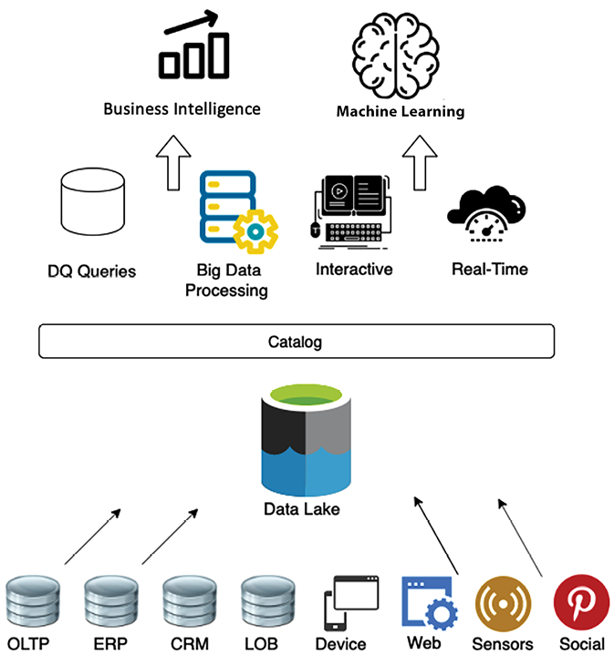

Figure 12.6: Object store for data lake

The following are the benefits of a data lake:

- **Data ingestion from various sources**: Data lakes let you store and analyze data from multiple sources, such as relational and non-relational databases and streams, in one centralized location for a single source of truth. This answers questions such as _Why is the data distributed in many places?_ and _Where is the single source of truth?_
- **Collecting and efficiently storing data**: A data lake can ingest any data structure, including semi-structured and unstructured data, without needing schema. This answers questions such as: _How can I ingest data quickly from various sources and in multiple formats and store it efficiently at scale?_\* **Scale up with the volume of generated data**: Data lakes allow you to separate the storage and compute layers to scale each component separately. This answers questions such as: _How can I scale up with the volume of data generated?_
- **Applying analytics to data from different sources**: With a data lake, you can determine the schema on reading and create a centralized data catalog on data collected from various resources. This enables you to perform quick ad hoc analysis. This answers questions such as: _Can I apply multiple analytics and processing frameworks to the same data?_

It would help if you had an unlimited scalable data storage solution for your data lake. Decoupling your processing and storage provides many benefits, including the ability to process and analyze the same data with various tools. Although this may require an additional step to load your data into the right tool, Amazon S3, as your central data store, provides even more benefits than traditional storage options. The following diagram provides a view of the data lake using AWS services:

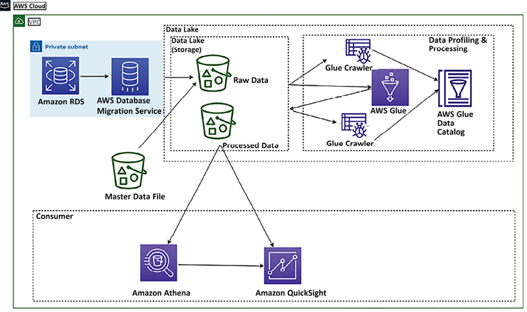

Figure 12.7: Data lake architecture in the AWS platform

The preceding diagram depicts a data lake using Amazon S3 storage. Data is ingested into centralized storage from various resources such as relational databases and master data files. In the data lake’s raw layer, all data is kept in its original format. This data then undergoes cataloging and transformation via the AWS Glue service. AWS Glue is a serverless solution for data cataloging and ETL processes, built on the Spark framework within the AWS cloud platform. Here, the AWS Glue crawler helps in cataloging data stores. It automatically scans your data sources, identifies data formats, and infers schemas, creating and populating a data catalog with metadata information. The crawler classifies the data to understand its format and structure and creates table definitions in the data catalog, which makes it easy to build queries for data analytics. Once transformed, this data is stored in the data lake’s processed layer, making it available for various consumption purposes.

Data engineers can run ad hoc queries using Amazon Athena, a serverless query service built on top of managed Presto instances, and use SQL to query the data directly from Amazon S3. Business analysts can use Amazon QuickSight, Tableau, or Power BI to build visualizations for business users or load selective data in Amazon Redshift to create a data warehouse mart. Finally, data scientists can consume this data using Amazon SageMaker to perform ML.

One tool cannot do everything. You need to use the right tool for the right job, and data lakes enable you to build a highly configurable big data architecture to meet your specific needs. Business problems must be narrower, deeper, and more complex for one tool to solve everything, especially big data and analytics.

However, with time, organizations realized that data lakes have their limitations. As data lakes use cheap storage, organizations store as much of their data as they can in data lakes, providing the flexibility of open, direct access to files. Quickly, data lakes started becoming **data swamps** due to data quality issues and granular data security. However, to address the data lake’s performance and quality issues, organizations process a small subset of data in the data lake to a downstream data warehouse to use in BI applications for important decisions.

The dual system architecture between a data lake and a data warehouse requires continuous data engineering to maintain and process data between these two systems. Each step in data processing carries the risk of failures that can compromise data quality. Additionally, maintaining consistency between the data lake and the data warehouse can be both challenging and expensive. Users face the burden of paying double for storage—once for the data stored in the lake and again for data replicated in the warehouse. This is in addition to the ongoing costs associated with continuous data processing.

To address the dual-system problem, a new type of architecture called the data lakehouse has been discovered. Let’s learn more about lakehouse architecture.

## Lakehouse architecture

The lakehouse architecture has emerged as a solution to bridge the gaps between traditional data lakes and data warehouses, integrating the strengths of both. This architecture is designed to harness the expansive storage capacity of data lakes for ingesting and keeping vast quantities of data in open formats, which are essential for analytics. Simultaneously, it aims to provide the ease of SQL-based querying and the reliability associated with data warehouses. Key characteristics of lakehouse architecture include:

- **Data storage in open-data formats**: Lakehouse architecture stores data in open formats, facilitating interoperability and flexibility in data processing and analytics.
- **Decoupled storage and compute**: It separates storage and computing resources, allowing independent scaling and optimization of each, leading to cost efficiency and performance improvement.
- **Transactional guarantees**: Ensuring data integrity, lakehouse architecture provides transactional guarantees, akin to those in traditional database systems, supporting reliable concurrent access and modifications.
- **Support for diverse consumption needs**: Designed to cater to a wide range of data consumption requirements, lakehouse architecture accommodates different data analytics and processing approaches, from batch to real-time streaming.
- **Secure and governed**: The architecture emphasizes security and governance, ensuring that data access is controlled, and compliance with data privacy regulations is maintained.
- **Unified platform**: Lakehouse architecture provides a unified platform for various data operations, from ETL processes and ML to BI and reporting, eliminating the need for disparate systems.
- **Enhanced query performance**: By leveraging techniques like indexing, caching, and data clustering, lakehouse architecture improves query performance, making it suitable for complex analytical workloads.
- **Cost-effective scalability**: The architecture offers cost-effective scalability options, balancing the need for performance with budgetary constraints, especially beneficial for growing data volumes.
- **Flexible data management**: Lakehouse architecture supports flexible data management practices, accommodating evolving data schemas and structures, making it ideal for agile and evolving business environments.

The lakehouse architecture represents a significant evolution in data management, offering a comprehensive, scalable, and efficient approach to handling vast and diverse datasets while ensuring data integrity, security, and easy accessibility.

The following diagram shows a sample lakehouse architecture using Redshift Spectrum for data sharing. Amazon Redshift Spectrum provides the ability to query data from the data lake without storing data in the data warehouse. Suppose you were already using Amazon Redshift for data warehousing. In that case, you don’t need to load all the data into the Amazon Redshift cluster. Still, you can use Spectrum to query data directly from the Amazon S3 data lake and combine it with data warehouse data.

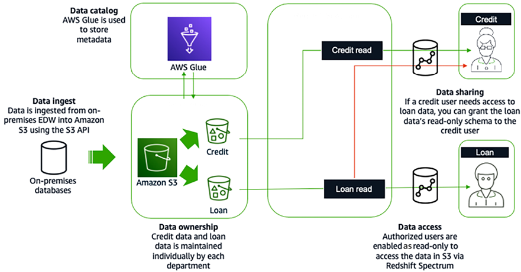

Figure 12.8: Lakehouse architecture in the AWS cloud platform using Redshift Spectrum

Data is ingested from an on-premises **enterprise data warehouse** (**EDW**) into S3 using the S3 API in the preceding diagram. AWS Glue stores the metadata and the credit and loan data individually. Data analysts in the loan department would be granted read-only access to the loan data for data access. Similarly, credit analysts would be granted read-only access to the credit data. For data sharing, if a credit analyst needs access to the loan data, the credit analyst can be given the loan data’s read-only schema.

Lakehouse architecture has benefits; however, more is needed for large organizations with a complex application landscape driven by geographically separated business units. These business units have built data lakes and warehouses as their analytical sources. Each business unit may merge multiple internal application data lakes to support their business. Centralized enterprise data lakes or data lakehouses are challenging to achieve as the pace of change is generally low, and it isn’t easy to meet all requirements across different business units. To handle this problem, you need domain-oriented decentralized data ownership and architecture. That’s where data mesh comes into the picture. Let’s learn more about data mesh architecture.

## Data mesh architecture

The major difference between data mesh and data lake architecture is that data is intentionally left distributed rather than trying to combine multiple domains into a centrally managed data lake. Data mesh provides a pattern that allows a large organization to connect multiple data lakes/lakehouses within large enterprises and facilitate sharing with partners, academia, and even competitors.

Data mesh represents a significant shift in both architecture and organizational approaches toward managing extensive analytical datasets. It is built upon four fundamental principles:

- **Domain-oriented decentralization of ownership and architecture**: This principle emphasizes decentralizing data ownership and architecture decisions to specific business domains. It encourages individual domains to take responsibility for their data, leading to more tailored and effective data solutions.
- **Data served as a product**: Treating data as a product means it is maintained, improved, and presented with the end user in mind. It shifts the focus from data as a mere resource to a valuable asset that provides utility and solves user problems.
- **Federated data governance with centralized audit controls**: This principle strikes a balance between decentralized data management and the need for overarching governance. It allows for domain-specific data governance while maintaining centralized controls for auditing and compliance.
- **Common access that makes data consumable**: Ensuring data is accessible and usable across the organization, this principle focuses on creating a common framework that enables easy and efficient data consumption.

It encourages data-driven agility and supports domain-local governance through a lightweight centralized policy. Data mesh provides better ownership by isolating data resources with clear accountability. The core concept of data mesh is to feature data domains as nodes in data lake accounts.

A data producer contributes one or more data products to a central catalog in a data mesh account where federated data governance is applied to sharing data products, delivering discoverable metadata and audibility. A data consumer searches for a catalog and gains access to a data product by accepting a resource share via the data mesh pattern. The following is a data mesh architecture in the AWS cloud:

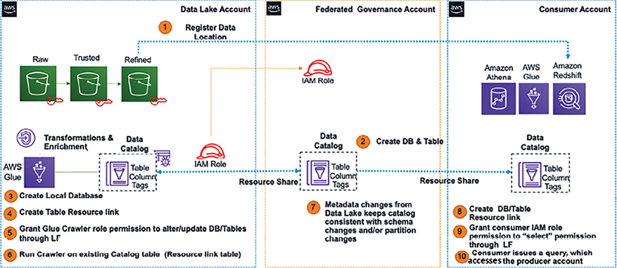

Figure 12.9: Data mesh architecture on the AWS cloud platform

The following are the components implemented to build a data mesh, as shown in the preceding diagram:

- The central AWS account is where data products are registered, comprising databases, tables, columns, and rows.
- Access control tags and tag access policies are managed centrally.
- It stores data permissions that implement sharing with a consumer. Permissions can be direct or based on tags.
- Applies security and governance policies to producer and consumer accounts and their published data products.

With a data mesh architecture, you can accelerate the independent delivery of the business domain lakehouses. Data mesh increases data security and compliance within domains and enables self-service data product creation, discovery, and subscription, allowing consumers to access data products transparently. There is a growing need to provide fast insight and act quickly based on customer needs, which makes streaming data analytics an essential aspect of any business. Let’s learn more details about streaming data analytics architecture.

## Streaming data architecture

Streaming data, a rapidly expanding segment of data, requires the capability to ingest and swiftly process real-time data from a variety of sources. These sources include video, audio, application logs, website clickstreams, and IoT telemetry data, all aimed at delivering prompt business insights. The typical use cases for streaming data follow a consistent pattern:

1.  **Data generation**: Sources continuously produce data.
2.  **Ingestion**: This data is then delivered through an ingestion stage to a streaming storage layer.
3.  **Stream storage**: In this layer, the incoming data is durably captured and made accessible for real-time processing.
4.  **Stream processing**: Here, the data residing in the storage layer is processed. This processing might involve filtering, aggregating, or analyzing the data as it streams.
5.  **Data output**: The processed data is then dispatched to a designated destination, which could be a database, a data lake, or another storage solution, for further use or long-term storage.

This flow ensures that data is not only captured as it is generated but also processed in a timely manner, leading to quicker decision making and more immediate business insights.

Streaming data architecture is different as it needs to process a continuous massive data stream with very high velocity. Often, this data is semi-structured and needs a lot of processing to get actionable insights. While designing streaming data architecture, you need to quickly scale data storage while getting real-time pattern identification from time-series data.

It would be best to think about the producer who generated a stream of data, such as IoT sensors, how to store and process the data using a real-time data processing tool, and finally, how to query the data in real time. The following diagram shows a streaming data analytics pipeline using a managed service on the AWS platform:

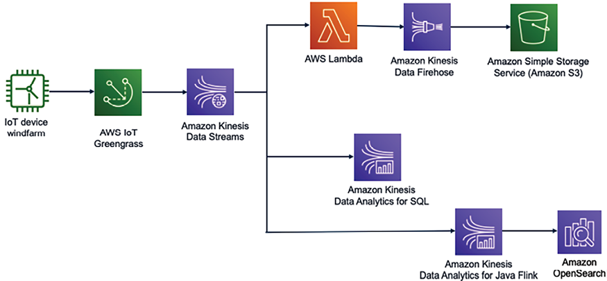

Figure 12.10: Streaming data analytics for IoT data

In the preceding diagram, data is ingested from the wind farm to understand the health and speed of a wind turbine. It’s important to control wind turbines in real time to avoid costly repairs in the case of high wind speeds beyond the wind turbine’s limit.

The wind turbine data is ingested into Kinesis Data Streams using AWS IoT Greengrass. Kinesis Data Streams can retain the streaming data for up to a year and provide replay capability. These are subjected to the fan-out technique to deliver the data to multiple resources, where you can message data using Lambda and store it in Amazon S3 for further analytics using Amazon Kinesis Firehose.

You can perform real-time queries on streaming data using simple SQL queries with Kinesis Data Analytics for SQL and you can automate a data pipeline to transform streaming data in real time using Kinesis Data Analytics for Java Flink and store the processed data in Amazon OpenSearch to get data insights. You can also add Kibana to OpenSearch to visualize the wind turbine data in real time.

The preceding solution is data agnostic and easily customizable, enabling customers to quickly modify pre-configured defaults and start writing code to include their specific business logic.

## Choosing the right big data architecture

Choosing between data lake, lakehouse, and data mesh architectures depends on your specific business requirements, data strategy, and technical capabilities. Each architecture offers unique benefits and is suited for different data management and analytics scenarios. To aid in making the right choice, the following list highlights the benefits, important considerations, and ideal use cases for each type of architecture:

- **Data lake architecture**: A data lake is primarily intended for the storage of large volumes of raw data in its original format.
  - **Benefits**: It provides high scalability and flexibility in handling various data types. It’s cost-effective for storing large amounts of data and can be used as a central repository for all organizational data.
  - **Considerations**: Without proper governance, data lakes can become unmanageable (“data swamps”). They require careful management to ensure data quality and accessibility.
  - **Use cases**: It is suitable for big data analytics, ML, and situations where you need to store and analyze large volumes of diverse data at a low cost. It is particularly suitable for situations where there is a requirement to store diverse types of data – including structured, semi-structured, and unstructured – without having a predetermined schema at the point of data entry.
- **Lakehouse architecture**: This combines elements of both data lakes and data warehouses.
  - **Benefits**: It aims to provide the low-cost scalability of data lakes with the robust schema and performance optimization of data warehouses. It offers a unified platform for all types of data processing and analytics, reducing data silos. It also supports ACID transactions and schema enforcement, improving data reliability and quality.
  - **Considerations**: Implementing a lakehouse architecture can be complex, requiring integrating various components and ensuring consistency and reliability across different workloads.
  - **Use cases**: It is best for organizations requiring big data processing and traditional BI from a single platform. It’s ideal for use cases that need real-time analytics and reporting on large and diverse datasets.
- **Data mesh architecture**: It focuses on decentralizing the data architecture and ownership. It treats data as a product, with domain-oriented teams owning and providing their data as products to the rest of the organization.
  - **Benefits**: It encourages a more agile and flexible data management and analytics approach. It also promotes data democratization, allowing for faster decision making and innovation within domains.
  - **Considerations**: It requires a cultural shift in how data is managed and shared. It demands strong governance and standardization across domains to ensure data interoperability and quality.
  - **Use cases**: It is suitable for large organizations with multiple independent teams or departments, where different domains produce and consume data.

The following are some key decision factors:

- **Organizational structure**: Consider whether your organization is centralized or decentralized. Data mesh is more suitable for the latter.
- **Data volume and variety**: Data lakes are ideal for massive, diverse datasets, while lakehouses provide a more structured environment for such data.
- **Analytical needs**: A lakehouse might be the best fit if you need real-time analytics combined with big data processing.
- **Governance and compliance**: Assess your data governance, quality, and compliance needs. A lakehouse architecture tends to offer more robust governance mechanisms.
- **Technical expertise**: Implementing and managing a data mesh or lakehouse architecture requires specific technical expertise and resources.

Ultimately, the choice depends on aligning the architecture with your business goals, technical capabilities, and data strategy. Each architecture has its strengths, and the best choice may even be a hybrid approach, depending on your specific requirements.

# Big data architecture best practices

You learned about various big data technology and architecture patterns in previous sections. Let’s look at the following reference architecture diagram with different layers of a data lake architecture to learn best practices.

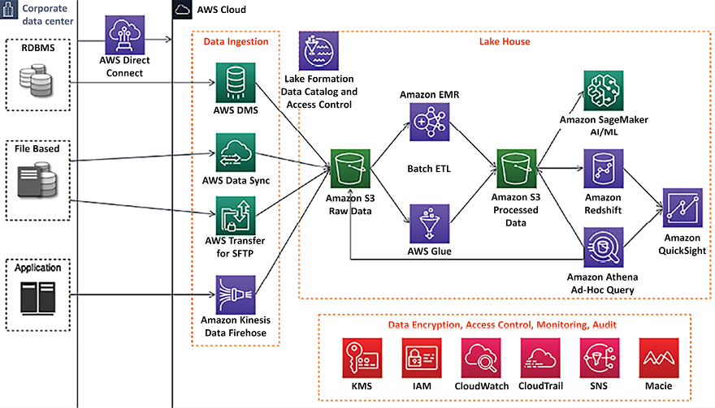

Figure 12.11: Data lake reference architecture

The preceding diagram depicts an end-to-end data pipeline in a data lake architecture using the AWS cloud platform with the following components:

- AWS Direct Connect will set up a high-speed network connection between the on-premises data center and AWS to migrate data. If you have large volumes of archive data, using the AWS Snow family to move it offline is better.\* A data ingestion layer with various components to ingest streaming data using Amazon Kinesis, relational data using AWS **Data Migration Service** (**DMS**), secure file transfer using AWS Transfer for **Secure Shell File Transfer Protocol** (**SFTP**), and AWS DataSync to update data files between cloud and on-premises systems.
- Centralized data storage for all data using Amazon S3, where data storage has multiple layers to store raw data, processed data, and archive data.
- Amazon Redshift is a cloud-native data warehouse solution with Redshift Spectrum to support lakehouse architecture.
- An ad hoc query functionality using Amazon Athena.
- A quick ETL pipeline based on Spark using AWS Glue.
- Amazon EMR will re-utilize existing Hadoop scripts and other Apache Hadoop frameworks.
- Amazon Lake Formation to build comprehensive data cataloging and granular access control at the data lake level.
- The AI/ML extension with Amazon SageMaker.

Other components include Amazon **Key Management Service** (**KMS**) for data encryption, Amazon **Identity and Access Management** (**IAM**) for access control, Amazon Macie for PII data detection to adhere to data compliance such as **Payment Card Industry Data Security Standard** (**PCI DSS**), CloudWatch to monitor the operation, and CloudTrail to audit the data lake activities.

You need to validate your big data architecture using the following criteria:

- Security:

  - Classify data and define corresponding data protection policies using resource-based access control.\* Implement a strong identity foundation using user permission and **single sign-on** (**SSO**).
  - Enable environment and data traceability for audit purposes.
  - Apply security at all layers and protect data in transit and at rest using SSL and encryption at all layers.
  - Keep people away from data, such as locking down write access to production datasets.

- Reliability:
  - Enforce data hygiene using automated data profiling using data cataloging.
  - Manage the life cycle of data assets, transitioning, and expiration using data tiering between the data warehouse and data lake.
  - Preserve data lineage by maintaining the history of data movement through the data catalog.
  - Design resiliency for analytics pipelines and monitor system SLAs with automated recovery of ETL job failures.
- Performance efficiency:

  - Use data profiling to improve performance with data validation and to build a sanitization layer.
  - Continuously optimize data storage, such as using data compression with a Parquet format, data partition, file size optimization, and so on.\* Cost optimization:

  - Adopt a consumption model and determine whether you need an ad hoc or fast query pattern.\* Delete out-of-use data; define data retention rules and delete or archive data out of the retention period.
  - Decouple compute and storage with a data lake-based solution.
  - Implement migration efficiency using different migration strategies for various data sources and volumes.
  - Use managed and application-level services to reduce the cost of ownership.

- Operational excellence:
  - Perform operations as code using tools such as CloudFormation, Terraform, and Ansible.
  - Automate operations such as building an orchestration layer with Step Functions or Apache Airflow.
  - Anticipate failure in advance by continuously monitoring and automating the recovery of ETL job failures.
  - Measure the health of your workload.

You can use the preceding checklist as a guide to validate your big data architecture. Data engineering is a vast topic that warrants multiple books to cover each topic in depth.

In this chapter, you learned about various components of data engineering with a popular architecture pattern, which will help you get started and explore the topic in more depth.

# Summary

In this chapter, you learned about the big data architecture and components for a big data pipeline design. You learned about data ingestion and various technology choices available to collect batch and stream data for processing. As the cloud is central to storing the vast amounts of data produced today, you learned about the various services available to ingest data in the AWS cloud ecosystem.

Data storage is one of the central points of handling big data. You learned about various kinds of data stores, including structured and unstructured data, NoSQL, and data warehousing, with the appropriate technology choices associated with each. You learned about cloud data storage from popular public cloud providers.

Once you collect and store data, you need to transform it to get insights into that data and visualize your business requirements. You learned about data processing architecture and technology choices to choose open source and cloud-based data processing tools per your data requirements. These tools help you get data insights and visualizations per the nature of your data and organizational needs.

You learned about various big data architecture patterns, including data lake, lakehouse, data mesh, streaming data architecture, reference architecture, and how to choose the right architecture for your data needs. Finally, you learned big data architecture best practices by combining all your learning in the reference architecture.

As you collect more data, it’s always beneficial to get future insights, which can be exceptionally beneficial for business. You often need ML to predict future outcomes based on historical data. In the next chapter, let’s learn more about ML and how to make your data architecture future-proof.
