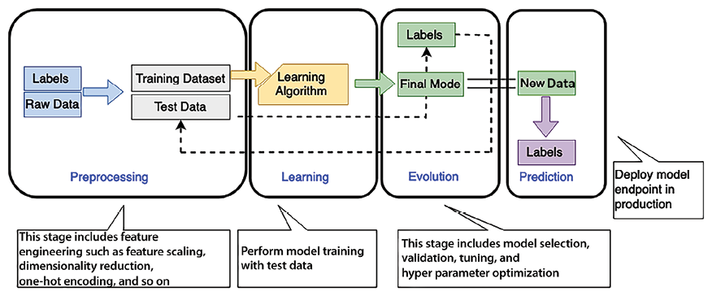

# Machine Learning Architecture

In the previous chapter, you learned about ingesting and processing big data and getting insights to understand your business. In the traditional way of running a business, the organization’s decision maker looks at past data and uses their experience to plot the future course of the company’s direction. It’s not just about setting up the business vision but also improving the end user experience by predicting and fulfilling their needs or automating day-to-day decision-making activities such as loan approval.

However, with the sheer amount of data available now, it’s become difficult for the human brain to process all data and predict the future. That’s where **artificial intelligence (AI)** and **machine learning** (**ML**) come in. AI is the broader concept of machines carrying out tasks in smart ways like Siri and Alexa to understand your questions and give answers, and ML is a specific subset of AI that involves teaching computers to learn and make decisions based on data. They help us to predict future courses of action by looking at a large amount of historical data. Most enterprises are investing in ML today, primarily because of the acceleration brought by generative AI (GenAI). ML is fast becoming the technology that helps companies differentiate themselves—through the creation of new products, services, and business models, allowing them to innovate and gain a competitive advantage.

AI and ML are excellent for solving business problems because they present countless use cases in different lines of business across a company, and the high degree of impact these use cases can make. For example, with ML you can build a new level of customer service with call center intelligence or help marketing teams deliver on their personalization objectives by using an ML-based personalized marketing campaign.

Within the scope of this chapter, we’ll cover the following topics to handle and manage your ML needs:

- What is machine learning?
- Working with data science and machine learning
- Machine learning in the cloud
- Building machine learning architecture
- Design principles for machine learning architecture
- MLOps
- Deep learning
- **Natural language processing** (**NLP**)

By the end of this chapter, you will have an understanding of ML architecture. You will learn about the various ML models and the ML workflow. You will understand the process of creating an ML model pipeline through feature engineering, model training, inference, and model evaluation.

# What is machine learning?

Machine learning drives better customer experiences, more efficient business operations, and faster, more accurate decision making. With the rise in compute power and the proliferation of data, ML has moved from the periphery to become a core differentiator for businesses and organizations across industries. ML use cases can apply to most businesses, like personalized product and content recommendations, contact center intelligence, virtual identity verification, and intelligent document processing. There are also customized use cases built for specific industries—like clinical trials in pharma or assembly line quality control in manufacturing.

ML uses technology in order to find new trends and inculcate mathematical predictive models based on past factual data. ML can help to solve complex problems such as the following:

- You may need to learn how to create complex code rules to make a decision; for example, if you want to recognize people’s emotions in images and speech, there are no easy ways to code the logic to achieve that.
- When you need to analyze a large amount of data for decision making and the volume of data is too large for a human to do this efficiently. For example, while a human can do it with spam detection, the amount of data makes it impractical to do this quickly.
- Relevant information may only become available dynamically when you need to adapt and personalize user behavior based on individual data; for example, with individualized product recommendations or website personalization.
- When many tasks with a lot of data are available, you cannot track the information fast enough to make a rule-based decision—for example, fraud detection and NLP.

Humans handle data prediction based on the results of their analyses and their experiences. Using ML, you can train a computer to provide expertise based on available data and get a prediction based on new data. Here are some prevalent use cases for ML across various industries:

- **Predictive maintenance**: Predict whether a component will fail in advance based on sensor data. This is commonly applied in estimating the **remaining useful life** (**RUL**) of automotive fleets, manufacturing equipment, and IoT sensors. Its primary benefits are increased vehicle and equipment uptime and significant cost savings. This application is widespread in the automotive and manufacturing industries.
- **Demand forecasting**: Use historical data to project key demand metrics quicker and more accurately, aiding in making more accurate business decisions about production, pricing, inventory management, and purchasing/restocking. The main advantages include meeting customer demand, minimizing inventory carrying costs by reducing surplus inventory, and decreasing waste. Industries like financial services, manufacturing, retail, and, **consumer packaged goods** (**CPG**) frequently employ this use case.
- **Fraud detection**: Automate the identification of potentially fraudulent activities and flag them for further review. The primary benefit of this is the reduction of costs related to fraud and the maintenance of customer trust. This use case is implemented in the financial services and online retail sectors.
- **Credit risk prediction**: Explain individual predictions from credit applications to predict the likelihood of whether credit will be paid back or not (often called a _credit default_). The benefit lies in identifying bias and complying with regulatory requirements. This use case is predominantly used in the financial services and online retail industries.
- **Data extraction and analysis from documents**: Understand text in handwritten and digital documents, extracting information for classification, and decision-making purposes. This use case is widespread in sectors like healthcare, financial services, legal, mechanical, electrical, and education industries.
- **Personalized recommendations**: Make customized recommendations based on historical data. This approach is common in the retail and education sectors.
- **Churn prediction**: Estimate the probability of customers discontinuing their services. This is often utilized in industries such as retail, education, and **software as a service** (**SaaS**) providers.

The main idea behind ML is to make available a training dataset to an ML algorithm and have it predict something from a new dataset, for example, feeding some historical stock market trend data to an ML model and having it predict how the market will fluctuate in the next six months to one year.

When developing ML systems, it’s important to carefully combine data and code. Both must come together in an organized manner and should evolve in a controlled way to build toward the common goal of a robust and scalable ML system.

The data you use for training, testing, and making decisions with the ML system inference will change over time as data comes from different places. Your code also needs to change with data to accommodate data from various sources. Without a systematic approach, there can be divergence in how code and data change. This mismatch can cause problems when you try to use your ML system for real tasks. It can also get in the way of smooth deployment, and lead to results that are hard to understand, trace, or repeat later. There are various types of ML; let’s explore them.

## Types of machine learning

ML helps computers learn things without us needing to program every detail. It is like teaching computers to learn from experience. Imagine teaching your dog a trick: you show it what to do, and then it learns and does it! With ML, computers can learn from data and then use this learning to make decisions. Let’s look at the different ways computers can learn.

### Supervised learning

In supervised learning, the algorithm is given a set of training examples where the data and target decisions are known. It can then predict the target value for new datasets containing the same attributes. With this type of learning, the algorithm is taught using a dataset where input data comes with the correct answer or target. The algorithm learns to connect inputs with their correct outputs using these examples.

This type of learning is often used for tasks where you need to classify things into categories or predict numbers, like in classification and regression tasks. For example, it can be used to classify emails as spam or not spam or to predict the price of a house based on its features.

### Unsupervised learning

In unsupervised learning, the algorithm is provided with a massive volume of data and should discover patterns and relationships among the data. It can then draw inferences from datasets.

Human intervention is not required in unsupervised learning, for example, auto-classification of documents based on context. It addresses the problem where correct output is unavailable for training examples, and the algorithm must find patterns in data using clustering.

In unsupervised learning, a model is trained using an unlabeled dataset. The algorithm works on its own to discover patterns, structures, or relationships in the data without any specific guidance or labeled examples to follow. This type of learning is often applied to clustering, dimensionality reduction, and density estimation tasks. News agencies or legal firms often deal with massive data. Using unsupervised learning, they can automate document categorization, efficiently manage their digital repositories, and improve information retrieval processes, such as recommending similar articles or cases to readers or researchers.

### Semi-supervised learning

This approach mixes elements of both supervised and unsupervised learning. It involves using a small amount of labeled data along with a more significant amount of unlabeled data to improve model performance. Semi-supervised learning is particularly useful when obtaining labeled data is either costly or takes a lot of time. It’s often used in scenarios where there’s a limited amount of labeled data, but plenty of unlabeled data. Within the biomedical field, for example, semi-supervised learning can be very advantageous. For instance, annotating medical images requires a lot of time and resources, making semi-supervised learning a practical solution. Models can be initially trained on a small set of labeled images and then fine-tuned using a more extensive set of unlabeled images, maximizing utility while minimizing costs and resources.

### Reinforcement learning

This type of learning involves training agents (or computer programs) to make a series of sequential decisions in a certain setting. The goal is for the agent to learn the best actions to take in order to maximize a cumulative reward over time. Agents learn by taking action, receiving feedback (rewards or punishments), and adjusting their strategies. Reinforcement learning is used in autonomous robotics, game playing (e.g., AlphaGo), and recommendation systems. Autonomous vehicles employ reinforcement learning by navigating through traffic and adjusting actions based on the environment, thus ensuring optimal decision making in diverse scenarios. The vehicle makes sequences of decisions (like changing lanes, adjusting speed, etc.), receiving positive reinforcement for safe, efficient actions and negative reinforcement for undesirable actions.

### Self-supervised learning

This is a type of unsupervised learning where the algorithm generates labels or targets from the data. It often involves tasks like predicting missing parts of data. Self-supervised learning has gained popularity in NLP and computer vision for pre-training models on large datasets before fine-tuning specific tasks. In image processing or computer vision, self-supervised learning can be employed to predict the next frame in a video sequence, thus facilitating models that understand movement and development within visual data. Pre-training models in this manner and then fine-tuning them for specific tasks, like object detection, can yield impressive results.

### Multi-instance learning

In multi-instance learning, each data point is a bag containing multiple instances (sub-data points). The goal is to learn from bags of data while only having access to bag-level labels. Multi-instance learning has applications in drug discovery, image classification, and content-based image retrieval. Considering e-commerce platforms, multi-instance learning could be employed to predict whether a user will purchase a product within a session (a bag), using various instances like page views, clicked products, and time spent on pages. The bag-level label might indicate whether a purchase was made during that session, providing a robust basis for predictions and personalized content delivery.

These diverse learning paradigms, each with its own specialty and application area, make ML a versatile field, adaptable to various scenarios and challenges across industries and domains. By choosing a paradigm tailored to the specificities and available data of a given problem, ML practitioners can derive insightful models and facilitate intelligent, automated decision-making across applications. The key is to select a learning type that aligns best with the available data and the problem at hand, ensuring that models are both robust and applicable.

In the next section, let’s learn how data science goes hand in hand with ML.

# Working with data science and machine learning

ML is all about working with data. The quality of the training data is crucial to the success of an ML model. High-quality data leads to a more accurate ML model and the right prediction.

Data often has multiple issues, such as missing values, noise, bias, outliers, and so on. Exploring the data makes us aware of this, providing us with necessary information on data quality and cleanliness, interesting patterns in the data, and likely paths forward once you start modeling. Data science includes data collection, data preparation, analysis, preprocessing, and feature engineering.

Data preparation is the first step in building an ML model. It is time consuming and constitutes up to 80% of the time spent on ML development. Data preparation has always been considered tedious and resource intensive due to the inherent nature of data being “dirty” and not ready for ML in its raw form. “Dirty” data could include missing or erroneous values and outliers. Feature engineering is often needed to transform the inputs to deliver more accurate and efficient ML models.

The first step in data preparation is to understand the business problem. Data scientists are often eager to jump into the data directly, start coding, and produce insights. However, without a clear understanding of the business problem, any insights you develop have a high chance of becoming a solution that cannot address the problem at hand. It makes much more sense to start with a straightforward user story and business objectives before getting lost in the data.

After building a solid understanding of the business problem, you can narrow down the ML problem categories and determine whether ML will be suitable to solve your business problem.

Data preparation often involves multiple steps such as data cleaning, dealing with missing values, data normalization/standardization, and data labeling. You will learn about these steps in detail in the upcoming _Building machine learning architecture_ section later in this chapter. Most standalone data preparation tools are equipped with functionalities for data transformation, feature engineering, and visualization. Data transformation might include tasks like converting currencies (for example, from dollars to euros) or changing measurement units (such as from kilograms to pounds). Feature engineering involves creating new data columns (features) from existing ones to enhance the dataset’s utility for ML models; for instance, extracting the day of the week or the month from a date column can help the model discern time-related patterns. While these tools excel in preparing data, they often lack built-in capabilities for model validation, a critical step in assessing an ML model’s performance. What’s needed is a framework that provides all these capabilities in one place and is tightly integrated with the rest of the ML pipeline. Data preparation modules therefore need curation and integration before they are deployed in production.

As shown in the following diagram, data preprocessing and learning to create an ML model are interconnected—your data preparation will heavily influence your model, while the model you choose heavily influences the type of data preparation you will do. Finding the correct balance is highly iterative and is very much an art (or trial and error):

Figure 13.1: ML workflow

As shown in the preceding diagram, the ML workflow includes the following phases:

- **Preprocessing**: In this phase, the data scientist preprocesses the data and divides it into training (70% of the data), validation (10% of the data), and testing (20% of the data) datasets. Your ML model is trained using the training dataset, which helps it learn and give the right prediction. Once training is complete, the model is then evaluated with a separate validation dataset to assess its performance and generalization capabilities. Once the model is ready, you can test it using a testing dataset. Features are independent attributes of your dataset that may or may not influence the outcome. Feature engineering involves finding the right feature, which can help to achieve model accuracy. The label is your target outcome, which is dependent on feature selection. You can apply dimensionality reduction to choose the right feature, which filters and extracts the most compelling feature for your data.
- **Learning**: You select the appropriate ML algorithm per the business use case and data in this phase. This is the core of the ML workflow, where you train your ML model on your training dataset. To achieve model accuracy, you need to experiment with various hyperparameters and perform model selection. Hyperparameters are the configuration settings used to control the learning process in ML algorithms.
- **Evaluation**: Once your ML model has been trained in the learning phase, you want to evaluate its accuracy with a known dataset. To assess your model, you use the validation dataset kept aside during the preprocessing step. Required model tuning needs to be performed per the evaluation result if your model prediction accuracy needs to be revised to the exceptions determined by validation data.
- **Prediction**: Prediction is also known as inference. In this phase, you deploy your model and start making a prediction. These predictions can be made in real time or in batches.

GenAI has led a paradigm shift in the landscape of ML and AI. At its core are **foundational models** (**FMs**) like GPT-4, which have been trained on vast, internet-scale datasets, redefining the conventional norms of data labeling and model customization. This groundbreaking technology empowers organizations to fine-tune FMs with limited data tokens, thereby significantly reducing the manual effort and time traditionally associated with data preparation.

However, it is vital to recognize that GenAI is not a silver bullet because it is not designed to address all AI and ML problems. Also, the development of FMs is a resource-intensive endeavor, demanding substantial computational power and access to extensive datasets. As such, many enterprises opt to leverage FMs provided by renowned third-party companies, such as OpenAI, Google, Meta, and Anthropic, who have pioneered the development of these models.

Nonetheless, the story does not end there. Custom model training remains a compelling option, especially when specific, tailored solutions are required. While GenAI provides an innovative approach to problem solving, the strategic decision to adopt it should align with an organization’s unique goals, resources, and constraints. You will learn more about GenAI in _Chapter 14_, _Generative AI Architecture_.

As per your data input, the ML model often has overfitting or underfitting issues, which you must consider to get the right outcome. Let’s learn more about this.

## Evaluating ML models—overfitting versus underfitting

In overfitting, your model needs to generalize, which means it should perform well not just on the data it was trained on (the training set) but also on new, unseen data (the test set or validation set). If a model is overfitting, it has essentially memorized the training data, capturing noise along with the underlying pattern, which leads to poor performance on any new data. If a model shows high performance metrics on the training data but significantly lower metrics on the test data, it’s a sign of overfitting.

This typically indicates that the model is too flexible for the amount of training data, allowing it to _memorize_ the data, including noise. Overfitting corresponds to high variance, where small changes in the training data result in significant changes to the results.

In underfitting, your model fails to capture essential patterns in the training dataset. Typically, underfitting indicates that the model is too simple or has too few explanatory variables. An underfitting model needs to be more flexible to model real patterns and corresponds to high bias, indicating that the results show a systematic lack of fit in a certain region.

The following graphs illustrate the clear difference between overfitting and underfitting, as they correspond to a model with a good fit:

Figure 13.2: ML model overfitting versus underfitting

The ML model categorizes two data point categories, illustrated by the preceding graphs’ rings and crosses. The ML model tries to determine whether a customer will buy a given product or not. The chart shows predictions from three different ML models. You can see an overfitted model (on the right) traversing through all ringed data points in training and failing to generalize the algorithm for real-world data outside of the training dataset. On the other hand, the underfitted model (on the left) leaves out several data points and needs to be more accurate. A good model (shown in the middle) usually provides clear data point predictions. Creating a good ML model is like creating art; you can find the right fit with model tuning.

## Popular machine learning algorithms

The popularity of an algorithm often depends on its applicability and performance in diverse use cases, ease of understanding, and implementation, as well as its ability to scale and adapt to different types of data. Let’s look at some popular ML algorithms.

### Linear regression

Linear regression tries to understand how one thing (let’s say, _X_) can help predict another thing (_Y_) by finding a linear relationship between them. Imagine you’re at a farmer’s market. When you observe the prices of pumpkins, you notice that as the size of the pumpkin increases, so does its price. Linear regression acts like drawing a straight line through all the price points of pumpkins, ensuring the line is as close to all points as possible.

Real estate is a sector where linear regression plays a vital role. For instance, if a company wants to predict the selling price of a house, it will look at features like the number of rooms, location, and age of the property. If houses with more rooms have typically been sold for higher prices in the past, the model will predict a higher price for houses with more rooms in the future. It’s like predicting the price of our pumpkin based on its size.

### Logistic regression

Logistic regression tells you the probability or chance of something happening, with “yes” or “no” answers. Imagine you are trying to predict whether a book will be a bestseller or not. Logistic regression will look at features like the number of pages, the popularity of the author, and the genre to predict the likelihood (between `0` and `1`) of it becoming a bestseller.

In healthcare, logistic regression can predict the likelihood of a patient having a disease based on various symptoms and test results. For example, by considering factors like age, blood pressure, and cholesterol levels, it can predict the probability of a person having heart disease. Doctors might conduct further tests if the probability is high, ensuring early and proactive management of potential health risks.

### Decision trees

Decision trees help you make a series of decisions by asking questions. Imagine you want to decide what to wear. The decision tree might ask: “Is it raining?” If “yes,” it might suggest a raincoat. If “no,” it might ask another question, like “Is it hot?”, and suggest clothes accordingly, helping you navigate through various options until you find the best answer.

Decision trees can help predict whether a customer will buy a product in the retail sector. For instance, it might ask: “Has the customer bought something in the last month?” If “yes,” they might likely buy again soon. If “no,” it might consider other factors like recent website visits or clicked promotions to predict their purchasing behavior, helping retailers target customers with relevant ads and offers.

### Random forests

As its name implies, a random forest is like creating a forest where each tree is a decision tree that casts a vote to decide on the outcome. Each tree is given a random subset of the data and makes its best decision. Then, all trees “vote” to provide a final answer. This approach often results in better, more stable predictions than a single decision tree.

In finance, random forests can be used for predicting whether to approve or deny loan applications. For example, trees might consider different aspects like credit score, income, and debt to make individual decisions. The final decision, made through a majority vote of all trees, is more accurate and robust than relying on a single model, thereby reducing the risk of lousy loan approval.

### K-Nearest Neighbours (k-NNs)

Using **k**\-NNs is like looking at a new thing and trying to understand it by comparing it to similar things we already know. If you find a fruit you’ve never seen before, you might decide whether it’s likely to taste sweet or sour by comparing it to similar-looking fruits whose taste you’re familiar with. If it looks like other sweet fruits, you might guess it’s sweet.

K-NN is widely utilized in recommendation systems, like those in e-commerce websites. If a user has bought a particular product, k-NN finds similar products that other similar users have bought and recommends them to the user. For example, suppose a user buys a detective novel. In that case, k-NN looks for other users who bought the same novel and then recommends other books that those users have bought, enhancing the user’s shopping experience by showing relevant products.

### Support vector machines (SVMs)

SVMs are decisive algorithms that aim to keep things clear and separate. Imagine you have a big table and put apples on one side and bananas on the other. SVMs try to find the broadest possible line (or gap) to separate these two fruits so that all apples are on one side and all bananas are on the other, causing no mix-ups.

In the field of handwriting recognition, SVMs are helpful. For instance, if you write a number, say “4,” SVMs help the computer decide whether it’s indeed a “4” or maybe a “9” by looking at many examples of how people write these numbers and finding the best boundary that separates “4” from “9,” thus helping in accurately reading handwritten numbers.

### Neural networks

Think of neural networks like a mini-brain inside the computer that learns from lots of examples to make decisions. When you learn to ride a bike, you might initially fall, but gradually, you learn how to balance and pedal by understanding what went wrong in the previous attempts. Neural networks learn similarly, adjusting from errors to make better decisions next time.

For example, social media platforms use neural networks to identify and tag people in photos in image recognition. The network learns by looking at many pictures of a person and noticing features like nose shape and eye color. When a new photo is uploaded, it compares these features with its learned knowledge, making the best guess on who’s in it.

### K-means clustering

K-means clustering is a means of grouping similar data points together. It’s like organizing a big party where you want to create groups (or clusters) of friends who share similar interests so that they enjoy each other’s company. You repeatedly try different ways to group individuals, trying to ensure that everyone in a group is as similar to each other as possible, ensuring a fun time for all.

A popular application of k-means is customer segmentation for marketing strategies. Businesses can use k-means to group customers into clusters based on their purchasing behavior. For instance, one cluster might be customers who buy frequently but spend little each time, while another might be customers who buy infrequently but make big purchases. Each group can be targeted with different marketing strategies to maximize sales.

### XGBoost

XGBoost learns from past mistakes and becomes wiser and wiser with each decision. If you were solving math problems and you solved one incorrectly, XGBoost would look at it, understand where you went wrong, and remember this mistake so that the next time it faces a similar problem, it doesn’t repeat the same error.

In the credit industry, XGBoost is widely used to predict whether a customer will default on a loan. Looking at many factors like income, age, and previous loan history predicts the probability of a customer defaulting. If an applicant is predicted to have a high risk of default, the loan might be denied, thereby minimizing the risk for the bank.

These algorithms are the foundation of many ML projects, chosen based on the specific problem and data types (e.g., text, images, numerical data) with which one works. Some of them, like neural networks, require more computational resources and data, while others, like decision trees or k-NN, might be applicable even with smaller datasets.

We continue our exploration of ML by next looking at popular ML tools and frameworks.

## Popular machine learning tools and frameworks

ML is accomplished using various tools and frameworks, each designed to aid different aspects of developing ML models – from data processing and algorithm design to model training and deployment. Here are some of the popular ones.

Popular tools and frameworks for data preparation and exploration include:

- **NumPy**: The core Python library for scientific computing. Numerical Python, or NumPy, is a library of multi-dimensional array objects and a set of operations for manipulating such arrays.

  An array is a collection of data items of the same type, stored in contiguous memory locations.

  NumPy facilitates easier and more efficient numerical and logical operations on large datasets. Imagine a retail company that wants to calculate the monthly average sales to analyze the performance and decide the future strategy. They have daily sales data stored in a numerical format. Using NumPy, they can easily calculate monthly average sales by organizing the daily sales data into an array, summing it, and dividing it by the number of days.

- **Pandas**: A library offering Python users simple, high-performance data structures and data analysis capabilities, allowing users to analyze and manipulate data. It presents Series and DataFrames, two essential data structures for Python that are constructed on top of NumPy.

  A Series is a column, and a DataFrame is a multi-dimensional table comprising a series collection.

  Pandas functionalities make it easy to clean, analyze, and visualize data. For example, imagine a grocery store wanting to analyze its sales data to understand which products are the best selling and which ones are not doing well. They have a large dataset with information about every transaction, including the product name, quantity sold, and price. Using pandas, they can easily manipulate this data, finding the total sales for each product, sorting them, and identifying the top-selling items.

- **Scikit-learn**: A straightforward and effective predictive data analysis tool that works with pandas and NumPy. Numerous supervised and unsupervised learning techniques are supported by scikit-learn. It is extensively utilized in ML, data mining, and data analysis. Scikit-learn has many built-in tools for model selection, evaluation, data import, and improvement. Imagine a bank wants to predict whether a customer will default on their loan. They have historical data on previous customers, including age, salary, marital status, and whether they defaulted. Using scikit-learn, they can build a model (like a decision tree, logistic regression, or another appropriate algorithm) that learns from this data, and then use this model to predict the likelihood of new customers defaulting on their loans.

Popular tools and frameworks for data visualization include:

- **Matplotlib**: A popular and feature-rich Python library for making static, interactive, and animated visualizations. In addition to line, scatter, error bar, histogram, bar, pie, box, and 3D plots, Matplotlib offers an incredibly versatile foundation for creating a vast array of visualizations. This tool allows developers and data scientists to visualize their data in various forms of plots, which can be very useful for understanding the data distribution and patterns, debugging issues, or visualizing the relationships among the data. Let’s say a teacher wants to visually present the scores of students in a class to highlight overall performance and outliers quickly. Using Matplotlib, the teacher can create a variety of charts, like bar charts, scatter plots, or histograms, to represent the distribution of scores in an easily interpretable visual format.
- **Seaborn**: A Matplotlib-based statistical data visualization library that offers a high-level interface for designing appealing graphs. Seaborn has several built-in themes and color palettes to make creating aesthetically pleasing and visually informative charts easy. It is particularly well suited for visualizing complex datasets with multiple variables, thanks to its support for creating multi-plot layouts and functionalities to visualize the relationship between multiple variables. Imagine a retail business that wants to understand its customer purchasing behavior across different product categories over a period of time. With Seaborn, analysts can create a heatmap to visually represent purchasing frequency across various product categories in different months, allowing quick insights into trends and customer preferences.
- **Business intelligence (BI) tools**: BI tools such as Tableau, Microsoft Power BI, Amazon QuickSight, and MicroStrategy are used for converting raw data into an understandable format. These tools help people visualize, understand, and make decisions with their data. Unlike other mentioned tools, these tools come with a graphical user interface that allows users to drag and drop items to analyze data, making it particularly accessible to individuals without a coding background. BI tools can connect to numerous data sources, providing real-time data insights. You can create and share dashboards, which provide interactive visualizations with embedded analytics. Consider a restaurant chain that wants to optimize its supply chain and menu based on customer purchasing behavior and seasonal trends. Using a BI tool, the company can visualize sales data across various dimensions, such as time, customer demographics, and product categories, to identify patterns and inform decision-making processes.

Popular tools and frameworks for model development and training include:

- **TensorFlow:** A comprehensive open-source platform designed to manage a range of ML tasks. TensorFlow supports a range of APIs for building, training, and deploying AI models. A key feature of TensorFlow is its ability to create dataflow graphs. These graphs show how data moves through a series of processing steps or nodes. In these graphs, each node stands for a mathematical operation, and the connections between nodes, known as edges, represent tensors, which are multi-dimensional data arrays. TensorFlow provides tools for developers to use large-scale ML and nurtures an extensive library that makes it convenient to learn and develop AI models, ranging from beginners to experts. Imagine a healthcare start-up wanting to leverage ML to predict the onset of diseases based on various patient metrics like age, genetics, weight, and lifestyle habits. They could utilize TensorFlow to build a neural network model that considers all these factors to predict the likelihood of disease occurrence.
- **PyTorch**: A popular ML library due to its flexibility, ease of use, and dynamic computational graph, which is particularly useful for deep learning. Developers, researchers, and data scientists favor it for both research and production due to its flexibility and extensive functionality. The dynamic computation graph enables users to change network behavior on the go, and the library provides a rich API for application in various ML tasks like classification, regression, and reinforcement learning, to name a few. Imagine an e-commerce company that wants to develop a chatbot to enhance customer experience. Using PyTorch, they could develop a deep learning model that understands the customer’s language and provides useful and accurate responses to customer queries in real time.
- **Keras**: An open-source software library that serves as an easy-to-use API for building and training deep learning models. It can run atop other popular ML libraries like TensorFlow, making it highly versatile. Keras is particularly favored for its simplicity and ease of use in experimentation. With Keras, data scientists and developers can turn their ideas into results with minimal delay, which is vital in innovative projects. Let’s consider a retail company trying to recommend products to customers based on their past purchase history. The company could use Keras to create a recommendation system that analyzes customer buying patterns and suggests products they are likely to buy.
- **Apache Spark’s MLlib:** An ML library that’s part of Apache Spark, designed to scale up to meet the demands of big data. MLlib provides various ML algorithms including classification, regression, clustering, and collaborative filtering, as well as tools for model selection and evaluation. It also provides APIs for saving models for later use. MLlib is designed to handle large-scale ML tasks efficiently. Given its distributed computing capability, MLlib can quickly handle vast datasets, making it particularly valuable for scenarios where large-scale data analysis and model training are essential. Moreover, MLlib can be utilized with different data sources and formats, offering flexibility in dealing with various data types. Imagine a financial institution that wants to identify fraudulent credit card transactions as they occur. Using MLlib, data scientists can utilize vast amounts of transaction data to train models that identify unusual purchase patterns or anomalous transactions indicative of fraud, allowing for real-time detection and mitigation of fraudulent activities.

Popular tools and frameworks for model deployment include:

- **Docker**: A platform designed to make creating, deploying, and running applications using containers easier. Docker is not an ML tool per se, but it plays a crucial role in deploying ML models and applications efficiently and consistently. Docker allows developers and data scientists to package an application along with all of its dependencies (libraries, tools, and scripts) into a “container.” This container can be transferred and run consistently across various computing environments, which means the application will work the same way regardless of where it’s being run. Imagine a software development team that is creating an ML application to predict stock prices. They have data scientists who use various tools and libraries for model creation and software engineers who build the application using different technologies. Using Docker, they can create a cohesive workflow where everyone can work in a consistent environment, ensuring that the model and application behave the same way during development, testing, and deployment despite being developed with different tools.
- **Flask**: A micro web framework written in Python. It’s simple to learn and simple to utilize, making it great for beginners, but it doesn’t include additional features (like form validation or database abstraction layers) that a full-stack framework might offer. However, its simplicity and ease of use make it popular for deploying lightweight web applications and APIs, especially in the data science and ML community. Imagine a scenario where a data scientist has developed an ML model to predict whether an email message is spam or not. This model could be utilized by a web application where users submit their emails, and in return, the application tells them whether the email is spam. Using Flask, the data scientist can create a simple web server that accepts email text, uses the ML model to predict if it’s spam, and then returns the result to the user, all through a web interface.

Popular integrated development environments (IDEs) include:

- **Jupyter** **Notebook:** An open-source web application that enables the creation and sharing of interactive documents. These documents can contain live code, equations, visualizations, and explanatory text, making them versatile tools for data analysis, scientific research, and educational purposes. It supports various languages, like Python, R, and Julia, and is extensively used in data cleaning, statistical modeling, ML, and much more due to its interactive computational environment. Jupyter is crucial in data science, academic research, and scientific computing for enabling users to create reproducible analyses and compellingly communicate their results through visualization and narrative text. Let’s consider a scenario where a biologist wants to analyze data on bird species and their migrations. The biologist could use a Jupyter notebook to write Python code that loads the data, visualizes migration patterns, and perhaps even uses ML to predict future migration timings or paths based on historical data.
- **RStudio**: An open-source IDE for R, a statistical computing and graphics programming language, that works with the standard version of R and can also work with the version of R available in the cloud. RStudio provides a robust set of capabilities for script development, data visualization, and statistical analysis, supporting the comprehensive utilization of the R language. Imagine a retail company wanting to understand the purchasing behaviors of its customers. Using RStudio, a data analyst could input sales data, apply statistical analysis, and create visualizations (like scatter plots, histograms, or bar charts) to identify buying trends, popular items, and peak shopping periods, potentially employing ML to forecast future sales trends.
- **Apache Zeppelin**: An open-source notebook-based environment similar to Jupyter, which allows data engineers, data analysts, and data scientists to develop, organize, execute, and share data workflows and collaboratively execute code. Zeppelin supports various data processing backends like Apache Spark, Python, and JDBC. Users can create data-driven, interactive, and collaborative documents with Scala, Python, SQL, and so on. A particular strength of Zeppelin lies in its built-in data visualization and some integrations that aren’t as out-of-the-box for Jupyter users. Consider a scenario in the healthcare sector where analysts want to explore patient data to understand patterns in disease outbreaks. Using Zeppelin, they can interactively explore datasets, integrate various data processing backends, and create visualizations like heatmaps or line charts to represent outbreaks over geographic regions or timelines visually.

Zeppelin, RStudio, and Jupyter notebooks are the most common environments for data engineers doing data discovery, cleansing, enrichment, labeling, and preparation for ML model training.

As the cloud is becoming a go-to platform for ML model training, let’s learn about some available ML cloud platforms.

# Machine learning in the cloud

ML development is a complex and costly process. There are barriers to adoption at each step of the ML workflow, from collecting and preparing data, which is time consuming and undifferentiated, to choosing the right ML algorithm, which is often done by trial and error, and lengthy training times, which leads to higher costs. Then there is model tuning, which can be a very long cycle and requires adjusting thousands of different combinations. Once you’ve deployed a model, you must monitor it and then scale and manage its production.

To solve these challenges, all major public cloud vendors provide an ML platform that facilitates ease of training, tuning, and deploying ML models anywhere at a low cost. For example, Amazon SageMaker is one of the most popular platforms that provides end-to-end ML services. SageMaker provides users with an integrated workbench of tools brought together in one place through SageMaker Studio. Users can launch Jupyter Notebook and JupyterLab environments instantly through SageMaker Studio. SageMaker also provides complete experiment management, data preparation, and pipeline automation and orchestration to help make data scientists more productive. SageMaker also provides the fully managed RStudio platform, which is one of the most popular IDEs among R developers for ML and data science projects. SageMaker provides fully managed servers in the cloud. Beyond notebooks, SageMaker provides other managed infrastructure capabilities as well. From distributed training jobs, data processing jobs, and even model hosting, SageMaker takes care of all of the scaling, patching, high availability, and so on associated with building, training, and hosting models.

Similarly, GCP provides the Google Cloud AI platform, with different services to perform ML experiments, and Microsoft Azure offers Azure ML Studio.

In addition to managed ML platforms, cloud vendors also provide ready-to-use AI services. AI services allow developers to easily add intelligence to any application without needing ML skills. The pre-trained models provide ready-made intelligence for your applications and workflows to help you personalize the customer experience, forecast business metrics, translate conversations, extract meaning from documents, and more. For example, AWS provides the Amazon Comprehend AI service, which has pre-trained models that support keyphrase detection and sentiment analysis natively in multiple languages.

The cloud is increasingly serving as a primary platform for accessing and utilizing GenAI FMs, offering a cost-effective and scalable environment for testing and deploying these advanced AI systems. These FMs are trained on vast datasets and can be fine-tuned for specific tasks, making them versatile tools for a wide range of applications. The cloud’s scalability and resource availability make it an ideal environment for working with these large, resource-intensive models. Both open-source and commercial GenAI FMs are available, offering options for different needs and budgets.

This accessibility of GenAI FMs via the cloud democratizes advanced AI capabilities, enabling businesses and developers to leverage cutting-edge AI technology without the need for significant upfront investment in computational infrastructure. For example, using an API, Amazon Bedrock allows you to access multiple third-party foundation models from companies like stability.ai, Meta, Mistral, Anthropic, Amazon, and AI21. Similarly, Azure provides API access to OpenAI’s GPT-4, and GCP provides access to their FM model Gemini. You will learn more about them in Chapter 14, _Generative AI Architecture_.

Data scientists can leverage managed cloud environments to accelerate data preparation and model training. When complete, they can one-click deploy the model and begin serving inferences over HTTP.

Let’s learn more about some of the essential things to consider when you are designing ML architecture.

# Building machine learning architecture

Building a robust and scalable workflow from a loose collection of code is a complex and time-consuming process, and many data scientists need to gain experience building workflows. An ML workflow can be defined as an orchestrated sequence that involves multiple steps. Data scientists and ML developers first need to package numerous code recipes and then specify the order in which they should execute, keeping track of code, data, and model parameter dependencies between each step.

Added complexity in ML workflows warrants monitoring changes in data used for training and predictions because changes in the data could introduce bias, leading to inaccurate predictions. In addition to monitoring the data, data scientists and ML developers also need to monitor model predictions to ensure they are accurate and don’t become skewed toward particular results over time. As a result, it can take several months of custom coding to get the individual code recipes to execute in the correct sequence and as expected.

ML architectures need to protect model artifacts and provide self-service capabilities for model development and training. It’s essential for your ML architecture to facilitate automated, comprehensive documentation of the entire model development life cycle, encompassing stages from across development, training, and deployment.

ML applications should also employ a continuous integration and continuous deployment (CI/CD) pipeline that is seamlessly integrated with change control systems. This integration is crucial for model management and deployment. Additionally, the environments require pre-defined security configurations.

The following are the ML architecture components from the **AWS** ML platform to help you understand ML architecture.

Other ML platforms are Azure ML Studio, H2O.ai, SAS, Databricks, and the Google AI platform.

## Prepare and label

To prepare data for ML, you need to run your data processing workloads, such as feature engineering, data validation, model evaluation, and model interpretation. Feature engineering also preprocesses datasets to convert the input datasets into a format expected by your ML algorithm. For example, if you’re working with a dataset that includes dates, you might extract the day of the week, the month, and the time of the year as separate features, as these could have predictive value for your model. You can use the various tools and techniques mentioned in the previous section to wrangle data as per your ML needs. A managed ML platform like Amazon SageMaker also provides a data wrangler and feature store capability to simplify the data processing job. SageMaker Data Wrangler allows you to easily prepare your data for ML by providing a visual interface to access, combine, clean, and transform data. This tool helps you perform common data preparation tasks without writing code, speeding up the process and reducing the chance of errors.

Additionally, SageMaker Feature Store is a centralized repository to store, share, and manage curated features for ML models. This ensures consistency across different models and reduces redundancy in feature engineering efforts. Feature Store helps in maintaining a consistent set of features for training and inference, facilitating better model performance and easier model maintenance.

During the data processing phase, labeling your data is a crucial step. This process helps in organizing and constructing accurate datasets for ML. To facilitate this, you can engage third-party services specializing in data labeling, like Labelbox, CrowdAI, Docugami, and Scale, which offer expertise in image labeling and other types of data annotation. Additionally, platforms like Amazon SageMaker Ground Truth provide an automated solution for image data labeling.

Once your data is ready, the next step is to select a suitable algorithm and build the model.

## Select and build

Before creating an ML model, you first want to understand business problems clearly, which will help you select the suitable algorithm. As explained in the previous section, you can choose from a list of algorithms and ML frameworks, broadly both _supervised_ and _unsupervised_ ML algorithms. This may be dictated by the data available. Once you select the suitable algorithm for your use case to build an ML model, you need a platform to train and develop your model.

Jupyter Notebook and RStudio are the most popular platforms among data scientists to build ML models. You can use cloud platforms such as Amazon SageMaker to spin up Jupyter Notebook or RStudio Workbench. AWS provides SageMaker Studio and RStudio, a web-based visual interface, in a place where all the developmental steps of ML will be performed by you.

To select your model, you can choose several built-in ML algorithms that you can use for various problem types, or get a number of models and algorithms available in the cloud market, making it easy to get started quickly.

The next step is to train and tune the model. Let’s learn more about it.

## Train and tune

To accelerate the training process, it’s advisable to utilize a distributed compute cluster. This setup allows you to distribute the training workload across multiple computing resources, significantly speeding up the training phase. By employing such a cluster, you can parallelize the computation, which means different parts of the training data can be processed simultaneously. As a result, the model training completes faster, and the output, which your applications can utilize, becomes available sooner. This approach not only enhances efficiency but also enables the handling of larger datasets, contributing to the development of more accurate and robust ML models. Model tuning is also known as hyperparameter tuning, which is critical to achieving result accuracy.

You need to find the most effective version of a model by running multiple training jobs on your dataset using the chosen algorithm and varying ranges of hyperparameters. Following this, choose the correct hyperparameter values that yield a model that performs the best, as determined by a metric of your choice.

While you are tuning the model, it’s crucial to have debugging capabilities that help capture real-time metrics during the training phase, such as training and validation accuracy, confusion matrices, and learning gradients. These metrics are essential for enhancing the accuracy of your model. Additionally, it’s important to produce documentation to help improve model accuracy. You need to capture the input parameters, configurations, and results and categorize them as different experiments. This organization allows you to efficiently search for previous experiments by their characteristics, review previous experiments with their outcomes, and visually compare the results of various experiments to inform further adjustments and improvements. Most managed ML platforms, such as Amazon SageMaker, provide these features for you.

Amazon SageMaker also provides Autopilot, a feature that automates several aspects of model development. Autopilot examines raw data and applies feature processing techniques. It then picks the most suitable algorithms, conducts training, tunes multiple models, and monitors their performance. The models are ranked based on their performance metrics.

After finalizing your model, you need to deploy it and manage it in a production environment to gain valuable insights and achieve your desired outcomes.

## Deploy and manage

You must deploy your trained ML model into a production environment to enable real-time or batch data predictions. Implement auto-scaling for your ML instances across various locations to ensure high redundancy and establish a RESTful HTTPS endpoint for your application. The application should be configured to have an API call to an ML endpoint to achieve low latency and high data processing speeds. This architectural approach facilitates rapid integration of your new models into your application, streamlining the process because changes to the model do not necessitate modifications in the application’s code.

Data is subject to rapid changes due to factors like seasonality or unforeseen events, making it essential to continuously monitor your model for both accuracy and ongoing relevance to your business. A significant factor that can affect the accuracy of deployed models is if the data that is used for generating predictions differs from the training data used to train the model. For instance, changing economic conditions could drive new interest rates, which in turn could impact home purchasing predictions. This phenomenon is known as concept drift, whereby the patterns and correlations a model was trained on no longer hold true in the current data environment. To address this, you need to automatically detect concept drift in deployed models, with detailed alerts that assist in pinpointing the exact source of the problem.

Model compatibility is another crucial factor during deployment. Once a model has been built and trained using MXNet, TensorFlow, PyTorch, or XGBoost, for example, you can choose your target hardware platform from Intel, NVIDIA, or ARM. You need to compile your trained ML models to run optimally and efficiently in deploying compiled models to edge devices. This step ensures that your models not only deliver and provide high-performance and low-cost inference but also maintain cost effectiveness.

You should be able to run large-scale ML inference applications, which can include tasks like image recognition, speech recognition, NLP, personalization, and fraud detection. As you progress through the different stages of building and deploying ML models, understanding how to fine-tune and adapt them for efficient deployment and operation becomes key, particularly for applications that require real-time processing and responsiveness. Let’s look at a reference architecture to connect all components.

## ML reference architecture

The following example architecture depicts a bank loan approval workflow based on customer data built on the AWS cloud platform.

Customer data is ingested in the cloud and the ML framework decides on the customer loan application.

Figure 13.3: ML architecture in the AWS cloud

In designing the preceding architecture, some fundamental design principles to consider as a guide are:

- **Training workflow**:

  1.  Datasets enter the process flow using S3. This data may be raw input data or preprocessed from on-premises datasets.
  2.  Ground Truth is used to build a high-quality, labeled training dataset for ML models. If required, the Ground Truth service can label the data.
  3.  AWS Lambda can be used for data integration, preparation, and cleaning before datasets are passed to SageMaker.
  4.  Data scientists will interface with SageMaker to train and test their models. The Docker images used by SageMaker are stored in ECR and can be custom images with custom toolsets created through the build flow steps or use one of the pre-built Amazon images.
  5.  Model artifacts to be used as part of the deployment phase are output to S3. The output from the SageMaker model can also be used to label data using Ground Truth. Models that have been pre-built and trained on-premises or other platforms can be deposited into the model artifacts S3 bucket and deployed using SageMaker.
  6.  AWS Lambda can trigger an approval workflow based on a new model artifact being deposited into the S3 bucket.
  7.  Amazon Simple Notification Service (SNS) can be used to provide an automatic or manual approval workflow based on human intervention to deploy the final model. The supporting Lambda function takes the output from SNS to deploy the model.
  8.  DynamoDB stores all model metadata, actions, and other associated data for audit tracking.
  9.  To host the final model, we deploy the endpoint with the associated configuration as part of the final step in the workflow.

- **Build workflow**:

  2.  SageMaker notebook instances are used to prepare and process data and to train and deploy ML models. These notebooks can be accessed via a VPC endpoint for the SageMaker service.

  - CodeCommit provides the repository for the source code to trigger the build jobs required for any custom Docker images used by SageMaker.
  - The CodePipeline service manages the end-to-end build pipeline for the custom Docker images and uses the CodeBuild service for the build/test phase.
  - CodeBuild will build and perform unit testing of the custom Docker image and push it to Amazon ECR (this process can be managed centrally or by business functions requiring the tools).

- **Deploy workflow**:

  2.  As SageMaker endpoints are private, Amazon API Gateway exposes the model endpoint to end users for inference.

Batch transform jobs are typically utilized to obtain inferences for an entire dataset. By employing a trained model and a dataset, the output from the batch job is stored in S3. Additionally, you can utilize SageMaker Model Monitor to oversee production models and send alerts in case of any quality issues.

This section taught you about ML architecture with a CI/CD pipeline. We look at ML architecture design principles next.

# Design principles for machine learning architecture

Designing an effective ML architecture requires a strategic approach, prioritizing scalability, maintainability, efficiency, and robustness. Here are some design principles that professionals typically adhere to when developing ML architectures.

## Organizing the machine learning system into modules

**Modularity** breaks down the ML system into separate, interchangeable components or modules, each responsible for a distinct function. In an ML model, for instance, you could have one module for data ingestion, another for preprocessing, one for model training, and yet another for prediction serving. Consider a retail recommendation system: the data ingestion module might be responsible for collecting user interaction and purchase history, while another module uses that data to train a model that recommends products. The advantage is that if a better recommendation algorithm is developed, the training module can be replaced or updated without disrupting the data ingestion module.

In a **financial fraud detection system**, as another example, modularity allows the development team to isolate and update the prediction model whenever new fraud patterns are identified without altering the data collection or transaction monitoring modules. This compartmentalized approach promotes streamlined troubleshooting, targeted upgrades, and generally enhanced system manageability.

## Ensuring scalability

**Scalability** refers to the ML architecture’s capacity to gracefully handle increases in workload or demand, ensuring consistent performance. This is pivotal when managing larger datasets or when user requests grow significantly. For instance, in a streaming service like Netflix, the recommendation system must scale to accommodate the growing number of users and their viewing histories without compromising on the speed or accuracy of the recommendations. Scalability ensures that the service remains uninterrupted and consistently high-performing even as data and demand grow.

Another real-world example would be an **e-commerce platform** during a Black Friday sale. The system must scale to process and analyze exponentially higher transaction and user data.

## Ensuring reproducibility

It is vital to ensure that ML models can reliably reproduce outcomes. This means that if the model is retrained with the same data, code, and parameters, it should produce the same results. An e-learning platform may use an ML model to personalize learning content for each user. If a particular model version yields impressive results, being able to reproduce it ensures a consistent user experience and facilitates future debugging and development.

Consider an ML model used for **diagnosing medical conditions** from imaging data in healthcare. Ensuring reproducibility means that the diagnoses remain consistent and reliable across different instances of the model, reinforcing trust in the automated system among healthcare professionals and patients and ensuring that scientific studies using the model are valid and verifiable.

## Implementing data quality assurance

**Data quality assurance** means implementing mechanisms to validate and ensure the data’s accuracy, completeness, and reliability, fed into ML models. For a system like a voice-activated virtual assistant, which is continually learning from user interactions to improve response accuracy, ensuring that the incoming data is accurate and relevant is paramount to train the model effectively. Faulty or low-quality data could lead the model to learn incorrect patterns, diminishing the user experience.

Take an **autonomous vehicle navigation system** as another example. Ensuring data quality is crucial because the decisions made by the ML model based on this data directly impact the safety and efficacy of the vehicle.

## Ensuring flexibility

**Flexibility** in ML architecture refers to the ability to easily modify and adapt the system to accommodate changes or enhancements in data, technology, and requirements. A flexible system can integrate new data sources, manage different data types, and adapt to different algorithms or technologies as needed. Imagine a news aggregator app that uses ML to personalize content for users. Flexibility allows this app to easily adapt its model to new data sources (like a new news website) or to integrate new types of data (like video news or podcasts) without requiring a comprehensive architecture redesign.

With **customer support chatbots**, as another example, having flexibility allows the chatbot to adapt its responses and interaction style based on evolving user expectations and linguistic trends. Suppose the model identifies a shift in user interaction style or a surge in specific inquiries. A flexible architecture enables it to integrate new data or adjust its algorithms to enhance user interactions and satisfaction.

## Ensuring robustness and reliability

Ensuring **robustness and reliability** means that the ML architecture should produce consistent, dependable results and be resilient to variations in the input data or system disturbances. For instance, a robust ML model for an email provider should consistently filter spam messages irrespective of the variety of spam techniques or message content. It should reliably protect the user’s inbox even if spammers change their strategies or use different languages and terminologies.

In **automated stock trading**, the robustness and reliability of the ML models are vital to ensure that trading decisions are consistent and protected from volatile market conditions or deceptive trading activities. An ML system must recognize and navigate through market noise, erroneous data, or manipulative trading activities to safeguard investments and maintain investors’ trust.

## Ensuring privacy and security

**Privacy and security** involve safeguarding the data and the ML model from unauthorized access and ensuring that personal or sensitive data is handled ethically and complies with regulations. In a personal finance app that uses ML to provide financial advice, for example, it’s imperative to protect the user’s financial data and ensure that the model’s predictions are secure from malicious attacks to preserve both user privacy and model integrity.

Considering **personalized marketing** as a use case, handling user data, such as shopping history, preferences, and personal details, with utmost privacy and security is essential. Ensuring the ML model, which curates personalized marketing content, adheres to data protection regulations and is resilient against data breaches protects the end users. It preserves the brand’s reputation and legal compliance.

## Ensuring efficiency

**Efficiency** is about maximizing the performance of the ML system while minimizing the resources used. An efficient ML model ensures that the computational, data storage, and other resource usages are optimized without compromising the model’s output quality. In the case of mobile apps that use ML for features like image recognition or language translation, an efficient model will provide quick and accurate results without excessively draining the device’s battery or utilizing intensive computational resources.

An example of **real-time fraud detection** in online transactions highlights the necessity of efficiency. The ML model must rapidly analyze transaction data and accurately identify fraudulent activities to provide immediate alerts or actions, all while managing computational resources to handle countless transactions happening every second. Efficiency ensures swift, accurate fraud detection without imposing unsustainable computational costs or latency in transaction processing.

## Ensuring interpretability

Ensuring **interpretability** in ML architecture means the model outputs are understandable and explainable to humans. For instance, a healthcare platform that employs ML to assist doctors in diagnosing diseases should offer interpretations of its predictions, enabling doctors to understand the reasoning behind the diagnostic suggestions and, thereby, make informed decisions for patient care.

Consider an ML application in **credit scoring**. Interpretability is paramount to both the end users, who might want to understand the factors influencing their credit score, and the regulators, ensuring that the scoring model is not biased and is compliant with legal standards. An interpretable ML model can elucidate which factors (e.g., transaction history, loan repayments, etc.) influence the credit score, providing transparency and facilitating trust among users and regulatory bodies.

## Implementing real-time capability

**Real-time capability** refers to the ML architecture’s ability to process data and produce outputs in real time or near real time, which is crucial in scenarios that require instant decision making. An autonomous vehicle, for instance, utilizes ML to make immediate decisions based on real-time inputs from various sensors and cameras, such as identifying obstacles and deciding the optimal path. The architecture must process, evaluate, and act upon real-time data to navigate dynamic environments safely.

In **customer support** provided by virtual assistants and chatbots, real-time capability ensures customer queries are addressed immediately and accurately, enhancing user experience and satisfaction. The ML model must comprehend user inputs, process the relevant data, and generate real-time responses to facilitate smooth and coherent interactions, even as user inquiries and conversations diversify and escalate.

## Ensuring fault tolerance

**Fault tolerance** implies that the ML architecture should maintain its functionality and produce reasonable outputs even when some system components fail or it encounters unexpected input data. For instance, an e-commerce recommendation system should continue to provide product suggestions to users even if specific data sources (like recent browsing history) are temporarily unavailable, ensuring continuous user engagement and potential sales.

In **industrial equipment monitoring** using ML to predict maintenance needs and detect failures, fault tolerance ensures that the system can still provide valuable insights even when some sensors fail or provide erratic data. The ML model should identify and manage such anomalies, providing reliable equipment health assessments and ensuring safe and continuous operations in the industrial setup.

Through adherence to these principles in ML architecture, models can robustly navigate through various real-world applications, from ensuring safe and efficient operations in industries to providing real-time, insightful interactions in customer support.

ML is applicable everywhere; for example, it can be applied in solving customer problems such as predictive maintenance, providing accurate forecasting for businesses, or building personalized recommendations for end users. ML use cases are not only limited to customer problems but also help you to handle your IT applications by optimizing your workload with predictive scaling, identifying log patterns, fixing errors before they cause issues in production, or budget forecasting for IT infrastructure. So, solutions architects must know about ML use cases and associated technology.

Earlier in this book, you learned about DevOps to automate and operationalize your development workload. As ML is becoming mainstream, MLOps has become essential to learning ML at scale in production. Let’s explore more details on operationalizing the ML workload with MLOps.

# MLOps

An ML workflow is a set of operations developed and executed to produce a mathematical model, which eventually is designed to solve a real-world problem. But these models have no value until they are deployed in production other than proofs of concept. ML models almost always require deployment to a production environment to provide business value.

At its core, MLOps fundamentally focuses on transitioning an experimental ML model into a fully operational production system. MLOps is an emerging practice, different from traditional DevOps due to the unique nature of the ML development life cycle and the specific ML artifacts it produces. The ML life cycle revolves around discerning patterns from training data, making the MLOps workflow particularly sensitive to changes in data, as well as variations in data volumes and quality.

A well-developed MLOps practice should support the monitoring of ML life cycle activities as well as the ongoing supervision of models once they are operational in production environments. This dual focus ensures both the efficiency of the development process and the effectiveness of the deployed models.

MLOps implementation makes it simple for organizations to feel confident in building a mature MLOps framework, eliminating extensive coding. Like any other workload, you want to develop MLOps by applying best practices such as security, reliability, high availability, and performance, and considering the cost for the deployment phase of the ML life cycle. Let’s have a look at a few MLOps principles.

## MLOps principles

Any changes in the code, training data, or model should trigger the build process in the ML development pipeline to make sure your model is performing well by accommodating changes immediately.

An ML pipeline should follow these MLOps principles while developing ML systems:

- **Automation**: The deployment of ML models in production should be automated. The MLOps team should automate the end-to-end ML workflow from data engineering to model interference in production without any manual intervention. This automation makes sure that there is no lapse in the production model where there are changes in training data and your model stays relevant. The MLOps pipeline can trigger model training and deployment based on events such as calendar scheduling, messaging, monitoring, data changes, model training code changes, and application code changes.
- **Versioning**: Versioning is an essential aspect of MLOps. Every ML model and related script version should be maintained in a version control system such as GitHub to make the models reproducible and auditable.
- **Testing**: ML systems require extensive testing and monitoring. Each ML system should have at least the following three scopes for testing:

  - Feature and data tests, which include validating data quality and selecting the right features for your ML model\* Model development tests, which include business metric tests, model staleness tests, and model performance validation tests
  - ML infrastructure tests, which include ML API usage tests, complete ML pipeline integration tests, and training and production server availability tests

- **Reproducibility**: Every phase of an ML workflow should be reproducible, which means that ML model training, processing of data, and emplacement of the ML model must deduce similar results for similar input. It will ensure a robust ML system.
- **Deployment**: MLOps integrates the principles of ML with the culture of DevOps, emphasizing CI/CD and **continuous training**/**continuous monitoring** (**CT/CM**). Through automated deployment and testing, MLOps facilitates the early detection of issues, enabling quick rectifications and iterative learning. This approach streamlines the process of deploying ML models into production, ensuring they remain effective and up to date.
- **Monitoring**: Over time, the performance of a model may degrade in production due to factors such as data drift. This scenario necessitates the continuous deployment of new or updated models to counteract any decline; they must be shipped into production constantly to address performance decline or to enhance model fairness. After deploying an ML model, it’s critical that a monitoring system is implemented to ensure that the ML model performs according to expectations and maintains its effectiveness in providing accurate and reliable outputs, which is essential for maintaining the overall quality and trustworthiness of the ML application as expected.

Having learned about MLOps design principles in this section, let’s consider some best practices to apply MLOps in your ML workload.

## MLOps best practices

Due to many moving parts (data, model, or code) and challenges in solving business problems using ML, MLOps can be a challenging task.

Based on the principles outlined in the previous section, the following are the best practices that ML engineers/full-stack data scientists should practice while deploying ML solutions in production, which will help reduce technical debt and maintenance overhead in ML projects and drive the most business value out of them:

- **Design considerations:** To develop a maintainable ML system, the architecture/system design should be modular and, as much as possible, loosely coupled. Implementing a loosely coupled architecture enables different teams within an organization to operate independently. This means they don’t have to depend on other teams for support or services. As a result, each team can work more swiftly and efficiently, contributing to the overall value and productivity of the organization.
- **Data validation**: Data validation is crucial for a successful ML system. In a production environment, data can present several challenges. One such issue arises if the statistical properties of the production data are different from those of the training data, indicating potential problems with properties, the training data itself, or the data sampling process. Additionally, data drift can occur, which might cause the statistical properties of data over time to change for successive batches. This drift can impact the model’s performance, as it was trained on data with different statistical characteristics.
- **Model validation**: Reusing models is different from reusing software. It’s best to tune models to fit each new scenario. Ensuring that models are thoroughly validated before they are moved into production is very important. To confirm that the model performs effectively on live data, it’s important to conduct both online and offline data validation. This process helps to establish that the model’s predictions are accurate and reliable under actual operating conditions.
- **Model experiment tracking:** It’s essential to meticulously document all experiments conducted with your ML models. Experimentation in ML may involve trying out different combinations of code (encompassing preprocessing, training, and evaluation methods), datasets, and hyperparameters. Each unique combination of these elements produces metrics, which you should compare against the outcomes of your other experiments. This comparison is key to understanding which approaches are most effective and optimizing your ML models accordingly.
- **Code quality check**: Every ML model specification (ML training code that creates an ML model) should undergo a code review phase. Checking the quality of the code as the initial path of a pipeline activated by a pull request is a nice practice in general.\* **Naming conventions**: Following a standard naming convention (like _PEP8_ for Python programming) in your ML coding practices is an effective strategy to help mitigate the challenges posed by the **Changing Anything Changes Everything** (**CACE**) principle. Consistent and clear naming conventions facilitate easier understanding and modification of the code. This not only helps in maintaining the integrity of the project when changes are made but also enables new team members to establish familiarity with your project quickly.
- **Model predictive service performance monitoring**: Other than project metrics (such as **root mean square error** (**RMSE**)) that calculate the behavior of a model with reference to the aim of the business, operational metrics such as latency, scalability, and service updates are also crucial to monitor to avoid business losses.
- **The CT/CM process:** In a production environment, model performance can deteriorate due to factors such as data drift. This necessitates the ongoing deployment of updated models to enhance or maintain the model’s fairness and accuracy. To effectively manage this, a CT/CM process is essential. CT ensures that models are regularly updated and trained with the latest data, while CM keeps track of the model’s performance in real time, identifying any issues or deviations that might occur due to changing data patterns. Together, CT and CM form a robust framework for ensuring the long-term reliability and effectiveness of ML models in production.
- **Resource utilization**: Understanding the requirements of your system during both the training and deployment phases is crucial for efficient operations. This insight helps your team effectively optimize the resources used for your experiments, which in turn can lead to significant cost savings. Proper resource management ensures that you allocate just the right amount of computational power, memory, and other resources necessary for the tasks at hand, without underutilizing or over-committing resources. This balance is key to maintaining both the performance and the cost effectiveness of your ML projects.

MLOps plays a crucial role in the industrialization of AI. MLOps collaborates ML, data engineering, and DevOps to effectively build, deploy, and maintain ML systems in production.

Deep learning is now the go-to mechanism to solve complex ML problems. Let’s learn more about deep learning.

# Deep learning

ML is about forecasting and solving complex problems using NLP, enabling computers to understand, interpret, and generate human language in a valuable and meaningful way. NLP is used in numerous applications, including language translation, sentiment analysis, chatbots, and voice assistants, allowing for more intuitive, human-like interaction with machines. While ML needs a pre-defined set of labeled data for supervised learning, **deep learning** uses a neural network for unsupervised learning to simulate human brain behaviors, using a large amount of data to develop ML capabilities. A neural network is a series of algorithms that recognize underlying relationships in a set of data through a process that mimics the way the human brain operates.

Deep learning involves a neural network of multiple layers where you don’t need to do data labeling upfront. However, depending on your use case, you can use both labeled and unlabeled data with deep learning. The following diagram shows a simple deep learning model:

Figure 13.4: An overview of deep learning layers

In the preceding diagram, a deep learning model has interconnected nodes where input layers provide data input through various nodes. This data goes through multiple hidden layers to calculate the output and deliver the final model inference through the output node layer. The input and output layers are visible layers, and learning happens in the middle layer through weights and bias, as shown in the following diagram:

Figure 13.5: Deep learning neural network model

In the preceding diagram, you can see a series of hidden layers between where each layer applies some weight functions to the interconnected nodes to learn the pattern, in the same way as a human brain. You can see **label** data coming in as input and going through neural network nodes with their weight (**0.2**, **0.4**, **0.3**, and **0.9**) indicated between vertices.

Weight is a neural network parameter that plays a role in transforming input data as it passes through the hidden layers. Essentially, the weight determines the extent to which a given input will influence the output. It can be thought of as representing the strength or intensity of the connection between nodes in the network.

For instance, if the weight from node A to node B is high, it implies that neuron A has a more significant influence over neuron B. Weights that are close to zero indicate that changing this particular input will have minimal or no impact on the output. Conversely, if the weights are negative, it suggests an inverse relationship – this means increasing the input will decrease the output and vice versa. This mechanism of weights is fundamental to how neural networks process and learn from data.

The preceding learning method is called **forward propagation**, where data flows from the input layer all the way to the output layer. Here, the output of one layer is fed as the input to the next, leading up to the final output.

On the other side, there’s another technique known as **backpropagation**. This involves calculating the error in the network’s predictions (the discrepancy between what the network predicts and the actual outcome). The network uses algorithms to calculate prediction errors and then adjusts its internal parameters—the weights and biases—based on this error. This adjustment happens in reverse, starting from the output layer and moving backward through the layers, which is why it’s called “backpropagation.”

Through the combined use of forward and backward propagation, a neural network is able to learn and improve. It processes data (forward propagation), identifies any inaccuracies in its predictions (backpropagation), and then tweaks its parameters to reduce these errors. This cycle is key to training the neural network to gradually become more efficient and accurate at its task with the training algorithm.

Deep learning encompasses different types of neural networks, each suited for different applications. The two most frequently used are:

- **Convolutional neural networks** **(CNNs)**: These are adept at processing data with a grid-like topology, such as images, making them highly effective for tasks involving visual input, such as computer vision and image classification tasks.
- **Recurrent neural networks** **(RNNs)**: RNNs excel in handling sequential data, making them ideal for tasks that involve understanding language and speech, such as NLP and speech recognition.

Some of the most popular frameworks for building these neural network models are TensorFlow, which has built-in support for various neural network architectures, and MXNet, which also supports a range of network architectures and is known for its efficiency and scalability, particularly in the context of high-performance deep learning applications. In addition to this, other popular deep learning frameworks are PyTorch, Chainer, Caffe2, ONNX, Keras, and Gluon.

This section has provided you with a high-level view of deep learning. It is a complex topic and requires an entire book to cover the basics. You will find multiple books available on each of the frameworks. Deep learning model training requires a lot of processing power and could be very costly. However, public cloud providers such as AWS, GCP, and Azure make it easy to use high-powered GPU-based instances to train these models with the pay-as-you-go method.

## Deep learning in the real world

Deep learning is widely popular, and there are multiple use cases of deep learning across various industries. Let’s take a look at some of the examples.

### Healthcare: diagnosis and prognosis

Deep learning models assist professionals in healthcare by providing a second opinion and sometimes even spotting details humans might miss. These models are trained on vast datasets of medical images, learning to identify features associated with diseases and conditions, and they can predict the probability of a patient having a particular disease. For instance, Google’s DeepMind has developed a model to spot eye diseases in scans. By analyzing 3D scans of patients’ eyes, the deep learning system can recommend how patients should be referred for treatment.

### Autonomous vehicles: navigation and safety

Deep learning models assist autonomous vehicles in understanding their surroundings, making decisions, and navigating the world. They are trained on extensive datasets of various driving scenarios and learn to recognize objects (like pedestrians and other vehicles), understand road signs, and make safe driving decisions (like when to brake or steer). Deep learning essentially allows these vehicles to interpret and understand the world around them, making automated driving possible and progressively safer as the technology evolves.

Tesla, Waymo, and other companies utilize deep learning for their autonomous vehicles. These vehicles are equipped with many sensors that feed data into deep learning models, enabling them to make real-time decisions.

### Manufacturing: quality control and predictive maintenance

In manufacturing, deep learning models optimize operations and enhance quality control. By analyzing data from manufacturing processes, models can identify manufacturing anomalies or defects in products early in the production chain, ensuring high-quality output. General Electric employs deep learning for predictive equipment maintenance, using models that analyze data from machinery to predict when they might fail or need maintenance, thereby reducing downtime.

With its capacity to derive insights from vast, complex datasets, deep learning finds applications across diverse real-world scenarios, driving innovations and optimizing operations in various industries. From healthcare, where it aids in diagnostics, to manufacturing, where it ensures optimal operations and quality, deep learning is an integral part of technological advancements in numerous sectors.

# NLP

NLP aims to understand and read, as well as utilize, the human language well. It combines AI and computational linguistics so that computers can process human language through spoken words or text. Let’s look at some of the use cases of NLP.

## Chatbots and virtual assistants

One of the common applications of NLP is in creating chatbots and virtual assistants like Siri, Alexa, or customer service chatbots on various websites.

Chatbots engage in interactive conversations with users, often assisting them in finding information, answering queries, or facilitating transactions. They leverage NLP to understand user inputs (questions or commands) and generate relevant responses. By analyzing the text, NLP models discern the intent behind the user’s message and respond accordingly. This application is widely utilized across industries like retail, banking, and customer service to enhance user experience and provide immediate responses to customer inquiries.

## Sentiment analysis

Companies use sentiment analysis, also known as opinion mining, to gauge sentiment toward their brand, products, or service by analyzing written or spoken words from customers, such as customer reviews and social media comments.

Sentiment analysis models, developed with NLP, examine text data to determine the emotional tone behind them, categorizing sentiments as positive, negative, or neutral. For instance, a company could analyze product reviews to identify whether customers are generally satisfied or dissatisfied. This information is crucial for businesses to understand customer perception and strategically adjust their products or services accordingly. Modern contact center solutions, such as Amazon Connect, have revolutionized customer service by incorporating real-time analysis of customer conversations. These systems can analyze voice interactions to determine the customer’s sentiment, which can assist customer support representatives during calls to drive customer engagement.

## Text summarization

Automated summarization tools that generate concise summaries of lengthy documents or articles employ NLP to understand and condense the content effectively.

Text summarization involves reducing a text document without losing its critical information and presenting it in a shortened form. NLP models extract essential details and key points from the document, providing a summarized version that retains the core message. This can be particularly useful in sectors like law or research, where professionals must review vast documents and extract pertinent information efficiently.

## Machine translation

Google Translate, which can translate text into different languages, heavily relies on NLP to understand and translate the text accurately.

Machine translation models utilize NLP to comprehend the text and its context in the source language and generate equivalent text in the target language. NLP ensures that the translation adheres to grammatical and syntactical rules and maintains the original message’s meaning and context. This has global implications, breaking down language barriers and facilitating international communication and information exchange.

By enabling machines to understand and process human language, NLP opens up many applications that enhance communication, provide insights, and streamline processes across numerous domains, including customer service, marketing, and global communication.

**Large language models** (**LLMs**), such as **generative pretrained transformer** (**GPT**) models, have emerged as transformative tools in NLP, showcasing impressive capabilities across various NLP tasks. These models are designed to understand, generate, and work with human-like text, enabling them to engage in activities like text completion, summarization, and translation. You will learn more about various LLMs in the next chapter.

Overall, ML and AI are vast topics and warrant multiple books to understand them more thoroughly. In this chapter, you were just given an overview of ML models, types, and workflows.

# Summary

In this comprehensive chapter, you journeyed through the fundamental concepts and practical applications of ML. You began by understanding the core principles of ML and its close relationship with data science, emphasizing the pivotal role of data in training and evaluating ML models. You explored different types of ML, ranging from supervised and unsupervised learning to reinforcement learning and deep learning. Each type was elucidated with real-world examples and common algorithms, providing you with an understanding of when and how to apply them.

Next, you delved into the critical concepts of model overfitting and underfitting, exploring the delicate balance required to achieve model generalization. You examined various strategies and techniques to address these challenges effectively.

Popular AI tools and frameworks were covered and the chapter also ventured into cloud-based ML, demonstrating the advantages and capabilities of harnessing cloud platforms for ML projects. The role of data in ML was expounded, with an emphasis on feature engineering and selection, as well as the meticulous process of building, training, tuning, deploying, and managing ML models. We discussed the design principles for ML architecture, providing best practices for architecting scalable and efficient ML systems.

MLOps was explored as anessential component of ML project development, providing a structured framework for designing and implementing robust ML systems.

Deep learning took center stage, revealing its profound impact on various industries, from image recognition to NLP. We dissected the architecture of deep learning models and explored practical applications in the real world.

The chapter culminated in exploring NLP and LLMs, demonstrating how these models transform communication, translation, and content generation. Taking a step further, GenAI is a key technology for the next evolution. In the next chapter, you will learn about GenAI architecture, various FMs, and available offerings that will help you gain expertise in GenAI.
