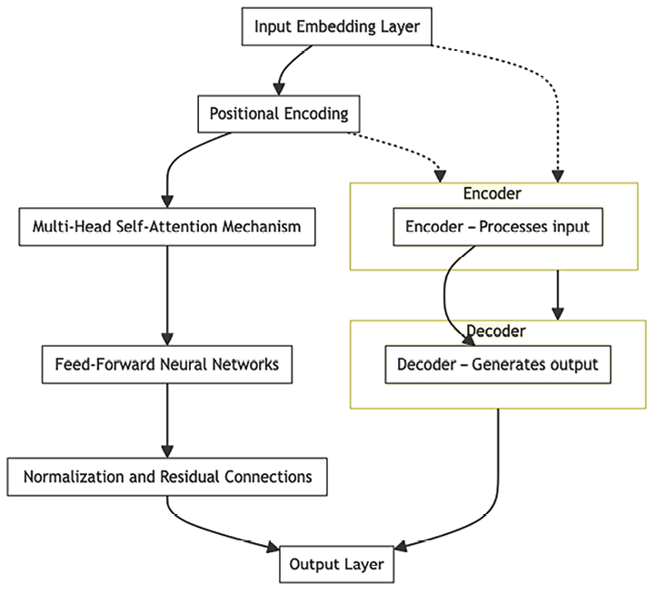

# Generative AI Architecture

Generative AI technology goes beyond mere industry jargon – that is, it is an advanced instrument used for reshaping business operations by automating essential tasks such as content generation, image creation, and knowledge assistance. Generative AI represents a thrilling leap forward in the tech world, igniting significant enthusiasm among those passionate about technological innovation. Referred to as GenAI, an abbreviation of Generative artificial intelligence, this form of technology stands out for its remarkable ability to independently produce new content, such as text, images, music, videos, coding, and so on, with capabilities that closely mimic human-like creativity.

The use of generative AI is increasing in different business areas. It can greatly reduce the time, resources, and costs needed to operate a business when used well. For instance, ChatGPT can assist in creating marketing campaigns for products or serve as a travel planner, while Midjourney can generate images in just a second.

You might have encountered generative AI applications like ChatGPT, Midjourney, Gemini (formerly Bard), Amazon Q, and Claude.ai, among others. This technology learns from a lot of information it gathers, including from the internet, and uses that knowledge to develop new content. It’s like having a smart assistant that can generate all sorts of things without needing human input for every detail. However, it’s crucial to understand that this isn’t magic – it’s the outcome of a great deal of smart thinking and advancements in the field of technology.

But the most exciting part is that we can use these foundation models in many ways. For instance, they can be used to generate creative content, automate customer service with chatbots, enhance data analysis, provide personalized recommendations, streamline language translations, and even aid in research by summarizing complex documents. In this chapter, you’ll learn about generative AI in more detail, including:

What is generative AI?

- Generative AI use cases
- The basic architecture of generative AI systems
- Popular generative AI foundational models
- How to start with generative AI
- Generative AI reference architecture
- Challenges in implementing generative AI

Get ready for an exciting journey into the world of generative AI. We will uncover the mysteries behind its remarkable abilities to influence the direction of our new world.

# What is generative AI?

Generative AI is artificial intelligence with the remarkable ability to develop new content and ideas. This includes things like having conversations, creating stories, producing images and videos, and even making music.

In December 2022, the design team at the **Laboratory for Artificial Intelligence in Design** (**AiDLab**) located in Hong Kong orchestrated a groundbreaking fashion exhibition titled Fashion X AI ([https://www.fashionxai.com/event-highlights-fashionshow](https://www.fashionxai.com/event-highlights-fashionshow)). This showcase was unique because every design featured in the event was created by AI, drawing inspiration from mood boards, color palettes, and concepts provided by human designers.

Like other types of AI, generative AI relies on **machine learning** (**ML**) models. These models are quite large and are pre-trained using vast amounts of data. We often call these models **foundation models** (**FMs**).

The FMs we have today (like OpenAI GPT-4 or Google Gemini for large language tasks, Stable Diffusion from Stability AI for converting text into images, and the OpenAI Sora text-to-video generator) can perform various tasks across many different areas. They can write blog posts, generate images, solve math problems, hold conversations, and even answer questions based on information in a document. These models are incredibly versatile and have the potential to revolutionize how we create and interact with content.

Generative AI has the potential to bring about sweeping changes to the global economy. According to Goldman Sachs, generative AI could drive a 7% (or almost $7 trillion) increase in global GDP and lift productivity growth by 1.5% over 10 years. You can read more details in the Goldman Sachs **Artificial Intelligence** (**AI**) report at [https://www.goldmansachs.com/intelligence/artificial-intelligence/](https://www.goldmansachs.com/intelligence/artificial-intelligence/).

FMs stand out due to their size and general-purpose nature, setting them apart from traditional ML models that are designed for specific tasks like sentiment analysis, image classification, and trend forecasting. Unlike these traditional models, which require gathering labeled data, training, and deployment for each task, FMs offer a more versatile approach. A single pre-trained FM can be adapted for various tasks. Moreover, these models can be tailored to perform domain-specific functions that are unique to individual businesses. Importantly, this customization can be achieved using only a fraction of the data, along with the computing resources that are needed to train a model from scratch.

The success of FMs can be attributed to three key reasons:

- **Transformer architecture**: The transformer architecture, a type of neural network, plays a pivotal role. It is efficient, scalable, and parallelizable and can effectively model input and output data relationships.
- **In-context learning**: A groundbreaking training paradigm called in-context learning has emerged. This approach allows pre-trained models to be equipped with instructions for new tasks or just a few examples. This eliminates the need for additional training on labeled data, enabling models to be immediately applied to new tasks.
- **Emergent behaviors at scale**: As model sizes increase and larger datasets are used, models begin to display previously unseen capabilities. This phenomenon is referred to as “emerging capabilities.” For example, larger models can generate more coherent and contextually relevant text, recognize complex patterns in data, and even perform tasks like image recognition and language translation with greater accuracy. They can also handle multi-step reasoning questions, provide detailed explanations, and generate creative content, such as writing music or creating artwork, with nuanced understanding and creativity. Larger models have the potential to perform tasks that are beyond their capabilities before reaching a critical size.

To understand better, let’s look at some use cases where generative AI can help.

# Generative AI use cases

Let’s look at various use cases across different categories such as customer experience, employee production, and business operations efficiency, and learn how generative AI is enhancing existing AI capabilities and bringing forth entirely new possibilities:

## Customer experience transformation

Generative AI is changing the game in how customers interact with businesses. Imagine you’re shopping online for shoes. A generative AI-based virtual assistant on the website greets you and helps you find the perfect pair based on your style and size preferences. It can even show you images of the shoes and answer any questions you have. Let’s look at some more such use cases where generative AI can help to improve customer experience and engagement:

- **Chatbots and virtual assistants**: Imagine you visit a website and a chatbot pops up to help you out. Generative AI powers these chatbots. They can talk to you like humans, understand your questions, and provide helpful answers.
- **Intelligent contact centers**: Generative AI is at work when you call a customer service hotline. It ensures that your interactions are more personalized, efficient, and satisfying. Your issues are addressed promptly and accurately.
- **Personalization**: Have you noticed that recommendations on platforms like Netflix and Amazon understand your preferences? That’s generative AI in action. It learns from your behaviors and tailors its suggestions to match your tastes.
- **Content moderation**: Generative AI helps keep things clean and safe on social media and other platforms. It scans user-generated content, like comments and posts, to make sure they follow the rules and guidelines.

## Employee productivity enhancement

Generative AI isn’t just for customers; it’s also boosting employee productivity. Imagine you’re working on a project and need to write a report about it. Instead of starting from scratch, you use generative AI to help you write an introduction and critical points. This gives you a head start, and you can focus on adding your insights and expertise. Here are some use cases where generative AI helps to boost employee productivity:

- **Conversational search**: You might use a search system when you need information. Generative AI makes these systems smarter. You can ask questions in everyday language, and the AI will understand and give you the correct answers.
- **Content creation**: Writing reports and articles can take a lot of time. Generative AI helps here, too. It can generate content sections, like summaries or explanations, which you can use to create polished documents.
- **Text summarization**: Imagine you’re reading a long research paper. Instead of going through all the pages, generative AI can summarize the main points. This saves time and helps you grasp the essential information faster.
- **Code creation**: For programmers, writing code is a big part of the job. Generative AI can assist by suggesting code snippets based on what you’re trying to achieve. This speeds up coding tasks and makes development smoother.

When integrating generative AI into enterprise scenarios, it’s crucial to navigate legal considerations around the content it generates. You need to understand the source of the content, and establishing clear ownership rights is essential to prevent intellectual property disputes. There are potential barriers to adoption, such as concerns over copyright infringement and data privacy. To mitigate these risks, your enterprises can consider developing their own generative AI assistants using proprietary data. This approach not only helps avoid legal complications but also ensures that the generated content is aligned with the organization’s specific needs and retains its unique value.

## Optimizing business operations

Generative AI isn’t limited to customer interactions; it also enhances various operational aspects. In a manufacturing plant, machines are monitored by sensors. Generative AI analyzes the data from these sensors and predicts when a machine will likely have issues. This allows maintenance to be scheduled proactively, preventing unexpected breakdowns and production interruptions. The following are some use cases where generative AI helps to improve business operations:

- **Intelligent document processing**: In businesses, there are many documents to handle. Generative AI can read and understand these documents, extracting meaningful information automatically. This saves time and reduces errors. For example, the generative AI model can ingest mortgage lending documents and answer questions about mortgage rates, payment terms, duration, etc.
- **Predictive maintenance**: For companies that use machinery, predicting when equipment needs maintenance is crucial. Generative AI analyzes data from machines and systems to forecast maintenance requirements, preventing breakdowns and minimizing downtime.
- **Quality control and visual inspection**: Ensuring products meet high standards is essential in manufacturing. Generative AI can examine images of products, identifying defects or inconsistencies that human eyes might miss.
- **Data augmentation**: Training AI models requires a lot of data. Generative AI helps here by creating synthetic data that can be used to improve the accuracy and reliability of these models.

In this section, you learned about generative AI use cases. Now, let’s learn what goes on behind the scenes by learning about generative AI architecture.

# The basic architecture of generative AI systems

At the heart of generative AI systems is a massive FM. FMS are large-scale, pre-trained models that have been trained on vast datasets and can be fine-tuned or adapted for a wide range of tasks and applications. To understand the architecture of generative AI systems, let’s break it down into simple components:

- **Generator**: The core element that generates new data, whether it’s images, text, music, or other forms of content. The generator learns patterns and relationships from existing data and uses this knowledge to produce new, similar content. For example, the generator takes random noise in image generation and produces images that resemble the training data.
- **Latent space**: A conceptual space where the model represents data in a compressed form. It’s like a compact representation of the data that the generator uses to create new content. This is a lower-dimensional vector space from which the generator generates data. This is like the secret recipe book an artist uses. It helps the generator come up with different types of creations. For instance, the latent space could represent different writing styles in text generation. In image synthesis, the latent space might represent different features like color and texture.
- **Loss function**: A measure of how well the generated content matches the desired output. The loss function helps the model learn and improve over time by minimizing the difference between generated and real data. Imagine a coach telling an artist how close their work is to perfection. The artist learns and gets better by following this guidance.
- **Training data**: The existing data that the model learns from. It could be images, text, audio, or any other type of content that is available from which the model learns. Just like a chef learns by tasting different foods, the generator learns what it should create from examples. For instance, if it’s creating songs, it learns from listening to existing songs.

## Types of generative models

Before learning about the generative models, let’s learn how they differ from the typical ML discriminating model. A typical ML discriminating model, also known as a discriminative model, is designed to differentiate between different classes or categories of data. Unlike generative models that aim to generate new data points, discriminative models focus on distinguishing existing data points based on their features. These models predict the probability of a given outcome based on the input data. Common examples of discriminating ML models include logistic regression, support vector machines, and so on. You learned about this concept in detail in _Chapter 13_, _Machine Learning Architecture_.

Generative models distinguish themselves from discriminating models, which are tailored to categorize or tag text based on predefined groupings. Discriminating models are commonly deployed in applications such as facial recognition, where their training focuses on identifying specific features or attributes within a person’s visage.

Figure 14.1: Generative models versus discriminating models

As shown in the preceding diagram, generative models try to understand the patterns and structure within the data. It’s like they are learning the hidden rules of a game and then using those rules to create something new that looks like the original game. Discriminating models, on the other hand, focus on telling things apart. They are like detectives who are trained to recognize differences between things. Discriminative models are typically chosen for supervised learning tasks where the goal is classification or regression, whereas generative models are selected when the goal is to understand data distribution or generate new data points.

Generative AI encompasses various models that create new content. We’ll look at some notable types in the following subsections.

### Generative Adversarial Networks (GANs)

GANs are made up of two components: the generator and the discriminator. The generator’s role is to produce content, and the discriminator’s job is to judge the authenticity of that content, determining whether it’s real or counterfeit. They engage in a sort of “competition,” where the generator aims to create content convincing enough to deceive the discriminator. As this process continues, the generator progressively improves at crafting content that appears increasingly realistic. The following diagram shows the workings of the GAN model:

Figure 14.2: Training flow of GANs

The preceding diagram represents the basic structure of a GAN. Let’s look at each step with the example of image creation:

- **Generator**: This component of the GAN takes in random noise as its input. This noise is often referred to as a “latent random variable.” The generator’s role is to produce data that is similar to the real data it has been trained on. Imagine this as an artist in training, initially creating random sketches based on some basic patterns of artwork. For example, the generator starts by creating random images that are intended to look like famous paintings.
- **Real data samples**: These are authentic data instances that the GAN is designed to mimic. They serve as the benchmark for the quality of the data that the generator creates. In our example, these are actual famous paintings from history, the masterpieces that the generator is attempting to emulate. For example, authentic paintings by artists like Van Gogh or Picasso are fed into the GAN as examples of “real” artwork.
- **Generated fake samples**: The generator uses the input noise to create new data samples. These samples are intended to be indistinguishable from the real data samples, although they are entirely generated by the model. These are the new images the generator creates, trying to replicate the quality and style of the real artwork samples. For example, the generator produces images that mimic the brushstrokes and color schemes of Van Gogh or Picasso’s works.\* **Discriminator**: This component takes in both real data samples and fake data samples generated by the generator. Its job is to distinguish between the two, effectively deciding whether each sample it receives is real or fake. Think of this as an art critic who examines both the real masterpieces and the generated images to decide whether the new images are genuine artworks or imitations. For example, the discriminator reviews the images, trying to determine which ones are the actual Van Gogh or Picasso paintings and which are the imitations.
- **Condition**: The discriminator makes a decision on whether the data is real or fake and provides this information as feedback to the generator. The art critic (discriminator) assesses the generated images and gives feedback, such as pointing out which aspects make them look fake. For example, the discriminator notes that the color palette in a generated image doesn’t quite match the original artist’s style and labels it as fake.
- **Fine-tune training**: Based on the discriminator’s assessments, the generator adjusts its parameters in an effort to create better fake samples that are more likely to fool the discriminator. This feedback loop continues with the discriminator also improving its ability to discern real from fake. This adversarial process continues until the generator becomes adept at creating realistic data. Based on the feedback, the artist in training (generator) learns from the criticism and improves its technique to create more convincing artwork. For example, taking the feedback into account, the generator adjusts its technique, maybe altering the color mix or brushstroke style to better imitate the masterpieces.

The generator and the discriminator are essentially in a continuous game, with the generator trying to produce increasingly realistic data, and the discriminator striving to get better at telling real data from fake. The “training” is complete when the discriminator can no longer reliably distinguish fake data from real data, meaning the generator’s output is convincingly realistic.

GANs have several practical applications across business domains; many popular tools leverage this model.

### Variational Autoencoders (VAEs)

Imagine you have a massive pile of Lego blocks in various shapes and sizes, and your task is to store them neatly in a small box. But there’s a catch: you can only store instructions on how to rebuild the original Lego structures, not the blocks themselves. This is similar to what VAEs do with data.

In this analogy, the “encoder” is like you taking each Lego structure, figuring out the best way to rebuild it using fewer blocks, and then writing down those instructions. The space inside your small box, where you keep these instructions, is like the “latent space” – a compressed version of the original structures.

Later, when you want to rebuild a Lego structure, you look at your instructions in the box. The “decoder” is like you following those instructions to build a new Lego structure that looks very similar to the original one using a new set of blocks.

So, a VAE takes large, complex data (the original Lego structures), compresses it into a simpler, smaller form (instructions in the box), and then uses that compressed form to generate new data that resembles the original data (rebuilding the Lego structures). This process is useful in technology for tasks like creating new images, music, or any digital content that mimics the original data’s style. As shown in the following diagram, a handwritten image is encoded and decoded using VAEs:

Figure 14.3: Image reconstruction flow using VAEs

The preceding diagram depicts the process flow of image reconstruction using VAEs. Here’s an explanation of how VAEs typically work for this task with an example of reconstructing a person’s face:

- **Input images**: These are the original images that you feed into the VAE system. The goal is to be able to reconstruct these images after they’ve been encoded and decoded. Let’s say we have a set of face photographs. Each image is a clear, high-resolution photo of a person’s face.\* **Encoder**: The encoder part of a VAE takes the input images and compresses them into a smaller, more compact representation known as the latent space or image encodings. This process involves learning the essential features and patterns present in the input images. The encoder analyzes input photographs and compresses each one into a smaller set of numbers that describe the key features of the faces, like the shape of the eyes, nose, and mouth. Imagine it like creating a unique code that could represent a face in much less space than the original picture.
- **Image encodings**: At this stage, the encoder has translated the input images into a set of encodings that represent the key features of the images in a much-reduced dimensionality compared to the original images. In the context of VAEs, these encodings also capture the probability distribution of the input data. These sets of numbers (encodings) are the essence of the photographs, stored in a compact form, which we can think of as the detailed features of the images. In the case of faces, these features might capture variations in facial features among different individuals.
- **Decoder**: The decoder takes these encodings and attempts to reconstruct the original images. It uses the compressed data to generate images that are as close as possible to the original input images. The decoder acts like an artist given the task of drawing a person’s face. It takes these numerical codes and uses them to recreate the photographs of the faces. It tries to draw each face as accurately as possible, just from this compact code.
- **Reconstructed images**: The final output of a VAE. These are the images that have been reconstructed by the decoder from the image encodings. The quality of these images is dependent on how well the VAE has learned to compress and reconstruct the data. The result is a series of new face photographs generated by the VAE. These reconstructed images should closely resemble the original input photos. If you were to compare them side by side with the originals, you would find them similar, though they might be slightly blurry or have minor differences due to the loss of detail during the compression process.

In essence, the flow describes a VAE’s ability to learn efficient representations of data and generate new data that resembles the original input. This process is used in various applications, including image denoising, inpainting, and as a generative model to create new images that share properties with the training dataset.

### Transformer-based generative models

These models, such as GPT-4, are built upon the transformer architecture, which excels in understanding and generating data sequences, such as text. They learn patterns in language and context, allowing them to generate coherent and contextually relevant text. The following diagram shows the working of the transformer in the model:

Figure 14.4: Component of transformer-based generative models

The preceding diagram shows the workflow of a transformer model, which is an advanced type of neural network used in **Natural Language Processing** (**NLP**) tasks such as translation, text generation, and more. Let’s look at each step with the example of language translation:

- **Input embedding layer**: The process begins with the input embedding layer, where individual elements (like words in a sentence) are transformed into numerical vectors that the model can process. For example, the sentence “How are you?” enters the model, and each word is turned into a numerical vector. This is like giving each word a unique, identifiable badge number so the model can understand and manipulate them.
- **Positional encoding**: Positional encoding is added to these vectors to give the model information about the position of each word within the sentence since transformers do not inherently understand the order of words. For instance, along with the badge number, each word is given a position tag. “How” is tagged as the first word, “are” as the second, and “you” as the third. This helps the model consider the order of words.\* **Encoder**: The combined embeddings (input embeddings plus positional encoding) are then fed into the encoder. The encoder processes the input data, capturing the context of each word relative to the others in the sequence. It’s like the encoder reads the sentence and understands the meaning of each word in the context of the entire sentence. The encoder reviews the words with their badge numbers and position tags to understand the sentence’s meaning. For example, it notes that “How” in the first position usually starts a question.
- **Multi-head self-attention mechanism**: Within the encoder, the multi-head self-attention mechanism allows the model to weigh the influence of different parts of the input differently. It’s as if the model is considering different aspects of the meaning of a word by looking at the other words around it. The encoder pays special attention to how each word in the sentence relates to every other word. It notices, for example, that “How” is connected to “you” to form a polite inquiry about someone’s well-being.
- **Feed-forward neural networks**: Next, the processed information passes through feed-forward neural networks, which further process the data sequentially in each layer to refine and abstract the representation. These networks refine the information from the attention mechanism, almost like a group of editors polishing a draft to better convey a sentence’s intent.
- **Normalization and residual connections**: Along the way, normalization and residual connections are applied to help maintain data flow and mitigate the risk of data transformation errors in deeper layers of the network. These elements ensure that the information flowing through the model is neither too dampened nor too amplified. To prevent errors from growing through the network layers, these components act like checkpoints that keep the data on the right track.
- **Decoder**: After the encoder has processed the input, the decoder uses this information to generate the output. It receives the processed data from the encoder and starts producing the transformed sequence, such as translating the sentence into another language or generating a response in a dialogue. The decoder takes the processed information from the encoder and begins generating the output. If it’s translating, it will start producing the translated sentence.\* **Output layer**: The final output of the decoder is sent to the output layer, which translates the advanced neural network output back into a readable format, like a sentence in human language. This is where the final output begins to take shape. If the model is translating the sentence, this layer starts building the translation based on all the processed information.

The transformer model reads and understands the input data (sentence, paragraph, etc.), processes it to understand the context, and generates a relevant output based on that understanding. For “How are you?”, the encoder part of the model processes the question, while the decoder generates a response or a translation, one word at a time, considering both the information from the encoder and what it has already generated.

Think of the encoder as the part that looks at the input information and the decoder as the part that creates the output. For example, GPT-4 is based on the transformer model. When you give it a starting point, it can generate text that makes sense and fits the context.

This model uses “self-attention” to determine which words in the starting point are important and how they connect. This way, it can really understand what you’re asking for and give you a good response.

### Other important generative models

Apart from the types mentioned, there are other notable generative models:

- **PixelCNN and PixelRNN**: These models generate images pixel by pixel, capturing intricate details and dependencies within the image. Imagine drawing a picture pixel by pixel, ensuring each pixel fits with the ones around it.
- **Flow-based models**: These models learn how to transform one data distribution into another, allowing them to generate samples matching the desired distribution. This is a recipe that turns simple ingredients into a fancy dish following specific instructions.

These generative models have strengths and applications, making them suitable for a large range of tasks, from image generation to text creation. Their diverse capabilities contribute to the rich landscape of generative AI.

## Importance of hyperparameter tuning and regularization in architectures

Hyperparameter tuning and regularization are fine-tuning and safety measures for generative AI architectures. For example, in image generation, you might adjust hyperparameters such as the learning rate, which determines how fast the model learns; if it’s too high, the model might learn the wrong patterns, like someone learning to play a song on the piano but pressing the keys too hard or too softly. Regularization might involve techniques like dropout, where you randomly ignore some of the model’s neurons during training to make the model robust, much like training a football team with some players sitting out so the team doesn’t rely too much on any one player. They play a crucial role in making these systems work well and create high-quality content. Let’s understand their importance.

### Hyperparameter tuning

Think of hyperparameters as knobs and switches that control how the generative AI system learns and creates. They affect things like the speed of learning, the level of detail in the output, and the balance between creativity and accuracy.

Imagine trying to find the perfect oven temperature for baking a cake. Too hot and it burns; too cold and it stays gooey. Hyperparameter tuning is similar. It helps adjust the parameters so that the AI system learns in the best way, creating content that’s just right.

For example, hyperparameters might control the length of melodies, the tempo, or the instruments used in a music generation system. Tuning them ensures that the music sounds harmonious and matches the desired style.

### Regularization

Regularization is like adding safety nets to a tightrope walker. It prevents the AI system from getting too carried away and creating too wild or unrealistic content. It’s a way to keep the output in check and ensure it is well-behaved.

In a generative AI system, regularization helps prevent overfitting. Overfitting is when the system becomes too good at mimicking the training data but needs help with new, unseen data. Regularization techniques simulate adding minor penalties to certain parts of the learning process, helping the system generalize better and create more diverse and creative content.

For instance, regularization in an image generation system might ensure that the generated images have consistent colors and shapes, preventing them from looking too noisy or strange.

Hyperparameter tuning and regularization matter as they fine-tune the generative AI system’s performance and ensure it produces high-quality, consistent, and realistic content. Without them, the system might either create content that’s too boring or content that’s too chaotic and nonsensical.

Just like a chef adjusts the cooking time and adds the right spices to make a perfect dish, hyperparameter tuning and regularization fine-tune the generative AI system to create content that’s creative and aligned with the desired output. They ensure the system stays on the right track, creating exciting and reliable content.

# Popular generative AI FMs

The field of generative AI is rapidly evolving, with various organizations pushing the boundaries and launching powerful foundation models to drive innovation. The launch of models like ChatGPT has undoubtedly contributed to the acceleration of this trend. Both established tech giants and emerging start-ups are actively participating in the generative AI boom, aiming to develop more sophisticated and capable FMs. Here’s a list of some of the most popular FMs in generative AI:

- **Amazon**: **Amazon Web Services** (**AWS**) is one of the top cloud providers and has a large set of offerings in ML and generative AI. AWS has launched a generative AI service called AWS Bedrock with accessibility to popular FM models using APIs in a serverless manner. Amazon SageMaker JumpStart is another offering that provides access to a wide range of FM models and the ability to tune them as needed. Amazon Titan is AWS’s flagship generative AI model. Amazon’s Titan suite encompasses a series of FMs that cater to a variety of generative tasks, including:

  - **Titan Text Embeddings**: For contextual text representations
  - **Titan Multimodal Embeddings**: For interpreting data across text and images
  - **Titan Text Lite**: For efficient text processing in resource-constrained environments
  - **Titan Text Express**: For rapid text processing tasks
  - **Titan Image Generator**: For creating or modifying visual content from textual inputs

You can learn about Amazon title models and keep an eye on upcoming developments by visiting the Amazon Bedrock page here: [https://aws.amazon.com/bedrock/titan/](https://aws.amazon.com/bedrock/titan/).

- **OpenAI**: OpenAI is a research organization that creates and promotes open and ethical AI. It has created several generative AI models, such as:

  - **DistilGPT2**: Efficient text generation model
  - **GPT-3**: Versatile model for text generation and question-answering
  - **GPT NeoXT**: Advanced model for diverse language tasks
  - **GPT-3.5**: Generates longer, coherent texts with efficiency
  - **GPT-4**: Multimodal model with human-like performance
  - **CLIP**: Learns relationships between text and images
  - **CLIP-Guided Diffusion**: Creates images aligned with text prompts
  - **DALL·E**: Generates images from natural language prompts
  - **MuZero**: Learns to play games through self-play
  - **Text-to-Speech (TTS)**: Converts text to natural-sounding speech
  - **Whisper**: Audio-to-text transcription model
  - **Embeddings**: Converts text into numerical data
  - **Moderation**: Assesses text for sensitive content
  - **Sora**: Generates videos from written prompts

OpenAI is working on GPT-5, which is their latest and most advanced model in training. To learn more about OpenAI’s models, you can visit their official website here: [https://openai.com/](https://openai.com/). OpenAI provides detailed information about their models, research, publications, and API access on their platform.

- **Google**: Google is a pioneer in AI and ML. It has developed several generative AI models, such as:

  - **Google Gemini**: A large language model for language translation, content creation, and query answering
  - **BERT**: A model that improved contextual understanding in language processing
  - **BigGAN**: Generates high-resolution, realistic images for visual content creation
  - **Text-to-Text Transfer Transformer (T5)**: Automates content generation for various NLP tasks
  - **Flan T-5 models**: Tailored for specific language processing tasks including text and code
  - **Pathway Language Model (PaLM)**: Among the largest language models, excelling in text generation and translation
  - **LaMDA**: Designed for dialogue applications, mimicking human conversation
  - **Falcon-7B and Falcon-40B**: Models designed for language translation, question-answering, and text generation
  - **Chinchilla by DeepMind**: A massive language model focused on text generation and language translation tasks

Google is now focusing on Gemini and building a more advanced version of it extending to a subscription model. You can learn more about Google’s AI models and research by visiting the Google AI website ([https://ai.google/](https://ai.google/)) or the DeepMind website ([https://deepmind.com/](https://deepmind.com/)).

- **Anthropic**: Anthropic is a research organization that aims to create general and scalable AI that can align with human values and preferences. It has recieved significant investments from various large tech companies, including Amazon (which invested $5 billion) and Google (which invested $2 billion). It has developed a generative AI model family called Claude, which includes the following models:

  - **Claude**: An FM offering advanced language understanding and generation capabilities
  - **Claude 2**: An enhanced version of Claude with improved language processing abilities and context understanding
  - **Claude 2.1**: A further refined version offering more nuanced language generation and comprehension
  - **Claude Instant**: Designed for speed, delivering fast responses while maintaining effective language understanding
  - **Claude 3**: The latest model family, which sets new industry benchmarks across various cognitive tasks and comes in three variations – Haiku, Sonnet, and Opus.

Anthropic made these models available via different platforms, such as Amazon Bedrock and Google Vertex AI, in addition to their own Claude AI web chat interface**.** For the most current and comprehensive list of models, please visit Anthropic’s website directly at [https://www.anthropic.com/claude](https://www.anthropic.com/claude).

- **Meta (Facebook) AI**: Meta AI is a research organization that develops and applies AI for various products and services related to social media, communication, content creation, and more. It has developed generative AI models such as:

  - **RoBERTa**: An enhanced BERT model that achieves better performance through more extensive training and fine-tuning
  - **DETR:** Simplifies object detection in images by combining convolutional neural networks with the transformer architecture
  - **Llama**: A range of language models designed for understanding and generating human-like text, available in various sizes to suit different computational and application needs
  - **BlenderBot**: Conversational AI that can engage in meaningful and coherent interactions, simulating human-like dialogue
  - **Faiss**: A library for efficient similarity search and clustering, ideal for handling large datasets and complex similarity tasks

You can learn about the latest developments in the area of generative AI from Meta by visiting their website at [https://ai.meta.com/](https://ai.meta.com/).

- **Microsoft**: Microsoft uses OpenAI offerings extensively and has made a $10 billion investment and offers the **OpenAI Model as a Service** (**MaaS**). However, it has also developed generative AI models such as **Turing-NLG** and **MPT-7B**. Under Microsoft’s MaaS model, it offers OpenAI models such as GPT4, GPT3.5, DALL-E, and Whisper. You can learn about the Microsoft Azure model catalog by visiting their generative AI offering page here: [https://azure.microsoft.com/en-us/products/machine-learning/generative-ai](https://azure.microsoft.com/en-us/products/machine-learning/generative-ai).
- **AI21 Labs**: AI21 Labs is a research organization focusing on natural language understanding and generation. It has created several generative AI models, such as **Deep Extension of Latent Logic** (**DELL**), **Jurassic-1**, and **Jurassic-2**. It launched AI21 Studio to democratize access to its models and also partnered with Amazon to make them available through Amazon Bedrock. You can learn about the latest offerings of AI21 by visiting its official blog website here: [https://www.ai21.com/blog](https://www.ai21.com/blog).
- **Nvidia**: Nvidia specializes in **graphics processing units** (**GPUs**), gaming, cloud computing, AI, and more. It has created several generative AI models, such as StyleGAN2 and **GANVerse3D**. You can learn more about Nvidia models here: [https://www.nvidia.com/en-us/ai-data-science/generative-ai/](https://www.nvidia.com/en-us/ai-data-science/generative-ai/).
- **Jasper.ai**: Jasper.ai is a technology company that provides generative AI solutions for marketers. It has developed a generative AI model called Jasper. They launched Jasper AI Copilot to extend their offering. You can learn more about Jasper here: [https://www.jasper.ai/](https://www.jasper.ai/).
- **Hugging Face**: Hugging Face is a technology company that provides open-source tools and platforms for NLP. It has created several generative AI models, such as **Bloom models**, **BloomZ 176B**, **Lyra-Fr 10B**, and **Lyra-Mini.** To learn more about Hugging Face and its range of generative AI models, you can visit its official website and explore its Model Hub, where it provides detailed information and access to its models. Here’s the link to get you started: [https://huggingface.co/docs/hub/en/models-the-hub](https://huggingface.co/docs/hub/en/models-the-hub).

The above list is not complete but it talks about some of the most popular models. Massive developments are going on for FMs in generative AI. As research in this area continues, we can expect to see even more powerful and versatile models being developed in the future.

# How to start with generative AI

Starting with generative AI involves selecting the right tools and platforms that suit your needs. Whether you’re an end user looking to engage in AI-generated conversations or a developer/ML scientist aiming to create sophisticated applications, numerous resources are available from different providers to help you embark on your generative AI journey. Getting started with generative AI can be exciting! The following subsections provide a breakdown of how different types of users can begin their exploration into generative AI.

## For end users

For individuals seeking to harness the capabilities of generative AI in their day-to-day activities such as content creation, marketing materials, email composition, and efficient learning, several accessible tools can be employed:

- **ChatGPT** offers a user-friendly chatbot experience driven by GPT-3.5, an advanced language model. This tool responds with natural language based on the input it receives, enabling engaging conversations on various topics. At the time of writing, ChatGPT can be accessed at [https://chat.openai.com](https://chat.openai.com/auth/login) for free, with the option to upgrade to GPT-4 for more advanced features for a monthly subscription of $20. You can also explore various purpose-built custom applications available in the GPT Store created by the builder community.
- **Claude** is a generative AI model developed by Anthropic. Claude specializes in generating text for emails, summaries, stories, and more. Its capabilities can be found at [https://claude.ai/chat/](https://claude.ai/chat/), contributing to content creation while aligning with human values.
- **Google Gemini (formerly Bard)** is a chatbot offered by Google. Like ChatGPT, Gemini can answer your questions comprehensively and informally and generate different creative text formats, like poems, code, scripts, musical pieces, emails, letters, etc. You can explore its capabilities at [https://gemini.google.com/app](https://gemini.google.com/app). Gemini is the successor of Google’s first Q&A app, which was formerly known as Bard.
- **Copilot** provides a generative AI service by Microsoft, utilizing models like GPT-4. It facilitates conversations using natural language, making it easier to interact and communicate with an AI-driven system. This service is accessible at [https://www.bing.com/chat](https://www.bing.com/chat), allowing users to engage in conversations seamlessly and intuitively.
- **Amazon Q**, a service offered by AWS, is designed to significantly enhance productivity and decision-making within organizations. It serves as an advanced tool that can quickly provide relevant answers to urgent queries, assist in problem-solving, generate content, and execute tasks by tapping into the wealth of knowledge contained within a company’s databases, code bases, and enterprise systems. You can learn more about Amazon Q by visiting the AWS page here: [https://aws.amazon.com/q/](https://aws.amazon.com/q/).
- **Perplexity AI** represents a breakthrough in search technology, functioning as an advanced AI-driven chat tool that goes beyond traditional search engines. Acting as a conversational search engine, Perplexity AI employs NLP and ML techniques to accurately respond to a wide array of questions. It offers users quick access to information across various subjects, simplifying the search process. Moreover, it invites users to delve deeper into topics of interest by asking follow-up questions or seeking additional details, thereby enriching the user’s understanding and learning experience. You can explore it by visiting [https://www.perplexity.ai/](https://www.perplexity.ai/).

There are many other AI apps available for different purposes from companies like Jasper, Midjourney, Canva, and Luminar. By leveraging these generative AI tools, individuals can streamline tasks, foster creativity, and enhance productivity in their daily endeavors, from crafting content to having interactive dialogues. Each tool brings its own set of unique features, making them versatile assets for simplifying and enhancing various aspects of daily life.

## For builders

Builders such as app developers, data scientists, and ML engineers can use generative AI to increase their productivity multi-fold with the help of generating code, tuning already developed models, and accessing existing models through APIs. Let’s learn more:

- **Increasing productivity through code generation**: Generative AI tools provide the ability to generate code so that you can focus on business logic rather than writing repeated code. Some of the most popular code-generation tools are:

  - **Amazon CodeWhisperer**: AWS provides this service, which uses NLP and ML to generate code snippets based on natural language queries. For example, you can ask CodeWhisperer to create a Lambda function that sends an email using SES, and it will generate the following code for you:

        #create a Lambda function that sends an email using SES
        def lambda_handler(event, context):
            client = boto3.client(‘ses’)
            response = client.send_email(
                Source=’XXXXXXXXXXXXXXXXXXXXX’,
                Destination={
                    ‘ToAddresses’: [
                        ‘XXXXXXXXXXXXXXXXXXXXX’,
                    ],
                },
                Message={
                    ‘Subject’: {
                        ‘Data’: ‘Hello from SES!’,
                    },
                    ‘Body’: {
                        ‘Text’: {
                            ‘Data’: ‘Hello from SES!’,
                        },
                    },
                },
            )
            print(response)
            return response

    CodeWhisperer works with 15+ programming languages, including Python, Java, and JavaScript, and popular **integrated development environments** (**IDEs**), including VS Code, IntelliJ IDEA, AWS Cloud9, the AWS Lambda console, JupyterLab, and Amazon SageMaker Studio. You can learn more about Amazon CodeWhisperer here: [https://aws.amazon.com/pm/codewhisperer/](https://aws.amazon.com/pm/codewhisperer/).

- **Azure Copilot**: This tool uses OpenAI Codex, a large language model trained on billions of lines of code, to generate code suggestions within VS Code. You can use Azure Copilot to write code in multiple languages, such as Python, JavaScript, TypeScript, and others. Here is an example of how Azure Copilot works:

      # Suppose you want to write a function in JavaScript that takes an array of numbers and returns the average
      # You can start by typing the function name and parameters
      function average(numbers) {
      # Then you can press Ctrl+Space to trigger Azure Copilot suggestions
      # Azure Copilot will suggest the following code based on the context and common patterns
        // initialize the sum to zero
        let sum = 0;
        // loop through the array of numbers
        for (let number of numbers) {
          // add the number to the sum
      sum += number;
        }
        // calculate the average by dividing the sum by the length of the array
        let average = sum / numbers.length;
        // return the average
        return average;
      }

- **ChatGPT interpreter**: This tool uses ChatGPT, a chatbot based on GPT-3, to generate code interactively based on natural language input. You can use the ChatGPT interpreter to write code in Python, Java, and C#. Here is an example of how the ChatGPT interpreter works:

      User: Write a function in Python that takes a list of numbers and returns the sum of the squares of the odd numbers.
      Chatgpt: def sum_of_squares_of_odd_numbers(numbers):
          # initialize the sum to zero
      sum = 0
      # loop through the list of numbers
      for number in numbers:
              # check if the number is odd
      if number % 2 == 1:
                  # square the number and add it to the sum
      sum += number ** 2
      # return the sum
      return sum

- **Google Codey**: Codey is capable of supporting more than 20 programming languages, including popular ones like Python, Java, JavaScript, and Go. Codey’s main objective is to significantly speed up the software development life cycle. It achieves this through real-time code completion and generation functionalities. Developers have the flexibility to tailor Codey to fit their specific code bases, enhancing its utility across a wide array of coding projects.

If you’re interested in harnessing the power of generative AI FMs for your applications, you’re in luck! Many of these models are easily accessible through APIs offered by renowned cloud platforms and organizations. Let’s look at them in detail.

## Using generative AI FMs in your applications with public cloud providers

Integrating generative AI FMs into your applications is now more accessible than ever, thanks to a range of cloud platforms offering APIs. Here’s a closer look at some of these popular platforms and how you can utilize them:

- **AWS**: AWS introduced the general availability of Amazon Bedrock and Agents for Amazon Bedrock as part of their commitment to leading the cloud AI space by offering advanced AI solutions and partnerships with industry-leading FM providers. Amazon Q, a new generative AI-powered assistant tailored for professional use and trained on over 17 years of AWS expertise, exemplifies AWS’s innovative approach to integrating AI into the workplace, promising to enhance productivity and creativity within enterprises.\* **Amazon Bedrock**: Amazon Bedrock is a robust cloud-based platform provided by AWS, designed for training, building, and deploying ML models. It offers an extensive suite of APIs for various tasks, including NLP, computer vision, and speech recognition. Bedrock provides access to FMs from Amazon and leading AI organizations such as AI21 Labs, Anthropic, Cohere, Meta, and Stability AI. To start developing a generative AI application using Amazon Bedrock, you’ll first select an FM suitable for your needs. This can be done through the Amazon Bedrock Console or API. Once you’ve chosen an FM, you can seamlessly integrate it into your application using the Amazon Bedrock API. Examples of available FMs include Amazon Titan for text summarization, Jurassic-2 for instruction-following language models, and Claude 3 for thoughtful dialogue and content creation. You can start using Amazon Bedrock by using the link here: [https://aws.amazon.com/bedrock/](https://aws.amazon.com/bedrock/).
- **SageMaker JumpStart**: SageMaker JumpStart is another offering from AWS aimed at simplifying the ML development process. It provides pre-built ML models and workflows to accelerate your ML projects. SageMaker JumpStart offers APIs for various tasks, such as NLP, computer vision, and speech recognition. To start with generative AI applications through SageMaker JumpStart, you’ll choose a pre-trained model that aligns with your project’s requirements. Once selected, you can deploy this model within your application using the SageMaker JumpStart API. Available models include Hugging Face for NLP, ImageNet for image classification, and YOLOv5 for object detection. You can learn how to start with SageMaker JumpStart by using this link: [https://docs.aws.amazon.com/sagemaker/latest/dg/studio-jumpstart.html](https://docs.aws.amazon.com/sagemaker/latest/dg/studio-jumpstart.html).
- **Microsoft Azure**: Microsoft is proactively embedding generative AI technologies across its entire suite of solutions, including Azure, M365, Dynamics 365, Power Platform, Windows, and GitHub, showcasing the transformative power of generative AI on its product lines. For enterprise clients, Microsoft has launched its generative AI initiatives through Azure OpenAI Service, setting its offerings apart from those directly available from OpenAI by focusing on features such as private networking, top-tier security, scalability, and regional service availability.
- **Azure OpenAI**: Azure OpenAI is Microsoft’s offering, providing access to various foundation models for NLP, computer vision, and speech recognition. You can utilize the Azure OpenAI API to access models like GPT-3 for NLP, DALL-E for image generation from textual descriptions, and Speech Services for speech recognition and synthesis tasks. Azure AI Studio includes a model catalog, similar to Amazon SageMaker JumpStart. Microsoft introduced MaaS in Azure AI with similar features to Amazon Bedrock with ready-to-use APIs, hosted fine-tuning, and integration tools. You can sign up for Azure OpenAI by following this link: [https://azure.microsoft.com/en-us/products/ai-services/openai-service](https://azure.microsoft.com/en-us/products/ai-services/openai-service).
- **Google Cloud Platform (GCP)**: GCP has integrated its generative AI capabilities into Vertex AI, showcasing its commitment to enhancing its suite of solutions. The cornerstone of its AI initiative is the PaLM 2 FM, which now supports over 25 Google products and is available to GCP customers through the PaLM API. Google has developed industry-specific FMs, including Med-PaLM for healthcare and Sec-PaLM for security applications, and has introduced a collection of AI assistants branded as Duet AI within Google Workspace and Google Cloud.

  In a significant expansion of their FM portfolio, Google Cloud announced Gemini, its latest first-party FM. Gemini will be available in various configurations, including Ultra, Pro, and Nano, to cater to a broad spectrum of applications. Additionally, Google Cloud offers Model Garden and Generative AI Studio on Vertex AI, which facilitate access to both in-house and third-party models. Despite the wide range of models available, as of now, Google Cloud provides direct access only to its in-house PaLM 2 models via an API for hosted use, highlighting its strategy to blend proprietary technology with open innovation for generative AI solutions. Google Cloud is dividing its Duet AI product strategy into two offerings: Duet AI for Google Workspace and Duet AI for Google Cloud. Duet AI for Google Workspace will compete directly with Microsoft’s M365 Copilot. Duet AI for Google Workspace is generally available and, curiously, is priced at exactly the same cost as M365 Copilot at the time of writing.

- **Google Cloud Generative AI**: Google Cloud Generative AI opens the door to Google’s powerful generative pre-trained transformer models. You can leverage the Google Cloud Generative AI API to tap into models like DALL-E 2 for image generation, T5 for NLP tasks, and BigGAN for generating high-resolution images from simple natural language prompts. Get started with the Google AI service by referring to the link here: [https://cloud.google.com/ai/generative-ai](https://cloud.google.com/ai/generative-ai).

The following table shows the FMs available from major public cloud providers through APIs at the time of writing:

| Public Cloud Providers | Available FM Providers | Available FMs               |
| ---------------------- | ---------------------- | --------------------------- |
| AWS                    | Amazon Anthropic       | AI21 Labs                   |
|                        |                        | Cohere                      |
|                        |                        | Meta                        |
|                        |                        | Stability.ai                |
|                        |                        | Titan Text Embeddings       |
|                        |                        | Titan Multimodel Embeddings |
|                        |                        | Titan Text Lite             |
|                        |                        | Titan Text Express          |
|                        |                        | Titan Image Generator       |
|                        |                        | Jurassic-2 Ultra            |
|                        |                        | Jurassic-2 Mid              |
|                        |                        | Claude 2                    |
|                        |                        | Claude 2.1                  |
|                        |                        | Claude Instant              |
|                        |                        | Cohere Command              |
|                        |                        | Cohere Command Light        |
|                        |                        | Cohere Embed                |
|                        |                        | Llama 2                     |
|                        |                        | Llama 2 13B                 |
|                        |                        | Llama 2 70B                 |
|                        |                        | Stable Diffusion XL 1.0     |
| Microsoft Azure        | OpenAI                 | Models as a Service         |
|                        |                        | Meta                        |
|                        |                        | GPT-4                       |
|                        |                        | GPT-4 Turbo                 |
|                        |                        | GPT-4 Vision                |
|                        |                        | GPT-3.5                     |
|                        |                        | GTP-3.5 Turbo               |
|                        |                        | Embeddings models           |
|                        |                        | DALL-E                      |
|                        |                        | Whisper                     |
|                        |                        | Llama                       |
| GCP                    | Google                 | PaLM 2                      |
|                        |                        | Imagen                      |
|                        |                        | Codey                       |
|                        |                        | Embeddings                  |

Table 14.1: FMs accessible through public cloud providers

While these platforms are among the top choices for GenAI application development, several other cloud providers offer similar capabilities, including IBM Cloud, Alibaba Cloud, and Tencent Cloud.

The optimal platform for your project will depend on your specific requirements, whether you need a serverless environment (Amazon Bedrock), a wide range of pre-trained models (SageMaker JumpStart), access to OpenAI’s GPT-3 models (Azure OpenAI), or Google’s LaMDA models (Google Cloud Generative AI). Each platform brings unique strengths to the table, empowering you to create generative AI applications catering to diverse use cases and industries. While you can access many FMs, choosing the suitable model is essential for your application’s success. Let’s learn how to choose the best FM for your needs.

### Choosing the right FM

Choosing the right FM for your project is a crucial step in ensuring the success of your generative AI application. Here are some key factors to consider when selecting the most suitable FM:

- **Problem identification**: Begin by clearly defining the problem you intend to solve with generative AI. Determine whether your project involves NLP, computer vision, speech recognition, or other tasks. This initial step helps narrow down your options to FMs designed for your specific domain. Suppose you are developing an agent assistant for a customer support application. Identify the problem as an NLP task focused on chat and call interactions. Look for FMs specifically designed for NLP tasks.
- **Data consideration**: The nature and volume of your available data are critical. Some FMs require extensive datasets to train effectively, while others can work well with smaller or specialized datasets. Ensure that you have access to the appropriate data resources for training and evaluation. For your agent assistant app, get access to a large dataset of customer inquiries and responses. If the dataset is extensive and diverse, you can consider FMs that excel with ample data.
- **Performance evaluation**: Once you’ve identified potential FMs that align with your problem and data, assess their performance on a validation dataset. This evaluation provides insight into how well each FM addresses your challenge and data characteristics. Look for FMs that demonstrate strong performance metrics for your use case. Suppose you shortlist GPT-3, GPT-4, and BERT as potential FMs for your application. Evaluate each FM’s performance on a validation dataset by measuring metrics like response coherence, accuracy, and user satisfaction. Choose the FM that achieves the highest scores for your specific chatbot requirements. This ensures that your chatbot provides valuable and contextually relevant responses to customers.
- **Fine-tuning**: Fine-tuning involves training the FM on your dataset to enhance its performance and align it with your problem domain. This process helps tailor the model to produce more accurate and relevant outputs. Let’s say you decide to use GPT-4 as your FM but you notice it needs help understanding customer-specific jargon. Fine-tune GPT-4 on your customer support dataset to enhance its understanding of industry-specific terms and phrases. This adaptation ensures that your chatbot provides more accurate and relevant responses, improving the overall user experience.2. **Iteration**: ML is inherently iterative. Be prepared to iterate on your model as needed. This may involve refining your dataset, adjusting hyperparameters, or experimenting with different FMs to achieve the desired level of performance. Continuous refinement is often necessary to optimize your generative AI application. Your agent assistance application is deployed but you receive user feedback about occasional irrelevant responses. Continuously iterate on your FM by refining the dataset, adjusting hyperparameters, and addressing specific issues raised by users. This iterative process helps maintain and enhance chatbot performance over time, ensuring ongoing customer satisfaction.
- **Prompt engineering**: Prompt engineering is a technique where humans skillfully craft prompts to direct generative AI models, like chatbots or text generators, towards generating specific, desired outcomes. This **Human-in-the-loop** (**HITL**) approach is crucial because the phrasing of prompts can greatly affect the AI’s responses, ensuring they are pertinent, precise, and context-sensitive. It plays an essential role in refining interactions with AI, customizing its responses to suit particular tasks or objectives effectively.

By following these expanded steps, you can effectively navigate the process of choosing, adapting, and optimizing the right FM for your generative AI project while considering real-world examples and use cases. As the FM trains with a very large dataset, it can get confused and provide inaccurate responses. Let’s learn about how to prevent it in more detail.

## Preventing model hallucinations

Model hallucinations, in the context of generative AI models, refers to situations where the model generates responses or outputs that are incorrect, irrelevant, or imaginary. These responses are often produced when the model encounters input that it cannot adequately comprehend or when it extrapolates beyond the scope of its training data. Model hallucinations can result in misleading, nonsensical, or potentially harmful information being presented to users. For instance, consider a medical diagnosis AI tool based on a generative model. If the model starts hallucinating, it might provide incorrect or irrelevant medical advice or diagnosis based on a patient’s symptoms, leading to potentially dangerous health outcomes. Similarly, in the financial sector, an AI model used for predicting market trends might hallucinate and produce inaccurate forecasts, causing significant financial losses for users relying on its predictions. Addressing model hallucinations is crucial to ensure the trustworthiness and reliability of AI systems, especially in critical domains where decisions can have significant consequences.

To prevent model hallucinations and enhance the accuracy and reliability of generative AI models, several techniques and strategies can be employed, such as:

- **Data quality and quantity**: Ensure that the training data used for the model is of high quality, diverse, and representative of the intended application domain. Having a large and varied dataset helps the model understand a wide range of contexts and reduces the likelihood of hallucinations. A diverse dataset may include text from various domains, languages, and styles in NLP. When training a chatbot, a diverse dataset can help the model understand different user queries and provide contextually relevant responses.
- **Fine-tuning**: After the initial training on a large dataset, fine-tune the model on domain-specific data. Fine-tuning adapts the model to the specific task or knowledge domain, reducing the chances of generating hallucinatory content. An example is fine-tuning a pre-trained language model like Amazon Titan or GPT-4 on medical literature to create a medical chatbot that can answer questions, provide information, and assist healthcare professionals in understanding complex medical texts.
- **Prompt engineering**: Craft clear and contextually relevant prompts or input queries when interacting with the model. Well-structured prompts can guide the model to produce more accurate responses aligned with user expectations. Instead of a vague prompt like “Tell me about history,” a structured prompt could be “Summarize key events of World War II.” Content generation for educational materials benefits from clear and specific prompts to ensure accurate information delivery.
- **Retrieval-Augmented Generation (RAG)**: Implement techniques like RAG to retrieve relevant information from a knowledge base or documents and use this retrieved context to generate responses. This approach helps in grounding the model’s output in factual and domain-specific information, reducing hallucinations, retrieving relevant product details from a database, and using them to generate accurate product descriptions. E-commerce platforms can implement RAG to create detailed and factual product descriptions.
- **Threshold filtering**: Set a threshold for response quality or relevance. Only accept responses from the model that meet a certain level of confidence or relevance, and discard or re-prompt for responses that fall below this threshold—rejecting responses with a confidence score below 0.8 ensures high-quality answers. Customer support chatbots can use threshold filtering to provide reliable responses to user inquiries.\* **Human review**: Incorporate human review and moderation to filter out potentially hallucinatory responses. Human reviewers can assess and correct model outputs to ensure accuracy and safety. Content generation platforms can employ human review to maintain content quality and prevent misinformation.
- **Continual monitoring and feedback**: Monitor the model’s performance and gather user feedback. Use this feedback to identify and address instances of model hallucinations and improve the model over time. Gather user feedback on chatbot interactions and analyze it for improvements. Chatbots and virtual assistants can continually evolve based on user feedback to provide better assistance.
- **Safety measures**: Implement safety measures and constraints within the model to prevent it from generating harmful, biased, or inappropriate content and implement profanity filters in chatbots to block offensive language. Online communities and social platforms employ safety measures to maintain a respectful and safe environment.
- **Domain limitations**: Clearly define and communicate the scope and limitations of the model to users. This helps manage user expectations and reduces the chances of the model providing hallucinatory responses when faced with out-of-scope queries. It informs users that a weather chatbot can’t provide medical advice. Specialized chatbots, such as weather or travel assistants, benefit from setting clear boundaries to avoid misleading users.
- **Regular updates and maintenance**: Keep the model up to date with the latest data and advancements in the field of AI. Regular updates and maintenance can improve its overall performance and reduce the occurrence of hallucinations. Update a language model with the latest vocabulary and language trends. News agencies use updated language models to generate real-time news summaries.

By combining these strategies, developers and organizations can minimize the risk of model hallucinations and create more reliable and trustworthy generative AI systems.

Enterprises are strategically deploying generative AI applications internally as a prudent initial step before wider external deployment. This approach serves as a buffer, reducing the risk of delivering incorrect or inappropriate content to customers. This internal deployment allows organizations to refine the AI models in a controlled environment, where the consequences of errors are less severe and can be quickly addressed. Employees, who are familiar with the business context and nuances, can provide valuable feedback on the model’s outputs, identifying any irrelevant or incorrect responses generated by the AI.

For instance, a company could deploy an AI-powered chatbot internally to assist with IT support or HR inquiries. As employees interact with the chatbot, they can report any anomalies or instances where the bot provides bizarre or inaccurate answers. This feedback loop enables the company to fine-tune the AI model, improving its accuracy and relevance before rolling it out to customer-facing scenarios.

Such a phased approach not only mitigates the risks associated with AI hallucinations but also builds confidence in the technology, both within the organization and among its customers. By the time the generative AI application is introduced to external users, it has undergone extensive validation and refinement, ensuring a more reliable and effective user experience.

Let’s learn about a reference architecture that will help you to build a generative AI -based application.

# Generative AI reference architecture for building a mortgage assistant app

The homebuying process can often appear daunting to prospective buyers, primarily due to the overwhelming amount of paperwork involved. Frequently, buyers find themselves needing more time and an in-depth understanding of the intricate details within these documents. Consequently, they experience feelings of being overwhelmed, confused, and occasionally frustrated as they grapple with grasping the significance of what they are signing, particularly in the context of mortgage-related paperwork.

Addressing these challenges becomes paramount in enhancing the overall customer experience and building trust between buyers and lenders throughout the loan application and closing process. To alleviate this burden and empower homebuyers, a generative AI solution can assist them in comprehending their loan terms and conditions better without relying on mortgage experts or attorneys.

This section delves into the architecture of constructing a virtual home lending agent application. At its core, this application revolves around the text summarization of critical mortgage documents. The architecture, as presented, adopts a serverless approach using AWS and harnesses Amazon Bedrock to access the generative AI FM. It’s worth noting that you can implement this architecture with the technology you choose.

Figure 14.5: Generative AI-based home lending virtual assistant app

We devised an Amazon Lex-based **Virtual Assistant** (**VA**) application within the preceding architecture diagram. Amazon Lex is a service provided by AWS to build a serverless chatbot. This VA is an intuitive interface where users can interact and seek specific answers regarding their mortgage documents. Leveraging natural language understanding and processing capabilities, the VA interprets users’ questions and prompts, subsequently gaining access to domain-specific document excerpts indexed by Amazon Kendra.

Amazon Kendra’s intelligent search capabilities are pivotal in efficiently retrieving relevant document excerpts. These carefully curated excerpts are then transmitted to the Amazon Bedrock FM Claude 2, generating informative and coherent responses to the users’ queries. In this manner, the generative AI solution simplifies the comprehension of complex mortgage documents. It elevates the overall homebuying experience by providing buyers with a reliable and knowledgeable resource throughout the process. This, ultimately, culminates in heightened customer satisfaction and greater trust in the lending institution.

Implementing the generative AI solution places significant emphasis on ensuring that users exclusively receive responses that strictly adhere to the scope of the documents utilized. To preempt any instances of model hallucinations or inaccurate responses, the architecture utilizes RAG. An instrumental facet of the RAG-based approach is integrating the company’s distinctive knowledge base or content as an integral context component. This knowledge base is seamlessly integrated with the user’s request, thereby forming a comprehensive prompt. This consolidated prompt is subsequently relayed to the Amazon Bedrock FM, generating highly accurate and concise summaries as responses.

Harnessing the capabilities of RAG while seamlessly incorporating domain-specific knowledge ensures that users consistently receive responses that are not only contextually relevant but also exceptionally precise. This precision serves as a linchpin in delivering a superior user experience and bolstering the trustworthiness of the generative AI application throughout the mortgage document review process.

This solution streamlines and simplifies the content within these documents, ensuring that home buyers can rapidly access the pertinent information they require. This not only saves time but also aids in significantly reducing confusion.

# Challenges in implementing generative AI

Implementing generative AI, while highly promising, comes with its set of challenges and considerations. In the following subsections, we delve into some of the primary challenges associated with generative AI.

## Training stability issues

One of the significant challenges encountered in generative AI is training stability issues. These issues can manifest as convergence problems, slow training, or even divergence, making it difficult to obtain high-quality generative models.

One prevalent application of generative AI involves using a GAN to create high-definition images. Training stability issues may arise during the training of a GAN for image generation. For instance, the generator may produce nonsensical or highly distorted images. These issues can hinder the GAN from converging to a satisfactory solution, leading to poor image generation quality.

Addressing and preventing training stability issues in generative AI involves a multifaceted approach. Techniques such as spectral normalization and progressive growing can stabilize training processes. Proper weight initialization and careful monitoring of loss curves help prevent issues like mode collapse and slow convergence. Additionally, the use of batch normalization and regularization techniques can contribute to training stability. By combining these strategies and fine-tuning hyperparameters, developers can enhance the stability of generative AI models, ensuring more reliable and robust performance across various applications.

## Mode collapse

Generative AI has made remarkable strides in creating human-like content across various domains. It does, however, face difficulties such as mode collapse, which has an impact on the variety and caliber of outputs produced. When a generative model generates few or repetitive outputs due to its inability to fully capture the diversity of the target distribution, mode collapse occurs. The model becomes fixated on a subset of possible data, neglecting the broader spectrum of variations within the dataset.

Imagine a scenario where you’re training a text generation model to produce diverse content, such as generating news articles. In this context, mode collapse could manifest as the model repeatedly generating the same headline or content, failing to explore the vast array of possible articles.

Suppose you’re using a text generator to create news articles. Despite having access to a diverse dataset of news topics, the model consistently generates headlines with only a few variations, presenting the same news story repeatedly, greatly diminishing the quality and utility of the generated content.

By incorporating diversity-promoting objectives, fine-tuning hyperparameters, and introducing randomness, developers can effectively address and prevent mode collapse, enhancing generative AI’s utility and richness across numerous applications.

## Latent space interpolation challenges

Latent space interpolation is a fascinating aspect of generative AI that allows models to generate intermediate outputs between two points in the latent space. However, it comes with challenges related to the meaningfulness and quality of the generated outputs. The core challenge with latent space interpolation is that generating outputs between points in the latent space may only sometimes result in semantically meaningful or coherent content. In essence, the generated transitions may need more continuity and relevance.

Consider a scenario where you aim to create a generative model that produces images with smooth transitions between different artistic styles—for example, transitioning an image from the style of Van Gogh to the style of Picasso while maintaining visual coherence. When interpolating between two images of distinct styles, the resulting transitions might appear blurred, distorted, or semantically incoherent. This diminishes the artistic quality and intended smoothness of the style transitions.

To make generative models work better, especially when creating intermediate results, developers use specific techniques to improve how these models learn and create outputs. Here’s a simple breakdown:

- **Disentangled representation learning**: This method helps the model learn features in a way that separates them clearly. For example, if the model is learning about faces, it learns to distinguish features like age, hairstyle, or glasses independently. This clarity helps the model generate more accurate and realistic transitions or changes.
- **Fine-tuning interpolation methods**: Interpolation is like filling in the gaps between two known points. In the context of generative models, fine-tuning these methods means making the steps or transitions between one output and another smoother and more logical. This helps avoid sudden, unrealistic changes when the model generates a series of images or sounds.
- **Leveraging semi-supervised learning**: This technique uses a mix of labeled (known) and unlabeled (unknown) data during training. It helps the model make better guesses about the unlabeled data by learning from the patterns it saw in the labeled data. This approach can improve how the model fills in gaps or transitions, making the output more coherent and realistic.

By using these techniques, developers ensure that when a generative model produces a series of outputs (like frames in a video or steps in a transformation), the results change smoothly and make sense, enhancing the overall quality and usefulness of the model in creative tasks.

## Ethical concerns and misuse

Ethical concerns and the potential misuse of generative AI technologies have emerged as critical challenges in today’s digital landscape. Generative AI’s remarkable content creation and manipulation capabilities can be exploited for malicious purposes, such as creating deepfake videos, spreading misinformation, or generating offensive content. These activities raise serious ethical concerns and pose threats to trust and integrity.

Consider a scenario where generative AI creates deepfake videos that impersonate individuals, including public figures, celebrities, or politicians. Malicious actors may create deepfake videos featuring politicians making false statements or engaging in inappropriate behavior. These videos can weaponize disinformation, manipulate public opinion, or damage reputations.

Addressing ethical concerns and preventing misuse in generative AI is critical to maintaining trust and integrity in the digital age. By combining strict content moderation, authentication measures, responsible AI guidelines, regulatory frameworks, counter-forensic techniques, and public education, we can safeguard against the malicious misuse of generative AI technologies. This collective effort ensures that generative AI benefits society responsibly and ethically.

These challenges highlight the complexities of working with generative AI. Addressing them involves a combination of technical enhancements, ethical considerations, and regulatory measures. Additionally, continuous research and development in AI are essential to mitigate these challenges and ensure the responsible and beneficial use of generative models.

# Summary

In this chapter, we delved into the fascinating world of generative AI, starting with a comprehensive exploration of what it is. We explored the diverse use cases that generative AI enables, from transforming customer experiences to enhancing employee productivity and optimizing various aspects of business operations.

To understand the basic architecture of generative AI systems, we broke down the different types of generative models, including GANs, VAEs, and transformer-based models. We highlighted the importance of hyperparameter tuning and regularization in constructing effective generative AI architectures.

In the context of FMs, we provided insights into some of the popular generative AI FMs offered by key players in the field, such as Amazon, OpenAI, Google, Nvidia, and several others. These models serve as the backbone of generative AI applications.

For those eager to start their journey with generative AI, we offered guidance tailored to different user groups. End users can explore generative AI through chatbots, builders can leverage it to generate code, and developers can integrate generative AI FMs into their applications.

We also discussed the critical aspect of selecting the right FM for your project, ensuring it aligns with the specific requirements and data characteristics. To maintain model accuracy and prevent model hallucinations, we explored strategies to guide your generative AI endeavors.

Furthermore, we introduced a reference architecture for building a mortgage assistant app using generative AI. This architecture streamlines the understanding of complex mortgage documents, enhancing the overall homebuying experience.

Lastly, we examined the challenges of implementing generative AI, including training stability issues, mode collapse, latent space interpolation challenges, and ethical concerns related to potential misuse.

Throughout this chapter, we have laid the groundwork for a comprehensive understanding of generative AI, its applications, models, and challenges, setting the stage for further exploration and practical implementation in the world of artificial intelligence.
