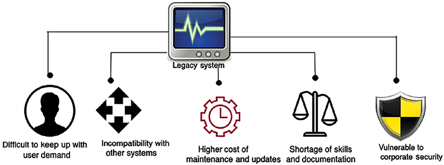
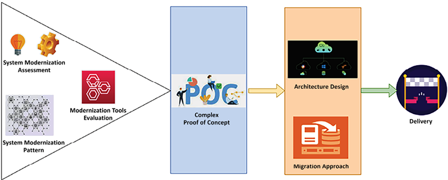
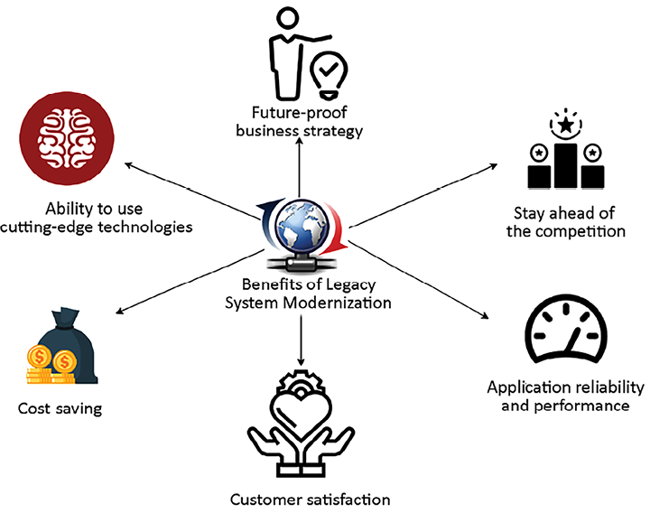
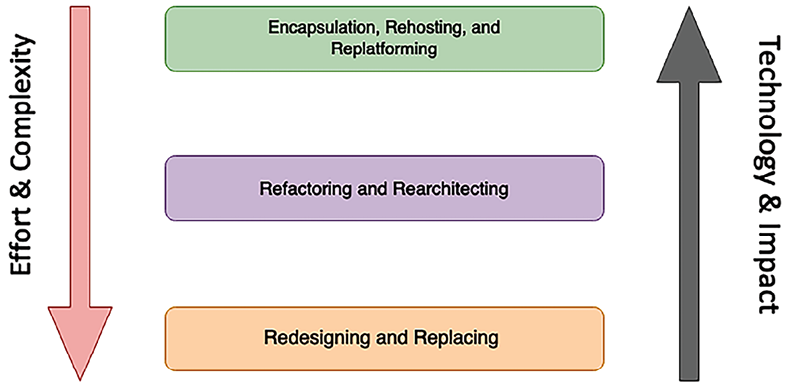
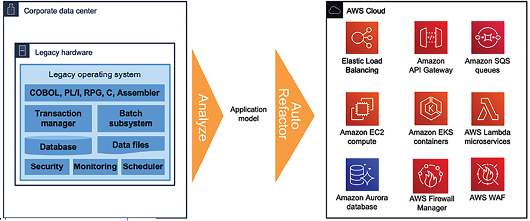
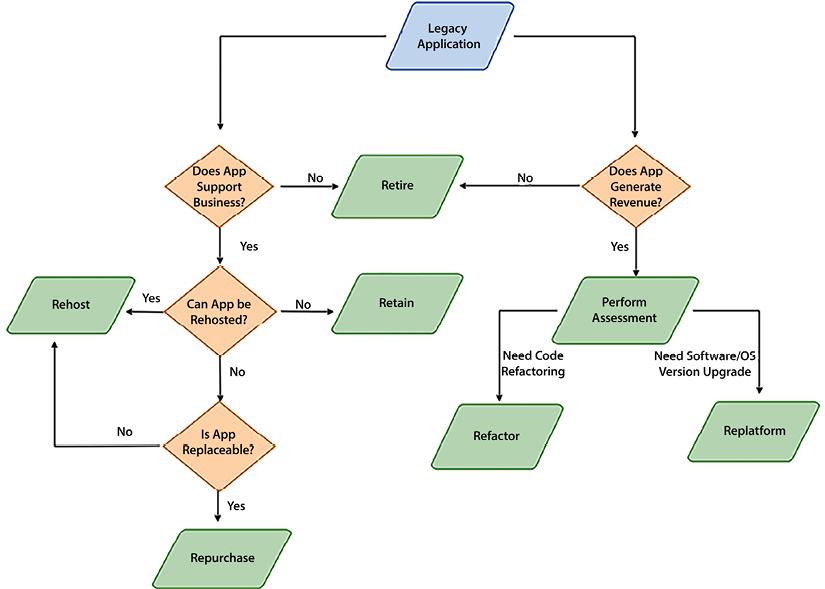
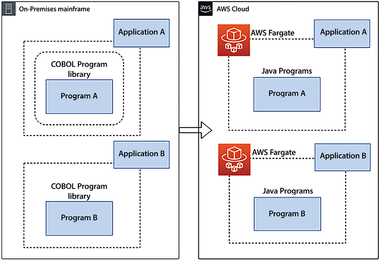
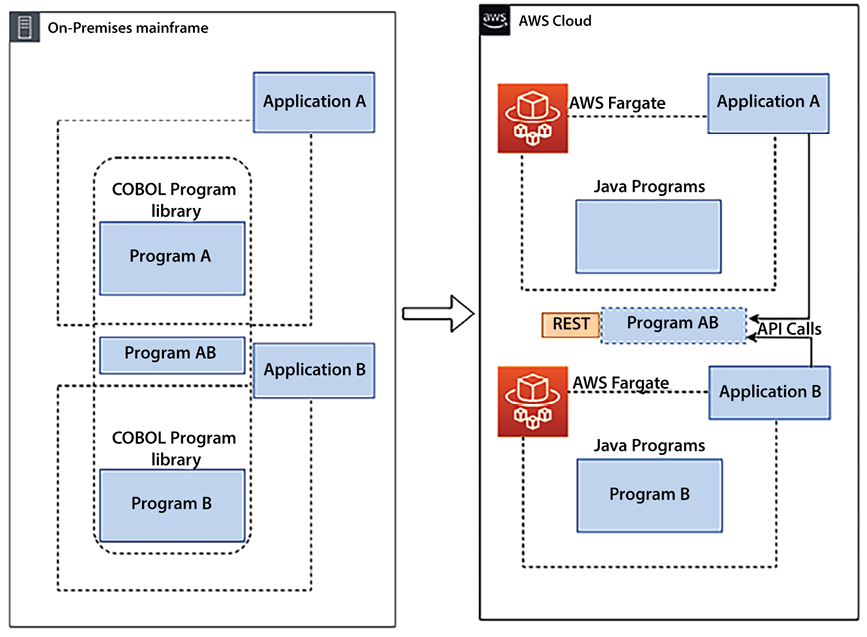
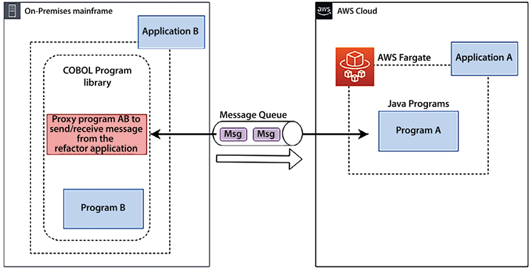

# Rearchitecting Legacy Systems

Today’s organizations are operating in a challenging environment. The pace of change is unprecedented. Regulators and institutions are imposing new reporting and security requirements, new technologies are disrupting consumers’ expectations and perceptions, and the ecosystem is constantly evolving as new players enter the market. As a result, organizations are redefining their business models to provide the customer focus, agility, and technology they need to attract talent, be competitive, and grow.

Application modernization has become a critical component of these new business models to set up dev/test environments rapidly, experiment with new ideas, and develop new products and services. In addition to eliminating the need to invest in expensive and cumbersome infrastructure, a new system enables innovation through a broad set of available technologies.

Legacy systems are applications that have been deployed in your data center for decades without undergoing many changes. These systems are outdated and challenging to maintain in a fast-changing technological environment. Legacy systems are defined by age and the inability to meet growing business needs, due to the underlying architecture and technology.

Often, large enterprises deal with legacy applications to run crucial day-to-day business tasks. These legacy systems are spread across many industries, such as healthcare, finance, transportation, manufacturing, and supply chain. Often, companies have to spend heavily on the maintenance and support of these systems, which warrants the need to architect legacy systems. Rearchitecting and modernizing legacy applications helps organizations be more agile and innovative and optimizes cost and performance.

In this chapter, you will learn about challenges and issues with legacy applications and techniques to rearchitect them. Rewriting complex legacy applications may pose an additional risk of business disruption, so you will learn about refactoring applications or considering the option to migrate into a more flexible infrastructure. The following topics will be covered in this chapter:

- Learning the challenges of legacy systems
- Defining a strategy for system modernization
- Looking at legacy system modernization techniques
- Defining a cloud migration strategy for legacy systems
- Mainframe migration to the public cloud
- Modernizing legacy code with generative AI

By the end of the chapter, you will have learned about the various challenges and modernization drivers for legacy systems. You will have learned about the various strategies and techniques for the modernization of legacy systems. As the public cloud is becoming a go-to strategy for many organizations, you will also have learned about the cloud migration of legacy systems.

# Learning the challenges of legacy systems

A legacy application presents significant challenges for an organization. On the one hand, there are critical applications that an organization has used for decades. On the other hand, legacy applications hold back the organization’s pace of innovation.

End users are looking for the most modern, technologically advanced applications in a hugely competitive environment. All new features usually come with the latest software, and legacy applications limit your ability to add those features that benefit end users.

The following diagram shows some significant challenges that organizations face with legacy systems:

Figure 15.1: Challenges with a legacy system

Before we dive into the solution, it’s essential to understand the issues clearly. Let’s explore the challenges of legacy systems in more depth to understand them better.

## Difficulty in keeping up with user demand

Customer focus is the key to business success, and being unable to keep up with the latest technology trends can harm a business significantly. You can take the example of Nokia, which used to lead the global mobile phone market. As smartphones came into play nearly a decade ago, Nokia still stuck with a legacy system, resulting in near bankruptcy. It was a similar story with Kodak—one of the largest businesses in the camera industry. Kodak could not move with digital innovation and adopt it into its systems, which resulted in Kodak becoming bankrupt in 2012. There are many such examples of large enterprises being unable to survive due to a lack of legacy modernization and innovation.

Users are very demanding in the current climate of fast-changing technology and fierce competition. Now, organizations have to change as per the user’s terms, as they have multiple choices. As technology moves, the user moves with it and starts using the most recent and popular applications. Your competitors can jump ahead if they provide new features that the user needs. A recent example is Google, a pioneer in AI/ML that may have developed **Generative AI** (**GenAI**) technology much earlier. However, OpenAI moved swiftly to launch ChatGPT, putting Google on the back foot and forcing it into a catch-up game, consequently losing ground to competitors in the GenAI market. These examples underline the importance of adopting emerging technologies to maintain a competitive advantage.

A legacy system also challenges enterprise applications with an internal user base. An old system built on mainframes primarily uses the command line, which could be more user-friendly in the digital age. In contrast, new-generation workers demand a more user-friendly approach to perform their routine tasks. However, you may need more support from management, who may have been working with legacy systems for decades and are used to them.

The technology at the core of large enterprises needs to be updated and comprises systems dating back decades. Organizations running their core systems on legacy, on-premises technology face severe challenges when enabling modern customer experiences. Many systems are the product of multiple mergers and acquisitions, resulting in fractured data siloes, excessive infrastructure costs, and slow development time. This creates inefficient processing and decision-making, a lack of business agility, poor customer responsiveness, and high maintenance costs. Under these conditions, it’s challenging for IT to meet the modern needs of internal stakeholders and customers.

## Higher cost of maintenance and updates

As legacy systems have been set up and working for decades, they may look less expensive. But over time, the total cost of ownership turns out to be higher, as support and updates for old systems are usually more costly.

Those updates are often unavailable out of the box, and lots of manual workarounds are required to maintain the systems. Most legacy systems are not automation-friendly, resulting in more human effort.

Legacy systems mostly have a large chunk of proprietary software, which results in significantly higher license fees. In addition to that, old software no longer receives support from providers, and buying additional support out of the life cycle could be very costly. On the other hand, modern systems mainly adopt open source technologies that drive the cost down. The operational outage from a legacy system can take more time and drive up operating expenses, due to years of technical debt and hard-to-debug code. People with the skill set to maintain legacy systems (such as DB2, COBOL, Fortran, Delphi, and Perl) are hard to find, significantly increasing hiring costs and system risk.

Legacy applications have been in operation for decades, and, over time, many changes will have been accommodated without unused code being removed, which amounts to lots of technical debt. Any initiative to reduce technical debt could be risky due to unknown impacts and dependencies. As a result, organizations are forced to invest in unnecessary code and system maintenance for fear of breaking a system by making any significant changes.

However, modernizing legacy systems may be costly due to unknown dependencies and outages. A careful **cost-benefit analysis** (**CBA**) needs to be considered, and the **return on investment** (**ROI**) needs to be determined when deciding to proceed with modernization. As stakeholders need to see the immediate benefit of modernization, procuring finances for legacy modernization can be challenging.

## Shortage of skills and documentation

Legacy technologies (such as mainframes) have multiple complex components that depend on each other. They are extensive proprietary and costly servers that are not readily available if someone wants to develop skills for them independently. It is challenging to retain application development resources and even more challenging to hire people with hands-on experience in old technology and operating systems.

Often, legacy systems are decades old, and most of the workforce with the relevant skills to manage them has retired. Also, these systems may need documentation to record the years of work that went into them. Significant knowledge loss is possible as an old workforce rotates with a new workforce. A lack of knowledge makes it risky to change the system due to unknown dependencies. Any small feature requests are challenging to accommodate due to system complexity and skills shortages.

New cutting-edge technologies such as advanced analytics, ML, GenAI, and the **Internet of Things** (**IoT**) are built on new technology platforms. As new technologies are not well integrated with legacy systems, an organization may lose out to a competitor if it cannot use the full capabilities of emerging technologies. A modern system helps build an organization’s brand as an innovative company where most of the new generation of the workforce wants to work. Development and training are an even more significant expense for legacy technologies.

Often, automation helps to reduce costs by reducing human effort. Many tools are available in modern systems to build automation—such as DevOps pipelines, code reviews, and automation testing—that a legacy system may not utilize, resulting in additional costs.

## Vulnerability to corporate security issues

Security is a top priority for any organization and system. A legacy application on an old operating system (such as Windows XP or Windows 2008) is vulnerable to security issues due to a lack of vendor support. Software vendors continuously determine new security threats and release patches to accommodate them in the latest software versions. Any legacy software announced as **End of Life** (**EOL**) from a vendor doesn’t get a new security patch, which leaves your application running in the old software version exposed to several security threats.

System health checks are often ignored for legacy applications, which makes them more vulnerable to security attacks. The skills gap makes providing continuous support and help difficult, which means systems need to be more secure. A single vulnerability can pose a high risk of exposing your application, database, and critical information to attackers.

In addition to a security vulnerability, legacy applications are complex to maintain due to compliance. As regulations keep changing over time to enforce tight security around data handling and usage, legacy systems require changes to adhere to local governance and compliance needs.

For example, compliance to the European Union’s **General Data Protection Regulation** (**GDPR**) requires each system to enable users to request to delete their data. While modern systems may provide these features out of the box in an automated and self-service manner, this may need to be performed manually and become more complex in legacy systems.

Adhering to compliance needs can lead to more operation costs and time-consuming maintenance.

## Incompatibility with other systems

In addition to end users, often systems need to integrate with each other. Those systems may be associated with different departments, clients, partners, or suppliers. The various systems need to exchange data in a standard format that evolves. Almost every few years, files and data format standards are changed to increase data exchange efficiency, and most systems need to change to adopt them. Hard-to-change legacy systems that stick to using an old format could result in system incompatibility and a system that your suppliers and partners may not want to use. The inability to accommodate standard needs adds significant business risk due to complex workarounds and lost productivity.

Adding a workaround for simple business needs may make a system more complex. Modern systems are built on a service-oriented architecture, making it easier to accommodate any new requirement by adding a new service independently. Old systems are often built with a monolithic architecture, and adding any new feature means you need to rebuild and test the entire system.

Modern architectures are API-oriented and can be easily integrated with other systems to offload heavy lifting. For example, a taxi-booking app uses Google Maps for **Global Positioning System** (**GPS**) navigation and Facebook or X for user authentication. A lack of APIs makes these integrations harder in a legacy system, resulting in complex custom code.

A legacy application can face a scalability issue as load increases from another dependent upstream system. Often, legacy applications are built with a monolithic architecture and are hardware-dependent. Scalability is a big challenge with a monolithic system, as it cannot scale horizontally due to hardware dependency and vertical scaling being limited to the maximum system capacity. Also, increased demand in one portion of the monolith requires the entire system to be scaled. Breaking monolithic applications into microservices can help with scaling challenges and keeping up with the load.

In addition to software maintenance, legacy applications are costly for hardware infrastructure as they run on a particular version. They spread across multiple databases with duplicate data and similar functionality. Due to their monolithic nature, it’s hard to consolidate and use the flexibility of cloud-based infrastructures to save costs. Also, decentralized systems allow software teams to select software stacks based on the needs of the microservice, rather than having to conform to a singular technology stack for all system functionality, enabling the use of diverse technologies based on the needs of each microservice and/or the team supporting the microservice.

Let’s look at some key advantages of system modernization.

# Defining a strategy for system modernization

Often, a legacy system gets left out of an enterprise’s overall digital strategy, and issues get addressed as needed. A reactive approach prevents organizations from executing overall system modernization and benefits.

If your legacy system has serious business challenges, such as security and compliance issues, or cannot address a business need, you can take a **big-bang approach**. In the big-bang method, you build a new system from scratch and shut down the old system. This approach is risky but addresses a business need that can be mitigated from the existing legacy system.

The other approach is a **phased approach**, where you upgrade one module at a time and keep running both the old and the new systems. A phased approach is less risky but takes a long time and may be more expensive, as you need to maintain both environments with increased network and infrastructure bandwidth.

Approaching your application portfolio, prioritizing specific applications, and having an overall plan are the first steps. As you use the cloud, you design a new operating model and end up with a combination of tools. You can use third-party tools to frame your needs and tool preferences. And finally, you can use a consulting partner to complete migration and modernization projects more successfully and quickly.

Taking any of these approaches can provide various benefits once the modernization of an application is completed.

## Assessment of a legacy application

An organization may have multiple legacy systems, with tens of thousands to millions of code lines. In a modernization situation, a legacy system must align with the business strategy and the investment cost. Also, it is possible to reutilize some parts or completely write them from scratch, but the first step is to conduct the assessment and better understand the overall system.

In the assessment phase, the solutions architect needs to make the system easy to assess more quickly and make informed decisions. Assessments can be done in days and weeks, depending upon the size of your workload and its complexity. The following points are the primary areas that solutions architects need to focus on when conducting an assessment:

- **Technology assessment**: You need to understand the technology stack used by the existing system. If the current technology is outdated and lacks vendor support, you might need to replace it. Consider upgrading if a better version of the technology becomes available. Often, newer versions are backward-compatible, with minimal changes required.
- **Architecture assessment**: You need to understand the overall architecture to make it future-proof. There may be a case where you need to make a minor upgrade to the technology but the overall architecture needs to be more monolithic and scalable. It would be best to audit the architecture in relation to cost, scalability, availability, performance, and security. Significant architecture changes may be required to align the application with business needs.
- **Code and dependency assessment**: Legacy systems often have hundreds of thousands of lines of code in a monolithic setting. Various modules tied to each other make the system very complicated. Code that appears not to be used in one module might impact other modules if it is removed without due diligence. These code lines may have been written decades back and needed regular refactoring and review. Even if the technology and architecture look fine, you must determine if the code is upgradable and maintainable. You also need to understand whether UI-related upgrades are required to improve the user experience.

As a solutions architect, you want to determine the dependencies across various modules and code files. Modules may be tightly coupled, and you must define an approach to perform simultaneous upgrades when modernizing the overall architecture. During your assessment, you may find the following patterns:

- First, many customers realize they have many old apps that do not relate well to the future business model; they can be retired. For example, around 10–20% of the app portfolio can be retired.
- Second, thousands of SaaS vendors didn’t exist 5–7 years ago; these can replace many on-premises apps. For example, most customers have landed on Salesforce as a CRM platform. This shift to SaaS shrinks down the operational portfolio managed by IT operations—it still presents security and identity work but has lower operation costs.

Then, decisions can be made to lift and shift and, during a move, replatform the operating system, database, or language to reduce costs, such as customers choosing to re-platform from Windows Server to Linux, and from Oracle to Postgres, to reduce database licensing costs. You learned about these techniques in _Chapter 3_, _Cloud Migration and Hybrid Cloud Architecture Design_.

If you choose to modernize, you should focus on modernizing apps that differentiate your business. Let’s look into the modernization approach.

## Defining the modernization approach

For stakeholders, there may be no immediate incentive for application modernization. You need to choose the most cost-effective method and deliver results faster.

The following diagram shows the modernization approach:

Figure 15.2: The legacy system modernization approach

After your system assessment, you must understand the existing architecture pattern and its limitations. As per your tech stack, you need to evaluate migration tools. For example, you may use an emulator for mainframe migration or vCenter if you rehost your application to VMware. Select various modernization approaches and create a **proof of concept** (**POC**) to identify gaps. Some approaches are listed here:

- **Architecture-driven modernization**: The architecture-driven approach is required to achieve the most agility. Often, an architectural approach is language-independent and platform-independent by applying service-oriented patterns, which gives the development team the flexibility to be more innovative. You may choose this approach if your assessment shows that you need significant architectural changes. Start implementing the most critical feature first and then build a POC highlighting the gaps and the required effort. Take the microservices approach to achieve scalability and ensure better integration with other systems, depending on your legacy application.
- **System re-engineering**: In the re-engineering approach, you must deeply understand the legacy system and perform reverse engineering to build a new modernized application. You need to be sure to make technological choices that help you create a future-proof system. You should take this approach if the legacy system is over-complicated and requires long-term projects. Start with application modernization first and upgrade the database as a final cutover in a phased approach. You need to build a mechanism where the legacy and upgraded modules co-exist, with the ability to communicate in a hybrid manner.
- **Migration and enhancements**: You can use migration and minor enhancement approaches if your existing system technology works relatively well but is restricted due to hardware limitations and cost. For example, you can lift and shift the entire workload to the cloud for better infrastructure availability and cost optimization. In addition, a cloud provider extends several out-of-the-box tools that help you make changes more frequently and apply better automation. A migration approach enables you to modernize your application with less effort and makes it future-proof, keeping it relevant for the long term. However, lift and shift are limited and may only be suitable for some workloads.

As you aim to migrate and modernize, consider specific IT domains that require substantial redesign and modernization. This modernization includes developer operating system environments as they affect patch management. Security, network, and identity are next and offer an excellent opportunity for scalability, resilience, and cost reduction. After that comes storage, backup, and database tools as more apps move to the cloud. Also, you need to modernize your monitoring and management tools, which require training and re-skilling. Let’s look into various strategies to modernize legacy systems.

## Benefits of system modernization

Creating a future digital strategy by addressing the growing need for legacy system modernization can have many advantages, as shown in the following diagram:

Figure 15.3: Benefits of legacy system modernization

The following are the significant benefits of application modernization:

- **Customer satisfaction**: Using the latest technology gives a better **user interface** (**UI**), **user experience** (**UX**), and an omnichannel experience. Consumers have grown accustomed to real-time access to information from any device, location, or time through personal experiences. You don’t need to build different variations of the UI; it can be built once and deployed across devices such as laptops, tablets, and smartphones. A fast and slick UI leads to better customer experience and business growth.
- **Future-proof business strategy**: Modernizing your application allows you to be more agile and innovative. A team can accommodate the changing needs of the business comfortably and evolve with new technology.\* **Stay ahead of the competition**: Users always look for the latest stuff and move to new applications that give a better experience. The modernization of your application helps you stay ahead of the competition by following the latest trends. For example, voice integration is widely provided in apps, and you can enhance security with face detection. This is only possible when your application adopts the latest technology.
- **Application reliability and performance**: Every new software API and operating system version tries to address and improve performance issues. Using the latest software and hardware helps you achieve better performance, scalability, and high availability. Application modernization helps you reduce operational outages and enhance security.
- **Ability to use cutting-edge technologies**: Legacy systems prevent you from getting insights from data that could help you grow your business. By modernizing your database and creating a data lake, you can use big data and ML to get all kinds of insights. This also helps you retain employees when people get the opportunity to work with new technologies.
- **Cost savings**: Overall, any modernization leads to cost savings by reducing operational maintenance and providing a more natural upgrade. Utilization of open-source software reduces licensing costs, hardware flexibility helps to adopt a cloud pay-as-you-go model, and automation reduces the human resources needed for routine jobs and improves overall efficiency.

By migrating legacy core systems, organizations can modernize their core systems to reduce the cost of ownership, automate manual back-office processes, eliminate data silos, improve customer experience, and launch new market-facing applications faster.

There are several benefits of legacy system modernization but they can be very complex and require lots of effort. A careful assessment needs to be conducted to take the right approach. Let’s explore the assessment techniques of a legacy application.

# Looking at legacy system modernization techniques

Per your existing application analysis, you can take various approaches to upgrade your legacy system. The most straightforward approach is migration and rehosting, where you don’t need to change the existing system. However, a simple migration may not solve the long-term problem or provide any benefits.

You can take a more complex approach, such as rearchitecting or redesigning the entire application if the system no longer meets business needs. The following diagram illustrates the impact of the various methods:

Figure 15.4: Legacy system modernization techniques

Let’s examine the various modernization techniques shown in the preceding diagram.

## Encapsulation, rehosting, and replatforming

**Encapsulation** is the most straightforward approach. If the system is business-critical and needs to communicate with other applications running on the latest technology, you should use this approach. With encapsulation, you need to build an API wrapper around your legacy system, allowing other business applications to communicate with a legacy application. An API wrapper is a common approach whereby you start migrating your applications to the cloud but keep the legacy application in the on-premises data center for modernization in the later phase. You can choose the encapsulation option if your legacy code is well-written and maintained but, again, you cannot benefit from technology advancements and hardware flexibility.

The **rehosting** approach is among the most straightforward strategies, whereby you migrate your application to another hardware provider, such as the AWS cloud, without any code changes. Again, as with encapsulation, the rehosting option can reduce costs due to vendor contracts but you may not benefit from technology advancements and hardware flexibility.

An organization often takes this approach when it needs to quickly move out of an existing contract. For example, you can take the first step to the cloud in phase one and apply modernization in phase two.

The **replatforming** approach may get more complex than the rehosting approach but will provide immediate benefits. Organizations often choose this approach if the server reaches EOL, where no support is available, and an upgrade is necessary to handle security issues. For example, if Windows Server 2012 is reaching EOL, consider upgrading the operating system to the Windows Server 2022 version. You need to rebuild your binaries with the new operating system and carry out testing to make sure everything works properly but there are no significant code changes. Again, as with rehosting, with replatforming, you may not benefit from technology advancements. However, it will allow you to have continuous support from the vendor.

While the preceding three approaches are the simplest ones, they cannot provide the full benefit of an application upgrade. Let’s look at approaches that help you to take full advantage of application modernization.

## Refactoring and rearchitecting

You can refactor your code to accommodate the new system in the refactoring approach. The overall architecture will be the same in refactoring, but you upgrade your code to suit the latest programming language and operating system version. You can refactor the portion of code to apply automation and perform feature enhancement. If your technology is still relevant and can accommodate business needs with code changes, you should take this approach.

In the **rearchitecting** approach, you change the system architecture by reutilizing the existing code as much as possible. For example, you may create a microservices architecture from your monolithic architecture. You can take one module at a time and convert it into a service-oriented architecture by giving each module a RESTful endpoint. The rearchitecting option helps you achieve the desired scalability and reliability; however, overall performance results may be average due to the utilization of existing code.

## Redesigning and replacing

The **redesigning** approach is the most complex but provides the maximum benefit. You can choose this approach if the legacy system needs to be updated and cannot accommodate business needs. With redesigning, you must build the entire system from scratch while keeping the overall scope intact.

The following diagram shows the legacy mainframe system migration to the AWS cloud:

Figure 15.5: Legacy mainframe system modernization to the cloud

A legacy mainframe system is rearchitected and refactored to similar cloud services as a _modernization approach_. Building a cloud-native application helps you utilize and fully benefit from cloud services in aspects of scalability, performance, reliability, and cost. It helps your team to be more agile and innovative by accommodating rapidly changing technology in your system. You learned about cloud migration strategy and benefits in _Chapter 3_, _Cloud Migration and Hybrid Cloud Architecture Design_.

Redesigning a legacy system requires a long-term project with lots of effort and increased cost. Before kicking off modernization, as a solutions architect, you should carefully analyze if any SaaS product or **commercially available off-the-shelf** (**COTS**) products can handle your business needs at a lower cost. A **cost-benefit analysis** (**CBA**) between _redesign_ and _purchase_ is essential before proceeding with the redesigning option.

Sometimes, it’s more beneficial to replace the legacy system with new third-party software. For example, your organization may have a decade-old **Customer Relationship Management** (**CRM**) system that cannot scale and provide the desired feature. You can subscribe to SaaS products such as Salesforce CRM to replace the legacy system. SaaS products are subscription-based and offer per-user licenses, so they may be the right choice if you have few users. Building its application may be more cost-effective for a vast enterprise with tens of thousands of users. You should conduct a CBA to understand the ROI when investing in SaaS products. Let’s look at a cloud migration strategy in a nutshell here.

# Defining a cloud migration strategy for legacy systems

As the cloud becomes increasingly popular, more organizations are looking to migrate to the cloud for their legacy application modernization needs. You learned about various cloud migration techniques in _Chapter 3_, _Cloud Migration and Hybrid Cloud Architecture_ _Design_. The cloud allows you to scale your application while keeping costs low and helps you achieve desirable performance, high availability, and reliability while maintaining application security.

Cloud providers such as AWS, Microsoft Azure, and GCP provide many options that can help you modernize your system. For example, you can take a serverless approach to build a microservice using AWS Lambda and Amazon API Gateway, with Amazon DynamoDB as the backend.

In the previous section, we discussed various legacy system modernization techniques and their application in moving to the cloud. The flow illustrated in the following diagram will help you decide whether to use cloud migration to modernize your legacy application:

Figure 15.6: Cloud migration path for legacy system modernization

As shown in the preceding diagram, if your application is still heavily used by businesses and generates revenue, you should continue with minimal changes. In that situation, you can refactor your application into the cloud or re-platform it in the cloud if the server is reaching EOL.

If you want to keep existing applications the same to sustain business and still want to move to the cloud entirely to save and optimize costs, then take the _lift-and-shift approach_ to rehost the legacy application in the cloud. If your legacy application is replaceable, you can buy a cloud-native SaaS version of the product and retire your legacy application. You may want to retain your legacy system in the on-premises data center if there are too many business dependencies and it cannot move into the cloud due to incompatibility.

You should perform a **total cost of ownership** (**TCO**) analysis to understand the advantages of moving to the cloud. This includes:

- **Infrastructure costs**: Compare the costs of on-premises infrastructure, including servers, storage, networking, and data center facilities, against the cloud services expenses.
- **Maintenance and administrative costs**: Factor in the costs associated with maintaining and managing on-premises infrastructure, such as IT staff salaries, compared to the managed services in the cloud that reduce the need for in-house management.
- **Scalability and flexibility**: Evaluate the cost implications of the cloud’s ability to scale resources up or down based on demand, which can lead to cost savings compared to the fixed costs of on-premises infrastructure.
- **Licensing and subscription costs**: Include the costs of software licenses and cloud service subscriptions.
- **Migration costs**: Consider the one-time costs of migrating workloads to the cloud, including data transfer costs, tooling, and potential downtime.
- **Security and compliance**: Assess the costs related to achieving and maintaining security and compliance standards, both in on-premises environments and the cloud.

It is recommended to take the most complex module of the legacy application and build a POC to ensure your entire system will be cloud-compatible before starting the full project. A detailed POC covering the critical business cases will help you identify gaps and reduce the migration risk significantly.

When evaluating cloud compatibility, several key factors should be considered. Firstly, assess the architectural fit, ensuring the application’s design adheres to cloud principles such as scalability, resilience, and decoupling. Next, identify any dependencies on specific hardware or local resources that the cloud may not optimally support. It’s also crucial to confirm that the cloud environment can meet the application’s performance requirements, taking into account factors like network latency and resource availability. Additionally, ensure that the application’s security and compliance demands can be fully met in the cloud. Finally, evaluate the cost-effectiveness of migrating to the cloud, ensuring it aligns with the organization’s financial objectives. This holistic approach helps determine whether an application is well-suited for a cloud environment, facilitating informed decision-making regarding migration.

Documentation and support are a critical part of any application maintenance. Let’s learn more about them.

## Documentation and support

Prepare proper documentation and support for the long-term sustainability of a new system and graceful migration to it. Provide documentation for your coding standards that everyone can follow, which helps keep the new system current. Keep your architecture documents as working artifacts, keeping them updated as technology trends change. Keeping your system updated will ensure you avoid facing the legacy system modernization situation again.

Prepare a comprehensive runbook to support new and old systems. You can keep the old system for some time until the new system can accommodate all business requirements and run satisfactorily. Update the support runbook, and ensure that you don’t lose knowledge due to employee attrition and that the overall knowledge base is not processed in a people-dependent manner.

Keeping track of system dependencies helps you to determine the impact of any changes in the future. You will learn more about documentation in _Chapter 16_, _Solution Architecture Document_. Prepare training content to train staff on the new system, and ensure they can support it if there’s an operational outage.

Mainframes are one of the workloads that are legacy and still running on-premises in many organizations. Let’s learn about how to migrate them to the cloud.

# Mainframe migration with the public cloud

Many enterprises are moving their mainframe workloads to the cloud to take advantage of cost reduction, increased agility, technical debt reduction, digital strategy support, the legacy mainframe skills gap, and data analytics. Mainframe workloads are more challenging to migrate than x86-based workloads because legacy mainframe applications are often developed and deployed in a tightly coupled manner. For example, a mainframe application might include programs used by several subsystems or directly called by other applications. In these cases, changes made to the underlying programs also affect the associated subsystems and applications.

Transitioning from mainframe systems to the cloud presents a unique opportunity, even though cloud providers may not support the exact mainframe hardware architecture. For organizations, this transition involves strategic choices: they can emulate mainframe environments on x86 platforms or refactor their applications for x86 compatibility. While refactoring demands more upfront investment, it paves the way for a scalable application landscape in the cloud, ultimately aligning with digital transformation goals and driving innovation.

For legacy applications, you must take an incremental approach, where the migration is planned in waves, as a best practice. This approach helps to reduce risks because you select and prioritize closely related applications to be migrated together. However, this approach could sometimes be more complex for mainframe migrations because the mainframe application code can use temporal coupling (invoked synchronously) or deployment coupling (linked modules).

Let’s see some unique challenges that you may face with mainframe migration.

## Challenges of mainframe modernization

Modernizing mainframes presents unique challenges due to their scale, complexity, and the critical nature of the applications they often run. These systems frequently use outdated programming languages, possess intricate and undocumented dependencies, and require specialized knowledge that is increasingly scarce. The following are some of the key challenges:

- **Outdated programming languages**: Mainframes often run on legacy code bases that use older programming languages, which modern IT professionals may need to become more familiar with.
- **Complex system dependencies**: Many mainframe applications have evolved over decades with intricate, undocumented dependencies, making it difficult to disentangle and modernize them without breaking functionality.
- **Specialized knowledge requirements**: The expertise required to operate and maintain mainframe systems is becoming rare as the workforce skilled in these older technologies retires.
- **Data integrity and security**: During modernization, there is a critical need to maintain the integrity and security of data, which can be challenging when transitioning from a closed, secure mainframe environment to a more open system.
- **Business continuity risks**: Mainframes typically manage essential business operations. Modernization efforts must be carefully planned to avoid disrupting these business-critical processes.\* **Integration with modern technologies**: Integrating mainframe applications with newer cloud-based services and technologies can be complex due to differing architectures and communication protocols.
- **Scaling challenges**: Adapt mainframe applications, often not designed for horizontal scaling, to modern cloud environments where elastic scaling is the norm.
- **Cost implications**: Assess and justify the financial investment required for modernization, which can be substantial, especially in the short term.
- **Performance considerations**: Ensure that the modernized systems deliver equivalent or improved performance compared to the highly optimized mainframe systems.
- **Cultural and organizational resistance**: You may need to overcome resistance within the organization, as mainframe systems are deeply embedded in the company’s operational fabric, and change can be met with apprehension from stakeholders accustomed to the existing systems.

Ensuring data integrity and security during the transition is also a significant concern, as is the risk of disrupting business operations, given that mainframes commonly handle core business processes.

Migrating the coupled application code affects dependent applications and carries some risks. To reduce these risks, you can decouple the mainframe application code without impacting dependent applications. From a code migration perspective, the two main types of legacy mainframe applications are standalone applications and applications with shared code. Let’s look at the details of each migration pattern.

## Migrating standalone applications

Let’s assume that there are two applications, A and B, that are standalone mainframe applications. Each application consists of programs and subprograms that it uses exclusively.

Because the applications are self-contained, you can group the **COBOL** programs and subprograms by application for code refactoring, as shown in the following diagram.

****

Figure 15.7: Mainframe modernization for a standalone application

In the preceding diagram, the mainframe programs and subprograms are written in COBOL, and the code is migrated to Java on AWS. However, you can use these decoupling patterns with your programming languages of choice. The migration pattern is legacy automated refactoring, where code, data, and dependencies are automatically converted to a modern language, data store, and framework while guaranteeing functional equivalence with the same business functions. Refactoring involves using automated tools to convert the mainframe programming language (such as COBOL) into modern programming languages (such as Java or . NET).

Refactored applications are deployed on containers provisioned and managed by **AWS Fargate**. Fargate is a serverless compute engine for containers that works with both Amazon **Elastic Container Service** (**ECS**) and Amazon **Elastic Kubernetes Service** (**EKS**). Here, mainframe database tables and mainframe files are migrated with the application.

After grouping, you can migrate applications A and B in the same or different waves. In either case, package the refactored modern components for each application and deploy them together in a runtime environment. After migration, retire the on-premises mainframe applications and their components. Let’s look at more complicated scenarios where multiple applications share code.

## Migrating applications with shared code

Let’s assume mainframe applications A and B run shared code called program AB. You need to perform an impact analysis of the shared program AB to migrate applications A and B and program AB together. Based on the impact analysis, identify the number of dependent applications that use shared programs, such as program AB. You need to complete a business domain analysis to determine whether the shared program can be aggregated into a domain with applications and exposed as an API as one of the domain services. Let’s look at some approaches you can take to decouple the applications in preparation for migration.

### Application decoupling using a standalone API

Using this approach, you instantiate a standalone API by converting the shared COBOL program AB into a Java program. You can use automated refactoring tools provided to generate network APIs for the program to minimize refactoring efforts. You can take this approach when the shared program can be instantiated as a standalone service. The remaining components of applications A and B are refactored into Java and migrated to the cloud. You can migrate the applications in the same wave, as shown in the following diagram:

Figure 15.8: Migration of shared program applications using a standalone API

In this approach, you must refactor both applications with their respective programs and migrate them to the cloud. You need to use the impact analysis report from the analysis phase to help developers and teams identify the refactored applications that call the shared program AB. Replace the inner program call with network API calls to the shared program AB. After the migration, retire the on-premises mainframe applications and their components.

### Application decoupling using a shared library

The shared program AB is converted into a Java standard library and packaged with the migration applications in this approach. You should take this approach when the shared program is a supporting library instead of a standalone service. The remaining components of applications A and B are refactored into Java programs and migrated to the cloud.

This approach refactors applications A and B with their associated programs into Java and migrates them to the cloud. You should maintain the source code of the applications in a fully managed source control service, such as AWS CodeCommit. The teams that use the shared program can collaborate on code changes by using pull requests, branching, and merging and can control the changes made to the shared program code. After the migration, retire the on-premises mainframe applications and their components.

When applications are too big to be grouped into the same migration wave, you can migrate them in multiple waves and maintain service continuity during the migration. With this approach, you can modernize your applications in phases without bundling them. Migrating your applications in separate waves decouples them without requiring significant code changes in the mainframe.

### Application decoupling using message queues

In this approach, the shared program AB is converted into a Java program and migrated to the cloud as part of application A. A message queue is used as an interface between the refactored application in the cloud and the legacy application on-premises. Using this approach, you can break up tightly coupled mainframe applications into producers and consumers and make them more modular to function independently. The additional advantage is that you can migrate the applications in different waves.

You can take this approach when applications on the mainframe can communicate with the migrated applications in the cloud through a message queue. It would be best to ensure that the queuing architecture pattern meets the business requirements for the applications on the mainframe because it involves rearchitecting the existing applications.

You should take the message queue approach if applications not part of the first wave require longer (six months or more) to be migrated to the cloud. When applications are too big to be grouped into the same migration wave, you can migrate them in multiple waves, as shown in the following diagram, and maintain service continuity during migration.

Figure 15.9: Migration of shared program applications using a message queue

As shown in the preceding diagram, you need to follow these steps for migration:

1.  Migrate (refactor) application A with its associated programs to the cloud while application B continues to reside on-premises.
2.  Refactor application A (in the cloud) to communicate with application B (on-premises) through a message queue.
3.  Refactor application B on-premises to replace the shared program with a proxy program that sends and receives messages from application A through the message queue.
4.  After successfully migrating application A, retire the on-premises application A and its components (including the shared program). Application B and its components will continue to reside on-premises.
5.  In the next set of migration waves, migrate application B and its components. The loosely coupled queuing architecture continues to interface between applications A and B in the cloud. This reduces the refactoring effort for application B without impacting application A.

As a best practice, you should perform code analysis to produce a dependency map for the mainframe applications and identify the list of programs shared by applications. After that, group applications that share the same programs for the same migration wave to reduce program calls between the on-premises environment and the cloud. At the planning stage, run an impact analysis to identify applications that share programs with the application you plan to migrate, and select the correct decoupling patterns for application migration. In this section, you noticed that we used the AWS example for mainframe modernization. Let’s take a detailed look at the benefits of the public cloud for mainframe modernization.

## Benefits of using the public cloud for mainframe modernization

Leveraging the public cloud for mainframe modernization brings numerous benefits, such as enhanced scalability, flexibility, and cost savings. The cloud’s pay-as-you-go model reduces capital expenditure, while its advanced services facilitate innovation, especially in areas like AI, ML, and analytics. Cloud environments also provide improved disaster recovery capabilities and the opportunity to redesign applications to be more resilient and adaptable to changing business needs. Let’s look at some of the key benefits of the cloud migration of a mainframe workload:

- **Enhanced scalability**: Cloud platforms can automatically adjust resources to handle workload spikes, unlike mainframes that require manual scaling. For instance, an e-commerce website can handle holiday shopping traffic spikes without downtime.
- **Cost-effectiveness**: With the cloud’s pay-as-you-go model, companies save on the high upfront hardware and maintenance costs. For example, startups can launch new applications without investing in expensive mainframe infrastructure.
- **Flexibility and agility**: Cloud services allow businesses to quickly experiment and deploy new applications. A company could, for instance, swiftly test a new customer service application in various markets without a lengthy setup process.
- **Innovation acceleration**: Cloud providers offer cutting-edge AI, ML, and analytics tools. A retail business could use these tools to analyze consumer data and personalize marketing strategies, which could be improved on a traditional mainframe.
- **Improved disaster recovery**: Cloud platforms have built-in redundancy and backup solutions. For example, a financial institution can ensure continuous operation and data integrity, even in a local disaster.
- **Resource optimization**: The cloud enables more efficient use of computing resources. A company might use cloud services to run applications only when needed, reducing idle computing resources common in mainframe environments.
- **Faster time-to-market**: The agility of the cloud shortens the development cycle. A mobile app developer can quickly deploy and update apps, staying ahead in a competitive market.\* **Global reach**: With data centers worldwide, cloud services allow businesses to deploy applications close to their users. An online streaming service, for example, can provide low-latency content to users globally.
- **Better security features**: Major cloud providers invest heavily in cybersecurity. This means a small business can benefit from security measures on par with large enterprises, something challenging to achieve with on-premises mainframes.
- **Easier integration with modern technologies**: The cloud simplifies integration with modern apps and services. A healthcare provider, for example, could integrate cloud-based AI diagnostics tools with its patient management system, a task that would be complex and resource-intensive in a mainframe environment.

AWS provides the **Mainframe Modernization** (**M2**) platform, designed to migrate and modernize on-premises mainframe applications to a cloud-native, fully managed runtime environment on AWS. The following are the key features of the AWS M2 platform:

- **Automated refactoring**: Transforms legacy language applications into agile Java-based services using AWS Blu Age, adhering to modern web frameworks and cloud DevOps best practices.
- **Replatforming**: Migrates COBOL applications using the integrated Micro Focus toolchain, modernizing infrastructure while preserving the programming language for agility with DevOps cloud-native operations.
- **Data replication and file transfer**: Enhances mainframe functions through near real-time data replication with Precisely and file transfer capabilities with BMC Software.
- **Application testing**: Automates the validation of modernized mainframe applications, reducing costs and accelerating testing timelines with a scalable cloud-native service.

This service aligns with the growing need for legacy system modernization, providing a comprehensive solution for enterprises transitioning from traditional mainframe infrastructure to more agile, cost-effective cloud environments. You can learn more by referring to this AWS page: [https://aws.amazon.com/mainframe-modernization/](https://aws.amazon.com/mainframe-modernization/).

When possible, perform mainframe migration incrementally to reduce complexity and risk. By doing incremental migration, migration teams can provide faster feedback regarding the migration progress, and businesses can use the feedback to optimize internal processes to accelerate the pace of migration. As GenAI becomes more popular with many out-of-the-box offerings, it can help to accelerate your modernization journey. Let’s learn more about it.

# Modernizing legacy code with generative AI

Modernizing legacy code with GenAI represents a cutting-edge approach to software development. GenAI tools can analyze and understand legacy code, often written in outdated programming languages, and assist in rewriting or translating it into modern, more efficient languages or frameworks. This process accelerates code modernization and helps maintain the functionality of legacy systems while leveraging the advantages of current technologies.

By automating part of the code conversion process, genAI reduces the manual effort and expertise required, making the modernization process more accessible and less error-prone. This approach mainly benefits businesses looking to update their legacy systems without disrupting operational efficiency. Modernizing legacy code with GenAI involves tools like Codex, part of OpenAI’s offerings (which powers GitHub Copilot), and, potentially, foundation models. These tools leverage AI to understand and refactor legacy code into more modern, efficient programming languages or frameworks. For example, Codex can interpret older, less common programming languages and provide suggestions or direct translations into newer languages, like Python or JavaScript. This facilitates updating legacy systems to be more maintainable and compatible with current development practices.

Similarly, Amazon CodeWhisperer is AWS’s AI-powered coding assistant. Like GitHub Copilot, it helps developers by providing code suggestions and automating some coding tasks. CodeWhisperer leverages ML models to understand the code’s context and offers relevant recommendations. This tool can enhance developer productivity, aid in coding best practices, and potentially assist in modernizing legacy code by suggesting contemporary coding techniques and solutions. CodeWhisperer, integrated into a developer’s workflow, can significantly streamline the process of maintaining, updating, and optimizing codebases, including the translation or refactoring of legacy systems. CodeWhisperer also provides contextual recommendations to make sure that code library reuse and coding pattern consistency are maintained.

Additionally, foundation models, trained on diverse data across many domains, can assist in understanding complex legacy codebases, identifying redundant or inefficient code segments, and suggesting optimizations or modern coding patterns.

Integrating these tools into the modernization process speeds up the translation of legacy code. It contributes to more maintainable, scalable, and secure software systems, crucial for businesses aiming to stay competitive in a rapidly evolving digital landscape.

# Summary

In this chapter, you learned about the various challenges with legacy applications and why it is essential to modernize them. You learned about the benefits an organization can get by upgrading its application to the latest technology. Application modernization can be complicated and risky, but it is often worthwhile.

The outcome you get from the upgrade is a trade-off against the amount of investment and energy you put into it. Before defining the modernization approach, it’s essential to understand your legacy system thoroughly, and you learned about various assessment attributes of an application in technology, architecture, and code.

After the assessment, the next step is to define the modernization approach, and you learned about various modernization approaches, including architecture-driven, system re-engineering, and migration approaches. You also learned about multiple techniques for system modernization, including straightforward approaches (encapsulation and rehosting) and complex approaches (rearchitecting and redesigning). The cloud can provide a significant value proposition, and you learned about the decision-making approach you need to take with modernization in the cloud. You learned about mainframe modernization challenges and the cloud’s benefits to ease your mainframe modernization journey. Finally, you learned how GenAI can help improve developer efficiency by updating legacy code as a coding assistant.

You focused on the various technical aspects of solution architecture; however, documentation is one of the critical elements of architectural design that keeps your system maintainable in the long run. The next chapter will discuss the documentation required for a solutions architect to prepare, contribute to, and maintain maximum business value.
