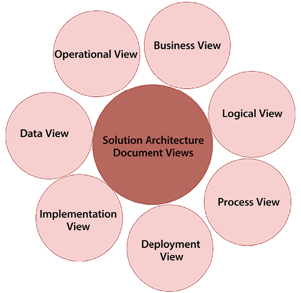
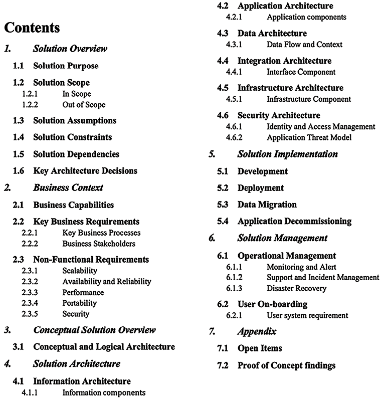
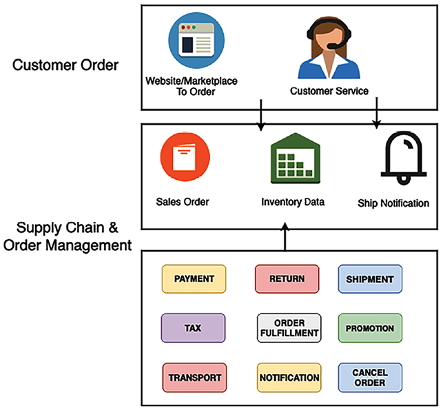
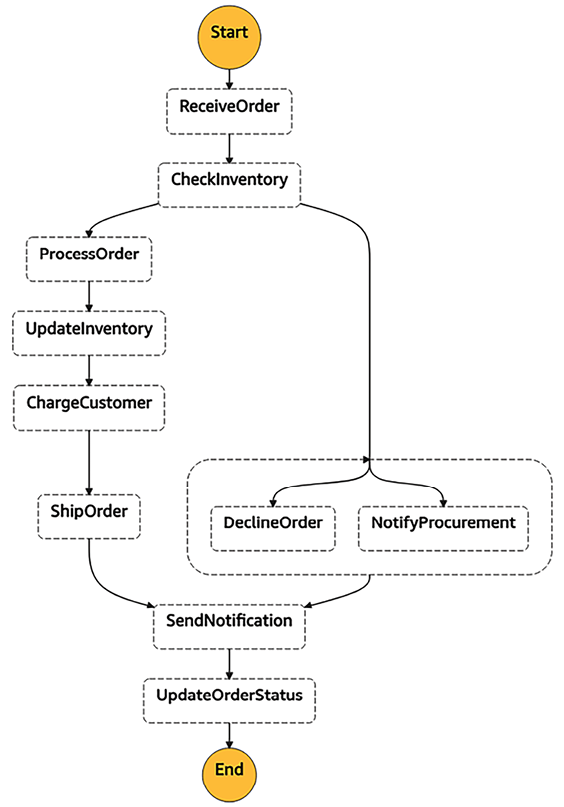
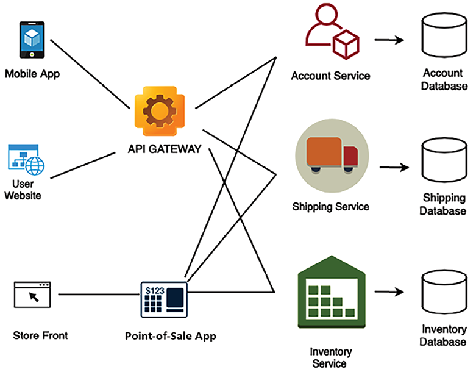
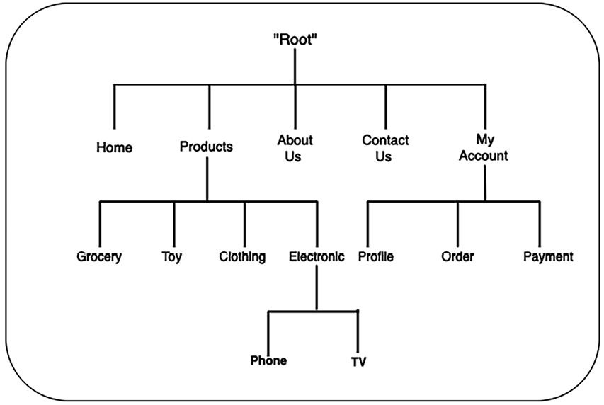
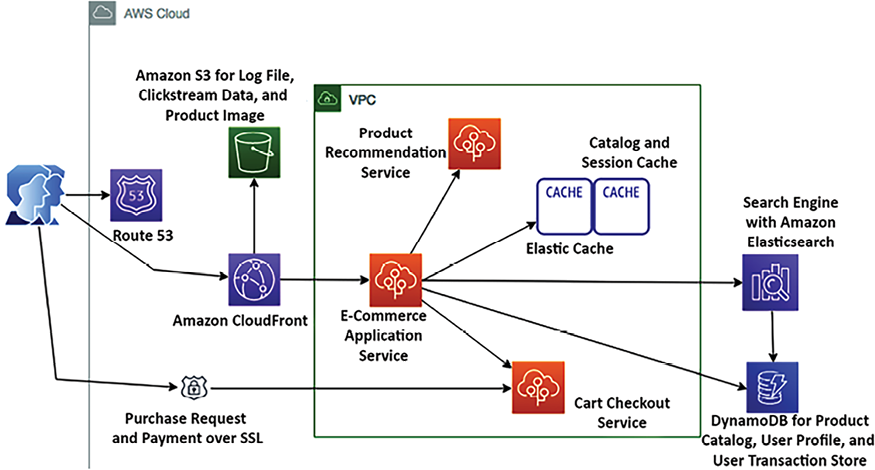
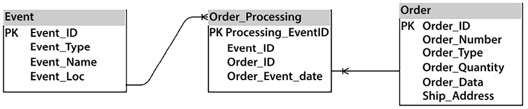
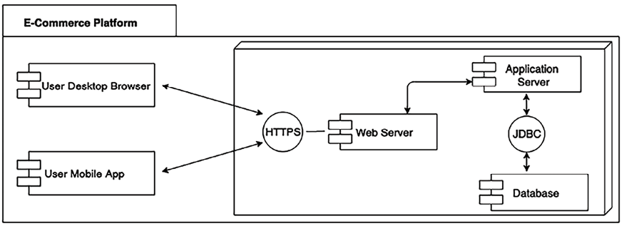
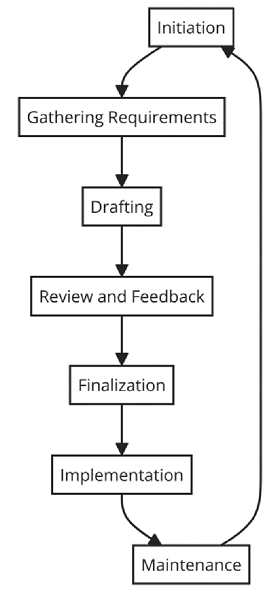

# Solution Architecture Document

In previous chapters, you learned about the various aspects of solution architecture design and optimization. As the solutions architect works on the design, it is essential to have consistent communication with other stakeholders for successful application delivery. The solutions architect must communicate a design to all technical and non-technical stakeholders.

The **solution architecture document** (**SAD**) provides an end-to-end view of the application and helps everyone to be on the same page. In this chapter, you will learn about various aspects of the SAD, which addresses the needs of all stakeholders associated with the development of the application.

You will learn about the structure of the SAD and other types of documents of which the solutions architect needs to be aware, such as the request for proposal, where the solutions architect needs to provide input to make strategic decisions. We will cover the following topics to gain a deeper understanding of the documentation involved in a solution architecture:

- Purpose of the SAD
- Views of the SAD
- Structure of the SAD
- Life cycle of the SAD
- SAD best practices and common pitfalls
- IT procurement documentation for a solution architecture

By the end of this chapter, you will know about the SAD, its structure, and the various details that need to be accommodated in the documentation. You will learn about various IT procurement documentation, such as the request for proposal, the request for information, and the request for quotation, in which a solutions architect participates to provide feedback. Let’s start with the basics by learning the purpose of the SAD.

# Purpose of the SAD

Often, architecture documentation needs are not addressed, and teams start working on implementation without understanding the overall architecture. The SAD provides a broad view of the overall solution design to keep all stakeholders informed.

The SAD is vital for various stakeholders, including project managers, who rely on it to oversee project coordination and progress. Business analysts use it to align the project with business requirements. Technical teams, including developers and IT professionals, refer to it for implementing and maintaining the proposed solutions. Senior management utilizes the document to make informed strategic decisions. Finally, clients or end users, who are the ultimate beneficiaries, depend on this document to ensure the project outcome meets their needs and expectations.

The SAD helps to achieve the following goals:

- Communicate the end-to-end application solution to all stakeholders.
- Provide a high-level overview of the architecture and different views of the application design to address the application’s service-quality requirements, such as reliability, security, performance, and scalability.\* Provide traceability of the solution back to the business requirements and look at how the application will meet all functional and **non-functional requirements** (**NFRs**).
- Provide all views of the solution required for design, building, testing, and implementation.
- Define the impacts of the solution for estimation, planning, and delivery purposes.
- Define the business process, continuation, and operations needed for a solution to work uninterrupted after the production launch.

SADs define the purpose and goal of the solution and address critical components such as solution constraints, assumptions, and risks often overlooked by the implementation team. The solutions architect must ensure they create the document in an easy language that business users can understand and relate the business context with the technical design. Documentation helps retain knowledge in case of resource attrition and makes the overall design process people independent.

For existing applications where modernization efforts are needed, the SAD presents an abstract view of the current and future architectures and a transition plan. The solutions architect understands the existing system dependencies and documents them to uncover any potential risk in advance. The migration plan helps businesses understand the tools and technology required to handle the new system and plan resources accordingly.

The solutions architect conducts various assessments during solution design by building a **proof of concept** (**POC**) or through market research. A SAD should list all architecture assessments and their impact, along with the choice of technology. A SAD presents a conceptual view of the solution design’s current and target state and maintains a change record. Let’s understand the various views of a SAD in the next section.

# Views of the SAD

The solutions architect needs to create a SAD that both business and technical users understand. A SAD bridges the communication gap between the business user and the development team to understand the function of the overall application. The best way to capture all stakeholders’ input is by putting yourself in their situation and looking at problems from the stakeholders’ perspectives. The solutions architect evaluates the business and technical aspects of architecture design to take cognizance of all technical and non-technical user requirements.

As illustrated in the following diagram, a holistic overview of the SAD comprises various views to cover different aspects derived from the business requirements:

Figure 16.1: SAD views

Solutions architects can choose standard diagrams such as a **Unified Modeling Language** (**UML**) diagram or a block diagram from **Microsoft Visio** to represent various views. These tools are widely recognized and help convey complex architectural concepts in an easily digestible format. Overall, the diagram should be easy to read and understandable to all business and technical stakeholders. A SAD should include the following views, wherever possible, to address everyone’s needs:

- **Business View**: Architecture design addresses business concerns and solves business purposes. The business view shows the value proposition of the overall solution and product. To simplify, the solutions architect may choose to detect high-level scenarios related to business and present these as a use case diagram. The business view also describes stakeholders and the required resources to execute the project. You can define the business view as a use case view as well.
- **Logical View**: This presents various packages on the system so that business users and designers can understand the various logical components of the system. The logical view offers a chronicled order of the system in which it should be built. It shows how the multiple packages of the system are connected and how the user can interact with them. For example, in a banking application, the user first needs to authenticate and authorize using a security package, log in to the account using the account package, apply for a loan using a loan package, and so on. Each package represents a different module and can be built as a microservice.
- **Process View**: This presents more details, showing how the critical processes of the system work together. It can be reflected using a state diagram. The solutions architect can create a sequence diagram to show more details. In a banking application, a process view can present the approval of a loan or account.
- **Deployment View**: This presents how the application will work in production. It shows how connected system components (such as the network firewall, load balancer, application servers, and database) are. The solutions architect should create a simple block diagram that business users can understand. You can add more details to the UML deployment diagram to show various node components and their dependencies for technical users, such as the development and DevOps teams. The deployment view represents the physical layout of the system.
- **Implementation View**: This is the core of the SAD and represents architectural and technology choices. The solutions architect needs to put the architecture diagram here—for example, if it is 3-tier, \_N-\_tier, or event-driven architecture—along with their reasoning.
- It would help if you also detailed technology choices—for example, using Java versus Node.js, along with their pros and cons. In the implementation view, you want to justify the resources and skills required to execute the project. The development team uses an implementation view to create a detailed design, such as a class diagram, but that doesn’t need to be part of the SAD.\* **Data View**: Most applications are data-driven, so the data view is essential. The data view represents how data will flow between the different components and how it will be stored. It can also be used to explain data security and data integrity. The solutions architect can use the entity-relationship diagram to show the relationship between different tables and schemas in the database. You will learn more about the entity-relationship diagram in the _Data architecture_ section. The data view also explains the reports and analytics needed.
- **Operational View**: This explains how the system will be maintained post-launch. Often, you define **service-level agreements** (**SLAs**), alert and monitoring functionality, a disaster recovery plan, and a support plan for the system. The operational view also details how system maintenance will be carried out, such as by deploying a bug fix, patching, backing up and recovering, and handling security incidents.

All the views listed ensure the SAD covers all aspects of the system and stakeholders. You may include additional views—such as a physical architecture view, a network architecture view, or a security (controls) architecture view—per the stakeholders’ requirements. As a solutions architect, you must view and understand system functioning in a comprehensive manner. Let’s explore the structure of the SAD in more detail in the next section.

# Structure of the SAD

The structure of the SAD can differ from project to project per the stakeholder requirements and the nature of the given project. Your project could be creating a new product from the ground up, modernizing a legacy application, or moving the entire system to the cloud.

For each project, the SAD document may differ, but overall, it should consider various stakeholders’ views and include an array of sections as shown in the following screenshot:

Figure 16.2: Structure of a SAD

In the preceding SAD structure, you can see different sections covering multiple solution architecture and design aspects. The solutions architect may choose to add additional subsections or remove some sections as per the project requirements. For example, you can add another introduction section to discuss the document’s purpose with a summary. For a transition project, you may add a subsection to present the existing architecture, compare it with the target architecture, and so on. Let’s look into the details of each section.

## Solution overview

In the solution overview section, we briefly introduce the solution in a couple of paragraphs, describing the functioning of the solution and its different components at a very high level. Adding a high-level block diagram showing various components in one place is nice. The following diagram illustrates the solution overview of an e-commerce platform:

Figure 16.3: Solution overview of an e-commerce platform

You need to provide a brief about each component in simplified language so that the business user can understand the overall workings of the solution. For example, the above diagram outlines a typical e-commerce order and supply chain management workflow in a simple way:

- **Customer Order**:
  - The process begins when a customer places an order through a website or an online marketplace.
  - Customer service plays a role in assisting customers with their orders, handling inquiries, and resolving issues that may arise during the order process.
- **Supply Chain & Order Management**:

  - **Sales Order**: Once an order is placed, it is recorded as a sales order, which triggers the order fulfillment process.
  - **Inventory Data**: The system checks inventory data to ensure the ordered items are in stock.
  - **Ship Notification**: After the order is processed and ready for shipment, a notification is sent out, possibly including tracking information for the customer.\* **Order processing**:

  - **Payment**: Processing the customer’s payment, including the application of any taxes and processing of promotional codes.
  - **Tax**: Calculating and applying the correct sales tax based on the customer’s location and the purchased items.
  - **Transport**: Arranging the logistics for delivering the order to the customer’s location.
  - **Order fulfillment**: The actual picking, packing, and preparation for shipping of the ordered items.
  - **Shipment**: The process of sending the order out for delivery.
  - **Promotion**: Applying discounts or special offers that might be part of the sales order.
  - **Notification**: Keeping the customer informed about the status of their order.
  - **Return**: Handling any returns, if the customer is not satisfied with their purchase or if there are issues with the order.
  - **Cancellation**: Processing any cancellations if the customer decides to cancel the order before it’s shipped.

These elements allow customer orders to be handled efficiently from the moment they are placed until they are delivered.

Next, we outline the solution overview with the following subsections:

- **Solution purpose**: This provides a brief outline of the business concern that the solution will solve and the justification for building this solution. In our scenario outlined earlier, the purpose of this solution is to streamline and automate the process of order management within a supply chain. It aims to address business concerns around efficiency, accuracy, and customer satisfaction in order fulfillment.
- **Solution scope**: This is where the proposed solution’s business scope is stated, clearly describing out-of-scope items that the solution will not accommodate. The scope includes the end-to-end automation of the order management system, from customer order placement to shipment notification. It does not cover post-delivery customer engagement like feedback collection or returns processing.
- **Solution assumptions**: List all the assumptions made by the solutions architect in coming up with the solution. For example, in our scenario, the solution assumes a minimum network bandwidth availability to ensure real-time data processing. It also assumes the integration capability with various marketplaces and shipping carriers and customers have access to digital payment methods.
- **Solution constraints**: List all technical, business, and resource constraints. Often, constraints come from industry and government compliances, which need to be listed in this section. You can also highlight the risk and mitigation plan. The solution must comply with data protection regulations like GDPR for customer data privacy in the EU and PCI-DSS for storing customer’s payment information in the USA. Resource constraints include a fixed budget and timeline for deployment. There may be technical constraints related to the integration of legacy systems.
- **Solution dependencies**: List all upstream and downstream dependencies. For example, an e-commerce website must communicate with a shipping system such as UPS or FedEx to ship a package to customers. The solution depends on real-time inventory data for accurate order processing from the inventory management system. It requires integration with payment gateways for financial transactions.
- **Key architecture decisions**: List significant problem statements and proposed solutions. Describe the pros and cons of each option, why a particular decision was made, and the rationale behind it.

For example, let’s take the decision to use a cloud-based platform for scalability. It was chosen for its ability to handle varying order volumes and the need for less upfront capital investment. The trade-off is a continuous operational expense.

Another decision could be the adoption of an API-first approach for integration. This was selected to ensure flexibility and the ease of integrating with a variety of partners and services. However, this increases the complexity of API management.

After giving a solution overview, you want to relate it to the business context. In the next section, let’s look at the business context view in more detail.

## Business context

In the business context section, the solutions architect must provide a high-level overview of the business capabilities and requirements the solution will address. This section only contains an abstract view of requirements. Detailed requirements need to be mentioned and noted down in a separate document. However, the external link to the requirements document can be provided here. You should include the following primary subsections:

- **Business capabilities**: Briefly describe the business capabilities for which the solution is being designed. Make sure to include the benefits of capabilities and how they will address customer needs.
- **Key business requirements**: List all key business concerns the solution will address. Provide a high-level view of key requirements and add a reference to the detailed requirements document.
- **Key business processes**: Solutions architects should show key processes with a business process document. The following diagram illustrates a simplified view of an e-commerce application business process model:

Figure 16.4: Business process diagram of an e-commerce platform

- **Business stakeholders**: List stakeholders directly or indirectly impacted by the project. This includes sponsors, developers, end users, vendors, and partners.
- **NFRs**: Solutions architects must focus more on NFRs as these often get missed by the business user and development team. At a high level, an NFR should include:
  - **Scalability**: How can the application scale as workloads fluctuate? (For example, scale from 1,000 to 10,000 transactions per second per day or month.)
  - **Availability and reliability**: What is the acceptable downtime for system availability? (For example, 99.99% availability or 45 minutes’ downtime per month.)
  - **Performance**: What is the performance requirement? Where can the system handle the load increase without impacting the end-user experience? (For example, the catalog page needs to load within 3 seconds.)
  - **Portability**: Can the application run on multiple platforms without any additional work? (For example, the mobile app must run on the iOS and Android operating systems.)
  - **Capacity**: What is the maximum workload that an application can handle? (For example, the maximum number of users, the number of requests, the expected response time, and the expected application load.)

The conceptual view of architecture is a sweet spot that provides a good system overview for both business and technical stakeholders. Let’s learn more about the conceptual view in more detail.

## Conceptual solution overview

The conceptual solution overview section provides an abstract-level diagram that captures a big-picture view of the whole solution, including both its business and technical aspects. It provides a basis for analyses and trade-off studies to help refine and optimize the solution architecture in sufficient detail to support solution design and implementation. The following diagram illustrates a conceptual architecture diagram of an e-commerce platform:

Figure 16.5: Conceptual architecture diagram of an e-commerce platform

The preceding diagram shows an abstract view of significant modules and information flowing between them. The conceptual architecture provides a good understanding of the overall architecture for both business and technical users. However, technical users need further architectural depth. Let’s dive deeper into the solution architecture in the next section.

## Solution architecture

The solution architecture section dives deep into each part of the architecture. It provides different views that the technical team can use to create a detailed design and work on implementation. These views could target other user groups, such as developers, infrastructure engineers, DevOps engineers, security engineers, and **user experience** (**UX**) designers.

Let’s get into the following major subsections to learn more details.

### Information architecture

This section provides a user navigation flow to the application. The solutions architect needs to put an application navigation structure at a high level. As shown in the following diagram, for an e-commerce website, it takes three clicks for the user to navigate to the desired page:

Figure 16.6: Informational architecture diagram of an e-commerce platform

Solutions architects can add more details, such as website navigation, taxonomy, or a high-level wireframe that UX designers can use to generate a detailed wireframe.

### Application architecture

This section targets the development team. It provides more implementation details for a software architect or development team to build a detailed design. The following diagram shows the application architecture for an e-commerce website, with technology building blocks such as caching, networking, content distribution, and data storage:

Figure 16.7: Application architecture diagram of an e-commerce platform

As shown in the preceding diagram, you need to list the components of the application architecture required for a cloud-based e-commerce platform to deliver the desired online shopping experience. These components include:

- **User interaction:** Customers interact with the e-commerce platform through a web interface, starting with a secure purchase request made over the **Secure Sockets Layer** (**SSL**) for encrypted communications.
- **Content delivery:** Amazon CloudFront, a **content delivery network** (**CDN**), serves static content such as images, stylesheets, and client-side scripts efficiently to the user. It reduces latency by caching content closer to the user’s location.
- **Domain Name System** (**DNS**): Amazon Route 53 is utilized for DNS management, directing user requests to the most appropriate endpoints, like the CloudFront distribution or the application load balancer.\* **Application processing:** Inside the **Virtual Private Cloud** (**VPC**), the e-commerce application service processes dynamic requests, such as page rendering based on user profiles and shopping history. A product recommendation service within the VPC offers personalized product suggestions to users based on their behavior and preferences.
- **Caching mechanism:** Amazon ElastiCache is employed to speed up data retrieval by caching frequently accessed data, like session state and frequently viewed product information. This reduces the load on the backend databases and improves the application’s response time.
- **Data storage and processing:** A cart checkout service manages user cart interactions and transactions. Catalog and session cache data is stored for quick access. A search engine built with Amazon Elasticsearch provides powerful search capabilities across the product catalog.
- **User profile and transaction data:** User profile information, along with transaction data, is stored in Amazon DynamoDB, offering fast and scalable NoSQL database capabilities.
- **Data logging:** Amazon S3 is used for logging data such as clickstream data, product interactions, and system logs, enabling in-depth analysis and insights into user behavior and system performance.

This section lists all application modules that need to be retired, retained, replatformed, and transformed for an application modernization architecture.

### Data architecture

This section is primarily utilized by the database admin and development team to understand database schemas and how tables are related. This section often includes an **entity-relationship diagram** (**ERD**) showing the relationships of entity sets stored in a database, such as the following:

Figure 16.8: ERD of an e-commerce platform

An ERD is a visual representation of entities (which typically correspond to database tables) and the relationships between them. It’s a graphical tool used in database design to illustrate the logical structure of databases. The preceding diagram is an example of an ERD for an order processing system. The ERD illustrates the relationship between events that occur and the orders that are processed within the system. Here are the components and their relationships:

- **Event entity**: Represents an occurrence or action within the system, with attributes like `Event_ID` (primary key), `Event_Type`, `Event_Name`, and `Event_Loc`. These attributes might detail what the event is, where it took place, and other characteristics.
- **Order entity**: Represents a customer order, with attributes including `Order_ID` (primary key), `Order_Number`, `Order_Type`, `Order_Quantity`, `Order_Date`, and `Ship_Address`. These attributes store information specific to each order, such as the amount ordered, shipping details, and when the order was placed.
- **Order_Processing entity**: This serves as an associative entity (or junction table) that connects Events to Orders, indicating that an Event will lead to Order processing. It has its own primary key (`Processing_EventID`) and includes the foreign keys `Event_ID` and `Order_ID`, which link to the Event and Order entities, respectively. The presence of the `Order_Event_date` attribute suggests that it also records when an Event resulted in an Order being processed.

The lines between the entities represent the relationships. In this ERD, the “crow’s feet” notation at the ends of the relationship lines indicates “many,” while the single line indicates “one,” denoting the cardinality of the relationships.

The data architecture section lists all data objects that need to be considered during application development.

### Integration architecture

Integration architecture refers to the expanded framework that allows different software applications, systems, and services to communicate and work together effectively. It involves designing and implementing methods and middleware that facilitate the exchange of data and processes across diverse systems within an organization or between an organization and external parties. This section mainly targets vendors, partners, and other teams. For example, the following diagram shows all the integration points with other systems in an e-commerce application:

Figure 16.9: Integration architecture diagram of an e-commerce platform

The integration architecture section lists all upstream systems that provide data to your application. Any platforms, services, or databases that your application receives data from are listed here, along with the nature of the data flows and details of the downstream systems to which your application sends data. This could include other applications, databases, or services that rely on data produced or processed by your application. You need to list all system dependencies regarding your application.

### Infrastructure architecture

This section is primarily targeted at the infrastructure team and system engineers. The solutions architect must include a deployment diagram outlining the logical server location and dependencies.

For example, the following figure illustrates the production deployment diagram for an e-commerce application. You can produce a separate diagram for other environments, such as the dev, **quality assurance** (**QA**), and **User Acceptance Testing** (**UAT**) environments:

Figure 16.10: Deployment diagram of an e-commerce platform

This section lists all server configurations, databases, networks, and switches to deploy the application.

### Security architecture

This section includes all the security and compliance aspects of the application, including:

- **Identity and access management** (**IAM**) such as **Active Directory** (**AD**), user authentication, and authorization management
- Infrastructure security such as the firewall configuration, **intrusion prevention system** (**IPS**)/**intrusion detection system** (**IDS**), and antivirus software
- Application security such as **web application firewalls** (**WAFs**) and **distributed denial of service** (**DDoS**) protection\* **Data security** at rest and in transit using SSL, encryption algorithms, key management, and so on

Overall, the solutions architect can include an application security threat model to identify potential vulnerabilities, such as **cross-site scripting** (**XSS**) and **SQL injection** (**SQLi**), and plan to protect the application from any security threat.

## Solution implementation

The solution delivery section includes essential considerations to develop and deploy a solution. It can consist of the following major subsections:

- **Development**: This section is essential for the development team. It discusses development tools, programming language, code repository, code versioning, and branching, along with the rationale behind the choices.
- **Deployment**: This section mainly focuses on DevOps engineers and talks about the deployment approach, deployment tools, various deployment components, and deployment checklist, along with the rationale behind the choices.
- **Data migration**: This section helps the team to understand the data migration and ingestion approach, the scope of data migration, various data objects, data ingestion tools used, sources of data and data formats, and so on.\* **Application decommissioning**: This section lists existing systems that need to be decommissioned and an exit strategy for the current system if the **return on investment** (**ROI**) is not realized. The solutions architect must provide an approach and timeline for decommissioning the old system and assess the overall impact.

The SAD includes a development approach and tools. However, it does not have a detailed application-level design, such as a class diagram or pseudocode. Such details need to be handled by the software architect or senior developer under the corresponding software application details design document. As a solution gets deployed, it needs to be managed in production. Let’s learn about the details that go into the solution management section.

## Solution management

The solution management section is focused on production support and ongoing system maintenance across other non-product environments. This section covers the operational aspects of the solution, including monitoring, incident management, user onboarding, and support and recovery processes. The solution management section is primarily targeted at the operations management team. This section addresses the following areas:

- Operational management, such as system patching and upgrades of dev, test, staging, and prod environments
- Tools to manage application upgrades and new releases
- Tools to manage system infrastructure
- System monitoring and alerts; operations dashboard
- Production support, SLA, and incident management
- Disaster recovery and **business process continuation** (**BPC**)

A solutions architect must research and collect data to validate the right solution during design. Such additional details can be put in the Appendix section. Let’s learn more about the Appendix section of a SAD.

## Appendix

Like every business proposal document, the SAD also has an open Appendix section containing any data supporting your overall architecture and solution choices. In this section, the solutions architect can include open issues and any research data, such as the outcome of the POC, tool comparison data, and vendors’ and partners’ data.

This section on the structure of the SAD gave you a good overview of the SAD structure along with different sections. A SAD should include the major sections mentioned previously; however, the solutions architect may exclude some sections or include others to meet specific requirements of the organization or project. As with other documents, it’s essential to continue to iterate upon SADs and look for opportunities to improve. More robust SADs lead to well-defined implementation guidelines and reduce any risk of failure.

A SAD is a running document created during the initial stages and updated over the years based on various changes throughout the application life cycle. Let’s now look into the life cycle of the SAD.

# Life cycle of the SAD

The life cycle of a SAD aligns with different phases of a project’s life cycle. Previously in this chapter, we explored the various sections of the SAD, and these are each created at distinct stages. The life cycle of a SAD typically includes the following phases:

Figure 16.11: SAD life cycle

Let’s look at the phases in the SAD life cycle, shown in the preceding diagram, in more detail:

- **Initiation**: The initiation phase is where the need for a SAD is recognized, usually at the project’s conception. This phase defines objectives, such as outlining the software architecture for a new enterprise application. This step sets the direction and scope for the document, ensuring it aligns with the project’s goals and stakeholder expectations.
- **Gathering requirements**: In this crucial phase, detailed requirements are collected from key stakeholders. For a retail e-commerce platform, this might involve gathering insights on user experience, payment processing, and inventory management. This phase ensures that the SAD addresses all critical aspects of the project.
- **Drafting**: The drafting phase involves creating the initial version of the SAD. This document might detail the architecture of a cloud-based system, specifying the use of certain AWS services, database schemas, and security protocols. This draft serves as the blueprint for the project’s technical implementation.
- **Review and feedback**: Once the draft is prepared, it’s shared with stakeholders for review. In the case of a healthcare management system, clinicians, IT staff, and administrative personnel might provide feedback on various aspects like patient data flow and compliance with health regulations.2. **Finalization**: After incorporating feedback, the SAD is finalized. This might involve adjusting a network architecture to improve data flow efficiency based on stakeholder input.
- **Implementation**: The finalized document guides the project’s implementation. For instance, developers and project managers use the SAD to ensure alignment with the planned architecture and technology stack in a software development project.
- **Maintenance**: Over time, the SAD is revisited and updated to reflect technological changes, business objectives, or external factors. For example, introducing new data privacy laws might necessitate updates to the SAD to ensure continued compliance.

Let’s now look at some of the best practices and pitfalls to avoid when producing SADs.

# SAD best practices and common pitfalls

Effective management of SADs involves certain best practices. Keeping the document clear and concise is crucial, making it easily understandable while avoiding technical jargon. Regular involvement of stakeholders in the process ensures that the document aligns with business and technical requirements. Keeping the SAD up to date with the latest project changes and developments is vital for its relevance and usefulness. Additionally, aligning the architecture outlined in the SAD with the organization’s broader business goals is essential, ensuring that the proposed technical solutions support and enhance the business objectives.

There are also common pitfalls to avoid when working with a SAD. Overcomplicating the architecture can lead to challenges in implementation and maintenance. A lack of flexibility in the document can hinder its ability to adapt to changes in project scope or objectives. Insufficient stakeholder engagement can result in a misalignment with actual business needs and requirements.

Moreover, poor documentation practices can lead to misunderstandings, implementation errors, and challenges in project execution. It’s essential to address these pitfalls proactively to ensure the success of the solution architecture.

In addition to the SAD, solution architecture often involves a significant procurement proposal with a specific requirement known as a **request for x** (**RFx**) document. Let’s become familiar with RFx documents.

# IT procurement documentation for a solution architecture

IT procurement documents are popularly known as **RFx documents**. This is a term that includes different stages of the procurement process. RFx refers to a formal requesting process. RFx documents are categorized as **request for proposal** (**RFP**), **request for information** (**RFI**), and **request for quotation** (**RFQ**) documents.

Solutions architects are often involved in the procurement process, either leading the process or providing their input. These procurements may be related to outsourcing, contracting, procuring software such as a database or development tools, or buying SaaS solutions.

As these documents can be highly technical and will likely have a broad, long-term impact, the solutions architect needs to provide input by responding to any procurement requirements.

Let’s understand the difference between the different RFx documents:

- **RFI**: RFI comes early in the procurement process, where buyers invite information from different vendors to make an informed decision regarding their choice of procurement for a later stage. An RFI document collects information about the capabilities of the various suppliers, where the buyer can compare all suppliers in similar parameters and proceed to the next proposal steps with shortlisted suppliers. For example, let’s say a company is exploring the market to identify **learning management systems** (**LMSs**) that meet its training needs. The company issues an RFI to collect detailed information about the functionalities, integration capabilities, and user experiences of the LMS platforms available.
- **RFP**: In this process, suppliers shortlisted from the RFI process get more information about the project’s outcome. An RFP document is more open-ended than an RFI one, where suppliers can provide the best way to acquire solutions for the buyer. The supplier can include multiple choices, with the pros and cons of each approach. For example, say a government agency wants to upgrade its IT infrastructure. It issues an RFP outlining its current system, the improvements required, and the performance criteria. Vendors respond with proposals that include technical solutions, project timelines, and cost estimates.
- **RFQ**: In this process, buyers narrow down the requirements compared to the RFP and list the exact requirements of work, equipment, and supplies. Suppliers must provide a cost for the listed requirements, and the buyer can choose the best quote to award the contract to. For example, say a technology startup is preparing to scale its IT infrastructure to accommodate a growing user base.

The startup needs to procure additional cloud computing resources to handle the increased load. It has already determined its requirements in terms of compute instances, memory, storage, and bandwidth. The RFQ requests that IT infrastructure providers submit their best quotes for monthly and yearly pricing options, along with any discounts for long-term commitments. The startup also asks for information on additional services such as support, monitoring, and security features that could be included in the quoted price.

The RFP is the most popular choice, as often, to speed up the process, the buyer organization often chooses to only ask for RFP documents from potential vendors. In such a situation, the RFP document needs to use a clear structure so that the buyer can compare preferred vendors in terms of capabilities, solution approaches, and costs to make a quick decision.

Due to the technicalities of procurement in IT organizations, solutions architects play an essential role in evaluating vendors’ capabilities and approaches from the buyer’s perspective and responding to RFP documents from the supplier side. During the RFP process for an IT workload, a solutions architect’s expertise is critical. Here’s how they might contribute:

1.  **Understanding requirements**: The solutions architect begins by thoroughly understanding the project’s technical and business requirements, which may include enhancing existing systems, migrating to the cloud, or integrating new technologies.
2.  **Designing the solution**: They draft a preliminary design of the IT architecture that addresses the identified requirements. This includes selecting appropriate technologies, designing the infrastructure layout, and considering integration with existing systems.
3.  **Collaborative contribution**: The architect often collaborates with cross-functional teams, including business analysts, project managers, and technical leads, to ensure that the proposal aligns with both business objectives and technical feasibility.
4.  **Estimating resources**: They estimate the resources required for the project, which may include hardware, software, cloud services, and personnel hours, ensuring the proposal is both competitive and realistic.
5.  **Risk assessment**: Solutions architects identify potential risks in the project and propose mitigation strategies to include in the RFP response.
6.  **Documentation**: They help create detailed technical documentation that explains how the proposed solution meets the RFP requirements. This documentation often includes system diagrams, data flow diagrams, and detailed descriptions of the proposed environment.
7.  **Pricing strategy**: Solutions architects may work with the finance team to develop a pricing strategy for the proposal, ensuring the costs are in line with the value delivered.
8.  **Presentation**: Solutions architects may be part of the team that presents the proposal to the potential client, explaining the technical aspects and answering any technical queries they may have.

The role of a solutions architect is crucial for tailoring a solution that not only meets the client’s requirements but also ensures technological viability and cost-effectiveness. For instance, if a company is soliciting proposals for a new cloud-based CRM system, the solutions architect would first analyze the existing IT infrastructure and assess the necessary features such as scalability and data security.

They’d design a cloud solution that seamlessly integrates with current systems like ERP and aligns with the marketing strategies. By collaborating with potential vendors, the architect ensures the chosen CRM platforms align with the company’s specific needs and evaluates their compatibility. Additionally, they would work closely with legal teams to ensure the solution meets stringent compliance and data management requirements.

A key task is creating a migration strategy to transition data from old systems to the new CRM, aiming for minimal business disruption. This also involves estimating the total cost of ownership and considering factors like subscription costs, customization, data transfer, and training needs. The solutions architect has a hand in drafting the technical segments of the RFP response, detailing the proposed architecture, data strategy, and security measures. They would outline the implementation roadmap, addressing how the system will scale over time and what support structure will be in place post-deployment.

Moreover, the solutions architect presents and defends the technical strategy to the client’s decision-makers, illustrating the benefits and practicality of the proposed solution. This ensures that the client invests in a reliable, secure, and scalable system that supports the business’s growth and adapts to evolving market demands.

# Summary

A SAD aims to keep all stakeholders on the same page and get formal agreement on solution design and requirements. As stakeholders comprise both business and technical users, you learned about various SAD views that the solutions architect needs to consider. You must include views for non-technical users, such as business, process, and logical views. For technical users, include applications, development, deployment, and operational views.

In this chapter, you learned about the detailed structure of the SAD, with major sections and subsections.

Various sections of the SAD include details such as an overview of the solution, business, and conceptual architecture. You also learned about various architecture views in the architecture diagram, such as application, data, infrastructure, integration, and security. You also learned about other sections of the SAD, covering solution delivery considerations and operations management.

It has been a long journey of learning. You are almost at the end of the book, but before closing, we will provide some tips for becoming a solutions architect and improving your knowledge.

In the next and final chapter, you will learn various soft skills such as communication styles, ownership, critical thinking, and continuous learning techniques to help you become a better solutions architect.
