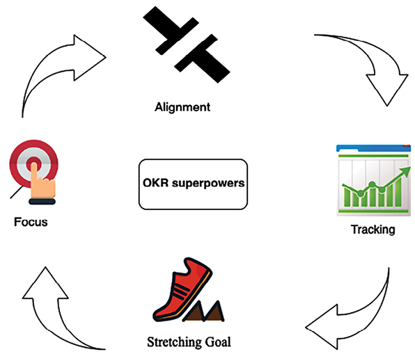
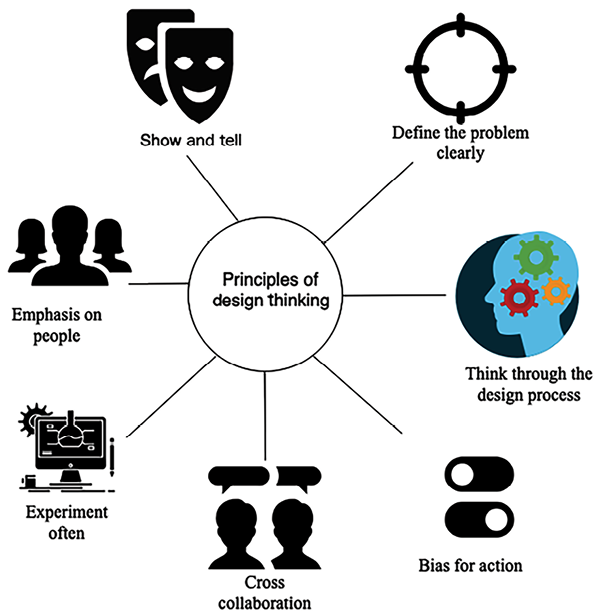
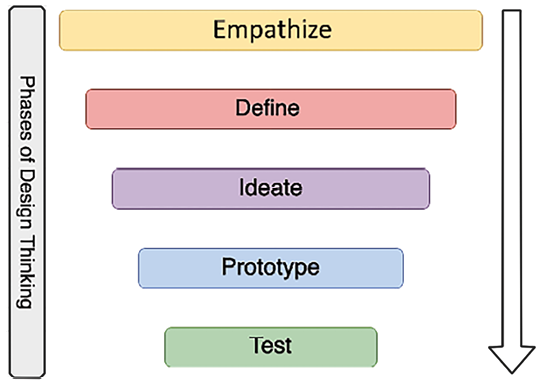

# Learning Soft Skills to Become a Better Solutions Architect

In the previous chapters, you learned how a solutions architect needs to accommodate all stakeholders’ needs. Even if the solutions architect’s role is technical, they need to work across the organization, from senior management to the development team. Soft skills are essential and critical factors to become a successful solutions architect.

Solutions architects should keep updated with current technology trends, keep evolving their knowledge, and always be curious to learn new things. You can become a better solutions architect by applying continuous learning. You will discover methods to learn new technologies in this chapter and how to share and contribute back to the technical community.

Solutions architects need to define and present an overall technical strategy to address business concerns. They need to work across business and technical teams to negotiate the best solution, which requires excellent communication skills. In this chapter, you will learn the soft skills a solutions architect must have, including communication:

- Importance of soft skills in solution architecture
- Acquiring pre-sales skills
- Taking ownership and accountability
- Being flexible and adaptable
- Design thinking
- Being a builder by engaging in coding hands-on
- Becoming better with continuous learning
- Being a mentor to others
- Becoming a technology evangelist and thought leader

By the end of this chapter, you will know about the soft skills required for a solutions architect to succeed. You will learn about methods to acquire strategic skills (such as pre-sales and executive communication) and develop design thinking and personal leadership skills (such as thinking big and ownership). You will learn techniques to establish yourself as a leader and continue improving your skill set.

# Importance of soft skills in solution architecture

The importance of soft skills in solution architecture cannot be overstated, as these skills are integral to the effectiveness and success of a solutions architect.

Firstly, effective communication is paramount. Solutions architects must simplify complex technical details for non-technical stakeholders, ensuring clarity and alignment between technical and business objectives. This skill is vital in bridging the gap between technical teams and business units, facilitating mutual understanding and collaborative goal setting.

Collaboration and teamwork also play a critical role. Given that solutions architects often work in multidisciplinary teams, the ability to work harmoniously with individuals from diverse backgrounds and expertise is crucial. This collaboration extends to conflict resolution, consensus building, and fostering an environment of shared responsibility and collective success.

Furthermore, problem-solving and critical thinking are essential soft skills for solutions architects. The nature of their work often involves navigating complex technical challenges and finding innovative solutions that align with business strategies. This requires technical understanding, creativity, analytical thinking, and a solutions-oriented mindset.

Lastly, leadership and adaptability are essential. Solutions architects frequently take on leadership roles in project teams, guiding technical direction and making pivotal decisions. This requires technical leadership and the ability to inspire, motivate, and guide teams toward a common vision. Additionally, the tech landscape is constantly evolving, and adaptability and a learning mindset enable solutions architects to stay current and responsive to new trends and technological shifts. These soft skills and technical expertise make solutions architects invaluable assets to any organization.

In the following sections, we look at some key soft skills a solutions architect should possess, within and related to the overarching skills mentioned here.

# Acquiring pre-sales skills

Pre-sales is a critical phase for complex technology procurement, whereby the customer collects detailed information to make a buying decision. In the customer organization, a solutions architect is involved in the pre-sales cycle to validate technology and infrastructure resources from various vendors. In the vendor organization, the solutions architect needs to respond to customers’ **requests for proposals** (**RFPs**) and present a potential solution to acquire new business for an organization. Achieving this requires a specific skill set.

## Key skills

Pre-sales requires a unique skill set that combines strong technical knowledge with soft skills, including the following:

- **Communication and negotiation skills**: Solutions architects need excellent communication skills to engage customers with the correct and latest details. Presenting precise details of the solution and industry relevance helps customers understand how your solution can address their business concerns. Solutions architects work as a bridge between the sales and technical teams, which makes communication and coordination a critical skill. Solutions architects must also create agreements by collaborating with customers and internal teams, which requires excellent negotiation skills. In particular, strategic-level decisions have a significant impact across multiple groups. Solutions architects need to negotiate between the teams, work on trade-offs, and develop an optimized solution.\* **Listening and problem-solving skills**: Solutions architects need strong analytical skills to identify the right solution per customer need. It’s important solutions architects listen to and understand customer use cases by asking the right questions to create a good solution. Solutions architects need to understand gaps and develop a solution for immediate business impact with long-term **return on investment** (**ROI**). Performance is more important for some customers, while others may be more focused on cost based on their application’s user base. The solutions architect must provide the right solution per their customer’s primary **key performance indicator** (**KPI**) goal.
- **Customer-facing skills**: The solutions architect often needs to work with both the internal and external customer teams. They influence stakeholders at all levels, from C-level executives to development engineers. They present solutions and demos to senior management, who look at your proposal from a business perspective. C-level executive support and commitment to initiatives always result in the success of the adopted solution, which makes customer-facing skills very important. The C-level executive needs details of the solution in a defined time-bound meeting, and the solutions architect needs to utilize the allotted time to their best advantage. You will learn more about the executive conversation in the next section of this chapter—_Presenting to C-level executives_.
- **Working with teams**: The solutions architect establishes a relationship with the business and product teams. To prepare an optimal application, the solutions architect must work with the business and technical teams at all levels. The solutions architect needs to be a good team player, share ideas, and find a way to work across teams.

The skills mentioned above are required for pre-sales and applicable to the solutions architect’s day-to-day job functions. Solutions architects come from a technical background, and, being in such a role, they need to acquire critical skills to communicate at an executive level. Let’s learn more about executive conversations in the next section.

## Presenting to C-level executives

A solutions architect needs to handle various challenges from a technical and business perspective. One of the most challenging tasks can be getting executive buy-in.

Senior executives such as the **Chief Executive Officer** (**CEO**), **Chief Technology Officer** (**CTO**), **Chief Financial Officer** (**CFO**), **Heads of Line of Business** (**LoBs**), and **Chief Information Officer** (**CIO**) are regarded as C-level as they have a tight schedule and need to make lots of high-impact decisions.

As a solutions architect, you may have many details to present, but your C-level meetings are time-bound. A solutions architect needs to get the maximum value from their meeting in the allotted time slot. The primary question is: _How do we get senior executives’ attention and support in a limited time?_

Start by explaining your agenda and planned meeting structure. Executives ask lots of questions to utilize their time properly, and your agenda should convey that they will get the chance to ask clarification questions. Following that, the key to an executive presentation is summarizing the primary points in the first 5 minutes. You should prepare so that if your 30-minute slot is reduced to 5 minutes, you should still be able to convey your points and get buy-in for the next step.

Support your summary with facts and data that align with their industry and organization. Keep the details with you in case they want to dive deep into a particular area; you should be able to pull up and show all the relevant data.

Don’t present everything in detail by stating information that may seem relevant from your perspective but doesn’t make much sense for an executive audience. For example, as a solutions architect, you may focus more on the benefits of the technical implementation. However, senior management focuses more on ROI by reducing operational overhead and increasing productivity.

Tailor your demo or presentation to resonate with the customer’s field and domain terminologies. Incorporating terms and concepts familiar to them not only fosters trust but also affirms that you have tailored your technical solution to address their unique industry challenges effectively.

You should be ready to answer the following questions that concern executives:

- **How will the proposed solution benefit our customers?** Business revolves around the customer. Executives look at their company’s growth, which is only possible if their customers are satisfied. Make sure to do your research on their customer base and their needs. Be ready to present benefits backed by reliable data.
- **What assumption did you make to baseline the solution?** Often, these meetings are at the initial phase when you need more details. Solutions architects always need to make some assumptions to baseline the solution. List down your hypothesis in bullet points, and have a mitigation plan if things don’t work as per your assumptions.
- **What will be my ROI?** Executives are always looking for ROI by determining the **total cost of ownership** (**TCO**). Be ready with data to provide an estimated cost of ownership, solution maintenance costs, training costs, overall cost savings, and so on.
- **What happens if we continue as it is today and do nothing?** Senior management may go into extreme vetting mode to identify ROI. They want to understand if the investment is worth it. It would be best if you are ready with your market research—for example, technology trends, customer trends, and the competitive situation.
- **What will our competitor’s reaction be regarding your solution?** Competition is everywhere, and often, the executive worries about it. They want to understand if your solution is innovative to beat the competition and give their organization the edge. It’s better to do some upfront research and add competitive data relating to their industry and customer base.
- **What is your suggestion, and how can I help?** You should always have a crisp list of action items as the next step while providing your suggestions. You need to get buy-in from executives and make them feel involved by asking for help. For example, you can ask the CIO to connect you with the engineering or product teams to take an overall solution to the next step.

Let’s next look at the leadership skills a solutions architect should have as a technical leader for the organization.

# Taking ownership and accountability

Taking ownership and positioning yourself as a leader helps you to win trust with accountability. Ownership doesn’t mean you need to execute things alone; it is more about taking new initiatives and holding on to them for your organization. You can have ideas that can benefit your organization regarding productivity, agility, cost savings, and increasing the customer base. Sometimes, you may need more time or resources to execute your idea, but you should bring it forward as a new initiative and engage others for execution.

Accountability is about taking responsibility to drive the outcome. Ownership and accountability go hand in hand, where you are creating initiative and working on getting the result. People can trust you to execute any job and drive results. Accountability helps you build trust with your customers and team, resulting in a better work environment and goal achievement.

As a solutions architect, taking ownership helps you see things from the customers’ and sponsors’ perspectives. You feel motivated and a part of something meaningful that you enjoy doing. Make sure to define and create key successes and the objective key result. The goal/objective should be measurable using specific key results, and they must be time-bound. Let’s learn more about **objectives and key results** (**OKRs**).

## Defining strategy execution with OKRs

Strategy execution is complex and challenging. Excelling in strategy execution is essential for realizing the organizational vision, mission, and goals. The idea needs to be converted into actionable elements to keep teams aligned and everyone moving in the same direction. Goal setting and managing goals are some of the best-established ways to get things done.

OKRs are principles and practices (vision and execution) of goal setting. An OKR is a strategy management system that focuses on strategy execution, a simple framework that lets you define the organization’s primary strategy and priorities. Objectives are the principles, and key results are the practice—a _what and how_ of organizational vision. OKRs are based on four superpowers, as illustrated in the following diagram:

Figure 17.1: Superpowers of OKRs

OKRs’ superpowers include the following:

- **Focus**: Start with the question: _What are our main priorities, and where should people concentrate their efforts?_ Commit to what truly matters and provide clarity on what is essential.
- **Alignment**: Make goals public and transparent. Connect with the team and get cross-team, bottom-up, and sideways alignment.
- **Tracking**: Visually track the key results of each objective down to the percentage point.
- **Stretching Goal**: Create ambitious goals to achieve something remarkable. Stretching goals allows people to reimagine and rethink.

OKRs set clear, measurable goals and align them with the organization’s strategic mission. In solution architecture, OKRs can guide the design and implementation of systems to ensure they contribute to the business’s overarching goals.

For a solutions architect, OKRs could involve something like this:

**Objective**: Improve the system’s resilience and fault tolerance.

**Key Results**:

- Decrease system downtime by 30% within the next quarter.
- Implement a multi-zone deployment strategy for critical services by the next release cycle.
- Achieve 99.99% availability for the user-facing application layer within six months.

Here, the architect uses OKRs to set clear targets for system performance and reliability, which are crucial aspects of their responsibilities. They also help prioritize tasks, measure progress, and communicate the impact of architectural decisions to stakeholders.

OKRs provide visibility and a meaningful outcome to all stakeholders at various levels, from executive sponsors to teams. OKRs make the vision and mission of the organization clear. Team members working on day-to-day activities need visibility and clarity of the mission. They need to see how their everyday work impacts that. The OKR framework allows you to define this link and provide visibility and meaning for everyone on the team.

## Thinking big

Solutions architects should be able to see the big picture and think ahead. A solutions architect creates a foundation upon which the team puts building blocks and launches the product. Thinking big is one of the critical skills that solutions architects should possess to consider an application’s long-term sustainability.

Thinking big doesn’t mean you need to set a very unrealistic goal. Your goal should be big enough to challenge you and bring you out of your comfort zone.

Thinking big is about predicting the organization’s needs and staying ahead of technological advancements, ensuring that today’s designs can adapt and remain effective in the future. Thinking big is critical for success at both a personal and an organizational level.

You should always be confident in your capability while thinking big. It may seem challenging to achieve initially, but you will find the way as you start working toward the goal. Believe in yourself, and you will notice that others start supporting and believing in you. Thinking big helps to inspire people around you to become a part of your success. Set long-term goals, such as _where you want to see yourself and your organization in the next decade?_. Take one step at a time to gear a short-term goal to a long-term goal.

Once you set up the stretching goal by thinking big, it will help you take the initiative and explore new challenges. However, it’s best if you have support from your peers and team to deliver the result, who can provide you with the right feedback and extend help as needed. Become someone people want to help; this is a two-way door. To get help, you need to be open to helping others. Adaptability is another critical skill for solutions architects to work with others. Let’s learn more about it.

# Being flexible and adaptable

Adaptability and flexibility go hand in hand, and as a solutions architect, you must be flexible to adapt to new environments, working cultures, and technologies. Adaptability means you are always open to new ideas and to working with appropriate teams.

Teams may adopt a process and technology that is best suited for them. As a solutions architect, you must be flexible in accommodating team requirements during solution design. For example, in a microservices architecture, each service communicates via a standard RESTful API over the HTTP protocol. Teams may write code in a different language or tool, such as Python, Java, Node.js, or C#. The only requirement is that teams expose their APIs securely so that the entire system can build upon utilizing them.

You need different mindsets and perspectives to look into a problem and get a more innovative solution. Encouraging teams to fail fast and innovate helps an organization to be competitive.

Personal traits of flexibility are demonstrated by the following:

- Thinking about various solutions to solve a problem with the team and taking the best approach
- Helping team members to offload their work
- Volunteering to fill up a place if a team member needs to take time off for weeks due to personal reasons
- Being able to collaborate effectively with teams across different locations and time zones

You need to be open-minded and adaptable to changes in technology and processes. You may face resistance when bringing change to your team or organization. You need to encourage others to be flexible and convey the importance of change. For example, when an organization wants to move its workload from on-premises to the cloud, it often needs more support, as people have to learn a new platform. You need to explain the value proposition of the cloud and how it will help them be more agile and innovate faster.

As a solutions architect, you must be adaptable to multiple assignments and set the proper execution priority. You should be able to adjust to the situation and work under pressure.

A solutions architect needs critical design thinking to create an innovative solution. Let’s learn more about design thinking in the next section.

# Design thinking

A solutions architect has the primary role of system design, which makes design thinking an essential skill. Design thinking is one of the most successful approaches adopted across industries to solve challenging and unclear problems. Design thinking helps you to look at problems and solutions from a different perspective, which you might have yet to consider in the first instance. Design thinking focuses more on delivering results by providing a solution-based approach to solving a problem. It helps to question the problem, solution, and associated risk to develop the most optimized strategy.

Design thinking helps you redefine problems in a more human-centric way by putting yourself in the place of end users and customers. The following diagram illustrates the primary principles of design thinking:

Figure 17.2: Principles of design thinking

The following points are some design-thinking principles:

- **Experiment often**: Create a prototype to understand the idea’s implementation in real-life situations. Adopt a fail-fast strategy and experiment more often.
- **Cross-collaboration**: Bring in people from different backgrounds to look for problems in a diversified way and make sure solutions accommodate everyone’s needs.
- **Emphasis on people**: Collect feedback from various users and put yourself in their place to understand the problem from a different perspective.
- **Show and tell**: Present your thoughts in visuals so they are easier to grasp for everyone in the room.
- **Define the problem clearly**: Create a well-defined and clear vision for a given challenge, which can help others understand clearly and encourage them to contribute.\* **Think through the design process**: Understand the overall design process with clear goals and methods.
- **Bias for action**: The ultimate design to deliver a solution rather than just thinking. Be proactive in pushing forward and creating activities that can result in a workable solution.

Design thinking provides a solid foundation for applying empathy and creating a holistic view of the problem. To adopt design thinking, there is a five-phase model proposed by **d.school** ([https://dschool.stanford.edu/resources/getting-started-with-design-thinking](https://dschool.stanford.edu/resources/getting-started-with-design-thinking)). They are pioneers in teaching and applying design thinking. The following diagram illustrates the five phases of design thinking:

Figure 17.3: Five phases of design thinking

Design thinking is an iterative approach that needs to evolve continuously. The output from one phase can recursively be input to other phases until the solution gets solidified. A brief overview of the phases follows:

- **Empathize**: Empathy is the building block and foundation of design in the human context. To empathize, you should observe your users’ behaviors and engage with them to understand the actual issue. Try to immerse yourself in—and experience—the problem by putting yourself in the situation.
- **Define**: Empathizing helps define the problem as you experience the user’s needs and the problem they face. In the define phase, you apply your insight and define the problem clearly, which can fuel brainstorming to find an innovative yet simple solution.
- **Ideate**: The ideation phase is about moving from problem to solution. You work with the team to find various alternative solutions by challenging assumptions. You need to get the obvious solution out of your head and work collaboratively to find all possible solutions, which allows for innovation.\* **Prototype**: The prototype phase helps to convert ideas into concrete solutions. Prototyping can provide lots of learning and help resolve disagreements by showing a **proof of concept** (**POC**). It helps you to find gaps and risks. You should build a quick prototype without lots of investment, which allows you to handle failure and increase learning.
- **Test**: The test phase is about getting feedback on your solution and reiterating it accordingly. The test phase helps you to redefine the solution and learn more about your users.

Design thinking accommodates all the phases to develop a logical and practical solution. When designing application architecture, you can relate the phases and principles of design thinking to your real life. There is particular stress on prototyping, as that is the only way to solidify your proposal and existing solutions with data and facts. A solutions architect’s primary job is to understand the business concern and create a technical solution design with a prototype the team can implement. To build a prototype, the solutions architect must get their hands dirty and engage in hands-on coding. Let’s learn more about it.

# Being a builder by engaging in coding hands-on

A solutions architect is a builder who learns by doing. Building a prototype is worth a thousand pictures. It helps to reduce miscommunication and ideate solutions. Presenting a POC and prototyping are integral parts of the solutions architect’s role.

Prototyping is the pre-solution phase, which helps to deepen your understanding of the application design and user. It helps you to think about and build multiple solution paths. By testing a prototype, you can refine your solution and inspire others, such as teams, customers, and investors, by demoing your vision.

A solutions architect is a technical leader who works closely with the development team. In an empowered agile team of developers, a solutions architect needs to show a piece of code as a POC in addition to a PowerPoint presentation. A solutions architect doesn’t need to be part of the development team but works collaboratively to convey the solution to the dev team in their language. Successful delivery is only possible if the solutions architect can understand the deep technical aspect of a solution that comes with continuous coding and hands-on experience.

A solutions architect is often seen as a mentor and player-coach; having some hands-on coding helps them establish credibility. A solutions architect needs to decide which programming languages and tools the team should use. A hands-on approach helps identify gaps that may not fit your team or solution requirements—always learning new technologies enables you to make a better decision on behalf of the organization. Let’s learn more about the techniques of continuous learning.

# Becoming better with continuous learning

Solutions architects need to continually absorb new knowledge and enhance their skill sets to help the organization make better decisions. Continuous learning keeps your skill set relevant and builds confidence. It opens up your mind and changes prospects.

Learning can be challenging with a full-time job and a busy family life. Continuous learning is about developing the habit of always learning something new, whereby you have to be motivated and disciplined. You first need to set up learning goals and apply effective time management to achieve them. This often slips through the net when you get busy with regular daily work.

Everyone has their own style of learning. Some people may like formal education; some may read books; others may want to listen to and watch tutorials. You need to find the learning style that is most effective for you and suited to your lifestyle.

For example, you can listen to audiobooks and tutorials when commuting to work. You can read books during a business flight or watch video tutorials during exercise hours in the gym. Overall, you need to make some adjustments to put time aside from your busy work life for continuous learning. Here are some of the ways to engage yourself in constant learning:

- **Learning new technologies, frameworks, and languages by trying them out**: Solutions architects are builders ready to experiment hands-on. As a successful solutions architect, you must keep learning new technologies by building a small POC. Understanding modern programming languages and frameworks will help you provide the best advice on technology adoption for an organization and team.\* **Learning new skills by reading books and tutorials**: The traditional method of reading physical books offers significant benefits, particularly in the context of focused learning. It allows readers to disconnect from the distractions of online activity, fostering deeper concentration. This approach is especially beneficial for those who spend much of their day in front of a computer screen, as it provides a restful break for the eyes. Engaging with physical books can enhance the learning experience by reducing digital fatigue and promoting undivided attention to the material.

Similarly, there are millions of books available on Kindle to read anytime and anywhere. Audiobook platforms such as Audible and Google Play’s audiobooks can help you listen to books during your commute. So many convenient resources are available that there is no excuse not to apply continuous learning.

Online learning has been revolutionary and made it easy to understand and dive deep into any area. You now have massive knowledge bases at your fingertips to learn anything. An online platform such as Udemy or Coursera provides thousands of video tutorial courses in all areas you can watch online or download to your device for offline learning.

- **Keeping up with technology news and developments by reading articles on websites and blogs**: The best way to keep yourself updated with technology trends is by subscribing to technical news and blogs. [TechCrunch.com](http://TechCrunch.com), [Wired.com](http://Wired.com), and [Cnet.com](http://Cnet.com) are popular websites where you can find the latest technology trends. Major newspapers such as _CNBC_, _The New York Times_, and the BBC News and CNN channels also have technology articles that provide good insight into industry trends. You can subscribe to blogs for new learning in respective technology areas. For example, for cloud platform learning, you can subscribe to **Amazon Web Services** (**AWS**) blogs, which have thousands of articles and use cases in the area of the AWS cloud, and similar blogs are available from other public clouds such as Azure and **Google Cloud Platform** (**GCP**).
- **Writing a blog, whitepaper, or book**: Sharing knowledge is the best way to learn as you think through use cases when trying to present to others. Publishing blogs and articles on popular blog-publishing platforms such as Medium, Blogger, and LinkedIn helps you share your learning and also learn from others. Active participation in question-and-answer platforms enables you to find an alternative solution for any given problem. Some popular question/answer platforms are Quora, Reddit, Stack Overflow, and Stack Exchange.
- **Solidify your knowledge by teaching others**: Teaching others helps you collaborate and get a different perspective on your knowledge. Use cases proposed by participants often give you different ways of finding a solution. Running a full-day workshop with a hands-on lab and concept building helps you solidify your learning and learn with others.
- **Taking online classes**: Sometimes, you want to go for formal learning to be more disciplined, and you want to be flexible. Online courses provide flexibility, help you adjust to other priorities, and save time. Online courses offer an organized way to learn new technologies and enhance knowledge.
- **Learning from teammates**: Teammates share the same working environment, and you spend most of the day with them. Learning with teammates can speed up your learning. The team can adopt a divide-and-conquer strategy whereby members can share their topics and present deep-dive lunch-and-learn sessions. These sessions are a standard method used by many organizations to conduct regular learning sessions among team members. Each team member shares their new learning in a weekly learning session, and everyone quickly learns about new topics.
- **Attending and participating in user groups and conferences**: All large vertical industry and technology organizations conduct conferences and hands-on sessions to provide insight into new technology trends. Participating in industry conferences and user group meetings helps to develop networking and understand technology trends. Some of the large technology conferences from industry leaders include AWS re:Invent, Google Cloud Next, Microsoft Ignite, SAP SAPPHIRE, and Strata Data Conference. You could also create a local user group and conduct a meetup in your local area, which will help you to collaborate with professionals across industries and organizations.

Continual professional development is essential for a solutions architect, with technology’s rapid evolution necessitating routine updates to credentials and certifications to stay current with new advancements and industry standards.

A solutions architect plays a technical leadership role, and good leadership warrants preparing more leaders like you, which is possible through mentorship. Solutions architects should play a player-coach role and mentor others. Let’s look at this in more detail.

# Being a mentor to others

Mentoring is about helping others and setting them up for success based on your learning and experience. It is an effective way to develop leaders, through one-to-one mentor/mentee relationships. To be a good mentor, you must establish an informal communication style where the mentee can develop a comfort zone. The mentee can seek advice in multiple areas, such as career development or personal aspects, such as work-life balance. You should do an informal needs assessment and set mutual goals and expectations.

Mentorship is more about listening than talking. Sometimes, people need someone to listen to them and advise as required. You should listen carefully first and understand their point of view.

Help the mentee make their own decisions, making them feel more accomplished. As a good mentor, when advising on someone’s career, you need to be open to advice on the best fit for the mentee, even if it may not necessarily be the best fit for the company. Always provide honest, constructive feedback to help them identify and overcome gaps.

The critical trait of a mentor is the ability to inspire people. Often, people may choose you as a mentor if they see a role model in you. Help your mentee realize their full potential without putting your view forward, and help them achieve what they had never before thought of. There are always mutual benefits to being a mentor; you also learn from mentees about people’s behavior and growth. Being a mentor to others will ultimately help you to become a better leader and person.

To take your expertise to the next level, you can become a technology evangelist and thought leader. Let’s explore this next.

# Becoming a technology evangelist and thought leader

Technology evangelism is about being an expert in advocating technology and your product. Some organizations with an extensive product base roll out a separate technology evangelist role. Still, a solutions architect often needs to assume the role of an evangelist as part of their job. As a technology evangelist, you must be aware of current technology trends to understand real-world problems and advocate for your technology to solve business concerns.

Technology evangelism involves participating in an industry conference as a public speaker and promoting your platform. It allows you to become a thought leader and an influencer, which can help the organization increase its platform and product adoption. Public speaking is one of the critical skills required for a solutions architect to interact on various public platforms and present in front of large audiences.

An evangelist also creates and publishes blog posts, whitepapers, and microblogs to advocate their product. They socialize the content to increase adoption and interact with users to understand their feedback. An evangelist works backward from the customer and communicates feedback to the internal team to help make the product better. With time, as an evangelist, you will refine the message that works in the organization’s best interests.

A solutions architect is a role with multiple responsibilities, and taking more ownership will help you succeed in your career.

# Summary

In this chapter, you learned about the soft skills required for a solutions architect to succeed, and the importance of these. A solutions architect needs pre-sales skills, which help them support the organization’s pre-sales cycle, such as with the RFP.

You learned about the presentation skills required for executive conversations and buy-in and the strategic understanding that a solutions architect should have to define key objectives and results for an organization. To execute at various levels, solutions architects should be able to think big and be flexible and adaptable. You learned details about solutions architects taking ownership and being accountable for their actions.

A solutions architect’s role has the primary responsibility of architecture design. You learned about design thinking, with its principles and phases. You also learned about the importance of continuous learning and different techniques to carry on learning and keep up with market trends. You also explored additional responsibilities of the solutions architect—to work as a mentor and evangelist.

It has been a long journey through this book, learning all about solutions architects, from their roles and responsibilities to different aspects of solution design and architecture optimization. I hope you have learned a lot and that it will help you develop your career as a solutions architect or help you succeed in your current role.

Happy learning!
