# Principles of Solution Architecture Design

This chapter throws light on the most important and common design principles and attributes of solution architecture. While the focus in this chapter is on the most pivotal design elements, it’s worth noting that additional design aspects might arise, contingent on the complexity of the product and the specific industry domain. As you advance on your journey toward becoming a solutions architect through this book, you’ll see these foundational principles and attributes applied in more depth, including in the crafting of various design patterns tailored to diverse scenarios and challenges.

In this chapter, you will learn the principles of designing architectures that are scalable, resilient, and optimized for performance, while ensuring robust security measures are in place to safeguard your application. You will explore strategies to navigate architectural constraints and embrace change through testing and automation, emphasizing a data-driven approach. By understanding and applying these principles, you’ll be equipped to think critically and make informed decisions that enhance the effectiveness and reliability of your architectural designs.

You will learn about the following topics in this chapter:

- Building scalable architecture design
- Building a highly available and resilient architecture
- Design for performance
- Creating immutable architecture
- Think loose coupling
- Think service, not server
- Think data-driven design
- Adding security everywhere
- Making applications usable and accessible
- Building future-proof extendable architecture
- Ensuring architectural interoperability and portability
- Applying automation everywhere
- Design for operation
- Overcoming architectural constraints

Let’s embark on exploring the foundational elements of architectural design. By the end of this chapter, you’ll have gained insights into various essential design aspects to consider when constructing an architecture. This knowledge will serve as a crucial stepping stone on your journey to understanding and implementing effective and robust architectural solutions.

# Building scalable architecture design

Scalability has always been a primary factor while designing a solution. If you ask any enterprise about their solutions, scalability will be one of the key considerations. **Scalability** refers to allowing your system to handle growing workloads, which can apply to multiple layers, such as the application server, web app, and database. Scalability helps you fulfill user demand without impacting application performance, resulting in higher business returns.

As most applications nowadays are web-based, let’s also talk about **elasticity**. This is about growing your system by adding more capabilities and shrinking it to save on unnecessary costs. With the adoption of the public cloud, it has become easy to quickly grow and shrink your workload, with elasticity now replacing scalability.

Traditionally, there are two modes of scaling:

- **Horizontal scaling**: Horizontal scaling is becoming increasingly popular as computing power has become an exponentially cheaper commodity in the last decade. In horizontal scaling, the team adds more servers to handle increasing workloads, as in _Figure 2.1_:

  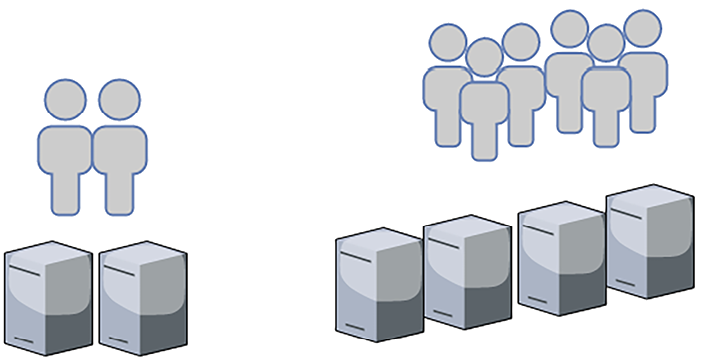

  Figure 2.1: Horizontal scaling

  Let’s say your application can handle _1,000 requests per second_ with _two server instances_, for example. As your user base grows, the application receives _2,000 requests per second_, which means you may want to double your application instances to four to handle the increased load.

- **Vertical scaling**: This has been around for a long time. It is a practice in which the team adds additional computer storage capacity and memory power to the same server to handle increasing workloads. As shown in _Figure 2.2_, during vertical scaling, you will get a larger server—rather than adding more servers—to handle the increased workload:

  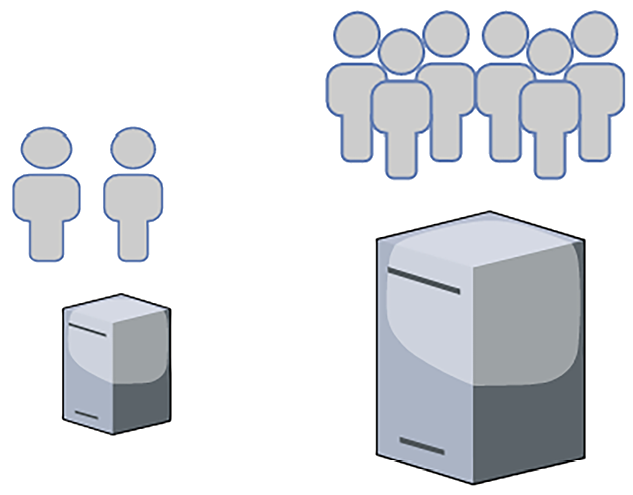

  Figure 2.2: Vertical scaling

  The vertical scaling model may be less cost-effective, however; when you purchase hardware with more computing power and memory capacity, the cost increases exponentially. You want to avoid vertical scaling after a certain threshold unless it is required to handle an increasing workload due to high costs and limitations on server capacity.

Vertical scaling is most commonly used to scale relational database servers. However, you need to think about database sharding here as if your server hits the limits of vertical scaling, it cannot grow beyond a specific memory and computing capacity.

Sharding is a technique used to scale databases by dividing and distributing data across multiple servers. Data is partitioned based on a shard key, which determines how data is distributed across the shards. In vertical sharding, the shard key can be a specific column or a set of columns in a table.

Scaling could be predictive if you are aware of your workload, which is often the case, or it could be reactive if you get a sudden spike or if you have never handled that kind of load before.

**Predictive scaling** is an advanced approach to managing application workloads, particularly useful for scenarios with predictable traffic patterns, like those seen on e-commerce websites. By analyzing historical data, organizations can forecast traffic trends and adjust their resources accordingly.

For instance, an e-commerce site might experience varying traffic based on the day of the week, time of day, or specific shopping holidays, necessitating a scaling strategy that preemptively adjusts resources to handle expected load increases. This approach not only optimizes resource usage but also enhances user experience by reducing latency and preventing outages, which is especially important during traffic spikes when resource allocation might lag behind demand.

**Reactive scaling**, on the other hand, is essential for dealing with unforeseen traffic surges, which might be significantly higher than the norm and could be triggered by events like flash sales. Understanding the unique traffic patterns for different pages of a website, as well as the user navigation path, is crucial for effectively managing these spikes. By identifying which pages can be cached or which queries are read-intensive, organizations can strategically offload traffic from the web layer, utilizing content distribution networks to manage static content.

This combination of predictive and reactive scaling ensures that applications remain resilient and responsive, regardless of traffic fluctuations. For example, the following **Auto Scaling group** has a maximum of six instances and a minimum size of three instances. During regular user traffic, three servers will be up and running to handle the workload, but the number of servers can reach six to handle a traffic spike. Your server fleet will increase based on the scaling policies you define to adjust the number of instances. For example, you can add one server when CPU utilization exceeds 60% in the existing servers’ fleet but doesn’t spin up more than six servers.

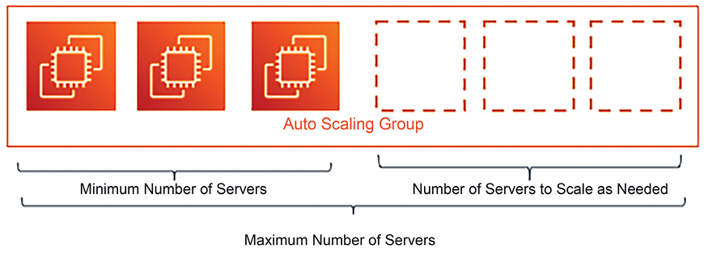

Figure 2.3: Server Auto Scaling

Regardless of scaling being reactive or predictive, you need to monitor the application and collect data to plan for your scaling needs.

## Scaling static content

Static content, such as images and videos, plays a crucial role in engaging users on your website. However, if not managed properly, these elements can significantly slow down your application’s performance. To maintain optimal speed and user experience, it’s essential to scale and distribute static content efficiently.

Let’s take the example of an e-commerce website. Each product will likely have multiple images—and perhaps even videos—to show a product’s texture and demos, which means the website will have a significant amount of static content with a read-heavy workload since, most of the time, users will be browsing products. In addition, users may upload multiple images and videos for product review.

Storing static content in a web server means consuming lots of storage space, and as product listings grow, you have to worry about storage scalability. The other problem is that static content requires large file sizes, which may cause significant load latency on the user’s end. The web architectural tier must utilize the **Content Distribution Network** (**CDN**) to solve this issue. CDNs help cache this content closer to the users, reducing latency and speeding up loading times. Properly scaling static content ensures that your application remains fast and responsive, providing a seamless experience for your users even as traffic volumes increase.

CDN providers (such as Akamai, Amazon CloudFront, Microsoft Azure CDN, and Google CDN) provide locations across the globe where static content can be cached from the web server near the user’s location, reducing latency. _Chapter 4_, _Solution Architecture Design Patterns_, will teach you more about caching.

To scale static content storage, it is recommended to use object storage, such as Amazon S3, or an on-premises custom origin, which can grow independently of memory and computer capabilities. Additionally, scaling storage independently with popular object storage services saves on cost. These storage solutions can hold static HTML pages to reduce the load of web servers and enhance the user experience by reducing latency through the CDN.

### Session management for application server scaling

The application architectural tier collects user requests from the web tier and performs the heavy lifting of calculating business logic and talking to the database. When user requests increase, the application tier needs to scale to handle them and then shrink back as demands decrease. In such scenarios, users are tied to the session, where, for example, they may browse from their mobile and purchase from their desktop. Performing horizontal scaling without handling user sessions may cause a bad user experience, as it will reset the user’s shopping progress.

Here, the first step is to take care of user sessions by decoupling them from the application server instance, which means you should consider maintaining the user session in an independent layer, such as a NoSQL database where you can store semi-structured data.

NoSQL databases are best suited for semi-structured data where data entries vary in their schema. For example, one user can enter their name and address while setting up a user profile. In contrast, another user can enter more attributes, such as phone number, gender, marital status, name, and address. As users have different attributes, NoSQL data can accommodate them and provide fast searches.

NoSQL databases such as Amazon DynamoDB or MongoDB offer exceptional partitioning capabilities, enabling effortless horizontal scaling at levels that surpass the scalability of other database types.

Once you start storing your user session in NoSQL databases, your instance can scale horizontally without impacting the user experience. You can add a load balancer in front of a fleet of application servers, which can distribute the load among instances; with the help of autoscaling, you can automate adding or removing instances on demand.

### Database scaling

Most applications use relational databases to store their transactional data. These have been around for decades and provide the robust transactional consistency required for many applications. However, the main problem with relational databases is that they cannot scale horizontally until you plan for other techniques, such as sharding, and modify your application accordingly. This will be a lot of work.

For databases, taking preventive care and reducing their load is better. Using a combination of storage methods, such as storing user sessions in separate NoSQL databases, storing static content in an object store, and applying an external cache, helps to offload the master database. It’s better to keep the master database node for writing and updating data and use an additional read replica for all read requests. For example, Amazon RDS for MySQL provides up to 15 read replicas for relational databases. Read replicas may have milliseconds of delay while syncing with the leader node, and you need to plan for that while designing your application. Using a caching engine such as Memcached or Redis is recommended to cache frequent queries and thus reduce the load on the leader node.

If your database starts growing beyond its current capacity, you need to redesign and divide it into shards by applying partitions.

Each shard can grow independently, and the application needs to determine a partition key to store user data in a respective shard. For example, if the partition key is `user_name`, then usernames from `A` to `E` can be stored in one shard, names from `F` to `I` can be stored in a second shard, and so on. The application needs to direct user records to the correct partition per their name’s first letter.

So, as you can see, scalability is a significant factor while designing a solution architecture, and it can impact the overall project budget and user experience significantly if it’s not planned correctly. A solutions architect always needs to consider elasticity while designing applications and optimizing workloads for the best performance and least cost.

A solutions architect needs to evaluate different options, such as CDNs for static content scaling and load balancing, autoscaling options for server scaling, and various data storage options for caching, object stores, NoSQL stores, read replicas, and sharding.

### Building elastic architecture

While focusing on scalability to enhance application performance, it is crucial to construct a cost-aware architectural design. This implies that as you expand your server infrastructure to meet rising user demand, the system should also contract when the server load diminishes. Elasticity is required to right-size your architecture, which involves scaling your server infrastructure to match the current demand accurately. It’s a balancing act between ensuring there’s enough capacity to handle peak loads efficiently without over-provisioning resources that would lie idle during off-peak times.

Let’s continue with the e-commerce website example by considering a modern three-tier architecture and see how we can achieve elasticity at a different Application Layer. Here, we only target the elasticity and scalability aspects of architecture design. _Figure 2.4_ shows a three-tier architecture diagram of the AWS cloud tech stack:

Figure 2.4: Scaling three-tier architecture

This diagram depicts a three-tier architecture designed for elasticity and high availability, focusing on building an elastic server fleet to manage variable loads efficiently.

The following are the architectural components:

- Elastic Load Balancing automatically distributes incoming application traffic across multiple targets, such as Amazon **Elastic Compute Cloud** (**EC2**) instances, containers, IP addresses, etc., in multiple Availability Zones. This increases the fault tolerance of the e-commerce application.
- The web layer consists of an Auto scaling group of EC2 instances designed to serve the application’s dynamic content. This fleet can automatically scale out (add instances) or scale in (remove instances) based on defined criteria like CPU utilization, ensuring that the fleet can adapt to the incoming traffic and maintain consistent performance.
- The Application Layer also has an autoscaling group of EC2 instances responsible for executing the business logic of the application. Like the web layer, this layer can dynamically adjust its size to meet the demands of the application workload.\* At the bottom, the Database Layer includes Amazon **Relational Database System** (**RDS**) instances, which provide managed relational databases. The setup includes a primary DB instance and a read replica to handle read-heavy operations, improving performance and reducing load on the primary instance. There is also a standby instance in a different Availability Zone for high availability and failover support.

This architecture allows for a flexible, scalable application environment that can handle variable workloads with high availability across multiple zones. It’s designed to expand and contract automatically in response to the application’s needs, ensuring users experience consistent, responsive performance.

When users access and interact to the application using website or mobile application. Their requests are routed through Amazon Route 53, which is a highly available and scalable **Domain Name System** (**DNS**) web service. Amazon CloudFront, a CDN, is used to distribute static content like images, stylesheets, and JavaScript files efficiently. This reduces the load on the web servers and improves the user experience by decreasing latency.

In this section, you have discovered the various scaling methods and how to inject elasticity into the different layers of your architecture. Scalability is an essential factor in ensuring that there is high application availability to make your application resilient. We will learn more about high availability and resiliency in the next section.

# Building a highly available and resilient architecture

Creating a highly available and resilient architecture involves designing systems that can tolerate failures of individual components without disrupting the overall system functionality.

## Highly available architecture

The one thing an organization wants to avoid is _downtime_. Application downtime can cause a loss of business and user trust, making **high availability** a primary factor while designing the solution architecture. The principle of high availability is “design for failure, and nothing will fail.”

The requirement for application uptime varies from application to application. If you have an external-facing application with a large user base, such as an e-commerce website or social media platform, 100% uptime becomes critical. In the case of an internal application (accessed by an employee, such as an HR system or a company intranet), it can likely tolerate some downtime. Achieving high availability is directly associated with cost, so a solutions architect must always plan for high availability per the application requirements to avoid over-architecting.

To achieve a high-availability architecture, it is better to plan workloads in an isolated physical location so that, should an outage occur in one place, your application replica can operate from another location. The high-availability architecture goes hand in hand with self-healing, where you can ensure your application is up and running, but you also need a quick recovery to maintain the desired user experience.

## Resilient architecture

A resilient architecture means your application should be available for customers while recovering from failure. Making your architecture resilient includes applying best practices to recover your application from increased loads due to more user requests, malicious attacks, and architectural component failure. Resiliency needs to be used in all architectural layers, including infrastructure, application, database, security, and networking. A resilient architecture should recover from failure within a desired amount of time.

To make your architecture resilient, you need to define the time of recovery and address the following points:

- Identify and implement redundant architectural components wherever required.
- Understand when to fix versus when to replace architectural components. For example, fixing a server issue might take longer than replacing it with the same machine image.

## Achieving redundancy

Redundancy is a crucial aspect of building resilient systems. Building a resilient architecture requires a multi-layered redundancy strategy. It involves deploying server clusters across different racks within a single data center, extending to multiple data centers within the same region, and further, across various geographic regions. This geographical distribution ensures protection against localized and regional disasters and reduces latency for a global user base.

Incorporating intelligent load balancing and global traffic management, such as DNS-based routing with health checks, ensures that users are always served from the optimal location. Database resiliency is achieved through strategic replication, with automated failover mechanisms to maintain database availability and integrity.

If servers are spread across different physical locations, the first level of traffic routing can be handled using the DNS server before it reaches the load balancer. This way, in the case of an entire region failure, your application can still run.

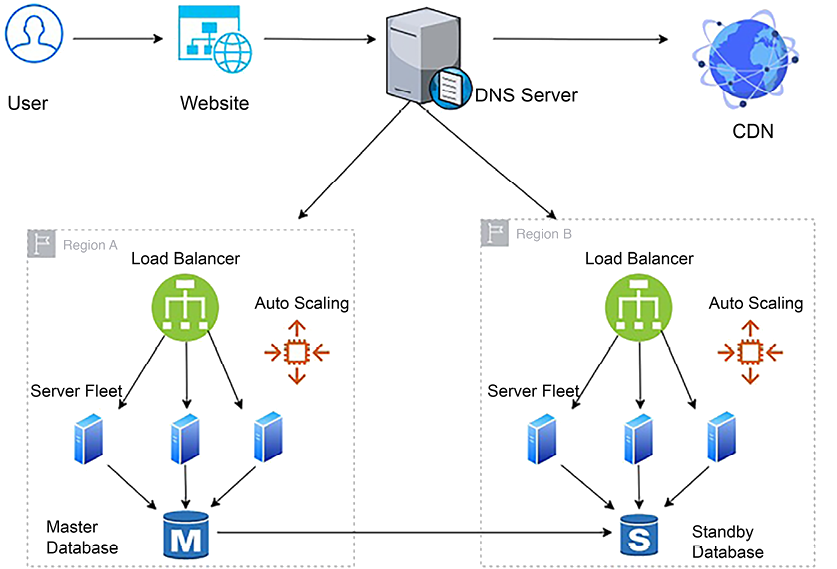

Figure 2.5: Application architecture resiliency using a DNS server

As you can see in the preceding architecture, resiliency must be applied in all the critical layers that affect the application’s availability in order to implement a design that can sustain failure. To achieve resiliency, in addition to using a DNS server to route traffic between different physical locations, the following best practices need to be applied to create a redundant environment:

- Use the CDN to distribute and cache static content such as videos, images, and static web pages near the user’s location so that your application will still be available.
- Once traffic reaches a region, use a load balancer to route traffic to a fleet of servers so that your application can still run even if one location fails within your region.
- Use autoscaling to add or remove servers based on user demand. As a result, your application should not be impacted by individual server failures.
- Create a standby database to ensure the high availability of the database, meaning that your application should be available in the event of a database failure.

## Addressing component failure

If any components fail, you should have a backup to recover them and achieve architecture resiliency. The load balancer and routers at the DNS server perform a health check to ensure that the traffic is only routed to healthy application instances. You can configure this to perform a shallow health check, which monitors local host failures, or a deep health check, which can also take care of dependency failure. However, a deep health check takes more time and is more resource-intensive than a shallow health check. You will learn more about resilient architecture in _Chapter 8_, _Architectural Reliability Considerations_.

At the application level, it is essential to avoid **cascade failure**, where the failure of one component can bring down the entire system. To mitigate the risk of cascading failures in a system, various mechanisms can be employed:

- **Timeouts**: Setting a maximum time limit for operations and requests can prevent waiting indefinitely for a response, which can lead to resource exhaustion.
- **Traffic rejection**: When the system is overwhelmed, it can proactively reject new requests to prevent overload and maintain stability for existing processes.
- **Idempotent operations**: Ensuring that operations can be repeated without causing unintended effects can help recover from intermediate failures without duplicating actions or causing inconsistencies.
- **Circuit breakers**: Implementing a circuit breaker pattern can detect failure patterns and open the “circuit” to stop further requests to a failing service, allowing it to recover and preventing the failure from spreading to other parts of the system.

By incorporating these strategies, systems can become more resilient, maintaining functionality in the face of individual component failures and preventing those failures from escalating into widespread system outages.

While high availability and resiliency ensure your system is up and available for users, it is also essential to maintain performance where fault tolerance comes into play. Let us now turn to the subject of fault tolerance.

# Making your architecture fault-tolerant

High availability means your application is available to the user but it can result in degraded performance. Suppose you need four servers to handle users’ traffic. For this, you put two servers in two different physically isolated data centers. If there is an outage in one data center, user traffic can be served from another. But now you have only two servers, which means only 50% of the original capacity is available, and users may experience performance issues. In this scenario, your application has 100% high availability but is only 50% fault tolerant.

As shown in _Figure 2.6_, to achieve 100% fault tolerance, you need full redundancy and have to maintain the double count of the servers so that the user doesn’t encounter any performance issues during the outage of one zone.

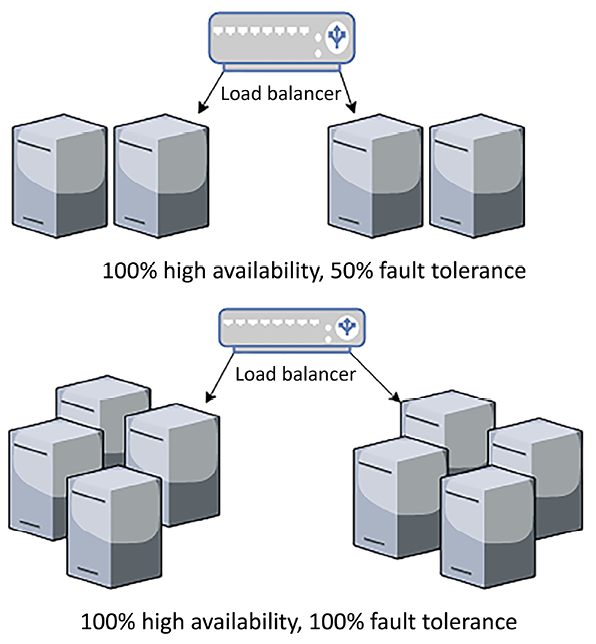

Figure 2.6: Fault tolerance architecture

Fault tolerance is handling workload capacity if an outage occurs without compromising system performance. A fully fault-tolerant architecture involves high costs due to increased redundancy. Whether your user base can live with degraded performance for the period of application recovery depends on your application’s criticality.

While designing the application architecture, a solutions architect needs to determine the nature of the application’s users and whether a fault tolerance of 100% is required, which will inevitably come with a cost implication. For example, an e-commerce website may need 100% fault tolerance, as degraded performance directly impacts business revenue. At the same time, an internal payroll system, which employees use at the end of the month to check their salary slips, can tolerate reducing performance for a short period. Let’s dive deep into building high-performance architecture next.

# Designing for performance

With the availability of fast internet, customers are seeking high-performance applications with minimal load time. Organizations have noticed that a direct revenue impact is proportional to application performance, and slowness in application load time can significantly impact customer engagement. Modern companies are setting high expectations when it comes to performance, resulting in high-performance applications becoming necessary to stay relevant in the market.

Like resiliency, the solutions architect needs to consider performance at every layer of architecture design. The DevOps team needs to put monitoring in place to check that the solution continues to perform effectively and work to improve it continuously. Better performance means increased user engagement and return on investment.

High-performance applications are designed to handle application slowness due to external factors such as a slow internet connection. For example, you may have designed your blog web page to load within 500 milliseconds where there is good internet availability. However, where the internet is slow, you can have it load text first and engage the user with this content while images and videos are still loading.

In an ideal environment, as your application workload increases, automated scaling mechanisms start handling additional requests without impacting application performance. But in the real world, your application latency goes down for a short duration when scaling takes effect. To understand how it will behave in a real-world situation, it’s better to test your application for performance by increasing the load and understanding whether you can achieve the desired concurrency and user experience.

You need to choose the right kind of server at the server level, depending on your workload. For example, choose the right amount of memory and compute to handle the workload, as memory congestion can slow down application performance and, eventually, the server may crash. You should choose the correct **input/output operations per second** (**IOPS**) for storage. You need high IOPS for write-intensive applications to reduce latency and increase disk write speed.

IOPS is a performance measurement used to benchmark the speed at which storage devices like hard drives, solid-state drives, and storage area networks can read and write data. Each input or output operation could be a data read or a data write.

To achieve higher performance, apply caching at every layer of your architecture design. Caching makes your data locally available to users or keeps data in memory to serve an ultra-fast response.

The following are considerations for adding caching to various layers of your application design:

- Use the browser cache on the user’s system to load frequently requested web pages.
- Use the DNS cache for quick website lookup.
- Use the CDN cache for high-resolution images and videos that are near the user’s location.
- At the server level, maximize the memory cache to serve user requests.
- Use cache engines such as Redis and Memcached to serve frequent queries from the caching engine.
- Use the database cache to serve frequent queries from memory.
- Take care of cache expiration, which is the process by which data stored in the cache becomes outdated and is marked for update or removal. Cache eviction, on the other hand, is the process by which data is removed from the cache, typically to make room for new data.

As you can see, keeping your application performant is an essential design aspect and is directly related to organizational profitability. The solutions architect needs to think about performance when creating a solution design and should work relentlessly to keep improving the performance of the application. In _Chapter 6_, _Performance Considerations_, you will dive deeper into this and learn techniques to optimize your application for better performance.

# Creating immutable architecture

Organizations make a significant capital investment in hardware and develop the practice of regularly refreshing it with a new version of the application and configuration. Over time, this can lead to different servers running in varied configurations, and troubleshooting them becomes tedious. Sometimes organizations must keep running unnecessary resources when they are not needed, as they are unsure which server to shut down, which may cause application failure. The inability to replace servers makes rolling out and testing any new updates in your server fleet challenging. These problems can be solved by treating your server as a replaceable resource, which enables you to move more quickly to accommodate changes, such as upgrading applications and underlying software, resulting in less downtime and fixing application issues quickly. That is why, while designing your application, you should always think of immutable infrastructure. This means that, during application upgrades, you will not only replace software but hardware, too.

Adopting a mindset where servers are treated like cattle, not pets, is fundamental in modern cloud architecture. This approach means that individual servers are not meticulously maintained or customized to the point where they become irreplaceable. Instead, servers are designed to be provisioned quickly, managed consistently, and disposed of or replaced without significant impact on the overall system. This methodology enhances scalability and resiliency, as it allows for rapid adaptation to changes in demand or recovery from failures.

To create replaceable servers, making your application stateless to retain user experience and avoiding the hardcoding of any server IP or database DNS name is advisable to avoid failures during replacement. You need to apply the idea of treating your infrastructure as code instead of hardware, and not apply updates to the live system.

Creating immutable infrastructure becomes more viable with a virtual machine. You can create a golden image of your virtual machine and deploy it with the new version of your infrastructure rather than trying to update an existing version. You should always spin up new server instances from the golden machine image, which acts as a template and has all the necessary security and software in place. This deployment strategy is also beneficial for server troubleshooting, where you can dispose of the server with an issue and spin up a new server from a golden image.

You should take a backup of logs for root cause analysis before disposing of the server with issues. This approach also ensures consistency across the environment, as you use the same baseline server image to create all your environments.

Loose coupling is another critical design principle that complements the “cattle not pets” approach. It involves designing system components so they interact with each other through well-defined interfaces and are independent enough that changes in one component do not necessitate changes in others. This separation enhances flexibility and scalability, allowing individual components to evolve, scale, or recover from failures independently. Let’s learn more about loose coupling.

# Think loose coupling

A traditional application is deployed on a tightly integrated server fleet where each server has a specific responsibility. Often, applications depend on multiple servers for completeness of functionality.

As shown in the following diagram, in a tightly coupled architecture, the web server fleet has a direct dependency on all application servers, and vice versa:

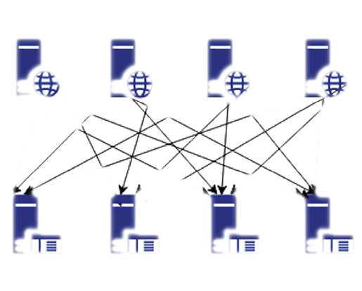

Figure 2.7: Tightly coupled architecture

In the preceding architecture diagram, if one application server goes down, then all web servers will start receiving errors, as the request will route to an unhealthy application server, which may cause a complete system failure. With tightly coupled architecture, if you want to scale by adding and removing servers, it requires lots of work, as all connections need to be set up appropriately.

With loose coupling, you can add an intermediate layer, such as a load balancer or a queue, which automatically handles failures or scaling for you.

In the following architecture diagram, there is a load balancer between the web server and the application server fleet, which makes sure that user requests are always served from a healthy application server:

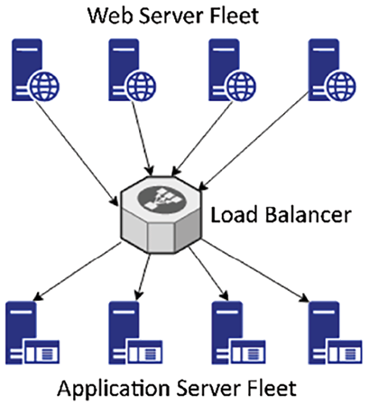

Figure 2.8: Load balancer-based, loosely coupled architecture

If one of the application servers goes down, the load balancer will automatically start directing all the traffic to the other three healthy servers. Loosely coupled architecture also helps you to scale your servers independently and replace unhealthy instances gracefully. It makes your application more fault-tolerant as an error radius is limited to a single instance only.

Loosely coupled architecture can also be queue-based; take the example of an image-processing website, where you need to store an image and then process it for encoding, thumbnails, and copyright. The following architecture diagram has queue-based decoupling. With this, loose coupling of systems is achieved by using queues between systems and exchanging messages that transfer jobs through these.

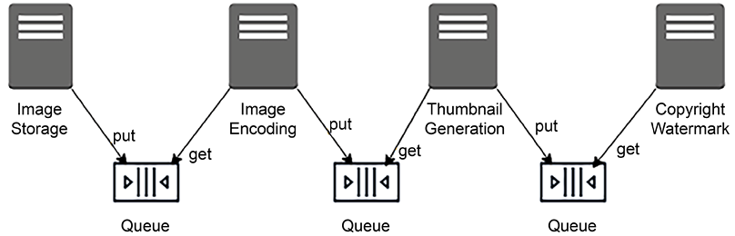

Figure 2.9: Queue-based, loosely coupled architecture

Queue-based decoupling enables the asynchronous linking of systems, where one server is not waiting for a response from another server and is working independently. This method lets you increase the number of virtual servers that receive and process the messages in parallel. You can configure autoscaling to terminate the excess servers if, for example, there is no image to process.

In a complex system, a loosely coupled architecture is achieved by creating a microservice architecture where independent services contain a complete set of functionalities and communicate with each other over a standard protocol. In modern design, event-driven design like this is becoming highly popular, facilitating the decoupling of an application component. The loosely coupled design has many benefits, from scalability and high availability to ease of integration.

# Think service, not server

In the previous section, you learned about loose coupling and how important it is for our architecture to be loosely coupled for scalability and fault tolerance. Developing service-oriented thinking will help to achieve a loosely coupled architecture (as opposed to server-oriented thinking, which can lead to hardware dependency and a tightly coupled architecture). Microservice-based event-driven architecture helps us to achieve ease of deployment and maintenance for our solution design.

In a RESTful architecture, you can format a message in XML, JSON, or plain text and send it over Internet using a simple HTTP protocol. RESTful architecture is popular as it is very lightweight. Microservices are based on RESTful architecture and are independently scalable, which makes it easier to expand or shrink one component of your application without impacting others.

As you can see in the following diagram, in a monolithic architecture, all components are built into a single service, thus deployed in a single server and tied up with a single database, which creates a hard dependency. In contrast, in a microservice architecture, each component is independent, with its framework and database, which allows them to be scaled independently:

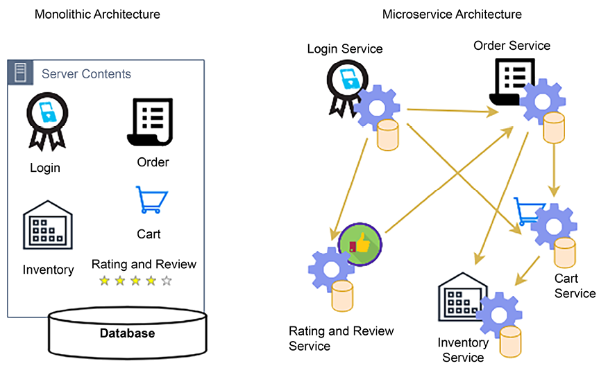

Figure 2.10: Monolithic and microservice architectures

In the preceding diagram, you can see an example of an e-commerce website as both a monolithic architecture and a microservice architecture, where customers can log in and place an order, assuming the items they want are available, by adding items to the cart.

To convert a monolithic architecture in to a microservice-based architecture, you can create applications made of small, independent components, which constitute smaller parts to iterate.

The _modularization approach_ reduces the _cost_, _size_, _and risk of change_. In the preceding case, each component is created as a service. Here, the **Login** service can independently scale to handle more traffic, as the customer may log in frequently to explore the product catalog and order status. In comparison, the **Order** and **Cart** services may have less traffic, as a customer may not place an order very often.

Solutions architects need to think of microservices while designing a solution. The clear advantage of services is that you have a smaller surface area of code to maintain, and services are self-contained. However, monitoring microservices involves a more granular approach compared to traditional monolithic applications due to the distributed nature of microservices. Each microservice functions independently, which means monitoring must be implemented at the individual service level as well as the system level to ensure a comprehensive view of the application’s health and performance.

You can build microservices with no external dependencies. All prerequisites are included in the service, which enables loose coupling and scaling, and reduces the blast radius in case of failure.

Any application design revolves around data, and working backward from data helps to build the best architecture. Let’s learn more about data-driven design.

# Think data-driven design

Any software solution revolves around the collection and management of data. Take the example of an e-commerce website; the software application is built to showcase product data on the website and encourage the customers to buy the products. It starts by collecting customer data when they create a login, adding a payment method, storing order transactions, and maintaining inventory data as the product gets sold. Another example is a banking application, which stores customer financial information and handles all financial transaction data with integrity and consistency. The most important thing for any application is handling, storing, and securing data appropriately. Data heavily influences solution design, and by keeping data in mind, you can apply the right design-driven solution for your needs.

It’s not just application design that revolves around data but operational maintenance and business decisions, too. You need to add monitoring capabilities to ensure that your application and your business are running without any issues. For example, for application monitoring, you collect log data from the server and create a dashboard to visualize the metrics. Continuous data monitoring and sending alerts in the case of issues help you to recover quickly from failure by triggering the auto-healing mechanism.

As a solutions architect, you are thinking about application design and the overall business value proposition, including ways to collect data and utilize it around the application, which can help to increase customer satisfaction and maximize the return on your investment. Data is gold, and getting insights into data can significantly impact an organization’s profitability.

# Adding security everywhere

Security is one of the essential aspects of solution design; any gap in security can have a devastating effect on a business or organization’s future. Many organizations are compromised by security breaches, resulting in a loss of customer trust and damaging businesses’ reputations. Industry-standard regulations, such as **PCI** (**Payment Card Industry**), **HIPAA** (**Health Insurance Portability and Accountability Act**), **GDPR** (**General Data Protection Regulation**), and **SOC** (**System and Organization Controls**) compliance are pivotal frameworks securing data across distinct domains. PCI secures credit card information in finance, HIPAA safeguards patient data in healthcare, GDPR enhances data privacy in the EU, and SOC ensures data management security in service organizations, enforce security safeguards to protect consumer data while providing standard guidance to the organization. Depending on your industry and region, you must comply with local legislation by adhering to compliance needs such as these.

Security can significantly impact solution design, so you need to understand your security needs before starting your design. Security needs to be included in platform readiness at the hardware level and in application development at the software level.

The following are the security aspects that need to be considered during the design phase:

- **Physical security of data center**: All IT resources in data centers should be secure from unauthorized access.
- **Network security**: The network should be secure to prevent any unauthorized server access.
- **Identity and Access Management** (**IAM**): Only authenticated users should have access to the application, and they can do the activity as per their authorization.
- **Data security in transit**: Data should be secure while traveling over the network or the internet.
- **Data security at rest**: Data should be secure while stored in the database or any other storage.
- **Security monitoring**: Any security incident should be captured, and the team should be alerted to act.

Application design needs to balance security requirements, such as encryption, and other factors, such as performance and latency. Data encryption always has a performance impact as it adds a layer of additional processing because data needs to be decrypted to be utilized. Your application needs to accommodate the overhead of additional encryption processing without impacting overall performance, so consider use cases where encryption is required while designing your application. For example, if the data is confidential, you need to encrypt it.

The other aspect of application design to consider related to security is regulatory compliance for adherence to local law. Compliance is essential if your application belongs to a regulated industry such as healthcare, finance, or the federal government. Each type of compliance has its requirements, which commonly include data protection and recording each activity for audit purposes. Your application design should include comprehensive logging and monitoring, which will fulfill the audit requirement.

Security is one of the most important aspects of application resiliency. From a security perspective, a **Distributed Denial of Service** (**DDoS**) attack can potentially impact the availability of services and applications. A DDoS attack usually puts fake traffic in your server and makes it busy, meaning legitimate users cannot access your application. This can happen at the network layer or the Application Layer. It’s essential to take a proactive approach to prevent DDoS attacks. Keep as much of the application workload as possible in the private network and avoid exposing your application endpoints to the internet wherever possible.

Security automation is another factor you should consistently implement along with your design to reduce and mitigate any security incidents. Automation in security involves utilizing technology to perform security tasks without human intervention, streamlining the detection, analysis, and remediation of security incidents. By integrating automated security measures, you can achieve continuous monitoring and real-time threat detection, enabling quicker responses to vulnerabilities and breaches.

In this section, you have learned how to apply security thinking while designing and considering any regulatory needs. However, you have a high-level overview here. You will learn more details in _Chapter 7_, _Security Considerations_.

You might create a feature-rich product, but it may not appeal broadly to users until they find it easy to navigate and access. Your application’s usability and accessibility play a significant role in product success. Let’s learn more about this in the next section.

# Making applications usable and accessible

Ensuring applications are both usable and accessible is a critical aspect of design that impacts the user experience significantly. Usability refers to how easy and intuitive an application is for users to interact with, which involves a user-friendly interface, clear navigation, and efficient task-completion processes. Accessibility, on the other hand, ensures that applications are usable by people with various disabilities. Let’s learn more about these.

## Achieving usability

You want your users to have a seamless experience browsing through the application. It should be so smooth that they don’t even notice how easily they can find things without any difficulties. You can do this by making your application highly usable.

Usability is how quickly the user can learn navigation logic when using your application for the first time. It’s about how quickly they can bounce back if they make a mistake and whether they can perform the task efficiently. Complex and feature-rich applications have no meaning if they can’t be used effectively. The goal is to create an intuitive and user-friendly interface that enhances the user experience, ensuring that the application’s functionality is accessible and straightforward for all users.

User research and testing are essential to defining usability that can satisfy user experience.

## Achieving accessibility

When designing your application, you often want to target a global audience or significant geographic region. Your user base will be diverse regarding technical amenities and physical abilities. Accessibility is about inclusion; you want your application to be accessible to everyone, regardless of whether a user has a slow internet connection, uses an old device, or has physical limitations.

While designing an application, a solutions architect must ensure that accessibility is considered. Sometimes, a different version of the application may need to be created altogether to achieve that.

Accessibility design should include design components, such as voice recognition and voice-based navigation, screen magnifiers, and the ability to read content aloud to aid those who cannot easily access and use applications due, for example, to vision or hearing impairment.

Localization helps the application become available in a language that’s specific to a region (for example, Spanish, Mandarin, German, Hindi, or Japanese), enabling global users across the world to navigate your application in their local languages.

As shown in _Figure 2.11_, customer satisfaction is a key component of usability and accessibility.

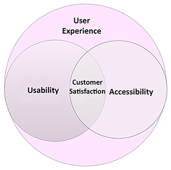

Figure 2.11: Customer satisfaction with usability and accessibility

You must know your users to achieve usability and accessibility—where accessibility is a component of usability—as they go hand in hand. Before starting the solution design process, a solutions architect should work alongside a product owner to research users by conducting interviews and surveys and gathering feedback on the mock frontend design. You need to understand the users’ limitations and empower them with supporting features during application development.

When the product is launched, the team should plan for A/B testing by routing a small portion of user traffic to new features and understanding user reactions. A/B testing involves comparing two versions of an application to evaluate their performance and determine the superior option. After launch, the application must have a mechanism to collect continuous feedback (by providing a feedback form or by launching customer support) to make the design better.

As your users keep evolving, your architecture should be able to keep up with increasing demands. For that, you need to design extendable and future-proof architecture. Let’s learn how to make your architecture future-proof.

# Building future-proof extendable and reusable architecture

Businesses evolve as they grow; applications scale to handle an increased user base and add more features to stay ahead and attain a competitive edge. A solution design needs to be extendable and flexible enough to modify an existing feature or add new functionality.

To achieve solution extensibility, a solutions architect must use a loosely coupled architecture wherever possible. At a high level, creating a RESTful or queue-based architecture can help develop loosely coupled communication between different modules or across applications. You will learn more about the other kinds of architecture in _Chapter 4_, _Solution Architecture Design Patterns_. In this section, we will take a simple example to explain the concept of architectural flexibility.

To modularize their application, organizations often want to build a platform with a group of features and launch them as separate applications. This is only possible with a reusable design.

_Figure 2.12_ shows an API-based architecture in an e-commerce application. Here, you have independent services, such as product catalog, order, payment, and shipping, utilized by an end user application in a pick-and-choose manner. The customer uses mobile and browser applications to place an online order. These applications need a product catalog service to allow the customer to browse the products on the web, an order service to allow them to place an order, and a payment service to process a payment.

In turn, the product catalog and order service communicate with the shipping service to send ordered items to the customer’s doorstep. On the other hand, brick-and-mortar stores use point-of-sale systems, where a customer representative scans barcodes, places orders on behalf of the customer, and takes payment. No shipping service is required here, as the customer picks up the item in-store.

Figure 2.12: Extensible API-based architecture

In _Figure 2.12_, you can see the Reward API used for third-party API integration. This architecture allows you to extend the current design to integrate the Reward API for customer retention and to attract new customers by providing benefits when they purchase an item. Here, you can see how payment services are reutilized by both online and store ordering. Another service can resue payment service if the organization wants to take payments for a gift card service, food services, and so on.

Extensibility and reusability are not limited to the service design level—they go deep into the actual API framework level, where software architects should use **object-oriented analysis and design** (**OOAD**) concepts, such as inheritance, to create an API framework. This can be extended and reutilized to add more features to the same service.

OOAD is a foundational approach in software engineering that helps developers plan and model applications more effectively, ensuring that the software is modular, scalable, and maintainable.

In order to extend your application feature, it needs to work seamlessly with other products where it can extend data and transactions. Making your application interoperable to the ecosystem helps to add new features by utilizing other adjacent applications. Let’s learn more about making compatible architecture.

# Ensuring architectural interoperability and portability

Architectural interoperability and portability are crucial aspects of modern software architecture, ensuring that applications can work across different environments and interact seamlessly with other systems. Let’s look at these concepts.

### Making applications interoperable

Interoperability is the ability of one application to work with others through a standard format or protocol. Often, an application must communicate with various upstream systems to consume data and downstream systems to supply data, so it is essential to establish that communication seamlessly.

An e-commerce application, for example, needs to work with other applications in the supply chain management ecosystem. This includes enterprise resource planning applications to record all transactions, transportation life cycle management, shipping companies, order management, warehouse management, and labor management.

All applications should be able to exchange data seamlessly to achieve an end-to-end feature from customer order to delivery. You will encounter similar use cases everywhere, whether it is a healthcare application, manufacturing application, or telecom application.

A solutions architect needs to consider application interoperability during design by identifying and working with various system dependencies. An interoperable application saves a lot in terms of cost, as it depends on systems that can communicate in the same format without any data messaging effort.

Each industry has its standard data exchange size that needs to be understood and adhered to. In general, for software design, the architect may choose a popular format, such as JSON or XML, for different applications so that they can communicate with each other. Both formats are supported out of the box in modern RESTful API design and microservice architecture.

### Making applications portable

System portability allows your application to work across different environments without or with only minimal changes. Any software application must work across various operating systems and hardware to achieve higher usability.

Since technology changes rapidly, you will often see that a new version of a software language, development platform, or operating system is released and you will need to ensure your application can adapt to these changes. Today, mobile applications are an integral part of any system design, and your mobile apps need to be compatible with major mobile operating system platforms, such as iOS and Android.

During the design phase, the solutions architect needs to choose a technology that can achieve the desired portability of the application. For example, if you aim to deploy your application across different operating systems, programming languages such as Java may be a good choice, as all operating systems often support it, and your application will work on a different platform without needing to be ported across. For mobile applications, an architect may choose a JavaScript-based framework such as React Native, which can provide cross-platform mobile app development.

Interoperability enriches system extensibility, and portability increases the usability of an application. Both are critical attributes of architecture design and may add exponential costs if not addressed during solution design. A solutions architect must carefully consider both aspects per industry requirements and system dependencies.

Automation is key to reducing errors and improving efficiency. We will look at this next.

# Applying automation everywhere

Most accidents happen due to human error, which can be avoided using **automation**. Automation not only handles jobs efficiently but also increases productivity and saves costs. Anything identified as a repeatable task can be automated to free up valuable human resources so team members can spend their time on more exciting work and focus on solving a real problem. It also helps to increase team morale.

When designing a solution, think about what can be automated. Think about automating any repeatable task. Consider the following components to be automated in your solution:

- **Application testing**: You need to test your application every time you make any changes to ensure nothing breaks. Also, manual testing is very time-consuming and requires lots of resources. Automating repeatable test cases is better to speed up deployment and product launch. Automate your testing on a production scale and use rolling deployment techniques, such as canary and A/B testing, to release changes. Canary testing involves releasing changes to a small group of users to assess the impact and detect issues before a full rollout, acting as an early warning system for potential problems. A/B testing, or split testing, compares two versions of an application to determine which one performs better with users, guiding decisions based on data.
- **IT infrastructure**: You can automate your infrastructure by using _infrastructure as code_ scripting, for example, Ansible, Terraform, and Amazon CloudFormation. The automation of infrastructure allows environments to be created in minutes compared to days. Automating infrastructure as code helps avoid configuration errors and creates a replica of the environment.
- **Logging, monitoring, and alerting**: Monitoring is critical, and you want to monitor everything every time to make sure all parts of your application are functioning properly and you can take proactive measures to fix any issues. You can only monitor the vast system by using automation. You need to automate all activity monitoring and logs to ensure that your application is running smoothly and functioning as desired. Also, based on monitoring, you should take automated action, such as scaling up your system or alerting your team to act.
- **Deployment automation**: Deployment is a repeatable task that is very time-consuming and delays the last-minute launch in many real-time scenarios. Automating your deployment pipeline by applying **continuous integration and continuous deployment** (**CI/CD**) helps you to be agile and iterate quickly on product features with frequent launches. CI/CD helps you make small, incremental changes to your application.
- **Security automation**: While automating everything, remember to add automation for security. If someone tries to hack your application, you want to know immediately and act quickly.
- You want to take preventive action by automating any incoming or outgoing traffic in your system boundary and setting alerts for suspicious activity.

Automation provides peace of mind by helping to ensure the product functions without a glitch. When designing an application, always think from an automation perspective and consider that as a critical component. You will learn more about automation in _Chapter 9_, _Operational Excellence Considerations_.

# Plan for business continuity

There may be a situation when the entire region where your data center is located goes down due to massive power grid outages, earthquakes, floods, or a security attack but your global business should continue running. In such situations, you must have a disaster recovery plan in which you will plan your business continuity by preparing sufficient IT resources in an entirely different region, perhaps even in different continents or countries, so that your business can get back up and running quickly or experience no downtime at all.

When planning disaster recovery, a solutions architect must understand an organization’s **Recovery Time Objective** (**RTO**) and **Recovery Point Objective** (**RPO**). RTO measures how much downtime a business can sustain without significant impact; RPO indicates how much data loss a business can tolerate. Reducing RTO and RPO means incurring higher costs, so it is essential to understand whether the business is mission-critical and needs minimal RTO and RPO. For example, a stock trading application cannot afford to lose a single data point, and a railway signaling application cannot be down for a single second, as human life depends on it.

The architecture diagram in _Figure 2.13_ shows a multi-site disaster recovery architecture. The primary data center location is in Ireland, Europe, and the disaster recovery site is in Virginia, USA, hosted on the AWS public cloud. In this case, a business can continue operating even if something happens to the European region or the public cloud. The fact that the disaster recovery plan is based on a multi-site model to achieve minimal RTO and RPO means minimal to no outage and no data loss.

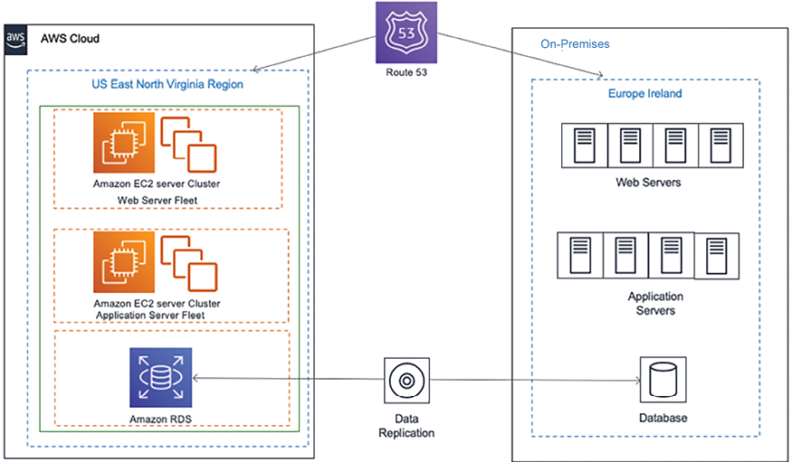

Figure 2.13: Hybrid multi-site disaster recovery architecture

The following are the most common disaster recovery plans, all of which you will learn about in _Chapter 11_, _DevOps and Solution Architecture Framework_:

- **Backup and Store**: This plan is the least costly but has the maximum RTO and RPO. In this plan, all the server’s machine images and database snapshots should be stored in the disaster recovery site. The team will try to restore the disaster site from a backup in a disaster.
- **Pilot lite**: In this plan, all the server’s machine images are stored as a backup, and a small database server is maintained in the disaster recovery site with continual data synchronization from the leading site. Other critical services, such as Active Directory, may be running in small instances. In a disaster, the team will try to bring up the server from the machine image and scale up a database. Pilot lite is more costly but has lower RTO and RPO than Backup and Store.
- **Warm standby**: In this plan, all the application and database server (running at low capacity) instances in the disaster recovery site continue to sync up with the leading site. In a disaster, the team will try to scale up all the servers and databases. Warm standby is costlier than the pilot lite option but has lower RTO and RPO.
- **Multi-site**: This plan is the most expensive and has a near-zero RTO and RPO. This plan maintains a replica of the leading site in a disaster recovery site with equal capacity that actively serves user traffic. In a disaster, all traffic will be routed to an alternate location.

Often, organizations choose a less costly option for disaster recovery, but it is essential to perform regular testing to ensure the failover works. The team should make operational excellence a routine checkpoint to ensure business continuity during disaster recovery. Running your application in production and maintaining it for years is very important. Let’s learn about the principles of making your application maintainable and operational.

# Design for operation

Operational excellence can be a great differentiator for your application by providing a high-quality service to customers with minimal outages. Applying operational excellence proactively also helps support and engineering teams increase productivity. Maintainability goes hand in hand with operational excellence. Easily maintainable applications help reduce costs, avoid errors, and let you gain a competitive edge.

A solutions architect needs to design for operation, including how the workload will be deployed, updated, and operated in the long term. Planning for logging, monitoring, and alerting is essential to capture all incidents and take quick action for the best user experience. Apply automation wherever possible, whether deploying infrastructures or changing the application code, to avoid human error.

Including deployment methods and automation strategy in your design is very important, as this can accelerate the time to market for any new changes without impacting existing operations. Operational excellence planning should consider security and compliance elements, as regulatory requirements may change over time, and your application must adhere to them to operate.

Maintenance can be proactive or reactive; for example, once a new version of an operating system becomes available, you can modernize your application to switch platforms immediately or monitor system health and wait until the end of the life of the software before making any changes. In any case, changes should be made in small increments with a rollback strategy. To apply these changes, you can automate the entire process by setting up a CI/CD pipeline. For the launch, you can plan for A/B testing or blue-green deployment.

For operational readiness, architecture design should include the appropriate documents and knowledge-sharing mechanisms—for example, creating and maintaining a runbook to document routine activity and creating a playbook to guide your system process through issues. This allows you to act quickly in the event of an incident. You should use _root cause analysis_ for post-incident reporting to determine why the issue occurred and ensure it doesn’t happen again.

Operational excellence and maintenance are ongoing; every operational event and failure is an opportunity to improve your operation by learning from previous mistakes. You must analyze the operation’s activities and failures, experiment, and improve. You will learn more about operational excellence in _Chapter 9_, _Operational Excellence Considerations_.

In _Chapter 1_, _Solutions Architects in Organizations_, you learned about the various constraints a solution architecture needs to handle and balance. It is a key architectural principle to take care of constraints, and we will look at this next.

# Overcoming architectural constraints

When designing an application architecture, the significant limitations are cost, time, budget, scope, schedule, and resources. Overcoming these constraints is a significant factor that must be considered while designing a solution. You should look at the limitations as challenges that can be overcome rather than obstacles, as challenges always push you to the limit of innovation.

A solutions architect needs to make suitable trade-offs while considering the constraints. For example, a high-performance application results in more cost when you need to add additional caching in multiple layers of architecture. However, sometimes, cost is more important than performance, primarily if a system is used by internal employees, which may not directly impact revenue. Sometimes, the market is more important than launching a fully featured product, and you need to make the trade-off between scope versus speed. In such scenarios, you can take the **minimum viable product** (**MVP**) approach; you will learn more about this in the next section.

Technology constraints become evident in a large organization, as bringing changes across hundreds of systems will be challenging. When designing applications, you need to use the most common technique across the organization. You also need to make sure that the application is upgradable to adopt new technology and be able to plug in components built on a different platform.

A RESTful service model is popular when teams are free to use any technology for their development. They only need to provide a URL with which their services can be accessed. Even legacy systems such as mainframes can be integrated into the new system using an API wrapper around it, and this can help overcome technology challenges.

Throughout this book, you will learn more about handling various architectural constraints. An MVP approach helps you overcome constraints and build a customer-centric product.

## Taking the MVP approach

For a successful solution, always put the customer first, think backward from the customer’s needs, determine what is critical for them, and plan your solution delivery in an agile way.

MVP is a development strategy used to build a new product or website with the minimum amount of features necessary to satisfy early adopters and validate a product idea early in the product development cycle. In this approach, the initial version of the product includes only the core features that allow the product to be deployed and no more. The goal is to provide immediate value, minimize development costs, and gather feedback from customers as quickly as possible to iterate and improve the product over time.

One popular method of prioritizing customer requirements is **MoSCoW**, where you divide requirements into the following categories:

- **Mo (must have)**: Requirements that are critical for your customers, without which the product cannot launch
- **S (should have)**: Requirements that are the most desirable to the customer once they start utilizing the application
- **Co (could have)**: Requirements that are nice to have, but their absence will not impact the desired functionality of the application\* **W (won’t have)**: Requirements that customers may not notice if they are not there

You need to plan an MVP for your customer with must-have requirements and go for the next delivery iteration with must-have requirements. With this phased delivery approach, you can thoroughly utilize your resources and overcome the challenges of time, budget, scope, and resources. The MVP approach helps you to determine customer needs. You are not trying to build everything without knowing if your features have added value for the customer. This customer-focused approach helps to utilize resources wisely and reduces the waste of resources.

In the following diagram, you can see the MVP evaluation for a truck manufacturing delivery, where the customer wants a delivery truck that gets delivered initially, and you evolve the process based on the customer’s requirements and feedback:

Figure 2.14: MVP approach to building the solution

Once a customer gets the first delivery truck, which is fully functioning, they can determine if they need a stronger or larger truck to handle a more significant load. Based on that, the manufacturer can build a 6-wheel, a 10-wheel, and an 18-wheel truck trailer. This stepwise approach provides working products with essential features that the customers can use, and the team can build upon them as per customer requirements.

You can see how the MVP approach helps to utilize limited resources in an efficient way, which helps to buy more time for quality product development and clarify the scope, in comparison to an approach where we turn up the first time with an 18-wheel truck only to find out we only needed a 6-wheeler. Putting the working product in the customer’s hands early gives you an idea of where to invest. As your application has already started generating revenue, you can present use cases to ask for more resources as required.

# Summary

In this chapter, you explored an in-depth overview of design principles required to architect effective and efficient systems. Initially, we delved into scalable architecture design, detailing predictive and reactive scaling strategies, and discussing techniques for scaling architecture, including strategies for static content, session management for application server scaling, and database scaling. We also looked at the importance of elasticity.

The chapter then explored constructing a highly available and resilient architecture, emphasizing the necessity of fault tolerance and using replaceable resources for robust system design. A separate section was dedicated to performance, underscoring how to build systems that perform optimally under various conditions.

The principle of loose coupling was discussed next, highlighting its importance in modern design, followed by the approach of “services, not servers,” which is central to the serverless computing paradigm. The chapter also underscored the importance of data-driven design, using data to make informed decisions about system architecture, and explored the need for robust security throughout the architecture. The importance of usability and accessibility in application design was also covered.

Building future-proof, extendable architecture was next on the agenda, focusing on architectural interoperability and portability to guarantee that systems can evolve and adapt to changing needs. The application of automation in all aspects of system architecture was discussed as a means to improve efficiency and reduce error rates.

Designing for operation was emphasized, emphasizing ease of system maintenance and updates. Lastly, the chapter addressed the challenge of overcoming architectural constraints, providing strategies to identify and mitigate the limitations of a given system design. The MVP approach was also explored as a tool for rapidly validating architectural choices.

In the next chapter, you’ll delve into various strategies and methodologies essential for cloud migration, highlighting how businesses transition their infrastructure, applications, and data to the cloud. Additionally, the chapter will cover the intricacies of designing and implementing hybrid cloud architecture, which combines on-premises infrastructure with cloud services, offering a flexible and scalable solution.
