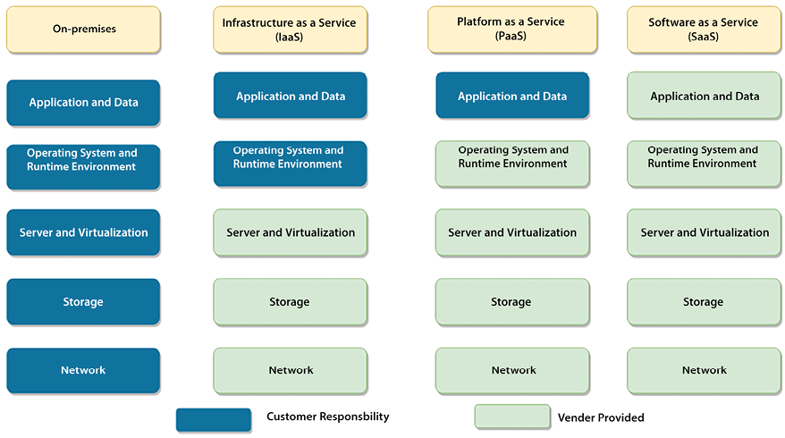
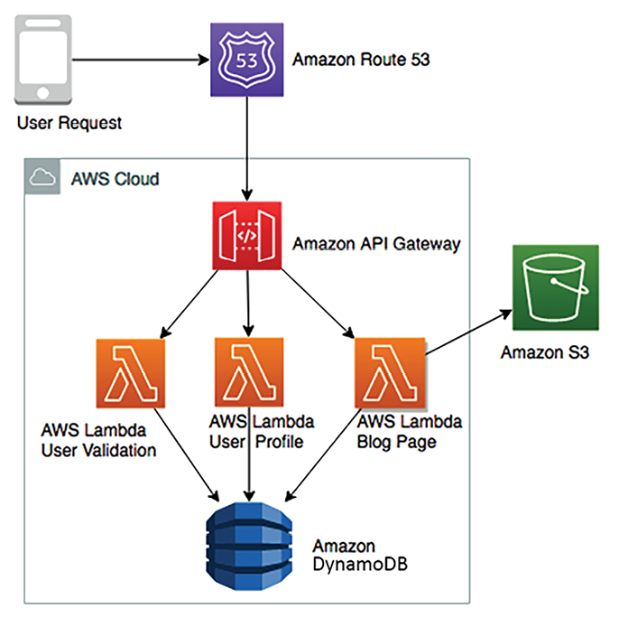
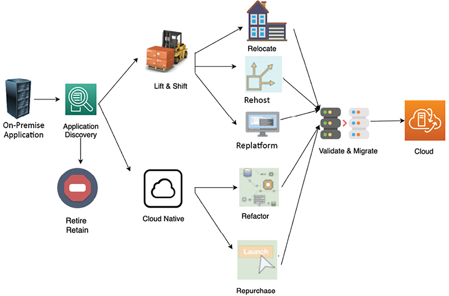
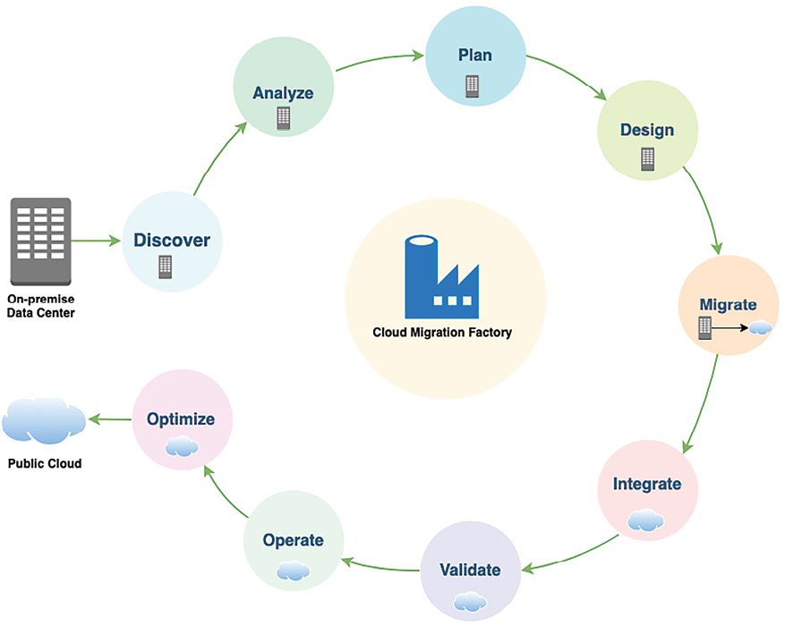
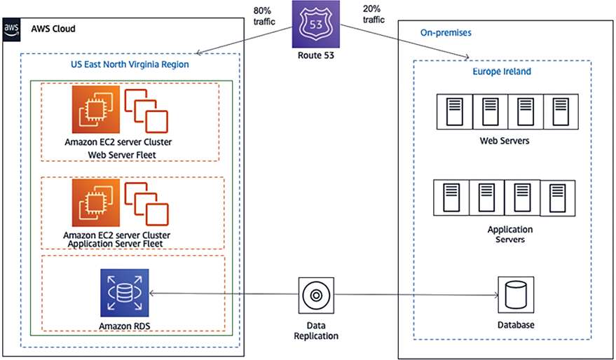
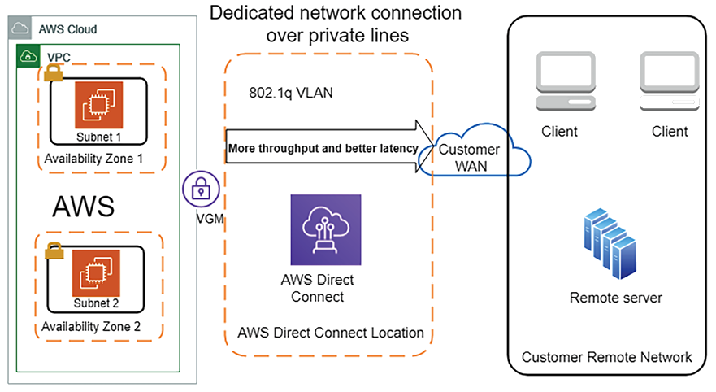
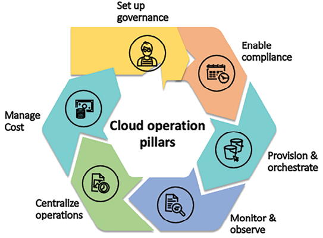

# Cloud Migration and Cloud Architecture Design

Organizations must continuously acquire new customers, satisfying their needs while working in a fiercely competitive environment. Today’s organizations must be more agile to respond to increasing customer demands, which requires quickly scaling up to millions of customers and scaling down as needed without impacting the budget. Cloud migration could be the answer to achieving agility and speed. The cloud enables frequent application releases and reduces costs by applying automation and data center consolidation.

The cloud is becoming essential for every enterprise strategy. Most organizations decrease spending by moving into the public cloud and, in addition to saving costs, they convert upfront capital expenditure into operational expenditure. Many start-ups born in the last decade started in the cloud and were fueled by _cloud infrastructure_ for rapid growth. As enterprises move to the cloud, they must focus on cloud migration strategies and the hybrid cloud.

Public clouds such as **Amazon Web Services** (**AWS**), **Microsoft Azure**, and **Google Cloud Platform** (**GCP**) are becoming the primary destinations to host applications, so learning about strategies and methods to migrate to the cloud is essential. In this chapter, you will learn about the various aspects of the cloud and develop “cloud thinking,” which will also help you understand the upcoming chapters better.

This chapter covers the following topics:

- Public, private, and hybrid clouds
- Solution architecture in the public cloud
- Cloud-native architecture
- Creating a cloud migration strategy
- Choosing a cloud strategy
- Steps for cloud migration
- Application optimization in the cloud
- Creating a hybrid cloud architecture
- Taking a multi-cloud approach
- Implementing CloudOps

By the end of this chapter, you will have learned about the benefits of the cloud and you will understand different cloud migration strategies and steps. You will also have learned about hybrid cloud design, taking a multi-cloud approach, and implementing CloudOps.

# Public, private, and hybrid clouds

There are three different types of cloud models: public, private, and hybrid.

The **public cloud** is based on the standard computing model in which a service provider makes resources such as **virtual machines** (**VMs**), applications, and storage available to customers over the internet. In the cloud computing model, a public cloud vendor provides on-demand availability of IT resources, such as the server, database, network, and storage, which organizations can use with secure web-based interfaces or through application programs over the internet. Public cloud services offer a _pay-as-you-go_ model and, in most cases, the customer only pays for the services they are using for the duration of utilization, saving them costs by optimizing IT resources to reduce idle time.

You can think of the public cloud as an electric power supply model, where you switch on the light and pay only for the amount of electricity you use in units. You stop paying for it from the moment you switch it off. It abstracts you from the complexity of power generation using turbines, resources to maintain the facility, and a significant infrastructure setup, and you use the entire service in a simplified way.

In addition to cost benefits, major public cloud providers, such as AWS, GCP, Microsoft Azure, Alibaba, and Oracle Cloud Platform (OCP), help to bring innovation by extending their technology platforms through the cloud. These public cloud providers have mastered scalability and future-looking architecture with comprehensive machine learning and analytics. With the public cloud, you get access to these cutting-edge technologies and the option of using them to advance your architecture.

A **private cloud**, or **on-premises cloud**, is registered to a single organization that owns and accesses it. Private clouds act as a replication or extension of the company’s existing data center. In comparison, a public cloud has a shared tenancy, which means virtual servers from multiple customers share the same physical server; however, they offer dedicated physical servers if the customer wants them for a license or compliance need.

The third model is a **hybrid cloud**, used by large enterprises who are moving their workload from on-premises to a cloud, where they still have a legacy application that cannot move to the cloud directly or maybe they have a licensed application that needs to stay on-premises—or sometimes, due to compliance reasons, they need to secure data on-premises. In such a situation, the hybrid model helps when the enterprise has to maintain a partial environment on-premises and move other applications to the public cloud. Sometimes, an organization moves to test and develop the environment to the public cloud and keep production environments on-premises. A hybrid model can vary depending on the organization’s cloud strategy.

As multiple public cloud providers are in the market, you may start seeing **multi-cloud** trends, where enterprises choose to distribute their workload between different public cloud vendors to get the most out of each cloud technology or provide options to their team depending on their skill set.

Let’s understand more about the public cloud and how it is becoming an essential technology platform for businesses.

# Solution architecture in the public cloud

Solution architecture in the cloud has become increasingly important and is becoming the “new normal” as more enterprises choose to migrate their workload to it. The public cloud has been a critical factor fueling start-up organizations’ growth, as they only need a small upfront investment rather than investing upfront in costly on-premises solutions. It allows organizations to be run as an experiment, and to be agile and innovative.

The great thing about cloud computing architecture is that you have an end-to-end view of all architecture components, including the frontend platforms, the application development platform, servers, storage, database, automation, delivery, and the networks that are required to manage the entire solution landscape.

Let’s learn more about the public cloud architecture.

## Public cloud architecture

A typical definition of the public cloud is a fully virtualized environment accessible over the internet and through a private network. However, public cloud vendors have recently started offering an on-premises physical infrastructure for better hybrid cloud adoption. The public cloud provides a multi-tenancy model, where IT infrastructure, such as storage and computational power, is shared between multiple customers; however, it is isolated at the software and logical network levels and does not interfere with each other’s workloads. Organizations can create network-level isolation in the public cloud to have their virtual private cloud equivalent to the logical data center. Looking at organizations’ regulatory needs, the public cloud also provides dedicated physical instances; however, those are also accessible over the web, but this is a less common option.

Public cloud storage achieves high durability and availability by creating a redundancy model using multiple data centers and robust data replication. This makes it achieve architecture resiliency and easy scalability.

There are three major types of public cloud computing models, as shown in _Figure 3.1_. On-premises solutions are also shown for comparison purposes.

Figure 3.1: Types of cloud computing models

In _Figure 3.1_, you can compare customer responsibilities in the on-premises environment with the cloud computing service model. In the on-premises environment, the customer has to manage everything, while in the cloud computing model, customers can offload responsibilities to the vendor and focus on their business needs. The following points are high-level details of services that are provided under different cloud computing models:

- **Infrastructure as a Service** (**IaaS**): Here, a cloud vendor provides infrastructure resources, such as a compute server, networking components, and data storage space, as managed services. It helps customers use IT resources without worrying about handling data center overheads, such as heating and cooling, racking and stacking, physical security, and so on.
- **Platform as a Service** (**PaaS**): The PaaS model adds a layer of service where the cloud vendor takes care of the resources that are required for your development platform, such as the **operating system** (**OS**), software maintenance, and patching, along with infrastructure resources. The PaaS model facilitates your team’s focus on writing business logic and handling data by taking care of the burden of platform maintenance for you.
- **Software as a Service** (**SaaS**): The SaaS model adds one more layer of abstraction on top of the PaaS and IaaS models, wherein the cloud or software vendor provides ready-to-use software, and you pay for the service. For example, you use email services such as Gmail, Yahoo Mail, AOL, and so on, where you get your own space for emails as a service and you don’t have to worry about underlying applications or infrastructures.

A fourth emerging model is the **Function-as-a-Service** (**FaaS**) model, which is becoming popular in the building of serverless architecture through using services including AWS Lambda. You will learn more details about serverless architecture in _Chapter 5_, _Cloud-Native Architecture Design Patterns_. Let’s look at a quick overview of the public cloud providers.

## Popular public cloud providers

Four major cloud providers primarily dominate the global cloud market. As per Statista’s 2023 report, AWS leads the pack with a market share of 32%, offering an extensive array of cloud services encompassing computing, storage, networking, databases, analytics, machine learning, and AI. AWS is used as an example throughout this book.

Microsoft Azure follows closely with a 24% market share, excelling in enterprise applications and hybrid cloud computing. GCP holds an 11% market share and is rapidly growing, particularly renowned for its machine learning and AI prowess. Alibaba Cloud secures the fourth spot with a 4% market share, excelling in the Asia-Pacific region. These four providers command over 70% of the global cloud market. Other significant players include Oracle, IBM Cloud, Tencent Cloud, and Salesforce. You can refer to the detailed report here: [https://www.statista.com/chart/18819/worldwide-market-share-of-leading-cloud-infrastructure-service-providers/](https://www.statista.com/chart/18819/worldwide-market-share-of-leading-cloud-infrastructure-service-providers/).

As the public cloud functionality and the cost model are very different, let’s learn how to develop a cloud-native approach to architecture design.

## Cloud-native architecture

With increasing cloud adoption, cloud-native (or cloud-based) architecture optimizes system architectures for cloud capabilities. A typical on-premises architecture is usually built for fixed infrastructure, as adding new IT resources such as servers and computing power can add a considerable amount of time, cost, and effort. However, the cloud is charged based on usage and provides ease through automation, such as scaling servers up and down, on demand, without worrying about a long procurement cycle. Cloud-native architecture focuses on achieving on-demand scale, distributed design, and replacing failed components rather than fixing them.

In cloud-native architecture, you continually create automated operations for recovery, scalability, self-healing, and high availability using the cloud capabilities of **continuous integration** (**CI**), deployment, and infrastructure automation. It encourages the continuous optimization of your application in terms of cost and performance, using new cloud capabilities that are released and improved upon every day.

Public cloud providers allow global infrastructure to spread across the world, which helps an application to be scaled globally near your user base. To encourage adoption, all cloud services provide a free-tier service with lots of learning resources, so you can try your hand and develop your knowledge of them.

The _cloud-native approach_ helps employees develop innovative thinking and implement their ideas immediately rather than waiting for the long cycle of infrastructure.

With the cloud, customers don’t need to plan excess capacity to handle their peak season, such as the holiday shopping season for retailers; they have the elasticity to provision resources to meet demand instantly. This significantly helps reduce costs and improve the customer’s experience. For any organization to stay in the competition, they have to move quickly and innovatively.

The cloud enables enterprises to get their infrastructure quickly across the globe and access various technologies that were not available to them previously. These include access to cutting-edge technologies such as the following:

- Big data and analytics
- Machine learning and AI
- **Internet of Things** (**IoT**)
- Blockchain
- Generative AI

Building a solution architecture for the cloud differs from regular enterprise architecting. While moving to the cloud, you have to develop cloud thinking and understand how to leverage the built-in capabilities of the cloud. For cloud thinking, you follow the _pay-as-you-go_ model, which means you need to make sure that you optimize your workload correctly and run your servers only when required.

In the cloud, the solutions architect must have a holistic view of each component regarding performance, scaling, high availability, disaster recovery, fault tolerance, security, and automation.

Other areas of optimization are **cloud-native monitoring** and **alerting mechanisms**. You may not need to bring your existing third-party monitoring tool from on-premises to the cloud, as you can utilize native cloud monitoring better and eliminate costly third-party licensing software. Also, now, you can have deployment capabilities to any part of the world in minutes. Don’t restrict yourself to a particular region; utilize the global deployment model to build better high-availability and disaster recovery mechanisms.

The cloud provides excellent deals for automation; _you can automate everything_. Automation reduces errors, speeds up time to market, and saves lots of costs by utilizing human resources efficiently and freeing them from performing tedious and repetitive tasks.

The cloud works on a _shared responsibility model_ where cloud vendors are responsible for securing physical infrastructure. However, the security of an application and its data is entirely the customer’s responsibility. Therefore, it’s important to lock down your environment and keep tabs on security by utilizing cloud-native tools for monitoring, alerts, and automation.

## Designing cloud-native architecture

Each organization may have a different opinion on cloud-native architecture, but at the center of it, becoming cloud-native is about utilizing all the cloud capabilities in the best way possible. True cloud-native architecture is about designing your application from its foundations to be built in the cloud.

Cloud-native doesn’t mean hosting your application on the cloud platform; it’s about leveraging services and features provided by the cloud. This may include the following:

- Containerizing your monolithic architecture in a microservice and creating a CI/CD pipeline for automated deployment.
- Building a serverless application with technology such as AWS Lambda FaaS and Amazon DynamoDB (a managed NoSQL database in the cloud).
- Creating a serverless data lake, by using Amazon S3 (a managed object storage service), AWS Glue (a managed Spark cluster for ETL), and Amazon Athena (a managed Presto cluster for ad hoc queries) for example.
- Using a cloud-native monitoring and logging service, for example, Amazon CloudWatch.
- Using a cloud-native auditing service, for example, AWS CloudTrail.

The following diagram is an example of a cloud-native serverless architecture for a micro-blogging application:

Figure 3.2: Cloud-native micro-blogging application architecture

The preceding diagram depicts utilizing cloud-native serverless services in the AWS cloud. Here, Amazon Route 53, which manages the DNS service, is routing user requests. Lambda manages to function as a service to handle the code for user validation, user profiles, and blog pages. All the blog assets are stored in Amazon S3, which manages object storage services, and all user profile data is stored in Amazon DynamoDB, which the NoSQL store manages.

As users send requests, AWS Lambda validates the user and looks at their profile to ensure they have a subscription in Amazon DynamoDB; after that, it picks blog assets such as pictures, videos, and a static HTML writeup from Amazon S3 and displays them to the user. This architecture can be scaled in an unlimited manner as all services are cloud-native managed services, and you are not handling any infrastructure.

Crucial factors such as high availability, disaster recovery, and scalability are taken care of by these cloud-native services so that you can focus on your feature development. In terms of cost, you will only pay if a request goes to a blogging application. If no one is browsing the blog at night, you don’t pay anything for hosting your code; you only pay a nominal storage fee.

The benefit of cloud-native architecture is that it enables fast-paced innovation and agility in the team. It simplifies building out a complex application and infrastructure. As you focus strictly on designing and building your networks, servers, file storage, and other computing resources, you can leave the physical implementation to your cloud computing provider.

Other cloud-native architecture benefits include:

- **Fast scale-out on demand**: You can request the resources you need when you need them. You only pay for what you use.
- **Replicate quickly**: Infrastructure-as-code means you can build once and replicate more. Instead of building your infrastructure by hand, you can structure it as a series of scripts or applications. Building your infrastructure programmatically allows you to build and rebuild it on demand when needed for development or testing.
- **Tear up and tear down easily**: In the cloud, services are provided on demand, so building up a large experimental system is easy. Your system may include a cluster of scalable web and application servers, multiple databases, terabytes of capacity, workflow applications, and monitoring. You can tear it all down after the experiment is completed and save costs.

There are many more examples in the area of storage, networking, and automation for building cloud-native architecture. You will learn more about this architecture in _Chapter 5_, _Cloud-Native Architecture Design Patterns_.

Throughout this book, you will learn about the cloud perspective of solution architecture and get an in-depth understanding of cloud architecture. In the next section, you will learn about various strategies for cloud migration.

# Creating a cloud migration strategy

Your strategy for the cloud helps you to determine a migration strategy and prioritize applications. These are some of the reasons that can trigger an initiative for cloud migration and hybrid cloud strategies:

- The data center needs a technology refresh
- The data center’s lease is ending
- The data center has run out of storage and computing capacity
- Modernization of an application
- To leverage cutting-edge technologies such as Generative AI, advanced analytics, machine learning, IoT, and so on
- The need to optimize IT resources to save on operational costs
- Disaster recovery planning and operational resilience
- To utilize a content distribution network for the website
- To reduce upfront capital expenditures and eliminate maintenance costs
- To increase workforce efficiency and productivity
- To improve business agility

Every organization has a different strategy, and one size does not fit all when it comes to cloud adoption. The frequent use cases are putting development and testing environments in the cloud to add agility for developers to move faster. As hosting web applications is becoming more economical and more straightforward with the cloud, organizations are using the cloud for digital transformation by hosting their websites and digital properties in the cloud.

For application accessibility, it is essential to not only build an application for the web browser but also to ensure that it is accessible through _smart mobiles_ and _tablets_. The cloud is helping with such transformations. Data processing and analytics is another area where enterprises utilize the cloud since it is less expensive and faster to collect, store, analyze, and share data with the cloud.

Cloud adoption is not just about choosing the platform, security design, and operation; you also need to consider people, processes, and culture in addition to technology. For cloud migration success, you must align leaders and earn team commitment by upskilling them. You need to define the vision across the organization to ensure a successful cloud transition.

Often, migration projects adopt multiple strategies and utilize different tools accordingly. The migration strategy will influence the time it takes to migrate and how the applications are grouped for the migration process. The following diagram shows some of the commonly used strategies for migrating existing applications to the cloud:

Figure 3.3: Cloud migration strategy

As shown in the preceding diagram, you can do a **lift and shift** of the server or application from the source environment to the cloud. Migrating a resource requires minimal changes for it to work in the cloud. To take a more **cloud-native** approach, you can refactor your application to utilize the cloud-native feature fully, for example, converting monolithic applications into microservices.

If your application is a legacy application that cannot be moved or is not cloud-compatible, you may want to retire it and replace it with a cloud-native SaaS product or third-party solution.

An organization can take a mix of migration strategies; for example, if an application-hosted OS is at its end of life, you need to upgrade it. You can take this opportunity to migrate to the cloud for better flexibility. In this case, you will likely choose the **replatform** method to recompile your code into a new version of the OS and validate all its features. After you’ve finished testing, you can migrate the application to the OS in the server provided by the cloud. If you want to buy a new platform, for example, replacing your old **customer relationship management** (**CRM**) solution with SaaS-based solutions provided by Salesforce, you can choose a **retire and repurchase** strategy. If you want to rebuild your application from monolithic to microservices to add more agility, you can **refactor** it.

Your business objectives will drive your decision to migrate applications and define the strategy for migration as per their priority. For example, when cost efficiency is the primary driver, the migration strategy typically involves mass migration with a heavy focus on the **lift and shift** approach. However, if the main goal is to enable agility and innovation, the cloud-native approach (such as rearchitecting and refactoring) plays a crucial role in the cloud migration strategy. Let’s learn more about each strategy in the following subsections.

## Lift and shift migration

**Lift and shift** is the fastest migration mode; it takes minimal work to move your application. However, this mode needs to take advantage of the cloud-native features. Let’s look at the most common migration strategies (**rehost**, **replatform**, and **relocate**) that are often utilized to lift and shift.

### Rehost

Rehosting is fast, predictable, repeatable, and economical, which makes it the preferred method for migrating to the cloud. Rehosting is one of the quickest cloud migration strategies, where the server or application is lifted and shifted from the source on-premises environment to the cloud. Minimal changes may be made to the resources during the migration process.

Customers often use rehosting to quickly migrate their applications to the cloud and then focus on optimization when the resources run in the cloud. This technique allows them to realize the cost benefits of using the cloud.

Customers typically use the rehosting technique for the following:

- A temporary development and testing environment
- When servers are running packaged software, such as SAP and Microsoft SharePoint
- When an application doesn’t have an active roadmap

While rehosting is intended to be applied to packaged software and helps you move quickly into the cloud, you may need to upgrade underlying application platforms such as operating systems. In such a situation, you can use the replatform approach of cloud migration.

### Replatform

When an OS, server, or database version gets to its end of life, it can trigger a cloud migration project, for example, upgrading the OS of your web server to Microsoft Windows 2022, upgrading your database to Oracle 23c, and so on. The strategy involves upgrading the platform as a part of the cloud migration project without changing the application architecture. You can decide to update your OS or application to a newer release as part of the migration.

When using the replatform migration strategy, you may need to reinstall your application on the target environment, which triggers application changes. This requires thorough testing on your application after replatforming to ensure and validate its post-migration operational efficiency.

The following common reasons warrant the use of the replatform technique:

- Changing the OS from 32-bit to 64-bit
- Changing the database engine
- Updating the latest release of the application
- Upgrading the OS
- Upgrading the database engine
- To get the benefits of managed services that are available from cloud vendors, such as managed storage, databases, application deployment, and monitoring tools

Replatforming helps you advance your application’s underlying platform while migrating to the cloud. You can relocate your application to the cloud if deployed in containers or VMware. Now, let’s learn more about the relocation strategy.

### Relocate

You may deploy your application using containers or VMware appliances in your on-premises data center. You can move such workloads to the cloud using the accelerated migrations strategy: **relocate**. Relocation helps you move hundreds of applications in days. You can quickly relocate applications based on VMware and container technologies to the cloud with minimal effort and complexity.

The relocation strategy only requires a little upfront developer investment or a test schedule since it provides the agility and automation you expect from the cloud. You need to determine existing configurations and use VMotion or Docker to relocate your servers to the cloud. You will learn more about Docker in _Chapter 6_, _Performance Considerations_.

VMotion is known for live migration. It’s a VMware technology that enables a virtual instance to be moved from one physical host server to another without any interruption to the service.

While migrating your application to the cloud, you may want to take the opportunity to rebuild and rearchitect your entire application to make it more cloud-native. The cloud-native approach allows you to use the full capability of the cloud. Let’s learn more about the cloud-native approach.

## The cloud-native approach

When your team decides to move to cloud-native, in the short term, it seems like more upfront work and a slower migration to the cloud. This is a bit costly, but it pays off in the long term when you use all the cloud benefits with an agile team to innovate.

With the cloud-native approach, you will see a drastic decrease in costs over time, as you can optimize your workload for the right price while keeping performance intact with the _pay-as-you-go_ model. The cloud-native approach includes containerizing your application by rearchitecting it as a microservice or opting for a purely serverless approach.

Let’s learn more about the refactor and repurchase methods for the cloud-native migration approach.

### Refactor

The refactor method involves rearchitecting and rewriting an application before migrating it to the cloud to make it a cloud-native application. In refactoring, you change the application to a more modular design, such as from monolithic to microservices. Refactoring to microservices helps organizations create small independent teams that can take complete ownership, thus increasing the speed of innovation.

Cloud-native applications are applications that have been designed, architected, and built to perform efficiently in a cloud environment. The benefits of these cloud-inherent capabilities include _scalability_, _security_, _agility_, and _cost-efficiency_.

Refactoring requires more time and resources before migration to recode the application and architecture. This approach is commonly used by organizations with extensive cloud experience or a highly skilled workforce. An alternative option for refactoring is to migrate your application to the cloud and then optimize it. You can use cloud-native serverless technologies to reduce the admin overhead of a modular design.

Common examples of refactoring include the following:

- Changing platforms, such as from AIX to Unix
- Database transition from traditional to cloud databases
- Replacing middleware products
- Rearchitecting the application from monolithic to microservices
- Rebuilding application architecture, such as containerizing or making it serverless
- Recoding application components
- Data warehouse modernization to connect organizations to customers

Deciding whether to rearchitect an application to microservices or rebuild it for containerization or serverless architecture requires careful consideration of the organization’s strategic goals, cost implications, and technical capabilities. Rearchitecting to microservices offers enhanced scalability and flexibility, allowing each service to be developed, deployed, and scaled independently, which can significantly benefit long-term agility and efficiency. However, this approach might involve substantial refactoring and could introduce complexity in terms of service coordination and network communication. On the other hand, rebuilding the architecture to adopt containerization or serverless models can streamline operations, reduce infrastructure overhead, and improve deployment speed, albeit with an initial investment in development and a potential learning curve for the team.

The decision should factor in the application’s compatibility with the new architecture, the expertise of the team, and the potential impact on performance and reliability. While microservices can improve fault isolation and facilitate more granular resource management, containerization and serverless architectures can optimize resource use and potentially reduce costs. Security and compliance are also critical considerations, as each architectural style introduces unique challenges that must be proactively addressed.

Sometimes, a significant effort is made to rebuild an application. As an architect, you should evaluate whether purchasing a SaaS product helps you get a better **return on investment** (**ROI**). Let’s explore the repurchase strategy in more detail.

### Repurchase

When your IT resources and projects are migrated to the cloud, you may need servers or applications requiring you to purchase a cloud-compatible license or release. For example, the current on-premises license for your application might need to be validated when you run the application in the cloud.

There are multiple ways to address such scenarios of licensing. You can purchase a new license and continue using your application in the cloud, or drop the existing one and replace it with another one in the cloud. This replacement could be a SaaS offering of the same application.

The cloud may not be the answer to all of your problems and, sometimes, you will find a legacy application that may not benefit from cloud migration or discover rarely used applications that can be retired.

**Workload rationalization**

Workload rationalization is a strategic process in cloud migration and architecture design, focusing on the consolidation of similar services to streamline operations and enhance efficiency. This approach involves evaluating and amalgamating disparate systems, such as multiple CRM systems, into a unified solution. The goal is to eliminate redundancy, reduce complexity, and optimize resource utilization across the organization’s IT landscape.

In many firms, workload rationalization is a critical initiative, guiding decisions on which applications to keep, update, retire, or consolidate. This process not only aids in simplifying the technological stack but also aligns IT resources with business objectives, ensuring that each service is necessary, efficient, and contributes to the overarching goals of the organization. Through rationalization, companies can achieve a more agile, cost-effective, and scalable IT infrastructure, particularly beneficial in the context of cloud migration and hybrid cloud architecture, where efficiency and adaptability are key.

Let’s learn about the _retain or retire strategy_ in more detail next.

## Retain or retire

When you are planning a cloud migration, it may only be necessary to move some applications. You may need to retain some applications due to technology constraints; for instance, there may be legacy applications coupled with an on-premises server that cannot move. On the other hand, you may retire some applications and use cloud-native capabilities, for example, third-party application monitoring and alerting systems. Let’s learn more about the retain or retire strategy.

### Retain

You might encounter a few applications in your on-premises environment that are essential for your business but unsuitable for migration because of technical reasons, such as the OS/application not being supported on a cloud platform. In such situations, your application cannot be migrated to the cloud but you can continue running it in your on-premises environment.

For such servers and applications, you may need to perform only an initial analysis to determine their suitability for cloud migration. However, the server or application may still have dependencies with migrated applications. Therefore, you may have to maintain the connectivity of these on-premises servers to your cloud environment. In this chapter’s _Creating a hybrid cloud architecture_ section, you will learn more about on-premises to cloud connectivity.

You may want to retain complex legacy systems on-premises and prioritize them so they can be moved later; however, during discovery, organizations often find applications that are not in use but are still sitting around and consuming infrastructure space. You can choose to retire such applications. Let’s explore more about the retirement strategy.

### Retire

While migrating to the cloud, you may discover the following:

- Rarely used applications
- Applications consuming an excessive amount of server capacity
- Applications that may not be required due to cloud incompatibility

In such a situation, you can retire the existing workload and take a fresh approach that is more cloud-native.

A retirement strategy can be applied to hosts and applications that will soon be decommissioned. This can also be applied to unnecessary and redundant hosted applications. Depending on your business needs, such applications can be decommissioned on-premises without migrating to the cloud. Hosts and applications that are commonly suited for retirement include the following:

- On-premises servers and storage for disaster recovery purposes
- Server consolidation to resolve redundancies
- Duplicate resources due to mergers and acquisitions
- Alternative hosts in a typical high-availability setup
- Third-party licensed tools (such as workload monitoring and automation) that are available as in-built capabilities in the cloud

Most migration projects employ multiple strategies, and different tools are available for each strategy. The migration strategy will influence the time it takes to migrate and how the applications are grouped for the migration process. Cloud migration is a good time to examine your overall inventory and eliminate any ghost servers going unaccounted for. In this section, you learned about various cloud strategies. Let’s take a quick look at comparing them in the next section.

# Choosing a cloud migration strategy

Choosing the right migration strategy for cloud adoption for your business drivers is critical. Consider various constraints such as financial, resources, time, and skills. You can compare the effort required for the different strategies covered in the previous section in the following table. The bars in the table depict the amount of time and cost required for each strategy and the level of the optimization opportunity.

| **Migration Strategy** | **Description**                                                                      | **Time and Cost**               | **Optimization Opportunities**  |
| ---------------------- | ------------------------------------------------------------------------------------ | ------------------------------- | ------------------------------- |
| **Refactor**           | Rearchitect applications into a more modularized form to make them cloud-native      |  |  |
| **Replatform**         | Migrate applications to the upgraded platform without changing the core architecture |  |  |
| **Repurchase**         | Replace your current environment by purchasing a cloud-based solution                |  |  |
| **Rehost**             | Quickly lift and shift your applications to the cloud without architecture changes   |  |  |
| **Retain**             | Leave the application on-premises, for now at least                                  |  | N/A                             |
| **Relocate**           | Quickly relocate applications to the cloud without changing them                     |  | N/A                             |
| **Retire**             | Identify the assets that are no longer useful and remove them entirely               | N/A                             | N/A                             |

Table 3.1 – Comparison of cloud migration strategies

Cloud migration, while offering numerous benefits such as scalability, flexibility, and cost-efficiency, also comes with its set of risks. Organizations must be aware of these potential pitfalls to mitigate them effectively. Possible risks include:

- **Data loss and leakage**: During the migration, sensitive data can be exposed to risks if not properly encrypted and managed. Ensuring data integrity and security during the migration process is crucial to prevent data breaches.\* **Downtime**: Migration can lead to system downtime, affecting business operations. Planning and executing the migration in phases or during off-peak hours can minimize the impact on business continuity.
- **Cost overruns**: Without the proper planning and understanding of cloud pricing models, organizations can face unexpected costs. It’s essential to have a clear roadmap and budget for the migration process.
- **Performance issues**: Applications may not initially perform as expected in the cloud due to differences in the architecture or unforeseen compatibility issues. Rigorous testing and optimization are necessary post-migration.
- **Skill gaps**: The lack of expertise in cloud computing within the organization can hinder the migration process and future operations. Investing in training and possibly hiring specialists can mitigate this risk.
- **Interoperability and integration challenges**: Ensuring that existing systems and applications work seamlessly with cloud services can be complex, requiring robust integration and testing strategies.
- **Compliance**: Adhering to industry regulations and compliance standards can be challenging in the cloud environment, especially if the organization operates in a highly regulated sector.
- **Vendor lock-in**: Relying too much on a single cloud provider’s technologies and services can lead to difficulties in switching providers in the future, potentially affecting flexibility and cost-efficiency.

To reduce the risks associated with cloud migration, it’s always recommended to take a phased approach when migrating applications to the cloud. First, prioritize business functionality and optimize applications to realize the difference in cost-saving, performance improvement, and resource productivity. Try to migrate first; then, in subsequent phases, you can go for optimization. For example, if you are migrating an application that uses an MS SQL database and replacing it with a cloud-native database such as Amazon Aurora or Azure SQL, the best approach is to migrate the application in the first phase, followed by migrating the database while monitoring risk and application stability in the second phase. You can optimize your application in subsequent steps by using a cloud-native serverless tech stack such as AWS Lambda, Amazon API Gateway, and Amazon DynamoDB.

The migration strategy should be defined to execute quickly by allowing teams to work independently. The cloud migration strategy can impact other organizational factors, such as building engineering functions within the organization rather than outsourcing. Migrating to the cloud also offers an excellent opportunity to adopt or enhance a DevOps culture within the organization. This culture emphasizes collaboration between development and operations teams, streamlining workflows, and boosting efficiency.

Organizations often see the unexpected advantage of optimizing the workload and tightening security while running application discovery to prepare for migration.

There are multiple phases involved in cloud migration. In the next section, you will learn about the steps for cloud migration.

# Steps for cloud migration

In the previous section, you learned about different migration strategies and you may have started to group your applications to apply the appropriate migration technique. These strategies are also known as the 7 Rs (retain, retire, relocate, rehost, repurchase, replatform, and refactor), and some or all of them could be part of your cloud journey.

Since you may need to migrate and manage multiple applications in the cloud, it’s advisable to set up a cloud **Center of Excellence** (**CoE**) and standardize this process with a cloud migration factory. The cloud CoE includes experienced people from various IT and business teams across the organization who act as a dedicated cloud team focused on accelerating the building of cloud expertise in the organization. The cloud migration factory defines migration processes and tools, as well as the steps that need to be taken, as shown in the following diagram:

Figure 3.4: Cloud migration steps

As shown in the previous diagram, the cloud migration steps are the following:

- **Discover**: Discovery of cloud migration portfolios and on-premises workloads
- **Analyze**: Analyze discovered data and workloads
- **Plan**: Plan the migration to the cloud and define the migration strategy
- **Design**: Design the application as per the migration strategy
- **Migrate**: Execute the migration strategy
- **Integrate**: Integrate with other application and system dependencies
- **Validate**: Validate functionality after migration
- **Operate**: Plan to operate in the cloud
- **Optimize**: Optimize your workload for the cloud

One of the initial steps of a cloud migration project is to assess and prioritize the applications for migration. To accomplish this, you need to get a complete inventory of the IT assets in your environment to determine which servers, applications, and business units are suitable for migrating to the cloud, prioritize the migration plan, and determine a migration strategy for these applications. Let’s drill down into each step and learn more about them.

## Discovering your portfolio and workloads

In the discovery phase of your migration project, you discover and capture detailed data about your _cloud migration portfolio_, for example, the scope of your migration project. You identify servers and applications in your portfolio, as well as their interdependencies and current baseline performance metrics. In addition, workload discovery includes understanding the following components:

- **Storage**: Identifying the amount and type of data stored, such as databases and files. For example, discovering whether an application uses 1 TB of block storage for database operations.
- **Networking configurations**: Understanding network topology, including subnets, firewalls, and load balancers. For instance, identifying that an application is spread across multiple subnets with specific firewall rules.
- **Security and compliance needs**: Documenting security policies, data protection mechanisms, and compliance requirements, like identifying that an application must comply with GDPR and use encryption for data at rest.
- **Application release frequency**: Knowing how often new releases are deployed, such as determining whether an application follows a bi-weekly release schedule.
- **DevOps model**: Understanding the integration and deployment processes, tools used, and automation level. For example, noting that the organization uses Jenkins for CI/CD with a high degree of pipeline automation.
- **Escalation path**: Documenting the process for handling incidents and outages, like identifying key contacts and procedures in case of a service disruption.
- **OS maintenance and patching**: Understanding how and when OS updates are applied, such as if servers are auto-patched monthly or manually updated.
- **Licensing requirements**: Identifying any software licenses that need to be maintained or updated, like checking whether the application uses licensed middleware that needs to be accounted for in the cloud.
- **Other associated assets**: Noting additional components tied to the workload, such as external dependencies, third-party services, or integrated tools. For example, recognizing an application’s dependency on an external payment gateway service.

In addition to helping you design and architect the target cloud environment and identifying the cost, detailed discovery can also help identify any issues in the current state of the application that might need mitigation before you migrate to the cloud.

**Portfolio discovery** identifies all the IT assets involved in your cloud migration project, including servers and applications, their dependencies, and performance metrics.

You will also need to gather business details about your resources, such as the current state of the resource, the refresh cycle of the application, the roadmap of the application, and the business criticality of the server or application. These details will help you determine your migration strategy and create a migration plan. In most organizations, these details are maintained across multiple business units and teams. Therefore, during the discovery process, you may have to interact with various teams, such as business, development, data center, network, and finance.

It is essential to understand that your discovery landscape will depend on various factors:

- What has already been migrated to the cloud?
- What application dependencies are there, along with resources and assets?
- What are the business drivers for cloud migration?
- What is the estimated duration for the entire migration project?
- How many phases is the migration process going to happen in?

One of the top challenges of a migration project is _determining interdependencies among applications_, particularly since they pertain to **input/output** (**I/O**) operations and communications. Cloud migration becomes even more challenging as organizations expand due to mergers, acquisitions, and growth. Organizations often do not have complete information about the following:

- The inventory of the number of servers
- Server specifications such as the type and version of OS, RAM, CPU, and disk
- Server utilization and performance metrics
- Server dependencies
- Overall networking details

Performing thorough portfolio discovery helps in answering questions such as the following:

- Which applications, business units, and data centers are good candidates for migration?
- How suitable are the applications for migrating to the cloud?
- What are known or possible unknown risks associated with migrating an application to the cloud?
- How should the applications be prioritized for migration?
- Which other IT assets is the application dependent on?
- What are the best migration strategies for the application?
- Is it better to have some downtime for the application than to perform a live migration due to its dependencies and risks?

Several tools are available in the market to help automate the discovery process and provide more detailed information in various formats. These tools can be classified based on various characteristics, such as deployment type, operation, support, and type of data discovered and reported. Most of the available solutions can be broadly classified into two categories:

- **Agent-based solutions**, which require their software client to be installed on a server to gather the necessary details. For example, installing a monitoring agent on all servers in an environment to track performance metrics, software inventory, and system logs.
- **Agentless solutions**, which may be able to capture this information without any additional installations. An example could be using network-based scanning tools that remotely check servers for open ports, running services, and vulnerabilities by interfacing with the existing network protocols and management interfaces.

Some solutions perform _port scanning_ to probe a server or host for open ports. In contrast, others perform _packet scanning_, often involving capturing and analyzing network packets to decode the information. The tools also vary based on the granularity of the discovered data, the storage types, and the reporting options. For example, some tools can provide a higher stack of intelligence beyond the network and can also determine the type of applications that are running.

The complexity of the discovery process depends on the organization’s workload and whether it already has a well-maintained inventory in place. Discovery processes are typically run for at least a couple of weeks to gather more holistic information about your environment. Once you discover all the necessary information, you need to analyze it. Let’s look at the analysis step in more detail.

## Analyzing the information

Analyzing information is crucial for cloud migration as it provides a detailed understanding of the current IT landscape, enabling informed decision-making. This analysis helps identify which applications and workloads are suitable for migration, assesses their compatibility with cloud environments, and determines the optimal cloud services and architecture. It also uncovers dependencies between applications and infrastructure, ensuring a smooth transition without disrupting business operations. Moreover, a thorough analysis aids in anticipating and mitigating potential risks, optimizing resource allocation, and forecasting costs, thereby ensuring a cost-effective and successful migration to the cloud.

To identify server and application dependencies, you need to analyze the network connectivity data, port connections, system, and process information on the hosts. Depending on your tool, you can visualize all the contacts from a server to identify its dependencies, or you can run queries to list all the servers running a specific process, using a particular port, or talking to a specific host.

To group your servers and applications for migration scheduling, you need to identify patterns in your host configurations. Often, some prefixes are embedded in the server hostnames to signify their association with a particular workload, business unit, application, or requirement. Some environments also use tags and other metadata to associate such details with the host.

To right-size your target environment, you can analyze the performance metrics for your servers and applications:

- If a server is _over-provisioned_, you can revise your right-size mapping information. You can also optimize this process by leveraging the utilization data for the server/application instead of the server specifications.
- If a server is _under-provisioned_, you might assign a higher priority to the server to migrate to the cloud.

You can combine the insights you gain with the availability of your resources and business requirements to prioritize your cloud migration workload. This can help you determine the number of servers included in each cloud migration sprint.

Based on the discovery and analysis of your cloud migration portfolio, you can determine an appropriate cloud migration strategy for your applications. For instance, servers and applications that are less complex and run on a supported OS might be suitable candidates for a lift and shift strategy. Servers or applications that run on an unsupported OS might need further analysis to determine an appropriate strategy.

The next phase in your migration project is _planning cloud migration_. In this phase, you will use the information you gathered during the portfolio discovery phase and analysis to create an efficient migration plan. Let’s look at migration planning in more detail.

## Creating a migration plan

In a cloud migration project, discovery, analysis, and planning are tightly integrated. You fully discover your cloud migration portfolio and analyze the data to create a migration plan. By the end of the analysis phase, based on your analysis and the details you’ve gathered from business owners, you should be able to do the following for each server/application that is part of your cloud migration portfolio:

- Choose a migration strategy, depending on your organization’s cloud adoption strategy. You may be limited to specific choices within the retain, retire, relocate, repurchase, rehost, replatform, and refactor strategies.
- Assign a priority for migrating the resources to the cloud. Eventually, all the resources that are part of the cloud migration portfolio may migrate to the cloud, but this priority will determine the urgency of that migration. A higher-priority resource might move earlier in the migration schedule.
- Document the business driver for migrating the resources to the cloud, which will drive the need and priority for migrating the resources to the cloud.

Planning utilizes the information collected in the discovery and analysis phase to create migration waves. Waves are logical groupings of resources that can be sequentially deployed into production and test/dev environments during cloud migration.

By the end of this phase in your migration project, you should be able to create an ordered backlog of applications that can migrate to the cloud.

In addition to choosing a migration strategy, the main goals of the migration planning phase include the following:

- Defining the success criteria for the migration
- Determining the right size of the resources in the cloud
- Determining the priority of applications to migrate to the cloud
- Identifying migration patterns
- Creating a detailed migration plan, checklist, and schedule
- Creating migration sprint teams
- Identifying tools for migration

Sprints and backlogs are part of the continuous delivery methodologies Agile and Scrum.

In preparation for the migration planning phase, you need to have performed a detailed discovery and analysis of all the IT assets that are part of your cloud migration portfolio. Migration planning includes determining the cloud account structure and creating a network structure for your application. It is also essential to understand hybrid connectivity with the target cloud environment. Hybrid connectivity will help you plan for applications that depend on resources that are still running on-premises.

The order of application migration can be determined through three high-level steps:

1.  Evaluate each application across several business and technical dimensions associated with a potential migration to accurately quantify the environment.
2.  Identify the dependencies for each application with locked, tightly coupled, and loosely coupled qualifications to identify any dependency-based ordering requirements.
3.  Determine the desired prioritization strategy of the organization to determine the appropriate relative weighting of the various dimensions.

If the organizational strategy is to minimize risk, then business criticality will have more weight in identifying the applications. If ease of migration is the strategy, applications that can be migrated using the rehost method will have higher priority, as rehosting is a more straightforward process than other strategies. The outcome of planning should be an ordered list of applications that can be used to schedule the cloud migration.

## Designing the application

During the design phase, your focus should be on successfully migrating applications and ensuring your application design meets the success criteria identified in the planning phase. You should also ensure your application is up to date after it has been migrated to the cloud. For example, if you are maintaining user sessions in the on-premises application server (so that it can scale horizontally), make sure that a similar architecture is implemented in the cloud after the migration, which defines the success criteria.

During the design phase, you will identify the architecture gap and enhance your architecture as per your application requirements. When you have multiple accounts, each account may have some level of relationship or dependency; for example, you can have a security account to ensure that all your resources comply with company-wide security guidelines.

When thinking about your application’s network design, you need to consider the following:

- Network packet flows entering the boundaries of your application
- External and internal traffic routing
- Firewall rules for network protection
- Application isolation from the internet and other internal applications
- Overall network compliance and governance
- Network log and flow audit
- Separation of application risk levels, as per their exposure to data and users
- DDoS attack protection and prevention
- Network requirements for production and non-production environments
- SaaS-based multi-tenancy application access requirements
- Network boundaries at the business unit level in an organization
- Billing and implementation of the shared services model across the business unit

Depending on your connectivity needs, you can consider hybrid connectivity options with an on-premises system.

To build and maintain a secure, reliable, performant, and cost-optimized architecture in the cloud, you need to apply best practices. Review your cloud foundational architecture against cloud best practices before migrating to the cloud.

When migrating to the cloud, you can design your application architecture to benefit from the global cloud infrastructure, increase the proximity to your end users, mitigate risk, improve security, and address data residency constraints. Systems expected to grow over time should be built on top of a scalable architecture that can support growth in users, traffic, or data with no drop in performance.

You could make specific architecture components stateless for applications that need to maintain some user state information. If any layers in the architecture need to be stateful, you could leverage techniques such as session affinity to scale such components. Leverage a distributed processing approach for applications that process vast amounts of data.

Another approach to reducing the operational complexity of running applications is using serverless architecture. This type of architecture can reduce costs because you are neither paying for underutilized servers nor provisioning redundant infrastructure to implement high availability. In _Chapter 5_, _Cloud-Native Architecture Design Patterns_, you will learn more about serverless architecture.

The following diagrams show an example migration design from on-premises to the AWS cloud. The on-premises design is as follows:

Figure 3.5: On-premises architecture mapping

The depicted architecture outlines a high-availability setup for a web application that is spread across multiple tiers, each with a specific role in processing user requests. Users access the application through the internet, with their requests being evenly distributed by load balancers to a cluster of web servers. These servers serve the frontend content and may also perform some initial request processing.

Subsequently, deeper business logic is handled by a separate layer of application servers, which might interact with a database for data retrieval and storage. To ensure data integrity and continuity, a standby database is maintained, ready to take over in case the primary database encounters issues.

This multi-tiered approach, with redundancy at both the web and application layers, plus a failover strategy for the database, aims to provide robustness against server failures and optimal performance aeven under high traffic conditions.

Now we transition to an AWS cloud design:

Figure 3.6: On-premises to AWS cloud architecture mapping

In the preceding diagram, as part of the cloud migration strategy, it was determined to rehost the web servers and introduce auto-scaling to provide the elasticity that can help meet spikes in demand. Elastic load balancers were also added to distribute the incoming traffic to the web server instances. The application servers were migrated using the refactor method, and the platform for the database tier changed from the traditional database to a cloud-native **Amazon Relational Database Service** (**Amazon RDS**). The entire architecture is distributed across multiple Availability Zones, and the database replicates to a standby instance in the second Availability Zone to provide high availability.

As an output of your design phase, you should create a detailed design document for the architecture of your application in the cloud. The design document should include details such as:

- **User account migration**: The user accounts that will be transferred during the migration process
- **Network configuration**: The network setup required for the application in the new environment
- **Access control lists**: A comprehensive list of users, groups, and applications requiring access to the migrated data
- **Hosting details**: Where and how the application will be hosted post-migration
- **Backup requirements**: The backup strategies and requirements specific to the application
- **Licensing needs**: Any licensing requirements associated with the application
- **Monitoring protocols**: The monitoring systems and protocols that will be in place
- **Security measures**: The security measures and compliance standards that the application must adhere to
- **Maintenance and patching**: Procedures for regular maintenance and patching schedules

Ensure that you create a design document for each application. You must perform basic cloud and application functionality checks during the migration validation phase.

## Executing application migration to the cloud

The migration execution step brings your plans to fruition. In the execution phase, you must define steps and configurations, as you will repeat them during the dev/test and production waves. Before executing the migration, ensure that you have a migration plan and that you have identified the sprint teams and migration waves and schedules, created a prioritized backlog, and notified all the application stakeholders about the migration schedule, timelines, and their roles and responsibilities.

You must also ensure that the target environment in the cloud has already been set up with the foundational architecture and core services. You might have some application-specific pre-steps, such as performing a backup or sync before migration, shutting down the servers, or unmounting disks and devices from the server. Ensure you put your essential components in place, such as networking and firewall rules, authentication and authorization, and accounts. All need to be configured appropriately. You need to test your applications on the infrastructure to ensure they have access to required servers, load balancers, databases, authentication servers, and so on. You must focus on application logging and monitoring to measure performance post-migration.

Ensure you have good network connectivity with the cloud environment during migration. A good estimate of the amount of data that needs to be migrated also helps you properly estimate the time it will take to migrate your data to the cloud, given other factors such as bandwidth and network connectivity. You also need to understand the tools available to perform the migration. Given the number of available devices in the market, you might have to narrow down the selection criteria based on your requirements and other constraints.

As you know, rehosting is often the fastest way to migrate your application to the cloud. When the application runs in the cloud, you can further optimize it to leverage all its benefits. By migrating your applications to the cloud by applying the lift and shift approach, you may realize the cost and agility benefits sooner.

Depending on the migration strategy, you typically migrate either the entire server, including the application and the infrastructure that the application is running on, or just the data that belongs to the application. Let’s look at how to migrate data and servers.

### Data migration

Cloud data migration refers to moving existing data to a new cloud storage location. Most applications will require data storage throughout their progression into the cloud. Storage migration typically aligns with one of two approaches, but organizations may perform both at the same time:

- First, a single lift and shift move. This may be required before new applications can be started in the cloud.
- Second, a hybrid model weighted toward the cloud, which results in newly architected cloud-native projects with some legacy on-premises data. The legacy data stores may shift toward the cloud over time.

However, your approach to migrating data will vary. It depends on factors such as the amount of data, network and bandwidth constraints, the data classification tier (such as backup data, mission-critical data, data warehouses, or archive data), the level of data security, and the amount of time you can allocate for the migration process.

Suppose you have extensive archives of data or data lakes in a situation where bandwidth and data volumes are unrealistic. In that case, you should lift and shift the data from its current location straight into a cloud provider’s data center. You can do this by using dedicated network connections to accelerate network transfers or by physically transferring the data over the hard drive.

If your data stores can gradually migrate over time or when new data is aggregating from many non-cloud sources, consider methods that provide a friendly interface to the cloud storage service. These migration services can leverage or complement existing installations, such as backup and recovery software or a **storage area network** (**SAN**).

For a small-scale database, one-step migration is the best option, which requires you to shut down the application for a couple of hours to a few days as per the complexity of the workload. During the downtime, all information from the database is extracted and migrated to the destination database in the cloud. Once the database has been migrated, it must be validated with the source database for no data loss. After that, a final cutover can be completed.

In the opposite case, if a system requires minimal downtime, a two-step migration process is more commonly used for databases of any size:

- Information is extracted from the source database.2. Data is migrated while the database runs. You can configure **change data capture** (**CDC**) to ensure all data is migrated and the application works during migration.

In the entire process, there is no downtime. After completing the migration task, you can perform functionality and performance tests for connectivity to external applications or any other criteria as needed.

During this time, as the source database is still up and running, changes will need to be propagated or replicated before the final cutover. At this point, you would schedule downtime for the database, usually a few hours, and synchronize the source and destination databases. After all the change data has been transferred to the target database, you should perform data validation to ensure a successful migration and route application traffic to a new cloud database.

You might have mission-critical databases that cannot have any downtime. Performing such zero-downtime migrations requires detailed planning and the appropriate data replication tools. You will need to use continuous data replication tools for such scenarios, such as AWS DataSync, Oracle GoldenGate, or NetApp SnapMirror. It is important to note here that source database latency can be impacted in the case of synchronous replication as it waits for data to be replicated everywhere before responding to the application while the replication is happening.

You can use asynchronous replication if your database downtime lasts only a few minutes. With zero-downtime migration, you have more flexibility regarding when to perform the cutover since the source and target databases are always in sync.

### Server migration

There are several methods you can use to migrate a server to the cloud:

- The host or **OS cloning** technique involves installing an agent on the source system that will clone the OS image of the system. A snapshot is created on the source system and sent to the target system. This type of cloning is used for a one-time migration.
- With the **OS copy** method, all OS files are copied from the source machine and hosted on a cloud instance. For the OS copy method to be effective, the people and/or tool that executes the migration must understand the underlying OS environment.
- The **disaster recovery** replication technique deploys an agent on the source system to replicate data to the target. However, the data is replicated at the file system or block level. A few solutions continuously replicate the data to target volumes, offering a continuous data replication solution.
- The disk volume is copied in its entirety with the **disk copy** method. Once the disk volume has been captured, it can be loaded into the cloud as volumes, which can then be attached to a cloud instance.
- For VMs, you could use agentless techniques to export/import your VM into the cloud. With the **VM copy** method, the on-premises VM image is copied. If the on-premises servers are running as VMs, such as VMware or OpenStack, then you can copy the VM image and import it into the cloud as a machine image. The main benefit of this technique is having server backup images that can be launched repeatedly.
- Only the application’s user data is copied with the **user data copy** method. Once the data has been exported from the original server, you can choose one of three migration strategies—_repurchase, replatform, or refactor_. The user data copy method is only viable for those who know the application’s internals. However, because it only extracts user data, the user data copy method is an OS-agnostic technique.
- You can containerize your application and then redeploy it in the cloud. The **containerization method** copies both the application binary and user data. Once the application binary and user data have been copied, it can be run on a container runtime that is hosted on the cloud. Because the underlying platform is different, this is an example of the platform migration strategy.

Several migration tools in the market can help you migrate your data and/or server to the cloud. Each major public cloud provides its own tool for migration; however, you can also use other popular cloud migration tools such as **CloudEndure**, **NetApp**, **Dynatrace**, **Carbonite**, **OpenText**, and so on. Some tools take a disaster recovery strategy for migration, and some disaster recovery tools also support continuous replication to facilitate live migrations. Some specialize in lifting and shifting your servers, performing database migrations across platforms, or database schema conversion. The tool must support business processes that you are comfortable with and have the operational staff to manage it.

## Integrating, validating, and cutover

Migration, integration, and validation go hand in hand, as you want continuous validation while performing various integrations with your application in the cloud.

### Validation

The team starts by performing the necessary cloud functionality checks to ensure that the application is running with proper network configuration (in the desired geolocation) with some designated traffic flow. Instances can start or stop as desired when the basic cloud functionality check is complete. It’s advisable to validate that the server configuration (such as RAM, CPU, and hard disk) is the same as intended.

Some knowledge of the application and its functionality is required to perform these checks. When the primary check is complete, you can perform integration tests for the application.

### Integration

Integration tests include checking integration with external dependencies and applications, such as ensuring the application can connect to Active Directory, CRM services, patch or configuration management servers, and shared services. For example, your application might have to communicate with an Active Directory server, a configuration management server, or shared services resources that are all external to the application. Your application may also need to be integrated with external applications that belong to your clients or vendors, such as a supplier receiving a feed from your APIs after a purchase order placement.

When the integration process is complete, you need to validate the integration by performing unit tests, smoke tests, and **user acceptance tests** (**UATs**). The results from these tests help you get approval from the application and business owners.

The final step of the integration and validation phase includes a sign-off process from the application and the business owner of the application, which will allow you to cut over the application from on-premises to the cloud.

### The cutover process

The next phase of cloud migration is the **cutover process**. In this phase, you take the necessary steps to redirect your application traffic from the source on-premises environment to the target cloud environment. Depending on the type of data or server migration (one-step, two-step, or zero-downtime migration), the steps in your cutover process may vary. Some factors to consider when determining a cutover strategy include the following:

- Acceptable downtime for the application
- The frequency of the data update
- Data access patterns such as read-only or static data
- Application-specific requirements such as database syncs, backups, and DNS name resolutions
- Business constraints, such as the day or time during which the cutover can happen and the criticality of the data
- Changing management guidelines and approvals

Live migration is most popular for business-critical workload migration. Let’s learn more about it.

#### Live migration cutover

In this method, the data is continuously replicated to the destination, and you perform most of the functional validation and integration testing at the destination while the application is still up and running. The following diagram illustrates a cutover strategy for live zero-downtime migration.

Figure 3.7: Live migration cutover using blue-green deployment

The preceding diagram depicts a hybrid cloud architecture used in a blue-green deployment strategy for a live migration cutover.

The idea behind blue-green deployment is that your blue environment is your existing production environment carrying live traffic. In parallel, you provision a green environment, which is identical to the blue environment other than the new version of your code. You will learn more about blue-green deployments in _Chapter 11_, _DevOps and Solution Architecture Framework_.

Here’s how it works in the context of the diagram:

2.  **Current setup (blue environment)**: The on-premises data center, located in Europe (Ireland), consists of web servers, application servers, and a database. It handles a certain percentage of user traffic (20%, as indicated).

- **Target setup (green environment)**: The AWS cloud setup in the US East (North Virginia) region is the new environment being prepared to take over the entire traffic. This includes a cluster of Amazon EC2 instances for the web server fleet and another cluster for the application server fleet. Amazon RDS is used for the database.
- **Traffic routing and distribution**: Amazon Route 53, a DNS service, is used to route user traffic between the on-premises and AWS cloud environments. Initially, it is configured to send the majority of traffic (80%) to the AWS cloud environment, while the remaining traffic still goes to the on-premises data center.
- **Data replication**: Data replication is continuously happening from the on-premises database to Amazon RDS in the AWS cloud to ensure data consistency and up-to-date information in the cloud environment.
- **Live migration cutover**: During the cutover phase in a blue-green deployment, the new (green) environment in AWS is fully operational and is handling most of the traffic.
- After thorough testing and confirmation that the new environment is stable and performing as expected, Route 53 will gradually shift 100% of the traffic away from the on-premises (blue) environment to the AWS cloud (green) environment.
- The on-premises environment remains on standby during this phase. If any critical issues arise in the AWS cloud setup, traffic can be rerouted back to the on-premises servers to ensure service continuity.
- **Completion**: Once the cutover is successfully completed and the AWS cloud environment is handling all the traffic, the on-premises infrastructure can be decommissioned or repurposed as needed.

This approach minimizes downtime and risk because the new environment is fully tested with live traffic before the old environment is decommissioned. It also provides an easy rollback strategy if issues arise during the cutover.

Initially, the application continues to run both on-premises and in the cloud, distributing traffic between the two sides. You can gradually increase traffic to cloud applications until all the traffic is directed to the new application, thus resulting in a cutover with no downtime.

The other most commonly used cutover strategies involve some downtime. You schedule downtime for the application, pause the traffic, take the application offline, and perform the final sync by applying the CDC process.

After the final sync, performing a quick smoke test on the destination side might be a good idea to check that all critical features are working as desired. At this point, you can redirect the traffic from the source to the application running in the cloud, thus completing the cutover.

Data is critical to sync and cut over during migration as it changes continuously when an application is live. You can use data migration tools such as AWS **Database Migration Service** (**DMS**) and Oracle GoldenGate to perform one-time data migration of CDC data.

## Operating the cloud application

The operation phase of the migration process helps you allow, run, use, and operate applications in the cloud to the level agreed upon with the business stakeholders.

Most organizations typically already have guidelines defined for their on-premises environments. This operational excellence procedure will help you identify the process changes and training that will allow operations to support cloud adoption goals.

The following are the IT operations that you would want to address in the cloud:

- Server patching
- Service and application logging
- Cloud monitoring
- Event management
- Cloud security operations
- Configuration management
- Cloud asset management
- Change management
- Business continuity with disaster recovery and high availability

IT organizations typically follow standards such as **Information Technology Infrastructure Library** (**ITIL**) and **Information Technology Service Management** (**ITSM**) for most of these operations. ITSM organizes and describes the activities and processes involved in planning, creating, managing, and supporting IT services, while ITIL applies best practices to implement ITSM. You need to modernize your ITSM practices to take advantage of the agility, security, and cost benefits provided by the cloud.

Your job is not over after just migrating to the cloud; continuous optimization is required to utilize the full potential of the cloud. Let’s learn more about it.

## Application optimization in the cloud

Optimization is an essential aspect of operating in the cloud, and this is a continuous process of improvement. In this section, you will learn about the various optimization areas. There are chapters dedicated to each optimization consideration in this book. The following are the major optimization areas:

- **Performance**: Optimize for performance to ensure that a system is architected to deliver efficient performance for a set of resources, such as instances, storage, databases, and space/time. You will learn more about architecture performance considerations in _Chapter 6_, _Performance Considerations_.
- **Security**: Continuously review and improve security policies and processes for the organization to protect data and assets in the cloud. You will learn more about architecture security considerations in _Chapter 7_, _Security Considerations_.
- **Reliability**: Optimize applications for reliability to achieve high availability and defined downtime thresholds for applications, which will aid in recovering from failures, handling increased demand, and mitigating disruptions over time. You will learn more about architecture reliability considerations in _Chapter 8_, _Architectural Reliability Considerations_.
- **Operational excellence**: Optimize operational efficiency and the ability to run and monitor systems to deliver business value and continually improve supporting processes and procedures. _Chapter 9_, _Operational Excellence Considerations_, will teach you more about architecture operational considerations.
- **Cost**: Optimize the cost efficiency of an application or a group of applications while considering fluctuating resource needs. You will learn more about architecture cost considerations in _Chapter 10_, _Cost Considerations_.

As a quick overview of some of the major elements to consider, you need to understand what is currently being deployed in your cloud environment and the price of each of those resources to optimize costs. You can proactively monitor your costs in the cloud by using detailed billing reports and enabling billing alerts.

You need to maintain and scale the infrastructure and pay for less as you offload more. Another way to optimize costs is by designing your architecture for _elasticity_. Make sure you right-size your resources, use auto-scaling, and adjust your utilization based on price and need. For example, it might be more cost-efficient for an application to use more small instances than fewer large instances.

Several application architectural modifications can help you improve the performance of your application. One way to improve the performance of your web servers is to offload your web page through caching. You can write an application that lets you cache images, JavaScript, or even entire pages to provide a better experience to your users.

You can design n-tier and service-oriented architectures to scale each layer and module independently, which will help optimize performance. _Chapter 4_, _Solution Architecture Design Patterns_, will teach you more about this architectural pattern.

Customers may want to retain an on-premises workload during cloud migration due to a phased approach or inability to migrate to the cloud due to application complexity or licensing issues. In such scenarios, you must build a hybrid cloud where the on-premises workload can interact with the cloud workload and exchange information seamlessly. Let’s learn about creating a hybrid cloud architecture in more detail.

# Creating a hybrid cloud architecture

The value of the cloud is growing, and many large enterprises are moving their workload to the cloud. However, often, it’s not possible to entirely move to the cloud on day one, and for most customers, this is a journey. Those customers seek a hybrid cloud model where they maintain a part of the application in an on-premises environment that needs to communicate with the cloud module.

In a hybrid deployment, you must establish connectivity between the resources running in the on-premises and cloud environments. The most common method of hybrid deployment is between the cloud and existing on-premises infrastructure to extend and grow an organization’s infrastructure into the cloud while connecting cloud resources to the internal system. The common reasons for setting up a hybrid cloud may include the following:

- You want to have operating legacy applications in an on-premises environment while you refactor and deploy in the cloud with a blue-green deployment model.
- A legacy application such as a mainframe may not have a compatible cloud option and has to continue running on-premises. It would be best if you had time to refactor the tech stack.
- You need to keep part of the application on-premises due to compliance requirements.
- To speed up migration, you want to keep the database on-premises and move the application server to the cloud.
- You want to have more granular control of part of the application.
- You want to ingest data in the cloud from on-premises for analytics.

Public cloud vendors provide a mechanism for integrations between a customer’s existing infrastructure and the cloud so that customers can easily use the cloud as a seamless extension of their current infrastructure investments. These hybrid architecture functionalities allow customers to do everything, from integrating networking, security, and access control to powering automated workload migrations and controlling the cloud from their on-premises infrastructure management tools.

As shown in the following diagram, with AWS Direct Connect, you can establish high-speed connectivity between your data center and the AWS cloud to achieve a low-latency hybrid deployment:

Figure 3.8: Hybrid cloud architecture (on-premises-to-cloud connectivity)

In the diagram, VPC refers to Amazon Virtual Private Cloud. A VLAN is a virtual local area network, VGM is Virtual Private Gateway and WAN is a wide area network.

As shown in the preceding diagram, the **AWS Direct Connect location** establishes the connectivity between the on-premises data center and the AWS cloud. This helps you achieve the customer need of having dedicated fiber-optic lines to an AWS Direct Connect location; the customer can opt for this fiber-optic line from a third-party vendor such as AT&T, Verizon, T-Mobile, or Comcast in the USA. AWS has a Direct Connect Partner in each region of the world.

At the AWS Direct Connect location, the customer’s fiber-optic line is connected to an AWS private network, which provides dedicated end-to-end connectivity from the data center to the AWS cloud. These optic lines can provide speeds of up to 10 GB/s. To secure traffic over a direct connection, you can set up a VPN to apply IPSec encryption to the traffic flow.

To effectively balance the risks and benefits of a hybrid cloud model, a comprehensive evaluation is necessary.

The benefits of a hybrid cloud model include:

- **Flexibility and control**: Hybrid clouds offer the ability to leverage the scalability of public clouds while retaining critical workloads on-premises for better control and performance.
- **Scalability**: Businesses can scale their IT resources on-demand, ensuring that they can handle peak loads without the need for significant capital investment in physical infrastructure.
- **Enhanced resilience**: By distributing resources across multiple environments, a hybrid cloud strategy can improve overall system resilience and business continuity.
- **Innovation and experimentation**: A hybrid cloud model enables organizations to test new cloud technologies and services without disrupting core business applications that remain on-premises.

However, there are also risks, including:

- **Complexity**: A hybrid cloud environment is inherently complex, requiring sophisticated orchestration and networking capabilities to manage workloads across multiple platforms seamlessly.
- **Security concerns**: The increased surface area for potential attacks (due to the interconnection of public and private clouds) demands stringent security measures and constant vigilance.
- **Compliance challenges**: Adhering to regulatory standards becomes more challenging when data and applications are spread across various cloud environments.
- **Cost management**: Without careful planning and monitoring, the operational costs of a hybrid cloud can quickly surpass budgeted expectations due to underutilized resources or shadow IT.

The decision to implement a hybrid cloud strategy should weigh these risks against the potential benefits, aligning with the organization’s specific needs, capabilities, and strategic objectives.

As more cloud offerings become available in the market from prominent vendors, organizations may choose to take a multi-cloud approach. Let’s learn about the multi-cloud strategy next.

# Taking a multi-cloud approach

Before the cloud existed, organizations used multiple vendors to use the best of the breed and avoid vendor lock-in. As more public cloud players enter the market, organizations seek to create a multi-cloud approach. A multi-cloud approach utilizes two or more public cloud providers to serve organization infrastructure and technology needs. The multi-cloud strategy could be a mix of major public cloud providers such as AWS, GCP, Microsoft Azure, Oracle Cloud, IBM, and so on. Organizations can share their workload between clouds based on geographical availability, technical capabilities, and cost. They can also combine the multi-cloud approach with on-premises.

Some of the significant advantages of adopting a multi-cloud strategy are as follows:

- **Vendor flexibility**: With multi-cloud, you can choose between vendors and retain your negotiation power, agility, and flexibility. In the event of a missed **service-level agreement** (**SLA**), you can switch to a better cloud provider.
- **Disaster recovery**: Another advantage is planning disaster recovery in the same region when one cloud provider has an outage; you can rely on other providers. Each cloud provider has its strengths, and you can pick the best services available across the cloud.

While the multi-cloud approach provides a competitive advantage to organizations, it also comes with challenges:

- One of the most prominent challenges is skill sets. It would help if you had people who understand multiple clouds while creating a workload hosting strategy and, more than that, you need to replicate teams to dive deep into each cloud tech stack. Consider hiring a consultant or outsourcing your cloud management to global system integrators with a pool of human resources across the cloud.\* The other major challenge is coordinating data availability, security, and performance across multiple clouds. While each cloud vendor provides built-in security, cross-region applications, and cloud-native tools for performance, this area becomes the organization’s responsibility regarding the cloud. You need to implement consistent data management across the cloud, taking data from one cloud, feeding it to another, and ensuring consistent performance.

As you have seen, the multi-cloud approach has advantages and disadvantages that you need to consider when choosing such a strategy.

You can build cloud-native applications once you have started your cloud journey. Let’s learn more about building cloud-native architecture.

# Implementing CloudOps

The cloud operations model, called CloudOps, is a framework of rules and guidelines that organizations establish, monitor, and adjust to manage costs, enhance efficiency, and mitigate security risks in their cloud infrastructure, security, and operations. This operational model is a guiding principle for aligning people, processes, and technology with cloud-related tasks, including security, budget management, and compliance across cloud workloads.

The CloudOps model provides several key benefits:

- **Unlocking speed and agility**: Organizations can harness the agility and rapid response capabilities inherent in cloud services, accelerating cloud adoption and application modernization efforts as part of their digital transformation journey.
- **Leveraging automation for efficiency**: Automation reduces manual errors and interventions by streamlining routine tasks, freeing up valuable resources and time.
- **Consistent governance at scale**: Cloud governance is uniformly maintained across different environments, ensuring standardization and compliance throughout the organization.
- **Effective utilization of skilled personnel**: CloudOps allows skilled personnel to focus on delivering business outcomes rather than repetitive, manual tasks.\* **Avoiding cost overruns**: By utilizing automation and governance, organizations can avoid unexpected cost overruns and optimize cloud spending.

Effective management and governance are essential for businesses transitioning to the cloud to uphold best practices in cloud IT operations. Cloud management and governance services offer faster innovation and robust control over cost, compliance, and security.

Cloud automation plays a pivotal role in enabling organizations to develop efficient cloud operations models by automating the creation, modification, and removal of cloud resources. The concept of on-demand cloud services promises flexibility but, in reality, many organizations still rely on manual processes to provision, test, identify the need for, and decommission cloud resources. These manual workflows can lead to labor-intensive tasks, potential errors, and increased costs.

Cloud automation may require initial effort but the benefits become evident as complex tasks can be performed swiftly with just a few clicks. Beyond the apparent reduction in manual work, cloud automation offers additional advantages, including:

- **Improved security and resiliency**: Automation helps enhance security by minimizing human error and ensuring proper implementation of security measures, such as setting up security credentials for newly added development environments. Additionally, automation enables automated recovery in case of capacity-related issues, ensuring resiliency and avoiding downtime.
- **Streamlined backup processes**: Automated backups ensure business continuity and customer trust during disaster recovery events, minimizing business losses. Automated backups eliminate the reliance on individuals to initiate backups, reducing the risk of data loss.
- **Enhanced governance**: Automation ensures comprehensive monitoring of activities across environments, providing better governance by tracking servers, databases, and access controls effectively.

Cloud providers offer a range of services and third-party tools to support modern enterprises in implementing the CloudOps model, facilitating innovation, improved application performance, and faster response times to customer feedback, all while maintaining governance and compliance.

The CloudOps model encompasses several pillars that cover various aspects of IT workload automation. Let’s look at these next.

# CloudOps pillars

In the process of planning your CloudOps strategy, it is crucial to adopt a comprehensive 360-degree perspective. The goal is to provision and manage your cloud environment with a focus on business agility and governance control. Establishing a robust CloudOps model, irrespective of your cloud migration journey, allows you to achieve consistent governance and streamlined operations across diverse infrastructure environments. This strategic approach enables you to optimize critical resources, leading to accelerated delivery of business outcomes, faster time-to-market, and improved safety, efficiency, and cost control.

The diagram below illustrates the key pillars of the CloudOps model, encompassing complete IT workload automation coverage.

Figure 3.9: CloudOps pillars

The following are the fundamental pillars of CloudOps, as depicted in the diagram:

2.  **Set up governance**: Create a robust, well-architected, and multi-account cloud environment with guardrails to form the foundation for governance. Adhering to the Well-architected Framework checklist ensures comprehensive monitoring and alerting mechanisms for security, operational excellence, cost optimization, reliability, and performance.

- **Enable compliance**: Continuously monitor compliance and configurations for your cloud resources, promptly remediate failures using automated methods, and gather evidence for audits to maintain adherence to industry regulations and internal policies.
- **Provision and orchestrate**: Accelerate application and resource provisioning using **Infrastructure-as-Code** (**IaC**) principles while maintaining consistency and compliance throughout your cloud environment.
- **Monitor and observe**: Effectively measure and manage your applications and cloud resources, swiftly identifying and resolving issues to ensure optimal performance and reliability.
- **Centralize operations**: Streamline and automate operational actions across your entire application portfolio, ensuring seamless execution while upholding safety, security, and compliance standards.
- **Manage cost**: Transform your business operations by implementing cost transparency, control measures, forecasting capabilities, and optimization strategies to optimize cloud spending.

You can learn about each pillar in detail by referring to our other book: _AWS for Solutions Architects_: _The Definitive Guide to AWS Solutions Architecture for Migrating to, Building, Scaling, and Succeeding in the Cloud_, _2nd Edition_.

# Summary

In this chapter, you explored the fundamental aspects of solution architecture in the public cloud. You also learned about cloud-native and hybrid architecture, gaining a comprehensive understanding of cloud computing and its benefits.

We began with a comparison between public, private, and hybrid clouds, helping you to grasp the different cloud deployment models and their respective use cases.

We then defined the public cloud concept in more detail through its architecture and introduced some popular public cloud providers.

Furthermore, you delved into cloud-native architecture, gaining insights into the advantages of adopting a cloud-native architecture, such as enhanced scalability, flexibility, and cost-efficiency.

With a solid public cloud fundamentals foundation, we discussed creating a cloud migration strategy. Different migration approaches were explored in detail, including lift and shift, rehost, replatform, relocate, refactor, repurchase, retain, and retire. You explored guidance on choosing the most suitable cloud migration strategy based on business requirements.

The subsequent section outlined the essential steps for cloud migration, starting with workload discovery and analysis. You learned how to create a comprehensive migration plan and design the application for seamless migration to the cloud. Furthermore, we covered the critical aspects of application migration, including data migration, server migration, integration, validation, and cutover, and you were introduced to application optimization techniques in the cloud to ensure optimal performance and cost-effectiveness.

As organizations often deal with complex infrastructures, you learned how to create a hybrid cloud architecture and adopt a multi-cloud approach to leverage the best of multiple cloud providers.

The chapter culminated with a focus on designing a cloud-native architecture, emphasizing the principles of CloudOps, which help to operationalize your cloud workload.

In the next chapter, you will dive deep into various architectural design patterns and reference architectures, such as multi-tier, service-oriented, serverless, and microservices.

# Further reading

To learn more about the major public cloud providers, please refer to the following links:

- **Amazon Web Services** ([https://aws.amazon.com](https://aws.amazon.com)):
  - _AWS for Solutions Architects_ by Saurabh Shrivastava, Neelanjali Srivastav, Alberto Artasanchez, and Imtiaz Sayed: [https://www.amazon.com/gp/product/180323895X](https://www.amazon.com/gp/product/180323895X)
  - _AWS Well-Architected Framework_: [https://aws.amazon.com/architecture/well-architected/](https://aws.amazon.com/architecture/well-architected/)
- **Google Cloud Platfor**m ([https://cloud.google.com](https://cloud.google.com)):
  - _GCP Cloud Architecture Framework_: [https://cloud.google.com/architecture/framework](https://cloud.google.com/architecture/framework)
- **Microsoft Azure** ([https://azure.microsoft.com](https://azure.microsoft.com)):
  - _Azure Well-Architected_: [https://azure.microsoft.com/en-us/solutions/cloud-enablement/well-architected#reliability](https://azure.microsoft.com/en-us/solutions/cloud-enablement/well-architected#reliability)
- **Oracle Cloud Infrastructure** (**OCI**): [https://www.oracle.com/cloud/](https://www.oracle.com/cloud/)
- Alibaba Cloud: [https://us.alibabacloud.com](https://us.alibabacloud.com)
- IBM Cloud: [https://www.ibm.com/cloud](https://www.ibm.com/cloud)

Almost every cloud provider extends the chance to learn to new users, which means you can sign up with your email and try their offerings out before you choose which one to go with.
