# Solution Architecture Design Patterns

Have you ever wondered how large enterprises design scalable systems? Before starting application development, solutions
architects work across organizations and weigh multiple options to develop architecture designs to handle their business
needs.

There are multiple ways to design a solution. A solutions architect needs to take the right approach based on user
requirements and the architecture constraints of cost, performance, scalability, and availability. In this chapter, you
will learn about various solution architecture patterns, reference architectures, and how to apply them in real-world
scenarios.

In the previous chapters, you learned about the principles of solution architecture design. This chapter is exciting and
essential as you can apply your learning to various architectural design patterns. In this chapter, you will gain an
understanding of some of the significant solution architecture patterns, such as layered, event-driven, microservice,
loosely coupled, service-oriented, and RESTful architectures.

You will learn about the advantages of various architectural designs and look at examples demonstrating when to utilize
them. You will also gain an understanding of architecture design anti-patterns in addition to the following architecture
design patterns:

- Building an n-tier layered architecture
- Creating a multi-tenant SaaS-based architecture
- Understanding service-oriented architecture
- RESTful web service architecture
- Building a cache-based architecture
- **Model-View-Controller** (**MVC**) architecture
- Building **Domain-Driven Design** (**DDD**)
- Understanding the circuit breaker pattern
- Implementing the bulkhead pattern
- Creating a floating IP pattern
- Deploying an application with a container
- Database handling in application architecture
- Clean Architecture
- Avoiding anti-patterns in solution architecture

By the end of the chapter, you will know how to optimize your solution architecture design and apply best practices,
making this chapter the center point and core of your learning.

# Building an n-tier layered architecture

In _n_\-tier architecture (also known as **multitier architecture**), you need to apply loosely coupled design
principles and attributes of scalability and elasticity. In n-tier architecture, you divide your product functions into
multiple layers, such as presentation, business, database, and services, so that each layer can be implemented and
scaled independently.

With n-tier architecture, adopting new technologies and making development more efficient is easy. This layered
architecture provides the flexibility to add new features in each layer without disturbing the features of other layers.
In terms of security, you can keep each layer secure and isolated from the others, so if one layer gets compromised, the
other layers won’t be impacted. Application troubleshooting and management also become manageable as you can quickly
pinpoint where an issue is coming from and which part of the application needs to be troubleshot.

The most common architecture in multilayer design is **three-tier architecture**, so let’s learn more about it. The
following diagram shows an AWS example architecture that allows you to interact with a web application from the browser
and perform the required functions, for example, ordering your favorite T-shirt or reading a blog and leaving a comment:

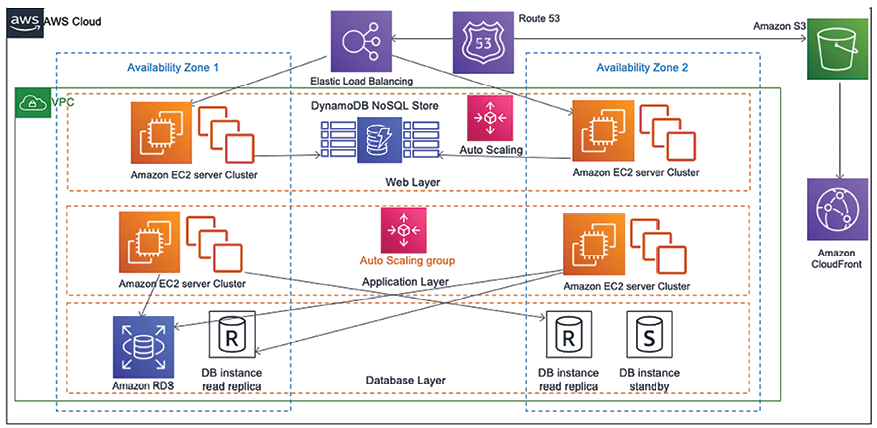

Figure 4.1: Three-tier website architecture

In the preceding architecture, you have the following three layers:

- **Web Layer**: The web layer is the user-facing part of the application. End users interact with the web layer to
  collect or provide information.
- **Application Layer**: The application layer mainly contains business logic and acts upon information received from
  the web layer.
- **Database Layer**: All kinds of user data and application data are stored in the database layer.

Let’s take a look at these layers in more detail.

## The web layer

The web layer is also known as the **presentation tier**. The web layer provides a user interface that helps the end
user to interact with the application. The web layer is your user interface (in this case, the website page), where the
user enters information or browses it. Web developers may build a presentation tier user interface in technologies such
as HTML, CSS, Angular, React, **JavaServer Pages** (**JSP**), and **Active Server Pages** (**ASP**). This tier collects
the information from the user and passes it to the application layer.

The web layer is user-facing, so organizations spend most of their time improving the user experience. Many
organizations have dedicated **User Experience** (**UX**) teams researching various areas to understand how users
interact with applications.

Also, the solutions architect must ensure the architecture design includes UX input and page load performance. There
should be a seamless information flow between the web and application layers to return the correct information to users
within the expected timeframe, such as user login, profile loading, etc.

Let’s look at the application layer.

## The application layer

The application layer is also known as the **logic tier**, as this is the core of the product where all the business
logic resides. The presentation tier collects the information from the user and passes it to the logic tier to process
it and get a result. For example, on an e-commerce website such as Amazon, users can enter a date range on the website’s
order page to find their order summary. In return, the web layer passes the data range information to the application
layer. The application layer processes the user input to perform business logic, such as the count of orders, the sum of
amounts, and the number of items purchased. This returns information to the web layer to render it for the user.

Generally, in a three-tier architecture, all algorithms and complex logic live in the application tier, including
creating a recommendation engine or showing personalized pages to the user as per their browsing history. You may add
layers such as a domain layer, data access layer, or presentation layer to make a four- or five-tier architecture.
Developers may choose to implement this layer in a server-side programming language, for example, C++, Java, .NET, or
Node.js. The application layer is the center of system design and requires most of the design effort. Most of the
application features depend on logic built at the application layer. The application layer performs logic on the data
stored in the database layer. Let’s look at the database layer in more detail.

## The database layer

The database layer, also known as the **data tier**, stores all the information related to user profiles and
transactions. Essentially, it contains any data that needs to persist in being stored in the data tier. This information
is sent back to the application layer for logic processing, and then, eventually, is rendered to the user in the web
layer. For example, suppose the user is logged in to a website with their ID and password. In that case, the application
layer verifies the user credentials with information stored in the database. If the credentials match the stored
information, the user is allowed to log in and access the authorized area of the website.

The architect may choose to build a data tier in relational databases, for example, PostgreSQL, MariaDB, Oracle
Database, MySQL, Microsoft SQL Server, Amazon Aurora, or Amazon RDS. The architect may add a NoSQL database such as
Amazon DynamoDB, MongoDB, or Apache Cassandra.

The data tier is used to store transaction information and hold user session information and application configuration.
An architect may consider adding caching databases such as Memcached and Redis to meet performance needs. You will learn
more about various databases in _Chapter 12_, _Data Engineering for Solution Architecture_.

The data tier needs special attention in terms of security. You must protect user information by applying data
encryption at rest and in transit. In the _n_\-tier layered architecture diagram, you will notice that each layer has
its own auto-scaling configuration, which means it can be scaled independently. Also, each layer has a network boundary,
which means having access to one layer doesn’t allow access to other layers. You will learn more about security
considerations in _Chapter 7_, _Security Considerations_.

The architect needs to decide on the number of tiers based on application complexity and user requirements. For example,
you might add additional tiers, such as a data access layer for database access logic, and keep the data storage layer
for the database engine. You can add more layers to reduce complexity by defining logical separation, which can help
increase the application’s general maintainability and the ability to scale and achieve performance.

# Creating a multi-tenant SaaS-based architecture

In the previous section, you learned about multitier architecture, also called a **single tenancy**, when built for a
single organization. Multi-tenant architecture is becoming more popular as organizations welcome the digital revolution
while keeping the overall application and operational cost low.

The **Software-as-a-Service** (**SaaS**) model is constructed upon a multi-tenant architecture, where an instance of the
software and the accompanying infrastructure caters to numerous customers. Within this framework, each customer utilizes
the application and database in a shared manner. With each tenant being isolated by their unique configuration,
identity, and data, they remain invisible to each other while sharing the same product.

As multi-tenant SaaS providers are responsible for everything from the hardware to the software, SaaS-based products
offload an organization’s responsibilities to the application’s maintenance and updates, as the SaaS provider takes care
of this.

Each organizations those are buyer of SaaS product consider as tenant. These tenants can customize their user interface
using a configuration without code changes. As multiple customers share a common infrastructure, they benefit from
scale, which further lowers the cost. Some of the most popular SaaS providers are Salesforce CRM, Jira Software, Slack,
Google Workspace, and Amazon Connect.

As shown in the following architecture diagram, two organizations (tenants) use the same software and infrastructure.
The SaaS vendor provides access to the application layer by allocating a unique tenant ID to each organization:

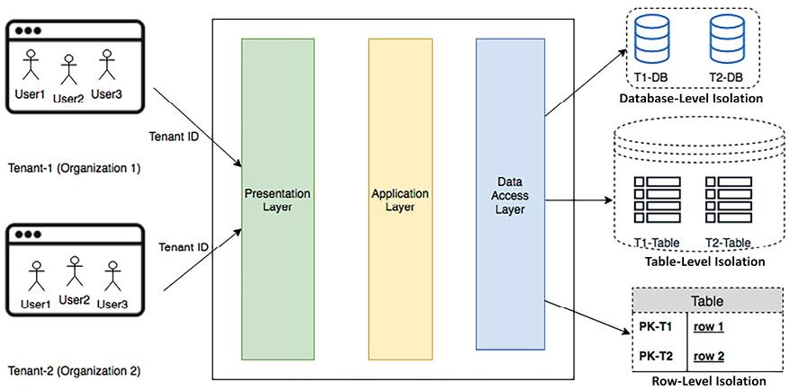

Figure 4.2: Multi-tenant SaaS architecture

The preceding architecture design shows that the presentation layer provides a user interface, and the application layer
holds the business logic. At the data access layer, each tenant will have data-level isolation with one of the following
methods:

- **Database-Level Isolation**: In this model, each tenant has its database associated with its tenant ID. When each
  tenant queries data from the user interface, they are redirected to their database. This model is required if the
  customer doesn’t want a single shared database for compliance and security reasons.
- **Table-Level Isolation**: This isolation level can be achieved by providing a separate table for each tenant. In this
  model, tables need to be uniquely assigned to each tenant, for example, with the tenant ID prefix. When each tenant
  queries data from the user interface, they are redirected to their tables as per their unique identifier.
- **Row-Level Isolation**: All tenants share the same table in a database in this isolation level. There is an
  additional column in a table where a unique tenant ID is stored against each row. When an individual tenant wants to
  access their data from the user interface, the application’s data access layer formulates a query based on the tenant ID
  to the shared table. Each tenant gets a row that belongs to their users only.

For enterprise customers, a careful assessment should be carried out to understand whether a SaaS solution fits them
based on their unique features’ requirements. This is because, often, a SaaS model has limited customization
capabilities.

The selection of isolation approaches is based on considerations around the organization’s compliance, security, cost,
and tenant contractual requirements.

It’s important to find the cost value proposition if many users need to subscribe. The cost comparison should be
calculated based on the total cost of ownership when making a _build versus buy_ decision. This is because building
software is not the primary business of most organizations, so the SaaS model is becoming highly popular as
organizations can focus on their business and let the experts handle the IT side of it.

**Service-oriented architecture** (**SOA**) is a popular approach for designing and building applications, especially
when organizations have unique, customized requirements. Let’s learn more about it.

# Understanding service-oriented architecture

In **SOA** patterns, different application components interact using a communication protocol over the network. Each
service provides end-to-end functionality, for example, _fetching an order history_. SOA is widely adopted by large
systems to integrate business processes, for example, taking your payment service from the main application and putting
it as a separate solution.

In a general sense, SOAs take monolithic applications and spread some of those operations into individual _services_
that operate independently. The goal of using an SOA is to loosen the coupling of your application’s services.
Sometimes, an SOA includes splitting services apart from one another and splitting resources into separate instances of
that service. For example, while some choose to store their company’s data in a single database split by tables, an SOA
would consider modularizing the application by function into separate databases altogether. This allows you to scale and
manage throughput based on the individual needs of tables for each database.

SOA has multiple benefits, for example, the parallelization of development, deployment, and operation. It decouples the
service so that you can optimize and scale each service individually.

However, it also requires more robust governance to ensure work performed by each service’s team meets the same
standard. With SOA, the solution could become complex enough to increase the overhead to balance that, so you need to
choose tools and implement automation for service monitoring, deployment, and scaling.

There are multiple ways to implement SOA.

**Simple Object Access Protocol** (**SOAP**) was initially the most popular messaging protocol, but it is heavyweight as
it relies entirely on XML for data interchange. **Representational State Transfer** (**REST**) architecture is becoming
more popular as developers need to build more lightweight mobile and web applications. As of the time of writing, SOAP
architecture is considered legacy architecture, so in this edition of the book, we will focus on learning REST
architecture.

## RESTful web service architecture

A **REST** or RESTful web service offers better performance due to its lightweight architecture. It allows different
messaging formats, such as JSON, plaintext, HTML, and XML, compared to SOAP, which only allows XML. REST is an
architecture style that defines the standard for loosely coupled application design using the HTTP protocol for data
transmission.

**JavaScript Object Notation** (**JSON**) is a more accessible format for data exchange in REST architecture. JSON is
also lightweight and language-independent. It contains a simple key-value pair that makes it compatible with data
structures defined in most programming languages.

RESTful web services, also known as REST web services, establish a framework with specific rules to design web services.
They are aimed at ensuring compatibility between various computer systems connected through the internet. With RESTful
web services, systems can communicate by accessing and modifying text-based data on the web using a consistent and
predefined set of operations that don’t rely on past interactions or states. Here are some fundamental principles of
RESTful web service architecture, along with an illustration of the principles of RESTful web service architecture using
the example of an e-commerce website:

- **Stateless**: Every request from the client to the server must contain all the information the server needs to
  understand and process. Every request made by a client includes all the necessary information to fulfill that request,
  and there is no need to maintain any session-related information on the server; instead, it is entirely managed on the
  client side. Taking the example of an e-commerce website, each request from a client, like viewing a product or adding
  it to the cart, must contain all the information needed for processing. If a user wants to view their cart, the request
  must include the user’s ID or any other relevant details so the server can identify and respond with the appropriate
  card details.
- **Client-server architecture**: In this design, there are two distinct parts, the client and the server, which
  communicate with each other through a network. The client is responsible for managing the user interface and interacting
  with the user, and the server is responsible for the backend and data processing. They can evolve separately without
  affecting each other. The client (browser or app) manages user interaction, like selecting products, while the server
  handles data retrieval, cart management, and checkout processing. They interact through HTTP requests and responses.
- **Uniform interface**: REST uses a uniform interface, simplifying and decoupling the architecture. For RESTful APIs,
  interactions are facilitated through a set of standard HTTP methods that correspond to **CRUD** (**Create, Read, Update,
  Delete**) operations. These methods include:

- **GET**: This method is used to retrieve data from the server. For example, when a user wants to view a list of
  products on example.com, their browser sends a GET request to the server. The URL might look like
  `https://example.com/api/products`, and the server responds with the list of products in a structured format like JSON
  or XML.
- **POST**: This method is used to create a new resource on the server. Suppose a user wants to add a new product to
  their shopping cart on `example.com`. They might fill out a form with the product details and click **Add to Cart**.
  This action would trigger a POST request to `https://example.com/api/cart`, including the product details in the request
  body. The server then processes this data and adds the new product to the user’s cart.
- **PUT**: This method is used to update an existing resource on the server. If the user wants to update the quantity of
  a product in their cart, a PUT request would be sent to a specific URL like `https://example.com/api/cart/{productId}`.
  The request body would include the updated quantity, and the server would update the corresponding item in the user’s
  cart.
- **DELETE**: This method is used to remove a resource from the server. For instance, if the user decides to remove a
  product from their cart, their browser would send a DELETE request to a URL like
  `https://example.com/api/cart/{productId}`. The server would then remove the specified product from the cart.

By adhering to these standard methods, APIs provide a consistent way for developers to interact with web services,
enabling them to perform basic operations on resources without needing to understand the underlying implementation
details.

- **Resource-based**: In REST, everything is considered a resource, and a specific URL can access each resource.
  Resources are the key abstractions in REST, and a resource can represent a single object or a collection of objects.
  Resources like products, users, orders, and cart items are all identified by URLs. For example, a specific product could
  be accessed at `www.amazon.com/products/{product_id}`.
- **Representation of resources**: Resources can have different representations, such as JSON, XML, HTML, etc. Clients
  interact with resources by obtaining representations of them and manipulating these representations. When a client holds
  a representation of a resource, it has enough information to modify the resource on the server. The same product
  resource might be rendered differently for a web browser than a mobile app.
- **Layered system**: The architecture allows for an intermediate layer (such as a load balancer or a cache layer) to be
  introduced without affecting how the client interacts with the server. Each layer can provide a specific set of
  functionalities, improving the scalability and maintainability of the system. An e-commerce website can have various
  layers, like load balancers, caching layers, or authentication layers. The client does not need to know about these
  layers. A request to view a product might pass through a cache layer to improve response time without the client’s
  awareness.
- **Code on demand**: Servers can provide executable code to the client to be executed in the client’s context. This
  allows for part of the application logic to be shifted to the client. An e-commerce website could send JavaScript code
  to the client’s browser to execute certain functionalities like client-side validation or enhance interactivity within
  the user’s browsing experience.

The RESTful architectural style uses standard HTTP methods, and by adhering to these principles, RESTful web services
aim to be simple, scalable, and maintainable. Many modern web APIs are developed following the RESTful principles, using
standard conventions to perform CRUD operations on resources. Let’s learn about a reference architecture based on
RESTful architecture.

## Building a RESTful-architecture-based e-commerce website

An e-commerce website such as [www.amazon.com](http://www.amazon.com) has users worldwide and a vast catalog with
millions of products. Each product has multiple images, reviews, and videos. Maintaining such an extensive catalog for a
global user base is a very challenging task.

This reference architecture in AWS follows RESTful principles. The services are operating as independently as possible
from each other:

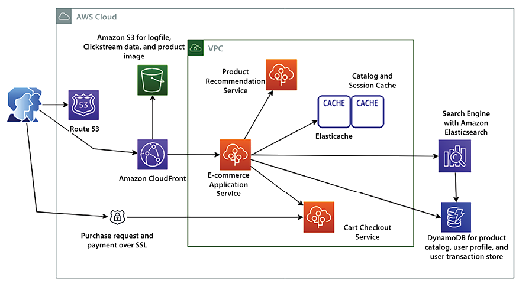

Figure 4.3: RESTful architecture for an e-commerce website

As shown in the preceding architecture diagram, we can take note of the following:

- When a user types a website address into the browser, the user request reaches out to the DNS server to load the
  website. The DNS requests for the website are routed by Amazon Route 53 to the server where the web applications are
  being hosted.
- The user base is global, and users continue browsing for products to purchase as the website has an extensive product
  catalog with static images and videos. A content distribution network like Amazon CloudFront caches and delivers static
  assets to users.
- The catalog contents, such as static product images and videos, and other application data, such as log files, are
  stored in Amazon S3.
- Users will browse the website from multiple devices; for example, they will add items to a cart from their mobile and
  then make a payment on a desktop. A persistent session store, such as DynamoDB, is required to handle user sessions.
  DynamoDB is a NoSQL database where you don’t need to provide a fixed schema, so it is a great storage option for product
  catalogs and attributes.\* Amazon ElastiCache is used as a caching layer for the product to reduce read and write
  operations on the database to provide high performance and reduce latency.
- A convenient search feature is vital for product sales and business success. Amazon CloudSearch helps to build
  scalable search capability by loading the product catalog from DynamoDB. You can also use Amazon Kendra for an
  AI-powered search engine.
- A recommendation can encourage users to buy additional products based on browsing history and past purchases. A
  separate recommendation service can consume the log data stored on Amazon S3 and provide potential product
  recommendations to the user.
- The e-commerce application can also have multiple layers and components that require frequent deployment. AWS Elastic
  Beanstalk handles the auto-provisioning of the infrastructure, deploys the application, handles the load by applying
  auto-scaling, and monitors the application.

You learned about RESTful architecture in this section. Let’s learn more about the critical aspect of cache-based
architecture design.

# Building a cache-based architecture

Caching involves temporarily storing data or files in an intermediate location positioned between the requester and the
permanent storage. This practice is aimed at speeding up future requests and minimizing network bandwidth usage. Caching
increases application speed and lowers cost. It allows you to reuse previously retrieved data. To increase application
performance, caching can be applied at various layers of the architecture, such as the web layer, application layer,
data layer, and network layer.

Typically, the server’s **random-access memory** (**RAM**) and in-memory cache engines are utilized to support
application caching. However, if caching is coupled to a local server, then the cache will not persist data in case of a
server crash. Most applications are in a distributed environment, so it’s better to have a dedicated caching layer that
should be independent of the application life cycle. If you apply horizontal scaling to your application, all servers
should be able to access the centralized caching layer to achieve the best performance.

The following diagram depicts the mechanism of caching in various layers of solution architecture:

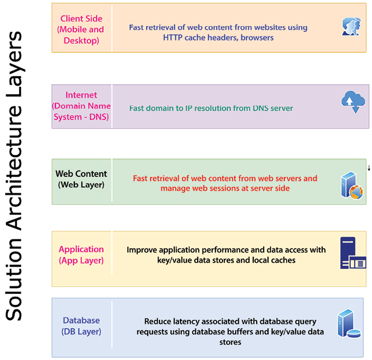

Figure 4.4: Caching at the architecture layers

As shown in the preceding diagram, the following are the caching mechanisms at each layer of the architecture:

- **Client-side caching**: Client-side caching is applied to user devices such as mobile and desktop. Client-side
  caching caches the previously visited web content to respond faster to a subsequent request. Each browser has its own
  caching mechanism. HTTP caching makes the application faster by caching content in the local browser. The cache-control
  HTTP header defines browser caching policies for client requests and server responses. These policies define where the
  content should be cached and how long it will persist, known as the **time to live** (**TTL**). Cookies are another
  method used to store information on the client’s machine to respond to the browser faster.
- **Internet DNS cache**: When a user types the website address over the Internet, the public **Domain Name System**
  (**DNS**) server looks up the IP address. Caching this DNS resolution information will reduce the website’s load time.
  DNS information can be cached to a local server or browser after the first request, and any further requests to that
  website will be faster.
- **Web content caching**: Much of the request involves retrieving web content such as images, videos, and HTML pages.
  Caching these assets near the user’s location can provide a much faster response for a page load. This also eliminates
  disk read and server load time. A **content distribution network** (**CDN**) provides a network of edge locations where
  static content, such as high-resolution images and videos, can be cached. It’s beneficial for reading heavy applications
  such as games, blogs, e-commerce product catalog pages, and more. The user session contains lots of information
  regarding user preference and their state. It provides a great user experience by storing the user’s session in its own
  key-value store for quick user response.
- **Application caching**: At the application layer, caching can be applied to store the result of a complex repeated
  request to avoid business logic calculations and database hits. Overall, it improves application performance and reduces
  the load on the database and infrastructure.
- **Database caching**: Application performance highly depends upon the speed and throughput provided by the database.
  Database caching increases database throughput significantly and lowers data retrieval latency. A database cache can be
  applied in front of any relational or non-relational database. Some database providers integrate caching, while
  applications handle local caching.

**Redis** and **Memcached** are the most popular caching engines. While Memcached is faster (it is suitable for
low-structure data and stores data in a key-value format), Redis is a more persistent caching engine and is capable of
handling complex data structures required for an application such as a gaming leaderboard; you will learn more details
in the _Memcached versus Redis_ section in this chapter. Let’s learn about a few more caching design patterns.

## Cache distribution pattern in a three-tier web architecture

Conventional web hosting architecture follows a common three-tier web application model, which divides the architecture
into presentation, application, and persistence layers.

As shown in the following AWS architecture diagram, caching is applied at the web, application, and database layers:

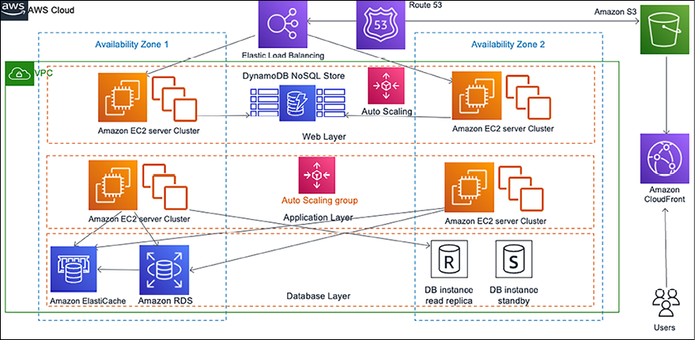

Figure 4.5: Cache distribution pattern architecture

In caching patterns, your goal is to try to hit the backend as little as possible. You can write an application where
you can cache images, JavaScript, or even full pages to provide a better experience for your users. In the diagram
above, caching is strategically implemented across various layers of the architecture:

- Amazon Route 53 plays a role in caching DNS-to-IP mappings, simplifying domain management.
- Amazon S3 serves as the storage location for static content, including high-resolution images and videos.
- Amazon CloudFront offers edge caching for high-traffic content, utilizing cache-control headers to determine update
  frequency from the origin.
- Amazon DynamoDB is used for session stores, helping web applications manage user sessions through caching.
- Elastic Load Balancing evenly distributes traffic among web server Auto Scaling groups.
- Amazon ElastiCache offers caching services for the application, effectively reducing the load on the database tier.

Typically, static content is cached, but there are scenarios where caching dynamic or unique content can improve
application performance. The decision depends on specific usage patterns and demands.

Let’s take a look at a more specific pattern.

## Rename distribution pattern

When using a **CDN** such as Amazon CloudFront, you store frequently used data in an edge location near the user for
fast performance. Often, you set up the TTL in the CDN for your data, which means the edge location will not query back
to the server for updated data until the TTL expires. TTL is when an object is stored in a caching system before it’s
deleted or refreshed. You may have situations where you need to update CDN cached content immediately, for example, if
you need to correct the wrong product description.

You can’t wait for the file’s TTL to expire in such a situation. The rename distribution pattern helps you update the
cache as soon as new changes are published so the user can get updated information immediately. The following diagram
shows this pattern with AWS:

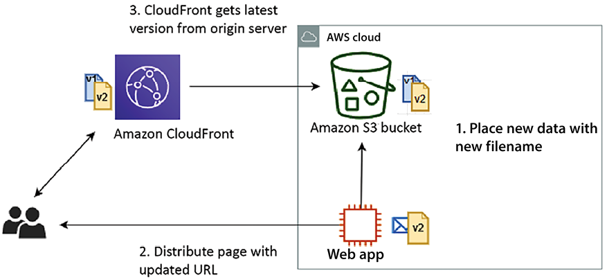

Figure 4.6: Rename distribution pattern architecture

As shown in the preceding diagram, using the rename distribution pattern with the cache distribution pattern helps to
solve the update issue. With this pattern, instead of overwriting the file in the origin server and waiting for the TTL
in CloudFront to expire, the server uploads the updated file with a new filename and then updates the web page with the
new URL. When the user requests original content, CloudFront has to fetch it from the origin and can’t serve the
obsolete file that’s already cached.

However, you can invalidate the old file immediately, but that will cost more, so it’s better to put a new version of
the file for the CDN to pick immediately. Again, you must update the URL in the application to pick up a new file,
adding some overhead compared to the invalidation option. It would be best to decide based on your business requirements
and budget.

You can use the proxy cache server to use something other than a CDN for a user base distributed across the country.
Let’s learn more about it in the next section.

## Cache proxy pattern

You can increase your application performance significantly by adding a cache layer. In a cache proxy pattern, static or
dynamic content is cached upstream of the web app server. As shown in the following architectural diagram, you have a
caching layer in front of the web application cluster:

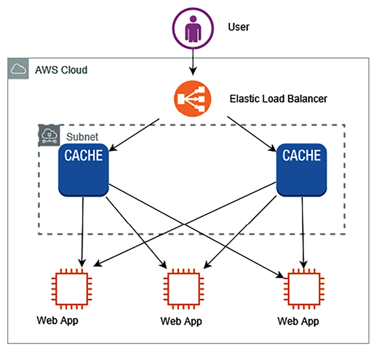

Figure 4.7: Cache proxy pattern architecture

In the preceding diagram, for high-performance delivery, cache content is delivered by the cache server. A few benefits
of cache proxy patterns are as follows:

- Cache proxy patterns help you to deliver content using the cache, which means no modification is needed at the web
  server or application server level.
- They reduce the load of content generation for dynamic content.
- You can set up a cache at the browser level, such as in HTTP headers, URLs, cookies, and more. Alternatively, you can
  cache information in the cache layer if you don’t want to store it at the browser level.

In the cache proxy pattern, you must maintain multiple copies of the cache to avoid a single point of failure.
Sometimes, you may want to serve your static content from both the server and CDN, each requiring a different approach.
Let’s dive deep into this hybrid situation in the next section.

## Rewrite proxy pattern

Sometimes, you want to change the access destinations of static website content, such as images and videos, but you
don’t want to change the existing systems. You can achieve this by providing a proxy server using rewrite proxy
patterns. To change the destination of static content to other storage, such as a content service or internet storage,
you can use a proxy server in front of the web server fleet. As shown in the following architecture diagram, you have a
proxy server in front of your application layer, which helps to change the content delivery destination without
modifying the actual application:

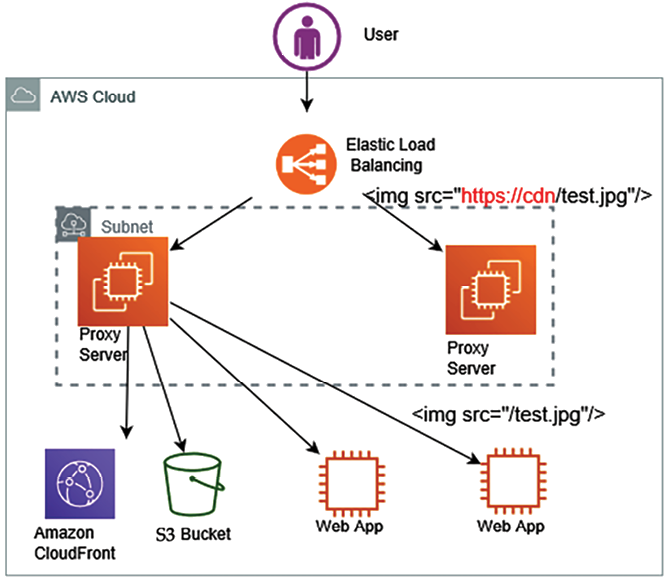

Figure 4.8: Rewrite proxy pattern architecture

As shown in the preceding diagram, place the proxy server in front of the currently running system to rewrite the proxy
pattern. You can construct a proxy server using software such as **Apache** or **NGINX**. The following are the steps to
build a rewrite proxy pattern, using AWS as the example:

- Put a running proxy server on an EC2 instance, which can overwrite the content between the **load balancer** and the
  storage service, such as **Amazon S3**, which stores the static content.2. Add to the proxy server rules for overwriting
  URLs within the content. These rules will help **Elastic Load Balancing** (**ELB**) to point to a new location, as shown
  in the preceding diagram, which redirects the proxy server rule from `https://cdn/test.jpg to /test.jpg`. ELB is a
  service provided by AWS that automatically distributes incoming application traffic across multiple targets, such as
  Amazon EC2 servers, containers, and IP addresses.
- As required, apply auto-scaling to the proxy servers by configuring minimum and maximum proxy server amounts as per
  the application load.

In this building a cache-based architecture section, you learned how to handle caching for static content distribution
over the network. However, caching at the application layer is very important for improving application performance for
the overall user experience. Let’s learn more about the app caching pattern to handle the dynamic user data delivery
performance.

## App caching pattern

When it comes to applying caching to applications, you want to add a cache engine layer between your application servers
and the database. The app caching pattern allows you to reduce the load on the database as the most frequent query is
served from the caching layer. The _app caching pattern_ improves overall application and database performance.

As shown in the following diagram, you can see the caching layer applied between the application layer and the database
layer in AWS:

Figure 4.9: App caching pattern architecture

As shown in the preceding diagram, you can use either **lazy caching** or **write-through** based on your data access
pattern. In lazy caching, the cache engine checks whether the data is in the cache and, if not, gets it from the
database and keeps it in the cache to serve future requests. Lazy caching is also called the **cache aside pattern**. In
the **write-through** method, data is written in the cache and in the data store at the same time. If the data gets lost
from the cache, it can get it again from the database.

Choose lazy caching when you have a read-heavy application with acceptable stale data and choose write-through caching
when dealing with write-heavy operations requiring immediate data consistency. For example, you can use lazy caching in
a product catalog in an e-commerce website where product details are read frequently but updated less often. When a user
accesses a product detail that is not in the cache, it’s fetched from the database and stored in the cache for
subsequent access, reducing database load. You might want to use write-through for a user review section on an
e-commerce website, where user-generated reviews are instantly displayed on the product page. When a user submits a
review, it’s written to both the cache and the database simultaneously, ensuring that any subsequent read requests fetch
the most current data.

Let’s learn more about the popular caching engines _Redis_ and _Memcached_.

## Memcached versus Redis

Redis and Memcached are two popular caching engines used in application design. The Redis cache engine is often required
for more complex application caching needs, such as creating a leaderboard for a game. However, Memcached is more
high-performing and helps handle heavy application loads. Each caching engine has its pros and cons. Let’s take a look
at the significant differences between them, which will help you to make a decision about which to use:

**Memcached**

**Redis**

Offers multithreading

Single-threaded

Able to use more CPU cores for faster processing

Unable to utilize multi-core processor, which results in comparatively slow performance

Supports key-value style data

Supports complex and advanced data structures

Lacks data persistence; loses the data stored in cache memory in the event of a crash

Data can persist using built-in read replicas with failover

Easy maintenance

More complexity is involved owing to the need to maintain the cluster

Good to cache flat strings such as flat HTML pages, serialized JSON, and more

Good to create a cache for a gaming leaderboard, a live voting app, and more

Table 4.1 – Memcached versus Redis comparison

If you need to decide which engine to use, base it on a use case that can justify using Redis or Memcached. Memcached is
simple and has lower maintenance, and it is typically preferred when your cache doesn’t need the advanced features that
Redis offers. However, Redis is the best solution if you need the advantage of data persistence, advanced data types, or
any of the other features listed.

When implementing caching, it’s essential to understand the validity of data that needs to be cached. If the **cache
hit** rate is high, the data is available in the cache when required. For a higher cache hit ratio, offload the database
by reducing direct queries, improving the overall application performance. A **cache miss** occurs when data is not
present in the cache, which increases the load in the database. The cache is not a large data store, so you need to set
the TTL and evict the cache as per your application needs.

As you have seen in this section, applying caches has multiple benefits, including application performance improvement,
the ability to provide predictable performance, and the reduction in database cost.

Let’s learn about some more application-based architecture that demonstrates the principle of loose coupling and
constraint handling, MVC architecture.

# Model-View-Controller (MVC) architecture

MVC is one of the most popular design patterns for developing software applications. It separates an application into
three interconnected components: Model, View, and Controller. This separation enables more modular development, easier
testing, and excellent maintainability. Let’s explore these components in detail:

- **Model**: The Model represents the internal state of the application, along with the rules, logic, and data that
  govern and manipulate that state. The model does not depend on the View or Controller, meaning changes to the UI or
  business logic do not affect the data handling. It ensures that the application’s data remains consistent across
  different parts of the application. Its responsibilities include:

- **Managing data**: It contains all the data-related logic. Whether it’s retrieving data from a database or an API, the
  model handles it.
- **Implementing business rules**: Implements business logic, such as calculations or data transformations.
- **Notifying of changes**: Informs associated Views and Controllers when the data has changed so they can update
  themselves accordingly.

- **View**: The View is the visual representation of the Model’s data. It defines exactly how the application’s data is
  presented to the user. The View automatically updates when the underlying Model data changes, ensuring the user always
  sees the most current data. Multiple Views can be created from the same Model data, allowing different representations
  (e.g., tables, charts, detailed views). Its responsibilities include:

- **Displaying data**: Takes the data from the model and presents it in a format that’s easy to understand.
- **Handling the user interface** (**UI**): Handles all the UI logic of the application, such as user input fields,
  buttons, display screens, etc.

- **Controller**: The Controller mediates between the Model and the View. It takes user inputs from the View, processes
  them (with potential updates to the Model), and returns the output display to the View. The controller ensures that the
  View and the Model are always in sync with each other. It acts as a centralized handler for all user interactions,
  making the management of those interactions more systematic and organized. Its responsibilities include:

- **Handling user input**: Takes and interprets user commands, translating them into actions to be performed by the
  model
- **Updating the Model**: Modifies the data in the Model by sending commands to it
- **Updating the View**: Changes what is presented in the View based on user input and Model changes

The following are the key advantages of applying the MVC pattern:

- **Separation of concerns**: By isolating the application’s data, user interface, and control logic, MVC promotes
  modular development.
- **Reusability**: Components can be reused across different parts of an application or even different applications.
- **Maintainability**: It makes updating, testing, and debugging different parts of the application easier.
- **Flexibility**: Enables developers to change one part of the system without affecting others, such as changing the UI
  without altering the underlying data processing.

MVC is a powerful architectural pattern that offers robust data management, user interface, and business logic
management. It’s widely used in various application development environments, from web development frameworks to desktop
applications, to create scalable and maintainable software. By following the principles of MVC, application architects
can create organized, efficient, and flexible applications that are easier to update and maintain. Let’s consider an
example to understand MVC better.

## Applying MVC to design an online bookstore

When designing an online bookstore, for example, the MVC architecture efficiently handles complex interactions between
book data, user interface, and user inputs, leading to a more robust and scalable system. Let’s look at the details of
each module:

- **Model**: Managing the data related to books, authors, categories, customer reviews, etc. Examples of operations are:
- Retrieving details of a specific book
- Updating the inventory after a purchase
- Adding a new book to the catalog
- **View**: Displaying information to the user in a readable and interactive format. Examples of Views are:
- **Book listing page**: Displays a list of books with their titles, covers, and prices
- **Book detail page**: Shows detailed information about a specific book, including author, description, reviews, etc.
- **Shopping cart page**: Allows users to view, add, or remove items from their shopping cart
- **Controller**: Handling user interaction, updating the model as needed, and updating the View to reflect changes.
  Examples of actions are:
- **Searching for a book**: The user enters a search term. The Controller queries the model for matching books and
  updates the View to display the results.
- **Adding to cart**: The user clicks **Add to Cart**, the Controller updates the model to reflect the new item in the
  cart, and the View is updated to show the new cart status.
- **Checkout**: The user decides to purchase. The Controller processes the transaction, updates the model (including
  inventory), and redirects to a confirmation View.

The MVC pattern provides a clean separation of concerns, making extending, maintaining, and testing applications easier.

# Building Domain-Driven Design (DDD)

**Domain-Driven Design** (**DDD**) is a methodology and set of practices aimed at understanding and solving complexity
at the heart of software. This approach is used to design and model software based on the “domain,” or the business’s
core logic and key concepts. Using a common language and dividing the system into clear contexts, DDD promotes a deep
understanding of the problem space and leads to a design that accurately reflects the underlying business needs. It’s
particularly valuable in complex domains, where aligning the software closely with the real-world concepts it represents
is vital.

Let’s delve into DDD using a concrete example and use case. For this, we’ll consider the domain of a **Healthcare
Management System** (**HMS**). Imagine we’re developing a system that manages patient records, appointments, medical
treatments, billing, etc. for a healthcare provider. Here’s how we could apply DDD concepts to this domain:

- **Domain**: A “domain” refers to a specific problem area the software intends to address. The application logic
  revolves around the sphere of knowledge and activity. Understanding the domain is essential for creating a system that
  truly meets the needs of the business. For HMS, the domain will be healthcare management, focusing on patients, medical
  staff, appointments, treatments, and billing.
- **Ubiquitous Language**: Ubiquitous Language is a shared language between developers and non-technical stakeholders
  that describes the domain. This common language ensures that all team members understand the key terms and concepts in
  the same way, reducing misunderstandings and promoting clear communication for the HMS, creating a shared language that
  both medical professionals and developers understand, for example, **Patient**, **Appointment**, **Treatment**,
  **Medical Staff**, etc.
- **Bounded contexts**: In DDD, the application is divided into different bounded contexts, each representing a specific
  responsibility or functionality within the overall domain. A bounded context encapsulates all the terms, definitions,
  and logic for that specific part of the domain, and it is explicit about what is inside and outside its boundaries. For
  example, the **Patient Management** bounded context handles patient records, personal information, medical history, etc.
  An **Appointment Scheduling** bounded context includes managing appointments, scheduling, cancellations, rescheduling,
  etc., and the **Billing** bounded context includes processing payments, insurance, invoices, etc.
- **Entities**: These objects have a distinct identity that runs through time and different states, for example,
  patients (with a unique ID) and medical staff (with unique credentials).
- **Value objects**: Objects that describe characteristics of a thing but have no conceptual identity. They are
  immutable and can be easily replaced. For example, **Address**, **Date of Birth**, and **Medical History** (as these
  don’t have individual identities).
- **Aggregates**: An aggregate is a cluster of associated objects treated as a single unit for data changes. One entity
  within the aggregate is the root, and external references are restricted to this root to ensure integrity. For example,
  in an online healthcare management system, a medical appointment can be modeled as an aggregate. The aggregate might
  include entities and value objects like **Patient** (who the appointment is for), **Medical Staff** (who will attend the
  patient), **Treatment Room** (where the appointment will take place), and **Time Slot** (when the appointment is
  scheduled). Here, the **Appointment** entity would be the aggregate root. Any changes to the **Patient**, **Medical
  Staff**, **Treatment Room**, or **Time Slot** related to a specific appointment would be made through the Appointment
  entity. This ensures that the appointment aggregate maintains consistency and enforces all business rules related to
  medical appointments.
- **Repositories**: Repositories are used to retrieve aggregates from the underlying persistence layer. They provide an
  abstraction allowing the rest of the application to interact with the data store in a way consistent with the domain
  model. For example, the **Patient** repository is used to fetch and manage Patient entities, and the Appointment
  repository is used to retrieve and store Appointment aggregates.
- **Factories**: Factories are responsible for encapsulating the logic of creating complex objects and aggregates. They
  ensure that an object or aggregate is created in a consistent and valid state. For example, the **Patient** factory is
  used to create a new **Patient** entity with a valid initial state, and the **Appointment** factory is used to create a
  new **Appointment** aggregate with the required details.
- **Services**: When an operation doesn’t logically belong to a value object or entity, it can be defined as a service.
  Services are part of the domain model and contain business logic that operates on the domain’s concepts. For example, in
  the **Billing** context, the billing service contains operations like calculating total charges, applying insurance
  discounts, generating invoices, etc.
- **Domain events**: Domain events capture the fact that something significant has happened within the domain. They can
  trigger other activities within the system or in other systems. For example, an appointment scheduled event triggered
  when a new appointment is scheduled may notify relevant staff members and a payment processed event occurs after
  successful payment, which might initiate a receipt generation process.
- **Anti-corruption layer**: This layer translates between different parts of the system that use different languages or
  models. It ensures that each model’s integrity is maintained, and inconsistencies are handled. If the Billing system
  must interact with an external third-party payment gateway, an anti-corruption layer could translate between the domain
  model in the Billing context and the model used by the external system.

In this HMS, DDD ensures that complex domain logic is carefully modeled and organized. It encourages collaboration
between healthcare professionals (domain experts) and developers to create a shared understanding and language.

The system’s design closely aligns with real-world healthcare operations by defining clear bounded contexts, entities,
aggregates, and other DDD concepts. This alignment ensures that the software provides a robust and flexible solution
tailored to the specific needs of the healthcare domain.

This example shows how DDD can be an essential tool in crafting complex, well-structured systems by focusing on the core
domain and facilitating collaboration between different stakeholders.

Dependency handling is an important aspect when working in complex systems. Let’s learn about how to handle dependency
between different services via a circuit breaker to make sure an error in one service does not bring the entire system
down.

# Understanding the circuit breaker pattern

It’s common for a distributed system to make a call to other downstream services, and the call could fail or hang
without a response. You will often see code that retries the failed call several times. The problem with a remote
service is that it could take minutes or even hours to correct, and an immediate retry might end up in another failure.
As a result, end users wait longer to get an error response while your code retries several times. This retry function
would consume the threads and potentially induce a cascading failure.

The circuit breaker pattern is about understanding the health of downstream dependencies. It detects when those
dependencies are unhealthy and implements logic to gracefully fail requests until it detects that they are healthy
again. The circuit breaker can be implemented using a persistence layer to monitor healthy and unhealthy requests over
the past request interval.

If a defined percentage of requests observe an unhealthy behavior over the past interval or a total count of exceptions,
regardless of percentage, the circuit is marked as open. In such a situation, all requests throw exceptions rather than
integrate with the dependency for a defined timeout period. Once the timeout period has subsided, a small percentage of
requests try integrating with the downstream dependency to detect when the health has returned. Once a sufficient
percentage of requests are healthy again over an interval, or no errors are observed, the circuit closes again, and all
the requests are allowed to thoroughly integrate as they usually would.

The implementation decisions involve the state machine tracking/sharing the healthy/unhealthy request counts. The states
of services can be maintained in DynamoDB, Redis/Memcached, or another low-latency persistence store.

Let’s next turn to the bulkhead architectural pattern, which helps to reduce dependency between services and mitigate
the situation in the case of a service getting an error.

# Implementing the bulkhead pattern

Bulkheads are structural partitions used in ships to create individual watertight sections. The primary purpose is to
contain the consequences of any breach in the ship’s hull, thereby preventing water from spreading throughout the vessel
in the event of damage. This design serves as a crucial safety measure, aiming to minimize the risk of the entire ship
sinking if one area is compromised.

The same concept is helpful to limit the scope of failure in the architecture of large systems where you want to
partition your system to decouple dependencies between services. The idea is that one failure should not cause the
entire system to fail, as shown in the following diagram:

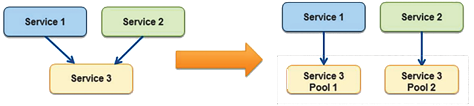

Figure 4.10: Bulkhead pattern

In the bulkhead pattern, it’s better to isolate the element of the application into the pool for service, which has a
high dependency; so, if one fails, others continue to serve upstream services. **Service 3** is partitioned into two
pools from a single service in the preceding diagram. Here, if **Service 3** fails, then the impact of either **Service
1** or **Service 2** depends on their dependency on the pool, but the entire system does not go down. The following are
the significant points to consider when introducing the bulkhead pattern in your design, especially for the shared
service model:

- Save part of the ship, which means your application should not shut down due to the failure of one service.
- Decide whether less efficient use of resources is okay. Performance issues in one partition should be fine for the
  overall application.
- Pick a useful granularity. Make sure to make the service pools manageable; make sure they can handle the application
  load.
- Monitor each service partition performance and adhere to the SLA. Ensure all moving parts are working together and
  test the overall application when one service pool is down.

You should define a service partition for each business or technical requirement. It would be best if you used this
pattern to prevent the application from cascading failure and isolating critical consumers from the standard consumer.

Often, legacy application servers have a configuration with hardcoded **Internet Protocol** (**IP**) addresses or
**Domain Name System** (**DNS**) names. Making any server change for modernization and upgrade requires changing and
revalidating the application. In these cases, you want to keep the server address the same. In the next section, let’s
learn how to handle such a situation with a floating IP.

# Creating a floating IP pattern

Commonly, monolithic applications have many dependencies on the server where they are deployed. Application
configuration and code often have hardcoded parameters based on the server’s DNS name and IP address. Hardcoded IP
configuration creates challenges if you want to bring up a new server in case of an issue with the original server.
Additionally, you don’t want to bring down the entire application for the upgrade, which may cause significant downtime.

To handle such a situation, you need to create a new server keeping the same server IP address and DNS name. This can be
achieved by moving the network interface from a problematic instance to the new server. The network interface is
generally based on a **Network Interface Card** (**NIC**), which facilitates communication between servers over a
network. It can be in the form of hardware or software. Moving the network interface means that now your new server
assumes the identity of the old server. Your application can live with the same DNS and IP address. It also allows easy
rollback by moving the network interface to the original instance.

The public cloud (for example, AWS) made it easy by providing an **Elastic IP** (**EIP**) and **Elastic Network
Interface** (**ENI**). If your instance fails and you need to push traffic to another instance with the same public IP
address, then you can move the EIP address from one server to another, as shown in the following architecture diagram:

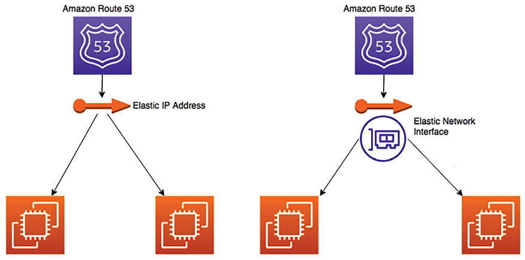

Figure 4.11: Floating IP and interface pattern

Since you are moving EIP, the DNS may not need to be updated. EIP can move your server’s public IP across instances. If
you need to move public and private IP addresses, use a more flexible approach, such as ENI, as shown on the right of
the preceding diagram. ENI can move across instances, and you can use the same public and private address for traffic
routing or application upgrades.

So far, you have learned about multiple architecture patterns where applications are deployed in the virtual machine.
However, you may need help to utilize the virtual machine in many cases. To optimize your utilization further, you can
deploy your application in containers. Containers are most suitable for microservice deployment. Let’s learn more about
container-based deployment in the next section.

# Deploying an application with a container

As many programming languages are invented, and technologies evolve, this creates new challenges. Different application
stacks require different hardware and software deployment environments. Often, there is a need to run applications
across different platforms and migrate from one platform to another. Solutions require something that can run anything
everywhere and is consistent, lightweight, and portable.

Just as shipping containers standardize the transport of freight goods, software containers standardize the transport of
applications. Docker creates a container that includes everything a software application would need to run its files,
such as filesystem structure, daemons, libraries, and application dependencies.

Containers provide isolation for software within its respective development and staging environments. This isolation is
essential because it prevents conflicts from arising when multiple teams are running various software applications on
the same underlying infrastructure.

VMs are isolated at the operating system level, and containers isolate at the kernel level. This isolation allows
several applications to run on a single-host operating system and yet still have their filesystem, storage, RAM,
libraries, and, mostly, their own _view_ of the system:

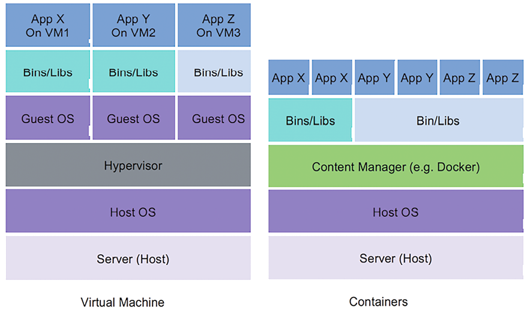

Figure 4.12: Virtual machines and containers for application deployment

As shown in the preceding diagram, containers deploy multiple applications in a single virtual machine. Each application
has its runtime environment, so you can run many individual applications while keeping the same number of servers.
Containers share a machine’s operating system kernel. They offer advantages like quick startup times and efficient use
of computing resources such as RAM. Container images are built using layers from the filesystem, and they can share
common files. This shared resource approach reduces disk usage and speeds up the process of downloading container
images.

Let’s look at why containers are becoming more popular, along with their benefits.

## The benefit of containers

These questions are often asked when it comes to containers:

- Why do we need containers when we have instances?
- Don’t instances already provide us with isolation from the underlying hardware?

While the preceding questions are valid, several benefits accrue from using a system such as **Docker**. One of the key
benefits of Docker is that it allows you to fully utilize your virtual machine resources by hosting multiple
applications (on distinct ports) in the same instance.

Docker uses certain features of the Linux kernel, namely kernel namespaces and groups, to achieve complete isolation
between each Docker process, as indicated in the following architecture diagram:

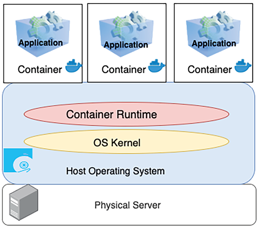

Figure 4.13: Container layer in application infrastructure

As shown in the preceding diagram, it’s possible to run two or more applications that require different versions of the
Java runtime on the same machine, as each Docker container has its version of Java and the associated libraries
installed. In turn, the container layer in the application infrastructure makes it easier to decompose your applications
into microservices that can run side by side on the same instance. Containers have the following benefits:

- **Portable runtime application environment**: Containers provide platform-independent capabilities, where you build
  your application once and deploy it anywhere regardless of the underlying operating system.
- **Faster development and deployment cycles**: Modify the application and run it anywhere with a quick boot time,
  typically within seconds.
- **Package dependencies and application in a single artifact**: Package the code, library, and dependencies together to
  run the application in any operating system.
- **Run different application versions**: Applications with different dependencies run simultaneously in a single
  server.
- **Everything can be automated**: Container management and deployment are done through scripting, which helps to reduce
  cost and the risk of human error.
- **Better resource utilization**: Containers provide efficient scaling and high availability, and multiple copies of
  the same microservice container can be deployed across servers for your application.
- **Easy to manage the security aspect**: Containers are platform-specific rather than application-specific.

Container deployment is becoming very popular due to its benefits. There are multiple ways to orchestrate containers.
Let’s look at container deployment in more detail next.

## Container deployment

Complex applications with multiple microservices can be quickly deployed using container deployment. The container makes
building and deploying the application more manageable as the environment is the same. Build the container in
development mode, push it to test, and then release it to production. For hybrid cloud environments, container
deployment is very useful. Containers make it easier to keep environments consistent across microservices. As
microservices aren’t always very resource-consuming, they can be placed together in a single instance to reduce cost.

Sometimes, customers have short workflows that require a temporary environment setup. Those environments may be queue
systems or continuous integration jobs, which don’t always utilize server resources efficiently. Container orchestration
services such as Docker and Kubernetes can be a workaround, allowing them to push and pop containers onto the instance.

Docker’s lightweight container virtualization platform provides tools to manage your applications. Its standalone
application can be installed on any computer to run containers. Kubernetes is a container orchestration service that
works with Docker and another container platform. Kubernetes allows automated container provisioning and diligently
handles security, networking, and scaling aspects.

Containers help the enterprise to create more cloud-native workloads, and public cloud providers such as AWS extend
services to manage Docker containers and Kubernetes.

The following diagram shows Docker’s container management using Amazon **Elastic Container Service** (**ECS**),
providing a fully managed elastic service to automate the scaling and orchestration of Docker containers:

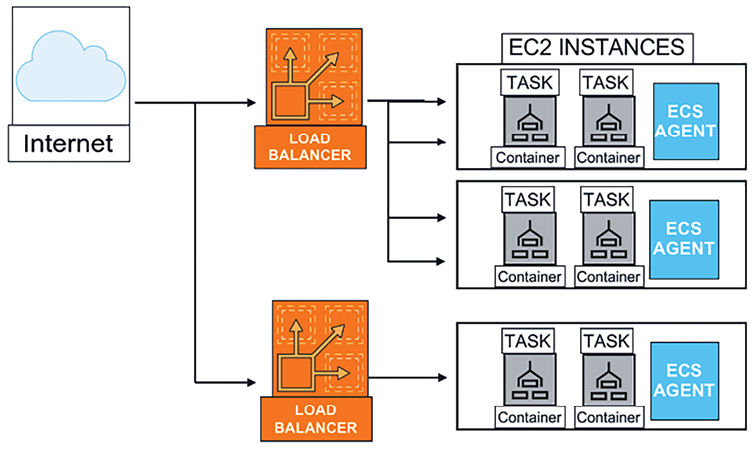

Figure 4.14: Container deployment architecture

In the preceding diagram, multiple containers are deployed in a single Amazon EC2 virtual machine managed through Amazon
ECS, which facilitates the agent communication service and cluster management. All user requests are distributed using a
load balancer among the containers. Similarly, AWS provides Amazon **Elastic Kubernetes Service** (**EKS**) to manage
containers using Kubernetes.

Containers are a broad topic, and as a solutions architect, you must be familiar with all the available options. This
section provides an overview of containers. However, you will need to dive further if you utilize containers for your
microservice deployment. Let’s look at container-based architecture in the next section.

## Building container-based architecture

As you learned in the previous section, containerization helps create environments for repeatable and scalable
applications. To start container adoption, you need to identify a pilot workload managed through container
orchestration. You can take existing microservice components and deploy them in containers. After identifying gaps and
operational needs, you can define a migration strategy to move your workload to containers.

Container migrations can be challenging if your applications are not originally designed to operate in a containerized
environment. This is because many applications typically store files locally and rely on stateful sessions. When
migrating to containers, it’s essential to address these specific requirements and ensure that your applications can
function smoothly within the container environment.

For container platforms, you can make choices; you can choose Docker, OpenShift, Kubernetes, and so on. However,
Kubernetes is becoming an increasingly popular open-source container orchestrator. Public cloud vendors like AWS provide
a platform to manage containers, such as Amazon ECS for Docker and Amazon EKS for Kubernetes. These cloud services
provide a control plane to choose various compute options to select self-managed nodes, managed nodes, or serverless
options with AWS Fargate. The control plane serves as the central management interface, allowing for the orchestration
and operational oversight of containerized applications and their resources. If you are utilizing Amazon EKS for
deploying a microservices-based application, for example, the Kubernetes control plane, managed by AWS, takes care of
orchestrating container deployments, managing state, and maintaining desired configurations. This setup allows you to
focus on application development rather than managing infrastructure.

The following architecture diagram shows running a stateful service on Amazon EKS in your programming languages of
choice, such as Java or .NET. Given the architecture, you can manage the session state in a Redis database.

Figure 4.15: Deploying a stateful application on a container

As you can see in the preceding diagram, the container-based architecture comprises several key components:

- An Amazon **Virtual Private Cloud** (**VPC**) with specific subnets:

- Public subnet: Hosts the load balancer
- Private subnets: Used for deploying the application and database

- An Application Load Balancer, responsible for providing access to the website hosted within the containers.
- An Amazon **Elastic Kubernetes Service** (**EKS**) cluster featuring a managed node group within Kubernetes. These
  nodes are responsible for running multiple application containers.
- An Amazon ElastiCache Redis database, utilized to store user session state.

This architecture allows for the scalability of the application by storing user sessions in a Redis database. However,
please note that implementing this solution may require modifications to the application code, which may not be feasible
in certain scenarios.

Now, you have learned about various architecture patterns focusing on application development. Data is an integral part
of any architectural design, and most of the architecture revolves around collecting, storing, and processing data
visualization. In the next section, let’s learn more about handling data in application architecture.

# Database handling in application architecture

Data is always central to any application development, and scaling data has always been challenging. Handling data
efficiently improves application latency and performance. In the earlier section _Building a cache-based architecture_,
you learned how to handle frequently queried data by putting a cache in front of your database under the app caching
pattern. You can put either a Memcached or Redis cache in front of your database, reducing the many hits on the database
and improving database latency.

In application deployment, as your application’s user base grows, you need to handle more data with your relational
database. You need to add more storage or vertically scale the database server by adding more memory and CPU power.
Often, horizontal scaling is more complex when it comes to scaling relational databases. If your application is
read-heavy, you can achieve horizontal scaling by creating a read replica. Route all read requests to database read
replicas while keeping the master database node to serve write and update requests. As a read replica has asynchronous
replication, it can add some lag time. You should choose the read replica option if your application can tolerate some
milliseconds of latency. You can use read replicas to offload reporting.

You can use database sharding to create a multi-master for your relational database and inject the concept of horizontal
scaling. The sharding technique is used to improve writing performance with multiple database servers. The database is
structured and segmented into identical sections, with appropriate table columns serving as keys for distributing the
writing processes.

As demonstrated in the following architecture diagram, the customer database can be divided into multiple shards:

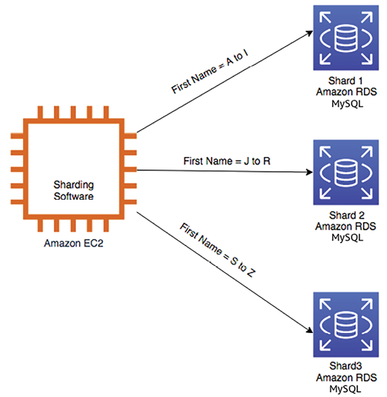

Figure 4.16: Relational database sharding

As shown in the preceding diagram, without _shards_, all data resides in one partition, for example, the first names of
all users being in one single database. With sharding, data is split into large chunks called shards. For example, all
users’ first names beginning with **A to I** are in one database, **J to R** in another, and **S to Z** in a third
database. In many circumstances, sharding gives you higher performance and better operating efficiency.

Utilizing Amazon RDS for sharding backend databases involves installing sharding software, such as MySQL, along with a
Spider storage engine on an Amazon EC2 instance. Subsequently, you can begin by setting up multiple RDS databases and
employing them as backend databases for sharding.

However, what if your master database instance goes down? In that case, you need to maintain high availability for your
database. Let’s take a closer look at the high-availability database pattern.

## High-availability database pattern

For the high availability of your application, it is critical to keep your database up and running all the time. As
horizontal scaling is not a straightforward option in the relational database, it creates additional challenges. To
achieve high database availability, you can have a standby replica of the master database instance, as shown in the
following diagram:

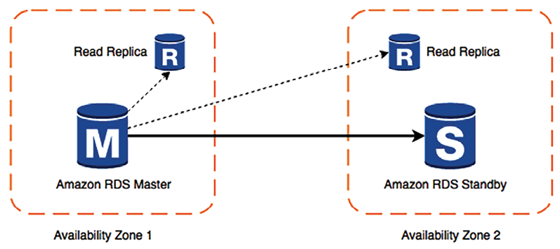

Figure 4.17: High-availability database pattern

As shown in the preceding diagram, your application server switches over to the standby instance if the primary instance
goes down. A read replica takes the load off the primary instance to handle latency. The primary and standby are located
in different **availability zones**, so your application will still be up even when an entire availability zone is down.
This architecture also helps to achieve zero downtime, which may be caused during the database maintenance window. When
a primary instance is down for maintenance, the application can fail over to a secondary standby instance and continue
serving user requests.

For disaster recovery, you will want to define the database backup and archival strategy, depending on your
application’s **recovery point objective** (**RPO**) of how frequently you want to take backups. You will learn about
RPOs and RTOs in depth in _Chapter 8_, _Architectural Reliability Considerations_.

If your RPO is 30 minutes, it means your organization can only tolerate 30 minutes’ worth of data loss. In that case,
you should take a backup every half an hour. While storing the backup, you need to determine how long the data can be
stored for customer query purposes. You can store data for six months as an active backup and then in an archival store
as per the compliance requirement.

Consider how quickly you need to access your backup and determine the type of network connection needed to meet your
backup and recovery requirements as per the company’s **recovery time objective** (**RTO**).

For example, if your company’s RTO is 60 minutes, it means you should have enough network bandwidth to retrieve and
restore your backup within an hour. Also, define whether you are backing up snapshots of complete systems or volumes
attached to systems.

You may also need to classify your data, for example, if it has customer-sensitive information such as email, addresses,
personally identifiable information, and more. It would be best if you defined the data encryption strategy accordingly.
You will learn more about data security in _Chapter 7_, _Security Considerations_.

Depending on your application’s growth and complexity, consider migrating from an RDBMS to a NoSQL database. NoSQL can
provide greater scalability, management, performance, and reliability than most relational databases. However, the
process of migrating to NoSQL from an RDBMS can be time-consuming and labor-intensive.

There is a lot of data to process in any application, for example, clickstream data, application log data, rating and
review data, social media data, and more. Analyzing these datasets and getting insight can help you to grow your
organization exponentially. _Chapter 12_, _Data Engineering for Solution Architecture_, will teach you more about these
use cases and patterns.

Now, let’s learn about building a maintainable system using Clean Architecture.

# Clean Architecture

Clean Architecture, also known as Hexagonal Architecture or Ports and Adapters, is an architectural pattern used in
designing business applications. Robert C. Martin proposed it and it emphasizes the separation of concerns,
maintainability, and testability. Clean Architecture aims to create a flexible, adaptable, and maintainable system over
time.

Clean Architecture divides your application into five key components; let’s understand them through the example of an
online bookstore:

1. **Entities (innermost layer)**: Entities are the business objects that encapsulate the core business rules. They are
   independent of any specific technology, database, or framework. Entities represent the “things” in the system and what
   they can do. In an online bookstore, a `Book` entity might have properties like title, author, price, and methods to
   check availability or apply discounts.
2. **Use cases**: Use cases contain the application-specific rules and define how the entities interact to fulfill
   specific scenarios or user stories. They coordinate the flow of data and actions between entities and external
   interfaces. They are also technology-agnostic, focusing only on business logic. The checkout use case might involve
   validating the shopping cart, applying discounts, calculating shipping, and processing payment, for example.
3. **Interfaces (ports)**: Interfaces define contracts for how different layers of the system interact with each other.
   They create a boundary that separates the inner layers (entities and use cases) from the outer layers (adapters,
   frameworks, and drivers). This separation enables flexibility and maintainability. There might be an interface for
   payment processing that defines methods like processing payments and refunds.
4. **Adapters**: Adapters implement the interfaces and translate between the inner and outer layers. They allow the
   application to interact with external components like databases, APIs, or third-party libraries. Adapters allow the core
   logic to remain isolated from technological changes or external dependencies. A database adapter might implement a data
   access interface to handle interaction with a specific database technology.
5. **Frameworks and drivers (outermost layer)**: This layer comprises all the technical details and tools used to build
   the application. It includes web servers, databases, UI frameworks, third-party libraries, etc. This layer interacts
   with the adapters to connect the core application to the outside world. This could include implementing a RESTful API
   using a specific web framework, setting up a connection to an SQL database, or integrating with a third-party payment
   gateway.

In Clean Architecture, each layer is independent of the others, allowing changes in one layer without affecting the
others. You can switch databases, change the UI framework, or modify business logic without causing ripple effects
throughout the system. Since your architecture has well-defined interfaces, it’s easier to create mocks or stubs for
testing. Core business logic can be tested independently from databases, UI, or other external dependencies.

While using Clean Architecture, make sure to avoid over-engineering. For simple or small projects, the complexity and
overhead of Clean Architecture might need to be revised. It requires careful consideration of whether the benefits
outweigh the increased complexity and development time.

Clean Architecture provides a robust and flexible foundation for developing software that can adapt to changing
technologies and requirements. Focusing on separating concerns and clear boundaries between layers promotes
maintainability, scalability, and testability. It’s a robust pattern that can serve well in complex systems but must be
applied with an understanding of the needs and context of the specific project to avoid unnecessary complexity.

Now, you have learned about various architectural patterns and best practices. Let’s learn about key anti-patterns that
you should be careful of when designing application architecture.

# Avoiding anti-patterns in solution architecture

In this chapter, you have learned about a different way of designing solution architecture with various design patterns.
Often, teams can drift away from best practices due to timeline pressure or the unavailability of resources. It is
advised to try and avoid the following architecture design anti-patterns. An anti-pattern serves as an example of a
poorly designed system:

- In an anti-pattern, scaling is handled reactively and manually. When application servers reach their maximum capacity
  and have no more resources available, users face disruptions in accessing the application. It’s only when users start
  reporting issues that the administrator becomes aware of the problem. The admin then initiates the process of launching
  a new server instance to alleviate the load on existing servers. However, there’s a drawback to this approach as there’s
  typically a delay of a few minutes between the instance launches and its actual availability. During this intervening
  period, users experience service interruptions and are unable to access the application. You should take a proactive
  approach and use auto-scaling to add processing power when servers reach a certain threshold, like 60% CPU or 60% memory
  utilization.
- With anti-patterns, automation is missing. When application servers crash, the admin manually launches and configures
  the new server and notifies the users manually. Automating the detection of unhealthy resources and launching
  replacement resources can streamline operations. Furthermore, it’s possible to implement automated notifications when
  such resource changes occur.\* With anti-patterns, the server is kept for a long time with hardcoded IP addresses, which
  prevents flexibility. Over time, server configurations can become inconsistent, leading to the inefficient allocation of
  resources, with some resources running when they are not needed. It would help if you kept all of the servers identical
  and had the ability to switch to a new IP address. You should automatically terminate any unused resources.
- With anti-patterns, an application is built monolithically, where all layers of the architecture, including web,
  application, and data layers, are tightly coupled and server-dependent. If one server crashes, it brings down the entire
  application. Keep the application and web layers independent by adding a load balancer in between. In the event that one
  of the application servers becomes unavailable, the load balancer automatically redirects all traffic to the remaining
  healthy servers.
- With anti-patterns, the application is server-bound, and the servers communicate directly with each other. User
  authentication and sessions are stored in the server locally, and all static files are served from the local server. You
  should create a service-oriented RESTful architecture, where the services talk to each other using a standard protocol
  such as HTTP. User authentication and sessions should be stored in low-latency distributed storage to scale the
  application horizontally. The static asset should be stored in centralized object storage decoupled from the server.
- With anti-patterns, a single database is used for all kinds of needs. You use a relational database for all needs,
  which introduces performance and latency issues. You should use the right storage for the right need, such as the
  following:
- NoSQL to store the user session
- Cache data storage for low-latency data availability
- Data warehouse for reporting needs
- Relational database for transactional data
- With anti-patterns, you will find a single point of failure by having a single database instance to serve the
  application. Whenever feasible, remove single points of failure from your architecture. Establish a secondary server
  (standby) and replicate the data. In the event of a primary database server failure, the secondary server can take over
  the workload.\* With anti-patterns, static content such as high-resolution images and videos are served directly from the
  server without caching. It would be best if you considered using a CDN to cache heavy content near the user location,
  which helps to improve page latency and reduce page load time.
- With anti-patterns, you can find security loopholes that open server access without a fine-grained security policy.
  You should always apply the principle of least privilege, which means starting with no access and only giving access to
  the required user group.

The preceding points provide some of the most common anti-patterns. Throughout this book, you will learn the best
practices for avoiding them in solution design.

# Summary

This chapter delved into constructing robust and scalable software architectures through various architectural
paradigms. It began with exploring n-tier layered architecture, dissecting the essential components comprising the web,
application, and database layers. The discussion transitioned into the intricate world of multi-tenant
**Software-as-a-Service** (**SaaS**) architecture, delving into the complexities and benefits of accommodating diverse
user bases within a unified framework.

As for web services, the chapter dove into the RESTful architectural style, elucidating its principles and applications.
This was followed by a journey through constructing a RESTful e-commerce architecture, offering practical insights into
real-world implementation.

Cache-based architectures were then discussed, with a comprehensive exploration of cache distribution, proxy patterns
such as cache proxy and rewrite proxy, and efficient caching strategies like app caching. A comparative study of
Memcached and Redis shed light on selecting the optimal caching solution.

The significance of architectural patterns was underscored by exploring the **Model-View-Controller** (**MVC**) approach
and **Domain-Driven Design** (**DDD**) methodology, empowering architects to create structured, adaptable, and
maintainable systems.

Architectural resilience was covered through an in-depth section on the circuit breaker pattern and on implementing the
bulkhead pattern for enhanced system stability. Coverage of the floating IP pattern further enriched your toolkit for
achieving high availability.

The chapter delved into containerization, unearthing the manifold benefits of containers and providing a roadmap for
effective container deployment. Database handling strategies were examined within application architecture, looking at
high-availability patterns to ensure data integrity and continuous operation.

The chapter concluded by spotlighting the Clean Architecture principles and imparting strategies for avoiding
detrimental anti-patterns in solution architecture.

By embarking on this architectural expedition, you have gained profound insights into the intricacies of building
resilient, scalable, and future-ready software systems, and you are now armed with the knowledge needed to navigate the
dynamic landscape of modern technology.
