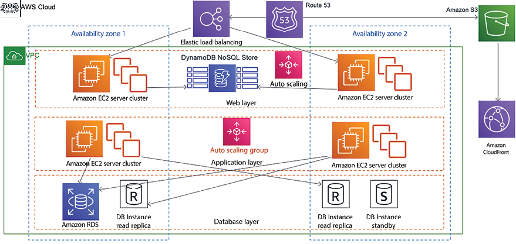
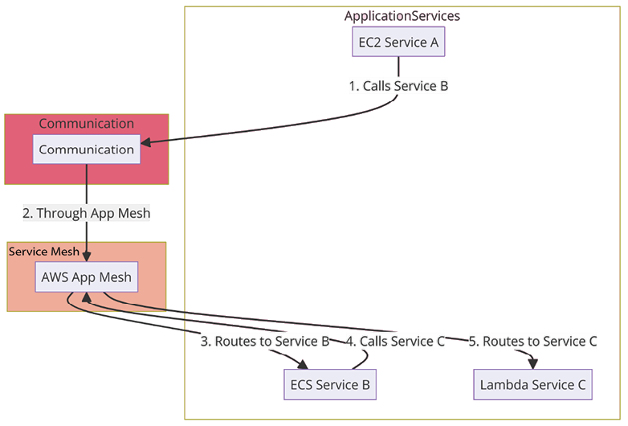
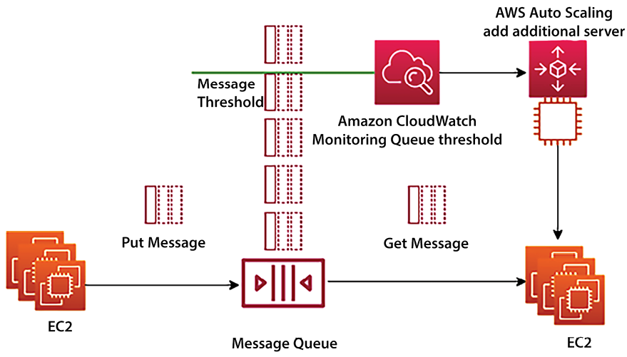
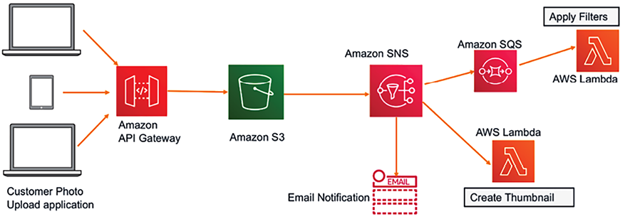
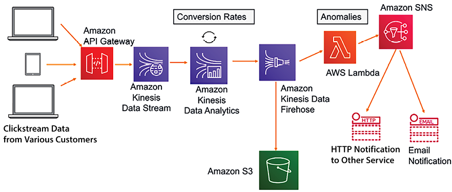

# Cloud-Native Architecture Design Patterns

In an era of rapid digital transformation, businesses increasingly turn to the cloud to deliver scalable, resilient, and cost-effective solutions. Adopting cloud-native architectures is becoming a strategic necessity for organizations seeking agility, innovation, and operational efficiency. This chapter will guide you through the journey of designing and implementing cloud-native architectures, focusing on patterns, designs, and best practices.

The chapter will comprehensively cover various cloud-native design patterns, including design principles and real-world examples. In addition to architecture design patterns, you’ll also acquire knowledge on the anti-patterns of cloud-native architecture design, providing you with insights into the practices to avoid.

You will learn about the following topics in this chapter.

- What is cloud-native architecture?
- Building serverless architecture
- Building stateless and stateful architectural designs
- Creating a microservice architecture
- Reactive architecture
- Building queue-based architecture
- Pipes-and-Filters Architecture
- Creating Event-Driven Architecture
- Backend for Frontend (BFF)
- Cloud-native architecture anti-patterns

By the end of this chapter, you will have a solid understanding of cloud-native architecture patterns and be well equipped to design, build, and optimize your cloud-native solutions.

# What is cloud-native architecture?

In _Chapter 3_, _Cloud Migration and Hybrid Cloud Architecture Design_, you were introduced to different strategies for cloud migration, including lift and shift, replatform, repurchase, retire, and others. To fully leverage the advantages and pricing models of the cloud, it’s crucial to adopt cloud-native architecture. Cloud-native architecture refers to a design approach for building and running applications that harness the benefits and capabilities of cloud computing to their fullest extent. It involves crafting applications to be efficient, scalable, and resilient in dynamic cloud environments.

Cloud-native applications are developed with principles that tap into cloud services, automation, and modern development practices. The key characteristics of cloud-native architecture include:

- **Microservices**: Cloud-native applications are often composed of smaller, loosely coupled services known as microservices. Each microservice handles a specific business capability and can be developed, deployed, and scaled independently.
- **Serverless computing**: Cloud-native applications frequently leverage serverless computing to achieve seamless scalability and cost reduction. This approach allows developers to focus on their code and application logic without worrying about managing servers, enabling automatic scaling and efficient resource use, which can significantly lower operational costs. Serverless architecture packages applications and their dependencies, ensuring consistency across different environments. It facilitates seamless deployment, scaling, and portability of applications.
- **Elasticity and scalability**: Cloud-native applications can scale up or down based on demand, enabling efficient resource utilization and cost savings. This is achieved through automatic scaling and load balancing.
- **Resilience and fault tolerance**: Cloud-native applications are designed to be resilient to failures. They incorporate practices such as redundancy, automated recovery, and fault tolerance mechanisms to ensure continuous operation even in the face of failures.
- **Automation**: Cloud-native architectures emphasize automation for various processes, including deployment, scaling, monitoring, and recovery. Automation reduces manual intervention, increases efficiency, and reduces the risk of human errors.
- **DevOps practices**: Cloud-native development encourages close collaboration between development and operations teams, promoting a culture of continuous integration, continuous delivery, and rapid iteration.
- **Statelessness**: Cloud-native applications are designed to be stateless, meaning that each component does not rely on the local state of a server. This enhances scalability and allows for easier horizontal scaling.
- **API-first**: **APIs** (**application programming interfaces**) are crucial in cloud-native architecture. Applications are designed with clear and well-documented APIs, enabling communication between microservices and promoting integration with other services.
- **Continuous monitoring and improvement**: Cloud-native applications are continuously monitored to ensure optimal performance and reliability. Data-driven insights are used to identify areas for improvement and optimization.

When transitioning applications to the cloud, it’s not merely about moving them as they are. Instead, it’s an opportunity to optimize and utilize the cloud’s features for maximum advantage. First and foremost, the pay-as-you-go model in the cloud is a game-changer. It means you pay only for the resources you use, aligning costs directly with your actual consumption. This provides elasticity and cost efficiency, as you can scale up or down based on demand without investing in fixed infrastructure. Planning resource provisioning carefully is essential to avoid over-provisioning and unnecessary costs.

The global infrastructure available in the cloud is another significant benefit. You can deploy your application closer to your users in various regions, reducing latency and improving user experience. This global reach empowers you to cater to a broader audience without investing in physical data centers worldwide.

The shift from **capital expenditure** (**CapEx**) to **operational expenditure** (**OpEx**) is a significant financial advantage in the cloud. Rather than upfront investments in hardware and maintenance, costs are spread out over time. This aligns better with budget planning and allows you to allocate resources more efficiently. However, with distributed teams and applications, cost management becomes a challenge. It’s crucial to establish effective cost-control measures across different teams.

Cloud-native architecture allows organizations to fully harness the benefits of cloud computing, including scalability, flexibility, and cost-effectiveness. Consider an example of a media streaming application to highlight the distinctions and advantages of cloud-native architecture with a serverless approach compared to an on-premises architecture.

In a cloud-native architecture, the media streaming application is designed using microservices and serverless computing. Different aspects of the application, such as user authentication, content recommendation, video encoding, and storage, are each developed as separate microservices. These microservices are encapsulated in serverless functions, allowing them to execute in response to specific events or triggers. For instance, video encoding functions can be automatically invoked when a new video is uploaded, and content recommendation functions can respond to user interactions. Managed cloud services handle databases, storage, authentication, and even the execution of serverless functions.

The media streaming application is hosted on the company’s servers and infrastructure in an on-premises architecture. The monolithic application handles all tasks, including authentication, content serving, and video processing. Scaling requires manual intervention and additional hardware procurement.

When adopting cloud-native development, it’s important to be aware of the potential for provider lock-in. This means that designing your architecture with the native tools and services of a specific cloud provider, such as AWS, might not seamlessly transfer to another provider due to the unique, proprietary nature of each platform’s offerings. Services across platforms may have different names, and the methods for invoking these services can vary significantly. While cloud-native features offer powerful capabilities tailored to optimize your operations on a specific platform, they can also introduce challenges if you later decide to migrate to a different cloud provider. Carefully consider the balance between leveraging these advanced features and maintaining some level of platform independence.

Embracing a cloud-native architecture with a serverless approach offers numerous advantages over traditional on-premises setups. The combination of microservices and serverless computing enables applications to deliver exceptional performance, scalability, cost efficiency, and rapid innovation while ensuring resilience and real-time responsiveness to users’ dynamic demands.

Let’s look into serverless architecture in more detail.

# Building serverless architecture

In a traditional scenario, if you want to develop an application, you need to have a server where your desired operating system and required software can be installed. While writing your code, you need to ensure your server is up and running. During deployment, you need to add more servers to keep up with user demand and add scaling mechanisms such as **auto-scaling** to manage the desired number of servers to fulfill users’ requests. In this situation, much effort goes into infrastructure management and maintenance, which has nothing to do with your business problem.

Serverless means no server is required to host your code, freeing you from auto-scaling and decoupling overheads while providing a low-cost model. Going serverless lets you focus on your application and write code for feature implementation without worrying about underlying infrastructure maintenance.

In relation to AWS, when you talk about serverless, the first thing that comes to mind is AWS Lambda functions, a **Function as a Service** (**FaaS**) provided by the AWS cloud. To make your application service-oriented, Amazon API Gateway offers you the ability to put RESTful endpoints in front of your AWS Lambda functions, helping you to expose them as microservices. Amazon DynamoDB provides a highly scalable NoSQL database, an entirely serverless NoSQL data store, and Amazon **Simple Storage Service** (**S3**) provides serverless object data storage.

Let’s take a look at an example of serverless architecture for the delivery of a secure survey with AWS in the following diagram:

Figure 5.1: AWS Serverless architecture example for a secure survey delivery

The preceding diagram illustrates the flow of a secure serverless architecture used for a customer survey application hosted on AWS:

1.  A customer makes a secure HTTPS request for the survey website. The static web page, including any client-side scripts for AJAX calls, is served directly from an Amazon S3 bucket, which is configured for web hosting.
2.  Upon completing the survey, the customer submits their responses. This triggers an AJAX call from the client’s browser to Amazon API Gateway. API Gateway is configured to expose the necessary endpoints for receiving survey data and is secured to ensure only authorized calls are processed.
3.  Amazon API Gateway has built-in integration with AWS CloudTrail, which logs all requests made to the API. This means every survey submission is recorded, providing an audit trail that can be useful for troubleshooting lost data or investigating suspicious activities.
4.  API Gateway converts the incoming AJAX call into an event that triggers an AWS Lambda function. This serverless function is responsible for processing the survey data, which may include validation, transformation, and applying business logic specific to the survey’s requirements.
5.  After processing the data, the Lambda function securely sends the survey results to another Amazon S3 bucket dedicated to storing these submissions. The results are encrypted using server-side encryption, ensuring that the data at rest is protected against unauthorized access.
6.  Alongside the encrypted survey results, any non-sensitive metadata (excluding personally identifiable information) is concurrently stored in an Amazon DynamoDB table. This metadata could include timestamps, survey version information, or other contextual data relevant for future queries, reporting, or analytical purposes.

Due to the increasing popularity of serverless architecture, you will see more example architectures using serverless services as we move forward with this book. Now AWS **SAM** (**Serverless Application Model**) offers straightforward syntax for creating functions, APIs, and databases tailored for serverless environments. Let’s learn more about design considerations for serverless architecture.

## Considerations for serverless architecture

When crafting a serverless architecture, it’s crucial to account for key factors that ensure the successful deployment and functioning of your application. Serverless architecture is highly suitable for designs that can be broken down into more modular components. This approach shines when you can delineate your application into discrete, independently scalable services. However, if your project involves constructing a large, complex logic within a single, monolithic module, it might be more advantageous to opt for a traditional server-based approach.

Serverless architecture, while offering numerous benefits, often encounters the challenge of cold starts, which can affect application start latency. Although the infrastructure appears serverless to the user, cloud providers like AWS operate by creating an abstraction layer in the background, dynamically spinning up servers as needed. This process can sometimes take time, leading to a delay—or “cold start”—when the function is invoked after being idle. It’s important to be mindful of cold start issues when designing with serverless architecture and to implement strategies to mitigate this, ensuring that your application remains responsive and performs efficiently.

Let’s explore this through an example: developing a real-time notification system for a social media platform. The system must send instant notifications to their devices whenever users receive likes, comments, or new friend requests. Here are some critical considerations for serverless architecture for our notification system:

- **Granular function design**: Break down your application logic into small, discrete functions. Each function should perform a specific task or handle a particular event. This granularity ensures efficient resource usage and better scalability. You might have separate functions for sending likes, comments, and friend requests.
- **Statelessness**: Serverless functions are designed to be stateless. Any required state should be managed externally, such as in a database or storage service. This ensures that functions can scale and be easily replaced without affecting application behavior. Ensure that each function is stateless and doesn’t rely on local memory. All necessary data, such as user preferences or notification history, should be stored in a database.
- **Event-driven design**: Serverless architecture is well suited for event-driven applications. Design your functions to trigger in response to specific events, such as user actions or changes in data. For instance, when a user receives a new friend request, an event should trigger the corresponding function.
- **Cold starts**: Serverless functions can experience a delay when invoked for the first time, known as a “cold start.” This could delay the delivery of notifications, so the architecture should be designed to minimize the impact of cold starts, such as by using provisioned concurrency to keep a certain number of function instances warm and ready to handle incoming requests.
- **Scalability**: Serverless platforms automatically scale functions based on demand. This allows your application to handle sudden spikes in traffic without manual intervention. The system will handle more notifications without manual intervention as user activity increases.
- **Performance considerations**: Understand the limitations of serverless platforms, such as execution time limits and memory constraints. Optimize your functions for performance to ensure your notification system remains responsive, even during high-traffic periods.
- **Distributed tracing and monitoring**: Implement monitoring and distributed tracing to gain visibility into the performance of your serverless functions. This will be crucial for identifying bottlenecks and diagnosing issues in delivering notifications.
- **Security**: Implement security best practices for serverless applications to avoid unauthorized access to notifications. This includes proper authentication, authorization, and data encryption at rest and in transit.
- **Cost management**: While serverless can be cost-effective, monitoring usage and costs is essential. Set up budget alerts and use cloud provider tools to analyze spending patterns. With serverless, you pay for execution time, so optimize code to reduce this and consider using cost analysis tools to monitor usage.
- **Data storage and persistence**: Choose appropriate storage solutions for your data, such as managed databases, object storage, or data warehouses. Ensure data persistence across function invocations. For our notification system, we’ll store user preferences and notification history in a managed database, ensuring data persistence across function invocations.
- **Dependencies**: Be mindful of dependencies in your functions. Including unnecessary libraries or components can increase the size of your deployment package and impact performance. Minimize dependencies to keep the function deployment package small and efficient.
- **Testing and debugging**: Develop effective testing strategies for your serverless functions. Use local emulators and debugging tools provided by the cloud provider.
- **Leveraging managed services**: Serverless doesn’t mean every component must be a function. Use managed services for other parts of your application architecture, such as databases, queues, and authentication.
- **Compliance and regulations**: Consider any compliance or regulatory requirements that apply to your application, especially when dealing with sensitive data or industries with strict regulations. Ensure the architecture complies with data protection regulations, especially when handling personal information.

By carefully addressing these considerations, you can create a well-architected serverless application that benefits from auto-scaling, cost efficiency, and simplified management. The serverless architecture ensures scalable, cost-effective, and responsive notification delivery without worrying about managing infrastructure.

When developing a serverless architecture, emphasizing statelessness is crucial. By designing stateless applications, you reduce the dependency on server-managed session states, which in turn aids scalability. Stateless architecture is key to scaling cloud-native architecture. Let’s learn more about it.

# Building stateless and stateful architectural designs

Stateless and stateful architectural designs represent two different approaches to managing client-server interactions within software applications. Stateless architectures treat each client request as a separate, independent transaction, requiring no knowledge of previous interactions; this simplifies design and enhances scalability, as any server can respond to any request without needing to maintain session information. On the other hand, stateful architectures retain client session information across multiple requests, allowing for more personalized and context-aware interactions but at the cost of increased complexity in managing session data and challenges in scaling, as the state must be consistently available and synchronized across server instances.

While designing a complex application such as an e-commerce website, you need to handle the user state to maintain activity flow, where users may be performing a chain of activities such as adding to the cart, placing an order, selecting a shipping method, and making a payment. Users can use various channels to access an application, so there is a strong possibility that they will be switching between devices—for example, adding items to the cart from their mobile and then completing checkout and payment from a laptop. To cater to this situation, you should persist user activity across devices and maintain their state until the transaction is complete. Therefore, your architecture design and application implementation must plan for user session management to fulfill this requirement.

To persist user states and make applications stateless, user session information needs to be stored in persistent database layers such as the NoSQL database. This user state can be shared between multiple web servers or microservices.

Traditionally, a monolithic application uses stateful architecture, storing user session information in the server rather than via any external persistence database storage.

The key distinction between stateless and stateful application designs lies in how they handle session storage. In stateful applications, session information is stored locally on the server, which means it cannot be easily shared with other servers. This setup poses a challenge for scalability and is not well suited for modern microservice architectures, as it requires all subsequent requests from the same user to be routed to the original server that handled the first request. This can significantly restrict the application’s ability to scale across multiple servers or instances. On the other hand, stateless designs do not store session data on the server, allowing any server to handle any request, which enhances the application’s scalability and flexibility. The choice between adopting a stateless or stateful approach hinges on the application’s requirements, specifically how it balances the need for scalability with the desire for a continuous, personalized user experience.

## Stateful architecture

In a stateful application, state information is handled by the server, so once users establish a connection with a particular server, they have to stick with it until the transaction completes. You can put a load balancer in front of the stateful application, but to do that, you have to enable sticky sessions in a load balancer.

Sticky sessions are a technique used to ensure that all requests from a particular user session are directed to the same server that handled the initial request. This approach is necessary in stateful applications to maintain session consistency, as it prevents session data from being lost when subsequent requests are routed to different servers. By using sticky sessions, the load balancer deviates from its standard practice of distributing requests evenly among servers, typically done via a round-robin method, and instead, routes a user’s requests to a specific server where their session information resides. While this method supports session persistence, it introduces challenges, such as the potential for overloading a single server with too many persistent connections. To mitigate this, implementing a session timeout mechanism becomes essential, ensuring that sessions do not indefinitely consume server resources.

Often, a stateful application doesn’t support horizontal scaling very well, as the application state persists in the server, which cannot be replaced. The stateful application works well early on when the user base is small. However, as the internet becomes increasingly widespread, it is reasonable to assume that you will have millions of users active on a web application. Therefore, efficient horizontal scaling is essential for handling a large user base and achieving low application latency.

## Stateless architecture

Using the stateless method, your design approach should focus more on the shared session state, as it allows horizontal scaling.

The following diagram shows an architecture that depicts a stateless application for an example web application with AWS:

Figure 5.2: A stateless application architecture

The depicted AWS architecture provides a secure, highly available, and scalable environment for a three-tier application across two Availability Zones for fault tolerance. It uses Elastic Load Balancing to distribute traffic across EC2 server clusters, which are dynamically scaled with Auto Scaling to meet changing demands. The database layer, powered by Amazon RDS, includes a read replica for query scaling and a standby instance for failover, ensuring data durability and high availability. Static content is served through Amazon S3 and delivered efficiently via Amazon CloudFront, with AWS Route 53 managing DNS services to optimize user traffic routing. This setup ensures operational resilience, cost-efficiency, and performance optimization for the application. To make applications loosely coupled and scalable, all user sessions are stored persistently in the NoSQL database, for example, Amazon DynamoDB.

For the session ID, you should use client-side storage, such as cookies. This architecture lets you scale the application horizontally by adding more servers without worrying about losing user state information. A stateless architecture removes the overhead of creating and maintaining user sessions and allows consistency across the application’s modules. A stateless application has performance benefits, too, as it reduces memory usage from the server side and eliminates the session timeout issue.

Implementing a stateless architecture involves complexities such as integrating additional database components for storing user sessions and creating a supplementary layer to retrieve the correct user session across servers. However, with the right approach, you can achieve a rewarding experience for your user base. You can develop applications using the microservice approach with REST design patterns and deploy them in containers. For this, use authentication and authorization to connect users to the server.

In the following sections, you will learn more about microservices and REST design patterns. As access to user session information from multiple web servers focuses on a single data storage location, you must use caution to prevent the performance of the data store from becoming a bottleneck.

# Creating a microservice architecture

In cloud-native architecture, microservices play a vital role in breaking down extensive features into smaller, manageable chunks that can scale independently. This approach allows for specific components to be scaled up or down as needed without affecting the entire system. By using microservices, a system is designed to be fault-tolerant, meaning it’s constructed with potential failures in mind, allowing for the graceful degradation of application availability and preventing widespread system failures.

The clear advantage of microservices is that you have to maintain a smaller code surface area. Microservices should always be independent. You can build each service with no external dependencies where all prerequisites are included, which reduces the inter-dependency between application modules and enables loose coupling.

The other overarching concept of microservices is **bounded contexts**, which are the blocks that combine to make a single business domain. A business domain could be retail, car manufacturing, bookselling, or social network interactions involving a complete business process. An individual microservice defines boundaries in which all the details are encapsulated. For example, let’s consider an e-commerce platform. In such a system, you would have several microservices handling different aspects of the business. Here are a few bounded contexts within this platform:

2.  **User account context**: This microservice handles everything related to user accounts, including user registration, profile management, login, and authentication. Its boundary encompasses user information and the operations that can be performed on this data, such as updating a profile or resetting a password. No other microservice will manage these operations.
3.  **Product catalog context**: This microservice is responsible for managing the product listings, categories, and product details. It operates independently of the user account context, focusing solely on the products, their organization, and their presentation to the user.
4.  **Order processing context**: This microservice handles the checkout process, order tracking, and payment processing. It uses information from the product catalog context (e.g., product IDs, prices) and the user account context (e.g., customer details) to fulfill its functions but maintains its separate operations, such as updating order status or processing returns.

Each bounded context is a self-contained system with its own domain logic and database, communicating with others via well-defined APIs. These boundaries allow each microservice to be developed, deployed, scaled, and updated independently, making the overall system more resilient and adaptable to change.

By defining these boundaries, the e-commerce platform can ensure that changes in one context, such as adding new payment methods in the order processing context, do not affect the user account or product catalog contexts, leading to a more maintainable and scalable system.

Scaling each service is essential while dealing with the large-scale access of applications, where different workloads have different scaling demands.

Let’s learn about some best practices for designing microservice architecture:

- **Create a separate data store**: Adopting a separate data store for each microservice allows the individual team to choose the best database for their service. For example, the website traffic team can use a scalable NoSQL database to store semi-structured data. The team handling order services can use a relational database to ensure data integrity and the consistency of transactions. This also helps to achieve loose coupling where changes in one database do not impact other services.
- **Keep servers stateless**: As you learned in the previous section, _Building stateless and stateful architecture designs_, keeping your server stateless helps in scaling. Servers should be able to go down and be replaced easily, with minimal or no need for storing state on the servers.
- **Create a separate build**: Creating a separate build for each microservice makes it easier for the development team to introduce new changes and improve the agility of the new feature release. This helps to ensure that the development team is only building code required for a particular microservice and not impacting other services.
- **Deploy in a container**: Deploying in a container gives you the tool to deploy everything in the same standard way. Using containers, you can choose to deploy all microservices in the same way, regardless of their nature. You can use serverless container deployment services like Amazon Fargate to manage your container without worrying about infrastructure.
- **Go serverless**: Try to use a serverless platform or a leveraging function with service capability, such as AWS Lambda, when your microservices are simple enough. Serverless architecture helps you to avoid infrastructure management overhead.
- **Blue-green deployment**: For application deployment, the best approach is to create a copy of the production environment. Deploy the new feature and route a small percentage of the user traffic to ensure the new feature is working as expected in a new environment. After that, increase the traffic in the new environment until the entire user base can see the new feature. You will learn more about blue-green deployment in _Chapter 11_, _DevOps and Solution Architecture Framework_.\* **Monitor your environment**: Good monitoring is the difference between reacting to an outage and proactively preventing an outage with proper rerouting, scaling, and managed degradation. To prevent application downtime, you want services to offer and push their health status to the monitoring layer because what knows more about status than the service itself? Monitoring can be done in many ways, such as with plugins or by writing to a monitoring API.

While microservice architectures have various advantages, a modular approach comes with the overhead of managing more infrastructure. You must carefully choose the tools to help you manage and scale multiple modules in parallel. While designing microservice architecture, try to use serverless platforms wherever possible, which will help mitigate the infrastructure and operation overhead. Let’s look at a microservice-based example architecture for a real-time voting application.

In the diagram below, we show a design that uses microservices for a live voting app. This app works by having small, separate services that handle and count votes from users. When someone votes using their mobile device, the app records each vote and then saves all these votes together in a NoSQL database, Amazon DynamoDB.

There is application logic in the AWS Lambda function, which aggregates all of the voting data cast by users to their favorite actor and returns the final results:

Figure 5.3: Microservice-based real-time voting application architecture with AWS

In the preceding architecture, the following things are happening:

1.  Users text a vote to a phone number or a short code provided by a third party such as _Twilio_.
2.  The third party is configured to send the content of the message to an endpoint created by Amazon API Gateway, which then forwards the response to a function built in AWS Lambda.
3.  This function extracts the vote from the message content and writes the result and any metadata into a table in Amazon DynamoDB.
4.  This table has DynamoDB Streams enabled, which tracks changes to your tables on a rolling basis.
5.  After the update, DynamoDB Streams notifies a second AWS Lambda function with the application logic to aggregate the votes (to every second) and write them back to another DynamoDB table. The second table only stores the sum of the votes for each category.
6.  A dashboard to display a summary of votes is created using HTML and JavaScript and hosted as a static website in Amazon S3. This page uses the AWS JavaScript SDK to query the aggregate Amazon DynamoDB table and display the voting results in real time.
7.  Finally, Amazon Route 53 is a DNS provider for creating a hosted zone pointing to a custom domain name in the Amazon S3 bucket. This allows you to host static websites in S3 buckets in a cost-effective serverless manner.

This architecture is not only microservice-based but also serverless. Using microservices, you can create applications made of small independent components, which constitute smaller parts to iterate. Microservice-based architecture means that the cost, size, and risk of change are reduced, increasing the rate of change.

Coordinating between multiple services becomes critical if your system is distributed using microservices. Let’s learn how to orchestrate multiple microservices next.

## Saga pattern

The Saga pattern is a design pattern used to manage long-running, complex business transactions. It’s beneficial in microservice architectures, where a single business transaction might involve multiple microservices. Instead of using a traditional two-phase commit, the Saga pattern divides the transaction into multiple smaller, isolated transactions. A different service handles each of these smaller transactions, and they are coordinated to ensure data consistency across services. If one of the smaller transactions fails, compensating transactions are executed to undo the previous steps.

In complex systems where multiple services need to work together to fulfill a single operation, such as processing an order or booking a flight, the Saga pattern helps ensure that if something goes wrong at any point, the entire operation can be either fully completed or rolled back.

Here’s how the Saga pattern works:

- **Decomposition**: The operation that needs to be performed is broken down into smaller, isolated steps or transactions. Each step corresponds to an action performed by a specific microservice.
- **Compensation actions**: For every step, a corresponding compensation action is defined. If a step fails or an error occurs, the compensation action is executed to reverse the effects of the previous steps. This brings the system back to a consistent state.\* **Coordinator**: A coordinator is responsible for orchestrating the sequence of steps and their corresponding compensation actions. It initiates the saga, monitors its progress, and ensures that all steps are completed or the necessary compensation actions are taken.
- **Local transactions**: Each step and its compensation action are encapsulated within a local transaction within their respective microservices. This allows for the atomicity of operations within each microservice.
- **Eventual consistency**: The Saga pattern embraces eventual consistency, which means that even if a failure occurs, the system will eventually reach a consistent state by either completing the entire operation successfully or rolling back to a consistent state.

Imagine an e-commerce application where a customer places an order. The Saga pattern could be used to handle the entire order processing flow:

1.  **Initiation**: The order service starts a new saga for order processing.
2.  **Steps**: The saga involves multiple steps performed by different microservices: check product availability, charge the customer, update inventory, and notify the customer, for example.
3.  **Compensation actions**: Corresponding compensation actions are defined, for example, if the item is out of stock: release the charged amount, restock the product, and send an apology email to the customer.
4.  **Coordinator**: A coordinator oversees the saga, ensuring that each step is successfully executed or compensated. For example, steps flow from checking product availability to placing an order, charging the customer, and fulfilling the order for delivery.
5.  **Eventual consistency**: If a step fails at any point (for example, if charging the customer fails), the compensation actions are triggered to bring the system back to a consistent state.

Each service involved in the Saga produces and listens for events, as shown in the following diagram:

Figure 5.4: Saga pattern sequence diagram for e-commerce application architecture

As depicted in the preceding diagram, when a service completes its part of the transaction, it produces an event that triggers the next service in the saga. For example:

1.  The **Order Service** receives a request to create an order.
2.  The **Order Service** starts the saga by creating the order in a **pending** state and publishing an **OrderCreated** event.
3.  The **Payment Service** listens for the **OrderCreated** event, processes the payment, and publishes a **PaymentProcessed** event.
4.  The **Stock Service** listens for the **PaymentProcessed** event, verifies that the items are in stock, reserves the stock, and publishes a **StockReserved** event.
5.  The **Shipping Service** listens for the **StockReserved** event, schedules the delivery, and publishes a **ShipmentScheduled** event.
6.  The **Order Service** listens for the **ShipmentScheduled** event and updates the order to a **completed** state.

If any of the services fail to complete its part of the transaction, it publishes a compensating event to trigger the rollback of the previous steps. For example, if the **Stock Service** finds out there’s insufficient stock, it could publish a **StockInsufficient** event. The **Payment Service** would listen for this event and initiate a refund. The **Order Service** would listen for the **StockInsufficient** event and update the order to a **failed** state.

The Saga pattern is a design solution that addresses the challenge of data consistency in distributed systems, particularly when working with microservices. Instead of relying on a single, large-scale transaction to ensure data consistency across different services, the Saga pattern breaks the transaction into a series of local transactions for each service. Each local transaction updates the database and publishes an event or message indicating the transaction’s success or failure. However, the Saga pattern introduces the concept of eventual consistency, which means the system’s state will become consistent over time, but not necessarily immediately. Additionally, implementing the Saga pattern can be complex because it requires handling failure scenarios and ensuring that compensating transactions correctly undo previous operations. This often involves intricate coordination and robust messaging systems to manage the asynchronous communication between services.

The Saga pattern allows complex operations to be broken down into manageable steps, with a safety net to handle failures and maintain data integrity. It promotes better resilience in distributed systems by ensuring that the system remains coherent and eventually consistent even if failures occur. However, implementing the Saga pattern requires careful design and coordination to handle various failure scenarios effectively. What if you have extensive information that needs to be processed by multiple microservices, but it needs to be consolidated to create meaningful insights? In such scenarios, the fan-out/fan-in pattern can rescue you. Let’s learn more about it.

## Fan-out/fan-in pattern

The fan-out/fan-in pattern is a design pattern commonly used in distributed systems to process requests efficiently and aggregate data from multiple sources. It’s beneficial for scenarios where data must be collected, processed, and consolidated from various input streams or sources. The pattern gets its name from how data fans out from multiple sources and then fans back in for aggregation.

Consider a real-time analytics system for a social media platform. The fan-out/fan-in pattern can be applied to collect and process data from various user activities. Let’s see how the fan-out/fan-in pattern works:

- **Fan-out phase**:

  - In the fan-out phase, data is collected from multiple sources, including different microservices, APIs, or data streams. Each source sends its data to a separate processing component. User posts, comments, likes, shares, and followers generate real-time data streams.
  - The processing component for each source operates independently and simultaneously. This allows for efficient parallel processing, reducing the time to gather data from various sources. Each type of activity has a dedicated processing component that calculates statistics such as engagement rates, popular content, and trending topics.

- **Fan-in phase**: Once individual processing is complete, the results from each processing component are aggregated or combined, in this case to calculate overall platform engagement metrics. This aggregation can involve calculations, summarizations, or any other operation needed for the final result. The aggregated data generates the desired outcome or final report. This could be a single report, a summarized analysis, or any other form of consolidated data. For our example, this is presented to administrators as a dashboard that displays real-time engagement insights.

In this example, the fan-out/fan-in pattern allows the analytics system to process and consolidate data from multiple user activities efficiently, providing administrators with real-time insights into platform engagement.

**Benefits of the fan-out/fan-in pattern**

The fan-out/fan-in pattern is a strategic approach in distributed systems that significantly enhances the way data is managed and processed. Here are the key benefits of employing this pattern:

- **Parallelism**: The pattern leverages parallel processing, allowing faster data collection and aggregation from multiple sources.
- **Efficiency**: Instead of processing data sequentially from each source, the pattern optimizes processing time by working on multiple sources concurrently.
- **Scalability**: Each source can be processed independently, enabling the system to scale efficiently as the number of sources increases.
- **Modularity**: The pattern encourages modular design by separating the data collection (fan-out) phase from the aggregation (fan-in) phase. This makes it easier to maintain and extend the system.

The fan-out/fan-in pattern, while beneficial for parallel processing and enhancing efficiency in distributed systems, introduces specific challenges that must be navigated carefully. Implementing this pattern adds complexity due to the need for meticulous coordination between the numerous parallel tasks it initiates and their subsequent aggregation. Error handling becomes more intricate, as the system must account for potential failures in any of the fan-out tasks and ensure robust mechanisms for recovery to maintain data consistency.

This pattern can also be resource-intensive, as it may require significant computational power to manage the parallel processes, potentially leading to higher operational costs and necessitating advanced scaling strategies. Moreover, the aggregation stage can become a bottleneck, particularly if it involves processing large volumes of data, which may delay the overall data processing timeline. Additionally, the system might only achieve eventual consistency, posing challenges for applications that require real-time processing. Finally, the distributed nature of this pattern complicates debugging and monitoring, requiring comprehensive tools to ensure visibility across all tasks. Despite these challenges, with careful design and management, the fan-out/fan-in pattern remains a potent strategy for improving data processing efficiency in distributed architectures.

Overall, the fan-out/fan-in pattern is valuable for managing and processing data from various sources in distributed systems, enabling efficient parallel processing and streamlined aggregation.

Increasing the number of microservices requires careful orchestration, which is where the service mesh comes into the picture. Let’s learn more about it.

## Service mesh pattern

In modern software development, microservices have become a go-to approach for building flexible and scalable applications. However, as the number of microservices increases, managing their communication and reliability can become more challenging than navigating a busy road intersection. This is where the concept of the service mesh enters the picture, simplifying microservices’ communication while enhancing their robustness.

Imagine you’re at a bustling city intersection with multiple lanes of traffic. Each vehicle represents a microservice, serving a specific purpose. To ensure smooth traffic flow and prevent collisions, traffic lights, signs, and road rules are essential. Similarly, a service mesh acts as the traffic controller for microservices, regulating their interactions and ensuring they work harmoniously.

A service mesh is a layer of the infrastructure that manages communication between different services in a cloud application. It ensures reliable message delivery among these services. Builders can focus on core application programming, while the service mesh takes care of networking and security in the system’s infrastructure.

The following diagram illustrates a service mesh infrastructure with AWS services as an example.

Figure 5.5: Service mesh pattern architecture in AWS cloud

Let’s walk through each step illustrated in the service mesh diagram:

2.  **EC2 Service A**: This represents an Amazon EC2 instance running a service (**Service A)**. EC2 instances provide scalable computing capacity in the **Amazon Web Services** (**AWS**) cloud.

- **Calls Service B**: Service A initiates a call to **Service B**. This is the beginning of an inter-service communication process.
- **Communication**: This block represents the communication layer where Service A’s request is captured to be routed through the service mesh.
- **Through App Mesh**: The request from Service A goes through AWS App Mesh, which is a service mesh that provides application-level networking. App Mesh standardizes how services communicate, giving end-to-end visibility and ensuring high availability for applications.
- **Routes to Service B**: AWS App Mesh routes the request to the appropriate service, in this case, Service B.
- **ECS Service B**: This represents an Amazon **Elastic Container Service** (**ECS**) task running Service B. ECS is a highly scalable, high-performance container management service that supports Docker containers.
- **Calls Service C**: After Service B completes its processing, it calls **Service C**. This could be part of a larger transaction that involves multiple microservices.
- **Routes to Service C**: Again, AWS App Mesh routes the call from Service B to Service C.
- **Lambda Service C**: This represents an AWS Lambda function for Service C. AWS Lambda lets you run code without provisioning or managing servers. It executes your code only when needed and scales automatically.

The architecture abstracts the complex interplay of services within a service mesh, illustrating the role of AWS App Mesh in managing, routing, and controlling the communication between different services.

Here are the primary features provided by a service mesh:

- **Traffic management**: Service meshes provide detailed control over traffic behavior with rich routing rules, retries, failovers, and fault injection.
- **Observability**: They give you deep insights into your applications through visualizations, tracing, monitoring, and logging traffic between services.
- **Security**: Service meshes offer automated **mutual TLS** (**mTLS**) traffic encryption between your services.
- **Policy enforcement**: They allow you to define and enforce policies consistently across all your services, regardless of where they run.
- **Resilience**: Service meshes enable advanced load balancing, timeouts, and retries, helping you create more resilient applications.

A popular way to implement a service mesh is by using sidecar proxies. Each service instance in a microservices application is paired with a sidecar proxy, which handles all the network communication to and from the service. All these proxies are networked into a mesh, hence the name “service mesh.”

Service meshes are becoming an essential part of modern, cloud-native application architectures, offering a variety of implementations tailored to different needs and environments. Among the most popular service mesh implementations are:

- **Istio**: This comprehensive service mesh solution provides a robust way to control service-to-service communication within a microservice architecture. It allows developers to define detailed routing rules and policies, implement resilience patterns like retries and circuit breakers, and gather insights into application traffic flows. Istio’s ability to enforce policies and collect metrics helps in securing and observing communications between services, thereby enhancing the network’s reliability and performance.
- **Linkerd**: Known for its focus on simplicity and performance, Linkerd is an open-source service mesh that provides critical features such as service discovery, routing, failure handling, and visibility to modern application infrastructures. It’s designed to be lightweight and easy to install, with a minimal footprint that makes it an attractive choice for teams looking to adopt service mesh technology without significant overhead.
- **AWS App Mesh**: Specifically designed for AWS users, App Mesh is a managed service mesh service that makes it easy to manage and control communications between microservices across AWS services. It supports application-level networking, enabling the application services to communicate over the network with more visibility and control. AWS App Mesh simplifies the configuration of service communication, providing application-level insights and ensuring high availability for your applications.
- **Consul Connect**: Part of HashiCorp Consul, Consul Connect focuses on securing service-to-service communication with automatic TLS encryption and identity-based authorization. It’s built to be platform-agnostic, providing a consistent, unified method of securing and configuring communication across services, regardless of the underlying platform. With its emphasis on security, Consul Connect ensures that only authorized services can communicate with each other, thereby reducing the risk of internal threats.

While service meshes offer a range of benefits for microservice architecture, such as improved service-to-service communication, enhanced security, and better observability, it’s crucial to consider the complexity they introduce to your infrastructure. Incorporating a service mesh involves additional components to manage, monitor, and maintain, which could increase the operational overhead for your team. This added layer of infrastructure requires careful planning, skilled personnel to manage it, and a clear understanding of its impact on your system’s performance and complexity. Therefore, evaluating the specific needs of your application and weighing the advantages against the potential increase in infrastructure complexity is essential before deciding to implement a service mesh. This cautious approach ensures that the benefits of adopting a service mesh align with your application’s requirements and your team’s capacity to manage the additional complexity.

AWS App Mesh is a service that normalizes communication across your services, offering comprehensive monitoring and promoting consistent availability. The following architecture diagram depicts the implementation of the service mesh pattern using AWS cloud services:

Figure 5.6 – An e-commerce application managed by App Mesh in AWS

As shown in the preceding diagram, Amazon Fargate operates as a serverless engine for container computing, compatible with Amazon **Elastic Container Service** (**ECS**) and Amazon **Elastic Kubernetes Service** (**EKS**). The following are the steps to implement an e-commerce application managed by App Mesh:

1.  **Create Fargate services**: Define each microservice (User, Order, Payment, Product Catalog, and Authentication) as an Amazon Fargate on EKS with the required task definitions.
2.  **Set up AWS App Mesh**: Create a mesh that serves as a logical boundary for the network traffic between services.
3.  **Define virtual nodes**: Create a virtual node for each ECS service in App Mesh. A virtual node acts as a logical pointer to a particular ECS service.
4.  **Create virtual routers and routes**: Define virtual routers and routes to control the traffic flow between virtual nodes.
5.  **Configure virtual services**: Virtual services route traffic to virtual nodes, enabling the discovery of services within the mesh.
6.  **Deploy sidecar proxies**: Attach an Envoy proxy to each ECS task definition as a sidecar container. Envoy proxies intercept and manage the traffic between microservices.
7.  **Monitor and log**: Use AWS CloudWatch and AWS X-Ray to monitor and log the traffic flowing through the mesh.

Implementing a service mesh can enhance service-to-service communication, security, and observability. This approach allows you to manage a microservice architecture more efficiently and effectively, providing a robust and scalable solution for complex applications. Recovery from failure is an important aspect of building large-scale architecture. Let’s learn about reactive architecture to solve this problem.

# Reactive architecture

As cloud-native architecture can have various moving parts due to multiple microservices and small modules, they need to be protected from failure. Reactive architecture is a design approach for building software that can efficiently handle changes and stay responsive under various conditions. It benefits large-scale and distributed systems that must maintain high availability and responsiveness, even in the face of failures or high demand.

The principles of reactive architecture are based on the Reactive Manifesto, a document that outlines the core traits of reactive systems: responsive, resilient, elastic, and message-driven. You can find details on the Reactive Manifesto by visiting: [https://www.reactivemanifesto.org/](https://www.reactivemanifesto.org/):

- **Responsive**: Reactive systems prioritize responsiveness, ensuring they respond to user requests promptly regardless of the system’s load or state.
- **Resilient**: Reactive systems are designed to handle failures gracefully. They can recover quickly and operate, even when some components fail.
- **Elastic**: Reactive systems can scale up or down based on demand, efficiently utilizing resources and maintaining responsiveness under varying workloads.
- **Message-driven**: In reactive systems, components communicate using messages that are passed asynchronously. This approach allows for components to be loosely connected, independently isolated, and accessible from different locations.

The reactive architecture style leans heavily on microservices, which segment functionality into smaller, independently scalable services for improved scalability, maintainability, and faster deployment cycles. Communication within reactive systems is event-driven, meaning components interact and react through asynchronous events, leading to more efficient use of resources and better system performance.

To manage data, reactive architectures adopt a decentralized approach, where each microservice manages its own data, minimizing dependency and contention over shared data resources. This not only bolsters the system’s resilience but also its ability to recover swiftly from failures. Isolation and autonomy are central to reactive systems, ensuring that components can fail independently without impacting the overall system’s availability, thus enhancing fault tolerance.

Scalability is achieved through horizontal scaling, where the system can grow to accommodate increased loads by adding more instances of services rather than upgrading the capacity of existing instances.

Additionally, reactive architectures implement resilience patterns such as circuit breakers, timeouts, and retries. These mechanisms help in managing and recovering from failures, preventing one component’s issues from cascading into system-wide disruptions. Together, these principles facilitate the creation of systems that are more responsive to user demands, resilient to failures, and capable of graceful degradation under load.

Reactive architecture benefits large-scale, distributed systems that need to handle varying workloads, recover from failures quickly, and provide a responsive user experience.

Imagine an online gaming platform with thousands of players simultaneously interacting in virtual worlds. Reactive architecture can be applied here to ensure a seamless and responsive gaming experience:

- **Responsive**: The system quickly responds to players’ actions, allowing characters to move, cast spells, and interact with objects in real time.
- **Resilient**: If a server experiences a sudden crash due to a technical glitch, the architecture automatically redistributes the load to healthy servers, ensuring uninterrupted gameplay for other players.
- **Elastic**: As more players join the game during peak hours, the architecture dynamically allocates additional server resources to handle the increased load. When player numbers decrease, surplus resources are released to save costs.
- **Message-driven**: Player actions, such as casting spells or trading items, are communicated through messages. This asynchronous communication minimizes bottlenecks and ensures smooth gameplay despite many concurrent actions.

To implement the reactive architecture, you can take the following steps:

- Design components to communicate asynchronously using message queues. This prevents blocking and enhances responsiveness.
- Implement the Actor model, where components (actors) communicate through messages. Each actor processes messages sequentially, avoiding concurrency issues.
- Integrate resilience patterns like Circuit Breaker and Bulkhead to handle failures and prevent cascading errors. You learned about these patterns in _Chapter 4_, _Solution Architecture Design Patterns_.
- Utilize auto-scaling mechanisms to allocate resources based on load dynamically. Cloud platforms like AWS provide tools for this purpose.
- Leverage reactive libraries or frameworks like Akka, Spring WebFlux, or ReactiveX, which offer abstractions for building reactive systems.

Let’s explore how to implement reactive architecture using AWS services for an ad-tracking use case. The following diagram demonstrates reactive architecture for an ad tech company:

Figure 5.7 – Reference architecture for an ad-tracking application

The architecture depicted in the preceding diagram demonstrates an ad-tracking application using AWS’s architecture for both real-time and batch processing.

In the given architectural layout, when a user views or clicks an ad, the application load balancer captures this request and forwards it to the appropriate service within the primary application. The application independently processes each request in a timely and robust manner, avoiding immediate database writes. Instead, Amazon Kinesis Data Streams collects these events, and an AWS Lambda function is then responsible for recording the information into an Amazon DynamoDB table. Amazon Kinesis Data Streams is a highly scalable and durable real-time data streaming service designed to collect, process, and analyze streaming data. This setup of data streams serves as a protective intermediary, ensuring no data is lost during high-traffic periods.

To optimize access speed to essential data, Amazon ElastiCache for Redis acts as the primary cache. Core data updates are synchronized through a message-passing architecture, using event streams to capture and communicate changes from all contributing systems. This arrangement allows the handling of varying request volumes, with Lambda functions processing stream data and refreshing the primary cache to ensure system integrity and performance.

Integrating these AWS services allows you to build a reactive architecture for your online ad platform. The services provided by AWS align with the core principles of responsiveness, resilience, elasticity, and message-driven communication that define a reactive system. Loosely coupled architecture plays a key role in building highly scalable cloud-native architecture, and message queues play a pivotal role in that, so let’s learn about some queue-based architectural patterns.

# Building queue-based architecture

In the previous sections, you learned about microservice design using RESTful architecture. The RESTful architecture helps your microservice to be easily discoverable, but what happens if your service goes down? RESTful is a contemporary architecture where your client service waits for a response from the host service, which means that the HTTP request blocks the API. Sometimes, your information may be lost due to the unavailability of a downstream service. You must implement some retry logic to retain your information in such cases.

A queue-based architecture solves this problem by adding message queues between services, which hold information on behalf of services. The queue-based architecture provides fully asynchronous communication and a loosely coupled architecture. In a queue-based architecture, your information is still available in the message. If a service crashes, the message can get the process as soon as the service becomes available. Let’s learn some of the terminology of a queue-based architecture:

- **Message**: A message has two parts—the header and the body. The header contains metadata about the message, while the body contains the actual message.
- **Queue**: The queue holds the messages that can be used when required.
- **Producer**: A service that produces and publishes a message to the queue.
- **Consumer**: A service that consumes and utilizes the message.\* **Message broker**: This helps to gather, route, and distribute messages between the producer and consumer.

Let’s explore some typical queue-based architecture patterns to understand how they work.

## Queuing chain pattern

A queuing chain pattern is applied when sequential processing needs to run on multiple linked systems. Let’s understand the queuing chain pattern using the example of an image-processing application. In an image-processing pipeline, sequential operations of capturing the image and storing it on a server, running a job to create different-resolution copies of the image, watermarking the image, and thumbnail generation are tightly linked to each other. A failure in one part can cause the entire operation to be disrupted.

You can use queues between various systems and jobs to remove a single point of failure and design true loosely coupled systems. The queuing chain pattern helps you to link different systems together and increases the number of servers that can process the messages in parallel. You can configure **auto-scaling** to terminate the excess servers if there is no image to process.

The following diagram shows the queuing chain pattern architecture for our image-processing application. Here, the queue provided by AWS is called Amazon **Simple Queue Service** (**SQS**):

Figure 5.8: Queuing chain pattern architecture

The preceding architecture has the following steps:

2.  When the raw image is uploaded to the server, the application must watermark all images with the company’s logo. A fleet of Amazon **EC2** (**Elastic Cloud Compute**) servers runs batch jobs to watermark all the images and push the processed image into the Amazon SQS queue.

- The second fleet of Amazon EC2 servers pulls the watermarked images from the Amazon SQS queue.
- The second fleet of EC2 workers processes the image and creates variations with different resolutions.
- After encoding the images, the EC2 workers push the message into another Amazon SQS queue for thumbnail creation.
- As the image is processed, the job deletes the message from the previous queue to make space.
- The final fleet of EC2 servers gets encoded messages from the queue and creates thumbnails along with the copyright.

The benefits of this architecture are as follows:

- You can use loosely coupled asynchronous processing to return responses quickly without waiting for another service acknowledgment.
- You can structure the system by loosely coupling Amazon EC2 instances or containers using Amazon SQS.
- A message in the queue service remains intact even if there’s a failure with the Amazon EC2 instance. This is crucial for maintaining data integrity and system robustness, as it ensures that processing can resume once the server is back online. This design creates a resilient system that can withstand and recover from server failures without losing critical data.

You may get fluctuations in application demand that can cause unexpected message loads. Automating your workload using the queuing chain pattern will help you handle any fluctuations. Let’s learn more about using the job observer pattern to handle sudden workload fluctuations.

## Job observer pattern

Queuing chain patterns help you design a loosely coupled architecture, but how will you handle workload spikes? In the case of request fluctuation, you need to adjust your processing power based on user demand, which the job observer pattern can address.

In the job observer pattern, you can create an auto-scaling group based on the number of messages in the queue to process. The job observer pattern helps you to maintain performance by increasing or decreasing the number of server instances used in job processing.

The following diagram depicts the job observer pattern:

Figure 5.9: Job observer pattern architecture

In the preceding architecture, the first fleet of Amazon **EC2** servers, which is the virtual server of AWS, is on the left-hand side, running batch jobs and putting messages in the queue, such as image metadata. The second fleet of EC2 servers on the right-hand side is consuming and processing those messages, for example, image encoding. As the message reaches a certain threshold, Amazon CloudWatch triggers auto-scaling to add the additional server in the consumer fleet to speed up the job processing. Auto-scaling also removes additional servers when the queue depth goes below the threshold.

The job observer pattern computes scale with job size, providing efficiency and cost savings. The job observer pattern architecture allows the job to be completed quickly. The process is resilient, which means job processing doesn’t stop if a server fails.

While queue-based architecture provides loose coupling, it works mainly on the **asynchronous p\*\***ull\*\* method, where the consumer can pull messages from the queue when they are available.

In cloud-native architecture, it often helps if you build smaller independent steps between various architecture components, where one event should trigger other events. To implement this, let’s learn more about the Pipes-and-Filters architecture in the next section.

# Pipes-and-Filters Architecture

Pipes-and-Filters architecture is a software design pattern that divides complex tasks into a sequence of smaller, independent processing steps or stages. Each stage performs a specific operation on the input data and passes the transformed data to the next stage through a “pipe.” The stages are called “filters,” and the connectors are called “pipes.” Let’s take a closer look at the primary components of this architecture:

- **Filters**: These processing units perform specific operations on the data. Filters read input data, process it, and produce output data. Each filter works independently and can be implemented and tested separately.
- **Pipes**: Pipes are the connectors that transport data between filters. They can be simple data streams or more complex mechanisms, such as message queues, that provide buffering, synchronization, and data format conversion.

The primary advantage of this architectural pattern is that it is a robust structure that promotes separation of concerns and modularity, making it easier to understand, modify, and maintain complex systems. It is favored for its reusability, composability, sequential processing, and scalability. Individual filters, which perform discrete processing tasks, can be reused across various applications, ensuring consistency and reducing development time. The composability of these filters allows for the construction of complex processing chains that can be easily modified by rearranging the filters as needed. Data flows through the pipeline in a clear, sequential manner, allowing each filter to transform the data step by step, which simplifies understanding and maintaining the system. Moreover, this pattern supports scalability as filters can run in parallel and be distributed across multiple computational nodes, enabling the system to handle increasing workloads effectively.

Let’s understand this by taking an example. Imagine a text processing pipeline that reads a text file, removes stop words, performs stemming (reducing words to their root form), and counts the occurrences of each word. This can be implemented using the Pipes-and-Filters architecture:

1.  **Filter 1—Read File**: Reads the text file and outputs lines of text
2.  **Filter 2—Tokenize**: Splits lines into individual words
3.  **Filter 3—Remove Stop Words**: Removes common words like “and,” “the,” “is,” etc.
4.  **Filter 4—Stemming**: Reduces words to their root form (e.g., “walking” to “walk”)
5.  **Filter 5—Count Words**: Counts the occurrences of each word

The filters are connected with pipes that transport data between them. The pipeline reads the text file, processes it step by step, and outputs the word frequencies.

The Pipes-and-Filters architecture is a powerful design pattern for building modular and easily extensible systems. Architects can create flexible, maintainable, scalable applications by dividing complex tasks into a sequence of smaller, independent filters connected by pipes.

Next, let’s learn more about **Event-Driven Architecture** (**EDA**), a design paradigm in which the flow of the program is determined by events such as user actions or messages from other programs. These events are processed asynchronously by independent components, allowing systems to be highly responsive and adaptable to changes or fluctuations in workload.

# Creating Event-Driven Architecture

When EDA is implemented into a cloud-native architecture, it enhances the system’s ability to react to real-time data and events. This combination can lead to highly efficient, scalable systems that can respond quickly to changes. The cloud-native environment supports the dynamic allocation of resources to handle the variable loads of event-driven systems, while the EDA provides the mechanism for immediate and reactive processing.

EDA helps you chain a series of events to complete a functional flow. For example, when you are making a payment to buy something on a website, you expect to get your order invoice generated and an email as soon as the payment is complete. Event-driven architecture helps to rope in all of these events so that making a payment can trigger another task to complete the order flow. Often, you will see message queues, which you learned about in the previous section, as the central point while talking about EDA. EDA can also be based on the publisher/subscriber or event stream models.

## Publisher/subscriber model

In the **publisher**/**subscriber** (**pub**/**sub**) model, when an event is published, a notification is sent to all subscribers, and each subscriber can take the necessary action as per their requirements for data processing.

Let’s look at an example of a photo studio application, which enriches a photo with different filters and sends a notification to the user. The following architecture depicts this pub/sub model:

Figure 5.10: Photo studio application pub/sub event-driven architecture

In the preceding diagram, you will notice the following things:

- The user first uploads the picture to an **Amazon S3** bucket using a web/mobile application.2. The **Amazon S3** bucket then sends a notification to Amazon **Simple Notification Service** (**SNS**). **Amazon SNS** is a message topic with the following subscribers:

  - Here, the first subscriber is using the email service, and as soon as the photo upload is complete, an email is sent to the user.
  - The second subscriber uses an **Amazon SQS** queue, which gets the message from the **Amazon SNS** topic and applies various filters in code written in AWS Lambda to improve the image quality.
  - The third subscriber uses the direct **AWS Lambda** function, which creates the image thumbnail.

In this architecture, Amazon S3 publishes the message to the SNS topic as a producer, which multiple subscribers consume. Additionally, as soon as the message comes to SQS, it triggers an event for the Lambda function to process images.

## Event stream model

In the event stream model, the consumer can read the continuous flow of events from the producer. For example, you can use the event stream to capture the continuous flow of a clickstream log and also send an alert if there are any anomalies detected, as shown in the following architecture diagram:

Figure 5.11: Clickstream analysis event stream architecture

Amazon Kinesis is a service used to ingest, process, and store continuous streaming data. In the preceding diagram, various customers clicking on e-commerce applications from web and mobile applications produce a stream of click events.

These clickstreams are sent to analytics applications using **Amazon API Gateway** for real-time analytics. In this analytics application, **Amazon Kinesis Data Analytics** calculates **conversion rates** over a certain period, for example, the number of people that made a purchase in the last five minutes. After aggregating data in real time, **Amazon Kinesis Data Analytics** sends the results to **Amazon Kinesis Data Firehose**, which stores all the data files in **Amazon S3** storage for further processing as needed.

A Lambda function reads from the event stream and starts examining the data for **anomalies**. As anomalies in the conversion rates are detected, the **AWS Lambda** function sends a notification via email for the campaign team to be notified. In this architecture, the event stream occurs continuously, and **AWS Lambda** reads from the stream for a specific event.

In EDA, producers and consumers operate independently, with events acting as the communication medium. This decoupling means that producers can send events without knowing which consumers will process them, and consumers can listen for events they are interested in without knowing who produced them. This leads to a flexible and extendable system where new consumers can be added to process events without modifying existing producers, facilitating scalability and adaptability. However, with the benefits of EDA, there are also challenges that need to be addressed:

- **Avoiding duplicate processing**: In distributed systems, the same event might be delivered more than once due to network retries or service outages. Implementing idempotency within event consumers ensures that processing an event multiple times does not lead to incorrect behavior or data inconsistencies.
- **Error message handling**: A robust EDA must have a mechanism to handle errors effectively. This can include dead-letter queues where events that cannot be processed are stored for later inspection or retried, and error handling logic within consumers to manage exceptions without disrupting the entire system.
- **Event ordering**: Ensuring that events are processed in the correct order can be critical. This might involve sequencing patterns or using event sourcing to maintain the order of events for each entity.
- **Event tracking and monitoring**: As the system scales, tracking the flow of events and monitoring the health of the system become essential. Implementing proper logging, tracing, and alerting mechanisms ensures visibility into the system’s operation and quick diagnosis of issues.
- **Event schema management**: As systems evolve, event schemas may change. Managing these changes without disrupting the system requires a schema registry and versioning strategy, allowing consumers to understand different versions of an event.

While EDA fosters a highly scalable and extendable cloud-native architecture, it necessitates meticulous design and operational considerations to ensure that the system is resilient, consistent, and maintainable.

When discussing modular architecture, it’s essential that modularity extends across all architectural layers to truly achieve scalability. Let’s explore the BFF design pattern, which champions this approach.

# Backend for Frontend pattern

The BFF pattern is a cloud-native architectural approach that tailors backend services for each specific type of frontend application. BFF is a design pattern that emerged as a response to the growing complexity of modern web and mobile applications. It involves creating separate backend services tailored to each frontend or user experience. By doing so, BFF aims to simplify frontend development and optimize backend responses according to each frontend’s unique requirements.

Here’s an overview of the key aspects of the BFF pattern:

- **Tailored APIs**: Each frontend (e.g., web, mobile, or smart TV) has its own backend service (**BFF**) tailored to its specific needs. BFFs provide APIs that deliver only the data the frontend requires in a suitable format. This approach reduces the need for data transformation on the frontend and results in optimized API responses.
- **Simplified frontend development**: Frontend developers can work closely with BFF, enabling better collaboration and faster development cycles. BFFs can be written in the same language as the frontend, making it easier for frontend developers to understand and modify the backend.
- **Delegated complexity**: BFFs can handle tasks that would otherwise burden the frontend, such as authentication, data aggregation, and error handling. This delegation of complexity reduces the frontend’s workload and leads to a smoother user experience.
- **Independent evolution**: Each BFF can evolve independently, making it easier to roll out updates and features for specific frontends without affecting others. BFFs act as adapters between frontends and core backend services, minimizing the impact of changes in either layer.

Let’s consider an e-commerce application with web, mobile, and intelligent TV frontends:

- **Web BFF**: Provides product details, user reviews, and recommendations for the web frontend. Aggregates data from multiple backend services, such as product information, user profiles, and recommendation engines. Transforms the data into a format suitable for web display.
- **Mobile BFF**: Offers a simplified product view, user reviews, and recommendations optimized for mobile devices. Handles tasks like image resizing to fit smaller screens. Aggregates data and adapts it for the mobile frontend’s specific needs.
- **Smart TV BFF**: Delivers product information, user reviews, and recommendations tailored for smart TV display. Transforms data to fit the larger screen and simpler navigation options of smart TVs. Aggregates data and adapts it for the smart TV frontend’s requirements.

By having separate BFFs for each frontend, the e-commerce application can provide optimized user experiences across different platforms while simplifying frontend development and reducing the complexity of backend services.

The BFF design pattern is powerful for building modern web and mobile applications, offering tailored APIs, simplified frontend development, delegated complexity, and independent evolution. Architects use BFFs to create more efficient, responsive, and user-friendly applications across multiple platforms.

So far in this chapter, you’ve learned about various cloud-native architecture design patterns. Now, let’s learn about some anti-patterns to avoid.

# Cloud-native architecture anti-patterns

In cloud-native architecture, as with any system design, certain practices are considered anti-patterns. An anti-pattern is a method that seems beneficial but typically falls short and can even be detrimental to your application. Here are some common anti-patterns to avoid in cloud-native architecture.

## Single point of failure

A single point of failure occurs when a single component’s failure can bring down the entire system. Design your cloud-native architecture with redundancy and failover mechanisms to handle such failures gracefully. A cloud application relying on a single database instance without any backup or replication is vulnerable to system-wide failure if that database instance goes down. Implementing a redundant database setup with replication and automatic failover prevents this scenario.

## Manual scaling

Manual scaling involves manually adding or removing resources to accommodate changes in demand. It can be time-consuming, error-prone, and inefficient. Use a serverless service and auto-scaling features that automatically adjust the number of running instances based on demand.

If a streaming service experiences a sudden surge in viewers during a popular event, for example, manually scaling up the infrastructure might not be fast enough. Using serverless services or autoscaling allows the service to quickly scale up resources to meet demand and scale down once the demand subsides.

## Tightly coupled services

In a microservice architecture, services should be loosely coupled to operate independently. Tightly coupled services can lead to a fragile system that’s hard to maintain and evolve. For example, if a payment service and a shipping service in an e-commerce platform are tightly coupled, changes to one service can unintentionally impact the other. Designing these services with clear boundaries and APIs allows them to evolve independently.

## Ignoring security best practices

Security should be a top priority in any cloud-native architecture. Ignoring security best practices can result in data breaches, unauthorized access, and other security incidents. An application that stores user passwords in plain text is vulnerable to data breaches. Implementing proper password hashing, salting, and other security measures can prevent such incidents.

## Not monitoring or logging

Monitoring and logging are necessary to diagnose issues, optimize performance, and understand system behavior. Implement monitoring tools to track application health and logs to diagnose problems. If a cloud application experiences performance issues, detailed monitoring and logging can help identify the cause, such as increased network latency, resource constraints, or application errors.

## Ignoring network latency

Network latency can impact application performance in a distributed system. Design your system to handle network latency gracefully. For example, in a microservices-based e-commerce platform, network latency between services can slow down user interactions like browsing products or checking out. Implementing techniques like caching, data replication, and asynchronous communication can mitigate these effects.

## Lack of testing

Proper testing ensures your application functions as expected and helps identify issues before they reach production. A cloud-native application that processes user data should have comprehensive unit, integration, and end-to-end tests to ensure data processing works correctly, prevent data loss or corruption, and verify proper integration between services.

## Over-optimization

Over-optimizing your applications prematurely can make the code complex and hard to maintain. Implementing a highly optimized, custom data structure for a cloud application may improve performance slightly but can also make the code harder to understand, maintain, and adapt to future changes.

## Not considering costs

Cloud services can be expensive if not managed properly. Monitor and optimize your cloud resource usage to avoid unexpected costs. Running large virtual machine instances 24/7 for an application with fluctuating demand, for example, is costly. Implementing auto-scaling and using serverless services can optimize costs by adjusting to demand.

You can create a robust, scalable, and maintainable cloud-native architecture by avoiding these anti-patterns. By adhering to best practices, avoiding anti-patterns such as these, and utilizing a microservices approach, you can ensure your cloud applications are scalable, robust, and secure. As you continue to build and evolve your applications, remain vigilant about potential challenges and strive to improve your designs, operations, and monitoring strategies continuously.

# Summary

In this chapter, you explored cloud-native architectures comprehensively, uncovering the essential concepts, patterns, and practices vital for designing resilient, scalable, and efficient systems.

You started by unraveling the essence of cloud-native architecture and gaining an appreciation for its transformative potential in modern software development. You learned about its core benefits, including scalability, resiliency, and agility, which have made it indispensable in today’s dynamic software landscape.

You delved deep into serverless architecture, discovering how it offers cost savings, seamless scalability, and operational simplicity. You learned about the contrasts and nuances between stateless and stateful designs, understanding their respective use cases, challenges, and implementation strategies. You ventured into the microservice architecture domain, grasping its inherent advantages of scalability, fault tolerance, and ease of deployment.

You encountered the Saga pattern, gained insights into its use for managing long-running transactions, and learned about the considerations for its effective implementation. You explored the fan-out/fan-in pattern, understanding its power in parallel data processing and subsequent aggregation. You learned about the service mesh pattern, appreciating its contributions to decentralized service management, enhanced observability, and traffic management.

You immersed yourself in reactive architecture, grasping its asynchronous and event-driven nature and recognizing its potential for improving responsiveness and scalability. You explored the territory of queue-based architectures, learning about their benefits in decoupling and asynchronous processing. You studied the queuing chain pattern, gaining insights into its applications and strategies for crafting robust sequential workflows.

You were introduced to the job observer pattern, understanding its utility in efficiently monitoring and managing jobs. You discovered the Pipes-and-Filters architecture, appreciating its flexibility and composability for processing data streams. You ventured into event-driven architectures, learning about their scalability, responsiveness, and decoupling benefits. You explored the publisher/subscriber model, understanding its potential for scalable and loosely coupled event distribution, and you delved into the event stream model, recognizing its advantages in handling continuous event streams.

You explored the BFF pattern, learning about its ability to tailor backends to specific user interfaces for greater flexibility and performance. Lastly, you uncovered common cloud-native architecture anti-patterns, learning how to avoid these pitfalls and following best practices.

With this newfound understanding of cloud-native architecture, you are better equipped to design robust, scalable, and efficient cloud-native systems that align with your unique requirements and objectives.

While you learned about various architecture patterns in this chapter, you will learn about architecture design principles for performance optimization in the next chapter. Additionally, you will deep dive into technology selection in computing, storage, databases, and networking, which can help improve your application’s performance.
