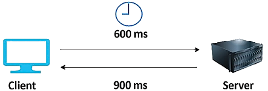
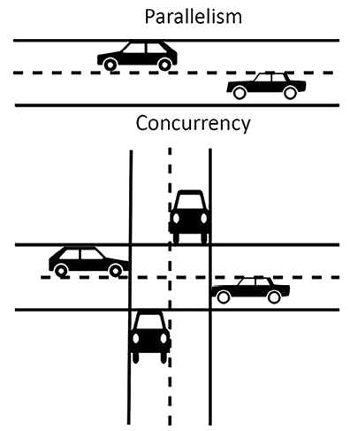
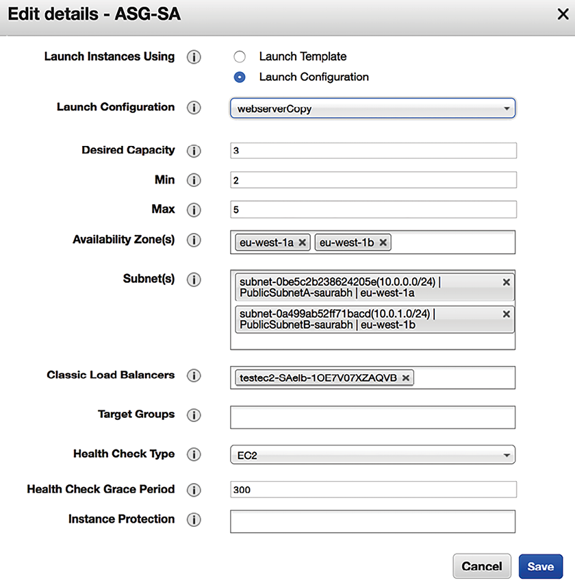

# Performance Considerations

Experiments show that every second of application load delay causes a significant loss in an organization’s revenue. Therefore, an application’s performance is one of the most critical attributes of solution design that can impact the growth of your product’s adoption.

In the previous chapter, we discussed various solution architecture design patterns that can be used to solve a complex business problem. In this chapter, we will explore some best practices to optimize the performance of your application that need to be done at every layer and with every architecture component. You will learn how to choose the right technology for the various layers of your architecture to continuously improve your application’s performance. We will focus on the following topics in this chapter:

- Design principles for high-performance architecture
- Technology selection for performance optimization
- Performance considerations for mobile applications
- Performance testing
- Managing performance monitoring

By the end of the chapter, you will understand important attributes of performance improvement, such as latency, throughput, and concurrency. You will be able to make better decisions regarding your choice of technology, which will help you improve performance at the various layers of architecture, such as compute, storage, database, and networking.

# Design principles for high-performance architecture

Architectural performance efficiency focuses on using application infrastructure and resources to meet increasing demand and technological evolution. Performance efficiency guides architects to create systems that not only meet current needs but are also agile enough to scale and evolve, ensuring that performance remains robust and responsive as user expectations and technological landscapes shift. Let’s examine some vital design principles for your workload performance optimization.

## Reducing latency

Latency can significantly affect your product adoption because users are looking for the fastest applications. It doesn’t matter where your users are located; you need to provide an efficient and reliable service for your product to grow. Latency is a measure of the time taken for a packet of data to get from one designated point to another. In simpler terms, it’s the delay or lag you experience between initiating an action and seeing the response on your device or system. This delay can be influenced by various factors, including the physical distance between the client and server, the speed of the transmission medium (such as fiber-optic cables or wireless signals), and how busy the network is.

For example, consider you’re browsing a website. When you click a link or press a button, a request is sent from your device to the website’s server. This server could be located in the same city as you, or it might be halfway around the world. The time it takes for your request to travel to the server, for the server to process that request, and then to send back a response, is what we call latency. You may not achieve zero latency, but the goal should be for the response time to be within the users’ tolerance limit.

As shown in the following diagram, imagine a scenario where it takes 600 **milliseconds** (**ms**) for a message to travel from your device to the server (this could be because of the physical distance the data needs to travel or because the data packets are being routed through multiple intermediary devices, such as routers and switches). If the server takes another 900 ms to process the request and send back a response, the total latency experienced would be 1.5 seconds (1,500 ms). During this time, you might notice a delay in the web page loading.

Figure 6.1: Request-response latency in a client-server model

Now, any application needs to access the internet to have a diverse set of global users around the world as consumers. These users expect consistency in performance, regardless of their geographical location. It is sometimes challenging because moving data over the network from one part of the world to another takes time.

Various factors, such as the **network transmission medium**, **router hops**, and **propagation,** can cause network latency. Enterprises commonly use a fiber-optic line to set up connectivity between their corporate network and the cloud, which helps to prevent inconsistency. Organizations can also utilize a **content distribution network** (**CDN**) to store heavy image and video data near user locations to reduce network latency and improve performance. With edge locations, it is easier to deploy workloads close to the user base.

In addition to the problems caused by the network, latency can occur in various architecture components. Your compute server can have latency issues at the infrastructure level due to memory and processor problems, where the data transfer between the CPU and RAM is _slow_. The disk can have latency due to slow read and write processes. Latency in a **hard disk drive** (**HDD**) depends on the time it takes to select a disk memory sector and for that sector to position itself under the head of the disk for reading and writing. The disk memory sector is the physical location of data in the memory disk. In an HDD, data is distributed in memory sectors during write operations. Since the disk is continuously rotating, data can be written randomly. During read operations, the head needs to wait for the rotation to bring it to the appropriate disk memory sector.

At the database level, latency can be caused by slow data reads and writes due to hardware bottlenecks or slow query processing. Reducing the database load by distributing the data with partitioning and sharding can reduce latency.

Low latency means _higher throughput_, as latency and throughput are directly related, so let’s learn more about throughput.

## Improving throughput

Network throughput refers to the amount of data that is successfully transferred over a network in a given period of time. This measure is crucial for understanding how well a network performs under specific conditions and loads. Throughput can be influenced by various factors, including the network’s capacity (bandwidth), the quality of the connection, and the protocols used for data transfer. Bandwidth determines the maximum amount of data that can be transferred over the network.

Throughput and latency have a direct relationship. Low latency means high throughput because more data can be transferred in less time. To understand this better, let’s use the analogy of a country’s transportation infrastructure.

Let’s say that highways with lanes are network pipelines and cars are data packets. Suppose a highway has 16 lanes between 2 cities. Not all vehicles can reach their destination at the desired time; they may get delayed because of traffic congestion, lanes closing, or accidents. Here, latency determines how fast a car can travel from one city to another, while throughput tells us how many cars can reach their destinations. Using full bandwidth is challenging for a network because of errors and traffic congestion.

Network throughput is measured by the amount of data sent over the network in bits per second (bps). Network bandwidth is the maximum size of the network’s pipeline that can be processed. The following diagram illustrates the amount of data transferred between the client and the server:

Figure 6.2: Throughput in a network

In addition to the network, throughput is applicable at the disk level. Disk throughput is a crucial metric that describes how fast data can be read from or written to a storage device. It’s measured in terms of **megabytes per second** (**MB/s**) and is influenced by two main factors: the **Input/Output Operations Per Second** (**IOPS**) and the size of each I/O operation (average I/O size).

The formula to calculate disk throughput is:

Here’s a breakdown of the formula:

- **Average I/O Size** is the average size of each read or write operation, measured in bytes. This can vary depending on the workload; for instance, database operations might have smaller I/O sizes compared to streaming large video files.
- **IOPS** (Input/Output Operations Per Second) measures how many read or write operations the storage can handle in one second. A high IOPS value indicates a fast storage system capable of handling a lot of operations in parallel.
- **Throughput in MB/s** provides a measure of the actual data transfer rate of the storage device. It combines the IOPS and the average I/O size to reflect how much data can be moved in and out of the storage system per second.

To convert the result into MB/s, we divide the product of average I/O size and IOPS by 1,024\*1,024 (since there are 1,024 bytes in a kilobyte and 1,024 kilobytes in a megabyte).

Given a disk IOPS of 20,000 and an I/O size of 4 KB (which is 4 \* 1,024 bytes = 4,096 bytes), you can calculate the throughput as follows:

1.  First, convert the I/O size from bytes to megabytes:
    - 
2.  Then, multiply by the IOPS to get the throughput in MB/s:
    - Throughput = I/O size in MB × IOPS
    - Throughput = 0.00390625 MB × 20,000
    - Throughput = 78.125 MB/s

So, with a disk IOPS of 20,000 and an I/O size of 4 KB, the throughput is approximately 78.125 MB/s. This calculation shows the total amount of data that can be read from or written to the disk per second under these conditions.

At the operating system level, throughput is determined by the amount of data transferred between the CPU and RAM per second. At the database level, throughput is determined by the number of transactions a database can process per second. At the application level, your code needs to handle transactions that can be processed every second by managing the application memory with the help of garbage collection handling and efficient use of the memory cache.

When you look at latency, throughput, and bandwidth, there is another factor called concurrency, which applies to the various architecture components and helps improve application performance. Let’s learn more about concurrency.

## Handling concurrency

Concurrency plays a vital role in designing scalable and efficient applications. It allows an application to perform multiple tasks simultaneously, making better use of system resources and improving overall application performance. By implementing concurrency, developers can ensure that their applications can handle multiple operations at the same time without waiting for one task to complete before starting another. This is particularly important in web applications that serve thousands of users and in data processing tasks that need to handle large volumes of data efficiently. Implementing concurrency can lead to significant improvements in response times and throughput, enhancing the user experience and the application’s ability to scale.

Parallelism is another crucial concept in software design, complementing concurrency by executing multiple operations simultaneously across different processors or cores. While concurrency involves dealing with many tasks at once (for example, multitasking on a single-core CPU, where tasks are switched rapidly to give the appearance of simultaneous execution), parallelism takes this a step further by truly performing multiple operations at the same time via multi-core processors or distributed systems. This approach significantly speeds up processing times for compute-intensive tasks by dividing the work into small chunks that can be processed in parallel. Applications that process large datasets, complex calculations, or tasks that can be divided into independent units benefit greatly from parallelism, achieving higher throughput and efficiency.

As illustrated in the following diagram, concurrency is like a traffic light signal that controls where traffic flows between all four lanes. As there is a single thread along which you should pass all traffic, processing in other lanes must stop while traffic in one lane is in the _clearing process_. In the case of parallelism, there is a parallel lane available, and all cars can run in parallel without interrupting each other, as shown in the following diagram:

Figure 6.3: Concurrency versus parallelism

A database is always the central point of architectural design. Concurrency plays an essential role in data handling, as the database should have the ability to respond to multiple requests simultaneously. Database concurrency is more complicated as one user might be trying to read a record while another user is updating it simultaneously. The database should only allow data to be viewed when it is fully saved. Ensure the data is completely committed before another user tries to update it.

Caching can improve performance significantly; let’s learn about some different cache types in architecture.

## Applying caching

In _Chapter 4_, _Solution Architecture Design Patterns_, you learned how to apply caching at various levels of architecture in the _Cache-based architecture_ section. Caching helps to improve application performance significantly. Although you have learned about the different design patterns to apply to the cache by adding an external caching engine and technology such as a **content delivery network** (**CDN**), it’s essential to understand that almost every application component and infrastructure has a cache mechanism. Utilizing the caching mechanism at each layer can help reduce latency and improve the application’s performance.

The CPU has its hardware cache at the server level, which reduces the latency when accessing data from the main memory. The CPU cache includes the instruction and data cache; the data cache stores copies of frequently used data. The cache is also used at the disk level, but it is managed by operating system software (known as the **page cache**); however, the CPU cache is entirely managed by hardware. The disk cache originates from secondary storage, such as the HDD or **solid-state drive** (**SSD**). Frequently used data is stored in an unused portion of the main memory (that is, the RAM as the page cache, which results in quicker access to content).

Often, databases have a cache mechanism that saves the results from the database in order to respond more quickly. They have an internal cache that gets data ready in the cache based on your usage patterns. They also have a query cache that saves data in the main server memory (RAM) if you make a query more than once. The query cache gets cleared in case any data changes inside the table. If the server runs out of memory, the oldest query result gets deleted to make space.

You have a DNS cache at the network level that stores the web domain name and corresponding IP address locally on the server. If you revisit the same website domain name, DNS caching allows a quick DNS lookup. The operating system manages the DNS cache and contains all recent website visits. You learned about client-side cache mechanisms such as the **browser cache** and caching engines such as **Memcached** and **Redis** in _Chapter 4_, _Solution Architecture Design Patterns_.

In this section on design principles for high-performance architecture, you learned about the original design factors, such as latency, throughput, concurrency, and caching, that need to be addressed in order to optimize architecture performance. Each component of the architecture (whether it is a network at the server level or an application at the database level) has a certain degree of latency and a concurrency issue that needs to be handled.

You should design your application for the desired performance because improving performance comes at a cost. The specifics of performance optimization may differ from application to application. The solution architecture needs to direct the effort accordingly—for example, a stock-trading application cannot tolerate even sub-millisecond latency. On the other hand, an e-commerce website can live with a couple of seconds’ latency. To overcome performance challenges, let’s learn about selecting technology for various architecture levels.

# Technology selection for performance optimization

In _Chapter 4_ and _Chapter 5_, you learned about various design patterns, including microservice, event-driven, cached-based, and stateless patterns. An organization may choose a combination of these design patterns depending on their solution’s design needs. You can have multiple approaches to architecture design, depending on your workload. Once you have finalized your strategy and start to implement your solution, the next step is to optimize your application. To optimize your application, you must collect data by performing load testing and defining benchmarking as per your application’s performance requirements.

Performance optimization is a continuous improvement process in which you need to be cognizant of optimal resource utilization from the beginning of solution design until after the application’s launch. You need to choose the right resources as per the workload or tune the application and infrastructure configuration. For example, you might select a NoSQL database to store your application’s session state and store transactions in a relational database.

For analytics and reporting purposes, you can offload your production database by loading data from the application database into data warehousing solutions and creating reports from there.

In the case of servers, you can choose a virtual machine or containers. You can take an entirely serverless approach to build and deploy your application code. Regardless of your approach and application workload, you need to choose the primary resource type: compute, storage, database, or network. Let’s look in more detail at selecting these resource types for performance optimization.

## Making a computational choice

In this section, you will see the use of the term _compute_ instead of _server_, as software deployments are not limited to servers nowadays. A public cloud provider such as AWS has serverless offerings, where you don’t need a server to run your application. One of the most popular FaaS offerings is AWS Lambda. Like AWS Lambda, other popular public cloud providers provide solutions in the FaaS space—for example, Microsoft Azure has Azure Functions, and GCP has Google Cloud Functions.

However, organizations still make the default choice to go for servers with virtual machines. Containers are also becoming popular as the need for automation and resource utilization has increased. Containers are becoming the preferred choice, especially in the area of microservice application deployment.

The optimal choice of computing—whether you want to choose server instances, containers, or go serverless—depends upon your application’s use case. Let’s look at the various computing choices.

The following table provides a snapshot of the differences between CPUs, **Graphics Processing Units** (**GPUs**), **Field Programmable Gate Arrays** (**FPGAs**), and **Application-Specific Integrated Circuits** (**ASICs**), focusing on their primary uses, ease of programming, core structures, cost implications, and their suitability for parallel processing, among other features. Let’s first define each of these terms:

- **CPU**: The primary processor within a computer that performs most of the data processing operations, often referred to as the “brain” of the computer
- **GPU**: A specialized electronic circuit designed to rapidly manipulate and alter memory to accelerate the creation of images in a frame buffer intended for output to a display
- **FPGA**: An integrated circuit designed to be configured by a customer or a designer after manufacturing – hence “field-programmable”
- **ASIC**: A chip customized for a particular use, rather than intended for general-purpose use

You might use one or more of these processing unit choices as your workload varies.

| Feature                     | CPU                                   | GPU                                                       | FPGA                                              | ASIC                                                     |
| --------------------------- | ------------------------------------- | --------------------------------------------------------- | ------------------------------------------------- | -------------------------------------------------------- |
| **Primary Use**             | General-purpose applications          | Graphics processing, large data use cases                 | Programmable hardware for specific tasks          | Custom integrated circuits for specific applications     |
| **Programming Ease**        | Easy                                  | Requires knowledge of specific libraries (e.g., CUDA)     | Complex, requires hardware programming            | N/A (hardware is custom-designed)                        |
| **Multitasking**            | Yes                                   | Limited by design focus on parallelism                    | Yes, with reconfiguration                         | No, single-purpose                                       |
| **Versatility**             | High                                  | Moderate                                                  | Moderate, reconfigurable for tasks                | Low, application-specific                                |
| **Performance Measurement** | GHz (billions of cycles per second)   | TFLOP (trillions of floating-point operations per second) | Not typically measured in Flops                   | Optimized for power consumption and performance          |
| **Core Structure**          | Few large cores                       | Thousands of small cores                                  | Logic elements that can be reconfigured           | N/A (custom-designed)                                    |
| **Parallel Processing**     | Limited                               | High, with **Massively Parallel Processing** (**MPP**)    | Accommodates MPP, configurable as CPU             | Optimized for specific applications                      |
| **Cost**                    | Low                                   | Higher than CPUs                                          | Higher than CPUs and GPUs, requires customization | Highest, due to custom design and long development cycle |
| **Power Consumption**       | Moderate                              | High                                                      | Low                                               | Optimized for the application                            |
| **Flexibility**             | Versatile for a range of applications | Specific to compute-intensive applications                | Reconfigurable but requires development           | Fixed, requires redesign for changes                     |
| **Development Cycle**       | Short                                 | Short to moderate                                         | Long, due to the need for customization           | Longest, hardware-level redesign needed                  |

Table 6.1: Comparison of the various processor types

The preceding table compares the types of processing. The ASIC is the most efficient but has a long development cycle to implement. ASICs provide the most optimal performance but have the least flexibility to reutilize, while CPUs are very flexible and can fit many use cases.

Today, the CPU has become a commodity and is used everywhere for general-purpose devices to keep costs low. The GPU has become famous for compute-intensive applications, and the FPGA has become the first choice where more customized performance is required. These processing choices are available from public cloud providers, such as AWS.

In this section, you learned about the most popular computing choices.

You may also hear about other types of processors, such as the **accelerated processing unit** (**APU**). The APU combines the CPU, GPU, and **digital signal processor** (**DSP**), which is optimized to analyze analog signals and requires high-speed real-time data processing.

Let’s learn more about other popular compute-type containers that are rapidly gaining popularity because of their ability to optimize the use of resources within the virtual machine.

### Working with containers

In _Chapter 4_, _Solution Architecture Design Patterns_, you learned about the benefits of container deployment in the section titled _Deploying an application with a container_. The use of containers is becoming the norm for deploying complex microservice applications because of the ease of automation and resource utilization efficiency. There are various platforms available for container deployment.

Because of their popularity and platform-independent capabilities, containers have become the first choice for building cloud-agnostic platforms. You can deploy containers in your on-premises data center and manage them through your cloud. Also, you can take a relocation approach and move a container from on-premises to the cloud without having to make any changes.

You can build a multi-cloud platform with a container, and now, each major public cloud vendor provides tools for managing a container environment spread over multiple platforms. For example, AWS provides **Elastic Container Service** (**ECS**) **Anywhere**, enabling you to run and manage container workloads on customer-managed infrastructure easily. Similarly, GCP provides **Google Anthos**, which gives you container management across on-premises and other cloud platforms. Let’s learn about some of the most popular choices in the container area, their differences, and how they work together.

#### Docker

Docker is one of the most in-demand technologies. It allows you to package an application and its related dependencies together as a container and deploy it to any operating system platform. Docker provides platform-independent capabilities to a software application, making the overall software development, testing, and deployment process simple and accessible.

Docker containers help you to build a more complex multilayer application. For example, you need to run the application server, database, and message queue together. In that case, you can run them side by side using different Docker images and establish communication between them. Each of these layers may have modified library versions, and Docker allows them to run on the same computing machine without conflicts.

Docker container images are portable from one system to another over a local network or across the internet using Docker Hub. You can manage and distribute your container using a Docker Hub container repository. Suppose you make changes in the Docker image that cause environmental issues. In that case, it’s easy to revert to the working version of the container image, making overall troubleshooting easier.

When using Docker, the development team builds an application and packages it with the required dependencies into a container image. This application image is run in a container on the Docker host. Just as you manage code in a code repository such as GitHub, in the same way, a Docker image should be stored in a registry. Docker Hub is a public registry, and other public cloud vendors provide their own registries, such as **AWS** **Elastic Container Registry** (**ECR**) and **Azure Container Registry**. In addition, you can have a private registry on-premises for your Docker images.

Public cloud providers like AWS provide container management platforms, such as **Amazon ECS**. Container management manages Docker containers on top of the cloud virtual machine, Amazon EC2. AWS also provides a serverless option of container deployment using Amazon Fargate, where you can deploy containers without provisioning virtual machines.

Complex enterprise applications are built based on microservices that may span multiple containers. Managing various Docker containers as a part of one application can be complicated. Kubernetes helps solve the multi-container environment’s challenges; let’s learn more about Kubernetes.

#### Kubernetes

Kubernetes excels in managing and orchestrating multiple containers in production settings, functioning as a comprehensive container orchestration system. It supports hosting Docker containers on either physical servers or virtual machine nodes, which are commonly referred to as worker nodes. Kubernetes efficiently coordinates operations across a cluster of these nodes, automating tasks such as deployment, scaling, and the management of containerized applications, thus ensuring smooth and reliable application performance across the infrastructure.

Kubernetes makes your application self-healing by replacing unresponsive containers in the case of any application error. It also provides horizontal scaling capabilities and a blue-green deployment ability to prevent downtime. Kubernetes distributes incoming user traffic load between the containers and manages the storage shared by various containers.

The following diagram shows that Kubernetes and Docker work well together to orchestrate your software application. Kubernetes handles network communication between worker nodes and Docker containers:

Figure 6.4: Docker and Kubernetes

Docker works as an individual piece of the application, and Kubernetes takes care of the orchestration to make sure all these pieces work together as designed. It’s easy to automate overall application deployment and scaling with Kubernetes. In Docker, containers are hosted in nodes, and each Docker container in a single node shares the same IP space. In Docker, you must manage the connections between containers by handling any IP conflict. Kubernetes solves this problem by having a primary instance that keeps track of all nodes hosting Pods.

Kubernetes’s primary node assigns an IP address and hosts a key-value store for container configuration and a **kubelet** to manage the containers. The kubelet is the primary “node agent” that runs on each node and ensures that the containers defined in the Pods are started and continue running. Docker containers are grouped into **Pods** that share the same IP address. This entire setup is called a **Kubernetes cluster**.

Kubernetes is complex to maintain. Cloud providers supply their own management tools for it. For example, AWS provides Amazon **Elastic Kubernetes Service** (**EKS**) to simplify the management of the Kubernetes cluster. OpenShift is another Kubernetes distribution managed by Red Hat and is offered as a **Platform as a Service** (**PaaS**). Similarly, Microsoft Azure provides **Azure Kubernetes Service** (**AKS**), and GCP provides **Google Kubernetes Engine** (**GKE**), offering a simple way to deploy, scale, and manage Kubernetes automatically.

Overall, containers add a layer of virtualization to the whole application infrastructure. While they are helpful in resource utilization, choose a bare-metal physical machine for your application deployment if it requires ultra-low latency.

### Going serverless

In recent years, serverless computing has become possible because of the popularity of public cloud solutions from cloud providers such as Amazon, Google, and Microsoft. Serverless computing allows developers to focus on their code and application development without worrying about underlying provisioning, configuring, and scaling infrastructure. Serverless solutions abstract server management and infrastructure decisions from developers and let them focus on their area of expertise and the business problem they are trying to solve. Serverless computing brings the relatively new **Function as a Service** (**FaaS**) concept.

FaaS offerings are available from AWS Lambda, Microsoft Azure Functions, and Google Cloud Functions. For example, you can write your code in the cloud editor, and AWS Lambda handles the computing infrastructure underneath to run and scale your function. You can design event-based architecture or RESTful microservices by adding an API endpoint using Amazon API Gateway and AWS Lambda functions. Amazon API Gateway is a maintained cloud system that adds RESTful APIs and WebSocket APIs as frontends for the Lambda functions and enables real-time communication between applications. You can further break down your microservice into small tasks that can be scaled automatically and independently.

In addition to focusing on your code, you never have to pay for idle resources with the FaaS model. Rather than scaling your entire service, you can scale the required functions independently with built-in availability and fault tolerance. However, this could be daunting if you have thousands of features to orchestrate, and predicting the auto-scaling cost can be tricky. It is perfect for scheduling jobs, processing web requests, and queuing messages.

In this section, you have learned about the various computing choices you can make for performance optimization. We looked at server instances, containers, and serverless options. You need to select the right computing services for your application’s requirements. No rule forces you to choose a particular type of computing; it is all about your organization’s choice of technology, the pace of innovation, and the nature of the software application.

However, you can generally stick to a virtual or bare-metal machine for a monolithic application, and for complex microservices, you can choose containers. For simple task scheduling or events-based applications, serverless functions are an obvious choice. Many organizations have built complex applications entirely on serverless computing, which helped them reduce costs and achieve high availability without managing any infrastructure.

Let’s learn about another important aspect of your infrastructure and how it can help you to optimize performance.

## Making a storage choice

Storage plays a pivotal role in the performance of any software application, and the concept of **data affinity** is crucial when discussing storage for an application. Data affinity refers to the strategic placement of data in proximity to the application consuming it, with the aim of reducing latency, improving performance, and ensuring efficient data retrieval.

In a multi-cloud or hybrid cloud environment, the notion that all storage must be in immediate proximity to the application server doesn’t always hold true. Modern distributed systems are designed to allow data to reside in multiple locations, whether on-premises or on different cloud providers, while still maintaining acceptable levels of latency and performance. This flexibility is crucial for organizations that use various cloud services or for those with data residency requirements mandating certain data to remain within specific geographical or jurisdictional boundaries.

However, deciding where to store data—whether close to the application service or in a different location—requires careful consideration of several factors:

- **Latency requirements**: The acceptable delay between a request and a response can significantly influence where data should be stored. Applications requiring real-time access to data might necessitate storage solutions with minimal latency, often implying close physical or network proximity.
- **Data sovereignty and compliance**: Legal and regulatory requirements might dictate where data can be stored and processed, which means the architecture will need to align with compliance mandates.
- **Cost considerations**: Storing and accessing data across different locations or clouds can incur additional costs. It’s essential to balance performance needs with budget constraints, especially when considering data egress fees in cloud environments.
- **Bandwidth and throughput**: The available network bandwidth and throughput between the application server and the data storage location can affect performance. High bandwidth and throughput can mitigate some latency issues, allowing for more flexible data storage options.
- **Data access patterns**: Understanding how your application accesses data (e.g., frequently accessed vs. rarely accessed data) can help you choose the right storage location. Frequently accessed data might benefit from being closer to the application to speed up access times.
- **Disaster recovery and availability**: Data resilience strategies might require data to be replicated across different geographical locations to ensure availability in case of failures.

In multi-cloud strategies, implementing caching, data replication, or edge computing solutions can help maintain performance standards by keeping a synchronized copy of critical data close to the application, regardless of the primary data storage location. These approaches allow applications to access data with minimal latency, even if the primary data source is geographically distant.

Selecting the appropriate storage depends on a thorough analysis of these factors. You should aim to strike a balance between operational requirements, performance, cost, and compliance. The ultimate goal is to architect a solution that meets the application’s performance needs while adhering to organizational, legal, and budgetary constraints.

You first need to decide whether your data will be stored in block, file, or object storage. These are storage formats that store and present data differently. Let’s look at this in more detail.

### Working with block storage and storage area network

Block storage divides data into blocks and stores them as chunks of data. Each block has a unique ID that allows the system to place data wherever it is most easily accessible, as blocks don’t store any metadata about files. Hence, a server-based operating system manages and uses these blocks in the hard drive. Whenever the system requests data, the storage system collects the blocks and gives the result back to the user.

Block storage deployed in a **storage area network** (**SAN**) stores data efficiently and reliably. It works well when a large amount of data needs to be stored and accessed frequently—for example, database deployment, email servers, application deployment, and virtual machines.

SAN storage is sophisticated and supports _complex, mission-critical applications_. It is a high-performance storage system that communicates block-level data between the server and storage; however, SANs are expensive and should be used for large-scale enterprise applications where low latency is required.

To configure your block-based storage, you must choose between an SSD and an HDD. HDDs are the legacy data storage system for servers and enterprise storage arrays. HDDs are cheap but slow and need a lot of power and cooling. SSDs use semiconductor chips and are faster than HDDs. They are much more costly; however, SSDs have become more affordable and popular as technology evolves because of their efficiency and lower power and cooling requirements.

### Working with file storage and network area storage

File storage has been around for a long time and is widely used. In file storage, data is stored as a single piece of information and is organized inside folders. When you need to access the data, you provide the file path and get the data files; however, a file path can grow complicated as files become nested under multiple folder hierarchies.

Each record has limited metadata, including the filename, time of creation, and up-to-date timestamps. Consider the analogy of a library, where you store books on shelves and keep a log with the location of each book.

**Network area storage** (**NAS**) is a file storage system that is attached to the network and displays to the user where they can store and access their files. NAS also manages user privilege, file locking, and other security mechanisms that protect the data. NAS works well for file-sharing systems and local archives; however, there are better solutions for storing billions of files than NAS, given that it has limited metadata information and a complex folder hierarchy. To store billions of files, you need to use object storage. Let’s learn more about object storage and its benefits compared to file storage.

### Working with object storage and cloud data storage

Object storage bundles data with a unique identifier and metadata that is customizable. Object storage uses a flat address space, in contrast to the hierarchical addresses in file storage or addresses distributed over a chunk of blocks in block storage. A flat address space makes it easier to locate and retrieve data quickly, regardless of the data storage location. Object storage also helps the user to achieve unlimited scalability of storage.

Object storage metadata can have many details, such as object name, size, timestamp, and so on, and users can customize it to add more information than you get with tagging in file storage. A simple API call can access data, and it is very cost-effective to store. Object storage performs best for high-volume, unstructured data; however, objects cannot be modified but only replaced, making it not a good use case for a database.

Cloud data storage, such as **Amazon Simple Storage Service** (**S3**), provides unlimited scalable object data storage with high availability and durability. You can access data with a unique global identifier and metadata file prefix.

The following diagram shows all three storage systems in a nutshell:

Figure 6.5: Data storage systems

As shown in the preceding diagram, block storage stores data in blocks. Block storage is ideal for scenarios where a single instance requires exclusive access to the storage, such as databases or applications that demand high performance and fast access to data. File storage stores data in a hierarchical folder structure with little overhead latency. You should use a file storage system when your data needs to be accessed by multiple instances simultaneously, much like how various people might need to access files in a shared room. Object storage stores data in buckets with a unique identifier for each object. It provides access over the web to reduce latency and increase throughput. You should use object storage to store and access static content, such as images and videos. You can store a high volume of data in object stores and perform big data processing and analysis.

**Direct-attached storage** (**DAS**) is another kind of data storage that is directly attached to the host server; however, it has very limited scalability and storage capacity.

The magnetic tape drive is another popular back up and archiving storage system. Because of its low cost and high availability, magnetic tape drives are used for archival purposes but have high latency, making them unsuitable for use in direct applications.

Often, you will need to increase throughput and data protection for a mission-critical application, such as a transactional database, where data is stored in SAN storage.

Select the storage solution that matches your access pattern to maximize performance. Various options are available with a cloud offering for your block, file, and object storage method. For example, the AWS public cloud provides **Amazon Elastic Block Store** (**EBS**) as SAN storage in the cloud and **Amazon Elastic File System** (**EFS**) as NAS storage in the cloud.

Amazon S3 is very popular for object storage. Similarly, Microsoft Azure provides Azure Disk Storage for SAN, Azure Files for NAS, and Azure Blob Storage for block storage.

### Storage for databases

Choosing the right type of storage for database performance is crucial to ensure optimal operation and efficiency. The selection often depends on the specific requirements of the database workload, such as IOPS, database size, the geographical location of data access, and the nature of the database operations (**Online Transaction Processing** (**OLTP**) versus **Online Analytical Processing** (**OLAP**)). Below is a comparative table that outlines the selection criteria and the suitability of various storage types for databases.
| **Storage Type** | **IOPS Capability** | **Suitable DB Size** | **Location Consideration** | **Best Use Case** | **Suitability** |
|--------------------|---------------------|----------------------|--------------------------------|--------------------------------------------|------------------------------------------------------------------------------------------------------|
| **SSD** | High | Small to large | Near to application server | OLTP and OLAP | Highly suitable for most databases, especially where high IOPS and low latency are critical. |
| **HDD** | Moderate to low | Large | Near to application server | Large OLAP | Suitable for large, infrequently accessed databases or where cost is a concern, but not recommended for high-performance OLTP systems. |
| **NAS** | Low to moderate | Small to medium | Flexible, can be off-premises | OLAP and backup | Suitable for databases with moderate performance requirements or for backup/archival purposes. |
| **SAN** | High | Large | Flexible, preferably nearby | OLTP and OLAP | Very suitable for large databases requiring high IOPS, throughput, and scalability. Can be on-premises or cloud-based. |
| **Cloud storage** | Variable | Variable | On-premises or cloud | OLTP and OLAP | Suitable for a wide range of database sizes and types. Performance and suitability depend on specific cloud service offerings. |

Table 6.2: Comparison of various storage types

In scenarios involving multi-cloud or hybrid setups, additional factors, such as data sovereignty and compliance (which dictate where data can be stored based on regulations), access patterns (whether the data is read or write-heavy), network latency, bandwidth, and cost considerations, also play a critical role. These aspects are especially crucial when databases are accessed over **Wide Area Networks** (**WANs**), where delays can impede performance.

Now that you have learned about the compute and storage choices required to achieve optimal performance, let’s look at the next critical component of application development: the database. Choosing the right database for the right need will improve your application’s performance and reduce overall application latency. Different types of databases are available, and choosing the correct one is critical.

## Making a database choice

Often, you will want to standardize a common platform and use a database for ease of management; however, consider using a different database solution as per your data requirements. Selecting the incorrect database solution can impact system latency and performance.

The database you choose will depend on your application’s availability, scalability, data structure, throughput, and durability requirements. There are multiple factors to consider when choosing which database to use. For example, the access pattern can significantly impact database technology selection, depending on the number of users and data access frequency. It would be best if you optimized your database based on the access pattern.

Databases generally have a configuration option for workload optimization. You should consider the configuration for memory, cache, storage optimization, and so on. You should also explore the operational aspects of database technologies regarding scalability, backup, recovery, and maintenance. Let’s look at the different database technologies that can be used to fulfill the database requirements of applications.

### Online transactional processing

Most of the traditional relational databases are considered to use **online transactional processing** (**OLTP**). The transactional database is the oldest and most popular method of storing and handling application data. Some examples of relational OLTP databases are Oracle, Microsoft SQL Server, MySQL, PostgreSQL, and Amazon RDS. The data access pattern for OLTP involves fetching a small dataset by looking up its ID. A database transaction means that either all related database updates were completed or none of them were.

The relational model allows the processing of complex business transactions in an application, such as banking, trading, and e-commerce. It enables you to aggregate data and create complex queries using multiple joins across tables.

While optimizing your relational database, you need to consider including the following optimizations:

- A database server that includes computing, memory, storage, and networking
- Operating system-level settings, such as the storage volume, volume management, and block size
- Database engine configuration and partition as required
- Database-related options, such as schema, index, and view

Scaling can be tricky for relational databases as they can scale vertically and hit the upper limit of system capacity. Utilize read replicas to distribute the read load. This allows you to offload the read queries from the primary database to one or more replicas, enhancing the system’s read capacity. Implement partitioning (sharding) for scaling writes. By dividing a larger database into smaller, more manageable pieces (partitions or shards), each with a subset of the data, you can distribute the write load across multiple servers or instances, improving write performance.

In the previous chapter, you learned how to scale a relational database in the _Database handling in the application architecture_ section.

OLTP databases are suitable for large and complex transactional applications; however, they need to scale better when a massive amount of data must be aggregated and queried. Also, with the internet boom, a lot of unstructured data is coming from everywhere, and relational databases cannot handle unstructured data efficiently out of the box. In this case, a nonrelational, or NoSQL database, comes to the rescue. Let’s learn more about how to handle them.

### Nonrelational databases

A lot of unstructured and semi-structured data is produced by applications such as social media programs, the **Internet of Things** (**IoT**), clickstream data, and logs, where you have very dynamic schemas. These data types may have different schemas for each set of records. Storing this data in a relational database could be a very tedious task. Everything has to be filed in a fixed schema, which can either cause lots of null values or data loss. Nonrelational databases, commonly referred to as NoSQL (“Not Only SQL” or “Non-SQL”), provide a flexible approach to data storage and management. Unlike traditional relational databases, which require a fixed schema before data can be stored, NoSQL databases allow you to store and manage data without predefined schema constraints. Records with a variable number of columns can be stored in the same table.

NoSQL databases can store a large amount of data and provide _low-access latency_. They are easy to scale by adding more nodes when required and can support horizontal scaling out of the box. They are an excellent choice for storing user session data and making your application stateless in order to achieve horizontal scaling without compromising user experience. You can develop a distributed application on top of the NoSQL database, which provides good latency and scaling, but query joining must be handled at the application layer because NoSQL databases don’t support complex queries such as joining tables and entities.

There are various NoSQL database options available, such as Cassandra, HBase, and MongoDB, which you can install in a cluster of virtual machines. AWS provides a managed NoSQL database called **Amazon DynamoDB**, which provides high-throughput sub-millisecond latency with unlimited scaling.

You can use OLTP for a relational database, but it has limited storage capacity. It needs to respond better to queries for large amounts of data and perform aggregations as required for data warehouses. Data warehousing needs are more analytical than transactional. **OLAP** fills the gaps in OLTP’s capabilities to query large datasets. Let’s learn more about OLAP.

### Online analytical processing

OLTP and NoSQL databases are helpful for application deployment but have limited capabilities for large-scale analysis. OLAP is primarily used in data warehouse technology. A query for a large volume of structured data for analytics purposes is better served by a data warehouse platform designed for faster access to structured data. Modern data warehouses leverage columnar storage formats and **Massively Parallel Processing** (**MPP**) architecture to significantly enhance data retrieval and analysis speeds. Unlike traditional row-oriented databases, where data is stored in rows, columnar storage organizes data in columns.

The columnar format means you don’t need to scan the entire table when you need to aggregate only one column for data—for example, if you want to determine your inventory sales in a given month. There may be hundreds of columns in the order table, but you only need to aggregate data from the purchase column. With a columnar format, you will only scan the purchase column, which reduces the amount of data scanned compared to the row format and increases the query performance.

With MPP, you store data in a distributed manner between child nodes and submit a query to the leader nodes. Based on your partition key, the leader node will distribute queries to the child nodes. Each node then picks up part of a query to perform parallel processing. The leader node then collects the subquery result from each child node and returns your aggregated result. This parallel processing helps you to execute the query faster and process a large amount of data quickly.

You can use this kind of processing by installing software such as IBM Netezza or Microsoft SQL Server on a virtual machine, or you can go for a more cloud-native solution, such as Snowflake. AWS, as a public cloud, provides the petabyte-scale data warehousing solution Amazon Redshift, which uses the columnar format and MPP. You will learn more about data processing and analytics in _Chapter 12_, _Data Engineering for Solution Architecture_.

You need to store and search a large amount of data, especially when you want to find a specific error in your logs or build a document search engine. For this kind of capability, your application needs to create a data search functionality. Let’s learn about data search functionality.

### Building a data search functionality

Often, you need to search a large volume of data to solve issues quickly or get business insights. Searching your applications’ data will help you access and analyze detailed information from different views. To search for data with low latency and high throughput, you need search engines.

Elasticsearch is one of the most popular search engine platforms; it is built on top of the **Apache Lucene** library. Apache Lucene is a free and open-source software library that is the foundation of many popular search engines. The **ELK** (short for **Elasticsearch**, **Logstash**, **and Kibana**) Stack is easy to use to discover large-scale data and index it for searching automatically. Because of its properties, multiple tools have been developed around Elasticsearch for visualization and analysis. For example, **Logstash** works with Elasticsearch to collect, transform, and analyze a large amount of an application’s log data. **Kibana** has an in-built connector with Elasticsearch that provides a simple solution for creating dashboards and analyzing indexed data. Elasticsearch can be deployed in virtual machines and scaled horizontally to increase capacity by adding new nodes to the cluster. The AWS public cloud provides the managed **Amazon OpenSearch Service**, making it cost-effective and simple to scale and manage the Elasticsearch cluster in the cloud.

In this section, you learned about the various database technologies and where they are used. Your applications can use a combination of database technologies for their different components to achieve optimal performance. For complex transactions, you need to use a relational OLTP database, and to store and process unstructured or semi-structured data, you need to use a nonrelational NoSQL database. You should use a NoSQL database when very low latency is required over multiple geographical regions and when you need to handle complex queries at the application layer, such as in a gaming application. If you need to perform large-scale analytics on structured data, use a data warehouse OLAP database.

Let’s look at another critical component of your architecture: **Networking**. Networking is the backbone of the entire application and establishes communication between the servers and the outside world. Let’s learn about networking as it relates to application performance.

## Improving network performance

In this era of fast internet availability in almost every corner of the world, applications are expected to have a global user reach. Any delay in the system’s response time depends upon the request load and the distance of the end-user from the server. If the system is not able to respond to user requests promptly, it can have a ripple effect by continuing to engage all the system’s resources and pile up a considerable request backlog, which will degrade the overall system performance.

To reduce latency, you should simulate the user’s location and environment to identify any gaps. Using your findings, you should design the server’s physical location and caching mechanism to reduce network latency; however, the network solution choice for an application depends upon the networking speed, throughput, and latency requirements. An application to handle a global user base needs fast connectivity with its customers, and location plays an important role. Edge locations provided by the CDN help to localize the rich content and reduce overall latency.

In _Chapter 4_, _Solution Architecture Design Patterns_, you learned how to use a CDN to put data near your user’s location in the section titled _Cache-based architecture_. There are various CDN solutions available with an extensive network of edge locations. You can use a CDN if your application is static-content-heavy, for example, if you need to deliver a large amount of image and video content to your end-user. Some of the more popular CDN solutions are Akamai, Cloudflare, and Amazon CloudFront (provided by the AWS cloud).

### Using edge computing

Edge computing is a distributed computing paradigm that brings computation and data storage closer to the location where it is needed to improve response times and save bandwidth. These are the mini data centers providing IT infrastructure near to the location at which they are used. Edge computing has emerged as a game-changing strategy for optimizing software application performance, mainly when latency, bandwidth, and real-time data processing are critical. You can leverage edge computing to boost your application’s performance, which has a globally distributed user base.

Consider a scenario where a renowned global social media website such as Facebook, X, or TikTok experiences a surge in user activity due to a live event, such as a major sports game or a celebrity announcement. In the traditional model, centralized servers may need help to handle the massive influx of requests, resulting in slower load times and potential disruptions. This is where **Content Delivery Networks** (**CDNs**) come into play, with industry giants such as Akamai, Cloudflare, Imperva, and Amazon CloudFront leading the way.

Akamai, one of the pioneers in the CDN space, boasts a vast network of edge servers strategically located in numerous countries and cities worldwide. Akamai’s edge servers in Tokyo spring into action when a user from, say, Tokyo, Japan, accesses their global social media site during a high-traffic event. These servers cache and deliver frequently accessed content, such as images, videos, and static files, from a location much closer to the user than the centralized data centers. As a result, the user experiences lightning-fast load times, reduced latency, and smooth content delivery.

Moreover, Akamai’s edge servers also provide advanced security features, such as **Distributed Denial of Service** (**DDoS**) protection and **Web Application Firewall** (**WAF**) capabilities, ensuring that the social media website remains resilient against cyberattacks and unauthorized access. Amazon CloudFront, tightly integrated with **Amazon Web Services** (**AWS**), also offers a robust edge computing solution for businesses of all sizes.

Beyond social media, edge computing is transforming various industries. In autonomous vehicles, for example, edge devices process data from sensors in real time to make split-second decisions, ensuring safety on the road. In the IoT realm, edge computing enables smart devices to analyze data locally, reducing latency and conserving bandwidth. For instance, a smart thermostat can adjust temperature settings based on local sensor data without the need for constant communication with centralized servers.

In healthcare, edge computing is utilized for remote patient monitoring. Wearable devices equipped with edge processing capabilities can analyze health data in real time and send alerts to healthcare providers or patients themselves if anomalies occur, allowing for timely interventions.

By bringing computation closer to data sources and end-users, edge computing enhances performance, responsiveness, and scalability, making it an important technology for improving application performance.

Let’s look at some DNS routing strategies to achieve low latency if your application is deployed globally.

### Defining a DNS routing strategy

You may deploy your application in multiple geographical regions to have a global reach. When it comes to user request routing, you need to route user requests to the nearest and fastest available server for a quick response from your application. The DNS router provides the mapping between the domain names and the IP addresses. It ensures that the requests are served by the correct server when the user types in the domain name—for example, when you type [amazon.com](http://amazon.com) in your browser to do some shopping, your request is always routed to the Amazon application server DNS service.

AWS provides a DNS service called **Amazon Route 53**, where you can define a different kind of routing policy as per your application’s needs. Amazon Route 53 provides DNS services to simplify domain management. The following are the most common routing policies:

- **Simple routing policy**: As the name suggests, this is the most straightforward routing policy and doesn’t involve any complications. It is helpful to route traffic to a single resource—for example, a web server that is used to deliver information to a specific website.
- **Failover routing policy**: This routing policy requires you to achieve high availability by configuring active-passive failover. If your application goes down in one region, all the traffic can automatically be routed to another region.
- **Geolocation routing policy**: If the user belongs to a particular location, you can use a geolocation policy. A geolocation routing policy routes traffic to a specific region.
- **Geoproximity routing policy**: This is like a geolocation policy, but you can shift traffic to nearby locations when needed.
- **Latency routing policy**: If your application runs in multiple regions, you can use a latency policy to serve traffic from the region where the lowest latency can be achieved.
- **Weighted routing policy**: A weighted routing policy is used for A/B testing, where you want to send a certain amount of traffic to one region and increase this traffic as your trial proves more and more successful.

Additionally, Amazon Route 53 can detect anomalies in the source and volume of DNS queries and prioritize requests from users that are known to be _reliable_. It also protects your application from a DDoS attack.

Once traffic passes through the DNS server, in most cases, the next stop will be a load balancer, which will distribute traffic among a cluster of servers. Let’s learn some more about load balancers.

### Applying a load balancer

Load balancers distribute network traffic across servers to improve concurrency, reliability, and application latency. Load balancers can be _physical_ or _virtual_. It would be best to choose a load balancer that suits your application’s needs. Commonly, two types of load balancers can be utilized by an application:

- **Layer 4 or network load balancer**: Layer 4 load balancing routes packets based on information in the packet header—for example, source/destination IP addresses and ports. Layer 4 load balancing does not inspect a packet’s contents, making it less compute-intensive than Layer 7 or application load balancing, and, therefore, faster. A network load balancer can handle millions of requests per second.
- **Layer 7 or application load balancer**: Layer 7 load balancing inspects and routes packets based on the full contents of the packet. Layer 7 is used in conjunction with HTTP requests. The materials that inform routing decisions are factors such as HTTP headers, URI path, and content type. It allows for more robust routing rules but requires more compute time to route packets. An application load balancer can route requests to containers in your cluster based on their distinctive port number.

Depending on the environment, you can choose hardware-based load balancers, such as an F5 load balancer or a Cisco load balancer. You can also select a software-based load balancer, such as **Nginx**.

AWS provides a managed virtual load balancer called Amazon **Elastic Load Balancing** (**ELB**). ELB can be applied at Layer 7 as an application load balancer and Layer 4 as a network load balancer.

A load balancer is an excellent way of securing your application, making it highly available by sending requests to healthy instances. It works together with auto-scaling to add or remove instances as required. Let’s look at auto-scaling and learn how it helps to improve overall performance and ensure the high availability of your application.

### Applying auto-scaling

You learned about auto-scaling in _Chapter 2_, _Principles of Solution Architecture Design_. You learned about predictive and reactive auto-scaling in the _Design for scale_ section. The concept of auto-scaling became popular with the agility provided by cloud computing platforms. Cloud infrastructure allows you to quickly scale up or scale down your server fleet based on user or resource demand.

With a public cloud platform such as AWS, you can apply auto-scaling at every layer of your architecture. You can scale the web server fleet based on the number of requests in the presentation layer, and scale the application layer based on the server’s memory and CPU utilization. You can also perform scheduled scaling if you know the traffic pattern when the server load increases. At the database level, auto-scaling is available for relational databases such as Amazon Aurora Serverless and Microsoft Azure SQL Database. A NoSQL database such as Amazon DynamoDB can be auto-scaled based on throughput capacity.

When auto-scaling, you need to define the number of desired server instances. You need to determine the maximum and minimum server capacity as per your application’s scaling needs. The following screenshot illustrates the auto-scaling configuration in the AWS cloud as an example:

Figure 6.6: Auto-scaling configuration

In the preceding auto-scaling configuration setting, if three web server instances are running, it can scale up to five instances if the CPU utilization of servers goes above 50% and scale down to two instances if the CPU utilization goes below 20%. If an instance becomes unhealthy in a standard scenario, the total number of instances will fall below the desired capacity. In this case, the load balancer will monitor the instance’s health and use auto-scaling to provide new instances. The load balancer monitors instance health and triggers auto-scaling to provision new instances as required.

Auto-scaling is a good feature to have, but make sure you set up the appropriate configuration to limit the cost of a change in CPU usage. Auto-scaling can significantly increase costs in the case of unforeseen traffic due to a **distributed denial of service** (**DDoS**) attack. It will help to protect your system from such events. You will learn more about this in _Chapter 7_, _Security Considerations_.

In this section, you have learned about various networking components that can help to improve application performance. You can optimize your application network traffic according to your user location and application demand. Since mobile is becoming the go-to user interface for many applications, you should do proactive performance monitoring of mobile apps to improve the customer experience. Let’s learn more about performance considerations for mobile apps next.

# Performance considerations for mobile applications

Mobile applications have now become an essential part of many digital platforms. Nowadays, users often first check out the mobile application before visiting the desktop website. Moreover, a significant portion of user traffic is driven via mobile applications, making it crucial to ensure these apps are highly performant. As mobile apps increasingly become a staple of our digital interactions, it’s paramount to guarantee their performance, security, and usability. Let’s delve into some best practices for building efficient mobile applications.

## Optimization of load times

In mobile applications, load times are a critical factor that can either augment user engagement or serve as a deterrent. Quick and efficient load times are indispensable, especially considering users often utilize applications on the go and require immediate responses. Some ways to enhance load times are to optimize image sizes, employ lazy loading for elements, and ensure that the initially visible content loads promptly.

## Efficient use of resources

Limited resources, such as CPU, memory, and battery, constrain mobile devices. To ensure an app runs smoothly without draining the device’s resources, developers need to prioritize minimizing the usage of these resources. Strategies include using efficient algorithms, reducing memory leaks by properly managing memory allocation, and optimizing queries to fetch only the necessary data.

## Responsive user interface (UI)

The UI should be intuitive and highly responsive, ensuring that user inputs yield immediate feedback. To achieve this, any computationally intensive process, such as data retrieval or image processing, should be executed in the background, preventing it from interfering with UI interactions. Using asynchronous programming and multithreading can keep the UI agile and responsive.

## Network efficiency

Considering the potential for unstable or slow network connections in mobile environments, an application should proficiently manage network requests. Implementing caching for data that does not change frequently, optimizing API calls, and gracefully handling network failures by providing appropriate user feedback can significantly enhance user experience and app performance.

## Battery consumption

An app that excessively drains the battery will quickly fall out of favor with users. You should be mindful of optimizing processes and managing background tasks to minimize power consumption. Ensuring that GPS, Bluetooth, and other power-intensive processes are used judiciously and turned off when not needed is crucial.

## Cross-platform compatibility

With a multitude of devices, operating systems, and screen sizes available, an app should maintain high performance across various platforms. Utilizing cross-platform development frameworks and thoroughly testing the app on diverse devices ensures a consistent and optimal user experience.

## User experience (UX) design

Ensuring the UX is seamless and intuitive is central to any application’s success. This involves crafting a user-friendly design, ensuring ease of navigation, and maintaining a logical flow throughout the app, ensuring users can perform their desired actions with minimal effort.

## Effective data management

Managing data efficiently by utilizing local storage for frequently used data and ensuring smooth synchronization between local and remote data is essential for providing users with up-to-date information without compromising performance.

## Testing and quality assurance

Implementing rigorous testing protocols, which include performance testing under various conditions and on diverse devices, ensures that the app can maintain optimal performance even under strain. Employing automated testing and continuous integration can assist in identifying and rectifying issues promptly during the development phase.

Constructing a high-performance mobile application involves a harmonious blend of user-centric design and technical proficiency. By meticulously optimizing every facet of an application, from the interface and load times to data management and security features, developers can ensure it performs optimally in varied conditions and across numerous devices. While you are implementing various strategies to improve application performance, it’s always recommended to test it as well. Let’s learn more about performance testing.

# Performance testing

Performance testing is a critical subset of software testing that aims to ensure that a software application will perform well under expected workloads. It revolves around gauging an application’s stability, speed, responsiveness, and scalability under various circumstances. Rather than identifying bugs or defects, performance testing determines how an application will react to different demand levels. Given the fact that today’s users expect seamless and swift functionality, performance testing has never been more crucial.

The significance of a well-performing application can’t be overstated in today’s digital age. Primarily, it directly affects user satisfaction. Users are accustomed to swift and seamless interactions on their devices; thus, a sluggish or frequently crashing app can be a major turn-off. Nobody wants to waste time on an application that doesn’t deliver promptly, especially during moments of high demand or peak usage. The frustration from such experiences can lead users to abandon the app entirely, favoring competitors that provide a smoother experience.

Consider a popular e-commerce website gearing up for a Black Friday sale. With thousands, if not millions, expected to visit the site, it’s imperative to ensure the system won’t crash, transactions will process swiftly, and the user experience will remain smooth, even with the surge of users. Performance testing, in this case, is not just helpful but essential.

## Types of performance testing

There are several types of performance testing, each designed to address specific aspects of an application’s performance. Here’s a brief overview of the main types of performance testing:

- **Load testing**: This type of testing is about understanding how a system behaves under expected, real-world loads. It’s the equivalent of testing a bridge by gradually adding weight until it carries the anticipated maximum number of vehicles. For example, if an e-commerce website expects 10,000 visitors during a holiday sale, load testing will simulate these 10,000 users to ensure the site works smoothly under such conditions.
- **Stress testing**: Imagine cramming too many people into an elevator, beyond its capacity, to see if it still operates or breaks down; that’s the essence of stress testing. It’s designed to push systems to their breaking point, ensuring that even in worst-case scenarios, failures don’t lead to catastrophic results. For instance, a banking app might be stress tested to see how it behaves if a million users tried to log in simultaneously, far exceeding its regular traffic.
- **Endurance testing**: The question endurance testing answers is “Can the system run efficiently when subjected to an expected load for an extended period of time?” For example, a streaming service might be endurance tested to ensure it can stream movies and shows to users continuously over a weekend without any degradation in quality or speed.
- **Spike testing**: In the real world, user traffic can be unpredictable. Spike testing is like observing how a power grid reacts when everyone suddenly turns on their air conditioners simultaneously during a heatwave. An example might be testing a news website during a major event, like the Olympics, where sudden influxes of users might want to check results or updates.
- **Volume testing**: Here, the emphasis is on data. It’s analogous to checking how well a library can organize and lend millions of books. For a database-driven application, volume testing might involve seeing how the system behaves when the database has billions of entries. A practical example is a global email service testing its system’s responsiveness when searching through vast numbers of stored emails.

Many performance testing tools are available, such as **JMeter**, **LoadRunner**, and **WebLoad**. These tools simulate various scenarios and loads to test the application’s performance.

Performance testing plays a crucial role in the software development lifecycle. Ensuring an application’s robustness, reliability, and speed are vital for its success in the real world.

Performance testing and performance monitoring are two critical aspects of ensuring an application’s efficiency and reliability, but they serve different purposes throughout the development and deployment lifecycle. Performance testing is about identifying potential performance issues before they affect users, while performance monitoring is about keeping an eye on the system’s performance and quickly reacting to any issues that occur after deployment. Let’s learn more about performance monitoring in the next section.

# Managing performance monitoring

Performance monitoring is essential when you are trying to keep an eye on performance issues and proactively reduce end-user impact.

You should define your performance baseline and raise the alarm to the team in the case of a threshold breach—for example, an application’s mobile app load time should not be more than three seconds. Your alarm should be able to trigger an automated action to handle poorly performing components—for example, adding more nodes to a web application cluster to reduce the request load.

There are multiple monitoring tools that measure application performance and overall infrastructure. You can use a third-party tool like Splunk or the AWS-provided Amazon CloudWatch to monitor any application.

Monitoring solutions can be categorized into **active monitoring** and **passive monitoring** solutions:

- With active monitoring, you must simulate user activity and identify performance gaps up front. Application data and workload situations constantly change, requiring continuous proactive monitoring. Active monitoring works alongside passive monitoring as you run the known possible scenarios to replicate the user experience. You should run active monitoring across all dev, test, and prod environments to catch any issue before reaching the user.
- Passive monitoring tries to identify unknown patterns in real time. For a web-based application, passive monitoring needs to collect essential metrics from the browser that can cause performance issues. You can gather metrics from users regarding their geolocation, browser types, and device types to understand your application’s user experience and geographic performance. Monitoring is all about data, including the ingestion, processing, and visualization of lots of data.

Performance always comes at a cost, and, as a solution architect, you need to think about the trade-offs to take the right approach. For example, an organization’s internal applications, such as the timesheet and HR programs, may not need as high performance as external products, such as e-commerce applications. An application that deals with trading (for example) needs very high performance, which requires more investment. You should balance durability, consistency, cost, and performance to suit your application’s needs. You will continue to learn about the various monitoring methods and tools in upcoming chapters and dive deep into monitoring and alerts in _Chapter 8_, _Architectural Reliability Considerations_.

Tracking and improving performance are complex tasks where you need to collect lots of data and analyze patterns. An access pattern helps you to make the right choice for performance optimization. Applying continuous active monitoring in combination with passive monitoring helps you to maintain consistent performance for your application.

# Summary

In this chapter, you learned about the various architecture design principles that impact the performance of applications. You learned about latency and throughput at different layers of architecture and how they relate to each other.

For highly performant applications, you need to have low latency and high throughput at every architecture layer. Concurrency helps to process a large number of requests. You also learned the differences between parallelism and concurrency and gained insights into how caching can help improve overall application performance.

Then, you learned about choosing your technology and its working models, which can help achieve your desired application performance. While looking at the compute options, you learned about the various processor types and the differences between them to help you make the right choice when selecting server instances. You learned about containers and how they can help you to utilize resources efficiently and, at the same time, help to improve performance. You also learned how Docker and Kubernetes work well with each other and fit into your architecture.

In the section on choosing storage, you learned about different kinds of storage, such as block, file, and object storage, and the differences between them. You also learned about the available storage choices in on-premises and cloud environments.

In the section on choosing a database, you learned about the various database types, including relational databases, nonrelational databases and data warehouses. You also learned about the different request routing strategies that can help you improve network latency for your globally distributed users, and you learned how load balancers and auto-scaling can help you manage many user requests without compromising application performance. As mobile apps are critical for any application, you learned about performance considerations for mobile applications. You also learned about the importance of performance testing and monitoring your application for performance.

In the next chapter, you will learn how to secure your application by applying authentication and authorization, which will help you to secure your data both at rest and in transit and ensure your application is protected from threats and attacks. You will also learn about compliance requirements and how to satisfy them when designing your application. You will learn about security audits, alerts, monitoring, and automation.
