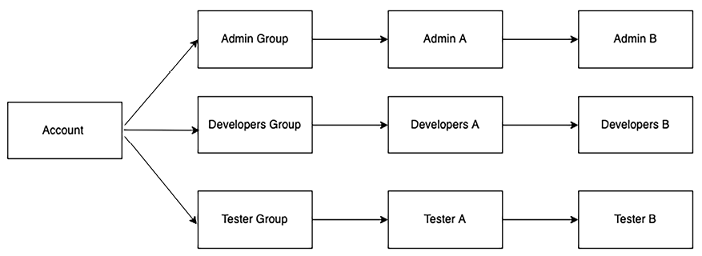
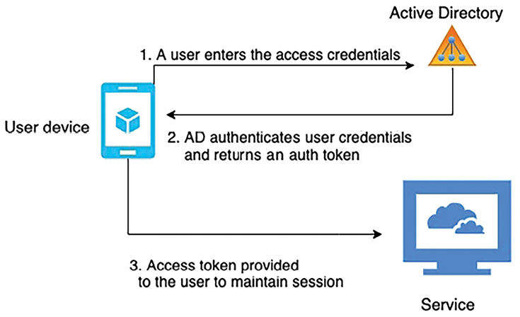
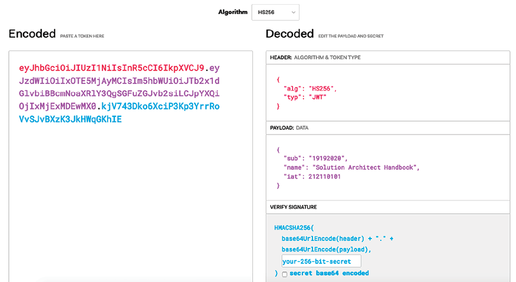
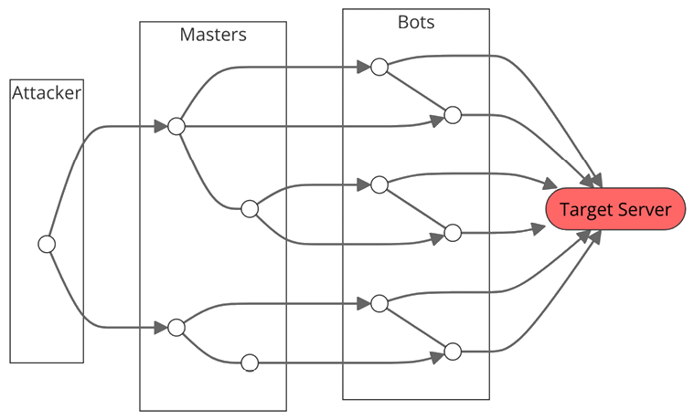
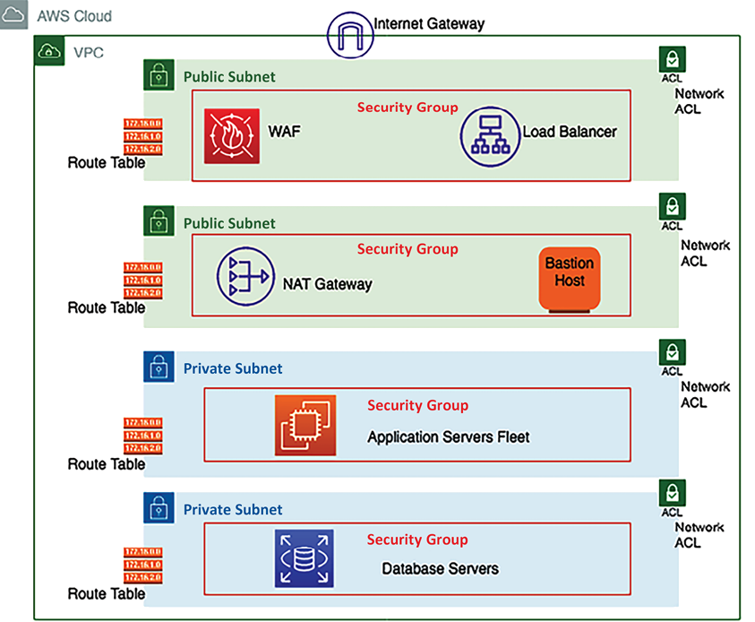
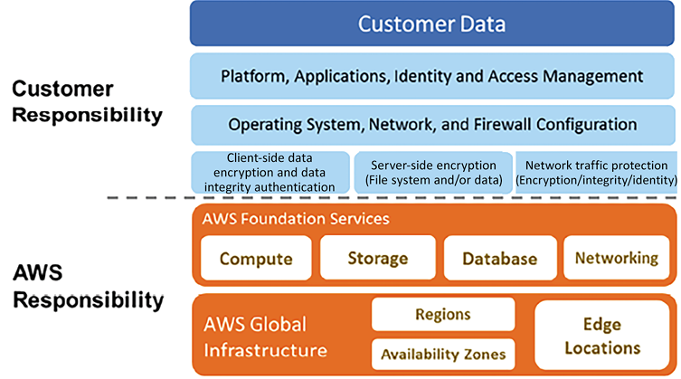

# Security Considerations

Security is always at the center of architectural design. Many enterprises suffer financial losses due to security
breaches when their customer data gets leaked. Organizations can, therefore, not only lose customer trust but also the
entire business.

There are many industry-standard compliances and regulations out there to make sure your application is _secure_ and
protects customer-sensitive data. In the previous chapter, you learned about various aspects of performance improvement
and technology choices for your architecture. In this chapter, you will gain an understanding of best practices to
secure your application and make sure it is compliant with industry-standard regulations.

Security in architecture doesn’t only mean protecting the edge of your IT workload. It also includes making sure that
different parts of your application infrastructure are safe from each other. For example, on a server, you can use a
firewall to control which data can enter or leave and where it can go. This way, if one part has a security issue, it
won’t affect the rest. You need to do the same for all parts, such as your data and programs. Security needs to be
applied to every layer and every component of the architecture. This chapter also discusses different ways to keep your
cloud system safe.

You will learn about the following security practices in this chapter:

- Design principles for architectural security
- Selecting technology for architectural security
- Security and compliance certifications
- The cloud’s shared security responsibility model
- Security threat modeling

# Design principles for architectural security

Security is all about the ability to protect your system and information while delivering business value for your
customers. Lack of good security can have a serious impact on your customers and business.

You need to conduct an in-depth security risk assessment and plan a mitigation strategy for the continuous operation of
your business. The following sections talk about standard design principles that will help you strengthen your
architectural security.

## Implementing authentication and authorization control

The purpose of **authentication** is to determine whether a user can access the system with the provided credentials,
while **authorization** determines what a user can do once they are inside the system.

You should create a centralized system to manage your users’ authentication and authorization. A centralized user
management system helps you to keep track of users’ activity so you can deactivate them if they are no longer a part of
the system or are no longer using it appropriately. You can define standard rules to onboard a new user and remove
access for inactive users. A centralized system eliminates reliance on long-term credentials and allows you to configure
other security methods, such as password rotation.

For authorization, you should start with the **principle of least privilege**—this means users should not have any
access to begin with and are assigned only the required access types according to their job role. Creating an access
group according to job role helps to manage the authorization policy in one place and apply authorization restrictions
across a large number of users. For example, you can restrict the development team to have full access to the
development environment and read-only access to the production environment. If any new developer joins, they should be
added to this dev group, where all authorization policies are managed centrally.

Enabling **single sign-on** (**SSO**) with a centralized user repository helps to reduce the hassle of remembering
multiple passwords for your user base and eliminates any risk of password leakage. To further enhance security,
integrating **multi-factor authentication** (**MFA**) with SSO adds an additional layer of protection. MFA requires
users to provide two or more verification factors to gain access to a resource, such as a security token, a fingerprint,
or facial recognition.

Large organizations use centralized user management tools such as **Active Directory** (**AD**) for employee
authentication and authorization to provide access to internal enterprise applications such as the HR system, the
expense system, and the timesheet application.

In a customer-facing application, such as e-commerce and social media websites, you can use an OpenID authentication
system to maintain a centralized system. OpenID is an open standard authentication protocol. You will learn about
large-scale user management tools in more detail in the _OAuth and OpenID Connect_ section of this chapter.

## Applying security everywhere

Often, organizations primarily focus on ensuring the physical safety of their data center and protecting the outer
networking layer from any attack. Instead of just focusing on a single outer layer, ensure that security is applied at
every application layer.

Apply the **defense-in-depth** (**DiD**) approach to layer security controls throughout an application; for example, a
web application needs to be secured from external internet traffic by protecting the **Enhanced Data rates for Global
Evolution** (**EDGE**) network and **Domain Name System** (**DNS**) routing. Apply security at the load balancer and
network layers to block malicious traffic.

Secure every application instance by allowing only required incoming and outgoing traffic in the web application and
database layer. Protect operating systems with antivirus software to safeguard against any malware attack. Apply both
proactive and reactive measures of protection by putting an **intrusion detection system** (**IDS**) and **intrusion
prevention system** (**IPS**) in front of your traffic flow and using a **web application firewall** (**WAF**) to
protect your application from various kinds of attacks. You will learn more details about the various security tools to
use in the _Selecting technology for architectural security_ section of this chapter.

## Reducing the blast radius

While applying security measures at every layer, you should keep your system isolated in a small pocket to reduce the
blast radius. If attackers get access to one part of the system, you should be able to limit a security breach to the
smallest possible area of the application. For example, in a web application, keep your load balancer in a separate
network from other layers of the architecture, as that will be internet-facing. Further more, apply network separation
at the web, application, and database layers. If an attack happens in one layer, you should prevent it from expanding to
other layers of the architecture.

The same rules are applied to your authorization system, giving the least privilege to users and providing only the
minimum required access. Implement MFA so that even if there’s a breach in user access, the attacker always needs a
second level of authentication to get into the system.

Provide minimal access to the system to ensure that you are not exposing the entire system, and provide temporary
credentials to make sure access is kept open for a short time. Take precautions when providing programmatic access by
putting a secure token in place with frequent key rotation.

## Monitoring and auditing everything all the time

You need a logging mechanism for every activity in your system, and you should conduct a regular audit. Audit
capabilities are often required from various industry-compliance regulations. Collect logs from every component,
including all transactions and each API call, to put centralized monitoring in place. It is a good practice to add a
level of security and access limitations to a centralized logging account so that no one can tamper with it.

Take a proactive approach and be ready to handle any incident before the user is affected. Alert capabilities with
centralized monitoring help you take quick action and mitigate any incident. Monitor all user activity and application
accounts to limit a security breach.

## Automating everything

Automation is essential for applying quick mitigation for any security-rule violation. You can use automation to revert
changes against desired configurations and alert the security team—for example, if someone added admin users to your
system and an open firewall to an unauthorized port or IP address. You can apply automation to remove such undesired
changes in the system.

Applying automation to security systems has become popular with the concept of DevSecOps. DevSecOps is about adding
security to every part of application development and operations. You will learn more about DevSecOps in _Chapter 11_,
_DevOps and Solution Architecture Framework_.

Create secure architectures and implement security controls that are defined and managed as code. You can
version-control your security as a code template and analyze changes as required. Automated security mechanisms as
software code help you scale security operations more rapidly and cost-effectively.

## Protecting data

Data is at the center of your architecture, and it is essential to secure and protect it. Most of the compliance
regulations in place are there to protect customer data and identity. Most attacks have the intention of stealing user
data.

You should categorize your data by its sensitivity level and protect it accordingly. For example, customer credit card
information should be the most sensitive data and should be handled with the utmost care. On the other hand, a
customer’s first name may not be that sensitive, while the card number is sensitive information.

Protecting data throughout its lifecycle is crucial for maintaining its confidentiality, integrity, and availability.
Data can exist in three states, and each state requires specific security measures to ensure comprehensive protection:

- **Data at rest**: This refers to data stored on physical media, whether on a server’s hard drive, a laptop, a USB
  stick, or cloud storage. One protection mechanism for data at rest is encryption, which ensures that even if the storage
  device falls into the wrong hands, the data remains inaccessible without the encryption key. Additionally, you need to
  have access controls and regular audits in place to ensure that only authorized users can access or modify the data.
- **Data in transit**: When data moves across a network—from a user’s computer to a server, between servers, or across
  the internet—it’s considered in transit. To protect data in transit, you can use encryption protocols such as
  **Transport Layer Security** (**TLS**). This ensures that even if the data is intercepted during transmission, it
  remains unreadable to the attacker.
- **Data in use**: This is often the most challenging state to protect because the data is being processed or used by
  applications. Encryption can protect data at rest and in transit, but once it’s loaded into memory and being used by an
  application, it’s in plaintext and potentially vulnerable. New technologies such as **trusted execution environments**
  (**TEEs**) and homomorphic encryption are emerging to secure data in use, allowing operations on encrypted data without
  needing to decrypt it first.

Create mechanisms and tools that minimize the need for direct access to data. Avoid manual data processing by applying
tool-based automation that eliminates human error, especially when handling sensitive data. Apply access restrictions to
the data wherever possible to reduce the risk of data loss or data modification.

Once you categorize data by sensitivity, you can use the appropriate encryption, tokenization, and access control to
protect the data. Data needs to be protected not only at rest but also in motion—when being transmitted over the
network—as well. You will learn about various mechanisms to protect data in the _Data security_ section of this chapter.

## Responding to security incidents

Keep yourself ready for any security events. Create an incident management process as per your organizational policy
requirements. Incident management can differ from one organization to another and from one application to another. For
example, if your application handles the **personally identifiable information** (**PII**) of your customers, you need
tighter security measures in your incident response. However, if the application is handling small amounts of sensitive
data, such as an inventory management application, then it will have a different approach.

Make sure to simulate the incident response to see how your security team would recover from a situation.

Your team should use automation tools to speed up detection, investigation, and response to any security event. You will
need to set up the alert, monitor, and audit mechanisms to do **root cause analysis** (**RCA**) to prevent such events
from occurring again.

In this section, you learned about the general security principles to apply in your architecture for application
security. In the next section, you will learn how to apply these principles using different tools and techniques.

# Selecting technology for architectural security

The previous section focused on the general application security rules to consider while designing architecture. Still,
the question is: _How do we apply these rules to make the application secure during implementation?_ There are various
tools and technologies available for each layer of your application to make it secure.

In this section, you will learn in detail about the multiple technology choices you have in the areas of user management
and the protection of the web layer, infrastructure, and data of your application. Let’s start with the first area, user
identity and access management.

## User identity and access management

User identity and access management are vital parts of information security. This is because it’s best to ensure that
only authenticated and authorized users can access your system resources in a defined manner.

User management could be a daunting task as your organization grows and your product is more widely adopted. User access
management should differentiate and manage access to an organization’s employees, vendors, and customers.

Enterprise or corporate users could be the organization’s employees, contractors, or vendors. They are specialist users
with special privileges to develop, test, and deploy the application. In addition to that, they probably require access
to other corporate systems to do their daily job—for example, an **Enterprise Resource System** (**ERP**), a payroll
system, an HR system, a timesheet application, and so on. As your organization grows, the number of users can grow from
hundreds to thousands.

The end users are the customers who use your applications and have enough access to explore and utilize the desired
feature of the application—for example, players of a gaming application, users of social media applications, or
customers of an e-commerce website. The number of these users could be from thousands to millions as the popularity of
your product or application grows. You need to take special care of security when exposing the application to
external-facing internet traffic to protect it from various threats.

Let’s talk about corporate user management first. You need to have a centralized repository to enforce security policies
such as strong password creation, password rotation, and MFA for better user management. MFA provides another means of
validating someone’s identity if a password may have already been compromised. Popular MFA providers include Google
Authenticator, Gemalto, YubiKey, RSA SecurID, Duo, and Microsoft Authenticator.

From a user-access perspective, **role-based authentication** (**RBA**) simplifies user management; you can create user
groups for the users’ roles and assign an appropriate access policy. As illustrated in the following diagram, you can
have three groups—admin, developer, and tester—with the corresponding access policy applied to each group. For example,
an admin can access any system, including production, while developer access is limited to the dev environment, and the
tester can only access the test environment:

Figure 7.1: User group organization

As shown in the preceding diagram, when new users join the team, they get assigned to the appropriate group for their
role. In this way, each user has a defined set of standard access. The user group can also update access in case a new
development environment is introduced and all developers need to have access to it.

SSO is a standard process that helps to reduce security lapses and automate the system. SSO provides users with a login
to the different corporate systems using a single user ID and password. **Federated Identity Management** (**FIM**)
allows users to access the system without a password with a pre-authenticated mechanism. Let’s look at some more
details.

### Federated identity management and single sign-on

**FIM** provides a way to connect the identity management system when user information is stored in a third-party
**identity provider** (**IdP**). With FIM, the user only provides authentication information to the IdP, which, in turn,
already has a trusted relationship with the service.

As illustrated in the following diagram, when a user logs in to access a service, the service provider gets credentials
from the IdP rather than getting them directly from the user:

Figure 7.2: FIM authentication flow

SSO allows the use of a single set of sign-on details with which the user can access multiple services. Here, the
service provider could target an environment to which you want to log in—for example, a **Customer Relationship
Management** (**CRM**) application or your cloud application. The IdP could be a corporate AD. Federation allows
authentication similar to an SSO but without a password, as the federation server knows users and allows them to access
information.

There are various ways to implement FIM and SSO. Let’s look at some of the popular **Identity and Access Management**
(**IAM**) options.

### Kerberos

Kerberos is an authentication protocol that allows two systems to identify each other securely and implements SSO. It
works on the client-server model and uses a ticket system for user identity.

Kerberos has a **Key Distribution Center** (**KDC**) that facilitates authentication between two systems. The KDC
consists of two logical parts—the **Authentication Server** (**AS**) and the **Ticket-Granting Server** (**TGS**).

Kerberos stores and maintains the secret keys of each client and server in the data store. It establishes a secure
session between two systems during their communication and identifies them with the stored secret key. The following
diagram illustrates the flow of Kerberos authentication:

Figure 7.3: Kerberos authentication

As shown in the preceding diagram, when you want to access a service, the following steps are involved:

2. When you want to access a service on your computer network, your computer (the client) asks a special server called
   the **Authentication Server** **AS** for a ticket.

- The AS checks if you’re in its database. If you are, it creates a **Ticket-Granting Ticket** (**TGT**) and a session
  key, then sends them back to your computer. You can unlock the session key with your password, but you can’t unlock the
  TGT because it’s locked with a key that only the **Ticket-Granting Server** has.
- Your computer takes this TGT and asks another server, the TGS, for a service ticket to access the service you want.
- The TGS checks the TGT and, if everything looks good, sends back a service ticket that your computer can use to prove
  to the service that you have permission to access it.
- Your computer shows this ticket to the service, and if the service agrees that the ticket is valid, you get access.

While Kerberos can be beneficial, it is an open-source protocol, and generally, large enterprises like to use more
managed software with robust support, such as AD. Let’s look at the working mechanism of one of the most popular user
management tools, Microsoft AD, which is based on the **Lightweight Directory Access Protocol** (**LDAP**).

### Microsoft Active Directory

**AD** is an identity service developed by Microsoft for users and machines. AD has a domain controller, also known as
**Active Directory Domain Services** (**AD DS**), which stores the user’s information, access credentials, and identity,
as well as system information.

The following diagram illustrates a simple flow of the authentication process:

Figure 7.4: AD authentication flow

As shown in the preceding diagram, the user login is managed by AD on the domain networks. Users first send the request
to the domain controller with their credentials and communicate with the **Active Directory Authentication Library**
(**ADAL**). The ADAL verifies the user credentials and sends back an access token with a continuous session for the
requested service.

**LDAP** is the standard protocol that handles the tree-like hierarchical structure of information stored in
directories. **Active Directory Lightweight Directory Services** (**AD LDS**) provides an LDAP interface to the
directory of users and systems. For file encryption and network traffic encryption, **Active Directory Certificate
Services** (**AD CS**) provides the key infrastructure functionality. **Active Directory Federation Services** (**AD
FS**) provides access mechanisms for external resources, such as web app logins for many users.

As many organizations have started using cloud services, let’s learn about the active directory service that AWS cloud
provides.

#### Amazon Web Services Directory Service

**Amazon Web Services** (**AWS**) Directory Service connects AWS resources in your account with an existing on-premises
user management tool such as AD. AWS Directory Service sets up a new user management directory in the AWS cloud. It
facilitates a secure connection to the on-premises directory. After establishing the connection, all users can access
cloud resources and on-premises applications with their existing credentials.

AWS AD Connector is another service that helps you connect the existing Microsoft AD to the AWS cloud; you don’t need a
specific directory synchronization tool. Admin users can manage AWS resources using AWS IAM.

AD Connector helps to enable MFA by integrating with your existing MFA infrastructure, such as YubiKey, a Gemalto token,
or an RSA token.

For a small user base (fewer than 5,000 users), AWS provides Simple AD, which is a managed directory powered by _Samba 4
Active Directory Compatible Server_. Simple AD has common features such as user account management, user group
management, SSO based on Kerberos, and user group policies.

Other directory services provided by major technology companies include Okta, Centrify, Ping Identity, and Oracle
**Identity Cloud Service** (**IDCS**).

### Security Assertion Markup Language

Earlier in this section, in the _Federated identity management and single sign-on_ section, you learned about IdPs and
service providers. To access a service, the user gets validated by the IdP, which, in turn, has a trusted relationship
with the service provider. **Security Assertion Markup Language** (**SAML**) can be used to establish a trusted
relationship between an IdP and a service provider through **Extensible Markup Language** (**XML**), which standardizes
communication between an IdP and a service provider.

A SAML assertion is an XML document that the IdP sends to the service provider with user authorization. The following
diagram illustrates the flow of the SAML assertion:

Figure 7.5: User authentication using SAML

As mentioned in the preceding diagram, the following steps are taken to implement user authentication using SAML:

1. A user sends a request to access the service—for example, the Salesforce CRM application—as a service provider.
2. The service provider (a CRM application) sends a SAML request with the user information to the SAML IdP.
3. The SAML IdP pops up the SSO login page, where users enter authentication information.
4. The user access credential goes to the user database, an identity store for validation. In this case, the user
   identity store is an _AD_.
5. The user identity store sends the user validation status to the SAML IdP, with whom the identity store has a trusted
   relationship.
6. The SAML IdP sends a SAML assertion to the service provider (a CRM application) with information about user
   verification.
7. After receiving the SAML response, the service provider allows application access to the user.

Sometimes, a service provider can act as an IdP as well. SAML is very popular for establishing a relationship between
any identity store and service provider. All modern identity store applications are SAML 2.0-compatible, which allows
them to communicate with each other seamlessly. SAML allows user identity to be federated and enables SSO for enterprise
users.

For large user bases such as social media and e-commerce websites, **OAuth** (short for **Open Authorization**) and
**OpenID** are more suitable than SAML. Let’s learn about OAuth and **OpenID Connect** (**OIDC**).

### OAuth

OAuth is an open standard authorization protocol that provides secure access delegation to an application. OAuth doesn’t
share password data but uses an authorization token to establish the identity between service providers and consumers.
Users of an application provide access to their information without giving login credentials.

While OAuth is mainly for authorization, many organizations have started adding their own mechanisms for authentication.

OIDC is a protocol that defines the authentication standard on top of the OAuth 2.0 authorization framework. While OAuth
2.0 provides a framework for authorization (granting access to resources), OIDC adds an additional layer to handle user
authentication. This means that OIDC not only helps applications know what resources a user can access but also verifies
the identity of the user accessing the service. It’s a way for clients to verify a user’s identity based on the
authentication performed by an authorization server, as well as to obtain basic profile information about the user in an
interoperable and REST-like manner.

Large technology companies such as Amazon, Facebook, Google, and X allow users to share information in their accounts
with third-party applications. For example, you can log in to a new photo app using your Facebook login and authorize
the new app to access only your Facebook photo information. The following diagram illustrates an OAuth access delegation
flow, where a user requests the LinkedIn app to get their profile photo from Facebook:

Figure 7.6: User access delegation with OAuth 2.0

As shown in the preceding diagram, the authentication flow follows these steps:

1. In this scenario, the user makes a request to the LinkedIn app to get your profile photo from Facebook.
2. The LinkedIn app requests authorization to access Facebook profile photos.
3. The authorization server (which is your Facebook account in this case) creates and displays a consent screen to the
   user.
4. The user provides consent to the request for the LinkedIn app to access only their Facebook profile photos.
5. After getting user approval, the Facebook authorization server sends an authorization code back to the requesting
   LinkedIn app.
6. The LinkedIn app then requests an access token from the authorization server (Facebook account) using the
   authorization code.
7. The authorization server identifies the LinkedIn app and checks the validity of the authentication code. If the
   access token is validated, the server issues an access token to the LinkedIn app.
8. The LinkedIn app can now access resources such as Facebook profile photos using the access token.

OAuth 2.0, which is faster than OAuth 1.0 and more comfortable to implement, is now most commonly used.

**JSON Web Token** (**JWT**) is a simple and accessible token format that can be used with OAuth and is popular with
OpenID; we look at this next.

### JWT

JWT is a compact and self-contained way for securely transmitting information between parties as a JSON object. This
information can be verified and trusted because it is digitally signed. JWTs can be signed using a secret or a
public/private key pair.

A JWT has a JSON structure that has information about expiration time, issuer, subject, and so on. It is more robust
than a **Simple Web Token** (**SWT**) and simpler than SAML 2.0. You can see a JWT in the following screenshot:

Figure 7.7: Sample JWT

The preceding screenshot depicts JWTs, which have three parts, each separated by a dot. The first part, the header,
tells us the token type—JWT—and the algorithm it uses for signing, such as HS256 or RSA. The second part, the payload,
holds claims, which are pieces of information about the user and other data. The last part is the signature, which makes
sure the token hasn’t been altered and confirms who sent the JWT.

JSON has a simpler structure than XML and is smaller, making JWT more compact than SAML. JWT is an excellent choice for
passing information into HTML and HTTP environments. Due to their small size, JWTs are an ideal choice for passing the
identity of authenticated users between services in a microservices architecture, or for providing access tokens that
allow users to access resources. They’re used in various authentication and authorization scenarios, particularly in web
and mobile applications.

In this section, you learned about the most common user management tools and services. However, there are various other
protocols and services available for user authentication and authorization. The implementation of the protocols
mentioned previously can be complicated, and there is a large amount of packaged software available that makes the job
easier.

Amazon Cognito is a user access management service provided by AWS that includes standard-based authorization such as
SAML 2.0, OIDC, and OAuth 2.0, along with an enterprise user directory that provides the ability to connect with AD.
Okta and Ping Identity provide enterprise user management and the ability to communicate with various service provider
tools in one place.

Once your application is exposed to the internet, there are always various kinds of attacks that can happen. Let’s learn
about some of the most common attacks and how to set up the first layer of defense for web-layer protection.

## Handling web security

As user demand is changing to require 24/7 availability of services, businesses are evolving to go into online mode, and
to do so, they are adopting web application models. Web applications also help a company to gain a global customer base.
Businesses such as online banking and e-commerce websites are always available, and they deal with sensitive customer
data, such as payment information and payer identity.

Now, web applications are central to any business, and these applications are exposed to the world. Web applications can
have vulnerabilities, exposing them to cyberattacks and data breaches. Let’s explore some common types of cyberattack
and how to mitigate them.

### Cyberattacks

Web applications are vulnerable to security breaches. Hackers orchestrate cyberattacks from different locations and by
various methods. Just as you lock and protect a physical building, in the same way, your web application needs to be
protected from illicit activity. Let’s explore some standard methods of attack that can cause security vulnerabilities
in your web application.

#### Denial of service and distributed denial of service attacks

A **Denial of Service** (**DoS**) attack attempts to make your website unreachable to your users. To achieve a
successful DoS attack, the attacker uses a variety of technologies that consume network and system resources, thus
interrupting access for legitimate users. The attacker uses multiple hosts to orchestrate the attack against a single
target.

A **Distributed Denial of Service** (**DDoS**) attack involves using many hijacked systems, often infected with malware,
to flood a single target system with requests. This overwhelms the target, causing service disruptions. The attacker
remotely controls the compromised systems to conduct the assault. As illustrated in the following diagram, a DDoS attack
happens when multiple systems exhaust the bandwidth of resources of a targeted system:

Figure 7.8: DDoS attack

The general concept of a DDoS attack is to leverage additional hosts to amplify the requests made to the target,
rendering them overprovisioned and unavailable. A DDoS attack is often the result of multiple compromised systems,
whereby a botnet puts a flood of traffic in the targeted system.

A botnet is a network of devices infected by and controlled through malware.

The most common DDoS attack happens at the application layer, using either a DNS flood or a **Secure Sockets Layer**
(**SSL**) negotiation attack. In DNS floods, attackers exhaust the resources of a DNS server with too many requests.
During SSL negotiations, attackers send a large amount of unintelligible data for computationally expensive SSL
decryption. The attacker can perform other SSL-based attacks on the server fleet and overburden it with unnecessary task
processing.

At the infrastructure layer, a typical DDoS attack happens in the following form:

- **User Datagram Protocol** (**UDP**) **reflection**: With UDP reflection, attackers spoof the target server’s IP
  address and make a request that returns amplified significant responses from a hacked reflector server.
- **SYN floods**: With SYN floods, attackers exhaust the target server’s **Transmission Control Protocol** (**TCP**)
  service by creating and abandoning high numbers of connections, blocking legitimate users from accessing the server.

Often, attackers try to get sensitive customer data, and for that purpose, they use a different kind of attack called
**SQL injection** (**SQLi**). Let’s learn more about it.

#### SQLi attacks

As the name suggests, in a SQLi attack, attackers inject malicious **Structure Query Language** (**SQL**) to get control
of a SQL database and fetch sensitive user data. The attacker uses SQLi to gain access to unauthorized information, take
control of an application, add new users, and so on.

Take an example of a loan-processing web application. You have `loanId` as a field that customers can use to get all
information related to their loan. If proper care is not taken, attackers can execute a query such as `SELECT * FROM
loans WHERE loanId = 117 or '1=1'` and get access to the entire customer database, as this query will always return the
true result.

The other common way to hack user data through script injection is **cross-site scripting** (**XSS**), where a hacker
impersonates a legitimate user. Let’s learn more about it.

#### XSS attacks

You have probably encountered phishing emails that have links impersonating a website known to you. Clicking on these
links may lead to compromised data through XSS. In an XSS attack, the attacker embeds their malicious code into a
legitimate website. This code then executes when an unsuspecting user visits the web page.

The attacker can introduce this code in various ways, such as embedding it directly into a URL string or by inserting a
snippet of JavaScript code onto the web page. When you load the web page, this client-side JavaScript code gets executed
and steals your browser cookies.

These cookies often contain sensitive information, such as the access token and authentication to your banking or
e-commerce websites. Using these stolen cookies, the hacker can enter your bank account, among other accounts, and take
your hard-earned money.

#### Cross-site request forgery attacks

A **cross-site request forgery** (**CSRF**) attack takes advantage of user identity by creating confusion and tricking
authenticated users into state-changing activities, for example, changing the password of a shopping website or
requesting a money transfer to your bank.

It is slightly different from an XSS attack as, with CSRF, the attacker tries to forge a request rather than insert a
code script. For example, the attacker can forge a request to transfer a certain amount of money from the user’s bank
and send that link in an email to the user. When users click on that link, the bank gets a request and transfers the
money to the attacker’s account. CSRF can be particularly harmful if attackers can get into an admin account.

#### Buffer overflow and memory corruption attacks

A software program writes data in a temporary memory area for fast processing, which is called a **buffer**. With a
buffer overflow attack, an attacker can overwrite a portion of the memory connected with the buffer, deliberately
causing a buffer overflow and accessing connected memory, where an application executable may be stored. The attacker
can replace the executable with the actual program and take control of the entire system. Looking at the overall
application, more security threats exist in the infrastructure layer, network layer, and data layer. Let’s explore some
standard ways to mitigate and prevent security risks at the web layer.

### Web security mitigation

Security needs to be applied to every layer of your application, and special attention is required for the web layer due
to its exposure to the world. For web protection, necessary steps include keeping up with the latest security patches,
following the best software development practices, and ensuring that proper authentication and authorization are carried
out.

Several methods exist to protect and secure web applications; let’s explore two common methods.

#### Web application firewalls

WAFs are firewalls that apply specific rules to HTTP and HTTPS traffic (that is, ports `80` and `443`). WAFs inspect
your web traffic and verify that it conforms to the norms of expected behavior. They provide an additional layer of
protection from web attacks.

WAF rate limiting is the ability to look at the amount or type of requests sent to your service and define a threshold
that caps how many requests are allowed per user, session, or IP address. Approved and unapproved lists enable you to
allow or block users explicitly.

AWS WAF is one example of a WAF that adds security to your web layer by creating and applying rules to filter web
traffic. These rules are based on conditions that include HTTP headers, user geolocation, malicious IP addresses, custom
**Uniform Resource Identifiers** (**URIs**), and so on. AWS WAF rules block common web exploits such as XSS and SQLi.
You can create a single set of rules for an environment that has various websites and web applications running and you
can reuse rules across applications instead of recreating them.

Overall, a WAF is a tool that applies a set of rules to HTTP traffic. It filters web requests based on data such as IP
addresses, HTTP headers, HTTP bodies, or URI strings. It can mitigate DDoS attacks by offloading illegitimate traffic.
Let’s learn more about DDoS mitigation.

#### DDoS mitigation

Resilient architecture can prevent or mitigate DDoS attacks. A fundamental principle in keeping your infrastructure
secure is reducing the potential number of targets an attacker can hit. In short, if an instance doesn’t need to be
public, then don’t make it public.

You can apply various strategies to minimize the attack surface area:

- Wherever possible, reduce the number of necessary internet entry points—for example, open incoming internet access to
  your load balancer, not web servers.
- Identify and eliminate any unnecessary entry points to the internet. For instance, you can set up file-share storage
  for vendors to upload data, but restrict the access to a limited group instead of making it accessible to the entire
  global internet traffic.
- Hide any required internet entry points from untrusted end users so that they cannot access them.
- Isolate the access point and apply a specific restrictions policy for end user traffic compared to application
  management traffic.
- Create a decoupled internet entry point to minimize the attack surface.

Your primary goal is to mitigate DDoS attacks at the edge location of the CDN. It’s more challenging and costly to
handle DDoS attacks if they get through to your application servers. The following diagram illustrates a DDoS mitigation
example for an AWS cloud workload:

Figure 7.9: DDoS WAF sandwich mitigation strategy

The preceding diagram illustrates a **WAF sandwich architecture**, where the WAF appliance is staged between two load
balancers to handle a DDoS attack.

Frequent DDoS attacks come from strategies such as SYN floods and UDP reflection, which Amazon CloudFront prevents by
only accepting well-formed connections before the attacking strategy can reach your application servers. CDNs such as
Amazon CloudFront help to tackle DDoS attacks by isolating them in a geographically isolated location and preventing the
traffic from affecting other locations. Network firewall security helps you to control incoming and outgoing traffic at
the individual server level.

As mentioned in the previous section, WAFs are used to protect web applications against exploit attacks such as XSS and
SQLi attacks. In addition to this, WAFs also help to detect and prevent DDoS attacks at the web application layer.

To handle a DDoS attack, you can apply either horizontal or vertical scaling. You can take advantage of scaling in the
following way:

1. First, select the right server size and configuration for your web application.
2. Second, use a load balancer to distribute traffic among the fleet of servers and add auto-scaling to add/remove
   servers as required.
3. Finally, use the CDN and DNS server, as they are built to handle traffic at scale.

Scaling for DDoS attacks is an excellent example of why it’s essential to set reasonable maximum counts for your
servers. A DDoS attack could scale your servers out to a number that would be extremely costly while still potentially
not being able to prevent the server from becoming unavailable. Having reasonable maximum limits for the expectations of
regular traffic spikes would prevent a DDoS attack from costing your company too much money.

In this section, you learned about various security risks and vulnerabilities at the web layer and some standard ways to
protect them. As security needs to be applied to every layer, let’s explore protecting the infrastructure layer in more
detail.

## Securing an application and its infrastructure

In the previous section, you learned about securing the web layer. As security needs to be applied at every layer of
your workload, let’s learn about securing the application and network layers of your architecture.

### Application and operating system hardening

It is impossible to eliminate vulnerabilities in your application entirely but you can limit system attacks by hardening
your application’s operating system, filesystem, and directory. Once attackers can get into your application, they can
get root access and orchestrate an attack on the entire infrastructure.

It is essential to limit attacks to the application level by restricting the directory by _hardening permission_. At the
process level, restrict memory and CPU utilization to prevent a DoS attack.

Set the right permission at the file, folder, and file partition levels. Avoid giving root privileges to the application
or its users. You should create a separate directory containing only the required access for each application so that
only the required user has application access. Only use common access for some applications.

Automate application restart by using process tools such as **DAEMON Tools** and **Supervisord** to prevent a manual
approach, whereby users need to log in to the server to start. For Linux operating systems, a utility such as
**systemd** or **System V init** scripts can start/stop the application.

### Software vulnerability mitigation and secure code

It is always recommended to apply the latest security patch provided by your operating system vendor. This helps to fill
any security holes in the system and protect your system from vulnerabilities where attackers can steal your security
certificate or run arbitrary code.

Keeping your system up to date with the latest security patches is very important. It is better to automate the process
of the most recent patch installation as soon as it becomes available. However, running a security patch may sometimes
break your working software, so it’s useful to set up a **Continuous Integration** **and** **Continuous Deployment**
(**CI/CD**) pipeline with automated testing and deployment. You will learn more about the CI/CD process in _Chapter 11_,
_DevOps and Solution Architecture Framework_.

The AWS cloud provides a system manager tool that allows you to apply security patches and monitor your server fleet in
the cloud. You can use a tool such as **auto-updates** or **unattended upgrades** to automate security patch
installation. When you opt for managed services from cloud providers, you essentially free yourself from the underlying
infrastructure’s operational burden. The cloud provider takes care of the setup, management, operation, and optimization
of the services. This includes regular maintenance tasks, such as patching, which is critical for security and
performance.

Make sure to integrate secure coding best practices into your software development process, as recommended by the **Open
Web Application Security Project** (**OWASP**), details about which can be found here:
[owasp.org/www-project-secure-coding-practices-quick-reference-guide/stable-en/01-introduction/05-introduction](http://owasp.org/www-project-secure-coding-practices-quick-reference-guide/stable-en/01-introduction/05-introduction).

### Network security

When it comes to protecting your infrastructure, securing the network must be your first consideration. The physical
security of your IT infrastructure in the data center must be taken care of by the data center providers. Let’s talk
about ensuring network security, which is your responsibility as an application owner.

Let’s take an example from a public cloud provider such as AWS to help you understand network security. You can apply
the same example to your on-premises or private cloud network infrastructure as well.

As illustrated in the following diagram, security should be applied at every layer, and trusted boundaries around each
layer with minimal access should be defined:

Figure 7.10: Network configuration for infrastructure security

In the preceding diagram, the load balancer is in a public subnet, which can accept internet traffic and distribute it
to the application server fleet. WAF filter traffic is based on set rules and protects your application from various
attacks, as you learned in the previous section. The application server fleet and database servers are in private
subnets, which means direct internet access is not available.

Let’s dive deep into the preceding architecture diagram and walk through each layer as follows:

- **Amazon Virtual Private Cloud** (**VPC**) provides a logically isolated network for your cloud infrastructure. It
  serves as your personalized network environment within the cloud, hosting various resources. Designed for enhanced
  control, it allows the segregation of different environments and resources. You can set up multiple VPCs within each AWS
  account or region. When setting up a VPC, you define its range of IP addresses using **Classless Inter-Domain Routing**
  (**CIDR**) notation. This notation is a concise way to represent a specific span of IP addresses. For instance, the CIDR
  block `10.0.0.0/16` encompasses all IP addresses from `10.0.0.0` to `10.0.255.255`. This range includes a total of
  65,535 IP addresses available for use.
- **Subnets** are parts of a network, divided using CIDR ranges, that establish secure boundaries between private and
  public resources. Instead of organizing subnets by application or function (such as the web, app, or data tiers), it’s
  more effective to arrange them based on internet access. This setup enables clear isolation at the subnet level,
  differentiating between public-facing and private internal resources.

In this setup, resources needing internet access, like public-facing load balancers, **network address translation**
(**NAT**) instances, and bastion hosts, are placed in a **public subnet**. Other resources, such as databases and
applications, reside in a private subnet. This creates distinct layers of separation between different resource tiers,
with application instances and data resources each allocated to their own private subnets. On AWS, most resources can be
hosted in **private subnets**, utilizing public subnets only when internet access is required. As a result, it’s
advisable to allocate a larger number of IP addresses to your private subnets than to your public subnets, which ensures
ample space for the majority of your resources that will reside in the private network. Subnets provide basic separation
between resources with **Network Access Control List** (**NACL**) rules, but security groups provide a more detailed
level of traffic management. This approach prevents overly complex infrastructure and the inefficient use of IP
addresses.

- A **routing table** consists of rules, known as routes, that dictate which application servers receive network
  traffic. For enhanced security, it’s recommended to use a distinct custom route table for each subnet.
- **Security groups** function as virtual firewalls that manage both inbound and outbound traffic for one or more
  instances. These instances can be specified within a given CIDR block range or can be part of another designated
  security group. Following the principle of least privilege, security groups are set to deny all incoming traffic by
  default. You can then establish specific rules to filter traffic based on protocols such as TCP, UDP, and the **Internet
  Control Message Protocol** (**ICMP**). This setup ensures that only the necessary and authorized traffic can access your
  instances, enhancing the security of your network.
- An **NACL** is an optional layer of security in the form of a virtual firewall, controlling both inbound and outbound
  traffic at the subnet level within your network. Unlike a security group, which is stateful, an NACL operates in a
  stateless manner. This statelessness means that each request, whether incoming or outgoing, is treated independently.
  For example, even if an incoming request is allowed through, the corresponding outbound response must also be explicitly
  permitted by the rules set in the NACL. This requires you to define both inbound and outbound traffic rules meticulously
  to ensure proper traffic flow and security at the subnet level.
- Internet traffic is routed through an **internet gateway** (**IGW**) to make a subnet public. By default, internet
  accessibility is denied for internet traffic in your environment. An IGW needs to be attached to your VPC, and the
  subnet’s route table should define the rules of the IGW.
- A private subnet blocks all incoming and outgoing internet traffic but servers may need outgoing internet traffic for
  software and security patch installation. A **NAT gateway** enables instances in a private subnet to initiate outbound
  traffic to the internet and protects resources from incoming internet traffic.
- A **bastion host** acts like a jump server, which allows access to other resources in the private subnet. A bastion
  host needs to be hardened with tighter security so that only appropriate people can access it. To log in to the server,
  always use _public-key cryptography_ for authentication rather than a regular user ID and password method.

Organizations often gather, store, and review network flow logs for multiple reasons. These include diagnosing
connectivity problems, resolving security issues, and evaluating network access policies. You need to monitor traffic
flow to your system VPC, which includes recording incoming and outgoing traffic information from your network. **VPC
flow logs** enable you to capture that information, along with accepted and rejected traffic information for the
designated resource, which helps you to understand traffic patterns better.

Flow logs serve as a security tool for monitoring traffic to instances. You can set up alarms for specific traffic types
and create metrics to spot trends and patterns. Flow logs can be established for a VPC, a subnet, or a network
interface. When created for a subnet or VPC, they monitor each network interface within that subnet or VPC. For example,
consider a scenario where you have a VPC with multiple subnets. By setting up a flow log for the VPC, you can monitor
all incoming and outgoing traffic across its network interfaces. If you notice unusual traffic patterns, like an
unexpected spike in data requests from an unknown IP address, you can configure an alarm to alert you. This proactive
monitoring helps to identify potential security threats or network inefficiencies early on.

As you can see, there are multiple layers of security available at the network layer that can help protect your
infrastructure. Keeping resources in their isolated subnet helps to reduce the blast radius. If an attacker can
penetrate one component, you should be able to restrict them to limited resources. You can use an IDS and an IPS in
front of your infrastructure to detect and prevent any malicious traffic. Let’s learn about them next.

### Intrusion detection system and intrusion prevention system

An IDS detects any cyber attack happening through network traffic by recognizing an attack pattern. An IPS goes a step
further and proactively helps to stop malicious traffic.

An IPS provides critical analysis of potential threats, positioned behind the firewall. It identifies dangerous content,
like malicious packets, and can block traffic or reset connections. The IPS uses two primary detection methods:

- **Signature-based detection**: This method relies on a growing database of unique patterns, or “signatures,”
  associated with each known exploit.
- **Statistical anomaly-based detection**: This approach establishes a baseline for normal network performance and
  compares random samples of network traffic to this baseline. If traffic deviates significantly, the IPS intervenes.

You will need to determine the applicability of the IDS/IPS system to your application’s requirements. An IDS can be
host-based or network-based.

#### Host-based IDS

A host- or agent-based IDS runs on each host of your environment. It can review the activity within that host to
determine if an attack has occurred and has succeeded. It can do this by inspecting logs, monitoring the filesystem,
monitoring network connections to the host, and so on. The software or agent then communicates with a central/command
application about the health or security of the host it monitors.

The pros of host-based solutions include that they can deeply inspect the activity inside each host. They can scale
horizontally as required (each host gets its own agent) and do not need to impact the performance of running
applications. The cons include the additional configuration management overheads that can be introduced if agents are
managed on many servers, which are burdensome for an organization.

As each agent operates in isolation, widespread/coordinated attacks can be hard to detect. To handle coordinated
attacks, the system should respond immediately across all hosts, which requires the host-based solution to cooperate
with the other components, such as the operating system and the application interface, deployed on the host.

#### Network-based IDS

A network-based IDS inserts an appliance into the network, through which all traffic is routed and inspected for
attacks.

The pros include a simple/single component that needs to be deployed and managed away from the application hosts. Also,
it is hardened or monitored in a way that might be burdensome across all hosts. An individual/shared view of security
exists in a single place so that the big picture can be inspected for anomalies/attacks.

However, a network-based IDS includes the performance hit of adding a network hop to applications. Having to
decrypt/re-encrypt traffic to inspect it is both a massive performance hit and a security risk that makes the network
appliance an attractive target. Any traffic that the IDS cannot decrypt cannot inspect/detect anything.

An IDS is a detection and monitoring tool and does not act on its own. An IPS detects, accepts, and denies traffic based
on set rules. IDS/IPS solutions help to prevent DDoS attacks due to their anomaly-detection capabilities that make them
able to recognize when valid protocols are used as an attack vehicle. An IDS and an IPS work by analyzing network
packets and comparing their contents against a database of known threats. This process allows them to identify and
respond to potential security risks. Continuous auditing and scanning are required for your infrastructure to secure it
from any attack proactively.

In this section, you learned all about securing your infrastructure from various types of attacks. The goal of these
attacks is to get hold of your data. You should secure your data in such a way that an attacker cannot acquire sensitive
information even after getting hold of the data. Let’s learn about data protection using security at the data layer,
encryption, and backup.

## Data security

In today’s digital world, every system revolves around data. Sometimes, this data may contain sensitive information such
as customer health records, payment information, and government identity. Securing customer data to prevent any
unauthorized access is highly important. Many industries place significant stress on data protection and security.

Before architecting any solution, you should define basic security practices that align with your objective, such as
complying with regulatory requirements.

There are several different approaches used to protect data. Let’s look at them in the upcoming sections.

### Data classification

One of the best practices is to classify your data, which provides a way to categorize and handle organizational data
based on sensitivity levels.

According to data sensitivity, you can plan data protection, data encryption, and data access requirements.

By managing data classification as per your system’s workload requirements, you can create the data controls and level
of access needed for the data. For example, content such as a user rating and review is often public, and it’s fine to
provide public access, but user credit card information is highly sensitive data that needs to be encrypted and put
under very restricted access.

At a high level, you can classify data into the following categories:

- **Restricted data**: This contains information that could harm the customer directly if it got compromised.
  Mishandling of restricted data can damage a company’s reputation and impact a business adversely. Restricted data may
  include customer PII data, such as social security numbers, passport details, credit card numbers, and payment
  information.
- **Private data**: Data can be categorized as private if it contains customer-sensitive information that an attacker
  can use to plan to obtain their restricted data. Private data may include customer email IDs, phone numbers, full names,
  and addresses.
- **Public data**: This is available and accessible to everyone and requires minimal protection—for example, customer
  ratings and reviews, customer location, and customer username if the user made it public.

You can have a more granular category depending on the type of industry and the nature of the user data. Data
classification needs to balance data usability versus data access. Setting different levels of access, as mentioned
previously, helps to restrict only the necessary data and make sure sensitive data is not exposed. Always avoid giving
direct human access to data and add some tools that can generate a read-only report for users to consume in a
restrictive manner.

### Data encryption at rest

Data at rest means data that is stored somewhere, such as a **storage area network** (**SAN**), a **network-attached
storage** (**NAS**) drive, or in cloud storage. All sensitive data must be protected by applying symmetric or asymmetric
encryption, explained in this section, with proper key management.

In addition to encryption, there are other methods to protect data at rest, such as masking and tokenization. These
methods provide additional layers of security and are particularly useful in situations where sensitive information
needs to be used or shared without exposing the actual data.

Data encryption is a way of protecting your data whereby you convert your data from plaintext to encoded ciphertext
format using an encryption key. This ciphertext needs to be decrypted using the decryption key before it can be read,
and only authorized users will have access to the decryption key.

Commonly used key-based encryption falls into one of two categories of cryptography:

- **Symmetric-key encryption**: With symmetric encryption algorithms, the same key is used to encrypt and decrypt the
  data. Each data packet is self-encrypted with a secret key. Data is encrypted while saving and decrypted during
  retrieval. Symmetric encryption used to be applied as per the **Data Encryption Standard** (**DES**), which used a
  56-bit key. Now, the **Advanced Encryption Standard** (**AES**) is widely used for symmetric encryption, which is more
  reliable as it uses a 128-bit, 192-bit, or 256-bit key.
- **Asymmetric-key encryption**: With the help of asymmetric algorithms, two different keys can be used: one to encrypt
  data and one to decrypt data. In most cases, the encryption key is a public key and the decryption key is a private key.
  Asymmetric key encryption is also known as **public-key encryption**. The public and private keys are _unidentical_ but
  they are paired together. The private key is only available to one user, while the public key can be distributed across
  multiple resources. Only the user who has a private key can decrypt the data. **Rivest–Shamir–Adleman** (**RSA**) is one
  of the first and most popular public key encryption algorithms used to secure data transmissions over a network.

Data encryption and decryption come with a performance price as they add an additional layer of processing. You need to
make a careful trade-off while choosing data for encryption. It might be best to use encryption only where it’s
necessary to reduce performance and key management overheads.

If you encrypt your data with an AES 256-bit security key, it is almost impossible to break the encryption. The only way
to decrypt it is by getting your hands on the encryption key, which means you need to secure your code and keep it in a
safe place. Let’s learn about some essential management methods to safeguard your encryption key.

#### Encryption key management

Key management is essential for effective encryption. It ensures that only authorized personnel can access and manage
encryption keys. It involves the creation, storage, rotation, and deletion of keys, along with controlling who can
access them. Envelope encryption is a specific key management technique used in symmetric encryption where a data key
encrypts the plaintext, and a master key encrypts the data key. This method enhances security by requiring two keys for
decryption, adding an extra layer of protection.

AWS **Key Management Service** (**KMS**) provides envelope encryption functionality. It provides a secure environment
where data keys encrypt customer data and master keys from KMS encrypt the data keys. This service provides centralized
control over key management, including user access and key rotation.

AWS KMS is a multitenancy key management module. Other cloud vendors provide a similar key management system, such as
Cloud Key Management from GCP and Azure Key Vault from Microsoft.

Sometimes, due to regulatory requirements, customers prefer a dedicated key management store that incorporates physical
hardware security. They can choose to store their keys in a **hardware security module** (**HSM**) in this case. Cloud
providers such as AWS also provide stores, such as AWS **CloudHSM**. You can choose your own HSM vendor as well.

An HSM is a specialized device designed to safeguard cryptographic keys and operations, featuring robust physical and
logical security mechanisms. Physically, it’s engineered to detect and respond to tampering by erasing keys to prevent
breaches. Logically, it employs stringent access controls, allowing only authorized users specific roles and
interactions with the device. To prevent data loss, it’s crucial to ensure the HSM’s high availability, typically by
deploying multiple units in different locations.

### Data encryption in transit

Data in transit means data being transferred over the network. You may encrypt data at rest in the source and
destination but your data transfer pipeline needs to be secure when transferring data. When transferring data over an
unencrypted protocol such as HTTP, it can be accessed through an attack such as an **eavesdropping attack** or
**man-in-the-middle** (**MITM**) attack.

In an eavesdropping attack, the attacker captures a small packet from a network and uses it to search for any other type
of information. An MITM attack is a tampering-based attack where the attacker secretly alters the communication to start
communicating on behalf of the receiver. These kinds of attacks can be prevented by transferring data over SSL using a
strong protocol such as the **Transport Security Layer** (**TSL**).

You will observe that most websites now use HTTPS for communication, which encrypts data using SSL. By default, HTTP
traffic is unprotected. All web servers and browsers support SSL/TSL protection for HTTP traffic (HTTPS). HTTP traffic
also applies to service-oriented architectures such as **Representational State Transfer** (**REST**) and **Simple
Object Access Protocol** (**SOAP**)-based architectures.

SSL/TSL handshakes use certificates to exchange a public key using asymmetric encryption and then use the public key to
exchange a private key using symmetric encryption. A security certificate is issued by an acceptable **Certification
Authority** (**CA**) such as Verisign. Procured security certificates need to be secured using a **Public Key
Infrastructure** (**PKI**). Here’s an overview of the standard SSL handshake process using RSA key exchange:

1. **Client Hello**: The client initiates the SSL communication by sending a message to the server. This message
   includes the SSL version number, preferred cipher settings, and data specific to the user’s session.
2. **Server Hello**: The server responds to the client, agreeing to communicate using SSL. It verifies the SSL version
   number and sends its certificate, which contains the public key.
3. **Authentication and pre-master secret generation**: The client authenticates the server’s certificate, checking its
   common name, validity period, and issuing authority. It then generates a pre-master secret based on the chosen cipher
   and encrypts it with the public key from the server before sending it.
4. **Decryption and master secret creation**: The server uses its private key to decrypt the pre-master secret. Both
   parties then use this pre-master secret to create a master secret, following steps defined by the selected cipher.
5. **Session key encryption**: Both the server and client send messages indicating that subsequent communications will
   be encrypted using the session key, also known as the shared secret. They confirm that message encryption and decryption
   are successful, ensuring that the rest of the session’s communication is securely encrypted.

Non-web transmission of data over the network should also be encrypted, including **Secure Shell** (**SSH**) and
**Internet Protocol Security** (**IPsec**) encryption. SSH is most prevalent while connecting to servers, and IPsec
applies to secure corporate traffic transferred over a **virtual private network** (**VPN**). File transfer should be
secured using **SSH File Transfer Protocol** (**SFTPS**) or **FTP Secure** (**FTPS**), and email server communication
needs to be secured by **Simple Mail Transfer Protocol Secure** (**SMTPS**) or **Internet Message Access Protocol**
(**IMAP**).

In this section, you learned about various ways to secure data at rest and in motion with different cryptographic
techniques.

Data backup and recovery is an essential aspect of protecting your data in the case of any unforeseen incidents. You
will learn more about data backup in _Chapter 8_, _Architectural Reliability Considerations_, in the _Disaster recovery
planning_ section.

## Securing APIs

**Application Programming Interfaces** (**APIs**) are the connective tissue between different software systems. They
facilitate seamless interactions and data transfers. Think of an API as a server in a restaurant; you (the software
application) give the waiter (the API) your order (the request), and the waiter brings back the dish (the data/response)
from the kitchen (another software system or database). Due to the critical role APIs play in modern software
infrastructure, especially in cloud services and microservice architectures, they’ve become enticing targets for cyber
attackers. As such, securing them has never been more crucial. APIs, by their very nature, expose a gateway to
potentially sensitive application functions and data. When improperly secured, APIs can lead to various threats, such as
unauthorized access to sensitive data, data corruption, denial of service, and sometimes full system compromises.
Furthermore, given the interconnected nature of today’s software ecosystems, a vulnerability in one API could
potentially compromise an entire suite of applications and services. As businesses increasingly rely on APIs to
integrate third-party services and enable functionalities like payment gateways, the implications of an API breach can
be severe, affecting revenue, brand reputation, and legal standing.

Here are some best practices to ensure API security:

- **Authentication and authorization**: Utilize strong authentication methods such as OAuth or JWTs to confirm the
  identities of entities attempting to access the API. Additionally, implement effective authorization protocols to manage
  access rights. This means that even authenticated users can only access the data and functions they are explicitly
  permitted to. A secure API knows who is making a request and what that entity is allowed to access.

A banking app uses an API to allow users to check account balances. The app uses OAuth to ensure only authenticated and
authorized users can view their specific account details.

- **Rate limiting**: Implement rate limiting to prevent any form of abuse, including brute-force attacks. By limiting
  the number of requests a user or IP can make within a set timeframe, you can thwart potential attackers from
  overwhelming your system or trying numerous combinations in quick succession. An online store’s API could prevent users
  from making more than ten requests per minute to prevent system overloads and potential misuse.
- **Input validation**: Always validate and sanitize data sent to your API. This can prevent various forms of attacks,
  including SQLi, where attackers send malicious data in the hopes of manipulating your systems. An online feedback form
  uses an API to submit user comments. The system checks to ensure that entries don’t contain malicious scripts that could
  compromise the website.
- **Encryption**: Data in transit to and from your API should be encrypted using protocols such as TLS. This ensures
  that even if data packets are intercepted, they remain unintelligible to unauthorized parties. A messaging app ensures
  that the messages sent between users are encrypted. If someone intercepts the messages, they’ll only see jumbled
  characters rather than the actual content. Think of it as speaking in a coded language. Even if someone overhears your
  conversation, they will only understand it if they know the code.\* **Regularly monitor and audit**: Continuously monitor
  API activity. Any unusual patterns, such as unexpected spikes in requests or anomalous data access patterns, can be
  early signs of an attack or vulnerability exploitation. Regular audits can also help identify any lingering security
  misconfigurations. A cloud storage provider monitors its APIs for unusual data transfer patterns, ensuring that large
  amounts of data aren’t being unexpectedly downloaded or uploaded, which could indicate a security breach. Consider
  security cameras in stores. They monitor activity and can catch and deter theft.
- **Implement API gateways**: Using API gateways can act as an added layer of protection. They handle request routing,
  API composition, and other functions, ensuring only legitimate requests reach your back-end systems. An e-commerce site
  uses an API gateway to manage requests, ensuring that only legitimate and well-structured requests reach its database,
  filtering out potentially harmful ones. Consider a hotel concierge who checks and confirms your reservation before
  allowing you to proceed to your room.
- **Error handling**: Avoid exposing sensitive information through error messages. A generic error message should be
  returned to the user, while detailed error logs should be maintained securely on the server side for diagnostic
  purposes. When a user tries to reset a password and their email isn’t recognized, the system doesn’t specify if the
  email is wrong or doesn’t exist. It simply prompts them to try again, preventing potential data phishing.
- **Use web application firewalls**: WAFs can detect and block malicious requests to your API, providing another layer
  of defense against common web-based threats. For example, if you’re running an e-commerce platform, the WAF can
  scrutinize incoming traffic to your API endpoints, identifying and thwarting potentially harmful requests such as SQLi
  and XSS attacks. This ensures that only legitimate requests are processed, safeguarding your application from cyber
  threats.\* **Versioning**: Implement versioning in your APIs. If a security issue is detected in one API version, it can
  be addressed without affecting other versions, ensuring continuity of service for applications using the unaffected
  versions. For example, suppose you have a mobile application that relies on an API for fetching user data. By
  implementing versioning (e.g., v1, v2, v3), if a security vulnerability is discovered in v2, you can quickly address the
  issue in that version while older (v1) and newer (v3) versions continue to operate securely and without disruption. This
  approach allows your development team to patch or upgrade specific versions of the API, minimizing the impact on end
  users.
- **Regular security testing**: Periodically subject your APIs to penetration testing and vulnerability assessments.
  This proactive approach can help identify and rectify potential weaknesses before they are exploited. A music streaming
  platform periodically tests its API to ensure that unauthorized users can’t access premium features without a valid
  subscription.

As APIs continue to be the linchpin of modern digital infrastructure, the necessity to secure them escalates. By
adhering to industry best practices and maintaining a proactive security posture, businesses can safeguard their
operations, customers, and reputation from any threats posed.

There are many governing bodies that publish compliance about data security, which can take the form of a set of
checklists to adhere to. Compliance also makes sure that organizations comply with industry and local government rules.
Let’s learn more about various compliance measures in the next section.

# Security and compliance certifications

Many compliance certifications to protect customer privacy and secure data depend on your industry and your geographical
location. For any solution design, compliance requirements are among the critical criteria that need to be evaluated.
The following are some of the most widely known geographical and industry-standard compliances:

- Global compliance includes certifications that all organizations must adhere to, regardless of their region. These
  include ISO 9001, ISO 27001, ISO 27017, ISO 27018, SOC 1, SOC 2, SOC 3, and CSA STAR for cloud security.
- The US government requires various kinds of compliance to handle the public sector workload. These include FedRAMP,
  DoD SRG Level-2, 4, and 5, FIPS 140, NIST SP 800, IRS 1075, ITAR, VPAT, and CJIS.
- Industry-level compliance of an application applies to particular industries. These include PCI DSS, CDSA, MPAA,
  FERPA, CMS MARS-E, NHS IG Toolkit (in the UK), HIPAA, FDA, FISC (in Japan), FACT (in the UK), Shared Assessment, and
  GLBA.
- Regional compliance certification applies to a particular country or region. These include the EU GDPR, EU Model
  Clauses, UK G-Cloud, China DJCP, Singapore MTCS, Argentina PDPA, Australia IRAP, India MeitY, New Zealand GCIO, Japan CS
  Mark Gold, Spain ENS and DPA, Canada Privacy Law, and US Privacy Shield.

As you can see, there are many compliance certifications available from different regulatory bodies that relate to
industry, region, and government policy. We are not going to go into compliance details but you must evaluate your
application with compliance requirements before starting your solution design as compliance requirements influence the
overall solution design heavily. You need to decide what kind of encryption is required, as well as the logging,
auditing, and location of your workload based on your compliance needs.

Logging and monitoring help to ensure robust security and compliance and are essential. If an incident occurs, your team
should be notified immediately and should be ready to respond. You will learn more about monitoring and alert methods in
_Chapter 9_, _Operational Excellence Considerations_.

Several compliance industries depend on your application geolocation, industry, and government rules. You have learned
about the various categories of compliance and some common compliance standards appropriate for each group. Many
organizations are moving to the cloud, so it’s vital to understand security in the cloud.

# The cloud’s shared security responsibility model

As the cloud is becoming the norm and many organizations are moving their workload to a public cloud such as AWS, GCP,
and Azure, the customer needs to understand the cloud security model.

Security in the cloud is a joint effort between the customer and the cloud provider.

Customers are responsible for what they implement using cloud services and the applications connected to the cloud. In
the cloud, customer responsibility for application security depends upon the cloud provider they are using and the
complexity of their system.

The following diagram illustrates a cloud security model from one of the largest public cloud providers (AWS), and it’s
pretty much applicable to any public cloud provider, such as Azure, GCP, Oracle, IBM, and Alibaba:

Figure 7.11: AWS Cloud shared security responsibility model

The customer handles the **security in the cloud**, which includes the following:

- **Server’s operating system**: The operating system installed on the server could be vulnerable to attacks. Patching
  and maintenance of the operating system is the customer’s responsibility, as software applications depend heavily upon
  it.
- **Application**: Every application and its environments, such as dev, test, and prod, are maintained by the customer.
  So, handling password policies and access management is the customer’s responsibility.
- **Operating system/host-based firewalls**: Customers must protect their entire system from external attacks. The cloud
  provides security in that area, but customers should consider an IDS or an IPS to add an extra layer of security.
- **Network configuration and security group**: The cloud provides tools to create a network firewall, but which traffic
  needs to be stopped or allowed to go through depends on the application requirements. Customers are responsible for
  setting up firewall rules to secure their systems from external and internal network traffic.
- **Customer data and encryption**: Data handling is the customer’s responsibility, as they are more aware of the level
  of data protection needed. The cloud provides tools for data protection by using various encryption mechanisms but it’s
  the customer’s responsibility to apply those tools and secure their data.

As shown in _Figure 7.11_, AWS and other public cloud providers are responsible for **securing the cloud**, specifically
the physical infrastructure that hosts your resources. This security encompasses several key areas:

- **Data Centers**: AWS data centers are nondescript facilities that employ round-the-clock security guards. They
  implement strict access controls, including two-factor authentication, comprehensive access logging and regular review,
  and video surveillance. Additionally, AWS ensures the secure disposal of data storage devices through methods like disk
  degaussing and destruction.
- **Hardware Infrastructure**: This includes servers, storage devices, and various other appliances that underpin AWS
  services. AWS ensures the security and integrity of this hardware.
- **Software Infrastructure**: This refers to the host operating systems, service applications, and virtualization
  software used in AWS services. AWS maintains the security of this software layer, ensuring it is resilient to threats.
- **Network Infrastructure**: AWS secures its network infrastructure, which comprises routers, switches, load balancers,
  firewalls, cabling, and more. Part of this security measure involves continuous monitoring of the network’s external
  boundaries. AWS also maintains secure access points and redundant network infrastructure to prevent disruptions and
  enhance security.

To make your application with industry regulations like PCI-DSS for financial data security and GDPR for data protection
in Europe, you need to handle and complete audits for application-level complaints. The public cloud provides various
compliance certifications that apply to the hardware portions they manage. As a customer, you get an additional
advantage by inheriting security and compliance provided by the cloud provider.

The cloud provides all kinds of tools and services to secure your application in the cloud, along with built-in security
at the IT infrastructure level. However, it’s up to the customer how they want to utilize those services and make their
application secure in the cloud. The cloud offers enhanced visibility and centralized control over your IT inventory,
aiding in the effective management and security of your systems.

Security is the priority for any solution, and a solutions architect must ensure their application is secure and
protected from any attack. Aim to incorporate automated security best practices as much as possible. Utilizing
software-based security mechanisms can significantly enhance your scalability, cost-effectiveness, and overall security.
Start by creating a custom baseline image of a virtual server, which encapsulates your security standards. This image
can then be used consistently for every new server you deploy, ensuring uniform security across your infrastructure.
Additionally, design your entire infrastructure within a template that defines and manages it. This approach allows you
to replicate your established security best practices in every new environment you create.

Security is a continuous effort. Each security incident should be treated as an improvement opportunity for the
application. A robust security mechanism should have authentication and authorization controls. Organizations and
applications should automate responses to security events and protect infrastructure at multiple levels.

# Securing threat modeling

Threat modeling is a structured way to identify, assess, and prioritize potential threats to your application. By
understanding the potential threats, you can design and implement appropriate countermeasures to prevent, detect, or
mitigate the impact of these threats. Threat modeling is often used in software development but can also be applied to
other areas, such as infrastructure and operations.

The following are the components of threat modeling:

- **System representation**: Before analyzing threats, you need a clear understanding of the system. This often involves
  creating diagrams or models of the system’s architecture, components, data flows, and potential entry points. For a
  simple online e-commerce website, you might have a front-end for users, a back-end server handling requests, a database
  storing user credentials, and an external payment gateway for transactions. Before launching a new feature that allows
  users to save multiple delivery addresses, the development team wants to ensure there are no security loopholes. They
  create a data flow diagram showing how this new feature interacts with the existing system.
- **Threat identification**: Enumerate potential threats based on the system’s representation. This can involve using
  techniques like **Spoofing, Tampering, Repudiation, Information Disclosure, Denial of Service, and Elevation of
  Privilege** (**STRIDE**) and attack trees. For our e-commerce site, threats could include SQL injection (to access the
  database), phishing attacks (to steal user credentials), or DoS attacks (to bring the site down). The team realizes that
  allowing users to save addresses might expose those addresses if there’s a data breach. They list this threat alongside
  others.
- **Threat analysis**: Evaluate the potential impact and likelihood of each identified threat. This can help you to
  prioritize threats. While SQLi could expose a lot of sensitive user data, a phishing attack might target fewer users but
  is more likely to occur. The development team assesses that a data breach exposing saved addresses could lead to a loss
  of user trust and potential misuse. They give this threat a high severity rating.
- **Mitigation strategy**: For each identified threat, determine the best course of action to reduce its risk. This can
  involve adding security controls, changing system architecture, or even accepting the risk if its potential impact is
  acceptable. To prevent SQL injection, the team could use parameterized queries. To combat phishing, they might introduce
  two-factor authentication. To safeguard user addresses, the team decides to encrypt them in the database. They also add
  alerts for any suspicious activity linked to address changes.
- **Documentation**: Document the findings, including potential threats, their severity, and the chosen mitigation
  strategies. A document is created detailing that user addresses are encrypted and the encryption method used. Six months
  later, there’s a requirement to shift to a different database. The documentation helps the new database team understand
  the security measures in place.\* **Review and update**: Threat modeling is not a one-time task. As systems evolve, new
  threats may emerge, while others may become less relevant. Regularly reviewing and updating the threat model ensures
  that it remains relevant. The e-commerce site decided to introduce a new chatbot feature. Before deploying the chatbot,
  the team refers to their threat model to see if introducing this new feature brings any new vulnerabilities or if
  existing threats have evolved.

In essence, threat modeling helps teams be proactive in their security efforts, addressing potential vulnerabilities
before they become issues.

# Summary

In this chapter, you learned about various design principles to apply security best practices for your solution design.
These principles include key considerations to protect your application by using appropriate access control, data
protection, and monitoring.

You need to apply security at every layer. Starting with user authentication and authorization, you learned about
applying security at the web layer, application layer, infrastructure layer, and database layer. Each layer is
vulnerable to different attacks, and you learned various methods to protect your application with the available
technology choices.

For user management, you learned how to use FIM and SSO to handle corporate users and various methods of implementing
user authentication and authorization. These include enterprise management services like Microsoft AD and AWS Directory
Service. You can also handle millions of users using OAuth 2.0.

At the web layer, you learned about various attack types, such as **DDoS**, **SQLi**, and **XSS**. You learned how to
protect against those attacks using different prevention techniques and network firewalls. You learned various
techniques to protect code at the application layer and ensure the security of your infrastructure. You dove deep into
different network components and methods to build trusted boundaries to limit the attack radius.

You learned about data protection by putting proper data classification in place and tagging your data as confidential,
private, or public. You learned about symmetric and asymmetric algorithms and how they differ. You looked at using key
management to protect the public/private encryption key. Data can be in motion or sitting in storage, you learned about
how to protect data in both modes. You explored API security and best practices to ensure all APIs exposing your
applications are secure. You discovered various compliance and shared security responsibility models that are applicable
to a cloud workload. In the end, you learned about building threat models.

While this chapter was about applying security best practices, reliability is another essential aspect of any solution
design. To make your business successful, you need to create a reliable solution that is always available and can handle
workload fluctuation. In the next chapter, you will learn the best practices to make your application reliable with the
available technologies. You will learn about various disaster recovery and data replication strategies to make your
application more reliable.