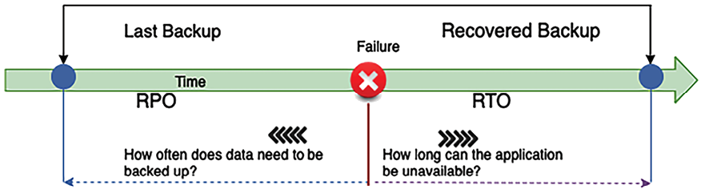
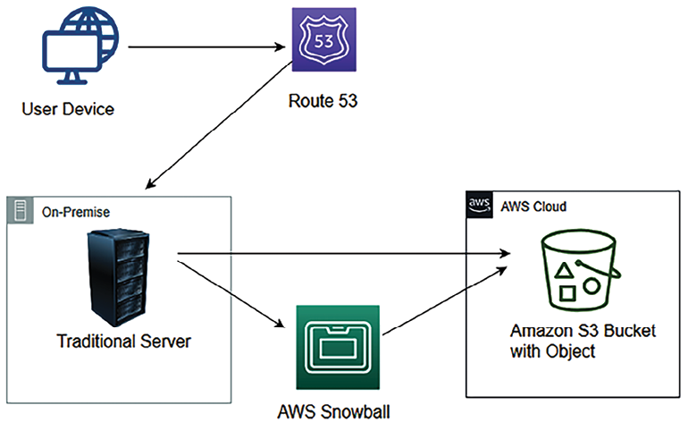
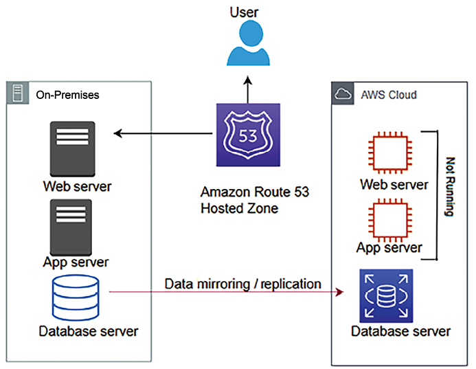
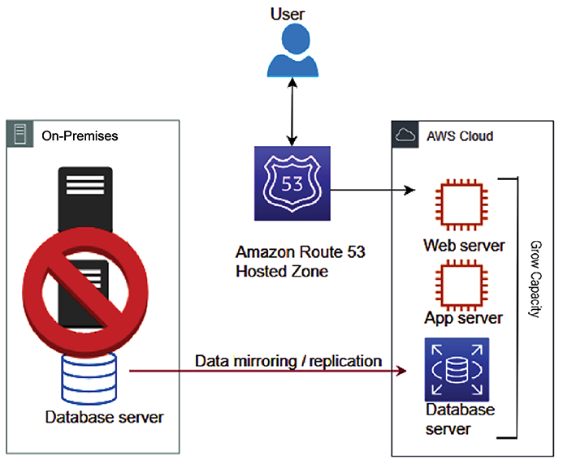
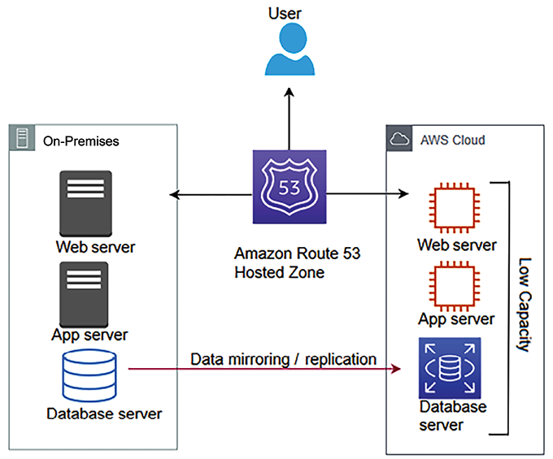
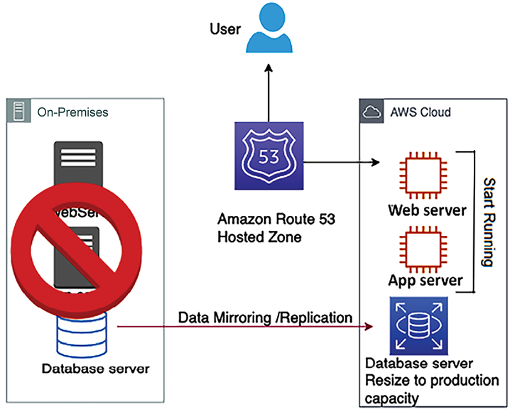
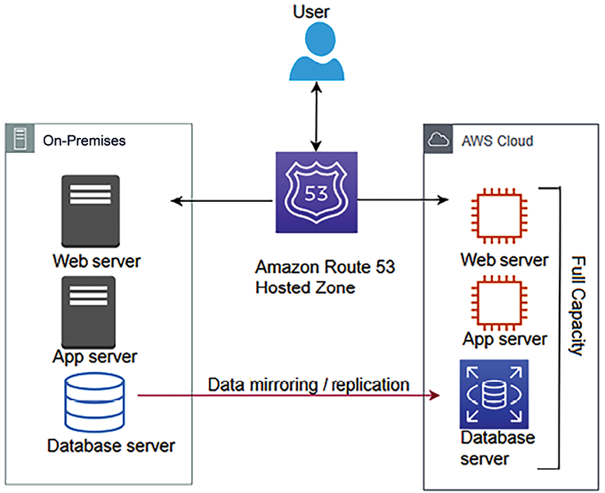

# Architectural Reliability Considerations

Application reliability is an essential aspect of architecture design and vital for any business to be successful.

**Reliability** means the ability of the system to recover from failure. It’s about making your application fault-tolerant and able to recover from any infrastructure or server failure without impacting the customer experience. Your system should be prepared to handle any situation that could cause disruption.

As all kinds of businesses are now online, high availability has also become a mandatory criterion for online applications. Users want to browse your application anytime and complete tasks such as shopping and banking at their convenience. In this chapter, you will learn various design principles to make your solution reliable. When assessing reliability, you need to consider every component of the architecture. You will understand how to choose the right technology to ensure your architecture’s reliability at every layer.

You will learn the following best practices for reliability in this chapter:

- Design principles for architectural reliability
- Technology selection for architectural reliability
- Improving reliability with the cloud

By the end of this chapter, you will have learned about various disaster recovery techniques and data replication methods to ensure the high availability of your application and the continuation of business processes.

# Design principles for architectural reliability

Reliability and **high availability** (**HA**) are foundational pillars for ensuring that applications and infrastructure can meet user demands without interruption. Reliability focuses on the system’s ability to operate correctly under specific conditions and for a particular period.

It involves designing systems to contain and manage failures in the smallest scope possible, minimizing the impact on overall operations. This approach requires a comprehensive understanding of potential failure modes and implementing targeted mitigation strategies to either prevent these failures or recover gracefully from them.

HA, discussed in detail in _Chapter 2_, is closely related to reliability but with an emphasis on ensuring that services remain accessible at all times. HA strategies involve creating redundant systems and components to eliminate single points of failure, thereby allowing for seamless failover in case of an outage. The goal is to maintain service continuity even in the face of hardware failures, network disruptions, or software bugs. By integrating reliability and HA into the system design, organizations can ensure that their applications are robust against failures and capable of maintaining consistent service levels.

In this discussion are the standard design principles that help you to strengthen your system’s reliability. You will find that all reliability design principles are closely related and complement each other.

## Making systems self-healing by applying automation

Integrating self-healing capabilities and automation into your system’s design enhances its reliability by allowing it to predict and recover from failures autonomously. A self-healing system proactively detects and rectifies failures across various system layers—be it hardware, network, or software—minimizing the impact on end users. This approach requires identifying critical **key performance indicators** (**KPIs**) relevant to your application and business operations, such as request handling capacity per second or web page load times. Infrastructure-level KPIs might include thresholds for CPU and memory utilization, ensuring they do not exceed predefined limits.

To achieve a self-healing architecture, implement a robust monitoring system that tracks these KPIs and alerts you as they approach critical thresholds. This system should be backed by automation strategies that can, for example, spin up additional servers to manage increased load when CPU utilization nears its maximum allowable percentage. This level of proactive monitoring and automated response not only prevents potential failures but also supports the system in maintaining optimal performance levels without manual intervention.

Moreover, embracing automation across your application’s life cycle—from deployment and configuration to scaling the infrastructure—fosters a more agile and resilient environment. It enables your team to deploy new features rapidly, experiment more freely, and ensure consistent system performance regardless of fluctuating workloads. Automating the scaling of resources based on scheduled demands or unexpected spikes in traffic ensures that the application remains responsive and available. By leveraging automation for deploying independent jobs and aggregating their outcomes, you can achieve not only higher reliability and efficiency but also enhance the system’s ability to self-recover from incidents, making your infrastructure truly resilient and self-sustaining.

### Quality assurance

Frequently, you need to apply the same configuration that you have on your development environment to **quality assurance** (**QA**) environments. There may be multiple QA environments for each testing stage, which includes functional testing, **user acceptance testing** (**UAT**), and stress testing environments.

Often, a QA tester discovers a defect caused by wrongly configured resources, which could introduce a further delay in the test schedule. Most importantly, you cannot afford a configuration error in production servers, which can cause widespread outages, so better to test them in advance.

To reproduce precisely the same configuration as your development environment to your QA environment, you may need to document step-by-step configuration instructions. Repeating the same steps to configure each environment manually can be error-prone. There is always a chance of human error, such as a typo, for example, in a database name. The solution to this challenge is to automate these steps by creating a script. The automation script itself can be the documentation.

As long as the script is correct, it is more reliable than manual configuration. It is undoubtedly reproducible. Detecting unhealthy resources and launching replacement resources can be automated, and you can notify the IT operations team when resources are changed. Automation is a fundamental design principle that needs to be applied everywhere in your system.

## Creating a distributed system

Monolithic applications have low reliability regarding system uptime, as a tiny issue in a particular module can bring down the entire system. Dividing your application into multiple small services reduces the _impact area_. One part of the application shouldn’t impact the whole system, and the application can continue to serve critical functionality. For example, in an e-commerce website, an issue with the payment service should not affect the customer’s ability to place orders, as payment can be processed later.

At the service level, scale your application horizontally to increase system availability. Design a system to use multiple smaller components working together rather than a single monolithic system to reduce the impact area. In a distributed design, requests are handled by different system components, and the failure of one component doesn’t impact the functioning of other parts of the system. For example, on an e-commerce website, the failure of warehouse management components will not impact the customer placing the order.

However, the communication mechanism can be complicated in a distributed system. This complexity arises from the need to ensure reliable data exchange across various networked computers, each possibly running different operating systems and located in different geographical areas. Challenges include dealing with network latency, handling message delivery guarantees, synchronizing data across nodes to ensure consistency, and implementing fault tolerance to withstand partial system failures. Additionally, the development and maintenance of a communication protocol that efficiently supports the diverse requirements of a distributed architecture add to the intricacy.

The circuit breaker pattern can help here to handle system dependencies. As you learned regarding the circuit breaker pattern in _Chapter 4_, _Solution Architecture Design Patterns_, the basic idea is simple. You wrap a protected function call in a circuit breaker object, which monitors for failures and takes automated action to mitigate them.

## Monitoring and adding capacity

Resource saturation is the most common reason for application failure. Often, you will encounter the issue where your applications start rejecting requests due to CPU, memory, or hard disk overload.

In a traditional on-premises environment, you must calculate server capacity based on the assumption in advance. Online traffic is very unpredictable and fluctuates heavily, driven by global trends. Usually, procuring hardware can take anywhere between 3 to 6 months, and it’s tough to guess capacity in advance. Ordering excess hardware will incur an extra cost as a resource is sitting idle, and a lack of resources will cause the loss of business due to application unreliability.

You need an environment where you don’t need to guess capacity, and your application can scale on demand.

A public cloud provider such as **Amazon Web Services** (**AWS**) provides **infrastructure as a service** (**IaaS**), facilitating the on-demand availability of resources.

In the cloud, you can monitor system supply and demand. You can automate the addition or removal of resources as needed. It allows you to maintain the level of resources that will satisfy demand without over-provisioning or under-provisioning.

## Performing recovery validation

When it comes to infrastructure validation, most of the time, organizations focus on validating a happy path where everything is working. Instead, you should validate how your system fails and how well your recovery procedures work. Validate your application, assuming everything fails all the time. Don’t just expect that your recovery and failover strategies will work. Make sure to test them regularly so you’re not surprised if something goes wrong.

A simulation-based validation helps you to uncover any potential risks. You can automate a possible scenario that could cause your system to fail and prepare an incident response accordingly. Your validation should improve application reliability so that nothing will fail in production.

Recoverability is sometimes overlooked as a component of availability. To improve the system’s **recovery point objective** (**RPO**) and **recovery time objective** (**RTO**), you should back up data and applications and their configuration as a machine image. You will learn more about RTO and RPO in the next section. Suppose a natural disaster makes one or more components unavailable or destroys your primary data source. In that case, you should be able to restore the service quickly and without losing data. Let’s discuss specific disaster recovery strategies to improve application reliability and associated technology choices next.

# Technology selection for architectural reliability

Application reliability often looks at the availability of the application to serve users. Several factors go into making your application highly available. However, **fault tolerance** refers to the built-in redundancy of an application’s components. Your application may be highly available but not be 100% fault-tolerant. For example, if your application needs four servers to handle the user request, you divide them between two data centers for HA.

If one site goes down, your system is still highly available at 50% capacity, but it may impact user performance expectations. However, if you create equal redundancy in both sites with four servers each, your application will not only be highly available but will also be 100% fault-tolerant.

Suppose your application is not 100% fault-tolerant. In that case, you want to add automated scalability, defining how your application’s infrastructure will respond to increased capacity needs to ensure your application is available and performing within your required standards. To make your application reliable, you should be able to restore services quickly and without losing data. Going forward, we will address this recovery process as **disaster recovery** (**DR**). Before going into various DR scenarios, let’s learn more about the RTO/RPO and data replication as it is a key factor to measure when planning for DR.

## Planning the RPO and RTO

Business applications need to define service availability in the form of a **service-level agreement** (**SLA**). Organizations define SLAs to ensure application availability and reliability for their users. For example, you might say in an SLA that your application should be 99.9% available in a given year, or that the organization can tolerate downtime of 43 minutes per month, and so on. The defined SLA primarily drives the RPO and RTO for an application.

The RPO is the amount of data loss an organization can tolerate in a given period. For example, my application is acceptable if it loses 15 minutes’ worth of data. In this case, if you are processing customer orders every 15 minutes for fulfillment, you can tolerate reprocessing that data in case of any system failure at the order fulfillment application. The RPO helps to define a data backup strategy.

The RTO is about application downtime and how long the application should take to recover and function normally after an incidence of failure. The following diagram illustrates the difference between the RTO and RPO:

Figure 8.1: RTO and RPO

In the preceding diagram, suppose the failure occurs at 10 A.M. and you took the last backup at 9 A.M.; in the event of a system crash, you would lose 1 hour of data. When you restore your system, there is an hour’s worth of data loss, as you have been taking data backups every hour.

In this case, your system RPO is 1 hour, as it can tolerate living with an hour’s worth of data loss. In this case, the RPO indicates that the maximum data loss that can be tolerated is 1 hour.

If your system takes 30 minutes to restore to the backup and bring up the system, it defines your RTO as half an hour. This means the maximum downtime that can be tolerated is 30 minutes. The RTO is the time it takes to restore the entire system after a failure that causes downtime, which is 30 minutes in this case.

An organization typically decides on an acceptable RPO and RTO based on the user experience and financial or reputational impact on the business in the case of system unavailability. Organizations plan solutions for effective system recovery per the defined RTO and RPO. Over time, you should aim to reduce the RTO/RPO, which will directly result in business benefits as the application will have more uptime. You can see now how data is the key to system recovery, so let’s learn some methods to minimize data loss.

## Replicating data

Data replication and snapshots are the keys to DR and making your system reliable. Replication creates a copy of the primary data site on the secondary site. In the event of primary system failure, the system can fail over to the secondary system and keep working reliably. This could be your file data stored in a **NAS drive**, **database snapshot**, or **machine image snapshot**. Sites could be two geo-separated, on-premises systems, two separate devices on the same premises, or a physically separated public cloud.

Data replication is not only helpful for disaster recovery but it can also speed up an organization’s agility by quickly creating a new environment for testing and development. Data replication can be synchronous or asynchronous.

### Synchronous versus asynchronous replication

Synchronous replication creates a data copy in real time. Real-time data replication helps to reduce the RPO and increase reliability in the event of a disaster. However, it is expensive as it requires additional resources in the primary system for continuous data replication.

Asynchronous replication creates copies of data with some lag or as per the defined schedule. However, asynchronous replication is less expensive as it uses fewer resources than synchronous replication. You may choose asynchronous replication if your system can work with a longer RPO.

Regarding database technology such as Amazon RDS, synchronous replication is applied if we create an RDS with multiple **Availability Zone** (**AZ**) failover. This setup ensures that your primary database and its replica in another AZ are always in sync, providing HA and data durability. If the primary database encounters issues, the service can automatically fail over to the replica with minimal disruption. For read replicas, there is asynchronous replication, and you can use that to serve reports and read requests.

As illustrated in the following architecture diagram, in synchronous replication, there is no lag of data replication between the master and standby instance of the database, while, in the case of asynchronous replication, there could be some lag while replicating the data between the primary and replication instance:

Figure 8.2: Synchronous and asynchronous data replication

Let’s explore some data replication methods for the synchronous and asynchronous approaches.

### Replication methods

The replication method is an approach to extract data from the source system and create a copy for data recovery purposes. Different replication methods are available to store a copy of data per the storage type for business process continuation. Replications can be implemented in the following ways:

- **Array-based replication**: In this, built-in software automatically replicates data. However, the source and destination storage arrays should be compatible and homogeneous to replicate data. A storage array contains multiple storage disks in a rack.

  Large enterprises use array-based replication due to the ease of deployment and reduced compute power of the host system. You can choose array-based replication products such as HP Storage, EMC SAN Copy, and NetApp SnapMirror.

- **Network-based replication**: This can copy data between different kinds of heterogeneous storage arrays. It uses an additional switch or appliance between incompatible storage arrays to replicate data. In network-based replication, the cost of replication could be higher as multiple players come into the picture. You can choose from networked-based replication products such as NetApp Replication X and EMC RecoverPoint.
- **Host-based replication**: In this, you install a software agent on your host that can replicate data to any storage system, such as NAS, SAN, or DAS. You can use a host-based software vendor, for example, Symantec, Commvault, CA, or Vision Solution.

  This is prevalent in **small and medium-sized businesses** (**SMBs**) due to lower upfront costs and heterogeneous device compatibility. However, it consumes more computing power as the agent needs to be installed on the host operating system.

- **Hypervisor-based replication**: This is VM-aware, which means copying the entire virtual machine from one host to another. As organizations mostly use virtual machines, it provides a very efficient DR approach to reduce the RTO. Hypervisor-based replication is highly scalable and consumes fewer resources than host-based replication. It can be carried out by native systems built into VMware and Microsoft Windows. You can choose a product such as Zerto to perform hypervisor-based replication or another product from various vendors.

Previously, in _Chapter 2_, _Principles of Solution Architecture Design_, you learned about scalability and fault tolerance. In _Chapter 4_, _Solution Architecture Design Patterns_, you learned about various design patterns to make your architecture highly available. Now, you will discover multiple ways to recover your system from failure and make it highly reliable.

## Planning disaster recovery

DR is about maintaining business continuation during system failure. It’s about preparing the organization for any possible system downtime and the ability to recover from it. DR planning covers multiple dimensions, including hardware and software failure.

While planning for DR, always ensure you consider operational losses such as power outages, network outages, heating and cooling system failures, physical security breaches, and other incidents, such as fires, floods, or human error.

Organizations invest effort and money in DR planning as per system criticality and impact. A revenue-generating application needs to be up all the time as it significantly impacts company image and profitability. For such an application, the organization will invest lots of effort in creating their infrastructure and training their employees for a DR situation. DR is like an insurance policy that you have to invest in and maintain even when you don’t utilize it as, in the case of unforeseen events, a DR plan will be a lifesaver for your business.

Bases of business criticality, such as software applications, can be placed on a _spectrum of complexity_. There are four DR scenarios, sorted from highest to lowest RTO/RPO as follows:

- Backup and restore
- Pilot light
- Warm standby
- Multi-site

As shown in the following diagram, in DR planning, as you progress with each option, your RTO and RPO will reduce while the cost of implementation increases. You need to make a suitable trade-off between RTO/RPO requirements and cost per your application reliability requirements:

Figure 8.3: The spectrum of DR options

DR strategies are highly customized to each organization’s unique needs, with the decision to execute a complete site failover depending on various critical factors. The triggering point for such drastic action varies, ranging from minor disruptions to major catastrophes like data center destruction. For instance, in the event of a significant disaster, an organization may need to quickly assess and prioritize critical services—often those accounting for a substantial portion of its revenue. These priority services may have a predefined RTO, such as a 24-hour window to resume operations before the financial impact becomes too severe, considering potential losses like fines, SLA breaches, and decreased sales. On the other hand, for less catastrophic but still critical service disruptions, a company might set automatic failover protocols for a much shorter downtime tolerance, such as 15 minutes. In both scenarios, the decision criteria for DR involve assessing the business impact analysis, understanding the RTO and RPO for essential services, evaluating the cost of downtime against the recovery process, and ensuring compliance with any regulatory requirements. Additionally, technical feasibility, including the availability and readiness of a secondary site, plays a crucial role in determining the appropriate response to ensure continuity and minimize operational disruptions.

Let’s explore each option mentioned above in detail with the technology choices involved. Note that public clouds such as AWS enable you to operate each of the preceding DR strategies cost-effectively and efficiently.

### Backup and restore

Backup and restore is the lowest cost option resulting in a higher RPO and RTO. This method is simple to start and highly cost-effective as you only need backup storage space. This backup storage could be a tape drive, hard disk drive, or network access drive. As your storage needs increase, adding and maintaining more hardware across regions could be a daunting task. One of the most cost-effective and straightforward options is to use the cloud as backup storage. Amazon S3 is one example; it provides unlimited storage capacity at a low cost and with a pay-as-you-go model.

The following diagram shows a basic DR system. In this diagram, the data is in a traditional data center, with backups stored in AWS. AWS Import/Export or Snowball kinds of physical hard drives in the size range of 8 TB to 100 TB are used to get the data into AWS, and the information is later stored in Amazon S3:

Figure 8.4: Data backup to Amazon S3 from on-premise infrastructure

You can use other third-party solutions available for backup and recovery. Some of the most popular choices are NetApp, VMware, Tivoli, and Commvault.

When planning for DR in a cloud environment, it’s crucial to incorporate strategies that leverage the strengths of various cloud providers, such as AWS, **Google Cloud Platform** (**GCP**), and Microsoft Azure. This approach ensures flexibility and resilience across different platforms. Here’s a generalized procedure applicable across these cloud services:

- **Backup and storage solutions**: Utilize cloud storage services to keep backups of your systems. For AWS, Amazon S3 can serve as a reliable backup storage solution. In GCP, Google Cloud Storage offers durable and highly available object storage. Azure’s equivalent, Azure Blob Storage, provides a similar service for storing large amounts of unstructured data.\* **Machine images and configuration**: Prepare machine images that include your operating system, applications, and configurations. AWS uses **Amazon Machine Images** (**AMIs**), GCP utilizes Compute Engine images, and Azure offers Azure Virtual Machine images. These images can be customized and pre-configured with necessary software and security patches, ready to be deployed in case of a disaster.
- **System restoration documentation**: Clearly document the steps required to restore your system from the backups across different cloud platforms. This documentation should include how to deploy the stored machine images and how to restore databases and applications from backups.
- **Traffic routing and failover procedures**: Outline the process to reroute traffic from the primary site to the backup site in the cloud. AWS offers Route 53 for DNS management and traffic routing, GCP has Cloud DNS and Traffic Director, and Azure provides Azure Traffic Manager and DNS Zone. Understanding how to utilize these services for failover scenarios is essential.
- **Deployment runbook**: Develop a comprehensive runbook that details deployment configurations and potential issues along with their resolutions. This runbook should be cloud-agnostic and adaptable to the specifics of AWS, GCP, and Azure, ensuring teams are prepared regardless of the cloud platform used.

In the preparation phase, create and store custom machine images and backups in the respective cloud storage solutions—S3 for AWS, Cloud Storage for GCP, and Blob Storage for Azure. Also, prepare snapshots of databases, storage volumes, and any essential files. This proactive approach ensures that, regardless of the cloud provider, your organization can quickly recover from a disaster with minimal downtime and data loss.

This DR pattern is easy to set up and relatively inexpensive. However, in this scenario, both the RPO and RTO will be high; the RTO will be the downtime until the system gets restored from the backup and starts functioning, while the RPO that is lost depends on the system’s backup frequency. Let’s explore the next approach, pilot light, which improves your RTOs and RPOs further.

### Pilot light

The pilot light approach is the next lowest-cost DR method after backup and restore. Like the pilot light in your gas heater, a tiny flame that is always on that can quickly light the entire furnace to heat the house, with this DR method, you need to keep the minimum number of core services up and running in different regions. You can spin up additional resources quickly in the event of a disaster.

You could actively replicate the database tier, then spin up instances from a virtual machine image or build out infrastructure using infrastructure as code, such as CloudFormation, Terraform, Ansible, and so on.

The following diagram shows a pilot light DR pattern. In this case, the database is replicated into AWS, with Amazon EC2 instances of the web servers and application servers ready to go but not currently running:

Figure 8.5: The pilot light data replication to DR site scenario

A pilot light scenario is similar to backup and restore, where you take a backup of most of the components and store them passively. However, you maintain active instances with a lower capacity for critical components such as a database or authentication server, which can take a significant time to spin up. You need to automatically start all required resources, including network settings, load balancers, and virtual machine images, as needed. As the core pieces are already running, recovery time is faster than the backup and restore method. The pilot light method is very cost-effective as you are running only some of the resources at full capacity.

You need to enable the replication of all critical data to the DR site—in this case, the AWS cloud. You can use the AWS Data Migration Service to replicate data between on-premises and cloud databases. For file-based data, you can use Amazon File Gateway.

Many other third-party-managed tools provide data replication solutions efficiently, such as Attunity, Quest, Syncsort, Alooma, and JumpMind.

If the primary system fails, as shown in the following diagram, you can start up the Amazon EC2 instances with the latest copy of the data. Then, you redirect Amazon Route 53 to point to the new web server:

Figure 8.6: Recovery in the pilot light method

For the pilot light method, in the case of a disaster, you need to perform the following steps:

1.  Start the application and web servers that were in standby mode. Furthermore, scale out the application servers with horizontal scaling using a load balancer.
2.  Vertically scale up the database instance that was running at low capacity.
3.  Update the DNS record in your router to point to the new site.

In the pilot light method, you bring up the resources around the replicated core dataset automatically and scale the system as required to handle the current traffic. A pilot light DR pattern is relatively easy to set up and inexpensive. However, in this scenario, the RTO takes longer to automatically bring up a replacement system, while the RPO largely depends on the replication type. Let’s explore the next approach, warm standby, which further improves your RTOs and RPOs.

### Warm standby

Warm standby, or fully working low-capacity standby, represents an advanced approach to DR by leveraging the cloud’s flexibility to deliver a cost-effective DR solution. This method enhances the basic pilot light strategy by maintaining a subset of your environment’s services in a continuously running state, albeit at a lower capacity than your full production environment.

The key advantage of a warm standby approach is its balance between cost savings and readiness for recovery. By having essential services already up and running, albeit on a smaller scale, the recovery time in the event of a disaster is significantly reduced compared to cold or pilot light strategies where resources need to be provisioned or scaled up during the recovery process.

Organizations can tailor their warm standby environment to handle a specific percentage of their production traffic, such as 20%, 30%, or 50%, depending on their recovery objectives and budget considerations. This flexibility allows for a customized DR solution that aligns with business needs and risk tolerance levels.

Furthermore, the warm standby environment isn’t just limited to DR scenarios; it can also serve dual purposes by providing a platform for non-production uses such as testing, staging, or development work. This dual use of the warm standby environment maximizes the value of the DR investment by utilizing the infrastructure for additional purposes beyond mere standby readiness, thereby optimizing resource utilization and cost efficiency.

The following diagram depicts two systems running in the warm standby method—the central system and a low-capacity system—on an AWS cloud. You can use a router such as Amazon Route 53 to distribute requests between the central system and the cloud system:

Figure 8.7: Warm standby scenario running an active-active workload with a low capacity

When it comes to databases, warm standby takes a similar approach to pilot light, where data is continuously replicating from the main site to the DR site. However, in warm standby, you run all necessary components 24/7, but they do not scale up for production traffic.

Often, the organization chooses a warm standby strategy for more critical workloads, so you need to ensure there are no issues in the DR site using continuous testing. The best approach to take is A/B testing, where the leading site will handle more significant traffic. A small amount of traffic, approximately 1% to 5%, is routed to the DR site. This will make sure that the DR site is able to serve traffic when the primary site is down. Also, make sure to patch and update the software on the DR site regularly to keep in sync with the production environment.

As shown in the following diagram, during the unavailability of the primary environment, your router switches over to the secondary system, which is designed to automatically scale its capacity up in the event of a failover from the primary system:

Figure 8.8: Recovery phase in the warm standby scenario

Suppose a failure occurs in the primary site. In that case, you can take the following approach:

1.  Perform an immediate transfer of the critical production workload traffic to the DR site by increasing traffic routing from 5% to 100% in the secondary site. For example, in a banking business, you must first bring up your customer-facing website to keep it functioning.
2.  Scale up the environment that was running on low capacity. You can apply vertical scaling for databases and horizontal scaling for servers.
3.  As you scale up the environment, other non-critical workloads working in the background can now be transferred, such as warehouse management and shipping.

Tools you can use for warm standby such as Terraform, an open-source tool developed by HashiCorp, is renowned for its ability to build, change, and version infrastructure in a safe and efficient manner across various cloud providers. Alongside, Veeam stands out by offering comprehensive backup and replication solutions that cater to cloud, virtual, and physical environments, ensuring robust support for multi-cloud strategies. Zerto further complements these capabilities by providing disaster recovery, backup, and workload mobility software tailored for virtualized infrastructures and cloud settings.

A warm standby DR pattern is relatively complex to set up and expensive. The RTO is much quicker than the pilot light for the critical workload. However, for non-critical workloads, it depends on how quickly you can scale up the system, while the RPO largely depends on the replication type. Let’s explore the next approach, multi-site, which provides near-zero RTOs and RPOs.

### Multi-site

Lastly, the multi-site strategy, also known as a hot standby, helps you achieve a near-zero RTO and RPO. With this method, your DR site is a replica of the primary site with continuous data replication and traffic flow between sites. It is known as multi-site architecture due to the automated load balancing of traffic across regions or between on-premises and the cloud.

As shown in the following diagram, multi-site is the next level of DR, having a fully functional system running in the cloud at the same time as on-premises systems:

Figure 8.9: Multi-site scenario running an active-active workload with full capacity in AWS

The advantage of the multi-site approach is that it is ready to take a full production load at any moment. It’s similar to warm standby but runs at full capacity on the DR site. If the primary site goes down, all traffic can immediately fail over to the DR site, which is an improvement over the loss in performance and time when switching over and scaling up the DR site in the case of a warm standby.

Implementing a multi-site strategy for DR requires a selection of advanced tools and technologies designed to automate and manage the seamless failover process, ensuring operational continuity with minimal performance loss. Cloud management platforms like VMware’s vRealize Automation and Microsoft Azure Site Recovery play a crucial role in orchestrating the replication of virtual machines and data, facilitating an immediate switch to the DR site when necessary. Load balancers and global traffic managers, including solutions such as F5 BIG-IP and AWS Route 53, dynamically direct traffic based on site availability and load, ensuring the DR site can handle incoming requests instantly.

**Infrastructure-as-Code** (**IaC**) tools like Terraform and AWS CloudFormation enable rapid provisioning and scaling of necessary infrastructure, allowing the DR site to mirror the production environment’s capabilities swiftly. Additionally, network performance monitoring tools like SolarWinds and Nagios offer real-time insights into network health, aiding in the prompt detection of issues that could necessitate a failover.

A multi-site DR pattern is the most expensive as it requires redundancy to be built for all components; however, for businesses that require HA and cannot afford any downtime, such as financial institutions, healthcare services, and e-commerce platforms, the investment in a multi-site setup can be justified by the high cost of potential downtime.

The RTO is much quicker for all workloads in this scenario, while the RPO largely depends upon the replication type.

Let’s explore some best practices around DR to make sure your system is running reliably.

## Applying best practices for DR

As you start thinking about DR, here are some important considerations:

- **Start small and build as needed**: Make sure you first bring up the critical workloads with the most business impact and build upon this to bring up less critical loads.
- **Apply the data backup life cycle**: Take backups of everything, whether it is your file server, machine image, or databases. Keeping lots of active backups could increase costs, however, so make sure to apply a life cycle policy to archive and delete data as per your business needs. For example, you can choose to keep a 90-day active backup and, after that period, store it in low-cost archive storage such as a tape drive or Amazon Glacier. After 1 or 2 years, you may want to set a life cycle policy to delete the data. Compliance with standards such as PCI-DSS may require you to store data for seven years, and in that case, you must opt for archival data storage to reduce costs.
- **Check your software licenses**: Managing software licenses can be a daunting task, especially in the current microservice architecture environment, where you have several services running independently on their virtual machines and databases. Software licenses could be associated with several installations, a number of CPUs, and several users. It becomes tricky when you go for scaling. It’s important to monitor and check these; you need to have enough licenses to support your scaling needs. Also ensure you don’t buy excessive licenses, which you may not utilize and will cost you more money. Overall, make sure to manage your license inventory, like your infrastructure or software.
- **Plan your scaling**: For horizontal scaling, add more instances with software installed, and in vertical scaling, add more CPU or memory. You need to understand your software licensing agreement and ensure you have enough licenses to fulfill system scaling.
- **Test your solutions often**: DR sites are created for rare DR events and are often overlooked. You need to ensure your DR solution is working as expected to achieve high reliability in case of an incident. Compromising a defined SLA can violate contractual obligations and cause a loss of money and customer trust.\* **Play gameday**: One way to test your solution often is by playing _gameday_. To play gameday, you choose a day when the production workload is small and gather all the team responsible for maintaining the production environment. You can simulate a disaster event by bringing down a portion of the production environment and letting the team handle the situation to keep the environment up and running. These events ensure you have working backups, snapshots, and machine images to handle disaster events.
- **Continuously monitor resources**: Put a monitoring system in place to ensure automated failover to the DR site happens if an event occurs. Monitoring helps you to take a proactive approach and monitoring capacity saves you from resource saturation issues, which can impact your application’s reliability.

Creating a DR plan and performing regular recovery validation helps to achieve the desired application reliability. Let’s learn more about improving reliability through the use of the public cloud next.

# Improving reliability with the cloud

In previous sections, you have seen examples of a cloud workload for the DR site. Many organizations have started to choose the cloud for DR sites to improve application reliability. Also, cloud marketplaces from major providers like AWS, Azure, and GCP offer a wide range of third-party solutions that can be integrated into DR planning and execution. These offerings typically include tools for backup and replication, orchestration, monitoring, and security.

The cloud provides data centers that are available across geographic locations at your fingertips. You can create a reliable site on another continent without any hassle. With the cloud, you can easily create and track the availability of your infrastructure, such as backups and machine images.

In the cloud, easy monitoring and tracking help make sure your application is highly available as per the business-defined SLA. The cloud gives you fine control over IT resources, cost, and handling trade-offs for RPO/RTO requirements.

The cloud provides easy and effective testing of your DR plan. You inherit features available in the cloud, such as the logs and metrics for various cloud services. Built-in metrics are a powerful tool for gaining insight into the health of your system.

With all available monitoring capabilities, you can notify the team of any threshold breach or trigger automation for system self-healing. For example, AWS provides CloudWatch, which collects logs and generates metrics while monitoring different applications and infrastructure components. It can trigger various automation to scale your application.

The cloud provides a built-in change management mechanism that helps to track provisioned resources. Cloud providers extend out-of-the-box capabilities to ensure applications and operating environments are running known software and can be patched or replaced in a controlled manner. For example, AWS provides AWS Systems Manager, which has the capability of patching and updating cloud servers in bulk.

With the cloud, you can design a scalable system, providing flexibility to add and remove resources automatically to match the current demand. Data is one of the essential aspects of any application’s reliability. The cloud offers out-of-the-box data backup and replication tools, including machine images, databases, and files. In a disaster, all your data is backed up and appropriately saved in the cloud, which helps the system recover quickly.

Regular interaction across the application development and operation team will help address and prevent known issues and design gaps, thereby reducing the risk of failures and outages. Continually architect your applications to achieve resiliency and distribute them to handle any outages.

# Summary

In this chapter, you learned about various principles to make your system reliable. These principles include making your system self-healing by applying automation rules and reducing the impact in the event of failure by designing a distributed system where the workload spans multiple resources.

Overall system reliability heavily depends on your system’s availability and ability to recover from disaster events. You learned about synchronous and asynchronous data replication types and how they affect your system reliability. You learned about various data replication methods, including array-based, network-based, host-based, and hypervisor-based methods. Each replication method has its pros and cons. There are multiple vendors’ products available to achieve the desired data replication.

You learned about various disaster planning methods depending on the organization’s needs and the RTO and RPO. You learned about the backup and restore method, which has high RTO and RPO and is easy to implement. The pilot light method improves your RTO/RPO by keeping critical resources, such as databases, active in the DR site. The warm standby and multi-site methods maintain an active copy of a DR site’s workload and increase application reliability by lowering the system’s RTO/RTO and the system’s complexity and costs.

You learned about utilizing the cloud’s built-in capability to ensure application reliability.

Solution design and launch may only happen sometimes, but operational maintenance is an everyday task. In the next chapter, you will learn about the alerting and monitoring aspects of solution architecture, including various design principles and technology choices to make your application operationally efficient and achieve operational excellence.
