Operational Excellence Considerations
=====================================

Application maintainability is one of the main aspects that a solutions architect should consider during architectural design. Every new project starts with lots of planning and resources at the beginning and teams spend the initial months creating and launching your application. After the production launch, the application needs several things to be taken care of to keep operating. You need to continually monitor your application to find and resolve any issues on a day-to-day basis.

The operations team needs to handle application infrastructure, security, and any software issues to make sure your application is running reliably without any problems or issues. Often, enterprise applications are complex, with defined **Service-Level Agreements** (**SLA**) regarding application availability. Your operations team needs to understand business requirements and prepare themselves accordingly to respond to any event.

Operational excellence is all about ensuring that every component and layer of your system architecture operates in an efficient way. This involves continuous monitoring, optimization, and improvement of processes, systems, and services.

Operational excellence should be implemented across every component and layer of architecture. In modern microservice applications, there are so many moving parts involved that make system operations and maintenance a complicated task.

Your operations team needs to put proper monitoring and alert mechanisms in place to tackle any issues that could hamper the business flow. Operational issues involve coordination from several teams for preparation and resolution.

In this chapter, you will learn various design principles applicable to achieving operational excellence for your solution. You will get an understanding of the right selection of technologies to ensure operational maintainability at every layer of your software application. You will learn the following best practices of operational excellence:

*   Design principles for operational excellence
*   Selecting technologies for operational excellence
*   Achieving operational excellence in the public cloud
*   Driving efficiency with CloudOps

By the end of this chapter, you will know various processes and methods to achieve operational excellence. You will have learned about best practices you can apply throughout application design, implementation, and post-production to improve application operability.

Design principles for operational excellence
============================================

Operational excellence is about running your application with minimal possible interruption to gain maximum business value. It is about applying continuous improvements to make the system efficient.

The following sections talk about the standard design principles that can help you strengthen your system’s maintainability. You will find that all operational excellence design principles are closely related to and complement each other.

Automating manual tasks
-----------------------

Technology moves fast, and IT operations need to keep up with that, particularly where hardware and software inventories are procured from multiple vendors. Enterprises are building hybrid cloud and multi-cloud systems, so you must learn how to handle both on-premises and cloud operations. Modern systems have extensive user bases, with various microservices working together and millions of devices connected in a network. There are many moving parts in an IT operation, making it difficult to run things manually.

Organizations maintain agility, and operations have to be fast to make use of the required infrastructure for new service development and deployment. The operations team has a more significant responsibility to keep services up and running and recover quickly in case of an unexpected event. Now, it is required to take a proactive approach in IT operations rather than waiting for an incident to happen and then reacting.

Your operations team can work very efficiently by applying automation. Manual jobs need to be automated so that the team can focus on more strategic initiatives rather than getting overworked with tactical work. Automating active discovery and response for any security threat is most important to free up the team. Spinning up a new server or starting and stopping services should be automated using an **infrastructure as code** (**IaC**) approach. Automation allows the team to devote more time to innovation.

For your web-facing application, you can detect anomalies in advance using machine learning prediction, before they impact your system. You can raise an automated security ticket if someone exposes your server to the world with HTTP port `80`. You can pretty much automate the entire infrastructure and redeploy it multiple times as a _one-click solution_. Automation also helps to prevent human error, which can occur even if a person is doing the same job repetitively. Automation is now a must-have for IT operations.

Making incremental and reversible changes
-----------------------------------------

Operational optimization is an ongoing process whereby continuous effort is required to identify gaps and improve on these. These gaps could be focused on reliability, availability, performance, and cost-effectiveness, ensuring that the architecture supports the business goals and adapts to changing needs. Achieving operational excellence is a journey. Changes are always required in all parts of your workload to maintain it. For example, often, the operating systems of your server need to be updated with a security patch provided by your vendor. Various software that your application uses needs version upgrades. You might need to make changes in the system to adhere to new compliance requirements.

You should design your workload in such a way that it allows all system components to get updated regularly so the system will benefit from the latest and most significant updates available. Automate your flow to apply small, incremental changes to avoid any significant impact. Any changes should be reversible to restore the system’s working conditions in case of any issues. Incremental changes help with thorough testing and improve overall system reliability. Automate any change management to avoid human error and achieve efficiency.

Predicting failures and responding
----------------------------------

Preventing failures is vital to achieving operational excellence. Failures are bound to happen, and it’s critical to identify them as far in advance as possible. During architecture design, anticipate failure and ensure you design for failure to prevent it from happening. Assume that everything will fail all the time and have a backup plan ready. Perform regular exercises to identify any potential source of failure. Try to remove or mitigate any resource that could cause a failure during system operation.

Create a test scenario based on your SLA that includes a system **recovery time objective** (**RTO**) and **recovery point objective** (**RPO**). Test your scenario, and make sure you understand their impact. Ensure your team is ready to respond to any incident by simulating a production-like scenario. Test your response procedure to make sure it is resolving issues effectively and create a confident team that is familiar with response execution.

Learning from mistakes and refining
-----------------------------------

As operational failures occur in your system, you should learn from the mistakes and identify the gaps involved. Make sure those same events do not occur again, and you should have a solution ready in case a failure is repeated.

One way to improve is by running a **root cause analysis** (**RCA**). During RCA, you gather the team and ask five _Whys_. With each _why_, you peel off one layer of the problem, and after asking the last _why_, you get to the bottom of the issue. After identifying the actual cause of an issue, you can prepare a solution and update the operational runbook with the ready-to-use solution.

As your workload evolves with time, you must ensure the operation procedure gets updated accordingly. Make sure to validate and test all methods regularly and that the team is familiar with the latest updates to execute them.

Keeping the operational runbook updated
---------------------------------------

Often, a team overlooks documentation, which results in an outdated runbook. A runbook provides a guide to executing a set of actions to resolve issues arising due to external or internal events. A lack of documentation can make your operation people-dependent, which can be risky due to team attrition. Always establish processes to keep your system operations people-independent, and document all aspects.

In the runbook, you want to keep track of all previous events and actions taken by team members to resolve them so that any new team members can quickly resolve similar incidents during operation support.

The system admin should maintain the runbook with steps to start, stop, patch, and update the system. The operations team should include the system testing and validation result, along with the procedure to respond to the event. Your runbook should also include the defined SLA concerning RTO/RPO, latency, scalability, performance, and so on.

Automate processes to annotate documents as a team applies changes to the system and also after every build. You can use annotation to automate your operation, and it is easily readable by code to accommodate business priorities and customer needs continuously.

Selecting technologies for operational excellence
=================================================

The operations team needs to create procedures and steps to handle any operational incidents and validate the effectiveness of their actions. They need to understand the business need to provide efficient support and collect systems and business metrics to measure the achievement of business outcomes.

The operational procedure can be categorized into three phases—planning, functioning, and improving. Let’s explore technologies that can help in each phase.

Planning for operational excellence
-----------------------------------

The first step in the operational excellence process is to define operational priorities to focus on the high business impact areas. Those areas could be, for example, applying automation, streamlining monitoring, developing team skills as the workload evolves, and focusing on improving overall workload performance.

There are tools and services available that crawl through your system by scanning logs and system activity. These tools offer a fundamental set of assessments that suggest enhancements for the system’s environment. They assist in forming priorities by providing key insights and recommendations for optimization.

After identifying and understanding the priorities, you need to design the operation, which includes the workloads to design and build the procedures to support them. The design of a workload should encompass its implementation, deployment, updating process, and operational strategy. An entire workload can be viewed as various application components, infrastructure components, security, data governance, and operations automation. After operation design, create a checklist for operational readiness. These checklists should be comprehensive to ensure the system is ready for operation support when going live in production. This includes logging and monitoring, a communication plan, an alert mechanism, the team skillset, a team support charter, a vendor support mechanism, and so on.

For operational excellence planning, the following are the areas where you need appropriate tools for preparation:

*   IT asset management
*   Configuration management

Let’s explore each area in more detail to understand the available tools and processes.

IT asset management
-------------------

Operational excellence planning requires a list of IT inventories and tracks their use. These inventories include infrastructure hardware such as physical servers, network devices, storage, end-user devices, and so on. You also need to keep track of software licenses, operational data, legal contracts, compliance, and so on. IT assets include any system, hardware, or information that a company is using to perform a business activity.

Keeping track of IT assets helps an organization to make strategic and tactical decisions regarding operational support and planning. However, managing IT assets in a large organization can be daunting. Various **IT asset management** (**ITAM**) tools are available for the operations team to help in the asset management process. Some of the most popular ITAM tools are **SolarWinds**, **Freshservice**, **ServiceDesk Plus**, **Asset Panda**, **PagerDuty**, and **Jira Service Desk**.

IT management is more than tracking IT assets. It also involves monitoring and collecting asset data continuously to optimize usage and operation costs. ITAM makes the organization more agile by providing end-to-end visibility and the ability to apply patches and upgrades quickly. The following diagram illustrates ITAM:

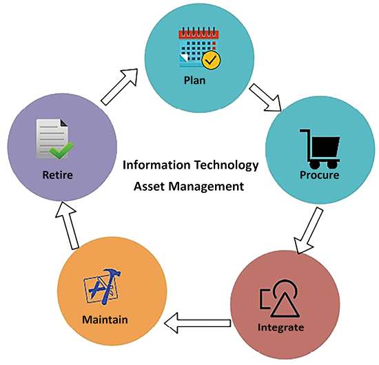

Figure 9.1: ITAM process

As shown in the preceding diagram, the ITAM process includes the following phases:

*   **Plan**: An asset life cycle starts with planning, a more strategic focus to determine the need for overall IT assets and procurement methods. It includes a cost-benefit analysis and total cost of ownership.
*   **Procure**: In the procurement phase, organizations acquire the asset based on the planning outcome. They may also decide to develop some holdings as required—for example, in-house software for logging and monitoring.
*   **Integrate**: In this phase, an asset is installed in the IT ecosystem. The phase includes the operation and support of the asset, including defining user access—for example, installing a log agent to collect logs from all the servers in a centralized dashboard and restricting monitoring dashboard metrics to the IT operations team.*   **Maintain**: In the maintenance phase, the IT operations team keeps track of assets and acts to upgrade or migrate them based on the asset life cycle—for example, applying a security patch provided by the software vendor. This involves keeping track of the end of life for licensed software, such as planning to migrate from Windows Server 2008 to Windows 2022, as the old operating system is getting to the end of its life.
*   **Retire**: In the retirement phase, the operations team disposes of the end-of-life asset. For example, if an old database server is getting to the end of its life, then the team takes action to upgrade it and migrate the required users and support to the new server.

ITAM helps organizations adhere to **ISO 19770** compliance requirements. It includes software procurement, deployment, upgrade, and support. ITAM provides better data security and helps to improve software compliance. It also provides better communication between business units such as operations, finance, marketing teams, and frontline staff. Configuration management is another aspect of planning for operational excellence that helps to maintain IT inventory data along with details such as owner and current state. Let’s learn more about it.

### Configuration management

Configuration management maintains **configuration items** (**CIs**) to manage and deliver an IT service. CIs are tracked in the **configuration management database** (**CMDB**). The CMDB keeps track of whether the server is physical or virtual, the operating system and its version (for example, Windows 2022 or **Red Hat Enterprise Linux** (**RHEL**) 8.0), the owner of the server (that is, support, marketing, or HR), and whether it has a dependency on other servers such as order management, and so on.

Configuration management is different from asset management. Asset management handles the entire life cycle of an asset, from planning to retirement, while a CMDB is a component of asset management that stores configuration records of an individual asset. As shown in the following diagram, configuration management implements the integration and maintenance part of asset management:

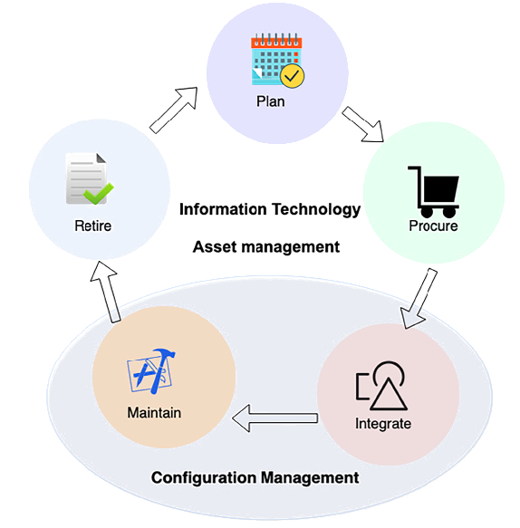

Figure 9.2: IT asset life cycle versus configuration management

Configuration management, as shown in the preceding diagram, implements the _Integrate_ and _Maintain_ part of asset management.

Configuration management and change management are complementary processes within IT operations. Configuration management focuses on maintaining an accurate and up-to-date record of all the components within an organization’s IT environment, including their versions, configurations, and interrelationships. This ensures that systems are consistently and efficiently deployed and operated. On the other hand, change management oversees and controls modifications to the IT infrastructure, ensuring that changes are implemented in a coordinated, systematic manner to prevent unintended consequences. Together, they help maintain the integrity and stability of IT assets, with configuration management providing the detailed information necessary to assess the impact of changes, and change management ensuring that alterations to configurations are properly planned, executed, and documented.

A configuration management tool can help the operations team reduce downtime by providing readily available information on asset configuration. The most popular configuration management tools are Chef, Puppet, Ansible, and Bamboo. You will learn more details about them in _Chapter 11_, _DevOps and Solution Architecture Framework_.

IT management becomes easier if your workload is in a public cloud such as AWS, Microsoft Azure, or GCP. Cloud vendors provide inbuilt tools to track and manage IT inventories and configurations in one place. For example, AWS provides services such as AWS Config, which tracks all IT inventories that spin up as a part of your AWS cloud workload, and services such as AWS Trusted Advisor, which recommends cost, performance, and security improvements, which you can use to decide how to manage your workload. You can see an example of AWS Trusted Advisor in the following screenshot:

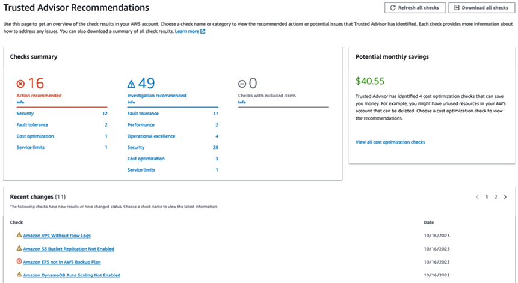

Figure 9.3: AWS Trusted Advisor dashboard

As shown in the preceding screenshot, the AWS **Trusted Advisor Dashboard** shows 12 security issues that can be further explored to find out more details, among other things.

Configuration management plays a crucial role in continuously monitoring and documenting the configurations of IT resources, enabling the automation of configuration evaluations against predefined standards. The benefits of configuration management include:

*   **Continuous monitoring**: It allows for the ongoing observation and documentation of changes in your IT resources’ configurations.
*   **Change management**: Helps in tracking the interconnections between resources and reviewing dependencies before implementing any changes.
*   **Continuous assessment**: Facilitates regular audits and assessments to ensure that your IT resources comply with your organization’s policies and guidelines.
*   **Enterprise-wide compliance monitoring**: Offers a comprehensive view of compliance status across your enterprise, pinpointing any non-compliant accounts, and allows in-depth examination at the regional account level.*   **Management of third-party resources**: Enables the documentation of configurations for third-party resources, such as GitHub repositories, Microsoft Active Directory resources, and servers, whether on-premises or cloud-based.
*   **Operational troubleshooting**: Captures a detailed history of configuration changes, aiding in the simplification of operational problem-solving.

Through configuration management, you gain the ability to conduct security analyses, maintain continuous oversight of resource configurations, and assess these configurations for potential security vulnerabilities. It is instrumental in ensuring compliance with internal policies and regulatory standards in your IT and third-party resources’ configurations, and in continuously reviewing resource configuration changes against your desired standards.

In this section, you learned about asset management and configuration management. These are part of the **Information Technology Infrastructure Library** (**ITIL**) framework, which implements **Information Technology Service Management** (**ITSM**), relevant to operational excellence. ITSM helps organizations to run their IT operations daily. You can learn more about ITIL from its governing body, AXELOS, by visiting its website ([https://www.axelos.com/best-practice-solutions/itil](https://www.axelos.com/best-practice-solutions/itil)). AXELOS offers ITIL certification to develop skills in the IT service management process.

As you have learned about planning, let’s now explore the functioning of IT operations in the next section.

The functioning of operational excellence
-----------------------------------------

Operational excellence is determined by proactive monitoring and quick response and recovery in the case of an unexpected event. By understanding the operational health of a workload, it is possible to identify when events and responses impact it. Use tools that help you understand the operational health of the system using **metrics** and **dashboards**. You should send log data to centralized storage and define metrics to establish a benchmark. These tools also enable the automation of responses to operational events, triggering their execution in response to specific alerts.

Design your workload components to be replaceable. This approach means that instead of spending time fixing issues, you can reduce recovery time by substituting failed components with known, reliable versions. Then, analyze the failed resources without impacting a production environment.

For the functioning of operational excellence, the following are the areas where appropriate tools are needed:

*   Monitoring system health
*   Handling alerts and incident response

Let’s explore each area with information on the available tools and processes.

### Monitoring system health

Keeping track of system health is essential to understanding _workload behavior_. The operations team uses system health monitoring to record any anomalies in system components and acts accordingly. Traditionally, monitoring is limited to the infrastructure layer, keeping track of the server’s CPU and memory utilization. However, monitoring needs to be applied to every layer of the architecture. Significant components where monitoring is applied are:

*   Infrastructure monitoring
*   Application monitoring
*   Platform monitoring
*   Log monitoring
*   Security monitoring

We discuss these in the following subsections.

#### Infrastructure monitoring

Infrastructure monitoring is essential and is the most popular form of monitoring. Infrastructure includes components required for hosting applications. These are core services such as storage, servers, network traffic, load balancers, and so on.

Infrastructure monitoring may consist of metrics such as the following:

*   **CPU usage**: Percentage of CPU utilized by the server in a given period*   **Memory usage**: Percentage of **random-access memory** (**RAM**) utilized by the server in a given period
*   **Network utilization**: Network packets _in and out_ over the given period
*   Disk utilization: Disk read/write throughput and **input/output operations per second** (**IOPS**)
*   **Load balancer**: Number of request counts in a given period

There are many more metrics available, and organizations need to customize those monitoring metrics as per their application monitoring requirements. The following screenshot shows a sample monitoring dashboard for network traffic:

Figure 9.4: Infrastructure monitoring dashboard

You can see on the preceding system dashboard that there is a spike on one day in the **Network In Average** pane, with color coding applied for different servers. The operations team can dive deep into this and the other graphs and resources to get a more granular view to determine the overall health of the infrastructure.

#### Application monitoring

Sometimes, your infrastructure is all healthy except for applications having an issue due to some bug in your code or any third-party software issues. You may have applied some vendor-provided operating system security patch that messed up your application. Application monitoring helps with this.

Application monitoring may include metrics such as the following:

*   **Endpoint invocation**: Number of requests in a given period
*   **Response time**: Average response time to fulfill the request
*   **Throttle**: The number of valid requests spilled out as the system runs out of capacity to handle the additional requests
*   **Error**: The application throws an error while responding to a request

The following screenshot shows a sample application endpoint-monitoring dashboard:

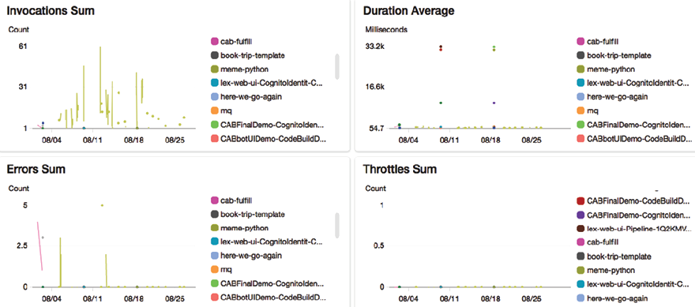

Figure 9.5: Application monitoring dashboard

There could be many more metrics based on the application and technology. For example, a memory garbage collection amount for a Java application, several HTTP `POST` and `GET` requests for a RESTful service, a count of `4XX` client errors, a count of `5XX` server errors for a web application, and what they might be looking for that would indicate poor application health.

#### Platform monitoring

Your application may be utilizing several third-party platforms and tools that must be monitored. These may include the following:

*   **Memory caching**: Redis and Memcached*   **Relational database**: Oracle Database, Microsoft SQL Server, Amazon **Relational Database Service** (**RDS**), PostgreSQL
*   **NoSQL database**: Amazon DynamoDB, Apache Cassandra, MongoDB*   **Big data platform**: Apache Hadoop, Apache Spark, Apache Hive, Apache Impala, Amazon **Elastic MapReduce** (**EMR**)
*   **Containers**: Docker, Kubernetes, OpenShift
*   **Business intelligence tools**: Tableau, MicroStrategy, Kibana, Amazon QuickSight
*   **Messaging system**: MQSeries, **Java Message Service** (**JMS**), RabbitMQ, **Simple Queue Service** (**SQS**)
*   **Search**: Open search, Solr search-based application

Each of the tools mentioned above has its own set of metrics that you need to monitor to make sure your application is healthy as a whole. The following screenshot shows the monitoring dashboard of a relational database platform:

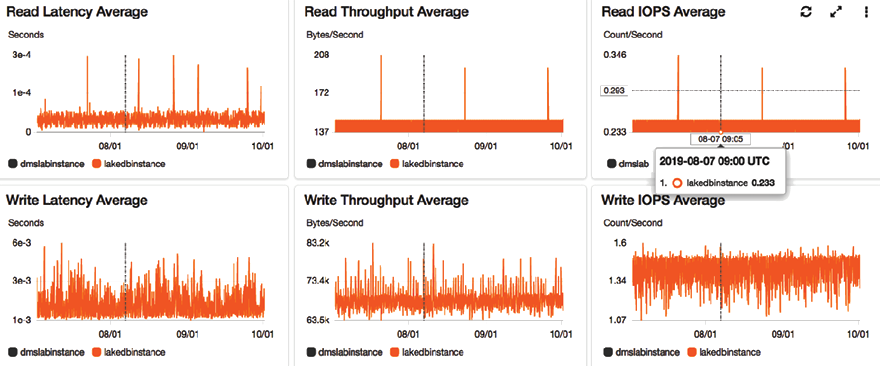

Figure 9.6: Platform monitoring dashboard for a Relational Database Management System (RDBMS)

In the preceding dashboard, you can see the database has lots of writing activity, showing that the application is continuously writing data. On the other hand, read events are relatively consistent except for some spikes.

#### Log monitoring

Traditionally, log monitoring was a manual process, and organizations took a reactive approach to analyze logs when issues were encountered. However, with more competition and increasing user expectations, it has become essential to take quick action before users notice any issues. For a proactive approach, you should have the ability to stream logs in a centralized place and run queries to monitor and identify issues. For example, if some product page throws an error, you need to know the error immediately and fix the problem before the user complains; otherwise, you will suffer a revenue loss.

In the case of any network attack, you need to analyze your network log and block suspicious IP addresses. Those IPs may send an erroneous number of data packets to bring down your application. Monitoring systems such as AWS CloudWatch, Logstash, Splunk, Google Stackdriver, and so on provide an agent to install on your application server. The agent will stream logs to a centralized storage location. You can directly query central log storage and set up alerts for any anomalies.

The following screenshot shows a sample network log collected in a centralized place:

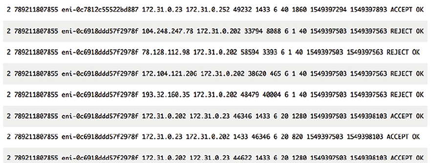

Figure 9.7: Raw network log streamed in a centralized data store

You can run a query in these logs and find out the top 10 source IP addresses with the highest number of reject requests, as shown in the following screenshot:

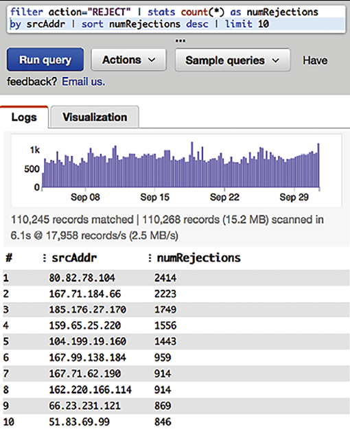

Figure 9.8: Insight from raw network log by running query

As shown in the preceding query editor, you can create a graph and set an alarm if the number of rejections detected crosses a certain threshold, such as more than 5,000.

#### Security monitoring

Security is a critical aspect of any application. Security monitoring should be considered during solution design. As you learned when we looked at security in the various architectural components in _Chapter 7_, _Security Considerations_, security needs to be applied at all layers. It would be advisable to implement security monitoring to act and respond to any adverse event.

The following list shows where security monitoring needs to be applied:

*   **Network security**: Monitor any unauthorized port opening, suspicious IP address, and activity
*   **User access**: Monitor any unauthorized user access and suspicious user activity
*   **Application security**: Monitor any malware or virus attack*   Web security: Monitor for **Distributed Denial of Service** (**DDoS**) attacks, SQL injection, or **cross-site scripting** (**XSS**)
*   **Server security**: Monitor any gap in security patches*   **Compliance**: Monitor any compliance lapses such as violations of **payment card industry** (**PCI**) compliance checks for payment applications or the **Health Insurance Portability and Accountability Act** (**HIPAA**) for healthcare applications
*   **Data security**: Monitor unauthorized data access, data masking, and data encryption at rest and in transit

One example of security monitoring using **Amazon GuardDuty** for the AWS cloud is shown below:

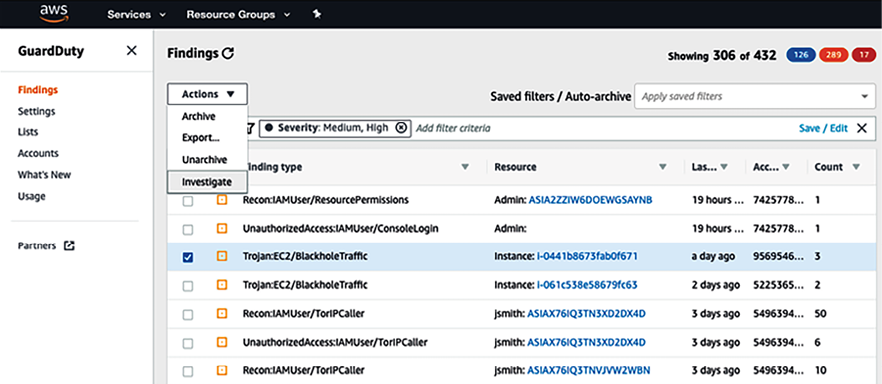

Figure 9.9: Security monitoring using Amazon GuardDuty

Other tools that can be used for security monitoring include Imperva, McAfee, Qualys, Palo Alto Networks, Sophos, and Symantec.

While you are putting application monitoring tools in place to monitor all components of your system, it is essential to monitor the monitoring system. Make sure to monitor the host of your monitoring system. For example, if you’re hosting your monitoring tool in Amazon **Elastic Compute Cloud** (**EC2**), then AWS CloudWatch can monitor the health of EC2.

#### Handling alerts and incident response

Monitoring is one part of operational excellence functioning; the other part involves handling alerts and acting upon them. Using alerts, you can define the system threshold and when you want to work. For example, if the server CPU utilization reaches 70% for 5 minutes, then the monitoring tool records high server utilization and sends an alert to the operations team to take action to bring down CPU utilization before a system crashes. Responding to this incident, the operations team can add the server manually. When automation is in place, autoscaling triggers the alert to add more servers as per demand. It also sends a notification to the operations team, which can be addressed later.

Incident response is essential for dealing with these alerts and resolving issues. Actions taken can be automated or managed by an operations team to address system outages or failures. This process ensures that any disruptions are promptly and efficiently handled to reduce their impact on the organization’s operations, maintaining the system’s reliability and availability for users and stakeholders.

Often, it would help if you define the alert category and the operations team prepared for the response as per the alert severity. The following levels of severity provide an example of how to categorize alert priority:

*   **Severity 1**: This is a critical priority issue. A Sev1 issue should only be raised when there is a significant customer impact for which immediate human intervention is needed. A Sev1 alert could be that the entire application is down. The typical team needs to respond to these alerts within 15 minutes and requires 24/7 support to fix the issue.
*   **Severity 2**: This is a high-priority alert that should be addressed during business hours. For example, the application is up, but the rating and review system is not working for a specific product category. The typical team needs to respond to these alerts within 24 hours and requires regular office hours support to fix the issue.
*   **Severity 3**: This is a medium-priority alert that can be addressed during business hours over days—for example, the server disk is going to fill up in 2 days. The typical team needs to respond to these kinds of alerts within 72 hours and requires regular office hours support to fix the issue.
*   **Severity 4**: This is a low-priority alert that can be addressed during business hours over the week—for example, **Secure Sockets Layer** (**SSL**) certification will expire in 2 weeks. The typical team needs to respond to these kinds of alerts within the week and requires regular office hours support to fix the issue.
*   **Severity 5**: This falls into the notification category, where no escalation is needed, and it can be simple information—for example, sending a notification that deployment is complete. Here, no response is required in return since it is only for information purposes.

Each organization can have different alert severity levels as per their application needs. Some organizations may want to set four severity levels, while others may go for six. Also, alert response times may differ. Some organizations may want to address Sev2 alerts within 6 hours on a 24/7 basis rather than waiting for them to be addressed during office hours.

While setting up an alert, make sure the title and summary are _descriptive_ and _concise_. Often, an alert is sent to a mobile (as an SMS) or a pager (as a message) and needs to be short and informative enough to enable the receiver to take immediate action. Make sure to include proper metrics data in the message body. For example, in the message body, include specific information such as _The disk is 90% full in production-web-1 server_ rather than just saying _The disk is full_. The following screenshot from **CloudWatch** shows an example alarm dashboard:

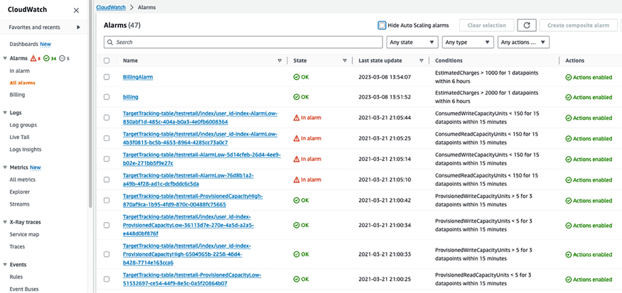

Figure 9.10: Alarm dashboard

As shown in the preceding alarm dashboard, one alarm is in progress when a NoSQL Amazon DynamoDB database table called testretail uses a low write capacity unit and causes unnecessary additional costs.

The bottom alarms and top two alarms have an **OK** status as data is collected during monitoring that is well within the threshold.

There may sometimes be alarms showing **insufficient data**, which means there needs to be more data points to determine the state of resources you monitor. Consider this alarm valid if data can be collected to move it into the OK state.

Testing incident response in the case of critical alerts is important to make sure you are ready to respond as per the defined SLA. Make sure your threshold is set up correctly so that you have enough room to address the issue and don’t send too many alerts. Ensure that as soon as the issue is resolved, your alert gets reset to the original setting and is ready to capture event data again.

An incident is any unplanned disruption that impacts the system and customer negatively. The first response during an incident is to recover the system and restore the customer experience. Fixing the underlying issue can be addressed later as the system gets restored and starts functioning. The automated alert helps to actively discover the incident and minimizes user impact. This can act as a failover to a disaster recovery site if the entire system is down. The primary system can be fixed and restored later.

For example, Netflix uses the _Simian Army_ ([https://netflixtechblog.com/the-netflix-simian-army-16e57fbab116](https://netflixtechblog.com/the-netflix-simian-army-16e57fbab116)), a set of tools to test system resilience, including Chaos Monkey. Chaos Monkey orchestrates the random termination of a production server to test if the system can respond to disaster events without any impact on end users. Similarly, Netflix has other monkeys to test various dimensions of system architecture, such as Security Monkey, Latency Monkey, and even Chaos Gorilla, which can simulate outages of the entire availability zone.

Monitoring, alerts, and incident response are critical components of achieving operational excellence. All monitoring systems typically have an alert feature integrated with them. A fully automated alert and monitoring system improves the operations team’s ability to maintain the health of the system and provide expertise, enabling them to take quick action and enhance the user experience.

As you monitor your application environment, it’s crucial to apply continuous improvement and continuously strive to achieve excellence. Let’s learn more about improving operational excellence.

Improving operational excellence
--------------------------------

Continuous improvement is required for any process, product, or application to excel. Operational excellence needs continuous improvement to attain maturity over time.

It would be advisable to implement small incremental changes as you perform RCA to learn lessons from various operations activities. Learning from failure will help you anticipate any operational event that may be planned (such as deployments) or unplanned (such as utilization surge). You should record all lessons learned and update remedies in your operation runbook. For operational improvement, the following are the areas where you need appropriate tools:

*   **IT operations analytics** (**ITOA**)
*   RCA
*   Auditing and reporting

### IT operations analytics

ITOA is the practice of gathering data from various resources to make a decision and predict any potential issue that you may encounter. It’s essential to analyze all events and operational activities to improve. Analyzing failures will help to predict any future event and keep the team prepared to provide the appropriate response.

A large organization could have hundreds of systems generating a massive amount of data. Implement a mechanism to collect the logs of operations events, various activities across workloads, and infrastructure changes, storing this data for a defined length of time, such as 90 or 180 days. ITOA uses big data architecture to store and analyze multiple terabytes of data from all over the place.

It helps you discover issues you could not find by looking at individual tools and helps you determine dependencies between various systems, providing a holistic view.

As shown in the following diagram, each system has its own monitoring tool that helps to get insights and maintains individual system components. For operations analytics, you need to ingest this data in a centralized place. Having all operation data collection in one place gives you a single source of truth, where you can query required data and run analytics to get meaningful insights:

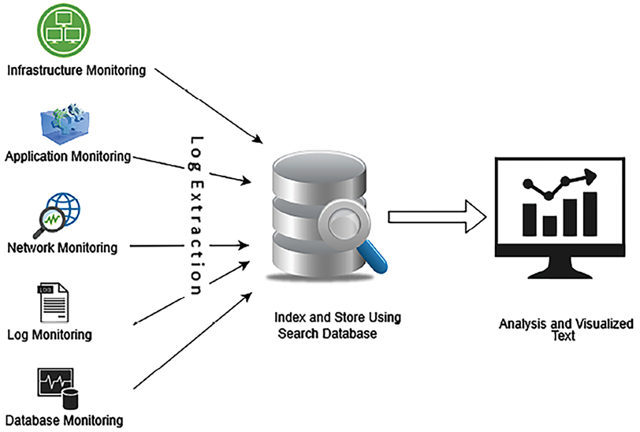

Figure 9.11: Big data approach for ITOA

To create an operations analytics system, you can use scalable big data storage such as Amazon **Simple Storage Service** (**S3**). You can also store data in an on-premises Hadoop cluster. For data extraction, an agent, such as the Amazon CloudWatch agent, can be installed on each server, which can send all monitoring data to a centralized storage system. Third-party tools such as ExtraHop and Splunk can help to extract data from various systems.

Once data is collected in centralized storage, you can perform data transformation to convert the data, making it ready for search and analysis. Data transformation and cleaning can be achieved using big data applications like Spark, MapReduce, AWS Glue, etc.

To visualize the data, you can use any business intelligence tool such as Tableau, MicroStrategy, Amazon QuickSight, and so on. Here, we are discussing building an **Extract, Transform, and Load** (**ETL**) pipeline. You will learn more details in _Chapter 12_, _Data Engineering for Solution Architecture_.

You can further perform machine learning to do predictive analysis on a future event. You will learn more about machine learning in _Chapter 13_, _Machine Learning Architecture_.

### Root Cause Analysis

For continuous improvement, you want to prevent any errors from happening again. If you can identify problems correctly, an efficient solution can be developed and applied. It’s essential to get to the root cause of the problem to fix the problem.

**Five whys** is a simple yet effective technique to identify the root cause of a problem. In the _five whys technique_, you gather the team for a retrospective look at an event and ask five consecutive questions to identify actual issues. Take an example of where data must appear in your application monitoring dashboard, but isn’t currently. You will ask five whys to get to the root cause.

**Problem**: The application dashboard is not showing any data.

1.  Why: Because the application is unable to connect with the database
2.  Why: Because the application is getting a database connectivity error
3.  Why: Because the network firewall is not configured to the database port
4.  Why: Because the configuring port is a manual check, and the infrastructure team missed it
5.  Why: Because the team doesn’t have the tools for automation

**Root Cause**: Manual configuration error during infrastructure creation.

**Solution**: Implement a tool for automated infrastructure creation.

In the preceding example, at first glance, the issue looks like it is related to the application. After the _five whys_ analysis, it turns out to be a bigger problem, and there is a need to introduce automation to prevent similar incidents.

RCA helps the team to document lessons learned and continuously build upon them for operational excellence. Ensure you update and maintain your runbook – as you will code and share best practices across the team.

### Auditing and reporting

Auditing is an essential activity to identify any malicious activity in the system by internal or external interference and create recommendations to help resolve this. An audit becomes especially important if your application must comply with regulatory body requirements—for example, PCI, HIPAA, **Federal Risk and Authorization Management Program** (**FedRAMP**), and the **International Organization for Standardization** (**ISO**). Most regulatory bodies need to conduct regular audits and verify each activity going on in the system to prepare a compliance report and grant a certificate.

An audit is essential to prevent and detect security events. A hacker may silently get into your system and systematically steal information without anyone noticing. Regular security audits can uncover a hidden threat.

Consider conducting a regular audit for cost optimization to identify if resources are running idle when not required. Also, determine resource demand and available capacity so that you can plan.

An IT audit makes sure you safeguard IT assets and license protection and that you ensure data integrity and operations adequately to achieve your organizational goal.

The screenshot below illustrates a data audit that has been stored in an Amazon S3 bucket, utilizing Amazon Macie. Amazon Macie is a data security and privacy service powered by machine learning and pattern-matching technologies. It is specifically designed to detect and safeguard sensitive data within AWS environments.

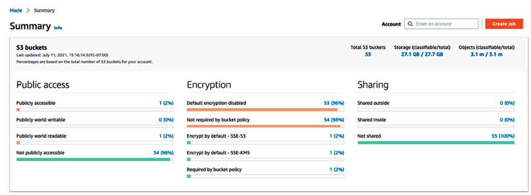

Figure 9.12: Data audit report summary from Amazon Macie

The data audit report in the preceding screenshot shows data accessibility, encryption, and data sharing reports along with data storage and size details.

Auditing steps include planning, preparing, evaluating, and reporting. Any risk items must be highlighted in the report, and follow-ups should be conducted to address open issues.

Achieving operational excellence in the public cloud
====================================================

A public cloud provider such as AWS, GCP, or Azure provides many inbuilt capabilities and guidance to achieve operational excellence in the cloud, for example, cloud providers advocate automation, one of the most essential factors for operational excellence.

Taking the example of the AWS cloud, the following services can help to achieve operational excellence:

*   The following AWS services help you in the **planning** phase:
    *   **AWS Trusted Advisor**: AWS Trusted Advisor checks your workload based on prebuilt best practices and provides recommendations to implement them.
    *   **AWS CloudFormation**: With AWS CloudFormation, the entire workload can be viewed as code, including applications, infrastructure, policy, governance, and operations.
    *   **AWS Systems Manager**: AWS Systems Manager provides the ability to manage cloud servers in bulk for patching, updates, and overall maintenance.
*   The following AWS services help you with the **functioning** phase:
    *   **Amazon CloudWatch**: CloudWatch provides hundreds of inbuilt metrics to monitor workload operation and trigger alerts as per the defined threshold. It provides a central log management system and triggers an automated incident response.
    *   **AWS Lambda**: This AWS service can be used to automate responses to operational events.
*   The following AWS services will help you with the **improving** phase:
    *   **Amazon OpenSearch**: OpenSearch can be used to analyze log data to gain insight and use analytics to learn from experience.
    *   **AWS CodeCommit**: You can share learning with libraries, scripts, and documentation by maintaining them in the central repository as code.

AWS provides various capabilities to provision your applications and infrastructure as code. These capabilities help you to automate operations and incident response. With AWS, you can easily replace failed components with a good version and analyze the failed resources without impacting the production environment.

On AWS, you can collect and combine logs from system operations, workload activities, and infrastructure to create a comprehensive history of activities, a task effectively accomplished using services like AWS CloudTrail. Utilizing AWS tools, you can then query and analyze these operational logs over time. This analysis can help you identify areas for improvement and enhance your system’s efficiency and security. In the cloud, resource discovery is easy, as all assets are located under the API- and web-based interfaces within the same hierarchy. You can also monitor your on-premises workload from the cloud. For security auditing in the AWS cloud, Amazon GuardDuty and Amazon Detective provide excellent insight and details across multiple accounts.

Operational excellence requires ongoing commitment. Each operational failure should be thoroughly analyzed to enhance the performance and reliability of your application. This process involves understanding the specific demands and characteristics of your application’s load and adapting your operational strategies accordingly. Further, by documenting regular activities as a runbook, following steps to guide issue handling, using automation, and creating awareness, your operations will be ready to deal with any failure event.

Driving efficiency with CloudOps
================================

CloudOps refers to processes, tools, and best practices for efficiently operating and managing cloud environments. Benefits of CloudOps include improved efficiency, reduced costs, better security and compliance, faster recovery from failures, and the ability to scale rapidly.

The key pillars of CloudOps, applicable across cloud providers, are:

*   **Set up governance**: Implement a secure, well-architected environment. Utilize tools like AWS Organizations, Azure Management Groups, or Google Cloud Resource Manager for account organization and governance. Enforce policies with tools such as AWS Control Tower, Azure Blueprints, or Google Cloud’s Policy Intelligence.
*   **Enable compliance**: Continuously monitor configurations with tools like AWS Config, Azure Policy, or Google Cloud Security Command Center. Automate compliance checks and remediation to align with industry standards.
*   **Provision and orchestrate**: Accelerate environment setup using infrastructure-as-code with tools such as AWS CloudFormation, Azure Resource Manager templates, or Google Cloud Deployment Manager. Employ tools like AWS Service Catalog, Azure Service Catalog, or Google Cloud Service Catalog to manage standardized IT service portfolios.
*   **Monitor and observe**: Ensure observability using tools such as AWS CloudWatch, Azure Monitor, or Google Cloud Operations Suite. Quickly identify and troubleshoot issues to maintain system performance and reliability.
*   **Centralize operations**: Manage your infrastructure at scale using tools like AWS Systems Manager, Azure Automation, or Google Cloud Operations for automation and centralized management, enhancing operational efficiency.
*   **Manage costs**: Control and optimize expenses with tools such as AWS Cost Explorer, Azure Cost Management, or Google Cloud Cost Management. Set budgets, monitor spending, and detect anomalies to keep costs in check.

By aligning CloudOps practices, you can maintain a consistent and efficient operational framework, regardless of the cloud environment.

Automation is the backbone of CloudOps. It helps organizations manage complex cloud environments more efficiently and with fewer errors. For example, infrastructure changes, which can be error-prone if done manually, are automated through AWS CloudFormation or a similar tool, ensuring consistency and speed. When performance issues are detected by monitoring tools like AWS CloudWatch, automated actions can be triggered to address these issues without manual intervention.

Adopting CloudOps is a journey that starts with foundational governance and compliance. For example, a digital marketing agency may start by securing their cloud environments in alignment with best practices before moving towards full automation of their deployment pipelines. As digital marketing agencies grow, cross-team collaboration becomes crucial for sharing best practices and tools. By starting with governance and compliance and gradually adding automation, teams can manage costs effectively and scale operations efficiently.

Here, we took the AWS example, but the same concept is applicable to any public cloud like GCP and Azure.

With CloudOps, the entire life cycle of building, deploying, monitoring, and operating cloud environments is streamlined, paving the way for agile development and operational excellence.

To learn more details about CloudOps, you can refer to our other book, _AWS for Solutions Architects_.

Summary
=======

Operational excellence can be achieved by continuously improving according to operational needs and lessons learned from past events. You can achieve business success by increasing the excellence of your operations. Focus on developing and managing applications in a way that boosts efficiency and ensures highly responsive deployments. Implementing best practices in your workloads is key to achieving operational excellence.

In this chapter, you learned about the design principles to achieve operational excellence. These principles advocate operation automation, continuous improvement, incremental approaches, predicting failure, and being ready to respond.

You learned about various phases of operational excellence and corresponding technology choices. In the planning phase, you learned about ITAM to track the inventory of IT resources and identify dependencies between them using configuration management.

You learned about alerts and monitoring in the functioning phase of operational excellence and you considered various kinds of monitoring, including infrastructure, application, log, security, and platform monitoring. You learned about the importance of alerts and how to define alert severity and respond to it.

During the improvement phase of operational excellence, you learned about analytics in IT operations by building a big data pipeline for analytics, methods to perform RCA using the _five whys_, and the importance of auditing to save the system from any malicious behaviors and unnoticed threats.

You learned about operational excellence in the cloud and different inbuilt tools that can be utilized for operational excellence in the AWS cloud. Finally, you learned about CloudOps and how it can help you to streamline cloud operations.

As of now, you have learned best practices in the areas of performance, security, reliability, and operational excellence. In the next chapter, you will learn about best practices for cost optimization. You will also learn about various tools and techniques to optimize overall system costs and how to leverage multiple tools in the cloud to manage IT expenditure.
