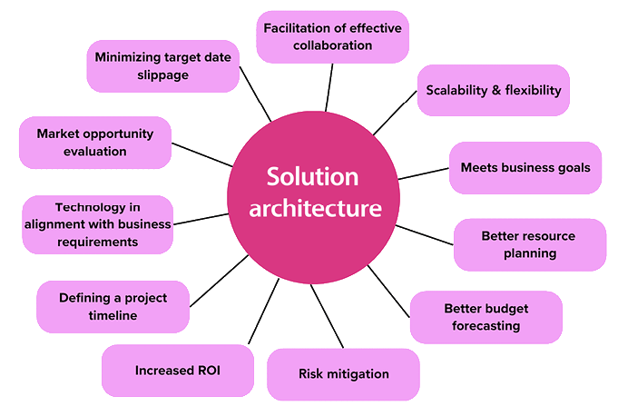
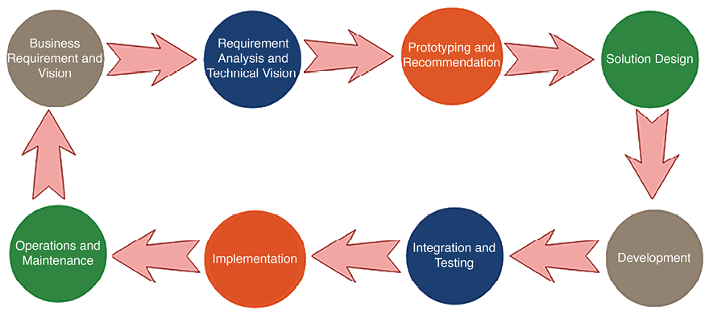
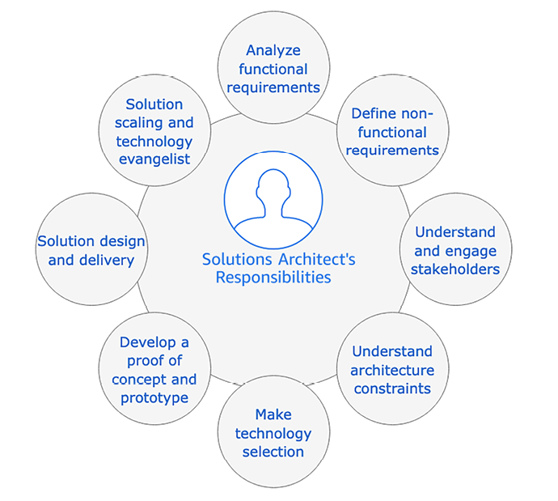
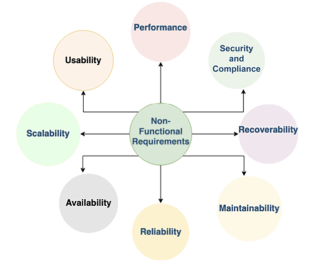
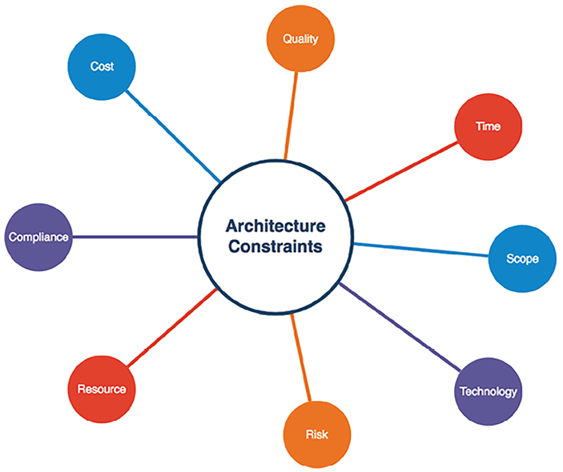

# معماران راه‌حل در سازمان‌ها

این کتاب راهنمای کامل شما برای معماری راه‌حل است و به‌گونه‌ای طراحی شده تا به شما کمک کند معماران ماهرتری شوید. در این فصل، شما به معنای معماری راه‌حل و اهمیت آن به عنوان پایه توسعه راه‌حل‌ها در سازمان‌ها می‌پردازید. معماری راه‌حل شامل طراحی یک چارچوب قوی است که حوزه‌های مهمی مانند زیرساخت IT، امنیت برنامه، قابلیت اطمینان و ملاحظات عملیاتی را پوشش می‌دهد.

معماران راه‌حل نزدیک به ذینفعان همکاری می‌کنند، الزامات را تجزیه و تحلیل می‌کنند و محدودیت‌هایی مانند هزینه، بودجه، زمان‌بندی و مقررات را در نظر می‌گیرند تا یک راه‌حل جامع ایجاد کنند.

معماران راه‌حل همچنین پس از راه‌اندازی به‌طور فعال در تضمین قابلیت مقیاس پذیری دسترسی و قابلیت نگهداری شرکت می‌کنند. به علاوه، آن‌ها با تیم فروش همکاری می‌کنند تا محصول و مزایای فناوری آن را ترویج کنند.

در این فصل، شما در مورد موضوعات زیر آموزش خواهید دید:

- معماری راه‌حل چیست؟
- نقش معماران راه‌حل
- درک مسئولیت‌های یک معمار راه‌حل
- معماران راه‌حل در یک سازمان چگونه عمل می‌کنند؟
- چالش‌های معماران راه‌حل
- مسیر شغلی و توسعه مهارت برای معماران راه‌حل

تا پایان این فصل، شما به دانشی ارزشمند درباره نقش معماران راه‌حل و چالش‌هایی که با آنها مواجه هستند دست خواهید یافت. شما خواهید دید که چگونه معماران راه‌حل با محدودیت‌ها برخورد می‌کنند و به ارتباطات و توانمندی‌های فنی یک سازمان و موفقیت کلی آن کمک می‌کنند.

## معماری راه‌حل چیست؟

مفهوم معماری راه‌حل ممکن است بسته به دیدگاه حرفه‌ایان و سازمان‌های مختلف متفاوت باشد. با این حال، در جوانب اصلی خود، معماری راه‌حل شامل تعریف و تصور جوانب مختلف یک راه‌حل تجاری است که هم از جنبه‌های استراتژیک و هم تراکنشی مد نظر قرار می‌گیرد.

از دیدگاه استراتژیک، یک معمار راه‌حل مسئول توسعه یک دید بلندمدت برای نرم افزار است. این دید اطمینان می‌دهد که راه‌حل همچنان مرتبط و قابل تطبیق با تغییرات آینده باشد و توانایی جلب تغییرات جدید جهت تامین نیازهای کاربران و بار کاری در حال تکامل را داشته باشد.

از دیدگاه تاکتیکی، معماری راه‌حل بر روی نیازهای فوری کسب‌وکار تمرکز دارد. این شامل طراحی یک برنامه است که می‌تواند بار کاری فعلی را مدیریت کند و به طور مؤثر به چالش‌های روزانه سازمان پاسخ دهد.

با این حال، معماری راه‌حل از محدودیت نرم‌افزار خارج می‌شود. این شامل کل سیستم، از جمله جوانبی مانند زیرساخت سیستم، شبکه‌بندی، امنیت، نیازمندی‌های تطابق، عملکرد سیستم، ملاحظات هزینه و قابلیت اعتماد می‌شود.

با در نظر گرفتن این عناصر مختلف، یک معمار راه‌حل یک نقشه کامل ایجاد می‌کند که راهنمای توسعه و پیاده‌سازی راه‌حل است. این نقشه نه تنها اطمینان می‌دهد که راه‌حل نیازهای حال کسب‌وکار را برآورده می‌کند بلکه پایه آینده رشد و موفقیت آن را فراهم می‌کند.

## مزایای معماری راه‌حل

معماری راه‌حل به عنوان یکی از مهمترین جوانب دارای مزیت‌های بسیاری است. ابتدا، این یک پایه سازگار برای توسعه راه‌حل‌های نرم‌افزاری شرکت فراهم می‌کند. هنگامی که پروژه‌ها در اندازه بزرگ شده و تیم‌ها به صورت جغرافیایی پراکنده می‌شوند، داشتن یک معماری راه‌حل خوب تضمین می‌کند که پایداری بلندمدت و همکاری مؤثر حفظ می‌شود.

معماری راه‌حل به نیازهای متنوع یک راه‌حل پاسخ می‌دهد در حالی که با متن هماهنگی با زمینه کلی کسب‌وکار حفظ می‌کند. این عناصر حیاتی شامل پلتفرم‌های فناوری، اجزاء برنامه، نیازهای داده، نیازهای منابع و نیازهای ضروری غیرعملیاتی می‌شوند. این نیازهای غیرعملیاتی شامل مقیاس پذیری قابلیت اعتماد، عملکرد، دسترسی، امنیت و نگهداری می‌شوند. با در نظر گرفتن این جوانب، معماری راه‌حل اطمینان می‌دهد که راه‌حل توسعه یافته با استانداردها و انتظارات لازم مطابقت دارد.

_شکل ۱.۱_ تجزیه و تحلیلی از مزایای ممکنی که یک سازمان از استفاده از نقش معماران راه‌حل در کسب‌وکار بهره می‌برد، را نشان می‌دهد.

نمودار پیشین ویژگی‌های زیر را در معماری راه‌حل خوب برجسته می‌کند:

- **هماهنگی فناوری با نیازهای کسب‌وکار**: معماران راه‌حل ارزیابی می‌کنند که سازمان یا پروژه باید چه فناوری‌هایی را انتخاب کند تا نیازهای کسب‌وکار را برآورده کند و برای حفظ‌پذیری بلندمدت، قابلیت نگهداری و مجموعه مهارت‌های تیم ایده‌آل باشد.
- **ارزیابی فرصت‌های بازار**: معماری راه‌حل شامل فرآیند تحلیل و ارزیابی مداوم آخرین روندهای بازار است تا اطمینان حاصل شود که راه‌حل توسعه یافته نیازهای مشتریان و همچنین نیازهای کسب‌وکار را برآورده می‌کند. همچنین به ساخت و تبلیغ محصولات جدید کمک می‌کند.
- **کاهش احتمال انحراف زمان مقصد**: یک معمار راه‌حل به طور مداوم با تمام نهادها، شامل تیم کسب‌وکار، مشتریان و تیم توسعه، همکاری می‌کند. او اطمینان می‌یابد که راه‌حل کلی با هدف کسب‌وکار و زمان بندی عرضه در هماهنگی است تا احتمال کمتری از انحراف زمان مقصد وجود داشته باشد.
- **تسهیل همکاری مؤثر**: معماری راه‌حل به عنوان یک نقطه مشترک مرجع و ابزار ارتباطی برای نهادهای درگیر در پروژه عمل می‌کند. این باعث همکاری مؤثر بین تیم‌های کسب‌وکار، توسعه‌دهندگان، طراحان و سایر نهادهای درگیر می‌شود. مستندات و تصویرسازی روشن از معماری راه‌حل بهترین درک، هماهنگی و تصمیم‌گیری بین اعضای تیم را فراهم می‌کند و اطمینان می‌یابد که همه بر روی هدف‌های مشترک کار می‌کنند.
- **قابلیت انطباق و انعطاف پذیری**: معماری راه‌حل به عنوان عوامل کلیدی انطباق و انعطاف پذیری را مد نظر قرار می‌دهد. این به راه‌حل اجازه می‌دهد که به طور پیوسته با تغییرات کسب‌وکار و افزایش بار کاری کاربران سازگار شود و رشد کند. با پیش‌بینی رشد آینده و درگیر کردن اقدامات انطباق پذیری، معماری راه‌حل اطمینان می‌دهد که سیستم بتواند نیازهای گسترده را بدون اختلالات قابل توجه یا کارهای با هزینه بالا مدیریت کند.
- **رسیدن به اهداف کسب‌وکار**: مسئولیت اصلی طراحی معماری راه‌حل، تأمین نیازهای سهام‌داران و تطبیق آن با الزامات آن‌ها است. معماری راه‌حل اهداف کسب‌وکار را به یک دیدگاه فنی تبدیل می‌کند با تجزیه و تحلیل روندهای بازار و پیاده‌سازی بهترین روش‌ها. معماری راه‌حل باید به اندازه کافی انعطاف‌پذیر باشد تا نیازهای کسب‌وکار جدید، چالش‌های دشوار، مطالبات و تغییرات سریع را برآورده کند.
- **برنامه‌ریزی بهتر منابع**: با یک معماری راه‌حل واضح، سازمان‌ها می‌توانند نوع و مقدار منابع مورد نیاز را به دقت تعیین کنند. این امکان را برای برنامه‌ریزی استراتژیک منابع انسانی فراهم می‌کند، اطمینان از منابع مالی مناسب و زمان مناسب فراهم می‌آورد و اطمینان حاصل می‌شود که پروژه‌ها به‌طور مناسب تجهیز شده و منابع به بهترین نحو استفاده شده‌اند که به اجرای گرامی‌تر پروژه و رعایت زمان‌بندی‌ها منجر می‌شود.
- **پیش‌بینی بهتر بودجه**: سرمایه‌گذاری در تخمین دقیق برای پیش‌بینی بودجه بسیار حیاتی است. یک معماری راه‌حل واضح، نقشه واضحی از منابع مورد نیاز برای اتمام پروژه فراهم می‌کند. فهم دقیق از دامنه و نیازها به شرح زیر امکان پیش‌بینی هزینه‌ها را دقیق‌تر می‌کند و ریسک از برون‌میزنها را کم می‌کند.
- **کاهش ریسک**: یک معماری راه‌حل خوب شامل ارزیابی و استراتژی‌های کاهش ریسک است. با شناسایی ریسک‌های ممکن در ابتدا، معماران راه‌حل می‌توانند تدابیری برای کاهش آن‌ها اجرا کنند. این رویکرد فعالانه به کمک کاهش تأثیرات ریسک بر زمان‌بندی پروژه، بودجه و موفقیت کلی پروژه می‌آید. استراتژی‌های کاهش ریسک می‌تواند شامل طرح‌های پشتیبان، تدابیر تکراری، ملاحظات امنیتی و طرح‌های بازیابی بلایا باشد.
- **افزایش بازده سرمایه‌گذاری**: معماری راه‌حل تعیین‌کننده بازده سرمایه‌گذاری است و به اندازه کافی اعتبار به برنامه می‌دهد که موفقیت پروژه را ارزیابی کند. این وظیفه را به بیزینس اجبار می‌دهد که در مورد راه‌های کاهش هزینه و حذف تلفات فرآیندی با استفاده از اتوماسیون برای بهبود کلی بازده سرمایه‌گذاری فکر کند.
- **تعیین زمان‌بندی پروژه**: تعیین یک زمان‌بندی دقیق برای پیاده‌سازی راه‌حل بسیار حیاتی است. یک معمار راه‌حل منابع و تلاش‌های مورد نیاز در طول فاز طراحی را تعیین می‌کند که باید به تعیین برنامه زمانی برای توسعه راه‌حل کمک کند.

حال که شما یک دید کلی از معماری راه‌حل و مزایای آن را دارید، بیایید در مورد نقش معمارهای راه‌حل و چگونگی کمک آن‌ها در ساخت یک معماری راه‌حل خوب بیشتر بیاموزیم.

# نقش معمار راه حل ها

اگر می خواهید بدانید که چگونه یک راه حل باید سازماندهی و ارائه شود، پس به نقش معمار راه‌حل فکر می‌کنید. یک معمار راه حل، سیستم کلی و نحوه ادغام سیستم های مختلف در گروه های مختلف را طراحی می کند. یک معمار راه حل، نتیجه مورد انتظار را با کار با ذینفعان تجاری و ارائه درک روشنی از هدف تحویل از طرف تیم فنی تعریف می کند.

_شکل 1.2_ شامل فلوچارتی است که چرخه عمر تحویل محلول را نشان می دهد. معمار راه حل ها در تمام مراحل طراحی و ارائه راه حل شرکت دارد.

شکل 1.2: چرخه عمر تحویل محلول

همانطور که نشان داده شده است، چرخه حیات تحویل راه حل شامل موارد زیر است، با روش هایی که یک معمار راه حل در آن مشارکت دارد:

- **نیازها و چشم انداز کسب و کار**: یک معمار راه حل با ذینفعان کسب و کار برای درک چشم انداز آنها کار می کند.
- **تحلیل نیازمندی و چشم انداز فنی**: تجزیه و تحلیل الزامات، تعریف چشم انداز فنی به منظور اجرای استراتژی کسب و کار.
- **نمونه سازی و توصیه**: یک معمار راه حل با توسعه اثبات مفهوم (POC) و نمایش نمونه های اولیه، یک فناوری را انتخاب می کند.
- **طراحی راه حل**: یک معمار راه حل، طرح های راه حل را مطابق با استانداردهای سازمان و با همکاری سایر گروه های تحت تأثیر توسعه می دهد.
- **توسعه**: آنها با تیم توسعه در توسعه راه حل ها و به عنوان پل ارتباطی بین تیم تجاری و فنی کار می کنند.
- **ادغام و تست**: آنها مطمئن می شوند که راه حل نهایی مطابق با تمام الزامات عملکردی و NFR ها کار می کند.
- **پیاده سازی**: آنها با تیم توسعه و استقرار برای اجرای روان کار می کنند و آنها را از طریق هر گونه مشکل راهنمایی می کنند.
- **عملیات و نگهداری**: آنها اطمینان حاصل می کنند که ثبت و نظارت در محل است و تیم را در مقیاس بندی و بازیابی فاجعه در صورت لزوم راهنمایی می کنند.

چرخه زندگی کلی یک فرآیند تکراری است. هنگامی که برنامه وارد تولید می شود و مشتریان شروع به استفاده از آن می کنند، ممکن است نیازهای بیشتری از بازخورد مشتری کشف شود، که چشم انداز محصول را برای پیشرفت های آینده هدایت می کند.

معمار راه حل ها مالکیت عمده ای در طراحی راه حل دارد که در آن موارد زیر را انجام می دهد:

- مستند کردن استانداردهای راه حل
- نعریف کردن طراحی سطح بالا
- نعریف کردن یکپارچه سازی سیستمی
- نعریف کردن فازهای حل مختلف
- نعریف کردن یک رویکرد اجرایی
- نعریف کردن یک رویکرد نظارتی و هشدار
- مستند کردن مزایا و معایب انتخاب های طراحی را
- مستند کردن ممیزی و الزامات انطباق

معماران راه حل تنها مسئول طراحی راه حل نیستند. آنها همچنین به مدیران پروژه در برآورد منابع و هزینه، تعریف جدول زمانی و نقاط عطف پروژه، انتشار پروژه و برنامه پشتیبانی آن کمک می کنند. معمار راه حل ها در مراحل مختلف چرخه راه حل، از طراحی تا تحویل و راه اندازی کار می کند. معمار راه حل ها با ارائه تخصص و درک گسترده به تیم توسعه کمک می کند تا بر موانع و موانع غلبه کند.

بسته به اندازه و پیچیدگی پروژه، ممکن است نیاز به معماران راه حل های متعدد در یک تیم وجود داشته باشد. به طور کلی، این کتاب نقش یک معمار راه حل را به طور کلی بررسی می کند. با این حال، شما اغلب معماران راه حل را با عناوین مختلف، مطابق با ساختار سازمان می بینید. به عنوان مثال، راه حل های سازمانی، نرم افزار، یا معماران فنی. در این بخش، برخی از ویژگی های متمایز مربوط به عناوین مختلف را خواهید یافت. با این حال، بسته به ساختار یک سازمان، ممکن است مسئولیت‌های معماران راه‌حل با هم تداخل داشته باشند.

معماران راه حل را می توان به عنوان متخصص یا متخصص طبقه بندی کرد. معماران راه حل های عمومی دارای دانش گسترده ای در حوزه های فنی متعدد هستند. آنها درک جامعی از جنبه های مختلف معماری راه حل دارند و می توانند راهنمایی جامع ارائه دهند. از
سوی دیگر،
**معماران راه حل های تخصصی *(*SSAs**)
تخصص عمیقی در زمینه های خاص مانند داده های بزرگ، امنیت، شبکه یا حوزه های صنعتی دارند. آنها دانش تخصصی دارند و می توانند راهنمایی های عمیقی را در زمینه های تخصصی خود ارائه دهند.

در بسیاری از موارد، یک معمار راه حل های عمومی با SSA ها همکاری می کند تا نیازمندی ها و پیچیدگی پروژه را هماهنگ کند. این همکاری امکان استفاده از دانش تخصصی متخصصان را فراهم می کند و در عین حال اطمینان می دهد که معماری راه حل کلی منسجم و به خوبی یکپارچه باقی می ماند.

حضور معماران راه حل های عمومی و SSA ها در یک سازمان امکان یک رویکرد متعادل و جامع را برای معماری راه حل می دهد. این تضمین می‌کند که تصمیمات و توصیه‌های معماری با نیازهای پروژه مطابقت دارند و هم وسعت و هم عمق دانش را در بر می‌گیرند.

با ترکیب مهارت‌ها و تخصص انواع مختلف معماران راه‌حل، سازمان‌ها می‌توانند به طور موثر چالش‌ها و الزامات منحصربه‌فرد پروژه‌های خود را برطرف کنند و منجر به طراحی و اجرای موفق راه‌حل‌های قوی شوند.

## نقش معمار راه حل های عمومی

معماران راه حل های عمومی با داشتن درک گسترده ای از حوزه های فنی متعدد، نقش مهمی در معماری راه حل ایفا می کنند. آنها دارای یک پایگاه دانش جامع هستند که به آنها اجازه می دهد راهنمایی ارائه دهند و تصمیمات آگاهانه در جنبه های مختلف طراحی و اجرای راه حل بگیرند. در زیر انواع مختلف نقش های معمار راه حل های عمومی آورده شده است.

### معمار راه حل های سازمانی

آیا تا به حال به نحوه عرضه محصولات در صنعت فناوری اطلاعات فکر کرده اید؟ اینجاست که نقش راه حل سازمانی به تصویر کشیده می شود - آنها بهترین شیوه ها، فرهنگ و فناوری های مناسب را تعریف می کنند. یک معمار سازمانی برای شناسایی استراتژی های سازمانی برای فناوری اطلاعات و اطمینان از همسویی دانش آنها با قوانین تجاری شرکت، از نزدیک با سهامداران، کارشناسان موضوع و مدیریت همکاری می کند.

معماران سازمانی طراحی راه حل را در سراسر سازمان مدیریت می کنند. آنها برنامه ها و راه حل های بلند مدت را با ذینفعان و رهبری ایجاد می کنند. یکی از مهم ترین جنبه ها، نهایی کردن این است که کدام فناوری ها باید توسط شرکت مورد استفاده قرار گیرند و اطمینان حاصل شود که شرکت از این فناوری ها با ثبات و یکپارچگی استفاده می کند.

یکی دیگر از جنبه های مهم نقش معمار سازمانی، تعریف معماری کسب و کار است. در برخی از سازمان‌ها، ممکن است _ معمار کسب و کار_ را به عنوان عنوان شغل ببینید. معماری کسب و کار شکاف بین استراتژی سازمانی و اجرای موفقیت آمیز آن را پر می کند. این کمک می کند تا یک استراتژی نقشه را به آیتم های عملیاتی اجرایی تبدیل کند و این را به یک سطح تاکتیکی برای پیاده سازی برساند.

تفاوت اصلی بین یک معمار راه حل ها و یک معمار راه حل های سازمانی در محدوده کار و تمرکز آنها نهفته است. معمار راه حل ها بر روی پروژه ها یا راه حل های خاص، طراحی و هدایت اجرای برنامه ها یا سیستم ها در راستای نیازهای تجاری و فناوری تمرکز می کند. نقش آنها اغلب پروژه محور است و بر فناوری های خاص یا حوزه های کاربردی متمرکز است. در مقابل، یک معمار راه حل های سازمانی در سطح استراتژیک تری عمل و نظارت می کند
آنها از همسویی استراتژی فناوری اطلاعات با اهداف تجاری، ادغام معماری های راه حل های مختلف در بخش ها اطمینان می دهند. این نقش طیف وسیع تری از فناوری ها و فرآیندهای تجاری را پوشش می دهد و بر چشم انداز فناوری کل نگر و جهت گیری استراتژیک سازمان تمرکز دارد.

به طور کلی، معماران سازمانی زمانی که نوبت به تعریف استانداردهای کل سازمان برای اجرای موفقیت آمیز چشم انداز کسب و کار می رسد، بیشتر با دیدگاه ها و مسئولیت های شرکت هماهنگ هستند.

### معمار اپلیکیشن

یک معمار اپلیکیشن، که گاهی به عنوان معمار نرم افزار از آن یاد می شود، نقشی حیاتی در طراحی و توسعه نرم افزار ایفا می کند. آنها برای تعریف جزئیات فنی پروژه های توسعه نرم افزار با سازمان همکاری می کنند. معمار برنامه روی اطمینان از همسویی نرم افزار با بهترین شیوه های تکنولوژی و رعایت استانداردهای سازمان تمرکز می کند. آنها در تیم های مختلف کار می کنند تا بفهمند چگونه یکپارچه سازی با سایر ماژول های نرم افزاری اتفاق می افتد.

به عنوان مثال، یک سازمان مراقبت های بهداشتی ممکن است اطمینان حاصل کند که یک سیستم مدیریت بیمار جدید به طور یکپارچه با سیستم های پرونده الکترونیکی سلامت موجود ادغام می شود و هم از مقررات مراقبت های بهداشتی و هم پروتکل های داخلی پیروی می کند. یا در یک مؤسسه مالی، آنها ممکن است بر توسعه یک برنامه بانکی جدید نظارت داشته باشند و اطمینان حاصل کنند که به طور ایمن با سیستم های پردازش تراکنش های موجود ادغام می شود و با استانداردهای صنعت مالی مطابقت دارد. در هر دو مورد، معمار برنامه اطمینان حاصل می کند که نرم افزار نه تنها نیازهای عملکردی را برآورده می کند، بلکه به استانداردهای حیاتی صنعت و سازمان نیز پایبند است.

یکی از مسئولیت های کلیدی یک معمار اپلیکیشن مدیریت جنبه های فنی توسعه نرم افزار است. آنها بر طراحی API نظارت می کنند و اطمینان می دهند که به خوبی طراحی شده و عملکرد بهینه دارد. آنها همچنین الزامات مقیاس پذیری را در نظر می گیرند و اطمینان حاصل می کنند که نرم افزار می تواند افزایش حجم کار را مدیریت کند. علاوه بر این، معمار برنامه یکپارچگی یکپارچه با سایر اجزای نرم افزار را تضمین می کند و مطمئن می شود که آنها می توانند به راحتی با یکدیگر تعامل داشته باشند.

معمار برنامه به عنوان یک نقطه تماس برای سوالات فنی از تیم مهندسی عمل می کند. آنها مشکلات را عیب یابی می کنند و برای اطمینان از عملکرد روان سیستم راهنمایی می کنند.

در حالی که پروژه های کوچکتر توسعه نرم افزار ممکن است معمار برنامه اختصاصی نداشته باشند، یک مهندس ارشد اغلب این مسئولیت را بر عهده می گیرد و روی طراحی معماری نرم افزار کار می کند.

معمار اپلیکیشن علاوه بر تخصص فنی، نقش مربی را نیز ایفا می کند. آنها تیم مهندسی نرم افزار را پشتیبانی و راهنمایی می کنند و هر گونه مانعی را که در طول ادغام بین تیمی یا به دلیل نیازهای تجاری در حال تحول ایجاد می شود، برطرف می کنند. همکاری نزدیک آنها با تیم، فرآیند توسعه نرم افزاری منسجم و موفقی را تضمین می کند.

به طور کلی، معمار برنامه با ارائه رهبری فنی، اطمینان از پایبندی به بهترین شیوه ها و حمایت از تیم مهندسی در طول چرخه عمر توسعه، به موفقیت کلی پروژه های نرم افزاری کمک می کند.

### معمار ابر

نقش معمار ابر تنها در دهه گذشته به وجود آمده است، اما با افزایش پذیرش ابر در بین شرکت‌ها، این نقشی است که تقاضای زیادی دارد. نقش معمار ابر در پاسخ به پذیرش فزاینده فناوری ابر توسط شرکت ها ظاهر شد. با حرکت سازمان ها به سمت محاسبات ابری، تقاضا برای متخصصان ماهر برای برنامه ریزی، طراحی و مدیریت محیط های ابری افزایش یافته است.

معماران ابر مسئول توسعه و پیاده سازی استراتژی های رایانش ابری شرکت هستند. آنها دانش عمیقی از خدمات مختلف ابری دارند و می توانند راه حل هایی را طراحی کنند که از پتانسیل کامل قابلیت های بومی ابری استفاده کند.

استفاده از ابر در حال حاضر بسیار محبوب شده است، و تبدیل شدن به یک امر عادی برای سازمان ها به سمت ابر عمومی شده است. با محبوبیت پلتفرم های ابری عمومی مانند **Amazon Web Services** (**AWS**)، Microsoft Azure و **Google Cloud Platform** (**GCP**)، معماران ابری نقش مهمی در هدایت بازی می کنند. سازمان ها از طریق فرآیند پذیرش ابری در _فصل 3_، _Cloud Migration و Hybrid Cloud Architecture_ درباره معماری های ابری بیشتر خواهید آموخت.

یکی از وظایف کلیدی یک معمار ابر، کمک به سازمان‌ها در انتقال حجم کاری موجود به فضای ابری است. آنها استراتژی های جامع مهاجرت ابری را توسعه می دهند و معماری های ابری ترکیبی را طراحی می کنند که به طور یکپارچه برنامه های کاربردی در محل را با منابع مبتنی بر ابر یکپارچه می کند. این به سازمان ها امکان می دهد از مقیاس پذیری، کارایی هزینه و سهولت مدیریت ارائه شده توسط ابر استفاده کنند.

برای استارت آپ ها و کسب و کارهایی که از ابتدا در فضای ابری شروع می شوند، یک معمار ابر می تواند معماری های بومی ابری را طراحی کند که برای محیط ابری بهینه شده اند. این معماری‌ها از مدل پرداخت در صورت تمایل برای بهینه‌سازی هزینه‌ها و سرمایه‌گذاری روی قابلیت‌های اتوماسیون ارائه شده توسط ابری استفاده می کنند.

در چشم انداز کسب و کار امروزی، ابر به بخشی جدایی ناپذیر از استراتژی های سازمانی تبدیل شده است. برای پیشرفت در این دوران مدرن و همگام شدن با سرعت سریع نوآوری و اتوماسیون، داشتن یک معمار ابر ماهر ضروری است. آنها با استفاده از قدرت ابر و باز کردن پتانسیل آن برای مقیاس پذیری، کارایی و رشد کسب و کار، نقشی حیاتی در کمک به موفقیت شرکت ها ایفا می کنند.

### معمار بشارت

نقش یک مبشر معمار، که به عنوان مبشر فناوری نیز شناخته می شود، به عنوان یک تغییر دهنده بازی در بازاریابی، به ویژه در زمینه پلتفرم های راه حل پیچیده ظاهر شده است. در یک محیط رقابتی، افراد به دنبال راهنمایی از متخصصانی هستند که دانش عمیقی دارند و می توانند به سوالات آنها پاسخ دهند و آنها را قادر می سازد تا تصمیمات آگاهانه بگیرند. اینجاست که مبشرین معمار با تخصص خود در موضوعات خاص وارد عمل می شوند.

یک مبشر معمار نقش مهمی در طراحی معماری ایفا می کند که نیازهای مشتری را برآورده می کند و نقاط درد آنها را برطرف می کند. با تبدیل شدن به یک مشاور قابل اعتماد برای مشتریان و شرکا، آنها درک عمیقی از مفاهیم معماری، مسائل و روندهای بازار دارند. این تخصص به پذیرش ایمن پلت فرم کمک می کند و از طریق افزایش جذب بازار به رشد درآمد کمک می کند.

برای تشویق به پذیرش پلتفرم در بین مخاطبان هدف، مبشر معمار محتوای عمومی مانند وبلاگ ها، کاغذهای سفید و مقالات ایجاد می کنند. آنها همچنین به طور فعال در پلتفرم های عمومی از جمله نشست های صنعتی، گفتگوهای فنی و کنفرانس ها شرکت می کنند. برگزاری کارگاه های فنی و انتشار آموزش ها نیز بخشی از کارنامه آنها است که به آنها امکان می دهد آگاهی را گسترش دهند و به محصولات خود علاقه ایجاد کنند. مهارت های ارتباطی عالی نوشتاری و شفاهی برای مبشران معمار ضروری است و دیدن راه حل هایی که معماران تبشیر فناوری را به عنوان یک مسئولیت اضافی بر عهده می گیرند غیر معمول نیست.

به طور کلی، انجیلیست های معمار به عنوان چهره های با نفوذی عمل می کنند که محصولات و راه حل های خود را به مخاطبان بیشتری تبلیغ می کنند. آن‌ها از تخصص و مهارت‌های ارتباطی خود برای تعامل با مشتریان، شرکا و جامعه استفاده می‌کنند که در نهایت منجر به پذیرش، رشد و موفقیت در بازار می‌شود.

## راه حل های تخصصی نقش معمار

بسته به ساختار سازمان و پیچیدگی پروژه، علاوه بر معماران راه حل های عمومی، نقش های تخصصی در حوزه معماری راه حل ها نیز وجود دارد. این SSA ها بر حوزه های تخصصی خاصی برای رسیدگی به چالش ها و الزامات منحصر به فرد تمرکز می کنند.

نقش‌ها و عناوین خاص SSA ممکن است در سازمان‌ها متفاوت باشد. بسته به پروژه و پیچیدگی سازمانی، یک معمار راه حل ممکن است نقش های متعددی را ایفا کند، یا معماران راه حل های مختلف ممکن است مسئولیت های همپوشانی داشته باشند. نکته کلیدی این است که اطمینان حاصل شود که سازمان از تخصص و مهارت های لازم در هر زمینه تخصصی برای رسیدگی موثر به چالش ها و الزامات منحصر به فرد پروژه برخوردار است. بیایید با برخی از رایج ترین نقش های معمار متخصص آشنا شویم.

### معمار زیرساخت

معمار زیرساخت یک معمار متخصص است که به شدت بر طراحی زیرساخت فناوری اطلاعات سازمانی، امنیت و عملیات مرکز داده متمرکز است. آنها از نزدیک با معماران راه حل کار می کنند تا مطمئن شوند که استراتژی زیرساخت سازمان با الزامات تجاری کلی آن همسو است و ظرفیت منابع مناسب را برای برآورده کردن این نیاز با تجزیه و تحلیل هر دو مورد نیاز سیستم و محیط موجود تخصیص می دهند. آنها به کاهش هزینه های سرمایه ای کمک می کنند که می تواند برای هزینه های عملیاتی برای افزایش کارایی سازمانی و بازگشت سرمایه استفاده شود.

معمار زیرساخت نقش مهمی در تعریف و برنامه ریزی منابع IT سازمان ایفا می کند، از سرورهای ذخیره سازی گرفته تا فضاهای کاری فردی. آنها برنامه‌های دقیقی را برای تهیه و راه‌اندازی زیرساخت فناوری اطلاعات، ایجاد استانداردهای نرم‌افزاری، و هماهنگی به‌روزرسانی‌ها و وصله‌های سیستم در سراسر سازمان توسعه می‌دهند. امنیت یک جنبه کلیدی از مسئولیت های آنها است، زیرا آنها اطمینان می دهند که از تمام محیط ها در برابر حملات احتمالی ویروس محافظت می شود. برنامه‌ریزی بازیابی فاجعه و پشتیبان‌گیری از سیستم نیز بخشی از تمرکز آن‌ها است و از فعالیت‌های تجاری مستمر اطمینان می‌دهد.

به عنوان مثال، در اکثر مشاغل تجارت الکترونیک، برنامه ریزی برای دوره هایی که تقاضاها به اوج خود می رسد، مانند روز شکرگزاری در ایالات متحده، روز باکس در کانادا و بریتانیا، یا دیوالی در هند، زمانی که اکثر مصرف کنندگان شروع به خرید می کنند، چالشی را برای معماران زیرساخت ایجاد می کند. . آنها باید به اندازه کافی سرور و ظرفیت ذخیره سازی را برای سازگاری با فصل اوج آماده کنند، که حجم کاری آن ممکن است ده برابر بیشتر از حد معمول باشد، بنابراین هزینه زیرساخت فناوری اطلاعات افزایش می یابد. این سیستم در بیشتر ایام سال در خارج از فصل اوج بیکار خواهد بود.

آن‌ها باید برای بهینه‌سازی هزینه و تجربه کاربری بهتر برنامه‌ریزی کنند، که دلیل دیگری است که ممکن است از ابر برای برآورده کردن ظرفیت و مقیاس اضافی بر اساس تقاضا برای کاهش هزینه استفاده کنند. آنها باید اطمینان حاصل کنند که سیستم ها در حالی که اشغال هستند

حمایت از رشد ویژگی های جدید

در زمینه ابر، **معمار زیرساخت ابری** یک نقش تخصصی در زمینه معماری زیرساخت است که به طور خاص بر طراحی و مدیریت زیرساخت های فناوری اطلاعات مبتنی بر ابر تمرکز دارد. آنها دانش عمیقی از پلتفرم های ابری و خدمات ارائه شده توسط ارائه دهندگان اصلی مانند AWS، Microsoft Azure و GCP دارند.

معماران زیرساخت ابری برای تعیین معماری ابری بهینه که نیازهای خاص آنها را برآورده می کند، با در نظر گرفتن عواملی مانند مقیاس پذیری، کارایی هزینه، امنیت و عملکرد، از نزدیک با سازمان ها همکاری می کنند. آنها راه حل های مبتنی بر ابر را طراحی و پیاده سازی می کنند و از یکپارچگی یکپارچه با سیستم ها و برنامه های موجود اطمینان می دهند.

معماران زیرساخت ابری مسئول برنامه ریزی تخصیص منابع، مدیریت اقدامات امنیتی ابر و بهینه سازی محیط ابری برای عملکرد بهینه و مقرون به صرفه هستند. تخصص آنها در فناوری‌های ابری، سازمان‌ها را قادر می‌سازد تا از مزایای محاسبات ابری بهره ببرند و در عین حال از زیرساخت قابل اعتماد و مقیاس‌پذیر اطمینان حاصل کنند.

به طور کلی، یک معمار زیرساخت باید درک خوبی از عملکرد مرکز داده و اجزای درگیر مانند گرمایش، سرمایش، امنیت، قفسه بندی و انباشتگی، سرور، ذخیره سازی، پشتیبان گیری، نصب و وصله نرم افزار، متعادل کننده بار و مجازی سازی داشته باشد.

### معمار شبکه

آیا تا به حال به این فکر کرده اید که چگونه شرکت های بزرگ با دفاتر یا فروشگاه های متعدد می توانند به طور یکپارچه به هم متصل شوند و ارتباط برقرار کنند؟ خوب، اینجاست که معمار شبکه وارد بازی می شود و استراتژی ارتباطات شبکه سازمان را تنظیم می کند و زیرساخت فناوری اطلاعات را زنده می کند.

یک معمار شبکه مسئول طراحی شبکه کامپیوتری، **شبکه محلی** (**LAN**)، **شبکه وسیع** (**WAN**)، اینترنت، اینترانت و سایر سیستم های ارتباطی است. آنها اطلاعات سازمانی و سیستم های شبکه را مدیریت می کنند و اطمینان می دهند که تاخیر شبکه کم و عملکرد بالای شبکه در دسترس کاربران است تا بهره وری خود را افزایش دهند. آنها با استفاده از اتصال **شبکه خصوصی مجازی** (**VPN**) اتصال ایمن بین فضاهای کاری کاربر و شبکه داخلی برقرار می کنند.

معمار شبکه از نزدیک با معمار زیرساخت کار می کند. ممکن است گاهی اوقات این نقش را به عنوان یک نقش همپوشانی برای اطمینان از اتصال همه زیرساخت‌های فناوری اطلاعات ببینید. آنها با تیم امنیتی کار می کنند و فایروال سازمان را برای محافظت در برابر حملات غیراخلاقی طراحی می کنند. آنها مسئول نظارت و محافظت از شبکه از طریق نظارت بر بسته ها، اسکن پورت، و قرار دادن **سیستم تشخیص نفوذ** (**IDS**) و **سیستم جلوگیری از نفوذ** (**IPS**) هستند. . درباره سیستم های IDS/IPS در _فصل 7_، _ ملاحظات امنیتی_ بیشتر خواهید آموخت.

یک معمار شبکه باید با آخرین استراتژی های شبکه، عملیات و تکنیک های اتصال ایمن با استفاده از VPN به روز بماند. آنها متعادل کننده های بار را پیکربندی می کنند، مسیریابی **سیستم نام دامنه** (**DNS**) را دقیق تنظیم می کنند و در هنر اتصال زیرساخت های فناوری اطلاعات تسلط دارند. این مانند ایجاد یک شبکه پیچیده از اتصالات است که تضمین می کند داده ها به طور روان و کارآمد در سراسر سازمان جریان می یابد.

### معمار داده

در عصر انفجار داده ها، نقش یک معمار داده به طور فزاینده ای حیاتی شده است. در مورد آن فکر کنید - هر طرح راه حلی حول داده ها می چرخد، خواه اطلاعات مشتری، جزئیات محصول یا بینش های حاصل از مجموعه داده های پیچیده باشد. با ادامه رشد تصاعدی داده ها، از گیگابایت به ترابایت و فراتر از آن، نیاز به مدیریت و معماری موثر داده ها بسیار مهم است. یک معمار داده ممکن است عنوان متفاوتی داشته باشد، از جمله معمار تجزیه و تحلیل یا معمار کلان داده. (من عنوان معمار پایگاه داده را در نظر نمی گیرم زیرا دامنه آنها به داده های ساختاریافته در پایگاه داده های رابطه ای مانند اوراکل و آمازون **سیستم پایگاه داده رابطه ای** (**RDS**) محدود می شود.)

به طور سنتی، داده ها در پایگاه داده های رابطه ای ساختاریافته ذخیره می شدند. با این حال، با افزایش داده‌های بدون ساختار از منابعی مانند رسانه‌های اجتماعی، **اینترنت اشیا** (**IoT**) و گزارش‌های برنامه، چشم‌انداز تغییر کرده است. معمار داده را وارد کنید، رویایی که پشت استراتژی داده سازمان است. نقش آن‌ها تعریف قوانین، خط‌مشی‌ها، استانداردها و مدل‌هایی است که بر نوع داده‌های جمع‌آوری‌شده و مورد استفاده در پایگاه داده سازمان نظارت می‌کنند. آنها معماری داده را طراحی، ایجاد و مدیریت می کنند و عملکرد و کیفیت ثابت را تضمین می کنند.

معمار داده با ذینفعان مختلفی از جمله مدیران تجاری، تحلیلگران، مهندسان داده، دانشمندان داده و تیم های توسعه همکاری می کند. مشتریان آن‌ها از مدیرانی که از ابزارهای **هوش تجاری** (**BI**) برای تجسم داده استفاده می‌کنند تا دانشمندان داده‌ای که از تکنیک‌های **یادگیری ماشین** (**ML**) استفاده می‌کنند، متغیر است. هدف معمار داده برآوردن نیازهای داده سازمان و توانمندسازی کاربران با بینش های ارزشمند است.

برای برآورده ساختن این نیازها، یک معمار داده با طیف وسیعی از مسئولیت ها مقابله می کند. آنها پایگاه داده مناسب را انتخاب می کنند

فناوری، تعیین گزینه های ذخیره سازی برای داده های ساختاریافته و بدون ساختار، مدیریت جریان و پردازش دسته ای داده ها، و طراحی دریاچه های داده به عنوان فروشگاه های متمرکز داده. آنها همچنین امنیت داده ها، انطباق، و رمزگذاری را برای محافظت از اطلاعات حساس تضمین می کنند. انبار داده ها، طراحی دیتامارکت و تبدیل داده ها حوزه های دیگری هستند که تخصص آنها در آنها می درخشد.

با برجسته شدن روزافزون ML در شرکت ها، نقش های اختصاصی معمار ML در حال ظهور است. این متخصصان برای طراحی و پیاده‌سازی الگوریتم‌ها و مدل‌های ML با معماران داده همکاری نزدیک دارند و بینش‌های مبتنی بر داده را به سطح بعدی می‌رسانند.

در یک چشم انداز تکنولوژیک همیشه در حال تحول، معماران داده باید با آخرین فناوری های پایگاه داده، ابزارهای BI و اقدامات امنیتی به روز باشند. تخصص آنها در مهندسی داده و معماری راه را برای استفاده موثر از داده ها هموار می کند و سازمان ها را قادر می سازد تا پتانسیل کامل دارایی های داده خود را باز کنند.

### معمار ML

در عصر **هوش مصنوعی** (**AI**) و ML، نقش معمار ML اهمیت فوق العاده ای یافته است. با توجه به اینکه سازمان ها به طور فزاینده ای از ML در راه حل های خود استفاده می کنند، نیاز به متخصصانی که بتوانند معماری های قوی ML را طراحی و پیاده سازی کنند بسیار مهم شده است.

معماران ML مسئول اعمال تفکر سیستمی برای پیاده سازی و پذیرش ML در پشته نرم افزار سازمانی هستند. آنها مناسب ترین ابزارها و فناوری ها را برای پیاده سازی ML و AI بر اساس نیازهای سازمان تجزیه و تحلیل و شناسایی می کنند. آن‌ها معماری اطلاعات و داده‌ها را برای پشتیبانی از ML طراحی می‌کنند و از جذب، پردازش و ذخیره داده‌ها برای آموزش و استنتاج کارآمد اطمینان می‌دهند.

یکی از مسئولیت‌های کلیدی یک معمار ML، اصلاح پشته نرم‌افزار و زیرساخت موجود برای یکپارچه‌سازی قابلیت‌های ML است. این شامل ترکیب چارچوب‌های ML، کتابخانه‌ها و APIها در اکوسیستم موجود است که امکان پیش‌پردازش کارآمد داده‌ها، آموزش مدل و استقرار را فراهم می‌کند.

عملیاتی کردن راه حل های ML یکی دیگر از جنبه های مهم نقش معمار ML است. آنها مکانیسم‌هایی را برای نظارت مستمر و بهبود مدل‌های ML ایجاد می‌کنند و عملکرد، دقت و قابلیت اطمینان بهینه را در طول زمان تضمین می‌کنند. آنها از نزدیک با دانشمندان داده، مهندسان داده و توسعه دهندگان نرم افزار کار می کنند تا امکان استقرار و مقیاس بندی یکپارچه مدل های ML در محیط های تولید را فراهم کنند.

معماران ML باید درک عمیقی از بهترین شیوه‌های معماری، تکنیک‌های بهینه‌سازی عملکرد، ملاحظات امنیتی، الزامات انطباق، استراتژی‌های بهینه‌سازی هزینه، و برتری عملیاتی در زمینه راه‌حل‌های هوش مصنوعی و ML داشته باشند. آن‌ها معماری‌هایی را طراحی می‌کنند که به این اصول پایبند هستند و در عین حال جنبه‌های بومی ابری پشته‌های فناوری مدرن ML را در نظر می‌گیرند.

در _فصل 13_ این کتاب، عمیق‌تر به دنیای معماری ML، کاوش در ستون‌های طراحی، الگوهای طراحی پیشرفته، ضد الگوها و جنبه‌های بومی ابری پشته‌های فناوری مدرن هوش مصنوعی و ML خواهید رفت. این شما را به دانش و مهارت های مورد نیاز برای معماری و استقرار راه حل های قوی و مقیاس پذیر ML مجهز می کند.

ML صنایع را متحول می کند و نوآوری را در حوزه های مختلف هدایت می کند. همانطور که سازمان ها به استفاده از قدرت ML ادامه می دهند، نقش یک معمار ML در کمک به سازمان ها برای استفاده از پتانسیل کامل هوش مصنوعی و ML برای موفقیت تجاری ضروری می شود.

### معمار GenAI

علاوه بر ML، یکی دیگر از زمینه های نوظهور که توجه قابل توجهی را به خود جلب کرده است **هوش مصنوعی مولد** (**GenAI**) است. GenAI بر ایجاد سیستم‌های هوشمندی متمرکز است که دارای توانایی‌های شناختی شبیه انسان هستند و می‌توانند طیف وسیعی از وظایف را در حوزه‌های مختلف انجام دهند.

معماران GenAI مسئول طراحی و توسعه سیستم های هوش مصنوعی پیشرفته هستند که فراتر از موارد استفاده خاص هستند و می توانند هوش عمومی را نشان دهند. آنها فناوری‌های پیشرفته مانند یادگیری عمیق، یادگیری تقویتی، پردازش زبان طبیعی و بینایی کامپیوتری را برای ساختن سیستم‌های هوشمندی که قادر به استدلال، یادگیری و تطبیق در زمان واقعی هستند، کشف می‌کنند.

معماران GenAI از تخصص خود در شبکه‌های عصبی، علوم شناختی و مدل‌های محاسباتی استفاده می‌کنند تا معماری‌هایی ایجاد کنند که ماشین‌ها را قادر می‌سازد تا داده‌های پیچیده را درک کنند، تصمیم‌گیری کنند و مشکلات را به روشی شبیه‌سازی کنند. آنها از نزدیک با تیم های بین رشته ای، از جمله دانشمندان داده، دانشمندان کامپیوتر و کارشناسان حوزه، برای شکل دادن به راه حل کلی GenAI کار می کنند.

طراحی یک معماری GenAI شامل پرداختن به چالش هایی مانند ملاحظات اخلاقی، و توانایی مدیریت عدم قطعیت و ابهام است. معماران GenAI بر روی سیستم‌هایی تمرکز می‌کنند که می‌توانند از داده‌های محدود یاد بگیرند، دانش را در دامنه‌ها منتقل کنند و عملکرد قوی در محیط‌های پویا و غیرقابل پیش‌بینی از خود نشان دهند.

در _فصل 14_ این کتاب، شما به دنیای شگفت انگیز معماری GenAI می پردازید و اصول، تکنیک ها و چالش های مرتبط با ساختمان های هوشمند را بررسی می کنید.

سیستم هایی که می توانند به GenAI دست یابند. شما در مورد آخرین پیشرفت‌ها، پارادایم‌های معماری و ملاحظات اخلاقی در GenAI اطلاعاتی کسب خواهید کرد و به شما قدرت می‌دهد تا سیستم‌های هوشمندی را طراحی و توسعه دهید که مرزهای قابلیت‌های هوش مصنوعی را جابجا می‌کنند.

همانطور که حوزه هوش مصنوعی به پیشرفت خود ادامه می دهد، GenAI پتانسیل بسیار زیادی را برای تغییر صنایع، انقلابی کردن اتوماسیون و توانمندسازی ماشین ها برای انجام وظایف پیچیده ای که قبلا تصور می شد تنها حوزه هوش انسانی است، ارائه می دهد. نقش معماران GenAI در هدایت این تحول و شکل دادن به آینده سیستم های هوشمند بسیار مهم است.

ادغام ML و GenAI در معماری راه حل، امکانات هیجان انگیزی را برای اتوماسیون هوشمند، تجربیات شخصی سازی شده و نوآوری های موفقیت آمیز در صنایع مختلف به ارمغان آورده است.

### معمار امنیتی

در چشم انداز دیجیتال امروزی، اطمینان از امنیت داده ها و سیستم های سازمانی از اهمیت بالایی برخوردار است. نقش یک معمار امنیتی در طراحی و اجرای اقدامات امنیتی قوی برای محافظت در برابر تهدیدات و آسیب‌پذیری‌های بالقوه حیاتی می‌شود.

یک معمار امنیتی با تیم‌های مختلف و فروشندگان خارجی برای اولویت‌بندی امنیت در سراسر سازمان همکاری می‌کند. آنها مسئول طراحی و استقرار راه حل های امنیتی شبکه و رایانه، حفاظت از سیستم های اطلاعاتی، و ایمن سازی شبکه ها و وب سایت های شرکت هستند. آنها همچنین نقش کلیدی در تست آسیب پذیری، تجزیه و تحلیل ریسک و ممیزی های امنیتی برای شناسایی نقاط ضعف بالقوه و توسعه استراتژی های کاهش ایفا می کنند.

معماران امنیتی به عنوان بخشی از مسئولیت های خود، نصب فایروال ها، VPN ها، روترها و سایر اقدامات امنیتی را بررسی و تایید می کنند. آنها تست کامل فرآیندهای امنیتی را برای اطمینان از اثربخشی آنها و ارائه راهنمایی های فنی به تیم های امنیتی انجام می دهند. انطباق با استانداردها و مقررات صنعت یک جنبه حیاتی از نقش آنها است، که تضمین می کند برنامه ها از پروتکل های امنیتی لازم پیروی می کنند و داده ها به طور مناسب رمزگذاری شده و در دسترس هستند.

معماران امنیتی درک عمیقی از فناوری‌ها، ابزارها و تکنیک‌های امنیتی دارند و در طراحی معماری‌های امنیتی جامع که داده‌ها، شبکه، زیرساخت‌ها و برنامه‌ها را پوشش می‌دهند، مهارت دارند. تخصص و دانش آنها نقش مهمی در محافظت از سازمان ها در برابر تهدیدات سایبری و اطمینان از محرمانه بودن، یکپارچگی و در دسترس بودن اطلاعات حساس ایفا می کند.

در _فصل 7_ این کتاب، به بررسی ملاحظات امنیتی، کاوش در اصول، بهترین شیوه ها و روندهای نوظهور در معماری امنیتی خواهید پرداخت. شما بینشی در مورد روش‌های ارزیابی ریسک‌ها، اجرای کنترل‌های امنیتی و پرورش فرهنگ امنیت در سازمان‌ها به دست خواهید آورد. با درک نقش معماران امنیتی و پیچیدگی های طراحی امنیتی، شما مجهز به ایجاد معماری های امنیتی قوی خواهید شد که سازمان ها را در برابر تهدیدات بالقوه تقویت می کند و از دارایی های ارزشمند آنها محافظت می کند.

### معمار DevOps

در چشم‌انداز پرسرعت و رقابتی امروزی، سازمان‌ها به دنبال راه‌هایی برای ساده‌سازی فرآیندهای توسعه و عملیات خود هستند تا برنامه‌ها را سریع‌تر، کارآمدتر و با کیفیت‌تر ارائه کنند. اینجاست که نقش یک معمار DevOps بسیار مهم می شود.

DevOps یک رویکرد مشارکتی است که شکاف بین تیم های توسعه و عملیات را پر می کند و آنها را قادر می سازد به طور یکپارچه با هم کار کنند. یک معمار DevOps نقشی اساسی در هدایت این همکاری و اجرای شیوه‌ها و ابزارهایی دارد که جنبه‌های مختلف چرخه حیات تحویل نرم‌افزار را خودکار می‌کند.

یکی از مسئولیت های کلیدی یک معمار DevOps ایجاد و بهینه سازی **یکپارچه سازی مداوم و** \*استقرار مستمر ** (**CI/CD\*\*) خطوط لوله است. آنها فرآیندهای ساخت، آزمایش و استقرار را خودکار می کنند تا اطمینان حاصل کنند که تغییرات کد به طور کامل آزمایش شده و به طور یکپارچه در محیط های تولید مستقر می شوند. با خودکارسازی این فرآیندها، سازمان ها می توانند خطاها را کاهش دهند، چرخه های انتشار را تسریع کنند و نرم افزار را با اطمینان بیشتری ارائه دهند.

**زیرساخت به عنوان کد** (**IaC**) یکی دیگر از جنبه های مهم نقش معمار DevOps است. آنها از ابزارهایی مانند Chef، Puppet، Ansible و Terraform برای تعریف و خودکارسازی تهیه و پیکربندی منابع زیرساخت استفاده می کنند. این به تیم های توسعه و عملیات امکان می دهد تا به راحتی محیط ها را ایجاد، تکرار و مدیریت کنند و انعطاف پذیری و مقیاس پذیری بیشتری را ارائه دهند.

نظارت و هشدار اجزای ضروری یک معماری DevOps قوی هستند. یک معمار DevOps راه‌حل‌های نظارتی را برنامه‌ریزی و پیاده‌سازی می‌کند که به طور مداوم برنامه‌ها، زیرساخت‌ها و حوادث امنیتی را نظارت می‌کند. هشدارهای خودکار تنظیم شده‌اند تا در صورت بروز هرگونه مشکل یا تغییر مهم، سریعاً تیم‌های مربوطه را مطلع کنند و امکان پاسخگویی و حل سریع را فراهم کنند.

بازیابی فاجعه نیز برای یک معمار DevOps یک ملاحظه حیاتی است. آنها Deploy را طراحی و اجرا می کنند

استراتژی‌هایی که تضمین می‌کنند سازمان‌ها می‌توانند با حداقل از دست دادن داده (**هدف نقطه بازیابی** (**RPO**)) و زمان خرابی (**هدف زمان بازیابی** (**RTO**) از شکست یا فاجعه بازیابی شوند. با برنامه ریزی برای بازیابی بلایا از قبل، سازمان ها می توانند تأثیر اختلالات احتمالی را به حداقل برسانند و تداوم کسب و کار را حفظ کنند.

در _فصل 11_ این کتاب، شما عمیق تر به دنیای DevOps در جنبه چارچوب معماری راه حل خواهید رفت. شما اصول، متدولوژی ها و ابزارهای مورد استفاده در DevOps را بررسی خواهید کرد و نحوه ادغام شیوه های DevOps را در معماری راه حل خود خواهید فهمید. با پذیرش DevOps تحت هدایت یک معمار ماهر DevOps، سازمان ها می توانند همکاری را افزایش دهند، تحویل را تسریع کنند و در چشم انداز فناوری پویای امروزی به چابکی بیشتری دست یابند.

### معمار صنعت

معمار صنعت یک نقش تخصصی است که بر طراحی راه حل هایی که به طور خاص برای یک صنعت خاص یا عمودی طراحی شده اند تمرکز می کند. آنها دانش و تخصص عمیقی در حوزه خاص دارند و چالش ها، الزامات و مقررات منحصر به فرد مرتبط با آن صنعت را درک می کنند.

نقش یک معمار صنعت، همکاری نزدیک با سهامداران، از جمله مدیران تجاری، کارشناسان موضوعی، و تیم‌های فناوری برای درک نیازها و اهداف خاص صنعت است. آنها روندهای صنعت، فناوری های نوظهور و بهترین شیوه ها را برای توسعه استراتژی های معماری که با اهداف صنعت همسو هستند، تجزیه و تحلیل می کنند.

معماران صنعت مسئول ترجمه الزامات کسب و کار به راه حل های فنی هستند که چالش های خاص صنعت را برطرف می کند. آنها برنامه های کاربردی، سیستم ها و پلتفرم های نرم افزاری خاص صنعت را طراحی و توسعه می دهند که نیازهای خاص صنعت را برآورده می کند. این شامل در نظر گرفتن عواملی مانند انطباق، حریم خصوصی داده ها، امنیت، مقیاس پذیری و قابلیت همکاری است.

علاوه بر این، معماران صنعت نقش مهمی در به‌روز ماندن با آخرین نوآوری‌ها و پیشرفت‌های صنعت دارند. آنها به طور مداوم فناوری‌ها، ابزارها و چارچوب‌های جدیدی را ارزیابی می‌کنند که می‌توانند عملیات صنعت را بهبود بخشند و مزیت رقابتی را ایجاد کنند.

مهارت های همکاری و ارتباط برای معماران صنعت ضروری است زیرا آنها باید با ذینفعان مختلف از جمله رهبران کسب و کار، توسعه دهندگان، تحلیلگران داده و مقامات نظارتی همکاری نزدیک داشته باشند. آنها به عنوان مشاوران قابل اعتماد عمل می کنند و راهنمایی و توصیه هایی را در مورد پذیرش فناوری، تصمیمات معماری و ابتکارات تحول دیجیتال در صنعت ارائه می دهند.

معماران صنعت با استفاده از تخصص صنعت و دانش معماری خود به رشد، کارایی و تحول دیجیتالی سازمان‌هایی که در بخش‌های خاص فعالیت می‌کنند کمک می‌کنند. نقش آن‌ها در حصول اطمینان از همسویی راه‌حل‌های فناوری با استانداردها، مقررات و بهترین شیوه‌های صنعت حیاتی است و در نهایت منجر به نوآوری و موفقیت در صنعت می‌شود.

در اینجا چند نمونه از معماران صنعت در بخش های خاص آورده شده است:

- **معمار صنعت مالی**: آنها در راه حل های فناوری برای مؤسسات مالی، درک مقررات پیچیده و نیازهای امنیتی تخصص دارند. آنها راه حل هایی را برای مدیریت ریسک، کشف تقلب و انطباق در بخش مالی ایجاد می کنند.
- **معمار صنعت تولید**: آنها راه حل هایی را برای بخش های تولیدی مانند خودرو و کالاهای مصرفی طراحی می کنند، با تمرکز بر بهینه سازی زنجیره تامین، برنامه ریزی تولید و اینترنت اشیاء صنعتی برای افزایش کارایی و بهره وری.
- **معمار صنعت خرده فروشی**: آنها راه حل های فناوری را برای خرده فروشی توسعه می دهند، از جمله سیستم های POS، CRM، و تجربیات همه کانال. آنها به امنیت داده ها می پردازند و کانال های خرده فروشی فیزیکی و دیجیتالی را یکپارچه می کنند.
- ** معمار صنعت مراقبت های بهداشتی **: آنها بر راه حل های مراقبت های بهداشتی، طراحی سیستم های EHR، مدیریت بیمار، و پزشکی از راه دور تمرکز می کنند. آنها به حریم خصوصی، امنیت و رعایت مقررات مراقبت های بهداشتی می پردازند.

اینها تنها چند نمونه از معماران صنعت و بخشهایی است که آنها در آنها تخصص دارند. هر صنعتی چالش ها، الزامات و چشم انداز فناوری منحصر به فرد خود را دارد و معماران صنعت نقش مهمی در طراحی راه حل های متناسب با نیازهای خاص آن صنعت ایفا می کنند.

نقش SSA فراتر از حوزه‌های صنعت و فناوری گسترش می‌یابد و شامل ارائه‌دهندگان خاص SaaS مانند Salesforce، ServiceNow، Databricks، و Snowflake، و همچنین بارهای کاری سازمانی از SAP، VMware، Microsoft، Oracle و پلت‌فرم‌های ابری مانند AWS، GCP و Azure می‌شود. پوشش هر نوع نقش SSA در یک بخش چالش برانگیز است. بنابراین، این بخش بر مفهوم کلی نقش SSA تمرکز دارد و بر تنوع آن و گستردگی تخصص در این زمینه تأکید دارد.

همانطور که در مورد نقش های معمار راه حل های مختلف آموخته اید، بیایید اکنون عمیقاً به مسئولیت های آنها بپردازیم.

# درک مسئولیت های معمار راه حل ها

اکنون که نقش های مختلف یک راه حل را تفکیک کردیم
آرشیتکت، در ادامه به جزئیات مسئولیت های یک معمار راه حل خواهیم پرداخت. یک معمار راه حل ها یک رهبر فنی در نقش مشتری است که مسئولیت های زیادی به همراه دارد. مسئولیت اصلی یک معمار راه حل ها تبدیل دیدگاه های تجاری سازمان به یک راه حل فنی و کار به عنوان رابط بین مشاغل و ذینفعان فنی است. یک معمار راه حل از تخصص گسترده فناوری و تجربه تجاری برای اطمینان از موفقیت ارائه راه حل استفاده می کند.

ممکن است مسئولیت های معمار راه حل ها بر اساس ماهیت سازمان کمی متفاوت باشد. اغلب، در یک سازمان مشاوره، یک معمار راه حل ممکن است به یک پروژه و مشتری خاص اختصاص داده شود، در حالی که در یک سازمان مبتنی بر محصول، یک معمار راه حل ممکن است با چندین مشتری کار کند تا آنها را در مورد یک محصول آموزش دهد و طرح راه حل آنها را بررسی کند.

یک معمار راه حل، مسئولیت های مختلفی را در مراحل مختلف چرخه توسعه برنامه، حتی قبل از شروع پروژه بر عهده دارد. در طول مرحله جوجه کشی پروژه، معمار راه حل ها با ذینفعان تجاری برای تهیه و ارزیابی سند **درخواست پاسخ** (**RFR**) همکاری می کند.

هنگامی که یک پروژه آغاز می شود، معمار راه حل ها الزامات را برای تصمیم گیری در مورد امکان سنجی اجرای فنی تجزیه و تحلیل می کند، در حالی که NFR هایی مانند مقیاس پذیری، در دسترس بودن بالا، عملکرد و امنیت را تعریف می کند. یک معمار راه حل، محدودیت های مختلف پروژه را درک می کند و با توسعه یک POC، فناوری را انتخاب می کند.

پس از شروع توسعه، معمار راه حل ها به تیم توسعه کمک می کند و نیازهای فنی و تجاری را تنظیم می کند.

پس از راه اندازی برنامه، معمار راه حل ها مطمئن می شود که برنامه مطابق با NFR های تعریف شده عمل می کند و تکرار بعدی را بر اساس بازخورد کاربر شناسایی می کند.

در این بخش با نقش معمار راه حل ها در مراحل مختلف چرخه عمر توسعه محصول بیشتر آشنا خواهید شد. به طور کلی، یک معمار راه حل مسئولیت های اصلی زیر را بر عهده دارد که در _شکل 1.3_ شرح داده شده است.

شکل 1.3: مدل مسئولیت های معمار راه حل

همانطور که نشان داده شد، مسئولیت های مهم مختلفی برای یک معمار راه حل ها وجود دارد. در بخش‌های بعدی، با جنبه‌های مختلف مسئولیت‌های معمار راه‌حل‌ها آشنا می‌شوید.

## تجزیه و تحلیل الزامات عملکردی (FRs)

در شروع هر پروژه، تعریف الزامات تجاری برای طراحی راه حل اساسی است. این الزامات، که در ابتدا به شکل پایه ارائه شدند، نیاز به مشارکت گروهی متنوع از ابتدا، از جمله افراد دارای تخصص فنی، برای شناسایی و درک دقیق این الزامات را ایجاب می‌کنند. ذینفعان کسب و کار در ابتدا این الزامات را تعیین می کنند، اما با پیشرفت فن آوری پروژه، اغلب تنظیمات مکرر مورد نیاز است. اینجاست که نقش یک معمار راه حل، نه تنها در طراحی برنامه، بلکه در شکل دادن به نتیجه کلی کسب و کار، محوری می شود.

معماران راه حل فراتر از تخصص فنی هستند و بینش های عمیق تجاری را برای همسو کردن فناوری با اهداف تجاری یکپارچه می کنند. آنها از نزدیک با مدیران محصول و ذینفعان کار می کنند، راه حل های فنی را با FR ها پیوند می دهند و به مشاوران قابل اعتماد تبدیل می شوند. نقش آن‌ها در تجسم محصول نهایی و اجرای آن، هدایت پروژه‌ها به سمتی که نه تنها مشخصات فنی را برآورده می‌کنند، بلکه اهداف استراتژیک کسب‌وکار را نیز برآورده می‌کنند و انتظارات کاربر را برآورده می‌کنند، بسیار مهم است.

در اصل، نقش یک معمار راه حل ها از مرزهای سنتی تخصص فنی فراتر می رود. آنها در پر کردن شکاف بین امکانات فنی و واقعیت های تجاری بسیار مهم هستند و تضمین می کنند که راه حل نهایی نه تنها به مشخصات فنی پایبند است، بلکه ارزش تجاری واقعی را نیز ارائه می دهد. توانایی آنها در کار با مجموعه متنوعی از ذینفعان، درک تفاوت های ظریف نیازهای تجاری، و پیش بینی چالش های بالقوه، آنها را در سفر از مفهوم سازی تا تحقق یک پروژه ضروری می کند. موفقیت یک پروژه اغلب به ظرفیت آنها برای تبدیل الزامات پیچیده به یک معماری راه حل منسجم، کاربردی و کارآمد بستگی دارد.

FR ها مشخص می کنند که یک سیستم باید چه کاری انجام دهد و جزئیات رفتارها، عملکردها و ویژگی هایی را که برنامه باید پشتیبانی کند، ارائه می دهد. آنها به طور مستقیم با تعاملات کاربر و وظایفی که برنامه انجام خواهد داد مرتبط هستند. از سوی دیگر، NFR ها نحوه عملکرد یک سیستم را مشخص می کنند و ویژگی های کیفی سیستم مانند عملکرد، قابلیت استفاده، قابلیت اطمینان و امنیت را مشخص می کنند. این الزامات شرایط و محدودیت‌های عملیاتی سیستم را توصیف می‌کنند که بر تجربه کاربر تأثیر می‌گذارند، اما بر رفتارهای خاص تأثیر نمی‌گذارند. بیایید در مورد NFR ها و نحوه کمک معماران راه حل به کشف آنها بیشتر بیاموزیم.

## NFR ها را تعریف کنید

NFR ها ممکن است مستقیماً برای کاربران و مشتریان قابل مشاهده نباشند، اما عدم وجود آنها ممکن است به طور منفی بر تجربه کلی کاربر تأثیر بگذارد.

به کسب و کار NFR ها شامل جنبه های حیاتی سیستم مانند عملکرد، تأخیر، مقیاس پذیری، در دسترس بودن بالا و بازیابی فاجعه هستند. رایج ترین NFR ها در _شکل 1.4_ نشان داده شده اند:

شکل 1.4: NFR ها در طراحی محلول

در رابطه با NFR ها، معماران راه حل سوالات زیر را از خود می پرسند:

- **کارایی**:
  - زمان بارگذاری برنامه برای کاربران چقدر خواهد بود؟
  - چگونه می توانیم تاخیر شبکه را مدیریت کنیم؟
- **امنیت و رعایت**:
  - چگونه می توانیم یک برنامه را از دسترسی غیرمجاز ایمن کنیم؟
  - چگونه می توانیم از یک برنامه در برابر حملات مخرب محافظت کنیم؟
  - چگونه به قوانین محلی و الزامات حسابرسی پایبند باشیم؟
- **بازیابی**:
  - چگونه می توانیم یک برنامه را از قطعی بازیابی کنیم؟
  - چگونه می توانیم زمان بهبودی را در صورت قطعی به حداقل برسانیم؟
  - چگونه می توانیم اطلاعات از دست رفته را بازیابی کنیم؟
- **قابلیت نگهداری**:
  - چگونه می توانیم از نظارت و هشدار برنامه اطمینان حاصل کنیم؟
  - چگونه می توانیم از پشتیبانی برنامه اطمینان حاصل کنیم؟
- **قابلیت اطمینان**:

  - چگونه می توانیم مطمئن شویم که برنامه به طور مداوم کار می کند؟
  - چگونه اشکالات را بررسی و تصحیح کنیم؟\* **در دسترس بودن**:

  - چگونه می توانیم از در دسترس بودن بالای یک برنامه اطمینان حاصل کنیم؟
  - چگونه می توانیم یک برنامه کاربردی را مقاوم به خطا کنیم؟

- **مقیاس پذیری**:
  - چگونه می توانیم تقاضای فزاینده برای منابع را برآورده کنیم؟
  - چگونه می توانیم برای افزایش ناگهانی استفاده، پوسته پوسته شدن را کنار بگذاریم؟
- **قابل استفاده**:
  - چگونه می توانیم استفاده از یک برنامه را ساده کنیم؟
  - چگونه می توانیم به یک تجربه کاربری یکپارچه دست یابیم؟
  - چگونه می توانیم برنامه را برای مجموعه متنوعی از کاربران در دسترس قرار دهیم؟

با این حال، بسته به ماهیت پروژه، ممکن است NFR های خاصی وجود داشته باشند که فقط برای آن پروژه خاص مناسب باشند (به عنوان مثال، وضوح صدا برای راه حل مرکز تماس).

در _فصل 2_، _اصول طراحی معماری راه حل ها_ درباره این ویژگی ها بیشتر خواهید آموخت.

معمار راه‌حل‌ها از مراحل اولیه درگیر یک پروژه می‌شود، به این معنی که آنها باید یک راه‌حل را با سنجش نیازمندی‌ها در بین ذینفعان در یک سازمان طراحی کنند. معمار راه حل ها باید از سازگاری در طراحی راه حل در بین اجزا و الزامات سیستم اطمینان حاصل کند. آنها مسئول تعریف NFRها در این مؤلفه‌های مختلف و در بین گروه‌های مختلف هستند، زیرا اطمینان می‌دهند که قابلیت استفاده مطلوب از یک راه‌حل در سراسر صفحه به دست می‌آید.

NFR ها یک جنبه اساسی و ضروری از طراحی راه حل هستند که وقتی تیم ها بیش از حد بر الزامات تجاری متمرکز هستند، تمایل به لغزش دارد، که می تواند بر تجربه کاربر تأثیر بگذارد. یک معمار راه حل خوب، مسئولیت اصلی انتقال اهمیت NFR ها و اطمینان از پیاده سازی آنها به عنوان بخشی از ارائه راه حل را بر عهده دارد.

## ذینفعان را درک کرده و درگیر کنید

ذینفع هر کسی است که به طور مستقیم یا غیرمستقیم به پروژه علاقه دارد. علاوه بر مشتری و کاربر، ذینفعان نیز ممکن است توسعه، فروش، بازاریابی، زیرساخت، شبکه، تیم پشتیبانی یا گروه تامین مالی پروژه باشند. ذینفعان همچنین می توانند داخلی یا خارجی پروژه باشند. ذینفعان داخلی شامل تیم پروژه، حامیان مالی، کارمندان و مدیریت ارشد هستند. ذینفعان خارجی شامل مشتریان، تامین کنندگان، فروشندگان، شرکا، سهامداران، حسابرسان و دولت عمل کننده یک کشور هستند.

ذینفعان اغلب درک متفاوتی از همان مشکل تجاری بر اساس زمینه ای که در آن قرار دارند دارند. برای مثال، یک توسعه‌دهنده ممکن است به یک نیاز تجاری از منظر کدنویسی نگاه کند، در حالی که یک حسابرس ممکن است از منظر انطباق و امنیت به آن نگاه کند.

نقش یک معمار راه حل شامل کار با ذینفعان فنی و غیر فنی برای اطمینان از موفقیت یک پروژه است. آنها باید نیازمندی های پروژه را از دیدگاه های مختلف درک کنند که این امر مستلزم تعامل با گروه متنوعی از ذینفعان است. این شامل ترجمه مفاهیم فنی پیچیده برای ذینفعان غیر فنی و حصول اطمینان از درک تیم فنی از اهداف تجاری است. معمار راه حل ها با همکاری با همه طرف های درگیر، اطمینان حاصل می کند که راه حل فنی با اهداف تجاری گسترده تر مطابقت دارد. این همکاری گسترده برای ایجاد یک راه حل جامع و مؤثر که نیازهای همه را برآورده می کند، ضروری است.

معماران راه حل دارای مهارت های ارتباطی عالی و تکنیک های مذاکره هستند که به آنها کمک می کند تا مسیر بهینه یک راه حل را تعیین کنند و در عین حال همه را در جریان نگه می دارند. یک معمار راه حل به عنوان رابط بین منابع فنی و غیر فنی کار می کند و شکاف ارتباطی را پر می کند. اغلب، این شکاف های ارتباطی بین یک تاجر و تیم فنی دلیلی برای شکست می شود. تاجر سعی می‌کند بیشتر از منظر ویژگی و عملکرد به چیزها نگاه کند، در حالی که تیم توسعه تلاش می‌کند راه‌حلی از لحاظ فنی سازگارتر بسازد، که گاهی ممکن است به سمت غیرعملکردی پروژه متمایل شود.

معمار راه حل ها باید مطمئن شود که هر دو تیم در حال حاضر هستند

در همان صفحه، و اینکه ویژگی های پیشنهادی از نظر فنی نیز سازگار هستند. آنها تیم فنی را در صورت لزوم راهنمایی و راهنمایی می کنند و دیدگاه خود را به زبان ساده ای که همه می توانند درک کنند بیان می کنند.

## محدودیت های معماری را درک کنید

محدودیت های معماری یکی از چالش برانگیزترین ویژگی های طراحی راه حل هستند. محدودیت های معماری به طور قابل توجهی طراحی راه حل را به چالش می کشد زیرا آنها انعطاف پذیری و نوآوری را محدود می کنند. حصول اطمینان از سازگاری فنی راه حل های جدید با سیستم های موجود در این محدودیت ها نیازمند تلاش و منابع قابل توجهی است. علاوه بر این، محدودیت‌های مربوط به بودجه، منابع و زمان‌بندی می‌تواند بر کیفیت و دامنه راه‌حل تأثیر بگذارد. رعایت استانداردهای صنعت و الزامات نظارتی در حالی که نیازهای عملکردی را برآورده می کند، تعادل ظریفی برای حفظ است.

یک معمار راه حل باید محدودیت های معماری را به دقت مدیریت کند و بتواند برای یافتن راه حل بهینه بین آنها مذاکره کند. اغلب، این محدودیت ها به یکدیگر بستگی دارند و تأکید بر یک محدودیت می تواند محدودیت های دیگر را افزایش دهد. رایج ترین محدودیت ها در _شکل 1.5_ ارائه شده است.

شکل 1.5: محدودیت های معماری در طراحی راه حل

طراحی راه حل باید محدودیت های زیر را در نظر بگیرد:

- **هزینه**:
  - چقدر بودجه برای اجرای راه حل موجود است؟
  - بازگشت سرمایه مورد انتظار چقدر است؟
- **کیفیت**:
  - نتایج چقدر باید با FRها و NFRها مطابقت داشته باشند؟
  - چگونه می توانیم کیفیت راه حل را تضمین و پیگیری کنیم؟
- **زمان**:
  - چه زمانی باید خروجی تحویل داده شود؟
  - آیا در مورد زمان تحویل انعطاف پذیری وجود دارد؟
- **محدوده**:
  - انتظارات دقیق از کسب و کار و نیازهای مشتری چیست؟
  - چگونه شکاف مورد نیاز باید رسیدگی و تطبیق داده شود؟
- **فن آوری**:

  - از چه فناوری می توان استفاده کرد؟
  - استفاده از میراث در مقابل فناوری های جدید چه انعطاف پذیری را فراهم می کند؟
  - آیا باید در خانه بسازیم یا از یک فروشنده تهیه کنیم؟\* **ریسک**:

  - چه چیزی می تواند اشتباه کند و چگونه می توانیم آن را کاهش دهیم؟\* ریسک پذیری ذینفعان چقدر است؟

- **منبع**:
  - برای تکمیل تحویل محلول چه چیزی لازم است؟
  - چه کسی روی اجرای راه حل کار خواهد کرد؟
- **انطباق**:
  - الزامات قانونی محلی که ممکن است راه حل را تحت تاثیر قرار دهد چیست؟
  - الزامات ممیزی و صدور گواهینامه چیست؟

یک معمار راه حل نیاز به تعادل محدودیت ها و تجزیه و تحلیل مبادله هر یک از آنها دارد. به عنوان مثال، صرفه جویی در هزینه ها با کاهش منابع ممکن است بر جدول زمانی تحویل تاثیر بگذارد.

دستیابی به یک برنامه زمانی با منابع محدود ممکن است بر کیفیت تأثیر بگذارد، که به نوبه خود هزینه ها را به دلیل رفع اشکالات ناخواسته افزایش می دهد. بنابراین، یافتن تعادل بین هزینه، کیفیت، زمان و دامنه اهمیت دارد. **خزش محدوده** یکی از چالش برانگیزترین موقعیت هایی است که یک معمار راه حل ممکن است با آن مواجه شود، زیرا می تواند بر تمام محدودیت های دیگر تأثیر منفی بگذارد و خطرات ارائه راه حل را افزایش دهد.

خزش دامنه به گسترش تدریجی اهداف و محصولات قابل تحویل یک پروژه، اغلب بدون افزایش متناظر در منابع، زمان یا بودجه اشاره دارد.

برای یک معمار راه حل ضروری است که تمام جنبه های هر محدودیت را درک کند و بتواند خطرات ناشی از آن را شناسایی کند. آن ها باید برنامه های کاهش ریسک را به اجرا بگذارند و بین آن ها تعادل پیدا کنند. مدیریت هر گونه خزش دامنه می تواند کمک زیادی به تحویل پروژه به موقع کند.

## انتخاب های فناوری انجام دهید

انتخاب فناوری جنبه کلیدی نقش معمار راه حل است و ممکن است بیشترین پیچیدگی را در بر داشته باشد. طیف گسترده‌ای از فناوری‌ها در دسترس است و معمار راه‌حل‌ها برای شناسایی راه‌حل‌های مناسب مورد نیاز است.

معمار راه‌حل‌ها باید وسعت و عمقی در دانش خود از فناوری‌ها داشته باشند تا بهترین تصمیم را بگیرند، زیرا پشته فناوری انتخابی می‌تواند بر تحویل کلی محصول تأثیر بگذارد.

هر مشکلی می‌تواند راه‌حل‌های متعدد و طیف وسیعی از فناوری‌ها داشته باشد. برای انتخاب درست، معمار راه حل ها باید FR ها و NFR ها را در ذهن داشته باشد و معیارهای انتخاب را در حین تصمیم گیری فناوری تعریف کند. فناوری انتخاب شده باید دیدگاه‌های متفاوتی را در نظر بگیرد، چه هدف، توانایی ادغام با سایر چارچوب‌ها و APIها باشد یا برآورده کردن الزامات عملکرد و نیازهای امنیتی.

یک معمار راه حل باید بتواند فناوری را انتخاب کند که نه تنها نیازهای فعلی را برآورده می کند، بلکه مقیاس هایی را برای نیازهای آینده نیز برآورده می کند.

## یک POC و نمونه اولیه را توسعه دهید

ایجاد یک نمونه اولیه احتمالا سرگرم کننده ترین بخش معمار راه حل است. برای انتخاب یک فناوری اثبات شده، یک معمار راه حل ها باید یک POC را در پشته های فناوری مختلف ایجاد کند تا تناسب آن ها را برای FR ها و NFR های راه حل تجزیه و تحلیل کند. POC طراحی راه حل زمانی است که یک معمار راه حل در تلاش است تا بلوک های سازنده راه حل را کشف کند.

ایده توسعه یک POC ارزیابی فناوری با زیرمجموعه‌ای از پیاده‌سازی‌های عملکردی حیاتی است که می‌تواند به ما در تصمیم‌گیری در مورد پشته فناوری بر اساس ظرفیت آن کمک کند.

بیماری ها چرخه عمر کوتاهی دارد و محدود به بررسی توسط کارشناسان در یک تیم یا سازمان است.

پس از ارزیابی پلتفرم‌های متعدد با استفاده از یک POC، معمار راه‌حل‌ها ممکن است نمونه‌سازی اولیه را به یک پشته فناوری ادامه دهد. یک نمونه اولیه برای اهداف نمایشی توسعه داده شده و به مشتری داده می شود تا بتوان از آن برای تأمین بودجه استفاده کرد. POCها و نمونه اولیه هنوز آماده تولید نیستند. ساخت‌های معمار راه‌حل‌ها عملکرد محدودی دارند، که می‌تواند جنبه چالش‌برانگیز توسعه راه‌حل باشد.

## طراحی و تحویل راه حل

معماران راه حل پس از درک جنبه های مختلف FR ها، NFR ها، محدودیت های راه حل و انتخاب فناوری، روی طراحی راه حل کار می کنند. در یک محیط چابک، این یک رویکرد تکراری است که در آن الزامات ممکن است در طول زمان تغییر کنند و نیاز به تطبیق با طراحی راه حل داشته باشند.

معمار راه حل ها نیاز به طراحی یک راه حل مقاوم در برابر آینده دارد، که باید بلوک های ساختمانی قوی داشته باشد و به اندازه کافی انعطاف پذیر باشد تا بتواند با تغییراتی که ممکن است به دلیل تقاضاهای کاربر یا پیشرفت های فناوری رخ دهد، سازگار شود. به عنوان مثال، اگر تقاضای کاربر ده برابر افزایش یابد، یک برنامه کاربردی باید بتواند خواسته های کاربر را بدون تغییرات قابل توجه در معماری، مقیاس بندی کرده و مطابقت دهد. به طور مشابه، اگر فناوری جدیدی مانند ML یا بلاک چین برای حل یک مشکل معرفی شود، معماری شما باید بتواند آنها را تطبیق دهد. به عنوان مثال، استفاده از هوش مصنوعی برای ایجاد یک سیستم توصیه بر روی داده های موجود برای یک برنامه تجارت الکترونیک.

معمار راه حل ها باید مراقب تغییرات شدید در الزامات باشد و یک طرح کاهش ریسک را اعمال کند.

برای طراحی مطمئن در آینده، می‌توانید از معماری میکروسرویس با جفت آزاد مبتنی بر APIهای RESTful مثال بزنید. این معماری‌ها را می‌توان به نیازمندی‌های جدید تعمیم داد و قابلیت ادغام آسان را دارد. در مورد طرح های مختلف معماری در _فصل 4_، _الگوهای طراحی معماری راه حل_، و _فصل 5_، _ الگوهای طراحی معماری بومی ابری_ بیشتر خواهید آموخت.

### اطمینان از عملکرد و نگهداری پس از راه اندازی

معمار راه‌حل‌ها پس از راه‌اندازی راه‌حل، با توجه به عملکرد محصول، نقش مهمی ایفا می‌کند. برای مدیریت افزایش پایگاه کاربر و استفاده از محصول، یک معمار راه حل باید بداند که چگونه محصول را برای برآورده کردن تقاضاها و اطمینان از در دسترس بودن بالا بدون تأثیر بر تجربه کاربر، مقیاس کند.

در رویدادهای پیش‌بینی نشده مانند قطع، یک معماری راه‌حل، زیرساخت‌ها، پشتیبانی فناوری اطلاعات و تیم‌های استقرار نرم‌افزار را راهنمایی می‌کند تا یک طرح بازیابی فاجعه را برای ادامه فرآیند کسب‌وکار اجرا کنند. معمار راه حل ها RPO ها و RTO های سازمان را راضی می کند. RPO ها تعریف می کنند که سازمان چقدر از دست دادن داده را می تواند از نظر حجم داده های از دست رفته در فاصله زمانی قطع تحمل کند - برای مثال، از دست دادن 15 دقیقه داده. RTO ها تعیین می کنند که سیستم چقدر زمان باید برای راه اندازی و راه اندازی مجدد نیاز داشته باشد. در _فصل 11_، _DevOps و Solution Architecture Framework_ درباره RTO و RPO بیشتر خواهید آموخت.

در صورت بروز مشکلات عملکرد به دلیل افزایش تقاضا، معمار راه حل ها به مقیاس افقی سیستم برای کاهش تنگناهای برنامه یا به صورت عمودی برای کاهش تنگناهای پایگاه داده کمک می کند. در _فصل 8_، ملاحظات قابلیت اطمینان معماری\_ درباره مکانیسم های مختلف پوسته ریزی و خود ترمیمی بیشتر خواهید آموخت.

معمار راه حل ها قصد دارد هر گونه نیاز جدید را در یک محصول موجود که از الگوهای استفاده یا به هر دلیل دیگری ناشی می شود، تطبیق دهد. آنها می توانند بر اساس نظارت بر رفتار کاربر، تغییراتی در NFR ها ایجاد کنند. به عنوان مثال، کاربران ممکن است یک صفحه را ترک کنند اگر بیش از سه ثانیه طول بکشد تا بارگذاری شود. معمار راه حل ها از این طریق کار می کند و تیم را در رسیدگی به مسائلی که ممکن است پس از انتشار رخ دهد راهنمایی می کند.

## مقیاس‌بندی راه‌حل و تبشیر فناوری

مبشر بودن هیجان انگیزترین بخش نقش معمار راه حل است. معمار راه حل ها پذیرش محصول و پلت فرم را با انتشار این خبر از طریق انجمن های عمومی افزایش می دهد. آنها درباره پیاده سازی راه حل ها وبلاگ می نویسند و کارگاه هایی برگزار می کنند تا مزایای بالقوه و استفاده از پلتفرم های فناوری را به نمایش بگذارند.

آنها از فناوری ها پشتیبانی انبوه می کنند و به ایجاد یک استاندارد کمک می کنند. یک معمار راه حل باید به فناوری علاقه داشته باشد. آنها باید یک سخنران عمومی عالی باشند و دارای مهارت های نوشتاری عالی برای ایفای نقش مبشر فناوری باشند.

# معمار راه حل ها در یک سازمان چابک

مدل Agile بسیار محبوب می شود. این نشان دهنده تغییر قابل توجهی از روش های سنتی مدیریت پروژه است. برخلاف مدل سنتی آبشار که از رویکرد خطی و متوالی پیروی می کند، Agile بر انعطاف پذیری، همکاری و سازگاری تأکید دارد. این شامل توسعه تکراری است، جایی که پروژه ها به واحدهای کوچک و قابل مدیریت تقسیم می شوند که امکان ارزیابی مجدد و انطباق مکرر را فراهم می کند. این رویکرد در تضاد با مدل سنتی، بازخورد مستمر و مشارکت مشتری را در طول چرخه عمر پروژه تشویق می‌کند

ساختار سفت و سخت و تمایل به ترکیب بازخورد فقط در مراحل خاص. ماهیت پویای Agile آن را به ویژه برای پروژه هایی مناسب می کند که انتظار می رود الزامات تکامل یابند یا در ابتدا به طور کامل تعریف نشده باشند.

هنگام فکر کردن به معمار راه حل ها در یک مدل چابک چه چیزی به ذهن می رسد؟ افسانه های زیادی وجود دارد، مانند اینکه فکر می کنیم معماری راه حل یک فعالیت بسیار پیچیده است، و با چابکی از شما خواسته می شود که طرح خود را بلافاصله یا در چرخه سرعت بعدی ارسال کنید. افسانه دیگر این است که معماری چابک برای چنین طراحی و توسعه معماری قوی نخواهد بود، یا اینکه آزمایش امکان پذیر نیست.

یک معمار راه حل در یک محیط چابک باید با بازرسی و تطبیق رویکرد، از یک مفهوم معمار مجدد تکراری پیروی کند. این در مورد انتخاب راه حل مناسب برای شرکت ها، برقراری ارتباط خوب، گرفتن بازخورد مداوم و مدل سازی به روشی چابک است. تیم توسعه به یک پایه معماری محکم و توانایی انطباق با نیازهای متغیر نیاز دارد. آنها نیاز به راهنمایی و راهنمایی از یک معمار راه حل دارند.

اساس معماری چابک باید شامل کاهش هزینه تغییرات، کاهش الزامات غیر ضروری با به چالش کشیدن آنها و ایجاد چارچوبی برای معکوس کردن سریع نیازهای نادرست باشد. معمار چابک نمونه های اولیه را می سازد تا ریسک را به حداقل برساند و با درک آنها برای تغییر برنامه ریزی می کند. آن‌ها نمونه‌های اولیه را طراحی می‌کنند در حالی که نیازهای همه ذینفعان را متعادل می‌کنند و یک معماری مرتبط با هم ایجاد می‌کنند که به راحتی می‌تواند با ماژول‌های دیگر ادغام شود.

معماری چابک از طراحی رابط های جداشده و قابل توسعه، اتوماسیون، استقرار سریع و نظارت حمایت می کند. معماران راه حل می توانند طرح های جدا شده را با استفاده از معماری میکروسرویس و استقرار سریع با استفاده از اتوماسیون چارچوب آزمایشی با خط لوله استقرار پیوسته بسازند. در _فصل 4_، _الگوهای طراحی معماری راه حل_، درباره الگوهای مختلف معماری با جفت سست بیشتر خواهید آموخت.

# چالش های رایج در نقش معمار راه حل ها

در حالی که این یک موقعیت هیجان انگیز و پویا است، نقش یک معمار راه حل ها با سهم عادلانه ای از چالش ها همراه است. درک و پرداختن به این چالش ها برای موفقیت در نقش بسیار مهم است.

در اینجا برخی از چالش های رایج در نقش معمار راه حل ها آورده شده است:

- **تعادل کردن الزامات تجاری و فنی**: معماران راه حل ها باید تعادلی بین تحقق اهداف تجاری و اطمینان از امکان سنجی فنی راه حل ایجاد کنند. این امر مستلزم درک نیازهای تجاری و توانایی های فنی و یافتن راه حل بهینه است که هر دو جنبه را برآورده کند.
- **مدیریت پیچیدگی**: معماران راه حل اغلب با سیستم ها و فناوری های پیچیده کار می کنند که درک و ادغام آنها می تواند چالش برانگیز باشد. آنها باید در مناظر فنی پیچیده حرکت کنند، اجزای مختلف را ترکیب کنند و از قابلیت همکاری یکپارچه اطمینان حاصل کنند.
- **همگام با پیشرفت های فناوری **: چشم انداز فناوری به طور مداوم در حال تغییر است و ابزارها، چارچوب ها و روش های جدید به طور منظم در حال ظهور هستند. معماران راه حل باید با آخرین پیشرفت ها و روندهای صنعت به روز بمانند تا راه حل های نوآورانه و موثر ارائه دهند.
- **مدیریت ذینفعان**: معماران راه حل با ذینفعان مختلفی از جمله رهبران کسب و کار، توسعه دهندگان، مدیران پروژه و کاربران نهایی کار می کنند. مدیریت انتظارات، الزامات و اولویت های مختلف می تواند سخت باشد. مهارت های ارتباط موثر، همکاری و مذاکره برای رفع نیازهای مختلف ذینفعان ضروری است.
- ** پرداختن به مقیاس پذیری و عملکرد **: معماران راه حل ها باید راه حل هایی طراحی کنند که بتواند حجم داده های افزایش یافته، بارهای کاربر و الزامات تجاری در حال تحول را مدیریت کند. اطمینان از مقیاس‌پذیری، عملکرد و قابلیت اطمینان چالش‌های مهمی هستند، زیرا راه‌حل‌ها نیاز به تطبیق با رشد آینده بدون قربانی کردن کارایی دارند.
- **امنیت و انطباق **: امنیت داده ها و انطباق با مقررات نگرانی های اصلی در چشم انداز دیجیتال امروزی است. معماران راه حل ها باید اقدامات امنیتی قوی، تکنیک های رمزگذاری و چارچوب های انطباق را در طرح های خود بگنجانند تا از داده های حساس محافظت کنند و از رعایت استانداردهای صنعت اطمینان حاصل کنند.
- **حل و فصل الزامات متناقض**: ذینفعان مختلف اغلب الزامات یا اولویت های متناقضی دارند. معماران راه حل باید این تضادها را بررسی کنند، معاوضه ها را شناسایی کنند، و بهترین مصالحه را که اهداف کلی راه حل را برآورده می کند، بیابند.\* **مدیریت محدودیت های پروژه**: معماران راه حل ها باید در چارچوب محدودیت های بودجه، جدول زمانی و منابع آنها باید تصمیمات آگاهانه بگیرند، تخصیص منابع را بهینه کنند، و با پویایی های متغیر پروژه سازگار شوند تا از ارائه راه حل موفق اطمینان حاصل کنند.
- ** پذیرش فناوری های ابری **: با محبوبیت روزافزون رایانش ابری، معماران راه حل اغلب با چالش استفاده موثر از پلتفرم ها و خدمات ابری روبرو هستند. آنها باید درک کنند

پیچیدگی‌های معماری ابر، مدل‌های استقرار، و ابزارهای خاص فروشنده برای طراحی راه‌حل‌های مبتنی بر ابر مقیاس‌پذیر و مقرون‌به‌صرفه.

- **یادگیری مستمر و توسعه مهارت**: با توجه به ماهیت سریع فناوری، معماران راه حل باید در یادگیری مستمر و توسعه مهارت سرمایه گذاری کنند. آنها باید دانش جدید را کسب کنند، تخصص فنی خود را افزایش دهند و با بهترین شیوه های صنعت به روز شوند تا در نقش خود موثر باقی بمانند.

معماران راه‌حل‌ها با شناخت این چالش‌ها و پرداختن به آن‌ها، می‌توانند پیچیدگی‌های نقش خود را بررسی کنند و راه‌حل‌های موفقی ارائه دهند که اهداف تجاری را برآورده می‌کنند و در عین حال با الزامات فنی همسو می‌شوند.

# مسیر شغلی و توسعه مهارت برای معماران راه حل

مسیر شغلی یک معمار راه حل می تواند بسته به سازمان، صنعت و آرزوهای فردی متفاوت باشد. در اینجا، ما به یک طرح کلی از مسیر شغلی و توسعه مهارت‌ها برای معماران راه‌حل نگاه می‌کنیم.

**مسیر شغلی**

مسیر شغلی یک معمار راه حل معمولا شامل یک سری نقش های مترقی است که از یک پایه آموزشی شروع می شود:

- **بنیاد آموزشی\*\***n\*\*: مدرک لیسانس در علوم کامپیوتر، مهندسی نرم افزار یا یک رشته مرتبط معمولاً برای شروع حرفه ای به عنوان معمار راه حل مورد نیاز است. ایجاد یک پایه قوی در توسعه نرم افزار، طراحی سیستم و مفاهیم فناوری اطلاعات ضروری است.
- **تجربه حرفه ای**: معماران راه حل معمولاً حرفه خود را به عنوان توسعه دهندگان نرم افزار، تحلیلگران سیستم یا مشاوران فنی آغاز می کنند. کسب تجربه عملی در طراحی و پیاده‌سازی راه‌حل‌های نرم‌افزاری به توسعه درک عمیق از توسعه برنامه کاربردی کاربردی و زیرساخت‌های فناوری اطلاعات کمک می‌کند.\* **طراحی راه‌حل و معماری**: با پیشرفت حرفه‌ای در حرفه خود، آنها به سمت طراحی راه‌حل و نقش‌های معماری تبدیل می‌شوند. . آنها از نزدیک با ذینفعان کار می کنند، نیازهای کسب و کار را تجزیه و تحلیل می کنند و راه حل های مقیاس پذیر، قابل اعتماد و مقرون به صرفه طراحی می کنند. توسعه تخصص در چارچوب‌ها و روش‌های معماری راه‌حل، مانند ** چارچوب معماری گروه باز** (**T\*\***OGAF\*\*) یا چارچوب Zachman، سودمند است.

**توسعه مهارت**

معماران راه حل برای ارتقای چشم انداز شغلی خود باید بر توسعه مهارت ها در زمینه های زیر تمرکز کنند:

- تخصص **Technica\*\***l\*\*: معماران راه حل به طیف گسترده ای از مهارت های فنی در حوزه های مختلف مانند توسعه برنامه، مدیریت پایگاه داده، شبکه، رایانش ابری و امنیت نیاز دارند. آنها باید به طور مداوم دانش فنی خود را افزایش دهند تا از آخرین فناوری ها و روندهای صنعت به روز بمانند.
- **ارتباطات و همکاری**: مهارت های ارتباط موثر و همکاری برای معماران راه حل بسیار مهم است. آنها باید بتوانند مفاهیم فنی را به عبارات قابل فهم برای ذینفعان غیر فنی ترجمه کنند، بحث ها را تسهیل کنند و اجماع ایجاد کنند. توسعه مهارت های بین فردی و رهبری قوی برای کار موثر با تیم های متقابل ضروری است.
- **دانش تجاری**: معماران راه حل باید راه حل های فناوری را با اهداف تجاری همسو کنند. توسعه هوش تجاری به آنها کمک می کند تا استراتژی های سازمانی، پویایی صنعت و نیازهای مشتری را درک کنند. آنها باید بتوانند تأثیر تصمیمات فناوری را بر تجارت کلی تجزیه و تحلیل کنند و بر این اساس توصیه هایی ارائه کنند.
- ** رهبری و مدیریت **: معماران راه حل با پیشرفت در حرفه خود، ممکن است نقش های رهبری و مدیریت، نظارت بر تیم های معماران یا مدیریت پروژه های ارائه راه حل را بر عهده بگیرند. توسعه مهارت‌ها در مدیریت پروژه، رهبری تیم و برنامه‌ریزی استراتژیک، توانایی آن‌ها را برای به دست آوردن نتایج موفقیت‌آمیز افزایش می‌دهد.\* **یادگیری مستمر**: حوزه فناوری دائماً در حال تحول است و معماران راه‌حل باید در سفر یادگیری خود فعال باشند. به روز ماندن در مورد فناوری های نوظهور، بهترین شیوه های صنعت و الگوهای جدید معماری ضروری است. پیگیری گواهینامه ها و شرکت در کنفرانس ها و کارگاه های آموزشی صنعت می تواند به توسعه مستمر حرفه ای کمک کند.

در چشم انداز دیجیتال امروزی، رایانش ابری به معماری راه حل تبدیل شده است. پلتفرم‌های ابری مقیاس‌پذیری، انعطاف‌پذیری و کارایی هزینه را ارائه می‌دهند و امکان استقرار و مقیاس‌بندی سریع برنامه‌ها را فراهم می‌کنند. آنها همچنین دسترسی به فناوری‌های پیشرفته مانند هوش مصنوعی، تجزیه و تحلیل داده‌های بزرگ و اینترنت اشیا را فراهم می‌کنند که در استراتژی‌های تحول دیجیتال یکپارچه هستند. بنابراین، مهارت در راه حل های ابری برای معماران راه حل برای طراحی راه حل های فن آوری موثر، مقاوم در برابر آینده و رقابتی ضروری است.

در اینجا چند نکته کلیدی در مورد دانش ابر و گواهینامه برای معماران راه حل وجود دارد:

- **پلتفرم های ابری**: معماران راه حل ها باید با پلتفرم های ابری اصلی مانند **آمازون وب سرویس ها** (**AWS**)، مایکروسافت آزور و **پلتفرم ابری گوگل** (\*_GCP_) آشنا باشند. \*). آنها باید خدمات اصلی را درک کنند

الگوهای معماری، گزینه های مقیاس پذیری و ویژگی های امنیتی ارائه شده توسط این پلتفرم ها.

- **معماری ابری**: معماران راه حل باید در طراحی معماری های مبتنی بر ابر که از قابلیت های پلتفرم های ابری به طور موثر استفاده می کنند، مهارت داشته باشند. این شامل طراحی راه‌حل‌های بسیار در دسترس و مقیاس‌پذیر، پیاده‌سازی سیستم‌های تحمل‌پذیر خطا، و بهینه‌سازی هزینه و عملکرد در محیط ابری است.
- **امنیت ابری**: امنیت یک جنبه حیاتی از محاسبات ابری است. معماران راه‌حل‌ها باید از بهترین شیوه‌های امنیت ابر، مکانیسم‌های رمزگذاری، مدیریت هویت و دسترسی و استانداردهای انطباق ویژه محیط ابری آگاهی داشته باشند. درک نحوه طراحی و پیاده سازی معماری های ابری ایمن ضروری است.
- **ذخیره‌سازی ابری و پایگاه‌های داده**: معماران راه‌حل‌ها باید درک خوبی از گزینه‌های ذخیره‌سازی ابری مانند ذخیره‌سازی اشیا، ذخیره‌سازی بلوک و ذخیره‌سازی فایل و نحوه انتخاب راه‌حل ذخیره‌سازی مناسب بر اساس نیازهای خاص داشته باشند. علاوه بر این، دانش سرویس‌های پایگاه داده مبتنی بر ابر مانند Amazon RDS، Azure SQL Database، و Google Cloud Spanner مفید است.\* **گواهینامه‌های Cloud**: گواهینامه‌های ابری تخصص افراد در فناوری‌های ابری را تأیید می‌کنند و اعتبار را در صنعت ارائه می‌کنند. گواهینامه های ابر محبوب برای معماران راه حل عبارتند از AWS Certified Solutions Architect، Microsoft Certified: Azure Solutions Architect Expert، و Google Cloud Certified – Professional Cloud Architect. این گواهینامه ها مهارت در طراحی و اجرای راه حل های مبتنی بر ابر را نشان می دهد.

داشتن دانش و گواهینامه های ابری نه تنها مجموعه مهارت های معماران راه حل را افزایش می دهد، بلکه توانایی آنها را در طراحی و پیاده سازی راه حل های مبتنی بر ابر مقیاس پذیر، قابل اعتماد و ایمن نشان می دهد. اعتبار حرفه‌ای آن‌ها را افزایش می‌دهد و قابلیت بازارپذیری آن‌ها را در صنعت به‌طور فزاینده‌ای ابر محور افزایش می‌دهد. با مراجعه به کتاب _AWS for Solutions Architects_ ([https://www.amazon.com/gp/product/180323895X/](https://www.amazon.com/gp/product/180323895X/] می‌توانید درباره توسعه شغلی به‌عنوان یک معمار راه‌حل‌های ابری متمرکز بر AWS اطلاعات بیشتری کسب کنید. amazon.com/gp/product/180323895X/)).

# خلاصه

در این فصل، ما نقش معمار راه حل ها را در یک سازمان بررسی کردیم و یک نمای کلی از مسئولیت ها، مهارت ها و چالش های آنها ارائه دادیم. این کار با تعریف معماری راه حل و ردیابی تکامل آن در طول زمان آغاز شد و اهمیت آن در هدایت نتایج پروژه موفق و همسویی راه حل های فنی با اهداف تجاری را برجسته کرد.

این فصل نقش‌های مختلفی را در حوزه معمار راه‌حل‌ها، هم عمومی و هم متخصص معرفی می‌کند. هر نقش شرح داده شد و مسئولیت ها و تخصص منحصر به فرد آنها را روشن کرد.

بررسی عمیق مسئولیت‌های معمار راه‌حل‌ها، شامل جنبه‌های ضروری مانند تجزیه و تحلیل نیازمندی‌های کاربر، تعریف NFR، تعامل با سهامداران، مدیریت محدودیت‌های معماری، انتخاب فناوری‌های مناسب، توسعه POC‌ها، طراحی و ارائه راه‌حل‌ها، اطمینان از عملکرد پس از راه‌اندازی و تعمیر و نگهداری، و به عنوان مبشر فناوری عمل می کند.

این فصل همچنین ادغام معماران راه حل در تیم های چابک را تایید کرد و بر اهمیت همکاری، سازگاری و بهبود مستمر در فرآیند توسعه چابک تاکید کرد.

چالش‌های رایجی که معماران با راه‌حل‌هایی با آن مواجه بودند، مورد توجه قرار گرفتند و بینش‌هایی را برای غلبه بر این موانع به‌طور مؤثر ارائه کردند. این فصل بر نیاز به توسعه مداوم شغلی و ارتقای مهارت ها برای همگام ماندن با فناوری های در حال تحول و روندهای صنعت تأکید کرد.

با پرداختن به جنبه‌های اصلی نقش معمار راه‌حل‌ها، این فصل به‌عنوان راهنمای جامعی برای افراد مشتاق و حرفه‌ای عمل کرد. نمای کلی ارائه شده زمینه را برای کاوش جامع معماری راه حل فراهم می کند.

فصل‌های بعدی به اصول طراحی معماری‌های مقیاس‌پذیر، انعطاف‌پذیر و با کارایی بالا می‌پردازند. آنها جنبه های مهمی مانند اعمال اقدامات امنیتی، ناوبری محدودیت های معماری و اجرای تغییرات از طریق آزمایش و اتوماسیون را پوشش می دهند.
