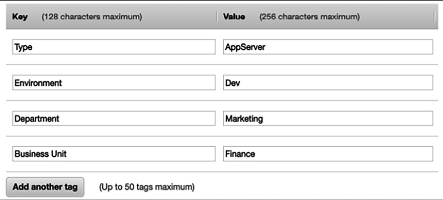
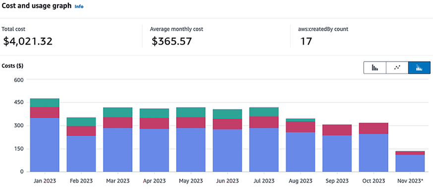
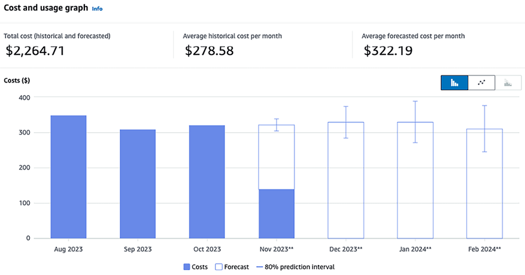
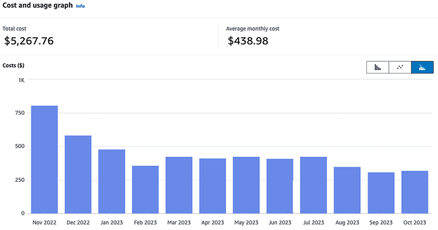
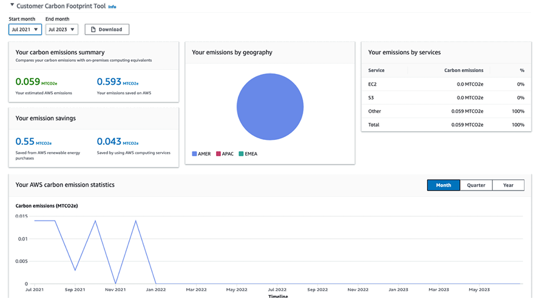

# ملاحظات هزینه

در فصل قبل، با برتری عملیاتی و استفاده از اتوماسیون برای بهینه سازی عملیات پس از تولید، که منجر به کاهش خطای انسانی، افزایش کارایی و در نهایت صرفه جویی در هزینه می شود، آشنا شدید. بهینه سازی هزینه معماری یک جنبه حیاتی برای حفظ یک محیط فناوری اطلاعات کارآمد و پایدار است. این شامل درک و مدیریت منابعی است که برنامه‌های کاربردی شما مصرف می‌کنند و اطمینان حاصل کنید که فقط برای آنچه نیاز دارید هزینه می‌کنید. در این فصل، استراتژی‌های مختلف برای بهینه‌سازی هزینه، از جمله اندازه‌گیری مناسب منابع، انتخاب مدل‌های قیمت‌گذاری مناسب، و استفاده از بودجه‌بندی و ابزارهای مدیریت هزینه را بررسی خواهیم کرد.

یکی از اهداف اولیه هر کسب و کاری افزایش سودآوری در حین ارائه خدمات به مشتریان است. هزینه یک موضوع مهم بحث در هنگام شروع یک پروژه است. ارتقاء برنامه ها و افزودن ویژگی های محصول جدید به شدت به بودجه موجود بستگی دارد. هزینه های محصول به عهده همه است و باید در هر مرحله از چرخه عمر محصول (از برنامه ریزی تا پس از تولید) در نظر گرفته شود. این فصل به شما کمک می‌کند تا بهترین روش‌ها را برای بهینه‌سازی هزینه‌ها برای راه‌حل‌ها و عملیات فناوری اطلاعات خود درک کنید.

**بهینه سازی هزینه** فرآیندی مستمر است و نیاز به مدیریت دقیق و بدون از دست دادن تجربه مشتری دارد. بهینه سازی هزینه به معنای کاهش هزینه نیست، اما با به حداکثر رساندن **بازده سرمایه** (**ROI**) ریسک کسب و کار را کاهش می دهد. شما باید قبل از برنامه ریزی هر گونه استراتژی بهینه سازی هزینه، نیازهای مشتریان خود را درک کرده و بر اساس آن عمل کنید. اغلب، اگر مشتریان به دنبال کیفیت هستند، حاضرند قیمت بیشتری بپردازند.

در این فصل با اصول طراحی مختلف برای بهینه سازی هزینه راه حل خود آشنا خواهید شد. جنبه هزینه باید برای هر فاز و جزء معماری در نظر گرفته شود. شما انتخاب صحیح فناوری برای بهینه سازی هزینه ها در هر لایه را درک خواهید کرد. در این فصل با بهترین روش های بهینه سازی هزینه زیر آشنا خواهید شد:

- اصول طراحی برای بهینه سازی هزینه
- آشنایی با تکنیک های بهینه سازی هزینه
- بهینه سازی هزینه رانندگی در ابر عمومی
- فناوری اطلاعات سبز و تأثیر آن بر ملاحظات هزینه

در پایان فصل، با تکنیک‌های مختلف برای بهینه‌سازی هزینه‌ها بدون به خطر انداختن چابکی و نتایج کسب‌وکار آشنا خواهید شد. شما روش های مختلفی را برای نظارت بر هزینه ها و اعمال حاکمیت برای کنترل هزینه ها یاد خواهید گرفت. اول از همه، بیایید با اصول طراحی برای بهینه‌سازی هزینه شروع کنیم، که پایه و اساس ساخت یک معماری آگاه از هزینه را خواهد گذاشت.

# اصول طراحی برای بهینه سازی هزینه

بهینه سازی هزینه شامل افزایش ارزش کسب و کار و به حداقل رساندن ریسک و در عین حال کاهش هزینه های کسب و کار است. بهتر است هزینه های درخواست خود را با تخمین بودجه و پیش بینی هزینه ها برنامه ریزی کنید. برای صرفه جویی در هزینه ها، باید یک طرح بهینه سازی هزینه ها را پیاده سازی کنید و مخارج خود را از نزدیک نظارت کنید.

چندین اصل وجود دارد که می تواند به شما در دستیابی به بهینه سازی هزینه کمک کند. اصول طراحی متداول برای این امر در بخش های زیر پوشش داده شده است. متوجه خواهید شد که تمام اصول طراحی بهینه سازی هزینه ارتباط نزدیکی با یکدیگر دارند و مکمل یکدیگر هستند. بیایید نگاهی به اینها بیندازیم.

## محاسبه کل هزینه مالکیت

اغلب، سازمان‌ها تمایل دارند **هزینه کل مالکیت** (**TCO**) را نادیده بگیرند و بر اساس هزینه اولیه برای دستیابی به نرم‌افزار و خدمات، که به نام **هزینه سرمایه** (**CapEx**) شناخته می‌شود، تصمیم می‌گیرند. . در حالی که تعیین هزینه اولیه ضروری است، TCO در دراز مدت بیشترین اهمیت را دارد. TCO شامل CapEx و **هزینه های عملیاتی** (**OpEx**) است که تمام ابعاد چرخه عمر برنامه را پوشش می دهد. هزینه CapEx شامل قیمتی است که سازمان ها برای دستیابی به خدمات و نرم افزار از قبل پرداخت می کنند، در حالی که OpEx شامل هزینه عملیات، نگهداری، آموزش و بازنشستگی برنامه های نرم افزاری است. هزینه های CapEx و OpEx را در نظر بگیرید تا در بلندمدت به تصمیم گیری استراتژیک تری در هنگام محاسبه بازگشت سرمایه خود کمک کنید.

به عنوان مثال، وقتی یخچالی می‌خرید که 24 ساعته کار می‌کند، به دنبال رتبه‌بندی صرفه‌جویی در مصرف انرژی برای پایین نگه داشتن قبض برق خود هستید. شما آماده پرداخت قیمت بالاتر از قبل هستید زیرا می دانید که هزینه کل در طول زمان به دلیل صرفه جویی در قبض انرژی شما کمتر خواهد شد. حالا بیایید یک مرکز داده را مثال بزنیم. هزینه خرید سخت افزار اولیه (CapEx) وجود دارد. با این حال، راه اندازی مرکز داده به هزینه های مداوم اضافی (OpEx) نیاز دارد که شامل گرمایش، سرمایش، نگهداری رک، مدیریت زیرساخت، امنیت و غیره می شود.

برای یک مورد استفاده معمولی، زمانی که در حال خرید و پیاده سازی نرم افزار هستید، هزینه های زیر را برای محاسبه TCO در نظر بگیرید:

شکل 10.1: TCO برای یک برنامه IT

بیایید به این موضوع در سطحی ریزتر نگاه کنیم. هر جزء TCO دارای

هزینه های متداول زیر برای نرم افزار _off-the-shelf_، مانند Oracle یا پایگاه داده MS SQL:

نرم افزار خارج از قفسه به برنامه های از پیش ساخته شده و تولید انبوه اشاره دارد که برای پاسخگویی به مخاطبان گسترده با نیازهای مشابه طراحی شده اند، برخلاف نرم افزارهای سفارشی که برای برآوردن نیازهای خاص یک تجارت یا کاربر خاص طراحی شده اند.

- **هزینه‌های خرید و راه‌اندازی**: اینها هزینه‌های اولیه برای دستیابی به نرم‌افزار و خدمات برای استقرار آن است. این شامل موارد زیر است:

   - هزینه نرم افزار شامل قیمت خرید نرم افزار با مجوزهای کاربر می باشد
   - هزینه های سخت افزاری شامل خرید سرور و ذخیره سازی برای استقرار نرم افزار می باشد
   - هزینه های پیاده سازی شامل زمان و تلاش برای آماده سازی نرم افزار برای تولید است
   - هزینه‌های مهاجرت شامل انتقال داده‌ها به سیستم جدید است\* **هزینه‌های عملیاتی و نگهداری**: این هزینه‌های مستمر برای اجرای نرم‌افزار برای مورد استفاده تجاری است، از جمله موارد زیر:

   - نگهداری و پشتیبانی نرم افزار
   - وصله‌ها و به‌روزرسانی‌ها، که فروشندگان نرم‌افزار اغلب برای رفع هر گونه اشکال احتمالی منتشر می‌کنند
   - بهبودهای سفارشی برای تناسب نرم افزار با نیازهای سازمان شما
   - هزینه مرکز داده برای نگهداری سرور سخت افزاری
   - امنیت
   - تمدید مجوز

- **منابع انسانی و هزینه های آموزشی**: هزینه های سربار آموزش کارکنان برای استفاده از نرم افزار برای رسیدگی به فعالیت های تجاری است. این هزینه ها شامل موارد زیر است:
   - کارکنان مدیریت برنامه
   - کارکنان پشتیبانی IT
   - مشاوران عملکردی و فنی
   - ابزارهای آموزشی و آموزشی

برای بهینه‌سازی هزینه‌ها، گزینه‌های متعددی دارید، از جمله گرفتن اشتراک برای محصول **نرم‌افزار به‌عنوان سرویس** (**SaaS**)، مانند **مدیریت ارتباط با مشتری** Salesforce (**CRM**) سکو. مدل SaaS اساساً مبتنی بر اشتراک برای هر کاربر است، بنابراین باید تعیین کنید که آیا صرفه جویی در هزینه مورد نظر را دریافت می کنید یا خیر. برای تعداد قابل توجهی از کاربران، می‌توانید با انتخاب گزینه **زیرساخت به‌عنوان سرویس** (**IaaS**) و نصب نرم‌افزار آماده، رویکرد ترکیبی داشته باشید و از ابر برای مدیریت سخت‌افزار خود استفاده کنید. به طور کلی، اگر نرم افزار نیازهای شما را برآورده نمی کند، می توانید خودتان آن را بسازید. در هر سناریویی، TCO را محاسبه کنید تا تصمیم بگیرید که کجا حداکثر بازگشت سرمایه را ایجاد کنید. بیایید به برنامه ریزی بودجه و پیش بینی نگاه کنیم، که می تواند به کنترل هزینه های کل و دستیابی به بازگشت سرمایه کمک کند.

## برنامه ریزی بودجه و پیش بینی

هر کسب و کاری باید هزینه های خود را برنامه ریزی کند و ROI را محاسبه کند. برنامه ریزی بودجه به سازمان ها و تیم ها در مورد کنترل هزینه راهنمایی می کند. سازمان ها بودجه بلندمدتی را برای 1 تا 5 سال برنامه ریزی می کنند که به آنها کمک می کند تا کسب و کار را بر اساس بودجه مورد نیاز اداره کنند. سپس این بودجه به پروژه ها و برنامه های کاربردی اختصاص می یابد. در طول طراحی و توسعه راه حل، تیم باید بودجه موجود را در نظر گرفته و بر اساس آن برنامه ریزی کند. بودجه به تعیین کمیت آنچه کسب و کار می خواهد به آن دست یابد کمک می کند. این پیش بینی تخمینی از آنچه شرکت انجام می دهد ارائه می دهد.

برنامه ریزی بودجه در بلندمدت برنامه ریزی استراتژیک مهمی است و پیش بینی تخمینی را در سطح تاکتیکی تری برای تصمیم گیری جهت کسب و کار ارائه می دهد. در توسعه و بهره برداری برنامه، بدون بودجه و پیش بینی، می توانید به سرعت مسیر خود را از دست بدهید و هزینه های برآورد شده را بیش از حد برآورده کنید. این دو عبارت ممکن است گیج کننده باشند، بنابراین بیایید تفاوت واضح بین بودجه و پیش بینی را درک کنیم:

| **جنبه** | **بودجه** | **پیش بینی** |
| --------------------------- | ------------------------------------------------ ------------------------------------------------ ------------ | ------------------------------------------------ ------------------------------------------------ --------------------- |
| **تعریف** | یک برنامه مالی تفصیلی که درآمدهای مورد انتظار، هزینه ها و تخصیص منابع را برای یک دوره خاص مشخص می کند. | پیش بینی به روز شده عملکرد مالی یک شرکت بر اساس روندهای فعلی و انتظارات کوتاه مدت.             |
| ** بازه زمانی ** | به طور معمول برای طولانی مدت تنظیم می شود، مانند سالانه.                                                                | پویا تر؛ به طور منظم (ماهانه یا فصلی) به روز می شود.                                                                    |
| **فرکانس تنظیم** | به ندرت، شاید یک بار در سال یا در طول تغییرات قابل توجه تنظیم شود.                                           | به طور منظم بر اساس پیشرفت واقعی کسب و کار و چشم انداز کوتاه مدت به روز می شود.                                                 |
| **هدف** | برای هدایت تصمیمات تجاری، برنامه ریزی استراتژیک و تخصیص منابع استفاده می شود.                                    | برای اتخاذ تصمیمات عملیاتی آگاهانه و تنظیمات بر اساس روندها و پیش بینی های اخیر استفاده می شود.

|
| **ارزیابی عملکرد** | برای تعیین عملکرد با مقایسه هزینه ها و درآمدهای برنامه ریزی شده با واقعی استفاده می شود.                              | معمولاً برای ارزیابی عملکرد در برابر اهداف استفاده نمی شود، بلکه برای درک موقعیت های مالی بالقوه آینده استفاده می شود.    |
| **نمونه** | تصمیم گیری در مورد تجدید ساختار سازمان، برنامه ریزی هزینه های بازاریابی سالانه و تعیین اهداف فروش سالانه.        | تنظیم سطوح کارکنان، اصلاح استراتژی های بازاریابی بر اساس عملکرد اخیر، و به روز رسانی انتظارات درآمد. |

جدول 10.1: بودجه در مقابل پیش بینی

اطلاعات پیش‌بینی به شما کمک می‌کند تا اقدامات فوری انجام دهید، در حالی که ممکن است به دلیل تغییرات در بازار، بودجه دست نیافتنی شود. همانطور که در نمودار زیر نشان داده شده است، در حالی که روی راه حل های روزانه کار می کنید، تحولات مبتنی بر پیش بینی هزینه های تاریخی می تواند شما را به تعدیل هزینه های ماه آینده ترغیب کند:

شکل 10.2: گزارش پیش بینی

همانطور که در گزارش پیش‌بینی _هزینه و استفاده_ قبلی نشان داده شده است، اگر بودجه ماهانه شما 450 دلار باشد، تا پایان نوامبر 2024 به بودجه خود خواهید رسید. در اینجا، پیش‌بینی به شما کمک می‌کند تا هزینه‌ها را کنترل کرده و در محدوده بودجه قرار بگیرید.

در بخش بعدی، بیایید به مکانیسم بهبود کارایی هزینه با مدیریت تقاضا و خدمات نگاه کنیم.

## مدیریت تقاضا و کاتالوگ خدمات

تقریباً هر سازمانی یک تیم متمرکز فناوری اطلاعات دارد که با شرکای تجاری داخلی مانند توسعه اپلیکیشن و تیم‌های پشتیبانی واحدهای تجاری مختلف کار می‌کند. تیم فناوری اطلاعات تقاضا برای زیرساخت فناوری اطلاعات، از جمله هزینه کلیه نرم افزارها و سخت افزارها و پشتیبانی برای مدیریت میزبانی برنامه را مدیریت می کند. شرکای تجاری اغلب به درک بیشتری از محرک های هزینه خدمات فناوری اطلاعات خود نیاز دارند. به عنوان مثال، تیم های توسعه برنامه تمایل دارند محیط توسعه یا آزمایش خود را بیش از حد فراهم کنند که در نتیجه هزینه اضافی را به همراه دارد.

می‌توانید پیش‌بینی‌های تقاضا را از واحدهای سازمانی مختلف دریافت کنید، که می‌تواند به شما کمک کند تا عرضه زیرساخت‌های فناوری اطلاعات را در سراسر سازمان هماهنگ کنید. با ادغام همه الزامات در یک مکان، یک سازمان می تواند از صرفه جویی در مقیاس بهره مند شود. ممکن است به هزینه متغیر کمتری دست یابید زیرا یک قرارداد بزرگ می تواند به صرفه جویی در مقیاس بالاتری دست یابد. تقاضای مناسب از همه واحدهای سازمانی تجمیع می شود و به قیمت های پایین تر تبدیل می شود.

به عنوان مثال، هنگام استفاده از سرویس‌های ابری عمومی مانند AWS، GCP یا Azure، کسب‌وکارها این فرصت را دارند که قیمت‌های مطلوب‌تری را از طریق **قراردادهای قیمت‌گذاری خصوصی** (**PPAs**) یا **برنامه‌های تخفیف سازمانی تضمین کنند. **EDP**). این قراردادها به ویژه برای سازمان‌هایی که با تجمیع منابع خود در یک ارائه‌دهنده ابری متعهد به حجم کاری بزرگ‌تر هستند، مفید است. با تعهد به سطح معینی از استفاده یا هزینه، شرکت‌ها می‌توانند با قیمت‌های پایین‌تر مذاکره کنند، که به معنای صرفه‌جویی قابل توجهی در هزینه‌ها خواهد بود.

سازمان ها می توانند یکی از دو رویکرد زیر را برای مدیریت تقاضا و خدمات اتخاذ کنند:

- **مدیریت تقاضا**: برای صرفه‌جویی در هزینه‌ها در محیط‌های فناوری اطلاعات موجود (جایی که ممکن است مشاهده کنید که هزینه‌های بیش از حد رایج است)، می‌توانید از رویکرد _تقاضا رهبری_ استفاده کنید. با معرفی چند سرویس جدید، به بهبود کارایی هزینه در کوتاه مدت کمک خواهد کرد. می‌توانید داده‌های تاریخی را برای درک عواملی که تقاضا را افزایش می‌دهند تجزیه و تحلیل کنید و موارد تدارک بیش از حد را ثبت کنید. فرآیندی بین تیم فناوری اطلاعات و شرکای تجاری برای ساده کردن هزینه های عملیاتی خدمات فناوری اطلاعات ایجاد کنید.
- **مدیریت کاتالوگ خدمات**: اگر تقاضا برای خدمات جدید وجود دارد و داده های تاریخی زیادی ندارید، می توانید از رویکرد _سرویس رهبری_ استفاده کنید. در این رویکرد، شما باید تقاضا برای پرکاربردترین خدمات را درک کنید و یک کاتالوگ ایجاد کنید. به عنوان مثال، فرض کنید تیم توسعه یک سرور لینوکس با پایگاه داده MySQL برای ایجاد یک محیط توسعه دهنده درخواست می کند. در این صورت، تیم فناوری اطلاعات می‌تواند یک کاتالوگ خدمات ایجاد کند که به تیم توسعه‌دهنده کمک می‌کند تا یک سرور لینوکس کوچک و یک سرور پایگاه داده را خریداری کند. به طور مشابه، تیم فناوری اطلاعات می‌تواند متداول‌ترین مجموعه خدمات را شناسایی کرده و هزینه‌ای را به آن اضافه کند.

هر رویکرد می تواند صرفه جویی قابل توجهی در هزینه های کوتاه مدت و بلند مدت داشته باشد. با این حال، این دگرگونی‌ها چالش‌های اساسی را ایجاد می‌کنند زیرا شما باید فرآیند برنامه‌ریزی و تصویب پروژه را تغییر دهید. تیم های تجاری و مالی باید رابطه واضح بین رشد کسب و کار و افزایش ظرفیت فناوری اطلاعات را همسو و درک کنند. مدل هزینه باید حول کارآمدترین رویکرد با ترکیب پیشنهادات ابری، در محل و خارج از قفسه ساخته شود.

## پیگیری هزینه ها

می‌توانید هزینه‌های سیستم‌های فردی را با ردیابی هزینه‌ها و پیوند دادن آنها به سیستم یا صاحب کسب‌وکار بیابید. داده های مخارج شفاف به شناسایی بازگشت سرمایه و پاداش به صاحبان، بهینه سازی منابع و کاهش هزینه کمک می کند. می تواند به شما در تعیین هزینه های ماهانه یک بخش یا پروژه کمک کند.

صرفه جویی در هزینه ها یک مسئولیت مشترک است و شما باید مکانیزمی داشته باشید که همه را پاسخگو نگه دارد. اغلب، اندام

سازوکارهای **نمایش پس دادن** یا **بازپرداخت شارژ** را برای تقسیم مسئولیت هزینه بین واحدهای سازمانی معرفی می کنند.

حساب صورت‌حساب متمرکز هر واحد سازمانی را در مورد هزینه‌هایشان در **رویکرد نمایشی** اطلاع می‌دهد، اما مبلغ واقعی را کسر نمی‌کند. هر واحد تجاری در یک سازمان بودجه خود را تحت یک حساب گیرنده اصلی در رویکرد **بازپرداخت شارژ** مدیریت می کند. حساب اصلی به ازای مصرف ماهانه منابع فناوری اطلاعات، مبلغ را به واحدهای تجاری باز می گرداند. این رویکردها هر واحد سازمانی را نسبت به هزینه ها آگاه تر و مسئولیت پذیرتر در هزینه های خود می کند.

هنگام اجرای کنترل هزینه برای سازمان خود، بهتر است با نمایش بک به عنوان یک پله شروع کنید و با بلوغ مدل سازمانی به سمت شارژ برگشتی بروید.

برای هر واحد تجاری، باید با پیکربندی اعلان‌ها، آگاهی از هزینه‌ها ایجاد کنید تا تیم‌ها با نزدیک شدن به میزان مصرف پیش‌بینی‌شده یا بودجه‌بندی شده، هشدار دریافت کنند. مکانیزمی برای نظارت و کنترل هزینه های خود با اختصاص مناسب آنها به ابتکار تجاری مناسب ایجاد کنید. برای ایجاد پاسخگویی برای مخارج هزینه برای هر تیم، دید ایجاد کنید. ردیابی هزینه به شما در درک عملیات تیم کمک می کند.

هر حجم کاری متفاوت است. برای به حداقل رساندن هزینه ها باید از مدل قیمت گذاری متناسب با حجم کاری خود استفاده کنید. مکانیسم هایی را ایجاد کنید که تضمین کند اهداف تجاری با استفاده از بهترین شیوه های بهینه سازی هزینه محقق می شوند. می‌توانید با تعریف استراتژی برچسب‌گذاری برای پیوند دادن واحدهای تجاری با هزینه‌های خاص و استفاده از رویکرد **بررسی و تعادل**، از خرج بیش از حد جلوگیری کنید.

## بهینه سازی هزینه مستمر

اگر از بهترین شیوه های بهینه سازی هزینه پیروی می کنید، باید مقایسه هزینه خوبی با فعالیت های موجود داشته باشید. همیشه ممکن است هزینه برنامه های مهاجرت شده و بالغ خود را در طول زمان کاهش دهید. بهینه سازی هزینه نباید پایان یابد تا زمانی که هزینه شناسایی فرصت های پس انداز پول از مقدار پولی که پس انداز می کنید بیشتر شود. تا رسیدن به آن نقطه، باید به طور مستمر بر مخارج خود نظارت داشته باشید و به دنبال راه های جدیدی برای صرفه جویی در هزینه ها باشید. شما باید به یافتن منطقه ای برای صرفه جویی در هزینه ها با حذف منابع بیکار ادامه دهید. به عنوان مثال، سناریویی را در نظر بگیرید که در آن یک شرکت از خدمات ابری برای محیط های توسعه، آزمایش و تولید خود استفاده می کند. این شرکت با نظارت مداوم بر مخارج ابری خود، تشخیص می‌دهد که چندین نمونه در محیط توسعه، به‌ویژه در ساعات غیر اوج مصرف، کم‌استفاده یا بی‌کار می‌مانند. برای صرفه‌جویی در هزینه‌ها، این شرکت برنامه‌ای را برای خاموش کردن خودکار این نمونه‌ها در زمانی که استفاده نمی‌شوند، مانند شب‌ها و آخر هفته‌ها، اجرا می‌کند. این رویکرد هزینه‌های ابری آنها را به میزان قابل توجهی کاهش می‌دهد، زیرا آن‌ها تنها زمانی برای منابع پرداخت می‌کنند که به طور فعال از آنها استفاده می‌شود. با گذشت زمان، این روش شناسایی و حذف منابع بیکار می تواند منجر به صرفه جویی قابل توجهی در هزینه شود و به شرکت امکان می دهد بودجه خود را به طور موثرتری تخصیص دهد.

برای یک معماری متعادل از نظر هزینه و عملکرد، اطمینان حاصل کنید که هزینه پرداخت شده برای منابع به خوبی مورد استفاده قرار می گیرد و از منابع IT که به طور قابل توجهی مورد استفاده قرار نمی گیرند مانند نمونه های سرور جلوگیری می کند.

یک معیار استفاده جانبدارانه که هزینه های فوق العاده بالا یا پایین را نشان می دهد، به کسب و کار سازمان شما آسیب می رساند. هنگامی که سازمان‌ها معیارهای استفاده را بدون در نظر گرفتن زمینه ارزیابی می‌کنند، می‌تواند منجر به تفسیرها و تصمیم‌های نادرست شود. به عنوان مثال، پایه‌گذاری زیرساخت‌ها بر اساس داده‌های دوره‌های اوج مانند جمعه سیاه برای یک سایت تجارت الکترونیکی می‌تواند منجر به تامین بیش از حد قابل توجهی شود. در زمان‌های شلوغ کمتر، این منجر به استفاده ناکافی از منابع می‌شود که مقرون به صرفه نیست. تجزیه و تحلیل این معیارها در زمینه مناسب برای جلوگیری از چنین دام‌هایی و اطمینان از تخصیص کارآمد منابع، همسو با تقاضای واقعی و نه فقط دوره‌های اوج یا غیر معمول استفاده، ضروری است. این رویکرد از هزینه های غیر ضروری جلوگیری می کند و از مدیریت هزینه استراتژیک تر و موثرتر پشتیبانی می کند.

معیارهای سطح برنامه برای بهینه سازی هزینه باید به دقت در نظر گرفته شوند. به عنوان مثال، سیاست های آرشیوی را برای کنترل ظرفیت ذخیره سازی داده ها معرفی کنید. برای بهینه سازی پایگاه داده، باید نیازهای استقرار پایگاه داده مناسب را بررسی کنید، مانند اینکه آیا استقرار چند مکان برای پایگاه داده ضروری است یا اینکه آیا **عملیات ورودی/خروجی در ثانیه** (**IOPS**) مطابق با نیاز به استفاده از پایگاه داده شما می توانید از مدل SaaS برای کمک به کارمندان خود برای تمرکز بر برنامه ها و فعالیت های تجاری استفاده کنید تا هزینه های اداری و عملیاتی خود را کاهش دهید.

برای شناسایی شکاف و اعمال تغییرات لازم برای صرفه جویی در هزینه، باید مدیریت منابع و فرآیندهای کنترل تغییر را در طول چرخه عمر پروژه پیاده سازی کنید. هدف این است که به سازمان شما کمک کنید تا معماری را تا حد امکان بهینه و مقرون به صرفه طراحی کند. به دنبال خدمات و ویژگی های جدیدی باشید که مستقیماً هزینه های شما را کاهش می دهد.

در این بخش، شما اصول طراحی مختلف را با هدف بهینه سازی هزینه بررسی کردید

از برنامه‌ریزی مؤثر بودجه گرفته تا نظارت بر هزینه‌ها و استراتژی‌های مستمر صرفه‌جویی در هزینه. این اصول برای اطمینان از اینکه معماری شما نه تنها الزامات عملکرد و عملیاتی را برآورده می‌کند، بلکه با اهداف مالی همسو می‌شود، ضروری است و سازمان شما را قادر می‌سازد تا ارزش سرمایه‌گذاری‌های خود را به حداکثر برساند و هزینه‌های غیرضروری را به حداقل برساند. بیایید چند تکنیک را بیاموزیم که می تواند به شما در بهینه سازی هزینه ها و افزایش ROI کمک کند.

# درک تکنیک های بهینه سازی هزینه

شرکت ها برای به دست آوردن مزیت رقابتی و همگامی با رشد سریع، بیشتر روی فناوری سرمایه گذاری می کنند. با بی ثباتی اقتصادی، بهینه سازی هزینه تبدیل به یک کار ضروری اما چالش برانگیز می شود. شرکت ها زمان زیادی را صرف تحقیق و کاهش هزینه ها در تدارکات، عملیات و فروشندگان می کنند. بسیاری از شرکت ها حتی مراکز داده، مراکز تماس و فضاهای کاری را به عنوان روشی برای صرفه جویی در هزینه به اشتراک می گذارند. گاهی اوقات، سازمان ها برای جلوگیری از خرید سخت افزار جدید و گران قیمت، به زمان بیشتری برای ارتقا نیاز دارند.

یک سازمان می تواند با بررسی معماری فناوری اطلاعات خود در سراسر سازمان، بیشتر صرفه جویی کند. بهبود معماری موجود می تواند درها را برای ایجاد فرصت ها و کسب و کار بیشتر به شرکت باز کند، حتی اگر نیاز به تعدیل بودجه داشته باشد. بیایید حوزه‌هایی را که شرکت‌ها می‌توانند با تکنیک‌هایی مانند انتقال به فضای ابری، معماری ساده، مجازی‌سازی و منابع مشترک، در هزینه‌ها صرفه‌جویی کنند و درآمد بیشتری کسب کنند، شناسایی کنیم.

## کاهش پیچیدگی معماری

سازمان ها اغلب به یک معماری متمرکز فناوری اطلاعات نیاز دارند که در نتیجه هر واحد تجاری سعی می کند مجموعه ای از ابزارهای خود را بسازد. عدم کنترل کلی باعث ایجاد سیستم های تکراری و ناهماهنگی داده ها می شود. ابتکارات فناوری اطلاعات در واحدهای تجاری فردی توسط یک هدف کوتاه مدت هدایت می شود.

در چنین مواردی، واحدهای تجاری باید با چشم انداز بلندمدت سازمانی، مانند تحول دیجیتال کل سازمان، هماهنگی بهتری داشته باشند. علاوه بر این، به حفظ و ارتقای آن سیستم ها پیچیدگی می بخشد. یک گام ساده برای تعریف استانداردها و اجتناب از تکرار می تواند به صرفه جویی در هزینه ها کمک کند.

نمودار زیر یک معماری پیچیده را در سمت چپ نشان می‌دهد، جایی که واحدهای تجاری در برنامه‌های خود بدون استانداردسازی کار می‌کنند و باعث ایجاد برنامه‌های تکراری با وابستگی‌های فراوان می‌شوند – این نوع معماری منجر به هزینه‌ها و ریسک‌های بالایی می‌شود. هر آزمایش جدیدی برای بازاریابی زمان زیادی می برد که منجر به از دست دادن مزیت رقابتی می شود. استانداردسازی فرآیند، توسعه الگوهای معماری قابل استفاده مجدد، و ایجاد مجموعه ای از خدمات مشترک به طور جمعی یک چارچوب جامع و انعطاف پذیر را فراهم می کند که از یک محیط چابک پشتیبانی می کند. با اعمال اتوماسیون در این چارچوب، سازمان ها می توانند عملیات را ساده کنند، از تلاش های اضافی اجتناب کنند و هزینه ها را به میزان قابل توجهی کاهش دهند. این رویکرد کل نگر نه تنها کارایی عملیاتی را افزایش می‌دهد، بلکه بازگشت سرمایه را نیز افزایش می‌دهد و یک همسویی استراتژیک از شیوه‌های معماری با اهداف تجاری برای عملکرد مالی بهینه را نشان می‌دهد.

شکل 10.3: استانداردسازی معماری

اولین چیز حذف تکرار و شناسایی استفاده مجدد از عملکرد در سراسر واحد تجاری برای کاهش پیچیدگی معماری است. گنجاندن تمام این اجزای قابل استفاده مجدد در سراسر سازمان در یک کاتالوگ خدمات می تواند به طور قابل توجهی دسترسی و کارایی را افزایش دهد. یک کاتالوگ خدمات به عنوان یک مخزن متمرکز عمل می کند که در آن تیم ها می توانند الگوهای معماری از پیش تعریف شده، خدمات و منابع را بیابند و از آنها استفاده کنند. در طول تجزیه و تحلیل _گپ معماری موجود، متوجه خواهید شد که کد بسیار زیادی وجود دارد، بسیاری از اجزای موجود و پروژه ای که می تواند در سراسر سازمان برای پشتیبانی از نیازهای تجاری شما مورد استفاده مجدد قرار گیرد. برای کاهش پیچیدگی معماری فناوری اطلاعات، به راه حلی بی‌نظیر فکر کنید که متناسب با نیازهای کسب و کار شما باشد و ROI را فراهم کند. اگر گزینه دیگری در دسترس نباشد، سفارشی‌سازی باید آخرین رویکرد شما باشد.

هر برنامه جدید نیاز به مکانیزم یکپارچه سازی قابل دسترسی برای تعامل با سیستم موجود با استفاده از ** معماری RESTful ** دارد. هماهنگ کردن طراحی UI در سراسر برنامه، مجموعه ای از بسته های استاندارد UI را فراهم می کند که می توانند برای هر برنامه جدید مورد استفاده مجدد قرار گیرند.

به طور مشابه، ماژول های دیگر را می توان با طراحی سرویس گرا دوباره مورد استفاده قرار داد. شما در مورد الگوهای RESTful در _فصل 4_، _ الگوهای طراحی معماری راه حل_ آشنا شدید. اینها به شما کمک می‌کنند تا تمام نرم‌افزارهای مختلف را به طور جداگانه کار کنند و همچنان با یکدیگر ارتباط برقرار کنند تا یک سیستم کامل بسازید.

در رویکرد ماژولار، هر تیم مسئول توسعه سرویسی است که هر تیم در سراسر سازمان می تواند از آن برای جلوگیری از تکراری استفاده کند. به عنوان یک معمار، باید به تیم کمک کنید تا یک طراحی سرویس گرا ایجاد کند، جایی که هر تیم اجزای معماری منفرد را به عنوان سرویسی که می تواند به طور مستقل توسعه یابد، مدیریت می کند. با کمک معماری میکروسرویس ها، می توانید کل برنامه را به صورت ماژولار اجرا کنید. اگر یک جزء کار نمی کند، می توانید آن را بدون ایمپکتین دوباره کار کنید

g کل برنامه. به عنوان مثال، یک سرویس پرداخت توسعه یافته برای جمع آوری پرداخت از یک مشتری که از یک وب سایت تجارت الکترونیک بازدید می کند نیز می تواند برای پرداخت به فروشندگان در سیستم مدیریت فروشنده استفاده شود.

هنگامی که یک معماری متمرکز فناوری اطلاعات را راه اندازی می کنید، اتخاذ یک رویکرد مدولار به شما کمک می کند تا هزینه را کاهش دهید. توانمندسازی تیم معماری فناوری اطلاعات شما می تواند به همسوسازی واحدهای سازمانی با چشم انداز شرکت کمک کند و از پروژه های موازی دیگر برای پیروی از استراتژی کلی حمایت کند. همچنین به ارائه یکپارچگی در سایر خدمات حیاتی که اغلب نادیده گرفته می شوند، مانند حقوقی، حسابداری و منابع انسانی کمک می کند.

با کمک تیم معماری فناوری اطلاعات، می‌توانید بازخورد عالی دریافت کنید و اطمینان حاصل کنید که پروژه‌ها با نیازها و الزامات تجاری همسو هستند. با نظارت بر معماری کلی در میان تیم‌ها، یک معمار می‌تواند توصیه کند که آیا هر تلاش تکراری، پروژه، فرآیند یا سیستم باید با نیاز کسب‌وکار هماهنگ باشد یا خیر. معماری متمرکز پیچیدگی و بدهی های فناوری را کاهش می دهد، ثبات بیشتری را به ارمغان می آورد و کیفیت را افزایش می دهد. ایده کلی معماری متمرکز افزایش کارایی فناوری اطلاعات است، بنابراین بیایید در مورد آن بیشتر بیاموزیم.

## افزایش کارایی فناوری اطلاعات

امروزه هر شرکتی از منابع IT استفاده و مصرف می کند. داشتن سرورها، لپ‌تاپ‌ها و مجوزهای نرم‌افزار بسیار زیاد و ظرفیت ذخیره‌سازی بالا، بودجه زیادی را مصرف می‌کند. لایسنس ها یکی از منابعی هستند که گاهی کم استفاده، کشف نشده، بیکار یا اشتباه نصب می شوند و بودجه زیادی را مصرف می کنند. یک تیم متمرکز فناوری اطلاعات می‌تواند با پیگیری مجوزهای نرم‌افزار استفاده‌شده و بازنشستگی مجوزهای اضافی، تلاش برای بهینه‌سازی مجوزها را رهبری کند. آنها می توانند با مذاکره در مورد تخفیف عمده با فروشنده در هزینه ها صرفه جویی کنند.

برای افزایش کارایی فناوری اطلاعات، پروژه‌های غیرمنطبق که بودجه و منابع اضافی را می‌گیرند، لغو کنید. همچنین، باید به تیم‌ها کمک کنید تا استراتژی را برای حمایت یا خاتمه مستمر پروژه‌های استفاده نشده و غیرهمسو بازبینی کنند.

برای بهینه سازی هزینه می توان روش های زیر را در نظر گرفت:

- پروژه های با هزینه های بالا را دوباره ارزیابی کنید، زیرا ممکن است نیاز به هماهنگی بهتر با چشم انداز تجاری داشته باشند. پروژه هایی با ارزش بالا اما بدون تاثیر مستقیم بر استراتژی فناوری اطلاعات شکل دهید.
- اولویت بندی پروژه هایی با ارزش تجاری کم یا بدون ارزش تجاری، حتی اگر با استراتژی فناوری اطلاعات هماهنگ باشد.
- پروژه های غیر منطبق با ارزش تجاری پایین را لغو کنید.
- برنامه های استفاده نشده را از رده خارج یا بازنشسته کنید.
- جایگزینی سیستم های قدیمی با مدرن سازی آنها برای کاهش هزینه های نگهداری.
- با استفاده مجدد از برنامه های موجود از پروژه های تکراری خودداری کنید.
- در صورت امکان، داده ها را یکپارچه کنید و یک مدل داده یکپارچه ایجاد کنید. شما در مورد نگهداری یک دریاچه داده متمرکز در _فصل 12_، _مهندسی داده برای معماری راه حل_ خواهید آموخت.
- تجمیع خرید فروشنده در سراسر سازمان برای صرفه جویی در هزینه های پشتیبانی فناوری اطلاعات و هزینه های نگهداری.
- هر سیستمی را که همان کار مدیریت پرداخت و دسترسی را انجام می دهد، یکپارچه کنید.
- حذف پروژه ها و مخارج پرهزینه، بیهوده و بیش از حد.

انتقال به فضای ابری می‌تواند برای افزایش کارآمد منابع فناوری اطلاعات و کاهش هزینه‌ها یک نکته عالی باشد. ارائه دهندگان ابر عمومی، مانند **Amazon Web Services** (**AWS**)، یک مدل _pay-as-you-go_ را ارائه می دهند، به این معنی که شما فقط برای آنچه استفاده می کنید پرداخت می کنید. به عنوان مثال، دسکتاپ توسعه‌دهنده می‌تواند در ساعات غیر کاری و آخر هفته‌ها خاموش شود و هزینه‌های فضای کاری را تا _۷۰٪_ کاهش دهد.

سیستم پردازش دسته ای فقط برای پردازش کارها نیاز به چرخش دارد و می تواند بلافاصله پس از آن خاموش شود. درست مانند هر وسیله برقی دیگری کار می کند که برای صرفه جویی در هزینه های برق در مواقعی که نیازی به آن ندارید خاموش می کنید.

استفاده از اتوماسیون یک مکانیسم عالی برای افزایش کارایی کلی فناوری اطلاعات است. اتوماسیون به حذف کار پرهزینه انسانی کمک می کند و زمان صرف شده برای انجام کارهای روزمره بدون خطا را کاهش می دهد. کارها را تا جایی که ممکن است برای تهیه سرورها، اجرای کارهای نظارتی و پردازش داده ها به صورت خودکار انجام دهید.

هنگام تصمیم گیری برای بهینه سازی هزینه ها، مطمئن شوید که یک مبادله مناسب برای بهبود نتایج انجام دهید. بیایید یک مثال بزنیم. اگر به یک پارک موضوعی می روید که می خواهید در آن سواری های خوب زیادی داشته باشید، مایلید برای دیدن ارزش هزینه های خود هزینه بیشتری بپردازید. برای جذب مشتریان بیشتر، اگر فروشنده تصمیم گرفت قیمت را کاهش دهد و با کاهش تعداد سواری های لذت بخش، تنظیماتی را انجام دهد، ممکن است به پارک موضوعی دیگری بروید زیرا به دنبال اوقات خوشی هستید. در اینجا، رقبا برتری خواهند داشت و مشتریان فعلی را جذب می کنند، در حالی که فروشنده فعلی تجارت را از دست می دهد. در این مورد، کاهش هزینه، ریسک تجاری را اضافه می کند، که رویکرد بهینه سازی هزینه مناسبی نیست.

هدف شما باید قابل اندازه گیری باشد و این اقدامات باید بر روی خروجی کسب و کار و هزینه سیستم شما متمرکز باشد. اقدامات کمی به شما کمک می کند تا تأثیر افزایش بازده و کاهش هزینه ها را درک کنید. اهداف در سطح سازمانی و تیمی باید با کاربران نهایی برنامه هماهنگ باشد. در سطح سازمانی، اهداف در سراسر واحدهای تجاری سازمانی خواهد بود. در سطح تیم، آنها بیشتر با سیستم فردی هماهنگ خواهند شد

س به عنوان مثال، می توانید هدفی را در سطح واحد تجاری تعیین کنید که هزینه هر تراکنش را 10 درصد در هر سه ماهه یا 15 درصد هر شش ماه کاهش دهد. تعریف اهداف تضمین می کند که سیستم ها در طول عمر خود بهبود می یابند. بیایید ببینیم چگونه می توانیم استانداردسازی و حاکمیت را اعمال کنیم.

## به کارگیری استانداردسازی و حاکمیت

سازمان‌ها به یک استراتژی برای تجزیه و تحلیل ناهماهنگی و مصرف بیش از حد، کاهش پیچیدگی، تعریف دستورالعمل‌هایی برای استفاده از سیستم‌های مناسب و کارآمد و اجرای یک فرآیند در هر کجا که نیاز باشد، نیاز دارند. ایجاد و اجرای این دستورالعمل ها به شرکت ها کمک می کند تا یک زیرساخت استاندارد ایجاد کنند و پروژه های تکراری و پیچیدگی را کاهش دهند.

برای اجرای حکمرانی، باید محدودیت های منابع را در سراسر سازمان تنظیم کنید. قرار دادن کاتالوگ خدمات با **زیرساخت به عنوان کد** (**IaC**) به تیم ها کمک می کند تا بیش از حد از ظرفیت تخصیص داده شده خود منابعی در اختیار تیم ها قرار ندهند. شما باید مکانیزمی برای درک سریع و انجام اقدامات لازم در مورد نیازهای تجاری داشته باشید. هنگام اعمال محدودیت های منابع و تعریف فرآیند تغییر آنها، ایجاد منابع و از کار انداختن آنها را در نظر بگیرید.

با IaC، کل راه‌اندازی زیرساخت از شبکه‌ها و سرورها گرفته تا پایگاه‌های داده و سرویس‌های کاربردی را می‌توان در فایل‌های کد با استفاده از زبان‌هایی مانند YAML یا JSON تعریف کرد. سپس این فایل‌ها را می‌توان به‌صورت نسخه‌ای کنترل کرد و به تیم‌ها اجازه می‌دهد تغییرات را در طول زمان ردیابی کنند، به پیکربندی‌های قبلی برگردند، و تنظیمات یکسانی را در محیط‌های مختلف اعمال کنند، و از ثبات و کاهش تغییر پیکربندی اطمینان حاصل کنند. ابزارهای محبوبی مانند Terraform، AWS CloudFormation و Ansible IaC را فعال می‌کنند و به تیم‌ها اجازه می‌دهند IaC را تعریف کنند و این تعاریف را برای ایجاد یا تغییر زیرساخت اعمال کنند.

کسب و کارها چندین برنامه را توسط تیم های مختلف اجرا می کنند. این تیم ها می توانند به واحدهای تجاری مختلف در جریان درآمد خود تعلق داشته باشند. تعیین هزینه های منابع برای برنامه، واحد تجاری یا تیم، رفتار استفاده کارآمد را هدایت می کند و به کاهش هزینه ها کمک می کند. می توانید ظرفیت منابع را بر اساس تخصیص هزینه و نیازهای گروه، واحد سازمان یا بخش تعریف کنید. می توانید از برچسب گذاری منابع و ساختار حساب برای سازماندهی ساختار هزینه استفاده کنید.

همانطور که در تصویر زیر نشان داده شده است، می توانید حساب های خود را در **واحدهای سازمانی** (**OUs**) مختلف مانند منابع انسانی و امور مالی سازماندهی کنید و هر بخش تحت OU می تواند حساب های خود را داشته باشد. به عنوان مثال، در اینجا، **HR** دارای حساب های جداگانه برای **پرداخت حقوق** و **بازاریابی** است، در حالی که **مالی** دارای حساب های فردی برای **فروش** و **بازاریابی** است:

شکل 10.4: ساختار حساب سازمانی برای OU

در استراتژی ساختار حساب قبلی می توانید هزینه ها را در هر واحد تجاری و سطح بخش کنترل کنید. اتخاذ یک مکانیسم بازپرداخت هزینه برای هر بخش، مسئولیت پذیری در قبال هزینه ها را در سطحی دقیق تر افزایش می دهد، که به بهینه سازی هزینه ها کمک می کند.

ساختار حساب به شما کمک می کند تا استانداردهای امنیتی و انطباق بالایی را در سراسر سازمان اعمال کنید. از آنجایی که هر حساب به یک حساب والد مرتبط است، می‌توانید با ادغام هزینه‌ها در سراسر سازمان، به میزان قابل توجهی با استفاده انبوه از منابع فروشنده مقابله کنید.

### برچسب گذاری هزینه منابع

تقریباً هر ارائه‌دهنده عمومی ابری قابلیت‌های برچسب‌گذاری را خارج از جعبه فراهم می‌کند. شما می توانید ابرداده سرور مانند نام DNS یا نام میزبان را برای درون محل جاسازی کنید. برچسب‌گذاری به شما کمک می‌کند هزینه‌ها را سازماندهی کنید و محدودیت ظرفیت، امنیت و انطباق را تعریف کنید. این می تواند یک ابزار عالی برای مدیریت موجودی و مراقبت از نیاز روزافزون به منابع در هر سطح از سازمان باشد.

برچسب گذاری منابع یک استراتژی قدرتمند برای مدیریت و بهینه سازی هزینه ها در محیط های رایانش ابری است. این شامل تخصیص تگ‌های ابرداده به منابع ابری مانند ماشین‌های مجازی، نمونه‌های ذخیره‌سازی یا پایگاه‌های داده، برای دسته‌بندی و ردیابی آنها بر اساس معیارهای مختلف مانند پروژه، محیط، بخش، یا مرکز هزینه است.

همانطور که در تصویر زیر نشان داده شده است، برای مشاهده کامل هزینه و تجمیع منابع، می توانید هر منبع ارائه شده در سطح تیم را برچسب گذاری کنید، که کنترل دقیق تری را فراهم می کند:

شکل 10.5: برچسب گذاری منابع برای مشاهده هزینه

در نمودار قبلی، استراتژی برچسب گذاری را می بینید که نشان می دهد سرور داده شده برای استقرار برنامه است و توسط تیم توسعه استفاده می شود. بخش بازاریابی واحد تجاری دارایی صاحب این سرور است. به این ترتیب، سازمان می‌تواند سطح مشخصی از نمایان شدن هزینه‌ها را به دست آورد و تیم در هزینه‌های خود صرفه‌جویی بیشتری خواهد کرد. با این حال، می‌توانید مکانیسم نمایش بازگشت را در سطح تیم و مکانیسم‌های بازگشت شارژ را در سطوح بخش و واحد تجاری اتخاذ کنید.

شما می توانید مکانیسم خود را برای برچسب گذاری تعریف کنید، جایی که می توانید نام و مقداری مانند نام منبع و نام مالک را به هر منبعی اضافه کنید. اسکرین شات زیر هزینه ها را نشان می دهد که بر اساس برچسب **aws:createdBy** مرتب شده اند، که به تعیین هزینه هر منبع کمک می کند.

t به طور خودکار توسط AWS ایجاد می شود:

شکل 10.6: داشبورد مخارج منابع برای برچسب هزینه

رهبران کسب و کار باید الزامات کلی را برای ایجاد معماری های کارآمد فناوری اطلاعات ارزیابی کنند. برای ایجاد یک معماری فناوری اطلاعات قوی و تعریف حاکمیت در بین تیم‌های عملکردی برای تنظیم مسئولیت‌پذیری، همکاری لازم است. همچنین، یک استاندارد برای بررسی معماری، ایجاد خط پایه برای هر طرح جدید پروژه، و توضیح فرآیند برای اطمینان از انطباق سیستم با معماری صحیح و شناسایی مسیر بهبود، تنظیم کنید.

همه ذینفعان تحت تاثیر در کسب و کار خود را در بحث استفاده و هزینه درگیر کنید. مدیر مالی و صاحبان برنامه باید مصرف منابع و گزینه های خرید را درک کنند. صاحبان بخش باید مدل کلی کسب و کار و فرآیند صورتحساب ماهانه را درک کنند. این به تعیین جهت برای واحدهای تجاری و کل شرکت کمک می کند.

اطمینان حاصل کنید که فروشندگان شخص ثالث با اهداف مالی شما همسو هستند و می توانند مدل های تعامل خود را تنظیم کنند. فروشندگان باید تجزیه و تحلیل هزینه هر برنامه ای را که دارند و توسعه می دهند ارائه دهند. هر تیم در سازمان باید بتواند فاکتورهای تجاری، هزینه و استفاده را از مدیریت به تنظیمات سیستم تبدیل کند، که به برنامه کمک می کند تا اهداف مورد نظر شرکت را پیاده سازی کند و به آن دست یابد.

## نظارت بر استفاده و گزارش های هزینه

عوامل دقیق هزینه به شما کمک می کند تا سودآوری واحدهای تجاری و محصولات را تعیین کنید. ردیابی هزینه به شما کمک می کند منابع را در مکان های مناسب برای افزایش بازگشت سرمایه تخصیص دهید. درک محرک های هزینه به شما کمک می کند مخارج کسب و کار خود را کنترل کنید.

برای بهینه سازی هزینه ها، باید الگوی هزینه های خود را در سراسر سازمان بدانید. برای تعیین فرصت های صرفه جویی در هزینه، باید بینش هایی در مورد هزینه های فناوری اطلاعات در طول زمان داشته باشید. می‌توانید با ایجاد تصویری از روند هزینه‌ها، که هزینه‌ها و پیش‌بینی‌های تاریخی را توسط منابع و بخش‌های سراسر سازمان نشان می‌دهد، گام‌های لازم برای بهینه‌سازی هزینه را بردارید و تأثیر آن را درک کنید.

تیم شما باید با ثبت تمام نقاط داده، داده ها را جمع آوری کند، آنها را با نظارت تجزیه و تحلیل کند، و یک گزارش تجسم ایجاد کند.

برای شناسایی فرصت های صرفه جویی در هزینه، به بینش دقیقی در مورد استفاده از منابع حجم کاری خود نیاز دارید. بهینه‌سازی هزینه به توانایی شما در پیش‌بینی هزینه‌های آینده و اجرای روش‌هایی برای تراز کردن هزینه و استفاده بر اساس پیش‌بینی شما بستگی دارد. موارد زیر زمینه‌های اولیه‌ای هستند که باید تجسم داده‌ها را برای صرفه‌جویی در هزینه داشته باشید:

- تعیین مهم ترین سرمایه گذاری ها در منابع
- داده های هزینه و استفاده خود را تجزیه و تحلیل و درک کنید
- بودجه و پیش بینی
- زمانی که از آستانه های بودجه بندی شده یا پیش بینی شده خود فراتر رفتید، هشدار دریافت کنید

گزارش زیر هزینه‌های منابع در AWS را طی شش ماه نشان می‌دهد. تجسم نشان می‌دهد که سرور محاسبات ابری **EC2**، که با نوار پنجم در هر ماه به رنگ نارنجی نشان داده می‌شود، بالاترین هزینه‌ها را به تنهایی از ماه مه 2023 تا ژوئیه 2023 مصرف کرده است. از آنجایی که واحد تجاری می‌تواند هزینه‌های مداوم بالا را تجسم کند، از آن خواسته می‌شود. مدیر سیستم برای بهینه سازی هزینه و یافتن منابع بیکار. ادمین با متوقف کردن سرورهای EC2 که هزینه را در اوت پایین آورد و از سپتامبر به بعد کاملاً حذف کرد، پاکسازی انجام داد:

شکل 10.7: گزارش هزینه منابع و استفاده از خدمات

گزارش قبلی به صاحبان مشاغل کمک کرد تا الگوهای هزینه را درک کنند و رویکردی واکنشی برای کنترل هزینه اتخاذ کنند. رویکرد واکنشی باعث ایجاد هزینه‌های پنهانی شد که برای مدت زمان مشخصی شناسایی نشد. با رویکرد پیشگیرانه، پیش بینی به صاحبان مشاغل کمک کرد تا زودتر از موعد تصمیم بگیرند.

گزارش زیر هزینه هزینه ماهانه در میله‌های پر شده و هزینه‌های پیش‌بینی‌شده در نوارهای خالی را با محدوده‌های تخمینی نشان می‌دهد. با نگاهی به گزارش، می بینید که احتمال دارد هزینه ها در چند ماه آینده افزایش یابد و می توانید برای درک ویژگی های هزینه و کنترل هزینه ها اقدام کنید:

شکل 10.8: روند هزینه و گزارش پیش بینی هزینه

نظارت بر هزینه های خود در برابر بودجه می تواند اقدام پیشگیرانه دیگری برای کنترل هزینه ها به شما ارائه دهد. تنظیم یک هشدار زمانی که هزینه ها به نسبت معینی از بودجه (50٪ یا 80٪) می رسد به شما کمک می کند هزینه های جاری خود را بررسی و تنظیم کنید.

در گزارش زیر می توانید به صورت تصویری هزینه جاری را در مقابل هزینه بودجه ای که یک سال پیش بالا بوده است تعیین کنید. بر اساس گزارش زیر، مدیران فناوری اطلاعات می‌توانند برای بهینه‌سازی هزینه و کاهش آن در حد بودجه ماهانه اقدام کنند.

شکل 10.9: گزارش هزینه و بودجه

گزارش های هزینه و بودجه به شما کمک می کند تا با انجام اقدامات پیشگیرانه، هزینه ها را کنترل کنید. ترکیب هزینه های جاری واقعی شما با بودجه ها و پیش بینی ها مقدار زیادی کنترل هزینه را روزانه فراهم می کند.

همچنین می‌توانید زمانی که هزینه واقعی شما به آستانه مشخصی در بودجه یا پیش‌بینی رسید، هشدار تنظیم کنید، که به طور فعال از طریق ایمیل یا پیامک به شما هشدار می‌دهد و به شما اطلاع می‌دهد.

شما باید اقدامات پیشگیرانه ای برای کنترل هزینه ها انجام دهید.

اسکرین شات زیر نشان می دهد که هشداری برای زمانی که هزینه تخمینی بالاتر از 500 دلار می رود تنظیم شده است. می‌توانید هشدارهای متعددی را برای دریافت اطلاعات زمانی که هزینه‌ها به 300 دلار و 400 دلار از هزینه تخمینی می‌رسد تنظیم کنید:

شکل 10.10: هشدار بر اساس هزینه واقعی

یکی از راه‌های کنترل هزینه، اندازه‌گیری مناسب محیط با نظارت بر منابع و فعال کردن آلارم برای استفاده بیش از حد یا کم است. تجزیه و تحلیل منابع را می توان با استفاده از ابزارهای نظارتی مانند **Splunk** یا **CloudWatch** و گزارش های سفارشی انجام داد، که در آن معیارهای سفارشی مانند استفاده از حافظه برنامه در سیستم شما می تواند برای انجام اندازه مناسب نظارت شود. استفاده کم از منابع می تواند معیاری برای شناسایی فرصت ها برای بهینه سازی هزینه باشد. به عنوان مثال، استفاده از CPU، استفاده از RAM، پهنای باند شبکه و تعداد اتصالات به برنامه قابل تجزیه و تحلیل و نظارت است.

هنگام تغییر اندازه محیط خود باید مراقب باشید تا مطمئن شوید که تجربه مشتری را تحت تأثیر قرار نمی دهید. موارد زیر بهترین روش‌هایی هستند که باید هنگام انجام اندازه‌بندی مناسب اعمال شوند:

- مطمئن شوید که نظارت منعکس کننده تجربه کاربر نهایی است. دوره صحیح را انتخاب کنید. به عنوان مثال، معیارهای عملکرد باید 99٪ از زمان درخواست-پاسخ کاربر را پوشش دهد نه اینکه زمان پاسخ متوسط را بگیرد.
- چرخه نظارت صحیح را مانند هر ساعت، روز یا هفته انتخاب کنید. به عنوان مثال، اگر تجزیه و تحلیل روزانه انجام دهید، ممکن است یک چرخه هفتگی یا ماهانه استفاده زیاد را از دست بدهید و سیستم خود را به اندازه کافی تامین نکنید.
- هزینه تغییر را در مقابل صرفه جویی در هزینه ارزیابی کنید. به عنوان مثال، ممکن است مجبور شوید آزمایش بیشتری انجام دهید یا منابع را برای انجام تغییر اندازه درگیر کنید. این تجزیه و تحلیل هزینه و فایده به شما کمک می کند منابع را اختصاص دهید.
- استفاده از برنامه را در برابر نیازهای تجاری خود شناسایی کنید. به عنوان مثال، به تعداد درخواست‌های کاربر که انتظار می‌رود تا پایان ماه یا در طول فصل پیک ارسال شود، نگاه کنید. شناسایی و بهینه سازی شکاف استفاده به شما امکان می دهد در هزینه ها صرفه جویی کنید. برای انجام این کار، از ابزار مناسبی استفاده کنید که همه ابعاد، از صرفه جویی در هزینه گرفته تا استفاده از سیستم و تاثیر بر تجربه مشتری به دلیل تغییرات را پوشش می دهد، و سپس از گزارش ها برای درک تاثیر بازگشت سرمایه (ROI) کسب و کار به دلیل تغییرات هزینه استفاده کنید. ابر عمومی از مدل هزینه متفاوتی پیروی می‌کند، که اغلب از ساختار هزینه‌های مبتنی بر تقاضا استفاده می‌شود.

هنگام استفاده از منابع ابری باید بسیار کوشا باشید، زیرا هر ثانیه در هزینه شما به حساب می آید و اگر بهینه سازی و نظارت بر هزینه ها را نادیده بگیرید، می تواند پرهزینه باشد. بیایید در مورد بهینه سازی هزینه در ابر عمومی بیشتر بیاموزیم.

# بهینه سازی هزینه رانندگی در ابر عمومی

ابرهای عمومی، مانند **AWS**، **Microsoft Azure** و GCP، بهینه سازی هزینه عالی را با مدل _pay-as-you-go_ ارائه می کنند. این مدل به مشتریان اجازه می دهد تا CapEx را برای هزینه های متغیر معامله کنند و منابع IT را در حین مصرف پرداخت کنند. OpEx معمولاً به دلیل صرفه جویی در مقیاس کمتر است. حضور در فضای ابری و بهره مندی از کاهش مداوم قیمت که در طول زمان رخ می دهد، می تواند مقرون به صرفه باشد. مزیت دیگر این است که ابزارها و عملکردهای اضافی را با ارائه دهنده ابری مانند AWS به دست می آورید که به شما کمک می کند چابکی بهتری داشته باشید.

هنگام تعریف مدل ساختار هزینه ابری، به ذهنیت متفاوتی نیاز دارید، زیرا با مدل‌های هزینه سنتی، که اکثر شرکت‌ها برای دهه‌ها از آن پیروی می‌کنند، متفاوت است. شما تمام زیرساخت های موجود در فضای ابری را در اختیار دارید که به کنترل و تنظیم بیشتری نیاز دارد. ابرها ابزارهای متعددی را برای مدیریت هزینه و منظم کردن آن فراهم می کنند. به عنوان مثال، در AWS، می توانید محدودیت های سرویس را برای هر حساب تنظیم کنید تا تیم توسعه نتواند از بیش از 10 سرور استفاده کند و تولید می تواند تعداد مورد نیاز سرور و پایگاه داده با بافر را داشته باشد.

همه منابع با حساب‌های موجود در فضای ابری مرتبط هستند، بنابراین پیگیری موجودی‌های منابع فناوری اطلاعات در یک مکان و نظارت بر استفاده از آنها آسان است. علاوه بر آن، ابزارهایی برای جمع‌آوری داده‌ها در منابع مختلف IT و ارائه پیشنهادات دریافت می‌کنید. همانطور که در تصویر زیر نشان داده شده است، **AWS Trusted Advisor** در تمام منابع موجود در حساب می خزد و توصیه های صرفه جویی در هزینه را بر اساس استفاده از منابع ارائه می دهد:

شکل 10.11: پیشنهادات صرفه جویی در هزینه از مشاور معتمد AWS

در تصویر قبلی، AWS Trusted Advisor یک متعادل کننده بار بیکار را شناسایی کرده است و توصیه می کند برای صرفه جویی در هزینه های ماهانه تا 40 دلار، آن را خاموش کنید. بررسی‌های بیشتر یک تابع لامبدا را با نرخ خطای بالا شناسایی کرده‌اند که برای کاهش هزینه‌ها باید اصلاح شود.

ابر می تواند یک پیشنهاد ارزش عالی برای صرفه جویی در هزینه ارائه دهد. برای شروع، می توانید یک ابر ترکیبی ایجاد کنید، جایی که ارتباط بین مرکز داده داخلی خود و ابر را برقرار کنید. برای تعیین ساختار هزینه و صرفه جویی احتمالی می توانید سرورهای توسعه و آزمایش را به ابر منتقل کنید. هنگامی که مدیریت هزینه را در فضای ابری تنظیم کردید، بیشتر حرکت کنید

rkload بر اساس تحلیل هزینه و فایده. با این حال، باید حجم کاری خود را ارزیابی کنید و اینکه آیا می توان آن را به فضای ابری منتقل کرد یا خیر، و اگر چنین است، یک استراتژی تعریف کنید. شما در مورد مهاجرت ابری در _فصل 3_، _ مهاجرت ابری و طراحی معماری ابری ترکیبی_ آشنا شدید.

به طور فزاینده ای، ارائه دهندگان ابر عمومی خدمات مدیریت شده را ارائه می دهند و هر گونه هزینه تعمیر و نگهداری زیرساخت و هزینه های سربار برای هشدار و نظارت بر پیکربندی ها را حذف می کنند. یک سرویس مدیریت شده با افزایش پذیرش خدمات، هزینه کل مالکیت را با کاهش هزینه کاهش می دهد.

ابر عمومی طرح‌های پس‌انداز یا نمونه‌های رزرو شده را ارائه می‌دهد، که به سازمان‌ها اجازه می‌دهد در ازای قیمت بسیار پایین‌تری نسبت به نرخ‌های درخواستی، میزان مصرف مشخصی را متعهد شوند. با تجزیه و تحلیل داده های استفاده از منابع، سازمان ها می توانند تصمیمات آگاهانه ای در مورد خرید این طرح ها اتخاذ کنند و تعهدات خود را با الگوهای استفاده واقعی برای به حداکثر رساندن صرفه جویی در هزینه ها هماهنگ کنند.

گنجاندن طرح‌های پس‌انداز در استراتژی بهینه‌سازی هزینه ابری، سازمان‌ها را قادر می‌سازد تا تعادلی بین انعطاف‌پذیری و کارایی هزینه ایجاد کنند. آن‌ها می‌توانند چابکی مدل پرداخت به‌موقع را برای حجم‌های کاری متغیر حفظ کنند و در عین حال از برنامه‌های پس‌انداز برای استفاده قابل پیش‌بینی و ثابت سرمایه‌گذاری کنند و اطمینان حاصل کنند که هزینه‌های ابری خود را به طور موثر بهینه می‌کنند.

فناوری اطلاعات سبز به استفاده مسئولانه و سازگار با محیط زیست از رایانه ها و منابع آنها اشاره دارد. این شامل اقداماتی مانند کاهش مصرف انرژی، به حداقل رساندن زباله های الکترونیکی و طراحی مراکز داده ای است که انرژی کمتری دارند. بیایید در مورد آن بیشتر بدانیم.

# فناوری اطلاعات سبز و تأثیر آن بر ملاحظات هزینه

فناوری اطلاعات سبز، همچنین به عنوان محاسبات سبز شناخته می شود، به محاسبات پایدار با محیط زیست یا فناوری اطلاعات اشاره دارد. این مطالعه و تمرین استفاده از رایانه ها و منابع فناوری اطلاعات به شیوه ای کارآمدتر و سازگار با محیط زیست است. شیوه‌های فناوری اطلاعات سبز می‌توانند به‌طور قابل‌توجهی بر ملاحظات هزینه‌ها از چند طریق تأثیر بگذارند:

- **بهره وری انرژی**: استفاده از سخت افزار و شیوه های کارآمد انرژی می تواند مصرف برق مراکز داده و زیرساخت های فناوری اطلاعات را کاهش دهد و منجر به صرفه جویی قابل توجهی در هزینه های برق شود. به عنوان مثال، استفاده از تجهیزات دارای رتبه بندی انرژی ستاره یا بهینه سازی طرح های مرکز داده برای خنک سازی می تواند صورتحساب های انرژی را کاهش دهد.
- **مجازی سازی**: مجازی سازی سرورها و ذخیره سازی می تواند منجر به کاهش نیازهای سخت افزاری فیزیکی شود. این امر مصرف انرژی و هزینه های مرتبط با خنک کننده را کاهش می دهد و فضای مورد نیاز برای مراکز داده را به حداقل می رساند.
- **رایانش ابری**: انتقال به خدمات ابری می تواند نسبت به نگهداری از مراکز داده در محل، از نظر انرژی کارآمدتر باشد. ارائه دهندگان ابر اغلب دارای صرفه جویی در مقیاس و مراکز داده مدرن تر، کارآمدتر و سبز هستند. این می‌تواند به هزینه‌های کمتر برای نیرو و خنک‌کننده و کاهش ردپای کربن تبدیل شود.\* **بازیافت سخت‌افزار و استفاده مجدد**: بازیافت و استفاده مجدد تجهیزات فناوری اطلاعات می‌تواند منجر به صرفه‌جویی در هزینه شود. شرکت ها می توانند بخشی از سرمایه گذاری اولیه خود را با بازیافت یا فروش تجهیزات قدیمی جبران کنند. علاوه بر این، خرید سخت افزار بازسازی شده می تواند به طور قابل توجهی ارزان تر از خریدهای جدید باشد.
- **کار از راه دور**: ترویج کار از راه دور نیاز به فضای اداری، مصرف انرژی و هزینه های رفت و آمد کارکنان را کاهش می دهد. این امر می تواند منجر به صرفه جویی مستقیم و غیرمستقیم در هزینه برای سازمان و کارکنان شود و در عین حال به نفع محیط زیست نیز باشد.
- **مدیریت اسناد الکترونیکی**: کاهش استفاده از کاغذ از طریق سیستم های مدیریت اسناد الکترونیکی می تواند منجر به صرفه جویی در هزینه کاغذ، چاپ و ذخیره سازی و همچنین مزایای زیست محیطی کاهش ضایعات کاغذ شود.
- **تدارکات فناوری اطلاعات پایدار**: انتخاب تامین کنندگان و محصولاتی که پایداری را در اولویت قرار می دهند، می تواند منجر به صرفه جویی طولانی مدت در هزینه شود. محصولاتی که برای دوام بیشتر یا با ضمانت‌های طولانی‌تر طراحی می‌شوند ممکن است هزینه‌های اولیه بالاتری داشته باشند اما هزینه کل مالکیت در طول زمان کمتر است.
- **بهینه سازی تعمیر و نگهداری**: تعمیر و نگهداری منظم و به روز رسانی می تواند عمر تجهیزات IT را افزایش داده و نیاز به جایگزینی پرهزینه را به تاخیر بیاندازد و ضایعات الکترونیکی را کاهش دهد.
- ** دفع دارایی های فناوری اطلاعات **: مدیریت کارآمد دفع دارایی های فناوری اطلاعات می تواند هزینه های مدیریت ضایعات را کاهش دهد و از انطباق با مقررات زیست محیطی، اجتناب از جریمه های احتمالی اطمینان حاصل کند.\* **اعتبار کربن**: با کاهش انتشار کربن از طریق شیوه های فناوری اطلاعات سبز، سازمان ها می توانند اعتبارات کربنی را به دست آورید که می تواند فروخته یا معامله شود و یک جریان درآمد بالقوه یا صرفه جویی در مالیات کربن ارائه دهد.

فناوری اطلاعات سبز می تواند با کاهش مصرف انرژی، به حداقل رساندن ضایعات، بهینه سازی استفاده از تجهیزات و بهبود پایداری کلی منجر به صرفه جویی قابل توجهی در هزینه برای سازمان ها شود. این پس انداز اغلب سرمایه گذاری اولیه مورد نیاز برای اجرای طرح های سبز فناوری اطلاعات را جبران می کند. بیایید ببینیم که چگونه ارائه دهندگان ابری مانند AWS می توانند به بهبود وضعیت IT سبز شما کمک کنند.

## میزبانی برنامه مقرون به صرفه و سبز در AWS

یک مورد استفاده برای فناوری اطلاعات سبز شامل AWS ممکن است بر استفاده از زیرساخت ابری AWS برای دستیابی به مزایای زیست‌محیطی و هزینه تمرکز کند. AWS خدماتی را ارائه می دهد که از ابتکارات فناوری اطلاعات سبز پشتیبانی می کند، مانند معماری های بدون سرور، ener

مراکز داده کارآمد gy و ابزارهای بهینه سازی منابع. AWS در حمایت از اهداف سبز فناوری اطلاعات و پایداری از طریق ابتکارات و خدمات مختلفی که مشتریان را قادر می‌سازد تا ردپای کربن خود را کاهش داده و مصرف انرژی را بهینه کنند، فعال بوده است.

همانطور که در نمودار زیر نشان داده شده است، AWS ابزار ردپای کربن مشتری را راه اندازی کرده است. این ابزار تجسم داده‌هایی از انتشار کربن تاریخی، روند انتشار با تکامل استفاده از AWS، اجتناب از انتشار تخمینی با استفاده از AWS به جای مراکز داده در محل، و انتشار پیش‌بینی‌شده بر اساس استفاده فعلی را ارائه می‌کند.

شکل 10.12: گزارش ردپای کربن

گزارش قبلی ردپای کربن را در دو سال گذشته نشان می‌دهد که مصرف و صرفه‌جویی در انتشار کربن را نشان می‌دهد. با حرکت AWS به سمت انرژی های تجدیدپذیر 100% تا سال 2025 و کربن خالص صفر تا سال 2040، ردپای کربن تغییر خواهد کرد.

AWS راهنمای جامعی در زمینه ساخت معماری پایدار ایجاد کرده است. می‌توانید با مراجعه به ستون پایداری چارچوب AWS Well-Architected در اینجا، جزئیات بیشتری را بیابید: [https://docs.aws.amazon.com/wellarchitected/latest/sustainability-pillar/sustainability-pillar.html](https:/ /docs.aws.amazon.com/wellarchitected/latest/sustainability-pillar/sustainability-pillar.html).

فرض کنید قصد دارید یک برنامه وب جدید را مستقر کنید که انتظار ترافیک متغیر را دارد. می‌توانید با استفاده از مراحل زیر، هزینه‌ها را بهینه کنید و به اصول سبز فناوری اطلاعات پایبند باشید:

- **برنامه ریزی و طراحی**:

   - این شرکت به دلیل تعهد به پایداری و بهره وری انرژی زیرساخت خود تصمیم به استفاده از AWS گرفت.
   - آنها معماری بدون سرور را با استفاده از AWS Lambda برای محاسبات انتخاب می کنند، که به آنها اجازه می دهد کد را بدون تهیه یا مدیریت سرورها اجرا کنند. این انتخاب مقرون به صرفه و سبز است زیرا نیاز به سرورهای کم استفاده را از بین می برد. **پیاده سازی**:

   - صفحه اصلی برنامه وب با استفاده از آمازون S3 میزبانی می شود و از طریق Amazon CloudFront به صورت جهانی ارائه می شود، با استفاده از مراکز داده کارآمد در نزدیکی مکان کاربران برای ارائه محتوا مانند ویدیو و تصاویر، تأخیر را کاهش می دهد و انرژی مورد نیاز برای ارائه خدمات به کاربران نهایی را به حداقل می رساند.
   - Backend برنامه بر روی AWS Lambda و Amazon DynamoDB ساخته شده است که یک راه حل پایگاه داده بدون سرور را ارائه می دهد که به طور خودکار برای مطابقت با حجم کار مقیاس می شود.

- **بهينه سازي**:
   - برای یکپارچه سازی و استقرار مداوم، از AWS CodePipeline و AWS CodeBuild استفاده می شود که به جلوگیری از سربار نگهداری سرورهای ساخت اختصاصی کمک می کند.
- **نظارت و مدیریت **:
   - AWS CloudWatch عملکرد برنامه و استفاده از منابع را نظارت می کند و از عملکرد کارآمد اطمینان می دهد.
   - توصیه های مشاور معتمد AWS برای بهینه سازی بیشتر هزینه ها و اطمینان از استفاده شرکت از کارآمدترین منابع ممکن اعمال می شود.
- **مدیریت هزینه**:
   - این شرکت از بودجه های AWS برای تعیین آستانه هزینه استفاده می کند و در صورتی که هزینه های آنها بیشتر از بودجه باشد، هشدارهایی را دریافت می کند و به آنها اجازه می دهد تا به طور پیشگیرانه استفاده را تنظیم کنند.
   - آنها از AWS Cost Explorer برای تجزیه و تحلیل و درک هزینه ها و استفاده از AWS خود در طول زمان استفاده می کنند و از بهینه سازی هزینه مستمر اطمینان حاصل می کنند.

این شرکت با استفاده از خدمات بدون سرور AWS و ابزارهای بهینه سازی منابع، برنامه وب خود را با زیرساخت مقیاس پذیر و مقرون به صرفه با موفقیت به کار می گیرد. آنها ردپای کربن خود را با استفاده از زیرساخت های جهانی کارآمد AWS کاهش می دهند و تنها در صورت نیاز، با رعایت اصول IT سبز، توان محاسباتی مصرف می کنند. علاوه بر این، مدل قیمت‌گذاری پرداختی خدمات AWS تضمین می‌کند که آنها فقط برای منابعی که مصرف می‌کنند پرداخت می‌کنند و هزینه‌ها و مصرف انرژی را بهینه می‌کنند.

AWS می‌تواند شیوه‌های فناوری اطلاعات سبز را تسهیل کند و به شما امکان می‌دهد تا یک برنامه وب مقیاس‌پذیر و با کارایی بالا را در حالی که مراقب تأثیرات زیست‌محیطی و هزینه‌های عملیاتی باشید، به کار بگیرید. پیشنهادات بدون سرور و مدیریت منابع کارآمد AWS با هدف شرکت برای بهینه‌سازی هزینه و پایداری هماهنگ است.

# خلاصه

بهینه سازی هزینه یک تلاش مستمر از زمان شروع برنامه (از اثبات مفهوم تا اجرا و پس از تولید) است. شما باید معماری و تلاش های صرفه جویی در هزینه ها را به طور مداوم مرور کنید.

در این فصل با اصول طراحی مختلف برای بهینه سازی هزینه ها آشنا شدید. قبل از تصمیم گیری برای خرید، باید کل هزینه مالکیت کل چرخه عمر نرم افزار یا سخت افزار را در نظر بگیرید. برنامه ریزی بودجه و پیش بینی های ردیابی به شما کمک می کند تا در مسیر بهینه سازی هزینه بمانید. همیشه هزینه‌های خود را پیگیری کنید و با مدیریت تقاضا بدون تأثیر بر تجربه کاربر یا ارزش تجاری، به دنبال فرصت‌های احتمالی برای بهینه‌سازی مداوم هزینه باشید.

شما در مورد تکنیک های مختلف بهینه سازی هزینه، از جمله کاهش پیچیدگی معماری با ساده سازی معماری سازمانی و تعیین استانداردی که همه می توانند از آن پیروی کنند، یاد گرفتید. توصیه می شود با شناسایی و تجمیع منابع بیکار و مکرر برای مذاکره در مورد هزینه خرید عمده، از تکرار جلوگیری کنید. اعمال استانداردسازی الف

عبور از سازمان برای محدود کردن تامین منابع و توسعه یک معماری استاندارد. ردیابی داده‌ها برای هزینه‌های واقعی شما در برابر بودجه‌ها و پیش‌بینی‌ها می‌تواند به شما در انجام اقدامات پیشگیرانه کمک کند. شما در مورد گزارش ها و هشدارهای مختلفی که می تواند به کنترل هزینه ها کمک کند، یاد گرفتید. همچنین درباره بهینه سازی هزینه در فضای ابری یاد گرفتید که می تواند به شما در بهینه سازی بیشتر ارزش کمک کند. پایداری یک جنبه ضروری از حجم کاری IT امروزی است و شما در مورد اینکه چگونه فناوری اطلاعات سبز بر ملاحظات هزینه تأثیر می گذارد یاد گرفتید. همچنین با ساخت و ردیابی مصرف سبز فناوری اطلاعات با استفاده از AWS آشنا شدید.

اتوماسیون و چابکی عوامل اصلی افزایش بهره وری منابع هستند و DevOps می تواند اتوماسیون زیادی را ارائه دهد. در فصل بعدی، با مؤلفه‌ها و استراتژی‌های مختلف DevOps آشنا می‌شوید تا به طور کارآمد حجم کاری خود را به خودکارترین روش اجرا کنید.