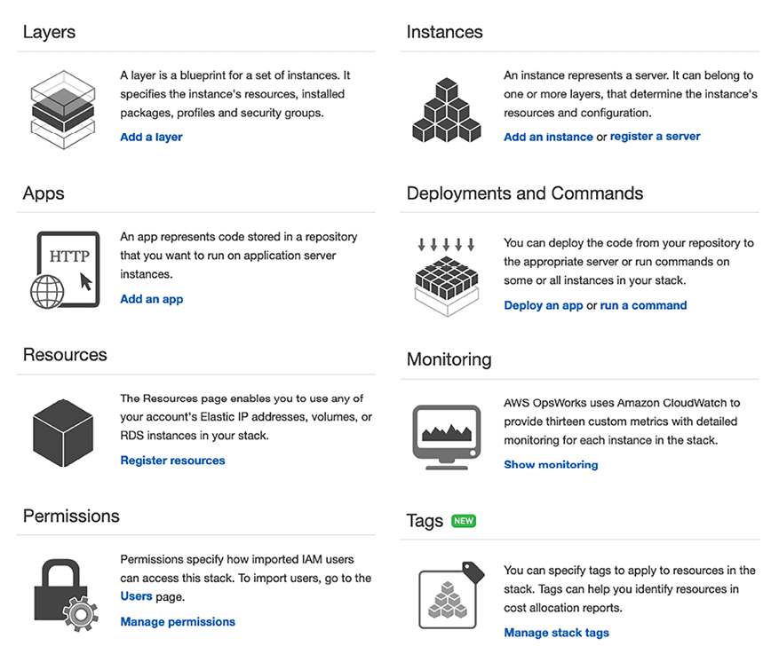

# DevOps و چارچوب معماری راه حل

در فصل قبل، شما ایجاد یک معماری آگاه از هزینه و روش‌هایی را برای بهینه‌سازی مستمر هزینه‌ها بدون به خطر انداختن عملکرد بررسی کردید. اتوماسیون و همکاری بین تیم ها برای توسعه برنامه های کاربردی قوی و صرفه جویی در هزینه ها بسیار مهم است. این فصل به DevOps می پردازد، روشی که همکاری بین تیم های توسعه و عملیات را تقویت می کند و در عین حال فرآیندهای استقرار و نظارت برنامه را خودکار می کند.

در محیط های سنتی، تیم توسعه و تیم عملیات فناوری اطلاعات در سیلوها کار می کنند. تیم توسعه نیازهای صاحبان مشاغل را جمع آوری می کند و برنامه ها را توسعه می دهد. مدیران سیستم صرفاً مسئول عملیات و برآوردن نیازهای زمان کار هستند. این تیم ها معمولاً در طول چرخه عمر توسعه، ارتباط مستقیم کمی دارند و هر تیم به ندرت فرآیندها و نیازهای تیم دیگر را درک می کند.

هر تیم ابزارها، فرآیندها و رویکردهای اضافی خود را دارد که گاهی اوقات منجر به تضاد می شود. برای مثال، تیم‌های توسعه و **تضمین کیفیت** (**QA**) می‌توانند ساخت را روی یک پچ **سیستم عامل** (**OS**) خاص آزمایش کنند. با این حال، تیم عملیات همان بیلد را روی یک نسخه سیستم‌عامل متفاوت در محیط تولید مستقر می‌کند و باعث ایجاد مشکلات و تاخیر در تحویل می‌شود.

DevOps روشی است که همکاری و هماهنگی بین توسعه دهندگان و تیم های عملیاتی را برای ارائه محصولات یا خدمات به طور مداوم ترویج می کند. این رویکرد در سازمان‌هایی سازنده است که تیم‌ها در فرآیند توسعه یا ارائه یک محصول یا خدمات به برنامه‌ها، ابزارها، فناوری‌ها، پلتفرم‌ها، پایگاه‌های اطلاعاتی، دستگاه‌ها و غیره متکی هستند. اگرچه رویکردهای متفاوتی برای فرهنگ DevOps وجود دارد، اما همه آنها در مورد دستیابی به یک هدف مشترک هستند. DevOps در مورد ارائه یک محصول یا خدمات در کوتاه ترین زمان از طریق افزایش کارایی عملیاتی از طریق مسئولیت های مشترک است.

امنیت اولویت اصلی برای هر برنامه ای است و حوادث امنیتی می تواند تأثیر شدیدی بر تجارت داشته باشد. با وجود این، امنیت اغلب در فرآیند استقرار به عنوان یک نگرانی جداگانه مطرح می شود که به صورت واکنشی توسط تیم های امنیتی تخصصی در یک سازمان رسیدگی می شود.

تعبیه امنیت در فرآیند DevOps به عنوان یک جنبه حیاتی را می توان با پیاده سازی DevSecOps به دست آورد. DevSecOps در مورد ادغام امنیت در مراحل اولیه و در طول چرخه عمر توسعه نرم افزار است، بنابراین سیلوها را از بین می برد و همکاری بین توسعه، عملیات و تیم های امنیتی را تقویت می کند. DevSecOps به ارائه بدون به خطر انداختن کیفیت، قابلیت اطمینان، ثبات، انعطاف پذیری یا امنیت کمک می کند.

در این فصل، با موضوعات DevOps زیر آشنا خواهید شد:

- معرفی DevOps
- آشنایی با اجزای DevOps
- یکپارچه سازی مداوم/ استقرار مداوم (CI/CD)
- معرفی DevSecOps در امنیت
- ترکیب DevSecOps و CI/CD
- پیاده سازی استراتژی سی دی
- اجرای آزمایش مداوم در خط لوله CI/CD
- استفاده از ابزار DevOps برای CI/CD
- پیاده سازی بهترین شیوه های DevOps
- ساخت DevOps و DevSecOps در فضای ابری

در پایان این فصل، با اهمیت DevOps در استقرار، تست و امنیت برنامه آشنا خواهید شد. همچنین با بهترین شیوه های DevOps و DevSecOps و ابزارها و تکنیک های مختلف پیاده سازی آنها آشنا خواهید شد.

# معرفی DevOps

در رویکرد **DevOps** (مخفف **توسعه و عملیات**)، تیم‌های توسعه و عملیات در طول مراحل ساخت و استقرار چرخه عمر توسعه نرم‌افزار به طور مشترک کار می‌کنند، مسئولیت‌ها را به اشتراک می‌گذارند و بازخورد مستمر ارائه می‌دهند. ساخت‌های نرم‌افزار به طور مکرر در طول مرحله ساخت در محیط‌های تولید مانند آزمایش می‌شوند و امکان تشخیص زودهنگام عیوب را فراهم می‌کنند.

DevOps ترکیبی از فرهنگ و شیوه است. سازمان‌ها را ملزم می‌کند که فرهنگ خود را با شکستن موانع بین تمام تیم‌ها در چرخه عمر توسعه و تحویل محصول تغییر دهند. DevOps فقط در مورد توسعه و عملیات نیست. کل سازمان شامل مدیریت، صاحبان کسب و کار/برنامه، توسعه دهندگان، مهندسان QA، مدیران انتشار، تیم عملیات و مدیران سیستم را در بر می گیرد.

سرعت به سازمان ها این امکان را می دهد که از رقبا جلوتر بمانند و به سرعت نیازهای مشتری را برطرف کنند. روش‌های خوب DevOps مهندسان توسعه نرم‌افزار و متخصصان عملیات را تشویق می‌کند تا با یکدیگر بهتر کار کنند. این منجر به همکاری و ارتباطات نزدیک‌تر می‌شود که منجر به **زمان کوتاه‌تر برای ورود به بازار**، انتشار قابل اعتماد، بهبود کیفیت کد و نگهداری بهتر می‌شود.

گاهی اوقات با DevOps، متوجه خواهید شد که توسعه و عملیات یک نرم افزار توسط یک تیم واحد انجام می شود، جایی که مهندسان در کل چرخه عمر برنامه کار می کنند. چنین تیمی نیاز به توسعه طیفی از مهارت ها دارد که محدود به یک عملکرد واحد نیست. تیم های تست و امنیت برنامه نیز ممکن است با عملیات و توسعه بیشتر کار کنند

تیم های pment از ابتدا تا راه اندازی تولید یک برنامه کاربردی.

توسعه دهندگان از بازخورد ارائه شده توسط تیم های عملیاتی بهره می برند و استراتژی هایی برای آزمایش و استقرار ایجاد می کنند.

مدیران سیستم مجبور نیستند نرم افزار معیوب یا تست نشده را در محیط های تولیدی پیاده سازی کنند زیرا در مرحله _build_ شرکت می کنند. از آنجایی که همه ذینفعان چرخه عمر توسعه و تحویل نرم‌افزار با یکدیگر همکاری می‌کنند، آنها همچنین می‌توانند ابزارهایی را که قصد استفاده از آنها را در هر مرحله از فرآیند دارند ارزیابی کنند، سازگاری بین دستگاه‌ها را تأیید کنند و تعیین کنند که آیا ابزاری می‌تواند در بین تیم‌ها به اشتراک گذاشته شود یا خیر.

DevOps به عنوان فرهنگ عملیاتی ترجیحی محبوبیت پیدا می کند، به ویژه برای سازمان هایی که از فناوری های محاسباتی ابری یا توزیع شده استفاده می کنند. بیایید در مورد برخی از مزایای مختلف DevOps و اینکه چرا برای حجم کاری برنامه شما ضروری است، بیاموزیم.

## درک مزایای DevOps

هدف DevOps یک مدل **CI/CD** است که می تواند برای ایجاد چرخه عمر توسعه نرم افزار قابل تکرار، قابل اعتماد، پایدار، انعطاف پذیر و ایمن استفاده شود. این ویژگی های مدل به بهبود کارایی عملیاتی کمک می کند. برای دستیابی به این هدف، تیم ها باید با یکدیگر همکاری کرده و در فرآیند توسعه و تحویل شرکت کنند. همه اعضای تیم فنی باید در مورد فرآیندها و ابزارهای درگیر در خط لوله توسعه تجربه داشته باشند.

همانطور که در نمودار زیر نشان داده شده است، یک فرآیند DevOps بالغ چندین مزیت را ارائه می دهد:

شکل 11.1: مزایای DevOps

مزایای ارائه شده توسط DevOps در اینجا توضیح داده شده است:

- **سرعت**: انتشار سریعتر ویژگی های محصول به پاسخگویی به نیازهای تجاری در حال تغییر مشتریان و گسترش بازار شما کمک می کند. یک مدل DevOps سازمان را قادر می سازد تا سریعتر به نتایج دست یابد.
- **تحویل سریع**: فرآیندهای DevOps با خودکارسازی خطوط لوله سرتاسر، از ساخت کد تا استقرار کد و راه اندازی تولید، کارایی را تسهیل می کنند. تحویل سریع به شما کمک می کند تا سریعتر نوآوری کنید. انتشار سریع‌تر رفع اشکال و ویژگی‌ها به شما امکان می‌دهد تا مزیت رقابتی کسب کنید.
- **قابلیت اطمینان**: فرآیندهای DevOps بررسی هایی را برای اطمینان از کیفیت تحویل و ایمنی به روز رسانی های سریع برنامه ارائه می دهند. روش‌های DevOps مانند تست اتوماسیون CI و CD و بررسی‌های امنیتی برای تجربه کاربر نهایی مثبت.
- **مقیاس‌پذیری**: DevOps با گنجاندن اتوماسیون در همه جا، به مقیاس‌بندی زیرساخت و برنامه شما بر اساس درخواست کمک می‌کند.
- **همکاری**: مدل DevOps فرهنگ مالکیت را ایجاد می کند که به موجب آن تیم ها اقدامات خود را در نظر می گیرند. تیم های عملیات و توسعه دهنده در یک مدل مسئولیت مشترک با هم کار می کنند. همکاری فرآیند را ساده می کند و کارایی را افزایش می دهد.
- **امنیت**: در یک محیط چابک، تغییرات مکرر نیاز به بررسی های امنیتی دقیق دارد. مدل DevOps بهترین شیوه‌های امنیتی و انطباق را خودکار می‌کند، آنها را نظارت می‌کند و اقدامات اصلاحی را به روشی خودکار انجام می‌دهد.

تیم‌ها مالکیت کامل خدماتی را که ارائه می‌دهند، اغلب فراتر از محدوده سنتی نقش‌هایشان هستند، و تفکر را از دیدگاه مشتری برای حل هر مشکلی توسعه می‌دهند. بیایید به درک اجزای مختلف فرآیندهای DevOps نگاه کنیم.

# درک اجزای DevOps

ابزارهای DevOps و اتوماسیون عملیات توسعه و سیستم را با هم ترکیب می کنند. موارد زیر اجزای حیاتی یک عمل DevOps هستند:

- CI/CD
- نظارت و بهبود مستمر
- زیرساخت به عنوان کد
- مدیریت پیکربندی

بهترین روش رایج در همه عناصر **اتوماسیون** است. اتوماسیون می تواند شامل اسکریپت ها، قالب ها و ابزارهای دیگر باشد. در یک محیط توسعه یافته DevOps، زیرساخت به عنوان کد مدیریت می شود. اتوماسیون تیم‌های DevOps را قادر می‌سازد تا محیط‌های آزمایش و تولید را به سرعت تنظیم و تنظیم کنند. بیایید جزئیات بیشتری در مورد هر جزء بررسی کنیم.

## یکپارچه سازی مداوم / استقرار مداوم

در **CI**، توسعه دهندگان اغلب کد را به یک مخزن کد متعهد می کنند. کد اغلب ساخته می شود. هر ساخت با استفاده از تست های واحد خودکار و تست های یکپارچه سازی آزمایش می شود. در **CD**، شما جلوتر می روید و اغلب کد خود را در تولید مستقر می کنید. سازه ها برای آزمایش محیط ها مستقر می شوند و با استفاده از تست های خودکار و احتمالاً دستی آزمایش می شوند. ساخت‌های موفق تست‌ها را می‌گذرانند و در محیط‌های صحنه‌سازی یا تولید مستقر می‌شوند.

نمودار زیر تأثیر CI در مقابل CD را در چرخه عمر توسعه نرم افزار نشان می دهد:

شکل 11.2: CI/CD

همانطور که در نمودار قبل نشان داده شده است، CI به مراحل ساخت و تست واحد چرخه عمر توسعه نرم افزار اشاره دارد. هر به‌روزرسانی که در مخزن کد انجام می‌شود، یک ساخت و آزمایش خودکار ایجاد می‌کند. CD یکی از جنبه‌های ضروری CI است که فرآیند CI را برای به کارگیری ساخت در تولید گسترش می‌دهد. در روش های CI/CD، چند نفر روی کد کار می کنند. همه آنها باید از آخرین ساخت کار برای تلاش خود استفاده کنند. مخازن کد نسخه های مختلف کد را نگهداری می کنند و همچنین کد را در دسترس تیم قرار می دهند. شما کد را چک کنید

مخزن، تغییراتی ایجاد کنید، کد جدید را در کپی محلی خود بنویسید، کد خود را کامپایل و آزمایش کنید، و اغلب کد خود را به مخزن اصلی بازگردانید. در CI/CD، مراحل چرخه عمر توسعه نرم افزار مانند کد، ساخت، استقرار و آزمایش با استفاده از خط لوله DevOps خودکار می شوند.

CI بیشتر فرآیند انتشار نرم افزار را خودکار می کند. یک جریان خودکار ایجاد می کند که به روز رسانی را می سازد، آزمایش می کند و سپس مرحله بندی می کند. با این حال، یک توسعه دهنده باید استقرار نهایی را به یک محیط تولید زنده که خودکار نیست راه اندازی کند. با اعمال تغییرات کد در محیط های آزمایشی و/یا تولید پس از مرحله ساخت، بر روی CD گسترش می یابد. اگر CD به درستی پیاده سازی شود، توسعه دهندگان همیشه یک بیلد آزمایش شده و آماده برای استقرار خواهند داشت.

نمودار زیر همه چیز مربوط به اتوماسیون یک برنامه را نشان می دهد، از تعهد کد گرفته تا مخزن کد تا خط لوله استقرار. این یک جریان سرتاسری از ساخت به محیط تولید را نشان می‌دهد، جایی که توسعه‌دهنده تغییر کد را در مخزن کد، که سرور CI می‌کشد، بررسی می‌کند. سرور CI بیلد را برای ایجاد یک بسته استقرار با باینری های برنامه جدید و وابستگی های مربوطه راه اندازی می کند. این باینری های جدید در یک محیط توسعه یا آزمایش هدفمند مستقر می شوند. باینری ها همچنین برای ذخیره سازی ایمن تحت کنترل نسخه در مخزن مصنوع بررسی می شوند:

شکل 11.3: CI/CD برای DevOps

یک خط لوله CD قوی همچنین فراهم کردن زیرساخت برای محیط های آزمایش و تولید را خودکار می کند و نظارت و مدیریت محیط های آزمایش و تولید را امکان پذیر می کند. CD به این معنی نیست که هر تغییری که توسعه دهنده انجام می دهد به مرحله تولید می رسد. در عوض، به این معنی است که هر تغییری برای تولید آماده است. هنگامی که تغییرات در محیط مرحله مرحله بندی و آزمایش می شوند، یک فرآیند تأیید دستی آغاز می شود و یک سیگنال سبز برای استقرار در تولید می دهد. بنابراین، در CD، استقرار در تولید به یک تصمیم تجاری تبدیل می شود و همچنان با ابزارها خودکار است.

## نظارت و بهبود مستمر

نظارت مستمر به ما کمک می کند تا تأثیر عملکرد برنامه و زیرساخت را بر مشتری درک کنیم. شما می توانید با تجزیه و تحلیل داده ها و گزارش ها یاد بگیرید که چگونه تغییرات کد روی کاربران تأثیر می گذارد. نظارت فعال در عصر خدمات 24 ساعته و به روز رسانی مداوم برنامه ها و زیرساخت ها ضروری است.

شما می توانید با ایجاد هشدار و انجام تجزیه و تحلیل در زمان واقعی، خدمات را به طور فعال نظارت کنید. شما می توانید معیارهای مختلفی را برای نظارت و بهبود عملکرد DevOps خود ردیابی کنید.

نمونه هایی از معیارهای مربوط به DevOps به شرح زیر است:

- **تغییر حجم**: این تعداد داستان های کاربر توسعه یافته، تعداد خطوط کد جدید و تعداد اشکالات رفع شده است.
- **فرکانس استقرار**: این نشان می دهد که یک تیم چند وقت یکبار یک برنامه را اجرا می کند. این معیار معمولاً باید ثابت بماند یا روند صعودی را نشان دهد.
- **زمان هدایت از توسعه تا استقرار**: زمان بین شروع یک چرخه توسعه و پایان استقرار می تواند برای شناسایی ناکارآمدی ها در مراحل میانی چرخه انتشار استفاده شود.
- **درصد استقرار ناموفق **: درصد استقرار ناموفق، با احتساب تعداد استقرارهایی که منجر به قطع می شود، باید کم باشد.
- این معیار باید در ارتباط با حجم تغییر بررسی شود. اگر حجم تغییر کم است اما تعداد استقرار ناموفق زیاد است، نقاط احتمالی شکست را تجزیه و تحلیل کنید.
- **در دسترس بودن**: تعداد نسخه هایی که باعث خرابی هایی شده اند را پیگیری کنید که احتمالاً منجر به نقض **توافقنامه های سطح خدمات** (**SLAs**) شده است. متوسط زمان خرابی اپلیکیشن چقدر است؟
- **حجم شکایت مشتری**: تعداد بلیط های شکایت ثبت شده توسط مشتریان نشان دهنده کیفیت درخواست شما است.
- ** درصد تغییر در حجم کاربر **: تعداد کاربران جدیدی که برای استفاده از برنامه شما ثبت نام می کنند و افزایش ترافیک ناشی از آن می تواند به شما کمک کند زیرساخت خود را متناسب با حجم کار مقیاس کنید.

پس از استقرار شما در محیط تولید، نظارت بر عملکرد برنامه شما ضروری است. همانطور که در مورد محیط های خودکار بحث کردیم، بیایید **زیرساخت به عنوان کد** (**IaC**) را با جزئیات بررسی کنیم.

## زیرساخت به عنوان کد

تهیه، مدیریت و حتی مستهلک کردن زیرساخت‌ها یک فعالیت پرهزینه از نظر تلاش انسانی است. علاوه بر این، با تلاش های مکرر برای ساخت و اصلاح محیط ها به صورت دستی، می توان خطاها را ایجاد کرد. چه از تجربه قبلی کار کنید و چه از یک کتاب مستند به خوبی، تمایل یک انسان به اشتباه یک احتمال آماری است.

ما می توانیم کار ایجاد یک محیط کامل را خودکار کنیم. اتوماسیون کار می تواند به تکمیل کارهای تکراری کمک کند و ارزش قابل توجهی را بدون زحمت ارائه دهد.

با IaC می توانیم زیرساخت خود را به شکل **قالب** تعریف کنیم. یک الگو ممکن است از یک قسمت یا کل یک محیط تشکیل شده باشد. مهمتر از آن، این الگو می تواند بارها و بارها برای ایجاد دوباره همان محیط استفاده شود.

در IaC، زیرساخت چرخیده و با استفاده از آن مدیریت می شود

کد یک مدل IaC به شما کمک می کند تا با زیرساخت به صورت برنامه ریزی شده در مقیاس تعامل داشته باشید و با خودکار کردن پیکربندی منابع از خطاهای انسانی جلوگیری کنید. به این ترتیب، با استفاده از ابزارهای مبتنی بر کد، می‌توانید با زیرساخت به همان روشی که با کد کار می‌کنید، کار کنید. از آنجایی که زیرساخت از طریق کد مدیریت می شود، برنامه را می توان با استفاده از یک روش استاندارد مستقر کرد و هر وصله و نسخه را می توان بارها و بارها بدون خطا به روز کرد.

برخی از محبوب ترین ابزارهای برنامه نویسی IaC عبارتند از Ansible، Terraform، Azure Resource Manager، Google Cloud Deployment Manager، Chef، Puppet، AWS **Cloud Development Kit** (**CDK**) و AWS CloudFormation.

در زیر یک نمونه کد از AWS CloudFormation است که قابلیت IaC را برای خودکارسازی زیرساخت‌ها در پلتفرم ابری AWS فراهم می‌کند.

     AWSTemplateFormatVersion: '09-09-2010'
     توضیحات: "یک S3 Storage با یک پارامتر برای انتخاب نام سطل خود ایجاد کنید."
     مولفه های:
     S3NameParam:
     نوع: رشته
     پیش فرض: «معمار-کتاب-ذخیره»
     توضیحات: 'نام سطل S3 را وارد کنید'
     حداقل طول: '5'
     حداکثر طول: '30'
     منابع:
     سطل:
     نوع: 'AWS::S3::Bucket'
     سیاست حذف: حفظ کنید
     خواص:
     AccessControl: خصوصی
     BucketName:
     مرجع: S3NameParam
     برچسب ها:
     - کلید: "نام"
     مقدار: "MyBucket"
     خروجی ها:
     BucketName:
     توضیحات: 'BucketName'
     ارزش:
     مرجع: S3NameParam

کد قبلی ذخیره‌سازی شی آمازون S3 را با گزینه‌ای برای کاربر ایجاد می‌کند تا نام ذخیره‌سازی انتخابی خود را ارائه کند، همانطور که در زیر نشان داده شده است:

شکل 11.4: IaC با استفاده از AWS CloudFormation

پس از اجرای کد، سطل آمازون S3 ایجاد می شود، همانطور که در **منابع** می بینید:

شکل 11.5: ایجاد خودکار ذخیره سازی شی AWS S3 با استفاده از AWS CloudFormation

چندین تیم می توانند از کد ارائه شده برای ایجاد هر مقدار فضای ذخیره سازی Amazon S3 استفاده کنند. از آنجایی که داده‌ها بسیار ضروری هستند، سرپرست تصمیم گرفت سطل «DeletionPolicy»: «Retain» را اضافه کند که تضمین می‌کند وقتی زیرساخت‌ها از بین نمی‌روند و داده‌ها ایمن هستند، فضای ذخیره‌سازی حذف نمی‌شود.

می توانید ببینید که چگونه می توانید استانداردسازی، سازگاری و انطباق را در بین سازمان ها با استفاده از IaC پیاده سازی کنید. مدیریت پیکربندی یکی دیگر از جنبه های حیاتی فرآیند DevOps است. بیایید در مورد آن بیشتر بدانیم.

## مدیریت پیکربندی

**مدیریت پیکربندی** (**CM**) فرآیند استفاده از اتوماسیون برای استانداردسازی پیکربندی منابع در کل زیرساخت و برنامه های کاربردی شما است. ابزارهای CM مانند Chef، Puppet و Ansible می توانند به شما در مدیریت IaC و خودکارسازی اکثر وظایف مدیریت سیستم، از جمله تهیه، پیکربندی و مدیریت منابع IT کمک کنند.

با خودکارسازی و استاندارد کردن پیکربندی‌های منابع در مراحل توسعه، ساخت، آزمایش و استقرار، می‌توانید از ثبات اطمینان حاصل کنید و خرابی‌های ناشی از پیکربندی نادرست را حذف کنید. CM همچنین می‌تواند بهره‌وری عملیات شما را با این امکان افزایش دهد که به شما امکان می‌دهد با فشار یک دکمه، پیکربندی مشابهی را در صدها سرور به طور خودکار اجرا کنید. همچنین می توان از CM برای اعمال تغییرات در پیکربندی ها استفاده کرد.

اگرچه می‌توانید از تنظیمات رجیستری یا پایگاه‌های داده برای ذخیره تنظیمات پیکربندی سیستم استفاده کنید، یک برنامه CM به شما امکان می‌دهد تا علاوه بر ذخیره‌سازی، کنترل نسخه را نیز حفظ کنید. CM همچنین راهی برای ردیابی و ممیزی تغییرات پیکربندی است. در صورت لزوم، حتی می توانید چندین نسخه تنظیمات پیکربندی را برای نسخه های مختلف نرم افزار حفظ کنید.

ابزارهای CM شامل یک ماشین کنترل کننده است که گره های سرور را مدیریت می کند. به عنوان مثال، Chef برای مدیریت به یک برنامه عامل مشتری نصب شده روی هر سرور نیاز دارد و یک برنامه Master Chef روی دستگاه کنترل کننده نصب شده است. Puppet همچنین با یک سرور متمرکز به همین ترتیب کار می کند. با این حال، Ansible یک رویکرد غیر متمرکز دارد که نیازی به نصب نرم افزار عامل بر روی گره های سرور ندارد.

جدول زیر مقایسه سطح بالایی بین ابزارهای مختلف مدیریت پیکربندی محبوب را نشان می دهد:

| **جنبه** | **آنسیبل** | **عروسک** | **آشپز** |
| ------------------------- | ------------------------------------------------ ---------------------------- | ------------------------------------------ | ------------------------------------------------ -------------------------------------- |
| **مکانیسم** | ماشین کنترلر با استفاده از **Secure Shell** (**SSH**) تغییرات را روی سرورها اعمال می کند | Master تغییرات را در Puppet Node | همگام می کند ایستگاه کاری Chef به دنبال تغییرات در سرورهای Chef می گردد و آنها را به گره Chef هل می دهد. |
| **معماری** | هر سروری می تواند کنترل کننده | کنترل متمرکز توسط استاد عروسکی | کنترل متمرکز توسط سرور آشپز |
| **زبان اسکریپت** | YAML
| دامنه خاص در Ruby | یاقوت |
| **اصطلاحات اسکریپت** | کتاب بازی و نقش ها | مانیفست ها و ماژول ها | دستور پخت و کتاب آشپزی |
| **اجرای تست** | ترتیب ترتیبی | سفارش غیر ترتیبی | ترتیب ترتیبی |

جدول 11.1 - نمودار مقایسه ابزارهای محبوب CM

ابزارهای CM یک زبان خاص دامنه و مجموعه ای از ویژگی ها را برای اتوماسیون ارائه می دهند. برخی از این ابزارها دارای یک منحنی یادگیری تند هستند که به موجب آن تیم باید ابزار را یاد بگیرد. AWS یک پلتفرم مدیریت شده به نام OpsWorks را برای مدیریت آشپز و عروسک در فضای ابری فراهم می کند. این ویژگی های مختلفی را برای مدیریت زیرساخت فناوری اطلاعات از طریق اتوماسیون فراهم می کند، همانطور که در زیر نشان داده شده است:

شکل 11.6: قابلیت های سرویس AWS OpsWorks برای آشپز و عروسک مدیریت شده

امنیت برای هر سازمانی به یک اولویت تبدیل شده است، بنابراین اتوماسیون امنیتی کامل نیاز روز است. سازمان ها با استفاده از فرآیند DevOps که معروف به **DevSecOps** است، به سمت پیاده سازی ها و نظارت های امنیتی شدید می روند تا از خطای انسانی جلوگیری کنند. در بخش بعدی، بیایید **DevSecOps** (مخفف **توسعه، امنیت و عملیات**) را بررسی کنیم.

# معرفی DevSecOps برای امنیت

ما اکنون بیش از هر زمان دیگری بر امنیت متمرکز شده ایم. در بسیاری از شرایط، امنیت تنها راه جلب اعتماد مشتری است. DevSecOps در مورد اتوماسیون امنیت و اجرای امنیت در مقیاس است. تیم توسعه دائماً تغییراتی را ایجاد می کند و تیم DevOps آنها را در مرحله تولید منتشر می کند (تغییرات اغلب با مشتری مواجه می شوند). DevSecOps امنیت برنامه را در فرآیند کلی تضمین می کند.

DevSecOps برای بررسی کد یا مصنوعات CI/CD وجود ندارد. سازمان‌ها باید DevSecOps را برای فعال کردن سرعت و چابکی پیاده‌سازی کنند، اما نه به قیمت اعتبارسنجی امنیت که روند توسعه و استقرار را کند می‌کند. قدرت اتوماسیون در افزایش چابکی راه اندازی ویژگی محصول در حین اجرای اقدامات امنیتی مورد نیاز است. یک رویکرد DevSecOps منجر به امنیت داخلی می شود. امنیت فقط به عنوان یک فکر بعدی اعمال نمی شود. DevOps در مورد افزایش کارایی برای سرعت بخشیدن به چرخه عمر راه اندازی محصول است، در حالی که DevSecOps تمام بلوک های سازنده را بدون کاهش چرخه عمر تأیید می کند.

برای ایجاد رویکرد DevSecOps در سازمان خود، با یک پایه قوی DevOps در سراسر محیط توسعه شروع کنید، زیرا امنیت مسئولیت همه است. بهترین کار این است که امنیت را در طراحی معماری از ابتدا تعبیه کنیم تا همکاری بین تیم های توسعه و امنیت ایجاد شود. تست امنیتی مداوم را به صورت خودکار انجام دهید و آن را در خط لوله CI/CD قرار دهید تا از هرگونه شکاف امنیتی جلوگیری کنید. برای پیگیری هرگونه نقض امنیتی، نظارت را گسترش دهید تا با نظارت بر انحراف از حالت طراحی در زمان واقعی، امنیت و انطباق را نیز شامل شود. نظارت باید هشدار، اصلاح خودکار و حذف منابع ناسازگار را ممکن کند.

کدگذاری همه چیز یک نیاز ضروری است که امکانات بی نهایتی را در اختیار شما قرار می دهد. هدف DevSecOps حفظ سرعت نوآوری است که باید با سرعت اتوماسیون امنیتی مطابقت داشته باشد. یک زیرساخت مقیاس‌پذیر به امنیت مقیاس‌پذیر نیاز دارد، که برای اجرای انطباق و اعتبارسنجی مستمر، نیاز به اصلاح خودکار واکنش حوادث دارد.

# ترکیب DevSecOps و CI/CD

یک عمل DevSecOps باید با هر مرحله خط لوله CI/CD تعبیه شود. DevSecOps امنیت خط لوله CI/CD را با مدیریت دسترسی مناسب و نقش های اختصاص داده شده به هر سرور تضمین می کند و اطمینان حاصل می کند که سرورهای ساخت، مانند جنکینز، سخت شده اند تا از هرگونه نقص امنیتی محافظت شوند. علاوه بر آن، ما باید اطمینان حاصل کنیم که تمام مصنوعات معتبر هستند و تجزیه و تحلیل کد در محل است.

توصیه می‌شود با خودکارسازی اعتبار انطباق مستمر و اصلاح پاسخ حادثه برای پاسخ به حادثه آماده باشید. به عنوان مثال، اگر سازمانی نیاز به پیروی از استاندارد امنیت داده صنعت کارت پرداخت (PCI-DSS) داشته باشد، اعتبارسنجی انطباق مستمر شامل راه اندازی ابزارها و فرآیندهای خودکار برای بررسی دائمی اینکه رسیدگی، پردازش و ذخیره سازی اطلاعات کارت اعتباری مطابقت دارد یا خیر. الزامات PCI-DSS

نمودار زیر مراحل متعددی را برای آزمایش مرزهای امنیتی و بررسی مسائل امنیتی و اطمینان از انطباق با خط‌مشی‌ها در اسرع وقت در اختیار ما قرار می‌دهد:

شکل 11.7: DevSecOps و CI/CD

در هر نقطه ادغام، می‌توانید مسائل مختلفی را شناسایی کنید، همانطور که در نمودار قبل نشان داده شده است:

- در مرحله **کد**، تمام کدها را اسکن کنید تا مطمئن شوید که هیچ رمزی یا کلید دسترسی بین خطوط کد هاردکد نشده است.
- در مرحله **ساخت**، تمام امنیت را شامل شود

y مصنوعات، مانند کلید رمزگذاری و مدیریت توکن دسترسی، و آنها را برای شناسایی آسان برچسب گذاری کنید.
- در طول مرحله **تست**، پیکربندی را اسکن کنید تا مطمئن شوید که تمام استانداردهای امنیتی با امنیت تست مطابقت دارند.
- در مراحل **Deploy** و **Provision**، اطمینان حاصل کنید که تمام اجزای امنیتی ثبت شده اند. برای اطمینان از عدم تغییر در فایل های ساخت، یک چک سام انجام دهید. چک‌سام تکنیکی است که برای تعیین صحت فایل‌های دریافتی استفاده می‌شود. سیستم‌های عامل دستور «checksum» را برای اعتبارسنجی فایل و اطمینان از عدم ایجاد تغییر در حین انتقال فایل ارائه می‌کنند.
- نظارت بر تمامی استانداردهای امنیتی در مرحله **مانیتور**. ممیزی و اعتبارسنجی مستمر را به صورت خودکار انجام دهید.

شما می توانید چندین ابزار را در خطوط لوله DevSecOps ادغام کنید تا آسیب پذیری های امنیتی را در مراحل مختلف شناسایی کرده و یافته های آسیب پذیری را جمع آوری کنید.

**تست امنیت برنامه** (**AST**)، که شامل استفاده از ابزارهایی برای خودکارسازی تست، تجزیه و تحلیل و گزارش آسیب‌پذیری‌های امنیتی است، یکی از اجزای حیاتی توسعه برنامه است. AST را می توان به چهار دسته زیر برای اسکن آسیب پذیری های امنیتی در برنامه های نرم افزاری تقسیم کرد:

- **تحلیل ترکیبی نرم افزار** (**SCA**): SCA امنیت نرم افزار منبع باز، انطباق با مجوز و کیفیت کد را در یک پایگاه کد ارزیابی می کند. SCA تلاش می کند تا آسیب پذیری های افشا شده عمومی موجود در وابستگی های پروژه را شناسایی کند. ابزارهای محبوب SCA عبارتند از OWASP Dependency-Check، Synopsys’ Black Duck، WhiteSource، Synk و GitLab.
- **تست امنیت برنامه استاتیک** (**SAST**): SAST شامل اسکن کد برنامه قبل از کامپایل است. این ابزارها بازخورد فوری را در طول فرآیند کدنویسی به توسعه دهندگان ارائه می دهند و امکان تصحیح اولیه مشکلات را قبل از مرحله ساخت کد فراهم می کنند. به عنوان یک روش تست جعبه سفید، SAST کد منبع را برای شناسایی آسیب‌پذیری‌هایی که می‌توانند برنامه‌ها را مستعد حملات کنند، تجزیه و تحلیل می‌کند. مزیت اصلی آن ادغام آن در اوایل چرخه DevOps، در مرحله کدگذاری است، زیرا به برنامه کاربردی یا اجرای کد نیاز ندارد. ابزارهای محبوب SAST عبارتند از SonarQube، PHPStan، Coverity، Synk، Appknox، Klocwork، CodeScan و Checkmarx.
- **تست امنیت برنامه پویا** (**DAST**): DAST آسیب پذیری های امنیتی را با تقلید حملات خارجی به یک برنامه در حین اجرا شناسایی می کند. این برنامه را از بیرون ارزیابی می کند و رابط های در معرض آسیب را بررسی می کند. ابزارهای DAST که به عنوان تست امنیتی جعبه سیاه یا اسکنر آسیب‌پذیری برنامه وب شناخته می‌شوند شامل OWASP ZAP، Netsparker، Detectify Deep Scan، StackHawk، Appknox، HCL AppScan، GitLab و Checkmarx هستند.
- **تست امنیتی برنامه تعاملی** (**IAST**): IAST کد را برای آسیب پذیری های امنیتی در حالی که برنامه به طور فعال در حال آزمایش یا استفاده است بررسی می کند، بنابراین مشکلات را به صورت بلادرنگ گزارش می کند بدون اینکه باعث تاخیر در خط لوله CI/CD شود. ابزارهای IAST معمولاً در محیط های QA در کنار تست های عملکردی خودکار پیاده سازی می شوند. ابزارهای قابل توجه IAST عبارتند از GitLab، Veracode، CxSAST، Burp Suite، Acunetix، Netsparker، InsightAppSec و HCL AppScan.

در ادامه این فصل، در بخش _Building DevOps و DevSecOps در بخش ابری، در مورد ادغام برخی از ابزارهای بالا در خط لوله DevOps آشنا خواهید شد. DevSecOps CI/CD تأیید می کند که کد بر اساس خط مشی امنیتی شرکت تأیید شده است.

این به جلوگیری از هرگونه خرابی زیرساخت و برنامه در استقرار بعدی به دلیل تنظیمات امنیتی مختلف کمک می کند. DevSecOps چابکی را حفظ می کند و امنیت را در مقیاس بدون تأثیر بر سرعت نوآوری DevOps تضمین می کند. بیایید در مورد استراتژی CD در خط لوله DevOps بیاموزیم.

# پیاده سازی استراتژی سی دی

CD انتقال یکپارچه نسخه موجود برنامه به نسخه جدید را فراهم می کند. برخی از محبوب ترین تکنیک ها برای پیاده سازی از طریق CD به شرح زیر است:

- ** استقرار در محل **: به روز رسانی برنامه در سرور فعلی
- ** استقرار رول **: به تدریج نسخه جدید را در ناوگان سرورهای موجود عرضه کنید
- **استقرار سبز-آبی**: به تدریج سرور موجود را با سرور جدید جایگزین کنید
- ** استقرار قرمز-سیاه **: قطع فوری به سرور جدید از سرور موجود
- ** استقرار غیرقابل تغییر **: به طور کلی مجموعه جدیدی از سرورها را برپا کنید

بیایید هر گزینه را با جزئیات بیشتری بررسی کنیم.

## استقرار در محل

استقرار در محل روشی برای عرضه نسخه جدید برنامه در ناوگان سرورهای موجود است. به روز رسانی در یک اقدام استقرار انجام می شود و به مدتی از کار افتادگی نیاز دارد. به ندرت نیاز به تغییر زیرساخت برای این به روز رسانی است. همچنین نیازی به به روز رسانی رکوردهای **سیستم نام دامنه** (**DNS**) موجود نیست. فرآیند استقرار خود نسبتاً سریع است. اگر استقرار با شکست مواجه شد، استقرار مجدد تنها گزینه برای بازیابی است.

به عنوان یک توضیح ساده، شما در حال جایگزینی نسخه برنامه موجود (v1) در زیرساخت برنامه با نسخه جدید (v2) هستید. به روز رسانی های در محل کم هزینه و سریع اجرا می شوند.

## استقرار نورد

با یک رول

با استقرار، ناوگان سرور به گروه هایی تقسیم می شود، بنابراین نیازی به به روز رسانی همزمان ندارد. فرآیند استقرار نسخه‌های نرم‌افزار قدیمی و جدید را در ناوگان سرور یکسان اما با زیرگروه‌های مختلف اجرا می‌کند. یک رویکرد استقرار چرخشی به دستیابی به زمان توقف صفر کمک می کند. اگر استقرار نسخه جدید با شکست مواجه شود، تنها زیرمجموعه ای از سرورها از کل ناوگان تحت تأثیر قرار می گیرند و این خطر بسیار کم است زیرا نیمی از ناوگان هنوز راه اندازی و اجرا می شود. استقرار نورد به دستیابی به توقف صفر کمک می کند. با این حال، زمان استقرار کمی بیشتر از استقرار در محل است.

استقرار چرخشی نه تنها به دستیابی به زمان خاموشی صفر کمک می کند و تجربه کاربر را بهبود می بخشد، بلکه از نظر تخصیص منابع اضافی نیز خنثی است. بر خلاف استقرار سبز-آبی که نیازمند دوبرابر کردن محیط برای یک دوره است، استقرارهای چرخشی منابع موجود را یکی یکی به روز می کنند و از نیاز به زیرساخت اضافی اجتناب می کنند. در حالی که زمان استقرار ممکن است در مقایسه با استقرار در محل کمی طولانی‌تر باشد، این روش هزینه‌های اضافی ناشی از تهیه منابع اضافی را متحمل نمی‌شود، و آن را به یک استراتژی کارآمد برای تحویل مداوم بدون تأثیر بر بودجه شما تبدیل می‌کند. بیایید اکنون در مورد استقرار سبز-آبی بیاموزیم.

## استقرار سبز-آبی

ایده پشت استقرار سبز-آبی این است که محیط آبی شما محیط تولید فعلی شما است که ترافیک زنده را حمل می کند. به موازات آن، به غیر از داشتن نسخه جدید کد خود، یک محیط سبز ارائه می دهید که مشابه محیط آبی است. وقتی زمان استقرار فرا می رسد، ترافیک تولید را از محیط آبی به محیط سبز هدایت می کنید. اگر در محیط سبز با مشکلی مواجه شدید، می توانید با برگرداندن ترافیک به محیط آبی اصلی، آن را به عقب برگردانید. برش DNS و جابجایی گروه‌های مقیاس خودکار دو روش رایج برای مسیریابی مجدد ترافیک در استقرار سبز-آبی هستند.

با استفاده از خط‌مشی‌های مقیاس‌بندی خودکار، می‌توانید به تدریج نمونه‌های موجود را با نمونه‌هایی جایگزین کنید که نسخه جدید برنامه شما را میزبانی می‌کنند. این گزینه بهتر است برای انتشار جزئی و تغییرات کوچک کد استفاده شود. گزینه دیگر استفاده از مسیریابی DNS برای انجام تعادل بار پیچیده بین نسخه های مختلف برنامه ما است.

همانطور که در نمودار زیر نشان داده شده است، پس از ایجاد یک محیط تولید که میزبان نسخه جدید برنامه ما باشد، می توانید از مسیر DNS برای انتقال بخش کوچکی از ترافیک به محیط جدید استفاده کنید:

شکل 11.8: برش تدریجی استقرار DNS سبز-آبی

محیط سبز را با کسری از ترافیک تولید آزمایش کنید که **تحلیل قناری** نامیده می شود. اگر محیط دارای مشکلات عملکردی باشد، می‌توانید بلافاصله قبل از تأثیر قابل‌توجهی بر کاربران خود، ترافیک را مطلع کرده و آن را تغییر دهید. به تغییر تدریجی ترافیک ادامه دهید و توانایی محیط سبز را برای کنترل بار آزمایش کنید. محیط سبز را برای شناسایی مسائل زیر نظر بگیرید، فرصتی برای تغییر ترافیک و در نتیجه محدود کردن شعاع انفجار فراهم کنید. در نهایت، محیط آبی را از رده خارج کنید و زمانی که تمام معیارها درست هستند، منابع را آزاد کنید.

استقرار سبز-آبی به دستیابی به توقف صفر کمک می کند و بازگشت آسان را فراهم می کند. شما می توانید زمان استقرار را بر اساس نیاز خود سفارشی کنید. با این حال، این زمان‌های خاموشی صفر با توجه به هزینه همراه است زیرا این رویکرد مستلزم حفظ دو محیط تولید یکسان، یکی فعال (آبی) و دیگری بی‌کار (سبز) است. نیاز به تکثیر محیط به معنای هزینه های عملیاتی بالاتر به دلیل منابع اضافی مورد نیاز است. با این حال، این هزینه اغلب با ارزشی که از نظر کاهش خطر و تجربه کاربر بدون وقفه می‌افزاید، توجیه می‌شود.

## استقرار قرمز و سیاه

قبل از نصب یک نسخه جدید از یک سیستم در استقرار قرمز-مشکی، آزمایش قناری را انجام دهید. قناری حدود 1٪ از سیستم تولید موجود خود را با آخرین نسخه برنامه جایگزین می کند و جدیدترین نسخه را از نظر خطا نظارت می کند. اگر قناری این آزمایش اولیه را پاک کند، سیستم آماده استقرار در نظر گرفته می شود. یک نسخه سیستم جدید در کنار نسخه قدیمی در آماده سازی برای جابجایی قرار دارد. ظرفیت اولیه سیستم جدید با بررسی چند نمونه در حال حاضر در حال تولید و تنظیم این عدد به عنوان ظرفیت مورد نظر برای گروه جدید مقیاس خودکار، به صورت دستی تنظیم می شود. هنگامی که سیستم جدید راه اندازی شد، هر دو سیستم قرمز می شوند. نسخه فعلی تنها نسخه ای است که ترافیک را می پذیرد.

سپس سیستم با استفاده از سرویس DNS از نسخه موجود به نسخه جدید بریده می شود. در این مرحله، نسخه قدیمی سیاه و سفید در نظر گرفته می شود. هنوز در حال اجرا است اما هیچ ترافیکی دریافت نمی کند. اگر مشکلی در نسخه جدید شناسایی شود، بازگردانی به سادگی نشان دادن سرور DNS به متعادل کننده بار نسخه قدیمی است.

استقرار قرمز-مشکی با نام **پرتاب تیره** نیز شناخته می شود و کمی با استقرار سبز-آبی متفاوت است. در استقرار قرمز-مشکی، یک برش ناگهانی DNS از نسخه قدیمی به نسخه جدید انجام می دهید، در حالی که در قسمت سبز-آبی

DNS به تدریج ترافیک نسخه جدید را افزایش می دهد. استقرار سبز-آبی و راه اندازی تیره را می توان برای استقرار هر دو نسخه نرم افزار در کنار هم ترکیب کرد. دو مسیر کد جداگانه استفاده می شود، اما تنها یکی فعال است. یک پرچم ویژگی مسیر کد دیگر را فعال می کند. این استقرار می تواند به عنوان یک آزمایش بتا استفاده شود که در آن می توانید ویژگی های جدید را به صراحت فعال کنید.

استقرار قرمز-مشکی، مشابه استقرار آبی-سبز، شامل اجرای دو محیط یکسان برای اطمینان از عدم توقف زمان و تسهیل بازگشت آسان است. پیامدهای هزینه در درجه اول با نیاز به دو برابر کردن منابع در طول مرحله استقرار مرتبط است. شما یک محیط "قرمز" (نسخه زنده فعلی) و یک محیط "سیاه" (نسخه جدید) خواهید داشت. هر دو محیط باید کاملاً عملیاتی باشند، که به طور مؤثری نیاز منابع - از جمله منابع محاسباتی، ذخیره سازی و شبکه - را در طول دوره انتقال دو برابر می کند. در حالی که این رویکرد به طور قابل توجهی خطرات استقرار را کاهش می دهد و یک تجربه کاربری یکپارچه را فراهم می کند، محیط تکراری منجر به افزایش هزینه ها می شود. با این حال، از آنجایی که منابع اضافی فقط برای مدت زمان پنجره استقرار مورد نیاز است، این هزینه موقتی است و می تواند سرمایه گذاری در ثبات و قابلیت اطمینان در نظر گرفته شود.

## استقرار غیرقابل تغییر

اگر برنامه شما وابستگی های ناشناخته ای داشته باشد، ارتقای غیرقابل تغییر یا یکبار مصرف ساده تر است. یک زیرساخت برنامه قدیمی که به مرور زمان وصله شده و مجدداً وصله شده است، ارتقاء آن به طور فزاینده ای دشوار می شود. این نوع تکنیک ارتقاء بیشتر در زیرساخت های تغییرناپذیر رایج است.

در طول نسخه جدید، یک مجموعه نمونه سرور جدید با پایان دادن به نمونه های قدیمی تر ارائه می شود. برای ارتقای یکبار مصرف، می‌توانید یک محیط شبیه‌سازی شده با سرویس‌های استقرار مانند Chef، Puppet، Ansible و Terraform راه‌اندازی کنید یا از آن‌ها در ترکیب با پیکربندی مقیاس‌بندی خودکار برای مدیریت به‌روزرسانی‌ها استفاده کنید.

علاوه بر خرابی، هنگام طراحی استراتژی استقرار خود باید هزینه را نیز در نظر بگیرید. تعداد نمونه هایی را که باید جایگزین کنید و تعداد دفعات استقرار خود را برای تعیین هزینه در نظر بگیرید. با در نظر گرفتن بودجه و زمان از کار افتادن خود، از رویکردی استفاده کنید که به بهترین وجه مناسب است.

در این بخش، با استراتژی‌های مختلف CD آشنا شدید که به انتشار اپلیکیشن شما کارآمدتر و بدون دردسر کمک می‌کنند. بیایید بهترین روش ها را برای انتخاب نوع استقرار مناسب ببینیم.

# بهترین شیوه ها برای انتخاب استراتژی استقرار مناسب

انتخاب استراتژی استقرار مناسب برای به‌روزرسانی موفقیت‌آمیز برنامه و تجربه کاربری یکپارچه بسیار مهم است. در اینجا بهترین روش ها برای انتخاب از بین استراتژی های مختلف استقرار آمده است:

- **استقرار در محل**: استقرار در محل برای سناریوهایی که سادگی کلیدی است و برنامه نسبتاً کوچک است یا پایگاه کاربر محدودی دارد ایده آل است. به عنوان مثال، به روز رسانی ابزار داخلی یک شرکت با یک تیم کوچک به خوبی با این رویکرد مطابقت دارد. این شامل به روز رسانی برنامه در سرور فعلی است، اما مهم است که توجه داشته باشید که می تواند باعث خرابی شود. این استراتژی بهترین مناسب برای برنامه های کاربردی در مقیاس بزرگ یا در دسترس نیست. یک مثال قابل توجه می تواند به روز رسانی یک وب سرویس در مقیاس کوچک یک شبه با ترافیک کم کاربر باشد. در صورتی که به‌روزرسانی نتواند نسخه قبلی را بازیابی کند و به سرعت اختلال را به حداقل برساند، داشتن یک استراتژی بازگشت بسیار مهم است.\* ** استقرار چرخشی**: استقرار چرخشی برای برنامه‌هایی مناسب است که به حداقل زمان خرابی نیاز دارند اما به منابع اضافی نیاز ندارند. این رویکرد برنامه را به تدریج در سراسر ناوگان سرورهای موجود به روز می کند. به عنوان مثال می توان یک به روز رسانی را در سرورهای یک وب سایت تجارت الکترونیک به صورت مرحله ای اجرا کرد، تا اطمینان حاصل شود که تنها بخشی از کاربران در یک زمان با مشکلات احتمالی مواجه می شوند. با این حال، این روش برای برنامه هایی که نمی توانند به طور همزمان نسخه های مختلف را مدیریت کنند، نامناسب است. نظارت مستمر بر عملکرد برنامه در طول استقرار کلیدی برای رسیدگی به مشکلات در صورت بروز آنها است.
- ** استقرار سبز-آبی **: استقرار سبز-آبی برای برنامه های حیاتی که در آن زمان توقف صفر ضروری است، بهترین است. یک شرکت خدمات مالی ممکن است از این استراتژی برای به روز رسانی برنامه کاربردی مشتری خود استفاده کند. هنگامی که محیط سبز به طور کامل آزمایش و آماده شد، ترافیک از آبی به سبز تغییر می کند. این روش به منابع دو برابری نیاز دارد اما تجربه کاربری یکپارچه و قابلیت بازگشت سریع را ارائه می دهد. بسیار مهم است که اطمینان حاصل شود که مکانیسم های متعادل کننده بار و سوئیچینگ DNS قوی و قابل اعتماد هستند.
- **استقرار قرمز-مشکی**: استقرار قرمز-مشکی شبیه به آبی-سبز است اما بر روی یک برش سریعتر به نسخه جدید تمرکز دارد. این به ویژه برای انتشار سریع نسخه های جدید موثر است و اغلب در محیط های کانتینری استفاده می شود. به عنوان مثال، یک سرویس پخش رسانه ممکن است نسخه جدیدی از پلتفرم خود را با استفاده از این استراتژی اجرا کند و از دسترسی فوری ویژگی های جدید به همه کاربران اطمینان حاصل کند. در حالی که انتشار سریع و تعویض فوری را ارائه می دهد، آزمایش کامل نسخه جدید بسیار مهم است زیرا بازگشت مجدد شامل revertin است.

g به محیط قدیمی.
- ** استقرار غیرقابل تغییر **: استقرار غیرقابل تغییر، ثبات و قابلیت اطمینان را به ویژه در محیط های ابری تضمین می کند. هر استقرار شامل راه اندازی سرورهای جدید است که یک وضعیت قابل پیش بینی و پایدار را تضمین می کند. این رویکرد می‌تواند برای برنامه‌هایی با وابستگی‌های پیچیده مفید باشد، زیرا از "انحراف پیکربندی" که در محیط‌های طولانی مدت دیده می‌شود، جلوگیری می‌کند. این استراتژی مستلزم مدیریت کارآمد منابع زیرساخت است، زیرا شامل تهیه سرورهای جدید و از کار انداختن سرورهای قدیمی با هر نسخه است.

در هر یک از این استراتژی‌ها، ارزیابی عواملی مانند پیچیدگی برنامه، مقیاس، پایگاه کاربر و تأثیر زمان خرابی بالقوه مهم است.

علاوه بر این، در دسترس بودن منابع، هزینه های زیرساخت و اهمیت برنامه باید انتخاب استراتژی استقرار را هدایت کند. به روز رسانی و اصلاح منظم رویکرد استقرار در راستای تغییرات تکنولوژیکی و سازمانی نیز برای حفظ فرآیند استقرار موثر کلیدی است.

برای تحویل با کیفیت بالا باید در هر مرحله آزمایش برنامه را انجام دهید، که اغلب به تلاش قابل توجهی نیاز دارد. خط لوله DevOps می تواند به شما در خودکارسازی فرآیند آزمایش و افزایش کیفیت و دفعات انتشار ویژگی ها کمک کند. بیایید در مورد آزمایش مداوم در خط لوله CI/CD بیشتر بیاموزیم.

# اجرای آزمایش مداوم در خط لوله CI/CD

DevOps برای تغییر مستمر سناریوهای تجاری بر اساس بازخورد مشتری، تقاضا برای ویژگی‌های جدید یا تغییر در روندهای بازار کلیدی است. یک خط لوله قوی CI/CD تضمین می کند که ویژگی ها/بازخوردهای بیشتر در زمان کمتری گنجانده می شوند و مشتریان می توانند سریعتر از ویژگی های جدید استفاده کنند.

با بررسی‌های مکرر کد، داشتن یک استراتژی تست خوب در خط لوله CI/CD شما این اطمینان را می‌دهد که حلقه بازخورد را با کیفیت ببندید. آزمایش مداوم در تعادل خط لوله CI/CD ضروری است. در حالی که افزودن سریع ویژگی‌های نرم‌افزار خوب است، اطمینان از اینکه ویژگی‌ها با استانداردهای کیفیت خوب مطابقت دارند با آزمایش مداوم به دست می‌آیند.

آزمون های واحد مهم ترین مقدار استراتژی تست شما را تشکیل می دهند. آنها معمولاً روی دستگاه توسعه دهنده اجرا می شوند و سریع ترین و ارزان ترین هستند. یک قانون کلی این است که 70٪ از تلاش های آزمایشی خود را در تست واحد بگنجانید. اشکالات کشف شده در این مرحله را می توان به سرعت با پیچیدگی کمتر برطرف کرد.

توسعه دهنده اغلب تست های واحد را انجام می دهد و پس از آماده شدن کد، برای یکپارچه سازی و تست سیستم مستقر می شود. این تست‌ها به محیط‌های خاص خود و گاهی تیم‌های آزمایش مجزا نیاز دارند که این امر فرآیند تست را پرهزینه‌تر می‌کند. هنگامی که تیم اطمینان حاصل کرد که همه ویژگی های مورد نظر مطابق انتظار کار می کنند، تیم عملیات باید تست های عملکرد و انطباق را اجرا کند. این تست ها به محیط های تولید مانند نیاز دارند و هزینه بر هستند. همچنین، **تست پذیرش کاربر** (**UAT**) نیاز به یک نمونه از محیط های تولید مانند دارد که باعث هزینه بیشتر می شود.

همانطور که در نمودار زیر نشان داده شده است، توسعه دهندگان تست های واحد را برای آزمایش تغییرات کد/ویژگی های جدید در مرحله توسعه انجام می دهند. آزمایش معمولاً پس از تکمیل کدنویسی بر روی ماشین توسعه دهنده انجام می شود. همچنین توصیه می‌شود روی تغییرات کد، تحلیل کد استاتیک انجام شود و پوشش کد، رعایت دستورالعمل‌های کدنویسی و غیره انجام شود. تست های واحد کوچکتر بدون وابستگی سریعتر اجرا می شوند. بنابراین، توسعه دهنده می تواند به سرعت متوجه شود که آیا آزمایش شکست خورده است:

شکل 11.9: آزمایش مداوم در CI/CD

**فاز ساخت** اولین آزمایش برای ادغام بین اجزای مختلف و اجزای جداگانه است. مرحله ساخت همچنین زمان بسیار خوبی برای آزمایش اینکه آیا کد متعهد شده توسط یک توسعه دهنده هر ویژگی موجود را می شکند و برای انجام آزمایش رگرسیون است.

**محیط صحنه آرایی** آینه محیط تولید است. در این مرحله یک تست سیستم سرتاسر انجام می شود (UI، منطق باطن و API به طور گسترده آزمایش می شوند). تست عملکرد عملکرد برنامه را تحت یک حجم کاری خاص آزمایش می کند. تست های عملکردی شامل تست های بار و تست های استرس می باشد. UAT نیز در این مرحله در آمادگی برای استقرار تولید انجام می شود. تست انطباق برای آزمایش انطباق با مقررات خاص صنعت انجام می شود.

برای مثال، فرض کنید در حال ادغام آزمایش مداوم در خط لوله CI/CD برای یک ویژگی شخصی‌سازی ویدیو در یک پلتفرم پخش آنلاین هستید. هنگامی که تیم توسعه شما تغییرات کد خود را انجام می دهد، ابزار CI، مانند جنکینز، به طور خودکار فرآیند ساخت را آغاز می کند و مجموعه ای از تست های خودکار را انجام می دهد. اینها شامل تست‌های واحد برای تایید تک تک اجزای ویژگی شخصی‌سازی، تست‌های یکپارچه‌سازی برای اطمینان از سازگاری با اجزای سیستم موجود، و تست‌های UI برای تایید جریان تعامل با کاربر است. تست‌های عملکرد به‌ویژه در این سناریو برای تأیید اینکه ویژگی جدید تجربه پخش جریانی را کاهش نمی‌دهد بسیار حیاتی است. اگر در طول این آزمایشات مشکلی پیش بیاید، خط لوله متوقف می شود و امکان توسعه را فراهم می کند

rs برای انجام اصلاحات لازم، بنابراین اطمینان حاصل شود که فقط کد کاملاً بررسی شده به مراحل بعدی پیشرفت می کند. پس از گذراندن تست خودکار، این ویژگی برای آزمایش و اعتبار سنجی بیشتر به یک محیط مرحله‌بندی، تقلید از تولید، ارتقا می‌یابد. این لایه بررسی اضافی تضمین می کند که این ویژگی تحت سناریوهای مختلف و رفتارهای کاربر از طریق آزمایش پذیرش کاربر قبل از استقرار عملکرد خوبی دارد.

## تست A/B

اغلب، در توسعه نرم افزار، پیاده سازی کدام ویژگی در دنیای واقعی موفق ترین خواهد بود، باید روشن شود. کل رشته علوم کامپیوتر -**تعامل انسان/رایانه** (**HCI**)- به پاسخ دادن به این سوال اختصاص دارد. در حالی که کارشناسان UI چندین دستورالعمل برای کمک به طراحی رابط های مناسب دارند، بهترین انتخاب طراحی اغلب تنها با ارائه آن به کاربران و دیدن اینکه آیا می توانند از طراحی برای تکمیل یک کار خاص استفاده کنند یا خیر، تعیین می شود.

استراتژی مانند تست A/B یا آنالیز قناری نسخه جدید برنامه را در مرحله تولید آزمایش می کند. در تست A/B، نسخه جدید برنامه در درصد کمی از سرورهای تولیدی مستقر شده و برای بازخورد کاربران آزمایش می شود. به تدریج، بسته به اینکه کاربران تا چه اندازه اپلیکیشن جدید را دریافت می کنند، استقرار آن به همه سرورهای تولید افزایش می یابد.

همانطور که در نمودار زیر نشان داده شده است، تست A/B روشی است که در آن دو یا چند نسخه از ویژگی ها به مجموعه های مختلف کاربران داده می شود. معیارهای دقیق در مورد استفاده از هر پیاده‌سازی جمع‌آوری می‌شود و مهندسان UI این داده‌ها را بررسی می‌کنند تا تعیین کنند کدام پیاده‌سازی باید در آینده اتخاذ شود:

شکل 11.10: تقسیم کاربران بر اساس آزمایش ویژگی با استفاده از تست A/B

نمودار قبلی یک سناریوی تست A/B را نشان می‌دهد که در آن نسخه‌های مختلف یک برنامه وب به طور همزمان آزمایش می‌شوند تا عملکرد، تعامل کاربر، یا سایر معیارهای تعریف‌شده را ارزیابی کنند. در اینجا نحوه آزمایش A/B در این معماری به تصویر کشیده شده است:

1. **توزیع ترافیک**: متعادل کننده بار برنامه با هدایت ترافیک ورودی کاربران به نسخه های مختلف برنامه وب، نقش مهمی ایفا می کند. در این سناریو، اکثر ترافیک (90٪) به نسخه تولید پایدار (V1.1) هدایت می شود، در حالی که نسخه های جدید تحت آزمایش، V1.2 و V1.3، بخش کوچکتری از ترافیک را دریافت می کنند، 7. درصد و 3 درصد به ترتیب.
2. **ناوگان وب سرور**: هر نسخه از برنامه بر روی مجموعه جداگانه ای از وب سرورها یا نمونه ها اجرا می شود و اطمینان حاصل می کند که تغییرات در یک نسخه بر نسخه های دیگر تأثیر نمی گذارد. این جداسازی برای به دست آوردن نتایج دقیق آزمایش ضروری است. نسخه ای که بیشترین ترافیک را دریافت می کند به عنوان گروه کنترل عمل می کند، در حالی که نسخه های دیگر با تغییرات یا ویژگی های جدید گروه های آزمایشی هستند.
3. **پایگاه داده**: همه نسخه های برنامه با پایگاه داده باطن یکسان تعامل دارند. این در تست‌های A/B رایج است که در آن داده‌های اساسی در تجربیات مختلف کاربر ثابت می‌مانند. با این حال، باید مراقب بود که طرحواره‌های پایگاه داده و تعاملات با همه نسخه‌ها سازگار باشند تا از خطا یا ناهماهنگی در مدیریت داده‌ها جلوگیری شود.

شما باید مطمئن شوید که در طول آزمون A/B، معیارهای عملکرد به طور مداوم برای ارزیابی عملکرد هر نسخه از برنامه در شرایط واقعی بررسی می‌شوند. این شامل ارزیابی زمان پاسخ، نرخ خطا، و استفاده از منابع، در میان عوامل دیگر است. پس از جمع آوری مقدار قابل توجهی از داده ها، نتایج تجزیه و تحلیل می شوند تا مشخص شود که کدام نسخه از برنامه بر اساس معیارهای آزمایش بهترین عملکرد را دارد. سپس می‌توان در مورد عرضه کامل نسخه جدید، ایجاد تغییرات بیشتر یا بازگرداندن تغییرات بر اساس بینش‌های به‌دست‌آمده از آزمون A/B تصمیم‌گیری کرد.

# استفاده از ابزار DevOps برای CI/CD

برای ساخت خط لوله CI/CD، یک توسعه دهنده به ابزارهای مختلفی نیاز دارد. اینها شامل یک ویرایشگر کد، یک مخزن منبع، یک سرور ساخت، یک ابزار استقرار، و تنظیم یک خط لوله کلی CI است. بیایید برخی از انتخاب‌های فناوری محبوب ابزارهای توسعه‌دهنده برای DevOps را، هم در فضای ابری و هم در محل، بررسی کنیم.

## ویرایشگر کد

DevOps یک نقش برنامه نویسی عملی است که در آن اغلب نیاز به نوشتن یک اسکریپت برای خودکارسازی محیط دارید. می توانید از **ویرایشگر Ace** یا **محیط توسعه یکپارچه مبتنی بر ابر AWS Cloud9** (**IDE**) استفاده کنید. Ace برجسته سازی نحو و سایر ویژگی هایی را ارائه می دهد که برای توسعه دهندگان ارزشمند است. Cloud9 با پلتفرم AWS یکپارچه شده است و ایجاد برنامه های بدون سرور و کار با سرویس های AWS را برای توسعه دهندگان آسان می کند. همچنین از کدنویسی مشترک پشتیبانی می کند و به ابزارهای ضروری برای زبان های برنامه نویسی محبوب مجهز شده است.

می‌توانید از یک ویرایشگر کد مبتنی بر وب در رایانه محلی خود استفاده کنید یا یک ویرایشگر کد را روی سرور محلی خود نصب کنید که به محیط‌های برنامه (مانند برنامه‌نویس، آزمایش و پرود) متصل می‌شود تا تعامل داشته باشند. در یک محیط، فایل های پروژه خود را ذخیره می کنید و ابزارهایی را برای توسعه برنامه های خود اجرا می کنید. می توانید این فایل ها را به صورت محلی در نمونه یا سرور ذخیره کنید یا یک مخزن کد راه دور را در e خود شبیه سازی کنید.

محیط زیست AWS Cloud9 IDE یک IDE بومی ابری است که به عنوان یک سرویس مدیریت شده ارائه می شود.

ویرایشگر Ace به شما امکان می دهد کد را سریع و آسان بنویسید. این یک ویرایشگر کد مبتنی بر وب است اما عملکردی مشابه با ویرایشگرهای کد مبتنی بر دسکتاپ محبوب مانند Eclipse، Vim، **Visual Studio Code** (**VS Code**) و غیره ارائه می دهد. دارای ویژگی‌های استاندارد IDE مانند نحو زنده و برجسته کردن پرانتزهای منطبق، تورفتگی و تکمیل خودکار، جابه‌جایی بین برگه‌ها، ادغام با ابزارهای کنترل نسخه، و انتخاب مکان‌نمای متعدد. با فایل های حجیم کار می کند و صدها هزار خط بدون تاخیر تایپ دارد. دارای پشتیبانی داخلی از تمامی زبان های کدنویسی محبوب و ابزارهای اشکال زدایی است و همچنین می توانید ابزارهای خود را نصب کنید. برای یک IDE مبتنی بر دسکتاپ، VS Code و Eclipse دیگر گزینه‌های محبوب ویرایشگر کد هستند که مهندسان DevOps می‌توانند انتخاب کنند.

## مدیریت کد منبع

چندین گزینه برای مخزن کد منبع شما وجود دارد. می‌توانید سرور Git خود را راه‌اندازی، اجرا و مدیریت کنید، جایی که شما مسئول همه چیز خواهید بود.

می‌توانید از یک سرویس میزبانی مانند GitHub یا Bitbucket استفاده کنید. اگر به دنبال راه حل ابری هستید، **AWS CodeCommit** یک سیستم کنترل منبع امن، بسیار مقیاس پذیر و مدیریت شده برای میزبانی مخازن خصوصی Git ارائه می دهد.

شما باید احراز هویت و مجوز را برای مخزن کد خود تنظیم کنید تا به اعضای مجاز تیم برای خواندن یا نوشتن کد دسترسی داشته باشید. می‌توانید رمزگذاری داده‌ها را در حین انتقال و در حالت استراحت اعمال کنید. هنگامی که به مخزن کد فشار می آورید ("git push")، داده ها را رمزگذاری و ذخیره می کند. هنگامی که از مخزن کد ("git pull") خارج می شوید، داده ها را رمزگشایی می کند و سپس آن را برای تماس گیرنده ارسال می کند. کاربر باید با سطح دسترسی مناسب به مخزن کد احراز هویت شود. داده ها را می توان در حین انتقال با انتقال از طریق اتصالات شبکه رمزگذاری شده با استفاده از پروتکل های HTTPS یا SSH رمزگذاری کرد.

## سرور CI

سرور CI با نام **بیلد سرور** نیز شناخته می شود. با تیم هایی که روی شاخه های متعدد کار می کنند، ادغام مجدد در شاخه اصلی پیچیده است. CI، در این سناریو، نقش کلیدی ایفا می کند. قلاب‌های سرور CI راهی برای راه‌اندازی ساخت بر اساس رویدادی که کد به مخزن متعهد می‌شود، ارائه می‌کند. قلاب‌ها که تقریباً در هر سیستم کنترل نسخه گنجانده شده‌اند، به اسکریپت‌های سفارشی اشاره می‌کنند که توسط اقدامات ضروری مشخص شده در یک مخزن ایجاد می‌شوند. هوک ها می توانند در سمت مشتری یا سمت سرور اجرا شوند.

درخواست‌های کششی برای توسعه‌دهندگان معمول است که کار یکدیگر را قبل از ادغام در شاخه‌های کد مشترک مطلع و بررسی کنند. یک سرور CI یک رابط وب برای بررسی تغییرات قبل از افزودن آنها به پروژه نهایی فراهم می کند. در صورت بروز هرگونه مشکل در تغییرات پیشنهادی، کد منبع را می توان به توسعه دهنده بازگرداند تا مطابق با الزامات کدگذاری سازمان، آن را تغییر دهد.

همانطور که در نمودار زیر نشان داده شده است، از قلاب های سمت سرور در ترکیب با سرور CI برای افزایش سرعت یکپارچه سازی استفاده می شود:

شکل 11.11: اتوماسیون CI

همانطور که در نمودار قبل نشان داده شده است، با استفاده از «post-receive»، می‌توانید شاخه‌های جدید را هدایت کنید تا آزمایش‌هایی را روی سرور CI راه‌اندازی کنند تا تأیید شود که ساخت جدید به درستی ادغام شده و همه واحدها به درستی کار می‌کنند. توسعه دهنده از خرابی های تست مطلع می شود و سپس می داند که شعبه خود را با خط اصلی تنها پس از رفع مشکلات ادغام کند. توسعه‌دهنده می‌تواند از شعبه خود بسازد، تغییرات را در آنجا آزمایش کند و قبل از تصمیم‌گیری در مورد ادغام شاخه خود در خط اصلی، بازخوردی در مورد چگونگی عملکرد تغییرات آنها دریافت کند.

اجرای تست های یکپارچه سازی و واحد به طور قابل توجهی مقاومت را هنگام ادغام آن شاخه در خط اصلی کاهش می دهد. هوک‌ها را نیز می‌توان برای آزمایش ادغام در خط اصلی سفارشی کرد و هرگونه ادغام را که انجام نشد مسدود کرد. ادغام به بهترین وجه با یک سرور CI انجام می شود.

جنکینز محبوب ترین انتخاب برای ساخت سرور CI است. همانطور که در نمودار زیر نشان داده شده است، می توانید خوشه جنکینز را در ناوگان سرور AWS **Elastic Compute Cloud** (**EC2**) و مقیاس خودکار بر اساس بار ساخت میزبانی کنید:

شکل 11.12: مقیاس بندی خودکار سرورهای Jenkins CI

تخلیه بار **کنترلر جنکینز** به نمونه گره عامل در صورت اضافه بار ایجاد می شود. وقتی بار پایین می‌رود، **کنترل‌کننده جنکینز** به‌طور خودکار نمونه‌های عامل را خاتمه می‌دهد.

با این حال، شما باید امنیت را حفظ کنید و سرور را خودتان وصله کنید. برای گزینه‌های ابری بومی و سرویس‌های مدیریت‌شده، می‌توانید از خدمات ساخت کد مدیریت‌شده مانند AWS CodeBuild استفاده کنید، که نیاز به مدیریت سرور را از بین می‌برد و هزینه‌ها را به میزان قابل‌توجهی کاهش می‌دهد با مدل **پرداخت در صورت تمایل** - مقیاس خدمات به عنوان به تقاضای شما تیم شما این اختیار را دارد که روی فشار دادن کد تمرکز کند و به یک سرویس اجازه می‌دهد تمام مصنوعات را بسازد.

در حالی که یک سرور CI به شما کمک می کند تا با همکاری اعضای تیم، نسخه صحیح کد را از مخزن کد منبع بسازید.

تیم توسعه، استقرار کد به تیم کمک می کند تا کد را برای آزمایش آماده کند و برای مصرف کاربر نهایی منتشر کند. بیایید در مورد استقرار کد با جزئیات بیشتر بیاموزیم.

## استقرار کد

هنگامی که ساخت شما آماده شد، می توانید سرور جنکینز را مستقر کنید یا AWS CodeDeploy را به عنوان یک سرویس مدیریت شده بومی ابری انتخاب کنید. شما می توانید از ابزارهای محبوب دیگر مانند Chef یا Puppet برای ایجاد یک اسکریپت استقرار استفاده کنید. گزینه های تعیین پیکربندی استقرار به شرح زیر است:

- **OneAtATime**: فقط یک نمونه واحد در یک گروه استقرار در یک زمان یک استقرار جدید را نصب می کند. فرض کنید استقرار در یک نمونه معین با شکست مواجه شود. در آن صورت، اسکریپت استقرار استقرار را متوقف می‌کند و یک پاسخ خطایی نشان می‌دهد که تعداد نصب‌های موفق در مقابل تعداد نصب‌های ناموفق را نشان می‌دهد.
- **HalfAtATime**: نیمی از نمونه ها در گروه استقرار یک استقرار جدید را نصب می کنند. اگر نیمی از نمونه ها با موفقیت نسخه را نصب کنند، استقرار موفقیت آمیز است. HalfAtATime گزینه خوبی برای محیط های تولید/آزمایش است که در آن نیمی از نمونه ها به نسخه جدید به روز می شوند و نیمی دیگر در نسخه های قدیمی تر در دسترس هستند.
- **AllAtOnce**: هر نمونه آخرین نسخه موجود را هر زمان که سرویس استقرار را نظرسنجی می کند، نصب می کند. این گزینه به بهترین وجه برای توسعه و استقرار آزمایشی استفاده می شود، زیرا پتانسیل نصب یک استقرار غیرعملکردی را در هر نمونه در یک گروه استقرار دارد.
- **Custom**: می توانید از این دستور برای ایجاد یک پیکربندی استقرار سفارشی استفاده کنید که تعداد ثابتی از میزبان های سالم را مشخص می کند که باید در هر زمان معین در یک گروه استقرار وجود داشته باشند. این گزینه یک پیاده سازی انعطاف پذیرتر از گزینه OneAtATime است. این امکان را فراهم می کند که استقرار ممکن است در یک یا دو نمونه که خراب شده اند یا به درستی پیکربندی شده اند با شکست مواجه شود.

نمودار زیر رویدادهای چرخه زندگی را در حین استقرار نشان می دهد:

شکل 11.13: رویدادهای چرخه عمر استقرار

عامل استقرار یک سری مراحل را برای اجرای یک استقرار طی می کند. این مراحل را رویدادهای چرخه زندگی می نامند. در نمودار قبلی، مراحل نشان داده شده در جعبه های سبک تر را می توان با دخالت انسان کنترل کرد. با این حال، مراحل نشان داده شده در جعبه های تیره تر، خودکار و توسط یک عامل استقرار کنترل می شوند. بیایید به جزئیات هر یک از این مراحل بپردازیم:

1. **ApplicationStop**: برای راه اندازی یک استقرار، اولین نیاز این است که سرور برنامه را متوقف کنید تا هنگام کپی شدن فایل ها، ترافیک متوقف شود. نمونه هایی از سرورهای نرم افزار کاربردی عبارتند از سرورهای Tomcat، JBoss یا WebSphere.
2. **DownloadBundle**: پس از توقف سرور برنامه، عامل استقرار شروع به دانلود یک بسته استقرار از پیش ساخته شده از یک مصنوعی مانند JFrog Artifactory می کند. مصنوع برنامه باینری را ذخیره می‌کند، که می‌توان آن را قبل از راه‌اندازی نسخه جدید، مستقر و برای برنامه آزمایش کرد.
3. **BeforeInstall**: عامل استقرار مراحل پیش نصب مانند ایجاد یک نسخه پشتیبان از نسخه فعلی و هرگونه به روز رسانی تنظیمات مورد نیاز را از طریق یک اسکریپت آغاز می کند.
4. **Install**: در این مرحله، Deployment Agents نصب را شروع می‌کند—به عنوان مثال، اجرای اسکریپت Ant یا Maven برای نصب یک برنامه جاوا.
5. **AfterInstall**: Deployment Agent این مرحله را پس از اتمام نصب برنامه شما راه اندازی می کند. ممکن است شامل به‌روزرسانی پیکربندی پس از نصب، مانند تنظیمات حافظه محلی و پارامترهای گزارش باشد.
6. **ApplicationStart**: در این مرحله عامل برنامه را راه اندازی کرده و تیم عملیات موفقیت یا شکست را مطلع می کند.
7. **ValidateService**: مرحله اعتبارسنجی پس از انجام همه کارها فعال می شود و به شما امکان می دهد برنامه را به سرعت بررسی کنید. این شامل مراحلی مانند انجام تست های خودکار سلامت عقل و تست های یکپارچه سازی برای تأیید اینکه آیا نسخه جدید برنامه به درستی نصب شده است یا خیر. نماینده همچنین در صورت موفقیت آمیز بودن آزمایش، یک اعلان برای تیم ارسال می کند.

شما در مورد استراتژی ها و مراحل مختلف استقرار کد به عنوان اجزای مستقل یاد گرفته اید. با این حال، برای راه‌اندازی خط لوله خودکار CI/CD، باید تمام مراحل DevOps را به هم متصل کنید. بیایید درباره خط لوله کد بیشتر بیاموزیم، که می تواند به شما در ایجاد یک خط لوله CI/CD سرتاسر کمک کند.

## خط لوله کد

خط لوله کد در مورد هماهنگ کردن همه چیز با هم برای دستیابی به CD است. کل فرآیند انتشار نرم‌افزار در سی‌دی کاملاً خودکار است، از جمله ساخت و استقرار در نسخه تولید. در طی مدتی، با آزمایش‌ها، می‌توانید یک خط لوله CI/CD بالغ راه‌اندازی کنید. مسیر راه اندازی تولید خودکار است، بنابراین امکان استقرار سریع ویژگی ها و بازخورد فوری مشتری را فراهم می کند. می‌توانید از سرویس‌های مدیریت شده بومی ابری مانند AWS CodePipeline برای هماهنگی خط لوله کلی کد یا استفاده از سرور جنکینز استفاده کنید.

خط لوله کد شما را قادر می سازد تا اقدامات را به مراحل خط لوله CI/CD خود اضافه کنید. هر اقدامی را می توان با ارائه دهنده ای مرتبط کرد که اقدام را اجرا می کند. دسته بندی عملکرد خط لوله کد و نمونه هایی از ارائه دهندگان به شرح زیر است:

- **منبع**: کد برنامه شما باید در یک مخزن مرکزی با کنترل نسخه به نام ** مخازن کد منبع** ذخیره شود. برخی از مخازن کد محبوب عبارتند از AWS CodeCommit، Bitbucket، GitHub، **سیستم نسخه های همزمان** (**CVS**)، **Subversion** (**SVN**)، و غیره.
- **Build**: ابزار ساخت، کد را از مخزن کد منبع می کشد و یک بسته باینری برنامه ایجاد می کند. برخی از ابزارهای ساخت محبوب عبارتند از AWS CodeBuild، Jenkins، Solano CI و غیره. پس از تکمیل ساخت، می‌توانید باینری‌ها را در یک مصنوع مانند JFrog ذخیره کنید.
- **Deploy**: ابزار استقرار به شما کمک می کند تا باینری های برنامه را روی سرور مستقر کنید. برخی از ابزارهای استقرار محبوب عبارتند از AWS Elastic Beanstalk، AWS CodeDeploy، Chef، Puppet، Jenkins و غیره.
- **تست**: ابزارهای تست خودکار به شما کمک می کنند تا اعتبارسنجی پس از استقرار را تکمیل و انجام دهید. برخی از ابزارهای محبوب تأیید اعتبار تست عبارتند از Jenkins، BlazeMeter، Ghost Inspector و غیره.\* **Invoke**: می توانید از یک اسکریپت مبتنی بر رویداد برای فراخوانی فعالیت هایی مانند پشتیبان گیری و هشدار استفاده کنید. هر زبان برنامه نویسی، مانند اسکریپت پوسته، پاورشل و پایتون، می تواند برای فراخوانی فعالیت های سفارشی شده مختلف استفاده شود.
- **تأیید **: تایید یک مرحله ضروری در سی دی است. می‌توانید از طریق یک راه‌انداز ایمیل خودکار درخواست تأیید دستی کنید یا می‌توانید تأیید را از ابزارها خودکار کنید.

در این بخش، با ابزارهای مختلف DevOps برای مدیریت **چرخه عمر توسعه نرم افزار** (**SDLC**)، مانند ویرایشگر کد، مخزن و ابزارهای ساخت، تست و استقرار آشنا شدید. ابزارهای دیگری که برای ادغام در خطوط لوله DevOps نیاز دارید، ثبت پیوسته، نظارت مستمر، و مدیریت عملیات است که در _فصل 9_، _ملاحظات تعالی عملیاتی_ یاد گرفتید. در حال حاضر، شما در مورد تکنیک های مختلف DevOps برای هر مرحله SDLC یاد گرفته اید. بیایید در مورد بهترین شیوه ها و ضد الگوها بیشتر بیاموزیم.

# پیاده سازی بهترین شیوه های DevOps

هنگام ساخت خط لوله CI/CD، نیاز خود را برای ایجاد یک پروژه و اضافه کردن اعضای تیم به آن در نظر بگیرید. داشبورد پروژه جریان کد را از طریق خط لوله استقرار مشاهده می کند، ساخت را نظارت می کند، هشدارها را راه اندازی می کند و فعالیت های برنامه را ردیابی می کند. نمودار زیر یک خط لوله DevOps به خوبی تعریف شده را نشان می دهد:

شکل 11.14: بهترین روش گردش کار CI/CD

هنگام طراحی خط لوله به نکات زیر توجه کنید:

- **تعداد مراحل **: مراحل می تواند توسعه، ادغام، سیستم، پذیرش کاربر و تولید باشد. برخی از سازمان ها نیز شامل مراحل توسعه، آلفا، بتا و انتشار هستند.
- **انواع تست در هر مرحله**: هر مرحله می تواند چندین نوع تست مانند تست واحد، تست یکپارچه سازی، تست سیستم، UAT، تست دود، تست بار و تست A/B در مرحله تولید داشته باشد.
- **توالی یک آزمون**: موارد تست را می توان به صورت موازی اجرا کرد یا باید به ترتیب باشد.
- **مانیتورینگ و گزارش**: عیوب و خرابی های سیستم را رصد کرده و در صورت بروز خرابی، اعلان ارسال کنید.
- **تامین زیرساخت**: روش هایی برای تهیه زیرساخت برای هر مرحله.
- **بازگشت **: استراتژی بازگشت را تعریف کنید تا در صورت نیاز به نسخه قبلی برگردید.

داشتن سیستمی که نیاز به مداخله دستی دارد، در جایی که قابل اجتناب باشد، روند شما را کند می کند. بنابراین، خودکار کردن فرآیند خود با استفاده از CD باعث تسریع آن می شود.

یکی دیگر از ضد الگوهای رایج، حفظ مقادیر پیکربندی برای یک بیلد در داخل کد یا حتی استفاده از ابزارهای مختلف توسط توسعه دهندگان در فرآیندهای ساخت خود است که منجر به بیلدهای ناسازگار بین توسعه دهندگان می شود. عیب یابی اینکه چرا سازه های خاص در یک محیط کار می کنند و نه در محیط های دیگر، زمان و تلاش زیادی می برد. برای غلبه بر این، بهتر است پیکربندی های ساخت را خارج از کد ذخیره کنید. بیرونی کردن این پیکربندی‌ها به ابزارهایی که آنها را بین ساخت‌ها ثابت نگه می‌دارد، اتوماسیون بهتری را امکان‌پذیر می‌کند و به فرآیند شما امکان می‌دهد با سرعت بسیار بیشتری مقیاس‌پذیر شود. عدم استفاده از فرآیند سی دی می تواند منجر به عجله در آخرین لحظه و نیمه شب برای شروع یک ساختنی شود. فرآیند سی دی خود را طوری طراحی کنید که سریعاً از کار بیفتد تا احتمال سورپرایز لحظه آخری را کاهش دهید.

بیرونی کردن پیکربندی های خاص محیط برای حفظ ثبات و مقیاس پذیری در ساخت ها بسیار مهم است. برخی از ابزارها و خدماتی که این انتزاع را تسهیل می کنند عبارتند از:

- **فروشگاه پارامتر مدیریت سیستم های AWS**: ذخیره سازی ایمن و سلسله مراتبی را برای مدیریت داده های پیکربندی و مدیریت اسرار فراهم می کند. می توانید داده هایی مانند رمزهای عبور، رشته های پایگاه داده و کدهای مجوز را به عنوان مقادیر پارامتر ذخیره کنید.
- **ConfigMaps و Secrets در Kubernetes**: اشیاء Kubernetes که به شما امکان می دهد مصنوعات پیکربندی را از محتوای تصویر جدا کنید تا برنامه های کاربردی کانتینری را قابل حمل نگه دارید.
- ** اسرار Docker Swarm **: برای مدیریت داده های حساس با ظروف Docker استفاده می شود و راهی برای انتقال ایمن و ذخیره اسرار در خوشه Swarm ارائه می دهد.
- **کنسول توسط HashiCorp**: یک راه حل شبکه خدمات برای خودکار کردن تنظیمات شبکه

فروشگاه‌های ارزش کلیدی را توزیع کرد.

با استفاده از این ابزارها، می‌توانید پیکربندی‌ها و اسرار خود را خارج از کد و قالب‌های برنامه‌تان مدیریت کنید، و مدیریت و چرخش امن آنها را بدون استفاده مجدد یا تغییر برنامه آسان‌تر می‌کند.

برای اندازه‌گیری مؤثر تأثیر CI/CD در چارچوب DevOps، نظارت بر **شاخص‌های عملکرد کلیدی** (**KPIs**) ضروری است. KPIهای کلیدی CI/CD عبارتند از:

- فرکانس استقرار، که نشان می‌دهد به‌روزرسانی‌ها چقدر به تولید می‌رسند و چابکی فرآیند انتشار شما را منعکس می‌کند
- زمان انجام تغییرات، که مدت زمان تعهد کد تا استقرار زنده را نشان می‌دهد، با بازه‌های کوتاه‌تر که نشان‌دهنده چرخه توسعه کارآمدتر است.
- تغییر نرخ شکست، که نسبت استقرارهای ایجادکننده خرابی را مشخص می‌کند، با نرخ پایین‌تر نشان‌دهنده پایداری بهتر استقرار\* **میانگین زمان بازیابی** (**MTTR**)، که میانگین مدت زمان بازیابی از یک شکست را اندازه‌گیری می‌کند. با ریکاوری های سریع تر که نمونه ای از مدیریت موثر حادثه یک تیم است
- نرخ قبولی تست خودکار، که قابلیت اطمینان کد شما را از طریق میزان موفقیت تست‌های خودکار در هر چرخه CI/CD برجسته می‌کند.

همانطور که توسط The Twelve-Factor App ([https://12factor.net/](https://12factor.net/) توصیه می شود، می توان از روش دوازده عاملی برای اعمال بهترین شیوه های معماری در هر مرحله از توسعه برنامه استفاده کرد. ، که شرکت ها برای توسعه و تحویل یکسره برنامه های کاربردی وب اتخاذ می کنند. این امر برای همه پلتفرم های برنامه نویسی صرف نظر از زبان های برنامه نویسی اعمال می شود. امروزه اکثر برنامه ها به عنوان برنامه های وب ساخته می شوند و از یک پلت فرم ابری استفاده می کنند. بیایید یاد بگیریم که چگونه DevOps و اتوماسیون امنیتی را در فضای ابری بسازیم.

# ساخت DevOps و DevSecOps در فضای ابری

همانطور که در بخش‌های قبلی آموختید، ساخت خط لوله CI/CD به ابزارهای متعددی نیاز دارد و افزودن اتوماسیون امنیتی در کنار آن، پیچیدگی را افزایش می‌دهد. ادغام طیف وسیعی از ابزارها و ادغام نتایج ارزیابی آسیب پذیری از پایه می تواند یک کار پیچیده باشد. یک ارائه دهنده ابر عمومی مانند AWS سازگاری لازم برای ساخت خطوط لوله DevSecOps را ارائه می دهد. این شامل ادغام ساده هر دو ابزار بومی ابری و شخص ثالث و همچنین قابلیت جمع‌آوری موثر یافته‌های امنیتی است.

معماری خط لوله DevSecOps شیوه های CI/CD از جمله ابزارهای SCA، SAST و DAST را پوشش می دهد:

- ابزارهای **تحلیل ترکیب نرم افزار** (**SCA**) اجزای منبع باز را در برنامه شما تجزیه و تحلیل می کنند تا آسیب پذیری های شناخته شده، مسائل مربوط به صدور مجوز و کتابخانه های قدیمی را شناسایی کنند. آنها می‌توانند فرآیند بررسی به‌روزرسانی‌ها و وصله‌های امنیتی را خودکار کنند و مدیریت وابستگی‌های برنامه شما را آسان‌تر کنند.
- ابزارهای **SAST** برای تجزیه و تحلیل کد منبع یا نسخه های کامپایل شده کد برای شناسایی آسیب پذیری های امنیتی طراحی شده اند. آنها می توانند مسائلی مانند خطاهای اعتبار سنجی ورودی، وابستگی های ناامن و درهای پشتی احتمالی را بدون اجرای کد شناسایی کنند.
- ابزارهای **DAST** برنامه های در حال اجرا را از نظر آسیب پذیری ارزیابی می کنند. بر خلاف ابزارهای SAST که کدهای ایستا را تجزیه و تحلیل می‌کنند، ابزارهای DAST از بیرون با برنامه تعامل می‌کنند و آزمایش جعبه سیاه را برای شناسایی مسائلی مانند تزریق SQL، اسکریپت بین سایتی و مشکلات احراز هویت انجام می‌دهند.

ادغام این ابزارها در خط لوله CI/CD امکان تست امنیتی مداوم و خودکار را فراهم می کند و تیم ها را قادر می سازد تا مسائل امنیتی را به سرعت شناسایی و حل کنند و وضعیت امنیتی کلی برنامه های خود را بهبود بخشند. نمودار زیر مفاهیم اتوماسیون امنیتی را در خط لوله به تصویر می کشد:

شکل 11.15: معماری خط لوله CI/CD DevSecOps در ابر AWS

نمودار قبلی نشان می دهد که خط لوله CI/CD زمانی فعال می شود که یک توسعه دهنده کد را در GitHub انجام دهد. یک رویداد برای راه اندازی AWS CodePipeline با استفاده از AWS CloudWatch ایجاد می شود. AWS CodePipeline خط لوله CI/CD را تنظیم می کند، از جمله commit، ساخت و استقرار کد. AWS CodeBuild بیلد را کامپایل می کند و سپس مصنوعات حاصل را در AWS CodeArtifact آپلود می کند. برای شروع فرآیند اسکن، AWS CodeBuild جزئیات احراز هویت، از جمله نشانه‌هایی برای ابزارهای اسکن را از فروشگاه پارامتر AWS واکشی می‌کند.

پس از تکمیل موفقیت آمیز استقرار، CodeBuild DAST را آغاز می کند. اگر این فرآیند هر گونه آسیب پذیری را کشف کند، CodeBuild یک تابع Lambda را راه اندازی می کند. این تابع سپس به ثبت یافته های امنیتی در AWS Security Hub ادامه می دهد. فرض کنید DAST هیچ مشکل امنیتی پیدا نمی کند. در آن صورت، ساخت می‌تواند برای تایید پیش برود، و خط لوله تاییدکننده را برای اقدامی برای فشار دادن بیلد به محیط تولید AWS ECS مطلع می‌کند. در طول اجرای خط لوله CI/CD، AWS CloudWatch همه تغییرات را رصد کرده و اعلان‌های ایمیلی را از طریق اعلان‌های SNS به DevOps و تیم توسعه‌دهنده ارسال می‌کند.

AWS CloudTrail هرگونه تغییر حیاتی مانند به‌روزرسانی‌ها، حذف‌ها و ایجاد خط لوله را ردیابی می‌کند و اعلان‌هایی را برای اهداف ممیزی به تیم DevOps ارسال می‌کند. علاوه بر این، AWS Config تمام تغییرات پیکربندی را ردیابی می کند.

در DevSecOps، ایمن سازی خط لوله CI/CD از طریق نقش های AWS **Identity and Access Management** (**IAM**) حاصل می شود که دسترسی را به شدت به منابع ضروری محدود می کند. رمزگذاری و **لایه سوکت های امن** (**SSL**) برای محافظت از داده های خط لوله هم در حالت استراحت و هم در حال انتقال استفاده می شود. جزئیات حساس مانند توکن‌های API و رمزهای عبور به‌طور امن در فروشگاه پارامتر AWS ذخیره می‌شوند.

متمرکز کردن یافته های امنیتی در AWS Security Hub اتوماسیون فرآیندهای اصلاح را تسهیل می کند. بسته به ماهیت مشکل امنیتی، یک تابع Lambda می تواند برای انجام اقدامات اصلاحی مورد نیاز فعال شود. به عنوان مثال، اگر یک پورت SSH به طور ناخواسته در معرض دید قرار گیرد، سیستم می تواند به طور خودکار دسترسی سرور را از اینترنت محدود کند. این اتوماسیون بار روی DevOps و تیم‌های امنیتی را کاهش می‌دهد و به آن‌ها اجازه می‌دهد به جای مدیریت داشبوردهای متعدد، آسیب‌پذیری‌ها را از یک ابزار واحد برطرف کنند.

پرداختن به تهدیدات امنیتی در اوایل چرخه عمر توسعه برنامه می تواند هزینه ایجاد تغییرات در برنامه را به میزان قابل توجهی کاهش دهد. خودکار کردن این فرآیند می تواند تحویل این تغییرات را تسریع کند و خط لوله DevSecOps را به یک جزء ضروری برای توسعه موفقیت آمیز برنامه تبدیل کند.

DevOps فرهنگ، شیوه ها و ابزارها را برای ادغام توسعه برنامه با عملیات ادغام می کند و امکان تحویل سریع ویژگی های برنامه جدید را فراهم می کند. DevSecOps این را با ایجاد امنیت در فرآیند DevOps گسترش می‌دهد و تضمین می‌کند که تغییرات امن و سازگار برنامه به سرعت ارائه می‌شوند و عملیات به طور مداوم خودکار می‌شوند. این یکپارچه سازی برای حفظ یک محیط توسعه برنامه کاربردی ایمن، کارآمد و انعطاف پذیر کلیدی است.

# خلاصه

در این فصل، شما با اجزای کلیدی یک تمرین قوی DevOps همراه با مزایای آن، CI/CD و نظارت و بهبود مستمر آشنا شده‌اید. چابکی CI/CD تنها با استفاده از اتوماسیون در همه جا قابل دستیابی است. برای خودکار کردن، با IaC و مدیریت پیکربندی آشنا شدید. شما همچنین به ابزارهای مختلف اتوماسیون مانند Chef، Puppet و Ansible برای خودکارسازی مدیریت پیکربندی نگاه کردید.

از آنجایی که امنیت در اولویت است، در مورد DevSecOps که در امنیت DevOps است، یاد گرفتید. CD یکی از جنبه های حیاتی DevOps است. شما در مورد استراتژی های مختلف استقرار یاد گرفتید: نورد، آبی-سبز و قرمز-سیاه. تست یکی دیگر از جنبه های اطمینان از کیفیت محصول شماست. شما در مورد مفهوم آزمایش مداوم در DevOps و اینکه چگونه تست A/B می تواند با گرفتن بازخورد مستقیم از مشتری در محیط زنده به بهبود محصول کمک کند، آشنا شدید.

شما در مورد مراحل یک خط لوله CI/CD یاد گرفته اید. شما در مورد ابزارها و خدماتی که می توانید استفاده کنید و بهترین روش هایی را که می توانید برای یک خط لوله قوی CI/CD دنبال کنید، یاد گرفته اید. شما یاد گرفته اید که خدمات فردی چگونه کار می کنند و درباره نحوه ادغام خدمات برای ایجاد یک راه حل پیچیده بحث کرده اید.

تا این مرحله، شما با جنبه های مختلف معماری راه حل آشنا شده اید. از آنجایی که هر سازمانی داده های زیادی دارد، آنها تلاش زیادی برای به دست آوردن بینش در مورد داده های خود انجام می دهند. در فصل بعدی، با جمع‌آوری، پردازش و مصرف داده‌ها برای دریافت بینش عمیق‌تر آشنا خواهید شد.

