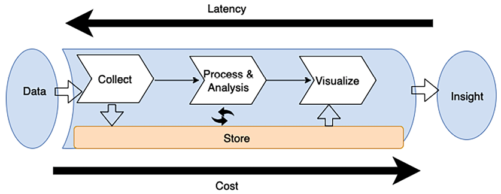
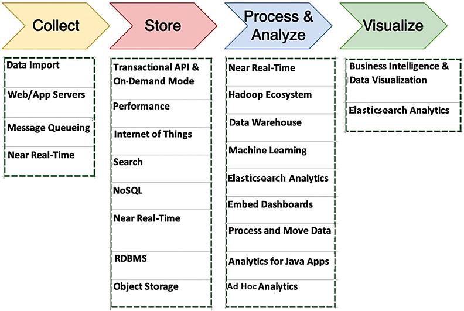
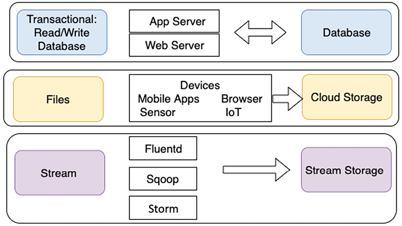
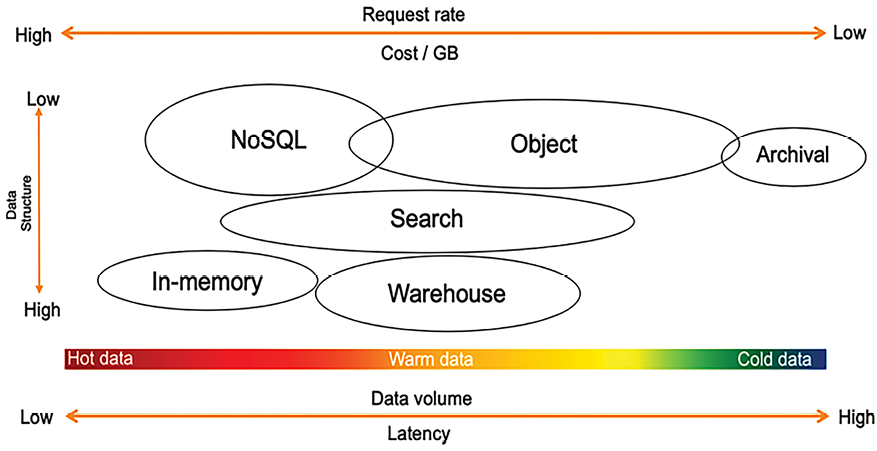
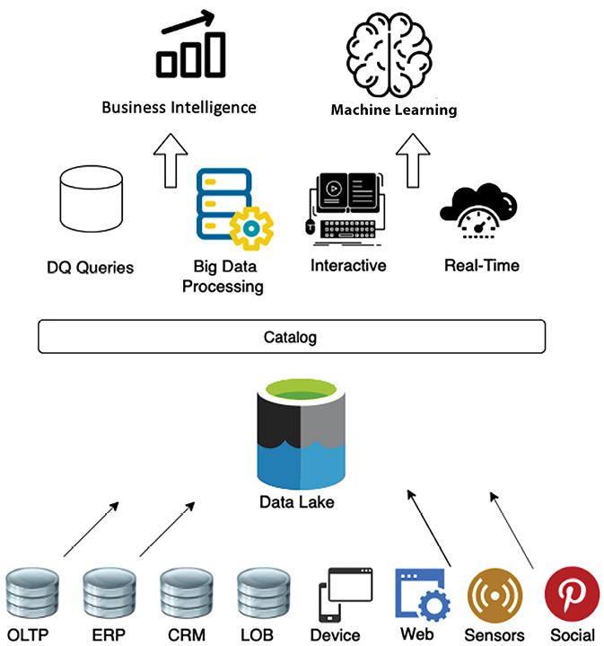
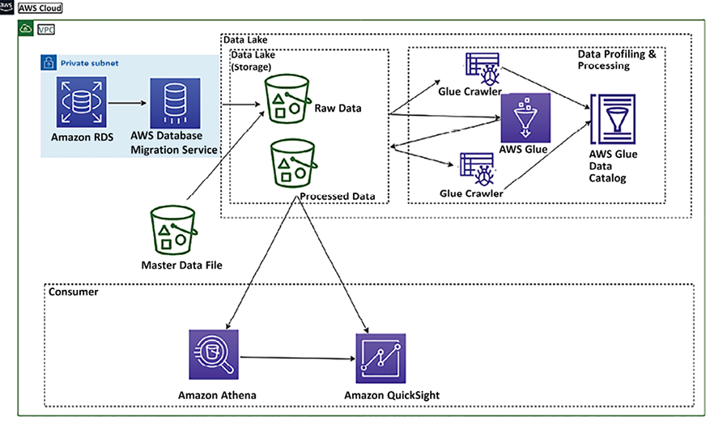
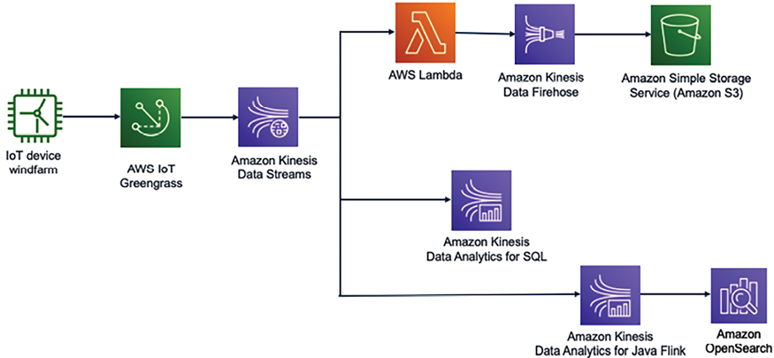

# مهندسی داده برای معماری راه حل

در فصل قبل، با فرآیند DevOps آشنا شدید، که خط لوله استقرار برنامه را خودکار می کند و فرهنگ همکاری را بین تیم های توسعه، عملیات و امنیت تقویت می کند. این فصل شما را با مهندسی داده آشنا می‌کند، از جمله ابزارها و تکنیک‌های مختلفی که برای جمع‌آوری داده‌ها از بخش‌های مختلف برنامه‌تان برای به دست آوردن بینشی که می‌تواند کسب‌وکارتان را هدایت کند، استفاده می‌شود.

داده ها در همه جا با سرعت و حجم بالا در عصر اینترنت و دیجیتال سازی تولید می شوند. دریافت بینش از این حجم عظیم داده با سرعتی بسیار چالش برانگیز است. ما باید به طور مداوم برای جذب، ذخیره و پردازش این داده ها برای به دست آوردن نتایج کسب و کار نوآوری کنیم.

با همگرایی فناوری های ابری، موبایلی و اجتماعی، پیشرفت ها در بسیاری از زمینه ها، مانند ژنومیک و علوم زیستی، به طور فزاینده ای در حال رشد هستند. ارزش فوق العاده ای در استخراج این داده ها برای بینش بیشتر یافت می شود. سیستم‌های پردازش جریانی مدرن باید نتایج مستمری را بر اساس داده‌ها با نرخ ورودی بالا در تأخیر کم تولید کنند.

مفهوم _big data_ به چیزی بیش از جمع آوری و تجزیه و تحلیل داده ها اشاره دارد. ارزش واقعی برای سازمان ها در داده های آنها می تواند برای به دست آوردن بینش و ایجاد مزیت های رقابتی استفاده شود. همه راه حل های کلان داده نباید به تجسم ختم شوند. بسیاری از راه‌حل‌ها، مانند ** یادگیری ماشینی** (**ML**) و سایر تجزیه و تحلیل‌های پیش‌بینی، این پاسخ‌ها را به‌صورت برنامه‌ریزی به نرم‌افزار یا برنامه‌های کاربردی دیگر وارد می‌کنند، اطلاعات را استخراج می‌کنند و مطابق طراحی پاسخ می‌دهند.

مانند بسیاری از موارد، دریافت نتایج سریعتر هزینه بیشتری دارد و کلان داده نیز از این قاعده مستثنی نیست. برخی از پاسخ‌ها ممکن است فوراً مورد نیاز نباشند، بنابراین تأخیر و توان عملیاتی راه‌حل می‌تواند به اندازه‌ای انعطاف‌پذیر باشد که ساعت‌ها طول بکشد تا تکمیل شود. پاسخ‌های دیگر، مانند تجزیه و تحلیل پیش‌بینی‌کننده، ممکن است به محض در دسترس بودن داده‌ها مورد نیاز باشد.

در این فصل، با موضوعات زیر برای رسیدگی و مدیریت نیازهای کلان داده خود آشنا خواهید شد:

- معماری کلان داده چیست؟
- طراحی خطوط لوله پردازش کلان داده
- بلع داده ها، ذخیره سازی، پردازش و تجزیه و تحلیل
- تجسم داده ها
- طراحی معماری داده های بزرگ
- بهترین شیوه های معماری داده های بزرگ

در پایان این فصل، نحوه طراحی معماری داده های بزرگ و تجزیه و تحلیل را خواهید آموخت. شما در مورد مراحل خط لوله داده های بزرگ، از جمله جذب داده، ذخیره سازی، پردازش، تجسم، و الگوهای معماری خواهید آموخت.

# معماری کلان داده چیست؟

حجم زیاد داده های جمع آوری شده می تواند مشکلاتی را ایجاد کند. با انباشت بیشتر و بیشتر داده ها، مدیریت و جابجایی داده ها همراه با زیرساخت کلان داده زیربنایی آن به طور فزاینده ای دشوار می شود. ظهور ارائه دهندگان ابری، امکان انتقال اپلیکیشن ها به فضای ابری را تسهیل کرده است. منابع متعدد داده منجر به افزایش حجم، سرعت و تنوع می شود. در زیر برخی از منابع داده رایج تولید شده توسط رایانه آورده شده است:

- **لاگ های سرور برنامه**: گزارش ها و بازی های برنامه
- ** سیاهههای مربوط به جریان کلیک **: از کلیک وب سایت و مرور
- **داده های حسگر**: آب و هوا، آب، انرژی باد و شبکه های هوشمند
- **تصاویر و فیلم**: دوربین های ترافیکی و امنیتی

داده های تولید شده توسط کامپیوتر می توانند از لاگ های نیمه ساختاریافته تا باینری های بدون ساختار متفاوت باشند. منابع داده های تولید شده توسط رایانه می توانند تطبیق الگو یا همبستگی در داده ها ایجاد کنند که توصیه هایی برای شبکه های اجتماعی و بازی های آنلاین ایجاد می کند. همچنین می‌توانید از داده‌های تولید شده توسط رایانه، مانند وبلاگ‌ها، نظرات، ایمیل‌ها، تصاویر و برداشت‌های برند برای پیگیری برنامه‌ها یا رفتار خدمات استفاده کنید.

داده‌های تولید شده توسط انسان شامل جستجوهای ایمیل، پرسش‌های زبان طبیعی، تجزیه و تحلیل احساسات در مورد محصولات یا شرکت‌ها و توصیه‌های محصول است. تجزیه و تحلیل نمودار اجتماعی می تواند توصیه های محصول را بر اساس حلقه دوستان شما، مشاغلی که ممکن است برایتان جالب باشد یا حتی یادآورهایی بر اساس حلقه تولد دوستان، سالگردها و غیره ارائه دهد.

موانع معمولی که از تیم های تحلیلی می شنوید و مانع از ارائه بیشترین ارزش به سازمانشان می شود عبارتند از:

- **بینش محدود نسبت به تجربیات و عملیات مشتری**: برای ایجاد تجربیات مشتری جدید، سازمان ها نیاز به دید بهتری در کسب و کار خود دارند. جمع‌آوری داده‌های پیچیده و پرهزینه، سیستم‌های پردازش و هزینه‌های مقیاس افزوده، سازمان‌ها را ملزم می‌کند که انواع و میزان داده‌هایی را که جمع‌آوری و تجزیه و تحلیل می‌کنند محدود کنند.
- **نیاز به تصمیم گیری سریعتر **: این یک مشکل دو قسمتی است:
   - سیستم‌های داده سنتی تحت فشار قرار می‌گیرند و در نتیجه زمان زیادی برای تکمیل حجم کاری به طول می‌انجامد.
   - تصمیمات بیشتری باید در چند ثانیه یا چند دقیقه گرفته شود و سیستم ها باید داده ها را در زمان واقعی جمع آوری و پردازش کنند.
- **فعال کردن نوآوری با ML**: سازمان ها در حال اضافه کردن و رشد تیم های علم داده خود هستند تا به بهینه سازی و رشد کسب و کار خود کمک کنند. این کاربران نیاز به دسترسی بیشتری به داده ها با ابزارهای انتخابی خود دارند، بدون تشریفات سنتی و فرآیندهایی که سرعت آنها را کاهش می دهد.
- **کارکنان فنی و هزینه به مقیاس زیرساخت های خود مدیریتی**: مشتریانی که زیرساخت ها را مدیریت می کنند

برای پاسخگویی به تقاضای کسب و کار، مجدد در محل نیاز به کمک دارد. مدیریت زیرساخت، در دسترس بودن بالا، مقیاس بندی و نظارت عملیاتی به زمان نیاز دارد، به ویژه در مقیاس.

در **معماری کلان داده**، جریان کلی یک خط لوله داده قابل توجه با داده شروع می شود و با بینش به پایان می رسد. نحوه رسیدن شما از ابتدا تا انتها به عوامل زیادی بستگی دارد. نمودار زیر یک خط لوله گردش کار داده را نشان می دهد که به شما در طراحی معماری داده کمک می کند:

شکل 12.1: خط لوله داده بزرگ برای طراحی معماری داده

همانطور که در نمودار قبل نشان داده شده است، گردش کار استاندارد خط لوله داده بزرگ شامل مراحل زیر است:

- داده ها توسط یک ابزار مناسب جمع آوری (بلع) می شوند.
- داده ها به طور مداوم ذخیره می شوند.
- داده ها پردازش یا تجزیه و تحلیل می شوند. راه حل پردازش/تحلیل داده، داده ها را از ذخیره سازی می گیرد، عملیات را انجام می دهد و سپس داده های پردازش شده را دوباره ذخیره می کند.
- سپس داده ها توسط دیگر ابزارهای پردازش/تحلیل یا دوباره توسط همان ابزار برای دریافت پاسخ های بیشتر از داده ها استفاده می شود. برای مفید ساختن پاسخ‌ها برای کاربران تجاری، آنها با استفاده از ابزار **هوش تجاری** (**BI**) تجسم می‌شوند یا برای پیش‌بینی‌های آینده به الگوریتم ML وارد می‌شوند. هنگامی که پاسخ های مناسب به کاربر ارائه شد، این به آنها بینشی در مورد داده هایی می دهد که می توانند برای تصمیم گیری های تجاری بیشتر استفاده کنند.

ابزارهایی که در خط لوله خود به کار می برید، _time to answer_ شما را تعیین می کند، که تأخیر بین زمانی که داده های شما ایجاد شده اند و زمانی که می توانید از آن بینش دریافت کنید، است. بهترین راه برای معمار کردن راه‌حل‌های داده در حالی که تأخیر را در نظر می‌گیریم، تعیین نحوه متعادل کردن توان عملیاتی با هزینه است، زیرا عملکرد بالاتر و کاهش تأخیر معمولاً منجر به قیمت بالاتر می‌شود. به عنوان مثال، یک پلت فرم معاملات مالی به تجزیه و تحلیل در زمان واقعی نیاز دارد تا بینش فوری برای تصمیم گیری سریع در اختیار کاربران خود قرار دهد.

برای رسیدن به این هدف، این پلتفرم ممکن است از یک خط لوله پردازش داده گران قیمت استفاده کند که شامل پایگاه‌های داده درون حافظه، پردازش جریان بی‌درنگ، و خدمات انتقال داده با سرعت بالا است. این راه‌اندازی تأخیر کم را تضمین می‌کند و به معامله‌گران اجازه می‌دهد تا به تغییرات بازار بلافاصله پاسخ دهند. در اینجا، ضرورت کسب و کار برای تجزیه و تحلیل بلادرنگ هزینه های بالای مرتبط با معماری کم تاخیر را توجیه می کند.

# طراحی خطوط لوله پردازش کلان داده

یکی از اشتباهات مهم بسیاری از معماری های کلان داده، مدیریت چندین مرحله خط لوله داده با یک ابزار است. ناوگانی از سرورهایی که خط لوله داده سرتاسر را مدیریت می‌کنند، از ذخیره‌سازی و تبدیل داده‌ها گرفته تا تجسم، ممکن است ساده‌ترین معماری باشند، اما همچنین آسیب‌پذیرترین آنها در برابر خرابی‌ها در خط لوله است. چنین معماری داده‌های بزرگ به‌هم‌پیوسته معمولاً بهترین توازن ممکن بین توان و هزینه را برای نیازهای شما فراهم نمی‌کند. هنگامی که در حال طراحی یک معماری داده هستید، از اصول داده FLAIR همانطور که در زیر توضیح داده شده است استفاده کنید:

- **F - قابلیت یافتن**: این به قابلیت مکان یابی آسان دارایی های داده در دسترس و دسترسی به ابرداده های آنها اشاره دارد که شامل اطلاعاتی مانند مالکیت و طبقه بندی داده ها، همراه با سایر ویژگی های حیاتی لازم برای حاکمیت و انطباق داده ها است.
- **L - Lineage**: توانایی ردیابی منشاء داده ها، ردیابی حرکت و تاریخچه آن، و درک و همچنین تجسم نحوه جریان داده ها از منابع آن به نقاط مصرف آن.
- **A - قابلیت دسترسی**: این شامل تسهیلات درخواست و دریافت اعتبارنامه های امنیتی است که حق دسترسی به یک دارایی داده خاص را اعطا می کند. همچنین مستلزم نیاز به یک زیرساخت شبکه ای است که از دسترسی کارآمد به داده ها پشتیبانی می کند.
- **I – قابلیت همکاری**: اطمینان از اینکه داده ها در قالب هایی ذخیره می شوند که برای اکثر، اگر نه همه، سیستم های پردازش داخلی در سازمان قابل دسترسی و استفاده باشد.\* **R – قابلیت استفاده مجدد**: داده ها باید با مستندسازی شوند. یک طرح واره شناخته شده، و منبع داده باید به وضوح نسبت داده شود. این جنبه اغلب شامل اصول **مدیریت داده های اصلی** (**MDM**) است که بر مدیریت داده های حیاتی از حوزه های مختلف تمرکز می کند تا با دقت و سازگاری، یک نقطه مرجع واحد ارائه دهد.

معماران کلان داده توصیه می کنند که خط لوله بین مصرف، ذخیره سازی، پردازش و دریافت بینش جدا شود. چندین مزیت برای جدا کردن ذخیره سازی و پردازش در مراحل مختلف وجود دارد، از جمله افزایش تحمل خطا. به عنوان مثال، اگر در دور دوم پردازش مشکلی پیش بیاید و سخت افزار اختصاص داده شده به آن کار از کار بیفتد، لازم نیست دوباره از ابتدای خط لوله شروع کنید. سیستم شما می تواند از مرحله ذخیره سازی دوم مجدداً راه اندازی شود. جدا کردن فضای ذخیره‌سازی خود از سطوح مختلف پردازش به شما امکان می‌دهد تا در چندین ذخیره‌گاه داده بخوانید و بنویسید.

نمودار زیر ابزارها و فرآیندهای مختلفی را نشان می دهد که هنگام طراحی خط لوله معماری کلان داده باید در نظر گرفته شوند:

شکل 12.2: ابزارها و فرآیندهای طراحی معماری کلان داده

مواردی که باید در نظر بگیرید

n تعیین ابزار مناسب برای معماری کلان داده شامل موارد زیر است:

- ساختار داده های شما
- حداکثر تأخیر قابل قبول
- حداقل توان عملیاتی قابل قبول
- الگوهای دسترسی معمولی کاربران نهایی سیستم شما

ساختار داده شما هم بر ابزارهایی که برای پردازش آن استفاده می کنید و هم بر مکانی که آن را ذخیره می کنید تأثیر می گذارد. ترتیب داده های شما و اندازه هر شیئی که ذخیره و بازیابی می کنید نیز ملاحظات ضروری هستند. اینکه راه حل شما چگونه تأخیر/بازده و هزینه را وزن می کند، زمان پاسخگویی را تعیین می کند.

الگوهای دسترسی کاربر جزء ضروری دیگری است که باید در نظر گرفته شود. برخی از مشاغل نیاز به پیوستن منظم به بسیاری از جداول مرتبط دارند، و برخی دیگر نیاز به ذخیره سازی روزانه یا کمتر مکرر داده دارند. برخی از مشاغل نیاز به مقایسه داده ها از طیف گسترده ای از منابع داده دارند و سایر مشاغل داده ها را تنها از یک جدول بدون ساختار استخراج می کنند. دانستن اینکه کاربران نهایی شما اغلب چگونه از داده ها استفاده می کنند، به شما کمک می کند تا وسعت و عمق معماری کلان داده خود را تعیین کنید. بیایید عمیقاً در هر فرآیند و ابزارهای درگیر در معماری کلان داده غوطه ور شویم.

# مصرف داده، ذخیره سازی، پردازش و تجزیه و تحلیل

برای تبدیل داده‌های خام به هوشمندی عملی که می‌تواند تصمیم‌گیری و برنامه‌ریزی استراتژیک را برای کسب‌وکارها اطلاع‌رسانی کند، داده‌ها باید از طریق چندین مرحله کلیدی مدیریت شوند، که با **مصرف داده** شروع می‌شود - مجموعه داده‌ها از منابع مختلف. این می‌تواند شامل همه چیز باشد، از داده‌های تولید شده توسط کاربر گرفته تا گزارش‌های ماشین، یا داده‌های جریان در زمان واقعی. پس از جمع‌آوری، داده‌ها باید در **ذخیره‌سازی داده** ذخیره شوند که بسته به نوع داده و استفاده مورد نظر می‌تواند در پایگاه‌های داده، دریاچه‌های داده یا راه‌حل‌های ذخیره‌سازی ابری انجام شود.

پس از ذخیره سازی، **پردازش و تجزیه و تحلیل داده** وارد عمل می شود، که شامل مرتب سازی، تجمیع یا تبدیل داده ها به شکل قابل استفاده تر است، جایی که تجزیه و تحلیل می تواند بر روی داده های پردازش شده برای استخراج بینش معنی دار انجام شود. تجزیه و تحلیل می تواند از پرس و جوها و گزارش های ساده گرفته تا الگوریتم های پیچیده ML و مدل سازی پیش بینی شده باشد. بیایید با جزئیات در مورد این مراحل بیاموزیم.

## جذب داده

جذب داده عمل جمع آوری داده ها برای انتقال و ذخیره سازی است. مکان های زیادی وجود دارد که از آنجا می توان داده ها را سوار کرد. غالباً داده‌ها در یکی از دسته‌های پایگاه‌های داده، جریان‌ها، گزارش‌ها و فایل‌ها قرار می‌گیرد. در این میان پایگاه های داده محبوب ترین هستند. اینها معمولاً شامل سیستم‌های اصلی تراکنش بالادستی شما هستند که ذخیره‌سازی داده‌های اولیه برای برنامه‌های کاربردی شما هستند. آنها هم طعم رابطه ای و هم غیر رابطه ای دارند و چندین تکنیک برای استخراج داده ها از آنها وجود دارد.

جریان‌ها توالی‌های باز از داده‌های سری زمانی هستند، مانند داده‌های جریان کلیک از وب‌سایت‌ها یا دستگاه‌های **اینترنت اشیا** (**IoT**) که معمولاً در یک API ما منتشر می‌شوند. برنامه‌ها، سرویس‌ها و سیستم‌های عامل گزارش‌ها را تولید می‌کنند. همانطور که در نمودار زیر نشان داده شده است، از نوع داده‌هایی که محیط شما جمع‌آوری می‌کند و نحوه جمع‌آوری آن‌ها استفاده کنید تا مشخص کنید چه نوع محلول مصرفی برای نیازهای شما ایده‌آل است:

شکل 12.3: نوع جذب داده

همانطور که نشان داده شده است، ذخیره سازی داده های تراکنش باید بتواند داده ها را به سرعت ذخیره و بازیابی کند. کاربران نهایی به دسترسی سریع و ساده به داده ها نیاز دارند و برنامه ها و وب سرورها را به روش های جذب ایده آل تبدیل می کنند. به همین دلایل، پایگاه داده های NoSQL و **سیستم مدیریت پایگاه داده رابطه ای** (**RDBMS**) معمولا بهترین راه حل ها برای این نوع فرآیندها هستند.

داده‌هایی که از طریق فایل‌های جداگانه منتقل می‌شوند معمولاً از دستگاه‌های متصل دریافت می‌شوند. حجم زیادی از داده های فایل در مقایسه با داده های تراکنشی نیازی به ذخیره سازی و بازیابی سریع ندارند. برای داده‌های فایل، اغلب انتقال یک راه است، جایی که داده‌ها توسط منابع متعدد تولید می‌شوند و برای استفاده بعدی در یک شی یا ذخیره‌سازی فایل وارد می‌شوند.

داده‌های جریانی مانند گزارش‌های جریان کلیک باید از طریق راه‌حل مناسبی مانند **Apache Kafka** یا **Fluentd** وارد شوند. آپاچی کافکا یک انتخاب محبوب برای این منظور است که قابلیت‌های قوی انتشار-اشتراک را ارائه می‌دهد که می‌تواند حجم عظیمی از داده‌ها را به طور موثر مدیریت کند. Fluentd ابزار دیگری است که می تواند برای جذب داده ها مورد استفاده قرار گیرد، به ویژه به دلیل قابلیت های log aggregation معروف است.

در ابتدا، این گزارش‌ها در راه‌حل‌های ذخیره‌سازی جریانی مانند کافکا ذخیره می‌شوند، بنابراین برای پردازش و تحلیل بلادرنگ در دسترس هستند. ذخیره سازی طولانی مدت این سیاههها در راه حل های کم هزینه مانند ذخیره سازی اشیا بهترین است.

ذخیره سازی جریانی سیستم جمع آوری شما (تولیدکنندگان) را از سیستم پردازش (مصرف کنندگان) جدا می کند. این یک بافر دائمی برای داده های ورودی شما فراهم می کند. داده ها قابل پردازش هستند، و شما می توانید داده ها را با نرخی بسته به نیاز خود پمپاژ کنید. بیایید در مورد برخی از فناوری‌های محبوب انتقال داده بیاموزیم.

### انتخاب های فناوری برای جذب داده ها

بیایید به چند ابزار منبع باز محبوب برای جذب و انتقال داده نگاه کنیم:

- **Apache DistCp**: DistCp مخفف _distributed copy_ است و بخشی از اکوسیستم Hadoop است. ابزار DistCp برای کپی داده های بزرگ در یک خوشه یا بین خوشه ها استفاده می شود. DistCp به e

کپی کارآمد و سریع داده ها با استفاده از قابلیت توزیع پردازش موازی MapReduce. دایرکتوری ها و فایل ها را در وظایف نقشه توزیع می کند تا پارتیشن های فایل را از منبع به مقصد کپی کند. DistCp همچنین مدیریت خطا، بازیابی و گزارش دهی را در میان خوشه ها انجام می دهد.
- **Apache Sqoop**: Sqoop نیز بخشی از پروژه اکوسیستم Hadoop است و به انتقال داده ها بین Hadoop و فروشگاه های داده رابطه ای مانند RDBMS کمک می کند. Sqoop به شما امکان می‌دهد داده‌ها را از یک ذخیره‌سازی داده‌های ساخت‌یافته به **Hadoop Distributed File System** (**HDFS**) وارد کنید و داده‌ها را از HDFS به یک ذخیره‌سازی داده‌های ساخت‌یافته صادر کنید. Sqoop از اتصال دهنده های پلاگین برای اتصال به پایگاه های داده رابطه ای استفاده می کند. می‌توانید از API افزونه Sqoop برای ساختن یک رابط جدید استفاده کنید یا از یکی از کانکتورهای ارائه شده استفاده کنید که از تبادل داده بین Hadoop و سیستم‌های پایگاه داده رابطه‌ای استاندارد پشتیبانی می‌کند.
- **Apache Flume**: Flume نرم افزار منبع باز است که عمدتاً برای جذب حجم زیادی از داده های گزارش استفاده می شود. Apache Flume داده ها را به طور قابل اعتماد در Hadoop جمع آوری و جمع می کند و آن را توزیع می کند. Flume انتقال داده های جریانی را تسهیل می کند و امکان تجزیه و تحلیل را فراهم می کند.

پروژه‌های منبع باز بیشتری، مانند Apache Storm و Apache Samza، برای استریم برای پردازش قابل اعتماد جریان‌های داده نامحدود در دسترس هستند.

### مصرف داده ها به ابر

جذب داده ها در فضای ابری برای مدیریت و استفاده از داده های بزرگ بسیار مهم است. سه ارائه‌دهنده ابر بزرگ - AWS، **Google Cloud Platform** (**GCP**)، و Azure- خدمات مختلف جذب داده را ارائه می‌دهند. هر کدام دارای ویژگی ها و قابلیت های منحصر به فردی هستند که متناسب با نیازها و حجم داده های مختلف است. بیایید به برخی از ویژگی های منحصر به فرد این سه ارائه دهنده ابر نگاه کنیم:

- خدمات جذب داده AWS:

   - **AWS Direct Connect **: این اتصال شبکه خصوصی و پرسرعت را به AWS ارائه می دهد که تأخیر را کاهش می دهد و پهنای باند را افزایش می دهد. این برای انتقال حجم زیادی از داده ایده آل است و سرعت شبکه ثابت تری را نسبت به انتقال های مبتنی بر اینترنت ارائه می دهد.
   - **AWS Snowball and Snowmobile**: این سرویس ها دستگاه های فیزیکی را برای انتقال حجم وسیعی از داده ها (در ترابایت و **پتابایت** (**PBs**)) به AWS ارائه می دهند. Snowball برای صدها ترابایت مناسب است، در حالی که Snowmobile می تواند تا 100 PB را در یک انتقال واحد مدیریت کند، که برای مجموعه داده های عظیم ایده آل است.\* ** AWS Database Migration Service (DMS)**: این کار انتقال پایگاه های داده به AWS را تسهیل می کند. از مهاجرت های همگن و ناهمگن پشتیبانی می کند و می تواند از طریق **تغییر گرفتن داده ها** (**CDC**) تکثیر داده ها را انجام دهد.

- خدمات دریافت داده های GCP:

   - **Google Cloud Storage Transfer Service**: این امکان را برای انتقال حجم زیادی از داده ها به Google Cloud Storage از منابع داده آنلاین مانند مکان های Amazon S3 و HTTP/HTTPS، و همچنین از ذخیره سازی داده در محل فراهم می کند.\* **Pub/Sub**: این پیام رسانی در زمان واقعی و انتقال داده های جریانی را ارائه می دهد. این یک سرویس مقیاس‌پذیر و انعطاف‌پذیر است که امکان جذب داده‌های جریانی مانند گزارش‌ها و داده‌های رویداد را برای تجزیه و تحلیل بلادرنگ فراهم می‌کند.
   - **جریان داده**: یک سرویس یکپارچه برای دریافت و پردازش داده ها. این برای وظایف ** استخراج، تبدیل و بارگیری ** (**ETL**) و پردازش جریان رویداد در زمان واقعی مفید است.

- خدمات جذب داده های Azure:

   - **Azure Data Factory**: این سرویس یکپارچه سازی داده ها از جابجایی ها و تبدیل های داده در محل و ابر پشتیبانی می کند. این امکان دریافت داده ها از منابع مختلف را فراهم می کند، آنها را با استفاده از خدمات محاسباتی مانند Azure HDInsight و Azure Batch پردازش می کند و متعاقباً داده های پردازش شده را در راه حل های ذخیره سازی مانند Azure SQL Data Warehouse منتشر می کند.
   - **Azure Event Hubs**: یک پلتفرم جریان داده قوی و مقیاس پذیر و سرویس انتقال رویداد، Azure Event Hubs قادر است میلیون ها رویداد را در ثانیه مدیریت کند. این آن را به یک راه حل ایده آل برای تجزیه و تحلیل بلادرنگ بر روی داده هایی که از منابع مختلف مانند برنامه ها، وب سایت ها یا دستگاه های IoT سرچشمه می گیرد، تبدیل می کند.
   - **خدمات واردات و صادرات Azure**: این سرویس برای انتقال انبوه حجم داده های بزرگ به و از Azure Blob Storage و Azure Files طراحی شده است. از دیسک‌های فیزیکی برای انتقال داده استفاده می‌کند و آن را به گزینه‌ای مناسب برای موقعیت‌هایی تبدیل می‌کند که ممکن است انتقال مقادیر زیادی داده از طریق شبکه بسیار کند یا گران باشد.

هر ارائه‌دهنده ابر مجموعه‌ای منحصر به فرد از ابزارها را برای برآوردن نیازهای دریافت داده‌های مختلف، از جریان بی‌درنگ تا انتقال داده‌ها در مقیاس بزرگ، تضمین انعطاف‌پذیری و مقیاس‌پذیری در مدیریت کلان داده، ارائه می‌کند.

جریان داده نیز برای دریافت و تجزیه و تحلیل بسیار مهم است. در بخش _Storeaming data stores_ درباره جریان داده ها بیشتر خواهید آموخت. بیایید در مورد تکنیک هایی که می توانید برای انتخاب فضای ذخیره سازی مناسب و گزینه های ذخیره سازی موجود استفاده کنید، بیشتر بیاموزیم.

## ذخیره سازی داده ها

یکی از رایج‌ترین اشتباهات هنگام راه‌اندازی فضای ذخیره‌سازی برای یک محیط کلان داده، استفاده از یک راه‌حل، اغلب یک RDBMS، برای رسیدگی به تمام نیازهای ذخیره‌سازی داده شما است.

شما ابزارهای زیادی در دسترس خواهید داشت، اما آنها باید برای کاری که باید انجام دهند بهینه شوند. یک راه حل لزوما برای همه شما بهترین نیست

نیاز دارد؛ بهترین راه حل برای محیط شما ممکن است ترکیبی از راه حل های ذخیره سازی باشد که تأخیر را با هزینه متعادل می کند. یک راه حل ذخیره سازی ایده آل از ابزار مناسب برای کار مناسب استفاده می کند. نمودار زیر چندین عامل مرتبط با داده های شما و انتخاب ذخیره سازی مرتبط با آن را ترکیب می کند:

شکل 12.4: درک ذخیره سازی داده ها

همانطور که در نمودار بعدی نشان داده شده است، انتخاب یک فروشگاه داده به عوامل زیر بستگی دارد:

- **داده های شما چقدر ساختار یافته است؟** آیا مانند وبلاگ های آپاچی (لاگ ها معمولا ساختار ضعیفی دارند و برای پایگاه های داده رابطه ای مناسب نیستند)، پروتکل های داده استاندارد و رابط های قراردادی، به یک طرح واره خاص و به خوبی شکل گرفته است؟ آیا داده‌های باینری کاملاً دلخواه مانند تصاویر، صدا، ویدیو و اسناد PDF است؟ یا اینکه مانند JSON یا CSV دارای ساختاری نیمه ساختاریافته است اما به طور بالقوه تنوع بالایی در بین رکوردها دارد؟\* **داده های جدید با چه سرعتی باید برای پرس و جو در دسترس باشند؟** آیا این یک سناریوی زمان واقعی است که در آن تصمیم‌گیری‌ها با ورود سوابق جدید اتخاذ می‌شوند، مانند تنظیم مدیران کمپین بر اساس نرخ تبدیل یا ارائه توصیه‌های محصول بر اساس شباهت رفتار کاربر توسط وب‌سایت؟ آیا این یک سناریوی دسته ای روزانه، هفتگی یا ماهانه است، مانند آموزش مدل، تهیه صورت های مالی، یا گزارش عملکرد محصول؟ یا جایی در این بین است، مانند ایمیل‌های تعامل کاربر، که نیازی به عمل بی‌درنگ ندارد و می‌توانید چند دقیقه یا حتی چند ساعت بین اقدام کاربر و نقطه لمسی بافری داشته باشید؟
- **اندازه دریافت داده چقدر است؟** آیا داده های دریافت شده توسط رکورد با ورود داده ها ثبت می شود، مانند بارهای JSON از API های REST که در بهترین حالت حداقل چند کیلوبایت را اندازه می گیرند؟ آیا این دسته بزرگی از سوابق است که به طور همزمان وارد می شوند، مانند ادغام سیستم و فیدهای داده شخص ثالث؟ یا جایی در این بین است، مثلاً با چند ریز دسته از داده های جریان کلیک که برای پردازش کارآمدتر با هم جمع می شوند؟
- **حجم کل داده ها و نرخ رشد آن چقدر است؟** آیا شما بر حسب GB و TB هستید یا قصد دارید داده ها را در PB یا **اگزابایت** (**EBs**) ذخیره کنید؟ چه مقدار از این داده ها برای موارد استفاده از تجزیه و تحلیل خاص شما مورد نیاز است؟ آیا اکثر پرسش‌های شما فقط به یک بازه زمانی خاص نیاز دارند؟ یا آیا به مکانیزمی برای پرس و جو از کل مجموعه داده تاریخی خود نیاز دارید؟
- **هزینه ذخیره سازی و جستجوی داده ها در هر مکان خاص چقدر خواهد بود**؟ وقتی صحبت از هر محیط محاسباتی به میان می‌آید، ما معمولاً یک مثلث محدودیت‌ها بین عملکرد، انعطاف‌پذیری و هزینه کم می‌بینیم. هرچه عملکرد بهتر و انعطاف پذیری بالاتری که می خواهید فضای ذخیره سازی شما داشته باشد، گران تر خواهد بود. شما می توانید پرس و جوهای سریع روی PB های داده داشته باشید، اما برای برآورده کردن نیازهای هزینه خود، به جستجوی TB داده ها در قالب فشرده بپردازید.

در نهایت، چه نوع کوئری های تحلیلی در برابر داده ها اجرا می شود؟ آیا یک داشبورد را با مجموعه ای از معیارهای ثابت نیرو می دهد و به آن کمک می کند؟ آیا در انبوه‌های عددی بزرگ که توسط ابعاد مختلف تجاری جمع‌آوری شده‌اند، شرکت خواهد کرد؟ یا برای تشخیص، استفاده از رمزگذاری رشته برای جستجوی متن کامل و تجزیه و تحلیل الگو استفاده خواهد شد؟

هنگامی که ویژگی های داده های خود را تعیین می کنید و ساختار داده را درک می کنید، می توانید ارزیابی کنید که از کدام راه حل برای ذخیره سازی داده های خود استفاده کنید. بیایید در مورد راه حل های مختلف برای ذخیره داده ها بیاموزیم.

### انتخاب های فناوری برای ذخیره سازی داده ها

همانطور که بحث کردیم، یک ابزار تنها می تواند چند کار را انجام دهد. بهترین کار این است که از ابزار مناسب برای کار مناسب استفاده کنید، و دریاچه داده شما را قادر می سازد تا یک معماری کلان داده با قابلیت پیکربندی بسیار بالا برای رفع نیازهای خاص خود بسازید. مشکلات کسب و کار باید محدودتر، عمیق تر و پیچیده تر باشند تا یک ابزار بتواند همه چیز را حل کند، به ویژه داده های بزرگ و تجزیه و تحلیل.

به عنوان مثال، داده های داغ باید در حافظه ذخیره و پردازش شوند، بنابراین کش ها یا پایگاه های داده در حافظه مانند Redis یا SAP HANA مناسب هستند. AWS سرویس ElastiCache را ارائه می‌کند که یک محیط Redis یا memcached مدیریت شده را ارائه می‌کند. پایگاه داده های NoSQL زمانی ایده آل هستند که با رکوردهای با سرعت بالا اما با اندازه کوچک مواجه می شوند، به عنوان مثال، اطلاعات جلسه کاربر یا داده های اینترنت اشیا. پایگاه های داده NoSQL همچنین برای مدیریت محتوا برای ذخیره کاتالوگ داده ها مفید هستند. بیایید در مورد محبوب ترین و متداول ترین ذخیره سازی برای داده های ساخت یافته بیاموزیم.

### ذخیره سازی داده های ساخت یافته

فروشگاه های داده های ساختاریافته ده ها سال است که وجود داشته و آشناترین گزینه فناوری برای ذخیره داده ها هستند. اکثر پایگاه‌های داده تراکنشی مانند Oracle، MySQL، SQL Server و PostgreSQL مبتنی بر ردیف هستند، زیرا با نوشتن داده‌های مکرر از برنامه‌های نرم‌افزاری سروکار دارند. سازمان‌ها اغلب پایگاه‌های اطلاعاتی تراکنشی را برای مقاصد گزارش‌دهی تغییر کاربری می‌دهند، که نیاز به خواندن مکرر داده‌ها اما نوشتن داده‌های بسیار کمتری دارند. با نگاهی به الزامات خواندن داده بالا، نوآوری بیشتری در پرس و جو در فروشگاه های داده ساختاریافته، مانند فرمت فایل ستونی، که به بهبود عملکرد خواندن داده برای الزامات تجزیه و تحلیل کمک می کند، وارد می شود.

فرمت های مبتنی بر ردیف داده ها را در ردیف های یک فایل ذخیره می کنند. نوشتن مبتنی بر ردیف سریع‌ترین راه برای نوشتن داده‌ها بر روی دیسک است، اما لزوماً سریع‌ترین گزینه خواندنی نیست زیرا باید از بسیاری از داده‌های نامربوط رد شوید. فرمت های مبتنی بر ستون تمام مقادیر ستون را با هم در فایل ذخیره می کنند. این منجر به فشرده سازی بهتر می شود زیرا انواع داده های مشابه گروه بندی می شوند. همچنین معمولاً عملکرد خواندن بهتری را ارائه می دهد زیرا می توانید ستون هایی را که مورد نیاز نیستند رد کنید.

بیایید به انتخاب های رایج برای ذخیره سازی داده های ساخت یافته نگاه کنیم. به عنوان مثال، شما باید تعداد کل فروش در یک ماه معین را از جدول سفارش که پنجاه ستون دارد، استعلام کنید. پرس و جو کل جدول را با تمام پنجاه ستون در یک معماری مبتنی بر ردیف اسکن می کند. در معماری ستونی، پرس و جو ستون فروش سفارش را اسکن می کند، بنابراین عملکرد پرس و جو داده ها را بهبود می بخشد. بیایید به جزئیات بیشتر در مورد پایگاه داده های رابطه ای، تمرکز بر داده های تراکنش و انبار داده برای رسیدگی به نیازهای تجزیه و تحلیل داده ها نگاه کنیم.

#### پایگاه داده های رابطه ای

یک RDBMS برای برنامه های ** پردازش تراکنش آنلاین ** (**OLTP**) مناسب تر است. برخی از پایگاه داده های رابطه ای محبوب عبارتند از Oracle، MSSQL، MariaDB، PostgreSQL و غیره. برخی از این پایگاه های داده سنتی دهه هاست که وجود دارند. بسیاری از برنامه ها، از جمله تجارت الکترونیک، بانکداری و رزرو هتل، توسط پایگاه داده های رابطه ای پشتیبانی می شوند. پایگاه‌های داده رابطه‌ای در مدیریت داده‌های تراکنش بسیار خوب هستند که در آن پرس‌وجوهای مشترک پیچیده بین جداول مورد نیاز است. با نگاهی به نیازهای داده تراکنش، پایگاه داده رابطه ای باید از اصول **اتمی، سازگاری، جداسازی و دوام ** (**ACID**) به شرح زیر پیروی کند:

- **Atomicity**: اتمی به این معنی است که تراکنش به طور کامل از انتها به انتها اجرا می شود و در صورت بروز هر گونه خطا، کل تراکنش به عقب برمی گردد.
- **ثبات **: سازگاری به این معنی است که تمام داده ها باید در هنگام تکمیل تراکنش ها به پایگاه داده متعهد شوند.
- **Isolation**: ایزوله سازی به چندین تراکنش نیاز دارد تا به طور همزمان به صورت مجزا و بدون تداخل با یکدیگر اجرا شوند.
- **دوام**: در صورت بروز هرگونه وقفه مانند قطعی شبکه یا برق، تراکنش باید بتواند به آخرین وضعیت شناخته شده از سر گرفته شود.

داده‌های پایگاه‌های داده رابطه‌ای اغلب به راه‌حل‌های انبار داده برای اهداف گزارش‌دهی و تجمیع بارگذاری می‌شوند. بیایید درباره انبار داده بیشتر بدانیم.

#### انبار داده

انبارهای داده، مخازن مرکزی هستند که انباشته‌ای از داده‌ها را از یک یا چند منبع ذخیره می‌کنند. آنها داده های فعلی و تاریخی را برای کمک به ایجاد گزارش های تحلیلی برای تجزیه و تحلیل داده های تجاری ذخیره می کنند. با این حال، انبارهای داده، داده ها را از سیستم های مختلف به صورت متمرکز ذخیره می کنند، اما نمی توان آنها را به عنوان دریاچه های داده در نظر گرفت. انبارهای داده فقط داده‌های رابطه‌ای ساخت‌یافته را مدیریت می‌کنند، در حالی که دریاچه‌های داده با داده‌های ساختاریافته و بدون ساختار، مانند گزارش‌های JSON و داده‌های CSV کار می‌کنند.

پایگاه داده های انبار داده برای برنامه های **پردازش تحلیلی آنلاین ** (**OLAP**) مناسب تر هستند. این پایگاه‌های اطلاعاتی برای عملیاتی بهینه‌سازی شده‌اند که شامل خواندن مقادیر زیادی از داده‌ها می‌شود و امکان جمع‌آوری و خلاصه‌سازی داده‌ها را برای استخراج بینش‌های ارزشمند تجاری فراهم می‌کند.

به عنوان مثال، یک سناریوی بانکی را در نظر بگیرید که در آن یک بانک یک انبار داده نگهداری می کند که اطلاعات جامعی درباره حساب های مشتری، تراکنش ها، جزئیات وام و اطلاعات شعب ذخیره می کند. علاوه بر این، بانک اطلاعات مربوط به تعاملات مشتری، استفاده از خدمات و فعالیت های بانکداری آنلاین را در یک سیستم مرتبط جمع آوری و ذخیره می کند.

از طریق OLAP، بانک می تواند تجزیه و تحلیل پیچیده این داده های ترکیبی را انجام دهد. می‌تواند برای کشف روندها از انبار داده جستجو کند، مانند شناسایی محبوب‌ترین انواع حساب‌ها یا وام‌ها، تجزیه و تحلیل حجم تراکنش‌ها در طول زمان، یا ارزیابی الگوهای استفاده از خدمات بانکی آنلاین در مقابل خدمات بانکی درون شعبه. این قابلیت تحلیلی بانک را قادر می سازد تا تصمیمات آگاهانه ای را در مورد ارائه محصول، بهبود خدمات مشتری و استراتژی های عملیاتی اتخاذ کند و در نهایت رضایت مشتری را افزایش داده و رشد کسب و کار را هدایت کند.

انبارهای داده قابلیت تجمیع سریع در حجم وسیعی از داده های ساخت یافته را فراهم می کنند. در حالی که این فناوری‌ها، مانند Amazon **Redshift**، **Netezza** و **Teradata**، برای اجرای سریع پرس و جوهای جمعی پیچیده طراحی شده‌اند، باید برای حجم بالای نوشتن همزمان بهینه شوند. بنابراین، داده‌ها باید به صورت دسته‌ای بارگیری شوند و از ارائه اطلاعات بینش در زمان واقعی بر روی داده‌های داغ توسط انبارها جلوگیری شود.

انبارهای داده مدرن از یک پایه ستونی برای بهبود عملکرد پرس و جو استفاده می کنند. نمونه هایی از این موارد عبارتند از Amazon Redshift، Snowflake و Google BigQuery. این انبارهای داده به دلیل ذخیره سازی ستونی و بهبود بازده ورودی/خروجی، عملکرد سریع پرس و جو را ارائه می دهند. علاوه بر این، سیستم‌های انبار داده مانند Amazon Redshift با موازی‌سازی پرس‌و‌جوها در چندین گره و بهره‌گیری از **پردازش موازی انبوه** (**MPP**) عملکرد پرس و جو را افزایش می‌دهند.

فضای ذخیره‌سازی ستونی با ذخیره داده‌ها در ستون‌ها به جای ردیف، عملکرد پرس و جو را افزایش می‌دهد و داده‌های بهبود یافته را امکان‌پذیر می‌کند.

فشرده سازی، خواندن انتخابی داده ها و عملیات سریعتر. این رویکرد امکان فشرده‌سازی مؤثرتر را فراهم می‌کند زیرا داده‌های مشابه به‌طور متوالی ذخیره می‌شوند و بازیابی سریع‌تر داده‌ها را تسهیل می‌کند، زیرا تنها ستون‌های ضروری در طول پرس‌وجوها قابل دسترسی هستند. همچنین با بارگذاری داده های مربوطه در حافظه، استفاده از حافظه پنهان CPU را بهینه می کند و سرعت پردازش را افزایش می دهد. علاوه بر این، ذخیره‌سازی ستونی از پردازش موازی عظیم پشتیبانی می‌کند، جایی که چندین پردازنده می‌توانند به طور همزمان بر روی بخش‌های مختلف داده کار کنند و عملکرد را برای کارهای تحلیلی که شامل مجموعه داده‌های بزرگ هستند و نیاز به تجمیع و فیلتر کردن سریع دارند، به طور قابل توجهی افزایش می‌دهند.

راه‌حل‌های انبار داده مانند Amazon Redshift می‌توانند PB داده‌ها را پردازش کرده و قابلیت‌های محاسباتی و ذخیره‌سازی جداشده را برای صرفه‌جویی در هزینه‌ها فراهم کنند. علاوه بر ذخیره‌سازی ستونی، Redshift از کدگذاری داده‌ها، توزیع و نقشه‌های ناحیه برای افزایش عملکرد پرس و جو استفاده می‌کند. راه حل های سنتی انبار داده مبتنی بر ردیف شامل Netezza، Teradata و Greenplum هستند.

انبارهای داده منجر به جداسازی فیزیکی داده ها از برنامه های مختلف می شود و معماران داده را ملزم به ایجاد زیرساخت های جدید در اطراف این انبارها می کند. محدودیت‌های انبارهای داده سنتی با تنوع رو به رشد داده‌های سازمانی، از جمله متن، داده‌های اینترنت اشیا، تصاویر، صدا و ویدئو، آشکارتر شده‌اند. علاوه بر این، ظهور ML و **هوش مصنوعی** (**AI**) الگوریتم‌های تکراری را به وجود آورده است که نیاز به دسترسی مستقیم به داده‌ها دارند و به SQL متکی نیستند، بنابراین محدودیت‌های مدل‌های انبار داده مرسوم را برجسته می‌کند. در ادامه این فصل، در بخش _طراحی معماری های داده های بزرگ_ درباره غلبه بر این چالش ها بیشتر خواهید آموخت.

### پایگاه های داده NoSQL

پایگاه داده های NoSQL مانند DynamoDB، Cassandra و MongoDB چالش های مقیاس بندی و عملکردی را که اغلب با یک پایگاه داده رابطه ای تجربه می کنید، برطرف می کنند. همانطور که از نام آن پیداست، NoSQL یک پایگاه داده غیر رابطه ای است. پایگاه‌های داده NoSQL داده‌ها را بدون مکانیزم مشخص و ساختاریافته برای پیوند دادن داده‌ها از جداول مختلف (بدون اتصال، کلید خارجی یا عادی‌سازی اعمال شده) ذخیره می‌کنند.

NoSQL از چندین مدل داده از جمله ستونی، کلید-مقدار، جستجو، سند و نمودار استفاده می کند. پایگاه های داده NoSQL عملکرد مقیاس پذیر، در دسترس بودن بالا و انعطاف پذیری را ارائه می دهند. NoSQL به طور معمول یک طرحواره سختگیرانه را اعمال نمی کند و هر آیتم می تواند تعداد دلخواه ستون (ویژگی) داشته باشد، به این معنی که یک ردیف می تواند چهار ستون داشته باشد. در مقابل، دیگری می تواند ده ستون در همان جدول داشته باشد. کلید پارتیشن برای بازیابی مقادیر یا اسناد حاوی ویژگی های مرتبط استفاده می شود. پایگاه های داده NoSQL بسیار توزیع شده و قابل تکرار هستند. آنها بادوام هستند و در صورت در دسترس بودن با مشکلات عملکردی مواجه نمی شوند.

#### SQL در مقابل پایگاه داده NoSQL

پایگاه داده های SQL برای چندین دهه وجود داشته اند و اکثر آنها قبلاً با پایگاه داده های رابطه ای آشنا هستند. بیایید در مورد برخی از تفاوت های مهم بین پایگاه های داده SQL و NoSQL بیاموزیم:

| **خواص** | **پایگاه های داده SQL** | **پایگاه های اطلاعاتی NoSQL** |
| --------------- | ------------------------------------------------ ------------------------------------------------ ------------------------------------------------ ------------------------------------------------ ------------------------------------------------ ----------------------------- | ------------------------------------------------ ------------------------------------------------ ------------------------------------------------ ------------------------------------------------ ------------------------------------------------ ------------------------------------------------ ------------------------------------------------ ------------ |
| **مدل داده** | مدل رابطه ای داده ها را در پایگاه های داده SQL به جداول حاوی سطر و ستون نرمال می کند. یک طرحواره شامل جداول، ستون ها، روابط بین جداول، شاخص ها و سایر عناصر پایگاه داده است.                                                                                    | پایگاه‌های داده NoSQL بدون اجرای طرحی ثابت عمل می‌کنند و انعطاف‌پذیری در ذخیره‌سازی و بازیابی داده‌ها ارائه می‌دهند. آنها اغلب از یک کلید پارتیشن برای دسترسی به مقادیر مجموعه‌ای از ستون‌ها استفاده می‌کنند. این نوع پایگاه داده برای ذخیره سازی داده های نیمه ساختاریافته، از جمله فرمت هایی مانند JSON، XML و انواع مختلف اسناد دیگر، مانند کاتالوگ داده ها و فهرست های فایل، مناسب است. |
| **معامله** | RDBMS های سنتی مبتنی بر SQL پشتیبانی و تکمیل می کنند

y با ویژگی های داده تراکنشی ACID.                                                                                                                                                                                                 | پایگاه داده های NoSQL گاهی اوقات برخی از ویژگی های ACID را که مشخصه RDBMS های سنتی هستند، به منظور تسهیل مقیاس بندی افقی و افزایش انعطاف پذیری در مدل های داده خود، مبادله می کنند.                                                                                                                                                                            |
| **عملکرد** | RDBMS های مبتنی بر SQL برای بهینه سازی ذخیره سازی زمانی که ذخیره سازی گران بود و به حداقل رساندن ردپای دیسک استفاده می شد. برای RDBMS های سنتی، عملکرد بیشتر به دیسک متکی است. ایجاد نمایه و اصلاح ساختار جدول برای دستیابی به بهینه سازی پرس و جوی عملکرد مورد نیاز است. | در سیستم های NoSQL، عملکرد به طور قابل توجهی تحت تأثیر عواملی مانند اندازه خوشه سخت افزاری زیربنایی، تأخیر شبکه و نحوه تعامل برنامه با پایگاه داده قرار می گیرد.                                                                                                                                                         |
| **مقیاس** | پایگاه‌های داده RDBMS مبتنی بر SQL برای مقیاس‌بندی عمودی با سخت‌افزار با پیکربندی بسیار ساده‌تر هستند. تلاش اضافی نیاز به جداول رابطه ای برای گسترش سیستم های توزیع شده، مانند انجام اشتراک گذاری داده ها دارد.                                                                 | پایگاه های داده NoSQL به گونه ای طراحی شده اند که به صورت افقی، با استفاده از خوشه های توزیع شده متشکل از سخت افزار مقرون به صرفه، مقیاس بندی شوند. این رویکرد با هدف افزایش توان عملیاتی و در عین حال به حداقل رساندن هرگونه تأثیر بر تأخیر است.                                                                                                                                                         |

جدول 12.1 - مقایسه پایگاه داده SQL در مقابل NoSQL

بسته به داده‌های شما، دسته‌های مختلفی از فروشگاه‌های داده NoSQL برای حل یک مشکل خاص وجود دارد. بیایید با انواع پایگاه های داده NoSQL آشنا شویم.

#### انواع پایگاه های داده NoSQL

در زیر انواع اصلی پایگاه داده NoSQL آمده است:

- **پایگاه های اطلاعاتی ستونی**: Apache Cassandra و Apache HBase پایگاه داده های ستونی محبوب هستند. یک فروشگاه داده ستونی به شما کمک می کند تا یک ستون خاص را هنگام جستجوی داده ها به جای اسکن کل ردیف، اسکن کنید. فرض کنید یک جدول آیتم دارای ده ستون با یک میلیون ردیف است و شما می خواهید تعداد اقلام موجود در موجودی را پرس و جو کنید. در آن صورت، پایگاه داده ستونی به جای اسکن کل جدول، پرس و جو را به ستون مقدار آیتم اعمال می کند.
- **پایگاه های اطلاعاتی اسناد**: برخی از محبوب ترین پایگاه های داده اسناد عبارتند از **MongoDB**، **Couchbase**، **MarkLogic**، **DynamoDB**، **DocumentDB**، و **Cassandra. **. می توانید از پایگاه داده اسناد برای ذخیره داده های نیمه ساختار یافته در فرمت های JSON و XML استفاده کنید.
- **پایگاه های اطلاعاتی گراف**: گزینه های محبوب پایگاه داده گراف شامل **Amazon Neptune**، **JanusGraph**، **TinkerPop**، **Neo4j**، **OrientDB**، **GraphDB**، و **GraphX** در Spark. یک پایگاه داده گراف رئوس و پیوندهای بین رئوس به نام **لبه** را ذخیره می کند. نمودارها را می توان بر روی پایگاه داده های رابطه ای و غیر رابطه ای ساخت.
- **فروشگاه های کلیدی-مقدار درون حافظه**: برخی از محبوب ترین فروشگاه های با ارزش کلید درون حافظه، Redis و Memcached هستند. آنها داده ها را برای برنامه های خواندن سنگین در حافظه ذخیره می کنند. هر درخواستی از یک برنامه ابتدا به یک پایگاه داده درون حافظه می رود و اگر داده ها در حافظه پنهان موجود باشد، به پایگاه داده اصلی برخورد نمی کند. پایگاه داده درون حافظه برای ذخیره اطلاعات جلسه کاربر مناسب است که منجر به پرس و جوهای پیچیده و درخواست مکرر داده هایی مانند پروفایل های کاربر می شود.

NoSQL موارد استفاده زیادی دارد، اما شما باید تمام داده های خود را برای ایجاد یک جستجو فهرست کنید. بیایید درباره فروشگاه های داده جستجو بیشتر بیاموزیم.

### ذخیره‌های داده را جستجو کنید

سرویس Elasticsearch یکی از محبوب ترین موتورهای جستجو برای موارد استفاده از داده های بزرگ مانند جریان کلیک و تجزیه و تحلیل گزارش است. موتورهای جستجو برای داده‌های گرم که می‌توان آن‌ها را به طور موقت در هر تعداد مشخصه، از جمله نشانه‌های رشته‌ای، جستجو کرد، به خوبی کار می‌کنند.

سرویس جستجوی باز آمازون قابلیت های جستجوی داده ها و پشتیبانی از خوشه های منبع باز Elasticsearch از جمله دسترسی به API را ارائه می دهد. همچنین Kibana را به عنوان یک مکانیسم تجسم برای جستجوی فروشگاه های داده های فهرست شده ارائه می دهد. AWS ظرفیت، مقیاس‌بندی و وصله خوشه‌ها را مدیریت می‌کند و هر گونه سربار عملیاتی را حذف می‌کند. جستجو و تجزیه و تحلیل گزارش یک مورد محبوب استفاده از داده های بزرگ است که در آن OpenSearch به شما کمک می کند داده های گزارش از وب سایت ها، ناوگان سرور، حسگرهای اینترنت اشیا و غیره را تجزیه و تحلیل کنید. برنامه های مختلف در صنایعی مانند بانکداری، بازی، بازاریابی، نظارت بر برنامه ها، فناوری تبلیغات، کشف تقلب، توصیه ها و اینترنت اشیا از OpenSearch و Elasticsearch استفاده می کنند. خدمات جستجوی مبتنی بر ML، مانند آمازون کندرا، نیز در دسترس هستند که قابلیت‌های جستجوی پیشرفته‌تری را با استفاده از **پردازش زبان طبیعی** (**NLP**) ارائه می‌کنند.

### ذخیره سازی داده های بدون ساختار

وقتی تو

به الزامات یک فروشگاه داده بدون ساختار نگاه کنید، Hadoop یک انتخاب عالی است زیرا مقیاس پذیر، توسعه پذیر و بسیار انعطاف پذیر است. می تواند بر روی سخت افزار مصرف کننده اجرا شود، اکوسیستم وسیعی از ابزارها دارد و مقرون به صرفه به نظر می رسد. Hadoop از یک مدل _master-and-child-node_ استفاده می کند، که در آن داده ها بین چندین گره فرزند توزیع می شود و گره اولیه وظایف را برای اجرای پرس و جوها روی داده ها هماهنگ می کند. سیستم Hadoop مبتنی بر MPP است، که باعث می‌شود پرس‌وجوها را در تمام انواع داده‌ها، چه ساختاریافته یا بدون ساختار، سریع انجام دهد.

هنگامی که یک خوشه Hadoop ایجاد می شود، هر گره فرزند ایجاد شده از سرور با بلوکی از ذخیره سازی دیسک متصل به نام ذخیره دیسک HDFS محلی همراه است. می‌توانید با استفاده از چارچوب‌های پردازش رایج مانند Hive، Pig و Spark، پرس‌وجو را در برابر داده‌های ذخیره‌شده اجرا کنید. با این حال، داده‌های روی دیسک محلی فقط برای طول عمر نمونه مرتبط باقی می‌مانند.

اگر از لایه ذخیره سازی Hadoop (HDFS) برای ذخیره داده های خود استفاده می کنید، ذخیره سازی را با محاسبات مرتبط می کنید. افزایش فضای ذخیره سازی به معنای افزودن ماشین های بیشتر است که ظرفیت محاسباتی را نیز افزایش می دهد. برای حداکثر انعطاف پذیری و مقرون به صرفه بودن، باید محاسبات و ذخیره سازی را جدا کرده و آنها را به طور مستقل مقیاس کنید. به طور کلی، ذخیره‌سازی اشیا برای دریاچه‌های داده مناسب‌تر است تا انواع داده‌ها را به صورت مقرون‌به‌صرفه و کارآمد ذخیره کند. دریاچه‌های داده مبتنی بر ابر که توسط ذخیره‌سازی اشیا پشتیبانی می‌شوند، انعطاف‌پذیری را برای جدا کردن محاسبات و ذخیره‌سازی فراهم می‌کنند. بیایید در مورد ذخیره سازی اشیا بیشتر بیاموزیم.

### ذخیره سازی اشیاء

ذخیره سازی اشیاء به داده های ذخیره شده و قابل دسترسی با واحدهایی اشاره دارد که اغلب به عنوان اشیاء ذخیره شده در سطل ها شناخته می شوند. در ذخیره سازی اشیا، فایل ها یا اشیاء به بلوک های داده تقسیم نمی شوند، بلکه داده ها و ابرداده ها با هم نگهداری می شوند. هیچ محدودیتی در تعداد اشیاء ذخیره شده در یک سطل وجود ندارد و با استفاده از فراخوانی های API (معمولاً از طریق «HTTP»، «GET» یا «PUT») برای خواندن و نوشتن از و از سطل ها به آنها دسترسی پیدا می کنید. معمولاً، ذخیره‌سازی شی به‌عنوان یک سیستم فایل روی سیستم‌عامل‌ها نصب نمی‌شود، زیرا تأخیر درخواست‌های فایل مبتنی بر API و عدم قفل در سطح فایل، عملکرد ضعیفی را به عنوان یک سیستم فایل ارائه می‌کند.

ذخیره سازی اشیاء مقیاسی را ارائه می دهد و فضای نامی مسطح دارد که هزینه مدیریت و مدیریت ابرداده را کاهش می دهد. ذخیره سازی اشیاء در فضای ابری عمومی محبوبیت بیشتری پیدا کرده است و برای ساختن یک دریاچه داده مقیاس پذیر در فضای ابری به عنوان ذخیره سازی مورد استفاده قرار می گیرد. Amazon S3، Azure Blob Storage و Google Cloud Storage در GCP محبوب ترین گزینه های ذخیره سازی اشیا هستند.

### پایگاه داده برداری (VectorDB)

**VectorDB** اخیراً به دلیل تمرکز بیشتر بر هوش مصنوعی و ML مولد بسیار محبوب شده است. داده های برداری معمولاً به نقاط داده با ابعاد بالا اشاره دارد که اغلب در زمینه مدل های ML استفاده می شود. به عنوان مثال، یک تصویر، متن یا فایل صوتی را می توان به یک نمایش برداری (لیستی از اعداد) تبدیل کرد که ویژگی های اساسی آن را نشان می دهد. این بردارها در وظایف ML مانند جستجوی شباهت (پیدا کردن مشابه ترین موارد)، خوشه بندی یا طبقه بندی استفاده می شوند. به عنوان مثال، اگر می‌خواهید تقسیم‌بندی مشتری ایجاد کنید، از تعبیه‌های برداری می‌توان برای خوشه‌بندی مشتریان در گروه‌های مختلف بر اساس رفتار خرید یا ترجیحات آنها استفاده کرد. با تجزیه و تحلیل بازنمایی های برداری تاریخچه خرید مشتریان یا تعامل با یک وب سایت، کسب و کارها می توانند خوشه های متمایز مشتریان مشابه را شناسایی کنند. این امر آنها را قادر می سازد تا استراتژی های بازاریابی را تنظیم کنند، پیشنهادات را شخصی سازی کنند، یا محصولات هدفمند را برای هر گروه مشتری خاص توسعه دهند و رضایت و وفاداری مشتری را افزایش دهند.

**VectorDB** یا پایگاه های داده برداری، یک دسته در حال ظهور در چشم انداز فناوری پایگاه داده را نشان می دهد که در درجه اول بر مدیریت کارآمد داده های برداری متمرکز است. این نوع داده اغلب با ML همراه است، به ویژه در زمینه هایی مانند تشخیص تصویر، NLP و سیستم های توصیه.

عملکرد اصلی یک پایگاه داده برداری، ذخیره و مدیریت کارآمد داده های برداری است. این شامل ذخیره نقاط داده با ابعاد بالا و بهینه سازی معماری پایگاه داده برای پشتیبانی از پرس و جوی سریع و کارآمد، اغلب به شکل جستجوی نزدیکترین همسایه است.

پایگاه داده‌های برداری پیشرفته ممکن است مدل‌های ML را مستقیماً در پایگاه داده بگنجانند، و امکان تبدیل سریع داده‌های خام (مانند تصاویر یا متن) به بردارها را فراهم می‌کنند، که سپس می‌توانند ذخیره یا پرس و جو شوند.

یک مورد استفاده رایج، یافتن مواردی شبیه به یک مورد پرس و جو داده شده است. به عنوان مثال، پایگاه داده می تواند به سرعت تصاویری را که شبیه به تصویر پرس و جو در جستجوی تصویر هستند، بازیابی کند. پایگاه‌های داده برداری می‌توانند موتورهای توصیه را با تطبیق نمایه‌های کاربر با بردارهای محصول برای پیشنهاد موارد مرتبط، تقویت کنند. آنها می توانند به طور موثر داده های متنی در مقیاس بزرگ را که به فضای برداری برای برنامه های مختلف NLP تبدیل شده اند، مدیریت کرده و پرس و جو کنند. موارد زیر مزایای **VectorDB** هستند:

- **سرعت و کارایی**: پایگاه های داده برداری که برای مدیریت داده های با ابعاد بالا طراحی شده اند، می توانند جستجوهای مشابه را بسیار سریعتر از پایگاه های داده سنتی انجام دهند.
- **مقیاس پذیری**: آنها به گونه ای طراحی شده اند که با اندازه داده ها مقیاس شوند، که در برنامه های کاربردی ML که مجموعه داده ها اغلب بزرگ هستند، بسیار مهم است.
- **ادغام با خطوط لوله ML/AI **: Seamle

ادغام ss با گردش کار ML، اجازه پرس و جو مستقیم و دستکاری داده های برداری را می دهد.

اجازه دهید برخی از معایب **VectorDB** را نیز بررسی کنیم:

- **پیچیدگی**: مدیریت و نمایه سازی داده های برداری با ابعاد بالا می تواند پیچیده باشد.
- **منابع فشرده**: این پایگاه داده ها ممکن است به منابع محاسباتی قابل توجهی نیاز داشته باشند، به ویژه برای مجموعه داده های در مقیاس بزرگ.
- **تکنولوژی نوظهور**: اکوسیستم پیرامون پایگاه داده های برداری نسبتاً جدید است، ممکن است به اندازه پایگاه های داده سنتی بالغ نباشد، که می تواند برای پذیرش سازمانی مورد توجه قرار گیرد.

پایگاه های داده برداری بخشی از یک گرایش گسترده تر به سمت پایگاه های داده تخصصی هستند که برای انواع خاصی از داده ها و بارهای کاری، به ویژه در زمینه ML و AI طراحی شده اند. آنها نشان دهنده یک گام مهم در توسعه فناوری پایگاه داده برای همگام شدن با پیشرفت علم داده و تجزیه و تحلیل هستند. همانطور که این فناوری بالغ می شود، احتمالاً به بخشی جدایی ناپذیر از زیرساخت داده در سازمان هایی تبدیل می شود که به شدت در ML و AI سرمایه گذاری می کنند.

### ذخیره‌سازی داده‌های بلاک چین

فناوری بلاک چین که معمولاً با ارزهای رمزنگاری شده مرتبط است، رویکردی انقلابی برای مدیریت داده و پردازش تراکنش در بخش‌های مختلف فراتر از امور مالی ارائه می‌کند. فروشگاه‌های داده بلاک چین مکانیزمی قوی برای تأیید غیرمتمرکز ارائه می‌دهند که اساساً نحوه ثبت و تأیید تراکنش‌ها در بخش‌های مختلف را تغییر می‌دهد. به عنوان مثال، در یک سیستم ثبت زمین مبتنی بر بلاک چین، هر تراکنش مربوط به خرید و فروش ملک در یک دفتر کل مشترک ثبت می‌شود که فوراً توسط همه شرکت‌کنندگان شبکه قابل دسترسی و تأیید است. این شفافیت با سیستم‌های متمرکز سنتی که در آن داده‌ها توسط یک مرجع واحد مدیریت می‌شود، در تضاد است و خطر تقلب را کاهش می‌دهد و اعتماد را در میان شرکت‌کنندگان افزایش می‌دهد.

تغییرناپذیری و ویژگی‌های امنیتی بلاک چین کاربرد آن را در صنایع افزایش می‌دهد. به عنوان مثال، در مراقبت های بهداشتی، بلاک چین تضمین می کند که پس از وارد شدن پرونده های بیمار به سیستم، بدون تغییر و ایمن باقی می مانند. این تغییر ناپذیری برای متخصصان پزشکی که برای تصمیم گیری در مورد درمان به داده های تاریخی دقیق وابسته هستند، حیاتی است. علاوه بر این، امنیت رمزنگاری بلاک چین از اطلاعات حساس سلامت محافظت می‌کند و اجازه دسترسی تنها به کاربران مجاز و تضمین حریم خصوصی بیمار را می‌دهد. این ویژگی‌ها، بلاک چین را به ابزاری ارزشمند در بخش‌هایی تبدیل می‌کند که یکپارچگی و امنیت داده‌ها در اولویت هستند.

برای دستیابی به تغییر ناپذیری، شبکه‌های بلاک چین نقش کلیدی ایفا می‌کنند، که یک دفتر کل دیجیتال غیرمتمرکز است که تراکنش‌ها را در چندین رایانه به‌گونه‌ای ثبت می‌کند که یکپارچگی و امنیت داده‌ها را تضمین کند. در یک شبکه بلاک چین، تراکنش ها به بلوک ها گروه بندی می شوند و هر بلوک به بلوک قبلی متصل می شود و یک زنجیره را تشکیل می دهد. این ساختار تغییر عطف به ماسبق اطلاعات را بدون اجماع مشارکت کنندگان شبکه بسیار دشوار می کند. انواع شبکه های بلاک چین به شرح زیر است:

- **بلاک چین عمومی**: اتریوم اغلب برای **برنامه های غیرمتمرکز** (**DApps**) و قراردادهای هوشمند استفاده می شود. اتریوم باز است و هر کسی می تواند به شبکه بپیوندد و در آن شرکت کند. به عنوان مثال، یک توسعه‌دهنده ممکن است یک DApp برای **مالی غیرمتمرکز** (**DeFi**) در شبکه اتریوم ایجاد کند که به کاربران امکان می‌دهد بدون بانک‌های سنتی در معاملات مالی شرکت کنند.
- **بلاک چین خصوصی**: این نوع بلاک چین توسط یک سازمان محدود و کنترل می شود و حریم خصوصی و کنترل بیشتری را ارائه می دهد. یک شرکت داروسازی ممکن است از یک بلاک چین خصوصی برای مدیریت فرآیند توسعه دارویی خود استفاده کند. دسترسی به بلاک چین به محققان و تنظیم‌کننده‌های شرکت محدود می‌شود و اطمینان حاصل می‌شود که داده‌های حساس محرمانه هستند.
- **بلاک چین کنسرسیوم**: این شامل چندین سازمان است که یک شبکه بلاک چین را مدیریت می کنند و تمرکززدایی و کنترل را متعادل می کنند. یک مثال می تواند گروهی از شرکت های حمل و نقل باشد که کنسرسیومی را برای مدیریت یک بلاک چین مشترک تشکیل می دهند. این بلاک چین می تواند برای ردیابی محموله های محموله در سراسر جهان مورد استفاده قرار گیرد و هر شرکت یک گره را در شبکه حفظ کند.

ارائه دهندگان ابری مانند **Amazon Web Services** (**AWS**) بلاک چین را به عنوان یک سرویس ارائه می دهند که راه اندازی و مدیریت شبکه های بلاک چین را ساده می کند. Amazon **Quantum Ledger Database** (**QLDB**) نمونه ای از پایگاه داده دفتر کل متمرکز است که یک رکورد غیرقابل تغییر و رمزنگاری قابل تأیید از تراکنش ها را ارائه می دهد. خدمات محبوب بلاک چین مدیریت شده عبارتند از **آمازون مدیریت بلاکچین** (**AMB**)، **R3 Corda**، **اتریوم** و **Hyperledger** که نیازهای مختلف از تراکنش های مالی تا زنجیره تامین را برآورده می کند. مدیریت.

پردازش داده‌های جریانی قبلاً یک فناوری خاص بود، اما اکنون رایج شده است زیرا هر سازمانی می‌خواهد بینش سریعی از پردازش داده‌های بلادرنگ به دست آورد. بیایید درباره فروشگاه‌های جریان داده بیشتر بیاموزیم.

### ذخیره‌های جریانی داده

داده های جریانی دارای یک جریان داده پیوسته بدون شروع و پایان است. داده های زیادی از منابع مختلف زمان واقعی، مانند معاملات سهام، خودروهای خودران، فضاهای هوشمند، رسانه های اجتماعی، تجارت الکترونیک،

برنامه های بازی، سواری و غیره باید به سرعت ذخیره و پردازش شوند. نتفلیکس بر اساس محتوایی که تماشا می‌کنید توصیه‌های بی‌درنگ ارائه می‌کند و Lyft از جریان برای اتصال مسافران به راننده در زمان واقعی استفاده می‌کند.

ذخیره سازی و پردازش داده های جریانی چالش برانگیز است زیرا جریان مداومی از داده ها وارد می شود و نمی توانید ظرفیت ذخیره سازی را پیش بینی کنید. همراه با حجم بالا، داده های جریانی با سرعت بسیار بالایی ارائه می شود که به یک سیستم ذخیره سازی مقیاس پذیر نیاز دارد که بتواند داده ها را ذخیره کند و توانایی پخش مجدد آن را فراهم کند. نگهداری جریان های داده می تواند در طول زمان بسیار پرهزینه و برای مدیریت پیچیده شود. سرویس‌های رایج ذخیره‌سازی داده‌های جریانی عبارتند از Apache Kafka، Apache Flink، Apache Spark Structured Streaming، Apache Samza و Amazon Kinesis. AWS کافکای مدیریت شده را ارائه می دهد که به عنوان جریان مدیریت شده آمازون برای کافکا شناخته می شود. بیایید جزئیات بیشتری در مورد فناوری انتقال داده و ذخیره سازی جریانی بیاموزیم:

- **Amazon Kinesis**: Amazon Kinesis سه قابلیت ارائه می دهد. اولین مورد، **جریان های داده کینزی** (**KDS**)، مکانی برای ذخیره یک جریان داده خام برای انجام هرگونه پردازش پایین دستی رکوردهای مورد نظر است. مورد دوم **Amazon Kinesis Data Firehose** (**KDF**) است که انتقال این رکوردها را به محیط های تحلیلی رایج مانند Amazon S3، Elasticsearch، Redshift و Splunk تسهیل می کند. Firehose به طور خودکار تمام رکوردهای موجود در جریان را بافر می کند و به عنوان یک فایل واحد یا مجموعه ای از رکوردها بر اساس آستانه زمانی یا اندازه داده ای که می توانید پیکربندی کنید یا هر کدام که ابتدا به آن رسیده اید، به هدف منتقل می شود.
- سومی **Kinesis Data Analytics** (**KDA**) است که با استفاده از Apache Flink روی رکوردهای جریانی تجزیه و تحلیل انجام می دهد. خروجی می‌تواند متعاقباً به جریان‌های بیشتری که ایجاد می‌کنید برای ایجاد یک خط لوله جریان بدون سرور کامل جریان یابد.
- **آمازون مدیریت جریان برای کافکا** (**MSK**): MSK یک سرویس کاملاً مدیریت شده، بسیار در دسترس و ایمن است. آمازون MSK بدون نیاز به تخصص مدیریت زیرساخت آپاچی کافکا، برنامه های کاربردی را روی آپاچی کافکا در فضای ابری AWS اجرا می کند. آمازون MSK یک خوشه Apache Kafka مدیریت شده را با یک خوشه ZooKeeper برای حفظ پیکربندی و ایجاد یک تولید کننده/مصرف کننده برای جذب و پردازش داده ها فراهم می کند.
- **Apache Flink**: Flink یکی دیگر از پلتفرم های منبع باز برای استریم داده ها و پردازش دسته ای داده است. Flink از یک موتور جریان داده تشکیل شده است که می تواند جریان های داده محدود و نامحدود را پردازش کند. یک جریان داده محدود دارای یک شروع و پایان تعریف شده است، در حالی که یک جریان داده نامحدود یک شروع دارد اما پایان ندارد. Flink می‌تواند پردازش دسته‌ای را در موتور استریم خود انجام دهد و از بهینه‌سازی دسته‌ای پشتیبانی می‌کند.
- **Apache Spark Streaming**: Spark Streaming به دریافت جریان های داده زنده با توان عملیاتی بالا و روشی مقیاس پذیر و مقاوم در برابر خطا کمک می کند. Spark Streaming جریان های داده های دریافتی را قبل از ارسال به موتور Spark برای پردازش به دسته تقسیم می کند. Spark Streaming از DStreams استفاده می‌کند که دنباله‌ای از **مجموعه‌های داده توزیع‌شده انعطاف‌پذیر** (**RDDs**) هستند.
- **Apache Kafka**: Kafka یکی از محبوب ترین پلتفرم های جریان متن باز است که به شما کمک می کند جریان داده را منتشر کرده و در آن مشترک شوید. یک خوشه کافکا یک جریان ضبط شده را در یک موضوع کافکا ذخیره می کند. یک تولیدکننده می‌تواند داده‌ها را در یک موضوع کافکا منتشر کند، و مصرف‌کنندگان می‌توانند با اشتراک در موضوع کافکا، جریان داده‌های خروجی را دریافت کنند.
- ذخیره سازی جریانی نیاز به تداوم یک جریان مداوم داده ها دارد و در صورت نیاز امکان حفظ نظم را فراهم می کند. در بخش آینده، _معماری جریان داده_، درباره معماری استریم بیشتر خواهید آموخت.

# ذخیره سازی داده در ابر

ذخیره سازی داده های ابری یک جنبه حیاتی از زیرساخت های مدرن فناوری اطلاعات است که مقیاس پذیری، انعطاف پذیری و مقرون به صرفه بودن را ارائه می دهد. ارائه دهندگان خدمات ابری پیشرو - AWS، GCP، و Azure - گزینه های ذخیره سازی داده های مختلفی را برای رفع نیازهای مختلف، از ذخیره سازی فایل های ساده گرفته تا پایگاه های داده پیچیده و راه حل های ذخیره سازی داده، ارائه می دهند. موارد زیر ویژگی های کلیدی ذخیره سازی داده های ابری را در این پلتفرم ها فهرست می کند.

- AWS:

   - **سرویس ذخیره سازی ساده آمازون (S3)**: این یک سرویس ذخیره سازی شی بسیار مقیاس پذیر است که به دلیل در دسترس بودن، امنیت و عملکرد بالای داده ها شناخته شده است. آمازون S3 همه کاره است و برای ذخیره هر حجمی از داده های قابل اجرا در سناریوهای مختلف مانند وب سایت ها، برنامه های تلفن همراه، پشتیبان گیری و بازیابی، نیازهای بایگانی، برنامه های کاربردی سازمانی، دستگاه های IoT، و تجزیه و تحلیل داده های بزرگ بسیار مناسب است.
   - **فروشگاه بلوک الاستیک آمازون (EBS)**: EBS حجم های ذخیره سازی در سطح بلوک را برای استفاده با نمونه های EC2 ارائه می دهد. این به ویژه برای داده هایی که نیاز به عملکرد ثابت و کم تاخیر دارند، مانند پایگاه های داده یا سیستم های ERP (برنامه ریزی منابع سازمانی) مناسب است.
   - **سرویس پایگاه داده رابطه‌ای آمازون** **(RDS)**: RDS راه‌اندازی، عملیات و مقیاس‌بندی یک پایگاه داده رابطه‌ای را در فضای ابری ساده می‌کند. این یک راه حل مقرون به صرفه با ظرفیت قابل اندازه گیری مجدد ارائه می دهد در حالی که بسیاری از کارهای وقت گیر مرتبط با مدیریت پایگاه داده را خودکار می کند.
   - **Amazon S3 Glacier**: این سرویس فضای ابری ایمن، بادوام و کم هزینه را ارائه می دهد.

   orage برای بایگانی و پشتیبان گیری طولانی مدت. Amazon S3 Glacier برای ذخیره سازی داده هایی که به ندرت به آنها دسترسی پیدا می کند ایده آل است و راه حلی برای نگهداری طولانی مدت داده ها ارائه می دهد.

- GCP:

   - **Google Cloud Storage**: این ذخیره سازی اشیا را برای شرکت ها در هر اندازه ارائه می دهد. این بسیار مقیاس پذیر و انعطاف پذیر است و ذخیره سازی ایمن و بادوام را برای برنامه ها و بارهای کاری با تقاضای بالا فراهم می کند.
   - **Disk Persistent**: این ذخیره سازی بلوک را برای نمونه های موتور محاسباتی Google فراهم می کند. این حافظه SSD و HDD با کارایی بالا ارائه می دهد که می تواند به نمونه هایی که در Compute Engine یا **Google Kubernetes Engine** (**GKE**) اجرا می شوند متصل شود.
   - **Cloud SQL**: یک سرویس پایگاه داده کاملاً مدیریت شده که راه اندازی، نگهداری، مدیریت و مدیریت پایگاه داده های رابطه ای را در Google Cloud آسان می کند.
   - **Google Cloud Bigtable**: یک سرویس پایگاه داده NoSQL مقیاس پذیر و کاملاً مدیریت شده برای بارهای کاری بزرگ تحلیلی و عملیاتی.

- Microsoft Azure:

   - **Azure Blob Storage**: این راه حل ذخیره سازی اشیاء Azure است که برای ابر طراحی شده است. در ذخیره سازی مقادیر زیادی از داده های بدون ساختار مانند متن یا داده های باینری برتری دارد. این شامل انواع مختلفی از محتوا مانند اسناد، فایل‌های رسانه‌ای، پشتیبان‌گیری و گزارش‌ها است که آن را برای طیف وسیعی از کاربردها بسیار متنوع می‌کند.
   - **ذخیره‌سازی فایل Azure**: اشتراک‌گذاری فایل‌های کاملاً مدیریت شده مبتنی بر ابر را ارائه می‌دهد که با استفاده از پروتکل استاندارد SMB قابل دسترسی هستند. این سرویس به ویژه برای مشاغلی مفید است که به دنبال انتقال اشتراک‌گذاری فایل‌های موجود در محل خود به محیط ابری هستند.
   - **Azure SQL Database**: یک سرویس پایگاه داده رابطه ای جامع و کاملاً مدیریت شده در فضای ابری. این قابلیت های SQL Server را فراهم می کند، اما بدون نیاز به زیرساخت های گسترده و وظایف مدیریت پایگاه داده، مدیریت پایگاه داده را ساده می کند.
   - ** ذخیره سازی دیسک Azure **: این ذخیره سازی بلوک با کارایی بالا و قابل اعتماد را برای ماشین های مجازی Azure ارائه می دهد. Azure Disk Storage شامل هر دو گزینه SSD و HDD است که طیف وسیعی از نیازها را از عملکرد با سرعت بالا گرفته تا کارایی هزینه را برآورده می کند.

سرویس‌های ذخیره‌سازی داده‌های ابری در سراسر این پلتفرم‌ها برای ارائه راه‌حل‌های ذخیره‌سازی ایمن، مقیاس‌پذیر و در دسترس طراحی شده‌اند که برنامه‌ها و موارد استفاده مختلف را در خود جای می‌دهند. هر سرویس دارای نقاط قوت خاص خود است، که آنها را برای عملکرد، مقیاس پذیری، دسترسی به داده ها و الزامات هزینه های مختلف مناسب می کند.

هنگامی که داده ها را دریافت و ذخیره می کنید، پردازش داده ها در ساختار مورد نظر برای تجسم و تجزیه و تحلیل آن برای بینش های تجاری ضروری است. بیایید در مورد پردازش و تبدیل داده بیشتر بیاموزیم.

## پردازش داده ها و انجام تجزیه و تحلیل

تجزیه و تحلیل داده ها فرآیند جذب، تبدیل و تجسم داده ها برای کشف بینش های ارزشمند برای تصمیم گیری تجاری است. در دهه گذشته، داده های بیشتری نسبت به قبل جمع آوری شده است و مشتریان به دنبال بینش بیشتری از داده های خود هستند.

این مشتریان همچنین این بینش را در کمترین زمان، گاهی اوقات حتی در زمان واقعی، می خواهند. آنها پرس و جوهای موردی بیشتری را برای پاسخ به سوالات تجاری بیشتر می خواهند. برای پاسخ به این سوالات، مشتریان به سیستم های قدرتمندتر و کارآمدتری نیاز دارند.

پردازش دسته ای معمولاً شامل پرس و جوی مقادیر زیادی از داده های سرد است. در پردازش دسته‌ای، ممکن است ساعت‌ها طول بکشد تا پاسخ سؤالات تجاری را دریافت کنید. به عنوان مثال، می توانید از پردازش دسته ای برای ایجاد گزارش صورتحساب در پایان ماه استفاده کنید. پردازش جریانی در زمان واقعی معمولاً شامل جستجوی مقادیر کمی از داده‌های داغ است و دریافت پاسخ‌ها فقط زمان کوتاهی می‌برد. سیستم‌های مبتنی بر MapReduce مانند Hadoop نمونه‌هایی از پلتفرم‌هایی هستند که دسته‌بندی مشاغل دسته‌ای را پشتیبانی می‌کنند، در حالی که انبارهای داده نمونه‌هایی از پلتفرم‌هایی هستند که از دسته موتور جستجو پشتیبانی می‌کنند.

فعالیت‌های پردازش داده‌های جریانی، یک توالی داده را دریافت می‌کند و به‌طور تدریجی توابع را در پاسخ به هر رکورد داده به‌روزرسانی می‌کند. به طور معمول، آن‌ها جریان‌هایی از سوابق داده‌ای که به‌طور مداوم تولید می‌شوند، مانند داده‌های اندازه‌گیری، داده‌های نظارت، گزارش‌های حسابرسی، گزارش‌های اشکال‌زدایی، جریان‌های کلیک وب‌سایت، و رویدادهای ردیابی مکان برای دستگاه‌ها، افراد و کالاهای فیزیکی را دریافت می‌کنند.

نمودار زیر یک خط لوله دریاچه داده را برای پردازش، تبدیل و تجسم داده ها با استفاده از پشته فناوری ابری AWS نشان می دهد:

شکل 12.5: خط لوله ETL دریاچه داده برای پردازش کلان داده

در اینجا، خط لوله ETL از Amazon Athena برای پرس و جوی موقت از داده های ذخیره شده در Amazon S3 استفاده می کند. داده‌های دریافت شده از منابع داده مختلف (به عنوان مثال، سرورهای برنامه وب) فایل‌های گزارشی را تولید می‌کنند که در S3 باقی می‌مانند. سپس این فایل‌ها با استفاده از Amazon **Elastic MapReduce** (**EMR**) به یک فرم مجموعه مورد نیاز برای بینش معنادار تبدیل و پاک می‌شوند و در Amazon S3 بارگیری می‌شوند. آمازون EMR یک سرور Hadoop مدیریت شده در فضای ابری برای انجام پردازش داده ها با استفاده از فناوری های متن باز مختلف مانند **Hive**، **Pig** و **Spark** ارائه می دهد.

این فایل‌های تبدیل‌شده با استفاده از دستور «COPY» در Redshift آمازون بارگذاری می‌شوند و با استفاده از Amazon QuickSight تجسم می‌شوند. با استفاده از آمازون آتنا، می‌توانید داده‌ها را مستقیماً fr

om Amazon S3 هنگامی که داده ها ذخیره می شوند و پس از تبدیل (با مجموعه داده های انبوه). می توانید داده های آتنا را در آمازون QuickSight تجسم کنید. شما به راحتی می توانید این فایل ها را بدون تغییر جریان داده موجود خود پرس و جو کنید.

بیایید به برخی از ابزارهای محبوب برای پردازش داده نگاه کنیم.

### انتخاب های فناوری برای پردازش و تجزیه و تحلیل داده ها

در زیر برخی از محبوب‌ترین فناوری‌های پردازش داده آمده است که به شما کمک می‌کند تا برای حجم زیادی از داده‌ها، تبدیل و پردازش کنید:

- **Apache Hadoop** از یک معماری پردازش توزیع شده استفاده می کند که در آن یک کار به خوشه ای از سرورهای کالا برای پردازش نگاشت می شود. هر قطعه از کار توزیع شده در سرورهای خوشه ای می تواند بر روی هر سروری اجرا یا دوباره اجرا شود. سرورهای خوشه ای اغلب از HDFS برای ذخیره داده ها به صورت محلی برای پردازش استفاده می کنند. چارچوب Hadoop کار بزرگی را انجام می دهد، آن را به وظایف مجزا تقسیم می کند و آنها را به صورت موازی پردازش می کند. این امکان مقیاس پذیری گسترده را در میان تعداد زیادی از خوشه های Hadoop فراهم می کند. همچنین برای تحمل خطا طراحی شده است، جایی که هر گره کارگر به طور دوره ای وضعیت خود را به یک گره اولیه گزارش می دهد، و گره اولیه می تواند کار را از خوشه ای که پاسخ مثبت نمی دهد توزیع کند. برخی از محبوب ترین فریم ورک های مورد استفاده در Hadoop عبارتند از **Hive**، **Presto**، **Pig** و **Spark**.
- **Apache Spark** یک چارچوب پردازش در حافظه است. آپاچی اسپارک یک سیستم پردازش انبوه موازی با مجریان مختلف است که می تواند یک کار اسپارک را جدا کرده و وظایف را به صورت موازی اجرا کند. برای افزایش موازی کاری، گره ها را به خوشه اضافه کنید. Spark از منابع داده دسته ای، تعاملی و جریانی پشتیبانی می کند. Spark از **گراف های غیر چرخه ای جهت دار** (**DAGs**) برای تمام مراحل در طول اجرای یک کار استفاده می کند. DAG ها می توانند داده ها یا تغییر نسل شما را در طول کارها پیگیری کنند و با ذخیره سازی DataFrames در حافظه، ورودی/خروجی را به طور موثر به حداقل برسانند. Spark همچنین از پارتیشن‌بندی آگاه است تا از درهم‌رفتن‌های شبکه فشرده جلوگیری کند.
- **Hadoop User Experience** (**HUE**) شما را قادر می سازد تا به جای خط فرمان، پرس و جوها و اسکریپت ها را در خوشه خود از طریق **رابط کاربری ** (**UI**) مبتنی بر مرورگر اجرا کنید. HUE رایج ترین اجزای Hadoop را در یک رابط کاربری ارائه می کند. این امکان مشاهده و ردیابی عملیات Hadoop مبتنی بر مرورگر را فراهم می کند. چندین کاربر می توانند از طریق پورتال ورود به سیستم HUE به خوشه دسترسی داشته باشند، و مدیران می توانند دسترسی را به صورت دستی یا با **پروتکل دسترسی سبک به دایرکتوری** (**LDAP**)، **ماژول های احراز هویت قابل اتصال** (**PAM**) مدیریت کنند. **مکانیسم مذاکره ساده و محافظت شده GSSAPI** (**SPNEGO**)، OpenID، OAuth و **Security Assertion Markup Language 2.0** (**SAML2**). HUE به شما امکان می دهد گزارش ها را در زمان واقعی مشاهده کنید و یک مدیر متاستور برای دستکاری محتوای متاستور Hive ارائه می دهد.
- **Pig** معمولاً برای پردازش مقادیر زیادی از داده های خام قبل از ذخیره سازی در قالب ساختار یافته (جدول SQL) استفاده می شود. Pig برای عملیات ETL مانند اعتبار سنجی داده ها، بارگذاری، تبدیل و ترکیب داده ها از چندین منبع در قالب های مختلف مناسب است. علاوه بر ETL، Pig از عملیات رابطه ای مانند داده های تودرتو، اتصالات و گروه بندی پشتیبانی می کند. اسکریپت‌های Pig می‌توانند داده‌های بدون ساختار و نیمه ساختاریافته (مانند گزارش‌های وب سرور یا گزارش‌های جریان کلیک) را وارد کنند. در مقابل، Hive به طور مداوم یک طرح واره را بر روی داده های ورودی اعمال می کند. اسکریپت‌های لاتین Pig حاوی دستورالعمل‌هایی درباره فیلتر کردن، گروه‌بندی و پیوستن به داده‌ها هستند، اما Pig به عنوان یک زبان پرس و جو در نظر گرفته نشده است. Hive برای جستجوی داده ها مناسب تر است. اسکریپت Pig برای تبدیل داده ها بر اساس دستورالعمل های خط لاتین Pig کامپایل و اجرا می شود.
- **Hive** یک انبار داده و بسته پرس و جو منبع باز است که در بالای یک خوشه Hadoop اجرا می شود. توانایی استفاده از SQL مهارتی است که به تیم کمک می کند تا به راحتی به دنیای کلان داده منتقل شود. Hive از زبانی شبیه به SQL به نام **Hive Query Language** (**HQL**) استفاده می‌کند که پرس و جو و پردازش داده‌ها را در سیستم Hadoop آسان می‌کند. Hive پیچیدگی نوشتن برنامه‌ها در زبان کدنویسی مانند جاوا را برای انجام کارهای تحلیلی خلاصه می‌کند.
- **Presto** یک موتور جستجوی Hive مانند است، اما بسیار سریعتر است. این استاندارد **موسسه استانداردهای ملی آمریکا** (**ANSI**) استاندارد SQL را پشتیبانی می کند، که یادگیری آن آسان و محبوب ترین مجموعه مهارت است. Presto از پرس و جوهای پیچیده، اتصالات و توابع تجمع پشتیبانی می کند. برخلاف Hive یا MapReduce، Presto کوئری ها را در حافظه اجرا می کند که تأخیر را کاهش می دهد و عملکرد پرس و جو را بهبود می بخشد. در انتخاب ظرفیت سرور برای Presto باید مراقب باشید، زیرا باید حافظه بالایی داشته باشد. در صورت سرریز حافظه، یک کار Presto دوباره راه اندازی می شود.
- **HBase** یک پایگاه داده NoSQL است که به عنوان بخشی از پروژه منبع باز Hadoop توسعه یافته است. HBase روی HDFS اجرا می‌شود تا قابلیت‌های پایگاه داده غیرمرتبط را برای اکوسیستم Hadoop فراهم کند. HBase به ذخیره مقادیر زیادی داده در قالب ستونی با فشرده سازی کمک می کند. همچنین، جستجوی سریعی را فراهم می کند زیرا بخش بزرگی از حافظه پنهان داده در حافظه نگهداری می شود، در حالی که ذخیره سازی نمونه خوشه ای هنوز استفاده می شود.
- **Apache Zeppelin** یک ویرایشگر مبتنی بر وب برای تجزیه و تحلیل داده است که بر روی t

عملیات سیستم Hadoop که به عنوان نوت بوک Zeppelin نیز شناخته می شود. از مفهوم مفسر برای زبان پشتیبان خود استفاده می کند و اجازه می دهد هر زبانی به Zeppelin متصل شود. آپاچی زپلین شامل چند نمودار اساسی و نمودارهای محوری است. از نظر خروجی از هر زبانی که بتوان آن را تشخیص داد و تجسم کرد، بسیار منعطف است.
- **Ganglia** یک ابزار نظارت بر خوشه Hadoop است. با این حال، باید Ganglia را در هنگام راه‌اندازی روی خوشه نصب کنید. Ganglia UI روی گره اصلی اجرا می شود که می توانید با استفاده از یک تونل SSH آن را ببینید. Ganglia یک پروژه منبع باز است که برای نظارت بر خوشه ها بدون تأثیر بر عملکرد آنها طراحی شده است. Ganglia می تواند به بررسی عملکرد سرورهای مجزا در کلاستر شما و عملکرد کلاسترها به طور کلی کمک کند.
- **JupyterHub** یک نوت بوک چند کاربره Jupyter است. Jupyter Notebook یکی از محبوب ترین ابزارها در بین دانشمندان داده برای انجام مهندسی داده و ML است. سرور نوت بوک JupyterHub یک IDE مبتنی بر وب Jupyter Notebook را برای هر کاربر فراهم می کند. چندین کاربر می توانند به طور همزمان از نوت بوک Jupyter خود برای نوشتن و اجرای کد برای تجزیه و تحلیل داده های اکتشافی استفاده کنند.

### پردازش داده در ابر

پردازش داده در فضای ابری یک جنبه اساسی از کلان داده ها و استراتژی های تحلیلی مدرن است. سه ارائه‌دهنده خدمات ابری بزرگ - AWS، GCP و Azure - خدمات پردازش داده‌های مختلفی را ارائه می‌دهند که هر کدام دارای ویژگی‌ها و قابلیت‌های منحصربه‌فردی هستند. در زیر به برخی از ویژگی های منحصر به فرد هر یک از آنها اشاره می شود:

- خدمات پردازش داده AWS:

   - **Amazon EMR**: این یک محیط Hadoop بومی ابری را فراهم می کند که از طیف گسترده ای از چارچوب های داده بزرگ مانند Apache Spark، Hadoop، HBase و Presto پشتیبانی می کند. EMR برای پردازش مجموعه داده‌های بزرگ ایده‌آل است و با جدا کردن محاسبات و ذخیره‌سازی انعطاف‌پذیری را ارائه می‌دهد و امکان مقیاس‌بندی مقرون‌به‌صرفه را فراهم می‌کند.
   - **AWS Glue**: این یک سرویس ETL کاملاً مدیریت شده است که آماده سازی داده ها را برای تجزیه و تحلیل ساده می کند. این کار دست و پا گیر آماده سازی داده ها را خودکار می کند، اسکریپت های ETL را تولید می کند و حرکت داده ها را بین سرویس های مختلف AWS تسهیل می کند. چسب به ویژه برای فهرست نویسی داده ها و زمان بندی کار موثر است.
   - **Amazon Athena**: یک سرویس پرس و جو بدون سرور و تعاملی که امکان پرس و جوهای SQL را مستقیماً روی داده های ذخیره شده در Amazon S3 فراهم می کند. برای تجزیه و تحلیل داده‌های موقتی و جست‌وجوی BI، بدون نیاز به مدیریت زیرساخت بسیار مفید است.\* خدمات پردازش داده‌های GCP:

   - **Google BigQuery**: این یک راه حل انبار داده کاملاً مدیریت شده و بدون سرور است که برای جستجوی سریع و مقرون به صرفه SQL در مجموعه داده های گسترده طراحی شده است. BigQuery به ویژه برای تجزیه و تحلیل بلادرنگ طراحی شده است و قادر است داده های جریانی را به طور موثر مدیریت کند.
   - **Cloud Dataflow**: یک سرویس کاملاً مدیریت شده که به پردازش داده ها در هر دو حالت جریان و دسته اختصاص داده شده است. Cloud Dataflow که بر روی Apache Beam ساخته شده است، یک مدل برنامه نویسی یکپارچه ارائه می دهد که توسعه خطوط لوله پردازش داده موازی را ساده می کند. در انجام طیف وسیعی از وظایف از فرآیندهای پیچیده ETL گرفته تا بارهای کاری جریان گروهی و بلادرنگ ماهر است.
   - **Cloud Dataprep**: یک سرویس داده پیشرفته که به کاربران امکان می دهد به صورت بصری کاوش، پاکسازی و آماده سازی داده های ساختاریافته و بدون ساختار را برای تجزیه و تحلیل کنند. Cloud Dataprep که به طور یکپارچه با BigQuery و Cloud Dataflow یکپارچه شده است، قابلیت‌های کاوش و تبدیل داده را افزایش می‌دهد.

- خدمات پردازش داده Azure:
   - **Azure HDInsight**: یک سرویس ابری کاملاً مدیریت شده که پردازش حجم عظیمی از داده ها را با چارچوب های منبع باز محبوب مانند Apache، Hadoop، Spark، Kafka و HBase آسان می کند. این برای سناریوهای مختلف مانند ETL، انبار داده، ML و IoT مناسب است.
   - **Azure Databricks**: یک پلتفرم تحلیلی سریع، آسان و مشترک مبتنی بر Apache Spark. عمیقاً با سایر سرویس‌های Azure ادغام می‌شود و یک پلتفرم یکپارچه برای فرآیندهای ETL، تجزیه و تحلیل جریان، ML و انبار داده فراهم می‌کند.
   - **Azure Synapse Analytics**: این یک سرویس تحلیلی جامع است که قابلیت های کلان داده و انبار داده را ادغام می کند. این یک تجربه منسجم برای جذب، آماده‌سازی، مدیریت و ارائه داده‌ها برای برنامه‌های BI و ML فوری فراهم می‌کند. Azure Synapse Analytics پرس و جوی همزمان از دریاچه های داده و پایگاه داده را امکان پذیر می کند و فرآیندهای تجزیه و تحلیل داده ها را ساده می کند.

خدمات پردازش داده هر ارائه‌دهنده ابری برای برآوردن نیازهای خاص در چرخه عمر داده‌ها، از پردازش و تبدیل مجموعه داده‌های بزرگ تا پرس و جوی تعاملی و تجزیه و تحلیل بلادرنگ، طراحی شده‌اند. این تنوع تضمین می‌کند که کسب‌وکارها می‌توانند مناسب‌ترین ابزارها و پلتفرم‌ها را با توجه به الزامات و اهداف پردازش داده‌های خاص خود انتخاب کنند.

تجزیه و تحلیل و پردازش داده ها موضوعات بزرگی هستند که به تنهایی یک کتاب را تضمین می کنند. این بخش یک نمای کلی از ابزارهای رایج و رایج مورد استفاده برای پردازش داده ارائه می دهد. ابزارهای انحصاری و متن باز بسیار بیشتری وجود دارد. به عنوان یک معمار راه حل، شما باید از ابزارهای مختلف موجود برای انتخاب مناسب برای مورد استفاده سازمان خود آگاه باشید.

تحلیلگران کسب و کار باید ج

گزارش ها و داشبوردها را تکرار کنید و پرس و جوها و تحلیل های موردی را برای شناسایی بینش های داده انجام دهید. بیایید در بخش بعدی با تجسم داده ها آشنا شویم.

# تجسم داده ها

بینش داده‌ها برای پاسخ به سؤالات مهم تجاری مانند درآمد توسط مشتری، سود بر اساس منطقه، یا ارجاع‌های تبلیغاتی بر اساس سایت و بسیاری دیگر استفاده می‌شود. در خط لوله داده های بزرگ، حجم عظیمی از داده ها از منابع مختلف جمع آوری می شود. با این حال، یافتن اطلاعات در مورد موجودی در هر منطقه، سودآوری و افزایش هزینه‌های حساب تقلبی برای شرکت‌ها دشوار است. برخی از داده‌هایی که به‌طور مداوم برای اهداف انطباق جمع‌آوری می‌کنید، می‌توانند برای ایجاد تجارت نیز مورد استفاده قرار گیرند.

دو چالش مهم ابزارهای BI هزینه پیاده سازی و زمان لازم برای پیاده سازی یک راه حل است. بیایید به برخی از گزینه های فناوری برای تجسم داده ها نگاه کنیم.

## انتخاب های فناوری برای تجسم داده ها

موارد زیر برخی از محبوب‌ترین پلتفرم‌های تجسم داده‌ها هستند که به شما کمک می‌کنند گزارش‌هایی را با تجسم داده‌ها مطابق با نیازهای کسب‌وکار خود تهیه کنید:

- **Amazon QuickSight** یک ابزار BI مبتنی بر ابر برای تجسم داده های درجه سازمانی است. با انواع از پیش تنظیم های نمودار تجسمی مانند نمودارهای خطی، نمودارهای دایره ای، نقشه درختی، نقشه های حرارتی و هیستوگرام ارائه می شود. Amazon QuickSight دارای یک موتور ذخیره‌سازی داده است که به نام **موتور محاسباتی فوق سریع، موازی در حافظه** (**SPICE**) شناخته می‌شود، که به ارائه سریع تجسم‌ها کمک می‌کند. همچنین می توانید کارهای آماده سازی داده ها مانند تغییر نام و حذف فیلدها، تغییر انواع داده ها و ایجاد فیلدهای محاسبه شده جدید را انجام دهید. QuickSight همچنین بینش تجسم مبتنی بر ML و سایر ویژگی‌های مبتنی بر ML، مانند پیش‌بینی‌های پیش‌بینی خودکار را ارائه می‌کند.
- **Kibana** یک ابزار تجسم داده منبع باز برای تجسم داده های جریانی و کاوش لاگ است. Kibana یکپارچگی نزدیک با Elasticsearch ارائه می دهد و از آن به عنوان یک گزینه پیش فرض برای جستجوی داده ها در بالای سرویس Elasticsearch استفاده می کند. مانند سایر ابزارهای BI، Kibana همچنین نمودارهای تجسم محبوب مانند هیستوگرام، نمودار دایره ای و نقشه های حرارتی را ارائه می دهد و پشتیبانی مکانی داخلی را ارائه می دهد.
- **Tableau** یکی از محبوب ترین ابزارهای BI برای تجسم داده ها است. از یک موتور پرس و جو بصری، که یک موتور هدفمند است، برای تجزیه و تحلیل داده های بزرگ سریعتر از پرس و جوهای سنتی استفاده می کند. Tableau یک رابط کشیدن و رها کردن و توانایی ترکیب داده ها از منابع متعدد را ارائه می دهد.
- **Spotfire** از پردازش در حافظه برای زمان پاسخگویی سریعتر استفاده می کند و مجموعه داده های گسترده ای را از منابع مختلف امکان پذیر می کند. این به شما امکان می دهد داده های خود را بر روی یک نقشه جغرافیایی رسم کنید و آن را در توییتر به اشتراک بگذارید. با توصیه‌های Spotfire، داده‌های شما را به‌طور خودکار بررسی می‌کند و بهترین نحوه تجسم آن‌ها را پیشنهاد می‌کند.
- **Jaspersoft** گزارش و تجزیه و تحلیل سلف سرویس را فعال می کند. همچنین قابلیت کشیدن و رها کردن طراح را ارائه می دهد.
- **Power BI** یک ابزار BI محبوب ارائه شده توسط مایکروسافت است. تجزیه و تحلیل سلف سرویس را با انواع انتخاب های تجسمی ارائه می دهد.

تجسم داده ها یک موضوع ضروری و عظیم برای معماران راه حل است. به عنوان یک معمار راه حل، باید از ابزارهای موجود آگاه باشید و با توجه به نیازهای کسب و کار خود برای تجسم داده ها، انتخاب درستی داشته باشید.

شما در مورد اجزای مختلف خط لوله داده، از جذب، ذخیره سازی، و پردازش گرفته تا تجسم، یاد گرفته اید. در بخش بعدی، بیایید آنها را کنار هم قرار دهیم و یاد بگیریم که چگونه یک معماری کلان داده را هماهنگ کنیم.

# طراحی معماری کلان داده

راه‌حل‌های کلان داده شامل جذب داده، تبدیل ذخیره‌سازی، پردازش داده و تجسم به شیوه‌ای مکرر برای اجرای عملیات روزانه کسب‌وکار است. می‌توانید این گردش‌های کاری را با استفاده از فناوری‌های منبع باز یا ابری که در بخش‌های قبلی با آن آشنا شده‌اید، بسازید.

ابتدا، شما باید بیاموزید که کدام سبک معماری برای شما مناسب است، با استفاده از موارد استفاده تجاری به عقب. شما باید کاربر نهایی معماری کلان داده خود را بشناسید و یک شخصیت کاربر ایجاد کنید تا نیازها را بهتر درک کنید. برای شناسایی پرسونای کلیدی که با معماری کلان داده هدف قرار داده اید، باید برخی از نکات زیر را بدانید:

- عضو کدام تیم ها، واحدها یا بخش های داخل سازمان شما هستند؟
- سطح تحلیل داده ها و مهارت مهندسی داده آنها چقدر است؟
- معمولا از چه ابزارهایی استفاده می کنند؟
- آیا باید به کارمندان، مشتریان یا شرکای سازمان رسیدگی کنید؟

برای مرجع خود، با مثالی از تجزیه و تحلیل فروشگاه های زنجیره ای خرده فروشی، می توانید شخصیت های زیر را شناسایی کنید:

- شخصیت **مدیر محصول**، که دارای خط/کد محصول است اما فقط گردش مالی محصول خود را می بیند.
- شخصیت **مدیر فروشگاه**، که می خواهد گردش مالی فروش و ترکیب محصول را برای یک فروشگاه واحد بداند (فقط می تواند فروشگاه خود را ببیند).
- شخصیت **ادمین** که می خواهد به همه داده ها دسترسی داشته باشد.
- **تحلیلگر داده**، که می خواهد به تمام داده ها با داده های PII ویرایش شده دسترسی پیدا کند.
- **مدیران حفظ مشتری**، که می خواهند ترافیک مکرر مشتری را درک کنند.
- **دانشمندان داده** نیاز به دسترسی دارند

o داده های خام و پردازش شده برای ایجاد توصیه ها و پیش بینی ها.

هنگامی که درک واضحی از شخصیت کاربر خود دارید، گام بعدی شناسایی موارد استفاده تجاری از این پرسوناها است. برخی از نمونه ها عبارتند از:

- **روند هزینه های مشتری**: تجزیه و تحلیل کنید که چه تعداد مشتری در طول زمان هزینه های خود را افزایش یا کاهش می دهند. این مشتریان را بر اساس الگوهای خرج کردنشان مشخص کنید.
- **دسته های رشد در میان مصرف کنندگان بالاتر**: مشخص کنید کدام دسته از محصولات یا خدمات شاهد رشد سریع تری در میان مشتریانی هستند که در طول زمان هزینه بیشتری می کنند.
- **مقوله‌های کاهش در میان خرج‌کنندگان کمتر**: دسته‌هایی را مشخص کنید که در آن‌ها کاهش محسوسی در تعامل بین مشتریانی وجود دارد که در طول زمان هزینه کمتری می‌کنند.
- **تأثیر جمعیت شناسی بر مخارج **: بررسی کنید که کدام عوامل جمعیت شناختی، مانند اندازه خانوار، حضور فرزندان یا سطح درآمد، بر عادات خرج کردن مشتری تأثیر می گذارد. همچنین، ارزیابی کنید که کدام عوامل جمعیت شناختی بر تعامل با دسته های خاص محصول یا خدمات تأثیر می گذارد.
- **اثربخشی بازاریابی مستقیم**: بررسی کنید که آیا شواهدی وجود دارد که نشان دهد کمپین های بازاریابی مستقیم منجر به بهبود مشارکت کلی مشتری می شود یا خیر.
- **تأثیر بین مقوله ای بازاریابی مستقیم**: ارزیابی کنید که آیا تلاش های بازاریابی مستقیم در یک دسته تأثیر مثبتی بر تعامل مشتری در سایر دسته ها دارد یا خیر.

در حالی که جزئیات مورد استفاده را دریافت می کنید، جنبه اساسی ساخت معماری داده شما درک الگوهای دسترسی و حفظ داده است که می تواند با استفاده از پرس و جوهای زیر تجزیه و تحلیل شود:

- هر چند وقت یک‌بار کاربران و شخصیت‌های کلیدی گزارش‌ها، پرسش‌ها یا مدل‌های خود را اجرا می‌کنند؟
- انتظار آنها برای تازگی داده ها چیست؟
- انتظار آنها از ریزه کاری داده ها چیست؟
- کدام بخش از داده ها بیشتر برای تجزیه و تحلیل قابل دسترسی است؟
- تا چه زمانی قصد دارید داده ها را برای تجزیه و تحلیل نگه دارید؟
- در چه مقطعی داده ها می توانند از محیط دریاچه داده پیر شوند؟

زمانی که با داده ها سروکار دارید، همیشه مقداری حساسیت وجود دارد. هر کشور و منطقه الزامات انطباق مقررات محلی خود را دارد که معماران باید راه حل هایی را بدانند، مانند:

- کسب و کار شما چه الزامات انطباق دارد؟
- آیا شما تابع شرایط محلی، حریم خصوصی یا ویرایش داده ها هستید؟
- چه کسی مجاز به دیدن کدام رکوردها و کدام ویژگی ها در مجموعه داده است؟
- چگونه حذف سوابق را در صورت درخواست اجرا می کنید؟
- کجا می توانید داده ها را ذخیره کنید، به عنوان مثال، محلی برای موقعیت جغرافیایی، شهرستان، یا جهانی؟

به عنوان یک معمار داده، باید بازگشت سرمایه و اینکه چگونه به تصمیمات تجاری کلی کمک می کند را در نظر بگیرید. برای درک، ممکن است بخواهید نکات زیر را مرور کنید:

- دریاچه داده شما از چه فرآیندها و تصمیمات تجاری اولیه پشتیبانی می کند؟
- چه سطحی از جزئیات برای این تصمیمات مورد نیاز است؟
- تأخیر داده ها چه تأثیری بر تصمیمات تجاری دارد؟
- چگونه برای سنجش موفقیت برنامه ریزی می کنید؟
- بازده مورد انتظار در زمان و مواد سرمایه گذاری شده چقدر است؟

در نهایت، شما می‌خواهید یک معماری داده بسازید که در آن بتوانید انعطاف‌پذیری را برای انتخاب فناوری فراهم کنید، به عنوان مثال، با استفاده از بهترین خدمات مدیریت شده مبتنی بر ابر و فناوری‌های منبع باز برای سرمایه‌گذاری بر مهارت‌ها و سرمایه‌گذاری‌های موجود. شما می خواهید راه حل های داده های بزرگ بسازید تا از موازی سازی برای دستیابی به عملکرد و مقیاس پذیری بالا استفاده کنید. بهتر است مطمئن شوید که هر یک از اجزای خط لوله داده های بزرگ شما می توانند به طور مستقل بزرگ شوند یا بزرگ شوند تا بتوانید آن را با توجه به بارهای کاری مختلف تنظیم کنید.

برای استفاده از پتانسیل کامل راه حل خود، می خواهید قابلیت همکاری با برنامه های موجود را فراهم کنید تا اجزای معماری کلان داده نیز برای پردازش ML و راه حل های BI سازمانی استفاده شوند. این به شما امکان می دهد تا یک راه حل یکپارچه در میان بارهای کاری داده ایجاد کنید. بیایید در مورد برخی از الگوهای معماری کلان داده بیاموزیم.

## معماری دریاچه داده

دریاچه داده به عنوان یک مخزن متمرکز عمل می کند که داده های ساختاریافته و بدون ساختار را در خود جای می دهد و انواع داده های مختلف موجود در یک شرکت را در بر می گیرد. این به عنوان یک راه حل برای انتقال تمام داده های سازمانی به یک سیستم ذخیره سازی مقرون به صرفه مانند Amazon S3 ظاهر شده است. در دریاچه داده، داده‌ها را می‌توان از طریق APIهای عمومی و فرمت‌های فایل باز، از جمله Apache Parquet و **Optimized Row Columnar** (**ORC**) در دسترس قرار داد. این روش ذخیره سازی داده ها را به شکل اصلی خود حفظ می کند، با استفاده از فرمت های فایل منبع باز، در نتیجه تجزیه و تحلیل مستقیم و برنامه های کاربردی ML را تسهیل می کند.

دریاچه داده در حال تبدیل شدن به یک روش محبوب برای ذخیره و تجزیه و تحلیل حجم زیادی از داده ها در یک مخزن متمرکز است. داده ها را می توان به همان شکلی که در قالب فعلی آن است ذخیره کرد، و شما نیازی به تبدیل داده ها به یک طرح از پیش تعریف شده ندارید، که سرعت جذب داده ها را افزایش می دهد. همانطور که در نمودار زیر نشان داده شده است، دریاچه داده تنها منبع حقیقت برای همه داده های سازمان شما است:

شکل 12.6: ذخیره شی برای دریاچه داده

مزایای دریاچه داده به شرح زیر است:

- ** بلع داده ها از ترش های مختلف

ces**: دریاچه‌های داده به شما امکان می‌دهند داده‌ها را از منابع متعدد، مانند پایگاه‌های اطلاعاتی و جریان‌های رابطه‌ای و غیر رابطه‌ای، در یک مکان متمرکز برای یک منبع حقیقت ذخیره و تجزیه و تحلیل کنید. این به سؤالاتی مانند _ چرا داده ها در بسیاری از مکان ها توزیع شده است؟_ و _ منبع واحد حقیقت کجاست؟_ پاسخ می دهد؟
- **جمع آوری و ذخیره سازی کارآمد داده ها**: یک دریاچه داده می تواند هر ساختار داده ای از جمله داده های نیمه ساختاریافته و بدون ساختار را بدون نیاز به طرحواره جذب کند. این به سوالاتی مانند: _چگونه می توانم داده ها را به سرعت از منابع مختلف و در قالب های مختلف دریافت کنم و آن را به طور موثر در مقیاس ذخیره کنم؟ و لایه ها را برای مقیاس بندی هر جزء به طور جداگانه محاسبه کنید. این به سوالاتی مانند: _چگونه می توانم حجم داده های تولید شده را افزایش دهم؟_ پاسخ می دهد؟
- **به کارگیری تجزیه و تحلیل داده ها از منابع مختلف**: با دریاچه داده، می توانید طرحواره خواندن را تعیین کنید و یک کاتالوگ داده متمرکز روی داده های جمع آوری شده از منابع مختلف ایجاد کنید. این به شما امکان می دهد تا تجزیه و تحلیل موقت سریع انجام دهید. این به سوالاتی مانند: _آیا می توانم چندین چارچوب تجزیه و تحلیل و پردازش را برای یک داده اعمال کنم؟_

اگر یک راه حل نامحدود برای ذخیره سازی داده های مقیاس پذیر برای دریاچه داده خود داشته باشید، کمک خواهد کرد. جدا کردن پردازش و ذخیره سازی شما مزایای زیادی را به همراه دارد، از جمله توانایی پردازش و تجزیه و تحلیل همان داده ها با ابزارهای مختلف. اگرچه این ممکن است نیاز به یک مرحله اضافی برای بارگیری داده های شما در ابزار مناسب داشته باشد، اما Amazon S3 به عنوان فروشگاه مرکزی داده شما، مزایای بیشتری نسبت به گزینه های ذخیره سازی سنتی ارائه می دهد. نمودار زیر نمایی از دریاچه داده را با استفاده از خدمات AWS ارائه می دهد:

شکل 12.7: معماری دریاچه داده در پلت فرم AWS

نمودار قبلی یک دریاچه داده را با استفاده از ذخیره سازی Amazon S3 نشان می دهد. داده‌ها از منابع مختلف مانند پایگاه‌های داده رابطه‌ای و فایل‌های اصلی داده به ذخیره‌سازی متمرکز وارد می‌شوند. در لایه خام دریاچه داده، تمام داده ها در قالب اصلی خود نگهداری می شوند. سپس این داده ها از طریق سرویس چسب AWS تحت فهرست نویسی و تبدیل قرار می گیرند. AWS Glue یک راه حل بدون سرور برای فهرست نویسی داده ها و فرآیندهای ETL است که بر اساس چارچوب Spark در بستر ابری AWS ساخته شده است. در اینجا، خزنده AWS Glue به فهرست نویسی فروشگاه های داده کمک می کند. به طور خودکار منابع داده شما را اسکن می کند، قالب های داده را شناسایی می کند و طرحواره ها را استنباط می کند، یک کاتالوگ داده را با اطلاعات فراداده ایجاد و پر می کند. خزنده داده ها را برای درک قالب و ساختار آن طبقه بندی می کند و تعاریف جدولی را در کاتالوگ داده ایجاد می کند که ساخت پرس و جو برای تجزیه و تحلیل داده ها را آسان می کند. پس از تبدیل، این داده ها در لایه پردازش شده دریاچه داده ذخیره می شوند و آن را برای اهداف مصرف مختلف در دسترس قرار می دهند.

مهندسان داده می توانند پرس و جوهای موقت را با استفاده از Amazon Athena، یک سرویس پرس و جو بدون سرور که بر روی نمونه های مدیریت شده Presto ساخته شده است، اجرا کنند و از SQL برای پرس و جوی مستقیم داده ها از Amazon S3 استفاده کنند. تحلیلگران کسب‌وکار می‌توانند از Amazon QuickSight، Tableau یا Power BI برای ایجاد تجسم برای کاربران تجاری استفاده کنند یا داده‌های انتخابی را در Amazon Redshift بارگذاری کنند تا یک انبار داده‌های مارت ایجاد کنند. در نهایت، دانشمندان داده می توانند این داده ها را با استفاده از Amazon SageMaker برای انجام ML مصرف کنند.

یک ابزار نمی تواند همه کارها را انجام دهد. شما باید از ابزار مناسب برای کار مناسب استفاده کنید و دریاچه‌های داده به شما امکان می‌دهند یک معماری کلان داده با قابلیت پیکربندی بسیار بالا بسازید تا نیازهای خاص خود را برآورده کند. مشکلات کسب و کار باید محدودتر، عمیق تر و پیچیده تر باشند تا یک ابزار بتواند همه چیز را حل کند، به ویژه داده های بزرگ و تجزیه و تحلیل.

با این حال، با گذشت زمان، سازمان ها متوجه شدند که دریاچه های داده محدودیت های خود را دارند. از آنجایی که دریاچه های داده از ذخیره سازی ارزان استفاده می کنند، سازمان ها تا آنجا که می توانند داده های خود را در دریاچه های داده ذخیره می کنند و انعطاف پذیری باز و دسترسی مستقیم به فایل ها را فراهم می کنند. به‌سرعت، دریاچه‌های داده به دلیل مشکلات کیفیت داده‌ها و امنیت داده‌ها به **باتلاق داده** تبدیل شدند. با این حال، برای رسیدگی به مسائل مربوط به عملکرد و کیفیت دریاچه داده، سازمان‌ها زیرمجموعه کوچکی از داده‌ها را در دریاچه داده به یک انبار داده پایین دستی پردازش می‌کنند تا در برنامه‌های BI برای تصمیم‌گیری‌های مهم استفاده کنند.

معماری سیستم دوگانه بین دریاچه داده و انبار داده به مهندسی داده پیوسته برای نگهداری و پردازش داده ها بین این دو سیستم نیاز دارد. هر مرحله در پردازش داده ها خطر شکست هایی را به همراه دارد که می تواند کیفیت داده ها را به خطر بیندازد. علاوه بر این، حفظ سازگاری بین دریاچه داده و انبار داده می تواند چالش برانگیز و گران باشد. کاربران با هزینه دو برابری برای ذخیره سازی روبرو هستند - یک بار برای داده های ذخیره شده در دریاچه و بار دیگر برای داده های تکرار شده در انبار. این علاوه بر هزینه های مداوم مربوط به پردازش مداوم داده ها است.

برای حل مشکل سیستم دوگانه، نوع جدیدی از معماری به نام خانه دریاچه داده کشف شده است. بیایید در مورد معماری خانه دریاچه بیشتر بدانیم.

## معماری Lakehouse

معماری خانه دریاچه به عنوان راه حلی برای پر کردن شکاف بین سنت ها پدیدار شده است

دریاچه های داده و انبارهای داده، که نقاط قوت هر دو را یکپارچه می کند. این معماری برای استفاده از ظرفیت ذخیره سازی گسترده دریاچه های داده برای جذب و نگهداری مقادیر زیادی از داده ها در قالب های باز طراحی شده است که برای تجزیه و تحلیل ضروری است. به طور همزمان، هدف آن ارائه سهولت پرس و جو مبتنی بر SQL و قابلیت اطمینان مرتبط با انبارهای داده است. ویژگی های کلیدی معماری خانه دریاچه عبارتند از:

- **ذخیره سازی داده ها در فرمت های داده باز**: معماری Lakehouse داده ها را در فرمت های باز ذخیره می کند و باعث تسهیل قابلیت همکاری و انعطاف پذیری در پردازش و تجزیه و تحلیل داده ها می شود.
- **ذخیره سازی جدا شده و محاسبات**: منابع ذخیره سازی و محاسباتی را جدا می کند و امکان مقیاس بندی و بهینه سازی مستقل هر یک را فراهم می کند که منجر به کارایی هزینه و بهبود عملکرد می شود.
- **ضمانت های معاملاتی**: اطمینان از یکپارچگی داده ها، معماری lakehouse تضمین های تراکنش را ارائه می دهد، مشابه ضمانت های موجود در سیستم های پایگاه داده سنتی، که از دسترسی و اصلاحات همزمان قابل اعتماد پشتیبانی می کند.
- **پشتیبانی از نیازهای مصرف متنوع**: معماری lakehouse که برای پاسخگویی به طیف گسترده ای از نیازهای مصرف داده طراحی شده است، روش های تجزیه و تحلیل و پردازش داده های مختلف، از پخش جریانی دسته ای تا زمان واقعی را در خود جای می دهد.
- **امن و کنترل شده**: معماری بر امنیت و حاکمیت تأکید دارد و اطمینان می دهد که دسترسی به داده ها کنترل می شود و مطابقت با مقررات حفظ حریم خصوصی داده ها حفظ می شود.
- **پلتفرم یکپارچه**: معماری Lakehouse یک پلت فرم یکپارچه برای عملیات داده های مختلف، از فرآیندهای ETL و ML گرفته تا BI و گزارش فراهم می کند و نیاز به سیستم های متفاوت را از بین می برد.
- **عملکرد جستجوی پیشرفته**: با استفاده از تکنیک هایی مانند نمایه سازی، ذخیره سازی و خوشه بندی داده ها، معماری lakehouse عملکرد پرس و جو را بهبود می بخشد و آن را برای بارهای کاری تحلیلی پیچیده مناسب می کند.
- ** مقیاس پذیری مقرون به صرفه **: معماری گزینه های مقیاس پذیری مقرون به صرفه را ارائه می دهد، نیاز به عملکرد را با محدودیت های بودجه متعادل می کند، به ویژه برای افزایش حجم داده ها مفید است.
- **مدیریت داده های انعطاف پذیر**: معماری Lakehouse از شیوه های مدیریت داده های انعطاف پذیر پشتیبانی می کند، طرحواره ها و ساختارهای داده در حال تکامل را در خود جای می دهد و آن را برای محیط های تجاری چابک و در حال تکامل ایده آل می کند.

معماری Lakehouse نشان دهنده یک تحول قابل توجه در مدیریت داده است، و یک رویکرد جامع، مقیاس پذیر و کارآمد برای مدیریت مجموعه داده های گسترده و متنوع ارائه می دهد و در عین حال یکپارچگی داده ها، امنیت و دسترسی آسان را تضمین می کند.

نمودار زیر یک نمونه معماری lakehouse با استفاده از Redshift Spectrum برای به اشتراک گذاری داده ها را نشان می دهد. Amazon Redshift Spectrum این امکان را فراهم می کند که داده ها را از دریاچه داده بدون ذخیره داده در انبار داده جستجو کنید. فرض کنید قبلاً از Amazon Redshift برای انبار داده استفاده می کردید. در این صورت، نیازی نیست همه داده ها را در خوشه آمازون Redshift بارگیری کنید. با این وجود، می‌توانید از Spectrum برای پرس و جوی مستقیم داده‌ها از دریاچه داده آمازون S3 و ترکیب آن با داده‌های انبار داده استفاده کنید.

شکل 12.8: معماری Lakehouse در پلت فرم ابری AWS با استفاده از Redshift Spectrum

داده‌ها از یک ** انبار داده سازمانی** (**EDW**) درون محل با استفاده از S3 API در نمودار قبلی وارد S3 می‌شوند. AWS Glue ابرداده ها و داده های اعتبار و وام را به صورت جداگانه ذخیره می کند. به تحلیلگران داده در بخش وام دسترسی فقط خواندنی به داده های وام برای دسترسی به داده ها داده می شود. به طور مشابه، به تحلیلگران اعتباری امکان دسترسی فقط خواندنی به داده های اعتباری داده می شود. برای به اشتراک گذاری داده ها، اگر یک تحلیلگر اعتباری نیاز به دسترسی به داده های وام داشته باشد، می توان به تحلیلگر اعتبار طرح وام فقط خواندنی داده شود.

معماری Lakehouse دارای مزایایی است. با این حال، برای سازمان‌های بزرگ با یک چشم‌انداز کاربردی پیچیده که توسط واحدهای تجاری جدا از هم جغرافیایی هدایت می‌شود، بیشتر مورد نیاز است. این واحدهای تجاری دریاچه ها و انبارهای داده را به عنوان منابع تحلیلی خود ساخته اند. هر واحد تجاری ممکن است چندین دریاچه داده کاربردی داخلی را برای پشتیبانی از کسب و کار خود ادغام کند. دستیابی به دریاچه‌های داده‌های سازمانی متمرکز یا خانه‌های دریاچه‌ای چالش برانگیز است، زیرا سرعت تغییرات به طور کلی پایین است و برآورده کردن همه الزامات در واحدهای تجاری مختلف آسان نیست. برای رسیدگی به این مشکل، به مالکیت و معماری داده غیرمتمرکز دامنه گرا نیاز دارید. اینجاست که مش داده ها وارد تصویر می شوند. بیایید در مورد معماری داده مش بیشتر بیاموزیم.

## معماری مش داده

تفاوت عمده بین داده مش و معماری دریاچه داده در این است که داده ها عمداً به جای تلاش برای ترکیب چندین دامنه در یک دریاچه داده مدیریت شده مرکزی، توزیع می شوند. مش داده الگویی را ارائه می دهد که به یک سازمان بزرگ اجازه می دهد چندین دریاچه / دریاچه داده را در شرکت های بزرگ به هم متصل کند و اشتراک گذاری با شرکا، دانشگاه ها و حتی رقبا را تسهیل کند.

مش داده نشان دهنده تغییر قابل توجهی در رویکردهای معماری و سازمانی به سمت مدیریت مجموعه داده های تحلیلی گسترده است. این بر چهار شاهزاده اساسی ساخته شده است

iples:

- **تمرکززدایی مالکیت و معماری مبتنی بر دامنه**: این اصل بر تمرکززدایی مالکیت داده ها و تصمیمات معماری به حوزه های تجاری خاص تاکید دارد. این دامنه‌های فردی را تشویق می‌کند تا مسئولیت داده‌های خود را بپذیرند، که منجر به راه‌حل‌های داده‌ای متناسب‌تر و مؤثرتر می‌شود.
- **داده هایی که به عنوان محصول خدمت می شوند**: رفتار با داده ها به عنوان یک محصول به معنای حفظ، بهبود و ارائه با در نظر گرفتن کاربر نهایی است. تمرکز را از داده‌ها به‌عنوان یک منبع صرف به یک دارایی با ارزش تغییر می‌دهد که ابزار مفیدی را فراهم می‌کند و مشکلات کاربر را حل می‌کند.
- **حاکمیت داده های فدرال با کنترل های حسابرسی متمرکز **: این اصل بین مدیریت غیرمتمرکز داده ها و نیاز به حاکمیت فراگیر تعادل برقرار می کند. این اجازه می دهد تا حاکمیت داده های خاص دامنه را در عین حفظ کنترل های متمرکز برای ممیزی و انطباق، حفظ کند.
- **دسترسی مشترک که داده ها را قابل مصرف می کند**: حصول اطمینان از دسترسی و استفاده داده ها در سراسر سازمان، این اصل بر ایجاد یک چارچوب مشترک تمرکز دارد که مصرف آسان و کارآمد داده را ممکن می سازد.

این چابکی مبتنی بر داده را تشویق می کند و از حکومت محلی دامنه از طریق یک سیاست متمرکز سبک پشتیبانی می کند. مش داده ها با جداسازی منابع داده با پاسخگویی روشن، مالکیت بهتری را فراهم می کند. مفهوم اصلی داده مش این است که دامنه های داده را به عنوان گره در حساب های دریاچه داده مشخص کند.

یک تولیدکننده داده یک یا چند محصول داده را به یک کاتالوگ مرکزی در یک حساب مش داده که در آن حاکمیت داده فدرال برای اشتراک‌گذاری محصولات داده اعمال می‌شود، ابرداده قابل کشف و قابل شنیدن را ارائه می‌دهد. یک مصرف کننده داده به دنبال یک کاتالوگ می گردد و با پذیرش یک سهم منبع از طریق الگوی مش داده، به محصول داده دسترسی پیدا می کند. زیر یک معماری مش داده در ابر AWS است:

شکل 12.9: معماری مش داده در پلتفرم ابری AWS

مولفه های زیر برای ساختن یک داده مش اجرا شده است، همانطور که در نمودار قبل نشان داده شده است:

- حساب مرکزی AWS جایی است که محصولات داده شامل پایگاه های داده، جداول، ستون ها و ردیف ها ثبت می شوند.
- تگ های کنترل دسترسی و سیاست های دسترسی برچسب به صورت مرکزی مدیریت می شوند.
- مجوزهای داده را ذخیره می کند که اشتراک گذاری با مصرف کننده را اجرا می کند. مجوزها می توانند مستقیم یا بر اساس برچسب ها باشند.
- سیاست های امنیتی و حاکمیتی را برای حساب های تولید کننده و مصرف کننده و محصولات داده منتشر شده آنها اعمال می کند.

با معماری مش داده، می توانید تحویل مستقل خانه های دریاچه دامنه تجاری را تسریع کنید. مش داده ها امنیت و انطباق داده ها را در دامنه ها افزایش می دهد و ایجاد، کشف و اشتراک محصول داده های سلف سرویس را امکان پذیر می کند و به مصرف کنندگان اجازه می دهد به محصولات داده به طور شفاف دسترسی داشته باشند. نیاز روزافزونی برای ارائه بینش سریع و اقدام سریع بر اساس نیازهای مشتری وجود دارد، که تجزیه و تحلیل داده های جریانی را به یک جنبه ضروری از هر تجارت تبدیل می کند. بیایید جزئیات بیشتری در مورد معماری تجزیه و تحلیل داده های جریانی بیاموزیم.

## معماری داده های جریانی

داده‌های جریانی، بخشی از داده‌ها که به سرعت در حال گسترش است، به توانایی دریافت و پردازش سریع داده‌های بلادرنگ از منابع مختلف نیاز دارد. این منابع شامل ویدئو، صدا، گزارش برنامه‌ها، جریان‌های کلیک وب‌سایت، و داده‌های تله‌متری اینترنت اشیا هستند که همگی با هدف ارائه بینش‌های تجاری سریع انجام می‌شوند. موارد استفاده معمولی برای جریان داده از یک الگوی ثابت پیروی می کنند:

1. **تولید داده**: منابع به طور مداوم داده تولید می کنند.
2. **Ingestion**: این داده ها سپس از طریق یک مرحله جذب به یک لایه ذخیره سازی جریان تحویل داده می شود.
3. **ذخیره جریان**: در این لایه، داده های دریافتی بادوام گرفته شده و برای پردازش بلادرنگ در دسترس قرار می گیرد.
4. **پردازش جریان**: در اینجا، داده های موجود در لایه ذخیره سازی پردازش می شوند. این پردازش ممکن است شامل فیلتر کردن، جمع‌آوری یا تجزیه و تحلیل داده‌ها در جریان آن باشد.
5. **خروجی داده**: داده های پردازش شده سپس به یک مقصد تعیین شده ارسال می شوند که می تواند یک پایگاه داده، دریاچه داده یا راه حل ذخیره سازی دیگری برای استفاده بیشتر یا ذخیره سازی طولانی مدت باشد.

این جریان تضمین می‌کند که داده‌ها نه تنها در حین تولید گرفته می‌شوند، بلکه به موقع پردازش می‌شوند، که منجر به تصمیم‌گیری سریع‌تر و بینش تجاری فوری‌تر می‌شود.

معماری داده های جریانی متفاوت است زیرا نیاز به پردازش یک جریان داده عظیم پیوسته با سرعت بسیار بالا دارد. اغلب، این داده ها نیمه ساختار یافته هستند و برای به دست آوردن بینش عملی نیاز به پردازش زیادی دارند. در حین طراحی معماری داده های جریانی، باید به سرعت ذخیره سازی داده را مقیاس کنید و در عین حال شناسایی الگوی واقعی را از داده های سری زمانی دریافت کنید.

بهتر است در مورد تولیدکننده‌ای که جریانی از داده‌ها را تولید کرده است، مانند حسگرهای اینترنت اشیا، نحوه ذخیره و پردازش داده‌ها با استفاده از ابزار پردازش داده‌های بلادرنگ، و در نهایت، نحوه جستجوی داده‌ها در زمان واقعی فکر کنید. نمودار زیر یک خط لوله تجزیه و تحلیل داده های جریانی را با استفاده از یک سرویس مدیریت شده در پلت فرم AWS نشان می دهد:

شکل 12.10: تجزیه و تحلیل داده های جریانی برای داده های اینترنت اشیا

در نمودار قبلی،

داده ها از مزرعه بادی برای درک سلامت و سرعت یک توربین بادی مصرف می شود. کنترل توربین‌های بادی در زمان واقعی برای جلوگیری از تعمیرات پرهزینه در صورت سرعت بالای باد بیش از حد توربین بادی مهم است.

داده‌های توربین بادی با استفاده از AWS IoT Greengrass وارد جریان‌های داده Kinesis می‌شوند. Kinesis Data Streams می تواند داده های جریان را تا یک سال حفظ کند و قابلیت پخش مجدد را ارائه دهد. اینها تحت تکنیک fan-out قرار می‌گیرند تا داده‌ها را به منابع متعدد تحویل دهند، جایی که می‌توانید داده‌ها را با استفاده از Lambda پیام دهید و آن‌ها را در Amazon S3 برای تجزیه و تحلیل بیشتر با استفاده از Amazon Kinesis Firehose ذخیره کنید.

می‌توانید با استفاده از پرس‌وجوهای ساده SQL با تجزیه و تحلیل داده‌های Kinesis برای SQL، پرس‌وجوهای بلادرنگ را در جریان داده‌ها انجام دهید و می‌توانید خط لوله داده را برای تبدیل داده‌های جریان در زمان واقعی با استفاده از تجزیه و تحلیل داده‌های Kinesis برای جاوا Flink و ذخیره داده‌های پردازش شده در آمازون OpenSearch به صورت خودکار انجام دهید. دریافت اطلاعات بینش همچنین می‌توانید Kibana را به OpenSearch اضافه کنید تا داده‌های توربین بادی را در زمان واقعی تجسم کنید.

راه‌حل قبلی، داده‌های آگنوستیکی است و به راحتی قابل تنظیم است، و مشتریان را قادر می‌سازد تا به سرعت پیش‌فرض‌های از پیش پیکربندی‌شده را تغییر دهند و شروع به نوشتن کد برای گنجاندن منطق تجاری خاص خود کنند.

## انتخاب معماری کلان داده مناسب

انتخاب بین معماری داده‌ها، lakehouse و data mesh بستگی به نیازهای تجاری خاص، استراتژی داده‌ها و قابلیت‌های فنی شما دارد. هر معماری مزایای منحصر به فردی را ارائه می دهد و برای سناریوهای مختلف مدیریت داده و تجزیه و تحلیل مناسب است. برای کمک به انتخاب صحیح، لیست زیر مزایا، ملاحظات مهم و موارد استفاده ایده آل برای هر نوع معماری را برجسته می کند:

- **معماری دریاچه داده**: دریاچه داده در درجه اول برای ذخیره حجم زیادی از داده های خام در قالب اصلی خود در نظر گرفته شده است.
   - **مزایا**: مقیاس پذیری و انعطاف پذیری بالایی را در مدیریت انواع داده ها فراهم می کند. این برای ذخیره مقادیر زیادی از داده ها مقرون به صرفه است و می تواند به عنوان یک مخزن مرکزی برای تمام داده های سازمانی استفاده شود.
   - **ملاحظات**: بدون حکمرانی مناسب، دریاچه های داده می توانند غیرقابل مدیریت شوند ("باتلاق های داده"). آنها نیاز به مدیریت دقیق برای اطمینان از کیفیت داده ها و دسترسی دارند.
   - ** موارد استفاده **: برای تجزیه و تحلیل داده های بزرگ، ML و موقعیت هایی که نیاز به ذخیره و تجزیه و تحلیل حجم زیادی از داده های متنوع با هزینه کم دارید، مناسب است. این به ویژه برای موقعیت هایی مناسب است که نیاز به ذخیره انواع مختلف داده ها - از جمله ساختار یافته، نیمه ساختاریافته و بدون ساختار - بدون داشتن یک طرح واره از پیش تعیین شده در نقطه ورود داده وجود دارد.
- **معماری Lakehouse**: این عناصر هر دو دریاچه داده و انبار داده را ترکیب می کند.
   - **مزایا**: هدف آن ارائه مقیاس پذیری کم هزینه دریاچه های داده با طرح قوی و بهینه سازی عملکرد انبارهای داده است. این یک پلت فرم یکپارچه برای انواع پردازش و تجزیه و تحلیل داده ارائه می دهد و سیلوهای داده را کاهش می دهد. همچنین از تراکنش های ACID و اجرای طرح ها پشتیبانی می کند و قابلیت اطمینان و کیفیت داده ها را بهبود می بخشد.
   - **ملاحظات**: اجرای معماری Lakehouse می تواند پیچیده باشد، نیاز به یکپارچه سازی اجزای مختلف و تضمین ثبات و قابلیت اطمینان در بارهای کاری مختلف دارد.
   - ** موارد استفاده **: برای سازمان هایی که نیاز به پردازش کلان داده و BI سنتی از یک پلت فرم دارند، بهترین است. برای موارد استفاده که نیاز به تجزیه و تحلیل بلادرنگ و گزارش در مجموعه داده های بزرگ و متنوع دارند، ایده آل است.
- **معماری مش داده**: بر عدم تمرکز معماری داده و مالکیت تمرکز دارد. داده‌ها را به عنوان یک محصول در نظر می‌گیرد و تیم‌های دامنه‌گرا مالک و داده‌های خود را به عنوان محصولات در اختیار بقیه سازمان قرار می‌دهند.
   - **مزایا**: رویکرد مدیریت داده و تجزیه و تحلیل چابک تر و انعطاف پذیرتر را تشویق می کند. همچنین دموکراسی‌سازی داده‌ها را ترویج می‌کند و امکان تصمیم‌گیری سریع‌تر و نوآوری در حوزه‌ها را فراهم می‌کند.
   - **ملاحظات**: این نیاز به یک تغییر فرهنگی در نحوه مدیریت و اشتراک گذاری داده ها دارد. برای اطمینان از قابلیت همکاری و کیفیت داده ها، نیاز به حاکمیت و استانداردسازی قوی در سراسر حوزه ها دارد.
   - ** موارد استفاده **: برای سازمان های بزرگ با تیم ها یا دپارتمان های مستقل متعدد که دامنه های مختلف داده تولید و مصرف می کنند مناسب است.

در زیر برخی از عوامل کلیدی تصمیم گیری آمده است:

- **ساختار سازمانی**: در نظر بگیرید که آیا سازمان شما متمرکز است یا غیرمتمرکز. مش داده برای دومی مناسب تر است.
- **حجم و تنوع داده**: دریاچه های داده برای مجموعه داده های گسترده و متنوع ایده آل هستند، در حالی که خانه های دریاچه محیط ساختارمندتری را برای چنین داده هایی فراهم می کنند.
- **نیازهای تحلیلی**: اگر به تجزیه و تحلیل بلادرنگ همراه با پردازش کلان داده نیاز دارید، یک خانه دریاچه می تواند بهترین گزینه باشد.
- **حاکمیت و انطباق**: نیازهای حاکمیت، کیفیت و انطباق داده های خود را ارزیابی کنید. معماری Lakehouse تمایل دارد مکانیسم های حاکمیتی قوی تری ارائه دهد.
- **تخصص فنی**: پیاده سازی و مدیریت یک دیتا مش یا معماری Lakehouse نیاز به تخصص فنی و خاصی دارد.

منابع

در نهایت، انتخاب بستگی به همسویی معماری با اهداف تجاری، قابلیت های فنی و استراتژی داده شما دارد. هر معماری نقاط قوت خود را دارد و بهترین انتخاب ممکن است حتی یک رویکرد ترکیبی باشد، بسته به نیازهای خاص شما.

# بهترین شیوه های معماری داده های بزرگ

در بخش های قبلی با الگوهای مختلف فناوری داده های بزرگ و معماری آشنا شدید. بیایید به نمودار معماری مرجع زیر با لایه های مختلف معماری دریاچه داده نگاه کنیم تا بهترین شیوه ها را یاد بگیریم.

شکل 12.11: معماری مرجع دریاچه داده

نمودار قبلی خط لوله داده سرتاسری را در معماری دریاچه داده با استفاده از پلتفرم ابری AWS با اجزای زیر نشان می‌دهد:

- AWS Direct Connect یک اتصال شبکه پرسرعت بین مرکز داده داخلی و AWS برای انتقال داده ها راه اندازی می کند. اگر حجم زیادی از داده‌های بایگانی دارید، استفاده از خانواده AWS Snow برای انتقال آفلاین آن بهتر است.\* یک لایه انتقال داده با اجزای مختلف برای جذب داده‌های جریانی با استفاده از Amazon Kinesis، داده‌های رابطه‌ای با استفاده از AWS **سرویس انتقال داده** ( **DMS**)، انتقال ایمن فایل با استفاده از AWS Transfer برای **پروتکل امن انتقال فایل پوسته** (**SFTP**) و AWS DataSync برای به روز رسانی فایل های داده بین سیستم های ابری و داخلی.
- ذخیره سازی متمرکز داده برای همه داده ها با استفاده از آمازون S3، که در آن ذخیره سازی داده دارای لایه های متعددی برای ذخیره داده های خام، داده های پردازش شده و داده های بایگانی است.
- Amazon Redshift یک راه حل انبار داده بومی ابری با Redshift Spectrum برای پشتیبانی از معماری lakehouse است.
- قابلیت جستجوی موقت با استفاده از آمازون آتنا.
- خط لوله سریع ETL بر اساس Spark با استفاده از چسب AWS.
- آمازون EMR از اسکریپت های موجود Hadoop و سایر چارچوب های Apache Hadoop مجددا استفاده خواهد کرد.
- تشکیل دریاچه آمازون برای ایجاد فهرست نویسی داده ها و کنترل دسترسی دانه ای در سطح دریاچه داده.
- افزونه AI/ML با Amazon SageMaker.

اجزای دیگر عبارتند از Amazon **سرویس مدیریت کلید** (**KMS**) برای رمزگذاری داده ها، آمازون ** مدیریت هویت و دسترسی** (**IAM**) برای کنترل دسترسی، آمازون Macie برای تشخیص داده PII برای پایبندی به انطباق داده‌ها مانند **استاندارد امنیت داده صنعت کارت پرداخت** (**PCI DSS**)، CloudWatch برای نظارت بر عملیات، و CloudTrail برای بررسی فعالیت‌های دریاچه داده‌ها.

شما باید معماری کلان داده خود را با استفاده از معیارهای زیر تأیید کنید:

- امنیت:

   - طبقه بندی داده ها و تعریف سیاست های مربوط به حفاظت از داده ها با استفاده از کنترل دسترسی مبتنی بر منابع.\* با استفاده از مجوز کاربر و **تک ورود به سیستم** (**SSO**) یک پایه هویت قوی را پیاده سازی کنید.
   - فعال کردن محیط و قابلیت ردیابی داده ها برای اهداف ممیزی.
   - امنیت را در همه لایه ها اعمال کنید و از داده ها در حال حمل و نقل و در حالت استراحت با استفاده از SSL و رمزگذاری در همه لایه ها محافظت کنید.
   - افراد را از داده ها دور نگه دارید، مانند قفل کردن دسترسی نوشتن به مجموعه داده های تولید.

- قابلیت اطمینان:
   - رعایت بهداشت داده ها با استفاده از پروفایل خودکار داده ها با استفاده از فهرست نویسی داده ها.
   - چرخه عمر دارایی های داده، انتقال و انقضا را با استفاده از ردیف بندی داده ها بین انبار داده و دریاچه داده مدیریت کنید.
   - حفظ اصل و نسب داده ها با حفظ تاریخچه جابجایی داده ها از طریق کاتالوگ داده ها.
   - طراحی انعطاف پذیری برای خطوط لوله تجزیه و تحلیل و نظارت بر SLA های سیستم با بازیابی خودکار خرابی های شغلی ETL.
- کارایی عملکرد:

   - از پروفایل داده برای بهبود عملکرد با اعتبارسنجی داده ها و ایجاد یک لایه بهداشتی استفاده کنید.
   - ذخیره سازی داده ها را به طور مداوم بهینه کنید، مانند استفاده از فشرده سازی داده ها با قالب پارکت، پارتیشن داده، بهینه سازی اندازه فایل و غیره.\* بهینه سازی هزینه:

   - یک مدل مصرف را اتخاذ کنید و تعیین کنید که آیا به یک الگوی جستجوی موقت یا سریع نیاز دارید.\* داده های خارج از استفاده را حذف کنید. قوانین حفظ داده را تعریف کنید و داده ها را از دوره نگهداری حذف یا بایگانی کنید.
   - محاسبات و ذخیره سازی را با یک راه حل مبتنی بر دریاچه داده جدا کنید.
   - اجرای کارایی مهاجرت با استفاده از استراتژی های مهاجرت مختلف برای منابع و حجم های مختلف داده.
   - از خدمات مدیریت شده و در سطح برنامه برای کاهش هزینه مالکیت استفاده کنید.

- برتری عملیاتی:
   - عملیات را به صورت کد با استفاده از ابزارهایی مانند CloudFormation، Terraform و Ansible انجام دهید.
   - عملیاتی مانند ساختن یک لایه ارکستراسیون با توابع Step یا Apache Airflow را خودکار کنید.
   - با نظارت مستمر و خودکار کردن بازیابی خرابی های شغلی ETL از قبل شکست را پیش بینی کنید.
   - سلامت حجم کار خود را اندازه گیری کنید.

می توانید از چک لیست قبلی به عنوان راهنما برای اعتبارسنجی معماری کلان داده خود استفاده کنید. مهندسی داده یک موضوع گسترده است که چندین کتاب را برای پوشش عمیق هر موضوع تضمین می کند.

در این فصل، شما با اجزای مختلف مهندسی داده با الگوی معماری محبوب آشنا شدید، که به شما کمک می کند شروع کنید و موضوع را با عمق بیشتری بررسی کنید.

# خلاصه

در این فصل، با معماری کلان داده و اجزای طراحی خط لوله داده بزرگ آشنا شدید. شما در مورد مصرف داده ها و موارد مختلف یاد گرفتید

گزینه های فناوری موجود برای جمع آوری داده های دسته ای و جریانی برای پردازش. از آنجایی که ابر برای ذخیره حجم عظیمی از داده های تولید شده امروزی مرکزی است، شما در مورد خدمات مختلف موجود برای دریافت داده ها در اکوسیستم ابری AWS مطلع شدید.

ذخیره سازی داده ها یکی از نقاط مرکزی مدیریت داده های بزرگ است. شما در مورد انواع مختلف ذخیره‌سازی داده‌ها، از جمله داده‌های ساختاریافته و بدون ساختار، NoSQL، و انبار داده‌ها، با انتخاب‌های فناوری مناسب مرتبط با هر یک، یاد گرفتید. شما در مورد ذخیره سازی داده های ابری از ارائه دهندگان ابر عمومی محبوب یاد گرفتید.

هنگامی که داده‌ها را جمع‌آوری و ذخیره می‌کنید، باید آن‌ها را تغییر دهید تا بینش‌هایی در مورد آن داده‌ها به دست آورید و نیازهای کسب‌وکار خود را تجسم کنید. شما در مورد معماری پردازش داده و انتخاب های فناوری برای انتخاب ابزارهای پردازش داده منبع باز و مبتنی بر ابر با توجه به نیازهای داده خود یاد گرفتید. این ابزارها به شما کمک می کنند تا بینش و تجسم داده ها را بر اساس ماهیت داده ها و نیازهای سازمانی خود دریافت کنید.

شما در مورد الگوهای مختلف معماری کلان داده، از جمله data lake، lakehouse، data mesh، معماری داده جریانی، معماری مرجع، و نحوه انتخاب معماری مناسب برای نیازهای داده خود یاد گرفتید. در نهایت، بهترین شیوه های معماری کلان داده را با ترکیب تمام آموخته های خود در معماری مرجع آموختید.

همانطور که داده‌های بیشتری را جمع‌آوری می‌کنید، دریافت بینش‌های آینده همیشه مفید است، که می‌تواند برای تجارت بسیار مفید باشد. شما اغلب برای پیش بینی نتایج آینده بر اساس داده های تاریخی به ML نیاز دارید. در فصل بعد، بیایید در مورد ML و نحوه ساختن معماری داده خود برای آینده بیشتر بیاموزیم.