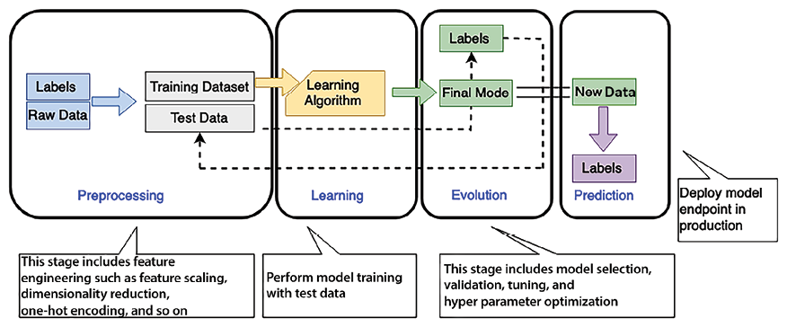
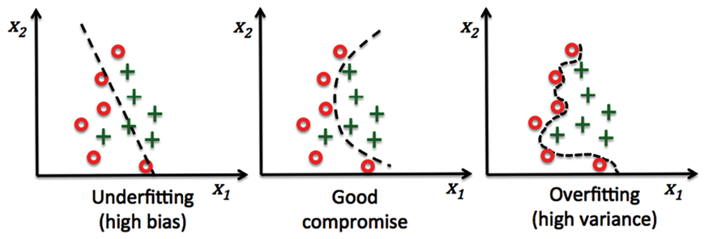
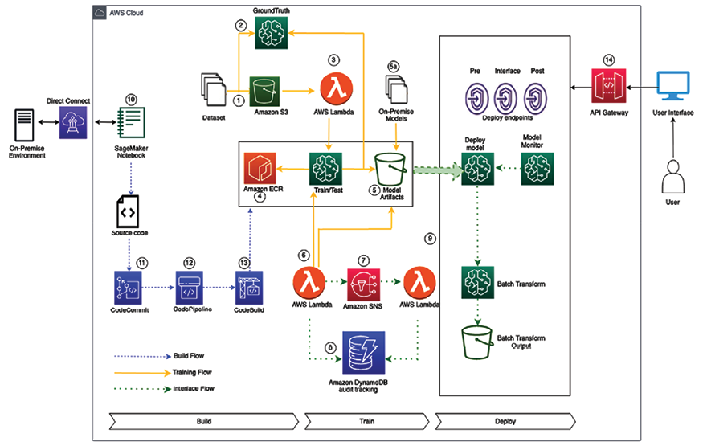
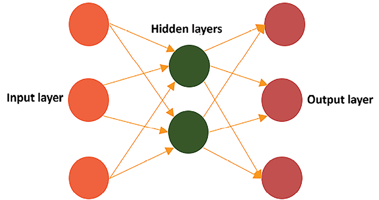
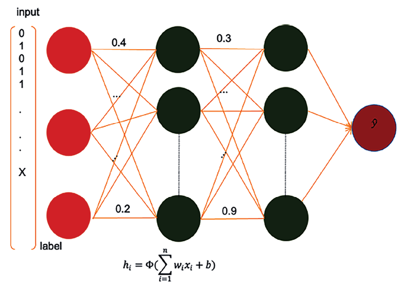

# معماری یادگیری ماشین

در فصل قبل، در مورد دریافت و پردازش کلان داده ها و دریافت بینش برای درک کسب و کار خود یاد گرفتید. در روش سنتی اداره یک کسب و کار، تصمیم گیرنده سازمان به داده های گذشته نگاه می کند و از تجربیات خود برای ترسیم مسیر آینده شرکت استفاده می کند. این فقط در مورد راه اندازی چشم انداز تجاری نیست، بلکه بهبود تجربه کاربر نهایی با پیش بینی و برآورده کردن نیازهای آنها یا خودکار کردن فعالیت های تصمیم گیری روزانه مانند تأیید وام است.

با این حال، با حجم انبوه داده های موجود در حال حاضر، پردازش همه داده ها و پیش بینی آینده برای مغز انسان دشوار شده است. اینجاست که **هوش مصنوعی (AI)** و **یادگیری ماشین** (**ML**) وارد می‌شوند. هوش مصنوعی مفهوم گسترده‌تری از ماشین‌هایی است که وظایفی را به روش‌های هوشمندانه‌ای مانند سیری و الکسا انجام می‌دهند تا سؤالات شما را درک کنند. پاسخ دهید، و ML زیرمجموعه خاصی از هوش مصنوعی است که شامل آموزش کامپیوترها برای یادگیری و تصمیم گیری بر اساس داده ها می شود. آنها به ما کمک می کنند تا با نگاه کردن به مقدار زیادی از داده های تاریخی، مسیرهای عمل آینده را پیش بینی کنیم. امروزه بیشتر شرکت ها در ML سرمایه گذاری می کنند، در درجه اول به دلیل شتابی است که هوش مصنوعی مولد (GenAI) ایجاد می کند. ML به سرعت در حال تبدیل شدن به فناوری است که به شرکت ها کمک می کند تا خود را متمایز کنند - از طریق ایجاد محصولات، خدمات و مدل های تجاری جدید، به آنها اجازه می دهد نوآوری کنند و مزیت رقابتی به دست آورند.

هوش مصنوعی و ML برای حل مشکلات تجاری بسیار عالی هستند زیرا موارد استفاده بی‌شماری را در خطوط مختلف کسب‌وکار در سراسر یک شرکت ارائه می‌دهند، و میزان تأثیرگذاری بالایی که این موارد استفاده می‌توانند داشته باشند. به عنوان مثال، با ML می توانید سطح جدیدی از خدمات مشتری را با هوشمندی مرکز تماس ایجاد کنید یا به تیم های بازاریابی کمک کنید تا اهداف شخصی سازی خود را با استفاده از یک کمپین بازاریابی شخصی مبتنی بر ML انجام دهند.

در محدوده این فصل، ما موضوعات زیر را برای رسیدگی و مدیریت نیازهای ML شما پوشش خواهیم داد:

- یادگیری ماشینی چیست؟
- کار با علم داده و یادگیری ماشین
- یادگیری ماشینی در فضای ابری
- ساخت معماری یادگیری ماشین
- اصول طراحی برای معماری یادگیری ماشین
- MLOps
- یادگیری عمیق
- **پردازش زبان طبیعی** (**NLP**)

در پایان این فصل، درک درستی از معماری ML خواهید داشت. شما با مدل های مختلف ML و گردش کار ML آشنا خواهید شد. شما فرآیند ایجاد خط لوله مدل ML را از طریق مهندسی ویژگی، آموزش مدل، استنتاج و ارزیابی مدل درک خواهید کرد.

# یادگیری ماشینی چیست؟

یادگیری ماشینی تجربیات مشتری بهتر، عملیات تجاری کارآمدتر و تصمیم گیری سریعتر و دقیق تر را به همراه دارد. با افزایش قدرت محاسباتی و تکثیر داده‌ها، ML از پیرامون حرکت کرده و به یک تمایز اصلی برای مشاغل و سازمان‌ها در سراسر صنایع تبدیل شده است. موارد استفاده از ML می‌تواند برای اکثر کسب‌وکارها اعمال شود، مانند توصیه‌های شخصی‌شده محصول و محتوا، اطلاعات مرکز تماس، تأیید هویت مجازی، و پردازش هوشمند اسناد. همچنین موارد استفاده سفارشی برای صنایع خاص ساخته شده است - مانند آزمایشات بالینی در داروسازی یا کنترل کیفیت خط مونتاژ در تولید.

ML از فناوری به منظور یافتن روندهای جدید و القای مدل های پیش بینی ریاضی بر اساس داده های واقعی گذشته استفاده می کند. ML می تواند به حل مشکلات پیچیده ای مانند موارد زیر کمک کند:

- ممکن است برای تصمیم گیری نیاز به یادگیری نحوه ایجاد قوانین کد پیچیده داشته باشید. به عنوان مثال، اگر می خواهید احساسات افراد را در تصاویر و گفتار تشخیص دهید، هیچ راه آسانی برای رمزگذاری منطق برای رسیدن به آن وجود ندارد.
- زمانی که شما نیاز به تجزیه و تحلیل حجم زیادی از داده ها برای تصمیم گیری دارید و حجم داده ها برای یک انسان برای انجام کارآمد این کار بسیار زیاد است. به عنوان مثال، در حالی که یک انسان می تواند این کار را با تشخیص هرزنامه انجام دهد، مقدار داده انجام سریع این کار را غیرعملی می کند.
- اطلاعات مربوطه ممکن است تنها زمانی به صورت پویا در دسترس باشند که شما نیاز به تطبیق و شخصی سازی رفتار کاربر بر اساس داده های فردی داشته باشید. به عنوان مثال، با توصیه های فردی محصول یا شخصی سازی وب سایت.
- هنگامی که بسیاری از وظایف با داده های زیاد در دسترس هستند، نمی توانید اطلاعات را به اندازه کافی سریع ردیابی کنید تا تصمیمی مبتنی بر قانون بگیرید - به عنوان مثال، کشف تقلب و NLP.

انسان‌ها پیش‌بینی داده‌ها را بر اساس نتایج تحلیل‌ها و تجربیاتشان مدیریت می‌کنند. با استفاده از ML، می توانید یک کامپیوتر را آموزش دهید تا بر اساس داده های موجود تخصص ارائه کند و بر اساس داده های جدید پیش بینی کند. در اینجا چند مورد استفاده رایج برای ML در صنایع مختلف آورده شده است:

- **تعمیر و نگهداری پیش بینی شده**: پیش بینی کنید که آیا یک جزء از قبل بر اساس داده های حسگر خراب می شود یا خیر. این معمولاً در تخمین **عمر مفید باقیمانده** (**RUL**) ناوگان خودروسازی، تجهیزات تولیدی و حسگرهای IoT استفاده می شود. مزایای اصلی آن افزایش زمان کارکرد وسایل نقلیه و تجهیزات و صرفه جویی قابل توجه در هزینه است. این نرم افزار در صنایع خودروسازی و تولیدی گسترده است.
- **پیش بینی تقاضا**: از تاریخچه استفاده کنید

داده‌های کالری برای برآورد سریع‌تر و دقیق‌تر معیارهای کلیدی تقاضا، کمک به تصمیم‌گیری دقیق‌تر تجاری در مورد تولید، قیمت‌گذاری، مدیریت موجودی، و خرید/تجهیز مجدد انبارها. مزایای اصلی شامل برآورده کردن تقاضای مشتری، به حداقل رساندن هزینه های حمل موجودی با کاهش موجودی مازاد و کاهش ضایعات است. صنایعی مانند خدمات مالی، تولید، خرده فروشی و **کالاهای بسته بندی شده مصرفی** (**CPG**) اغلب از این مورد استفاده می کنند.

- **تشخیص تقلب**: شناسایی فعالیت های بالقوه تقلبی را به صورت خودکار انجام دهید و آنها را برای بررسی بیشتر علامت گذاری کنید. مزیت اصلی این امر کاهش هزینه های مربوط به تقلب و حفظ اعتماد مشتری است. این مورد استفاده در بخش خدمات مالی و خرده فروشی آنلاین اجرا می شود.
- **پیش‌بینی ریسک اعتباری**: پیش‌بینی‌های فردی از برنامه‌های اعتباری را برای پیش‌بینی احتمال بازپرداخت یا عدم بازپرداخت اعتبار توضیح دهید (اغلب به آن _اعتبار نکول_ می‌گویند). مزیت در شناسایی سوگیری و رعایت الزامات نظارتی نهفته است. این مورد به طور عمده در خدمات مالی و صنایع خرده فروشی آنلاین استفاده می شود.
- ** استخراج و تجزیه و تحلیل داده ها از اسناد **: درک متن در اسناد دست نویس و دیجیتال، استخراج اطلاعات برای طبقه بندی و اهداف تصمیم گیری. این مورد استفاده در بخش هایی مانند مراقبت های بهداشتی، خدمات مالی، صنایع حقوقی، مکانیکی، برق و آموزش گسترده است.
- **توصیه های شخصی **: توصیه های سفارشی بر اساس داده های تاریخی ایجاد کنید. این رویکرد در بخش های خرده فروشی و آموزش رایج است.
- **پیش بینی ریزش**: احتمال قطع خدمات مشتریان را تخمین بزنید. این اغلب در صنایعی مانند خرده فروشی، آموزش و **نرم افزار به عنوان ارائه دهندگان خدمات** (**SaaS**) استفاده می شود.

ایده اصلی پشت ML این است که یک مجموعه داده آموزشی را برای یک الگوریتم ML در دسترس قرار دهیم و از آن بخواهیم چیزی را از یک مجموعه داده جدید پیش بینی کند، به عنوان مثال، تغذیه برخی از داده های تاریخی روند بازار سهام به یک مدل ML و پیش بینی اینکه چگونه بازار در نوسان خواهد بود. شش ماه تا یک سال آینده

هنگام توسعه سیستم های ML، ترکیب دقیق داده ها و کد بسیار مهم است. هر دو باید به شیوه ای سازماندهی شده کنار هم قرار گیرند و باید به روشی کنترل شده تکامل یابند تا به سمت هدف مشترک یک سیستم قوی و مقیاس پذیر ML ایجاد شوند.

داده‌هایی که برای آموزش، آزمایش و تصمیم‌گیری با استنتاج سیستم ML استفاده می‌کنید در طول زمان تغییر می‌کنند زیرا داده‌ها از مکان‌های مختلف می‌آیند. کد شما همچنین باید با داده ها تغییر کند تا داده های منابع مختلف را در خود جای دهد. بدون یک رویکرد سیستماتیک، می‌تواند در نحوه تغییر کد و داده اختلاف نظر داشته باشد. وقتی می‌خواهید از سیستم ML خود برای کارهای واقعی استفاده کنید، این عدم تطابق می‌تواند مشکلاتی ایجاد کند. همچنین می‌تواند مانع استقرار روان شود و منجر به نتایجی شود که درک، ردیابی یا تکرار آن‌ها بعداً دشوار است. انواع مختلفی از ML وجود دارد. بیایید آنها را بررسی کنیم

## انواع یادگیری ماشینی

ML به رایانه‌ها کمک می‌کند تا بدون نیاز به برنامه‌ریزی تمام جزئیات، چیزهایی را یاد بگیرند. مانند آموزش دادن به کامپیوترها از تجربه است. تصور کنید به سگ خود ترفندی یاد می دهید: به او نشان می دهید که چه کاری انجام دهد، و سپس یاد می گیرد و آن را انجام می دهد! با ML، رایانه ها می توانند از داده ها یاد بگیرند و سپس از این یادگیری برای تصمیم گیری استفاده کنند. بیایید به روش های مختلفی که رایانه ها می توانند یاد بگیرند نگاه کنیم.

### یادگیری تحت نظارت

در یادگیری نظارت شده، الگوریتم مجموعه‌ای از مثال‌های آموزشی داده می‌شود که در آن داده‌ها و تصمیمات هدف مشخص است. سپس می تواند مقدار هدف را برای مجموعه داده های جدید حاوی همان ویژگی ها پیش بینی کند. با این نوع یادگیری، الگوریتم با استفاده از مجموعه داده ای آموزش داده می شود که در آن داده های ورودی با پاسخ یا هدف صحیح ارائه می شود. الگوریتم با استفاده از این مثال ها یاد می گیرد که ورودی ها را با خروجی های صحیح آنها متصل کند.

این نوع یادگیری اغلب برای کارهایی استفاده می‌شود که در آن‌ها باید چیزها را به دسته‌ها طبقه‌بندی کنید یا اعداد را پیش‌بینی کنید، مانند کارهای طبقه‌بندی و رگرسیون. به عنوان مثال می توان از آن برای طبقه بندی ایمیل ها به عنوان هرزنامه یا غیر اسپم یا پیش بینی قیمت خانه بر اساس ویژگی های آن استفاده کرد.

### یادگیری بدون نظارت

در یادگیری بدون نظارت، الگوریتم با حجم عظیمی از داده ها ارائه می شود و باید الگوها و روابط بین داده ها را کشف کند. سپس می تواند از مجموعه داده ها استنتاج کند.

مداخله انسانی در یادگیری بدون نظارت لازم نیست، به عنوان مثال، طبقه بندی خودکار اسناد بر اساس زمینه. این مشکل را حل می کند که در آن خروجی صحیح برای مثال های آموزشی در دسترس نیست و الگوریتم باید الگوهایی را در داده ها با استفاده از خوشه بندی پیدا کند.

در یادگیری بدون نظارت، یک مدل با استفاده از یک مجموعه داده بدون برچسب آموزش داده می شود. الگوریتم به تنهایی برای کشف الگوها، ساختارها یا روابط در داده ها بدون هیچ گونه راهنمایی خاص یا نمونه های برچسب گذاری شده برای دنبال کردن کار می کند. این نوع یادگیری اغلب برای کارهای خوشه‌بندی، کاهش ابعاد و تخمین چگالی اعمال می‌شود. خبرگزاری ها یا شرکت های حقوقی اغلب با داده های انبوه سروکار دارند. با استفاده از یادگیری بدون نظارت، آنها می توانند گربه سند را خودکار کنند

egorization، مدیریت کارآمد مخازن دیجیتال خود، و بهبود فرآیندهای بازیابی اطلاعات، مانند توصیه مقالات یا موارد مشابه به خوانندگان یا محققان.

### یادگیری نیمه نظارتی

این رویکرد عناصر یادگیری تحت نظارت و بدون نظارت را مخلوط می کند. این شامل استفاده از مقدار کمی از داده های برچسب دار به همراه مقدار قابل توجهی از داده های بدون برچسب برای بهبود عملکرد مدل است. یادگیری نیمه نظارتی به ویژه زمانی مفید است که به دست آوردن داده های برچسب دار یا پرهزینه است یا زمان زیادی می برد. اغلب در سناریوهایی استفاده می‌شود که در آن داده‌های برچسب‌گذاری‌شده محدود، اما داده‌های بدون برچسب زیادی وجود دارد. برای مثال، در زمینه زیست پزشکی، یادگیری نیمه نظارتی می تواند بسیار سودمند باشد. به عنوان مثال، حاشیه نویسی تصاویر پزشکی نیاز به زمان و منابع زیادی دارد و یادگیری نیمه نظارتی را به یک راه حل عملی تبدیل می کند. مدل‌ها را می‌توان در ابتدا بر روی مجموعه‌ای کوچک از تصاویر برچسب‌گذاری شده آموزش داد و سپس با استفاده از مجموعه گسترده‌تری از تصاویر بدون برچسب، بهینه‌سازی کرد و در عین حال، هزینه‌ها و منابع را به حداکثر رساند.

### یادگیری تقویتی

این نوع یادگیری شامل آموزش عوامل (یا برنامه های کامپیوتری) برای گرفتن یک سری تصمیمات متوالی در یک محیط خاص است. هدف این است که نماینده بهترین اقدامات را برای به حداکثر رساندن پاداش تجمعی در طول زمان بیاموزد. کارگزاران با انجام عمل، دریافت بازخورد (پاداش یا تنبیه)، و تعدیل استراتژی های خود، یاد می گیرند. یادگیری تقویتی در رباتیک مستقل، بازی کردن (به عنوان مثال، AlphaGo) و سیستم های توصیه استفاده می شود. وسایل نقلیه خودران از یادگیری تقویتی با پیمایش در ترافیک و تنظیم اقدامات بر اساس محیط استفاده می کنند، بنابراین تصمیم گیری بهینه را در سناریوهای مختلف تضمین می کنند. خودرو متوالی تصمیم گیری می کند (مانند تغییر خط، تنظیم سرعت و غیره)، دریافت تقویت مثبت برای اقدامات ایمن و کارآمد و تقویت منفی برای اقدامات نامطلوب.

### یادگیری خود نظارتی

این یک نوع یادگیری بدون نظارت است که در آن الگوریتم برچسب ها یا اهدافی را از داده ها تولید می کند. اغلب شامل کارهایی مانند پیش‌بینی بخش‌های از دست رفته داده می‌شود. یادگیری خود نظارتی در NLP و بینایی کامپیوتری برای مدل‌های پیش‌آموزشی در مجموعه داده‌های بزرگ قبل از تنظیم دقیق وظایف خاص محبوبیت پیدا کرده است. در پردازش تصویر یا بینایی کامپیوتری، می‌توان از یادگیری خود نظارتی برای پیش‌بینی فریم بعدی در یک دنباله ویدیویی استفاده کرد، بنابراین مدل‌هایی را تسهیل می‌کند که حرکت و توسعه را در داده‌های بصری درک می‌کنند. مدل‌های پیش‌آموزشی به این روش و سپس تنظیم دقیق آن‌ها برای کارهای خاص، مانند تشخیص اشیا، می‌تواند نتایج چشمگیری داشته باشد.

### یادگیری چند نمونه ای

در یادگیری چند نمونه ای، هر نقطه داده یک کیسه حاوی چندین نمونه (نقاط زیر داده) است. هدف یادگیری از کیسه های داده است در حالی که فقط به برچسب های سطح کیف دسترسی دارید. یادگیری چند نمونه ای در کشف دارو، طبقه بندی تصویر و بازیابی تصویر مبتنی بر محتوا کاربرد دارد. با در نظر گرفتن پلتفرم‌های تجارت الکترونیک، یادگیری چند نمونه‌ای می‌تواند برای پیش‌بینی اینکه آیا کاربر محصولی را در یک جلسه (یک کیف) خریداری می‌کند یا خیر، با استفاده از نمونه‌های مختلف مانند بازدید از صفحه، محصولات کلیک‌شده و زمان صرف شده در صفحات به کار گرفته شود. برچسب سطح کیف ممکن است نشان دهد که آیا خریدی در آن جلسه انجام شده است یا خیر، که مبنایی قوی برای پیش‌بینی‌ها و تحویل محتوای شخصی‌شده فراهم می‌کند.

این الگوهای یادگیری متنوع، که هر کدام دارای تخصص و حوزه کاربردی خاص خود هستند، ML را به یک زمینه همه کاره تبدیل می‌کنند که با سناریوها و چالش‌های مختلف در صنایع و حوزه‌ها سازگار است. با انتخاب پارادایم متناسب با ویژگی‌ها و داده‌های موجود در یک مسئله معین، پزشکان ML می‌توانند مدل‌های روشن‌گری را استخراج کنند و تصمیم‌گیری هوشمند و خودکار را در بین برنامه‌ها تسهیل کنند. نکته کلیدی این است که نوع یادگیری را انتخاب کنید که به بهترین وجه با داده های موجود و مشکل موجود مطابقت داشته باشد و اطمینان حاصل شود که مدل ها هم قوی و هم قابل اجرا هستند.

در بخش بعدی، بیایید بیاموزیم که علم داده چگونه با ML همراه است.

# کار با علم داده و یادگیری ماشین

ML همه چیز در مورد کار با داده است. کیفیت داده های آموزشی برای موفقیت یک مدل ML بسیار مهم است. داده های با کیفیت بالا منجر به یک مدل ML دقیق تر و پیش بینی درست می شود.

داده ها اغلب دارای مسائل متعددی هستند، مانند مقادیر از دست رفته، نویز، سوگیری، نقاط پرت و غیره. کاوش در داده‌ها ما را از این موضوع آگاه می‌کند و اطلاعات لازم را در مورد کیفیت و تمیزی داده‌ها، الگوهای جالب در داده‌ها و مسیرهای احتمالی به محض شروع مدل‌سازی در اختیار ما قرار می‌دهد. علم داده شامل جمع آوری داده ها، آماده سازی داده ها، تجزیه و تحلیل، پیش پردازش و مهندسی ویژگی است.

آماده سازی داده ها اولین گام در ساخت یک مدل ML است. زمان بر است و تا 80 درصد از زمان صرف شده برای توسعه ML را تشکیل می دهد. آماده‌سازی داده‌ها به دلیل ماهیت ذاتی داده‌ها «کثیف» و آماده نبودن برای ML در شکل خام آن، همیشه خسته‌کننده و نیازمند منابع زیادی بوده است. داده‌های «کثیف» می‌تواند شامل مقادیر گمشده یا اشتباه باشد

s و نقاط پرت. مهندسی ویژگی اغلب برای تبدیل ورودی‌ها برای ارائه مدل‌های ML دقیق‌تر و کارآمدتر مورد نیاز است.

اولین قدم در آماده سازی داده ها، درک مشکل کسب و کار است. دانشمندان داده اغلب مشتاق هستند که مستقیماً وارد داده ها شوند، کدگذاری را شروع کنند و بینش تولید کنند. با این حال، بدون درک روشنی از مشکل کسب و کار، هر بینشی که ایجاد می کنید، شانس بالایی برای تبدیل شدن به راه حلی دارد که نمی تواند مشکل موجود را برطرف کند. بسیار منطقی تر است که قبل از گم شدن در داده ها با یک داستان ساده کاربر و اهداف تجاری شروع کنید.

پس از ایجاد درک کاملی از مشکل کسب و کار، می توانید دسته بندی مشکلات ML را محدود کنید و تعیین کنید که آیا ML برای حل مشکل کسب و کار شما مناسب است یا خیر.

آماده‌سازی داده‌ها اغلب شامل مراحل متعددی مانند تمیز کردن داده‌ها، رسیدگی به مقادیر از دست رفته، عادی‌سازی/استانداردسازی داده‌ها و برچسب‌گذاری داده‌ها است. در بخش بعدی _Building Machine Learning Architecture_ در آینده در این فصل با جزئیات این مراحل آشنا خواهید شد. اکثر ابزارهای آماده سازی داده های مستقل به قابلیت هایی برای تبدیل داده ها، مهندسی ویژگی ها و تجسم مجهز هستند. تبدیل داده ها ممکن است شامل کارهایی مانند تبدیل ارز (به عنوان مثال، از دلار به یورو) یا تغییر واحدهای اندازه گیری (مانند از کیلوگرم به پوند) باشد. مهندسی ویژگی شامل ایجاد ستون‌های داده جدید (ویژگی‌ها) از ستون‌های موجود برای افزایش کاربرد مجموعه داده برای مدل‌های ML است. به عنوان مثال، استخراج روز هفته یا ماه از ستون تاریخ می تواند به مدل کمک کند تا الگوهای مربوط به زمان را تشخیص دهد. در حالی که این ابزارها در تهیه داده ها عالی هستند، اغلب فاقد قابلیت های داخلی برای اعتبارسنجی مدل هستند، که گامی حیاتی در ارزیابی عملکرد مدل ML است. آنچه مورد نیاز است چارچوبی است که همه این قابلیت ها را در یک مکان فراهم کند و به شدت با بقیه خطوط لوله ML ادغام شود. بنابراین ماژول‌های آماده‌سازی داده‌ها قبل از اینکه در تولید مستقر شوند، نیاز به مدیریت و یکپارچه‌سازی دارند.

همانطور که در نمودار زیر نشان داده شده است، پیش پردازش داده و یادگیری ایجاد یک مدل ML به هم مرتبط هستند - آماده سازی داده شما به شدت بر مدل شما تأثیر می گذارد، در حالی که مدلی که انتخاب می کنید به شدت بر نوع آماده سازی داده ای که انجام خواهید داد تأثیر می گذارد. یافتن تعادل صحیح بسیار تکراری است و بسیار یک هنر (یا آزمون و خطا) است:

شکل 13.1: گردش کار ML

همانطور که در نمودار قبل نشان داده شده است، گردش کار ML شامل مراحل زیر است:

- **پیش پردازش**: در این مرحله دانشمند داده داده ها را پیش پردازش می کند و آنها را به مجموعه داده های آموزشی (70 درصد داده ها)، اعتبارسنجی (10 درصد داده ها) و آزمایش (20 درصد داده ها) تقسیم می کند. مدل ML شما با استفاده از مجموعه داده های آموزشی آموزش داده شده است، که به آن کمک می کند یاد بگیرد و پیش بینی درست را ارائه دهد. پس از تکمیل آموزش، مدل با یک مجموعه داده اعتبار سنجی جداگانه ارزیابی می شود تا عملکرد و قابلیت های تعمیم آن ارزیابی شود. هنگامی که مدل آماده شد، می توانید آن را با استفاده از مجموعه داده آزمایشی آزمایش کنید. ویژگی‌ها ویژگی‌های مستقل مجموعه داده شما هستند که ممکن است بر نتیجه تأثیر بگذارند یا نکنند. مهندسی ویژگی شامل یافتن ویژگی مناسب است که می تواند به دستیابی به دقت مدل کمک کند. برچسب نتیجه هدف شما است که به انتخاب ویژگی بستگی دارد. می‌توانید برای انتخاب ویژگی مناسب، کاهش ابعاد را اعمال کنید، که قانع‌کننده‌ترین ویژگی را برای داده‌های شما فیلتر و استخراج می‌کند.
- **یادگیری**: الگوریتم ML مناسب را با توجه به موارد استفاده تجاری و داده ها در این مرحله انتخاب می کنید. این هسته جریان کار ML است، جایی که شما مدل ML خود را بر روی مجموعه داده آموزشی خود آموزش می دهید. برای دستیابی به دقت مدل، باید با فراپارامترهای مختلف آزمایش کنید و انتخاب مدل را انجام دهید. فراپارامترها تنظیمات پیکربندی هستند که برای کنترل فرآیند یادگیری در الگوریتم‌های ML استفاده می‌شوند.
- **ارزیابی**: هنگامی که مدل ML شما در مرحله یادگیری آموزش داده شد، می خواهید دقت آن را با یک مجموعه داده شناخته شده ارزیابی کنید. برای ارزیابی مدل خود، از مجموعه داده اعتبار سنجی که در مرحله پیش پردازش کنار گذاشته شده است استفاده می کنید. اگر دقت پیش‌بینی مدل شما باید به استثناهایی که توسط داده‌های اعتبارسنجی تعیین می‌شوند بازنگری شود، باید تنظیم مدل مورد نیاز براساس نتیجه ارزیابی انجام شود.
- **پیش بینی**: پیش بینی به استنتاج نیز معروف است. در این مرحله، مدل خود را مستقر کرده و شروع به پیش بینی می کنید. این پیش بینی ها را می توان در زمان واقعی یا به صورت دسته ای انجام داد.

GenAI یک تغییر پارادایم را در چشم انداز ML و AI رهبری کرده است. در هسته آن **مدل های بنیادی** (**FM**) مانند GPT-4 وجود دارد که بر روی مجموعه داده های گسترده و در مقیاس اینترنت آموزش دیده اند و هنجارهای مرسوم برچسب گذاری داده ها و سفارشی سازی مدل را بازتعریف می کنند. این فناوری پیشگامانه به سازمان‌ها این امکان را می‌دهد که FM‌ها را با نشانه‌های داده محدود تنظیم کنند، در نتیجه تلاش دستی و زمان مرتبط با آماده‌سازی داده‌ها را به‌طور چشمگیری کاهش می‌دهد.

با این حال، تشخیص این نکته حیاتی است که GenAI یک گلوله نقره ای نیست زیرا d نیست

طراحی شده برای رسیدگی به تمام مشکلات هوش مصنوعی و ML. همچنین، توسعه FM ها یک تلاش منابع فشرده است که نیازمند قدرت محاسباتی قابل توجه و دسترسی به مجموعه داده های گسترده است. به این ترتیب، بسیاری از شرکت ها ترجیح می دهند از FM های ارائه شده توسط شرکت های شخص ثالث مشهور مانند OpenAI، Google، Meta و Anthropic استفاده کنند که در توسعه این مدل ها پیشگام بوده اند.

با این حال، داستان به همین جا ختم نمی شود. آموزش مدل سفارشی یک گزینه قانع کننده باقی می ماند، به خصوص زمانی که راه حل های خاص و متناسب مورد نیاز باشد. در حالی که GenAI یک رویکرد نوآورانه برای حل مشکل ارائه می‌کند، تصمیم استراتژیک برای اتخاذ آن باید با اهداف، منابع و محدودیت‌های منحصربه‌فرد سازمان همسو باشد. در _فصل 14_، _معماری هوش مصنوعی مولد_ درباره GenAI بیشتر خواهید آموخت.

با توجه به ورودی داده‌های شما، مدل ML اغلب دارای مشکلات بیش از حد برازش یا عدم تناسب است، که برای به دست آوردن نتیجه مناسب باید آنها را در نظر بگیرید. بیایید در این مورد بیشتر بدانیم.

## ارزیابی مدل‌های ML-برازش بیش از حد در مقابل عدم تناسب

در برازش بیش از حد، مدل شما نیاز به تعمیم دارد، به این معنی که نه تنها روی داده‌هایی که روی آن‌ها آموزش داده شده است (مجموعه آموزشی) بلکه باید روی داده‌های جدید و دیده نشده (مجموعه آزمایش یا مجموعه اعتبارسنجی) عملکرد خوبی داشته باشد. اگر مدلی بیش از حد برازش داشته باشد، اساساً داده های آموزشی را به خاطر سپرده است و نویز را همراه با الگوی زیربنایی ضبط می کند، که منجر به عملکرد ضعیف در هر داده جدید می شود. اگر یک مدل معیارهای عملکرد بالا را در داده‌های آموزشی نشان دهد، اما معیارهای قابل توجهی کمتری را در داده‌های آزمایشی نشان دهد، این نشانه بیش از حد برازش است.

این معمولاً نشان می‌دهد که مدل برای مقدار داده‌های آموزشی بسیار انعطاف‌پذیر است و به آن اجازه می‌دهد داده‌ها، از جمله نویز را به خاطر بسپارد. اضافه برازش با واریانس بالا مطابقت دارد، جایی که تغییرات کوچک در داده های آموزشی منجر به تغییرات قابل توجهی در نتایج می شود.

در عدم تناسب، مدل شما نمی تواند الگوهای اساسی را در مجموعه داده آموزشی ثبت کند. به طور معمول، عدم تناسب نشان می دهد که مدل بسیار ساده است یا دارای متغیرهای توضیحی بسیار کمی است. یک مدل کم‌برازش باید برای مدل‌سازی الگوهای واقعی انعطاف‌پذیرتر باشد و با سوگیری بالا مطابقت داشته باشد، که نشان می‌دهد نتایج عدم تناسب سیستماتیک در یک منطقه خاص را نشان می‌دهد.

نمودارهای زیر تفاوت واضح بین برازش بیش از حد و عدم تناسب را نشان می دهند، زیرا با مدلی با تناسب خوب مطابقت دارند:

شکل 13.2: برازش بیش از حد مدل ML در مقابل عدم تناسب

مدل ML دو دسته نقطه داده را طبقه بندی می کند که توسط حلقه ها و صلیب های نمودارهای قبلی نشان داده شده است. مدل ML سعی می کند تعیین کند که آیا مشتری محصولی را خریداری می کند یا خیر. نمودار پیش بینی های سه مدل مختلف ML را نشان می دهد. می‌توانید یک مدل بیش از حد برازش (در سمت راست) را ببینید که از تمام نقاط داده حلقه‌دار در آموزش عبور می‌کند و در تعمیم الگوریتم برای داده‌های دنیای واقعی خارج از مجموعه داده آموزشی شکست می‌خورد. از سوی دیگر، مدل کمتر برازش (در سمت چپ) چندین نقطه داده را کنار گذاشته و باید دقیق‌تر باشد. یک مدل خوب (در وسط نشان داده شده است) معمولاً پیش بینی های نقطه داده واضحی را ارائه می دهد. ایجاد یک مدل ML خوب مانند خلق هنر است. شما می توانید تناسب مناسب را با تنظیم مدل پیدا کنید.

## الگوریتم های محبوب یادگیری ماشین

محبوبیت یک الگوریتم اغلب به کاربرد و عملکرد آن در موارد استفاده متنوع، سهولت درک و پیاده سازی و همچنین توانایی آن در مقیاس و انطباق با انواع مختلف داده بستگی دارد. بیایید به برخی از الگوریتم های محبوب ML نگاه کنیم.

### رگرسیون خطی

رگرسیون خطی سعی می‌کند بفهمد چگونه یک چیز (مثلاً _X_) می‌تواند با یافتن یک رابطه خطی بین آنها به پیش‌بینی چیز دیگر (_Y_) کمک کند. تصور کنید در بازار یک کشاورز هستید. با مشاهده قیمت کدو تنبل متوجه می شوید که با افزایش سایز کدو تنبل، قیمت آن نیز افزایش می یابد. رگرسیون خطی مانند ترسیم یک خط مستقیم در تمام نقاط قیمت کدو تنبل عمل می کند و اطمینان می دهد که خط تا حد امکان به همه نقاط نزدیک است.

املاک و مستغلات بخشی است که در آن رگرسیون خطی نقش حیاتی ایفا می کند. به عنوان مثال، اگر شرکتی بخواهد قیمت فروش یک خانه را پیش‌بینی کند، به ویژگی‌هایی مانند تعداد اتاق‌ها، موقعیت مکانی و سن ملک نگاه می‌کند. اگر خانه‌هایی با اتاق‌های بیشتر معمولاً در گذشته با قیمت‌های بالاتر فروخته می‌شدند، این مدل قیمت بالاتری را برای خانه‌هایی با اتاق‌های بیشتر در آینده پیش‌بینی می‌کند. این مانند پیش بینی قیمت کدو تنبل خود بر اساس اندازه آن است.

### رگرسیون لجستیک

رگرسیون لجستیک احتمال یا احتمال وقوع چیزی را با پاسخ های "بله" یا "خیر" به شما می گوید. تصور کنید سعی می کنید پیش بینی کنید که آیا کتابی پرفروش خواهد شد یا خیر. رگرسیون لجستیک به ویژگی‌هایی مانند تعداد صفحات، محبوبیت نویسنده، و ژانر برای پیش‌بینی احتمال (بین «۰» و «۱») پرفروش شدن آن نگاه می‌کند.

در مراقبت های بهداشتی، رگرسیون لجستیک می تواند احتمال ابتلای بیمار به بیماری را بر اساس علائم مختلف و نتایج آزمایش پیش بینی کند. برای مثال

به اندازه کافی، با در نظر گرفتن عواملی مانند سن، فشار خون و سطح کلسترول، می توان احتمال ابتلای فرد به بیماری قلبی را پیش بینی کرد. پزشکان ممکن است آزمایشات بیشتری را در صورت بالا بودن احتمال انجام دهند و از مدیریت زودهنگام و پیشگیرانه خطرات سلامتی بالقوه اطمینان حاصل کنند.

### درختان تصمیم

درخت‌های تصمیم به شما کمک می‌کنند با پرسیدن سؤالات، یک سری تصمیم‌گیری کنید. تصور کنید می خواهید تصمیم بگیرید چه بپوشید. درخت تصمیم ممکن است بپرسد: "باران است؟" اگر "بله"، ممکن است یک کت بارانی را پیشنهاد کند. اگر «نه»، ممکن است سؤال دیگری بپرسد، مانند «آیا گرم است؟»، و لباس‌هایی را متناسب با آن پیشنهاد می‌کند و به شما کمک می‌کند تا در میان گزینه‌های مختلف پیمایش کنید تا بهترین پاسخ را پیدا کنید.

درخت‌های تصمیم می‌توانند به پیش‌بینی اینکه آیا مشتری محصولی را در بخش خرده‌فروشی می‌خرد یا خیر، کمک می‌کند. به عنوان مثال، ممکن است بپرسد: "آیا مشتری در ماه گذشته چیزی خریده است؟" اگر "بله"، آنها ممکن است به زودی دوباره خرید کنند. اگر "نه"، ممکن است عوامل دیگری مانند بازدیدهای اخیر وب سایت یا تبلیغات کلیک شده را برای پیش بینی رفتار خرید آنها در نظر بگیرد و به خرده فروشان کمک کند تا مشتریان را با تبلیغات و پیشنهادات مرتبط هدف قرار دهند.

### جنگل های تصادفی

همانطور که از نام آن پیداست، یک جنگل تصادفی مانند ایجاد یک جنگل است که در آن هر درخت یک درخت تصمیم است که برای تصمیم گیری در مورد نتیجه رای می دهد. به هر درخت یک زیرمجموعه تصادفی از داده ها داده می شود و بهترین تصمیم خود را می گیرد. سپس، همه درختان برای ارائه پاسخ نهایی "رای" می دهند. این رویکرد اغلب منجر به پیش‌بینی‌های بهتر و پایدارتر از یک درخت تصمیم می‌شود.

در امور مالی، جنگل های تصادفی را می توان برای پیش بینی تایید یا رد درخواست های وام استفاده کرد. به عنوان مثال، درختان ممکن است جنبه های مختلفی مانند امتیاز اعتبار، درآمد و بدهی را برای تصمیم گیری فردی در نظر بگیرند. تصمیم نهایی که از طریق اکثریت آرای همه درختان گرفته می‌شود، دقیق‌تر و قوی‌تر از تکیه بر یک مدل واحد است و در نتیجه خطر تایید وام نادرست را کاهش می‌دهد.

### K-نزدیکترین همسایگان (k-NN)

استفاده از **k**\-NN مانند نگاه کردن به یک چیز جدید و تلاش برای درک آن با مقایسه آن با چیزهای مشابهی است که قبلاً می دانیم. اگر میوه‌ای را پیدا کردید که قبلاً ندیده‌اید، ممکن است با مقایسه آن با میوه‌هایی با ظاهری مشابه که طعم آنها را می‌شناسید، تصمیم بگیرید که طعم آن شیرین است یا ترش. اگر شبیه میوه های شیرین دیگر است، ممکن است حدس بزنید که شیرین است.

K-NN به طور گسترده در سیستم های توصیه، مانند سیستم های وب سایت های تجارت الکترونیک، استفاده می شود. اگر کاربر محصول خاصی را خریداری کرده باشد، k-NN محصولات مشابهی را که سایر کاربران مشابه خریداری کرده اند، پیدا کرده و آنها را به کاربر توصیه می کند. به عنوان مثال، فرض کنید کاربری یک رمان پلیسی می خرد. در آن صورت، k-NN به دنبال کاربران دیگری می‌گردد که همان رمان را خریداری کرده‌اند و سپس کتاب‌های دیگری را که آن کاربران خریداری کرده‌اند، توصیه می‌کند و با نشان دادن محصولات مرتبط، تجربه خرید کاربر را افزایش می‌دهد.

### ماشین‌های بردار پشتیبانی (SVM)

SVM ها الگوریتم های تعیین کننده ای هستند که هدفشان شفاف و مجزا نگه داشتن مسائل است. تصور کنید یک میز بزرگ دارید و یک طرف سیب و طرف دیگر موز قرار می دهید. SVM ها سعی می کنند وسیع ترین خط (یا شکاف) ممکن را برای جدا کردن این دو میوه بیابند، به طوری که همه سیب ها در یک طرف و همه موزها در طرف دیگر قرار گیرند و هیچ اختلاط ایجاد نشود.

در زمینه تشخیص دست خط، SVM ها مفید هستند. به عنوان مثال، اگر عددی را بنویسید، بگویید «4»، SVM ها به رایانه کمک می کنند تا با مشاهده نمونه های زیادی از نحوه نوشتن این اعداد و یافتن بهترین مرز جداکننده، تصمیم بگیرد که آیا واقعاً «4» است یا شاید «9». «4» از «9»، بنابراین به خواندن دقیق اعداد دست‌نویس کمک می‌کند.

### شبکه های عصبی

شبکه های عصبی را مانند یک مینی مغز درون کامپیوتر در نظر بگیرید که از مثال های زیادی برای تصمیم گیری یاد می گیرد. وقتی دوچرخه سواری را یاد می گیرید، در ابتدا ممکن است زمین بخورید، اما به تدریج، با درک اشتباهی که در تلاش های قبلی رخ داده است، یاد می گیرید که چگونه تعادل را حفظ کنید و رکاب بزنید. شبکه‌های عصبی نیز به طور مشابه یاد می‌گیرند و از خطاها برای تصمیم‌گیری بهتر دفعه بعد تنظیم می‌شوند.

به عنوان مثال، پلتفرم های رسانه های اجتماعی از شبکه های عصبی برای شناسایی و برچسب گذاری افراد در عکس ها در تشخیص تصویر استفاده می کنند. این شبکه با نگاه کردن به بسیاری از تصاویر یک فرد و توجه به ویژگی هایی مانند شکل بینی و رنگ چشم یاد می گیرد. وقتی یک عکس جدید آپلود می‌شود، این ویژگی‌ها را با دانش آموخته‌شده‌اش مقایسه می‌کند و بهترین حدس را می‌زند که چه کسی در آن است.

### K-به معنای خوشه بندی است

خوشه بندی K-means وسیله ای برای گروه بندی نقاط داده مشابه با هم است. این مانند سازماندهی یک مهمانی بزرگ است که در آن می‌خواهید گروه‌هایی (یا دسته‌هایی) از دوستان ایجاد کنید که علایق مشابهی دارند تا از همراهی یکدیگر لذت ببرند. شما مکرراً راه‌های مختلفی را برای گروه‌بندی افراد امتحان می‌کنید، سعی می‌کنید اطمینان حاصل کنید که همه افراد در یک گروه تا حد ممکن شبیه یکدیگر هستند و زمان سرگرم‌کننده‌ای را برای همه تضمین می‌کنید.

یک کاربرد محبوب k-means، تقسیم بندی مشتری برای استراتژی های بازاریابی است. کسب‌وکارها می‌توانند از k-means برای گروه‌بندی مشتریان به خوشه‌ها بر اساس رفتار خریدشان استفاده کنند. به عنوان مثال، یک خوشه ممکن است مشتریانی باشند که مکررا خرید می کنند اما هر بار هزینه کمی می کنند، در حالی که دسته دیگر ممکن است مشتریانی باشند که به ندرت خرید می کنند اما خریدهای بزرگ انجام می دهند. هر گروه می تواند هدف قرار گیرد

با استراتژی های بازاریابی مختلف برای به حداکثر رساندن فروش استفاده شده است.

### XGBoost

XGBoost از اشتباهات گذشته درس می گیرد و با هر تصمیم عاقل تر و عاقل تر می شود. اگر داشتید مسائل ریاضی را حل می‌کردید و یکی را اشتباه حل می‌کردید، XGBoost به آن نگاه می‌کرد، متوجه می‌شد که کجا اشتباه کرده‌اید و این اشتباه را به خاطر می‌آورد تا دفعه بعد که با مشکلی مشابه روبرو شد، همان خطا را تکرار نکند.

در صنعت اعتبار، XGBoost به طور گسترده ای برای پیش بینی اینکه آیا مشتری در پرداخت وام نکول می کند یا خیر استفاده می شود. نگاهی به بسیاری از عوامل مانند درآمد، سن و سابقه وام قبلی، احتمال نکول مشتری را پیش‌بینی می‌کند. اگر پیش بینی شود که متقاضی دارای ریسک بالای نکول است، وام ممکن است رد شود و در نتیجه ریسک برای بانک به حداقل برسد.

این الگوریتم‌ها پایه و اساس بسیاری از پروژه‌های ML هستند که بر اساس مشکل خاص و انواع داده‌ها (مانند متن، تصاویر، داده‌های عددی) انتخاب می‌شوند. برخی از آنها، مانند شبکه های عصبی، به منابع و داده های محاسباتی بیشتری نیاز دارند، در حالی که برخی دیگر، مانند درخت های تصمیم گیری یا k-NN، ممکن است حتی با مجموعه داده های کوچکتر قابل اجرا باشند.

ما کاوش خود را در ML با نگاهی به ابزارها و چارچوب‌های محبوب ML ادامه می‌دهیم.

## ابزارها و چارچوب های یادگیری ماشینی محبوب

ML با استفاده از ابزارها و چارچوب‌های مختلفی انجام می‌شود که هر کدام برای کمک به جنبه‌های مختلف توسعه مدل‌های ML طراحی شده‌اند - از پردازش داده‌ها و طراحی الگوریتم گرفته تا آموزش و استقرار مدل. در اینجا برخی از محبوب ترین ها آورده شده است.

ابزارها و چارچوب های رایج برای آماده سازی و کاوش داده ها عبارتند از:

- **NumPy**: کتابخانه اصلی پایتون برای محاسبات علمی. Numerical Python یا NumPy کتابخانه ای از اشیاء آرایه چند بعدی و مجموعه ای از عملیات برای دستکاری چنین آرایه هایی است.

  آرایه مجموعه ای از اقلام داده از همان نوع است که در مکان های حافظه پیوسته ذخیره می شود.

  NumPy عملیات عددی و منطقی ساده تر و کارآمدتر را در مجموعه داده های بزرگ تسهیل می کند. یک شرکت خرده فروشی را تصور کنید که می خواهد میانگین فروش ماهانه را برای تجزیه و تحلیل عملکرد و تصمیم گیری استراتژی آینده محاسبه کند. آنها داده های فروش روزانه را در قالب عددی ذخیره می کنند. با استفاده از NumPy، آنها به راحتی می توانند میانگین فروش ماهانه را با سازماندهی داده های فروش روزانه در یک آرایه، جمع کردن و تقسیم آن بر تعداد روز محاسبه کنند.

- **Pandas**: کتابخانه ای که به کاربران پایتون ساختارهای داده ساده و با کارایی بالا و قابلیت های تجزیه و تحلیل داده ها را ارائه می دهد و به کاربران امکان تجزیه و تحلیل و دستکاری داده ها را می دهد. سری و DataFrames، دو ساختار داده ضروری برای پایتون که در بالای NumPy ساخته شده اند را ارائه می دهد.

  یک سری یک ستون است و یک DataFrame یک جدول چند بعدی است که یک مجموعه سری را در بر می گیرد.

  قابلیت های پاندا تمیز کردن، تجزیه و تحلیل و تجسم داده ها را آسان می کند. به عنوان مثال، یک فروشگاه مواد غذایی را تصور کنید که می خواهد داده های فروش خود را تجزیه و تحلیل کند تا بفهمد کدام محصولات پرفروش ترین هستند و کدام محصولات خوب نیستند. آنها یک مجموعه داده بزرگ با اطلاعات مربوط به هر معامله، از جمله نام محصول، مقدار فروخته شده و قیمت دارند. با استفاده از پانداها، آنها به راحتی می توانند این داده ها را دستکاری کنند، کل فروش هر محصول را بیابند، آنها را مرتب کنند و اقلام پرفروش را شناسایی کنند.

- **Scikit-learn**: ابزاری ساده و موثر برای تجزیه و تحلیل داده های پیش بینی کننده که با پانداها و NumPy کار می کند. بسیاری از تکنیک های یادگیری تحت نظارت و بدون نظارت توسط scikit-learn پشتیبانی می شوند. این به طور گسترده در ML، داده کاوی، و تجزیه و تحلیل داده استفاده می شود. Scikit-learn ابزارهای داخلی زیادی برای انتخاب مدل، ارزیابی، وارد کردن داده ها و بهبود دارد. تصور کنید بانکی می خواهد پیش بینی کند که آیا یک مشتری وام خود را نکول می کند یا خیر. آنها داده های تاریخی در مورد مشتریان قبلی، از جمله سن، حقوق، وضعیت تاهل، و اینکه آیا آنها نکول کرده اند، دارند. با استفاده از scikit-learn، آن‌ها می‌توانند مدلی (مانند درخت تصمیم، رگرسیون لجستیک یا الگوریتم مناسب دیگری) بسازند که از این داده‌ها یاد می‌گیرد و سپس از این مدل برای پیش‌بینی احتمال عدم پرداخت وام‌های مشتریان جدید استفاده کنند.

ابزارها و چارچوب های رایج برای تجسم داده ها عبارتند از:

- **Matplotlib**: یک کتابخانه محبوب و غنی از پایتون برای ایجاد تجسم های ایستا، تعاملی و متحرک. علاوه بر خط، پراکندگی، نوار خطا، هیستوگرام، نوار، پای، جعبه و نمودارهای سه بعدی، Matplotlib یک پایه فوق‌العاده همه‌کاره برای ایجاد مجموعه وسیعی از تجسم‌ها ارائه می‌دهد. این ابزار به توسعه دهندگان و دانشمندان داده اجازه می دهد تا داده های خود را در اشکال مختلف نمودار تجسم کنند، که می تواند برای درک توزیع داده ها و الگوها، مشکلات اشکال زدایی یا تجسم روابط بین داده ها بسیار مفید باشد. فرض کنید معلمی می خواهد نمرات دانش آموزان یک کلاس را به صورت بصری ارائه کند تا عملکرد کلی و موارد پرت را به سرعت برجسته کند. با استفاده از Matplotlib، معلم می‌تواند نمودارهای مختلفی مانند نمودارهای میله‌ای، نمودارهای پراکنده یا هیستوگرام ایجاد کند تا توزیع نمرات را در قالب تصویری قابل تفسیر به راحتی نشان دهد.
- **Seaborn**: یک کتابخانه تجسم داده های آماری مبتنی بر Matplotlib که سطح بالایی را ارائه می دهد

رابط برای طراحی نمودارهای جذاب Seaborn چندین تم و پالت رنگ داخلی دارد تا ایجاد نمودارهای زیباشناختی و بصری آموزنده را آسان کند. به‌ویژه برای تجسم مجموعه داده‌های پیچیده با متغیرهای متعدد، به لطف پشتیبانی از ایجاد طرح‌بندی‌های چند قطعه‌ای و قابلیت‌هایی برای تجسم رابطه بین متغیرهای متعدد، مناسب است. یک کسب‌وکار خرده‌فروشی را تصور کنید که می‌خواهد رفتار خرید مشتری خود را در دسته‌های مختلف محصولات در یک دوره زمانی درک کند. با Seaborn، تحلیلگران می‌توانند یک نقشه حرارتی برای نمایش بصری دفعات خرید در دسته‌های مختلف محصولات در ماه‌های مختلف ایجاد کنند، که امکان بینش سریع در مورد روندها و ترجیحات مشتری را فراهم می‌کند.

- **ابزارهای هوش تجاری (BI)**: ابزارهای BI مانند Tableau، Microsoft Power BI، Amazon QuickSight و MicroStrategy برای تبدیل داده های خام به فرمت قابل فهم استفاده می شوند. این ابزارها به افراد کمک می کند تا با داده های خود تجسم، درک و تصمیم گیری کنند. بر خلاف سایر ابزارهای ذکر شده، این ابزارها دارای یک رابط کاربری گرافیکی هستند که به کاربران اجازه می دهد موارد را برای تجزیه و تحلیل داده ها بکشند و رها کنند و به ویژه برای افراد بدون پس زمینه کدنویسی قابل دسترسی باشد. ابزارهای BI می توانند به منابع داده متعددی متصل شوند و بینش داده در زمان واقعی را ارائه دهند. می‌توانید داشبوردهایی ایجاد کرده و به اشتراک بگذارید، که تجسم‌های تعاملی را با تجزیه و تحلیل‌های تعبیه‌شده ارائه می‌دهند. رستوران زنجیره ای را در نظر بگیرید که می خواهد زنجیره تامین و منوی خود را بر اساس رفتار خرید مشتری و روندهای فصلی بهینه کند. با استفاده از یک ابزار BI، شرکت می تواند داده های فروش را در ابعاد مختلف، مانند زمان، جمعیت شناسی مشتری، و دسته بندی محصول، برای شناسایی الگوها و اطلاع رسانی در فرآیندهای تصمیم گیری تجسم کند.

ابزارها و چارچوب های رایج برای توسعه و آموزش مدل عبارتند از:

- **TensorFlow:** یک پلت فرم جامع منبع باز که برای مدیریت طیف وسیعی از وظایف ML طراحی شده است. TensorFlow از طیف وسیعی از APIها برای ساخت، آموزش و استقرار مدل‌های هوش مصنوعی پشتیبانی می‌کند. یکی از ویژگی های کلیدی TensorFlow توانایی آن در ایجاد نمودارهای جریان داده است. این نمودارها نشان می دهد که چگونه داده ها از طریق یک سری مراحل پردازش یا گره ها حرکت می کنند. در این نمودارها، هر گره مخفف یک عملیات ریاضی است و اتصالات بین گره ها که به عنوان لبه شناخته می شوند، نشان دهنده تانسورها هستند که آرایه های داده چند بعدی هستند. TensorFlow ابزارهایی را برای توسعه‌دهندگان فراهم می‌کند تا از ML در مقیاس بزرگ استفاده کنند و کتابخانه وسیعی را پرورش می‌دهد که یادگیری و توسعه مدل‌های هوش مصنوعی از مبتدی تا متخصص را راحت می‌کند. تصور کنید یک استارت آپ مراقبت های بهداشتی می خواهد از ML برای پیش بینی شروع بیماری ها بر اساس معیارهای مختلف بیمار مانند سن، ژنتیک، وزن و عادات سبک زندگی استفاده کند. آنها می توانند از TensorFlow برای ساخت یک مدل شبکه عصبی استفاده کنند که همه این عوامل را برای پیش بینی احتمال وقوع بیماری در نظر می گیرد.
- **PyTorch**: یک کتابخانه محبوب ML به دلیل انعطاف پذیری، سهولت استفاده و نمودار محاسباتی پویا که به ویژه برای یادگیری عمیق مفید است. توسعه دهندگان، محققان و دانشمندان داده به دلیل انعطاف پذیری و عملکرد گسترده، آن را هم برای تحقیق و هم برای تولید ترجیح می دهند. نمودار محاسباتی پویا کاربران را قادر می سازد تا رفتار شبکه را در حال حرکت تغییر دهند و کتابخانه یک API غنی برای کاربرد در وظایف مختلف ML مانند طبقه بندی، رگرسیون و یادگیری تقویتی ارائه می دهد. یک شرکت تجارت الکترونیک را تصور کنید که می خواهد یک ربات چت برای بهبود تجربه مشتری ایجاد کند. با استفاده از PyTorch، آنها می‌توانند یک مدل یادگیری عمیق ایجاد کنند که زبان مشتری را درک می‌کند و پاسخ‌های مفید و دقیقی را به سوالات مشتری در زمان واقعی ارائه می‌دهد.
- **Keras**: یک کتابخانه نرم افزار منبع باز که به عنوان یک API با کاربری آسان برای ساخت و آموزش مدل های یادگیری عمیق عمل می کند. این می تواند بر روی سایر کتابخانه های محبوب ML مانند TensorFlow اجرا شود و آن را بسیار همه کاره می کند. Keras به ویژه به دلیل سادگی و سهولت استفاده در آزمایش مورد علاقه است. با Keras، دانشمندان داده و توسعه دهندگان می توانند ایده های خود را با حداقل تاخیر به نتیجه تبدیل کنند، که در پروژه های نوآورانه حیاتی است. بیایید یک شرکت خرده‌فروشی را در نظر بگیریم که سعی می‌کند محصولات را بر اساس سابقه خرید قبلی به مشتریان توصیه کند. این شرکت می‌تواند از Keras برای ایجاد یک سیستم توصیه‌ای استفاده کند که الگوهای خرید مشتریان را تجزیه و تحلیل می‌کند و محصولاتی را که احتمالاً خریداری می‌کنند پیشنهاد می‌کند.
- **Apache Spark's MLlib:** یک کتابخانه ML که بخشی از Apache Spark است که برای پاسخگویی به نیازهای داده های بزرگ طراحی شده است. MLlib الگوریتم‌های مختلف ML از جمله طبقه‌بندی، رگرسیون، خوشه‌بندی، و فیلتر مشارکتی و همچنین ابزارهایی برای انتخاب و ارزیابی مدل ارائه می‌کند. همچنین API هایی را برای ذخیره مدل ها برای استفاده بعدی ارائه می دهد. MLlib برای مدیریت کارآمد وظایف ML در مقیاس بزرگ طراحی شده است. با توجه به قابلیت محاسباتی توزیع شده، MLlib می تواند به سرعت مجموعه داده های وسیعی را مدیریت کند، و به ویژه برای سناریوهایی که تجزیه و تحلیل داده در مقیاس بزرگ و آموزش مدل ضروری است، ارزشمند است. علاوه بر این، MLlib را می توان با منابع داده و فرمت های مختلف استفاده کرد

ایجاد انعطاف پذیری در برخورد با انواع داده ها یک موسسه مالی را تصور کنید که می خواهد تراکنش های تقلبی کارت اعتباری را در زمان وقوع شناسایی کند. با استفاده از MLlib، دانشمندان داده می‌توانند از مقادیر زیادی از داده‌های تراکنش برای آموزش مدل‌هایی استفاده کنند که الگوهای خرید غیرعادی یا تراکنش‌های غیرعادی را که نشان‌دهنده تقلب هستند، شناسایی می‌کنند و امکان شناسایی و کاهش فعالیت‌های متقلبانه را در زمان واقعی فراهم می‌کنند.

ابزارها و چارچوب های رایج برای استقرار مدل عبارتند از:

- **Docker**: یک پلتفرم طراحی شده برای ایجاد، استقرار و اجرای برنامه ها با استفاده از کانتینرها. Docker به خودی خود یک ابزار ML نیست، اما نقش مهمی در استقرار مدل‌ها و برنامه‌های ML به طور کارآمد و پیوسته ایفا می‌کند. Docker به توسعه دهندگان و دانشمندان داده اجازه می دهد تا یک برنامه کاربردی را به همراه تمام وابستگی های آن (کتابخانه ها، ابزارها و اسکریپت ها) در یک "کانتینر" بسته بندی کنند. این کانتینر را می توان به طور مداوم در محیط های محاسباتی مختلف انتقال داد و اجرا کرد، به این معنی که برنامه بدون در نظر گرفتن جایی که اجرا می شود، به همان روش کار می کند. تیم توسعه نرم افزاری را تصور کنید که در حال ایجاد یک برنامه ML برای پیش بینی قیمت سهام است. آنها دانشمندان داده ای دارند که از ابزارها و کتابخانه های مختلفی برای ایجاد مدل استفاده می کنند و مهندسان نرم افزاری که برنامه را با استفاده از فناوری های مختلف می سازند. با استفاده از Docker، آن‌ها می‌توانند یک گردش کار منسجم ایجاد کنند که در آن همه می‌توانند در یک محیط سازگار کار کنند و اطمینان حاصل کنند که مدل و برنامه علیرغم توسعه با ابزارهای مختلف، در طول توسعه، آزمایش و استقرار یکسان رفتار می‌کنند.
- **Flask**: یک چارچوب وب میکرو نوشته شده در پایتون. یادگیری آن ساده و استفاده از آن ساده است، که آن را برای مبتدیان عالی می کند، اما شامل ویژگی های اضافی (مانند اعتبار سنجی فرم یا لایه های انتزاعی پایگاه داده) که یک چارچوب فول پشته ممکن است ارائه دهد، نیست. با این حال، سادگی و سهولت استفاده آن، آن را برای استقرار برنامه‌های کاربردی وب سبک و APIها، به ویژه در جامعه علوم داده و ML محبوب کرده است. سناریویی را تصور کنید که در آن یک دانشمند داده یک مدل ML را برای پیش بینی اینکه آیا یک پیام ایمیل هرزنامه است یا خیر، ایجاد کرده است. این مدل می تواند توسط یک برنامه وب مورد استفاده قرار گیرد که در آن کاربران ایمیل های خود را ارسال می کنند و در مقابل، برنامه به آنها می گوید که آیا ایمیل اسپم است یا خیر. با استفاده از Flask، دانشمند داده می‌تواند یک وب سرور ساده ایجاد کند که متن ایمیل را می‌پذیرد، از مدل ML برای پیش‌بینی هرزنامه بودن آن استفاده می‌کند و سپس نتیجه را از طریق یک رابط وب به کاربر برمی‌گرداند.

محیط های توسعه یکپارچه محبوب (IDE) عبارتند از:

- **Jupyter** **Notebook:** یک برنامه وب منبع باز که ایجاد و به اشتراک گذاری اسناد تعاملی را امکان پذیر می کند. این اسناد می توانند حاوی کدهای زنده، معادلات، تجسم ها و متن توضیحی باشند که آنها را به ابزارهای همه کاره برای تجزیه و تحلیل داده ها، تحقیقات علمی و اهداف آموزشی تبدیل می کند. این زبان از زبان های مختلفی مانند پایتون، R و جولیا پشتیبانی می کند و به دلیل محیط محاسباتی تعاملی آن به طور گسترده در پاکسازی داده ها، مدل سازی آماری، ML و موارد دیگر استفاده می شود. Jupyter در علم داده، تحقیقات آکادمیک و محاسبات علمی برای قادر ساختن کاربران به ایجاد تحلیل‌های تکرارپذیر و برقراری ارتباط قانع‌کننده نتایج خود از طریق تجسم و متن روایی بسیار مهم است. بیایید سناریویی را در نظر بگیریم که در آن یک زیست شناس می خواهد داده های گونه های پرندگان و مهاجرت آنها را تجزیه و تحلیل کند. زیست‌شناس می‌تواند از یک نوت بوک Jupyter برای نوشتن کد پایتون استفاده کند که داده‌ها را بارگیری می‌کند، الگوهای مهاجرت را تجسم می‌کند و شاید حتی از ML برای پیش‌بینی زمان‌ها یا مسیرهای مهاجرت آینده بر اساس داده‌های تاریخی استفاده کند.
- **RStudio**: یک IDE منبع باز برای R، یک زبان برنامه نویسی محاسبات آماری و گرافیکی، که با نسخه استاندارد R کار می کند و همچنین می تواند با نسخه R موجود در فضای ابری کار کند. RStudio مجموعه‌ای قوی از قابلیت‌ها را برای توسعه اسکریپت، تجسم داده‌ها و تجزیه و تحلیل آماری فراهم می‌کند و از استفاده جامع از زبان R پشتیبانی می‌کند. تصور کنید یک شرکت خرده فروشی می خواهد رفتارهای خرید مشتریان خود را درک کند. با استفاده از RStudio، یک تحلیلگر داده می‌تواند داده‌های فروش را وارد کند، تجزیه و تحلیل آماری را اعمال کند، و تجسم‌هایی (مانند نمودارهای پراکنده، هیستوگرام، یا نمودار میله‌ای) برای شناسایی روند خرید، اقلام محبوب و دوره‌های اوج خرید ایجاد کند، و به طور بالقوه از ML برای پیش‌بینی روند فروش آینده استفاده کند. .
- **Apache Zeppelin**: یک محیط مبتنی بر نوت بوک منبع باز شبیه به Jupyter، که به مهندسان داده، تحلیلگران داده و دانشمندان داده اجازه می دهد تا گردش کار داده ها را توسعه، سازماندهی، اجرا و به اشتراک بگذارند و کد را به طور مشترک اجرا کنند. Zeppelin از پشتیبان های مختلف پردازش داده مانند Apache Spark، Python و JDBC پشتیبانی می کند. کاربران می توانند اسناد مبتنی بر داده، تعاملی و مشارکتی را با Scala، Python، SQL و غیره ایجاد کنند. نقطه قوت خاص Zeppelin در تجسم داده‌های داخلی و برخی ادغام‌هایی است که برای کاربران Jupyter به‌هیچ‌وجه خارج از جعبه نیست. سناریویی را در بخش مراقبت های بهداشتی در نظر بگیرید که در آن تحلیلگران می خواهند داده های بیمار را برای درک الگوهای موجود در آن بررسی کنند.

شیوع بیماری با استفاده از Zeppelin، آنها می توانند به طور تعاملی مجموعه داده ها را کاوش کنند، باطن های مختلف پردازش داده را ادغام کنند، و تصویرسازی هایی مانند نقشه های حرارتی یا نمودارهای خطی ایجاد کنند تا شیوع بیماری در مناطق جغرافیایی یا جدول زمانی را به صورت بصری نشان دهند.

نوت‌بوک‌های Zeppelin، RStudio، و Jupyter متداول‌ترین محیط‌ها برای مهندسان داده هستند که در زمینه کشف داده‌ها، پاکسازی، غنی‌سازی، برچسب‌گذاری و آماده‌سازی برای آموزش مدل ML فعالیت می‌کنند.

از آنجایی که ابر در حال تبدیل شدن به یک پلتفرم پیشرو برای آموزش مدل ML است، بیایید با برخی از پلتفرم های ابری ML موجود آشنا شویم.

# یادگیری ماشینی در ابر

توسعه ML یک فرآیند پیچیده و پرهزینه است. موانعی برای پذیرش در هر مرحله از گردش کار ML وجود دارد، از جمع‌آوری و آماده‌سازی داده‌ها، که زمان‌بر و تمایز ناپذیر است، تا انتخاب الگوریتم ML مناسب، که اغلب با آزمون و خطا انجام می‌شود، و زمان‌های طولانی آموزش، که منجر به هزینه های بالاتر سپس تنظیم مدل وجود دارد که می تواند یک چرخه بسیار طولانی باشد و نیاز به تنظیم هزاران ترکیب مختلف دارد. هنگامی که یک مدل را به کار گرفتید، باید آن را نظارت کنید و سپس تولید آن را مقیاس و مدیریت کنید.

برای حل این چالش‌ها، همه فروشندگان بزرگ ابر عمومی یک پلتفرم ML ارائه می‌کنند که سهولت آموزش، تنظیم، و استقرار مدل‌های ML را در هر مکانی با هزینه کم تسهیل می‌کند. به عنوان مثال، Amazon SageMaker یکی از محبوب‌ترین پلتفرم‌هایی است که خدمات ML را به صورت سرتاسری ارائه می‌کند. SageMaker یک میز کار یکپارچه از ابزارها را در یک مکان از طریق SageMaker Studio به کاربران ارائه می دهد. کاربران می توانند محیط های Jupyter Notebook و JupyterLab را فوراً از طریق SageMaker Studio راه اندازی کنند. SageMaker همچنین مدیریت کامل آزمایش، آماده‌سازی داده‌ها و اتوماسیون خطوط لوله و هماهنگ‌سازی را برای کمک به بهره‌وری بیشتر دانشمندان داده ارائه می‌دهد. SageMaker همچنین پلتفرم RStudio کاملاً مدیریت شده را ارائه می دهد که یکی از محبوب ترین IDE ها در بین توسعه دهندگان R برای پروژه های ML و علم داده است. SageMaker سرورهای کاملاً مدیریت شده را در فضای ابری ارائه می دهد. فراتر از نوت بوک ها، SageMaker سایر قابلیت های زیرساخت مدیریت شده را نیز ارائه می دهد. SageMaker از کارهای آموزشی توزیع‌شده، کارهای پردازش داده‌ها و حتی میزبانی مدل، از تمام مقیاس‌بندی، وصله‌سازی، در دسترس بودن بالا و غیره مرتبط با ساخت، آموزش و مدل‌های میزبانی مراقبت می‌کند.

به طور مشابه، GCP پلتفرم Google Cloud AI را با خدمات مختلف برای انجام آزمایش‌های ML ارائه می‌کند و Microsoft Azure Azure ML Studio را ارائه می‌کند.

علاوه بر پلتفرم های مدیریت شده ML، فروشندگان ابری خدمات هوش مصنوعی آماده برای استفاده را نیز ارائه می دهند. خدمات هوش مصنوعی به توسعه دهندگان این امکان را می دهد که بدون نیاز به مهارت های ML به راحتی به هر برنامه ای هوشمند اضافه کنند. مدل‌های از پیش آموزش‌دیده، هوشمندی آماده‌ای را برای برنامه‌ها و گردش‌های کاری شما فراهم می‌کنند تا به شما در شخصی‌سازی تجربه مشتری، پیش‌بینی معیارهای تجاری، ترجمه مکالمات، استخراج معنا از اسناد و موارد دیگر کمک کنند. به عنوان مثال، AWS سرویس هوش مصنوعی آمازون Comprehend را ارائه می دهد که دارای مدل های از پیش آموزش دیده ای است که از تشخیص عبارات کلیدی و تجزیه و تحلیل احساسات به صورت بومی در چندین زبان پشتیبانی می کند.

ابر به طور فزاینده ای به عنوان یک پلت فرم اصلی برای دسترسی و استفاده از GenAI FM ها عمل می کند و یک محیط مقرون به صرفه و مقیاس پذیر برای آزمایش و استقرار این سیستم های هوش مصنوعی پیشرفته ارائه می دهد. این FM ها بر روی مجموعه داده های وسیعی آموزش دیده اند و می توانند برای کارهای خاص به خوبی تنظیم شوند و آنها را به ابزارهای همه کاره برای طیف گسترده ای از برنامه ها تبدیل کند. مقیاس پذیری و در دسترس بودن منابع ابر، آن را به محیطی ایده آل برای کار با این مدل های بزرگ و منابع فشرده تبدیل می کند. هم GenAI FM های منبع باز و هم تجاری GenAI در دسترس هستند و گزینه هایی را برای نیازها و بودجه های مختلف ارائه می دهند.

این قابلیت دسترسی GenAI FM از طریق ابر قابلیت‌های هوش مصنوعی پیشرفته را دموکراتیزه می‌کند و به کسب‌وکارها و توسعه‌دهندگان این امکان را می‌دهد تا از فناوری پیشرفته هوش مصنوعی بدون نیاز به سرمایه‌گذاری اولیه قابل توجه در زیرساخت‌های محاسباتی استفاده کنند. به عنوان مثال، با استفاده از یک API، Amazon Bedrock به شما امکان می دهد به چندین مدل پایه شخص ثالث از شرکت هایی مانند stability.ai، Meta، Mistral، Anthropic، Amazon و AI21 دسترسی داشته باشید. به طور مشابه، Azure دسترسی API را به GPT-4 OpenAI و GCP به مدل FM Gemini خود دسترسی می‌دهد. در فصل 14، _Generative AI Architecture_ درباره آنها بیشتر خواهید آموخت.

دانشمندان داده می توانند از محیط های ابری مدیریت شده برای تسریع آماده سازی داده ها و آموزش مدل استفاده کنند. پس از تکمیل، آنها می توانند با یک کلیک مدل را گسترش دهند و شروع به ارائه استنتاجات از طریق HTTP کنند.

بیایید در مورد برخی از موارد ضروری که هنگام طراحی معماری ML باید در نظر بگیرید بیشتر بیاموزیم.

# ساخت معماری یادگیری ماشین

ایجاد یک گردش کار قوی و مقیاس‌پذیر از مجموعه‌ای از کدها، فرآیندی پیچیده و زمان‌بر است و بسیاری از دانشمندان داده باید تجربه ایجاد گردش کار را کسب کنند. یک گردش کار ML را می توان به عنوان یک توالی هماهنگ که شامل چندین مرحله است تعریف کرد. دانشمندان داده و توسعه دهندگان ML ابتدا باید دستور العمل های کد متعددی را بسته بندی کنند و سپس ترتیب اجرای آنها را مشخص کنند.

ردیابی وابستگی های کد، داده و پارامتر مدل بین هر مرحله.

پیچیدگی اضافه شده در گردش کار ML، نظارت بر تغییرات داده‌های مورد استفاده برای آموزش و پیش‌بینی را تضمین می‌کند، زیرا تغییرات در داده‌ها می‌تواند منجر به سوگیری شود و منجر به پیش‌بینی‌های نادرست شود. علاوه بر نظارت بر داده ها، دانشمندان داده و توسعه دهندگان ML همچنین باید پیش بینی های مدل را نظارت کنند تا مطمئن شوند که دقیق هستند و در طول زمان به سمت نتایج خاص منحرف نمی شوند. در نتیجه، ممکن است چندین ماه برنامه‌نویسی سفارشی طول بکشد تا دستور العمل‌های کد فردی به ترتیب درست و مطابق انتظار اجرا شوند.

معماری‌های ML باید از مصنوعات مدل محافظت کنند و قابلیت‌های سلف سرویس را برای توسعه و آموزش مدل فراهم کنند. برای معماری ML شما ضروری است که مستندات خودکار و جامع کل چرخه عمر توسعه مدل را تسهیل کند، که شامل مراحل توسعه، آموزش و استقرار است.

برنامه های کاربردی ML همچنین باید از یک خط لوله یکپارچه سازی و استقرار پیوسته (CI/CD) استفاده کنند که به طور یکپارچه با سیستم های کنترل تغییر یکپارچه شده است. این ادغام برای مدیریت و استقرار مدل بسیار مهم است. علاوه بر این، محیط ها به تنظیمات امنیتی از پیش تعریف شده نیاز دارند.

در زیر اجزای معماری ML از پلت فرم **AWS** ML آورده شده است تا به شما در درک معماری ML کمک کند.

دیگر پلتفرم‌های ML عبارتند از Azure ML Studio، H2O.ai، SAS، Databricks و پلتفرم Google AI.

## آماده کنید و برچسب بزنید

برای آماده سازی داده ها برای ML، باید بارهای کاری پردازش داده خود را اجرا کنید، مانند مهندسی ویژگی، اعتبارسنجی داده، ارزیابی مدل و تفسیر مدل. مهندسی ویژگی همچنین مجموعه داده‌ها را برای تبدیل مجموعه داده‌های ورودی به قالبی که توسط الگوریتم ML شما انتظار می‌رود، از پیش پردازش می‌کند. برای مثال، اگر با مجموعه داده‌ای کار می‌کنید که شامل تاریخ است، می‌توانید روز هفته، ماه و زمان سال را به‌عنوان ویژگی‌های جداگانه استخراج کنید، زیرا این ویژگی‌ها می‌توانند برای مدل شما ارزش پیش‌بینی داشته باشند. می‌توانید از ابزارها و تکنیک‌های مختلفی که در بخش قبل ذکر شد برای بحث کردن داده‌ها بر اساس نیازهای ML خود استفاده کنید. یک پلتفرم ML مدیریت شده مانند Amazon SageMaker همچنین قابلیت مخاصمه داده و ذخیره ویژگی را برای ساده کردن کار پردازش داده فراهم می کند. SageMaker Data Wrangler به شما این امکان را می دهد که با ارائه یک رابط بصری برای دسترسی، ترکیب، پاکسازی و تبدیل داده ها، داده های خود را به راحتی برای ML آماده کنید. این ابزار به شما کمک می‌کند تا کارهای معمول آماده‌سازی داده‌ها را بدون نوشتن کد انجام دهید، فرآیند را تسریع کرده و احتمال خطا را کاهش دهید.

علاوه بر این، SageMaker Feature Store یک مخزن متمرکز برای ذخیره، اشتراک گذاری و مدیریت ویژگی های انتخاب شده برای مدل های ML است. این امر سازگاری بین مدل‌های مختلف را تضمین می‌کند و افزونگی را در تلاش‌های مهندسی ویژگی کاهش می‌دهد. Feature Store به حفظ مجموعه‌ای از ویژگی‌ها برای آموزش و استنباط کمک می‌کند، عملکرد بهتر مدل و نگهداری آسان‌تر مدل را تسهیل می‌کند.

در مرحله پردازش داده ها، برچسب گذاری داده های شما یک مرحله بسیار مهم است. این فرآیند به سازماندهی و ساخت مجموعه داده های دقیق برای ML کمک می کند. برای تسهیل این امر، می‌توانید از خدمات شخص ثالث متخصص در برچسب‌گذاری داده‌ها استفاده کنید، مانند Labelbox، CrowdAI، Docugami، و Scale که در برچسب‌گذاری تصویر و سایر انواع حاشیه‌نویسی داده‌ها تخصص دارند. علاوه بر این، پلتفرم هایی مانند Amazon SageMaker Ground Truth یک راه حل خودکار برای برچسب گذاری داده های تصویر ارائه می دهند.

هنگامی که داده های شما آماده شد، مرحله بعدی انتخاب یک الگوریتم مناسب و ساخت مدل است.

## انتخاب کنید و بسازید

قبل از ایجاد یک مدل ML، ابتدا می خواهید مشکلات تجاری را به وضوح درک کنید، که به شما کمک می کند الگوریتم مناسب را انتخاب کنید. همانطور که در بخش قبل توضیح داده شد، می‌توانید از بین فهرستی از الگوریتم‌ها و چارچوب‌های ML، به طور کلی هر دو الگوریتم ML _supervised_ و _unsupervised_ را انتخاب کنید. این ممکن است توسط داده های موجود دیکته شود. هنگامی که الگوریتم مناسب برای مورد استفاده خود را برای ساخت یک مدل ML انتخاب کردید، به یک پلتفرم برای آموزش و توسعه مدل خود نیاز دارید.

Jupyter Notebook و RStudio محبوب‌ترین پلتفرم‌ها در میان دانشمندان داده برای ساخت مدل‌های ML هستند. می توانید از پلتفرم های ابری مانند Amazon SageMaker برای چرخش Jupyter Notebook یا RStudio Workbench استفاده کنید. AWS یک رابط بصری مبتنی بر وب SageMaker Studio و RStudio را در مکانی که تمام مراحل توسعه ML توسط شما انجام می شود، ارائه می دهد.

برای انتخاب مدل خود، می توانید چندین الگوریتم داخلی ML را انتخاب کنید که می توانید از آنها برای انواع مختلف مشکلات استفاده کنید، یا تعدادی از مدل ها و الگوریتم های موجود در بازار ابری را دریافت کنید که شروع سریع را آسان می کند.

مرحله بعدی آموزش و تنظیم مدل است. بیایید در مورد آن بیشتر بدانیم.

## آموزش و کوک کردن

برای تسریع روند آموزش، استفاده از یک خوشه محاسباتی توزیع شده توصیه می شود. این راه‌اندازی به شما امکان می‌دهد حجم کار آموزشی را بین منابع محاسباتی متعدد توزیع کنید و به طور قابل توجهی سرعت مرحله آموزش را افزایش دهید. با استفاده از چنین خوشه ای، می توانید محاسبات را موازی کنید، به این معنی که بخش های مختلف داده های آموزشی می توانند

به طور همزمان پردازش می شود. در نتیجه، آموزش مدل سریعتر تکمیل می شود و خروجی که برنامه های شما می توانند از آن استفاده کنند، زودتر در دسترس قرار می گیرد. این رویکرد نه تنها کارایی را افزایش می‌دهد، بلکه مدیریت مجموعه داده‌های بزرگ‌تر را نیز امکان‌پذیر می‌کند و به توسعه مدل‌های ML دقیق‌تر و قوی‌تر کمک می‌کند. تنظیم مدل همچنین به عنوان تنظیم هایپرپارامتر شناخته می شود که برای دستیابی به دقت نتیجه بسیار مهم است.

شما باید با اجرای چندین کار آموزشی بر روی مجموعه داده خود با استفاده از الگوریتم انتخابی و محدوده های مختلف فراپارامترها، مؤثرترین نسخه یک مدل را پیدا کنید. پس از این، مقادیر فراپارامتر صحیحی را انتخاب کنید که مدلی را که بهترین عملکرد را دارد، مطابق با معیار انتخابی شما انتخاب کنید.

در حالی که در حال تنظیم مدل هستید، داشتن قابلیت‌های اشکال‌زدایی که به ثبت معیارهای بی‌درنگ در مرحله آموزش کمک می‌کند، مانند دقت آموزش و اعتبارسنجی، ماتریس‌های سردرگمی، و گرادیان‌های یادگیری بسیار مهم است. این معیارها برای افزایش دقت مدل شما ضروری هستند. علاوه بر این، تهیه اسناد برای کمک به بهبود دقت مدل مهم است. شما باید پارامترهای ورودی، پیکربندی ها و نتایج را بگیرید و آنها را به عنوان آزمایش های مختلف دسته بندی کنید. این سازمان به شما این امکان را می‌دهد که آزمایش‌های قبلی را با ویژگی‌های آن‌ها به طور مؤثر جستجو کنید، آزمایش‌های قبلی را با نتایج آن‌ها مرور کنید، و نتایج آزمایش‌های مختلف را به‌طور بصری مقایسه کنید تا از تنظیمات و بهبودهای بیشتر مطلع شوید. اکثر پلتفرم های مدیریت شده ML، مانند Amazon SageMaker، این ویژگی ها را برای شما فراهم می کنند.

Amazon SageMaker همچنین Autopilot را ارائه می‌کند، قابلیتی که چندین جنبه از توسعه مدل را خودکار می‌کند. Autopilot داده های خام را بررسی می کند و تکنیک های پردازش ویژگی را به کار می گیرد. سپس مناسب‌ترین الگوریتم‌ها را انتخاب می‌کند، آموزش انجام می‌دهد، چندین مدل را تنظیم می‌کند و عملکرد آنها را نظارت می‌کند. مدل ها بر اساس معیارهای عملکردشان رتبه بندی می شوند.

پس از نهایی کردن مدل خود، باید آن را مستقر کنید و آن را در یک محیط تولید مدیریت کنید تا بینش ارزشمندی به دست آورید و به نتایج دلخواه خود برسید.

## استقرار و مدیریت کنید

شما باید مدل ML آموزش دیده خود را در یک محیط تولید مستقر کنید تا پیش بینی داده های دسته ای یا بلادرنگ را فعال کنید. مقیاس خودکار را برای نمونه های ML خود در مکان های مختلف اجرا کنید تا از افزونگی بالا اطمینان حاصل کنید و یک نقطه پایانی HTTPS RESTful برای برنامه خود ایجاد کنید. برنامه باید طوری پیکربندی شود که یک فراخوانی API به نقطه پایانی ML داشته باشد تا به تأخیر پایین و سرعت پردازش داده بالا دست یابد. این رویکرد معماری، ادغام سریع مدل‌های جدید شما را در برنامه شما تسهیل می‌کند و فرآیند را ساده‌تر می‌کند، زیرا تغییرات در مدل نیازی به تغییر در کد برنامه ندارد.

داده‌ها به دلیل عواملی مانند فصلی یا رویدادهای پیش‌بینی‌نشده در معرض تغییرات سریع قرار می‌گیرند، که نظارت مستمر مدل خود را برای دقت و ارتباط مداوم با کسب‌وکارتان ضروری می‌سازد. یک عامل مهم که می تواند بر دقت مدل های مستقر شده تأثیر بگذارد این است که داده هایی که برای تولید پیش بینی ها استفاده می شود با داده های آموزشی مورد استفاده برای آموزش مدل متفاوت باشد. به عنوان مثال، تغییر شرایط اقتصادی می تواند باعث ایجاد نرخ های بهره جدید شود که به نوبه خود می تواند بر پیش بینی خرید خانه تأثیر بگذارد. این پدیده به عنوان رانش مفهومی شناخته می‌شود که به موجب آن الگوها و همبستگی‌هایی که یک مدل بر روی آنها آموزش داده شده است، دیگر در محیط داده‌های فعلی صادق نیستند. برای رفع این مشکل، باید به طور خودکار انحراف مفهومی در مدل‌های مستقر شده را با هشدارهای دقیق که به شناسایی دقیق منبع مشکل کمک می‌کند، شناسایی کنید.

سازگاری مدل یکی دیگر از عوامل مهم در طول استقرار است. به عنوان مثال، هنگامی که یک مدل با استفاده از MXNet، TensorFlow، PyTorch یا XGBoost ساخته و آموزش داده شد، می توانید پلتفرم سخت افزاری مورد نظر خود را از Intel، NVIDIA یا ARM انتخاب کنید. برای اجرای بهینه و کارآمد در استقرار مدل های کامپایل شده در دستگاه های لبه، باید مدل های ML آموزش دیده خود را کامپایل کنید. این مرحله تضمین می‌کند که مدل‌های شما نه تنها استنتاج با کارایی بالا و کم هزینه را ارائه و ارائه می‌کنند، بلکه اثربخشی هزینه را نیز حفظ می‌کنند.

شما باید بتوانید برنامه های استنتاج ML در مقیاس بزرگ را اجرا کنید، که می تواند شامل وظایفی مانند تشخیص تصویر، تشخیص گفتار، NLP، شخصی سازی و تشخیص تقلب باشد. همانطور که در مراحل مختلف ساخت و استقرار مدل‌های ML پیشرفت می‌کنید، درک نحوه تنظیم دقیق و انطباق آنها برای استقرار و عملیات کارآمد، کلیدی می‌شود، به‌ویژه برای برنامه‌هایی که نیاز به پردازش و پاسخگویی در زمان واقعی دارند. بیایید به یک معماری مرجع برای اتصال همه اجزا نگاه کنیم.

## معماری مرجع ML

معماری مثال زیر یک گردش کار تایید وام بانکی را بر اساس داده های مشتری ساخته شده بر روی پلت فرم ابری AWS نشان می دهد.

داده های مشتری در فضای ابری دریافت می شود و چارچوب ML در مورد درخواست وام مشتری تصمیم می گیرد.

شکل 13.3: معماری ML در ابر AWS

که در

در طراحی معماری قبلی، برخی از اصول اساسی طراحی که باید به عنوان راهنما در نظر گرفته شوند عبارتند از:

- **روند کار آموزشی**:

  1.  مجموعه داده ها با استفاده از S3 وارد جریان فرآیند می شوند. این داده ها ممکن است داده های ورودی خام یا از پیش پردازش شده از مجموعه داده های درون محل باشند.
  2.  Ground Truth برای ساخت یک مجموعه داده آموزشی با کیفیت بالا برای مدل‌های ML استفاده می‌شود. در صورت نیاز، سرویس Ground Truth می تواند داده ها را برچسب گذاری کند.
  3.  AWS Lambda می تواند برای یکپارچه سازی داده ها، آماده سازی و تمیز کردن قبل از ارسال مجموعه داده ها به SageMaker استفاده شود.
  4.  دانشمندان داده برای آموزش و آزمایش مدل های خود با SageMaker ارتباط برقرار می کنند. تصاویر Docker استفاده شده توسط SageMaker در ECR ذخیره می شوند و می توانند تصاویر سفارشی با مجموعه ابزارهای سفارشی باشند که از طریق مراحل ساخت و ساز ایجاد شده اند یا از یکی از تصاویر از پیش ساخته شده آمازون استفاده کنند.
  5.  مصنوعات مدل برای استفاده به عنوان بخشی از مرحله استقرار به S3 خروجی می شوند. خروجی مدل SageMaker همچنین می تواند برای برچسب گذاری داده ها با استفاده از Ground Truth استفاده شود. مدل هایی که در محل یا سایر پلت فرم ها از قبل ساخته و آموزش دیده اند را می توان در سطل S3 مصنوعات مدل قرار داده و با استفاده از SageMaker مستقر کرد.
  6.  AWS Lambda می تواند یک گردش کار تایید را بر اساس یک نمونه جدید که در سطل S3 قرار می گیرد، راه اندازی کند.
  7.  آمازون Simple Notification Service (SNS) را می توان برای ارائه گردش کار تایید خودکار یا دستی بر اساس مداخله انسان برای استقرار مدل نهایی استفاده کرد. تابع پشتیبانی کننده Lambda خروجی را از SNS برای استقرار مدل می گیرد.
  8.  DynamoDB تمام ابرداده های مدل، اقدامات و سایر داده های مرتبط را برای ردیابی ممیزی ذخیره می کند.
  9.  برای میزبانی مدل نهایی، نقطه پایانی را با پیکربندی مرتبط به عنوان بخشی از مرحله نهایی در گردش کار مستقر می کنیم.

- ** ساخت گردش کار **:

  2.  نمونه های نوت بوک SageMaker برای آماده سازی و پردازش داده ها و آموزش و استقرار مدل های ML استفاده می شود. این نوت بوک ها از طریق یک نقطه پایانی VPC برای سرویس SageMaker قابل دسترسی هستند.

  - CodeCommit مخزن کد منبع را فراهم می کند تا کارهای ساخت مورد نیاز برای هر تصویر سفارشی Docker مورد استفاده توسط SageMaker را فعال کند.
  - سرویس CodePipeline خط لوله ساخت انتها به انتها را برای تصاویر Docker سفارشی مدیریت می کند و از سرویس CodeBuild برای مرحله ساخت/تست استفاده می کند.
  - CodeBuild تصویر Docker سفارشی را می‌سازد و آزمایش واحد انجام می‌دهد و آن را به Amazon ECR منتقل می‌کند (این فرآیند را می‌توان به صورت مرکزی یا توسط عملکردهای تجاری که به ابزارها نیاز دارند مدیریت کرد).

- ** استقرار گردش کار **:

  2.  از آنجایی که نقاط پایانی SageMaker خصوصی هستند، Amazon API Gateway نقطه پایانی مدل را برای استنتاج در اختیار کاربران نهایی قرار می دهد.

کارهای تبدیل دسته ای معمولاً برای به دست آوردن استنتاج برای کل مجموعه داده استفاده می شود. با استفاده از یک مدل آموزش دیده و یک مجموعه داده، خروجی از کار دسته ای در S3 ذخیره می شود. علاوه بر این، می‌توانید از SageMaker Model Monitor برای نظارت بر مدل‌های تولید و ارسال هشدار در صورت بروز هرگونه مشکل کیفیت استفاده کنید.

این بخش در مورد معماری ML با خط لوله CI/CD به شما آموزش داد. در ادامه به اصول طراحی معماری ML نگاه می کنیم.

# اصول طراحی برای معماری یادگیری ماشین

طراحی یک معماری موثر ML مستلزم یک رویکرد استراتژیک، اولویت بندی مقیاس پذیری، قابلیت نگهداری، کارایی و استحکام است. در اینجا برخی از اصول طراحی وجود دارد که متخصصان معمولاً هنگام توسعه معماری ML به آن پایبند هستند.

## سازماندهی سیستم یادگیری ماشین به صورت ماژول

**مژولاریت** سیستم ML را به اجزا یا ماژول های جداگانه و قابل تعویض تقسیم می کند که هر کدام وظیفه ای مجزا را بر عهده دارند. به عنوان مثال، در یک مدل ML، شما می توانید یک ماژول برای دریافت داده، دیگری برای پیش پردازش، یکی برای آموزش مدل، و دیگری برای ارائه پیش بینی داشته باشید. یک سیستم توصیه خرده فروشی را در نظر بگیرید: ماژول دریافت داده ممکن است مسئول جمع آوری تعامل کاربر و تاریخچه خرید باشد، در حالی که ماژول دیگری از این داده ها برای آموزش مدلی استفاده می کند که محصولات را توصیه می کند. مزیت این است که اگر الگوریتم توصیه بهتری ایجاد شود، ماژول آموزشی را می توان بدون ایجاد اختلال در ماژول دریافت داده جایگزین یا به روز کرد.

در یک **سیستم کشف تقلب مالی**، به عنوان مثال دیگر، ماژولار بودن به تیم توسعه اجازه می دهد تا هر زمان که الگوهای کلاهبرداری جدید شناسایی شد بدون تغییر در مجموعه داده ها یا ماژول های نظارت تراکنش، مدل پیش بینی را جداسازی و به روز کند. این رویکرد تقسیم‌بندی شده، عیب‌یابی ساده، ارتقای هدفمند و به طور کلی مدیریت پذیری سیستم را ارتقا می‌دهد.

## تضمین مقیاس پذیری

**مقیاس‌پذیری** به ظرفیت معماری ML برای رسیدگی به افزایش حجم کار یا تقاضا اشاره دارد و عملکرد ثابت را تضمین می‌کند. این هنگام مدیریت مجموعه داده های بزرگتر یا زمانی که درخواست های کاربر به طور قابل توجهی رشد می کنند بسیار مهم است. به عنوان مثال، در یک سرویس استریم مانند نتفلیکس، سیستم توصیه باید به گونه ای مقیاس شود که تعداد فزاینده کاربران و تاریخچه بازدید آنها را بدون به خطر انداختن سرعت یا دقت توصیه ها در نظر بگیرد. مقیاس پذیری تضمین می کند که سرویس بدون وقفه و به طور مداوم با عملکرد بالا حتی به عنوان داده ها باقی می ماند.

الف و تقاضا رشد می کند.

یکی دیگر از نمونه های دنیای واقعی، **پلتفرم تجارت الکترونیک** در جریان فروش جمعه سیاه است. سیستم باید برای پردازش و تجزیه و تحلیل تراکنش های بالاتر و داده های کاربر مقیاس شود.

## اطمینان از تکرارپذیری

اطمینان از اینکه مدل های ML می توانند نتایج را به طور قابل اعتماد بازتولید کنند، حیاتی است. این به این معنی است که اگر مدل با داده ها، کدها و پارامترهای یکسان بازآموزی شود، باید همان نتایج را ایجاد کند. یک پلت فرم آموزش الکترونیکی ممکن است از مدل ML برای شخصی سازی محتوای آموزشی برای هر کاربر استفاده کند. اگر یک نسخه مدل خاص نتایج چشمگیری داشته باشد، توانایی بازتولید آن تجربه کاربری ثابتی را تضمین می کند و اشکال زدایی و توسعه آینده را تسهیل می کند.

یک مدل ML را در نظر بگیرید که برای **تشخیص شرایط پزشکی** از داده های تصویربرداری در مراقبت های بهداشتی استفاده می شود. اطمینان از تکرارپذیری به این معنی است که تشخیص‌ها در نمونه‌های مختلف مدل ثابت و قابل اعتماد باقی می‌مانند، اعتماد به سیستم خودکار را در بین متخصصان مراقبت‌های بهداشتی و بیماران تقویت می‌کند و اطمینان می‌دهد که مطالعات علمی با استفاده از مدل معتبر و قابل تأیید هستند.

## اجرای تضمین کیفیت داده ها

**تضمین کیفیت داده** به معنای اجرای مکانیسم هایی برای تایید و اطمینان از صحت، کامل بودن و قابلیت اطمینان داده ها است که در مدل های ML تغذیه می شود. برای سیستمی مانند دستیار مجازی فعال با صدا، که به طور مداوم از تعاملات کاربر برای بهبود دقت پاسخ یاد می‌گیرد، اطمینان از دقیق و مرتبط بودن داده‌های دریافتی برای آموزش مؤثر مدل بسیار مهم است. داده های معیوب یا با کیفیت پایین می تواند مدل را به یادگیری الگوهای نادرست سوق دهد و تجربه کاربر را کاهش دهد.

به عنوان مثال دیگری **سیستم ناوبری خودروی خودران** را در نظر بگیرید. اطمینان از کیفیت داده ها بسیار مهم است زیرا تصمیمات اتخاذ شده توسط مدل ML بر اساس این داده ها به طور مستقیم بر ایمنی و کارایی خودرو تأثیر می گذارد.

## تضمین انعطاف پذیری

**انعطاف پذیری** در معماری ML به توانایی تغییر و تطبیق آسان سیستم برای تطبیق با تغییرات یا پیشرفت در داده ها، فناوری و الزامات اشاره دارد. یک سیستم انعطاف پذیر می تواند منابع داده جدید را ادغام کند، انواع داده های مختلف را مدیریت کند و در صورت نیاز با الگوریتم ها یا فناوری های مختلف سازگار شود. یک برنامه جمع‌آوری اخبار را تصور کنید که از ML برای شخصی‌سازی محتوا برای کاربران استفاده می‌کند. انعطاف‌پذیری به این برنامه اجازه می‌دهد تا به راحتی مدل خود را با منابع داده جدید (مانند یک وب‌سایت خبری جدید) تطبیق دهد یا انواع جدیدی از داده‌ها (مانند اخبار ویدیویی یا پادکست‌ها) را بدون نیاز به طراحی مجدد معماری جامع ادغام کند.

با **چت ربات های پشتیبانی مشتری**، به عنوان مثال دیگر، داشتن انعطاف پذیری به چت ربات اجازه می دهد تا پاسخ ها و سبک تعامل خود را بر اساس انتظارات کاربر در حال تحول و روندهای زبانی تطبیق دهد. فرض کنید مدل یک تغییر در سبک تعامل کاربر یا افزایش در جستجوهای خاص را مشخص می کند. یک معماری انعطاف پذیر به آن امکان می دهد داده های جدید را ادغام کند یا الگوریتم های خود را برای افزایش تعاملات و رضایت کاربر تنظیم کند.

## اطمینان از استحکام و قابلیت اطمینان

اطمینان از **استحکام و قابلیت اطمینان** به این معنی است که معماری ML باید نتایج ثابت و قابل اعتمادی تولید کند و در برابر تغییرات داده های ورودی یا اختلالات سیستم انعطاف پذیر باشد. به عنوان مثال، یک مدل قوی ML برای یک ارائه دهنده ایمیل باید به طور مداوم پیام های هرزنامه را بدون در نظر گرفتن انواع تکنیک های هرزنامه یا محتوای پیام فیلتر کند. حتی اگر هرزنامه‌نویسان استراتژی‌های خود را تغییر دهند یا از زبان‌ها و اصطلاحات مختلف استفاده کنند، باید به طور قابل اعتمادی از صندوق ورودی کاربر محافظت کند.

در **معاملات خودکار سهام**، استحکام و قابلیت اطمینان مدل های ML برای اطمینان از سازگاری تصمیمات معاملاتی و محافظت از شرایط نوسان بازار یا فعالیت های تجاری فریبنده ضروری است. یک سیستم ML باید نویز بازار، داده‌های اشتباه یا فعالیت‌های تجاری دستکاری شده را بشناسد و از طریق آن حرکت کند تا از سرمایه‌گذاری‌ها محافظت کند و اعتماد سرمایه‌گذاران را حفظ کند.

## تضمین حریم خصوصی و امنیت

**حریم خصوصی و امنیت** شامل محافظت از داده ها و مدل ML در برابر دسترسی غیرمجاز و اطمینان از اینکه داده های شخصی یا حساس از نظر اخلاقی و مطابق با مقررات مدیریت می شوند. برای مثال، در یک برنامه مالی شخصی که از ML برای ارائه مشاوره مالی استفاده می‌کند، حفاظت از داده‌های مالی کاربر و اطمینان از ایمن بودن پیش‌بینی‌های مدل از حملات مخرب برای حفظ حریم خصوصی کاربر و یکپارچگی مدل ضروری است.

با در نظر گرفتن **بازاریابی شخصی** به عنوان یک مورد استفاده، مدیریت داده های کاربر، مانند سابقه خرید، اولویت ها و جزئیات شخصی، با حداکثر حریم خصوصی و امنیت ضروری است. اطمینان از اینکه مدل ML، که محتوای بازاریابی شخصی‌سازی شده را مدیریت می‌کند، به مقررات حفاظت از داده‌ها پایبند است و در برابر نقض داده‌ها انعطاف‌پذیر است، از کاربران نهایی محافظت می‌کند. این باعث حفظ اعتبار و انطباق قانونی برند می شود.

## تضمین کارایی

**کارایی** در مورد به حداکثر رساندن عملکرد سیستم ML در عین به حداقل رساندن منابع مورد استفاده است. یک مدل کارآمد ML تضمین می‌کند که محاسبات، ذخیره‌سازی داده‌ها و استفاده‌های دیگر از منابع بدون به خطر انداختن کیفیت خروجی مدل بهینه می‌شوند. در هفتم

در مورد برنامه‌های موبایلی که از ML برای ویژگی‌هایی مانند تشخیص تصویر یا ترجمه زبان استفاده می‌کنند، یک مدل کارآمد نتایج سریع و دقیقی را بدون تخلیه بیش از حد باتری دستگاه یا استفاده از منابع محاسباتی فشرده ارائه می‌دهد.

نمونه ای از **تشخیص کلاهبرداری در زمان واقعی** در تراکنش های آنلاین، ضرورت کارایی را برجسته می کند. مدل ML باید به سرعت داده‌های تراکنش را تجزیه و تحلیل کند و فعالیت‌های متقلبانه را به‌طور دقیق شناسایی کند تا هشدارها یا اقدامات فوری را ارائه دهد، همگی در حالی که منابع محاسباتی را مدیریت می‌کند تا تراکنش‌های بی‌شماری را که در هر ثانیه اتفاق می‌افتند، مدیریت کند. کارایی، تشخیص سریع و دقیق تقلب را بدون تحمیل هزینه های محاسباتی ناپایدار یا تأخیر در پردازش تراکنش تضمین می کند.

## اطمینان از تفسیرپذیری

اطمینان از **تفسیرپذیری** در معماری ML به این معنی است که خروجی های مدل برای انسان قابل درک و قابل توضیح است. به عنوان مثال، یک پلتفرم مراقبت های بهداشتی که از ML برای کمک به پزشکان در تشخیص بیماری ها استفاده می کند، باید تفسیرهایی از پیش بینی های خود ارائه دهد، که پزشکان را قادر می سازد استدلال پشت پیشنهادات تشخیصی را درک کنند و در نتیجه، تصمیمات آگاهانه ای برای مراقبت از بیمار بگیرند.

یک برنامه ML را در ** امتیازدهی اعتباری** در نظر بگیرید. تفسیرپذیری هم برای کاربران نهایی که ممکن است بخواهند عوامل موثر بر امتیاز اعتباری خود را درک کنند و هم برای تنظیم‌کننده‌ها مهم است و اطمینان می‌دهند که مدل امتیازدهی مغرضانه نیست و با استانداردهای قانونی مطابقت دارد. یک مدل ML قابل تفسیر می‌تواند مشخص کند که کدام عوامل (به عنوان مثال، سابقه تراکنش، بازپرداخت وام، و غیره) بر امتیاز اعتباری تأثیر می‌گذارد، شفافیت را فراهم می‌کند و اعتماد کاربران و نهادهای نظارتی را تسهیل می‌کند.

## پیاده سازی قابلیت بلادرنگ

**قابلیت بلادرنگ** به توانایی معماری ML برای پردازش داده ها و تولید خروجی ها در زمان واقعی یا نزدیک به زمان واقعی اشاره دارد، که در سناریوهایی که نیاز به تصمیم گیری فوری دارند، بسیار مهم است. به عنوان مثال، یک وسیله نقلیه خودران از ML برای تصمیم گیری فوری بر اساس ورودی های لحظه ای سنسورها و دوربین های مختلف، مانند شناسایی موانع و تصمیم گیری در مسیر بهینه، استفاده می کند. معماری باید داده‌های بلادرنگ را پردازش، ارزیابی و عمل کند تا محیط‌های پویا را به صورت ایمن هدایت کند.

در **پشتیبانی مشتری** که توسط دستیاران مجازی و چت بات ها ارائه می شود، قابلیت بلادرنگ تضمین می کند که سؤالات مشتری فوراً و با دقت پاسخ داده می شوند و تجربه و رضایت کاربر را افزایش می دهند. مدل ML باید ورودی‌های کاربر را درک کند، داده‌های مربوطه را پردازش کند و پاسخ‌های بلادرنگ تولید کند تا تعاملات صاف و منسجمی را تسهیل کند، حتی اگر پرسش‌ها و مکالمه‌های کاربر متنوع و بزرگ‌تر شوند.

## اطمینان از تحمل خطا

**تحمل خطا** به این معنی است که معماری ML باید عملکرد خود را حفظ کند و خروجی های معقولی تولید کند حتی زمانی که برخی از اجزای سیستم از کار می افتند یا با داده های ورودی غیرمنتظره مواجه می شوند. به عنوان مثال، یک سیستم توصیه تجارت الکترونیک باید به ارائه پیشنهادات محصول به کاربران ادامه دهد، حتی اگر منابع داده خاص (مانند سابقه مرور اخیر) به طور موقت در دسترس نباشد، و از تعامل مداوم کاربر و فروش بالقوه اطمینان حاصل کند.

در **نظارت تجهیزات صنعتی** با استفاده از ML برای پیش‌بینی نیازهای تعمیر و نگهداری و تشخیص خرابی‌ها، تحمل خطا تضمین می‌کند که سیستم همچنان می‌تواند بینش‌های ارزشمندی را حتی زمانی که برخی از حسگرها خراب می‌شوند یا داده‌های نامنظم ارائه می‌دهند، ارائه دهد. مدل ML باید چنین ناهنجاری‌هایی را شناسایی و مدیریت کند، ارزیابی‌های سلامت تجهیزات قابل اعتماد را ارائه دهد و از عملیات ایمن و مستمر در تنظیمات صنعتی اطمینان حاصل کند.

از طریق پایبندی به این اصول در معماری ML، مدل‌ها می‌توانند قویاً در برنامه‌های مختلف دنیای واقعی، از اطمینان از عملیات ایمن و کارآمد در صنایع گرفته تا ارائه تعاملات لحظه‌ای و روشنگرانه در پشتیبانی مشتری، حرکت کنند.

ML در همه جا قابل اجرا است. به عنوان مثال، می‌توان آن را در حل مشکلات مشتری مانند نگهداری پیش‌بینی‌کننده، ارائه پیش‌بینی دقیق برای کسب‌وکارها، یا ایجاد توصیه‌های شخصی‌سازی شده برای کاربران نهایی به کار برد. موارد استفاده از ML نه تنها به مشکلات مشتری محدود می‌شود، بلکه به شما کمک می‌کند تا با بهینه‌سازی حجم کاری خود با مقیاس‌بندی پیش‌بینی‌کننده، شناسایی الگوهای گزارش، رفع خطاها قبل از ایجاد مشکل در تولید، یا پیش‌بینی بودجه برای زیرساخت‌های فناوری اطلاعات، برنامه‌های IT خود را مدیریت کنید. بنابراین، معماران راه حل باید در مورد موارد استفاده ML و فناوری مرتبط بدانند.

قبلاً در این کتاب، درباره DevOps برای خودکارسازی و عملیاتی کردن حجم کاری توسعه خود یاد گرفتید. همانطور که ML در حال تبدیل شدن به جریان اصلی است، MLOps برای یادگیری ML در مقیاس در تولید ضروری شده است. بیایید جزئیات بیشتری در مورد عملیاتی کردن حجم کاری ML با MLOs بررسی کنیم.

# MLOps

گردش کار ML مجموعه ای از عملیات است که برای تولید یک مدل ریاضی ایجاد و اجرا می شود که در نهایت برای حل یک مسئله دنیای واقعی طراحی شده است. اما این مدل‌ها تا زمانی که در تولید به کار گرفته نشوند، ارزشی جز اثبات مفهوم ندارند. مدل‌های ML تقریباً همیشه نیازمند استقرار در محیط تولید برای ارائه ارزش تجاری هستند.

در هسته آن،

MLOps اساساً بر انتقال یک مدل تجربی ML به یک سیستم تولید کاملاً عملیاتی متمرکز است. MLOps یک روش نوظهور است که به دلیل ماهیت منحصر به فرد چرخه عمر توسعه ML و مصنوعات ML خاصی که تولید می کند با DevOps های سنتی متفاوت است. چرخه عمر ML حول الگوهای مشخص از داده های آموزشی می چرخد و گردش کار MLOps را به ویژه نسبت به تغییرات داده ها و همچنین تغییرات در حجم و کیفیت داده حساس می کند.

یک روش MLOps به خوبی توسعه یافته باید از نظارت بر فعالیت‌های چرخه حیات ML و همچنین نظارت مداوم بر مدل‌ها پس از عملیاتی شدن در محیط‌های تولید پشتیبانی کند. این تمرکز دوگانه هم کارایی فرآیند توسعه و هم اثربخشی مدل‌های مستقر شده را تضمین می‌کند.

پیاده‌سازی MLOps باعث می‌شود سازمان‌ها در ایجاد یک چارچوب MLOps بالغ احساس اطمینان کنند و کدنویسی گسترده را حذف کنند. مانند هر حجم کاری دیگری، شما می خواهید MLO ها را با به کارگیری بهترین شیوه ها مانند امنیت، قابلیت اطمینان، در دسترس بودن بالا و عملکرد و در نظر گرفتن هزینه مرحله استقرار چرخه عمر ML توسعه دهید. بیایید به چند اصل MLOps نگاهی بیندازیم.

## اصول MLOps

هر گونه تغییر در کد، داده های آموزشی یا مدل باید فرآیند ساخت را در خط لوله توسعه ML آغاز کند تا مطمئن شوید که مدل شما با تطبیق فوری تغییرات، عملکرد خوبی دارد.

خط لوله ML هنگام توسعه سیستم های ML باید از این اصول MLOps پیروی کند:

- **اتوماسیون**: استقرار مدل های ML در تولید باید خودکار باشد. تیم MLOps باید جریان کار سرتاسر ML را از مهندسی داده تا تداخل مدل در تولید بدون هیچ گونه مداخله دستی خودکار کند. این اتوماسیون اطمینان حاصل می کند که در مدل تولیدی که تغییراتی در داده های آموزشی ایجاد می شود و مدل شما مرتبط باقی می ماند، هیچ نقصی وجود ندارد. خط لوله MLOps می‌تواند آموزش و استقرار مدل را بر اساس رویدادهایی مانند زمان‌بندی تقویم، پیام‌رسانی، نظارت، تغییرات داده‌ها، تغییرات کد آموزشی مدل و تغییرات کد برنامه آغاز کند.
- **نسخه سازی**: نسخه سازی یکی از جنبه های ضروری MLO ها است. هر مدل ML و نسخه اسکریپت مربوط باید در یک سیستم کنترل نسخه مانند GitHub نگهداری شود تا مدل ها قابل تکرار و ممیزی باشند.
- **تست **: سیستم های ML نیاز به آزمایش و نظارت گسترده دارند. هر سیستم ML باید حداقل سه حوزه زیر را برای آزمایش داشته باشد:

  - آزمایش‌های ویژگی و داده، که شامل اعتبارسنجی کیفیت داده‌ها و انتخاب ویژگی‌های مناسب برای مدل ML شما می‌شود.
  - تست‌های زیرساخت ML، که شامل تست‌های استفاده از ML API، تست‌های کامل یکپارچه‌سازی خط لوله ML، و تست‌های در دسترس بودن سرور آموزشی و تولید است.

- **تکرارپذیری**: هر مرحله از یک گردش کار ML باید قابل تکرار باشد، به این معنی که آموزش مدل ML، پردازش داده ها، و قرار دادن مدل ML باید نتایج مشابهی را برای ورودی مشابه استنتاج کند. این سیستم قوی ML را تضمین می کند.
- **استقرار**: MLOps اصول ML را با فرهنگ DevOps ادغام می کند و بر CI/CD و **آموزش مستمر**/**نظارت مستمر** (**CT/CM**) تاکید دارد. از طریق استقرار و آزمایش خودکار، MLOps تشخیص زودهنگام مسائل را تسهیل می‌کند و امکان اصلاح سریع و یادگیری تکراری را فراهم می‌کند. این رویکرد فرآیند استقرار مدل‌های ML را در تولید ساده می‌کند و تضمین می‌کند که آنها مؤثر و به‌روز باقی می‌مانند.
- **مانیتورینگ**: با گذشت زمان، عملکرد یک مدل ممکن است در تولید به دلیل عواملی مانند جابجایی داده ها کاهش یابد. این سناریو مستلزم استقرار مداوم مدل های جدید یا به روز شده برای مقابله با هر گونه کاهش است. آنها باید به طور مداوم به تولید حمل شوند تا کاهش عملکرد یا افزایش انصاف مدل را برطرف کنند. پس از استقرار یک مدل ML، بسیار مهم است که یک سیستم نظارتی پیاده سازی شود تا اطمینان حاصل شود که مدل ML مطابق انتظارات عمل می کند و اثربخشی خود را در ارائه خروجی های دقیق و قابل اعتماد حفظ می کند، که برای حفظ کیفیت کلی و قابل اعتماد بودن برنامه کاربردی ML ضروری است. انتظار می رود.

پس از آشنایی با اصول طراحی MLOps در این بخش، اجازه دهید برخی از بهترین شیوه ها را برای اعمال MLO در حجم کاری ML خود در نظر بگیریم.

## بهترین شیوه های MLOps

به دلیل بسیاری از قطعات متحرک (داده ها، مدل ها یا کدها) و چالش های موجود در حل مشکلات تجاری با استفاده از ML، MLO ها می تواند یک کار چالش برانگیز باشد.

بر اساس اصولی که در بخش قبل بیان شد، موارد زیر بهترین شیوه‌هایی است که مهندسان ML/دانشمندان داده‌های تمام‌پشته باید در حین استقرار راه‌حل‌های ML در تولید اعمال کنند، که به کاهش بدهی فنی و سربار تعمیر و نگهداری در پروژه‌های ML کمک می‌کند و بیشترین افزایش را به همراه خواهد داشت. ارزش تجاری از آنها:

- **ملاحظات طراحی:** برای توسعه یک سیستم ML قابل نگهداری، طراحی معماری/سیستم باید مدولار باشد و تا آنجا که ممکن است، به صورت سست کوپل شده باشد. پیاده‌سازی یک معماری با پیوند آزاد

به تیم های مختلف در یک سازمان اجازه می دهد تا به طور مستقل عمل کنند. این بدان معنی است که آنها مجبور نیستند برای پشتیبانی یا خدمات به تیم های دیگر وابسته باشند. در نتیجه، هر تیم می‌تواند سریع‌تر و کارآمدتر کار کند و به ارزش کلی و بهره‌وری سازمان کمک کند.

- ** اعتبار سنجی داده ها **: اعتبار سنجی داده ها برای یک سیستم ML موفق بسیار مهم است. در یک محیط تولید، داده ها می توانند چندین چالش را ایجاد کنند. اگر خصوصیات آماری داده‌های تولیدی متفاوت از داده‌های آموزشی باشد، که نشان‌دهنده مشکلات بالقوه در خصوص ویژگی‌ها، خود داده‌های آموزشی یا فرآیند نمونه‌گیری داده‌ها باشد، یکی از این مسائل مطرح می‌شود. علاوه بر این، جابجایی داده ها ممکن است رخ دهد، که ممکن است باعث شود ویژگی های آماری داده ها در طول زمان برای دسته های متوالی تغییر کند. این رانش می تواند بر عملکرد مدل تأثیر بگذارد، زیرا بر روی داده هایی با ویژگی های آماری مختلف آموزش داده شده است.
- ** اعتبار سنجی مدل **: استفاده مجدد از مدل ها با استفاده مجدد از نرم افزار متفاوت است. بهتر است مدل ها را متناسب با هر سناریوی جدید تنظیم کنید. اطمینان از اعتبارسنجی کامل مدل ها قبل از انتقال به تولید بسیار مهم است. برای تأیید اینکه مدل به طور مؤثر بر روی داده های زنده کار می کند، مهم است که اعتبار داده ها را به صورت آنلاین و آفلاین انجام دهید. این فرآیند به تعیین دقیق و قابل اعتماد بودن پیش‌بینی‌های مدل در شرایط عملیاتی واقعی کمک می‌کند.
- **ردیابی آزمایش مدل:** مستندسازی دقیق همه آزمایش های انجام شده با مدل های ML شما ضروری است. آزمایش در ML ممکن است شامل آزمایش ترکیب‌های مختلف کد (شامل روش‌های پیش پردازش، آموزش و ارزیابی)، مجموعه داده‌ها و فراپارامترها باشد. هر ترکیب منحصربه‌فردی از این عناصر معیارهایی را تولید می‌کند که باید آنها را با نتایج آزمایش‌های دیگر خود مقایسه کنید. این مقایسه برای درک اینکه کدام رویکردها مؤثرتر هستند و بر این اساس مدل های ML شما را بهینه می کند، کلیدی است.
- **بررسی کیفیت کد**: هر مشخصات مدل ML (کد آموزشی ML که یک مدل ML ایجاد می کند) باید مرحله بررسی کد را طی کند. بررسی کیفیت کد به عنوان مسیر اولیه خط لوله فعال شده توسط یک درخواست کششی به طور کلی یک تمرین خوب است.\* ** قراردادهای نامگذاری**: پیروی از یک قرارداد نامگذاری استاندارد (مانند _PEP8_ برای برنامه نویسی پایتون) در کدنویسی ML خود شیوه ها یک استراتژی موثر برای کمک به کاهش چالش های ناشی از اصل **تغییر هر چیزی همه چیز را تغییر می دهد** (**CACE**) است. قراردادهای نام‌گذاری ثابت و واضح درک و اصلاح کد را تسهیل می‌کند. این نه تنها به حفظ یکپارچگی پروژه در هنگام ایجاد تغییرات کمک می کند، بلکه اعضای تیم جدید را قادر می سازد تا به سرعت با پروژه شما آشنا شوند.
- **نظارت بر عملکرد خدمات پیش بینی مدل **: غیر از معیارهای پروژه (مانند **ریشه میانگین مربعات خطا** (**RMSE**)) که رفتار یک مدل را با اشاره به هدف کسب و کار محاسبه می کند. معیارهای عملیاتی مانند تأخیر، مقیاس‌پذیری و به‌روزرسانی‌های سرویس نیز برای جلوگیری از ضرر کسب‌وکار برای نظارت بسیار مهم هستند.
- **فرآیند CT/CM:** در محیط تولید، عملکرد مدل می تواند به دلیل عواملی مانند جابجایی داده ها بدتر شود. این امر مستلزم استقرار مداوم مدل های به روز شده برای افزایش یا حفظ انصاف و دقت مدل است. برای مدیریت موثر این، یک فرآیند CT/CM ضروری است. CT تضمین می کند که مدل ها به طور منظم با آخرین داده ها به روز می شوند و آموزش می بینند، در حالی که CM عملکرد مدل را در زمان واقعی ردیابی می کند و هر گونه مشکل یا انحراف را که ممکن است به دلیل تغییر الگوهای داده رخ دهد شناسایی کند. CT و CM با هم یک چارچوب قوی برای اطمینان از قابلیت اطمینان طولانی مدت و اثربخشی مدل های ML در تولید تشکیل می دهند.
- **استفاده از منابع**: درک الزامات سیستم شما در هر دو مرحله آموزش و استقرار برای عملیات کارآمد بسیار مهم است. این بینش به تیم شما کمک می کند تا به طور موثر منابع مورد استفاده برای آزمایش های شما را بهینه کند، که به نوبه خود می تواند منجر به صرفه جویی قابل توجهی در هزینه شود. مدیریت صحیح منابع تضمین می کند که شما فقط مقدار مناسبی از توان محاسباتی، حافظه و سایر منابع لازم را برای کارهای در دست اختصاص می دهید، بدون اینکه از منابع کم استفاده کنید یا بیش از حد متعهد شوید. این تعادل برای حفظ عملکرد و اثربخشی هزینه پروژه های ML شما کلیدی است.

MLOps نقش مهمی در صنعتی شدن هوش مصنوعی ایفا می کند. MLOps با ML، مهندسی داده و DevOps همکاری می کند تا به طور موثر سیستم های ML را در تولید بسازد، استقرار دهد و حفظ کند.

یادگیری عمیق اکنون مکانیسم اصلی برای حل مسائل پیچیده ML است. بیایید در مورد یادگیری عمیق بیشتر بیاموزیم.

# یادگیری عمیق

ML در مورد پیش‌بینی و حل مشکلات پیچیده با استفاده از NLP است که رایانه‌ها را قادر می‌سازد تا زبان انسانی را به روشی ارزشمند و معنادار درک، تفسیر و تولید کنند. NLP در برنامه های کاربردی متعددی از جمله ترجمه زبان، تجزیه و تحلیل احساسات، ربات های گفتگو و دستیارهای صوتی استفاده می شود که امکان تعامل شهودی تر و شبیه انسان را با ماشین ها فراهم می کند. در حالی که

e ML برای یادگیری نظارت شده به مجموعه ای از پیش تعریف شده از داده های برچسب دار نیاز دارد، **یادگیری عمیق** از یک شبکه عصبی برای یادگیری بدون نظارت برای شبیه سازی رفتارهای مغز انسان استفاده می کند و از مقدار زیادی داده برای توسعه قابلیت های ML استفاده می کند. شبکه عصبی مجموعه‌ای از الگوریتم‌ها است که روابط زیربنایی را در مجموعه‌ای از داده‌ها از طریق فرآیندی که نحوه عملکرد مغز انسان را تقلید می‌کند، تشخیص می‌دهد.

یادگیری عمیق شامل یک شبکه عصبی از چندین لایه است که در آن نیازی به برچسب گذاری داده ها از قبل ندارید. با این حال، بسته به مورد استفاده خود، می توانید از داده های برچسب دار و بدون برچسب با یادگیری عمیق استفاده کنید. نمودار زیر یک مدل یادگیری عمیق ساده را نشان می دهد:

شکل 13.4: مروری بر لایه های یادگیری عمیق

در نمودار قبلی، یک مدل یادگیری عمیق دارای گره های به هم پیوسته است که در آن لایه های ورودی ورودی داده را از طریق گره های مختلف ارائه می دهند. این داده از چندین لایه پنهان عبور می کند تا خروجی را محاسبه کرده و استنتاج مدل نهایی را از طریق لایه گره خروجی ارائه دهد. لایه های ورودی و خروجی لایه های قابل مشاهده هستند و یادگیری در لایه میانی از طریق وزن و بایاس اتفاق می افتد، همانطور که در نمودار زیر نشان داده شده است:

شکل 13.5: مدل شبکه عصبی یادگیری عمیق

در نمودار قبلی، می‌توانید یک سری لایه‌های پنهان بین جایی که هر لایه برخی از توابع وزنی را به گره‌های به هم پیوسته اعمال می‌کند تا الگو را یاد بگیرد، مانند مغز انسان. می‌توانید داده‌های **برچسب** را ببینید که به عنوان ورودی وارد می‌شوند و از گره‌های شبکه عصبی عبور می‌کنند و وزن آنها (**0.2**، **0.4**، **0.3**، و **0.9**) نشان داده شده بین رگه ها.

وزن یک پارامتر شبکه عصبی است که در تبدیل داده های ورودی هنگام عبور از لایه های پنهان نقش دارد. اساساً وزن تعیین می کند که یک ورودی داده شده تا چه حد بر خروجی تأثیر می گذارد. می توان آن را به عنوان نشان دهنده قدرت یا شدت اتصال بین گره ها در شبکه در نظر گرفت.

به عنوان مثال، اگر وزن از گره A به گره B زیاد باشد، به این معنی است که نورون A تأثیر مهم تری بر نورون B دارد. وزن هایی که نزدیک به صفر هستند نشان می دهد که تغییر این ورودی خاص تاثیر حداقلی بر خروجی خواهد داشت یا هیچ تاثیری نخواهد داشت. . برعکس، اگر وزن ها منفی باشند، یک رابطه معکوس را نشان می دهد - این بدان معناست که افزایش ورودی باعث کاهش خروجی می شود و بالعکس. این مکانیسم وزن برای نحوه پردازش و یادگیری شبکه های عصبی از داده ها اساسی است.

روش یادگیری قبلی **انتشار رو به جلو** نامیده می شود که در آن داده ها از لایه ورودی تا لایه خروجی جریان می یابد. در اینجا، خروجی یک لایه به عنوان ورودی به لایه بعدی تغذیه می شود و به خروجی نهایی می رسد.

از طرف دیگر، تکنیک دیگری وجود دارد که به نام **بک انتشار ** شناخته می شود. این شامل محاسبه خطا در پیش‌بینی‌های شبکه (اختلاف بین آنچه شبکه پیش‌بینی می‌کند و نتیجه واقعی) است. شبکه از الگوریتم‌هایی برای محاسبه خطاهای پیش‌بینی استفاده می‌کند و سپس پارامترهای داخلی خود - وزن‌ها و بایاس‌ها - را بر اساس این خطا تنظیم می‌کند. این تنظیم به صورت معکوس اتفاق می‌افتد، از لایه خروجی شروع می‌شود و در لایه‌ها به عقب حرکت می‌کند، به همین دلیل است که به آن «انتشار پس‌انداز» می‌گویند.

از طریق استفاده ترکیبی از انتشار به جلو و عقب، یک شبکه عصبی قادر به یادگیری و بهبود است. داده‌ها را پردازش می‌کند (انتشار به جلو)، هرگونه نادرستی در پیش‌بینی‌های خود را شناسایی می‌کند (پشت انتشار)، و سپس پارامترهای خود را برای کاهش این خطاها تغییر می‌دهد. این چرخه کلید آموزش شبکه عصبی است تا به تدریج در کار خود با الگوریتم آموزشی کارآمدتر و دقیق تر شود.

یادگیری عمیق انواع مختلفی از شبکه های عصبی را در بر می گیرد که هر کدام برای کاربردهای متفاوتی مناسب هستند. دو موردی که بیشترین استفاده را دارند عبارتند از:

- **شبکه های عصبی کانولوشنال** **(CNN)**: این شبکه ها در پردازش داده ها با توپولوژی شبکه مانند مانند تصاویر ماهر هستند و آنها را برای کارهای مربوط به ورودی بصری مانند بینایی کامپیوتر و طبقه بندی تصویر بسیار موثر می کند. وظایف
- **شبکه های عصبی مکرر** **(RNN)**: RNN ها در مدیریت داده های متوالی برتری دارند و آنها را برای کارهایی که شامل درک زبان و گفتار هستند، مانند NLP و تشخیص گفتار، ایده آل می کند.

برخی از محبوب‌ترین فریم ورک‌ها برای ساخت این مدل‌های شبکه عصبی، TensorFlow هستند که از معماری‌های مختلف شبکه‌های عصبی پشتیبانی می‌کند، و MXNet، که همچنین از طیف وسیعی از معماری‌های شبکه پشتیبانی می‌کند و به دلیل کارایی و مقیاس‌پذیری خود، به ویژه در زمینه برنامه های کاربردی یادگیری عمیق با کارایی بالا علاوه بر این، دیگر چارچوب‌های یادگیری عمیق محبوب عبارتند از PyTorch، Chainer، Caffe2، ONNX، Keras و Gluon.

این بخش دید سطح بالایی از یادگیری عمیق را در اختیار شما قرار داده است. این یک موضوع پیچیده است و به یک کتاب کامل نیاز دارد تا اصول اولیه را پوشش دهد. در هر یک از فریم ورک ها چندین کتاب در دسترس خواهید یافت. آموزش مدل یادگیری عمیق به قدرت پردازش زیادی نیاز دارد و می تواند بسیار پرهزینه باشد. با این حال، ارائه دهندگان ابر عمومی

مانند AWS، GCP و Azure استفاده از نمونه‌های مبتنی بر پردازنده گرافیکی پرقدرت را برای آموزش این مدل‌ها با روش پرداخت در صورت تمایل آسان می‌کنند.

## یادگیری عمیق در دنیای واقعی

یادگیری عمیق به طور گسترده ای محبوب است و موارد استفاده متعددی از یادگیری عمیق در صنایع مختلف وجود دارد. بیایید به برخی از نمونه ها نگاهی بیندازیم.

### مراقبت های بهداشتی: تشخیص و پیش آگهی

مدل‌های یادگیری عمیق با ارائه نظر دوم به متخصصان در مراقبت‌های بهداشتی کمک می‌کنند و گاهی اوقات حتی جزئیاتی را که انسان ممکن است از دست بدهد، کمک می‌کند. این مدل‌ها بر روی مجموعه داده‌های وسیعی از تصاویر پزشکی آموزش داده می‌شوند، یاد می‌گیرند که ویژگی‌های مرتبط با بیماری‌ها و شرایط را شناسایی کنند و می‌توانند احتمال ابتلای بیمار به یک بیماری خاص را پیش‌بینی کنند. به عنوان مثال، DeepMind گوگل مدلی را برای تشخیص بیماری های چشم در اسکن ایجاد کرده است. با تجزیه و تحلیل اسکن سه بعدی چشم بیماران، سیستم یادگیری عمیق می تواند نحوه ارجاع بیماران را برای درمان توصیه کند.

### وسایل نقلیه خودران: ناوبری و ایمنی

مدل‌های یادگیری عمیق به وسایل نقلیه خودران کمک می‌کنند تا محیط اطراف خود را درک کنند، تصمیم‌گیری کنند و در جهان حرکت کنند. آنها بر روی مجموعه داده های گسترده ای از سناریوهای مختلف رانندگی آموزش دیده اند و یاد می گیرند که اشیا (مانند عابران پیاده و سایر وسایل نقلیه) را تشخیص دهند، علائم جاده را درک کنند، و تصمیمات رانندگی ایمن (مانند زمان ترمز کردن یا هدایت کردن) را اتخاذ کنند. یادگیری عمیق اساساً به این وسایل نقلیه اجازه می دهد تا دنیای اطراف خود را تفسیر و درک کنند، و رانندگی خودکار را ممکن می کند و با پیشرفت فناوری به تدریج ایمن تر می شود.

تسلا، وایمو و سایر شرکت ها از یادگیری عمیق برای وسایل نقلیه خودران خود استفاده می کنند. این وسایل نقلیه مجهز به حسگرهای بسیاری هستند که داده ها را به مدل های یادگیری عمیق می رسانند و آنها را قادر می سازند تا در زمان واقعی تصمیم بگیرند.

### ساخت: کنترل کیفیت و نگهداری پیش بینی

در تولید، مدل های یادگیری عمیق، عملیات را بهینه می کنند و کنترل کیفیت را افزایش می دهند. با تجزیه و تحلیل داده‌های فرآیندهای تولید، مدل‌ها می‌توانند ناهنجاری‌ها یا نقص‌های تولید را در محصولات اولیه در زنجیره تولید شناسایی کنند و از خروجی با کیفیت بالا اطمینان حاصل کنند. جنرال الکتریک از یادگیری عمیق برای تعمیر و نگهداری تجهیزات پیش‌بینی‌کننده استفاده می‌کند، با استفاده از مدل‌هایی که داده‌های ماشین‌ها را تجزیه و تحلیل می‌کنند تا پیش‌بینی کنند چه زمانی ممکن است خراب شوند یا به تعمیر و نگهداری نیاز داشته باشند، در نتیجه زمان خرابی را کاهش می‌دهند.

یادگیری عمیق با ظرفیت خود برای به دست آوردن بینش از مجموعه داده های گسترده و پیچیده، کاربردهایی را در سناریوهای مختلف دنیای واقعی پیدا می کند، نوآوری ها را هدایت می کند و عملیات را در صنایع مختلف بهینه می کند. از مراقبت های بهداشتی، جایی که به تشخیص کمک می کند، تا تولید، جایی که عملکرد و کیفیت مطلوب را تضمین می کند، یادگیری عمیق بخشی جدایی ناپذیر از پیشرفت های فناوری در بخش های متعدد است.

# NLP

هدف NLP درک و خواندن و همچنین استفاده خوب از زبان انسان است. هوش مصنوعی و زبان شناسی محاسباتی را ترکیب می کند تا رایانه ها بتوانند زبان انسان را از طریق کلمات گفتاری یا متن پردازش کنند. بیایید به برخی از موارد استفاده NLP نگاه کنیم.

## چت ربات ها و دستیاران مجازی

یکی از کاربردهای رایج NLP در ایجاد چت بات ها و دستیاران مجازی مانند سیری، الکسا یا چت ربات های خدمات مشتری در وب سایت های مختلف است.

چت بات ها در گفتگوهای تعاملی با کاربران شرکت می کنند و اغلب به آنها در یافتن اطلاعات، پاسخ به پرسش ها یا تسهیل تراکنش ها کمک می کنند. آنها از NLP برای درک ورودی های کاربر (سوالات یا دستورات) و ایجاد پاسخ های مرتبط استفاده می کنند. با تجزیه و تحلیل متن، مدل‌های NLP هدف پشت پیام کاربر را تشخیص داده و بر اساس آن پاسخ می‌دهند. این برنامه به طور گسترده در صنایعی مانند خرده فروشی، بانکداری و خدمات مشتری برای بهبود تجربه کاربر و ارائه پاسخ فوری به سوالات مشتری استفاده می شود.

## تحلیل احساسات

شرکت ها از تجزیه و تحلیل احساسات، که به عنوان کاوی نظر نیز شناخته می شود، برای سنجش احساسات نسبت به برند، محصولات یا خدمات خود با تجزیه و تحلیل کلمات نوشتاری یا گفتاری مشتریان، مانند نظرات مشتریان و نظرات رسانه های اجتماعی، استفاده می کنند.

مدل‌های تحلیل احساسات که با NLP توسعه یافته‌اند، داده‌های متنی را برای تعیین لحن احساسی پشت آن‌ها بررسی می‌کنند و احساسات را به عنوان مثبت، منفی یا خنثی دسته‌بندی می‌کنند. به عنوان مثال، یک شرکت می تواند بررسی های محصول را تجزیه و تحلیل کند تا مشخص کند آیا مشتریان به طور کلی راضی هستند یا ناراضی. این اطلاعات برای کسب و کارها برای درک درک مشتری و تنظیم استراتژیک محصولات یا خدمات خود بر این اساس بسیار مهم است. راه حل های مدرن مرکز تماس، مانند آمازون کانکت، خدمات مشتری را با ترکیب تجزیه و تحلیل زمان واقعی مکالمات مشتری متحول کرده است. این سیستم‌ها می‌توانند تعاملات صوتی را برای تعیین احساسات مشتری تجزیه و تحلیل کنند، که می‌تواند به نمایندگان پشتیبانی مشتری در طول تماس‌ها برای ایجاد تعامل با مشتری کمک کند.

## خلاصه سازی متن

ابزارهای خلاصه‌سازی خودکار که خلاصه‌های مختصری از اسناد یا مقالات طولانی را تولید می‌کنند، از NLP برای درک و فشرده‌سازی مؤثر محتوا استفاده می‌کنند.

خلاصه سازی متن شامل کاهش یک سند متنی بدون از دست دادن اطلاعات مهم آن و ارائه آن به صورت کوتاه شده است. مدل های NLP داخلی

جزئیات ضروری و نکات کلیدی از سند، ارائه یک نسخه خلاصه شده که پیام اصلی را حفظ می کند. این می تواند به ویژه در بخش هایی مانند قانون یا تحقیقات مفید باشد، جایی که متخصصان باید اسناد گسترده را بررسی کنند و اطلاعات مربوطه را به طور موثر استخراج کنند.

## ترجمه ماشینی

Google Translate که می تواند متن را به زبان های مختلف ترجمه کند، برای درک و ترجمه دقیق متن به شدت به NLP متکی است.

مدل‌های ترجمه ماشینی از NLP برای درک متن و زمینه آن در زبان مبدأ و تولید متن معادل در زبان مقصد استفاده می‌کنند. NLP تضمین می کند که ترجمه به قواعد دستوری و نحوی پایبند است و معنا و زمینه پیام اصلی را حفظ می کند. این پیامدهای جهانی دارد، موانع زبانی را از بین می برد و ارتباطات بین المللی و تبادل اطلاعات را تسهیل می کند.

با فعال کردن ماشین‌ها برای درک و پردازش زبان انسان، NLP برنامه‌های بسیاری را باز می‌کند که ارتباطات را بهبود می‌بخشد، بینش را ارائه می‌کند و فرآیندها را در دامنه‌های متعدد، از جمله خدمات مشتری، بازاریابی، و ارتباطات جهانی ساده می‌کند.

**مدل‌های زبان بزرگ** (**LLMs**)، مانند مدل‌های **ترانسفورماتور از پیش آموزش‌دیده تولیدی** (**GPT**)، به عنوان ابزارهای تغییردهنده در NLP ظاهر شده‌اند و قابلیت‌های چشمگیری را در وظایف مختلف NLP به نمایش می‌گذارند. این مدل‌ها برای درک، تولید و کار با متنی شبیه انسان طراحی شده‌اند و آنها را قادر می‌سازد تا در فعالیت‌هایی مانند تکمیل متن، خلاصه‌سازی و ترجمه شرکت کنند. در فصل بعدی در مورد رشته های مختلف LLM بیشتر خواهید آموخت.

به طور کلی، ML و AI موضوعات گسترده‌ای هستند و کتاب‌های متعددی را برای درک دقیق‌تر آنها تضمین می‌کنند. در این فصل، به شما یک نمای کلی از مدل‌ها، انواع و گردش‌های کاری ML داده شد.

# خلاصه

در این فصل جامع، مفاهیم اساسی و کاربردهای عملی ML را مرور کردید. شما با درک اصول اصلی ML و ارتباط نزدیک آن با علم داده، با تأکید بر نقش محوری داده ها در آموزش و ارزیابی مدل های ML شروع کردید. شما انواع مختلف ML را بررسی کردید، از یادگیری تحت نظارت و بدون نظارت گرفته تا یادگیری تقویتی و یادگیری عمیق. هر نوع با مثال‌های دنیای واقعی و الگوریتم‌های رایج توضیح داده شد و به شما درک درستی از زمان و نحوه اعمال آنها ارائه می‌دهد.

در مرحله بعد، شما به مفاهیم حیاتی بیش از حد برازش و عدم تناسب مدل پرداختید و تعادل ظریف مورد نیاز برای دستیابی به تعمیم مدل را بررسی کردید. شما استراتژی ها و تکنیک های مختلفی را برای مقابله موثر با این چالش ها بررسی کردید.

ابزارها و چارچوب‌های رایج هوش مصنوعی پوشش داده شد و این فصل همچنین به ML مبتنی بر ابر پرداخته شد و مزایا و قابلیت‌های استفاده از پلتفرم‌های ابری برای پروژه‌های ML را نشان داد. نقش داده‌ها در ML، با تأکید بر مهندسی ویژگی و انتخاب، و همچنین فرآیند دقیق ساخت، آموزش، تنظیم، استقرار و مدیریت مدل‌های ML توضیح داده شد. ما اصول طراحی معماری ML را مورد بحث قرار دادیم، و بهترین شیوه ها را برای معماری سیستم های ML مقیاس پذیر و کارآمد ارائه می کنیم.

MLOps به عنوان مؤلفه ضروری توسعه پروژه ML مورد بررسی قرار گرفت و چارچوبی ساختاریافته برای طراحی و اجرای سیستم‌های قوی ML ارائه کرد.

یادگیری عمیق در مرکز قرار گرفت و تأثیر عمیق خود را بر صنایع مختلف، از تشخیص تصویر گرفته تا NLP، آشکار کرد. ما معماری مدل‌های یادگیری عمیق را تشریح کردیم و کاربردهای عملی را در دنیای واقعی بررسی کردیم.

این فصل با بررسی NLP و LLM به اوج خود رسید و نشان داد که چگونه این مدل‌ها ارتباطات، ترجمه و تولید محتوا را تغییر می‌دهند. با برداشتن یک قدم جلوتر، GenAI یک فناوری کلیدی برای تکامل بعدی است. در فصل بعدی، با معماری GenAI، FM های مختلف و پیشنهادات موجود آشنا خواهید شد که به شما در کسب تخصص در GenAI کمک می کند.
