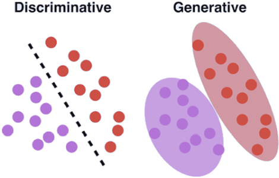
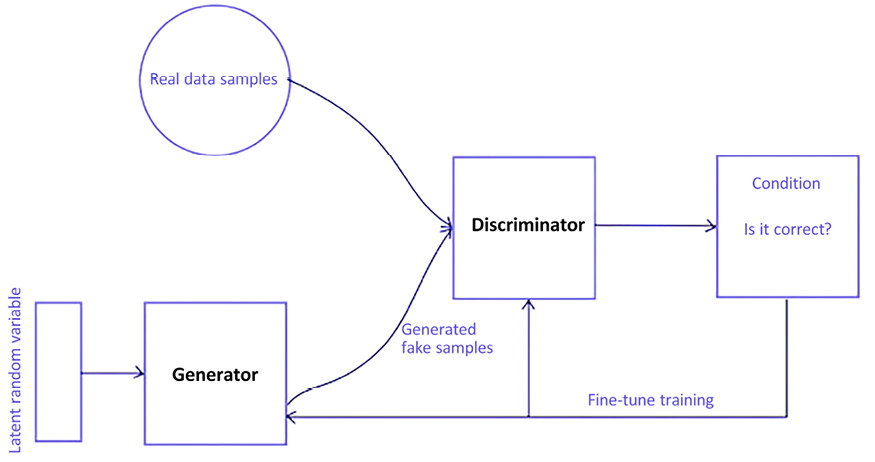
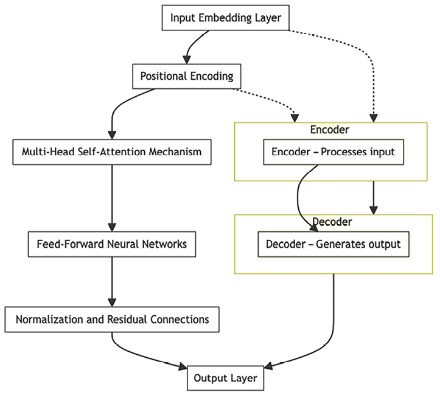
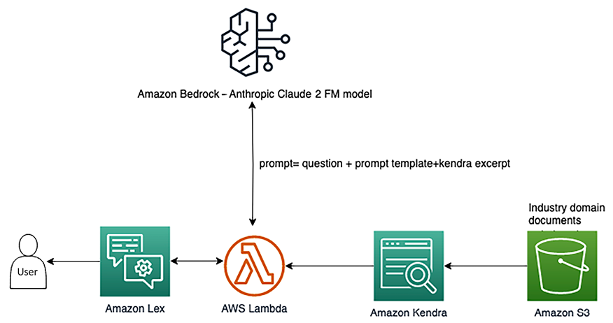

# معماری AI مولد

فناوری هوش مصنوعی مولد فراتر از اصطلاحات صنفی صرف است – یعنی ابزار پیشرفته ای است که برای تغییر شکل عملیات تجاری با خودکارسازی وظایف ضروری مانند تولید محتوا، ایجاد تصویر و کمک به دانش استفاده می شود. هوش مصنوعی مولد نشان دهنده یک جهش هیجان انگیز به جلو در دنیای فناوری است که شور و شوق قابل توجهی را در میان علاقه مندان به نوآوری های فناوری برانگیخته است. این شکل از فناوری که به عنوان GenAI مخفف هوش مصنوعی مولد شناخته می شود، به دلیل توانایی قابل توجه خود در تولید مستقل محتوای جدید مانند متن، تصاویر، موسیقی، ویدیوها، کدنویسی و غیره با قابلیت هایی که دقیقا شبیه انسان است، متمایز است. -مثل خلاقیت

استفاده از هوش مصنوعی مولد در حوزه های مختلف تجاری در حال افزایش است. در صورت استفاده خوب، می تواند زمان، منابع و هزینه های مورد نیاز برای راه اندازی یک کسب و کار را تا حد زیادی کاهش دهد. به عنوان مثال، ChatGPT می‌تواند به ایجاد کمپین‌های بازاریابی برای محصولات کمک کند یا به عنوان برنامه‌ریز سفر عمل کند، در حالی که Midjourney می‌تواند تصاویر را تنها در یک ثانیه تولید کند.

ممکن است با برنامه‌های هوش مصنوعی مولد مانند ChatGPT، Midjourney، Gemini (بارد سابق)، Amazon Q و Claude.ai و غیره مواجه شده باشید. این فناوری از اطلاعات زیادی که جمع آوری می کند، از جمله از اینترنت، یاد می گیرد و از آن دانش برای توسعه محتوای جدید استفاده می کند. مانند داشتن یک دستیار هوشمند است که می تواند انواع چیزها را بدون نیاز به کمک انسان برای هر جزئیات تولید کند. با این حال، درک این نکته ضروری است که این جادو نیست - این نتیجه یک مقدار زیادی از تفکر هوشمندانه و پیشرفت در زمینه فناوری است.

اما هیجان انگیزترین قسمت این است که می توانیم از این مدل های فونداسیون به طرق مختلف استفاده کنیم. برای مثال، می‌توان از آنها برای تولید محتوای خلاقانه، خودکارسازی خدمات مشتری با چت‌بات‌ها، بهبود تجزیه و تحلیل داده‌ها، ارائه توصیه‌های شخصی، ساده‌سازی ترجمه‌های زبان و حتی کمک به تحقیق با خلاصه کردن اسناد پیچیده استفاده کرد. در این فصل، با جزئیات بیشتر در مورد هوش مصنوعی مولد، از جمله:

هوش مصنوعی مولد چیست؟

- موارد استفاده از هوش مصنوعی
- معماری پایه سیستم های هوش مصنوعی مولد
- مدل های پایه AI مولد محبوب
- چگونه با هوش مصنوعی مولد شروع کنیم
- معماری مرجع هوش مصنوعی مولد
- چالش های پیاده سازی هوش مصنوعی مولد

برای یک سفر هیجان انگیز به دنیای هوش مصنوعی مولد آماده شوید. ما اسرار پشت توانایی های قابل توجه آن برای تأثیرگذاری بر مسیر دنیای جدیدمان را کشف خواهیم کرد.

# هوش مصنوعی مولد چیست؟

هوش مصنوعی مولد، هوش مصنوعی با توانایی قابل توجه در توسعه محتوا و ایده های جدید است. این شامل مواردی مانند مکالمه، ایجاد داستان، تولید تصاویر و ویدیوها و حتی ساخت موسیقی است.

در دسامبر 2022، تیم طراحی در **آزمایشگاه هوش مصنوعی در طراحی** (**AiDLab**) واقع در هنگ کنگ، یک نمایشگاه مد پیشگامانه با عنوان Fashion X AI ([https://www.fashionxai.com) ترتیب داد. /event-highlights-fashionshow](https://www.fashionxai.com/event-highlights-fashionshow)). این ویترین منحصر به فرد بود زیرا هر طرحی که در این رویداد به نمایش گذاشته شد توسط هوش مصنوعی ایجاد شد و از تابلوهای خلق و خوی، پالت های رنگی و مفاهیم ارائه شده توسط طراحان انسانی الهام گرفت.

مانند سایر انواع هوش مصنوعی، هوش مصنوعی مولد به مدل‌های **یادگیری ماشین** (**ML**) متکی است. این مدل ها بسیار بزرگ هستند و با استفاده از حجم وسیعی از داده ها از قبل آموزش داده شده اند. ما اغلب این مدل ها را **مدل های پایه** (**FMs**) می نامیم.

FMهایی که امروزه داریم (مانند OpenAI GPT-4 یا Google Gemini برای کارهای بزرگ زبان، Stable Diffusion from Stability AI برای تبدیل متن به تصویر، و OpenAI Sora مولد متن به ویدیو) می توانند وظایف مختلفی را در مناطق مختلف انجام دهند. آنها می توانند پست های وبلاگ بنویسند، تصاویر تولید کنند، مسائل ریاضی را حل کنند، مکالمه داشته باشند و حتی بر اساس اطلاعات موجود در یک سند به سوالات پاسخ دهند. این مدل ها فوق العاده همه کاره هستند و پتانسیل ایجاد انقلابی در نحوه ایجاد و تعامل ما با محتوا را دارند.

هوش مصنوعی مولد پتانسیل ایجاد تغییرات گسترده در اقتصاد جهانی را دارد. به گفته گلدمن ساکس، هوش مصنوعی مولد می تواند 7 درصد (یا تقریباً 7 تریلیون دلار) در تولید ناخالص داخلی جهانی افزایش یابد و رشد بهره وری را 1.5 درصد طی 10 سال افزایش دهد. جزئیات بیشتر را می‌توانید در گزارش گلدمن ساکس **هوش مصنوعی** (**AI**) در [https://www.goldmansachs.com/intelligence/artificial-intelligence/](https://www.goldmansachs) بخوانید. .com/هوش/هوش-مصنوعی/).

FM ها به دلیل اندازه و ماهیت همه منظوره خود متمایز می شوند و آنها را از مدل های سنتی ML که برای کارهای خاصی مانند تجزیه و تحلیل احساسات، طبقه بندی تصویر و پیش بینی روند طراحی شده اند، متمایز می کند. بر خلاف این مدل‌های سنتی، که نیاز به جمع‌آوری داده‌های برچسب‌گذاری شده، آموزش و استقرار برای هر کار دارند، FMها رویکرد چندمنظوره‌تری را ارائه می‌کنند. یک FM از پیش آموزش دیده می تواند برای کارهای مختلف تطبیق داده شود. علاوه بر این، این مدل‌ها می‌توانند برای انجام عملکردهای دامنه خاص که منحصر به کسب‌وکارها هستند، طراحی شوند. نکته مهم این است که این سفارشی سازی می تواند ب

e تنها با استفاده از کسری از داده ها، همراه با منابع محاسباتی مورد نیاز برای آموزش یک مدل از ابتدا به دست آمد.

موفقیت FM ها را می توان به سه دلیل اصلی نسبت داد:

- **معماری ترانسفورماتور**: معماری ترانسفورماتور، نوعی شبکه عصبی، نقش محوری دارد. کارآمد، مقیاس پذیر و قابل موازی سازی است و می تواند به طور موثر روابط داده های ورودی و خروجی را مدل کند.
- **آموزش درون متنی**: یک الگوی آموزشی پیشگامانه به نام یادگیری درون زمینه ای پدید آمده است. این رویکرد به مدل های از پیش آموزش دیده اجازه می دهد تا به دستورالعمل هایی برای کارهای جدید یا فقط چند نمونه مجهز شوند. این نیاز به آموزش اضافی در مورد داده‌های برچسب‌گذاری شده را حذف می‌کند و مدل‌ها را قادر می‌سازد فوراً برای کارهای جدید اعمال شوند.
- **رفتارهای اضطراری در مقیاس**: با افزایش اندازه مدل و استفاده از مجموعه داده های بزرگتر، مدل ها شروع به نمایش قابلیت هایی می کنند که قبلا دیده نشده بود. از این پدیده به عنوان "قابلیت های در حال ظهور" یاد می شود. برای مثال، مدل‌های بزرگ‌تر می‌توانند متن منسجم‌تر و مرتبط‌تری تولید کنند، الگوهای پیچیده در داده‌ها را تشخیص دهند، و حتی کارهایی مانند تشخیص تصویر و ترجمه زبان را با دقت بیشتری انجام دهند. آن‌ها همچنین می‌توانند به پرسش‌های استدلال چند مرحله‌ای رسیدگی کنند، توضیحات مفصلی ارائه دهند، و محتوای خلاقانه، مانند نوشتن موسیقی یا خلق آثار هنری، با درک و خلاقیت متفاوت تولید کنند. مدل های بزرگتر این پتانسیل را دارند که کارهایی را انجام دهند که فراتر از توانایی های آنها هستند قبل از رسیدن به اندازه بحرانی.

برای درک بهتر، اجازه دهید به چند مورد استفاده که در آن هوش مصنوعی مولد می تواند کمک کند، نگاه کنیم.

# موارد استفاده از هوش مصنوعی مولد

بیایید به موارد استفاده مختلف در دسته‌های مختلف مانند تجربه مشتری، تولید کارمند و کارایی عملیات تجاری نگاه کنیم و یاد بگیریم که چگونه هوش مصنوعی مولد قابلیت‌های هوش مصنوعی موجود را افزایش می‌دهد و امکانات کاملاً جدیدی را به وجود می‌آورد:

## تغییر تجربه مشتری

هوش مصنوعی مولد بازی را در نحوه تعامل مشتریان با مشاغل تغییر می دهد. تصور کنید در حال خرید آنلاین کفش هستید. یک دستیار مجازی مبتنی بر هوش مصنوعی در وب‌سایت به شما خوشامد می‌گوید و به شما کمک می‌کند جفت ایده‌آل را بر اساس ترجیحات سبک و اندازه خود پیدا کنید. حتی می تواند تصاویری از کفش ها را به شما نشان دهد و به هر سوالی که دارید پاسخ دهد. بیایید به موارد دیگری از این قبیل نگاه کنیم که در آن هوش مصنوعی مولد می تواند به بهبود تجربه و تعامل مشتری کمک کند:

- **چت ربات ها و دستیاران مجازی**: تصور کنید از یک وب سایت بازدید می کنید و یک ربات چت برای کمک به شما ظاهر می شود. هوش مصنوعی مولد این چت بات ها را تقویت می کند. آنها می توانند مانند انسان ها با شما صحبت کنند، سوالات شما را درک کنند و پاسخ های مفیدی ارائه دهند.
- **مراکز تماس هوشمند**: هوش مصنوعی مولد هنگامی که با خط تلفن خدمات مشتری تماس می گیرید کار می کند. این تضمین می کند که تعاملات شما شخصی تر، کارآمدتر و رضایت بخش تر است. مشکلات شما به سرعت و با دقت بررسی می شود.
- **شخصی سازی**: آیا متوجه شده اید که توصیه ها در سیستم عامل هایی مانند نتفلیکس و آمازون ترجیحات شما را درک می کنند؟ این هوش مصنوعی مولد در عمل است. از رفتارهای شما درس می گیرد و پیشنهادات خود را متناسب با سلیقه شما تنظیم می کند.
- **تعدیل محتوا**: هوش مصنوعی مولد به تمیز و ایمن نگه داشتن همه چیز در رسانه های اجتماعی و سایر سیستم عامل ها کمک می کند. محتوای تولید شده توسط کاربر، مانند نظرات و پست‌ها را اسکن می‌کند تا مطمئن شود از قوانین و دستورالعمل‌ها پیروی می‌کنند.

## افزایش بهره وری کارکنان

هوش مصنوعی مولد فقط برای مشتریان نیست. همچنین بهره وری کارکنان را افزایش می دهد. تصور کنید که روی یک پروژه کار می کنید و باید گزارشی در مورد آن بنویسید. به جای اینکه از صفر شروع کنید، از هوش مصنوعی مولد برای کمک به نوشتن مقدمه و نکات مهم استفاده می کنید. این به شما یک شروع عالی می دهد و می توانید روی افزودن بینش و تخصص خود تمرکز کنید. در اینجا چند مورد استفاده وجود دارد که در آن هوش مصنوعی مولد به افزایش بهره وری کارکنان کمک می کند:

- **جستجوی مکالمه**: ممکن است در صورت نیاز به اطلاعات از یک سیستم جستجو استفاده کنید. هوش مصنوعی مولد این سیستم ها را هوشمندتر می کند. شما می توانید به زبان روزمره سوالاتی بپرسید و هوش مصنوعی متوجه می شود و پاسخ های صحیح را به شما می دهد.
- **تولید محتوا**: نوشتن گزارش و مقاله زمان زیادی می برد. هوش مصنوعی مولد در اینجا نیز کمک می کند. می‌تواند بخش‌های محتوا، مانند خلاصه‌ها یا توضیحات، تولید کند که می‌توانید از آنها برای ایجاد اسناد صیقلی استفاده کنید.
- **خلاصه متن**: تصور کنید در حال خواندن یک مقاله تحقیقاتی طولانی هستید. به جای مرور همه صفحات، هوش مصنوعی مولد می تواند نکات اصلی را خلاصه کند. این باعث صرفه جویی در زمان می شود و به شما کمک می کند تا اطلاعات ضروری را سریعتر درک کنید.
- ** ایجاد کد **: برای برنامه نویسان، نوشتن کد بخش بزرگی از کار است. هوش مصنوعی مولد می تواند با پیشنهاد قطعه کد بر اساس آنچه شما در تلاش برای رسیدن به آن هستید کمک کند. این کار برنامه نویسی را سرعت می بخشد و توسعه را روان تر می کند.

هنگام ادغام هوش مصنوعی مولد در سناریوهای سازمانی، مهم است که ملاحظات قانونی را در مورد محتوایی که تولید می کند بررسی کنید. شما باید منبع محتوا را بدانید و ایجاد حقوق مالکیت واضح برای جلوگیری از اختلافات مالکیت معنوی ضروری است. موانع بالقوه ای برای پذیرش وجود دارد، مانند conc

در مورد نقض حق چاپ و حفظ حریم خصوصی داده ها خطا می کند. برای کاهش این خطرات، شرکت‌های شما می‌توانند با استفاده از داده‌های اختصاصی، دستیارهای هوش مصنوعی تولیدی خود را توسعه دهند. این رویکرد نه تنها به جلوگیری از عوارض قانونی کمک می کند، بلکه تضمین می کند که محتوای تولید شده با نیازهای خاص سازمان هماهنگ است و ارزش منحصر به فرد خود را حفظ می کند.

## بهینه سازی عملیات تجاری

هوش مصنوعی مولد به تعامل با مشتری محدود نمی شود. همچنین جنبه های مختلف عملیاتی را افزایش می دهد. در یک کارخانه تولیدی، ماشین‌ها توسط حسگرها نظارت می‌شوند. هوش مصنوعی مولد داده‌های این حسگرها را تجزیه و تحلیل می‌کند و پیش‌بینی می‌کند که چه زمانی دستگاه احتمالاً دچار مشکل می‌شود. این اجازه می دهد تا تعمیر و نگهداری به طور فعال برنامه ریزی شود و از خرابی های غیرمنتظره و وقفه های تولید جلوگیری شود. موارد زیر چند مورد استفاده است که در آن هوش مصنوعی مولد به بهبود عملیات تجاری کمک می کند:

- **پردازش هوشمند اسناد**: در مشاغل، اسناد زیادی برای رسیدگی وجود دارد. هوش مصنوعی مولد می تواند این اسناد را بخواند و درک کند و اطلاعات معنی دار را به طور خودکار استخراج کند. این باعث صرفه جویی در زمان و کاهش خطا می شود. به عنوان مثال، مدل هوش مصنوعی مولد می‌تواند اسناد وام مسکن را دریافت کند و به سؤالات مربوط به نرخ وام مسکن، شرایط پرداخت، مدت زمان و غیره پاسخ دهد.
- **تعمیر و نگهداری پیش بینی کننده**: برای شرکت هایی که از ماشین آلات استفاده می کنند، پیش بینی اینکه چه زمانی تجهیزات نیاز به تعمیر و نگهداری دارند بسیار مهم است. هوش مصنوعی مولد داده‌های ماشین‌ها و سیستم‌ها را برای پیش‌بینی نیازهای تعمیر و نگهداری، جلوگیری از خرابی و به حداقل رساندن زمان خرابی تجزیه و تحلیل می‌کند.
- **کنترل کیفیت و بازرسی بصری**: اطمینان از مطابقت محصولات با استانداردهای بالا در تولید ضروری است. هوش مصنوعی مولد می‌تواند تصاویر محصولات را بررسی کند، عیوب یا ناهماهنگی‌هایی را که چشم انسان ممکن است از دست بدهد، شناسایی کند.
- **افزایش داده**: آموزش مدل های هوش مصنوعی به داده های زیادی نیاز دارد. هوش مصنوعی مولد در اینجا با ایجاد داده های مصنوعی که می تواند برای بهبود دقت و قابلیت اطمینان این مدل ها استفاده شود، کمک می کند.

در این بخش با موارد استفاده از هوش مصنوعی مولد آشنا شدید. اکنون، بیایید با یادگیری معماری هوش مصنوعی مولد، آنچه را در پشت صحنه می گذرد، بیاموزیم.

# معماری اساسی سیستم های هوش مصنوعی مولد

در قلب سیستم های هوش مصنوعی مولد یک FM عظیم قرار دارد. FMS مدل‌های در مقیاس بزرگ و از پیش آموزش‌دیده‌ای هستند که بر روی مجموعه داده‌های وسیعی آموزش دیده‌اند و می‌توانند برای طیف گسترده‌ای از وظایف و کاربردها به‌خوبی تنظیم یا تطبیق داده شوند. برای درک معماری سیستم های هوش مصنوعی مولد، اجازه دهید آن را به اجزای ساده تقسیم کنیم:

- **Generator**: عنصر اصلی که داده‌های جدید را تولید می‌کند، چه تصاویر، متن، موسیقی یا سایر اشکال محتوا. مولد الگوها و روابط را از داده های موجود می آموزد و از این دانش برای تولید محتوای جدید و مشابه استفاده می کند. برای مثال، ژنراتور در تولید تصویر نویز تصادفی می گیرد و تصاویری شبیه داده های آموزشی تولید می کند.
- **فضای نهفته**: فضای مفهومی که مدل داده ها را به صورت فشرده نمایش می دهد. این مانند یک نمایش فشرده از داده هایی است که مولد برای ایجاد محتوای جدید استفاده می کند. این یک فضای برداری با ابعاد پایین تر است که ژنراتور داده ها را از آن تولید می کند. این مانند کتاب دستور پخت مخفی یک هنرمند است. این به ژنراتور کمک می کند تا انواع مختلفی از خلاقیت ها را ارائه دهد. به عنوان مثال، فضای پنهان می تواند نشان دهنده سبک های مختلف نوشتاری در تولید متن باشد. در سنتز تصویر، فضای پنهان ممکن است ویژگی های مختلفی مانند رنگ و بافت را نشان دهد.
- **عملکرد از دست دادن**: اندازه گیری میزان مطابقت محتوای تولید شده با خروجی مورد نظر. تابع ضرر به مدل کمک می کند تا در طول زمان با به حداقل رساندن تفاوت بین داده های تولید شده و واقعی، یاد بگیرد و بهبود یابد. تصور کنید یک مربی به یک هنرمند می گوید که کار او چقدر به کمال نزدیک است. هنرمند با پیروی از این راهنمایی یاد می گیرد و بهتر می شود.
- **داده های آموزشی**: داده های موجود که مدل از آنها یاد می گیرد. این می تواند تصاویر، متن، صدا یا هر نوع محتوای دیگری باشد که مدل از آن یاد می گیرد. درست مانند یک سرآشپز که با چشیدن غذاهای مختلف یاد می گیرد، ژنراتور هم از نمونه هایی می آموزد که چه چیزی باید خلق کند. برای مثال، اگر آهنگ می‌سازد، از گوش دادن به آهنگ‌های موجود یاد می‌گیرد.

## انواع مدل های مولد

قبل از یادگیری در مورد مدل های مولد، بیایید بیاموزیم که چگونه آنها با مدل متمایز کننده ML معمولی تفاوت دارند. یک مدل متمایز کننده ML معمولی، که به عنوان مدل تمایز نیز شناخته می شود، برای تمایز بین کلاس ها یا دسته های مختلف داده طراحی شده است. بر خلاف مدل‌های مولد که هدفشان تولید نقاط داده جدید است، مدل‌های متمایز بر تمایز نقاط داده موجود بر اساس ویژگی‌هایشان تمرکز می‌کنند. این مدل ها احتمال یک نتیجه معین را بر اساس داده های ورودی پیش بینی می کنند. نمونه‌های رایج مدل‌های ML متمایز شامل رگرسیون لجستیک، ماشین‌های بردار پشتیبان و غیره است. این مفهوم را در _فصل 13_، _معماری یادگیری ماشینی_ به تفصیل یاد گرفتید.

مدل‌های تولیدی خود را از مدل‌های متمایز متمایز می‌کنند، که برای دسته‌بندی یا برچسب‌گذاری متن بر اساس گروه‌بندی‌های از پیش تعریف‌شده طراحی شده‌اند. حالت تبعیض آمیز

معمولاً در برنامه‌هایی مانند تشخیص چهره به کار می‌روند، جایی که آموزش آن‌ها بر شناسایی ویژگی‌ها یا ویژگی‌های خاص در ظاهر فرد متمرکز است.

شکل 14.1: مدل های مولد در مقابل مدل های متمایز

همانطور که در نمودار قبل نشان داده شده است، مدل های مولد سعی در درک الگوها و ساختار درون داده ها دارند. مثل این است که آن‌ها قوانین پنهان یک بازی را یاد می‌گیرند و سپس از آن قوانین برای ایجاد چیزی جدید که شبیه بازی اصلی است استفاده می‌کنند. از سوی دیگر، مدل‌های متمایز بر تفکیک چیزها تمرکز می‌کنند. آنها مانند کارآگاهانی هستند که برای تشخیص تفاوت بین چیزها آموزش دیده اند. مدل‌های متمایز معمولاً برای وظایف یادگیری نظارت شده انتخاب می‌شوند که هدف آن طبقه‌بندی یا رگرسیون است، در حالی که مدل‌های مولد زمانی انتخاب می‌شوند که هدف درک توزیع داده یا تولید نقاط داده جدید باشد.

هوش مصنوعی مولد مدل های مختلفی را در بر می گیرد که محتوای جدید ایجاد می کنند. در زیر بخش های زیر به برخی از انواع قابل توجه نگاه خواهیم کرد.

### شبکه های متخاصم مولد (GAN)

GAN ها از دو جزء تشکیل شده اند: مولد و تفکیک کننده. نقش تولیدکننده تولید محتوا است و وظیفه تمایزکننده قضاوت در مورد صحت آن محتوا و تعیین واقعی یا تقلبی بودن آن است. آنها درگیر نوعی «رقابت» می‌شوند، جایی که هدف تولیدکننده ایجاد محتوایی است که به اندازه کافی قانع‌کننده باشد تا متمایزکننده را فریب دهد. با ادامه این فرآیند، تولیدکننده به تدریج در ایجاد محتوایی که به طور فزاینده ای واقعی به نظر می رسد، بهبود می یابد. نمودار زیر عملکرد مدل GAN را نشان می دهد:

شکل 14.2: جریان آموزشی GAN ها

نمودار قبلی ساختار اصلی یک GAN را نشان می دهد. بیایید به هر مرحله با مثال ایجاد تصویر نگاه کنیم:

- **Generator**: این جزء از GAN نویز تصادفی را به عنوان ورودی خود می گیرد. این نویز اغلب به عنوان "متغیر تصادفی پنهان" نامیده می شود. نقش مولد تولید داده هایی است که شبیه به داده های واقعی است که روی آن آموزش دیده است. این را به عنوان یک هنرمند در حال آموزش تصور کنید که در ابتدا طرح های تصادفی را بر اساس برخی الگوهای اولیه آثار هنری ایجاد می کند. به عنوان مثال، ژنراتور با ایجاد تصاویر تصادفی که در نظر گرفته شده است مانند نقاشی های معروف شروع شود.
- **نمونه های داده واقعی**: اینها نمونه های داده معتبری هستند که GAN برای تقلید طراحی شده است. آنها به عنوان معیاری برای کیفیت داده هایی که مولد ایجاد می کند عمل می کنند. در مثال ما، اینها نقاشی‌های معروف واقعی از تاریخ هستند، شاهکارهایی که مولد سعی دارد از آنها تقلید کند. برای مثال، نقاشی‌های معتبر هنرمندانی مانند ون گوگ یا پیکاسو به عنوان نمونه‌هایی از آثار هنری «واقعی» به GAN وارد می‌شوند.
- **نمونه های جعلی تولید شده**: مولد از نویز ورودی برای ایجاد نمونه های داده جدید استفاده می کند. در نظر گرفته شده است که این نمونه‌ها از نمونه‌های داده واقعی غیرقابل تشخیص باشند، اگرچه آنها کاملاً توسط مدل تولید می‌شوند. اینها تصاویر جدیدی هستند که ژنراتور ایجاد می کند و سعی می کند کیفیت و سبک نمونه کارهای هنری واقعی را تکرار کند. برای مثال، مولد تصاویری تولید می‌کند که از قلم‌موها و طرح‌های رنگی آثار ون گوگ یا پیکاسو تقلید می‌کنند.\* **تمایزگر**: این مؤلفه هم نمونه‌های داده واقعی و هم نمونه‌های جعلی تولید شده توسط ژنراتور را می‌گیرد. وظیفه آن تمایز بین این دو است و به طور موثر تصمیم می گیرد که آیا هر نمونه ای که دریافت می کند واقعی است یا تقلبی. این را به عنوان یک منتقد هنری در نظر بگیرید که هم شاهکارهای واقعی و هم تصاویر تولید شده را بررسی می کند تا تصمیم بگیرد که آیا تصاویر جدید آثار هنری واقعی هستند یا تقلید. برای مثال، تمایزکننده تصاویر را مرور می‌کند و تلاش می‌کند تا مشخص کند کدام یک از نقاشی‌های واقعی ون گوگ یا پیکاسو هستند و کدام‌ها تقلید هستند.
- **شرط**: متمایز کننده در مورد واقعی یا جعلی بودن داده ها تصمیم می گیرد و این اطلاعات را به عنوان بازخورد در اختیار مولد قرار می دهد. منتقد هنری (تبعیض کننده) تصاویر تولید شده را ارزیابی می کند و بازخورد می دهد، مثلاً اشاره می کند که کدام جنبه ها باعث جعلی به نظر رسیدن آنها می شود. برای مثال، متمایزکننده توجه می‌کند که پالت رنگ در یک تصویر تولید شده کاملاً با سبک هنرمند اصلی مطابقت ندارد و آن را جعلی می‌نامد.
- **آموزش دقیق**: بر اساس ارزیابی های متمایز کننده، مولد پارامترهای خود را در تلاش برای ایجاد نمونه های جعلی بهتری تنظیم می کند که احتمال فریب دادن متمایز کننده را بیشتر می کند. این حلقه بازخورد با تمایز دهنده ادامه می یابد و توانایی خود را برای تشخیص واقعی از جعلی بهبود می بخشد. این فرآیند خصمانه تا زمانی ادامه می یابد که مولد در ایجاد داده های واقعی ماهر شود. بر اساس بازخورد، هنرمند در حال آموزش (مولد) از انتقاد یاد می گیرد و تکنیک خود را برای خلق آثار هنری قانع کننده تر بهبود می بخشد. به عنوان مثال، با در نظر گرفتن بازخورد، ژنراتور تکنیک خود را تنظیم می کند، شاید ترکیب رنگ یا سبک قلم مو را برای تقلید بهتر از شاهکارها تغییر دهد.

مولد و متمایز کننده اساساً در یک بازی پیوسته و با تلاش مولد هستند

تلاش برای تولید داده‌های واقعی و فزاینده، و تمایزکننده تلاش می‌کند تا در تشخیص داده‌های واقعی از جعلی بهتر عمل کند. "آموزش" زمانی کامل می شود که متمایز کننده دیگر نتواند به طور قابل اعتماد داده های جعلی را از داده های واقعی تشخیص دهد، به این معنی که خروجی مولد به طور قانع کننده ای واقع بینانه است.

GAN ها چندین کاربرد عملی در حوزه های تجاری دارند. بسیاری از ابزارهای محبوب از این مدل استفاده می کنند.

### رمزگذارهای خودکار متغیر (VAE)

تصور کنید توده ای عظیم از بلوک های لگو در اشکال و اندازه های مختلف دارید و وظیفه شما این است که آنها را به طور مرتب در یک جعبه کوچک ذخیره کنید. اما یک نکته وجود دارد: شما فقط می‌توانید دستورالعمل‌های نحوه بازسازی ساختارهای اصلی لگو را ذخیره کنید، نه خود بلوک‌ها. این شبیه کاری است که VAE ها با داده ها انجام می دهند.

در این قیاس، «رمزگذار» مانند این است که شما هر ساختار لگو را می‌گیرید، بهترین راه را برای بازسازی آن با استفاده از بلوک‌های کمتر پیدا می‌کنید و سپس آن دستورالعمل‌ها را یادداشت می‌کنید. فضای داخل جعبه کوچک شما، جایی که این دستورالعمل ها را در آن نگه می دارید، مانند "فضای نهفته" است - یک نسخه فشرده از ساختارهای اصلی.

بعداً، وقتی می خواهید یک سازه لگو را بازسازی کنید، به دستورالعمل های خود در جعبه نگاه می کنید. «رمزگشا» مانند این است که شما آن دستورالعمل‌ها را دنبال می‌کنید تا یک ساختار لگو جدید بسازید که بسیار شبیه به ساختار اصلی با استفاده از مجموعه‌ای از بلوک‌های جدید است.

بنابراین، یک VAE داده‌های بزرگ و پیچیده (ساختارهای اصلی لگو) را می‌گیرد، آن‌ها را به شکل ساده‌تر و کوچک‌تر فشرده می‌کند (دستورالعمل‌های موجود در جعبه)، و سپس از آن فرم فشرده برای تولید داده‌های جدید مشابه داده‌های اصلی استفاده می‌کند (بازسازی لگو). سازه های). این فرآیند در فناوری برای کارهایی مانند ایجاد تصاویر جدید، موسیقی یا هر محتوای دیجیتالی که سبک داده های اصلی را تقلید می کند مفید است. همانطور که در نمودار زیر نشان داده شده است، یک تصویر دست نویس با استفاده از VAE کدگذاری و رمزگشایی می شود:

شکل 14.3: جریان بازسازی تصویر با استفاده از VAE

نمودار قبلی جریان فرآیند بازسازی تصویر را با استفاده از VAE نشان می دهد. در اینجا توضیحی در مورد نحوه عملکرد VAE ها برای این کار با مثالی از بازسازی چهره یک فرد آمده است:

- **تصاویر ورودی**: اینها تصاویر اصلی هستند که به سیستم VAE وارد می کنید. هدف این است که بتوانیم این تصاویر را پس از کدگذاری و رمزگشایی بازسازی کنیم. فرض کنید مجموعه ای از عکس های چهره داریم. هر تصویر یک عکس واضح و با وضوح بالا از صورت یک شخص است.\* **Encoder**: بخش رمزگذار یک VAE تصاویر ورودی را می گیرد و آنها را در یک نمایش کوچکتر و فشرده تر به نام فضای پنهان یا تصویر فشرده می کند. رمزگذاری ها این فرآیند شامل یادگیری ویژگی ها و الگوهای اساسی موجود در تصاویر ورودی است. رمزگذار عکس‌های ورودی را تجزیه و تحلیل می‌کند و هر کدام را در مجموعه‌ای کوچک‌تر از اعداد فشرده می‌کند که ویژگی‌های کلیدی چهره‌ها، مانند شکل چشم‌ها، بینی و دهان را توصیف می‌کند. تصور کنید مانند ایجاد یک کد منحصر به فرد است که می تواند چهره را در فضای بسیار کمتری نسبت به تصویر اصلی نشان دهد.
- **رمزگذاری تصویر**: در این مرحله، رمزگذار تصاویر ورودی را به مجموعه ای از رمزگذاری ها ترجمه کرده است که ویژگی های کلیدی تصاویر را با ابعاد بسیار کاهش یافته نسبت به تصاویر اصلی نشان می دهد. در زمینه VAE، این رمزگذاری ها توزیع احتمال داده های ورودی را نیز ضبط می کنند. این مجموعه اعداد (رمزگذاری‌ها) جوهره عکس‌ها هستند که به شکل فشرده ذخیره می‌شوند که می‌توانیم آن‌ها را به عنوان ویژگی‌های دقیق تصاویر در نظر بگیریم. در مورد چهره ها، این ویژگی ها ممکن است تغییرات در ویژگی های صورت را در بین افراد مختلف نشان دهد.
- **رمزگشا**: رمزگشا این کدگذاری ها را می گیرد و سعی می کند تصاویر اصلی را بازسازی کند. از داده های فشرده برای تولید تصاویری استفاده می کند که تا حد امکان به تصاویر ورودی اصلی نزدیک هستند. رمزگشا مانند هنرمندی عمل می کند که وظیفه ترسیم چهره یک فرد را دارد. این کدهای عددی را می گیرد و از آنها برای بازسازی عکس چهره ها استفاده می کند. سعی می کند هر چهره را تا حد امکان دقیق ترسیم کند، فقط از این کد فشرده.
- **تصاویر بازسازی شده**: خروجی نهایی یک VAE. اینها تصاویری هستند که توسط رمزگشا از رمزگذاری های تصویر بازسازی شده اند. کیفیت این تصاویر بستگی به این دارد که VAE چقدر خوب فشرده سازی و بازسازی داده ها را یاد گرفته است. نتیجه مجموعه ای از عکس های چهره جدید است که توسط VAE تولید شده است. این تصاویر بازسازی شده باید شباهت زیادی به عکس های ورودی اصلی داشته باشند. اگر بخواهید آنها را کنار هم با نسخه های اصلی مقایسه کنید، آنها را مشابه می بینید، اگرچه ممکن است کمی تار باشند یا به دلیل از بین رفتن جزئیات در طول فرآیند فشرده سازی، تفاوت های جزئی داشته باشند.

در اصل، این جریان توانایی یک VAE را برای یادگیری بازنمایی های کارآمد از داده ها و تولید داده های جدید که شبیه ورودی اصلی است را توصیف می کند. این فرآیند در کاربردهای مختلفی از جمله حذف نویز تصویر، رنگ‌زدایی و به عنوان یک مدل تولیدی برای ایجاد تصاویر جدید که ویژگی‌های مشترک با مجموعه داده آموزشی را به اشتراک می‌گذارند، استفاده می‌شود.

### مدل های مولد مبتنی بر ترانسفورماتور

این مدل ها مانند GPT-4 bui هستند

این بر معماری ترانسفورماتور است که در درک و تولید توالی داده ها مانند متن برتری دارد. آنها الگوهایی را در زبان و زمینه می آموزند و به آنها اجازه می دهد متنی منسجم و مرتبط با زمینه تولید کنند. نمودار زیر عملکرد ترانسفورماتور را در مدل نشان می دهد:

شکل 14.4: جزء مدل های مولد مبتنی بر ترانسفورماتور

نمودار قبلی گردش کار یک مدل ترانسفورماتور را نشان می دهد که یک نوع شبکه عصبی پیشرفته است که در کارهای **پردازش زبان طبیعی** (**NLP**) مانند ترجمه، تولید متن و موارد دیگر استفاده می شود. بیایید به هر مرحله با مثال ترجمه زبان نگاه کنیم:

- **لایه جاسازی ورودی**: فرآیند با لایه جاسازی ورودی آغاز می شود، جایی که عناصر جداگانه (مانند کلمات در یک جمله) به بردارهای عددی تبدیل می شوند که مدل می تواند آنها را پردازش کند. به عنوان مثال، جمله "چطوری؟" وارد مدل می شود و هر کلمه به یک بردار عددی تبدیل می شود. این مانند این است که به هر کلمه یک شماره نشان منحصر به فرد و قابل شناسایی بدهید تا مدل بتواند آنها را بفهمد و دستکاری کند.
- **رمزگذاری موقعیت**: رمزگذاری موقعیتی به این بردارها اضافه می شود تا به مدل اطلاعاتی درباره موقعیت هر کلمه در جمله بدهد زیرا ترانسفورماتورها به طور ذاتی ترتیب کلمات را درک نمی کنند. به عنوان مثال، همراه با شماره نشان، به هر کلمه یک برچسب موقعیت داده می شود. "How" به عنوان اولین کلمه، "are" به عنوان کلمه دوم و "شما" به عنوان کلمه سوم برچسب گذاری شده است. این به مدل کمک می‌کند ترتیب کلمات را در نظر بگیرد.\* **Encoder**: جاسازی‌های ترکیبی (جاسازی‌های ورودی به اضافه کدگذاری موقعیتی) سپس به رمزگذار وارد می‌شوند. رمزگذار داده های ورودی را پردازش می کند و زمینه هر کلمه را نسبت به بقیه در دنباله ضبط می کند. مثل این است که رمزگذار جمله را می خواند و معنای هر کلمه را در متن کل جمله می فهمد. رمزگذار کلمات را با شماره نشان و برچسب موقعیت آنها بررسی می کند تا معنای جمله را بفهمد. به عنوان مثال، اشاره می کند که "چگونه" در موقعیت اول معمولاً یک سوال را شروع می کند.
- **مکانیسم خودتوجهی چند سر **: در داخل رمزگذار، مکانیسم خودتوجهی چند سر به مدل اجازه می دهد تا تأثیر قسمت های مختلف ورودی را متفاوت ارزیابی کند. گویی مدل با نگاه کردن به سایر کلمات اطراف آن، جنبه های مختلف معنای یک کلمه را در نظر می گیرد. رمزگذار توجه ویژه ای به نحوه ارتباط هر کلمه در جمله با هر کلمه دیگر دارد. برای مثال، متوجه می‌شود که «چگونه» به «شما» متصل می‌شود تا یک تحقیق مودبانه در مورد بهزیستی کسی شکل دهد.
- **شبکه های عصبی پیشخور **: در مرحله بعد، اطلاعات پردازش شده از طریق شبکه های عصبی پیشخور عبور می کند، که بیشتر داده ها را به صورت متوالی در هر لایه پردازش می کند تا نمایش را اصلاح و انتزاع کند. این شبکه‌ها اطلاعات مکانیسم توجه را اصلاح می‌کنند، تقریباً مانند گروهی از ویراستاران که یک پیش‌نویس را صیقل می‌دهند تا هدف یک جمله را بهتر منتقل کنند.
- ** عادی سازی و اتصالات باقیمانده **: در طول مسیر، عادی سازی و اتصالات باقیمانده برای کمک به حفظ جریان داده و کاهش خطر خطاهای تبدیل داده در لایه های عمیق تر شبکه اعمال می شود. این عناصر تضمین می‌کنند که اطلاعاتی که از طریق مدل جریان می‌یابد نه خیلی ضعیف و نه خیلی تقویت شده است. برای جلوگیری از رشد خطاها در لایه‌های شبکه، این اجزا مانند نقاط بازرسی عمل می‌کنند که داده‌ها را در مسیر درست نگه می‌دارند.
- **رمزگشا**: پس از اینکه رمزگذار ورودی را پردازش کرد، رمزگشا از این اطلاعات برای تولید خروجی استفاده می کند. داده های پردازش شده را از رمزگذار دریافت می کند و شروع به تولید دنباله تبدیل شده می کند، مانند ترجمه جمله به زبان دیگر یا ایجاد پاسخ در یک گفتگو. رمزگشا اطلاعات پردازش شده را از رمزگذار می گیرد و شروع به تولید خروجی می کند. اگر در حال ترجمه باشد، شروع به تولید جمله ترجمه می‌کند.\* **لایه خروجی**: خروجی نهایی رمزگشا به لایه خروجی ارسال می‌شود که خروجی شبکه عصبی پیشرفته را به یک قالب قابل خواندن، مانند یک جمله، ترجمه می‌کند. به زبان انسان اینجاست که خروجی نهایی شروع به شکل گیری می کند. اگر مدل در حال ترجمه جمله باشد، این لایه شروع به ساخت ترجمه بر اساس تمام اطلاعات پردازش شده می کند.

مدل ترانسفورماتور داده‌های ورودی (جمله، پاراگراف و غیره) را می‌خواند و درک می‌کند، آن‌ها را برای درک متن پردازش می‌کند و بر اساس آن درک، خروجی مربوطه را تولید می‌کند. برای «حالت چطور است؟»، بخش رمزگذار مدل سؤال را پردازش می‌کند، در حالی که رمزگشا پاسخ یا ترجمه‌ای را هر بار یک کلمه تولید می‌کند و هم اطلاعات رمزگذار و هم آنچه قبلاً تولید کرده است را در نظر می‌گیرد.

رمزگذار را به عنوان بخشی که به اطلاعات ورودی نگاه می کند و رمزگشا را به عنوان بخشی که خروجی را ایجاد می کند، در نظر بگیرید. به عنوان مثال، GPT-4 بر اساس مدل ترانسفورماتور است. وقتی به آن نقطه شروع می دهید، می تواند متنی را تولید کند که منطقی و متناسب با زمینه باشد.

این مدل از «خود

توجه» برای تعیین اینکه کدام کلمات در نقطه شروع مهم هستند و چگونه به هم متصل می شوند. به این ترتیب، واقعاً می‌تواند آنچه را که می‌خواهید بفهمد و به شما پاسخ خوبی بدهد.

### دیگر مدل های مهم مولد

به غیر از انواع ذکر شده، مدل های مولد قابل توجه دیگری نیز وجود دارد:

- **PixelCNN و PixelRNN**: این مدل ها تصاویر پیکسل به پیکسل تولید می کنند و جزئیات پیچیده و وابستگی های درون تصویر را ثبت می کنند. تصور کنید که یک تصویر پیکسل به پیکسل رسم کنید، و مطمئن شوید که هر پیکسل با پیکسل های اطرافش مطابقت دارد.
- **مدل های مبتنی بر جریان **: این مدل ها یاد می گیرند که چگونه یک توزیع داده را به دیگری تبدیل کنند و به آنها اجازه می دهد نمونه هایی مطابق با توزیع مورد نظر تولید کنند. این دستور العملی است که طبق دستورالعمل های خاص مواد ساده را به یک غذای فانتزی تبدیل می کند.

این مدل‌های تولیدی دارای نقاط قوت و کاربردهایی هستند که آن‌ها را برای طیف وسیعی از وظایف، از تولید تصویر تا ایجاد متن، مناسب می‌سازد. قابلیت های متنوع آنها به چشم انداز غنی هوش مصنوعی مولد کمک می کند.

## اهمیت تنظیم و تنظیم هایپرپارامتر در معماری ها

تنظیم و تنظیم هایپرپارامتر، تنظیمات دقیق و ایمنی برای معماری های هوش مصنوعی مولد هستند. به عنوان مثال، در تولید تصویر، ممکن است فراپارامترهایی مانند نرخ یادگیری را تنظیم کنید، که تعیین می کند مدل با چه سرعتی یاد می گیرد. اگر بیش از حد بالا باشد، مدل ممکن است الگوهای اشتباهی را یاد بگیرد، مانند کسی که یاد می گیرد آهنگی را با پیانو بنوازد اما کلیدها را خیلی محکم یا خیلی آرام فشار می دهد. منظم‌سازی ممکن است شامل تکنیک‌هایی مانند ترک تحصیل باشد، که در آن شما به‌طور تصادفی برخی از نورون‌های مدل را در طول تمرین نادیده می‌گیرید تا مدل قوی شود، دقیقاً مانند تمرین یک تیم فوتبال با برخی بازیکنان که بیرون نشسته‌اند تا تیم بیش از حد به هیچ بازیکنی تکیه نکند. آنها نقش مهمی در ایجاد این سیستم ها و ایجاد محتوای با کیفیت بالا دارند. اهمیت آنها را درک کنیم.

### تنظیم فراپارامتر

فراپارامترها را به عنوان دستگیره ها و سوئیچ هایی در نظر بگیرید که نحوه یادگیری و ایجاد سیستم هوش مصنوعی مولد را کنترل می کنند. آنها بر مواردی مانند سرعت یادگیری، سطح جزئیات در خروجی و تعادل بین خلاقیت و دقت تأثیر می گذارند.

تصور کنید در حال تلاش برای یافتن دمای مناسب فر برای پخت کیک هستید. خیلی داغ است و می سوزد. خیلی سرد می شود و لکه دار می ماند. تنظیم فراپارامتر مشابه است. این به تنظیم پارامترها کمک می کند تا سیستم هوش مصنوعی به بهترین شکل یاد بگیرد و محتوایی درست کند.

برای مثال، هایپرپارامترها ممکن است طول ملودی ها، تمپو یا سازهای مورد استفاده در یک سیستم تولید موسیقی را کنترل کنند. تنظیم آنها تضمین می کند که موسیقی هماهنگ و با سبک مورد نظر مطابقت دارد.

### منظم سازی

منظم سازی مانند افزودن توری های ایمنی به طناب واکر است. این مانع از فریب بیش از حد سیستم هوش مصنوعی و ایجاد محتوای بیش از حد وحشیانه یا غیر واقعی می شود. این راهی برای کنترل خروجی و اطمینان از رفتار مناسب آن است.

در یک سیستم هوش مصنوعی مولد، منظم‌سازی به جلوگیری از برازش بیش از حد کمک می‌کند. تطبیق بیش از حد زمانی است که سیستم در تقلید از داده های آموزشی بسیار خوب می شود اما برای داده های جدید و نادیده نیاز به کمک دارد. تکنیک‌های منظم‌سازی اضافه کردن جریمه‌های جزئی به بخش‌های خاصی از فرآیند یادگیری را شبیه‌سازی می‌کند و به سیستم کمک می‌کند تا بهتر تعمیم یابد و محتوای متنوع‌تر و خلاقانه‌تری ایجاد کند.

به عنوان مثال، منظم‌سازی در یک سیستم تولید تصویر ممکن است تضمین کند که تصاویر تولید شده دارای رنگ‌ها و شکل‌های ثابتی هستند و از به نظر رسیدن بیش از حد نویز یا عجیب و غریب جلوگیری می‌کند.

تنظیم و تنظیم فراپارامتر اهمیت دارد زیرا عملکرد سیستم هوش مصنوعی مولد را به خوبی تنظیم می کند و از تولید محتوای با کیفیت بالا، سازگار و واقعی اطمینان می دهد. بدون آنها، سیستم ممکن است محتوایی ایجاد کند که خیلی خسته کننده باشد یا محتوایی که بیش از حد آشفته و بی معنی باشد.

درست مانند یک آشپز که زمان پخت و پز را تنظیم می کند و ادویه های مناسب را برای تهیه یک غذای عالی اضافه می کند، تنظیم فراپارامتر و منظم سازی سیستم هوش مصنوعی تولیدی را به خوبی تنظیم می کند تا محتوای خلاقانه و همسو با خروجی مورد نظر ایجاد کند. آنها تضمین می کنند که سیستم در مسیر درست باقی می ماند و محتوای هیجان انگیز و قابل اعتماد ایجاد می کند.

# FMهای مولد AI محبوب

حوزه هوش مصنوعی مولد به سرعت در حال تکامل است، با سازمان‌های مختلف که مرزها را جابجا می‌کنند و مدل‌های بنیادی قدرتمندی را برای هدایت نوآوری راه‌اندازی می‌کنند. عرضه مدل هایی مانند ChatGPT بدون شک به تسریع این روند کمک کرده است. هم غول‌های فناوری جا افتاده و هم استارت‌آپ‌های نوظهور به‌طور فعال در رونق هوش مصنوعی مولد مشارکت می‌کنند و هدفشان توسعه FM‌های پیشرفته‌تر و توانمندتر است. در اینجا لیستی از برخی از محبوب ترین FM ها در هوش مصنوعی مولد آمده است:

- **Amazon**: **Amazon Web Services** (**AWS**) یکی از ارائه دهندگان برتر ابر است و دارای مجموعه وسیعی از پیشنهادات در ML و هوش مصنوعی مولد است. AWS یک سرویس هوش مصنوعی مولد به نام AWS Bedrock با قابلیت دسترسی به مدل‌های محبوب FM با استفاده از API به صورت بدون سرور راه‌اندازی کرده است. Amazon SageMaker JumpStart پیشنهاد دیگری است که دسترسی به طیف گسترده ای از مدل های FM و توانایی تنظیم آنها را فراهم می کند.

مورد نیاز است. Amazon Titan پرچمدار مدل هوش مصنوعی مولد AWS است. مجموعه تایتان آمازون شامل مجموعه‌ای از FM‌ها می‌شود که به انواع وظایف مولد، از جمله:

- ** Titan Text Embeddings **: برای بازنمایی متن متنی
- ** Titan Multimodal Embeddings **: برای تفسیر داده ها در متن و تصاویر
- **Titan Text Lite**: برای پردازش متن کارآمد در محیط های با محدودیت منابع
- **Titan Text Express **: برای کارهای پردازش سریع متن
- **Titan Image Generator**: برای ایجاد یا اصلاح محتوای بصری از ورودی های متنی

می توانید با مراجعه به صفحه Amazon Bedrock در اینجا در مورد مدل های عنوان آمازون بیاموزید و مراقب پیشرفت های آینده باشید: [https://aws.amazon.com/bedrock/titan/](https://aws.amazon.com/bedrock /titan/).

- **OpenAI**: OpenAI یک سازمان تحقیقاتی است که هوش مصنوعی باز و اخلاقی را ایجاد و ترویج می کند. چندین مدل هوش مصنوعی مولد ایجاد کرده است، مانند:

  - **DistilGPT2**: مدل تولید متن کارآمد
  - **GPT-3**: مدل همه کاره برای تولید متن و پاسخگویی به سوال
  - **GPT NeoXT**: مدل پیشرفته برای وظایف مختلف زبان
  - **GPT-3.5**: متن های طولانی تر و منسجم را با کارایی تولید می کند
  - **GPT-4**: مدل چندوجهی با عملکرد شبیه انسان
  - **CLIP**: روابط بین متن و تصاویر را یاد می گیرد
  - ** CLIP-Guided Diffusion **: تصاویری را که با دستورات متنی تراز شده اند ایجاد می کند
  - **DALL·E**: تصاویر را از درخواست های زبان طبیعی ایجاد می کند
  - **MuZero**: بازی ها را از طریق خودبازی یاد می گیرد
  - **تکست به گفتار (TTS)**: متن را به گفتار با صدای طبیعی تبدیل می کند
  - **Whisper**: مدل رونویسی صوتی به متن
  - **Embeddings**: متن را به داده های عددی تبدیل می کند
  - **اعتدال **: متن را برای محتوای حساس ارزیابی می کند
  - **Sora**: فیلم ها را از اعلان های نوشته شده تولید می کند

OpenAI در حال کار بر روی GPT-5 است که آخرین و پیشرفته ترین مدل آموزشی آنهاست. برای کسب اطلاعات بیشتر در مورد مدل‌های OpenAI، می‌توانید از وب‌سایت رسمی آن‌ها در اینجا دیدن کنید: [https://openai.com/](https://openai.com/). OpenAI اطلاعات دقیقی در مورد مدل‌ها، تحقیقات، انتشارات و دسترسی API در پلتفرم خود ارائه می‌دهد.

- **Google**: گوگل پیشگام در AI و ML است. چندین مدل هوش مصنوعی مولد را توسعه داده است، مانند:

  - **Google Gemini**: یک مدل زبان بزرگ برای ترجمه زبان، ایجاد محتوا و پاسخگویی به پرس و جو
  - **BERT**: مدلی که درک متنی را در پردازش زبان بهبود بخشید
  - **BigGAN**: تصاویری با وضوح بالا و واقعی برای ایجاد محتوای بصری ایجاد می کند
  - ** تبدیل متن به متن (T5) **: تولید محتوا را برای کارهای مختلف NLP به صورت خودکار انجام می دهد.
  - **مدل های Flan T-5**: برای کارهای پردازش زبان خاص از جمله متن و کد طراحی شده است
  - **مدل زبان مسیر (PaLM)**: یکی از بزرگترین مدل های زبان، در تولید متن و ترجمه عالی است.
  - **LaMDA**: طراحی شده برای برنامه های دیالوگ، تقلید از مکالمه انسان
  - **Falcon-7B و Falcon-40B**: مدل های طراحی شده برای ترجمه زبان، پاسخگویی به سوالات و تولید متن
  - **چینچیلا توسط DeepMind**: یک مدل زبانی عظیم با تمرکز بر تولید متن و وظایف ترجمه زبان

گوگل اکنون روی Gemini تمرکز کرده و نسخه پیشرفته‌تری از آن را می‌سازد که به مدل اشتراکی گسترش می‌یابد. می‌توانید با مراجعه به وب‌سایت Google AI ([https://ai.google/](https://ai.google/)) یا وب‌سایت DeepMind ([https://deepmind) درباره مدل‌های هوش مصنوعی و تحقیقات Google اطلاعات بیشتری کسب کنید. com/](https://deepmind.com/)).

- **Anthropic**: Anthropic یک سازمان تحقیقاتی است که هدف آن ایجاد هوش مصنوعی عمومی و مقیاس پذیر است که بتواند با ارزش ها و ترجیحات انسانی هماهنگ باشد. این شرکت سرمایه گذاری های قابل توجهی از شرکت های مختلف فناوری بزرگ از جمله آمازون (با سرمایه گذاری 5 میلیارد دلاری) و گوگل (با سرمایه گذاری 2 میلیارد دلار) دریافت کرده است. این شرکت یک خانواده مدل مولد هوش مصنوعی به نام Claude ایجاد کرده است که شامل مدل های زیر است:

  - **Claude**: یک FM که درک پیشرفته زبان و قابلیت های تولید را ارائه می دهد
  - **Claude 2**: نسخه پیشرفته کلود با توانایی های پردازش زبان بهبود یافته و درک زمینه
  - **Claude 2.1**: یک نسخه اصلاح شده بیشتر که تولید و درک زبان ظریف تر را ارائه می دهد
  - **Claude Instant**: طراحی شده برای سرعت، ارائه پاسخ های سریع و در عین حال درک موثر زبان
  - **Claude 3**: جدیدترین خانواده مدل، که معیارهای صنعت جدیدی را برای وظایف مختلف شناختی تعیین می کند و در سه نوع هایکو، سونت و اپوس ارائه می شود.

Anthropic این مدل‌ها را از طریق پلتفرم‌های مختلف، مانند Amazon Bedrock و Google Vertex AI، علاوه بر رابط چت وب Claude AI خود**.** برای جدیدترین و جامع‌ترین فهرست مدل‌ها، لطفاً مستقیماً از وب‌سایت آنتروپیک به آدرس [ بازدید کنید. https://www.anthropic.com/claude](https://www.anthropic.com/claude).

- **Meta (Facebook) AI**: Meta AI یک سازمان تحقیقاتی است که هوش مصنوعی را برای محصولات و خدمات مختلف مرتبط با رسانه های اجتماعی، ارتباطات، تولید محتوا و موارد دیگر توسعه داده و اعمال می کند. مدل هوش مصنوعی مولد را توسعه داده است

مواردی مانند:

- **RoBERTa**: یک مدل BERT پیشرفته که از طریق آموزش گسترده تر و تنظیم دقیق به عملکرد بهتری دست می یابد.
- **DETR:** تشخیص اشیا در تصاویر را با ترکیب شبکه های عصبی کانولوشن با معماری ترانسفورماتور ساده می کند.
- **Llama**: مجموعه ای از مدل های زبانی طراحی شده برای درک و تولید متنی شبیه انسان، در اندازه های مختلف برای پاسخگویی به نیازهای محاسباتی و کاربردی مختلف.
- **BlenderBot**: هوش مصنوعی مکالمه ای که می تواند در تعاملات معنی دار و منسجم شرکت کند و گفت و گوهای انسان نما را شبیه سازی کند.
- **Faiss**: کتابخانه ای برای جستجوی کارآمد شباهت و خوشه بندی، ایده آل برای مدیریت مجموعه داده های بزرگ و وظایف تشابه پیچیده

می‌توانید با بازدید از وب‌سایت متا در [https://ai.meta.com/](https://ai.meta.com/) در مورد آخرین پیشرفت‌ها در زمینه هوش مصنوعی مولد مطلع شوید.

- **Microsoft**: مایکروسافت به طور گسترده از پیشنهادات OpenAI استفاده می کند و 10 میلیارد دلار سرمایه گذاری کرده است و **OpenAI Model به عنوان یک سرویس** (**MaaS**) را ارائه می دهد. با این حال، مدل‌های هوش مصنوعی مولد مانند **Turing-NLG** و **MPT-7B** را نیز توسعه داده است. تحت مدل MaaS مایکروسافت، مدل‌های OpenAI مانند GPT4، GPT3.5، DALL-E و Whisper را ارائه می‌کند. می‌توانید با مراجعه به صفحه ارائه AI مولد آن‌ها در اینجا، درباره کاتالوگ مدل Microsoft Azure اطلاعات کسب کنید: [https://azure.microsoft.com/en-us/products/machine-learning/generative-ai](https://azure. microsoft.com/en-us/products/machine-learning/generative-ai).
- **آزمایشگاه‌های AI21**: آزمایشگاه‌های AI21 یک سازمان تحقیقاتی است که بر درک و تولید زبان طبیعی تمرکز دارد. چندین مدل هوش مصنوعی مولد مانند **Deep Extension of Latent Logic** (**DELL**)، **Jurassic-1** و **Jurassic-2** ایجاد کرده است. استودیو AI21 را راه اندازی کرد تا دسترسی به مدل های خود را دموکراتیک کند و همچنین با آمازون شریک شد تا آنها را از طریق Amazon Bedrock در دسترس قرار دهد. می توانید با مراجعه به وب سایت رسمی وبلاگ AI21 در اینجا از آخرین پیشنهادات AI21 مطلع شوید: [https://www.ai21.com/blog](https://www.ai21.com/blog).
- **Nvidia**: انویدیا در **واحدهای پردازش گرافیک** (**GPU**)، بازی، محاسبات ابری، هوش مصنوعی و موارد دیگر تخصص دارد. چندین مدل هوش مصنوعی مولد مانند StyleGAN2 و **GANVerse3D** ایجاد کرده است. در اینجا می‌توانید درباره مدل‌های Nvidia اطلاعات بیشتری کسب کنید: [https://www.nvidia.com/en-us/ai-data-science/generative-ai/](https://www.nvidia.com/en-us/ ai-data-science/generative-ai/).
- **Jasper.ai**: Jasper.ai یک شرکت فناوری است که راه حل های هوش مصنوعی مولد را برای بازاریابان ارائه می دهد. این شرکت یک مدل هوش مصنوعی مولد به نام جاسپر توسعه داده است. آنها Jasper AI Copilot را برای گسترش پیشنهاد خود راه اندازی کردند. در اینجا می‌توانید درباره جاسپر اطلاعات بیشتری کسب کنید: [https://www.jasper.ai/](https://www.jasper.ai/).
- **Hugging Face**: Hugging Face یک شرکت فناوری است که ابزارها و پلتفرم های منبع باز را برای NLP ارائه می دهد. چندین مدل هوش مصنوعی مولد ایجاد کرده است، مانند **Bloom models**، **BloomZ 176B**، **Lyra-Fr 10B**، و **Lyra-Mini.** برای کسب اطلاعات بیشتر در مورد Hugging Face و آن طیف وسیعی از مدل‌های هوش مصنوعی مولد، می‌توانید از وب‌سایت رسمی آن بازدید کرده و مدل Hub آن را بررسی کنید، جایی که اطلاعات دقیق و دسترسی به مدل‌های خود را ارائه می‌کند. این پیوند برای شروع شماست: [https://huggingface.co/docs/hub/en/models-the-hub](https://huggingface.co/docs/hub/en/models-the-hub) .

لیست بالا کامل نیست اما در مورد برخی از محبوب ترین مدل ها صحبت می کند. پیشرفت های عظیمی برای FM ها در هوش مصنوعی مولد در حال انجام است. با ادامه تحقیقات در این زمینه، می‌توان انتظار داشت که در آینده شاهد توسعه مدل‌های قدرتمندتر و همه‌کاره‌تر باشیم.

# چگونه با هوش مصنوعی مولد شروع کنیم

شروع با هوش مصنوعی مولد شامل انتخاب ابزارها و پلتفرم های مناسب متناسب با نیازهای شماست. چه کاربر نهایی باشید که به دنبال مشارکت در مکالمات ایجاد شده توسط هوش مصنوعی هستید یا یک توسعه‌دهنده/دانشمند ML با هدف ایجاد برنامه‌های کاربردی پیچیده، منابع متعددی از ارائه‌دهندگان مختلف در دسترس هستند تا به شما در شروع سفر هوش مصنوعی مولد خود کمک کنند. شروع با هوش مصنوعی مولد می تواند هیجان انگیز باشد! بخش‌های فرعی زیر به تفکیک چگونگی شروع انواع مختلف کاربران به هوش مصنوعی مولد می‌پردازند.

## برای کاربران نهایی

برای افرادی که به دنبال استفاده از قابلیت‌های هوش مصنوعی مولد در فعالیت‌های روزمره خود مانند تولید محتوا، مواد بازاریابی، ترکیب ایمیل و یادگیری کارآمد هستند، می‌توان از چندین ابزار در دسترس استفاده کرد:

- **ChatGPT** یک تجربه چت بات کاربر پسند ارائه می دهد که توسط GPT-3.5، یک مدل زبان پیشرفته هدایت می شود. این ابزار با زبان طبیعی بر اساس ورودی هایی که دریافت می کند، پاسخ می دهد و مکالمات جذاب را در مورد موضوعات مختلف امکان پذیر می کند. در زمان نوشتن مقاله، ChatGPT را می توان در [https://chat.openai.com](https://chat.openai.com/auth/login) به صورت رایگان، با گزینه ارتقاء به GPT-4 برای ویژگی های پیشرفته تر برای اشتراک ماهانه 20 دلار. همچنین می‌توانید برنامه‌های سفارشی ساخته‌شده مختلفی را که در فروشگاه GPT ایجاد شده توسط جامعه سازنده موجود است، کاوش کنید.
- **Claude** یک مدل هوش مصنوعی مولد است که توسط Anthropic توسعه یافته است. کلود در این زمینه تخصص دارد

تولید متن برای ایمیل ها، خلاصه ها، داستان ها و موارد دیگر. قابلیت‌های آن را می‌توانید در [https://claude.ai/chat/](https://claude.ai/chat/) بیابید، که در تولید محتوا و در عین حال همسویی با ارزش‌های انسانی کمک می‌کند.

- **Google Gemini (بارد سابق)** یک ربات گفتگوی ارائه شده توسط گوگل است. مانند ChatGPT، Gemini می‌تواند به سؤالات شما به طور جامع و غیررسمی پاسخ دهد و قالب‌های متن خلاقانه متفاوتی مانند شعر، کد، اسکریپت، قطعات موسیقی، ایمیل، نامه و غیره ایجاد کند. می‌توانید قابلیت‌های آن را در [https://gemini.google.com بررسی کنید. /app](https://gemini.google.com/app). Gemini جانشین اولین برنامه پرسش و پاسخ گوگل است که قبلا با نام Bard شناخته می شد.
- **Copilot** یک سرویس هوش مصنوعی مولد توسط مایکروسافت با استفاده از مدل هایی مانند GPT-4 ارائه می دهد. این مکالمات را با استفاده از زبان طبیعی تسهیل می کند و تعامل و برقراری ارتباط با یک سیستم مبتنی بر هوش مصنوعی را آسان تر می کند. این سرویس در [https://www.bing.com/chat](https://www.bing.com/chat) قابل دسترسی است و به کاربران این امکان را می دهد که به صورت یکپارچه و مستقیم در مکالمات شرکت کنند.
- **Amazon Q**، سرویسی که توسط AWS ارائه می شود، برای افزایش قابل توجه بهره وری و تصمیم گیری در سازمان ها طراحی شده است. این ابزار به عنوان یک ابزار پیشرفته عمل می کند که می تواند به سرعت پاسخ های مرتبط به پرس و جوهای فوری را ارائه دهد، به حل مسئله کمک کند، محتوا تولید کند، و وظایف را با بهره گیری از دانش موجود در پایگاه های داده، پایگاه های کد و سیستم های سازمانی یک شرکت انجام دهد. می توانید با مراجعه به صفحه AWS در اینجا بیشتر در مورد Amazon Q بیاموزید: [https://aws.amazon.com/q/](https://aws.amazon.com/q/).
- **Perplexity AI ** نشان دهنده یک پیشرفت در فناوری جستجو است که به عنوان یک ابزار گفتگوی پیشرفته مبتنی بر هوش مصنوعی عمل می کند که فراتر از موتورهای جستجوی سنتی است. هوش مصنوعی Perplexity که به عنوان یک موتور جستجوی محاوره ای عمل می کند، از تکنیک های NLP و ML برای پاسخگویی دقیق به طیف گسترده ای از سوالات استفاده می کند. این به کاربران امکان دسترسی سریع به اطلاعات در موضوعات مختلف را می دهد و فرآیند جستجو را ساده می کند. علاوه بر این، کاربران را دعوت می‌کند تا با پرسیدن سؤالات بعدی یا جستجوی جزئیات بیشتر در موضوعات مورد علاقه عمیق‌تر شوند و در نتیجه درک و تجربه یادگیری کاربر را غنی‌تر کنند. می توانید با مراجعه به [https://www.perplexity.ai/](https://www.perplexity.ai/) آن را کاوش کنید.

بسیاری از برنامه های هوش مصنوعی دیگر برای اهداف مختلف از شرکت هایی مانند Jasper، Midjourney، Canva و Luminar در دسترس هستند. با استفاده از این ابزارهای مولد هوش مصنوعی، افراد می توانند وظایف را ساده کنند، خلاقیت را تقویت کنند و بهره وری را در تلاش های روزانه خود، از تولید محتوا گرفته تا گفتگوهای تعاملی، افزایش دهند. هر ابزار مجموعه ای از ویژگی های منحصر به فرد خود را به ارمغان می آورد و آنها را به دارایی های همه کاره برای ساده سازی و تقویت جنبه های مختلف زندگی روزمره تبدیل می کند.

## برای سازندگان

سازندگانی مانند توسعه دهندگان اپلیکیشن، دانشمندان داده و مهندسان ML می توانند از هوش مصنوعی مولد برای افزایش بهره وری خود با کمک تولید کد، تنظیم مدل های از قبل توسعه یافته و دسترسی به مدل های موجود از طریق API ها استفاده کنند. بیایید بیشتر بدانیم:

- **افزایش بهره وری از طریق تولید کد**: ابزارهای هوش مصنوعی مولد توانایی تولید کد را فراهم می کنند تا بتوانید به جای نوشتن کدهای مکرر روی منطق کسب و کار تمرکز کنید. برخی از محبوب ترین ابزارهای تولید کد عبارتند از:

  - **Amazon CodeWhisperer**: AWS این سرویس را ارائه می دهد که از NLP و ML برای تولید قطعه کد بر اساس جستارهای زبان طبیعی استفاده می کند. به عنوان مثال، می توانید از CodeWhisperer بخواهید که یک تابع Lambda ایجاد کند که با استفاده از SES یک ایمیل ارسال می کند و کد زیر را برای شما ایجاد می کند:

        #یک تابع Lambda ایجاد کنید که با استفاده از SES ایمیل ارسال می کند

    def lambda_handler(event, context):
    client = boto3.client(‘ses’)
    response = client.send_email(
    Source=’XXXXXXXXXXXXXXXXXXXXX’,
    Destination={
    ‘ToAddresses’: [
    ‘XXXXXXXXXXXXXXXXXXXXX’,
    ],
    },
    Message={
    ‘Subject’: {
    ‘Data’: ‘Hello from SES!’,
    },
    ‘Body’: {
    ‘Text’: {
    ‘Data’: ‘Hello from SES!’,
    },
    },
    },
    )
    print(response)
    return response
    CodeWhisperer با بیش از 15 زبان برنامه نویسی، از جمله پایتون، جاوا و جاوا اسکریپت، و **محیط های توسعه یکپارچه محبوب** (**IDEs**)، از جمله VS Code، IntelliJ IDEA، AWS Cloud9، کنسول AWS Lambda، JupyterLab، کار می کند. و Amazon SageMaker Studio. می‌توانید در اینجا درباره Amazon CodeWhisperer اطلاعات بیشتری کسب کنید: [https://aws.amazon.com/pm/codewhisperer/](https://aws.amazon.com/pm/codewhisperer/).

- **Azure Copilot**: این ابزار از OpenAI Codex، یک مدل زبان بزرگ آموزش داده شده بر روی میلیاردها خط کد، برای ایجاد پیشنهادهای کد در VS Code استفاده می کند. می توانید از Azure Copilot برای نوشتن کد به چندین زبان مانند Python، JavaScript، TypeScript و غیره استفاده کنید. در اینجا یک مثال از چگونگی Azu است

Re Copilot کار می کند:

       # فرض کنید می خواهید تابعی در جاوا اسکریپت بنویسید که آرایه ای از اعداد را می گیرد و میانگین را برمی گرداند.
       # می توانید با تایپ نام تابع و پارامترها شروع کنید
      function average(numbers) {
      # Then you can press Ctrl+Space to trigger Azure Copilot suggestions
      # Azure Copilot will suggest the following code based on the context and common patterns
        // initialize the sum to zero
        let sum = 0;
        // loop through the array of numbers
        for (let number of numbers) {
          // add the number to the sum
      sum += number;
        }
        // calculate the average by dividing the sum by the length of the array
        let average = sum / numbers.length;
        // return the average
        return average;
      }

- **مفسر ChatGPT**: این ابزار از ChatGPT، یک ربات چت مبتنی بر GPT-3، برای تولید کد به صورت تعاملی بر اساس ورودی زبان طبیعی استفاده می کند. می توانید از مفسر ChatGPT برای نوشتن کد در پایتون، جاوا و سی شارپ استفاده کنید. در اینجا مثالی از نحوه کار مفسر ChatGPT آورده شده است:

       کاربر: تابعی در پایتون بنویسید که لیستی از اعداد را بگیرد و مجموع مربع های اعداد فرد را برمی گرداند.
       Chatgpt: def sum_of_squares_of_odd_numbers(اعداد):
           # مقدار را به صفر مقداردهی کنید
       مجموع = 0
       # در لیست اعداد حلقه بزنید
       برای تعداد در اعداد:
               # بررسی کنید که آیا عدد فرد است یا خیر
       اگر عدد % 2 == 1:
                   # عدد را مربع کنید و آن را به جمع اضافه کنید
       جمع += عدد ** 2
       # مبلغ را برگردانید
       مبلغ برگشتی

- **Google Codey**: Codey قادر به پشتیبانی از بیش از 20 زبان برنامه نویسی از جمله زبان های محبوب مانند Python، Java، JavaScript و Go است. هدف اصلی Codey سرعت بخشیدن به چرخه عمر توسعه نرم افزار است. این امر از طریق تکمیل کدهای بلادرنگ و عملکردهای تولید به دست می آید. توسعه‌دهندگان انعطاف‌پذیری دارند تا Codey را متناسب با پایه‌های کد خاص خود تنظیم کنند و کاربرد آن را در طیف گسترده‌ای از پروژه‌های کدنویسی افزایش دهند.

اگر علاقه مند به استفاده از قدرت FM های AI مولد برای برنامه های خود هستید، خوش شانس هستید! بسیاری از این مدل ها از طریق API های ارائه شده توسط پلتفرم ها و سازمان های ابری معروف به راحتی قابل دسترسی هستند. بیایید با جزئیات به آنها نگاه کنیم.

## استفاده از AI FMهای مولد در برنامه های خود با ارائه دهندگان ابر عمومی

به لطف طیف وسیعی از پلتفرم های ابری که API ها را ارائه می دهند، ادغام FM های هوش مصنوعی مولد در برنامه های شما اکنون بیش از همیشه در دسترس است. در اینجا نگاهی دقیق تر به برخی از این پلتفرم های محبوب و نحوه استفاده از آنها آورده شده است:

- **AWS**: AWS در دسترس بودن عمومی Amazon Bedrock و Agents را برای Amazon Bedrock به عنوان بخشی از تعهد خود به رهبری فضای هوش مصنوعی ابری با ارائه راه حل های پیشرفته هوش مصنوعی و مشارکت با ارائه دهندگان FM پیشرو در صنعت معرفی کرد. آمازون Q، یک دستیار مولد مبتنی بر هوش مصنوعی که برای استفاده حرفه ای طراحی شده و با بیش از 17 سال تخصص در AWS آموزش دیده است، نمونه ای از رویکرد نوآورانه AWS برای ادغام هوش مصنوعی در محیط کار است و وعده افزایش بهره وری و خلاقیت در شرکت ها را می دهد.\* **Amazon Bedrock **: Amazon Bedrock یک پلتفرم قوی مبتنی بر ابر است که توسط AWS ارائه شده و برای آموزش، ساخت و استقرار مدل‌های ML طراحی شده است. این مجموعه گسترده ای از API ها را برای کارهای مختلف، از جمله NLP، بینایی کامپیوتر، و تشخیص گفتار ارائه می دهد. Bedrock دسترسی به FM های آمازون و سازمان های پیشرو هوش مصنوعی مانند AI21 Labs، Anthropic، Cohere، Meta و Stability AI را فراهم می کند. برای شروع توسعه یک برنامه هوش مصنوعی مولد با استفاده از Amazon Bedrock، ابتدا یک FM مناسب برای نیازهای خود انتخاب کنید. این کار را می توان از طریق Amazon Bedrock Console یا API انجام داد. هنگامی که یک FM را انتخاب کردید، می توانید آن را با استفاده از Amazon Bedrock API به طور یکپارچه در برنامه خود ادغام کنید. نمونه‌هایی از FMهای موجود عبارتند از Amazon Titan برای خلاصه‌سازی متن، Jurassic-2 برای مدل‌های زبانی که دستورالعمل‌ها را دنبال می‌کنند، و Claude 3 برای گفتگوی متفکرانه و ایجاد محتوا. می توانید با استفاده از پیوندی که در اینجا آمده است، استفاده از Amazon Bedrock را شروع کنید: [https://aws.amazon.com/bedrock/](https://aws.amazon.com/bedrock/).
- **SageMaker JumpStart**: SageMaker JumpStart یکی دیگر از پیشنهادات AWS با هدف ساده سازی فرآیند توسعه ML است. این مدل های از پیش ساخته شده ML و گردش کار را برای تسریع پروژه های ML شما ارائه می دهد. SageMaker JumpStart APIهایی را برای کارهای مختلف مانند NLP، بینایی کامپیوتر و تشخیص گفتار ارائه می دهد. برای شروع با برنامه های هوش مصنوعی مولد از طریق SageMaker JumpStart، یک مدل از پیش آموزش دیده را انتخاب می کنید که با نیازهای پروژه شما همسو باشد. پس از انتخاب، می توانید این مدل را با استفاده از SageMaker JumpStart API در برنامه خود مستقر کنید. مدل های موجود عبارتند از Hugging Face برای NLP، ImageNet برای طبقه بندی تصویر و YOLOv5 برای تشخیص اشیا. با استفاده از این پیوند می‌توانید نحوه شروع با SageMaker JumpStart را بیاموزید: [https://docs.aws.amazon.com/sagemaker/latest/dg/studio-jumpstart.html](https://docs.aws.amazon. com/sagemaker/latest/dg/studio-jumpstart.html).
- \*\* مایکروسافت

Azure\*\*: مایکروسافت به طور فعال فناوری‌های هوش مصنوعی مولد را در کل مجموعه راه‌حل‌های خود از جمله Azure، M365، Dynamics 365، Power Platform، Windows و GitHub تعبیه می‌کند و قدرت تحول‌آفرین هوش مصنوعی مولد را در خطوط تولید خود به نمایش می‌گذارد. برای مشتریان سازمانی، مایکروسافت ابتکارات هوش مصنوعی مولد خود را از طریق سرویس Azure OpenAI راه اندازی کرده است و با تمرکز بر ویژگی هایی مانند شبکه خصوصی، امنیت سطح بالا، مقیاس پذیری و در دسترس بودن خدمات منطقه ای، پیشنهادات خود را از مواردی که مستقیماً از OpenAI در دسترس است جدا می کند.

- **Azure OpenAI**: Azure OpenAI پیشنهاد مایکروسافت است که دسترسی به مدل های پایه مختلف برای NLP، بینایی کامپیوتر و تشخیص گفتار را فراهم می کند. می‌توانید از Azure OpenAI API برای دسترسی به مدل‌هایی مانند GPT-3 برای NLP، DALL-E برای تولید تصویر از توضیحات متنی، و خدمات گفتار برای تشخیص گفتار و وظایف ترکیبی استفاده کنید. Azure AI Studio شامل یک کاتالوگ مدل، مشابه Amazon SageMaker JumpStart است. مایکروسافت MaaS را در هوش مصنوعی Azure با ویژگی‌های مشابه Amazon Bedrock با APIهای آماده، تنظیم دقیق میزبانی و ابزارهای ادغام معرفی کرد. می توانید با دنبال کردن این لینک برای Azure OpenAI ثبت نام کنید: [https://azure.microsoft.com/en-us/products/ai-services/openai-service](https://azure.microsoft.com/en- us/products/ai-services/openai-service).
- **Google Cloud Platform (GCP)**: GCP قابلیت‌های هوش مصنوعی تولیدی خود را در Vertex AI ادغام کرده است و تعهد خود را به افزایش مجموعه راه‌حل‌های خود نشان می‌دهد. سنگ بنای ابتکار هوش مصنوعی آن PaLM 2 FM است که اکنون از بیش از 25 محصول Google پشتیبانی می کند و از طریق API PalM در دسترس مشتریان GCP است. گوگل FM های مخصوص صنعت را توسعه داده است، از جمله Med-PaLM برای مراقبت های بهداشتی و Sec-PaLM برای برنامه های امنیتی، و مجموعه ای از دستیاران هوش مصنوعی را با نام های Duet AI در Google Workspace و Google Cloud معرفی کرده است.

  Google Cloud در گسترش قابل توجهی از مجموعه FM خود، Gemini را معرفی کرد، آخرین FM شخص اول خود. Gemini در پیکربندی‌های مختلف از جمله Ultra، Pro و Nano در دسترس خواهد بود تا طیف وسیعی از برنامه‌ها را پوشش دهد. علاوه بر این، Google Cloud مدل Garden و Generative AI Studio را روی Vertex AI ارائه می‌کند که دسترسی به مدل‌های داخلی و شخص ثالث را تسهیل می‌کند. علی‌رغم طیف گسترده مدل‌های موجود، از هم‌اکنون، Google Cloud دسترسی مستقیم را فقط به مدل‌های داخلی PalM 2 خود از طریق یک API برای استفاده میزبانی می‌کند و استراتژی خود را برای ترکیب فناوری اختصاصی با نوآوری باز برای راه‌حل‌های هوش مصنوعی مولد برجسته می‌کند. Google Cloud استراتژی محصول Duet AI خود را به دو پیشنهاد تقسیم می کند: Duet AI برای Google Workspace و Duet AI برای Google Cloud. هوش مصنوعی Duet برای Google Workspace مستقیماً با M365 Copilot مایکروسافت رقابت خواهد کرد. هوش مصنوعی Duet برای Google Workspace به طور کلی در دسترس است و به طور عجیبی قیمت آن دقیقاً برابر با هزینه M365 Copilot در زمان نوشتن است.

- **Google Cloud Generative AI**: Google Cloud Generative AI در را به روی مدل های ترانسفورماتور از پیش آموزش دیده مولد قدرتمند Google باز می کند. می‌توانید از Google Cloud Generative AI API برای استفاده از مدل‌هایی مانند DALL-E 2 برای تولید تصویر، T5 برای کارهای NLP و BigGAN برای تولید تصاویر با وضوح بالا از درخواست‌های ساده زبان طبیعی استفاده کنید. با مراجعه به پیوند اینجا، با سرویس هوش مصنوعی Google شروع کنید: [https://cloud.google.com/ai/generative-ai](https://cloud.google.com/ai/generative-ai).

جدول زیر FM های موجود از ارائه دهندگان اصلی ابر عمومی از طریق API ها را در زمان نگارش نشان می دهد:

| ارائه دهندگان ابر عمومی | ارائه دهندگان FM موجود | FM های موجود          |
| ----------------------- | ---------------------- | --------------------- |
| AWS                     | آمازون آنتروپیک        | آزمایشگاه AI21        |
|                         |                        | Cohere                |
|                         |                        | متا                   |
|                         |                        | Stability.ai          |
|                         |                        | Titan Text Embeddings |
|                         |                        | تعبیه چند مدل تایتان  |
|                         |                        | Titan Text Lite       |
|                         |                        | Titan Text Express    |
|                         |                        | Titan Image Generator |
|                         |                        | Jurassic-2 Ultra      |
|                         |                        | Jurassic-2 Mid        |
|                         |                        | کلود 2                |
|                         |                        | کلود 2.1              |
|                         |                        | کلود فوری             |
|                         |                        | فرماندهی Cohere       |
|                         |                        | چراغ فرمان Cohere     |

|

| | Cohere Embed |
| | | لاما 2 |
| | | Llama 2 13B |
| | | Llama 2 70B |
| | | Stable Diffusion XL 1.0 |
| Microsoft Azure | OpenAI | مدل ها به عنوان یک سرویس |
| | | متا |
| | | GPT-4 |
| | | GPT-4 توربو |
| | | GPT-4 Vision |
| | | GPT-3.5 |
| | | GTP-3.5 توربو |
| | | مدل های جاسازی |
| | | DALL-E |
| | | زمزمه |
| | | لاما |
| GCP | گوگل | پالم 2 |
| | | تصویر |
| | | کدی |
| | | تعبیه ها |

جدول 14.1: FMهای قابل دسترسی از طریق ارائه دهندگان ابر عمومی

در حالی که این پلتفرم‌ها در میان انتخاب‌های برتر برای توسعه برنامه GenAI هستند، چندین ارائه‌دهنده ابر دیگر قابلیت‌های مشابهی از جمله IBM Cloud، Alibaba Cloud و Tencent Cloud را ارائه می‌دهند.

پلت فرم بهینه برای پروژه شما به نیازهای خاص شما بستگی دارد، اینکه آیا به یک محیط بدون سرور (Amazon Bedrock)، طیف گسترده ای از مدل های از پیش آموزش دیده (SageMaker JumpStart)، دسترسی به مدل های GPT-3 OpenAI (Azure OpenAI) یا نیاز دارید. مدل های LaMDA گوگل (Google Cloud Generative AI). هر پلتفرم نقاط قوت منحصربه‌فردی را به میز می‌آورد و به شما این امکان را می‌دهد تا برنامه‌های هوش مصنوعی مولد برای موارد استفاده و صنایع مختلف ایجاد کنید. در حالی که می توانید به بسیاری از FM ها دسترسی داشته باشید، انتخاب مدل مناسب برای موفقیت برنامه شما ضروری است. بیایید بیاموزیم که چگونه بهترین FM را برای نیازهای خود انتخاب کنید.

### انتخاب FM مناسب

انتخاب FM مناسب برای پروژه شما گامی مهم در تضمین موفقیت برنامه هوش مصنوعی مولد شما است. در اینجا چند فاکتور کلیدی وجود دارد که باید هنگام انتخاب مناسب ترین FM در نظر بگیرید:

- **شناسایی مشکل**: با تعریف واضح مشکلی که قصد دارید با هوش مصنوعی مولد حل کنید، شروع کنید. تعیین کنید که آیا پروژه شما شامل NLP، بینایی کامپیوتر، تشخیص گفتار یا کارهای دیگر است. این مرحله اولیه کمک می کند تا گزینه های خود را به FM هایی که برای دامنه خاص شما طراحی شده اند محدود کنید. فرض کنید در حال توسعه یک دستیار نماینده برای یک اپلیکیشن پشتیبانی مشتری هستید. مشکل را به عنوان یک کار NLP که بر تعاملات چت و تماس متمرکز است، شناسایی کنید. به دنبال FM هایی باشید که به طور خاص برای وظایف NLP طراحی شده اند.
- **توجه به داده**: ماهیت و حجم داده های موجود شما بسیار مهم است. برخی از FM ها برای آموزش موثر به مجموعه داده های گسترده ای نیاز دارند، در حالی که برخی دیگر می توانند با مجموعه داده های کوچکتر یا تخصصی به خوبی کار کنند. اطمینان حاصل کنید که به منابع داده مناسب برای آموزش و ارزیابی دسترسی دارید. برای برنامه دستیار نماینده خود، به مجموعه داده بزرگی از سوالات و پاسخ های مشتری دسترسی داشته باشید. اگر مجموعه داده گسترده و متنوع است، می توانید FM هایی را در نظر بگیرید که با داده های فراوان عالی هستند.
- **ارزیابی عملکرد**: هنگامی که FMهای بالقوه ای را شناسایی کردید که با مشکل و داده های شما همسو هستند، عملکرد آنها را در یک مجموعه داده اعتبارسنجی ارزیابی کنید. این ارزیابی بینشی را در مورد اینکه چگونه هر FM به چالش و ویژگی های داده شما پاسخ می دهد، ارائه می دهد. به دنبال FM هایی باشید که معیارهای عملکرد قوی را برای موارد استفاده شما نشان می دهند. فرض کنید GPT-3، GPT-4 و BERT را به عنوان FMهای بالقوه برای برنامه خود فهرست کرده اید. عملکرد هر FM را بر روی یک مجموعه داده اعتبارسنجی با اندازه گیری معیارهایی مانند انسجام پاسخ، دقت و رضایت کاربر ارزیابی کنید. FM را انتخاب کنید که بالاترین امتیاز را برای نیازهای ربات چت خاص شما کسب کند. این تضمین می کند که ربات چت شما پاسخ های ارزشمند و مرتبط با زمینه را به مشتریان ارائه می دهد.
- **تنظیم دقیق**: تنظیم دقیق شامل آموزش FM در مجموعه داده شما برای افزایش عملکرد آن و تراز کردن آن با دامنه مشکل شما است. این فرآیند به مناسب سازی مدل برای تولید خروجی های دقیق تر و مرتبط تر کمک می کند. فرض کنید تصمیم دارید از GPT-4 به عنوان FM خود استفاده کنید، اما متوجه شده اید که برای درک اصطلاحات خاص مشتری به کمک نیاز دارد. GPT-4 را بر روی مجموعه داده پشتیبانی مشتری خود تنظیم کنید تا درک آن از اصطلاحات و عبارات خاص صنعت را افزایش دهید. این انطباق تضمین می کند که ربات چت شما پاسخ های دقیق و مرتبط تری ارائه می دهد و بهبود می یابد

تجربه کلی کاربر. 2. **تکرار**: ML ذاتاً تکراری است. آماده باشید تا در صورت نیاز مدل خود را تکرار کنید. این ممکن است شامل پالایش مجموعه داده شما، تنظیم فراپارامترها یا آزمایش با FM های مختلف برای دستیابی به سطح مطلوب عملکرد باشد. پالایش مداوم اغلب برای بهینه سازی برنامه هوش مصنوعی مولد شما ضروری است. برنامه کمک عامل شما مستقر شده است اما بازخورد کاربر در مورد پاسخ های نامربوط گاه به گاه دریافت می کنید. با اصلاح مجموعه داده، تنظیم فراپارامترها و رسیدگی به مسائل خاص مطرح شده توسط کاربران، به طور مداوم در FM خود تکرار کنید. این فرآیند تکراری به حفظ و افزایش عملکرد چت بات در طول زمان کمک می‌کند و رضایت مشتری را تضمین می‌کند.

- **مهندسی سریع**: مهندسی سریع تکنیکی است که در آن انسان ها به طرز ماهرانه ای دستورات را می سازند تا مدل های هوش مصنوعی مولد مانند چت بات ها یا تولیدکنندگان متن را به سمت تولید نتایج خاص و دلخواه هدایت کنند. این رویکرد **Human-in-the-Loop** (**HITL**) بسیار مهم است، زیرا عبارت اعلان ها می تواند تا حد زیادی بر پاسخ های هوش مصنوعی تأثیر بگذارد و اطمینان حاصل کند که آنها مناسب، دقیق و حساس به زمینه هستند. این نقش اساسی در اصلاح تعاملات با هوش مصنوعی، سفارشی کردن پاسخ های آن برای مطابقت با وظایف یا اهداف خاص به طور موثر ایفا می کند.

با دنبال کردن این مراحل توسعه‌یافته، می‌توانید فرآیند انتخاب، تطبیق و بهینه‌سازی FM مناسب برای پروژه هوش مصنوعی خود را به‌طور مؤثری طی کنید و در عین حال نمونه‌های واقعی و موارد استفاده را در نظر بگیرید. همانطور که FM با مجموعه داده بسیار بزرگی تمرین می کند، می تواند گیج شود و پاسخ های نادرستی ارائه دهد. بیایید در مورد نحوه جلوگیری از آن با جزئیات بیشتر بیاموزیم.

## پیشگیری از توهمات مدل

توهمات مدل، در زمینه مدل‌های هوش مصنوعی مولد، به موقعیت‌هایی اشاره دارد که در آن مدل پاسخ‌ها یا خروجی‌هایی تولید می‌کند که نادرست، نامربوط یا خیالی هستند. این پاسخ‌ها اغلب زمانی ایجاد می‌شوند که مدل با ورودی‌هایی مواجه می‌شود که نمی‌تواند به اندازه کافی آن را درک کند یا زمانی که فراتر از محدوده داده‌های آموزشی خود برون‌یابی می‌شود. توهمات مدل می تواند منجر به ارائه اطلاعات گمراه کننده، بی معنی یا بالقوه مضر به کاربران شود. به عنوان مثال، یک ابزار هوش مصنوعی تشخیص پزشکی بر اساس یک مدل تولیدی را در نظر بگیرید. اگر مدل شروع به توهم کند، ممکن است توصیه یا تشخیص پزشکی نادرست یا نامربوط بر اساس علائم بیمار ارائه دهد که منجر به پیامدهای بالقوه خطرناک سلامتی شود. به طور مشابه، در بخش مالی، یک مدل هوش مصنوعی که برای پیش‌بینی روندهای بازار استفاده می‌شود، ممکن است توهم ایجاد کند و پیش‌بینی‌های نادرست ایجاد کند و باعث ضررهای مالی قابل توجهی برای کاربرانی شود که بر پیش‌بینی‌های آن تکیه می‌کنند. پرداختن به توهمات مدل برای اطمینان از قابلیت اطمینان و قابلیت اطمینان سیستم های هوش مصنوعی، به ویژه در حوزه های حیاتی که تصمیمات می تواند عواقب قابل توجهی داشته باشد، بسیار مهم است.

برای جلوگیری از توهمات مدل و افزایش دقت و قابلیت اطمینان مدل های مولد هوش مصنوعی، می توان از چندین تکنیک و استراتژی استفاده کرد، مانند:

- **کیفیت و کمیت داده**: اطمینان حاصل کنید که داده های آموزشی مورد استفاده برای مدل از کیفیت بالا، متنوع و معرف دامنه برنامه مورد نظر است. داشتن یک مجموعه داده بزرگ و متنوع به مدل کمک می کند تا طیف وسیعی از زمینه ها را درک کند و احتمال توهم را کاهش می دهد. یک مجموعه داده متنوع ممکن است شامل متن از دامنه ها، زبان ها و سبک های مختلف در NLP باشد. هنگام آموزش یک ربات چت، یک مجموعه داده متنوع می تواند به مدل کمک کند تا سؤالات مختلف کاربر را درک کند و پاسخ های مرتبط با زمینه را ارائه دهد.
- **تنظیم دقیق**: پس از آموزش اولیه روی یک مجموعه داده بزرگ، مدل را روی داده های خاص دامنه تنظیم دقیق کنید. تنظیم دقیق مدل را با وظیفه یا حوزه دانش خاص تطبیق می دهد و شانس تولید محتوای توهم را کاهش می دهد. به عنوان مثال، تنظیم دقیق یک مدل زبان از پیش آموزش دیده مانند Amazon Titan یا GPT-4 در ادبیات پزشکی برای ایجاد یک ربات چت پزشکی که می تواند به سؤالات پاسخ دهد، اطلاعات ارائه دهد و به متخصصان مراقبت های بهداشتی در درک متون پیچیده پزشکی کمک کند.
- **مهندسی سریع**: هنگام تعامل با مدل، اعلانات یا پرس و جوهای ورودی واضح و مرتبط را ایجاد کنید. اعلان‌های با ساختار مناسب می‌توانند مدل را برای تولید پاسخ‌های دقیق‌تر و همسو با انتظارات کاربر راهنمایی کنند. به جای یک پیام مبهم مانند «درباره تاریخ به من بگو»، یک دستور ساختاریافته می تواند «خلاصه رویدادهای کلیدی جنگ جهانی دوم» باشد. تولید محتوا برای مواد آموزشی از دستورات واضح و مشخص برای اطمینان از تحویل دقیق اطلاعات سود می برد.
- **Retrieval-Augmented Generation (RAG)**: تکنیک هایی مانند RAG را برای بازیابی اطلاعات مرتبط از پایگاه دانش یا اسناد و استفاده از این زمینه بازیابی شده برای تولید پاسخ ها پیاده سازی کنید. این رویکرد به پایه گذاری خروجی مدل در اطلاعات واقعی و خاص دامنه، کاهش توهمات، بازیابی جزئیات محصول مرتبط از پایگاه داده و استفاده از آنها برای تولید توضیحات دقیق محصول کمک می کند. پلتفرم های تجارت الکترونیک می توانند RAG را برای ایجاد توضیحات دقیق و واقعی محصول پیاده سازی کنند.
- ** فیلتر آستانه **:

آستانه ای برای کیفیت یا ارتباط پاسخ تعیین کنید. فقط پاسخ‌هایی را از مدلی بپذیرید که سطح خاصی از اطمینان یا مرتبط بودن را داشته باشند، و پاسخ‌هایی را که زیر این آستانه قرار می‌گیرند صرف‌نظر کنید یا دوباره درخواست کنید - رد کردن پاسخ‌هایی با امتیاز اطمینان زیر 0.8 پاسخ‌های باکیفیت را تضمین می‌کند. چت ربات‌های پشتیبانی مشتری می‌توانند از فیلتر آستانه برای ارائه پاسخ‌های قابل اعتماد به پرسش‌های کاربر استفاده کنند.\* **بازبینی انسانی**: برای فیلتر کردن پاسخ‌های توهم‌آمیز بالقوه، بررسی انسانی و اعتدال را وارد کنید. بازبین های انسانی می توانند خروجی های مدل را ارزیابی و تصحیح کنند تا از دقت و ایمنی اطمینان حاصل کنند. پلتفرم‌های تولید محتوا می‌توانند از بازبینی انسانی برای حفظ کیفیت محتوا و جلوگیری از اطلاعات نادرست استفاده کنند.

- **نظارت و بازخورد مستمر **: عملکرد مدل را پایش کرده و بازخورد کاربر را جمع آوری کنید. از این بازخورد برای شناسایی و رسیدگی به موارد توهم مدل و بهبود مدل در طول زمان استفاده کنید. بازخورد کاربران را در مورد تعاملات چت بات جمع آوری کنید و آن را برای بهبود تجزیه و تحلیل کنید. چت ربات ها و دستیاران مجازی می توانند به طور مستمر بر اساس بازخورد کاربران برای ارائه کمک های بهتر تکامل یابند.
- **اقدامات ایمنی**: برای جلوگیری از تولید محتوای مضر، مغرضانه یا نامناسب، اقدامات ایمنی و محدودیت‌ها را در مدل اعمال کنید و فیلترهای ناسزا را در ربات‌های گفتگو برای جلوگیری از زبان توهین‌آمیز اجرا کنید. جوامع آنلاین و پلتفرم های اجتماعی از اقدامات ایمنی برای حفظ یک محیط محترمانه و ایمن استفاده می کنند.
- **محدودیت های دامنه**: محدوده و محدودیت های مدل را به وضوح تعریف کرده و به کاربران اطلاع دهید. این به مدیریت انتظارات کاربر کمک می‌کند و شانس ارائه پاسخ‌های توهم‌آمیز مدل را در مواجهه با پرسش‌های خارج از محدوده کاهش می‌دهد. این به کاربران اطلاع می دهد که یک چت ربات آب و هوا نمی تواند توصیه های پزشکی ارائه دهد. چت ربات های تخصصی، مانند دستیاران آب و هوا یا سفر، از تعیین مرزهای واضح برای جلوگیری از گمراه کردن کاربران سود می برند.
- **به روز رسانی و نگهداری منظم**: مدل را با آخرین داده ها و پیشرفت ها در زمینه هوش مصنوعی به روز نگه دارید. به روز رسانی و نگهداری منظم می تواند عملکرد کلی آن را بهبود بخشد و وقوع توهم را کاهش دهد. یک مدل زبان را با آخرین واژگان و گرایش های زبان به روز کنید. خبرگزاری ها از مدل های زبان به روز شده برای تولید خلاصه اخبار بلادرنگ استفاده می کنند.

با ترکیب این استراتژی‌ها، توسعه‌دهندگان و سازمان‌ها می‌توانند خطر توهم‌های مدل را به حداقل برسانند و سیستم‌های هوش مصنوعی قابل اعتمادتر و قابل اعتمادتری ایجاد کنند.

شرکت‌ها به‌عنوان گام اولیه محتاطانه قبل از استقرار گسترده‌تر خارجی، به‌طور استراتژیک برنامه‌های هوش مصنوعی مولد را در داخل به کار می‌گیرند. این رویکرد به عنوان یک بافر عمل می کند و خطر ارائه محتوای نادرست یا نامناسب به مشتریان را کاهش می دهد. این استقرار داخلی به سازمان‌ها اجازه می‌دهد تا مدل‌های هوش مصنوعی را در یک محیط کنترل‌شده اصلاح کنند، جایی که عواقب خطاها شدیدتر است و می‌توان به سرعت به آنها رسیدگی کرد. کارمندانی که با زمینه کسب و کار و تفاوت های ظریف آشنا هستند، می توانند بازخورد ارزشمندی را در مورد خروجی های مدل ارائه دهند و هر گونه پاسخ نامربوط یا نادرست ایجاد شده توسط هوش مصنوعی را شناسایی کنند.

به عنوان مثال، یک شرکت می تواند یک ربات چت مبتنی بر هوش مصنوعی را به صورت داخلی برای کمک به پشتیبانی IT یا سوالات منابع انسانی مستقر کند. همانطور که کارمندان با چت بات تعامل دارند، می توانند هر گونه ناهنجاری یا مواردی را که در آن ربات پاسخ های عجیب و غریب یا نادرست ارائه می دهد، گزارش دهند. این حلقه بازخورد شرکت را قادر می‌سازد تا مدل هوش مصنوعی را تنظیم کند و دقت و ارتباط آن را قبل از ارائه آن به سناریوهای مواجهه با مشتری بهبود بخشد.

چنین رویکرد مرحله‌ای نه تنها خطرات مرتبط با توهمات هوش مصنوعی را کاهش می‌دهد، بلکه اعتماد به این فناوری را هم در سازمان و هم در بین مشتریانش ایجاد می‌کند. زمانی که اپلیکیشن هوش مصنوعی مولد به کاربران خارجی معرفی می‌شود، اعتبار و اصلاحات گسترده‌ای را پشت سر گذاشته و تجربه کاربری قابل‌اعتمادتر و موثرتری را تضمین می‌کند.

بیایید در مورد معماری مرجعی بیاموزیم که به شما کمک می کند تا یک برنامه کاربردی مبتنی بر هوش مصنوعی بسازید.

# معماری مرجع هوش مصنوعی مولد برای ساخت اپلیکیشن دستیار وام مسکن

فرآیند خرید خانه اغلب می تواند برای خریداران بالقوه دلهره آور به نظر برسد، در درجه اول به دلیل حجم بالای کاغذبازی درگیر. اغلب، خریداران نیاز به زمان بیشتر و درک عمیق از جزئیات پیچیده در این اسناد دارند. در نتیجه، آنها با درک اهمیت آنچه امضا می کنند، به ویژه در زمینه اسناد مربوط به وام مسکن، احساس غرق شدن، سردرگمی و گهگاه ناامید شدن را تجربه می کنند.

پرداختن به این چالش ها در افزایش تجربه کلی مشتری و ایجاد اعتماد بین خریداران و وام دهندگان در طول درخواست وام و فرآیند بسته شدن اهمیت زیادی دارد. برای کاهش این بار و توانمندسازی خریداران خانه، یک راه‌حل هوش مصنوعی مولد می‌تواند به آنها کمک کند تا شرایط و شرایط وام خود را بدون تکیه به کارشناسان یا وکلای وام مسکن بهتر درک کنند.

این بخش به معماری ساخت عصر قرض دادن خانه مجازی می پردازد

برنامه nt. در هسته خود، این برنامه کاربردی حول خلاصه متن اسناد مهم وام مسکن می چرخد. معماری، همانطور که ارائه شد، یک رویکرد بدون سرور با استفاده از AWS اتخاذ کرده و از Amazon Bedrock برای دسترسی به AI FM مولد استفاده می‌کند. شایان ذکر است که می توانید این معماری را با فناوری انتخابی خود پیاده سازی کنید.

شکل 14.5: برنامه دستیار مجازی وام دهی خانه مبتنی بر هوش مصنوعی

ما یک برنامه **دستیار مجازی** (**VA**) مبتنی بر Amazon Lex را در نمودار معماری قبلی ابداع کردیم. آمازون لکس سرویسی است که توسط AWS برای ساخت ربات چت بدون سرور ارائه می شود. این VA یک رابط بصری است که در آن کاربران می توانند با یکدیگر تعامل داشته باشند و به دنبال پاسخ های خاص در مورد اسناد وام مسکن خود باشند. VA با بهره‌گیری از توانایی‌های درک و پردازش زبان طبیعی، سؤالات و درخواست‌های کاربران را تفسیر می‌کند و متعاقباً به گزیده‌های اسناد خاص دامنه که توسط آمازون کندرا فهرست‌بندی شده‌اند، دسترسی پیدا می‌کند.

قابلیت‌های جستجوی هوشمند آمازون کندرا در بازیابی مؤثر گزیده‌های اسناد مربوطه بسیار مهم است. این گزیده‌هایی که به دقت تنظیم شده‌اند سپس به Amazon Bedrock FM Claude 2 منتقل می‌شوند و پاسخ‌های آموزنده و منسجمی را به پرسش‌های کاربران ایجاد می‌کنند. به این ترتیب، راه حل AI مولد درک اسناد وام مسکن پیچیده را ساده می کند. این تجربه کلی خرید خانه را با ارائه یک منبع قابل اعتماد و آگاه به خریداران در طول فرآیند افزایش می دهد. این در نهایت منجر به افزایش رضایت مشتری و اعتماد بیشتر به موسسه وام دهنده می شود.

پیاده‌سازی راه‌حل مولد هوش مصنوعی تاکید قابل‌توجهی بر حصول اطمینان از اینکه کاربران به طور انحصاری پاسخ‌هایی را دریافت می‌کنند که کاملاً به محدوده اسناد مورد استفاده پایبند هستند. برای جلوگیری از هر گونه توهم مدل یا پاسخ های نادرست، معماری از RAG استفاده می کند. جنبه ابزاری رویکرد مبتنی بر RAG، ادغام پایگاه دانش یا محتوای متمایز شرکت به عنوان یک مؤلفه زمینه جدایی ناپذیر است. این پایگاه دانش به طور یکپارچه با درخواست کاربر ادغام می شود و در نتیجه یک درخواست جامع را تشکیل می دهد. این درخواست تلفیقی متعاقباً به Amazon Bedrock FM ارسال می‌شود و خلاصه‌های بسیار دقیق و مختصری را به عنوان پاسخ ایجاد می‌کند.

استفاده از قابلیت‌های RAG در حالی که به طور یکپارچه دانش مربوط به دامنه را در بر می‌گیرد، تضمین می‌کند که کاربران به طور مداوم پاسخ‌هایی را دریافت می‌کنند که نه تنها از نظر متنی مرتبط هستند، بلکه بسیار دقیق هستند. این دقت به عنوان پایه ای در ارائه تجربه کاربری برتر و تقویت قابلیت اعتماد برنامه هوش مصنوعی مولد در سراسر فرآیند بررسی اسناد وام مسکن عمل می کند.

این راه حل محتوای این اسناد را ساده و ساده می کند و تضمین می کند که خریداران خانه می توانند به سرعت به اطلاعات مربوطه مورد نیاز خود دسترسی پیدا کنند. این نه تنها در زمان صرفه جویی می کند، بلکه به کاهش قابل توجه سردرگمی کمک می کند.

# چالش در پیاده سازی هوش مصنوعی مولد

پیاده سازی هوش مصنوعی مولد، اگرچه بسیار امیدوارکننده است، اما مجموعه ای از چالش ها و ملاحظات خود را به همراه دارد. در بخش‌های فرعی زیر، به برخی از چالش‌های اولیه مرتبط با هوش مصنوعی مولد می‌پردازیم.

## مسائل مربوط به ثبات تمرین

یکی از چالش های مهمی که در هوش مصنوعی مولد با آن مواجه می شود، مسائل مربوط به ثبات آموزش است. این مسائل می تواند به صورت مشکلات همگرایی، تمرین آهسته یا حتی واگرایی ظاهر شود و دستیابی به مدل های مولد با کیفیت بالا را دشوار کند.

یکی از کاربردهای رایج هوش مصنوعی مولد استفاده از GAN برای ایجاد تصاویر با کیفیت بالا است. مشکلات پایداری آموزش ممکن است در طول آموزش GAN برای تولید تصویر ایجاد شود. به عنوان مثال، ژنراتور ممکن است تصاویر بی معنی یا بسیار تحریف شده تولید کند. این مسائل می تواند مانع از همگرایی GAN به یک راه حل رضایت بخش شود که منجر به کیفیت تولید تصویر ضعیف می شود.

پرداختن و جلوگیری از مسائل مربوط به ثبات آموزشی در هوش مصنوعی مولد شامل یک رویکرد چند وجهی است. تکنیک هایی مانند نرمال سازی طیفی و رشد تدریجی می توانند فرآیندهای آموزشی را تثبیت کنند. مقداردهی اولیه وزن مناسب و نظارت دقیق منحنی های کاهش به جلوگیری از مشکلاتی مانند فروپاشی حالت و همگرایی کند کمک می کند. علاوه بر این، استفاده از نرمال سازی دسته ای و تکنیک های منظم می تواند به ثبات تمرین کمک کند. با ترکیب این استراتژی‌ها و تنظیم دقیق فراپارامترها، توسعه‌دهندگان می‌توانند پایداری مدل‌های هوش مصنوعی مولد را افزایش دهند و از عملکرد قابل اعتمادتر و قوی‌تر در برنامه‌های مختلف اطمینان حاصل کنند.

## فروپاشی حالت

هوش مصنوعی مولد گام های قابل توجهی در ایجاد محتوای انسان مانند در دامنه های مختلف برداشته است. با این حال، با مشکلاتی مانند فروپاشی حالت مواجه است که بر تنوع و کالیبر خروجی های تولید شده تأثیر می گذارد. وقتی یک مدل مولد به دلیل ناتوانی در گرفتن کامل تنوع توزیع هدف، خروجی های کمی یا تکراری تولید می کند، فروپاشی حالت رخ می دهد. مدل بر روی زیرمجموعه‌ای از داده‌های ممکن تثبیت می‌شود و از طیف وسیع‌تری از تغییرات در داده‌ها غفلت می‌کند.

دارایی

سناریویی را تصور کنید که در آن یک مدل تولید متن را برای تولید محتوای متنوع، مانند تولید مقالات خبری، آموزش می‌دهید. در این زمینه، فروپاشی حالت می‌تواند به‌عنوان مدلی که مکرراً همان عنوان یا محتوا را تولید می‌کند، آشکار شود، و در جستجوی مجموعه گسترده‌ای از مقالات ممکن ناکام باشد.

فرض کنید از یک تولید کننده متن برای ایجاد مقالات خبری استفاده می کنید. علیرغم دسترسی به مجموعه داده‌های متنوعی از موضوعات خبری، این مدل به طور مداوم تیترهایی را تنها با چند تغییر ایجاد می‌کند و همان خبر را به طور مکرر ارائه می‌کند و کیفیت و کاربرد محتوای تولید شده را به شدت کاهش می‌دهد.

با ترکیب اهداف ارتقا دهنده تنوع، تنظیم دقیق هایپرپارامترها و معرفی تصادفی بودن، توسعه دهندگان می توانند به طور موثری از فروپاشی حالت جلوگیری کرده و از آن جلوگیری کنند و ابزار و غنای هوش مصنوعی مولد را در برنامه های متعدد افزایش دهند.

## چالش های درونیابی فضای پنهان

درون یابی فضای پنهان یک جنبه جذاب از هوش مصنوعی مولد است که به مدل ها اجازه می دهد خروجی های میانی را بین دو نقطه در فضای پنهان تولید کنند. با این حال، با چالش‌هایی مرتبط با معنی‌داری و کیفیت خروجی‌های تولید شده همراه است. چالش اصلی با درونیابی فضای پنهان این است که تولید خروجی بین نقاط در فضای نهان تنها گاهی ممکن است به محتوای معنایی معنادار یا منسجم منجر شود. در اصل، انتقال های ایجاد شده ممکن است به تداوم و ارتباط بیشتری نیاز داشته باشند.

سناریویی را در نظر بگیرید که در آن قصد دارید یک مدل مولد ایجاد کنید که تصاویری با انتقال آرام بین سبک‌های هنری مختلف تولید می‌کند - برای مثال، انتقال تصویری از سبک ون گوگ به سبک پیکاسو با حفظ انسجام بصری. هنگام درون یابی بین دو تصویر از سبک های متمایز، انتقال های حاصل ممکن است مبهم، تحریف شده یا از نظر معنایی نامنسجم به نظر برسند. این امر کیفیت هنری و نرمی مورد نظر تغییر سبک را کاهش می دهد.

برای اینکه مدل‌های مولد بهتر کار کنند، به‌ویژه هنگام ایجاد نتایج میانی، توسعه‌دهندگان از تکنیک‌های خاصی برای بهبود نحوه یادگیری این مدل‌ها و ایجاد خروجی‌ها استفاده می‌کنند. در اینجا یک تفکیک ساده وجود دارد:

- **یادگیری بازنمایی تفکیک شده**: این روش به مدل کمک می کند تا ویژگی ها را به گونه ای بیاموزد که آنها را به وضوح از هم جدا کند. به عنوان مثال، اگر مدل در مورد چهره ها یاد می گیرد، می آموزد که به طور مستقل ویژگی هایی مانند سن، مدل مو یا عینک را تشخیص دهد. این وضوح به مدل کمک می‌کند تا انتقال‌ها یا تغییرات دقیق‌تر و واقعی‌تری ایجاد کند.
- **روش های درون یابی تنظیم دقیق **: درون یابی مانند پرکردن شکاف بین دو نقطه شناخته شده است. در زمینه مدل‌های تولیدی، تنظیم دقیق این روش‌ها به معنای صاف‌تر و منطقی‌تر کردن مراحل یا انتقال بین یک خروجی به خروجی دیگر است. این به جلوگیری از تغییرات ناگهانی و غیر واقعی در زمانی که مدل مجموعه‌ای از تصاویر یا صداها را تولید می‌کند، کمک می‌کند.
- **استفاده از یادگیری نیمه نظارت شده**: این تکنیک از ترکیبی از داده های برچسب دار (معلوم) و بدون برچسب (ناشناخته) در طول آموزش استفاده می کند. این به مدل کمک می‌کند تا با یادگیری از الگوهایی که در داده‌های برچسب‌گذاری‌شده می‌دید، در مورد داده‌های بدون برچسب حدس‌های بهتری بزند. این رویکرد می‌تواند نحوه پر کردن شکاف‌ها یا انتقال‌های مدل را بهبود بخشد و خروجی را منسجم‌تر و واقعی‌تر کند.

با استفاده از این تکنیک‌ها، توسعه‌دهندگان اطمینان حاصل می‌کنند که وقتی یک مدل مولد مجموعه‌ای از خروجی‌ها (مانند فریم‌ها در یک ویدیو یا مراحل یک تبدیل) تولید می‌کند، نتایج به آرامی تغییر می‌کنند و منطقی می‌شوند و کیفیت کلی و مفید بودن مدل را در کارهای خلاقانه افزایش می‌دهند. .

## نگرانی های اخلاقی و سوء استفاده

نگرانی های اخلاقی و سوء استفاده بالقوه از فناوری های مولد هوش مصنوعی به عنوان چالش های حیاتی در چشم انداز دیجیتال امروزی پدیدار شده است. قابلیت‌های قابل توجه تولید و دستکاری محتوای هوش مصنوعی مولد می‌تواند برای اهداف مخرب مانند ایجاد ویدیوهای جعلی عمیق، انتشار اطلاعات نادرست یا تولید محتوای توهین‌آمیز مورد سوء استفاده قرار گیرد. این فعالیت‌ها نگرانی‌های اخلاقی جدی ایجاد می‌کنند و اعتماد و صداقت را تهدید می‌کنند.

سناریویی را در نظر بگیرید که در آن هوش مصنوعی مولد ویدیوهای عمیق جعلی ایجاد می کند که جعل هویت افراد، از جمله شخصیت های عمومی، افراد مشهور یا سیاستمداران را نشان می دهد. بازیگران مخرب ممکن است ویدیوهای عمیق جعلی ایجاد کنند که در آن سیاستمداران اظهارات نادرست یا رفتار نامناسب انجام می دهند. این ویدئوها می توانند اطلاعات نادرست را به سلاح تبدیل کنند، افکار عمومی را دستکاری کنند یا به شهرت آسیب برسانند.

پرداختن به نگرانی های اخلاقی و جلوگیری از سوء استفاده در هوش مصنوعی مولد برای حفظ اعتماد و یکپارچگی در عصر دیجیتال بسیار مهم است. با ترکیبی از تعدیل محتوا، اقدامات احراز هویت، دستورالعمل‌های هوش مصنوعی مسئول، چارچوب‌های نظارتی، تکنیک‌های ضد پزشکی قانونی و آموزش عمومی، می‌توانیم در برابر سوء استفاده مخرب از فناوری‌های هوش مصنوعی مولد محافظت کنیم. این تلاش جمعی تضمین می کند که هوش مصنوعی مولد به طور مسئولانه و اخلاقی به نفع جامعه است.

این چالش ها پیچیدگی های کار با هوش مصنوعی مولد را برجسته می کند. پرداختن به آنها شامل ترکیبی از پیشرفت های فنی، ملاحظات اخلاقی و اقدامات نظارتی است. اضافه کردن

در ابتدا، تحقیق و توسعه مستمر در هوش مصنوعی برای کاهش این چالش‌ها و اطمینان از استفاده مسئولانه و سودمند از مدل‌های تولیدی ضروری است.

# خلاصه

در این فصل، ما به دنیای جذاب هوش مصنوعی مولد پرداختیم و با کاوشی جامع در مورد چیستی آن شروع کردیم. ما موارد استفاده متنوعی را که هوش مصنوعی مولد قادر می‌سازد، از تغییر تجربیات مشتری گرفته تا افزایش بهره‌وری کارکنان و بهینه‌سازی جنبه‌های مختلف عملیات تجاری، بررسی کردیم.

برای درک معماری اولیه سیستم‌های هوش مصنوعی مولد، انواع مختلف مدل‌های مولد، از جمله GAN، VAE و مدل‌های مبتنی بر ترانسفورماتور را تفکیک کردیم. ما اهمیت تنظیم و منظم سازی هایپرپارامتر را در ساخت معماری های AI مولد موثر برجسته کردیم.

در زمینه FM ها، ما بینش هایی را در مورد برخی از FM های AI مولد محبوب ارائه شده توسط بازیگران کلیدی در این زمینه، مانند Amazon، OpenAI، Google، Nvidia و چندین مورد دیگر ارائه کردیم. این مدل ها به عنوان ستون فقرات برنامه های کاربردی هوش مصنوعی مولد عمل می کنند.

برای کسانی که مشتاق هستند سفر خود را با هوش مصنوعی مولد شروع کنند، ما راهنمایی های متناسب با گروه های کاربری مختلف ارائه می دهیم. کاربران نهایی می توانند هوش مصنوعی مولد را از طریق چت بات ها کشف کنند، سازندگان می توانند از آن برای تولید کد استفاده کنند، و توسعه دهندگان می توانند AI FM های مولد را در برنامه های خود ادغام کنند.

ما همچنین جنبه مهم انتخاب FM مناسب برای پروژه شما را مورد بحث قرار دادیم تا اطمینان حاصل کنیم که با الزامات خاص و ویژگی های داده مطابقت دارد. برای حفظ دقت مدل و جلوگیری از توهمات مدل، استراتژی‌هایی را برای هدایت تلاش‌های هوش مصنوعی مولد شما بررسی کردیم.

علاوه بر این، ما یک معماری مرجع برای ساخت یک برنامه دستیار وام مسکن با استفاده از هوش مصنوعی مولد معرفی کردیم. این معماری درک اسناد وام مسکن پیچیده را ساده می کند و تجربه کلی خرید خانه را افزایش می دهد.

در نهایت، ما چالش‌های پیاده‌سازی هوش مصنوعی مولد، از جمله مسائل مربوط به پایداری آموزش، فروپاشی حالت، چالش‌های درون‌یابی فضای پنهان، و نگرانی‌های اخلاقی مرتبط با سوء استفاده احتمالی را بررسی کردیم.

در طول این فصل، ما زمینه را برای درک جامع هوش مصنوعی مولد، کاربردها، مدل‌ها و چالش‌های آن فراهم کرده‌ایم و زمینه را برای کاوش بیشتر و اجرای عملی در دنیای هوش مصنوعی فراهم کرده‌ایم.
