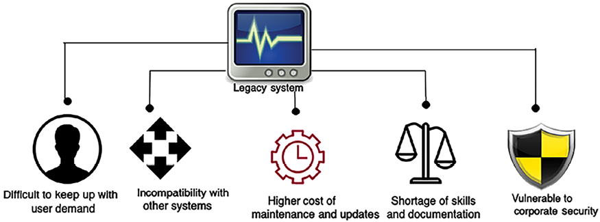
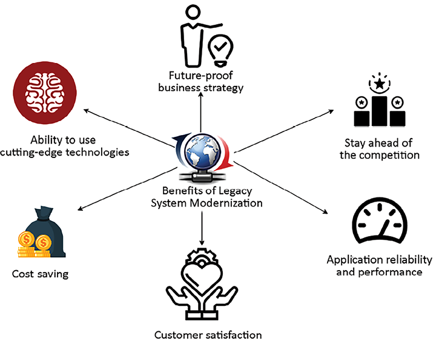
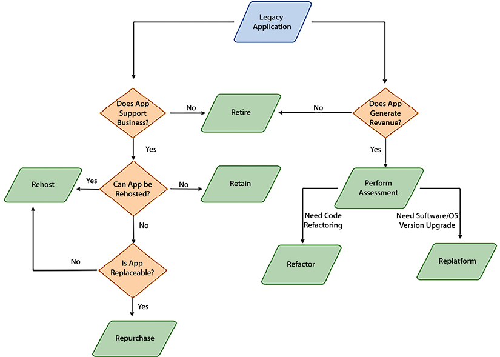
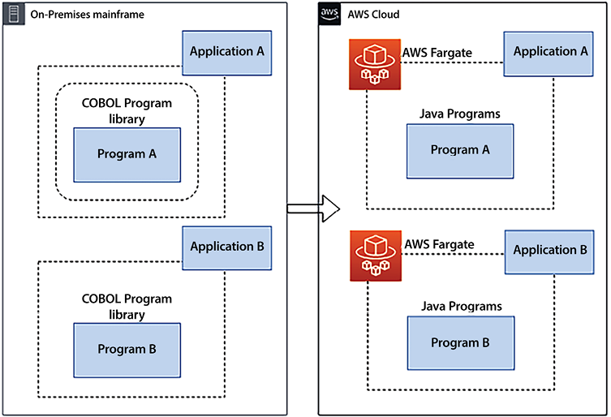
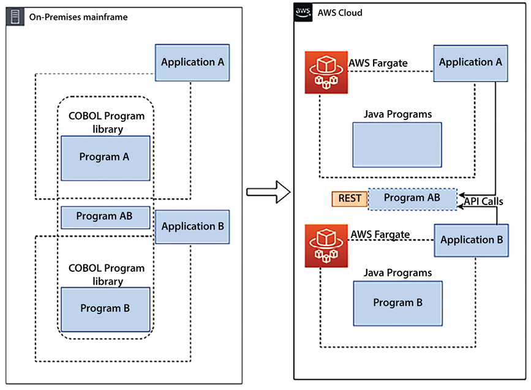
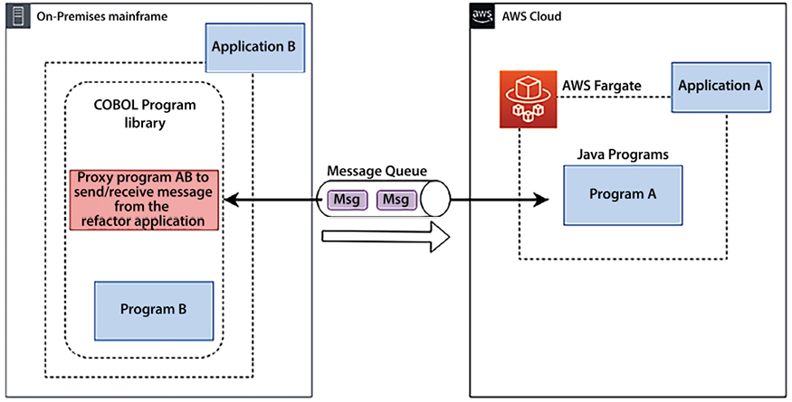

# معماری مجدد سیستم های میراث

سازمان های امروزی در یک محیط چالش برانگیز فعالیت می کنند. سرعت تغییر بی سابقه است. قانون‌گذاران و مؤسسات الزامات امنیتی و گزارش‌دهی جدیدی را تحمیل می‌کنند، فناوری‌های جدید انتظارات و ادراکات مصرف‌کنندگان را مختل می‌کنند، و با ورود بازیگران جدید به بازار، اکوسیستم دائماً در حال تغییر است. در نتیجه، سازمان‌ها مدل‌های کسب‌وکار خود را دوباره تعریف می‌کنند تا تمرکز، چابکی و فناوری مورد نیاز مشتری را برای جذب استعداد، رقابت‌پذیر بودن و رشد فراهم کنند.

نوسازی برنامه‌ها به یکی از اجزای حیاتی این مدل‌های کسب‌وکار جدید برای راه‌اندازی سریع محیط‌های برنامه‌نویس/تست، آزمایش ایده‌های جدید و توسعه محصولات و خدمات جدید تبدیل شده است. علاوه بر حذف نیاز به سرمایه گذاری در زیرساخت های گران قیمت و دست و پا گیر، یک سیستم جدید نوآوری را از طریق مجموعه گسترده ای از فناوری های موجود امکان پذیر می کند.

سیستم‌های قدیمی برنامه‌هایی هستند که برای چندین دهه در مرکز داده شما بدون تغییر زیاد مستقر شده‌اند. نگهداری این سیستم ها در یک محیط تکنولوژیکی که به سرعت در حال تغییر است، قدیمی و چالش برانگیز است. سیستم‌های قدیمی بر اساس سن و ناتوانی در برآوردن نیازهای در حال رشد کسب‌وکار، به دلیل معماری و فناوری اساسی تعریف می‌شوند.

اغلب، شرکت‌های بزرگ با برنامه‌های کاربردی قدیمی برای اجرای وظایف حیاتی روزمره تجاری سر و کار دارند. این سیستم‌های قدیمی در بسیاری از صنایع مانند مراقبت‌های بهداشتی، مالی، حمل‌ونقل، تولید و زنجیره تامین گسترده شده‌اند. اغلب، شرکت‌ها مجبورند برای نگهداری و پشتیبانی از این سیستم‌ها هزینه‌های زیادی بپردازند، که نیاز به معماری سیستم‌های قدیمی را تضمین می‌کند. معماری مجدد و نوسازی برنامه های قدیمی به سازمان ها کمک می کند تا چابک تر و نوآورتر باشند و هزینه و عملکرد را بهینه کنند.

در این فصل، با چالش ها و مسائل مربوط به برنامه های کاربردی قدیمی و تکنیک های معماری مجدد آنها آشنا خواهید شد. بازنویسی برنامه‌های قدیمی پیچیده ممکن است خطر بیشتری برای اختلال در کسب‌وکار به همراه داشته باشد، بنابراین در مورد بازسازی برنامه‌ها یا در نظر گرفتن گزینه مهاجرت به زیرساخت‌های انعطاف‌پذیرتر یاد خواهید گرفت. در این فصل به موضوعات زیر پرداخته خواهد شد:

- یادگیری چالش های سیستم های قدیمی
- تعریف استراتژی برای نوسازی سیستم
- نگاهی به تکنیک های نوسازی سیستم های قدیمی
- تعریف استراتژی مهاجرت ابری برای سیستم های قدیمی
- مهاجرت مین فریم به ابر عمومی
- مدرن کردن کدهای قدیمی با هوش مصنوعی مولد

در پایان فصل، با چالش‌های مختلف و محرک‌های مدرن‌سازی سیستم‌های قدیمی آشنا خواهید شد. شما در مورد استراتژی ها و تکنیک های مختلف برای مدرن سازی سیستم های قدیمی یاد خواهید گرفت. همانطور که ابر عمومی در حال تبدیل شدن به یک استراتژی پیشرو برای بسیاری از سازمان ها است، شما همچنین در مورد مهاجرت ابری سیستم های قدیمی یاد خواهید گرفت.

# یادگیری چالش های سیستم های قدیمی

یک برنامه قدیمی چالش های مهمی را برای یک سازمان ارائه می کند. از یک طرف، برنامه های کاربردی حیاتی وجود دارد که یک سازمان برای چندین دهه از آنها استفاده کرده است. از سوی دیگر، برنامه های کاربردی قدیمی سرعت نوآوری سازمان را متوقف می کنند.

کاربران نهایی به دنبال مدرن ترین و پیشرفته ترین برنامه های کاربردی در یک محیط بسیار رقابتی هستند. همه ویژگی‌های جدید معمولاً با جدیدترین نرم‌افزار ارائه می‌شوند و برنامه‌های کاربردی قدیمی توانایی شما را برای افزودن ویژگی‌هایی که به نفع کاربران نهایی است محدود می‌کنند.

نمودار زیر برخی از چالش های مهمی را که سازمان ها با سیستم های قدیمی با آن مواجه هستند نشان می دهد:

شکل 15.1: چالش های یک سیستم قدیمی

قبل از اینکه به راه حل بپردازیم، ضروری است که مسائل را به وضوح درک کنیم. بیایید چالش های سیستم های قدیمی را عمیق تر بررسی کنیم تا آنها را بهتر درک کنیم.

## مشکل در مطابقت با تقاضای کاربر

تمرکز بر مشتری کلید موفقیت کسب و کار است و ناتوانی در هماهنگی با آخرین روندهای فناوری می تواند به طور قابل توجهی به یک تجارت آسیب برساند. می‌توانید نوکیا را مثال بزنید که پیشتر در بازار جهانی تلفن همراه رهبری می‌کرد. از آنجایی که گوشی‌های هوشمند تقریباً یک دهه پیش وارد بازی شدند، نوکیا همچنان به یک سیستم قدیمی پایبند بود و در نتیجه تقریباً ورشکست شد. این یک داستان مشابه با کداک بود - یکی از بزرگترین مشاغل در صنعت دوربین. کداک نتوانست با نوآوری دیجیتال حرکت کند و آن را در سیستم های خود بپذیرد، که منجر به ورشکستگی کداک در سال 2012 شد. نمونه های زیادی از این قبیل از شرکت های بزرگ وجود دارد که به دلیل عدم مدرن سازی و نوآوری قدیمی قادر به ادامه حیات نیستند.

کاربران در شرایط فعلی تکنولوژی در حال تغییر و رقابت شدید بسیار خواستار هستند. اکنون، سازمان ها باید طبق شرایط کاربر تغییر کنند، زیرا آنها چندین گزینه دارند. همانطور که تکنولوژی حرکت می کند، کاربر با آن حرکت می کند و شروع به استفاده از جدیدترین و محبوب ترین برنامه ها می کند. اگر رقبای شما ویژگی‌های جدیدی را که کاربر به آن نیاز دارد ارائه دهند، می‌توانند جلوتر بپرند. نمونه اخیر گوگل، پیشگام در AI/ML است

که ممکن است خیلی زودتر فناوری **هوش مصنوعی مولد** (**GenAI**) را توسعه داده باشد. با این حال، OpenAI به سرعت برای راه‌اندازی ChatGPT حرکت کرد و گوگل را عقب انداخت و آن را مجبور به انجام یک بازی جدید کرد و در نتیجه جایگاه خود را به رقبا در بازار GenAI از دست داد. این مثال‌ها بر اهمیت پذیرش فناوری‌های نوظهور برای حفظ مزیت رقابتی تأکید می‌کنند.

یک سیستم قدیمی همچنین برنامه های کاربردی سازمانی با پایگاه کاربر داخلی را به چالش می کشد. یک سیستم قدیمی که بر روی مین‌فریم‌ها ساخته شده است، عمدتاً از خط فرمان استفاده می‌کند که می‌تواند در عصر دیجیتال کاربرپسندتر باشد. در مقابل، کارگران نسل جدید خواستار رویکرد کاربرپسندتری برای انجام وظایف معمول خود هستند. با این حال، ممکن است به حمایت بیشتری از مدیریت نیاز داشته باشید، که ممکن است برای چندین دهه با سیستم های قدیمی کار کرده و به آنها عادت کرده باشد.

فن آوری در هسته شرکت های بزرگ باید به روز شود و شامل سیستم هایی با قدمت چند دهه قبل است. سازمان‌هایی که سیستم‌های اصلی خود را بر اساس فناوری قدیمی و درون محل اجرا می‌کنند، هنگام ایجاد تجربیات مشتری مدرن با چالش‌های جدی مواجه می‌شوند. بسیاری از سیستم‌ها محصول چندین ادغام و اکتساب هستند که منجر به شکستگی سیلوهای داده، هزینه‌های زیرساختی بیش از حد و زمان توسعه کند می‌شود. این باعث ایجاد پردازش و تصمیم گیری ناکارآمد، عدم چابکی تجاری، پاسخگویی ضعیف به مشتری و هزینه های بالای نگهداری می شود. تحت این شرایط، پاسخگویی به نیازهای مدرن ذینفعان داخلی و مشتریان برای IT چالش برانگیز است.

## هزینه بالاتر نگهداری و به روز رسانی

از آنجایی که سیستم های قدیمی برای چندین دهه راه اندازی شده و کار می کنند، ممکن است ارزان تر به نظر برسند. اما با گذشت زمان، هزینه کل مالکیت بیشتر می شود، زیرا پشتیبانی و به روز رسانی برای سیستم های قدیمی معمولاً هزینه بیشتری دارد.

این به‌روزرسانی‌ها اغلب خارج از جعبه در دسترس نیستند و راه‌حل‌های دستی زیادی برای حفظ سیستم‌ها مورد نیاز است. اکثر سیستم‌های قدیمی سازگار با اتوماسیون نیستند، که منجر به تلاش بیشتر انسان می‌شود.

سیستم‌های قدیمی عمدتاً دارای بخش بزرگی از نرم‌افزار اختصاصی هستند که منجر به هزینه‌های مجوز به میزان قابل توجهی می‌شود. علاوه بر آن، نرم افزارهای قدیمی دیگر پشتیبانی از ارائه دهندگان دریافت نمی کنند و خرید پشتیبانی اضافی خارج از چرخه عمر می تواند بسیار پرهزینه باشد. از سوی دیگر، سیستم‌های مدرن عمدتاً از فناوری‌های منبع باز استفاده می‌کنند که هزینه را کاهش می‌دهد. به دلیل سال ها بدهی فنی و کدهایی که به سختی اشکال زدایی می شود، قطع عملیات یک سیستم قدیمی می تواند زمان بیشتری را صرف کند و هزینه های عملیاتی را افزایش دهد. یافتن افرادی با مجموعه مهارتی برای حفظ سیستم های قدیمی (مانند DB2، COBOL، Fortran، Delphi، و Perl) دشوار است و به طور قابل توجهی هزینه های استخدام و ریسک سیستم را افزایش می دهد.

برنامه‌های قدیمی برای دهه‌ها کار می‌کنند، و با گذشت زمان، بسیاری از تغییرات بدون حذف کدهای بلااستفاده انجام می‌شوند که بدهی‌های فنی زیادی را به همراه دارد. هر گونه ابتکار برای کاهش بدهی فنی می تواند به دلیل تأثیرات و وابستگی های ناشناخته خطرناک باشد. در نتیجه، سازمان‌ها مجبور می‌شوند از ترس شکستن یک سیستم با ایجاد هرگونه تغییر مهم، روی کد و نگهداری غیر ضروری سیستم سرمایه‌گذاری کنند.

با این حال، مدرن کردن سیستم های قدیمی ممکن است به دلیل وابستگی ها و قطعی های ناشناخته پرهزینه باشد. یک **تحلیل دقیق هزینه و فایده** (**CBA**) باید در نظر گرفته شود و **بازده سرمایه** (**ROI**) باید هنگام تصمیم گیری برای ادامه نوسازی تعیین شود. از آنجایی که ذینفعان باید فوراً فواید مدرن‌سازی را ببینند، تأمین منابع مالی برای مدرن‌سازی قدیمی می‌تواند چالش‌برانگیز باشد.

## کمبود مهارت و مستندات

فناوری های قدیمی (مانند مین فریم ها) دارای چندین مؤلفه پیچیده هستند که به یکدیگر وابسته هستند. آنها سرورهای اختصاصی گسترده و پرهزینه ای هستند که اگر کسی بخواهد به طور مستقل برای آنها مهارت ایجاد کند، به راحتی در دسترس نیستند. حفظ منابع توسعه برنامه چالش برانگیز است و حتی استخدام افرادی با تجربه عملی در فناوری های قدیمی و سیستم عامل ها چالش برانگیزتر است.

اغلب، سیستم‌های قدیمی ده‌ها سال قدمت دارند و بیشتر نیروی کار با مهارت‌های مربوطه برای مدیریت آنها بازنشسته شده‌اند. همچنین، این سیستم‌ها ممکن است برای ثبت سال‌های کاری که روی آن‌ها انجام شده نیاز به مستنداتی داشته باشند. از دست دادن دانش قابل توجهی امکان پذیر است زیرا یک نیروی کار قدیمی با نیروی کار جدید می چرخد. فقدان دانش، تغییر سیستم را به دلیل وابستگی های ناشناخته خطرناک می کند. هر گونه درخواست ویژگی کوچک به دلیل پیچیدگی سیستم و کمبود مهارت، چالش برانگیز است.

فن‌آوری‌های جدید مانند تجزیه و تحلیل پیشرفته، ML، GenAI، و **اینترنت اشیا** (**IoT**) بر روی پلتفرم‌های فناوری جدید ساخته شده‌اند. از آنجایی که فناوری‌های جدید به خوبی با سیستم‌های قدیمی ادغام نشده‌اند، اگر سازمانی نتواند از قابلیت‌های کامل فناوری‌های نوظهور استفاده کند، ممکن است در برابر رقیب شکست بخورد. یک سیستم مدرن به ایجاد برند سازمانی به عنوان یک شرکت نوآور کمک می کند که اکثر نسل جدید نیروی کار می خواهند در آن کار کنند. توسعه و آموزش هزینه های مهم تری برای فناوری های قدیمی است.

اغلب، auتوماسیون با کاهش تلاش انسان به کاهش هزینه ها کمک می کند. ابزارهای زیادی در سیستم‌های مدرن برای ساخت اتوماسیون در دسترس هستند - مانند خطوط لوله DevOps، بررسی کدها، و تست اتوماسیون - که ممکن است یک سیستم قدیمی از آنها استفاده نکند و در نتیجه هزینه‌های اضافی را به همراه داشته باشد.

## آسیب پذیری در برابر مسائل امنیتی شرکتی

امنیت برای هر سازمان و سیستمی اولویت اصلی است. یک برنامه قدیمی در یک سیستم عامل قدیمی (مانند Windows XP یا Windows 2008) به دلیل عدم پشتیبانی فروشنده در برابر مشکلات امنیتی آسیب پذیر است. فروشندگان نرم افزار به طور مداوم تهدیدات امنیتی جدید را تعیین می کنند و وصله هایی را منتشر می کنند تا آنها را در آخرین نسخه های نرم افزار جای دهند. هر نرم‌افزار قدیمی که به‌عنوان **پایان عمر** (**EOL**) از یک فروشنده اعلام می‌شود، یک وصله امنیتی جدید دریافت نمی‌کند، که باعث می‌شود برنامه شما در نسخه نرم‌افزار قدیمی اجرا شود و در معرض چندین تهدید امنیتی قرار گیرد.

بررسی‌های سلامت سیستم اغلب برای برنامه‌های قدیمی نادیده گرفته می‌شوند، که آنها را در برابر حملات امنیتی آسیب‌پذیرتر می‌کند. شکاف مهارتی، ارائه پشتیبانی و کمک مستمر را دشوار می کند، به این معنی که سیستم ها باید ایمن تر باشند. یک آسیب‌پذیری می‌تواند خطر زیادی برای قرار دادن برنامه، پایگاه داده و اطلاعات مهم شما در معرض مهاجمان ایجاد کند.

علاوه بر آسیب‌پذیری امنیتی، برنامه‌های کاربردی قدیمی به دلیل انطباق، نگهداری پیچیده هستند. از آنجایی که قوانین در طول زمان برای اعمال امنیت شدید در مورد مدیریت و استفاده از داده‌ها تغییر می‌کنند، سیستم‌های قدیمی برای رعایت نیازهای حاکمیت محلی و انطباق به تغییرات نیاز دارند.

برای مثال، مطابقت با **مقررات عمومی حفاظت از داده** (**GDPR**) اتحادیه اروپا، هر سیستمی را ملزم می کند تا کاربران را قادر سازد تا درخواست حذف داده های خود را داشته باشند. در حالی که سیستم‌های مدرن ممکن است این ویژگی‌ها را به‌صورت خودکار و سلف‌سرویس ارائه دهند، ممکن است این کار به صورت دستی انجام شود و در سیستم‌های قدیمی پیچیده‌تر شود.

رعایت نیازهای انطباق می تواند منجر به هزینه های عملیاتی بیشتر و نگهداری وقت گیر شود.

## ناسازگاری با سیستم های دیگر

علاوه بر کاربران نهایی، اغلب سیستم ها نیاز به ادغام با یکدیگر دارند. این سیستم ها ممکن است با بخش ها، مشتریان، شرکا یا تامین کنندگان مختلف مرتبط باشند. سیستم های مختلف نیاز به تبادل داده ها در قالب استانداردی دارند که در حال تکامل است. تقریباً هر چند سال یکبار، استانداردهای فرمت فایل‌ها و داده‌ها برای افزایش کارایی تبادل داده تغییر می‌کنند و بیشتر سیستم‌ها برای اتخاذ آنها نیاز به تغییر دارند. سیستم‌های قدیمی که به سختی تغییر می‌کنند و از قالب قدیمی استفاده می‌کنند، می‌تواند منجر به ناسازگاری سیستم و سیستمی شود که تامین‌کنندگان و شرکای شما ممکن است مایل به استفاده از آن نباشند. ناتوانی در انطباق با نیازهای استاندارد به دلیل راه‌حل‌های پیچیده و از دست رفتن بهره‌وری، ریسک تجاری قابل‌توجهی را افزایش می‌دهد.

افزودن یک راه حل برای نیازهای ساده کسب و کار ممکن است یک سیستم را پیچیده تر کند. سیستم‌های مدرن بر اساس معماری سرویس‌گرا ساخته شده‌اند و با افزودن یک سرویس جدید به‌طور مستقل، برآوردن نیازهای جدید را آسان‌تر می‌کنند. سیستم های قدیمی اغلب با معماری یکپارچه ساخته می شوند و افزودن هر ویژگی جدید به این معنی است که باید کل سیستم را بازسازی و آزمایش کنید.

معماری‌های مدرن مبتنی بر API هستند و می‌توانند به راحتی با سایر سیستم‌ها برای تخلیه بارهای سنگین ادغام شوند. به عنوان مثال، یک برنامه رزرو تاکسی از Google Maps برای مسیریابی **سیستم موقعیت یابی جهانی** (**GPS**) و از فیس بوک یا X برای احراز هویت کاربر استفاده می کند. فقدان API این ادغام ها را در یک سیستم قدیمی سخت تر می کند و در نتیجه کد سفارشی پیچیده ای ایجاد می کند.

یک برنامه قدیمی می تواند با افزایش بار از یک سیستم بالادستی وابسته دیگر با مشکل مقیاس پذیری مواجه شود. اغلب، برنامه های کاربردی قدیمی با معماری یکپارچه ساخته می شوند و به سخت افزار وابسته هستند. مقیاس پذیری یک چالش بزرگ با یک سیستم یکپارچه است، زیرا به دلیل وابستگی به سخت افزار و مقیاس عمودی محدود به حداکثر ظرفیت سیستم، نمی تواند به صورت افقی مقیاس شود. همچنین، افزایش تقاضا در یک بخش از یکپارچه نیاز به مقیاس بندی کل سیستم دارد. شکستن برنامه‌های یکپارچه به میکروسرویس‌ها می‌تواند به چالش‌های مقیاس‌بندی و همگام شدن با بار کمک کند.

علاوه بر نگهداری نرم‌افزار، برنامه‌های قدیمی برای زیرساخت‌های سخت‌افزاری پرهزینه هستند زیرا روی یک نسخه خاص اجرا می‌شوند. آنها در چندین پایگاه داده با داده های تکراری و عملکردهای مشابه پخش می شوند. به دلیل ماهیت یکپارچه آنها، ادغام و استفاده از انعطاف پذیری زیرساخت های مبتنی بر ابر برای صرفه جویی در هزینه ها دشوار است. همچنین، سیستم‌های غیرمتمرکز به تیم‌های نرم‌افزاری اجازه می‌دهند تا بسته‌های نرم‌افزاری را بر اساس نیازهای میکروسرویس انتخاب کنند، به‌جای اینکه مجبور باشند برای همه عملکردهای سیستم با یک پشته فناوری منطبق شوند و امکان استفاده از فناوری‌های متنوع بر اساس نیازهای هر میکروسرویس و/یا را فراهم کنند. تیمی که از میکروسرویس پشتیبانی می کند.

بیایید به برخی از مزایای کلیدی نوسازی سیستم نگاه کنیم.

# تعریف استراتژی برای نوسازی سیستم

اغلب، یک سیستم قدیمی از استراتژی کلی دیجیتال یک شرکت کنار گذاشته می‌شود و در صورت لزوم به مسائل رسیدگی می‌شود. یک رویکرد واکنشی، سازمان ها را از اجرای نوسازی کلی سیستم باز می دارد

n و مزایا.

اگر سیستم قدیمی شما دارای چالش‌های تجاری جدی است، مانند مسائل امنیتی و انطباق، یا نمی‌تواند نیازهای تجاری را برطرف کند، می‌توانید رویکرد **بیگ بنگ** را در پیش بگیرید. در روش انفجار بزرگ، شما یک سیستم جدید را از ابتدا می سازید و سیستم قدیمی را خاموش می کنید. این رویکرد مخاطره آمیز است، اما به یک نیاز تجاری که می تواند با سیستم قدیمی موجود کاهش یابد، پاسخ می دهد.

رویکرد دیگر **رویکرد مرحله‌ای** است که در آن شما یک ماژول را در یک زمان ارتقا می‌دهید و سیستم‌های قدیمی و جدید را اجرا می‌کنید. رویکرد مرحله‌ای ریسک کمتری دارد، اما زمان زیادی می‌برد و ممکن است گران‌تر باشد، زیرا باید هر دو محیط را با پهنای باند شبکه و زیرساخت افزایش دهید.

نزدیک شدن به پورتفولیوی اپلیکیشن، اولویت بندی اپلیکیشن های خاص و داشتن یک برنامه کلی اولین قدم ها هستند. همانطور که از ابر استفاده می کنید، یک مدل عملیاتی جدید طراحی می کنید و در نهایت با ترکیبی از ابزارها مواجه می شوید. می‌توانید از ابزارهای شخص ثالث برای چارچوب‌بندی نیازها و ترجیحات ابزار خود استفاده کنید. و در نهایت می توانید از یک شریک مشاور برای تکمیل پروژه های مهاجرت و نوسازی با موفقیت و سرعت بیشتر استفاده کنید.

اتخاذ هر یک از این رویکردها می تواند مزایای مختلفی را پس از تکمیل نوسازی یک برنامه ارائه دهد.

## ارزیابی یک برنامه قدیمی

یک سازمان ممکن است چندین سیستم قدیمی با ده ها هزار تا میلیون ها خط کد داشته باشد. در شرایط مدرنیزاسیون، یک سیستم میراثی باید با استراتژی کسب و کار و هزینه سرمایه گذاری هماهنگ باشد. همچنین، امکان استفاده مجدد از برخی از قطعات یا نوشتن کامل آنها از ابتدا وجود دارد، اما اولین قدم انجام ارزیابی و درک بهتر سیستم کلی است.

در مرحله ارزیابی، معمار راه‌حل‌ها باید سیستم را برای ارزیابی سریع‌تر و تصمیم‌گیری آگاهانه آسان‌تر کند. بسته به حجم کار و پیچیدگی آن، ارزیابی ها را می توان در روزها و هفته ها انجام داد. نکات زیر حوزه‌های اولیه‌ای هستند که معماران باید هنگام ارزیابی روی آن‌ها تمرکز کنند:

- **ارزیابی فناوری**: شما باید پشته فناوری استفاده شده توسط سیستم موجود را درک کنید. اگر فناوری فعلی قدیمی است و پشتیبانی فروشنده را ندارد، ممکن است لازم باشد آن را جایگزین کنید. اگر نسخه بهتری از فناوری در دسترس قرار گرفت، ارتقا را در نظر بگیرید. اغلب، نسخه‌های جدیدتر با حداقل تغییرات مورد نیاز، سازگار با عقب هستند.
- **ارزیابی معماری**: شما باید معماری کلی را درک کنید تا آن را در آینده مقاوم کنید. ممکن است موردی وجود داشته باشد که شما نیاز به ارتقای جزئی در فناوری داشته باشید، اما معماری کلی باید یکپارچه تر و مقیاس پذیرتر باشد. بهترین کار این است که معماری را در رابطه با هزینه، مقیاس پذیری، در دسترس بودن، عملکرد و امنیت ممیزی کنید. ممکن است برای هماهنگ کردن برنامه با نیازهای تجاری، تغییرات معماری قابل توجهی لازم باشد.
- **ارزیابی کد و وابستگی**: سیستم های قدیمی اغلب دارای صدها هزار خط کد در یک محیط یکپارچه هستند. ماژول های مختلف متصل به یکدیگر سیستم را بسیار پیچیده می کند. کدی که به نظر می‌رسد در یک ماژول استفاده نمی‌شود، اگر بدون دقت لازم حذف شود، ممکن است روی ماژول‌های دیگر تأثیر بگذارد. این خطوط کد ممکن است چندین دهه قبل نوشته شده باشند و نیاز به بازنویسی و بازبینی منظم داشته باشند. حتی اگر فناوری و معماری خوب به نظر می رسند، باید تعیین کنید که آیا کد قابل ارتقا و نگهداری است یا خیر. همچنین باید بدانید که آیا ارتقاهای مرتبط با رابط کاربری برای بهبود تجربه کاربری مورد نیاز است یا خیر.

به عنوان یک معمار راه حل، شما می خواهید وابستگی ها را بین ماژول ها و فایل های کد مختلف تعیین کنید. ممکن است ماژول‌ها به شدت به هم متصل شوند، و شما باید رویکردی را برای انجام ارتقاء همزمان در هنگام مدرن کردن معماری کلی تعریف کنید. در طول ارزیابی خود، ممکن است الگوهای زیر را بیابید:

- اول، بسیاری از مشتریان متوجه می شوند که بسیاری از برنامه های قدیمی دارند که به خوبی با مدل کسب و کار آینده مرتبط نیستند. می توانند بازنشسته شوند. به عنوان مثال، حدود 10 تا 20 درصد از مجموعه برنامه ها را می توان بازنشسته کرد.
- دوم، هزاران فروشنده SaaS 5 تا 7 سال پیش وجود نداشتند. اینها می توانند جایگزین بسیاری از برنامه های داخلی شوند. به عنوان مثال، اکثر مشتریان به عنوان یک پلتفرم CRM روی Salesforce قرار گرفته اند. این تغییر به SaaS مجموعه عملیاتی مدیریت شده توسط عملیات فناوری اطلاعات را کاهش می‌دهد - هنوز هم کار امنیتی و هویتی را ارائه می‌کند اما هزینه‌های عملیاتی کمتری دارد.

سپس، می‌توان تصمیماتی برای ارتقا و جابجایی و در طول یک جابجایی، تغییر سیستم‌عامل، پایگاه داده یا زبان برای کاهش هزینه‌ها اتخاذ کرد، مثلاً مشتریانی که تصمیم می‌گیرند از ویندوز سرور به لینوکس و از اوراکل به Postgres دوباره پلتفرم شوند. کاهش هزینه های صدور مجوز پایگاه داده شما با این تکنیک ها در _فصل 3_، _ مهاجرت ابری و طراحی معماری ابری ترکیبی_ آشنا شدید.

اگر مدرن‌سازی را انتخاب می‌کنید، باید روی مدرن‌سازی اپلیکیشن‌هایی تمرکز کنید که کسب‌وکار شما را متمایز می‌کنند. بیایید به رویکرد نوسازی نگاه کنیم.

## تعریف رویکرد نوسازی

برای ذینفعان، ممکن است انگیزه فوری برای نوسازی برنامه وجود نداشته باشد. شما باید مقرون به صرفه ترین روش را انتخاب کنید و رزومه تحویل دهید

سریعتره

نمودار زیر رویکرد نوسازی را نشان می دهد:

شکل 15.2: رویکرد نوسازی سیستم میراث

پس از ارزیابی سیستم خود، باید الگوی معماری موجود و محدودیت های آن را درک کنید. طبق پشته فناوری خود، باید ابزارهای مهاجرت را ارزیابی کنید. برای مثال، اگر برنامه خود را مجدداً روی VMware میزبانی کنید، می‌توانید از یک شبیه‌ساز برای مهاجرت مرکزی یا vCenter استفاده کنید. رویکردهای نوسازی مختلف را انتخاب کنید و یک **اثبات مفهوم** (**POC**) برای شناسایی شکاف ها ایجاد کنید. برخی از رویکردها در اینجا ذکر شده است:

- **مدرن سازی مبتنی بر معماری**: رویکرد معماری محور برای دستیابی به بیشترین چابکی مورد نیاز است. اغلب، یک رویکرد معماری مستقل از زبان و مستقل از پلتفرم با استفاده از الگوهای سرویس‌محور است که به تیم توسعه انعطاف‌پذیری بیشتری برای نوآوری می‌دهد. اگر ارزیابی شما نشان دهد که به تغییرات معماری قابل توجهی نیاز دارید، می توانید این رویکرد را انتخاب کنید. ابتدا اجرای حیاتی ترین ویژگی را شروع کنید و سپس یک POC بسازید که شکاف ها و تلاش مورد نیاز را برجسته کند. برای دستیابی به مقیاس‌پذیری و اطمینان از ادغام بهتر با سایر سیستم‌ها، بسته به کاربرد قدیمی خود، از رویکرد میکروسرویس استفاده کنید.
- **مهندسی مجدد سیستم**: در رویکرد مهندسی مجدد، باید سیستم قدیمی را عمیقاً درک کنید و برای ساختن یک برنامه مدرن جدید مهندسی معکوس انجام دهید. شما باید مطمئن شوید که انتخاب‌های تکنولوژیکی را انجام می‌دهید که به شما کمک می‌کند یک سیستم مقاوم در برابر آینده ایجاد کنید. اگر سیستم قدیمی بیش از حد پیچیده است و به پروژه های بلندمدت نیاز دارد، باید از این رویکرد استفاده کنید. ابتدا با نوسازی برنامه شروع کنید و پایگاه داده را به عنوان برش نهایی در یک رویکرد مرحله‌ای ارتقا دهید. شما باید مکانیزمی بسازید که در آن ماژول های قدیمی و ارتقا یافته با هم وجود داشته باشند و توانایی برقراری ارتباط به صورت ترکیبی را داشته باشند.
- ** مهاجرت و پیشرفت ها **: اگر فناوری سیستم موجود شما نسبتاً خوب کار می کند اما به دلیل محدودیت های سخت افزاری و هزینه محدود است، می توانید از روش های مهاجرت و بهبود جزئی استفاده کنید. به عنوان مثال، می‌توانید برای دسترسی بهتر زیرساخت‌ها و بهینه‌سازی هزینه، کل بار کاری را به ابر منتقل کنید. علاوه بر این، یک ارائه‌دهنده ابر چندین ابزار خارج از جعبه را گسترش می‌دهد که به شما کمک می‌کند تغییرات را بیشتر انجام دهید و اتوماسیون بهتری را اعمال کنید. رویکرد مهاجرت به شما این امکان را می‌دهد که برنامه خود را با تلاش کمتر مدرن‌سازی کنید و آن را در آینده مقاوم نگه دارید و آن را برای طولانی مدت مرتبط نگه دارید. با این حال، لیفت و شیفت محدود است و ممکن است فقط برای برخی از بارهای کاری مناسب باشد.

همانطور که قصد مهاجرت و نوسازی را دارید، حوزه های فناوری اطلاعات خاصی را در نظر بگیرید که نیاز به طراحی مجدد و نوسازی اساسی دارند. این مدرن‌سازی شامل محیط‌های سیستم عامل توسعه‌دهنده می‌شود زیرا بر مدیریت پچ تأثیر می‌گذارند. امنیت، شبکه و هویت در رتبه های بعدی قرار دارند و فرصتی عالی برای مقیاس پذیری، انعطاف پذیری و کاهش هزینه ارائه می دهند. پس از آن، ابزارهای ذخیره‌سازی، پشتیبان‌گیری و پایگاه داده می‌آیند، زیرا برنامه‌های بیشتری به ابر منتقل می‌شوند. همچنین، باید ابزارهای نظارتی و مدیریتی خود را که نیاز به آموزش و مهارت مجدد دارند، مدرن کنید. بیایید به استراتژی های مختلف برای مدرن سازی سیستم های قدیمی نگاه کنیم.

## مزایای نوسازی سیستم

همانطور که در نمودار زیر نشان داده شده است، ایجاد یک استراتژی دیجیتال آینده با توجه به نیاز روزافزون به نوسازی سیستم قدیمی می تواند مزایای زیادی داشته باشد:

شکل 15.3: مزایای نوسازی سیستم میراث

مزایای مهم نوسازی اپلیکیشن به شرح زیر است:

- **رضایت مشتری**: استفاده از جدیدترین فناوری **رابط کاربری** (**UI**)، **تجربه کاربری** (**UX**) و تجربه همه کانالی بهتری را به ارمغان می آورد. مصرف کنندگان از طریق تجربیات شخصی به دسترسی بلادرنگ به اطلاعات از هر دستگاه، مکان یا زمانی عادت کرده اند. شما نیازی به ساخت انواع مختلف رابط کاربری ندارید. می توان آن را یک بار ساخته و در دستگاه هایی مانند لپ تاپ، تبلت و گوشی های هوشمند مستقر کرد. یک رابط کاربری سریع و نرم منجر به تجربه بهتر مشتری و رشد کسب و کار می شود.
- **استراتژی تجاری مقاوم در برابر آینده**: مدرن کردن برنامه کاربردی به شما امکان می دهد چابک تر و نوآورتر باشید. یک تیم می تواند به راحتی نیازهای در حال تغییر کسب و کار را برآورده کند و با فناوری جدید تکامل یابد.\* **پیشتر از رقبا بمانید**: کاربران همیشه به دنبال جدیدترین چیزها هستند و به سمت برنامه های کاربردی جدیدی می روند که تجربه بهتری را ارائه می دهند. مدرن سازی اپلیکیشن شما به شما کمک می کند تا با پیروی از آخرین روندها از رقبا پیشی بگیرید. به عنوان مثال، یکپارچه سازی صدا به طور گسترده در برنامه ها ارائه می شود و می توانید با تشخیص چهره امنیت را افزایش دهید. این تنها زمانی امکان پذیر است که برنامه شما از آخرین فناوری استفاده کند.
- **قابلیت اطمینان و عملکرد برنامه**: هر API نرم افزار جدید و نسخه سیستم عامل سعی در آدرس دهی دارد

و مسائل مربوط به عملکرد را بهبود بخشد. استفاده از جدیدترین نرم‌افزار و سخت‌افزار به شما کمک می‌کند تا به عملکرد، مقیاس‌پذیری و دسترسی بالا دست پیدا کنید. نوسازی برنامه به شما کمک می کند تا قطعی های عملیاتی را کاهش دهید و امنیت را افزایش دهید.
- **قابلیت استفاده از فناوری‌های پیشرفته**: سیستم‌های قدیمی شما را از دریافت بینش از داده‌هایی که می‌تواند به رشد کسب‌وکارتان کمک کند، باز می‌دارد. با مدرن کردن پایگاه داده خود و ایجاد یک دریاچه داده، می توانید از داده های بزرگ و ML برای دریافت انواع بینش استفاده کنید. این همچنین به شما کمک می کند تا زمانی که افراد فرصت کار با فناوری های جدید را پیدا می کنند، کارمندان را حفظ کنید.
- **صرفه جویی در هزینه**: به طور کلی، هرگونه نوسازی منجر به صرفه جویی در هزینه با کاهش تعمیر و نگهداری عملیاتی و ارائه یک ارتقاء طبیعی تر می شود. استفاده از نرم‌افزار منبع باز هزینه‌های صدور مجوز را کاهش می‌دهد، انعطاف‌پذیری سخت‌افزار به اتخاذ یک مدل پرداخت به‌صورت ابری کمک می‌کند، و اتوماسیون منابع انسانی مورد نیاز برای کارهای معمول را کاهش می‌دهد و کارایی کلی را بهبود می‌بخشد.

با انتقال سیستم‌های اصلی قدیمی، سازمان‌ها می‌توانند سیستم‌های اصلی خود را برای کاهش هزینه‌های مالکیت، خودکارسازی فرآیندهای پشتیبان دستی، حذف سیلوهای داده، بهبود تجربه مشتری و راه‌اندازی سریع‌تر برنامه‌های کاربردی جدید بازار، مدرن کنند.

مزایای متعددی برای نوسازی سیستم قدیمی وجود دارد، اما آنها می توانند بسیار پیچیده باشند و به تلاش زیادی نیاز دارند. برای اتخاذ رویکرد صحیح باید یک ارزیابی دقیق انجام شود. بیایید تکنیک های ارزیابی یک برنامه قدیمی را بررسی کنیم.

# نگاهی به تکنیک‌های نوسازی سیستم قدیمی

با توجه به تجزیه و تحلیل برنامه موجود خود، می توانید رویکردهای مختلفی را برای ارتقاء سیستم قدیمی خود در نظر بگیرید. ساده ترین رویکرد مهاجرت و میزبانی مجدد است که در آن نیازی به تغییر سیستم موجود نیست. با این حال، یک مهاجرت ساده ممکن است مشکل طولانی مدت را حل نکند یا هیچ مزیتی را به همراه نداشته باشد.

اگر سیستم دیگر نیازهای تجاری را برآورده نمی کند، می توانید رویکرد پیچیده تری داشته باشید، مانند معماری مجدد یا طراحی مجدد کل برنامه. نمودار زیر تاثیر روش های مختلف را نشان می دهد:

شکل 15.4: تکنیک های نوسازی سیستم میراث

بیایید تکنیک های مختلف مدرن سازی را که در نمودار قبلی نشان داده شده است، بررسی کنیم.

## کپسوله سازی، میزبانی مجدد، و پلتفرم مجدد

**کپسوله کردن** ساده ترین رویکرد است. اگر سیستم برای کسب و کار حیاتی است و نیاز به برقراری ارتباط با سایر برنامه های کاربردی دارد که بر روی آخرین فناوری اجرا می شوند، باید از این روش استفاده کنید. با کپسوله‌سازی، باید یک پوشش API در اطراف سیستم قدیمی خود بسازید، که به سایر برنامه‌های تجاری اجازه می‌دهد با یک برنامه قدیمی ارتباط برقرار کنند. بسته‌بندی API یک رویکرد رایج است که به موجب آن شما شروع به مهاجرت برنامه‌های خود به فضای ابری می‌کنید، اما برنامه قدیمی را برای مدرن‌سازی در مرحله بعدی در مرکز داده داخلی نگه می‌دارید. اگر کد قدیمی شما به خوبی نوشته شده و نگهداری می شود، اما باز هم نمی توانید از پیشرفت های فناوری و انعطاف پذیری سخت افزاری بهره مند شوید، می توانید گزینه کپسولاسیون را انتخاب کنید.

رویکرد **میزبانی مجدد** یکی از ساده ترین استراتژی ها است که به موجب آن برنامه خود را بدون هیچ تغییری در کد به ارائه دهنده سخت افزار دیگری مانند ابر AWS منتقل می کنید. مجدداً، مانند کپسولاسیون، گزینه میزبانی مجدد می تواند هزینه ها را به دلیل قراردادهای فروشنده کاهش دهد، اما ممکن است از پیشرفت های فناوری و انعطاف پذیری سخت افزاری بهره نبرید.

یک سازمان اغلب زمانی از این رویکرد استفاده می کند که نیاز دارد به سرعت از یک قرارداد موجود خارج شود. به عنوان مثال می توانید در فاز یک اولین گام را به سمت ابر بردارید و در فاز دو نوسازی را اعمال کنید.

رویکرد **replatforming** ممکن است پیچیده تر از رویکرد میزبانی مجدد باشد، اما فواید آن را به همراه خواهد داشت. سازمان‌ها اغلب این رویکرد را انتخاب می‌کنند اگر سرور به EOL برسد، جایی که پشتیبانی در دسترس نیست، و ارتقا برای رسیدگی به مسائل امنیتی ضروری است. به عنوان مثال، اگر Windows Server 2012 به EOL می رسد، سیستم عامل را به نسخه Windows Server 2022 ارتقا دهید. شما باید باینری های خود را با سیستم عامل جدید بازسازی کنید و آزمایشاتی را انجام دهید تا مطمئن شوید همه چیز به درستی کار می کند اما هیچ تغییر قابل توجهی در کد وجود ندارد. باز هم، مانند میزبانی مجدد، با تغییر پلتفرم، ممکن است از پیشرفت های فناوری بهره نبرید. با این حال، به شما این امکان را می دهد که از پشتیبانی مستمر فروشنده برخوردار شوید.

در حالی که سه رویکرد قبلی ساده‌ترین روش‌ها هستند، اما نمی‌توانند مزایای کامل ارتقاء برنامه را فراهم کنند. بیایید به رویکردهایی نگاه کنیم که به شما کمک می‌کنند تا از مزایای مدرن‌سازی اپلیکیشن‌ها استفاده کامل کنید.

## بازسازی و معماری مجدد

شما می توانید کد خود را برای تطبیق سیستم جدید در رویکرد refactoring refactor کنید. معماری کلی در refactoring یکسان خواهد بود، اما شما کد خود را متناسب با آخرین زبان برنامه نویسی و نسخه سیستم عامل ارتقا می دهید. می‌توانید بخشی از کد را برای اعمال اتوماسیون و بهبود ویژگی‌ها تغییر دهید. اگر تکنولوژی شما است

همچنان مرتبط است و می تواند نیازهای کسب و کار را با تغییرات کد برطرف کند، باید این رویکرد را در پیش بگیرید.

در رویکرد **معماری مجدد**، معماری سیستم را با استفاده مجدد از کد موجود تا حد امکان تغییر می دهید. به عنوان مثال، ممکن است یک معماری میکروسرویس از معماری یکپارچه خود ایجاد کنید. شما می توانید یک ماژول را در یک زمان بردارید و با دادن نقطه پایانی RESTful به هر ماژول آن را به یک معماری سرویس گرا تبدیل کنید. گزینه Rearchitecting به شما کمک می کند تا مقیاس پذیری و قابلیت اطمینان مورد نظر را بدست آورید. با این حال، نتایج عملکرد کلی ممکن است به دلیل استفاده از کد موجود متوسط باشد.

## بازطراحی و جایگزینی

رویکرد **طراحی مجدد** پیچیده ترین است اما حداکثر سود را ارائه می دهد. اگر سیستم قدیمی نیاز به به روز رسانی داشته باشد و نتواند نیازهای تجاری را برآورده کند، می توانید این رویکرد را انتخاب کنید. با طراحی مجدد، باید کل سیستم را از ابتدا بسازید و در عین حال محدوده کلی را دست نخورده نگه دارید.

نمودار زیر انتقال سیستم مین‌فریم قدیمی به ابر AWS را نشان می‌دهد:

شکل 15.5: نوسازی سیستم مرکزی قدیمی به ابر

یک سیستم مرکزی قدیمی به عنوان یک رویکرد مدرن سازی مجدداً طراحی و به سرویس های ابری مشابه تغییر داده می شود. ساختن یک اپلیکیشن بومی ابری به شما کمک می‌کند تا از خدمات ابری در جنبه‌های مقیاس‌پذیری، عملکرد، قابلیت اطمینان و هزینه به‌طور کامل استفاده کنید. این به تیم شما کمک می کند تا با تطبیق فناوری های در حال تغییر در سیستم شما چابک تر و نوآورتر باشد. با استراتژی مهاجرت ابری و مزایای آن در _فصل 3_، _ مهاجرت ابری و طراحی معماری ابری ترکیبی_ آشنا شدید.

طراحی مجدد یک سیستم قدیمی نیازمند یک پروژه طولانی مدت با تلاش زیاد و افزایش هزینه است. قبل از شروع مدرنیزاسیون، به عنوان یک معمار راه حل، باید به دقت تجزیه و تحلیل کنید که آیا هر محصول SaaS یا **محصولات تجاری موجود در بازار** (**COTS**) می تواند نیازهای کسب و کار شما را با هزینه کمتر برطرف کند. قبل از ادامه گزینه طراحی مجدد، **تحلیل هزینه و فایده** (**CBA**) بین _طراحی_و_خرید_ ضروری است.

گاهی اوقات، جایگزین کردن سیستم قدیمی با نرم افزار شخص ثالث جدید سودمندتر است. به عنوان مثال، سازمان شما ممکن است یک سیستم **مدیریت ارتباط با مشتری** (**CRM**) قدیمی داشته باشد که نتواند مقیاس و ویژگی مورد نظر را ارائه دهد. برای جایگزینی سیستم قدیمی، می توانید مشترک محصولات SaaS مانند Salesforce CRM شوید. محصولات SaaS مبتنی بر اشتراک هستند و مجوزهای هر کاربر را ارائه می دهند، بنابراین اگر کاربران کمی دارید، ممکن است انتخاب مناسبی باشند. ساخت برنامه کاربردی آن ممکن است برای یک شرکت بزرگ با ده ها هزار کاربر مقرون به صرفه تر باشد. هنگام سرمایه گذاری در محصولات SaaS، باید یک CBA برای درک ROI انجام دهید. بیایید در اینجا به یک استراتژی مهاجرت ابری به طور خلاصه نگاه کنیم.

# تعریف استراتژی مهاجرت ابری برای سیستم های قدیمی

همانطور که ابر به طور فزاینده ای محبوب می شود، سازمان های بیشتری به دنبال مهاجرت به ابر برای نیازهای نوسازی برنامه های قدیمی خود هستند. شما با تکنیک های مختلف مهاجرت ابری در _فصل 3_، _ مهاجرت ابری و معماری ابری ترکیبی_ _طراحی_ آشنا شدید. ابر به شما این امکان را می دهد که برنامه خود را مقیاس بندی کنید در حالی که هزینه ها را پایین نگه دارید و به شما کمک می کند با حفظ امنیت برنامه به عملکرد مطلوب، در دسترس بودن بالا و قابلیت اطمینان دست یابید.

ارائه دهندگان ابری مانند AWS، Microsoft Azure و GCP گزینه های زیادی را ارائه می دهند که می توانند به شما در مدرن سازی سیستم خود کمک کنند. به عنوان مثال، می‌توانید برای ساخت یک میکروسرویس با استفاده از AWS Lambda و Amazon API Gateway، با DynamoDB به‌عنوان پشتیبان، از رویکرد بدون سرور استفاده کنید.

در بخش قبل، تکنیک‌های مختلف مدرن‌سازی سیستم‌های قدیمی و کاربرد آن‌ها در انتقال به ابر را مورد بحث قرار دادیم. جریان نشان داده شده در نمودار زیر به شما کمک می کند تصمیم بگیرید که آیا از مهاجرت ابری برای مدرن کردن برنامه قدیمی خود استفاده کنید یا خیر:

شکل 15.6: مسیر مهاجرت ابر برای نوسازی سیستم قدیمی

همانطور که در نمودار قبل نشان داده شده است، اگر برنامه شما هنوز به شدت توسط مشاغل مورد استفاده قرار می گیرد و درآمد ایجاد می کند، باید با حداقل تغییرات ادامه دهید. در این شرایط، می‌توانید برنامه خود را در فضای ابری تغییر دهید یا اگر سرور در حال رسیدن به EOL است، آن را دوباره در فضای ابری پلتفرم کنید.

اگر می‌خواهید برنامه‌های موجود را برای حفظ کسب‌وکار یکسان نگه دارید و همچنان می‌خواهید برای صرفه‌جویی و بهینه‌سازی هزینه‌ها، به طور کامل به فضای ابری بروید، پس از رویکرد _lift-and-shift_ برای میزبانی مجدد برنامه قدیمی در فضای ابری استفاده کنید. اگر برنامه قدیمی شما قابل تعویض است، می‌توانید یک نسخه SaaS بومی ابری محصول را بخرید و برنامه قدیمی خود را بازنشسته کنید. اگر وابستگی‌های تجاری زیاد است و به دلیل ناسازگاری نمی‌تواند به فضای ابری منتقل شود، ممکن است بخواهید سیستم قدیمی خود را در مرکز داده داخلی نگهداری کنید.

شما باید تجزیه و تحلیل **هزینه کل مالکیت** (**TCO**) را انجام دهید

برای درک مزایای انتقال به فضای ابری. این شامل:

- **هزینه های زیرساخت **: هزینه های زیرساخت داخلی، از جمله سرورها، ذخیره سازی، شبکه و امکانات مرکز داده را با هزینه های خدمات ابری مقایسه کنید.
- **هزینه های نگهداری و اداری**: فاکتور هزینه های مرتبط با نگهداری و مدیریت زیرساخت های داخلی، مانند حقوق کارکنان فناوری اطلاعات، در مقایسه با خدمات مدیریت شده در فضای ابری که نیاز به مدیریت داخلی را کاهش می دهد.
- **مقیاس‌پذیری و انعطاف‌پذیری**: پیامدهای هزینه توانایی ابر برای افزایش یا کاهش منابع بر اساس تقاضا را ارزیابی کنید، که می‌تواند منجر به صرفه‌جویی در هزینه در مقایسه با هزینه‌های ثابت زیرساخت‌های داخلی شود.
- **هزینه های مجوز و اشتراک **: شامل هزینه های مجوز نرم افزار و اشتراک خدمات ابری می شود.
- **هزینه های مهاجرت**: هزینه های یکباره انتقال بارهای کاری به فضای ابری را در نظر بگیرید، از جمله هزینه های انتقال داده، ابزارآلات و خرابی احتمالی.
- **امنیت و انطباق**: ارزیابی هزینه های مربوط به دستیابی و حفظ استانداردهای امنیتی و انطباق، هم در محیط های داخلی و هم در فضای ابری.

توصیه می شود پیچیده ترین ماژول برنامه قدیمی را بردارید و یک POC بسازید تا مطمئن شوید که کل سیستم شما قبل از شروع پروژه کامل با ابر سازگار است. یک POC دقیق که موارد حیاتی کسب و کار را پوشش می دهد به شما کمک می کند شکاف ها را شناسایی کرده و خطر مهاجرت را به میزان قابل توجهی کاهش دهید.

هنگام ارزیابی سازگاری ابر، چندین عامل کلیدی باید در نظر گرفته شود. در مرحله اول، تناسب معماری را ارزیابی کنید و اطمینان حاصل کنید که طراحی برنامه از اصول ابری مانند مقیاس پذیری، انعطاف پذیری و جداسازی پیروی می کند. در مرحله بعد، هر گونه وابستگی به سخت افزار خاص یا منابع محلی را که ابر ممکن است به طور بهینه پشتیبانی نکند، شناسایی کنید. همچنین تأیید اینکه محیط ابری می تواند الزامات عملکرد برنامه را برآورده کند، با در نظر گرفتن عواملی مانند تأخیر شبکه و در دسترس بودن منابع، بسیار مهم است. علاوه بر این، اطمینان حاصل کنید که الزامات امنیتی و انطباق برنامه را می توان به طور کامل در فضای ابری برآورده کرد. در نهایت، مقرون به صرفه بودن مهاجرت به فضای ابری را ارزیابی کنید و از همسویی آن با اهداف مالی سازمان اطمینان حاصل کنید. این رویکرد جامع به تعیین اینکه آیا یک برنامه کاربردی برای یک محیط ابری مناسب است یا خیر کمک می کند و تصمیم گیری آگاهانه در مورد مهاجرت را تسهیل می کند.

مستندات و پشتیبانی بخش مهمی از هر گونه نگهداری برنامه است. بیایید در مورد آنها بیشتر بدانیم.

## مستندات و پشتیبانی

مستندات و پشتیبانی مناسب برای پایداری بلندمدت یک سیستم جدید و مهاجرت برازنده به آن تهیه کنید. اسنادی را برای استانداردهای کدگذاری خود ارائه دهید که همه بتوانند از آن پیروی کنند، که به به روز نگه داشتن سیستم جدید کمک می کند. اسناد معماری خود را به عنوان مصنوعات کار نگه دارید و با تغییر روندهای فناوری، آنها را به روز نگه دارید. به روز نگه داشتن سیستم شما تضمین می کند که دوباره با وضعیت مدرن سازی سیستم قدیمی مواجه نشوید.

یک runbook جامع برای پشتیبانی از سیستم های جدید و قدیمی تهیه کنید. شما می توانید سیستم قدیمی را برای مدتی نگه دارید تا زمانی که سیستم جدید بتواند تمام نیازهای تجاری را برآورده کند و به طور رضایت بخشی اجرا شود. دفترچه پشتیبانی را به‌روزرسانی کنید و اطمینان حاصل کنید که دانش خود را به دلیل فرسایش کارکنان از دست نمی‌دهید و پایگاه دانش کلی به روشی وابسته به افراد پردازش نمی‌شود.

پیگیری وابستگی های سیستم به شما کمک می کند تا تأثیر هر گونه تغییر در آینده را تعیین کنید. در _فصل 16_، _سند معماری راه حل_ درباره مستندات بیشتر خواهید آموخت. محتوای آموزشی را برای آموزش کارکنان در سیستم جدید آماده کنید و مطمئن شوید که در صورت قطعی عملیاتی می توانند از آن پشتیبانی کنند.

مین‌فریم‌ها یکی از حجم‌های کاری هستند که در بسیاری از سازمان‌ها قدیمی هستند و همچنان در محل اجرا می‌شوند. بیایید در مورد نحوه انتقال آنها به ابر بیاموزیم.

# مهاجرت مین فریم با ابر عمومی

بسیاری از شرکت‌ها در حال انتقال حجم کاری پردازنده مرکزی خود به فضای ابری هستند تا از مزایای کاهش هزینه، افزایش چابکی، کاهش بدهی فنی، پشتیبانی از استراتژی دیجیتال، شکاف قدیمی مهارت‌های پردازنده مرکزی و تجزیه و تحلیل داده‌ها بهره ببرند. جابجایی بارهای کاری اصلی نسبت به بارهای کاری مبتنی بر x86 چالش‌برانگیزتر است زیرا برنامه‌های اصلی فریم قدیمی اغلب به صورت کاملاً مرتبط توسعه یافته و مستقر می‌شوند. به عنوان مثال، یک برنامه مین فریم ممکن است شامل برنامه هایی باشد که توسط چندین زیرسیستم استفاده می شوند یا به طور مستقیم توسط برنامه های کاربردی دیگر فراخوانی می شوند. در این موارد، تغییرات ایجاد شده در برنامه های زیربنایی، بر زیرسیستم ها و برنامه های کاربردی مرتبط نیز تأثیر می گذارد.

انتقال از سیستم‌های مرکزی به فضای ابری یک فرصت منحصربه‌فرد را ارائه می‌دهد، حتی اگر ارائه‌دهندگان ابری ممکن است از معماری سخت‌افزار اصلی پردازنده پشتیبانی نکنند. برای سازمان‌ها، این انتقال شامل انتخاب‌های استراتژیک است: آن‌ها می‌توانند محیط‌های اصلی را روی پلتفرم‌های x86 شبیه‌سازی کنند یا برنامه‌های خود را برای سازگاری x86 اصلاح کنند. در حالی که بازسازی مستلزم سرمایه گذاری اولیه بیشتری است، راه را برای یک چشم انداز کاربردی مقیاس پذیر در فضای ابری هموار می کند، که در نهایت یکسان می شود.

با اهداف تحول دیجیتال و محرک نوآوری.

برای کاربردهای قدیمی، شما باید یک رویکرد افزایشی داشته باشید، جایی که مهاجرت به صورت موجی برنامه ریزی شده است، به عنوان بهترین عمل. این رویکرد به کاهش خطرات کمک می‌کند زیرا برنامه‌های مرتبط نزدیک را برای انتقال با هم انتخاب و اولویت‌بندی می‌کنید. با این حال، این رویکرد می‌تواند گاهی اوقات برای مهاجرت‌های پردازنده مرکزی پیچیده‌تر باشد، زیرا کد برنامه اصلی می‌تواند از جفت موقت (به طور همزمان فراخوانی می‌شود) یا جفت استقرار (ماژول‌های مرتبط) استفاده کند.

بیایید چند چالش منحصربه‌فرد را ببینیم که ممکن است در انتقال پردازنده مرکزی با آن‌ها مواجه شوید.

## چالش های مدرن سازی پردازنده مرکزی

مدرن کردن مین‌فریم‌ها به دلیل مقیاس، پیچیدگی و ماهیت حیاتی برنامه‌هایی که اغلب اجرا می‌کنند، چالش‌های منحصربه‌فردی را به همراه دارد. این سیستم‌ها اغلب از زبان‌های برنامه‌نویسی قدیمی استفاده می‌کنند، وابستگی‌های پیچیده و غیرمستند دارند و به دانش تخصصی نیاز دارند که به طور فزاینده‌ای کمیاب می‌شود. در زیر برخی از چالش های کلیدی ذکر شده است:

- **زبان های برنامه نویسی قدیمی **: مین فریم ها اغلب بر روی پایه های کد قدیمی اجرا می شوند که از زبان های برنامه نویسی قدیمی استفاده می کنند، که متخصصان فناوری اطلاعات مدرن ممکن است نیاز به آشنایی بیشتر با آنها داشته باشند.
- **وابستگی های پیچیده سیستم**: بسیاری از برنامه های مین فریم در طول دهه ها با وابستگی های پیچیده و غیرمستند تکامل یافته اند، که جداسازی و مدرن سازی آنها را بدون شکستن عملکرد دشوار می کند.
- **الزامات دانش تخصصی**: با بازنشستگی نیروی کار ماهر در این فناوری های قدیمی، تخصص مورد نیاز برای راه اندازی و نگهداری سیستم های اصلی نادر می شود.
- **یکپارچگی و امنیت داده**: در طول نوسازی، نیاز اساسی به حفظ یکپارچگی و امنیت داده ها وجود دارد، که می تواند هنگام انتقال از یک محیط فشرده و ایمن اصلی به یک سیستم بازتر چالش برانگیز باشد.
- **خطرات تداوم کسب و کار**: مین فریم ها معمولاً عملیات ضروری تجاری را مدیریت می کنند. تلاش‌های نوسازی باید با دقت برنامه‌ریزی شوند تا از اختلال در این فرآیندهای حیاتی تجاری جلوگیری شود.\* **ادغام با فناوری‌های مدرن**: یکپارچه‌سازی برنامه‌های اصلی با سرویس‌ها و فناوری‌های مبتنی بر ابر جدیدتر می‌تواند به دلیل معماری‌ها و پروتکل‌های ارتباطی متفاوت پیچیده باشد.
- **چالش های مقیاس بندی **: برنامه های اصلی را که اغلب برای مقیاس بندی افقی طراحی نشده اند، با محیط های ابری مدرن که در آن مقیاس بندی الاستیک معمول است، تطبیق دهید.
- ** پیامدهای هزینه **: ارزیابی و توجیه سرمایه گذاری مالی مورد نیاز برای نوسازی، که می تواند قابل توجه باشد، به ویژه در کوتاه مدت.
- ** ملاحظات عملکرد **: اطمینان حاصل کنید که سیستم های مدرن عملکردی معادل یا بهبود یافته را در مقایسه با سیستم های اصلی بسیار بهینه شده ارائه می دهند.
- **مقاومت فرهنگی و سازمانی**: ممکن است لازم باشد بر مقاومت درون سازمان غلبه کنید، زیرا سیستم های اصلی عمیقاً در بافت عملیاتی شرکت تعبیه شده اند و تغییر می تواند با نگرانی ذینفعانی که به سیستم های موجود عادت کرده اند مواجه شود.

تضمین یکپارچگی و امنیت داده ها در طول انتقال نیز یک نگرانی مهم است، همانطور که خطر اختلال در عملیات تجاری وجود دارد، با توجه به اینکه پردازنده های مرکزی معمولاً فرآیندهای تجاری اصلی را مدیریت می کنند.

انتقال کد برنامه کوپل شده بر برنامه های وابسته تأثیر می گذارد و خطراتی را به همراه دارد. برای کاهش این خطرات، می‌توانید کد برنامه اصلی را بدون تأثیر بر برنامه‌های وابسته جدا کنید. از دیدگاه انتقال کد، دو نوع اصلی از برنامه های اصلی قدیمی، برنامه های کاربردی مستقل و برنامه های کاربردی با کد مشترک هستند. بیایید به جزئیات هر الگوی مهاجرت نگاه کنیم.

## مهاجرت برنامه های مستقل

بیایید فرض کنیم که دو برنامه A و B وجود دارد که برنامه های اصلی مستقل هستند. هر برنامه شامل برنامه ها و زیربرنامه هایی است که منحصراً از آنها استفاده می کند.

از آنجایی که برنامه‌ها مستقل هستند، می‌توانید برنامه‌ها و زیربرنامه‌های **COBOL** را بر اساس برنامه برای بازفکتورسازی کد گروه‌بندی کنید، همانطور که در نمودار زیر نشان داده شده است.

****

شکل 15.7: نوسازی Mainframe برای یک برنامه مستقل

در نمودار قبلی، برنامه‌های اصلی و زیربرنامه‌ها با COBOL نوشته شده‌اند و کد به جاوا در AWS منتقل می‌شود. با این حال، می توانید از این الگوهای جداسازی با زبان های برنامه نویسی انتخابی خود استفاده کنید. الگوی مهاجرت، بازسازی خودکار قدیمی است، که در آن کد، داده‌ها و وابستگی‌ها به طور خودکار به یک زبان مدرن، ذخیره داده‌ها و چارچوب تبدیل می‌شوند و در عین حال هم ارزی عملکردی را با همان عملکردهای تجاری تضمین می‌کنند. Refactoring شامل استفاده از ابزارهای خودکار برای تبدیل زبان برنامه نویسی مین فریم (مانند COBOL) به زبان های برنامه نویسی مدرن (مانند جاوا یا NET) است.

برنامه های Refactored بر روی کانتینرهایی که توسط **AWS Fargate** تهیه و مدیریت می شوند مستقر می شوند. Fargate یک موتور محاسباتی بدون سرور برای کانتینرها است که با هر دو کار می کند

Amazon **Elastic Container Service** (**ECS**) و Amazon **Elastic Kubernetes Service** (**EKS**). در اینجا، جداول پایگاه داده اصلی و فایل های اصلی با برنامه مهاجرت می شوند.

پس از گروه بندی، می توانید برنامه های A و B را در امواج مشابه یا متفاوت منتقل کنید. در هر صورت، اجزای مدرن بازسازی شده را برای هر برنامه بسته بندی کنید و آنها را با هم در یک محیط زمان اجرا مستقر کنید. پس از مهاجرت، برنامه های اصلی داخلی و اجزای آن را بازنشسته کنید. بیایید به سناریوهای پیچیده تری نگاه کنیم که در آن چندین برنامه کد را به اشتراک می گذارند.

## مهاجرت برنامه ها با کد مشترک

فرض کنید برنامه های اصلی A و B کد مشترکی به نام برنامه AB را اجرا می کنند. برای انتقال برنامه های A و B و برنامه AB با هم باید یک تحلیل تاثیر برنامه مشترک AB انجام دهید. بر اساس تجزیه و تحلیل تأثیر، تعداد برنامه های وابسته را که از برنامه های مشترک مانند برنامه AB استفاده می کنند، شناسایی کنید. شما باید یک تجزیه و تحلیل دامنه کسب و کار را تکمیل کنید تا تعیین کنید آیا برنامه مشترک می تواند در دامنه ای با برنامه ها جمع شود و به عنوان یک API به عنوان یکی از خدمات دامنه در معرض دید قرار گیرد. بیایید به برخی از رویکردهایی که می‌توانید برای جدا کردن برنامه‌ها در آماده‌سازی برای مهاجرت استفاده کنید، نگاهی بیاندازیم.

### جداسازی برنامه با استفاده از یک API مستقل

با استفاده از این رویکرد، با تبدیل برنامه مشترک COBOL AB به یک برنامه جاوا، یک API مستقل را نمونه سازی می کنید. می‌توانید از ابزارهای بازسازی خودکار ارائه شده برای تولید APIهای شبکه برای برنامه استفاده کنید تا تلاش‌های بازسازی را به حداقل برسانید. زمانی می‌توانید از این رویکرد استفاده کنید که برنامه مشترک را بتوان به عنوان یک سرویس مستقل نمونه‌سازی کرد. اجزای باقی‌مانده برنامه‌های A و B به جاوا تبدیل شده و به ابر منتقل می‌شوند. همانطور که در نمودار زیر نشان داده شده است، می توانید برنامه ها را در همان موج منتقل کنید:

شکل 15.8: مهاجرت برنامه های مشترک برنامه با استفاده از یک API مستقل

در این رویکرد، شما باید هر دو برنامه را با برنامه های مربوطه خود refactor کنید و آنها را به ابر مهاجرت کنید. شما باید از گزارش تجزیه و تحلیل تاثیر از مرحله تجزیه و تحلیل برای کمک به توسعه دهندگان و تیم ها برای شناسایی برنامه های کاربردی بازسازی شده که برنامه مشترک AB را نامیده اند استفاده کنید. تماس برنامه داخلی را با تماس های API شبکه به برنامه مشترک AB جایگزین کنید. پس از انتقال، برنامه های اصلی داخلی و اجزای آنها را بازنشسته کنید.

### جداسازی برنامه با استفاده از یک کتابخانه مشترک

برنامه مشترک AB به یک کتابخانه استاندارد جاوا تبدیل شده و با برنامه های مهاجرت در این رویکرد بسته بندی می شود. زمانی که برنامه مشترک به جای یک سرویس مستقل، یک کتابخانه پشتیبان است، باید از این رویکرد استفاده کنید. اجزای باقی‌مانده برنامه‌های A و B در برنامه‌های جاوا بازسازی می‌شوند و به ابر منتقل می‌شوند.

این رویکرد برنامه های A و B را با برنامه های مرتبط با آنها به جاوا تغییر می دهد و آنها را به ابر منتقل می کند. شما باید کد منبع برنامه ها را در یک سرویس کنترل منبع کاملاً مدیریت شده مانند AWS CodeCommit حفظ کنید. تیم‌هایی که از برنامه اشتراک‌گذاری شده استفاده می‌کنند می‌توانند با استفاده از درخواست‌های کشش، شاخه‌بندی و ادغام در تغییرات کد با یکدیگر همکاری کنند و می‌توانند تغییرات ایجاد شده در کد برنامه مشترک را کنترل کنند. پس از انتقال، برنامه های اصلی داخلی و اجزای آنها را بازنشسته کنید.

هنگامی که برنامه‌ها برای گروه‌بندی در یک موج مهاجرت بسیار بزرگ هستند، می‌توانید آنها را در چندین موج مهاجرت کنید و تداوم سرویس را در طول مهاجرت حفظ کنید. با استفاده از این رویکرد، می‌توانید برنامه‌های خود را در فازهای مختلف بدون بسته‌بندی آن‌ها مدرن کنید. انتقال برنامه های خود در امواج جداگانه، آنها را بدون نیاز به تغییرات کد قابل توجه در پردازنده مرکزی جدا می کند.

### جداسازی برنامه با استفاده از صف های پیام

در این رویکرد، برنامه اشتراک‌گذاری شده AB به یک برنامه جاوا تبدیل می‌شود و به عنوان بخشی از برنامه A به ابر منتقل می‌شود. یک صف پیام به‌عنوان رابط بین برنامه بازسازی‌شده در ابر و برنامه قدیمی در محل استفاده می‌شود. با استفاده از این رویکرد، می‌توانید برنامه‌های مین‌فریم‌های متصل به هم را به تولیدکنندگان و مصرف‌کنندگان تقسیم کنید و آنها را برای عملکرد مستقل ماژولارتر کنید. مزیت اضافی این است که می توانید برنامه ها را در امواج مختلف منتقل کنید.

هنگامی که برنامه های کاربردی روی پردازنده مرکزی می توانند با برنامه های انتقال داده شده در ابر از طریق یک صف پیام ارتباط برقرار کنند، می توانید از این رویکرد استفاده کنید. بهتر است اطمینان حاصل شود که الگوی معماری صف مطابق با الزامات تجاری برای برنامه های کاربردی در پردازنده مرکزی است زیرا شامل معماری مجدد برنامه های موجود است.

اگر برنامه هایی که بخشی از موج اول نیستند به زمان بیشتری (شش ماه یا بیشتر) برای انتقال به ابر نیاز دارند، باید از رویکرد صف پیام استفاده کنید. هنگامی که برنامه‌ها برای گروه‌بندی در یک موج مهاجرت بسیار بزرگ هستند، می‌توانید همانطور که در نمودار زیر نشان داده شده است آن‌ها را در چندین موج انتقال دهید و تداوم سرویس را در طول مهاجرت حفظ کنید.

شکل 15.9: مهاجرت برنامه های مشترک برنامه با استفاده از صف پیام

همانطور که در نمودار قبل نشان داده شده است، برای مهاجرت باید مراحل زیر را دنبال کنید:

1. برنامه A را با برنامه های مرتبط با آن به فضای ابری منتقل کنید، در حالی که برنامه B همچنان در محل استقرار دارد.
2. Refactor برنامه A (در فضای ابری) برای ارتباط با برنامه B (در محل) از طریق یک صف پیام.
3. Refactor برنامه B در محل برای جایگزینی برنامه مشترک با یک برنامه پراکسی که پیام ها را از برنامه A از طریق صف پیام ارسال و دریافت می کند.
4. پس از انتقال موفقیت آمیز برنامه A، برنامه داخلی A و اجزای آن (از جمله برنامه مشترک) را بازنشسته کنید. برنامه B و اجزای آن همچنان در محل اقامت خواهند داشت.
5. در مجموعه بعدی امواج مهاجرت، اپلیکیشن B و اجزای آن را مهاجرت کنید. معماری صف جفت شده آزادانه به رابط بین برنامه های A و B در ابر ادامه می دهد. این کار تلاش بازسازی را برای برنامه B بدون تأثیر بر برنامه A کاهش می دهد.

به عنوان بهترین روش، باید تجزیه و تحلیل کد را انجام دهید تا یک نقشه وابستگی برای برنامه های اصلی ایجاد کنید و لیست برنامه های به اشتراک گذاشته شده توسط برنامه ها را شناسایی کنید. پس از آن، برنامه هایی را که برنامه های مشابهی را برای موج مهاجرت یکسان به اشتراک می گذارند گروه بندی کنید تا تماس های برنامه بین محیط داخلی و ابر کاهش یابد. در مرحله برنامه ریزی، تجزیه و تحلیل تأثیر را اجرا کنید تا برنامه هایی را که برنامه ها را با برنامه ای که قصد دارید مهاجرت کنید به اشتراک می گذارند شناسایی کنید و الگوهای جداسازی صحیح را برای مهاجرت برنامه انتخاب کنید. در این قسمت متوجه شدید که ما از مثال AWS برای نوسازی مین فریم استفاده کردیم. بیایید نگاهی دقیق به مزایای ابر عمومی برای نوسازی پردازنده مرکزی بیندازیم.

## مزایای استفاده از ابر عمومی برای نوسازی پردازنده مرکزی

استفاده از ابر عمومی برای نوسازی پردازنده مرکزی مزایای متعددی از جمله افزایش مقیاس پذیری، انعطاف پذیری و صرفه جویی در هزینه به همراه دارد. مدل پرداخت به‌موقع ابر، هزینه‌های سرمایه‌ای را کاهش می‌دهد، در حالی که خدمات پیشرفته آن، نوآوری را به‌ویژه در زمینه‌هایی مانند هوش مصنوعی، ML و تجزیه و تحلیل تسهیل می‌کند. محیط‌های ابری همچنین قابلیت‌های بهبود یافته بازیابی بلایا و فرصتی برای طراحی مجدد برنامه‌ها برای انعطاف‌پذیری و سازگاری بیشتر با نیازهای در حال تغییر کسب‌وکار فراهم می‌کنند. بیایید به برخی از مزایای کلیدی مهاجرت ابری یک حجم کاری مرکزی نگاه کنیم:

- **مقیاس‌پذیری پیشرفته**: پلتفرم‌های ابری می‌توانند به‌طور خودکار منابع را برای مدیریت افزایش حجم کار تنظیم کنند، برخلاف مین‌فریم‌هایی که نیاز به مقیاس‌گذاری دستی دارند. به عنوان مثال، یک وب سایت تجارت الکترونیکی می تواند افزایش ترافیک خرید در تعطیلات را بدون توقف انجام دهد.
- **مقرون به صرفه**: با استفاده از مدل پرداختی ابری، شرکت ها در هزینه های اولیه سخت افزاری و نگهداری صرفه جویی می کنند. برای مثال، استارت‌آپ‌ها می‌توانند بدون سرمایه‌گذاری در زیرساخت‌های گران قیمت، اپلیکیشن‌های جدیدی را راه‌اندازی کنند.
- **انعطاف پذیری و چابکی**: خدمات ابری به کسب و کارها اجازه می دهد تا به سرعت برنامه های کاربردی جدید را آزمایش و اجرا کنند. به عنوان مثال، یک شرکت می تواند به سرعت یک برنامه خدمات مشتری جدید را در بازارهای مختلف بدون فرآیند راه اندازی طولانی آزمایش کند.
- **شتاب نوآوری**: ارائه دهندگان ابر ابزارهای پیشرفته هوش مصنوعی، ML و تجزیه و تحلیل را ارائه می دهند. یک کسب‌وکار خرده‌فروشی می‌تواند از این ابزارها برای تجزیه و تحلیل داده‌های مصرف‌کننده و شخصی‌سازی استراتژی‌های بازاریابی استفاده کند، که می‌تواند بر روی یک پردازنده مرکزی سنتی بهبود یابد.
- **بازیابی فاجعه بهبودیافته**: پلتفرم های ابری دارای راه حل های افزونگی و پشتیبان داخلی هستند. به عنوان مثال، یک مؤسسه مالی می تواند از عملکرد مداوم و یکپارچگی داده ها، حتی در یک فاجعه محلی اطمینان حاصل کند.
- **بهینه سازی منابع**: ابر امکان استفاده کارآمدتر از منابع محاسباتی را فراهم می کند. یک شرکت ممکن است از سرویس‌های ابری برای اجرای برنامه‌ها فقط در صورت نیاز استفاده کند و منابع محاسباتی غیرفعال رایج در محیط‌های اصلی را کاهش دهد.
- **زمان سریعتر به بازار **: چابکی ابر چرخه توسعه را کوتاه می کند. یک توسعه‌دهنده برنامه تلفن همراه می‌تواند به سرعت برنامه‌ها را مستقر کرده و به‌روزرسانی کند و در بازار رقابتی پیشتاز بماند.\* **دسترسی جهانی**: با مراکز داده در سراسر جهان، خدمات ابری به کسب و کارها اجازه می‌دهد تا برنامه‌های کاربردی نزدیک به کاربران خود را مستقر کنند. به عنوان مثال، یک سرویس پخش آنلاین می‌تواند محتوایی با تأخیر کم را در سطح جهانی به کاربران ارائه دهد.
- **ویژگی های امنیتی بهتر**: ارائه دهندگان بزرگ ابر سرمایه گذاری زیادی روی امنیت سایبری می کنند. این بدان معنی است که یک کسب و کار کوچک می تواند از اقدامات امنیتی همتراز با شرکت های بزرگ بهره مند شود، چیزی که برای دستیابی به مین فریم های داخلی چالش برانگیز است.
- **ادغام آسان تر با فناوری های مدرن **: ابر ادغام با برنامه ها و خدمات مدرن را ساده می کند. برای مثال، یک ارائه‌دهنده مراقبت‌های بهداشتی می‌تواند ابزارهای تشخیص هوش مصنوعی مبتنی بر ابر را با سیستم مدیریت بیمار خود ادغام کند، کاری که در یک محیط پردازنده مرکزی پیچیده و نیازمند منابع است.

AWS پلت فرم **Mainframe Modernization** (**M2**) را فراهم می کند،

طراحی شده برای انتقال و مدرنیزه کردن برنامه های اصلی داخلی به یک محیط زمان اجرا با مدیریت کامل ابری در AWS. ویژگی های کلیدی پلت فرم AWS M2 به شرح زیر است:

- **بازسازی خودکار**: برنامه های کاربردی زبان قدیمی را با استفاده از AWS Blu Age به سرویس های چابک مبتنی بر جاوا تبدیل می کند، با پیروی از چارچوب های وب مدرن و بهترین شیوه های ابر DevOps.
- **Replatforming**: برنامه های COBOL را با استفاده از زنجیره ابزار Micro Focus یکپارچه منتقل می کند، زیرساخت را مدرن می کند و در عین حال زبان برنامه نویسی را برای چابکی با عملیات های ابری DevOps حفظ می کند.
- **تکثیر داده و انتقال فایل**: عملکردهای پردازنده مرکزی را از طریق تکثیر داده ها در زمان واقعی با قابلیت های Precisely و انتقال فایل با نرم افزار BMC بهبود می بخشد.
- **تست برنامه**: اعتبار سنجی برنامه های اصلی مدرن سازی شده را به صورت خودکار انجام می دهد، هزینه ها را کاهش می دهد و جدول زمانی تست را سرعت می بخشد با یک سرویس ابری مقیاس پذیر.

این سرویس با نیاز روزافزون به مدرن‌سازی سیستم قدیمی هماهنگ است و راه‌حلی جامع برای شرکت‌هایی ارائه می‌کند که از زیرساخت‌های مرکزی سنتی به محیط‌های ابری چابک‌تر و مقرون‌به‌صرفه‌تر در حال گذار هستند. می توانید با مراجعه به این صفحه AWS اطلاعات بیشتری کسب کنید: [https://aws.amazon.com/mainframe-modernization/](https://aws.amazon.com/mainframe-modernization/).

در صورت امکان، برای کاهش پیچیدگی و ریسک، مهاجرت پردازنده مرکزی را به صورت تدریجی انجام دهید. با انجام مهاجرت تدریجی، تیم‌های مهاجرت می‌توانند بازخورد سریع‌تری در مورد پیشرفت مهاجرت ارائه دهند و کسب‌وکارها می‌توانند از بازخورد برای بهینه‌سازی فرآیندهای داخلی برای تسریع سرعت مهاجرت استفاده کنند. همانطور که GenAI با بسیاری از پیشنهادات خارج از جعبه محبوب تر می شود، می تواند به تسریع سفر مدرنیزاسیون شما کمک کند. بیایید در مورد آن بیشتر بدانیم.

# مدرن کردن کدهای قدیمی با هوش مصنوعی مولد

نوسازی کدهای قدیمی با GenAI یک رویکرد پیشرفته برای توسعه نرم افزار است. ابزارهای GenAI می‌توانند کدهای قدیمی را که اغلب به زبان‌های برنامه‌نویسی قدیمی نوشته می‌شوند، تجزیه و تحلیل و درک کنند و به بازنویسی یا ترجمه آن به زبان‌ها یا چارچوب‌های مدرن و کارآمدتر کمک کنند. این فرآیند نوسازی کد را تسریع می‌کند و به حفظ عملکرد سیستم‌های قدیمی و در عین حال بهره‌گیری از مزایای فناوری‌های فعلی کمک می‌کند.

با خودکار کردن بخشی از فرآیند تبدیل کد، genAI تلاش دستی و تخصص مورد نیاز را کاهش می‌دهد و فرآیند نوسازی را در دسترس‌تر و کمتر مستعد خطا می‌کند. این رویکرد عمدتاً به سود مشاغلی است که به دنبال به روز رسانی سیستم های قدیمی خود بدون ایجاد اختلال در کارایی عملیاتی هستند. مدرن کردن کدهای قدیمی با GenAI شامل ابزارهایی مانند Codex، بخشی از پیشنهادات OpenAI (که به GitHub Copilot قدرت می‌دهد) و احتمالاً مدل‌های پایه را شامل می‌شود. این ابزارها از هوش مصنوعی برای درک و تغییر کدهای قدیمی به زبان‌ها یا چارچوب‌های برنامه‌نویسی مدرن و کارآمد استفاده می‌کنند. برای مثال، Codex می‌تواند زبان‌های برنامه‌نویسی قدیمی‌تر و کمتر رایج‌تر را تفسیر کند و پیشنهادات یا ترجمه‌های مستقیم را به زبان‌های جدیدتر، مانند پایتون یا جاوا اسکریپت ارائه دهد. این امر به‌روزرسانی سیستم‌های قدیمی را برای نگهداری و سازگاری بیشتر با شیوه‌های توسعه فعلی تسهیل می‌کند.

به طور مشابه، Amazon CodeWhisperer دستیار کدنویسی AWS با هوش مصنوعی است. مانند GitHub Copilot، با ارائه پیشنهادات کد و خودکار کردن برخی از وظایف کدنویسی به توسعه دهندگان کمک می کند. CodeWhisperer از مدل های ML برای درک زمینه کد استفاده می کند و توصیه های مربوطه را ارائه می دهد. این ابزار می‌تواند بهره‌وری توسعه‌دهنده را افزایش دهد، به بهترین شیوه‌های کدنویسی کمک کند، و با پیشنهاد تکنیک‌ها و راه‌حل‌های کدگذاری معاصر، به طور بالقوه به مدرن‌سازی کدهای قدیمی کمک کند. CodeWhisperer که در گردش کار یک توسعه‌دهنده ادغام شده است، می‌تواند فرآیند نگهداری، به‌روزرسانی و بهینه‌سازی پایگاه‌های کد، از جمله ترجمه یا بازسازی سیستم‌های قدیمی را به طور قابل توجهی ساده کند. CodeWhisperer همچنین توصیه های متنی را برای اطمینان از اینکه استفاده مجدد از کتابخانه کد و سازگاری الگوی کدگذاری حفظ می شود، ارائه می دهد.

علاوه بر این، مدل‌های پایه، که بر روی داده‌های متنوع در بسیاری از حوزه‌ها آموزش داده شده‌اند، می‌توانند به درک پایگاه‌های کد قدیمی پیچیده، شناسایی بخش‌های کد اضافی یا ناکارآمد، و پیشنهاد بهینه‌سازی یا الگوهای کدگذاری مدرن کمک کنند.

ادغام این ابزارها در فرآیند نوسازی، ترجمه کدهای قدیمی را سرعت می بخشد. این به سیستم‌های نرم‌افزاری قابل نگهداری، مقیاس‌پذیر و ایمن‌تر کمک می‌کند، که برای کسب‌وکارهایی که هدفشان رقابت در یک چشم‌انداز دیجیتالی به‌سرعت در حال تحول است، بسیار مهم است.

# خلاصه

در این فصل، شما در مورد چالش های مختلف برنامه های کاربردی قدیمی و اینکه چرا مدرن کردن آنها ضروری است، آشنا شدید. شما در مورد مزایایی که یک سازمان می تواند با ارتقای برنامه آن به جدیدترین فناوری کسب کند، یاد گرفتید. نوسازی برنامه ها می تواند پیچیده و خطرناک باشد، اما اغلب ارزشمند است.

نتیجه ای که از ارتقا به دست می آورید، مبادله ای با میزان سرمایه گذاری و انرژی است که برای آن صرف می کنید. قبل از تعریف رویکرد مدرنیزاسیون، ضروری است که سیستم میراث خود را درک کنید

به طور کلی، و شما در مورد ویژگی های ارزیابی مختلف یک برنامه کاربردی در فناوری، معماری و کد یاد گرفتید.

پس از ارزیابی، مرحله بعدی تعریف رویکرد مدرنیزاسیون است و شما با رویکردهای مختلف مدرنیزاسیون از جمله رویکردهای معماری محور، مهندسی مجدد سیستم و رویکردهای مهاجرت آشنا شدید. شما همچنین در مورد تکنیک های متعدد برای مدرن سازی سیستم، از جمله رویکردهای ساده (انکپسوله سازی و میزبانی مجدد) و رویکردهای پیچیده (معماری مجدد و طراحی مجدد) یاد گرفتید. ابر می تواند ارزش پیشنهادی قابل توجهی ارائه دهد، و شما در مورد رویکرد تصمیم گیری که باید با مدرن سازی در ابر اتخاذ کنید، یاد گرفتید. درباره چالش‌های مدرن‌سازی مین‌فریم و مزایای ابر برای آسان‌تر کردن سفر مدرن‌سازی مین‌فریم خود یاد گرفتید. در نهایت، یاد گرفتید که چگونه GenAI می تواند با به روز رسانی کدهای قدیمی به عنوان دستیار برنامه نویسی، به بهبود کارایی توسعه دهندگان کمک کند.

شما بر جنبه های فنی مختلف معماری راه حل تمرکز کردید. با این حال، مستندسازی یکی از عناصر حیاتی طراحی معماری است که سیستم شما را در درازمدت قابل نگهداری نگه می‌دارد. فصل بعدی مستندات مورد نیاز برای یک معمار راه حل برای تهیه، مشارکت و حفظ حداکثر ارزش تجاری را مورد بحث قرار می دهد.