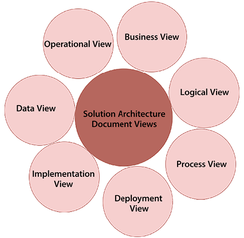
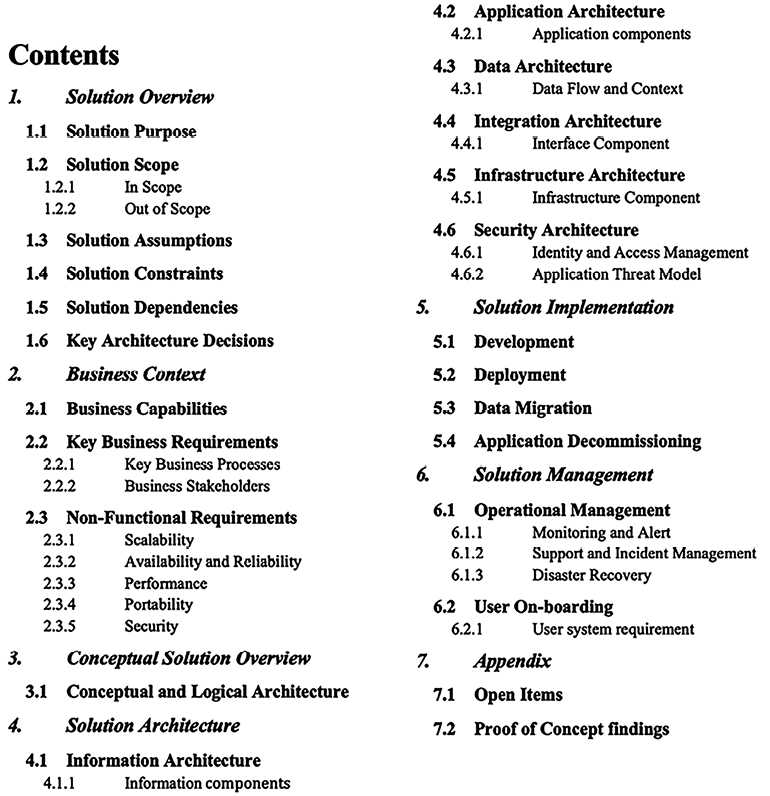
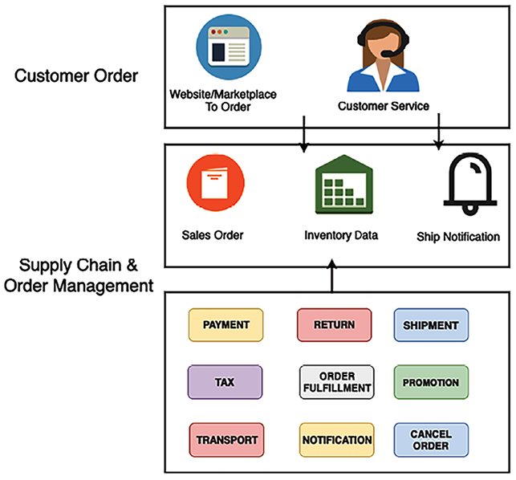
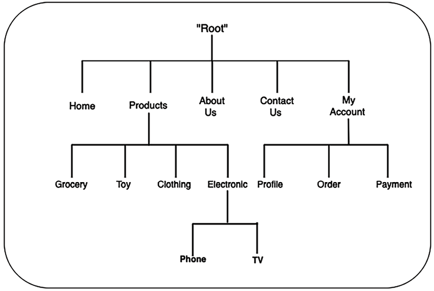
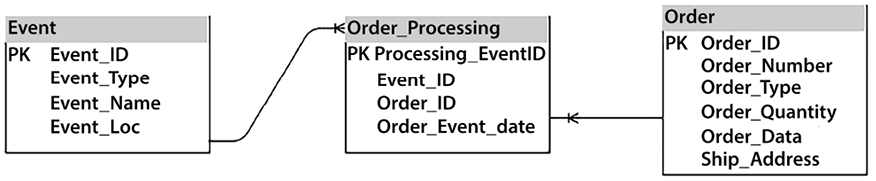
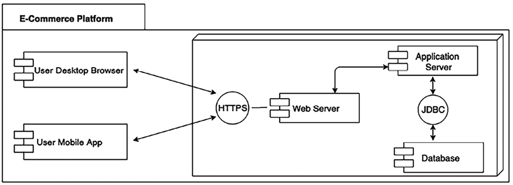

# سند معماری راه حل

در فصل های قبلی، با جنبه های مختلف طراحی معماری راه حل و بهینه سازی آشنا شدید. از آنجایی که معمار راه حل ها بر روی طراحی کار می کند، برای ارائه موفقیت آمیز برنامه، ارتباط مداوم با سایر ذینفعان ضروری است. معمار راه حل ها باید یک طرح را به تمام ذینفعان فنی و غیر فنی ابلاغ کند.

**سند معماری راه حل** (**SAD**) نمای سرتاسری از برنامه را ارائه می دهد و به همه کمک می کند تا در یک صفحه باشند. در این فصل، با جنبه های مختلف SAD آشنا می شوید که به نیازهای همه ذینفعان مرتبط با توسعه برنامه می پردازد.

شما در مورد ساختار SAD و انواع دیگر اسنادی که معمار راه حل ها باید از آنها آگاه باشد، مانند درخواست پیشنهاد، که در آن معمار راه حل ها باید ورودی برای تصمیم گیری استراتژیک ارائه دهد، آشنا خواهید شد. ما موضوعات زیر را پوشش خواهیم داد تا درک عمیق تری از مستندات موجود در معماری راه حل به دست آوریم:

- هدف SAD
- دیدگاه های SAD
- ساختار SAD
- چرخه زندگی SAD
- بهترین شیوه های SAD و مشکلات رایج
- اسناد تدارکات فناوری اطلاعات برای معماری راه حل

در پایان این فصل، شما در مورد SAD، ساختار آن و جزئیات مختلفی که باید در مستندات گنجانده شوند، آشنا خواهید شد. شما در مورد اسناد مختلف تدارکات فناوری اطلاعات، مانند درخواست برای پیشنهاد، درخواست اطلاعات، و درخواست برای نقل قول، که در آن یک معمار راه حل برای ارائه بازخورد شرکت می کند، آشنا خواهید شد. بیایید با یادگیری هدف SAD با اصول اولیه شروع کنیم.

# هدف SAD

اغلب، نیازهای مستندسازی معماری مورد توجه قرار نمی‌گیرد و تیم‌ها بدون درک معماری کلی، شروع به کار روی پیاده‌سازی می‌کنند. SAD نمای وسیعی از طراحی کلی راه حل ارائه می دهد تا همه ذینفعان را در جریان قرار دهد.

SAD برای ذینفعان مختلف، از جمله مدیران پروژه، که برای نظارت بر هماهنگی و پیشرفت پروژه به آن تکیه می کنند، حیاتی است. تحلیلگران کسب و کار از آن برای هماهنگ کردن پروژه با الزامات تجاری استفاده می کنند. تیم های فنی شامل توسعه دهندگان و متخصصان فناوری اطلاعات برای پیاده سازی و نگهداری راه حل های پیشنهادی به آن مراجعه می کنند. مدیریت ارشد از سند برای اتخاذ تصمیمات استراتژیک آگاهانه استفاده می کند. در نهایت، مشتریان یا کاربران نهایی، که ذینفعان نهایی هستند، به این سند وابسته هستند تا اطمینان حاصل کنند که نتیجه پروژه نیازها و انتظارات آنها را برآورده می کند.

SAD به دستیابی به اهداف زیر کمک می کند:

- راه حل برنامه انتها به انتها را به همه ذینفعان منتقل کنید.
- ارائه یک نمای کلی در سطح بالا از معماری و نماهای مختلف طراحی برنامه برای رسیدگی به الزامات کیفیت خدمات برنامه، مانند قابلیت اطمینان، امنیت، عملکرد و مقیاس پذیری.\* ارائه قابلیت ردیابی راه حل به نیازهای تجاری و به این نگاه کنید که چگونه برنامه همه الزامات عملکردی و **غیر عملکردی** (**NFRs**) را برآورده می کند.
- ارائه تمام دیدگاه های راه حل مورد نیاز برای طراحی، ساخت، آزمایش و اجرا.
- اثرات راه حل را برای اهداف برآورد، برنامه ریزی و تحویل تعریف کنید.
- تعریف فرآیند کسب و کار، ادامه و عملیات مورد نیاز برای کار بدون وقفه یک راه حل پس از راه اندازی تولید.

SADها هدف و هدف راه حل را تعریف می کنند و به اجزای حیاتی مانند محدودیت های راه حل، مفروضات و خطراتی که اغلب توسط تیم پیاده سازی نادیده گرفته می شوند، می پردازند. معمار راه حل ها باید اطمینان حاصل کند که سند را به زبانی آسان ایجاد می کند که کاربران تجاری بتوانند درک کنند و زمینه کسب و کار را با طراحی فنی مرتبط کنند. مستندسازی به حفظ دانش در صورت فرسایش منابع کمک می‌کند و فرآیند طراحی کلی را مستقل می‌کند.

برای کاربردهای موجود که در آن به تلاش‌های نوسازی نیاز است، SAD یک نمای انتزاعی از معماری فعلی و آینده و یک طرح انتقال ارائه می‌دهد. معمار راه حل ها وابستگی های سیستم موجود را درک می کند و آنها را برای کشف هر گونه خطر احتمالی از قبل مستند می کند. طرح مهاجرت به کسب‌وکارها کمک می‌کند تا ابزارها و فناوری مورد نیاز برای مدیریت سیستم جدید را درک کنند و منابع را بر اساس آن برنامه‌ریزی کنند.

معمار راه حل ها ارزیابی های مختلفی را در طول طراحی راه حل با ساختن یک **اثبات مفهوم** (**POC**) یا از طریق تحقیقات بازار انجام می دهد. یک SAD باید تمام ارزیابی‌های معماری و تأثیر آنها را همراه با انتخاب فناوری فهرست کند. یک SAD یک نمای مفهومی از وضعیت فعلی و هدف طراحی راه حل ارائه می دهد و یک رکورد تغییر را حفظ می کند. بیایید نماهای مختلف یک SAD را در بخش بعدی درک کنیم.

# دیدگاه های SAD

معمار راه حل ها نیاز به ایجاد یک SAD دارد که هم کاربران تجاری و هم کاربران فنی آن را درک کنند. یک SAD شکاف ارتباطی بین کاربر تجاری و تیم توسعه را برای درک عملکرد کلی برنامه پر می کند. بهترین راه برای جذب همه ذینفعان

ورودی rs با قرار دادن خود در موقعیت آنها و بررسی مشکلات از دیدگاه ذینفعان است. معمار راه حل ها جنبه های تجاری و فنی طراحی معماری را ارزیابی می کند تا تمام نیازهای فنی و غیر فنی کاربر را در نظر بگیرد.

همانطور که در نمودار زیر نشان داده شده است، یک نمای کلی از SAD شامل دیدگاه های مختلفی برای پوشش جنبه های مختلف ناشی از الزامات تجاری است:

شکل 16.1: نماهای SAD

معماران راه‌حل‌ها می‌توانند نمودارهای استانداردی مانند نمودار **زبان مدل‌سازی یکپارچه** (**UML**) یا یک نمودار بلوکی از **Microsoft Visio** را برای نمایش نماهای مختلف انتخاب کنند. این ابزارها به طور گسترده ای شناخته شده اند و به انتقال مفاهیم پیچیده معماری در قالبی به راحتی قابل هضم کمک می کنند. به طور کلی، نمودار باید به راحتی قابل خواندن و برای همه سهامداران تجاری و فنی باشد. یک SAD باید شامل دیدگاه‌های زیر باشد، تا جایی که ممکن است، برای رفع نیازهای همه:

- **نمای تجاری**: طراحی معماری به نگرانی های تجاری می پردازد و اهداف تجاری را حل می کند. نمای تجاری ارزش پیشنهادی راه حل و محصول کلی را نشان می دهد. برای ساده‌تر شدن، معمار راه‌حل‌ها ممکن است سناریوهای سطح بالا مرتبط با کسب‌وکار را شناسایی کرده و آن‌ها را به‌عنوان یک نمودار مورد استفاده ارائه کند. نمای تجاری نیز ذینفعان و منابع مورد نیاز برای اجرای پروژه را توصیف می کند. شما می توانید نمای تجاری را به عنوان نمای مورد استفاده نیز تعریف کنید.
- **نمایش منطقی**: این بسته های مختلفی را بر روی سیستم ارائه می دهد تا کاربران تجاری و طراحان بتوانند اجزای مختلف منطقی سیستم را درک کنند. دیدگاه منطقی یک نظم وقایع سیستم را ارائه می دهد که باید در آن ساخته شود. این نشان می دهد که چگونه بسته های متعدد سیستم به هم متصل شده اند و چگونه کاربر می تواند با آنها تعامل داشته باشد. به عنوان مثال، در یک برنامه بانکی، کاربر ابتدا باید با استفاده از بسته امنیتی احراز هویت و مجوز، با استفاده از بسته حساب وارد حساب کاربری خود شود، با استفاده از بسته وام برای دریافت وام و غیره اقدام کند. هر بسته نشان دهنده یک ماژول متفاوت است و می تواند به عنوان یک میکروسرویس ساخته شود.
- **نمایش فرآیند**: این جزئیات بیشتر را نشان می دهد و نشان می دهد که چگونه فرآیندهای حیاتی سیستم با هم کار می کنند. می توان آن را با استفاده از نمودار حالت منعکس کرد. معمار راه حل ها می تواند یک نمودار توالی برای نشان دادن جزئیات بیشتر ایجاد کند. در یک برنامه بانکی، یک نمای فرآیندی می تواند تایید یک وام یا حساب را ارائه دهد.
- **نمای استقرار**: نحوه عملکرد برنامه در تولید را نشان می دهد. این نشان می دهد که اجزای سیستم (مانند فایروال شبکه، متعادل کننده بار، سرورهای برنامه و پایگاه داده) چقدر به هم متصل هستند. معمار راه حل ها باید یک بلوک دیاگرام ساده ایجاد کند که کاربران تجاری بتوانند آن را درک کنند. می‌توانید جزئیات بیشتری را به نمودار استقرار UML اضافه کنید تا اجزای مختلف گره و وابستگی‌های آنها را برای کاربران فنی، مانند تیم‌های توسعه و DevOps نشان دهید. نمای استقرار نمایانگر طرح فیزیکی سیستم است.
- **نمای پیاده سازی**: این هسته SAD است و انتخاب های معماری و فناوری را نشان می دهد. معمار راه حل ها باید نمودار معماری را در اینجا قرار دهد - به عنوان مثال، اگر معماری 3 لایه، \_N-\_tier یا رویداد محور است - همراه با استدلال خود.
- اگر گزینه‌های فناوری را نیز به تفصیل توضیح دهید، به‌عنوان مثال، استفاده از جاوا در مقابل Node.js، همراه با مزایا و معایب آن‌ها، کمک خواهد کرد. در نمای پیاده سازی، می خواهید منابع و مهارت های مورد نیاز برای اجرای پروژه را توجیه کنید. تیم توسعه از نمای پیاده سازی برای ایجاد یک طرح دقیق، مانند نمودار کلاس استفاده می کند، اما نیازی نیست که بخشی از SAD باشد.\* **نمایش داده**: اکثر برنامه ها مبتنی بر داده هستند، بنابراین مشاهده داده ها ضروری است. نمای داده نشان می دهد که چگونه داده ها بین اجزای مختلف جریان می یابند و چگونه ذخیره می شوند. همچنین می تواند برای توضیح امنیت داده ها و یکپارچگی داده ها استفاده شود. معمار راه حل ها می تواند از نمودار موجودیت-رابطه برای نشان دادن رابطه بین جداول و طرحواره های مختلف در پایگاه داده استفاده کند. در بخش \_معماری داده ها با نمودار entity-relationship بیشتر آشنا خواهید شد. نمای داده همچنین گزارش ها و تحلیل های مورد نیاز را توضیح می دهد.
- **نمای عملیاتی**: این توضیح می دهد که چگونه سیستم پس از راه اندازی نگهداری می شود. اغلب، **توافقنامه های سطح خدمات** (**SLAs**)، عملکرد هشدار و نظارت، طرح بازیابی فاجعه و طرح پشتیبانی برای سیستم را تعریف می کنید. نمای عملیاتی همچنین نحوه انجام تعمیر و نگهداری سیستم را شرح می‌دهد، از جمله با استقرار رفع اشکال، وصله‌سازی، پشتیبان‌گیری و بازیابی، و رسیدگی به حوادث امنیتی.

همه نماهای فهرست شده تضمین می کنند که SAD تمام جنبه های سیستم و ذینفعان را پوشش می دهد. شما ممکن است نماهای اضافی - مانند نمای معماری فیزیکی، نمای معماری شبکه، یا نمای معماری امنیتی (کنترل ها) را بر اساس نیازهای ذینفعان اضافه کنید. به عنوان یک معمار راه حل، باید عملکرد سیستم را به صورت جامع مشاهده و درک کنید. بیایید تی را بررسی کنیم

ساختار SAD با جزئیات بیشتر در بخش بعدی.

# ساختار SAD

ساختار SAD می تواند از پروژه ای به پروژه دیگر با توجه به نیازهای ذینفعان و ماهیت پروژه داده شده متفاوت باشد. پروژه شما می تواند ایجاد یک محصول جدید از پایه، مدرن سازی یک برنامه قدیمی یا انتقال کل سیستم به فضای ابری باشد.

برای هر پروژه، سند SAD ممکن است متفاوت باشد، اما به طور کلی، باید نظرات ذینفعان مختلف را در نظر بگیرد و مجموعه‌ای از بخش‌ها را که در تصویر زیر نشان داده شده است شامل شود:

شکل 16.2: ساختار یک SAD

در ساختار SAD قبلی، می‌توانید بخش‌های مختلفی را ببینید که جنبه‌های معماری و طراحی راه‌حل‌های متعدد را پوشش می‌دهند. معمار راه حل ها ممکن است انتخاب کند که طبق الزامات پروژه، بخش های فرعی اضافی اضافه کند یا برخی از بخش ها را حذف کند. برای مثال، می‌توانید بخش مقدمه دیگری را برای بحث در مورد هدف سند با خلاصه اضافه کنید. برای یک پروژه انتقال، می توانید یک زیربخش برای ارائه معماری موجود، مقایسه آن با معماری هدف و غیره اضافه کنید. بیایید جزئیات هر بخش را بررسی کنیم.

## مروری بر راه حل

در بخش بررسی اجمالی راه حل، راه حل را در چند پاراگراف به طور خلاصه معرفی می کنیم و عملکرد راه حل و اجزای مختلف آن را در سطح بسیار بالایی شرح می دهیم. افزودن یک بلوک دیاگرام سطح بالا که اجزای مختلف را در یک مکان نشان می دهد خوب است. نمودار زیر نمای کلی راه حل یک پلت فرم تجارت الکترونیک را نشان می دهد:

شکل 16.3: نمای کلی راه حل یک پلت فرم تجارت الکترونیک

شما باید مختصری در مورد هر جزء به زبان ساده ارائه دهید تا کاربر تجاری بتواند عملکرد کلی راه حل را درک کند. به عنوان مثال، نمودار بالا یک سفارش تجارت الکترونیک معمولی و گردش کار مدیریت زنجیره تامین را به روشی ساده نشان می دهد:

- **سفارش مشتری**:
  - این فرآیند زمانی آغاز می شود که مشتری از طریق یک وب سایت یا یک بازار آنلاین سفارشی را ثبت کند.
  - خدمات مشتری در کمک به مشتریان در سفارشات، رسیدگی به سوالات و حل مسائلی که ممکن است در طول فرآیند سفارش ایجاد شود، نقش دارد.
- ** زنجیره تامین و مدیریت سفارش **:

  - **سفارش فروش**: پس از ثبت سفارش، به عنوان سفارش فروش ثبت می شود که فرآیند انجام سفارش را آغاز می کند.
  - **اطلاعات موجودی**: سیستم داده های موجودی را برای اطمینان از موجود بودن اقلام سفارش داده شده بررسی می کند.
  - **اعلان ارسال**: پس از پردازش سفارش و آماده شدن برای ارسال، یک اعلان ارسال می شود که احتمالاً شامل اطلاعات رهگیری برای مشتری است.\* ** پردازش سفارش**:

  - **پرداخت**: پردازش پرداخت مشتری، از جمله اعمال هرگونه مالیات و پردازش کدهای تبلیغاتی.
  - **مالیات**: محاسبه و اعمال صحیح مالیات بر فروش بر اساس موقعیت مکانی مشتری و اقلام خریداری شده.
  - **حمل و نقل**: ترتیب تدارکات برای تحویل سفارش به محل مشتری.
  - ** انجام سفارش **: برداشت واقعی، بسته بندی و آماده سازی برای ارسال اقلام سفارش داده شده.
  - **حمل و نقل**: فرآیند ارسال سفارش برای تحویل.
  - **تبلیغ**: اعمال تخفیف یا پیشنهادات ویژه که ممکن است بخشی از سفارش فروش باشد.
  - **اطلاع رسانی**: اطلاع رسانی به مشتری از وضعیت سفارش خود.
  - **بازگشت**: رسیدگی به هرگونه عودت، در صورتی که مشتری از خرید خود راضی نباشد یا در سفارش مشکلی وجود داشته باشد.
  - **لغو **: پردازش هرگونه لغو در صورتی که مشتری تصمیم به لغو سفارش قبل از ارسال داشته باشد.

این عناصر اجازه می‌دهند تا سفارش‌های مشتری از لحظه ارسال تا تحویل به‌طور کارآمد انجام شوند.

در مرحله بعد، ما نمای کلی راه حل را با زیربخش های زیر بیان می کنیم:

- **هدف راه حل **: این طرح مختصری از نگرانی کسب و کار که راه حل حل می کند و توجیه ایجاد این راه حل را ارائه می دهد. در سناریوی ما که قبلاً توضیح داده شد، هدف از این راه حل ساده کردن و خودکار کردن فرآیند مدیریت سفارش در زنجیره تامین است. هدف آن رسیدگی به نگرانی های کسب و کار در مورد کارایی، دقت و رضایت مشتری برای انجام سفارش است.
- **حوزه راه حل **: اینجا جایی است که محدوده تجاری راه حل پیشنهادی بیان می شود، و به وضوح موارد خارج از محدوده را توصیف می کند که راه حل آنها را در بر نمی گیرد. این دامنه شامل اتوماسیون سرتاسر سیستم مدیریت سفارش، از ثبت سفارش مشتری تا اطلاع رسانی حمل و نقل است. این تعهد مشتری پس از تحویل مانند جمع آوری بازخورد یا پردازش برگشت را پوشش نمی دهد.
- **فرض های راه حل **: تمام فرضیاتی که معمار راه حل ها در ارائه راه حل ایجاد کرده است را فهرست کنید. به عنوان مثال، در سناریوی ما، راه حل حداقل در دسترس بودن پهنای باند شبکه را برای اطمینان از پردازش داده های بلادرنگ فرض می کند. همچنین قابلیت ادغام با بازارهای مختلف را در نظر می گیرد و شرکت های حمل و نقل و مشتریان به روش های پرداخت دیجیتال دسترسی دارند.
- **محدودیت های راه حل **

: تمام محدودیت های فنی، تجاری و منابع را فهرست کنید. اغلب، محدودیت‌ها ناشی از انطباق صنعت و دولت است که باید در این بخش ذکر شود. شما همچنین می توانید خطر و طرح کاهش را برجسته کنید. راه حل باید با مقررات حفاظت از داده مانند GDPR برای حفظ حریم خصوصی داده های مشتری در اتحادیه اروپا و PCI-DSS برای ذخیره اطلاعات پرداخت مشتری در ایالات متحده مطابقت داشته باشد. محدودیت های منابع شامل بودجه ثابت و جدول زمانی برای استقرار است. ممکن است محدودیت های فنی مربوط به یکپارچه سازی سیستم های قدیمی وجود داشته باشد.

- **وابستگی های راه حل **: لیست تمام وابستگی های بالادستی و پایین دستی. به عنوان مثال، یک وب سایت تجارت الکترونیک باید با یک سیستم حمل و نقل مانند UPS یا FedEx ارتباط برقرار کند تا بسته ای را برای مشتریان ارسال کند. راه حل به داده های موجودی در زمان واقعی برای پردازش سفارشات دقیق از سیستم مدیریت موجودی بستگی دارد. برای تراکنش های مالی نیاز به ادغام با درگاه های پرداخت دارد.
- **تصمیمات کلیدی معماری**: بیانیه های مسئله مهم و راه حل های پیشنهادی را فهرست کنید. مزایا و معایب هر گزینه، چرایی تصمیم گیری خاص و منطق پشت آن را شرح دهید.

برای مثال، بیایید تصمیم بگیریم از یک پلتفرم مبتنی بر ابر برای مقیاس‌پذیری استفاده کنیم. این به دلیل توانایی آن در رسیدگی به حجم سفارش های مختلف و نیاز به سرمایه گذاری اولیه کمتر انتخاب شد. مبادله یک هزینه عملیاتی مستمر است.

تصمیم دیگر می تواند اتخاذ رویکرد اول API برای ادغام باشد. این برای اطمینان از انعطاف پذیری و سهولت ادغام با انواع شرکا و خدمات انتخاب شده است. با این حال، این پیچیدگی مدیریت API را افزایش می دهد.

پس از ارائه یک نمای کلی راه حل، می خواهید آن را با زمینه کسب و کار مرتبط کنید. در بخش بعدی، بیایید به نمای زمینه کسب و کار با جزئیات بیشتری نگاه کنیم.

## زمینه کسب و کار

در بخش زمینه کسب و کار، معمار راه حل ها باید یک نمای کلی در سطح بالایی از قابلیت ها و الزامات کسب و کار ارائه دهد که راه حل به آن می پردازد. این بخش فقط شامل یک نمای انتزاعی از الزامات است. الزامات دقیق باید در یک سند جداگانه ذکر و یادداشت شود. با این حال، پیوند خارجی به سند الزامات را می توان در اینجا ارائه کرد. شما باید زیربخش های اصلی زیر را شامل کنید:

- **قابلیت های تجاری**: به طور مختصر قابلیت های تجاری که راه حل برای آنها طراحی شده است را توضیح دهید. اطمینان حاصل کنید که مزایای قابلیت‌ها و چگونگی رفع نیازهای مشتری را در نظر بگیرید.
- ** الزامات کسب و کار کلیدی **: فهرست تمام نگرانی های کلیدی کسب و کار که راه حل به آنها رسیدگی می کند. یک نمای سطح بالا از الزامات کلیدی ارائه دهید و یک مرجع به سند الزامات دقیق اضافه کنید.
- **فرآیندهای تجاری کلیدی**: معماران راه حل باید فرآیندهای کلیدی را با سند فرآیند کسب و کار نشان دهند. نمودار زیر یک نمای ساده از یک مدل فرآیند کسب و کار برنامه تجارت الکترونیکی را نشان می دهد:

شکل 16.4: نمودار فرآیند کسب و کار یک پلت فرم تجارت الکترونیک

- ** ذینفعان تجاری **: ذینفعانی را که به طور مستقیم یا غیرمستقیم تحت تأثیر پروژه قرار گرفته اند فهرست کنید. این شامل حامیان مالی، توسعه دهندگان، کاربران نهایی، فروشندگان و شرکا می شود.
- **NFR**: معماران راه حل ها باید بیشتر روی NFR ها تمرکز کنند زیرا اغلب توسط کاربران تجاری و تیم توسعه از دست می روند. در سطح بالا، NFR باید شامل موارد زیر باشد:
  - **مقیاس پذیری**: مقیاس برنامه چگونه می تواند به عنوان بار کاری نوسان داشته باشد؟ (به عنوان مثال، از 1000 تا 10000 تراکنش در ثانیه در روز یا ماه مقیاس کنید.)
  - **در دسترس بودن و قابلیت اطمینان**: خرابی قابل قبول برای در دسترس بودن سیستم چقدر است؟ (به عنوان مثال، 99.99٪ در دسترس بودن یا 45 دقیقه توقف در ماه.)
  - **عملکرد**: الزامات عملکرد چیست؟ سیستم کجا می تواند افزایش بار را بدون تأثیر بر تجربه کاربر نهایی مدیریت کند؟ (به عنوان مثال، صفحه کاتالوگ باید در عرض 3 ثانیه بارگیری شود.)
  - **قابل حمل**: آیا برنامه می تواند بدون هیچ کار اضافی روی چندین پلتفرم اجرا شود؟ (به عنوان مثال، برنامه تلفن همراه باید روی سیستم عامل های iOS و Android اجرا شود.)
  - **ظرفیت**: حداکثر حجم کاری که یک اپلیکیشن می تواند تحمل کند چقدر است؟ (به عنوان مثال، حداکثر تعداد کاربران، تعداد درخواست ها، زمان پاسخگویی مورد انتظار و بار مورد انتظار برنامه.)

دیدگاه مفهومی معماری نقطه شیرینی است که یک نمای کلی سیستمی را برای ذینفعان تجاری و فنی فراهم می کند. بیایید با جزئیات بیشتر در مورد دیدگاه مفهومی بیشتر بیاموزیم.

## مروری بر راه حل مفهومی

بخش بررسی اجمالی راه حل مفهومی یک نمودار در سطح انتزاعی را ارائه می دهد که یک نمای بزرگ از کل راه حل، از جمله جنبه های تجاری و فنی آن را به تصویر می کشد. مبنایی برای تجزیه و تحلیل و مطالعات مبادله ای فراهم می کند تا به اصلاح و بهینه سازی معماری راه حل با جزئیات کافی برای پشتیبانی از طراحی و اجرای راه حل کمک کند. نمودار زیر یک نمودار معماری مفهومی از یک پلت فرم تجارت الکترونیک را نشان می دهد:

شکل 16.5: معماری مفهومی دیآگرام یک پلت فرم تجارت الکترونیک

نمودار قبلی یک نمای انتزاعی از ماژول های مهم و جریان اطلاعات بین آنها را نشان می دهد. معماری مفهومی درک خوبی از معماری کلی را برای کاربران تجاری و فنی فراهم می کند. با این حال، کاربران فنی نیاز به عمق بیشتر معماری دارند. بیایید در بخش بعدی به معماری راه حل عمیق تر بپردازیم.

## معماری راه حل

بخش معماری راه حل عمیقاً در هر بخش از معماری فرو می رود. نماهای مختلفی را ارائه می دهد که تیم فنی می تواند از آنها برای ایجاد یک طراحی دقیق و کار بر روی پیاده سازی استفاده کند. این نماها می‌توانند سایر گروه‌های کاربری مانند توسعه‌دهندگان، مهندسین زیرساخت، مهندسین DevOps، مهندسین امنیت و طراحان **تجربه کاربر** (**UX**) را هدف قرار دهند.

بیایید وارد زیربخش های اصلی زیر شویم تا جزئیات بیشتری را بدانیم.

### ساختار اطلاعات

این بخش یک جریان ناوبری کاربر را به برنامه ارائه می دهد. معمار راه حل ها باید ساختار ناوبری برنامه را در سطح بالایی قرار دهد. همانطور که در نمودار زیر نشان داده شده است، برای یک وب سایت تجارت الکترونیک، سه کلیک طول می کشد تا کاربر به صفحه مورد نظر حرکت کند:

شکل 16.6: نمودار معماری اطلاعاتی یک پلت فرم تجارت الکترونیک

معماران راه‌حل‌ها می‌توانند جزئیات بیشتری مانند ناوبری وب‌سایت، طبقه‌بندی یا یک قاب سیمی سطح بالا که طراحان UX می‌توانند برای تولید یک قاب دقیق از آن استفاده کنند، اضافه کنند.

### معماری اپلیکیشن

این بخش تیم توسعه را هدف قرار می دهد. این جزئیات پیاده سازی بیشتری را برای یک معمار نرم افزار یا تیم توسعه ارائه می دهد تا یک طرح دقیق بسازد. نمودار زیر معماری برنامه را برای یک وب سایت تجارت الکترونیک با بلوک های سازنده فناوری مانند حافظه پنهان، شبکه، توزیع محتوا و ذخیره سازی داده نشان می دهد:

شکل 16.7: نمودار معماری کاربردی یک پلت فرم تجارت الکترونیک

همانطور که در نمودار قبل نشان داده شده است، باید اجزای معماری برنامه مورد نیاز برای یک پلت فرم تجارت الکترونیک مبتنی بر ابر را فهرست کنید تا تجربه خرید آنلاین مورد نظر را ارائه دهید. این اجزا عبارتند از:

- **تعامل کاربر:** مشتریان از طریق یک رابط وب با پلتفرم تجارت الکترونیک تعامل می کنند که با درخواست خرید ایمن که از طریق **لایه سوکت های امن** (**SSL**) برای ارتباطات رمزگذاری شده انجام می شود، شروع می شود.
- **تحویل محتوا:** Amazon CloudFront، یک **شبکه تحویل محتوا** (**CDN**)، محتوای ثابت مانند تصاویر، شیوه نامه ها و اسکریپت های سمت سرویس گیرنده را به طور موثر در اختیار کاربر قرار می دهد. با ذخیره کردن محتوای نزدیک به مکان کاربر، تأخیر را کاهش می دهد.
- **سیستم نام دامنه** (**DNS**): Amazon Route 53 برای مدیریت DNS استفاده می شود و درخواست های کاربر را به مناسب ترین نقاط پایانی مانند توزیع CloudFront یا متعادل کننده بار برنامه هدایت می کند.\* **پردازش برنامه :** در داخل **ابر خصوصی مجازی** (**VPC**)، سرویس برنامه تجارت الکترونیک درخواست های پویا را پردازش می کند، مانند ارائه صفحه بر اساس نمایه های کاربر و سابقه خرید. یک سرویس توصیه محصول در VPC پیشنهادات محصول شخصی شده را بر اساس رفتار و ترجیحات کاربران به آنها ارائه می دهد.
- **مکانیسم ذخیره سازی:** Amazon ElastiCache برای سرعت بخشیدن به بازیابی داده ها با ذخیره سازی داده هایی که اغلب به آنها دسترسی پیدا می کند، مانند وضعیت جلسه و اطلاعات محصول اغلب مشاهده شده، استفاده می شود. این باعث کاهش بار روی پایگاه‌های داده باطن می‌شود و زمان پاسخگویی برنامه را بهبود می‌بخشد.
- **ذخیره و پردازش داده ها:** سرویس پرداخت سبد خرید تعاملات و تراکنش های سبد خرید کاربر را مدیریت می کند. اطلاعات کش کاتالوگ و جلسه برای دسترسی سریع ذخیره می شود. یک موتور جستجو که با Amazon Elasticsearch ساخته شده است، قابلیت های جستجوی قدرتمندی را در سراسر کاتالوگ محصولات ارائه می دهد.
- **نمایه کاربر و داده های تراکنش:** اطلاعات پروفایل کاربر به همراه داده های تراکنش در DynamoDB آمازون ذخیره می شود و قابلیت های سریع و مقیاس پذیر پایگاه داده NoSQL را ارائه می دهد.
- ** ثبت داده ها: ** آمازون S3 برای ثبت داده هایی مانند داده های جریان کلیک، تعاملات محصول و گزارش های سیستم استفاده می شود و امکان تجزیه و تحلیل عمیق و بینش در مورد رفتار کاربر و عملکرد سیستم را فراهم می کند.

این بخش تمام ماژول‌های برنامه‌ای را که برای معماری مدرن‌سازی اپلیکیشن باید بازنشسته، حفظ، مجدداً پلتفرم و تبدیل شوند، فهرست می‌کند.

### معماری داده

این بخش در درجه اول توسط مدیریت پایگاه داده و تیم توسعه برای درک طرحواره های پایگاه داده و نحوه ارتباط جداول استفاده می شود. این بخش اغلب شامل **نمودار رابطه موجودیت** (**ERD**) است که روابط مجموعه های موجودیت ذخیره شده در پایگاه داده را نشان می دهد، مانند موارد زیر:

شکل 16.8: ERD یک پلت فرم تجارت الکترونیک

ERD یک نمایش بصری از موجودیت ها (که معمولاً با جداول پایگاه داده مطابقت دارند) و روابط بین آنها است. این یک ابزار گرافیکی است که در طراحی پایگاه داده برای نشان دادن ساختار منطقی استفاده می شود

پایگاه های داده نمودار قبلی نمونه ای از ERD برای یک سیستم پردازش سفارش است. ERD رابطه بین رویدادهایی که روی می دهند و سفارشاتی که در سیستم پردازش می شوند را نشان می دهد. در اینجا اجزا و روابط آنها آمده است:

- **موجود رویداد**: یک رخداد یا اقدام را در سیستم با ویژگی هایی مانند "Event_ID" (کلید اصلی)، "Event_Type"، "Event_Name" و "Event_Loc" نشان می دهد. این ویژگی‌ها ممکن است جزئیات رویداد، محل وقوع و سایر ویژگی‌ها را توضیح دهند.
- ** نهاد سفارش**: یک سفارش مشتری را با ویژگی هایی از جمله "شناسه*سفارش" (کلید اصلی)، "شماره*سفارش"، "نوع*سفارش"، "مقدار*سفارش"، "تاریخ*سفارش" و "آدرس*سفارش" نشان می دهد. این ویژگی ها اطلاعات خاص هر سفارش، مانند مبلغ سفارش، جزئیات حمل و نقل و زمان ثبت سفارش را ذخیره می کند.
- **Order_Processing Entity**: این به عنوان یک موجودیت ارتباطی (یا جدول اتصال) عمل می کند که رویدادها را به سفارش ها متصل می کند، که نشان می دهد یک رویداد منجر به پردازش سفارش می شود. این کلید اصلی خود را دارد ("Processing_EventID") و شامل کلیدهای خارجی "Event_ID" و "Order_ID" است که به ترتیب به رویدادها و Order مربوط می شوند. وجود ویژگی «Order_Event_date» نشان می‌دهد که این ویژگی همچنین زمانی را ثبت می‌کند که یک رویداد منجر به پردازش سفارش می‌شود.

خطوط بین موجودیت ها روابط را نشان می دهد. در این ERD، نماد «پای کلاغ» در انتهای خطوط رابطه نشان‌دهنده «بسیار» است، در حالی که خط تک نشان‌دهنده «یک» است که نشان‌دهنده اصلی بودن روابط است.

بخش معماری داده تمام اشیاء داده ای را که باید در طول توسعه برنامه در نظر گرفته شوند فهرست می کند.

### معماری یکپارچه سازی

معماری یکپارچه سازی به چارچوب توسعه یافته ای اشاره دارد که به برنامه های کاربردی، سیستم ها و سرویس های مختلف نرم افزار اجازه می دهد تا به طور مؤثر با یکدیگر ارتباط برقرار کرده و کار کنند. این شامل طراحی و پیاده‌سازی روش‌ها و میان‌افزاری است که تبادل داده‌ها و فرآیندها را در سیستم‌های مختلف در یک سازمان یا بین سازمان و طرف‌های خارجی تسهیل می‌کند. این بخش عمدتاً فروشندگان، شرکا و سایر تیم ها را هدف قرار می دهد. به عنوان مثال، نمودار زیر تمام نقاط ادغام با سیستم های دیگر را در یک برنامه تجارت الکترونیک نشان می دهد:

شکل 16.9: نمودار معماری یکپارچه سازی یک پلت فرم تجارت الکترونیک

بخش معماری یکپارچه سازی تمام سیستم های بالادستی که داده ها را به برنامه شما ارائه می دهند فهرست می کند. هر پلتفرم، سرویس یا پایگاه داده ای که برنامه شما از آنها داده دریافت می کند، همراه با ماهیت جریان داده ها و جزئیات سیستم های پایین دستی که برنامه شما داده ها را به آن ها ارسال می کند، در اینجا فهرست شده است. این می‌تواند شامل سایر برنامه‌ها، پایگاه‌های داده یا خدماتی باشد که به داده‌های تولید یا پردازش شده توسط برنامه شما متکی هستند. شما باید تمام وابستگی های سیستم را در مورد برنامه خود فهرست کنید.

### معماری زیرساخت

این بخش عمدتاً تیم زیرساخت و مهندسین سیستم را هدف قرار داده است. معمار راه حل ها باید شامل یک نمودار استقرار باشد که مکان منطقی سرور و وابستگی ها را مشخص کند.

به عنوان مثال، شکل زیر نمودار استقرار تولید برای یک برنامه تجارت الکترونیکی را نشان می دهد. می‌توانید یک نمودار جداگانه برای محیط‌های دیگر، مانند محیط‌های توسعه‌دهنده، **تضمین کیفیت** (**QA**) و **تست پذیرش کاربر** (**UAT**) تولید کنید:

شکل 16.10: نمودار استقرار یک پلت فرم تجارت الکترونیک

این بخش تمام پیکربندی های سرور، پایگاه های داده، شبکه ها و سوئیچ ها را برای استقرار برنامه فهرست می کند.

### معماری امنیتی

این بخش شامل تمام جنبه های امنیتی و انطباق برنامه است، از جمله:

- **مدیریت هویت و دسترسی** (**IAM**) مانند **Active Directory** (**AD**)، احراز هویت کاربر و مدیریت مجوز
- امنیت زیرساخت مانند پیکربندی فایروال، **سیستم جلوگیری از نفوذ** (**IPS**)/**سیستم تشخیص نفوذ** (**IDS**)، و نرم افزار آنتی ویروس
- امنیت برنامه مانند **فایروال برنامه های وب** (**WAFs**) و **محافظت از انکار سرویس توزیع شده** (**DDoS**)\* **امنیت داده** در حالت استراحت و در حال انتقال با استفاده از SSL، الگوریتم های رمزگذاری، مدیریت کلید و غیره

به طور کلی، معمار راه‌حل‌ها می‌تواند شامل یک مدل تهدید امنیتی برنامه برای شناسایی آسیب‌پذیری‌های بالقوه، مانند **اسکریپت بین سایتی** (**XSS**) و ** تزریق SQL** (**SQLi**) باشد، و برنامه ریزی برای محافظت از برنامه در برابر هر گونه تهدید امنیتی.

## پیاده سازی راه حل

بخش تحویل راه حل شامل ملاحظات ضروری برای توسعه و استقرار یک راه حل است. می تواند از زیربخش های اصلی زیر تشکیل شود:

- **توسعه**: این بخش برای تیم توسعه ضروری است. ابزارهای توسعه، زبان برنامه‌نویسی، مخزن کد، نسخه‌سازی کد و شاخه‌بندی، همراه با منطق پشت انتخاب‌ها را مورد بحث قرار می‌دهد.
- **استقرار**: این بخش عمدتاً بر روی مهندسان DevOps تمرکز دارد و در مورد آن صحبت می کند

رویکرد استقرار، ابزارهای استقرار، اجزای مختلف استقرار، و چک لیست استقرار، همراه با منطق پشت انتخاب ها.

- ** مهاجرت داده ها**: این بخش به تیم کمک می کند تا رویکرد انتقال و جذب داده ها، محدوده انتقال داده، اشیاء داده های مختلف، ابزارهای انتقال داده مورد استفاده، منابع داده ها و قالب های داده و غیره را درک کند.\* ** از کار انداختن برنامه**: در این بخش سیستم های موجود که باید از رده خارج شوند و استراتژی خروج از سیستم فعلی در صورت عدم تحقق **بازده سرمایه** (**ROI**) فهرست می شود. معمار راه حل ها باید یک رویکرد و جدول زمانی برای از کار انداختن سیستم قدیمی ارائه دهد و تاثیر کلی را ارزیابی کند.

SAD شامل یک رویکرد توسعه و ابزار است. با این حال، طراحی دقیق در سطح برنامه، مانند نمودار کلاس یا شبه کد ندارد. چنین جزئیاتی باید توسط معمار نرم افزار یا توسعه دهنده ارشد تحت سند طراحی جزئیات برنامه نرم افزاری مربوطه رسیدگی شود. همانطور که راه حلی به کار گرفته می شود، باید در تولید مدیریت شود. بیایید در مورد جزئیاتی که به بخش مدیریت راه حل می روند، بیاموزیم.

## مدیریت راه حل

بخش مدیریت راه حل بر پشتیبانی تولید و نگهداری مداوم سیستم در سایر محیط های غیر محصول متمرکز است. این بخش جنبه‌های عملیاتی راه‌حل، از جمله نظارت، مدیریت حادثه، ورود کاربر، و فرآیندهای پشتیبانی و بازیابی را پوشش می‌دهد. بخش مدیریت راه حل عمدتاً تیم مدیریت عملیات را هدف قرار می دهد. این بخش به حوزه های زیر می پردازد:

- مدیریت عملیاتی، مانند وصله سیستم و ارتقاء محیط های توسعه دهنده، تست، مرحله بندی و تولید
- ابزارهایی برای مدیریت ارتقاء برنامه ها و نسخه های جدید
- ابزارهایی برای مدیریت زیرساخت سیستم
- نظارت و هشدار سیستم؛ داشبورد عملیات
- پشتیبانی تولید، SLA، و مدیریت حوادث
- بازیابی بلایا و **ادامه فرآیند کسب و کار** (**BPC**)

یک معمار راه حل باید برای تایید راه حل مناسب در طول طراحی، تحقیق و داده جمع آوری کند. چنین جزئیات اضافی را می توان در بخش ضمیمه قرار داد. بیایید در مورد بخش ضمیمه یک SAD بیشتر بیاموزیم.

## ضمیمه

مانند هر سند پیشنهادی تجاری، SAD همچنین دارای یک بخش ضمیمه باز است که حاوی هر گونه داده ای است که از معماری کلی و انتخاب راه حل شما پشتیبانی می کند. در این بخش، معمار راه‌حل‌ها می‌تواند مسائل باز و هر داده تحقیقاتی را شامل شود، مانند نتیجه POC، داده‌های مقایسه ابزار، و داده‌های فروشندگان و شرکا.

این بخش در مورد ساختار SAD به شما یک نمای کلی از ساختار SAD به همراه بخش های مختلف ارائه می دهد. SAD باید شامل بخش های اصلی ذکر شده در قبل باشد. با این حال، معمار راه‌حل‌ها ممکن است برخی از بخش‌ها را حذف کند یا بخش‌های دیگر را برای برآوردن نیازهای خاص سازمان یا پروژه شامل شود. همانند سایر اسناد، ادامه تکرار SADها و جستجوی فرصت‌هایی برای بهبود ضروری است. SADهای قوی تر منجر به دستورالعمل های پیاده سازی به خوبی تعریف شده می شوند و خطر شکست را کاهش می دهند.

SAD یک سند در حال اجرا است که در مراحل اولیه ایجاد شده و در طول سال ها بر اساس تغییرات مختلف در طول چرخه عمر برنامه به روز می شود. بیایید اکنون به چرخه زندگی SAD نگاه کنیم.

# چرخه زندگی SAD

چرخه عمر یک SAD با مراحل مختلف چرخه عمر پروژه همسو می شود. قبلاً در این فصل، بخش‌های مختلف SAD را بررسی کردیم، و هر کدام در مراحل مجزایی ایجاد می‌شوند. چرخه عمر یک SAD معمولاً شامل مراحل زیر است:

شکل 16.11: چرخه زندگی SAD

بیایید به مراحل چرخه زندگی SAD که در نمودار قبل نشان داده شده است، با جزئیات بیشتر نگاه کنیم:

- **شروع **: مرحله شروع جایی است که نیاز به SAD تشخیص داده می شود، معمولاً در ابتدای پروژه. این مرحله اهدافی مانند ترسیم ساختار نرم افزار برای یک برنامه جدید سازمانی را مشخص می کند. این مرحله جهت و محدوده سند را تعیین می کند و از همسویی آن با اهداف پروژه و انتظارات ذینفعان اطمینان حاصل می کند.
- **جمع آوری الزامات**: در این مرحله حیاتی، الزامات دقیق از ذینفعان کلیدی جمع آوری می شود. برای یک پلت فرم تجارت الکترونیک خرده فروشی، این ممکن است شامل جمع آوری بینش در مورد تجربه کاربر، پردازش پرداخت و مدیریت موجودی باشد. این مرحله تضمین می کند که SAD به تمام جنبه های حیاتی پروژه می پردازد.
- **پیش نویس **: مرحله تهیه پیش نویس شامل ایجاد نسخه اولیه SAD است. این سند ممکن است معماری یک سیستم مبتنی بر ابر را شرح دهد و استفاده از سرویس‌های AWS خاص، طرح‌واره‌های پایگاه داده و پروتکل‌های امنیتی را مشخص کند. این پیش نویس به عنوان طرحی برای اجرای فنی پروژه عمل می کند.
- **بازبینی و بازخورد**: پس از آماده شدن پیش نویس، برای بررسی با سهامداران به اشتراک گذاشته می شود. در مورد سیستم مدیریت مراقبت های بهداشتی، پزشکان، کارکنان فناوری اطلاعات و پرسنل اداری ممکن است در مورد جنبه های مختلف مانند جریان داده های بیمار و ج، بازخورد ارائه دهند.

رعایت مقررات بهداشتی.2. ** نهایی سازی **: پس از گنجاندن بازخورد، SAD نهایی می شود. این ممکن است شامل تنظیم یک معماری شبکه برای بهبود کارایی جریان داده بر اساس ورودی ذینفعان باشد.

- **اجرا **: سند نهایی اجرای پروژه را راهنمایی می کند. به عنوان مثال، توسعه دهندگان و مدیران پروژه از SAD برای اطمینان از همسویی با معماری و پشته فناوری برنامه ریزی شده در پروژه توسعه نرم افزار استفاده می کنند.
- **نگهداری**: با گذشت زمان، SAD مجدداً بررسی و به روز می شود تا تغییرات تکنولوژیکی، اهداف تجاری یا عوامل خارجی را منعکس کند. به عنوان مثال، معرفی قوانین جدید حفظ حریم خصوصی داده ها ممکن است نیاز به به روز رسانی SAD برای اطمینان از انطباق مداوم داشته باشد.

بیایید اکنون به برخی از بهترین شیوه ها و دام هایی که باید در هنگام تولید SAD از آنها اجتناب کرد نگاه کنیم.

# بهترین شیوه های SAD و دام های رایج

مدیریت موثر SAD ها شامل بهترین شیوه های معینی است. واضح و مختصر نگه داشتن سند بسیار مهم است و در عین اجتناب از اصطلاحات فنی، به راحتی قابل درک است. مشارکت منظم ذینفعان در فرآیند تضمین می کند که سند با الزامات تجاری و فنی مطابقت دارد. به روز نگه داشتن SAD با آخرین تغییرات و پیشرفت های پروژه برای ارتباط و مفید بودن آن حیاتی است. علاوه بر این، همراستایی معماری مشخص شده در SAD با اهداف تجاری گسترده‌تر سازمان ضروری است و اطمینان حاصل می‌کند که راه‌حل‌های فنی پیشنهادی از اهداف تجاری پشتیبانی و ارتقا می‌دهند.

همچنین مشکلات رایجی وجود دارد که هنگام کار با SAD باید از آنها اجتناب کنید. پیچیدگی بیش از حد معماری می تواند منجر به چالش هایی در اجرا و نگهداری شود. عدم انعطاف در سند می تواند مانع از توانایی آن در سازگاری با تغییرات در محدوده پروژه یا اهداف شود. مشارکت ناکافی ذینفعان می تواند منجر به عدم همسویی با نیازها و الزامات واقعی کسب و کار شود.

علاوه بر این، شیوه‌های مستندسازی ضعیف می‌تواند منجر به سوء تفاهم، خطاهای پیاده‌سازی و چالش‌هایی در اجرای پروژه شود. برای اطمینان از موفقیت معماری راه حل، پرداختن به این مشکلات به طور فعال ضروری است.

علاوه بر SAD، معماری راه حل اغلب شامل یک پیشنهاد خرید قابل توجه با یک نیاز خاص است که به عنوان سند **درخواست برای x** (**RFx**) شناخته می شود. بیایید با اسناد RFx آشنا شویم.

# اسناد تدارکات فناوری اطلاعات برای یک معماری راه حل

اسناد تدارکات فناوری اطلاعات معمولاً به عنوان ** اسناد RFx ** شناخته می شوند. این اصطلاحی است که شامل مراحل مختلف فرآیند تدارکات است. RFx به یک فرآیند درخواست رسمی اشاره دارد. اسناد RFx به‌عنوان **درخواست پیشنهاد** (**RFP**)، **درخواست اطلاعات** (**RFI**) و **درخواست پیشنهاد** (**RFQ**) طبقه‌بندی می‌شوند. اسناد.

معماران راه حل اغلب در فرآیند تدارکات شرکت دارند، یا این فرآیند را هدایت می کنند یا ورودی خود را ارائه می دهند. این تدارکات ممکن است مربوط به برون سپاری، قرارداد، تهیه نرم افزار مانند پایگاه داده یا ابزارهای توسعه، یا خرید راه حل های SaaS باشد.

از آنجایی که این اسناد می توانند بسیار فنی باشند و احتمالاً تأثیری گسترده و بلندمدت خواهند داشت، معمار راه حل ها باید با پاسخ به هر گونه الزامات تدارکات، ورودی ارائه دهد.

بیایید تفاوت بین اسناد مختلف RFx را درک کنیم:

- **RFI**: RFI در اوایل فرآیند تدارکات انجام می شود، جایی که خریداران اطلاعات فروشندگان مختلف را برای تصمیم گیری آگاهانه در مورد انتخاب خرید خود برای مرحله بعدی دعوت می کنند. یک سند RFI اطلاعاتی را در مورد توانایی های تامین کنندگان مختلف جمع آوری می کند، جایی که خریدار می تواند همه تامین کنندگان را در پارامترهای مشابه مقایسه کند و مراحل پیشنهادی بعدی را با تامین کنندگان در لیست کوتاه ادامه دهد. به عنوان مثال، فرض کنید یک شرکت در حال بررسی بازار است تا **سیستم های مدیریت یادگیری** (**LMS**) را که نیازهای آموزشی آن را برآورده می کند، شناسایی کند. این شرکت یک RFI برای جمع‌آوری اطلاعات دقیق درباره عملکردها، قابلیت‌های یکپارچه‌سازی و تجربیات کاربر پلتفرم‌های LMS در دسترس صادر می‌کند.
- **RFP**: در این فرآیند، تامین کنندگانی که از فرآیند RFI لیست کوتاه شده اند، اطلاعات بیشتری در مورد نتیجه پروژه دریافت می کنند. یک سند RFP بیشتر از یک سند RFI است که در آن تامین کنندگان می توانند بهترین راه را برای به دست آوردن راه حل ها برای خریدار ارائه دهند. تامین کننده می تواند گزینه های متعددی را با مزایا و معایب هر رویکرد شامل شود. به عنوان مثال، فرض کنید یک سازمان دولتی می خواهد زیرساخت فناوری اطلاعات خود را ارتقا دهد. یک RFP صادر می کند که در آن سیستم فعلی، بهبودهای مورد نیاز و معیارهای عملکرد مشخص می شود. فروشندگان با پیشنهاداتی پاسخ می دهند که شامل راه حل های فنی، جدول زمانی پروژه و برآورد هزینه است.
- **RFQ**: در این فرآیند، خریداران الزامات را در مقایسه با RFP محدود می کنند و الزامات دقیق کار، تجهیزات و لوازم را فهرست می کنند. تامین کنندگان باید هزینه ای را برای الزامات ذکر شده ارائه دهند و خریدار می تواند بهترین قیمت را برای اعطای قرارداد انتخاب کند. به عنوان مثال، بگوییم که یک استارت‌آپ فناوری در حال آماده شدن است تا زیرساخت‌های فناوری اطلاعات خود را به گونه‌ای توسعه دهد که پایگاه کاربران رو به رشدی را در خود جای دهد.

نیاز استارتاپ

ds برای تهیه منابع محاسبات ابری اضافی برای مدیریت بار افزایش یافته. قبلاً الزامات خود را از نظر نمونه های محاسباتی، حافظه، ذخیره سازی و پهنای باند تعیین کرده است. RFQ از ارائه‌دهندگان زیرساخت فناوری اطلاعات درخواست می‌کند که بهترین قیمت‌ها را برای گزینه‌های قیمت‌گذاری ماهانه و سالانه، همراه با هرگونه تخفیف برای تعهدات بلندمدت ارسال کنند. این استارت‌آپ همچنین اطلاعاتی در مورد خدمات اضافی مانند پشتیبانی، نظارت و ویژگی‌های امنیتی می‌خواهد که می‌تواند در قیمت پیشنهادی گنجانده شود.

RFP محبوب ترین انتخاب است، زیرا اغلب، برای تسریع روند، سازمان خریدار اغلب فقط درخواست اسناد RFP را از فروشندگان احتمالی می دهد. در چنین شرایطی، سند RFP باید از ساختاری شفاف استفاده کند تا خریدار بتواند فروشندگان ترجیحی را از نظر قابلیت ها، رویکردهای راه حل و هزینه ها برای تصمیم گیری سریع مقایسه کند.

با توجه به نکات فنی تدارکات در سازمان های فناوری اطلاعات، معماران راه حل نقش اساسی در ارزیابی قابلیت ها و رویکردهای فروشندگان از دیدگاه خریدار و پاسخگویی به اسناد RFP از طرف تامین کننده دارند. در طول فرآیند RFP برای حجم کاری IT، تخصص یک معمار راه حل بسیار مهم است. در اینجا نحوه مشارکت آنها آمده است:

1. **درک الزامات**: معمار راه حل ها با درک کامل الزامات فنی و تجاری پروژه، که ممکن است شامل بهبود سیستم های موجود، مهاجرت به ابر یا یکپارچه سازی فناوری های جدید باشد، شروع می کند.
2. **طراحی راه حل**: آنها یک طرح اولیه از معماری فناوری اطلاعات را پیش نویس می کنند که نیازمندی های شناسایی شده را بررسی می کند. این شامل انتخاب فناوری های مناسب، طراحی طرح زیرساخت و در نظر گرفتن ادغام با سیستم های موجود است.
3. **مشارکت مشارکتی**: معمار اغلب با تیم های متقابل، از جمله تحلیلگران کسب و کار، مدیران پروژه و سرنخ های فنی همکاری می کند تا اطمینان حاصل شود که پیشنهاد با اهداف تجاری و امکان سنجی فنی مطابقت دارد.
4. **تخمین منابع**: آنها منابع مورد نیاز پروژه را که ممکن است شامل سخت افزار، نرم افزار، خدمات ابری و ساعات پرسنل باشد، تخمین می زنند و از رقابتی و واقعی بودن پیشنهاد اطمینان می دهند.
5. **ارزیابی ریسک**: معماران راه حل خطرات بالقوه را در پروژه شناسایی می کنند و استراتژی های کاهش را پیشنهاد می کنند تا در پاسخ RFP گنجانده شود.
6. **اسناد **: آنها به ایجاد مستندات فنی دقیق کمک می کنند که توضیح می دهد چگونه راه حل پیشنهادی الزامات RFP را برآورده می کند. این مستندات اغلب شامل نمودارهای سیستم، نمودارهای جریان داده و توضیحات دقیق از محیط پیشنهادی است.
7. **استراتژی قیمت گذاری**: معماران راه حل ممکن است با تیم مالی همکاری کنند تا یک استراتژی قیمت گذاری برای پیشنهاد تهیه کنند و اطمینان حاصل کنند که هزینه ها مطابق با ارزش ارائه شده است.
8. **ارائه **: معماران راه حل ممکن است بخشی از تیمی باشند که پروپوزال را به مشتری بالقوه ارائه می دهند و جنبه های فنی را توضیح می دهند و به هرگونه سؤال فنی که ممکن است داشته باشند پاسخ می دهند.

نقش یک معمار راه حل برای طراحی راه حلی که نه تنها نیازهای مشتری را برآورده می کند، بلکه دوام تکنولوژیکی و مقرون به صرفه بودن را نیز تضمین می کند، بسیار مهم است. به عنوان مثال، اگر شرکتی در حال درخواست پیشنهادات برای یک سیستم CRM جدید مبتنی بر ابر باشد، معمار راه حل ها ابتدا زیرساخت های فناوری اطلاعات موجود را تجزیه و تحلیل می کند و ویژگی های لازم مانند مقیاس پذیری و امنیت داده ها را ارزیابی می کند.

آنها یک راه حل ابری طراحی می کنند که به طور یکپارچه با سیستم های فعلی مانند ERP ادغام می شود و با استراتژی های بازاریابی همسو می شود. با همکاری با فروشندگان بالقوه، معمار اطمینان حاصل می کند که پلتفرم های CRM انتخابی با نیازهای خاص شرکت هماهنگ هستند و سازگاری آنها را ارزیابی می کند. علاوه بر این، آنها از نزدیک با تیم های حقوقی کار خواهند کرد تا اطمینان حاصل کنند که راه حل مطابق با الزامات سختگیرانه و مدیریت داده ها است.

یک کار کلیدی ایجاد یک استراتژی مهاجرت برای انتقال داده ها از سیستم های قدیمی به CRM جدید است، با هدف حداقل اختلال در کسب و کار. این همچنین شامل برآورد هزینه کل مالکیت و در نظر گرفتن عواملی مانند هزینه های اشتراک، سفارشی سازی، انتقال داده ها و نیازهای آموزشی است. معمار راه حل ها در تهیه پیش نویس بخش های فنی پاسخ RFP، جزئیات معماری پیشنهادی، استراتژی داده ها و اقدامات امنیتی نقش دارد. آن‌ها نقشه راه پیاده‌سازی را ترسیم می‌کنند و به چگونگی مقیاس‌پذیری سیستم در طول زمان و ساختار پشتیبانی پس از استقرار می‌پردازند.

علاوه بر این، معمار راه حل ها استراتژی فنی را به تصمیم گیرندگان مشتری ارائه و از آن دفاع می کند و مزایا و عملی بودن راه حل پیشنهادی را نشان می دهد. این تضمین می‌کند که مشتری در یک سیستم قابل اعتماد، ایمن و مقیاس‌پذیر سرمایه‌گذاری می‌کند که از رشد کسب‌وکار حمایت می‌کند و با تقاضاهای در حال تحول بازار سازگار است.

# خلاصه

هدف SAD این است که همه ذینفعان را در یک صفحه نگه دارد و توافق رسمی در مورد طراحی راه حل و الزامات دریافت کند. به عنوان ذینفعان هر دو کسب و کار را تشکیل می دهند

ss و کاربران فنی، شما در مورد دیدگاه های مختلف SAD که معمار راه حل ها باید در نظر بگیرد، یاد گرفتید. شما باید نماهایی را برای کاربران غیر فنی، مانند نماهای تجاری، فرآیندی و منطقی درج کنید. برای کاربران فنی، برنامه‌ها، توسعه، استقرار و نماهای عملیاتی را شامل شود.

در این فصل، با ساختار دقیق SAD، با بخش‌ها و زیربخش‌های اصلی آشنا شدید.

بخش های مختلف SAD شامل جزئیاتی مانند نمای کلی راه حل، تجارت و معماری مفهومی است. همچنین با نماهای مختلف معماری در نمودار معماری، مانند برنامه، داده، زیرساخت، یکپارچه سازی و امنیت آشنا شدید. همچنین درباره بخش‌های دیگر SAD که ملاحظات تحویل راه‌حل و مدیریت عملیات را پوشش می‌دهد، آشنا شدید.

این یک سفر طولانی برای یادگیری بوده است. شما تقریباً در پایان کتاب هستید، اما قبل از بسته شدن، نکاتی را برای تبدیل شدن به یک معمار راه حل و افزایش دانش شما ارائه خواهیم داد.

در فصل بعدی و آخر، مهارت‌های نرم مختلفی مانند سبک‌های ارتباطی، مالکیت، تفکر انتقادی و تکنیک‌های یادگیری مستمر را یاد خواهید گرفت تا به شما کمک کند معمار راه‌حل‌های بهتری شوید.
