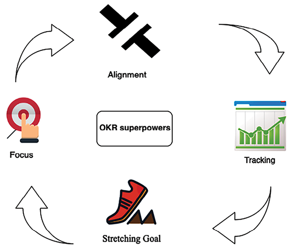
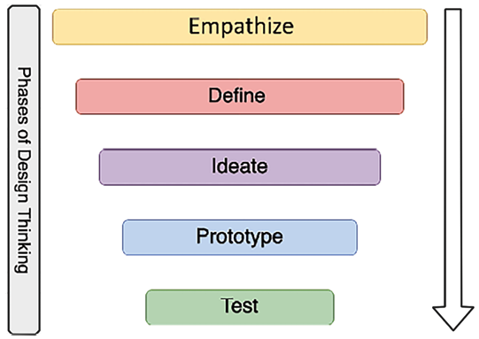

# یادگیری مهارت های نرم برای تبدیل شدن به یک معمار راه حل های بهتر

در فصل‌های قبلی، یاد گرفتید که چگونه یک معمار راه‌حل‌ها نیاز دارد تا همه نیازهای ذینفعان را برآورده کند. حتی اگر نقش معمار راه حل فنی باشد، آنها باید در سراسر سازمان کار کنند، از مدیریت ارشد گرفته تا تیم توسعه. مهارت های نرم از عوامل ضروری و حیاتی برای تبدیل شدن به یک معمار راه حل موفق هستند.

معماران راه حل باید با روندهای فعلی فناوری به روز باشند، دانش خود را تکامل دهند و همیشه کنجکاو برای یادگیری چیزهای جدید باشند. شما می توانید با استفاده از یادگیری مستمر به معمار راه حل های بهتری تبدیل شوید. در این فصل روش هایی برای یادگیری فناوری های جدید و نحوه به اشتراک گذاری و کمک به جامعه فنی را کشف خواهید کرد.

معماران راه حل نیاز به تعریف و ارائه یک استراتژی فنی کلی برای رفع نگرانی های کسب و کار دارند. آنها باید بین تیم های تجاری و فنی کار کنند تا بهترین راه حل را که به مهارت های ارتباطی عالی نیاز دارد، مذاکره کنند. در این فصل، مهارت‌های نرمی را که یک معمار راه‌حل‌ها باید داشته باشد، از جمله ارتباطات را یاد خواهید گرفت:

- اهمیت مهارت های نرم در معماری راه حل
- کسب مهارت های قبل از فروش
- مالکیت و مسئولیت پذیری
- انعطاف پذیر و سازگار بودن
- تفکر طراحی
- سازنده بودن با درگیر شدن در کدنویسی عملی
- با یادگیری مستمر بهتر شوید
- مربی دیگران بودن
- تبدیل شدن به یک مبشر فناوری و رهبر فکر

در پایان این فصل، در مورد مهارت های نرم مورد نیاز برای موفقیت یک معمار راه حل ها خواهید دانست. شما در مورد روش های کسب مهارت های استراتژیک (مانند ارتباطات پیش فروش و اجرایی) و توسعه تفکر طراحی و مهارت های رهبری شخصی (مانند بزرگ فکر کردن و مالکیت) خواهید آموخت. شما تکنیک هایی را یاد خواهید گرفت تا خود را به عنوان یک رهبر تثبیت کنید و به بهبود مجموعه مهارت های خود ادامه دهید.

# اهمیت مهارت های نرم در معماری راه حل

اهمیت مهارت های نرم در معماری راه حل ها قابل اغراق نیست، زیرا این مهارت ها برای اثربخشی و موفقیت یک معمار راه حل ها ضروری است.

اولاً، ارتباط مؤثر مهم است. معماران راه حل باید جزئیات فنی پیچیده را برای ذینفعان غیر فنی ساده کنند و از وضوح و همسویی بین اهداف فنی و تجاری اطمینان حاصل کنند. این مهارت در پر کردن شکاف بین تیم‌های فنی و واحدهای تجاری، تسهیل درک متقابل و تعیین هدف مشارکتی حیاتی است.

همکاری و کار گروهی نیز نقش مهمی دارد. با توجه به اینکه معماران راه حل اغلب در تیم های چند رشته ای کار می کنند، توانایی کار هماهنگ با افراد با پیشینه ها و تخصص های مختلف بسیار مهم است. این همکاری به حل تعارض، ایجاد اجماع، و ایجاد محیطی با مسئولیت مشترک و موفقیت جمعی گسترش می یابد.

علاوه بر این، حل مسئله و تفکر انتقادی از مهارت های نرم ضروری برای معماران راه حل هستند. ماهیت کار آن‌ها اغلب شامل پیمایش چالش‌های فنی پیچیده و یافتن راه‌حل‌های نوآورانه‌ای است که با استراتژی‌های تجاری همسو هستند. این امر مستلزم درک فنی، خلاقیت، تفکر تحلیلی و ذهنیت راه حل محور است.

در نهایت، رهبری و سازگاری ضروری است. معماران راه حل اغلب نقش های رهبری را در تیم های پروژه ایفا می کنند، هدایت فنی را هدایت می کنند و تصمیمات محوری می گیرند. این امر مستلزم رهبری فنی و توانایی الهام بخشیدن، ایجاد انگیزه و هدایت تیم ها به سمت یک چشم انداز مشترک است. علاوه بر این، چشم‌انداز فناوری دائماً در حال تغییر است و سازگاری و طرز فکر یادگیری معماران راه‌حل را قادر می‌سازد تا به روز بمانند و به روندهای جدید و تغییرات فناوری پاسخ دهند. این مهارت های نرم و تخصص فنی، معماران راه حل ها را دارایی های ارزشمندی برای هر سازمانی می کند.

در بخش‌های بعدی، به برخی از مهارت‌های کلیدی نرم‌افزاری می‌پردازیم که یک معمار راه‌حل‌ها باید در درون و مرتبط با مهارت‌های کلی ذکر شده در اینجا داشته باشد.

# کسب مهارت های پیش فروش

پیش فروش یک مرحله حیاتی برای تدارکات فناوری پیچیده است که در آن مشتری اطلاعات دقیقی را برای تصمیم گیری خرید جمع آوری می کند. در سازمان مشتری، یک معمار راه حل در چرخه پیش فروش شرکت می کند تا منابع فناوری و زیرساخت را از فروشندگان مختلف تأیید کند. در سازمان فروشنده، معمار راه‌حل‌ها باید به **درخواست‌های پیشنهادات** (**RFP**) مشتریان پاسخ دهد و راه‌حلی بالقوه برای کسب کسب‌وکار جدید برای یک سازمان ارائه دهد. دستیابی به این امر مستلزم یک مجموعه مهارت خاص است.

## مهارت های کلیدی

پیش فروش نیاز به مجموعه مهارت های منحصر به فردی دارد که دانش فنی قوی را با مهارت های نرم ترکیب می کند، از جمله موارد زیر:

- **مهارت های ارتباطی و مذاکره **: معماران راه حل نیاز به مهارت های ارتباطی عالی دارند تا مشتریان را با جزئیات صحیح و جدید درگیر کنند. ارائه جزئیات دقیق راه حل و ارتباط صنعت به مشتریان کمک می کند تا بفهمند راه حل شما چگونه می تواند نگرانی های تجاری آنها را برطرف کند. معماران راه حل wo

rk به عنوان پل ارتباطی بین تیم های فروش و فنی است که ارتباط و هماهنگی را به یک مهارت حیاتی تبدیل می کند. معماران راه حل ها همچنین باید با همکاری با مشتریان و تیم های داخلی توافق نامه هایی را ایجاد کنند که به مهارت های عالی مذاکره نیاز دارد. به طور خاص، تصمیمات در سطح استراتژیک تأثیر قابل توجهی در بین چندین گروه دارد. معماران راه حل نیاز به مذاکره بین تیم ها، کار بر روی مبادلات و ایجاد یک راه حل بهینه دارند.\* **مهارت های گوش دادن و حل مسئله**: معماران راه حل نیاز به مهارت های تحلیلی قوی برای شناسایی راه حل مناسب برای هر نیاز مشتری دارند. راه حل های مهمی است که معماران با پرسیدن سؤالات مناسب برای ایجاد راه حل خوب، موارد استفاده مشتری را گوش می دهند و درک می کنند. معماران راه‌حل‌ها باید شکاف‌ها را درک کنند و راه‌حلی برای تأثیر فوری کسب‌وکار با **بازده سرمایه‌گذاری بلندمدت** (**ROI**) ایجاد کنند. عملکرد برای برخی از مشتریان مهم تر است، در حالی که برخی دیگر ممکن است بر اساس پایگاه کاربر برنامه خود بیشتر بر هزینه متمرکز شوند. معمار راه حل ها باید راه حل مناسب را بر اساس هدف اصلی **شاخص عملکرد کلیدی** (**KPI**) مشتری خود ارائه دهد.

- **مهارت های رویارویی با مشتری**: معمار راه حل ها اغلب باید با تیم های داخلی و خارجی مشتری کار کند. آنها بر ذینفعان در همه سطوح، از مدیران سطح C گرفته تا مهندسان توسعه، تأثیر می گذارند. آنها راه حل ها و دموهایی را به مدیران ارشد ارائه می دهند که به پیشنهاد شما از منظر تجاری نگاه می کنند. پشتیبانی اجرایی سطح C و تعهد به ابتکارات همیشه منجر به موفقیت راه حل اتخاذ شده می شود که مهارت های مواجهه با مشتری را بسیار مهم می کند. مجری سطح C به جزئیات راه حل در یک جلسه محدود زمانی تعریف شده نیاز دارد و معمار راه حل ها باید از زمان اختصاص داده شده به بهترین نحو استفاده کند. در بخش بعدی این فصل—_ارائه به مدیران سطح C_ درباره مکالمه اجرایی بیشتر خواهید آموخت.
- **کار با تیم ها**: معمار راه حل ها با تیم های تجاری و محصول ارتباط برقرار می کند. برای تهیه یک برنامه کاربردی بهینه، معمار راه حل ها باید با تیم های تجاری و فنی در تمام سطوح همکاری کند. معمار راه حل ها باید یک بازیکن تیم خوبی باشد، ایده ها را به اشتراک بگذارد و راهی برای کار در بین تیم ها پیدا کند.

مهارت های ذکر شده در بالا برای پیش فروش مورد نیاز است و برای کارکردهای شغلی روزانه معمار راه حل ها قابل استفاده است. معماران راه حل از یک پیشینه فنی می آیند و با قرار گرفتن در چنین نقشی، برای برقراری ارتباط در سطح اجرایی نیاز به کسب مهارت های حیاتی دارند. بیایید در بخش بعدی درباره مکالمات اجرایی بیشتر بیاموزیم.

## ارائه به مدیران سطح C

یک معمار راه حل نیاز به رسیدگی به چالش های مختلف از دیدگاه فنی و تجاری دارد. یکی از چالش برانگیزترین کارها می تواند خرید اجرایی باشد.

مدیران ارشد مانند **مدیر ارشد اجرایی** (**مدیرعامل**)، **مدیر ارشد فناوری** (**CTO**)، **مدیر ارشد مالی** (**CFO**)، **رؤسای خط کسب و کار** (**LoBs**) و **مدیر اطلاعات ارشد** (**CIO**) به عنوان یک سطح C در نظر گرفته می شوند زیرا برنامه فشرده ای دارند و باید کارهای زیادی انجام دهند. تصمیمات با تاثیر بالا

به عنوان یک معمار راه حل، ممکن است جزئیات زیادی برای ارائه داشته باشید، اما جلسات سطح C شما محدود به زمان هستند. یک معمار راه حل باید حداکثر ارزش را از جلسه خود در بازه زمانی اختصاص داده شده بدست آورد. سوال اصلی این است: _چگونه توجه و حمایت مدیران ارشد را در مدت زمان محدود جلب کنیم؟_

با توضیح دستور کار و ساختار جلسه برنامه ریزی شده خود شروع کنید. مدیران برای استفاده درست از زمان خود سؤالات زیادی می پرسند و دستور کار شما باید نشان دهد که آنها این فرصت را خواهند داشت که سؤالات روشنگری بپرسند. پس از آن، کلید ارائه اجرایی، خلاصه کردن نکات اولیه در 5 دقیقه اول است. شما باید طوری آماده شوید که اگر زمان 30 دقیقه ای شما به 5 دقیقه کاهش یابد، همچنان بتوانید امتیازات خود را منتقل کنید و برای مرحله بعدی خرید کنید.

خلاصه خود را با حقایق و داده هایی که با صنعت و سازمان آنها هماهنگ است، پشتیبانی کنید. در صورتی که می خواهند در یک منطقه خاص شیرجه بزنند، جزئیات را با خود نگه دارید. شما باید بتوانید تمام داده های مربوطه را بالا بکشید و نشان دهید.

با بیان اطلاعاتی که ممکن است از منظر شما مرتبط به نظر برسد، اما برای یک مخاطب اجرایی چندان منطقی نیست، همه چیز را با جزئیات ارائه نکنید. به عنوان مثال، به عنوان یک معمار راه حل، ممکن است بیشتر بر روی مزایای اجرای فنی تمرکز کنید. با این حال، مدیریت ارشد با کاهش سربار عملیاتی و افزایش بهره وری، بیشتر بر بازگشت سرمایه تمرکز می کند.

دمو یا ارائه خود را طوری تنظیم کنید که با اصطلاحات حوزه و دامنه مشتری طنین انداز شود. ترکیب اصطلاحات و مفاهیم آشنا برای آنها نه تنها اعتماد را تقویت می کند بلکه تأیید می کند که شما راه حل فنی خود را برای رسیدگی موثر به چالش های صنعت منحصر به فرد آنها تنظیم کرده اید.

شما باید آماده پاسخگویی به سوالات زیر که مربوط به مدیران هستند باشید:

- **راه حل پیشنهادی چه سودی خواهد داشتمشتریان ما؟ ** کسب و کار حول محور مشتری می چرخد. مدیران به رشد شرکت خود نگاه می کنند، که تنها در صورتی امکان پذیر است که مشتریان آنها راضی باشند. اطمینان حاصل کنید که تحقیقات خود را در مورد پایگاه مشتری و نیازهای آنها انجام دهید. آماده ارائه مزایا با پشتوانه داده های قابل اعتماد باشید.
- ** چه فرضی را برای ارائه راه حل انجام دادید؟ ** اغلب، این جلسات در مرحله اولیه هستند که به جزئیات بیشتری نیاز دارید. معماران راه‌حل‌ها همیشه باید فرضیاتی داشته باشند تا راه‌حل را پایه‌ریزی کنند. فرضیه خود را در نقاط اصلی فهرست کنید و اگر همه چیز طبق فرضیات شما کار نمی کند، یک طرح کاهش داشته باشید.
- ** بازگشت سرمایه (ROI) من چقدر خواهد بود؟** مدیران اجرایی همیشه با تعیین **هزینه کل مالکیت** (**TCO**) به دنبال بازگشت سرمایه هستند. با داده ها آماده باشید تا هزینه های تخمینی مالکیت، هزینه های تعمیر و نگهداری راه حل، هزینه های آموزشی، صرفه جویی در هزینه کلی و غیره را ارائه دهید.
- **اگر به همین امروز ادامه دهیم و هیچ کاری انجام ندهیم چه اتفاقی می افتد؟** ممکن است مدیریت ارشد برای شناسایی ROI به حالت بررسی شدید برود. آنها می خواهند بفهمند که آیا سرمایه گذاری ارزش آن را دارد یا خیر. بهترین کار این است که برای تحقیقات بازار خود آماده باشید - به عنوان مثال، روندهای فناوری، گرایش های مشتری و وضعیت رقابتی.
- **واکنش رقیب ما در مورد راه حل شما چه خواهد بود؟** رقابت در همه جا وجود دارد و اغلب، مدیران اجرایی نگران آن هستند. آنها می خواهند بفهمند که آیا راه حل شما برای شکست دادن رقبا و برتری دادن به سازمانشان نوآورانه است یا خیر. بهتر است برخی تحقیقات اولیه انجام دهید و داده های رقابتی مربوط به صنعت و پایگاه مشتری خود را اضافه کنید.
- **پیشنهاد شما چیست، و چگونه می توانم کمک کنم؟** هنگام ارائه پیشنهادات خود، همیشه باید یک لیست واضح از موارد اقدام به عنوان مرحله بعدی داشته باشید. شما باید از مدیران اجرایی خرید کنید و با درخواست کمک به آنها احساس مشارکت کنید. برای مثال، می‌توانید از CIO بخواهید که شما را با تیم‌های مهندسی یا محصول مرتبط کند تا راه‌حلی کلی برای گام بعدی داشته باشید.

بیایید در مرحله بعد به مهارت های رهبری که یک معمار راه حل ها باید به عنوان یک رهبر فنی برای سازمان داشته باشد نگاهی بیندازیم.

# مالکیت و مسئولیت پذیری

مالکیت و قرار گرفتن خود به عنوان یک رهبر به شما کمک می کند تا با مسئولیت پذیری اعتماد را جلب کنید. مالکیت به این معنا نیست که شما باید به تنهایی کارها را اجرا کنید. این بیشتر در مورد اتخاذ ابتکارات جدید و حفظ آنها برای سازمان شما است. شما می توانید ایده هایی داشته باشید که می تواند در مورد بهره وری، چابکی، صرفه جویی در هزینه ها و افزایش پایگاه مشتری به نفع سازمان شما باشد. گاهی اوقات، ممکن است برای اجرای ایده خود به زمان یا منابع بیشتری نیاز داشته باشید، اما باید آن را به عنوان یک ابتکار جدید مطرح کنید و دیگران را برای اجرا درگیر کنید.

مسئولیت پذیری در مورد مسئولیت پذیری برای هدایت نتیجه است. مالکیت و مسئولیت پذیری دست به دست هم می دهند، جایی که شما در حال ایجاد ابتکار و تلاش برای به دست آوردن نتیجه هستید. مردم می توانند برای اجرای هر کاری به شما اعتماد کنند و نتیجه را به ارمغان بیاورند. مسئولیت پذیری به شما کمک می کند تا با مشتریان و تیم خود اعتماد ایجاد کنید و در نتیجه یک محیط کاری بهتر و دستیابی به هدف ایجاد کنید.

به عنوان یک معمار راه حل، مالکیت به شما کمک می کند تا چیزها را از دیدگاه مشتریان و حامیان مالی ببینید. شما احساس انگیزه می کنید و بخشی از کاری معنادار هستید که از انجام آن لذت می برید. مطمئن شوید که موفقیت های کلیدی و نتیجه کلیدی هدف را تعریف و ایجاد کنید. هدف/هدف باید با استفاده از نتایج کلیدی خاص قابل اندازه گیری باشد و باید محدود به زمان باشد. بیایید درباره **اهداف و نتایج کلیدی** (**OKRs**) بیشتر بیاموزیم.

## تعریف اجرای استراتژی با OKR

اجرای استراتژی پیچیده و چالش برانگیز است. برتری در اجرای استراتژی برای تحقق چشم انداز، ماموریت و اهداف سازمان ضروری است. این ایده باید به عناصر عملی تبدیل شود تا تیم ها در یک راستا قرار گیرند و همه در یک جهت حرکت کنند. هدف گذاری و مدیریت اهداف برخی از بهترین راه های تثبیت شده برای انجام کارها هستند.

OKR ها اصول و شیوه های (چشم انداز و اجرا) هدف گذاری هستند. OKR یک سیستم مدیریت استراتژی است که بر اجرای استراتژی تمرکز دارد، یک چارچوب ساده که به شما امکان می دهد استراتژی و اولویت های اولیه سازمان را تعریف کنید. اهداف، اصول هستند، و نتایج کلیدی، تمرین - چه چیزی و چگونه - چشم انداز سازمانی است. همانطور که در نمودار زیر نشان داده شده است، OKR ها بر اساس چهار ابرقدرت هستند:

شکل 17.1: ابرقدرت های OKR

ابرقدرت های OKR شامل موارد زیر است:

- **تمرکز**: با این سوال شروع کنید: _اولویت های اصلی ما چیست و مردم کجا باید تلاش خود را متمرکز کنند؟_ به آنچه واقعا اهمیت دارد متعهد شوید و در مورد آنچه ضروری است شفاف سازی کنید.
- **همسویی**: اهداف را عمومی و شفاف کنید. با تیم ارتباط برقرار کنید و هم ترازی بین تیمی، از پایین به بالا و یک طرف را بگیرید.
- **ردیابی**: به صورت بصری نتایج کلیدی هر هدف را تا نقطه درصد پیگیری کنید.
- **هدف کششی**: اهداف بلندپروازانه ای برای دستیابی به چیزی قابل توجه ایجاد کنید. اهداف کششی به افراد اجازه می دهد تا دوباره تصور کنند و تجدید نظر کنند.

OKR ها اهداف واضح و قابل اندازه گیری را تعیین می کنند و آنها را با سازمان هماهنگ می کنند

ماموریت استراتژیک Nization در معماری راه حل، OKR ها می توانند طراحی و پیاده سازی سیستم ها را راهنمایی کنند تا اطمینان حاصل شود که آنها به اهداف کلی کسب و کار کمک می کنند.

برای یک معمار راه حل، OKR ها می توانند چیزی شبیه به این را شامل شوند:

**هدف**: بهبود انعطاف پذیری سیستم و تحمل خطا.

**نتایج کلیدی**:

- کاهش 30 درصدی از کار افتادگی سیستم در سه ماهه آینده.
- یک استراتژی استقرار چند منطقه ای برای خدمات حیاتی تا چرخه انتشار بعدی اجرا کنید.
- در عرض شش ماه به 99.99٪ در دسترس بودن برای لایه برنامه رو به روی کاربر دست یابید.

در اینجا، معمار از OKR ها برای تعیین اهداف روشن برای عملکرد و قابلیت اطمینان سیستم استفاده می کند، که جنبه های حیاتی مسئولیت های آنها است. آنها همچنین به اولویت بندی وظایف، اندازه گیری پیشرفت، و انتقال تاثیر تصمیمات معماری به ذینفعان کمک می کنند.

OKR ها برای همه ذینفعان در سطوح مختلف، از حامیان مالی اجرایی گرفته تا تیم ها، دید و نتیجه معناداری را فراهم می کنند. OKR ها چشم انداز و ماموریت سازمان را روشن می کنند. اعضای تیم که بر روی فعالیت های روزمره کار می کنند نیاز به دید و وضوح ماموریت دارند. آنها باید ببینند که کار روزمره آنها چه تأثیری بر آن دارد. چارچوب OKR به شما این امکان را می دهد که این پیوند را تعریف کنید و دید و معنی را برای همه افراد تیم فراهم کنید.

## بزرگ فکر کردن

معماران راه حل باید بتوانند تصویر بزرگ را ببینند و به آینده فکر کنند. یک معمار راه حل ها پایه ای ایجاد می کند که تیم بلوک های ساختمانی را بر اساس آن قرار می دهد و محصول را عرضه می کند. بزرگ اندیشی یکی از مهارت های حیاتی است که معماران باید دارای راه حل هایی باشند تا پایداری بلندمدت یک برنامه کاربردی را در نظر بگیرند.

بزرگ فکر کردن به این معنی نیست که باید یک هدف خیلی غیر واقعی تعیین کنید. هدف شما باید به اندازه ای بزرگ باشد که شما را به چالش بکشد و شما را از منطقه راحتی خود خارج کند.

بزرگ اندیشی در مورد پیش بینی نیازهای سازمان و جلوتر ماندن از پیشرفت های تکنولوژیکی است، تا اطمینان حاصل شود که طرح های امروزی می توانند سازگار شوند و در آینده موثر باقی بمانند. بزرگ اندیشی برای موفقیت هم در سطح شخصی و هم در سطح سازمانی حیاتی است.

شما باید همیشه در حالی که بزرگ فکر می کنید به توانایی های خود اطمینان داشته باشید. شاید در ابتدا رسیدن به آن چالش برانگیز به نظر برسد، اما با شروع کار برای رسیدن به هدف، راه را پیدا خواهید کرد. به خود ایمان داشته باشید، و متوجه خواهید شد که دیگران شروع به حمایت و باور شما می کنند. بزرگ فکر کردن به افراد اطرافتان کمک می کند تا بخشی از موفقیت شما شوند. اهداف بلندمدت خود را تعیین کنید، مانند _ کجا می خواهید خود و سازمانتان را در دهه آینده ببینید؟_. هر بار یک قدم بردارید تا یک هدف کوتاه مدت را به یک هدف بلندمدت تبدیل کنید.

هنگامی که هدف کششی را با بزرگ فکر کردن تعیین می کنید، به شما کمک می کند تا ابتکار عمل را به دست بگیرید و چالش های جدید را کشف کنید. با این حال، اگر از همتایان و تیم خود برای ارائه نتیجه پشتیبانی داشته باشید، بهترین کار است، که می توانند بازخورد مناسب را به شما ارائه دهند و در صورت نیاز کمک کنند. تبدیل به کسی شوید که مردم می خواهند به آنها کمک کنند. این درب دو طرفه است برای دریافت کمک، باید برای کمک به دیگران آماده باشید. سازگاری یکی دیگر از مهارت های حیاتی معماران راه حل برای کار با دیگران است. بیایید در مورد آن بیشتر بدانیم.

# انعطاف پذیر و سازگار بودن

سازگاری و انعطاف پذیری دست به دست هم می دهند و به عنوان یک معمار راه حل، باید انعطاف پذیر باشید تا با محیط ها، فرهنگ های کاری و فناوری های جدید سازگار باشید. سازگاری به این معنی است که شما همیشه پذیرای ایده های جدید و کار با تیم های مناسب هستید.

تیم ها ممکن است فرآیند و فناوری را اتخاذ کنند که برای آنها مناسب ترین باشد. به عنوان یک معمار راه حل، شما باید در انطباق با الزامات تیم در طول طراحی راه حل انعطاف پذیر باشید. به عنوان مثال، در معماری میکروسرویس، هر سرویس از طریق یک API استاندارد RESTful از طریق پروتکل HTTP ارتباط برقرار می کند. تیم ها ممکن است کد را به زبان یا ابزار دیگری مانند پایتون، جاوا، Node.js یا سی شارپ بنویسند. تنها شرط لازم این است که تیم ها API های خود را به طور ایمن در معرض نمایش قرار دهند تا کل سیستم بتواند بر اساس استفاده از آنها بسازد.

برای بررسی یک مشکل و یافتن راه حل خلاقانه تر، به ذهنیت ها و دیدگاه های متفاوتی نیاز دارید. تشویق تیم ها به شکست سریع و نوآوری به سازمان کمک می کند تا رقابتی باشد.

ویژگی های شخصی انعطاف پذیری با موارد زیر نشان داده می شود:

- فکر کردن به راه حل های مختلف برای حل یک مشکل با تیم و اتخاذ بهترین رویکرد
- کمک به اعضای تیم برای تخلیه کارشان
- داوطلب شدن برای پر کردن مکان در صورتی که یکی از اعضای تیم به دلایل شخصی نیاز به چند هفته مرخصی داشته باشد
- توانایی همکاری موثر با تیم ها در مکان ها و مناطق زمانی مختلف

شما باید ذهنی باز داشته باشید و با تغییرات تکنولوژی و فرآیندها سازگار باشید. ممکن است هنگام ایجاد تغییر در تیم یا سازمان خود با مقاومت روبرو شوید. شما باید دیگران را تشویق کنید که انعطاف پذیر باشند و اهمیت تغییر را منتقل کنید. به عنوان مثال، زمانی که یک سازمان می خواهد حجم کاری خود را از داخل محل به فضای ابری منتقل کند، اغلب به حمایت بیشتری نیاز دارد، زیرا افراد باید یک پلت فرم جدید را بیاموزند. شما باید ارزش پیشنهادی ابر را توضیح دهید و اینکه چگونه به آنها کمک می کند چابک تر و سریعتر نوآوری کنند.

به عنوان یک سل

utions architect، شما باید با تکالیف متعدد سازگار باشید و اولویت اجرای مناسب را تعیین کنید. باید بتوانید خود را با شرایط وفق دهید و تحت فشار کار کنید.

یک معمار راه حل برای ایجاد یک راه حل نوآورانه نیاز به تفکر طراحی انتقادی دارد. بیایید در بخش بعدی درباره تفکر طراحی بیشتر بیاموزیم.

# تفکر طراحی

یک معمار راه حل، نقش اصلی طراحی سیستم را دارد که تفکر طراحی را به یک مهارت ضروری تبدیل می کند. تفکر طراحی یکی از موفق ترین رویکردهایی است که در سراسر صنایع برای حل مشکلات چالش برانگیز و نامشخص اتخاذ شده است. تفکر طراحی به شما کمک می‌کند تا به مشکلات و راه‌حل‌ها از منظری متفاوت نگاه کنید، که ممکن است در وهله اول هنوز در نظر نگرفته باشید. تفکر طراحی بیشتر بر ارائه نتایج با ارائه یک رویکرد مبتنی بر راه حل برای حل یک مشکل متمرکز است. این کمک می کند تا مشکل، راه حل و ریسک مرتبط را زیر سوال ببریم تا بهینه ترین استراتژی را توسعه دهیم.

تفکر طراحی به شما کمک می کند تا با قرار دادن خود به جای کاربران نهایی و مشتریان، مشکلات را به روشی انسان محورتر بازتعریف کنید. نمودار زیر اصول اولیه تفکر طراحی را نشان می دهد:

شکل 17.2: اصول تفکر طراحی

نکات زیر برخی از اصول تفکر طراحی هستند:

- ** اغلب آزمایش کنید **: یک نمونه اولیه برای درک اجرای ایده در موقعیت های واقعی ایجاد کنید. استراتژی سریع شکست را اتخاذ کنید و بیشتر آزمایش کنید.
- **همکاری متقابل**: افرادی را با پیشینه های مختلف بیاورید تا به روشی متنوع به دنبال مشکلات بگردند و مطمئن شوید که راه حل ها نیازهای همه را برآورده می کند.
- **تاکید بر افراد **: از کاربران مختلف بازخورد جمع آوری کنید و خود را به جای آنها قرار دهید تا مشکل را از منظری متفاوت درک کنید.
- **نشان دهید و بگویید **: افکار خود را به صورت تصویری ارائه دهید تا برای همه افراد حاضر در اتاق راحت تر قابل درک باشد.
- **مشکل را به وضوح تعریف کنید**: یک چشم انداز کاملاً تعریف شده و واضح برای یک چالش خاص ایجاد کنید، که می تواند به دیگران کمک کند تا به وضوح درک کنند و آنها را تشویق به مشارکت کند.\* **در طول فرآیند طراحی فکر کنید**: درک کلی فرآیند طراحی با اهداف و روش های روشن
- **تعصب برای اقدام**: طراحی نهایی برای ارائه راه حل به جای فکر کردن. در پیشبرد و ایجاد فعالیت هایی که می تواند منجر به یک راه حل قابل اجرا شود، فعال باشید.

تفکر طراحی پایه محکمی برای به کارگیری همدلی و ایجاد دیدگاهی جامع از مشکل فراهم می کند. برای اتخاذ تفکر طراحی، یک مدل پنج مرحله ای وجود دارد که توسط **d.school** ([https://dschool.stanford.edu/resources/getting-started-with-design-thinking](https:// dschool.stanford.edu/resources/شروع-کردن-با-تفکر-طراحی)). آنها در آموزش و به کارگیری تفکر طراحی پیشگام هستند. نمودار زیر پنج مرحله تفکر طراحی را نشان می دهد:

شکل 17.3: پنج مرحله تفکر طراحی

تفکر طراحی یک رویکرد تکراری است که نیاز به تکامل مداوم دارد. خروجی یک فاز می تواند به صورت بازگشتی به فازهای دیگر وارد شود تا زمانی که محلول جامد شود. مروری کوتاه بر مراحل به شرح زیر است:

- **همدلی**: همدلی سنگ بنا و شالوده طراحی در بافت انسانی است. برای همدلی، باید رفتارهای کاربران خود را مشاهده کنید و با آنها درگیر شوید تا مشکل واقعی را درک کنید. سعی کنید با قرار دادن خود در موقعیت، خود را در مشکل غوطه ور کنید – و آن را تجربه کنید.
- **تعریف**: همدلی به تعریف مشکل کمک می کند که نیازهای کاربر و مشکلی که با آن مواجه است را تجربه کنید. در مرحله تعریف، بینش خود را به کار می گیرید و مشکل را به وضوح تعریف می کنید، که می تواند به طوفان فکری برای یافتن راه حلی خلاقانه و در عین حال ساده کمک کند.
- ** ایده پردازی **: مرحله ایده پردازی در مورد حرکت از مسئله به راه حل است. شما با تیم کار می کنید تا راه حل های جایگزین مختلف را با به چالش کشیدن فرضیات بیابید. شما باید راه حل بدیهی را از ذهن خود بیرون بیاورید و برای یافتن همه راه حل های ممکن که امکان نوآوری را فراهم می کند، به طور مشترک کار کنید.\* **نمونه اولیه**: مرحله نمونه اولیه به تبدیل ایده ها به راه حل های واقعی کمک می کند. نمونه سازی می تواند یادگیری زیادی را ارائه دهد و با نشان دادن یک **اثبات مفهوم** (**POC**) به حل اختلاف نظرها کمک کند. این به شما کمک می کند تا شکاف ها و خطرات را پیدا کنید. شما باید یک نمونه اولیه سریع و بدون سرمایه گذاری زیاد بسازید که به شما امکان می دهد شکست را مدیریت کنید و یادگیری را افزایش دهید.
- **آزمایش**: مرحله آزمایش مربوط به دریافت بازخورد در مورد راه حل شما و تکرار آن بر اساس آن است. مرحله آزمایش به شما کمک می کند تا راه حل را دوباره تعریف کنید و درباره کاربران خود اطلاعات بیشتری کسب کنید.

تفکر طراحی تمام مراحل را برای ایجاد یک راه حل منطقی و عملی در بر می گیرد. هنگام طراحی معماری اپلیکیشن، می توانید مراحل و اصول تفکر طراحی را با زندگی واقعی خود مرتبط کنید. بر روی نمونه سازی تاکید ویژه ای وجود دارد، زیرا این تنها راه برای تثبیت پیشنهاد و راه حل های موجود با داده ها و حقایق است. کار اصلی یک معمار راه حل، درک نگرانی کسب و کار و ایجاد یک طراحی راه حل فنی است

این یک نمونه اولیه است که تیم می تواند پیاده سازی کند. برای ساختن یک نمونه اولیه، معمار راه حل ها باید دست خود را کثیف کند و به کدنویسی عملی بپردازد. بیایید در مورد آن بیشتر بدانیم.

# سازنده بودن با درگیر شدن در کدنویسی عملی

معمار راه حل ها سازنده ای است که با انجام دادن یاد می گیرد. ساخت یک نمونه اولیه ارزش هزار عکس دارد. به کاهش ارتباطات نادرست و ارائه راه حل کمک می کند. ارائه یک POC و نمونه سازی بخش جدایی ناپذیر نقش معمار راه حل است.

نمونه سازی مرحله پیش از راه حل است که به درک عمیق شما از طراحی اپلیکیشن و کاربر کمک می کند. این به شما کمک می کند تا در مورد چندین مسیر راه حل فکر کنید و بسازید. با آزمایش یک نمونه اولیه، می توانید راه حل خود را اصلاح کنید و با نمایش چشم انداز خود به دیگران، مانند تیم ها، مشتریان و سرمایه گذاران الهام بخشید.

معمار راه حل ها یک رهبر فنی است که از نزدیک با تیم توسعه کار می کند. در یک تیم چابک توانمند از توسعه دهندگان، یک معمار راه حل باید علاوه بر ارائه پاورپوینت، یک قطعه کد را به عنوان یک POC نشان دهد. یک معمار راه‌حل‌ها نیازی به عضویت در تیم توسعه ندارد، اما به طور مشترک کار می‌کند تا راه‌حل را به زبان خود به تیم توسعه‌دهنده منتقل کند. تحویل موفقیت آمیز تنها در صورتی امکان پذیر است که معمار راه حل ها بتواند جنبه فنی عمیق راه حلی را که با کدنویسی مداوم و تجربه عملی همراه است، درک کند.

یک معمار راه حل اغلب به عنوان یک مربی و بازیکن-مربی دیده می شود. داشتن کدنویسی عملی به آنها کمک می کند تا اعتبار خود را ایجاد کنند. یک معمار راه حل باید تصمیم بگیرد که تیم از کدام زبان برنامه نویسی و ابزار استفاده کند. یک رویکرد عملی به شناسایی شکاف هایی کمک می کند که ممکن است با نیازهای تیم یا راه حل شما مطابقت نداشته باشد - همیشه یادگیری فناوری های جدید شما را قادر می سازد تصمیم بهتری از طرف سازمان بگیرید. بیایید در مورد تکنیک های یادگیری مداوم بیشتر بیاموزیم.

# با یادگیری مستمر بهتر شوید

معماران راه حل باید به طور مستمر دانش جدید را جذب کرده و مجموعه مهارت های خود را افزایش دهند تا به سازمان کمک کنند تا تصمیمات بهتری بگیرد. یادگیری مداوم مجموعه مهارت های شما را مرتبط نگه می دارد و اعتماد به نفس را ایجاد می کند. ذهن شما را باز می کند و چشم اندازها را تغییر می دهد.

یادگیری با یک شغل تمام وقت و یک زندگی خانوادگی پرمشغله می تواند چالش برانگیز باشد. یادگیری مستمر در مورد ایجاد عادت همیشه یادگیری چیزی جدید است که به موجب آن باید انگیزه و نظم داشته باشید. ابتدا باید اهداف یادگیری را تنظیم کنید و برای دستیابی به آنها از مدیریت زمان موثر استفاده کنید. هنگامی که شما مشغول کار معمولی روزانه هستید، اغلب از شبکه عبور می کند.

هر کسی سبک یادگیری خود را دارد. برخی از افراد ممکن است آموزش رسمی را دوست داشته باشند. برخی ممکن است کتاب بخوانند. دیگران ممکن است بخواهند به آموزش گوش کنند و تماشا کنند. شما باید سبک یادگیری را پیدا کنید که برای شما مؤثرتر باشد و متناسب با سبک زندگی شما باشد.

به عنوان مثال، هنگام رفت و آمد به محل کار می توانید به کتاب های صوتی و آموزش گوش دهید. می‌توانید در طول پرواز تجاری کتاب بخوانید یا در ساعات ورزش در باشگاه، آموزش‌های ویدیویی تماشا کنید. به طور کلی، باید تنظیماتی را انجام دهید تا زمانی را از زندگی کاری پرمشغله خود برای یادگیری مستمر کنار بگذارید. در اینجا برخی از راه‌های درگیر کردن خود در یادگیری مداوم آورده شده است:

- **یادگیری فن آوری ها، چارچوب ها و زبان های جدید با آزمایش آنها **: معماران راه حل سازندگانی هستند که آماده آزمایش عملی هستند. به عنوان یک معمار موفق راه حل ها، باید با ساختن یک POC کوچک به یادگیری فن آوری های جدید ادامه دهید. درک زبان‌ها و چارچوب‌های برنامه‌نویسی مدرن به شما کمک می‌کند بهترین توصیه‌ها را در مورد پذیرش فناوری برای یک سازمان و تیم ارائه دهید.\* **یادگیری مهارت‌های جدید با خواندن کتاب‌ها و آموزش‌ها**: روش سنتی خواندن کتاب‌های فیزیکی مزایای قابل‌توجهی دارد، به ویژه در زمینه یادگیری متمرکز این به خوانندگان این امکان را می دهد که از حواس پرتی فعالیت آنلاین جدا شوند و تمرکز عمیق تری را تقویت کنند. این رویکرد به ویژه برای کسانی که بیشتر روز خود را جلوی صفحه کامپیوتر می گذرانند مفید است، زیرا استراحتی آرام برای چشم ها فراهم می کند. درگیر شدن با کتاب‌های فیزیکی می‌تواند تجربه یادگیری را با کاهش خستگی دیجیتال و ترویج توجه بی‌نظیر به مطالب افزایش دهد.

به طور مشابه، میلیون ها کتاب در کیندل برای خواندن در هر زمان و هر مکان موجود است. پلتفرم‌های کتاب صوتی مانند Audible و کتاب‌های صوتی Google Play می‌توانند به شما در گوش دادن به کتاب‌ها در طول رفت و آمد کمک کنند. منابع مناسب زیادی در دسترس است که هیچ بهانه ای برای عدم استفاده از یادگیری مستمر وجود ندارد.

یادگیری آنلاین انقلابی بوده است و درک و فرو رفتن عمیق در هر زمینه ای را آسان کرده است. اکنون پایگاه های دانش عظیمی برای یادگیری هر چیزی در اختیار دارید. یک پلتفرم آنلاین مانند Udemy یا Coursera هزاران دوره آموزشی ویدیویی را در همه زمینه ها ارائه می دهد که می توانید به صورت آنلاین تماشا کنید یا برای یادگیری آفلاین در دستگاه خود بارگیری کنید.

- ** همگام شدن با اخبار و تحولات فناوری با خواندن مقالات در وب سایت ها و وبلاگ ها **: بهترین راه برای به روز نگه داشتن خود از روندهای فناوری، اشتراک در اخبار فنی و وبلاگ ها است. [TechCrunch.com](http://

TechCrunch.com)، [Wired.com](http://Wired.com)، و [Cnet.com](http://Cnet.com) وب‌سایت‌های محبوبی هستند که می‌توانید آخرین روندهای فناوری را در آنها بیابید. روزنامه های بزرگی مانند _CNBC_، _نیویورک تایمز_، و بی بی سی نیوز و کانال های سی ان ان نیز مقالات فناوری دارند که بینش خوبی در مورد روندهای صنعت ارائه می دهند. می توانید برای یادگیری جدید در زمینه های فناوری مربوطه در وبلاگ ها مشترک شوید. به عنوان مثال، برای یادگیری پلتفرم ابری، می‌توانید در وبلاگ‌های **آمازون وب سرویس** (**AWS**) مشترک شوید که دارای هزاران مقاله و موارد استفاده در حوزه ابر AWS هستند و وبلاگ‌های مشابه از این سایت در دسترس هستند. سایر ابرهای عمومی مانند Azure و **Google Cloud Platform** (**GCP**).

- **نوشتن وبلاگ، وایت پیپر، یا کتاب**: به اشتراک گذاری دانش بهترین راه برای یادگیری از طریق مواردی است که شما فکر می کنید در هنگام تلاش برای ارائه به دیگران. انتشار وبلاگ ها و مقالات در پلتفرم های انتشار وبلاگ محبوب مانند Medium، Blogger، و LinkedIn به شما کمک می کند تا یادگیری خود را به اشتراک بگذارید و همچنین از دیگران بیاموزید. مشارکت فعال در پلتفرم‌های پرسش و پاسخ به شما امکان می‌دهد برای هر مشکلی راه‌حل جایگزین پیدا کنید. برخی از پلتفرم های محبوب پرسش/پاسخ عبارتند از Quora، Reddit، Stack Overflow و Stack Exchange.
- **دانش خود را با آموزش به دیگران تثبیت کنید**: آموزش به دیگران به شما کمک می کند همکاری کنید و دیدگاه متفاوتی نسبت به دانش خود داشته باشید. موارد استفاده پیشنهاد شده توسط شرکت کنندگان اغلب راه های مختلفی برای یافتن راه حل به شما می دهد. اجرای یک کارگاه تمام روز با یک آزمایشگاه عملی و ساختمان مفهومی به شما کمک می کند تا یادگیری خود را تقویت کنید و با دیگران بیاموزید.
- **برگزاری کلاس های آنلاین **: گاهی اوقات، شما می خواهید به یادگیری رسمی بروید تا نظم بیشتری داشته باشید و می خواهید انعطاف پذیر باشید. دوره های آنلاین انعطاف پذیری را ارائه می دهند، به شما کمک می کنند تا با اولویت های دیگر سازگار شوید و در زمان صرفه جویی کنید. دوره های آنلاین روشی سازمان یافته برای یادگیری فناوری های جدید و افزایش دانش ارائه می دهد.
- **یادگیری از هم تیمی ها**: هم تیمی ها محیط کاری مشابهی دارند و شما بیشتر روز را با آنها می گذرانید. یادگیری با هم تیمی ها می تواند سرعت یادگیری شما را افزایش دهد. تیم می‌تواند یک استراتژی تقسیم کن و ببرد که به موجب آن اعضا می‌توانند موضوعات خود را به اشتراک بگذارند و جلسات ناهار و یادگیری عمیق را ارائه دهند. این جلسات یک روش استاندارد است که توسط بسیاری از سازمان ها برای برگزاری جلسات آموزشی منظم در بین اعضای تیم استفاده می شود. هر یک از اعضای تیم، یادگیری جدید خود را در یک جلسه یادگیری هفتگی به اشتراک می‌گذارند و همه به سرعت در مورد موضوعات جدید یاد می‌گیرند.
- **حضور و شرکت در گروه‌ها و کنفرانس‌های کاربری**: همه سازمان‌های بزرگ صنعت و فناوری، کنفرانس‌ها و جلسات عملی را برای ارائه بینشی نسبت به روندهای جدید فناوری برگزار می‌کنند. شرکت در کنفرانس های صنعتی و جلسات گروه کاربر به توسعه شبکه و درک روندهای فناوری کمک می کند. برخی از کنفرانس های بزرگ فناوری از رهبران صنعت عبارتند از AWS re:Invent، Google Cloud Next، Microsoft Ignite، SAP SAPPHIRE و Strata Data Conference. همچنین می توانید یک گروه کاربری محلی ایجاد کنید و یک جلسه در منطقه محلی خود برگزار کنید، که به شما کمک می کند تا با متخصصان در سراسر صنایع و سازمان ها همکاری کنید.

توسعه حرفه‌ای مستمر برای یک معمار راه‌حل ضروری است، زیرا تکامل سریع فناوری نیاز به به‌روزرسانی‌های روتین اعتبارنامه‌ها و گواهی‌نامه‌ها دارد تا با پیشرفت‌های جدید و استانداردهای صنعت به‌روز بماند.

یک معمار راه‌حل‌ها نقش رهبری فنی را ایفا می‌کند و رهبری خوب، تدارک رهبران بیشتری مانند شما را تضمین می‌کند، که از طریق مربیگری امکان‌پذیر است. معماران راه حل باید نقش مربی-بازیکن را بازی کنند و دیگران را راهنمایی کنند. بیایید به این موضوع با جزئیات بیشتری نگاه کنیم.

# مربی دیگران بودن

منتورینگ در مورد کمک به دیگران و تنظیم آنها برای موفقیت بر اساس یادگیری و تجربه شما است. این یک راه موثر برای توسعه رهبران، از طریق روابط یک به یک مربی/منتی است. برای اینکه یک مربی خوب باشید، باید یک سبک ارتباطی غیررسمی ایجاد کنید که در آن منتهی بتواند یک منطقه راحت ایجاد کند. مربی می‌تواند در زمینه‌های مختلف، مانند پیشرفت شغلی یا جنبه‌های شخصی، مانند تعادل بین کار و زندگی، مشاوره بگیرد. شما باید نیازسنجی غیررسمی انجام دهید و اهداف و انتظارات متقابل را تعیین کنید.

مربیگری بیشتر در مورد گوش دادن است تا صحبت کردن. گاهی اوقات، مردم به کسی نیاز دارند که به آنها گوش دهد و در صورت لزوم توصیه کند. ابتدا باید با دقت گوش دهید و دیدگاه آنها را درک کنید.

به مربی کمک کنید تا خودش تصمیم بگیرد و به او کمک کنید تا احساس موفقیت بیشتری کند. به‌عنوان یک مربی خوب، هنگام مشاوره در مورد شغل شخصی، باید در مورد بهترین گزینه برای منتی راهنمایی دریافت کنید، حتی اگر ممکن است لزوماً بهترین گزینه برای شرکت نباشد. همیشه بازخورد صادقانه و سازنده ارائه دهید تا به آنها در شناسایی و غلبه بر شکاف ها کمک کنید.

ویژگی مهم یک مربی توانایی الهام بخشیدن به افراد است. غالباً اگر افراد الگوی شما را ببینند ممکن است شما را به عنوان مربی انتخاب کنند. به مربی خود کمک کنید بدون اینکه دیدگاه شما را مطرح کند، تمام پتانسیل خود را درک کند و به او کمک کنید به چیزی برسد که قبلاً هرگز به آن فکر نمی کرد. m بودن همیشه منافع متقابلی دارد

مشاور شما همچنین از منتی ها در مورد رفتار و رشد افراد یاد می گیرید. مربی دیگران بودن در نهایت به شما کمک می کند که رهبر و فرد بهتری شوید.

برای ارتقای تخصص خود به سطح بعدی، می توانید مبشر فناوری و رهبر فکری شوید. بیایید این را در ادامه بررسی کنیم.

# تبدیل شدن به یک مبشر فناوری و رهبر فکر

تبشیر فناوری در مورد متخصص بودن در حمایت از فناوری و محصول خود است. برخی از سازمان‌ها با پایگاه محصول گسترده، نقش مبشر فناوری جداگانه ای را ایجاد می‌کنند. با این حال، یک معمار راه حل اغلب نیاز دارد که نقش یک بشارت دهنده را به عنوان بخشی از کار خود به عهده بگیرد. به عنوان یک مبشر فناوری، باید از روندهای فعلی فناوری آگاه باشید تا مشکلات دنیای واقعی را درک کنید و از فناوری خود برای حل نگرانی های تجاری دفاع کنید.

بشارت فناوری شامل شرکت در یک کنفرانس صنعتی به عنوان سخنران عمومی و ترویج پلت فرم شما است. به شما این امکان را می دهد که به یک رهبر فکری و تأثیرگذار تبدیل شوید، که می تواند به سازمان کمک کند تا پلت فرم و پذیرش محصول خود را افزایش دهد. سخنرانی عمومی یکی از مهارت های حیاتی مورد نیاز یک معمار راه حل است تا بتواند بر روی پلتفرم های عمومی مختلف تعامل داشته باشد و در مقابل مخاطبان زیاد حاضر شود.

یک مبشر همچنین پست های وبلاگ، کاغذهای سفید و میکروبلاگ ها را برای حمایت از محصول خود ایجاد و منتشر می کند. آنها محتوا را اجتماعی می کنند تا پذیرش را افزایش دهند و با کاربران برای درک بازخورد آنها تعامل برقرار می کنند. یک بشارت دهنده به عقب از مشتری کار می کند و بازخورد خود را به تیم داخلی ارسال می کند تا به بهتر شدن محصول کمک کند. با گذشت زمان، به عنوان یک مبشر، پیامی را که به نفع سازمان است، اصلاح خواهید کرد.

معمار راه حل ها نقشی با مسئولیت های متعدد است و داشتن مالکیت بیشتر به شما کمک می کند در حرفه خود موفق شوید.

# خلاصه

در این فصل، شما با مهارت های نرم مورد نیاز برای موفقیت یک معمار راه حل ها و اهمیت آنها آشنا شدید. یک معمار راه حل نیاز به مهارت های پیش فروش دارد که به او کمک می کند از چرخه پیش فروش سازمان پشتیبانی کند، مانند RFP.

شما در مورد مهارت های ارائه مورد نیاز برای گفتگوهای اجرایی و خرید و درک استراتژیک که یک معمار راه حل باید برای تعریف اهداف و نتایج کلیدی برای یک سازمان داشته باشد، یاد گرفتید. برای اجرا در سطوح مختلف، معماران راه حل باید بتوانند بزرگ فکر کنند و انعطاف پذیر و سازگار باشند. شما جزئیاتی را در مورد راه حل هایی که معماران مالکیت خود را بر عهده دارند و در قبال اقدامات خود پاسخگو هستند، یاد گرفتید.

نقش معمار راه حل، مسئولیت اصلی طراحی معماری است. شما با تفکر طراحی، با اصول و مراحل آن آشنا شدید. شما همچنین در مورد اهمیت یادگیری مداوم و تکنیک های مختلف برای ادامه یادگیری و همگام شدن با روندهای بازار آشنا شدید. شما همچنین مسئولیت های اضافی معمار راه حل ها را بررسی کردید - کار به عنوان یک مربی و مبشر.

این یک سفر طولانی از طریق این کتاب بوده است، و همه چیز را در مورد معماران راه حل، از نقش ها و مسئولیت های آنها تا جنبه های مختلف طراحی راه حل و بهینه سازی معماری آموخته است. امیدوارم چیزهای زیادی یاد گرفته باشید و به شما کمک کند حرفه خود را به عنوان یک معمار راه حل توسعه دهید یا به شما کمک کند در نقش فعلی خود موفق شوید.

یادگیری مبارک!
