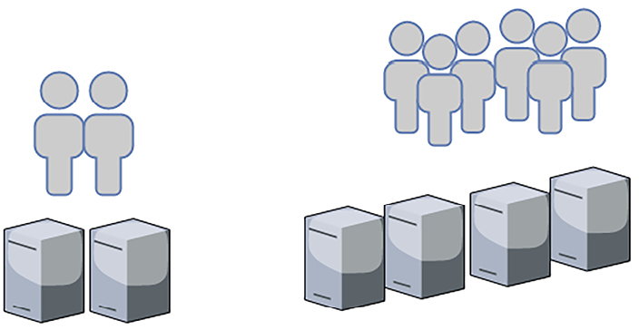
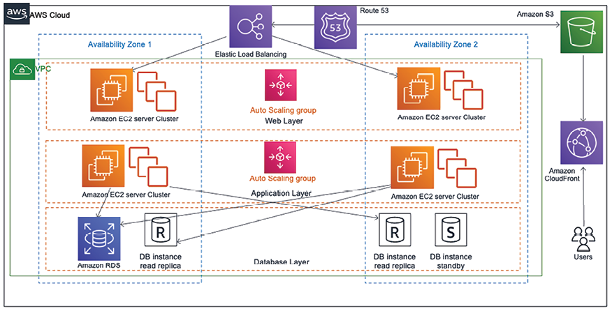
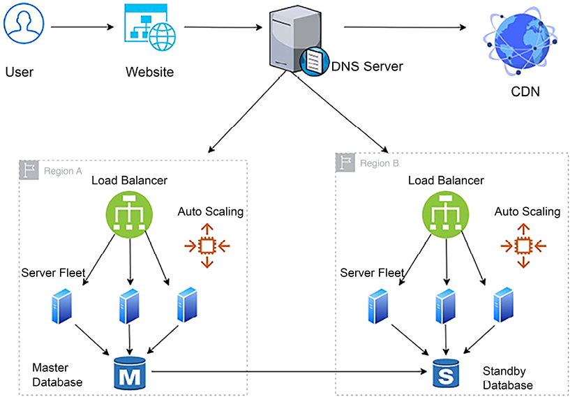
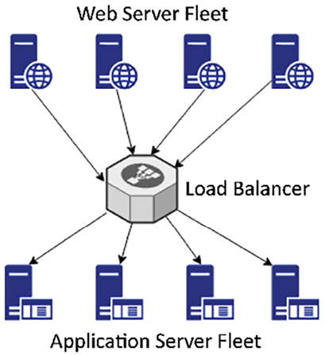
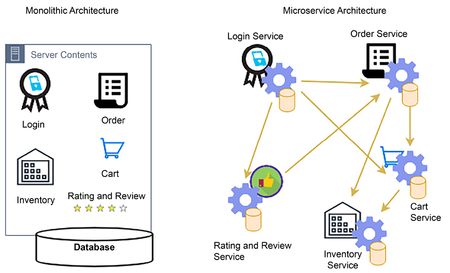
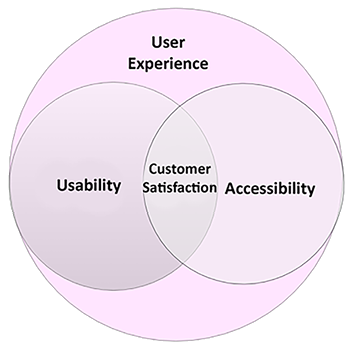
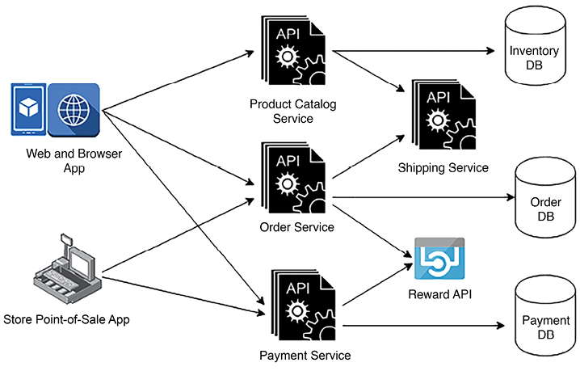

# اصول طراحی معماری راه حل

این فصل به مهم ترین و رایج ترین اصول و ویژگی های طراحی معماری راه حل می پردازد. در حالی که تمرکز در این فصل بر محوری ترین عناصر طراحی است، شایان ذکر است که ممکن است جنبه های طراحی اضافی، مشروط به پیچیدگی محصول و حوزه صنعت خاص، ایجاد شود. همانطور که در سفر خود به سمت تبدیل شدن به یک معمار راه حل از طریق این کتاب پیش می روید، می بینید که این اصول و ویژگی های اساسی با عمق بیشتری اعمال می شوند، از جمله در ایجاد الگوهای طراحی مختلف متناسب با سناریوها و چالش های مختلف.

در این فصل، اصول طراحی معماری‌هایی را خواهید آموخت که مقیاس‌پذیر، انعطاف‌پذیر و بهینه‌سازی شده برای عملکرد باشند، در حالی که اطمینان حاصل کنید که اقدامات امنیتی قوی برای محافظت از برنامه شما وجود دارد. شما استراتژی‌هایی را برای پیمایش محدودیت‌های معماری و پذیرش تغییر از طریق آزمایش و اتوماسیون، با تأکید بر رویکرد مبتنی بر داده‌ها، بررسی خواهید کرد. با درک و به کارگیری این اصول، شما مجهز به تفکر انتقادی و تصمیم گیری آگاهانه خواهید بود که اثربخشی و قابلیت اطمینان طرح های معماری شما را افزایش می دهد.

در این فصل با موضوعات زیر آشنا خواهید شد:

- طراحی معماری مقیاس پذیر ساختمان
- ساخت یک معماری بسیار در دسترس و انعطاف پذیر
- طراحی برای عملکرد
- ایجاد معماری تغییرناپذیر
- به کوپلینگ شل فکر کنید
- فکر خدمات، نه سرور
- به طراحی داده محور فکر کنید
- افزودن امنیت در همه جا
- قابل استفاده و در دسترس ساختن برنامه ها
- ساخت معماری قابل توسعه مقاوم در برابر آینده
- اطمینان از قابلیت همکاری و قابلیت حمل و نقل معماری
- استفاده از اتوماسیون در همه جا
- طراحی برای عملیات
- غلبه بر محدودیت های معماری

بیایید کاوش در عناصر اساسی طراحی معماری را آغاز کنیم. در پایان این فصل، شما بینش هایی در مورد جنبه های مختلف طراحی اساسی که باید در هنگام ساخت یک معماری در نظر بگیرید، به دست خواهید آورد. این دانش به عنوان یک پله مهم در سفر شما به سمت درک و اجرای راه حل های معماری موثر و قوی خواهد بود.

# طراحی معماری مقیاس پذیر ساختمان

مقیاس پذیری همیشه یک عامل اصلی در طراحی راه حل بوده است. اگر از هر شرکتی در مورد راه حل های آنها بپرسید، مقیاس پذیری یکی از ملاحظات کلیدی خواهد بود. **مقیاس‌پذیری** به سیستم شما اجازه می‌دهد تا بارهای کاری در حال رشد را مدیریت کند، که می‌تواند در چندین لایه مانند سرور برنامه، برنامه وب و پایگاه داده اعمال شود. مقیاس پذیری به شما کمک می کند تا بدون تأثیر بر عملکرد برنامه، تقاضای کاربر را برآورده کنید و در نتیجه بازده کسب و کار بالاتری داشته باشید.

از آنجایی که امروزه اکثر برنامه ها مبتنی بر وب هستند، اجازه دهید در مورد **کشش** نیز صحبت کنیم. این در مورد رشد سیستم شما با افزودن قابلیت های بیشتر و کوچک کردن آن برای صرفه جویی در هزینه های غیر ضروری است. با پذیرش ابر عمومی، رشد سریع و کوچک کردن حجم کاری شما آسان شده است و الاستیسیته اکنون جایگزین مقیاس پذیری شده است.

به طور سنتی، دو حالت برای مقیاس بندی وجود دارد:

- **مقیاس بندی افقی**: مقیاس بندی افقی به طور فزاینده ای محبوب می شود زیرا قدرت محاسباتی در دهه گذشته به یک کالای ارزان تر تبدیل شده است. در مقیاس افقی، تیم سرورهای بیشتری را برای مدیریت افزایش حجم کار اضافه می‌کند، همانطور که در _شکل 2.1_:

  

  شکل 2.1: مقیاس بندی افقی

  فرض کنید برنامه شما می تواند _1000 درخواست در ثانیه_ را با _دو نمونه سرور_، برای مثال، انجام دهد. همانطور که پایگاه کاربر شما رشد می کند، برنامه در هر ثانیه \_2000 درخواست دریافت می کند، به این معنی که ممکن است بخواهید نمونه های برنامه خود را دوبرابر کنید و به چهار مورد افزایش دهید تا بار افزایش یافته را مدیریت کنید.

- ** پوسته پوسته شدن عمودی **: این موضوع از مدت ها قبل وجود داشته است. این تمرینی است که در آن تیم ظرفیت ذخیره سازی رایانه و قدرت حافظه اضافی را به همان سرور اضافه می کند تا بارهای کاری فزاینده را مدیریت کند. همانطور که در _شکل 2.2_ نشان داده شده است، در طول مقیاس بندی عمودی، به جای افزودن سرورهای بیشتر، سرور بزرگتری برای مدیریت حجم کاری افزایش یافته دریافت خواهید کرد:

  

  شکل 2.2: مقیاس بندی عمودی

  با این حال، مدل مقیاس بندی عمودی ممکن است مقرون به صرفه تر باشد. وقتی سخت افزاری با قدرت محاسباتی و ظرفیت حافظه بیشتر خریداری می کنید، هزینه به طور تصاعدی افزایش می یابد. شما می خواهید از مقیاس عمودی بعد از یک آستانه خاص جلوگیری کنید، مگر اینکه به دلیل هزینه های بالا و محدودیت در ظرفیت سرور، برای رسیدگی به حجم کاری فزاینده لازم باشد.

مقیاس عمودی بیشتر برای مقیاس سرورهای پایگاه داده رابطه ای استفاده می شود. با این حال، در اینجا باید به اشتراک گذاری پایگاه داده فکر کنید، زیرا اگر سرور شما به محدودیت های مقیاس عمودی رسیده است، نمی تواند فراتر از یک حافظه خاص و ظرفیت محاسباتی رشد کند.

شاردینگ تکنیکی است که برای مقیاس بندی پایگاه های داده با تقسیم و توزیع داده ها در چندین سرور استفاده می شود. داده ها بر اساس یک کلید خرده تقسیم بندی می شوند، که تعیین می کند چگونه داده ها در بین خرده ها توزیع شوند. در تقسیم بندی عمودی، کلید خرد می تواند یک ستون خاص یا مجموعه ای از ستون ها در یک جدول باشد.

اسکا
اگر از حجم کاری خود آگاه باشید، ling می‌تواند پیش‌بینی‌کننده باشد، که اغلب این‌طور است، یا می‌تواند در صورت افزایش ناگهانی ناگهانی یا اگر قبلاً چنین باری را تحمل نکرده‌اید، واکنش نشان دهد.

**مقیاس‌سازی پیش‌بینی‌کننده** یک رویکرد پیشرفته برای مدیریت بارهای کاری برنامه‌ها است، به ویژه برای سناریوهایی با الگوهای ترافیکی قابل پیش‌بینی، مانند مواردی که در وب‌سایت‌های تجارت الکترونیک دیده می‌شود. با تجزیه و تحلیل داده های تاریخی، سازمان ها می توانند روند ترافیک را پیش بینی کنند و منابع خود را بر اساس آن تنظیم کنند.

به عنوان مثال، یک سایت تجارت الکترونیک ممکن است ترافیک متفاوتی را بر اساس روز هفته، زمان روز یا تعطیلات خرید خاص تجربه کند، که نیاز به یک استراتژی مقیاس‌پذیری دارد که به طور پیشگیرانه منابع را برای مدیریت افزایش بار مورد انتظار تنظیم می‌کند. این رویکرد نه تنها استفاده از منابع را بهینه می‌کند، بلکه تجربه کاربر را با کاهش تأخیر و جلوگیری از قطعی‌ها افزایش می‌دهد، که به ویژه در هنگام افزایش ترافیک، زمانی که تخصیص منابع ممکن است عقب‌تر از تقاضا باشد، مهم است.

از طرف دیگر، مقیاس واکنشی \*\* برای مقابله با موج های ترافیکی پیش بینی نشده ضروری است، که ممکن است به طور قابل توجهی بالاتر از حد معمول باشد و ممکن است توسط رویدادهایی مانند فروش فلش ایجاد شود. درک الگوهای ترافیک منحصر به فرد برای صفحات مختلف یک وب سایت، و همچنین مسیر ناوبری کاربر، برای مدیریت موثر این اسپک ها بسیار مهم است. با شناسایی صفحاتی که می‌توانند کش شوند یا کدام پرسش‌ها خواندنی هستند، سازمان‌ها می‌توانند ترافیک را به صورت استراتژیک از لایه وب تخلیه کنند و از شبکه‌های توزیع محتوا برای مدیریت محتوای ثابت استفاده کنند.

این ترکیبی از مقیاس‌بندی پیش‌بینی‌کننده و واکنشی تضمین می‌کند که برنامه‌ها بدون توجه به نوسانات ترافیک، انعطاف‌پذیر و پاسخگو باقی می‌مانند. به عنوان مثال، **گروه مقیاس خودکار** زیر حداکثر شش نمونه و حداقل اندازه سه نمونه دارد. در طول ترافیک معمولی کاربر، سه سرور برای رسیدگی به حجم کار آماده و کار می‌کنند، اما تعداد سرورها می‌تواند به شش سرور برای رسیدگی به افزایش ترافیک برسد. ناوگان سرور شما بر اساس سیاست های مقیاس بندی که برای تنظیم تعداد نمونه ها تعریف می کنید افزایش می یابد. به عنوان مثال، زمانی که میزان استفاده از CPU از 60 درصد در ناوگان سرورهای موجود فراتر رفت، اما بیش از 6 سرور را به چرخش در نمی آورد، می توانید یک سرور اضافه کنید.

شکل 2.3: مقیاس خودکار سرور

صرف نظر از واکنشی یا پیش بینی بودن مقیاس، باید برنامه را نظارت کنید و داده ها را جمع آوری کنید تا برای نیازهای مقیاس بندی خود برنامه ریزی کنید.

## مقیاس بندی محتوای ایستا

محتوای ثابت، مانند تصاویر و ویدیوها، نقش مهمی در جذب کاربران در وب سایت شما ایفا می کند. با این حال، اگر این عناصر به درستی مدیریت نشوند، می توانند عملکرد برنامه شما را به میزان قابل توجهی کاهش دهند. برای حفظ سرعت بهینه و تجربه کاربر، مقیاس‌بندی و توزیع کارآمد محتوای ثابت ضروری است.

بیایید یک وب سایت تجارت الکترونیک را مثال بزنیم. هر محصول احتمالاً دارای چندین تصویر - و شاید حتی ویدیو - برای نشان دادن بافت و دموهای یک محصول خواهد بود، به این معنی که وب سایت دارای مقدار قابل توجهی محتوای ثابت با حجم کار خواندنی سنگین خواهد بود، زیرا در بیشتر مواقع، کاربران در حال مرور هستند. محصولات علاوه بر این، کاربران ممکن است چندین تصویر و ویدیو را برای بررسی محصول آپلود کنند.

ذخیره محتوای استاتیک در یک وب سرور به معنای مصرف فضای ذخیره سازی زیادی است و با افزایش لیست محصولات، باید نگران مقیاس پذیری ذخیره سازی باشید. مشکل دیگر این است که محتوای استاتیک به اندازه فایل های بزرگ نیاز دارد، که ممکن است باعث تاخیر بارگذاری قابل توجهی در انتهای کاربر شود. لایه معماری وب باید از **شبکه توزیع محتوا** (**CDN**) برای حل این مشکل استفاده کند. CDN ها به ذخیره سازی این محتوا کمک می کند تا به کاربران نزدیک تر شود، تأخیر را کاهش داده و زمان بارگذاری را افزایش می دهد. مقیاس بندی مناسب محتوای استاتیک تضمین می کند که برنامه شما سریع و پاسخگو باقی می ماند و حتی با افزایش حجم ترافیک، تجربه یکپارچه را برای کاربران شما فراهم می کند.

ارائه‌دهندگان CDN (مانند Akamai، Amazon CloudFront، Microsoft Azure CDN و Google CDN) مکان‌هایی را در سرتاسر جهان ارائه می‌کنند که می‌توان محتوای استاتیک را از سرور وب در نزدیکی مکان کاربر ذخیره کرد و تأخیر را کاهش داد. _فصل 4_، _الگوهای طراحی معماری راه حل_، اطلاعات بیشتری را در مورد ذخیره سازی به شما خواهد آموخت.

برای مقیاس‌بندی ذخیره‌سازی محتوای ثابت، توصیه می‌شود از ذخیره‌سازی اشیا، مانند Amazon S3، یا یک منبع سفارشی در محل استفاده کنید، که می‌تواند مستقل از حافظه و قابلیت‌های رایانه رشد کند. علاوه بر این، مقیاس کردن فضای ذخیره‌سازی به‌طور مستقل با سرویس‌های محبوب ذخیره‌سازی اشیاء باعث صرفه‌جویی در هزینه می‌شود. این راه حل های ذخیره سازی می توانند صفحات HTML ایستا را برای کاهش بار سرورهای وب و بهبود تجربه کاربر با کاهش تأخیر از طریق CDN نگه دارند.

### مدیریت جلسه برای مقیاس پذیری سرور برنامه

لایه معماری برنامه درخواست‌های کاربر را از سطح وب جمع‌آوری می‌کند و کارهای سنگین محاسبه منطق تجاری و صحبت با پایگاه داده را انجام می‌دهد. هنگامی که درخواست‌های کاربر افزایش می‌یابد، سطح برنامه برای رسیدگی به آنها باید مقیاس شود و سپس به عنوان کوچک شود

تقاضاها کاهش می یابد در چنین سناریوهایی، کاربران به جلسه متصل می شوند، جایی که، برای مثال، ممکن است از تلفن همراه خود مرور کنند و از دسکتاپ خود خرید کنند. انجام مقیاس افقی بدون رسیدگی به جلسات کاربر ممکن است تجربه کاربری بدی ایجاد کند، زیرا باعث بازنشانی پیشرفت خرید کاربر می شود.

در اینجا، اولین گام مراقبت از جلسات کاربر با جدا کردن آنها از نمونه سرور برنامه است، به این معنی که باید جلسه کاربر را در یک لایه مستقل، مانند پایگاه داده NoSQL که در آن می توانید داده های نیمه ساختار یافته را ذخیره کنید، در نظر بگیرید.

پایگاه‌های داده NoSQL برای داده‌های نیمه‌ساخت‌یافته که ورودی‌های داده‌ها در طرح آنها متفاوت است، بهترین مناسب هستند. به عنوان مثال، یک کاربر می تواند نام و آدرس خود را در هنگام تنظیم یک نمایه کاربری وارد کند. در مقابل، کاربر دیگری می تواند ویژگی های بیشتری مانند شماره تلفن، جنسیت، وضعیت تأهل، نام و آدرس را وارد کند. از آنجایی که کاربران ویژگی‌های متفاوتی دارند، داده‌های NoSQL می‌توانند آنها را در خود جای دهند و جستجوهای سریعی را ارائه دهند.

پایگاه داده های NoSQL مانند Amazon DynamoDB یا MongoDB قابلیت های پارتیشن بندی استثنایی را ارائه می دهند و مقیاس افقی بدون زحمت را در سطوحی که از مقیاس پذیری سایر انواع پایگاه داده پیشی می گیرند، امکان پذیر می کند.

هنگامی که شروع به ذخیره جلسه کاربر خود در پایگاه داده NoSQL می کنید، نمونه شما می تواند به صورت افقی بدون تأثیر بر تجربه کاربر مقیاس شود. شما می توانید یک بار متعادل کننده را در مقابل ناوگانی از سرورهای برنامه اضافه کنید، که می تواند بار را بین نمونه ها توزیع کند. با کمک مقیاس خودکار، می‌توانید افزودن یا حذف نمونه‌ها را به صورت خودکار انجام دهید.

### مقیاس بندی پایگاه داده

اکثر برنامه ها از پایگاه داده های رابطه ای برای ذخیره داده های تراکنشی خود استفاده می کنند. اینها دهه‌هاست که وجود داشته‌اند و ثبات معاملاتی قوی مورد نیاز برای بسیاری از برنامه‌ها را فراهم می‌کنند. با این حال، مشکل اصلی پایگاه‌های داده رابطه‌ای این است که نمی‌توانند به صورت افقی مقیاس شوند تا زمانی که برای تکنیک‌های دیگر، مانند تقسیم‌بندی، برنامه‌ریزی کنید و برنامه خود را بر اساس آن اصلاح کنید. این کار بسیار خواهد بود.

برای پایگاه های داده، مراقبت های پیشگیرانه و کاهش بار آنها بهتر است. استفاده از ترکیبی از روش‌های ذخیره‌سازی، مانند ذخیره جلسات کاربر در پایگاه‌های داده مجزا NoSQL، ذخیره محتوای استاتیک در یک ذخیره‌سازی آبجکت، و اعمال یک کش خارجی، به تخلیه پایگاه داده اصلی کمک می‌کند. بهتر است گره اصلی پایگاه داده را برای نوشتن و به‌روزرسانی داده‌ها نگه دارید و از یک نسخه خواندنی اضافی برای همه درخواست‌های خواندنی استفاده کنید. به عنوان مثال، Amazon RDS برای MySQL حداکثر 15 نسخه خواندنی را برای پایگاه داده های رابطه ای ارائه می دهد. کپی‌های خواندن ممکن است در حین همگام‌سازی با گره رهبر، میلی‌ثانیه‌ها تأخیر داشته باشند، و شما باید هنگام طراحی برنامه خود برای آن برنامه‌ریزی کنید. استفاده از یک موتور کش مانند Memcached یا Redis برای کش کردن پرس و جوهای مکرر و در نتیجه کاهش بار روی گره رهبر توصیه می شود.

اگر پایگاه داده شما بیش از ظرفیت فعلی خود شروع به رشد کرد، باید با اعمال پارتیشن ها، آن را دوباره طراحی و به قطعات تقسیم کنید.

هر قطعه می تواند به طور مستقل رشد کند و برنامه باید یک کلید پارتیشن برای ذخیره داده های کاربر در یک خرده مربوطه تعیین کند. برای مثال، اگر کلید پارتیشن «user_name» باشد، نام کاربری از «A» تا «E» را می‌توان در یک قطعه، نام‌های «F» تا «I» را در قطعه دوم ذخیره کرد و غیره. برنامه باید سوابق کاربر را به پارتیشن صحیح به ازای حرف اول نام آنها هدایت کند.

بنابراین، همانطور که می بینید، مقیاس پذیری یک عامل مهم در طراحی معماری راه حل است و اگر به درستی برنامه ریزی نشود، می تواند بر بودجه کلی پروژه و تجربه کاربر تأثیر قابل توجهی بگذارد. یک معمار راه حل همیشه باید در هنگام طراحی برنامه ها و بهینه سازی حجم کاری برای بهترین عملکرد و کمترین هزینه، کشش را در نظر بگیرد.

معمار راه‌حل‌ها باید گزینه‌های مختلفی را ارزیابی کند، مانند CDN‌ها برای مقیاس‌بندی محتوای استاتیک و متعادل‌سازی بار، گزینه‌های مقیاس خودکار برای مقیاس‌گذاری سرور، و گزینه‌های مختلف ذخیره‌سازی داده‌ها برای ذخیره‌سازی، ذخیره‌سازی اشیاء، ذخیره‌های NoSQL، خواندن کپی‌ها و اشتراک‌گذاری.

### معماری کشسان ساختمان

در حالی که تمرکز بر مقیاس پذیری برای افزایش عملکرد برنامه، ایجاد یک طراحی معماری آگاهانه از هزینه بسیار مهم است. این بدان معناست که همانطور که زیرساخت سرور خود را برای پاسخگویی به تقاضای رو به افزایش کاربر گسترش می‌دهید، زمانی که بار سرور کاهش می‌یابد، سیستم نیز باید منقبض شود. الاستیسیته برای اندازه مناسب معماری شما لازم است، که شامل مقیاس بندی زیرساخت سرور شما برای مطابقت دقیق با تقاضای فعلی است. این یک اقدام متعادل کننده بین حصول اطمینان از وجود ظرفیت کافی برای مدیریت بارهای اوج به طور کارآمد بدون تامین بیش از حد منابع است که در زمان های غیر اوج بیکار می مانند.

بیایید با در نظر گرفتن یک معماری سه لایه مدرن به مثال وب سایت تجارت الکترونیک ادامه دهیم و ببینیم که چگونه می توانیم در یک لایه کاربردی مختلف به کشش دست پیدا کنیم. در اینجا، ما فقط جنبه های کشش و مقیاس پذیری طراحی معماری را هدف قرار می دهیم. _شکل 2.4_ یک نمودار معماری سه لایه از پشته فناوری ابری AWS را نشان می دهد:

شکل 2.4: مقیاس بندی معماری سه لایه

این نمودار یک معمار سه لایه را نشان می دهد

ure طراحی شده برای کشش و در دسترس بودن بالا، با تمرکز بر ایجاد یک ناوگان سرور الاستیک برای مدیریت بارهای متغیر به طور موثر.

اجزای معماری زیر هستند:

- Elastic Load Balancing به طور خودکار ترافیک برنامه ورودی را در چندین هدف مانند Amazon **Elastic Compute Cloud** (**EC2**)، کانتینرها، آدرس های IP و غیره در چندین منطقه در دسترس توزیع می کند. این باعث افزایش تحمل خطا در برنامه تجارت الکترونیک می شود.
- لایه وب شامل یک گروه مقیاس خودکار از نمونه های EC2 است که برای ارائه محتوای پویا برنامه طراحی شده است. این ناوگان می‌تواند بر اساس معیارهای تعریف‌شده مانند استفاده از CPU، به‌طور خودکار مقیاس (اضافه کردن نمونه‌ها) یا مقیاس (حذف نمونه‌ها) را کاهش دهد و اطمینان حاصل کند که ناوگان می‌تواند با ترافیک ورودی سازگار شود و عملکرد ثابتی را حفظ کند.
- لایه برنامه همچنین دارای یک گروه مقیاس خودکار از نمونه های EC2 است که مسئول اجرای منطق تجاری برنامه هستند. مانند لایه وب، این لایه می تواند به صورت پویا اندازه خود را تنظیم کند تا نیازهای حجم کاری برنامه را برآورده کند.\* در پایین، لایه پایگاه داده شامل نمونه های آمازون **سیستم پایگاه داده رابطه ای** (**RDS**) است که ارائه می کند. پایگاه داده های رابطه ای مدیریت شده این راه‌اندازی شامل یک نمونه DB اولیه و یک نسخه خواندنی برای مدیریت عملیات خواندنی سنگین، بهبود عملکرد و کاهش بار روی نمونه اولیه است. همچنین یک نمونه آماده به کار در یک منطقه در دسترس بودن متفاوت برای در دسترس بودن بالا و پشتیبانی از شکست وجود دارد.

این معماری یک محیط کاربردی انعطاف پذیر و مقیاس پذیر را امکان پذیر می کند که می تواند بارهای کاری متغیر را با در دسترس بودن بالا در مناطق مختلف مدیریت کند. این برنامه به گونه ای طراحی شده است که به طور خودکار در پاسخ به نیازهای برنامه گسترش یافته و منقبض شود و اطمینان حاصل شود که کاربران عملکرد سازگار و پاسخگو را تجربه می کنند.

هنگامی که کاربران با استفاده از وب سایت یا برنامه تلفن همراه به برنامه دسترسی دارند و با آن تعامل دارند. درخواست‌های آن‌ها از طریق Amazon Route 53، که یک سرویس وب **سیستم نام دامنه** (**DNS**) بسیار در دسترس و مقیاس‌پذیر است، ارسال می‌شود. Amazon CloudFront، یک CDN، برای توزیع موثر محتوای ثابت مانند تصاویر، شیوه نامه ها و فایل های جاوا اسکریپت استفاده می شود. این امر بار روی سرورهای وب را کاهش می دهد و با کاهش تأخیر، تجربه کاربر را بهبود می بخشد.

در این بخش، شما با روش های مختلف مقیاس بندی و نحوه تزریق الاستیسیته به لایه های مختلف معماری خود آشنا شده اید. مقیاس پذیری یک عامل اساسی برای اطمینان از در دسترس بودن برنامه بالا برای انعطاف پذیری برنامه شما است. در بخش بعدی در مورد قابلیت دسترسی بالا و انعطاف پذیری بیشتر خواهیم آموخت.

# ساخت یک معماری بسیار در دسترس و انعطاف پذیر

ایجاد یک معماری بسیار در دسترس و انعطاف پذیر شامل طراحی سیستم هایی است که می توانند خرابی اجزای جداگانه را بدون ایجاد اختلال در عملکرد کلی سیستم تحمل کنند.

## معماری بسیار در دسترس

تنها چیزی که یک سازمان می خواهد از آن اجتناب کند _downtime_ است. از کار افتادن برنامه می‌تواند باعث از بین رفتن اعتماد تجاری و کاربر شود و **در دسترس بودن بالا** را به عامل اصلی در طراحی معماری راه‌حل تبدیل کند. اصل در دسترس بودن بالا این است که "طراحی برای شکست، و هیچ چیز شکست نخواهد خورد."

نیاز به آپتایم برنامه از برنامه ای به برنامه دیگر متفاوت است. اگر یک برنامه کاربردی خارجی با پایگاه کاربر بزرگ دارید، مانند یک وب سایت تجارت الکترونیک یا پلت فرم رسانه های اجتماعی، 100٪ آپ تایم حیاتی می شود. در مورد یک برنامه داخلی (که یک کارمند به آن دسترسی دارد، مانند سیستم منابع انسانی یا اینترانت شرکت)، احتمالاً می تواند مدتی از کار افتادگی را تحمل کند. دستیابی به دسترسی بالا مستقیماً با هزینه مرتبط است، بنابراین یک معمار راه حل باید همیشه برای دسترسی بالا بر اساس الزامات برنامه برنامه ریزی کند تا از معماری بیش از حد جلوگیری کند.

برای دستیابی به یک معماری با دسترسی بالا، بهتر است بارهای کاری را در یک مکان فیزیکی ایزوله برنامه ریزی کنید تا در صورت بروز قطعی در یک مکان، ماکت برنامه شما بتواند از مکان دیگری کار کند. معماری در دسترس بودن بالا با خود درمانی همراه است، جایی که می توانید از راه اندازی و اجرا شدن برنامه خود اطمینان حاصل کنید، اما همچنین برای حفظ تجربه کاربری مورد نظر به بازیابی سریع نیاز دارید.

## معماری ارتجاعی

معماری ارتجاعی به این معنی است که برنامه شما باید برای مشتریان در دسترس باشد در حالی که پس از شکست در حال بهبود است. انعطاف‌پذیر کردن معماری شما شامل اعمال بهترین روش‌ها برای بازیابی برنامه شما از بارهای افزایش‌یافته به دلیل درخواست‌های بیشتر کاربر، حملات مخرب و خرابی اجزای معماری است. انعطاف پذیری باید در تمام لایه های معماری از جمله زیرساخت، برنامه کاربردی، پایگاه داده، امنیت و شبکه استفاده شود. یک معماری ارتجاعی باید از شکست در مدت زمان دلخواه بازیابی شود.

برای اینکه معماری خود را مقاوم کنید، باید زمان بازیابی را مشخص کنید و به نکات زیر توجه کنید:

- شناسایی و اجرای اجزای اضافی معماری در هر کجا که لازم باشد.
- درک زمان تعمیر در مقابل زمان تعویض اجزای معماری. برای مثال
  اما، رفع مشکل سرور ممکن است بیشتر از جایگزینی آن با همان تصویر ماشین طول بکشد.

## دستیابی به افزونگی

افزونگی یک جنبه حیاتی در ساخت سیستم های ارتجاعی است. ساخت یک معماری ارتجاعی نیازمند یک استراتژی افزونگی چند لایه است. این شامل استقرار خوشه های سرور در رک های مختلف در یک مرکز داده واحد است که به مراکز داده متعدد در همان منطقه و بیشتر در مناطق مختلف جغرافیایی گسترش می یابد. این توزیع جغرافیایی محافظت در برابر بلایای محلی و منطقه‌ای را تضمین می‌کند و تأخیر را برای پایگاه کاربر جهانی کاهش می‌دهد.

گنجاندن متعادل‌سازی بار هوشمند و مدیریت ترافیک جهانی، مانند مسیریابی مبتنی بر DNS با بررسی سلامت، تضمین می‌کند که کاربران همیشه از مکان بهینه خدمات ارائه می‌کنند. انعطاف پذیری پایگاه داده از طریق تکرار استراتژیک، با مکانیسم های خودکار خطا برای حفظ در دسترس بودن و یکپارچگی پایگاه داده به دست می آید.

اگر سرورها در مکان های فیزیکی مختلف پخش شده باشند، اولین سطح از مسیریابی ترافیک را می توان با استفاده از سرور DNS قبل از رسیدن به متعادل کننده بار مدیریت کرد. به این ترتیب، در صورت شکست کل منطقه، برنامه شما همچنان می تواند اجرا شود.

شکل 2.5: انعطاف پذیری معماری برنامه با استفاده از سرور DNS

همانطور که در معماری قبلی مشاهده می‌کنید، انعطاف‌پذیری باید در تمام لایه‌های حیاتی که بر در دسترس بودن برنامه تأثیر می‌گذارند اعمال شود تا طرحی را اجرا کند که بتواند شکست را حفظ کند. برای دستیابی به انعطاف‌پذیری، علاوه بر استفاده از یک سرور DNS برای هدایت ترافیک بین مکان‌های فیزیکی مختلف، بهترین روش‌های زیر برای ایجاد یک محیط اضافی باید اعمال شوند:

- از CDN برای توزیع و ذخیره محتوای ثابت مانند ویدیوها، تصاویر و صفحات وب استاتیک در نزدیکی مکان کاربر استفاده کنید تا برنامه شما همچنان در دسترس باشد.
- هنگامی که ترافیک به یک منطقه رسید، از یک متعادل کننده بار برای هدایت ترافیک به ناوگانی از سرورها استفاده کنید تا برنامه شما همچنان بتواند اجرا شود حتی اگر یک مکان در منطقه شما خراب شود.
- از مقیاس خودکار برای افزودن یا حذف سرورها بر اساس تقاضای کاربر استفاده کنید. در نتیجه، برنامه شما نباید تحت تأثیر خرابی سرورهای فردی قرار گیرد.
- ایجاد یک پایگاه داده آماده به کار برای اطمینان از در دسترس بودن بالای پایگاه داده، به این معنی که برنامه شما باید در صورت خرابی پایگاه داده در دسترس باشد.

## رسیدگی به خرابی کامپوننت

اگر هر یک از اجزاء خراب شد، باید یک نسخه پشتیبان برای بازیابی آنها و دستیابی به انعطاف پذیری معماری داشته باشید. متعادل کننده بار و روترها در سرور DNS یک بررسی سلامت انجام می دهند تا مطمئن شوند که ترافیک فقط به نمونه های برنامه سالم هدایت می شود. می‌توانید این را برای انجام یک بررسی سلامت سطحی، که خرابی‌های میزبان محلی را نظارت می‌کند، یا یک بررسی سلامت عمیق، که می‌تواند از خرابی وابستگی نیز مراقبت کند، پیکربندی کنید. با این حال، یک بررسی عمیق سلامت زمان بیشتری را می طلبد و نسبت به یک بررسی سلامت سطحی نیاز به منابع بیشتری دارد. درباره معماری ارتجاعی در _فصل 8_، _ ملاحظات قابلیت اطمینان معماری_ بیشتر خواهید آموخت.

در سطح برنامه، اجتناب از **شکست آبشاری** ضروری است، جایی که خرابی یک جزء می تواند کل سیستم را خراب کند. برای کاهش خطر خرابی های آبشاری در یک سیستم، مکانیسم های مختلفی را می توان به کار گرفت:

- **تایم اوت**: تعیین حداکثر زمان برای عملیات و درخواست ها می تواند از انتظار به طور نامحدود برای پاسخ جلوگیری کند که می تواند منجر به فرسودگی منابع شود.
- **رد ترافیک**: زمانی که سیستم غرق می شود، می تواند به طور فعال درخواست های جدید را برای جلوگیری از اضافه بار و حفظ ثبات برای فرآیندهای موجود رد کند.
- **عملیات Idempotent**: اطمینان از اینکه عملیات می تواند بدون ایجاد اثرات ناخواسته تکرار شود، می تواند به بازیابی خرابی های میانی بدون تکرار اقدامات یا ایجاد ناسازگاری کمک کند.
- **شکن های مدار **: پیاده سازی الگوی قطع کننده مدار می تواند الگوهای خرابی را تشخیص دهد و "مدار" را برای توقف درخواست های بیشتر به یک سرویس خراب باز کند و به آن اجازه بازیابی و جلوگیری از سرایت خرابی به سایر قسمت های سیستم را بدهد.

با ترکیب این استراتژی‌ها، سیستم‌ها می‌توانند انعطاف‌پذیرتر شوند و عملکرد خود را در مواجهه با خرابی‌های تک تک اجزا حفظ کنند و از تبدیل آن خرابی‌ها به قطع گسترده سیستم جلوگیری کنند.

در حالی که در دسترس بودن و انعطاف پذیری بالا تضمین می کند که سیستم شما آماده و در دسترس کاربران است، حفظ عملکرد در جایی که تحمل خطا مطرح می شود نیز ضروری است. اکنون به موضوع تحمل خطا می پردازیم.

# معماری خود را مقاوم به خطا کنید

در دسترس بودن بالا به این معنی است که برنامه شما در دسترس کاربر است اما می تواند منجر به کاهش عملکرد شود. فرض کنید برای مدیریت ترافیک کاربران به چهار سرور نیاز دارید. برای این کار، شما دو سرور را در دو مرکز داده ایزوله فیزیکی مختلف قرار می دهید. اگر در یک مرکز داده قطعی وجود داشته باشد، ترافیک کاربر می تواند از مرکز داده دیگر تامین شود. اما اکنون شما فقط دو سرور دارید، به این معنی که تنها 50 درصد از ظرفیت اصلی در دسترس است و کاربران ممکن است مشکلات عملکردی داشته باشند. در این سناریو، y

برنامه ما 100٪ در دسترس بودن بالا دارد اما فقط 50٪ تحمل خطا دارد.

همانطور که در _شکل 2.6_ نشان داده شده است، برای دستیابی به 100% تحمل خطا، نیاز به افزونگی کامل دارید و باید تعداد دو برابری سرورها را حفظ کنید تا کاربر در طول قطع یک منطقه با هیچ مشکل عملکردی مواجه نشود.

شکل 2.6: معماری تحمل خطا

تحمل خطا مدیریت ظرفیت بار کاری است در صورتی که قطعی بدون به خطر انداختن عملکرد سیستم رخ دهد. یک معماری کاملاً مقاوم در برابر خطا به دلیل افزایش افزونگی هزینه های بالایی را در بر دارد. اینکه آیا پایگاه کاربر شما می تواند با عملکرد ضعیف برای دوره بازیابی برنامه زندگی کند یا خیر، بستگی به اهمیت برنامه شما دارد.

در حین طراحی معماری برنامه، یک معمار راه حل باید ماهیت کاربران برنامه و اینکه آیا تحمل خطا 100٪ مورد نیاز است را تعیین کند، که به طور اجتناب ناپذیری با هزینه ای همراه خواهد بود. به عنوان مثال، یک وب سایت تجارت الکترونیک ممکن است به تحمل 100 درصد خطا نیاز داشته باشد، زیرا عملکرد ضعیف مستقیماً بر درآمد کسب و کار تأثیر می گذارد. در عین حال، یک سیستم حقوق و دستمزد داخلی که کارکنان در پایان ماه از آن برای بررسی فیش های حقوق خود استفاده می کنند، می تواند کاهش عملکرد را برای مدت کوتاهی تحمل کند. بیایید در مرحله بعد عمیقاً به ساخت معماری با عملکرد بالا بپردازیم.

# طراحی برای عملکرد

با در دسترس بودن اینترنت سریع، مشتریان به دنبال برنامه های کاربردی با کارایی بالا با حداقل زمان بارگذاری هستند. سازمان ها متوجه شده اند که تأثیر مستقیم درآمد متناسب با عملکرد برنامه است و کندی زمان بارگذاری برنامه می تواند به طور قابل توجهی بر تعامل مشتری تأثیر بگذارد. شرکت های مدرن در مورد عملکرد انتظارات بالایی دارند و در نتیجه برنامه های کاربردی با عملکرد بالا برای مرتبط ماندن در بازار ضروری می شوند.

مانند انعطاف‌پذیری، معمار راه‌حل باید عملکرد را در هر لایه طراحی معماری در نظر بگیرد. تیم DevOps باید نظارتی را برای بررسی اینکه راه حل به طور موثر ادامه می دهد و برای بهبود مستمر آن کار می کند، ایجاد کند. عملکرد بهتر به معنای افزایش تعامل کاربر و بازگشت سرمایه است.

برنامه های کاربردی با کارایی بالا برای کنترل کندی برنامه به دلیل عوامل خارجی مانند اتصال کند اینترنت طراحی شده اند. برای مثال، ممکن است صفحه وب وبلاگ خود را طوری طراحی کرده باشید که در عرض 500 میلی ثانیه بارگذاری شود، جایی که اینترنت خوبی وجود دارد. با این حال، در جاهایی که اینترنت کند است، می‌توانید ابتدا متن را بارگیری کنید و در حالی که تصاویر و ویدیوها هنوز در حال بارگیری هستند، کاربر را با این محتوا درگیر کنید.

در یک محیط ایده آل، با افزایش حجم کاری برنامه شما، مکانیسم های مقیاس خودکار شروع به رسیدگی به درخواست های اضافی بدون تأثیر بر عملکرد برنامه می کنند. اما در دنیای واقعی، زمانی که مقیاس‌گذاری اثر می‌کند، تأخیر برنامه شما برای مدت کوتاهی کاهش می‌یابد. برای درک اینکه چگونه در یک موقعیت دنیای واقعی رفتار می کند، بهتر است برنامه خود را برای عملکرد با افزایش بار آزمایش کنید و درک کنید که آیا می توانید همزمانی و تجربه کاربری مورد نظر را بدست آورید یا خیر.

شما باید بسته به حجم کاری خود نوع سرور مناسب را در سطح سرور انتخاب کنید. به عنوان مثال، مقدار مناسبی از حافظه را انتخاب کنید و محاسبه کنید تا حجم کار را مدیریت کنید، زیرا ازدحام حافظه می تواند عملکرد برنامه را کاهش دهد و در نهایت ممکن است سرور از کار بیفتد. شما باید **عملیات ورودی/خروجی در ثانیه** (**IOPS**) صحیح را برای ذخیره سازی انتخاب کنید. برای کاهش تأخیر و افزایش سرعت نوشتن دیسک، به IOPS بالا برای برنامه های کاربردی فشرده نیاز دارید.

IOPS یک اندازه‌گیری عملکرد است که برای سنجش سرعت دستگاه‌های ذخیره‌سازی مانند دیسک‌های سخت، درایوهای حالت جامد، و شبکه‌های منطقه ذخیره‌سازی می‌توانند داده‌ها را بخوانند و بنویسند، استفاده می‌شود. هر عملیات ورودی یا خروجی می تواند خواندن داده یا نوشتن داده باشد.

برای دستیابی به عملکرد بالاتر، کش را در هر لایه از طراحی معماری خود اعمال کنید. ذخیره سازی داده های شما را به صورت محلی در دسترس کاربران قرار می دهد یا داده ها را در حافظه نگه می دارد تا پاسخی فوق العاده سریع ارائه دهد.

ملاحظات زیر برای افزودن کش به لایه‌های مختلف طراحی اپلیکیشن شما است:

- از کش مرورگر در سیستم کاربر برای بارگیری صفحات وب اغلب درخواستی استفاده کنید.
- از کش DNS برای جستجوی سریع وب سایت استفاده کنید.
- از حافظه نهان CDN برای تصاویر و ویدیوهای با وضوح بالا که در نزدیکی مکان کاربر هستند استفاده کنید.
- در سطح سرور، حافظه نهان را به حداکثر برسانید تا درخواست‌های کاربر ارائه شود.
- از موتورهای کش مانند Redis و Memcached برای ارائه درخواست های مکرر از موتور کش استفاده کنید.
- از کش پایگاه داده برای ارائه درخواست های مکرر از حافظه استفاده کنید.
- مراقب انقضای کش باشید، که طی آن داده های ذخیره شده در کش قدیمی می شوند و برای به روز رسانی یا حذف علامت گذاری می شوند. از طرف دیگر، حذف کش فرآیندی است که در آن داده ها از حافظه پنهان حذف می شوند، معمولاً برای ایجاد فضایی برای داده های جدید.

همانطور که می بینید، عملکرد برنامه شما یک جنبه اساسی طراحی است و به طور مستقیم با سودآوری سازمان مرتبط است. معمار راه حل ها باید به عملکرد فکر کند

هنگام ایجاد یک طراحی راه حل و باید بی وقفه کار کند تا عملکرد برنامه را بهبود بخشد. در _فصل 6_، _ملاحظات عملکرد_، شما عمیق تر در این مورد غوطه ور خواهید شد و تکنیک هایی را برای بهینه سازی برنامه خود برای عملکرد بهتر یاد خواهید گرفت.

# ایجاد معماری تغییرناپذیر

سازمان‌ها سرمایه‌گذاری قابل‌توجهی در سخت‌افزار انجام می‌دهند و تمرین به‌روزرسانی منظم آن را با نسخه جدیدی از برنامه و پیکربندی توسعه می‌دهند. با گذشت زمان، این می تواند منجر به اجرای سرورهای مختلف در پیکربندی های مختلف شود و عیب یابی آنها خسته کننده می شود. گاهی اوقات سازمان‌ها باید منابع غیرضروری را در مواقعی که به آن‌ها نیازی ندارند، ادامه دهند، زیرا مطمئن نیستند کدام سرور را باید خاموش کنند، که ممکن است باعث خرابی برنامه شود. عدم توانایی در جایگزینی سرورها، عرضه و آزمایش هر گونه به روز رسانی جدید در ناوگان سرور شما را به چالش می کشد. این مشکلات را می توان با در نظر گرفتن سرور خود به عنوان یک منبع قابل تعویض حل کرد، که به شما امکان می دهد برای تطبیق با تغییرات سریعتر حرکت کنید، مانند ارتقاء برنامه ها و نرم افزارهای زیربنایی، در نتیجه خرابی کمتر و رفع سریع مشکلات برنامه. به همین دلیل است که هنگام طراحی اپلیکیشن خود، همیشه باید به زیرساخت های تغییرناپذیر فکر کنید. این بدان معنی است که در طول ارتقاء برنامه، شما نه تنها نرم افزار بلکه سخت افزار را نیز جایگزین خواهید کرد.

اتخاذ طرز فکری که در آن با سرورها مانند گاو رفتار می شود نه حیوانات خانگی، در معماری مدرن ابری اساسی است. این رویکرد به این معنی است که سرورهای منفرد به طور دقیق نگهداری یا سفارشی نمی شوند تا جایی که غیر قابل تعویض شوند. در عوض، سرورها طوری طراحی شده اند که به سرعت تهیه شوند، به طور مداوم مدیریت شوند و بدون تأثیر قابل توجهی بر سیستم کلی، حذف یا جایگزین شوند. این روش مقیاس‌پذیری و انعطاف‌پذیری را افزایش می‌دهد، زیرا امکان انطباق سریع با تغییرات تقاضا یا بازیابی از شکست را فراهم می‌کند.

برای ایجاد سرورهای قابل تعویض، برنامه خود را بدون وضعیت برای حفظ تجربه کاربری و اجتناب از کدگذاری سخت IP سرور یا نام DNS پایگاه داده برای جلوگیری از خرابی در حین جایگزینی توصیه می شود. شما باید این ایده را اعمال کنید که زیرساخت های خود را به جای سخت افزار به عنوان کد در نظر بگیرید، و به روز رسانی ها را در سیستم زنده اعمال نکنید.

ایجاد زیرساخت تغییرناپذیر با ماشین مجازی قابل دوام تر می شود. شما می توانید یک تصویر طلایی از ماشین مجازی خود ایجاد کنید و آن را با نسخه جدید زیرساخت خود به جای تلاش برای به روز رسانی نسخه موجود، مستقر کنید. شما همیشه باید نمونه‌های سرور جدید را از تصویر ماشین طلایی که به عنوان یک الگو عمل می‌کند و تمام امنیت و نرم‌افزار لازم را در اختیار دارد، بچرخانید. این استراتژی استقرار برای عیب‌یابی سرور نیز مفید است، جایی که می‌توانید سرور را با مشکلی از بین ببرید و یک سرور جدید را از یک تصویر طلایی بچرخانید.

قبل از اینکه سرور با مشکلاتی را از بین ببرید، باید یک نسخه پشتیبان از گزارش ها برای تجزیه و تحلیل علت اصلی تهیه کنید. این رویکرد همچنین ثبات در سراسر محیط را تضمین می کند، زیرا شما از همان تصویر سرور پایه برای ایجاد همه محیط های خود استفاده می کنید.

اتصال شل یکی دیگر از اصول طراحی حیاتی است که مکمل رویکرد "گاو نه حیوانات خانگی" است. این شامل طراحی اجزای سیستم است به طوری که آنها از طریق واسط های کاملاً تعریف شده با یکدیگر تعامل دارند و به اندازه کافی مستقل هستند که تغییرات در یک جزء مستلزم تغییر در سایر مؤلفه ها نباشد. این جداسازی انعطاف‌پذیری و مقیاس‌پذیری را افزایش می‌دهد و به اجزای منفرد اجازه می‌دهد تا به طور مستقل تکامل، مقیاس یا بازیابی از خرابی‌ها را داشته باشند. بیایید در مورد کوپلینگ شل بیشتر بیاموزیم.

# به کوپلینگ شل فکر کنید

یک برنامه کاربردی سنتی بر روی یک ناوگان سرور کاملاً یکپارچه مستقر شده است که در آن هر سرور مسئولیت خاصی دارد. اغلب، برنامه ها برای کامل بودن عملکرد به چندین سرور وابسته هستند.

همانطور که در نمودار زیر نشان داده شده است، در یک معماری کاملاً جفت شده، ناوگان وب سرور وابستگی مستقیم به تمام سرورهای برنامه دارد و بالعکس:

شکل 2.7: معماری بهم پیوسته

در نمودار معماری قبلی، اگر یک سرور برنامه از کار بیفتد، تمام سرورهای وب شروع به دریافت خطا می کنند، زیرا درخواست به یک سرور برنامه ناسالم هدایت می شود که ممکن است باعث خرابی کامل سیستم شود. اگر می خواهید با اضافه کردن و حذف سرورها مقیاس بندی کنید، با معماری کاملاً مرتبط، نیاز به کار زیادی دارد، زیرا همه اتصالات باید به درستی تنظیم شوند.

با کوپلینگ شل، می‌توانید یک لایه میانی مانند یک بار متعادل کننده یا یک صف اضافه کنید که به طور خودکار خرابی یا مقیاس را برای شما کنترل می‌کند.

در نمودار معماری زیر، یک متعادل کننده بار بین وب سرور و ناوگان سرور برنامه وجود دارد که اطمینان حاصل می کند که درخواست های کاربر همیشه از یک سرور برنامه سالم ارائه می شود:

شکل 2.8: معماری مبتنی بر متعادل کننده بار، با اتصال آزاد

اگر یکی از سرورهای برنامه از کار بیفتد، متعادل کننده بار به طور خودکار شروع به هدایت تمام ترافیک به سه سلامت دیگر می کند.

سرورهای y معماری کم‌پیوندی نیز به شما کمک می‌کند تا سرورهای خود را به‌طور مستقل مقیاس کنید و نمونه‌های ناسالم را به خوبی جایگزین کنید. به دلیل اینکه شعاع خطا فقط به یک نمونه محدود می شود، برنامه شما را نسبت به خطا بیشتر تحمل می کند.

معماری با جفت آزاد نیز می تواند مبتنی بر صف باشد. به عنوان مثال یک وب سایت پردازش تصویر را در نظر بگیرید، جایی که باید یک تصویر را ذخیره کنید و سپس آن را برای رمزگذاری، تصاویر کوچک و حق چاپ پردازش کنید. نمودار معماری زیر دارای جداسازی مبتنی بر صف است. با این کار، کوپلینگ شل سیستم ها با استفاده از صف بین سیستم ها و تبادل پیام هایی که کارها را از طریق آنها منتقل می کند، حاصل می شود.

شکل 2.9: معماری مبتنی بر صف، با اتصال آزاد

جداسازی مبتنی بر صف، پیوند ناهمزمان سیستم ها را امکان پذیر می کند، جایی که یک سرور منتظر پاسخ از سرور دیگری نیست و به طور مستقل کار می کند. این روش به شما امکان می دهد تعداد سرورهای مجازی را که پیام ها را به صورت موازی دریافت و پردازش می کنند افزایش دهید. برای مثال، اگر تصویری برای پردازش وجود ندارد، می‌توانید مقیاس خودکار را برای خاتمه دادن به سرورهای اضافی پیکربندی کنید.

در یک سیستم پیچیده، با ایجاد یک معماری میکروسرویس که در آن سرویس‌های مستقل مجموعه کاملی از عملکردها را در بر می‌گیرند و از طریق یک پروتکل استاندارد با یکدیگر ارتباط برقرار می‌کنند، یک معماری با جفت آزاد به دست می‌آید. در طراحی مدرن، طراحی رویداد محور مانند این بسیار محبوب می شود و جداسازی یک جزء برنامه را تسهیل می کند. طراحی با اتصال آزاد دارای مزایای زیادی است، از مقیاس پذیری و در دسترس بودن بالا تا سهولت یکپارچگی.

# سرویس فکر کنید، نه سرور

در بخش قبل، شما در مورد کوپلینگ شل و اینکه چقدر برای معماری ما اهمیت دارد که برای مقیاس‌پذیری و تحمل خطا، کوپل شده باشد، آشنا شدید. توسعه تفکر سرویس‌محور به دستیابی به یک معماری با پیوند ضعیف (برخلاف تفکر سرورمحور، که می‌تواند به وابستگی سخت‌افزاری و معماری کاملاً مرتبط منجر شود) کمک می‌کند. معماری رویداد محور مبتنی بر میکروسرویس به ما کمک می کند تا به سهولت در استقرار و نگهداری برای طراحی راه حل خود دست یابیم.

در معماری RESTful، می‌توانید پیامی را در XML، JSON یا متن ساده قالب‌بندی کنید و با استفاده از پروتکل HTTP ساده، آن را از طریق اینترنت ارسال کنید. معماری RESTful به دلیل سبک بودن بسیار محبوب است. میکروسرویس ها مبتنی بر معماری RESTful هستند و به طور مستقل مقیاس پذیر هستند، که گسترش یا کوچک کردن یک جزء از برنامه شما را بدون تأثیر بر سایرین آسان تر می کند.

همانطور که در نمودار زیر مشاهده می کنید، در یک معماری یکپارچه، همه اجزا در یک سرویس واحد ساخته می شوند، بنابراین در یک سرور واحد مستقر می شوند و با یک پایگاه داده متصل می شوند، که یک وابستگی سخت ایجاد می کند. در مقابل، در معماری میکروسرویس، هر مؤلفه با چارچوب و پایگاه داده خود مستقل است، که به آنها اجازه می دهد تا به طور مستقل مقیاس شوند:

شکل 2.10: معماری های یکپارچه و میکروسرویس

در نمودار قبل، می‌توانید نمونه‌ای از یک وب‌سایت تجارت الکترونیک را به عنوان معماری یکپارچه و معماری میکروسرویس مشاهده کنید، که در آن مشتریان می‌توانند با افزودن اقلام به سبد خرید وارد سبد خرید شده و با فرض موجود بودن اقلام مورد نظر، سفارش دهند. .

برای تبدیل یک معماری یکپارچه به یک معماری مبتنی بر ریزسرویس، می‌توانید برنامه‌هایی ایجاد کنید که از اجزای کوچک و مستقل تشکیل شده‌اند، که قطعات کوچک‌تری را برای تکرار تشکیل می‌دهند.

رویکرد مدولارسازی، هزینه، اندازه، و خطر تغییر را کاهش می‌دهد. در مورد قبل، هر جزء به عنوان یک سرویس ایجاد می شود. در اینجا، سرویس **ورود** می تواند به طور مستقل برای مدیریت ترافیک بیشتر مقیاس شود، زیرا مشتری ممکن است مرتباً برای بررسی کاتالوگ محصول و وضعیت سفارش وارد سیستم شود. در مقایسه، خدمات **سفارش** و **سبد خرید** ممکن است ترافیک کمتری داشته باشند، زیرا ممکن است مشتری اغلب سفارشی را ثبت نکند.

معماران راه حل باید در هنگام طراحی راه حل به میکروسرویس ها فکر کنند. مزیت واضح سرویس ها این است که سطح کد کمتری برای نگهداری دارید و سرویس ها مستقل هستند. با این حال، نظارت بر ریزسرویس‌ها به دلیل ماهیت توزیع‌شده میکروسرویس‌ها، در مقایسه با کاربردهای یکپارچه سنتی، رویکردی دانه‌دار تری دارد. هر میکروسرویس به طور مستقل عمل می کند، به این معنی که نظارت باید در سطح خدمات فردی و همچنین در سطح سیستم اجرا شود تا از یک دید جامع از سلامت و عملکرد برنامه اطمینان حاصل شود.

شما می توانید میکروسرویس ها را بدون وابستگی خارجی بسازید. تمامی پیش نیازها در سرویس گنجانده شده است که امکان اتصال شل و جرم گیری را فراهم می کند و در صورت خرابی شعاع انفجار را کاهش می دهد.

هر طراحی اپلیکیشن حول داده ها می چرخد و کار به عقب از داده ها به ساخت بهترین معماری کمک می کند. بیایید در مورد طراحی داده محور بیشتر بیاموزیم.

# به نقشه های مبتنی بر داده فکر کنید

علامت زدن

هر راه حل نرم افزاری حول محور جمع آوری و مدیریت داده ها می چرخد. به عنوان مثال یک وب سایت تجارت الکترونیک را در نظر بگیرید. این نرم افزار برای نمایش داده های محصول در وب سایت و تشویق مشتریان به خرید محصولات ساخته شده است. این کار با جمع‌آوری داده‌های مشتری هنگام ایجاد ورود، افزودن یک روش پرداخت، ذخیره تراکنش‌های سفارش و نگهداری داده‌های موجودی هنگام فروخته شدن محصول آغاز می‌شود. مثال دیگر یک برنامه بانکی است که اطلاعات مالی مشتری را ذخیره می کند و تمام داده های تراکنش های مالی را با یکپارچگی و سازگاری مدیریت می کند. مهمترین چیز برای هر برنامه ای مدیریت، ذخیره و ایمن سازی مناسب داده ها است. داده ها به شدت بر طراحی راه حل تأثیر می گذارند و با در نظر گرفتن داده ها، می توانید راه حل طراحی محور مناسب را برای نیازهای خود اعمال کنید.

این فقط طراحی اپلیکیشن نیست که حول داده ها می چرخد، بلکه تعمیر و نگهداری عملیاتی و تصمیمات تجاری نیز می چرخد. برای اطمینان از اینکه برنامه و کسب و کار شما بدون هیچ مشکلی اجرا می شود، باید قابلیت های نظارتی را اضافه کنید. به عنوان مثال، برای نظارت بر برنامه، داده های گزارش را از سرور جمع آوری می کنید و یک داشبورد برای تجسم معیارها ایجاد می کنید. نظارت مداوم داده ها و ارسال هشدارها در صورت بروز مشکلات به شما کمک می کند تا با فعال کردن مکانیسم بهبود خودکار، به سرعت از شکست بازیابی کنید.

به عنوان یک معمار راه حل، شما به طراحی اپلیکیشن و ارزش پیشنهادی کلی کسب و کار، از جمله راه هایی برای جمع آوری داده ها و استفاده از آن در اطراف اپلیکیشن فکر می کنید، که می تواند به افزایش رضایت مشتری و به حداکثر رساندن بازده سرمایه شما کمک کند. داده ها طلا هستند و دریافت بینش در مورد داده ها می تواند به طور قابل توجهی بر سودآوری سازمان تأثیر بگذارد.

# افزودن امنیت در همه جا

امنیت یکی از جنبه های ضروری طراحی راه حل است. هر شکافی در امنیت می تواند تأثیر مخربی بر آینده یک کسب و کار یا سازمان داشته باشد. بسیاری از سازمان‌ها توسط نقض‌های امنیتی در معرض خطر قرار می‌گیرند که منجر به از دست دادن اعتماد مشتری و آسیب رساندن به اعتبار کسب‌وکارها می‌شود. مقررات استاندارد صنعت، مانند **PCI** (**صنعت کارت پرداخت**)، **HIPAA** (**قانون قابلیت حمل و پاسخگویی بیمه سلامت**)، **GDPR** (**داده های عمومی) مقررات حفاظتی**) و **SOC** (**کنترل های سیستم و سازمان**) چارچوب های محوری هستند که داده ها را در دامنه های مجزا ایمن می کنند. PCI اطلاعات کارت اعتباری را در امور مالی ایمن می‌کند، HIPAA از داده‌های بیمار در مراقبت‌های بهداشتی محافظت می‌کند، GDPR حریم خصوصی داده‌ها را در اتحادیه اروپا افزایش می‌دهد، و SOC امنیت مدیریت داده‌ها را در سازمان‌های خدماتی تضمین می‌کند، تضمین‌های امنیتی را برای محافظت از داده‌های مصرف‌کننده و در عین حال ارائه راهنمایی استاندارد به سازمان اعمال می‌کند. بسته به صنعت و منطقه خود، باید با رعایت نیازهای انطباق مانند این قوانین محلی را رعایت کنید.

امنیت می تواند به طور قابل توجهی بر طراحی راه حل تأثیر بگذارد، بنابراین قبل از شروع طراحی باید نیازهای امنیتی خود را درک کنید. امنیت باید در آمادگی پلتفرم در سطح سخت افزار و در توسعه برنامه در سطح نرم افزار گنجانده شود.

موارد زیر جنبه های امنیتی است که باید در مرحله طراحی در نظر گرفته شود:

- **امنیت فیزیکی مرکز داده**: تمامی منابع فناوری اطلاعات در مراکز داده باید از دسترسی غیرمجاز ایمن باشند.
- **امنیت شبکه**: شبکه باید امن باشد تا از هرگونه دسترسی غیرمجاز به سرور جلوگیری شود.
- **مدیریت هویت و دسترسی** (**IAM**): فقط کاربران احراز هویت شده باید به برنامه دسترسی داشته باشند و می توانند فعالیت را طبق مجوز خود انجام دهند.
- **امنیت داده در حین انتقال**: داده ها باید هنگام سفر از طریق شبکه یا اینترنت ایمن باشند.
- **امنیت داده در حالت استراحت**: داده ها باید در هنگام ذخیره در پایگاه داده یا هر ذخیره سازی دیگری ایمن باشند.
- **نظارت امنیتی**: هر حادثه امنیتی باید ضبط شود و تیم باید برای اقدام هشدار داده شود.

طراحی برنامه باید الزامات امنیتی مانند رمزگذاری و سایر عوامل مانند عملکرد و تأخیر را متعادل کند. رمزگذاری داده ها همیشه تأثیری بر عملکرد دارد زیرا یک لایه پردازش اضافی اضافه می کند زیرا داده ها برای استفاده باید رمزگشایی شوند. برنامه شما باید هزینه های پردازش رمزگذاری اضافی را بدون تأثیر بر عملکرد کلی تطبیق دهد، بنابراین مواردی را در نظر بگیرید که در هنگام طراحی برنامه خود نیاز به رمزگذاری وجود دارد. به عنوان مثال، اگر داده ها محرمانه هستند، باید آنها را رمزگذاری کنید.

جنبه دیگری از طراحی برنامه کاربردی که باید در ارتباط با امنیت در نظر گرفته شود، انطباق با مقررات برای پایبندی به قوانین محلی است. اگر درخواست شما به یک صنعت تحت نظارت مانند مراقبت های بهداشتی، امور مالی، یا دولت فدرال تعلق دارد، رعایت آن ضروری است. هر نوع انطباق الزامات خود را دارد که معمولاً شامل حفاظت از داده ها و ثبت هر فعالیت برای اهداف حسابرسی می شود. طراحی برنامه شما باید شامل ثبت و نظارت جامع باشد که الزامات حسابرسی را برآورده می کند.

امنیت یکی از مهمترین جنبه های انعطاف پذیری برنامه است. از دیدگاه امنیتی، یک \*\*توزیع شده

حمله انکار سرویس** (**DDoS\*\*) می تواند به طور بالقوه بر در دسترس بودن سرویس ها و برنامه ها تأثیر بگذارد. یک حمله DDoS معمولاً ترافیک جعلی را در سرور شما قرار می دهد و آن را مشغول می کند، به این معنی که کاربران قانونی نمی توانند به برنامه شما دسترسی پیدا کنند. این می تواند در لایه شبکه یا لایه برنامه اتفاق بیفتد. اتخاذ یک رویکرد پیشگیرانه برای جلوگیری از حملات DDoS ضروری است. تا جایی که ممکن است حجم کاری برنامه را در شبکه خصوصی نگه دارید و از قرار دادن نقاط پایانی برنامه خود در معرض اینترنت تا جایی که ممکن است خودداری کنید.

اتوماسیون امنیتی عامل دیگری است که باید به طور مداوم در کنار طراحی خود برای کاهش و کاهش هر گونه حوادث امنیتی اجرا کنید. اتوماسیون در امنیت شامل استفاده از فناوری برای انجام وظایف امنیتی بدون دخالت انسان، ساده‌سازی تشخیص، تجزیه و تحلیل و اصلاح حوادث امنیتی است. با ادغام اقدامات امنیتی خودکار، می‌توانید به نظارت مستمر و تشخیص تهدید در زمان واقعی دست یابید و پاسخ‌های سریع‌تری به آسیب‌پذیری‌ها و نقض‌ها را ممکن می‌سازد.

در این بخش، نحوه به کارگیری تفکر امنیتی در حین طراحی و در نظر گرفتن نیازهای نظارتی را فراگرفتید. با این حال، شما در اینجا یک نمای کلی در سطح بالا دارید. جزئیات بیشتر را در _فصل 7_، _ ملاحظات امنیتی_ خواهید آموخت.

شما ممکن است محصولی با ویژگی‌های غنی ایجاد کنید، اما ممکن است تا زمانی که پیمایش و دسترسی به آن آسان نباشد، برای کاربران جذاب نباشد. قابلیت استفاده و دسترسی برنامه شما نقش مهمی در موفقیت محصول دارد. بیایید در بخش بعدی در مورد این موضوع بیشتر بیاموزیم.

# ساختن برنامه های کاربردی قابل استفاده و در دسترس

حصول اطمینان از اینکه برنامه ها هم قابل استفاده و هم قابل دسترسی هستند، جنبه مهمی از طراحی است که به طور قابل توجهی بر تجربه کاربر تأثیر می گذارد. کاربردپذیری به میزان آسان و شهودی یک برنامه کاربردی برای تعامل با کاربران اشاره دارد که شامل یک رابط کاربر پسند، ناوبری واضح و فرآیندهای تکمیل کار کارآمد است. از سوی دیگر، قابلیت دسترسی تضمین می کند که برنامه ها برای افراد دارای معلولیت های مختلف قابل استفاده هستند. بیایید در مورد اینها بیشتر بدانیم.

## دستیابی به قابلیت استفاده

شما می‌خواهید کاربرانتان تجربه‌ای بی‌نظیر از مرور اپلیکیشن داشته باشند. باید آنقدر صاف باشد که حتی متوجه نشوند که چقدر راحت می توانند بدون هیچ مشکلی چیزها را پیدا کنند. شما می توانید این کار را با قابل استفاده کردن برنامه خود انجام دهید.

قابلیت استفاده به این معناست که کاربر با چه سرعتی می تواند هنگام استفاده از برنامه شما برای اولین بار، منطق ناوبری را یاد بگیرد. این در مورد این است که آنها در صورت مرتکب اشتباه چقدر سریع می توانند به عقب برگردند و آیا می توانند کار را به طور موثر انجام دهند. اگر برنامه های پیچیده و غنی از ویژگی ها نتوانند به طور موثر استفاده شوند، معنایی ندارند. هدف ایجاد یک رابط کاربری بصری و کاربرپسند است که تجربه کاربر را افزایش می‌دهد و اطمینان می‌دهد که عملکرد برنامه برای همه کاربران در دسترس و ساده است.

تحقیق و آزمایش کاربر برای تعریف قابلیت استفاده که می تواند تجربه کاربر را برآورده کند ضروری است.

## دستیابی به دسترسی

هنگام طراحی اپلیکیشن خود، اغلب می خواهید مخاطب جهانی یا منطقه جغرافیایی قابل توجهی را هدف قرار دهید. پایگاه کاربر شما از نظر امکانات فنی و توانایی های فیزیکی متنوع خواهد بود. در دسترس بودن در مورد گنجاندن است. شما می خواهید برنامه شما برای همه قابل دسترسی باشد، صرف نظر از اینکه کاربر اتصال اینترنت کندی دارد، از دستگاه قدیمی استفاده می کند یا محدودیت های فیزیکی دارد.

در حین طراحی یک برنامه کاربردی، یک معمار راه حل باید اطمینان حاصل کند که قابلیت دسترسی در نظر گرفته شده است. گاهی اوقات، ممکن است برای دستیابی به آن نیاز به ایجاد نسخه متفاوتی از برنامه باشد.

طراحی دسترس‌پذیری باید شامل اجزای طراحی، مانند تشخیص صدا و ناوبری مبتنی بر صدا، ذره‌بین‌های صفحه، و توانایی خواندن مطالب با صدای بلند برای کمک به افرادی باشد که به‌دلیل اختلال بینایی یا شنوایی نمی‌توانند به راحتی به برنامه‌ها دسترسی پیدا کنند و از آنها استفاده کنند.

محلی سازی به برنامه کمک می کند تا به زبانی خاص برای یک منطقه (به عنوان مثال اسپانیایی، ماندارین، آلمانی، هندی یا ژاپنی) در دسترس قرار گیرد و به کاربران جهانی در سراسر جهان امکان می دهد برنامه شما را به زبان محلی خود پیمایش کنند.

همانطور که در _شکل 2.11_ نشان داده شده است، رضایت مشتری جزء کلیدی قابلیت استفاده و دسترسی است.

شکل 2.11: رضایت مشتری از قابلیت استفاده و دسترسی

شما باید کاربران خود را بشناسید تا به قابلیت استفاده و قابلیت دسترسی دست یابید - که در آن دسترسی جزئی از قابلیت استفاده است - همانطور که آنها دست به دست هم می دهند. قبل از شروع فرآیند طراحی راه حل، یک معمار راه حل باید در کنار صاحب محصول کار کند تا با انجام مصاحبه ها و نظرسنجی ها و جمع آوری بازخورد در مورد طراحی ظاهری ساختگی، درباره کاربران تحقیق کند. شما باید محدودیت های کاربران را درک کنید و آنها را با ویژگی های پشتیبانی در طول توسعه برنامه تقویت کنید.

هنگامی که محصول راه اندازی می شود، تیم باید با هدایت بخش کوچکی از ترافیک کاربر به ویژگی های جدید و درک واکنش های کاربر، برای آزمایش A/B برنامه ریزی کند. تست A/B شامل مقایسه دو نسخه از یک برنامه برای ارزیابی آنها است

عملکرد و تعیین گزینه برتر. پس از راه‌اندازی، برنامه باید مکانیزمی برای جمع‌آوری بازخورد مستمر (با ارائه فرم بازخورد یا راه‌اندازی پشتیبانی مشتری) داشته باشد تا طراحی بهتر شود.

همانطور که کاربران شما در حال تکامل هستند، معماری شما باید بتواند با تقاضاهای روزافزون مطابقت داشته باشد. برای آن، باید معماری قابل توسعه و آینده را طراحی کنید. بیایید بیاموزیم که چگونه معماری خود را مقاوم در برابر آینده کنیم.

# ساخت معماری قابل توسعه و قابل استفاده مجدد مقاوم در برابر آینده

کسب و کارها با رشد خود تکامل می یابند. برنامه‌ها برای مدیریت افزایش پایگاه کاربر و افزودن ویژگی‌های بیشتر برای جلوتر ماندن و دستیابی به مزیت رقابتی مقیاس می‌شوند. طراحی راه حل باید به اندازه کافی قابل گسترش و انعطاف پذیر باشد تا یک ویژگی موجود را اصلاح کند یا عملکرد جدیدی اضافه کند.

برای دستیابی به توسعه پذیری راه حل، یک معمار راه حل ها باید هر جا که ممکن است از یک معماری جفت شده آزاد استفاده کند. در سطح بالا، ایجاد یک معماری RESTful یا مبتنی بر صف می‌تواند به توسعه ارتباطات جفت شده بین ماژول‌های مختلف یا بین برنامه‌ها کمک کند. در _فصل 4_، _الگوهای طراحی معماری راه حل_ درباره انواع دیگر معماری بیشتر خواهید آموخت. در این بخش، یک مثال ساده برای توضیح مفهوم انعطاف پذیری معماری می آوریم.

برای ماژولار کردن برنامه خود، سازمان ها اغلب می خواهند یک پلتفرم با گروهی از ویژگی ها بسازند و آنها را به عنوان برنامه های جداگانه راه اندازی کنند. این تنها با طراحی قابل استفاده مجدد امکان پذیر است.

_شکل 2.12_ یک معماری مبتنی بر API را در یک برنامه تجارت الکترونیک نشان می دهد. در اینجا، شما خدمات مستقلی مانند کاتالوگ محصول، سفارش، پرداخت و حمل و نقل دارید که توسط یک برنامه کاربردی کاربر نهایی به روش انتخاب و انتخاب استفاده می شود. مشتری برای سفارش آنلاین از برنامه های موبایل و مرورگر استفاده می کند. این برنامه‌ها به یک سرویس کاتالوگ محصول نیاز دارند تا به مشتری اجازه دهد محصولات را در وب مرور کند، یک سرویس سفارش که به او اجازه سفارش دهد و یک سرویس پرداخت برای پردازش پرداخت نیاز دارد.

به نوبه خود، کاتالوگ محصول و خدمات سفارش با خدمات حمل و نقل ارتباط برقرار می کند تا اقلام سفارش داده شده را به درب منزل مشتری ارسال کند. از سوی دیگر، فروشگاه های آجر و ملات از سیستم های نقطه فروش استفاده می کنند، که در آن نماینده مشتری بارکدها را اسکن می کند، از طرف مشتری سفارش می دهد و پرداخت را دریافت می کند. در اینجا نیازی به خدمات حمل و نقل نیست، زیرا مشتری کالا را در فروشگاه تحویل می گیرد.

شکل 2.12: معماری مبتنی بر API توسعه پذیر

در _شکل 2.12_، می توانید API Reward را که برای ادغام API شخص ثالث استفاده می شود، مشاهده کنید. این معماری به شما این امکان را می‌دهد که طراحی فعلی را گسترش دهید تا API Reward را برای حفظ مشتری یکپارچه کنید و با ارائه مزایای هنگام خرید یک کالا، مشتریان جدید را جذب کنید. در اینجا، می‌توانید نحوه استفاده مجدد از خدمات پرداخت توسط سفارش آنلاین و فروشگاهی را مشاهده کنید. در صورتی که سازمان بخواهد برای خدمات کارت هدیه، خدمات غذایی و غیره پرداخت کند، سرویس دیگری می تواند خدمات پرداخت را از سر بگیرد.

توسعه پذیری و قابلیت استفاده مجدد به سطح طراحی سرویس محدود نمی شود - آنها عمیقاً به سطح چارچوب API واقعی می روند، جایی که معماران نرم افزار باید از مفاهیم **تحلیل و طراحی شی گرا ** (**OOAD**) استفاده کنند، مانند وراثت، برای ایجاد یک چارچوب API. این را می توان گسترش داد و مجدداً برای افزودن ویژگی های بیشتر به همان سرویس استفاده کرد.

OOAD یک رویکرد اساسی در مهندسی نرم افزار است که به توسعه دهندگان کمک می کند تا برنامه ها را به طور موثرتری برنامه ریزی و مدل سازی کنند، و اطمینان حاصل کنند که نرم افزار ماژولار، مقیاس پذیر و قابل نگهداری است.

به منظور گسترش ویژگی برنامه شما، باید به طور یکپارچه با سایر محصولات کار کند تا بتواند داده ها و تراکنش ها را گسترش دهد. ایجاد سازگاری برنامه خود با اکوسیستم به اضافه کردن ویژگی های جدید با استفاده از سایر برنامه های کاربردی مجاور کمک می کند. بیایید در مورد ساخت معماری سازگار بیشتر بیاموزیم.

# اطمینان از قابلیت همکاری و قابلیت حمل و نقل معماری

قابلیت همکاری معماری و قابلیت حمل و نقل، جنبه های حیاتی معماری نرم افزار مدرن است، که تضمین می کند که برنامه ها می توانند در محیط های مختلف کار کنند و به طور یکپارچه با سیستم های دیگر تعامل داشته باشند. بیایید به این مفاهیم نگاه کنیم.

### ساختن برنامه های کاربردی قابل همکاری

قابلیت همکاری توانایی یک برنامه کاربردی برای کار با دیگران از طریق یک فرمت یا پروتکل استاندارد است. اغلب، یک برنامه کاربردی باید با سیستم های مختلف بالادستی برای مصرف داده ها و سیستم های پایین دستی برای تامین داده ها ارتباط برقرار کند، بنابراین برقراری یکپارچه آن ارتباط ضروری است.

به عنوان مثال، یک برنامه تجارت الکترونیک باید با سایر برنامه های کاربردی در اکوسیستم مدیریت زنجیره تامین کار کند. این شامل برنامه های برنامه ریزی منابع سازمانی برای ثبت همه تراکنش ها، مدیریت چرخه عمر حمل و نقل، شرکت های حمل و نقل، مدیریت سفارش، مدیریت انبار و مدیریت نیروی کار است.

همه برنامه‌ها باید بتوانند داده‌ها را به صورت یکپارچه مبادله کنند تا از سفارش مشتری تا تحویل به یک ویژگی پایان به انتها دست یابند. شما در همه جا با موارد استفاده مشابه مواجه خواهید شد، خواه یک برنامه مراقبت های بهداشتی، سازنده باشد

برنامه ing یا برنامه مخابراتی

یک معمار راه حل باید قابلیت همکاری برنامه ها را در طول طراحی با شناسایی و کار با وابستگی های مختلف سیستم در نظر بگیرد. یک برنامه کاربردی از لحاظ هزینه صرفه جویی زیادی می کند، زیرا به سیستم هایی بستگی دارد که می توانند در قالب یکسان بدون هیچ گونه تلاشی برای ارسال پیام داده ارتباط برقرار کنند.

هر صنعت اندازه استاندارد تبادل داده خود را دارد که باید درک و رعایت شود. به طور کلی، برای طراحی نرم افزار، معمار ممکن است یک فرمت محبوب مانند JSON یا XML را برای برنامه های مختلف انتخاب کند تا بتوانند با یکدیگر ارتباط برقرار کنند. هر دو فرمت خارج از جعبه در طراحی مدرن RESTful API و معماری میکروسرویس پشتیبانی می شوند.

### ساخت برنامه های کاربردی قابل حمل

قابلیت حمل سیستم به برنامه شما اجازه می دهد تا در محیط های مختلف بدون یا تنها با حداقل تغییرات کار کند. هر برنامه نرم افزاری باید در سیستم عامل ها و سخت افزارهای مختلف کار کند تا قابلیت استفاده بالاتری داشته باشد.

از آنجایی که فناوری به سرعت در حال تغییر است، اغلب می بینید که نسخه جدیدی از زبان نرم افزار، پلتفرم توسعه یا سیستم عامل منتشر می شود و باید اطمینان حاصل کنید که برنامه شما می تواند با این تغییرات سازگار شود. امروزه اپلیکیشن های موبایل بخشی جدایی ناپذیر از طراحی هر سیستمی هستند و اپلیکیشن های موبایل شما باید با پلتفرم های اصلی سیستم عامل موبایل مانند iOS و اندروید سازگار باشند.

در طول مرحله طراحی، معمار راه حل ها نیاز به انتخاب فناوری دارد که بتواند به قابلیت حمل مطلوب برنامه دست یابد. به عنوان مثال، اگر قصد دارید برنامه خود را در سیستم عامل های مختلف استقرار دهید، زبان های برنامه نویسی مانند جاوا ممکن است انتخاب خوبی باشد، زیرا همه سیستم عامل ها اغلب از آن پشتیبانی می کنند و برنامه شما بدون نیاز به پورت شدن در یک پلت فرم متفاوت کار می کند. برای برنامه‌های تلفن همراه، یک معمار ممکن است یک چارچوب مبتنی بر جاوا اسکریپت مانند React Native را انتخاب کند که می‌تواند توسعه برنامه‌های تلفن همراه را در چند پلتفرم ارائه دهد.

قابلیت همکاری توسعه پذیری سیستم را غنی می کند و قابل حمل بودن قابلیت استفاده یک برنامه را افزایش می دهد. هر دو ویژگی حیاتی طراحی معماری هستند و اگر در طراحی راه حل مورد توجه قرار نگیرند ممکن است هزینه های نمایی اضافه کنند. یک معمار راه حل باید هر دو جنبه را در هر صنعت و وابستگی های سیستم به دقت در نظر بگیرد.

اتوماسیون کلید کاهش خطاها و بهبود کارایی است. در ادامه به این موضوع خواهیم پرداخت.

# استفاده از اتوماسیون در همه جا

بیشتر تصادفات به دلیل خطای انسانی اتفاق می افتد که می توان با استفاده از **اتوماسیون** از آن جلوگیری کرد. اتوماسیون نه تنها کارها را به طور موثر انجام می دهد، بلکه باعث افزایش بهره وری و صرفه جویی در هزینه ها می شود. هر چیزی که به‌عنوان یک کار تکرارپذیر شناسایی می‌شود، می‌تواند برای آزاد کردن منابع انسانی ارزشمند خودکار شود تا اعضای تیم بتوانند وقت خود را صرف کارهای هیجان‌انگیزتر کنند و روی حل یک مشکل واقعی تمرکز کنند. همچنین به افزایش روحیه تیم کمک می کند.

هنگام طراحی یک راه حل، به این فکر کنید که چه چیزی می تواند خودکار شود. در مورد خودکار کردن هر کار تکراری فکر کنید. اجزای زیر را برای خودکارسازی در راه حل خود در نظر بگیرید:

- **تست برنامه**: باید هر بار که هر تغییری ایجاد می کنید برنامه خود را آزمایش کنید تا مطمئن شوید که هیچ چیز خراب نمی شود. همچنین، تست دستی بسیار زمان بر است و به منابع زیادی نیاز دارد. برای تسریع استقرار و راه‌اندازی محصول، خودکارسازی موارد تست تکرارپذیر بهتر است. تست خود را در مقیاس تولید به صورت خودکار انجام دهید و از تکنیک های استقرار نورد مانند تست قناری و A/B برای ایجاد تغییرات استفاده کنید. آزمایش قناری شامل انتشار تغییرات برای گروه کوچکی از کاربران برای ارزیابی تأثیر و شناسایی مشکلات قبل از عرضه کامل است و به عنوان یک سیستم هشدار اولیه برای مشکلات احتمالی عمل می کند. تست A/B یا تست تقسیم دو نسخه از یک برنامه کاربردی را با هم مقایسه می کند تا مشخص کند کدام یک با کاربران بهتر عمل می کند و تصمیمات را بر اساس داده ها هدایت می کند.
- **زیرساخت IT**: می توانید زیرساخت خود را با استفاده از \_infrastructure به عنوان کد اسکریپتی، به عنوان مثال، Ansible، Terraform و Amazon CloudFormation خودکار کنید. اتوماسیون زیرساخت اجازه می دهد تا محیط ها را در چند دقیقه در مقایسه با روز ایجاد کنید. خودکارسازی زیرساخت به عنوان کد به جلوگیری از خطاهای پیکربندی کمک می کند و یک کپی از محیط ایجاد می کند.
- ** ثبت نام، نظارت و هشدار **: نظارت بسیار مهم است، و شما می خواهید هر بار همه چیز را زیر نظر داشته باشید تا مطمئن شوید که تمام بخش های برنامه شما به درستی کار می کنند و می توانید اقدامات پیشگیرانه ای را برای رفع هر گونه مشکل انجام دهید. شما فقط با استفاده از اتوماسیون می توانید سیستم گسترده را نظارت کنید. برای اطمینان از اینکه برنامه شما به خوبی اجرا می شود و مطابق دلخواه کار می کند، باید تمام نظارت بر فعالیت ها و گزارش ها را خودکار کنید. همچنین، بر اساس نظارت، باید اقدامات خودکار انجام دهید، مانند افزایش مقیاس سیستم یا هشدار دادن به تیم خود برای اقدام.
- **اتوماسیون استقرار**: استقرار یک کار تکرارپذیر است که بسیار زمان بر است و راه اندازی لحظه آخری را در بسیاری از سناریوهای بلادرنگ به تاخیر می اندازد. خودکارسازی خط لوله استقرار خود با استفاده از **ادغام پیوسته و استقرار پیوسته** (**CI/CD**) به شما کمک می‌کند چابک باشید و به سرعت در این زمینه تکرار کنید.

ویژگی های محصول با راه اندازی مکرر CI/CD به شما کمک می کند تا تغییرات کوچک و تدریجی در برنامه خود ایجاد کنید.

- **اتوماسیون امنیتی**: در حالی که همه چیز را خودکار می کنید، به خاطر داشته باشید که اتوماسیون را برای امنیت اضافه کنید. اگر کسی سعی می کند برنامه شما را هک کند، می خواهید بلافاصله بدانید و سریع عمل کنید.
- می خواهید با خودکار کردن هرگونه ترافیک ورودی یا خروجی در مرز سیستم خود و تنظیم هشدار برای فعالیت های مشکوک، اقدامات پیشگیرانه انجام دهید.

اتوماسیون با کمک به اطمینان از عملکرد محصول بدون نقص، آرامش خاطر را فراهم می کند. هنگام طراحی یک برنامه، همیشه از منظر اتوماسیون فکر کنید و آن را به عنوان یک جزء مهم در نظر بگیرید. در _فصل 9_، ملاحظات تعالی عملیاتی، درباره اتوماسیون بیشتر خواهید آموخت.

# برای تداوم کسب و کار برنامه ریزی کنید

ممکن است شرایطی پیش بیاید که کل منطقه ای که مرکز داده شما در آن قرار دارد به دلیل قطعی گسترده شبکه برق، زلزله، سیل یا حمله امنیتی از بین برود، اما تجارت جهانی شما باید به کار خود ادامه دهد. در چنین شرایطی، شما باید برنامه ای برای بازیابی فاجعه داشته باشید که در آن، تداوم کسب و کار خود را با تهیه منابع کافی IT در یک منطقه کاملاً متفاوت، شاید حتی در قاره ها یا کشورهای مختلف، برنامه ریزی کنید تا کسب و کار شما بتواند به سرعت راه اندازی و راه اندازی شود. به هیچ وجه از کار افتادگی را تجربه نکنید.

هنگام برنامه ریزی برای بازیابی بلایا، یک معمار راه حل باید **هدف زمان بازیابی ** (**RTO**) و **هدف نقطه بازیابی ** (**RPO**) سازمان را درک کند. RTO اندازه‌گیری می‌کند که یک کسب‌وکار تا چه حد می‌تواند بدون تأثیر قابل توجهی از کار بیفتد. RPO نشان می دهد که یک کسب و کار چقدر از دست دادن داده را می تواند تحمل کند. کاهش RTO و RPO به معنای متحمل شدن هزینه های بالاتر است، بنابراین درک اینکه آیا کسب و کار از نظر ماموریت حیاتی است و به حداقل RTO و RPO نیاز دارد، ضروری است. به عنوان مثال، یک برنامه معاملات سهام نمی تواند یک نقطه داده را از دست بدهد و یک برنامه سیگنالینگ راه آهن نمی تواند برای یک ثانیه خاموش شود، زیرا زندگی انسان به آن بستگی دارد.

نمودار معماری در _شکل 2.13_ یک معماری بازیابی فاجعه چند سایتی را نشان می دهد. محل اصلی مرکز داده در ایرلند، اروپا، و سایت بازیابی فاجعه در ویرجینیا، ایالات متحده آمریکا، میزبانی شده بر روی ابر عمومی AWS است. در این صورت، حتی اگر اتفاقی برای منطقه اروپا یا ابر عمومی بیفتد، یک تجارت می تواند به فعالیت خود ادامه دهد. این واقعیت که طرح بازیابی فاجعه بر اساس یک مدل چند سایتی برای دستیابی به حداقل RTO و RPO است، به معنای حداقل تا بدون قطع و بدون از دست دادن داده است.

شکل 2.13: معماری چند سایتی ترکیبی بازیابی فاجعه

موارد زیر رایج‌ترین طرح‌های بازیابی بلایا هستند که همه آنها را در _فصل 11_، _DevOps و Solution Architecture Framework_ خواهید آموخت:

- **پشتیبان گیری و ذخیره **: این طرح کمترین هزینه را دارد اما حداکثر RTO و RPO را دارد. در این طرح، تمام تصاویر ماشین سرور و عکس های فوری پایگاه داده باید در سایت بازیابی فاجعه ذخیره شود. تیم تلاش خواهد کرد تا سایت فاجعه را از یک نسخه پشتیبان در یک فاجعه بازیابی کند.
- **Pilot lite**: در این طرح، تمامی تصاویر ماشین سرور به صورت پشتیبان ذخیره می شود و یک سرور پایگاه داده کوچک در سایت بازیابی فاجعه با همگام سازی مداوم داده ها از سایت پیشرو نگهداری می شود. سایر سرویس‌های حیاتی، مانند Active Directory، ممکن است در موارد کوچک در حال اجرا باشند. در یک فاجعه، تیم سعی خواهد کرد تا سرور را از تصویر ماشین بیاورد و یک پایگاه داده را افزایش دهد. Pilot lite پرهزینه تر است اما RTO و RPO کمتری نسبت به Backup and Store دارد.
- ** آماده به کار گرم **: در این طرح، تمام نمونه های برنامه و سرور پایگاه داده (در حال اجرا با ظرفیت کم) در سایت بازیابی فاجعه همچنان با سایت پیشرو همگام می شوند. در یک فاجعه، تیم تلاش خواهد کرد تا تمام سرورها و پایگاه های داده را افزایش دهد. آماده به کار گرم گرانتر از گزینه پایلوت لایت است، اما دارای RTO و RPO کمتری است.
- **چند سایتی**: این طرح گران ترین است و دارای RTO و RPO نزدیک به صفر است. این طرح یک کپی از سایت پیشرو را در یک سایت بازیابی فاجعه با ظرفیت برابر حفظ می کند که به طور فعال به ترافیک کاربران سرویس می دهد. در یک فاجعه، تمام ترافیک به یک مکان جایگزین هدایت می شود.

اغلب، سازمان‌ها یک گزینه کم‌هزینه را برای بازیابی فاجعه انتخاب می‌کنند، اما انجام آزمایش‌های منظم برای اطمینان از کارکرد خرابی ضروری است. این تیم باید تعالی عملیاتی را به یک ایست بازرسی معمولی تبدیل کند تا از تداوم کسب و کار در طول بازیابی فاجعه اطمینان حاصل شود. اجرای برنامه شما در تولید و نگهداری آن برای سالها بسیار مهم است. بیایید در مورد اصول نگهداری و عملیاتی کردن برنامه شما بیاموزیم.

# طراحی برای عملیات

تعالی عملیاتی می تواند با ارائه خدمات با کیفیت بالا به مشتریان با حداقل قطعی، تمایز بسیار خوبی برای برنامه شما باشد. به کارگیری پیشگیرانه برتری عملیاتی همچنین به تیم های پشتیبانی و مهندسی کمک می کند تا بهره وری را افزایش دهند. قابلیت نگهداری با تعالی عملیاتی همراه است. آسان

برنامه های کاربردی قابل نگهداری به کاهش هزینه ها، جلوگیری از خطاها و به دست آوردن مزیت رقابتی کمک می کنند.

یک معمار راه حل باید برای بهره برداری طراحی کند، از جمله اینکه چگونه حجم کاری در درازمدت مستقر می شود، به روز می شود و عمل می کند. برنامه ریزی برای ثبت، نظارت و هشدار برای ثبت همه حوادث و انجام اقدامات سریع برای بهترین تجربه کاربر ضروری است. برای جلوگیری از خطای انسانی، تا جایی که ممکن است، از اتوماسیون استفاده کنید، خواه زیرساخت‌ها یا تغییر کد برنامه.

گنجاندن روش‌های استقرار و استراتژی اتوماسیون در طراحی شما بسیار مهم است، زیرا این امر می‌تواند زمان برای هر گونه تغییر جدید را بدون تأثیر بر عملیات موجود تسریع کند. برنامه‌ریزی تعالی عملیاتی باید عناصر امنیتی و انطباق را در نظر بگیرد، زیرا الزامات نظارتی ممکن است در طول زمان تغییر کند و برنامه شما باید برای اجرا از آنها پیروی کند.

تعمیر و نگهداری می تواند فعال یا واکنشی باشد. به عنوان مثال، هنگامی که نسخه جدیدی از یک سیستم عامل در دسترس قرار می گیرد، می توانید برنامه خود را مدرن سازی کنید تا فوراً پلتفرم ها را تغییر دهید یا سلامت سیستم را نظارت کنید و قبل از ایجاد هر گونه تغییری تا پایان عمر نرم افزار صبر کنید. در هر صورت، تغییرات باید با افزایش اندک و با یک استراتژی بازگشت ایجاد شود. برای اعمال این تغییرات، می‌توانید کل فرآیند را با راه‌اندازی خط لوله CI/CD خودکار کنید. برای راه اندازی، می توانید برای آزمایش A/B یا استقرار سبز-آبی برنامه ریزی کنید.

برای آمادگی عملیاتی، طراحی معماری باید شامل اسناد و مکانیسم‌های اشتراک‌گذاری دانش مناسب باشد - به عنوان مثال، ایجاد و نگهداری یک Runbook برای مستندسازی فعالیت‌های معمول و ایجاد یک کتاب راهنما برای هدایت فرآیند سیستم شما از طریق مشکلات. این به شما این امکان را می دهد که در صورت بروز حادثه سریع عمل کنید. شما باید از تحلیل علت ریشه‌ای برای گزارش‌دهی پس از حادثه استفاده کنید تا مشخص کنید چرا مشکل رخ داده است و اطمینان حاصل کنید که دوباره تکرار نمی‌شود.

تعالی عملیاتی و تعمیر و نگهداری در حال انجام است. هر رویداد عملیاتی و شکست فرصتی برای بهبود عملکرد شما با یادگیری از اشتباهات قبلی است. شما باید فعالیت ها و شکست های عملیات را تجزیه و تحلیل کنید، آزمایش کنید و بهبود ببخشید. در مورد تعالی عملیاتی در _فصل 9_، _ملاحظات تعالی عملیاتی_ بیشتر خواهید آموخت.

در _فصل 1_، _معماران راه حل در سازمان ها_، شما در مورد محدودیت های مختلفی که یک معماری راه حل نیاز به مدیریت و ایجاد تعادل دارد، یاد گرفتید. مراقبت از محدودیت ها یک اصل کلیدی معماری است و در ادامه به این موضوع خواهیم پرداخت.

# غلبه بر محدودیت های معماری

هنگام طراحی یک معماری برنامه، محدودیت های قابل توجه هزینه، زمان، بودجه، محدوده، زمان بندی و منابع است. غلبه بر این محدودیت ها عامل مهمی است که باید در طراحی راه حل مورد توجه قرار گیرد. شما باید به محدودیت‌ها به‌عنوان چالش‌هایی نگاه کنید که می‌توان بر آن‌ها غلبه کرد تا موانع، زیرا چالش‌ها همیشه شما را تا مرز نوآوری سوق می‌دهند.

یک معمار راه حل نیاز به مبادلات مناسب در حین در نظر گرفتن محدودیت ها دارد. به عنوان مثال، یک برنامه کاربردی با کارایی بالا در صورت نیاز به اضافه کردن حافظه پنهان اضافی در چندین لایه معماری، هزینه بیشتری را به همراه دارد. با این حال، گاهی اوقات، هزینه مهمتر از عملکرد است، در درجه اول اگر یک سیستم توسط کارکنان داخلی استفاده شود، که ممکن است مستقیماً بر درآمد تأثیر نگذارد. گاهی اوقات، بازار مهمتر از راه اندازی یک محصول کاملاً برجسته است و شما باید بین دامنه و سرعت تعادل ایجاد کنید. در چنین سناریوهایی، می‌توانید رویکرد **حداقل محصول قابل دوام** (**MVP**) را انتخاب کنید. در بخش بعدی در مورد این موضوع بیشتر خواهید آموخت.

محدودیت های فناوری در یک سازمان بزرگ آشکار می شود، زیرا ایجاد تغییرات در صدها سیستم چالش برانگیز خواهد بود. هنگام طراحی برنامه ها، باید از رایج ترین تکنیک در سراسر سازمان استفاده کنید. همچنین باید مطمئن شوید که برنامه برای پذیرش فناوری جدید قابل ارتقا است و قادر به اتصال اجزای ساخته شده بر روی یک پلت فرم متفاوت است.

یک مدل سرویس RESTful زمانی محبوب است که تیم ها آزاد باشند از هر فناوری برای توسعه خود استفاده کنند. آنها فقط نیاز به ارائه یک URL دارند که با آن می توان به خدمات آنها دسترسی داشت. حتی سیستم‌های قدیمی مانند مین‌فریم‌ها را می‌توان با استفاده از یک پوشش API در اطراف آن در سیستم جدید ادغام کرد و این می‌تواند به غلبه بر چالش‌های فناوری کمک کند.

در طول این کتاب، در مورد مدیریت محدودیت های مختلف معماری بیشتر خواهید آموخت. رویکرد MVP به شما کمک می کند بر محدودیت ها غلبه کنید و محصولی مشتری محور بسازید.

## اتخاذ رویکرد MVP

برای یک راه حل موفق، همیشه مشتری را در اولویت قرار دهید، به نیازهای مشتری فکر کنید، تعیین کنید چه چیزی برای او حیاتی است و ارائه راه حل خود را به روشی چابک برنامه ریزی کنید.

MVP یک استراتژی توسعه است که برای ساخت یک محصول یا وب سایت جدید با حداقل ویژگی های لازم برای جلب رضایت پذیرندگان اولیه و تأیید یک ایده محصول در اوایل چرخه توسعه محصول استفاده می شود. در این رویکرد، نسخه اولیه محصول تنها شامل ویژگی‌های اصلی است که به محصول اجازه می‌دهد تا د

به کار گرفته شده و دیگر هیچ. هدف ارائه ارزش فوری، به حداقل رساندن هزینه های توسعه و جمع آوری بازخورد از مشتریان در سریع ترین زمان ممکن برای تکرار و بهبود محصول در طول زمان است.

یکی از روش‌های محبوب برای اولویت‌بندی نیازهای مشتری **MoSCoW** است که در آن نیازها را به دسته‌های زیر تقسیم می‌کنید:

- **Mo (باید داشته باشید)**: الزاماتی که برای مشتریان شما حیاتی هستند و بدون آنها محصول نمی تواند راه اندازی شود.
- **S (باید داشته باشد)**: الزاماتی که پس از شروع استفاده از برنامه، برای مشتری مطلوب ترین هستند.
- **Co (می تواند داشته باشد)**: الزاماتی که داشتن آنها خوب است، اما عدم وجود آنها بر عملکرد مورد نظر برنامه تأثیر نمی گذارد\* **W (نخواهد داشت)**: الزاماتی که مشتریان ممکن است متوجه آنها نشوند اگر آنها آنجا نباشند

شما باید یک MVP برای مشتری خود با الزامات ضروری برنامه ریزی کنید و برای تحویل بعدی با الزامات ضروری اقدام کنید. با این رویکرد تحویل مرحله‌ای، می‌توانید به طور کامل از منابع خود استفاده کنید و بر چالش‌های زمان، بودجه، محدوده و منابع غلبه کنید. رویکرد MVP به شما کمک می کند تا نیازهای مشتری را تعیین کنید. شما سعی نمی کنید همه چیز را بسازید بدون اینکه بدانید آیا ویژگی های شما ارزش افزوده ای برای مشتری دارد یا خیر. این رویکرد مشتری مدار به استفاده هوشمندانه از منابع کمک می کند و اتلاف منابع را کاهش می دهد.

در نمودار زیر، می‌توانید ارزیابی MVP برای تحویل تولید کامیون را ببینید، جایی که مشتری یک کامیون تحویلی می‌خواهد که در ابتدا تحویل داده شود، و شما این فرآیند را بر اساس نیازها و بازخورد مشتری تکامل می‌دهید:

شکل 2.14: رویکرد MVP برای ساخت راه حل

هنگامی که مشتری اولین کامیون تحویل را که کاملاً کار می‌کند، دریافت می‌کند، می‌تواند تعیین کند که آیا برای تحمل بار مهم‌تر به کامیون قوی‌تر یا بزرگ‌تر نیاز دارد. بر این اساس، سازنده می تواند یک تریلر کامیون 6 چرخ، 10 چرخ و 18 چرخ بسازد. این رویکرد گام به گام محصولات کاری را با ویژگی‌های ضروری ارائه می‌کند که مشتریان می‌توانند از آن‌ها استفاده کنند و تیم می‌تواند بر اساس نیازهای مشتری آن‌ها را ایجاد کند.

می‌توانید ببینید که چگونه رویکرد MVP به استفاده از منابع محدود به روشی کارآمد کمک می‌کند، که به خرید زمان بیشتر برای توسعه محصول با کیفیت و شفاف‌سازی دامنه کمک می‌کند، در مقایسه با رویکردی که برای اولین بار با یک کامیون 18 چرخ استفاده می‌کنیم. فقط برای اینکه بفهمیم ما فقط به یک 6 چرخ نیاز داریم. قرار دادن زودهنگام محصول کار در دست مشتری به شما ایده می دهد که کجا سرمایه گذاری کنید. از آنجایی که برنامه شما قبلاً شروع به درآمدزایی کرده است، می توانید موارد استفاده را برای درخواست منابع بیشتر در صورت نیاز ارائه دهید.

# خلاصه

در این فصل، شما یک نمای کلی از اصول طراحی مورد نیاز برای معماری سیستم‌های موثر و کارآمد را بررسی کردید. در ابتدا، ما به طراحی معماری مقیاس‌پذیر، جزئیات استراتژی‌های مقیاس‌بندی واکنشی و پیش‌بینی‌کننده، و بحث در مورد تکنیک‌های مقیاس‌گذاری معماری، از جمله استراتژی‌هایی برای محتوای ثابت، مدیریت جلسه برای مقیاس‌گذاری سرور برنامه‌ها، و مقیاس‌گذاری پایگاه داده پرداختیم. ما همچنین به اهمیت کشسانی نگاه کردیم.

سپس این فصل به بررسی ساخت یک معماری بسیار در دسترس و انعطاف‌پذیر پرداخت و بر ضرورت تحمل خطا و استفاده از منابع قابل تعویض برای طراحی سیستم قوی تأکید کرد. بخش جداگانه‌ای به عملکرد اختصاص داده شد و بر نحوه ساخت سیستم‌هایی که تحت شرایط مختلف عملکرد بهینه دارند تأکید می‌کرد.

اصل اتصال شل بعداً مورد بحث قرار گرفت و اهمیت آن در طراحی مدرن برجسته شد و به دنبال آن رویکرد «سرویس‌ها، نه سرورها» که در پارادایم محاسباتی بدون سرور مرکزی است، مورد بحث قرار گرفت. این فصل همچنین بر اهمیت طراحی مبتنی بر داده، استفاده از داده‌ها برای تصمیم‌گیری آگاهانه در مورد معماری سیستم تأکید کرد و نیاز به امنیت قوی در سراسر معماری را بررسی کرد. اهمیت قابلیت استفاده و دسترسی در طراحی اپلیکیشن نیز پوشش داده شد.

ساخت معماری مقاوم در برابر آینده و توسعه پذیر در دستور کار بعدی قرار گرفت، با تمرکز بر قابلیت همکاری و قابلیت حمل و نقل معماری برای تضمین این که سیستم ها می توانند تکامل یافته و با نیازهای در حال تغییر سازگار شوند. کاربرد اتوماسیون در تمام جنبه های معماری سیستم به عنوان وسیله ای برای بهبود کارایی و کاهش نرخ خطا مورد بحث قرار گرفت.

طراحی برای عملیات با تاکید بر سهولت نگهداری و به روز رسانی سیستم مورد تاکید قرار گرفت. در نهایت، این فصل به چالش غلبه بر محدودیت‌های معماری، ارائه استراتژی‌هایی برای شناسایی و کاهش محدودیت‌های طراحی سیستم معین می‌پردازد. رویکرد MVP همچنین به عنوان ابزاری برای اعتبارسنجی سریع انتخاب‌های معماری مورد بررسی قرار گرفت.

در فصل بعدی، استراتژی‌ها و روش‌های مختلف ضروری برای مهاجرت ابری را بررسی می‌کنید و نحوه انتقال زیرساخت‌ها، برنامه‌ها و داده‌های کسب‌وکارها به ابر را برجسته می‌کنید. علاوه بر این، این فصل پیچیدگی‌های طراحی و پیاده‌سازی معماری ابری ترکیبی را پوشش می‌دهد، که زیرساخت‌های داخلی را با خدمات ابری ترکیب می‌کند و یک سیستم انعطاف‌پذیر ارائه می‌کند.

راه حل مقیاس پذیر.
