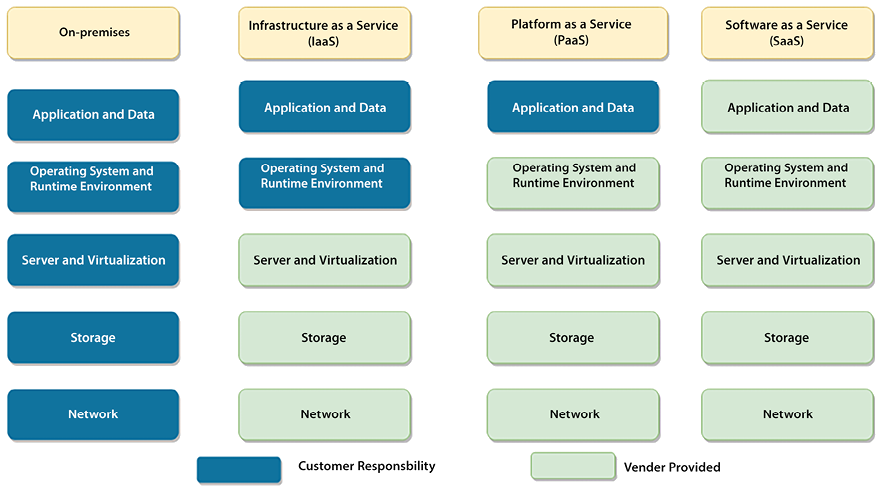
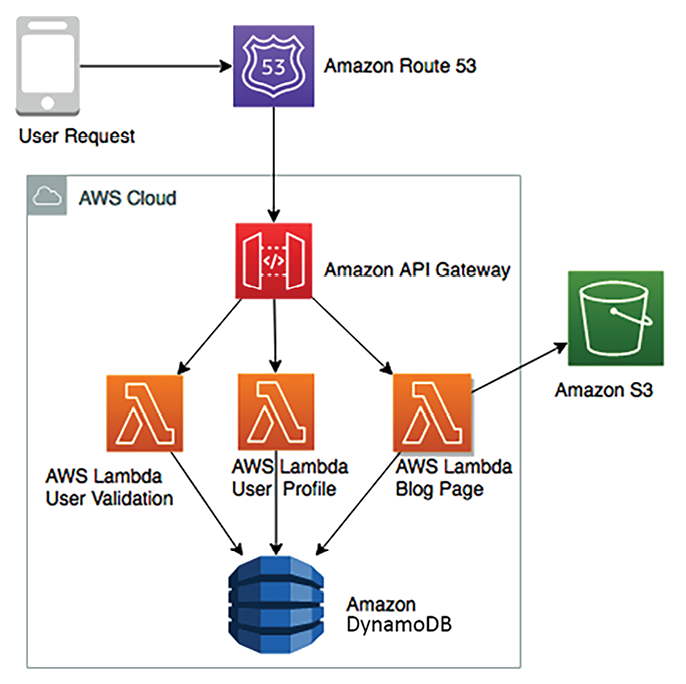
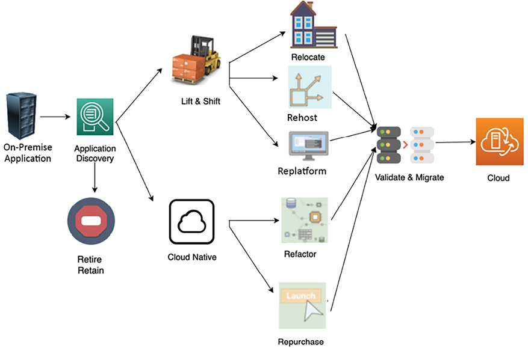
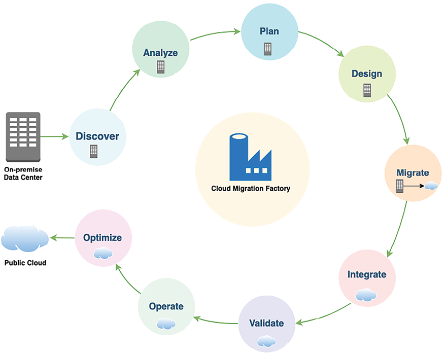
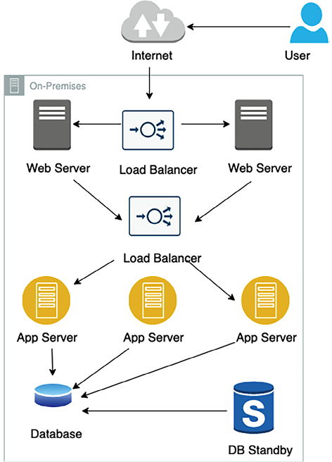
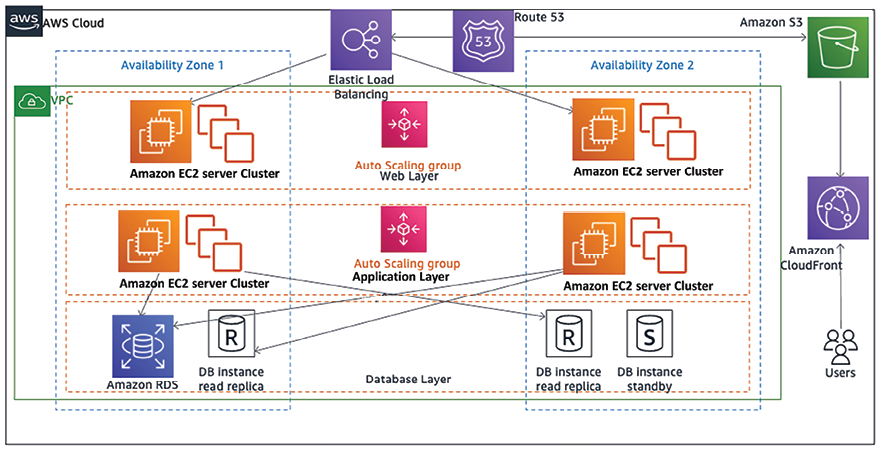
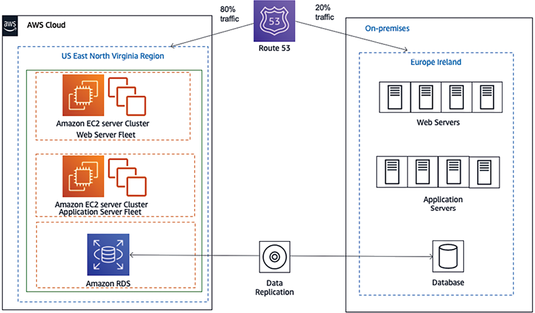
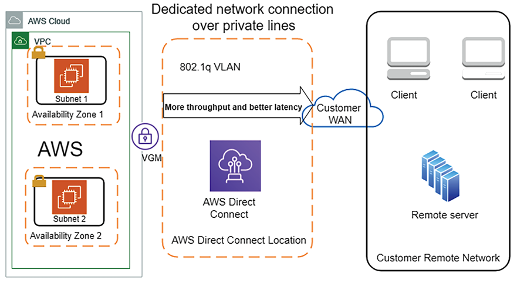
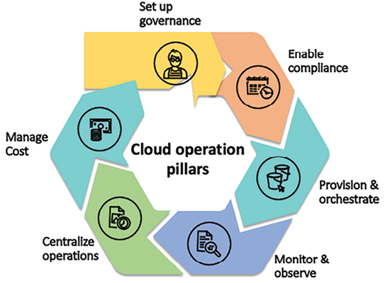

# مهاجرت ابری و طراحی معماری ابر

سازمان ها باید به طور مداوم مشتریان جدیدی را به دست آورند و نیازهای آنها را در حالی که در یک محیط رقابتی شدید کار می کنند، برآورده سازند. سازمان‌های امروزی باید برای پاسخگویی به تقاضاهای فزاینده مشتریان، چابک‌تر باشند، که این امر مستلزم افزایش سریع به میلیون‌ها مشتری و کاهش در صورت نیاز بدون تأثیر بر بودجه است. مهاجرت ابری می تواند پاسخی برای دستیابی به چابکی و سرعت باشد. ابر با استفاده از اتوماسیون و ادغام مرکز داده، انتشار مکرر برنامه را امکان پذیر می کند و هزینه ها را کاهش می دهد.

ابر برای هر استراتژی سازمانی ضروری است. اکثر سازمان ها با انتقال به فضای ابری عمومی هزینه ها را کاهش می دهند و علاوه بر صرفه جویی در هزینه ها، هزینه های سرمایه اولیه را به هزینه های عملیاتی تبدیل می کنند. بسیاری از استارت‌آپ‌های متولد شده در دهه گذشته در فضای ابری شروع به کار کردند و برای رشد سریع توسط _ زیرساخت ابری تقویت شدند. همانطور که شرکت ها به سمت ابر حرکت می کنند، باید روی استراتژی های مهاجرت ابر و ابر ترکیبی تمرکز کنند.

ابرهای عمومی مانند **Amazon Web Services** (**AWS**)، **Microsoft Azure** و **Google Cloud Platform** (**GCP**) در حال تبدیل شدن به مقصدهای اصلی میزبانی برنامه ها هستند. بنابراین یادگیری در مورد استراتژی ها و روش های مهاجرت به ابر ضروری است. در این فصل، شما با جنبه های مختلف ابر آشنا خواهید شد و "تفکر ابری" را توسعه می دهید، که به شما کمک می کند فصل های آینده را بهتر درک کنید.

این فصل موضوعات زیر را پوشش می دهد:

- ابرهای عمومی، خصوصی و ترکیبی
- معماری راه حل در ابر عمومی
- معماری بومی ابری
- ایجاد یک استراتژی مهاجرت ابری
- انتخاب استراتژی ابری
- مراحل مهاجرت ابری
- بهینه سازی اپلیکیشن در فضای ابری
- ایجاد یک معماری ابری ترکیبی
- اتخاذ رویکرد چند ابری
- پیاده سازی CloudOps

در پایان این فصل، با مزایای ابر آشنا خواهید شد و استراتژی ها و مراحل مختلف مهاجرت ابر را خواهید فهمید. همچنین در مورد طراحی ابر ترکیبی، اتخاذ رویکرد چند ابری و پیاده سازی CloudOps یاد خواهید گرفت.

# ابرهای عمومی، خصوصی و ترکیبی

سه نوع مختلف از مدل های ابری وجود دارد: عمومی، خصوصی و ترکیبی.

**کلاد عمومی** بر اساس مدل محاسباتی استاندارد است که در آن یک ارائه دهنده خدمات منابعی مانند **ماشین های مجازی** (**VMs**)، برنامه های کاربردی و ذخیره سازی را از طریق اینترنت در دسترس مشتریان قرار می دهد. در مدل رایانش ابری، یک فروشنده عمومی ابری، منابع فناوری اطلاعات، مانند سرور، پایگاه داده، شبکه و ذخیره‌سازی را بر حسب تقاضا فراهم می‌کند که سازمان‌ها می‌توانند با رابط‌های مبتنی بر وب امن یا از طریق برنامه‌های کاربردی از طریق اینترنت از آن استفاده کنند. سرویس های ابری عمومی یک مدل _pay-as-you-go_ را ارائه می دهند و در بیشتر موارد، مشتری فقط برای خدماتی که در طول مدت استفاده از آنها استفاده می کند پرداخت می کند و با بهینه سازی منابع IT برای کاهش زمان بیکاری، در هزینه ها صرفه جویی می کند.

می توانید ابر عمومی را به عنوان یک مدل منبع تغذیه در نظر بگیرید که در آن چراغ را روشن می کنید و فقط برای مقدار برقی که در واحدها استفاده می کنید هزینه می پردازید. از لحظه ای که آن را خاموش می کنید، پرداخت آن را متوقف می کنید. این شما را از پیچیدگی تولید برق با استفاده از توربین ها، منابع برای نگهداری تاسیسات، و راه اندازی زیرساخت قابل توجه انتزاعی می کند و شما از کل سرویس به روشی ساده استفاده می کنید.

علاوه بر مزایای هزینه، ارائه‌دهندگان بزرگ ابر عمومی، مانند AWS، GCP، Microsoft Azure، Alibaba، و Oracle Cloud Platform (OCP)، با گسترش پلت‌فرم‌های فناوری خود از طریق ابر، به نوآوری کمک می‌کنند. این ارائه دهندگان ابر عمومی بر مقیاس‌پذیری و معماری آینده‌نگر با یادگیری ماشینی و تجزیه و تحلیل جامع تسلط دارند. با استفاده از ابر عمومی، به این فناوری های پیشرفته و گزینه استفاده از آنها برای پیشرفت معماری خود دسترسی خواهید داشت.

یک **ابر خصوصی** یا **ابر در محل**، در یک سازمان ثبت شده است که مالک آن است و به آن دسترسی دارد. ابرهای خصوصی به عنوان تکرار یا توسعه مرکز داده موجود شرکت عمل می کنند. در مقایسه، یک ابر عمومی دارای یک اجاره مشترک است، به این معنی که سرورهای مجازی از چندین مشتری یک سرور فیزیکی را به اشتراک می‌گذارند. با این حال، آنها سرورهای فیزیکی اختصاصی را ارائه می دهند اگر مشتری آنها را برای مجوز یا نیاز به انطباق بخواهد.

مدل سوم یک ** ابر ترکیبی** است که توسط شرکت های بزرگی استفاده می شود که حجم کار خود را از محل به یک ابر منتقل می کنند، جایی که آنها هنوز یک برنامه قدیمی دارند که نمی تواند مستقیماً به ابر منتقل شود یا شاید یک برنامه دارای مجوز دارند. که باید در محل باقی بماند - یا گاهی اوقات، به دلایل انطباق، آنها نیاز به ایمن سازی داده ها در محل دارند. در چنین شرایطی، مدل ترکیبی به زمانی کمک می کند که سازمان مجبور باشد یک محیط جزئی در محل نگهداری کند و سایر برنامه ها را به ابر عمومی منتقل کند. گاهی اوقات، یک سازمان برای آزمایش و توسعه محیط به ابر عمومی و حفظ محیط های تولید در محل حرکت می کند. یک مدل ترکیبی بسته به clou سازمان می تواند متفاوت باشد

استراتژی د.

از آنجایی که چندین ارائه‌دهنده ابر عمومی در بازار هستند، ممکن است روندهای **چند ابری** را مشاهده کنید، جایی که شرکت‌ها تصمیم می‌گیرند حجم کاری خود را بین فروشندگان مختلف ابر عمومی توزیع کنند تا از هر فناوری ابری بیشترین بهره را ببرند یا گزینه‌هایی را برای تیم خود ارائه دهند. بسته به مجموعه مهارت آنها

بیایید در مورد ابر عمومی و چگونگی تبدیل شدن آن به یک پلت فرم فناوری ضروری برای مشاغل بیشتر بدانیم.

# معماری راه حل در ابر عمومی

معماری راه حل در فضای ابری اهمیت فزاینده ای پیدا کرده و در حال تبدیل شدن به "عادی جدید" است زیرا شرکت های بیشتری تصمیم می گیرند حجم کاری خود را به آن منتقل کنند. ابر عمومی عاملی حیاتی برای تقویت رشد سازمان‌های نوپا بوده است، زیرا آنها به جای سرمایه‌گذاری اولیه در راه‌حل‌های پرهزینه در محل، تنها به سرمایه‌گذاری اولیه کوچکی نیاز دارند. این اجازه می دهد تا سازمان ها به عنوان یک آزمایش اداره شوند و چابک و نوآور باشند.

نکته مهم در مورد معماری رایانش ابری این است که شما دیدی سرتاسری از تمام اجزای معماری، از جمله پلتفرم های ظاهری، پلت فرم توسعه برنامه، سرورها، ذخیره سازی، پایگاه داده، اتوماسیون، تحویل و شبکه هایی دارید که برای کل چشم انداز راه حل را مدیریت کنید.

بیایید در مورد معماری ابر عمومی بیشتر بیاموزیم.

## معماری ابر عمومی

یک تعریف معمولی از ابر عمومی یک محیط کاملا مجازی است که از طریق اینترنت و از طریق یک شبکه خصوصی قابل دسترسی است. با این حال، فروشندگان ابر عمومی اخیراً شروع به ارائه یک زیرساخت فیزیکی در محل برای پذیرش بهتر ابر ترکیبی کرده‌اند. ابر عمومی یک مدل چند اجاره ای را ارائه می دهد که در آن زیرساخت های فناوری اطلاعات، مانند ذخیره سازی و قدرت محاسباتی، بین چندین مشتری به اشتراک گذاشته می شود. با این حال، در سطوح نرم افزاری و شبکه منطقی ایزوله است و با بار کاری یکدیگر تداخلی ندارد. سازمان‌ها می‌توانند انزوا در سطح شبکه در ابر عمومی ایجاد کنند تا ابر خصوصی مجازی خود را معادل مرکز داده منطقی داشته باشند. با نگاهی به نیازهای نظارتی سازمان ها، ابر عمومی نیز نمونه های فیزیکی اختصاصی را ارائه می دهد. با این حال، آنها از طریق وب نیز قابل دسترسی هستند، اما این گزینه کمتر رایج است.

ذخیره سازی ابری عمومی با ایجاد یک مدل افزونگی با استفاده از مراکز داده متعدد و تکثیر داده های قوی، به دوام و در دسترس بودن بالا دست می یابد. این باعث می شود تا به انعطاف پذیری معماری و مقیاس پذیری آسان دست یابد.

همانطور که در _شکل 3.1_ نشان داده شده است، سه نوع اصلی از مدل های محاسبات ابری عمومی وجود دارد. راه حل های درون محل نیز برای مقاصد مقایسه نشان داده شده است.

شکل 3.1: انواع مدل های رایانش ابری

در _شکل 3.1_، می توانید مسئولیت های مشتری را در محیط داخلی با مدل خدمات رایانش ابری مقایسه کنید. در محیط داخلی، مشتری باید همه چیز را مدیریت کند، در حالی که در مدل رایانش ابری، مشتریان می‌توانند مسئولیت‌ها را به فروشنده واگذار کنند و بر نیازهای تجاری خود تمرکز کنند. نکات زیر جزئیات سطح بالایی از خدماتی است که تحت مدل‌های مختلف رایانش ابری ارائه می‌شوند:

- **زیرساخت به عنوان سرویس** (**IaaS**): در اینجا، یک فروشنده ابری منابع زیرساختی مانند سرور محاسباتی، اجزای شبکه و فضای ذخیره سازی داده را به عنوان خدمات مدیریت شده ارائه می کند. این به مشتریان کمک می کند تا از منابع IT بدون نگرانی در مورد رسیدگی به هزینه های مرکز داده مانند گرمایش و سرمایش، قفسه بندی و انباشته کردن، امنیت فیزیکی و غیره استفاده کنند.
- **پلتفرم به عنوان سرویس** (**PaaS**): مدل PaaS یک لایه سرویس اضافه می کند که در آن فروشنده ابر از منابع مورد نیاز برای پلت فرم توسعه شما مراقبت می کند، مانند **سیستم عامل* * (**OS**)، تعمیر و نگهداری نرم افزار، و وصله، به همراه منابع زیرساخت. مدل PaaS تمرکز تیم شما را بر روی نوشتن منطق تجاری و مدیریت داده ها با مراقبت از بار نگهداری پلت فرم برای شما تسهیل می کند.
- **نرم افزار به عنوان سرویس** (**SaaS**): مدل SaaS یک لایه دیگر از انتزاع را در بالای مدل های PaaS و IaaS اضافه می کند، که در آن ابر یا فروشنده نرم افزار نرم افزار آماده برای استفاده را ارائه می دهد، و شما هزینه خدمات را پرداخت می کنید به عنوان مثال، شما از سرویس‌های ایمیل مانند Gmail، Yahoo Mail، AOL و غیره استفاده می‌کنید، جایی که فضای اختصاصی خود را برای ایمیل‌ها به‌عنوان سرویس دریافت می‌کنید و لازم نیست نگران برنامه‌ها یا زیرساخت‌های اساسی باشید.

چهارمین مدل در حال ظهور، مدل **Function-as-a-Service** (**FaaS**) است که با استفاده از خدماتی از جمله AWS Lambda در ساخت معماری بدون سرور محبوب می شود. جزئیات بیشتری در مورد معماری بدون سرور در _فصل 5_، _ الگوهای طراحی معماری بومی ابری_ خواهید آموخت. بیایید نگاهی اجمالی به ارائه دهندگان ابر عمومی بیندازیم.

## ارائه دهندگان ابر عمومی محبوب

چهار ارائه‌دهنده اصلی ابر در درجه اول بر بازار ابر جهانی تسلط دارند. طبق گزارش سال 2023 Statista، AWS با سهم بازار 32 درصد پیشتاز بسته است و مجموعه گسترده ای از خدمات ابری را شامل محاسبات، ذخیره سازی، شبکه، پایگاه های داده، مقعدی ارائه می کند.

ytics، یادگیری ماشین و هوش مصنوعی. AWS به عنوان مثال در سراسر این کتاب استفاده شده است.

مایکروسافت آژور با 24 درصد از سهم بازار، در برنامه های کاربردی سازمانی و محاسبات ابری ترکیبی از نزدیک دنبال می شود. GCP 11 درصد از سهم بازار را در اختیار دارد و به سرعت در حال رشد است، به ویژه برای یادگیری ماشینی و مهارت هوش مصنوعی خود مشهور است. Alibaba Cloud با 4 درصد سهم بازار جایگاه چهارم را به خود اختصاص داده و در منطقه آسیا و اقیانوسیه برتری دارد. این چهار ارائه دهنده بیش از 70 درصد از بازار جهانی ابر را در اختیار دارند. دیگر بازیگران مهم عبارتند از Oracle، IBM Cloud، Tencent Cloud و Salesforce. می‌توانید به گزارش مفصل در اینجا مراجعه کنید: [https://www.statista.com/chart/18819/worldwide-market-share-of-leading-cloud-infrastructure-service-providers/](https://www. statista.com/chart/18819/سهم-بازار-جهانی-از-ارائه دهندگان-خدمات-زیرساخت-کلود-پیشرو/).

از آنجایی که عملکرد ابر عمومی و مدل هزینه بسیار متفاوت است، بیایید یاد بگیریم که چگونه یک رویکرد بومی ابری برای طراحی معماری ایجاد کنیم.

## معماری بومی ابر

با افزایش پذیرش ابر، معماری بومی ابر (یا مبتنی بر ابر) معماری سیستم را برای قابلیت‌های ابری بهینه می‌کند. یک معماری معمولی در محل معمولاً برای زیرساخت ثابت ساخته می‌شود، زیرا افزودن منابع جدید فناوری اطلاعات مانند سرورها و قدرت محاسباتی می‌تواند زمان، هزینه و تلاش قابل توجهی را اضافه کند. با این حال، ابر بر اساس استفاده شارژ می‌شود و از طریق اتوماسیون، مانند افزایش مقیاس سرورها، بدون نگرانی در مورد چرخه خرید طولانی، سهولت را فراهم می‌کند. معماری بومی ابری به جای تعمیر آنها، بر دستیابی به مقیاس درخواستی، طراحی توزیع شده و جایگزینی اجزای ناموفق تمرکز دارد.

در معماری بومی ابری، با استفاده از قابلیت‌های ابری **ادغام پیوسته** (**CI**)، استقرار و اتوماسیون زیرساخت، به طور مداوم عملیات خودکار برای بازیابی، مقیاس‌پذیری، خوددرمانی و در دسترس بودن بالا ایجاد می‌کنید. با استفاده از قابلیت های ابری جدید که هر روز منتشر می شوند و بهبود می یابند، بهینه سازی مداوم برنامه شما را از نظر هزینه و عملکرد تشویق می کند.

ارائه دهندگان ابر عمومی به زیرساخت های جهانی اجازه می دهند در سراسر جهان گسترش یابد، که به یک برنامه کمک می کند تا در سطح جهانی نزدیک پایگاه کاربر شما مقیاس بندی شود. برای تشویق پذیرش، همه سرویس‌های ابری یک سرویس رایگان با منابع یادگیری زیادی ارائه می‌کنند، بنابراین می‌توانید دست خود را امتحان کنید و دانش خود را در مورد آنها توسعه دهید.

رویکرد _ابر بومی_ به کارمندان کمک می کند تا تفکر نوآورانه را توسعه دهند و ایده های خود را بلافاصله به جای منتظر ماندن برای چرخه طولانی زیرساخت، اجرا کنند.

با استفاده از ابر، مشتریان نیازی به برنامه ریزی ظرفیت اضافی برای مدیریت فصل اوج خود ندارند، مانند فصل خرید تعطیلات برای خرده فروشان. آنها کشش لازم برای تامین منابع برای پاسخگویی فوری به تقاضا را دارند. این به طور قابل توجهی به کاهش هزینه ها و بهبود تجربه مشتری کمک می کند. برای اینکه هر سازمانی در رقابت باقی بماند، باید به سرعت و نوآورانه حرکت کند.

ابر به شرکت‌ها این امکان را می‌دهد تا زیرساخت‌های خود را به سرعت در سراسر جهان دریافت کنند و به فناوری‌های مختلفی دسترسی پیدا کنند که قبلاً در دسترس نبودند. اینها شامل دسترسی به فناوری های پیشرفته مانند موارد زیر است:

- داده های بزرگ و تجزیه و تحلیل
- یادگیری ماشینی و هوش مصنوعی
- **اینترنت اشیا** (**IoT**)
- بلاک چین
- هوش مصنوعی مولد

ساخت یک معماری راه حل برای ابر با معماری سازمانی معمولی متفاوت است. در حین حرکت به سمت ابر، باید تفکر ابری را توسعه دهید و بدانید که چگونه از قابلیت‌های داخلی ابر استفاده کنید. برای تفکر ابری، از مدل _pay-as-you-go_ پیروی می کنید، به این معنی که باید مطمئن شوید که حجم کاری خود را به درستی بهینه کرده اید و سرورهای خود را فقط در صورت نیاز اجرا می کنید.

در فضای ابری، معمار راه‌حل‌ها باید دیدی جامع از هر مؤلفه در مورد عملکرد، مقیاس‌بندی، دسترسی بالا، بازیابی فاجعه، تحمل خطا، امنیت و اتوماسیون داشته باشد.

سایر زمینه های بهینه سازی **نظارت بومی ابری** و **مکانیسم های هشدار** است. ممکن است نیازی نباشد که ابزار نظارت شخص ثالث موجود خود را از داخل محل به فضای ابری بیاورید، زیرا می‌توانید از نظارت ابری بومی بهتر استفاده کنید و نرم‌افزارهای پرهزینه صدور مجوز شخص ثالث را حذف کنید. همچنین، در حال حاضر، شما می توانید قابلیت استقرار به هر نقطه از جهان را در عرض چند دقیقه داشته باشید. خود را به یک منطقه خاص محدود نکنید؛ از مدل استقرار جهانی برای ایجاد مکانیسم‌های بهتر در دسترس بودن و بازیابی فاجعه استفاده کنید.

ابر معاملات عالی برای اتوماسیون فراهم می کند. _شما می توانید همه چیز را خودکار کنید. اتوماسیون با استفاده بهینه از منابع انسانی و رهایی آنها از انجام کارهای خسته کننده و تکراری، خطاها را کاهش می دهد، زمان ورود به بازار را سرعت می بخشد و در هزینه های زیادی صرفه جویی می کند.

ابر بر روی یک _مدل مسئولیت مشترک_ کار می کند که در آن فروشندگان ابری مسئول ایمن سازی زیرساخت های فیزیکی هستند. با این حال، امنیت یک برنامه کاربردی و داده های آن کاملاً بر عهده مشتری است. بنابراین، مهم است که محیط خود را قفل کنید و امنیت را حفظ کنید

با استفاده از ابزارهای بومی ابری برای نظارت، هشدارها و اتوماسیون.

## طراحی معماری بومی ابری

هر سازمانی ممکن است نظر متفاوتی در مورد معماری بومی ابری داشته باشد، اما در مرکز آن، تبدیل شدن به ابر بومی، استفاده از همه قابلیت‌های ابری به بهترین شکل ممکن است. معماری واقعی ابری در مورد طراحی برنامه شما از پایه آن است تا در فضای ابری ساخته شود.

Cloud-native به معنای میزبانی برنامه شما در بستر ابری نیست. این در مورد استفاده از خدمات و ویژگی های ارائه شده توسط ابر است. این ممکن است شامل موارد زیر باشد:

- کانتینر کردن معماری یکپارچه خود در یک میکروسرویس و ایجاد خط لوله CI/CD برای استقرار خودکار.
- ساخت یک برنامه بدون سرور با فناوری هایی مانند AWS Lambda FaaS و Amazon DynamoDB (پایگاه داده NoSQL مدیریت شده در فضای ابری).
- ایجاد یک دریاچه داده بدون سرور، برای مثال با استفاده از Amazon S3 (یک سرویس ذخیره سازی شی مدیریت شده)، AWS Glue (یک خوشه Spark مدیریت شده برای ETL) و Amazon Athena (یک خوشه Presto مدیریت شده برای پرس و جوهای موقت).
- استفاده از سرویس نظارت و گزارش گیری بومی ابری، به عنوان مثال، Amazon CloudWatch.
- استفاده از یک سرویس حسابرسی بومی ابری، به عنوان مثال، AWS CloudTrail.

نمودار زیر نمونه ای از معماری بدون سرور بومی ابری برای یک برنامه میکروبلاگینگ است:

شکل 3.2: معماری اپلیکیشن میکروبلاگینگ بومی ابری

نمودار قبلی استفاده از خدمات بدون سرور بومی ابری را در ابر AWS نشان می‌دهد. در اینجا Amazon Route 53 که سرویس DNS را مدیریت می کند، درخواست های کاربران را مسیریابی می کند. لامبدا به عنوان سرویسی برای کنترل کد اعتبار سنجی کاربر، نمایه های کاربر و صفحات وبلاگ عمل می کند. تمام دارایی های وبلاگ در آمازون S3 ذخیره می شود که خدمات ذخیره سازی اشیا را مدیریت می کند و تمام داده های پروفایل کاربر در DynamoDB آمازون ذخیره می شود که فروشگاه NoSQL آن را مدیریت می کند.

همانطور که کاربران درخواست‌ها را ارسال می‌کنند، AWS Lambda کاربر را تأیید می‌کند و به نمایه او نگاه می‌کند تا اطمینان حاصل کند که در Amazon DynamoDB اشتراک دارند. پس از آن، دارایی‌های وبلاگ مانند تصاویر، ویدئوها و یک نوشتن HTML ثابت را از آمازون S3 انتخاب کرده و به کاربر نمایش می‌دهد. این معماری را می توان به صورت نامحدود مقیاس بندی کرد زیرا همه سرویس ها خدمات مدیریت شده بومی ابری هستند و شما هیچ زیرساختی را مدیریت نمی کنید.

عوامل مهمی مانند در دسترس بودن بالا، بازیابی فاجعه و مقیاس پذیری توسط این سرویس های ابری تحت مراقبت قرار می گیرند تا بتوانید بر توسعه ویژگی خود تمرکز کنید. از نظر هزینه، شما فقط در صورتی پرداخت خواهید کرد که درخواستی به یک برنامه وبلاگ نویسی برود. اگر کسی شبانه وبلاگ را مرور نمی کند، برای میزبانی کد خود هیچ هزینه ای پرداخت نمی کنید. شما فقط هزینه ذخیره سازی اسمی را پرداخت می کنید.

مزیت معماری بومی ابری این است که نوآوری سریع و چابکی را در تیم امکان پذیر می کند. ایجاد یک برنامه کاربردی و زیرساخت پیچیده را ساده می کند. از آنجایی که شما به شدت بر روی طراحی و ساخت شبکه ها، سرورها، ذخیره سازی فایل ها و سایر منابع محاسباتی خود تمرکز می کنید، می توانید اجرای فیزیکی را به ارائه دهنده محاسبات ابری خود بسپارید.

سایر مزایای معماری بومی ابری عبارتند از:

- **تعدیل سریع بر اساس تقاضا**: می توانید منابع مورد نیاز خود را در صورت نیاز درخواست کنید. شما فقط برای چیزی که استفاده می کنید هزینه می پردازید.
- **تکثیر سریع**: زیرساخت به عنوان کد به این معنی است که می توانید یک بار بسازید و بیشتر تکرار کنید. به جای اینکه زیرساخت خود را با دست بسازید، می توانید آن را به صورت مجموعه ای از اسکریپت ها یا برنامه ها بسازید. ساخت زیرساخت خود به صورت برنامه‌ریزی شده به شما امکان می‌دهد تا در صورت نیاز برای توسعه یا آزمایش، آن را بسازید و بازسازی کنید.
- **به راحتی پاره و پاره می شود**: در فضای ابری، خدمات بر اساس تقاضا ارائه می شود، بنابراین ایجاد یک سیستم آزمایشی بزرگ آسان است. سیستم شما ممکن است شامل مجموعه ای از سرورهای وب و برنامه های کاربردی مقیاس پذیر، پایگاه داده های متعدد، ترابایت ظرفیت، برنامه های کاربردی گردش کار و نظارت باشد. پس از اتمام آزمایش می توانید همه آن را از بین ببرید و در هزینه ها صرفه جویی کنید.

نمونه های بیشتری در زمینه ذخیره سازی، شبکه و اتوماسیون برای ساخت معماری بومی ابری وجود دارد. درباره این معماری در _فصل 5_، _ الگوهای طراحی معماری بومی ابری_ بیشتر خواهید آموخت.

در طول این کتاب، شما با دیدگاه ابری معماری راه حل آشنا خواهید شد و درک عمیقی از معماری ابر خواهید داشت. در قسمت بعدی با استراتژی های مختلف مهاجرت ابری آشنا می شوید.

# ایجاد استراتژی مهاجرت ابری

استراتژی شما برای ابر به شما کمک می کند تا استراتژی مهاجرت را تعیین کنید و برنامه ها را اولویت بندی کنید. اینها برخی از دلایلی است که می تواند ابتکاری برای مهاجرت ابر و استراتژی های ابر ترکیبی ایجاد کند:

- مرکز داده نیاز به تجدید فناوری دارد
- اجاره مرکز داده در حال پایان است
- ظرفیت ذخیره سازی و محاسباتی مرکز داده تمام شده است
- نوسازی یک اپلیکیشن
- استفاده از فناوری های پیشرفته مانند هوش مصنوعی، تجزیه و تحلیل پیشرفته، یادگیری ماشین، اینترنت اشیا و غیره
- نیاز به بهینه سازی منابع IT برای صرفه جویی در اپ

هزینه های منطقی
- برنامه ریزی بازیابی بلایا و تاب آوری عملیاتی
- برای استفاده از شبکه توزیع محتوا برای وب سایت
- کاهش هزینه های سرمایه اولیه و حذف هزینه های نگهداری
- افزایش بهره وری و بهره وری نیروی کار
- برای بهبود چابکی کسب و کار

هر سازمانی استراتژی متفاوتی دارد و یک اندازه در مورد پذیرش ابری مناسب نیست. موارد استفاده مکرر، محیط‌های توسعه و آزمایش را در فضای ابری قرار می‌دهند تا چابکی توسعه دهندگان را برای حرکت سریع‌تر اضافه کنند. از آنجایی که میزبانی برنامه های وب با استفاده از ابر اقتصادی تر و ساده تر می شود، سازمان ها با میزبانی وب سایت ها و ویژگی های دیجیتالی خود در فضای ابری از ابر برای تحول دیجیتال استفاده می کنند.

برای دسترسی به برنامه، نه تنها ساختن یک برنامه برای مرورگر وب ضروری است، بلکه باید اطمینان حاصل شود که از طریق _موبایل های هوشمند_ و _تبلت ها_ قابل دسترسی است. ابر به چنین تحولاتی کمک می کند. پردازش و تجزیه و تحلیل داده ها حوزه دیگری است که در آن شرکت ها از ابر استفاده می کنند زیرا جمع آوری، ذخیره، تجزیه و تحلیل و به اشتراک گذاری داده ها با ابر هزینه کمتر و سریع تر است.

پذیرش ابر فقط در مورد انتخاب پلت فرم، طراحی امنیتی و عملیات نیست. شما همچنین باید علاوه بر فناوری، افراد، فرآیندها و فرهنگ را نیز در نظر بگیرید. برای موفقیت در مهاجرت ابری، باید رهبران را همسو کنید و با ارتقای مهارت آنها، تعهد تیم را به دست آورید. برای اطمینان از انتقال موفق ابری، باید چشم انداز را در سراسر سازمان تعریف کنید.

اغلب، پروژه های مهاجرت استراتژی های متعددی را اتخاذ می کنند و بر این اساس از ابزارهای مختلف استفاده می کنند. استراتژی مهاجرت بر زمان لازم برای مهاجرت و نحوه گروه بندی برنامه ها برای فرآیند مهاجرت تأثیر می گذارد. نمودار زیر برخی از استراتژی های رایج برای انتقال برنامه های کاربردی موجود به ابر را نشان می دهد:

شکل 3.3: استراتژی مهاجرت ابر

همانطور که در نمودار قبل نشان داده شده است، می توانید **بالا و جابجایی** سرور یا برنامه را از محیط منبع به ابر انجام دهید. انتقال یک منبع به حداقل تغییرات نیاز دارد تا بتواند در فضای ابری کار کند. برای اتخاذ رویکرد **ابر بومی**تر، می توانید برنامه خود را برای استفاده کامل از ویژگی ابر بومی تغییر دهید، به عنوان مثال، برنامه های یکپارچه را به میکروسرویس تبدیل کنید.

اگر برنامه شما یک برنامه قدیمی است که قابل جابجایی نیست یا با ابر سازگار نیست، ممکن است بخواهید آن را بازنشسته کنید و با یک محصول SaaS بومی ابری یا راه حل شخص ثالث جایگزین کنید.

یک سازمان می تواند ترکیبی از استراتژی های مهاجرت را اتخاذ کند. برای مثال، اگر یک سیستم عامل میزبان برنامه در پایان عمر خود است، باید آن را ارتقا دهید. می توانید از این فرصت برای مهاجرت به ابر برای انعطاف پذیری بهتر استفاده کنید. در این صورت، احتمالاً روش **replatform** را برای کامپایل مجدد کد خود در نسخه جدید سیستم عامل و تأیید اعتبار تمام ویژگی های آن انتخاب خواهید کرد. پس از اتمام تست، می توانید برنامه را به سیستم عامل در سرور ارائه شده توسط ابر منتقل کنید. اگر می خواهید یک پلتفرم جدید بخرید، به عنوان مثال، راه حل قدیمی **مدیریت ارتباط با مشتری** (**CRM**) خود را با راه حل های مبتنی بر SaaS ارائه شده توسط Salesforce جایگزین کنید، می توانید **بازنشستگی و خرید مجدد** را انتخاب کنید. استراتژی اگر می‌خواهید برنامه‌تان را از یکپارچه به میکروسرویس بازسازی کنید تا چابکی بیشتری به آن اضافه کنید، می‌توانید آن را **بازسازی کنید**.

اهداف کسب‌وکار شما تصمیم شما را برای مهاجرت برنامه‌ها و تعریف استراتژی مهاجرت بر اساس اولویت آن‌ها هدایت می‌کند. به عنوان مثال، زمانی که کارایی هزینه محرک اصلی است، استراتژی مهاجرت معمولاً شامل مهاجرت انبوه با تمرکز شدید بر رویکرد **بالا و تغییر** است. با این حال، اگر هدف اصلی فعال کردن چابکی و نوآوری باشد، رویکرد بومی ابری (مانند معماری مجدد و بازسازی) نقش مهمی در استراتژی مهاجرت ابر ایفا می کند. بیایید در مورد هر استراتژی در بخش های فرعی زیر بیشتر بیاموزیم.

## مهاجرت را بالا ببرید و تغییر دهید

** بلند کردن و جابجایی ** سریعترین حالت مهاجرت است. برای جابجایی برنامه شما حداقل کار لازم است. با این حال، این حالت باید از ویژگی‌های بومی ابری استفاده کند. بیایید به رایج ترین استراتژی های مهاجرت نگاه کنیم (**rehost**، **replatform** و **relocate**) که اغلب برای جابجایی و جابجایی استفاده می شوند.

### میزبانی مجدد

میزبانی مجدد سریع، قابل پیش بینی، تکرار پذیر و مقرون به صرفه است که آن را به روشی ترجیحی برای مهاجرت به ابر تبدیل می کند. میزبانی مجدد یکی از سریع ترین استراتژی های انتقال ابر است که در آن سرور یا برنامه کاربردی از محیط منبع داخلی به ابر منتقل می شود. در طول فرآیند مهاجرت ممکن است حداقل تغییراتی در منابع ایجاد شود.

مشتریان اغلب از میزبانی مجدد برای انتقال سریع برنامه‌های خود به فضای ابری استفاده می‌کنند و زمانی که منابع در فضای ابری اجرا می‌شوند، روی بهینه‌سازی تمرکز می‌کنند. این تکنیک به آنها اجازه می دهد تا از مزایای هزینه استفاده از ابر مطلع شوند.

مشتریان معمولاً از تکنیک میزبانی مجدد برای موارد زیر استفاده می کنند:

- یک محیط توسعه و آزمایش موقت
- وقتی سرورها r هستند

نرم افزارهای بسته بندی شده را حذف کنید، مانند SAP و Microsoft SharePoint
- زمانی که یک برنامه کاربردی نقشه راه فعال ندارد

در حالی که میزبانی مجدد در نظر گرفته شده است که بر روی نرم افزارهای بسته بندی شده اعمال شود و به شما کمک می کند تا به سرعت در فضای ابری حرکت کنید، ممکن است نیاز به ارتقاء پلتفرم های کاربردی اساسی مانند سیستم عامل ها داشته باشید. در چنین شرایطی می توانید از رویکرد replatform مهاجرت ابری استفاده کنید.

### Replatform

هنگامی که یک نسخه سیستم عامل، سرور یا پایگاه داده به پایان عمر خود می رسد، می تواند یک پروژه مهاجرت ابری را راه اندازی کند، به عنوان مثال، سیستم عامل وب سرور خود را به Microsoft Windows 2022 ارتقا دهید، پایگاه داده خود را به Oracle 23c ارتقا دهید و غیره. این استراتژی شامل ارتقاء پلت فرم به عنوان بخشی از پروژه مهاجرت ابری بدون تغییر معماری برنامه است. می توانید تصمیم بگیرید که سیستم عامل یا برنامه خود را به نسخه جدیدتر به عنوان بخشی از مهاجرت به روز کنید.

هنگام استفاده از استراتژی مهاجرت replatform، ممکن است لازم باشد برنامه خود را مجدداً در محیط هدف نصب کنید، که باعث تغییرات برنامه می شود. این امر مستلزم آزمایش کامل برنامه شما پس از ایجاد مجدد پلتفرم برای اطمینان و تأیید کارایی عملیاتی آن پس از مهاجرت است.

دلایل رایج زیر استفاده از تکنیک replatform را تضمین می کند:

- تغییر سیستم عامل از 32 بیتی به 64 بیتی
- تغییر موتور پایگاه داده
- به روز رسانی آخرین نسخه از برنامه
- ارتقاء سیستم عامل
- ارتقاء موتور پایگاه داده
- برای دریافت مزایای خدمات مدیریت شده که از فروشندگان ابری در دسترس هستند، مانند ذخیره سازی مدیریت شده، پایگاه های داده، استقرار برنامه ها و ابزارهای نظارت

Replatforming به شما کمک می کند تا در حین مهاجرت به ابر، پلتفرم زیربنایی برنامه خود را ارتقا دهید. اگر در کانتینرها یا VMware مستقر شده باشد، می توانید برنامه خود را به فضای ابری منتقل کنید. اکنون، بیایید در مورد استراتژی جابجایی بیشتر بیاموزیم.

### نقل مکان

می توانید برنامه خود را با استفاده از کانتینرها یا ابزارهای VMware در مرکز داده داخلی خود مستقر کنید. شما می توانید چنین بارهای کاری را با استفاده از استراتژی مهاجرت تسریع شده به ابر منتقل کنید: **relocate**. جابجایی به شما کمک می کند صدها برنامه را در روز جابجا کنید. شما می توانید به سرعت برنامه های مبتنی بر VMware و فناوری های کانتینر را با کمترین تلاش و پیچیدگی به فضای ابری منتقل کنید.

استراتژی جابجایی فقط به کمی سرمایه گذاری اولیه توسعه دهنده یا یک برنامه آزمایشی نیاز دارد زیرا چابکی و اتوماسیونی را که از ابر انتظار دارید را ارائه می دهد. شما باید تنظیمات موجود را تعیین کنید و از VMotion یا Docker برای جابجایی سرورهای خود به فضای ابری استفاده کنید. درباره Docker در _فصل 6_، _ملاحظات عملکرد_ بیشتر خواهید آموخت.

VMotion برای مهاجرت زنده شناخته شده است. این یک فناوری VMware است که یک نمونه مجازی را قادر می‌سازد تا از یک سرور میزبان فیزیکی به سرور دیگر بدون وقفه در سرویس منتقل شود.

در حین انتقال برنامه خود به فضای ابری، ممکن است بخواهید از این فرصت برای بازسازی و معماری مجدد کل برنامه خود استفاده کنید تا آن را بومی ابری تر کنید. رویکرد Cloud-Native به شما این امکان را می دهد که از قابلیت کامل ابر استفاده کنید. بیایید در مورد رویکرد Cloud-Native بیشتر بیاموزیم.

## رویکرد بومی ابری

هنگامی که تیم شما تصمیم می گیرد به فضای ابری منتقل شود، در کوتاه مدت، به نظر می رسد کار اولیه بیشتر و مهاجرت کندتر به ابر است. این کمی پرهزینه است، اما زمانی که از تمام مزایای ابری با یک تیم چابک برای نوآوری استفاده کنید، در درازمدت جواب می دهد.

با رویکرد Cloud-Native، با گذشت زمان شاهد کاهش شدید هزینه ها خواهید بود، زیرا می توانید حجم کاری خود را با قیمت مناسب بهینه کنید و در عین حال عملکرد را دست نخورده نگه دارید با مدل _pay-as-you-go_. رویکرد Cloud-Native شامل محفظه سازی برنامه شما با معماری مجدد آن به عنوان یک میکروسرویس یا انتخاب یک رویکرد صرفاً بدون سرور است.

بیایید در مورد روش‌های refactor و repurchase برای رویکرد مهاجرت بومی ابری بیشتر بیاموزیم.

### Refactor

روش Refactor شامل معماری مجدد و بازنویسی یک برنامه قبل از انتقال آن به ابر برای تبدیل آن به یک برنامه بومی ابری است. در بازسازی، برنامه را به یک طراحی ماژولارتر تغییر می دهید، مانند یکپارچه به میکروسرویس. Refactoring به microservices به سازمان ها کمک می کند تا تیم های مستقل کوچکی ایجاد کنند که می توانند مالکیت کامل را در اختیار بگیرند و در نتیجه سرعت نوآوری را افزایش دهند.

برنامه‌های کاربردی Cloud Native برنامه‌هایی هستند که برای عملکرد مؤثر در یک محیط ابری طراحی، معماری و ساخته شده‌اند. مزایای این قابلیت‌های ذاتی ابری شامل _مقیاس‌پذیری_، _امنیت_، _ چابکی_ و _کارآمدی_هزینه_است.

Refactoring قبل از مهاجرت به زمان و منابع بیشتری برای کدگذاری مجدد برنامه و معماری نیاز دارد. این رویکرد معمولاً توسط سازمان‌هایی با تجربه ابری گسترده یا نیروی کار بسیار ماهر استفاده می‌شود. یک گزینه جایگزین برای refactoring این است که برنامه خود را به ابر منتقل کنید و سپس آن را بهینه کنید. می‌توانید از فناوری‌های بدون سرور بومی ابری برای کاهش هزینه‌های سرپرست یک طراحی مدولار استفاده کنید.

نمونه های متداول بازسازی مجدد شامل موارد زیر است:

- تغییر پلت فرم ها، مانند AIX به Unix
-

انتقال پایگاه داده از پایگاه داده سنتی به پایگاه داده ابری
- جایگزینی محصولات میان افزاری
- معماری مجدد برنامه از یکپارچه به میکروسرویس
- بازسازی معماری برنامه، مانند کانتینری کردن یا بدون سرور کردن آن
- رمزگذاری مجدد اجزای برنامه
- نوسازی انبار داده برای اتصال سازمان ها به مشتریان

تصمیم‌گیری در مورد معماری مجدد یک برنامه کاربردی برای میکروسرویس‌ها یا بازسازی آن برای معماری کانتینری یا بدون سرور، مستلزم بررسی دقیق اهداف استراتژیک، پیامدهای هزینه و قابلیت‌های فنی سازمان است. معماری مجدد به میکروسرویس‌ها مقیاس‌پذیری و انعطاف‌پذیری بیشتری را ارائه می‌دهد و به هر سرویس اجازه می‌دهد تا به طور مستقل توسعه، استقرار و مقیاس‌بندی شود، که می‌تواند به طور قابل‌توجهی به چابکی و کارایی بلندمدت کمک کند. با این حال، این رویکرد ممکن است شامل بازسازی اساسی باشد و می تواند پیچیدگی را از نظر هماهنگی خدمات و ارتباطات شبکه ایجاد کند. از سوی دیگر، بازسازی معماری برای اتخاذ مدل های کانتینری یا بدون سرور می تواند عملیات را ساده کند، سربار زیرساخت را کاهش دهد و سرعت استقرار را بهبود بخشد، البته با سرمایه گذاری اولیه در توسعه و منحنی یادگیری بالقوه برای تیم.

تصمیم باید در سازگاری برنامه با معماری جدید، تخصص تیم و تأثیر بالقوه بر عملکرد و قابلیت اطمینان باشد. در حالی که میکروسرویس‌ها می‌توانند جداسازی خطا را بهبود بخشند و مدیریت منابع دانه‌ای‌تر را تسهیل کنند، معماری‌های کانتینری و بدون سرور می‌توانند استفاده از منابع را بهینه کنند و به طور بالقوه هزینه‌ها را کاهش دهند. امنیت و انطباق نیز ملاحظات مهمی هستند، زیرا هر سبک معماری چالش‌های منحصربه‌فردی را معرفی می‌کند که باید فعالانه مورد توجه قرار گیرند.

گاهی اوقات، تلاش قابل توجهی برای بازسازی یک برنامه انجام می شود. به عنوان یک معمار، باید ارزیابی کنید که آیا خرید یک محصول SaaS به شما کمک می کند **بازده سرمایه** (**ROI**) بهتری داشته باشید. بیایید استراتژی خرید مجدد را با جزئیات بیشتری بررسی کنیم.

### خرید مجدد

هنگامی که منابع و پروژه‌های فناوری اطلاعات شما به ابر منتقل می‌شوند، ممکن است به سرورها یا برنامه‌هایی نیاز داشته باشید که از شما بخواهند مجوز یا نسخه سازگار با ابر را خریداری کنید. به عنوان مثال، مجوز فعلی موجود در محل برای برنامه شما ممکن است نیاز به تأیید اعتبار زمانی داشته باشد که برنامه را در فضای ابری اجرا می کنید.

راه های متعددی برای رسیدگی به چنین سناریوهایی از صدور مجوز وجود دارد. می توانید یک مجوز جدید خریداری کنید و به استفاده از برنامه خود در فضای ابری ادامه دهید، یا مجوز موجود را رها کنید و آن را با یکی دیگر در ابر جایگزین کنید. این جایگزین می تواند یک ارائه SaaS از همان برنامه باشد.

ابر ممکن است پاسخی برای همه مشکلات شما نباشد و گاهی اوقات، یک برنامه قدیمی پیدا می‌کنید که ممکن است از مهاجرت ابری سودی نبرد یا برنامه‌های به ندرت مورد استفاده را پیدا کنید که قابل بازنشستگی هستند.

**عقلانی سازی حجم کار**

منطقی‌سازی حجم کار یک فرآیند استراتژیک در مهاجرت ابری و طراحی معماری است که بر تجمیع خدمات مشابه برای ساده‌سازی عملیات و افزایش کارایی تمرکز دارد. این رویکرد شامل ارزیابی و ادغام سیستم های متفاوت، مانند سیستم های CRM متعدد، در یک راه حل واحد است. هدف حذف افزونگی، کاهش پیچیدگی و بهینه سازی استفاده از منابع در چشم انداز فناوری اطلاعات سازمان است.

در بسیاری از شرکت‌ها، منطقی‌سازی حجم کار یک ابتکار حیاتی است که تصمیم‌گیری در مورد نگهداری، به‌روزرسانی، بازنشستگی یا تجمیع برنامه‌ها را راهنمایی می‌کند. این فرآیند نه تنها به ساده‌سازی پشته فن‌آوری کمک می‌کند، بلکه منابع فناوری اطلاعات را با اهداف تجاری همسو می‌کند و تضمین می‌کند که هر سرویس لازم، کارآمد است و به اهداف کلی سازمان کمک می‌کند. از طریق منطقی‌سازی، شرکت‌ها می‌توانند به زیرساخت‌های فناوری اطلاعات چابک‌تر، مقرون‌به‌صرفه‌تر و مقیاس‌پذیرتر دست یابند، به ویژه در زمینه مهاجرت ابری و معماری ابری ترکیبی، جایی که کارایی و سازگاری کلیدی است.

بیایید در ادامه با جزئیات بیشتر درباره استراتژی _حفظ یا بازنشستگی_ آشنا شویم.

## حفظ یا بازنشسته شوید

هنگامی که در حال برنامه ریزی برای انتقال ابر هستید، ممکن است تنها نیاز به جابجایی برخی از برنامه ها باشد. ممکن است به دلیل محدودیت های تکنولوژی نیاز به حفظ برخی برنامه ها داشته باشید. برای مثال، ممکن است برنامه های قدیمی همراه با یک سرور داخلی وجود داشته باشند که نتوانند حرکت کنند. از سوی دیگر، ممکن است برخی از برنامه‌ها را بازنشسته کنید و از قابلیت‌های بومی ابری استفاده کنید، برای مثال، سیستم‌های نظارت و هشدار برنامه‌های شخص ثالث. بیایید درباره استراتژی حفظ یا بازنشستگی بیشتر بیاموزیم.

### حفظ

ممکن است با چند برنامه در محیط داخلی خود مواجه شوید که برای کسب و کار شما ضروری هستند اما به دلایل فنی برای مهاجرت مناسب نیستند، مانند پشتیبانی نشدن سیستم عامل/برنامه در یک پلت فرم ابری. در چنین شرایطی، برنامه شما نمی‌تواند به فضای ابری منتقل شود، اما می‌توانید به اجرای آن در محیط داخلی خود ادامه دهید.

برای چنین سرورها و برنامه‌هایی، ممکن است تنها نیاز به انجام یک تحلیل اولیه برای تعیین مناسب بودن آنها برای ابر داشته باشید

مهاجرت. با این حال، سرور یا برنامه همچنان ممکن است وابستگی هایی با برنامه های مهاجرتی داشته باشد. بنابراین، ممکن است مجبور شوید اتصال این سرورهای داخلی به محیط ابری خود را حفظ کنید. در بخش _ایجاد معماری ابری ترکیبی_ در این فصل، درباره اتصال درون محل به ابر بیشتر خواهید آموخت.

ممکن است بخواهید سیستم های قدیمی قدیمی را در محل نگهداری کنید و آنها را اولویت بندی کنید تا بعداً منتقل شوند. با این حال، در طول کشف، سازمان‌ها اغلب برنامه‌هایی را پیدا می‌کنند که مورد استفاده قرار نمی‌گیرند، اما همچنان در اطراف نشسته‌اند و فضای زیرساخت را مصرف می‌کنند. می توانید چنین برنامه هایی را بازنشسته کنید. بیایید در مورد استراتژی بازنشستگی بیشتر تحقیق کنیم.

### بازنشستگی

هنگام مهاجرت به ابر، ممکن است موارد زیر را کشف کنید:

- برنامه هایی که به ندرت استفاده می شوند
- برنامه هایی که مقدار زیادی از ظرفیت سرور را مصرف می کنند
- برنامه هایی که ممکن است به دلیل ناسازگاری ابری مورد نیاز نباشند

در چنین شرایطی، می‌توانید حجم کاری موجود را بازنشسته کنید و رویکرد جدیدی را در پیش بگیرید که بیشتر در فضای ابری است.

یک استراتژی بازنشستگی را می توان برای میزبان ها و برنامه هایی که به زودی از رده خارج می شوند، اعمال کرد. این را می توان برای برنامه های میزبان غیر ضروری و اضافی نیز اعمال کرد. بسته به نیازهای تجاری شما، چنین برنامه هایی را می توان بدون مهاجرت به فضای ابری در محل از کار انداخت. میزبان ها و برنامه هایی که معمولاً برای بازنشستگی مناسب هستند شامل موارد زیر است:

- سرورهای داخلی و ذخیره سازی برای اهداف بازیابی فاجعه
- یکپارچه سازی سرور برای رفع افزونگی ها
- منابع تکراری به دلیل ادغام و اکتساب
- میزبان های جایگزین در یک راه اندازی معمولی با در دسترس بودن بالا
- ابزارهای دارای مجوز شخص ثالث (مانند نظارت بر حجم کار و اتوماسیون) که به عنوان قابلیت های داخلی در فضای ابری در دسترس هستند

اکثر پروژه های مهاجرت از چندین استراتژی استفاده می کنند و ابزارهای مختلفی برای هر استراتژی موجود است. استراتژی مهاجرت بر زمان لازم برای مهاجرت و نحوه گروه بندی برنامه ها برای فرآیند مهاجرت تأثیر می گذارد. مهاجرت ابری زمان خوبی برای بررسی موجودی کلی شما و حذف سرورهای شبح که نامشخص هستند است. در این بخش با استراتژی های مختلف ابری آشنا شدید. بیایید نگاهی گذرا به مقایسه آنها در بخش بعدی بیندازیم.

# انتخاب استراتژی مهاجرت ابری

انتخاب استراتژی مهاجرت مناسب برای پذیرش ابر برای رانندگان کسب و کار شما بسیار مهم است. محدودیت های مختلفی مانند مالی، منابع، زمان و مهارت ها را در نظر بگیرید. می‌توانید تلاش مورد نیاز برای استراتژی‌های مختلف که در بخش قبل در جدول زیر مورد بررسی قرار گرفت، مقایسه کنید. نوارهای جدول میزان زمان و هزینه مورد نیاز برای هر استراتژی و سطح فرصت بهینه سازی را نشان می دهد.

| **راهبرد مهاجرت** | **توضیحات** | **زمان و هزینه** | **فرصت های بهینه سازی** |
| ---------------------- | ------------------------------------------------ ---------------------------------- | ------------------------------- | ------------------------------- |
| **ریفکتور** | برنامه‌ها را به شکلی مدولار شده‌تر معمار کنید تا آنها را به صورت ابری تبدیل کنید |  |  |
| **رپلتفرم** | انتقال برنامه ها به پلتفرم ارتقا یافته بدون تغییر معماری اصلی |  |  |
| **خرید مجدد** | با خرید راه حل مبتنی بر ابر | محیط فعلی خود را جایگزین کنید  |  |
| ** میزبانی مجدد ** | به سرعت برنامه های خود را بدون تغییر معماری به فضای ابری منتقل کنید |  |  |
| **حفظ** | برنامه را در محل بگذارید، حداقل فعلا |  | N/A |
| **جابجایی** | جابجایی سریع برنامه ها به فضای ابری بدون تغییر |  | N/A |
| **بازنشستگی** | دارایی هایی را که دیگر مفید نیستند شناسایی کنید و آنها را به طور کامل حذف کنید | N/A | N/A |

جدول 3.1 - مقایسه استراتژی های مهاجرت ابر

مهاجرت ابری، در حالی که مزایای متعددی مانند مقیاس پذیری، انعطاف پذیری و کارایی هزینه را ارائه می دهد، مجموعه ای از خطرات را نیز به همراه دارد. سازمان ها باید از این مشکلات بالقوه آگاه باشند تا به طور موثر آنها را کاهش دهند. خطرات احتمالی عبارتند از:

- **از دست دادن و نشت داده**: در طول مهاجرت، داده های حساس در صورت عدم رمزگذاری و مدیریت صحیح می توانند در معرض خطراتی قرار گیرند. اطمینان از یکپارچگی و امنیت داده ها در طول فرآیند مهاجرت برای جلوگیری از نقض داده ها بسیار مهم است.\* **زمان خرابی**: مهاجرت می تواند منجر به s

خرابی سیستم، بر عملیات تجاری تأثیر می گذارد. برنامه ریزی و اجرای مهاجرت به صورت مرحله ای یا در ساعات کم پیک می تواند تأثیر را بر تداوم کسب و کار به حداقل برساند.
- **سرافرازی هزینه**: بدون برنامه ریزی و درک صحیح از مدل های قیمت گذاری ابری، سازمان ها می توانند با هزینه های غیرمنتظره مواجه شوند. داشتن یک نقشه راه و بودجه روشن برای فرآیند مهاجرت ضروری است.
- **مشکلات عملکرد**: برنامه ها ممکن است در ابتدا به دلیل تفاوت در معماری یا مشکلات سازگاری پیش بینی نشده، در فضای ابری مطابق انتظار عمل نکنند. آزمایش و بهینه سازی دقیق پس از مهاجرت ضروری است.
- **شکاف مهارت**: فقدان تخصص در رایانش ابری در سازمان می تواند مانع از فرآیند مهاجرت و عملیات آتی شود. سرمایه گذاری در آموزش و احتمالاً استخدام متخصصان می تواند این خطر را کاهش دهد.
- **تعامل و چالش های یکپارچه سازی **: اطمینان از اینکه سیستم ها و برنامه های موجود به طور یکپارچه با سرویس های ابری کار می کنند، می تواند پیچیده باشد و به استراتژی های یکپارچه سازی و تست قوی نیاز دارد.
- **تطابق**: رعایت مقررات صنعت و استانداردهای انطباق می تواند در محیط ابری چالش برانگیز باشد، به خصوص اگر سازمان در یک بخش بسیار تنظیم شده فعالیت کند.
- ** قفل فروشنده **: اتکای بیش از حد به فناوری ها و خدمات یک ارائه دهنده ابر می تواند منجر به مشکلاتی در تعویض ارائه دهندگان در آینده شود و به طور بالقوه بر انعطاف پذیری و کارایی هزینه تأثیر بگذارد.

برای کاهش خطرات مرتبط با مهاجرت ابری، همیشه توصیه می‌شود هنگام انتقال برنامه‌ها به ابر، رویکردی مرحله‌ای داشته باشید. ابتدا، کارکردهای تجاری را اولویت بندی کنید و برنامه ها را بهینه سازی کنید تا تفاوت در صرفه جویی در هزینه، بهبود عملکرد و بهره وری منابع را درک کنید. سعی کنید ابتدا مهاجرت کنید. سپس، در مراحل بعدی، می توانید به سمت بهینه سازی بروید. به عنوان مثال، اگر برنامه‌ای را مهاجرت می‌کنید که از پایگاه داده MS SQL استفاده می‌کند و آن را با یک پایگاه داده بومی ابری مانند Amazon Aurora یا Azure SQL جایگزین می‌کنید، بهترین روش این است که برنامه را در مرحله اول مهاجرت کنید و سپس پایگاه داده را انتقال دهید. در حالی که پایش ریسک و پایداری برنامه در مرحله دوم. می‌توانید برنامه خود را در مراحل بعدی با استفاده از پشته فناوری بدون سرور بومی ابری مانند AWS Lambda، Amazon API Gateway و Amazon DynamoDB بهینه کنید.

استراتژی مهاجرت باید به گونه ای تعریف شود که با اجازه دادن به تیم ها برای کار مستقل به سرعت اجرا شود. استراتژی مهاجرت ابری می تواند بر سایر عوامل سازمانی مانند عملکردهای مهندسی ساختمان در سازمان به جای برون سپاری تأثیر بگذارد. مهاجرت به فضای ابری همچنین فرصتی عالی برای پذیرش یا تقویت فرهنگ DevOps در سازمان است. این فرهنگ بر همکاری بین تیم‌های توسعه و عملیات، ساده‌سازی گردش کار و افزایش کارایی تأکید دارد.

سازمان‌ها معمولاً مزیت غیرمنتظره‌ای را در بهینه‌سازی حجم کار و افزایش امنیت در حین اجرای اکتشاف برنامه برای آماده شدن برای مهاجرت می‌بینند.

مراحل مختلفی در مهاجرت ابری وجود دارد. در قسمت بعدی با مراحل مهاجرت ابری آشنا می شوید.

# مراحل برای مهاجرت ابری

در بخش قبل، با استراتژی‌های مهاجرت مختلف آشنا شدید و ممکن است شروع به گروه‌بندی برنامه‌های خود برای اعمال تکنیک مهاجرت مناسب کرده باشید. این استراتژی ها همچنین به عنوان 7 Rs شناخته می شوند (نگهداری، بازنشستگی، جابجایی، میزبانی مجدد، خرید مجدد، پلتفرم مجدد و بازسازی) و برخی یا همه آنها می توانند بخشی از سفر ابری شما باشند.

از آنجایی که ممکن است نیاز به مهاجرت و مدیریت چندین برنامه در فضای ابری داشته باشید، توصیه می‌شود یک **Center of Excellence** (**CoE**) ابری راه‌اندازی کنید و این فرآیند را با یک کارخانه مهاجرت ابری استاندارد کنید. CoE ابری شامل افراد باتجربه ای از تیم های مختلف فناوری اطلاعات و کسب و کار در سراسر سازمان است که به عنوان یک تیم اختصاصی ابری با تمرکز بر تسریع ایجاد تخصص ابری در سازمان عمل می کنند. کارخانه مهاجرت ابری فرآیندها و ابزارهای مهاجرت و همچنین مراحلی را که باید طی شود، تعریف می کند، همانطور که در نمودار زیر نشان داده شده است:

شکل 3.4: مراحل مهاجرت ابر

همانطور که در نمودار قبلی نشان داده شده است، مراحل انتقال ابر به شرح زیر است:

- **Discover**: کشف پورتفولیوهای مهاجرت ابری و بارهای کاری در محل
- **Analyze**: داده ها و بارهای کاری کشف شده را تجزیه و تحلیل کنید
- **Plan**: برنامه ریزی مهاجرت به ابر و تعریف استراتژی مهاجرت
- **طراحی**: برنامه را مطابق با استراتژی مهاجرت طراحی کنید
- ** مهاجرت **: استراتژی مهاجرت را اجرا کنید
- **ادغام**: ادغام با دیگر برنامه ها و وابستگی های سیستم
- **Validate**: اعتبارسنجی عملکرد پس از مهاجرت
- **عملیات**: برنامه ریزی برای کار در فضای ابری
- **بهینه سازی**: حجم کاری خود را برای فضای ابری بهینه کنید

یکی از مراحل اولیه یک پروژه مهاجرت ابری، ارزیابی و اولویت بندی برنامه های کاربردی برای مهاجرت است. برای انجام این کار، باید فهرست کاملی از دارایی های فناوری اطلاعات در محیط خود را به دست آورید تا تعیین کنید کدام سرور

s، برنامه ها و واحدهای تجاری برای مهاجرت به ابر، اولویت بندی طرح مهاجرت و تعیین استراتژی مهاجرت برای این برنامه ها مناسب هستند. بیایید هر مرحله را به دقت بررسی کنیم و در مورد آنها بیشتر بیاموزیم.

## نمونه کارها و حجم کاری خود را کشف کنید

در مرحله کشف پروژه مهاجرت خود، داده‌های دقیقی را در مورد پورتفولیوی مهاجرت ابری خود کشف و ضبط می‌کنید، به عنوان مثال، محدوده پروژه مهاجرت خود. شما سرورها و برنامه های کاربردی را در مجموعه خود و همچنین وابستگی های متقابل آنها و معیارهای عملکرد پایه فعلی را شناسایی می کنید. علاوه بر این، کشف حجم کار شامل درک مؤلفه های زیر است:

- **ذخیره**: شناسایی میزان و نوع داده های ذخیره شده مانند بانک های اطلاعاتی و فایل ها. به عنوان مثال، کشف اینکه آیا یک برنامه از 1 ترابایت ذخیره سازی بلوک برای عملیات پایگاه داده استفاده می کند یا خیر.
- **پیکربندی های شبکه**: درک توپولوژی شبکه، از جمله زیرشبکه ها، فایروال ها و متعادل کننده های بار. به عنوان مثال، تشخیص اینکه یک برنامه کاربردی در چندین زیرشبکه با قوانین فایروال خاص پخش شده است.
- **نیازهای امنیتی و انطباق**: مستندسازی سیاست های امنیتی، مکانیسم های حفاظت از داده ها، و الزامات انطباق، مانند شناسایی اینکه یک برنامه باید با GDPR مطابقت داشته باشد و از رمزگذاری برای داده ها در حالت استراحت استفاده کند.
- **تکرار انتشار برنامه**: دانستن تعداد دفعات استفاده از نسخه های جدید، مانند تعیین اینکه آیا یک برنامه از یک برنامه زمانبندی انتشار دو هفته ای پیروی می کند یا خیر.
- **مدل DevOps**: درک فرآیندهای یکپارچه سازی و استقرار، ابزارهای مورد استفاده و سطح اتوماسیون. به عنوان مثال، توجه به اینکه سازمان از جنکینز برای CI/CD با درجه بالایی از اتوماسیون خط لوله استفاده می کند.
- **مسیر تشدید **: مستندسازی فرآیند رسیدگی به حوادث و قطعی، مانند شناسایی مخاطبین و رویه های کلیدی در صورت اختلال در سرویس.
- **نگهداری و وصله سیستم عامل**: درک نحوه و زمان به روز رسانی سیستم عامل، مانند اینکه سرورها به صورت ماهانه وصله می شوند یا به صورت دستی به روز می شوند.
- ** الزامات مجوز **: شناسایی هر گونه مجوز نرم افزاری که نیاز به نگهداری یا به روز رسانی دارد، مانند بررسی اینکه آیا برنامه از میان افزار دارای مجوز استفاده می کند که باید در فضای ابری درج شود.
- **سایر دارایی های مرتبط**: توجه به اجزای اضافی مرتبط با حجم کار، مانند وابستگی های خارجی، خدمات شخص ثالث، یا ابزارهای یکپارچه. به عنوان مثال، تشخیص وابستگی یک برنامه کاربردی به یک سرویس درگاه پرداخت خارجی.

کشف دقیق علاوه بر کمک به شما در طراحی و معماری محیط ابری مورد نظر و شناسایی هزینه، می تواند به شناسایی هر گونه مشکل در وضعیت فعلی برنامه که ممکن است قبل از مهاجرت به ابر نیاز به کاهش داشته باشد، کمک کند.

**کشف پورتفولیو** تمام دارایی های فناوری اطلاعات درگیر در پروژه مهاجرت ابری شما، از جمله سرورها و برنامه ها، وابستگی های آنها و معیارهای عملکرد را شناسایی می کند.

همچنین باید جزئیات کسب و کار را در مورد منابع خود جمع آوری کنید، مانند وضعیت فعلی منبع، چرخه به روز رسانی برنامه، نقشه راه برنامه، و اهمیت تجاری سرور یا برنامه. این جزئیات به شما در تعیین استراتژی مهاجرت و ایجاد یک برنامه مهاجرت کمک می کند. در اکثر سازمان ها، این جزئیات در چندین واحد تجاری و تیم حفظ می شود. بنابراین، در طول فرآیند کشف، ممکن است مجبور شوید با تیم های مختلفی مانند تجارت، توسعه، مرکز داده، شبکه و امور مالی تعامل داشته باشید.

درک این نکته ضروری است که چشم انداز کشف شما به عوامل مختلفی بستگی دارد:

- چه چیزی قبلاً به ابر منتقل شده است؟
- چه وابستگی های کاربردی به همراه منابع و دارایی ها وجود دارد؟
- محرک های کسب و کار برای مهاجرت ابری چیست؟
- مدت زمان تخمین زده شده برای کل پروژه مهاجرت چقدر است؟
- روند مهاجرت قرار است در چند مرحله انجام شود؟

یکی از چالش‌های اصلی پروژه مهاجرت، تعیین وابستگی‌های متقابل بین برنامه‌ها است، به ویژه از آنجایی که آنها به عملیات و ارتباطات **ورودی/خروجی** (**I/O**) مربوط می‌شوند. با گسترش سازمان ها به دلیل ادغام، اکتساب و رشد، مهاجرت ابری چالش برانگیزتر می شود. سازمان ها اغلب اطلاعات کاملی در مورد موارد زیر ندارند:

- موجودی تعداد سرورها
- مشخصات سرور مانند نوع و نسخه سیستم عامل، رم، سی پی یو و دیسک
- معیارهای استفاده و عملکرد سرور
- وابستگی به سرور
- جزئیات کلی شبکه

انجام کامل کشف نمونه کارها به پاسخ به سوالاتی مانند موارد زیر کمک می کند:

- کدام اپلیکیشن ها، واحدهای تجاری و مراکز داده کاندیدای مناسبی برای مهاجرت هستند؟
- اپلیکیشن ها چقدر برای مهاجرت به فضای ابری مناسب هستند؟
- چه خطرات ناشناخته شناخته شده یا احتمالی مرتبط با مهاجرت یک برنامه کاربردی به ابر وجود دارد؟
- برنامه ها چگونه باید برای مهاجرت اولویت بندی شوند؟
- برنامه به کدام دارایی های فناوری اطلاعات دیگر وابسته است؟
- بهترین استراتژی های مهاجرت برای برنامه چیست؟
- است

بهتر است به دلیل وابستگی ها و خطرات برنامه، مدتی از کار افتادگی برنامه داشته باشیم تا اینکه یک مهاجرت زنده انجام دهیم؟

ابزارهای متعددی در بازار موجود است که به خودکارسازی فرآیند کشف و ارائه اطلاعات دقیق تر در قالب های مختلف کمک می کند. این ابزارها را می توان بر اساس ویژگی های مختلفی از جمله نوع استقرار، عملیات، پشتیبانی و نوع داده های کشف شده و گزارش شده طبقه بندی کرد. بسیاری از راه حل های موجود را می توان به طور کلی به دو دسته طبقه بندی کرد:

- **راه حل های مبتنی بر عامل**، که نیاز به نصب نرم افزار کلاینت خود بر روی سرور برای جمع آوری جزئیات لازم دارند. به عنوان مثال، نصب یک عامل نظارت بر روی همه سرورها در یک محیط برای ردیابی معیارهای عملکرد، موجودی نرم‌افزار و گزارش‌های سیستم.
- **راه حل های بدون عامل**، که ممکن است بتوانند این اطلاعات را بدون هیچ گونه نصب اضافی ضبط کنند. یک مثال می‌تواند استفاده از ابزارهای اسکن مبتنی بر شبکه باشد که از راه دور سرورها را برای پورت‌های باز، سرویس‌های در حال اجرا و آسیب‌پذیری‌ها از طریق واسط با پروتکل‌های شبکه موجود و رابط‌های مدیریتی بررسی می‌کنند.

برخی راه‌حل‌ها _port scanning_ را برای بررسی سرور یا میزبان برای پورت‌های باز انجام می‌دهند. در مقابل، دیگران اسکن بسته‌ها را انجام می‌دهند که اغلب شامل گرفتن و تجزیه و تحلیل بسته‌های شبکه برای رمزگشایی اطلاعات است. ابزارها همچنین بر اساس جزئیات داده های کشف شده، انواع ذخیره سازی و گزینه های گزارش متفاوت هستند. به عنوان مثال، برخی از ابزارها می توانند پشته بالاتری از اطلاعات فراتر از شبکه ارائه دهند و همچنین می توانند نوع برنامه های در حال اجرا را تعیین کنند.

پیچیدگی فرآیند اکتشاف به حجم کاری سازمان و اینکه آیا از قبل دارای موجودی به خوبی نگهداری شده است، بستگی دارد. فرآیندهای کشف معمولاً حداقل برای چند هفته اجرا می شوند تا اطلاعات جامع تری در مورد محیط شما جمع آوری شود. هنگامی که تمام اطلاعات لازم را کشف کردید، باید آن را تجزیه و تحلیل کنید. بیایید به مرحله تجزیه و تحلیل با جزئیات بیشتری نگاه کنیم.

## تجزیه و تحلیل اطلاعات

تجزیه و تحلیل اطلاعات برای مهاجرت ابری بسیار مهم است زیرا درک دقیقی از چشم انداز فعلی فناوری اطلاعات فراهم می کند و تصمیم گیری آگاهانه را امکان پذیر می کند. این تجزیه و تحلیل به شناسایی برنامه ها و بارهای کاری مناسب برای مهاجرت کمک می کند، سازگاری آنها با محیط های ابری را ارزیابی می کند و خدمات و معماری بهینه ابر را تعیین می کند. همچنین وابستگی‌های بین برنامه‌ها و زیرساخت‌ها را آشکار می‌کند و از انتقال صاف بدون ایجاد اختلال در عملیات تجاری اطمینان می‌دهد. علاوه بر این، تجزیه و تحلیل کامل به پیش‌بینی و کاهش خطرات احتمالی، بهینه‌سازی تخصیص منابع و پیش‌بینی هزینه‌ها کمک می‌کند و در نتیجه مهاجرت مقرون‌به‌صرفه و موفقیت‌آمیز به ابر را تضمین می‌کند.

برای شناسایی وابستگی های سرور و برنامه، باید داده های اتصال شبکه، اتصالات پورت، سیستم و اطلاعات پردازش هاست را تجزیه و تحلیل کنید. بسته به ابزار خود، می‌توانید تمام مخاطبین یک سرور را برای شناسایی وابستگی‌های آن تجسم کنید، یا می‌توانید پرس‌وجوهایی را برای فهرست کردن تمام سرورهایی که یک فرآیند خاص را اجرا می‌کنند، با استفاده از یک پورت خاص یا صحبت با یک میزبان خاص، اجرا کنید.

برای گروه بندی سرورها و برنامه های کاربردی خود برای زمان بندی مهاجرت، باید الگوهایی را در پیکربندی هاست خود شناسایی کنید. اغلب، برخی از پیشوندها در نام میزبان سرور تعبیه می شوند تا ارتباط آنها با حجم کاری، واحد تجاری، برنامه یا نیاز خاص را نشان دهند. برخی از محیط‌ها همچنین از برچسب‌ها و سایر ابرداده‌ها برای مرتبط کردن چنین جزئیاتی با میزبان استفاده می‌کنند.

برای اندازه مناسب محیط هدف خود، می توانید معیارهای عملکرد سرورها و برنامه های خود را تجزیه و تحلیل کنید:

- اگر سروری _over-provisioned_ است، می توانید اطلاعات نقشه برداری با اندازه مناسب خود را اصلاح کنید. شما همچنین می توانید این فرآیند را با استفاده از داده های استفاده برای سرور/برنامه به جای مشخصات سرور بهینه کنید.
- اگر سروری _under-provisioned_ باشد، ممکن است اولویت بیشتری را برای انتقال به ابر به سرور اختصاص دهید.

می‌توانید بینش‌هایی را که به دست می‌آورید با در دسترس بودن منابع و الزامات کسب‌وکار خود ترکیب کنید تا بار کاری مهاجرت ابری خود را اولویت‌بندی کنید. این می تواند به شما کمک کند تا تعداد سرورهای موجود در هر سرعت انتقال ابر را تعیین کنید.

بر اساس کشف و تجزیه و تحلیل پورتفولیوی مهاجرت ابری خود، می توانید یک استراتژی مهاجرت ابری مناسب برای برنامه های خود تعیین کنید. به عنوان مثال، سرورها و برنامه‌هایی که پیچیدگی کمتری دارند و روی سیستم‌عامل پشتیبانی‌شده اجرا می‌شوند، ممکن است نامزدهای مناسبی برای استراتژی افزایش و تغییر باشند. سرورها یا برنامه‌هایی که روی یک سیستم‌عامل پشتیبانی‌نشده اجرا می‌شوند ممکن است برای تعیین استراتژی مناسب نیاز به تحلیل بیشتری داشته باشند.

مرحله بعدی در پروژه مهاجرت شما _planning cloud migration_ است. در این مرحله از اطلاعاتی که در مرحله کشف و تجزیه و تحلیل پورتفولیو جمع آوری کرده اید برای ایجاد یک طرح مهاجرت کارآمد استفاده خواهید کرد. بیایید به برنامه ریزی مهاجرت با جزئیات بیشتری نگاه کنیم.

## ایجاد یک طرح مهاجرت

در پروژه مهاجرت ابری، کشف، تجزیه و تحلیل و برنامه ریزی کاملاً یکپارچه شده است. شما کاملاً شما را کشف می کنید

پورتفولیوی مهاجرت ابری را انتخاب کنید و داده ها را برای ایجاد یک طرح مهاجرت تجزیه و تحلیل کنید. در پایان مرحله تجزیه و تحلیل، بر اساس تجزیه و تحلیل شما و جزئیاتی که از صاحبان کسب و کار جمع آوری کرده اید، باید بتوانید کارهای زیر را برای هر سرور/برنامه ای که بخشی از پورتفولیوی مهاجرت ابری شما است انجام دهید:

- بسته به استراتژی پذیرش ابری سازمان خود، یک استراتژی مهاجرت انتخاب کنید. ممکن است در استراتژی‌های حفظ، بازنشستگی، جابجایی، خرید مجدد، میزبانی مجدد، پلتفرم مجدد و بازسازی محدود به انتخاب‌های خاصی باشید.
- تعیین اولویت برای انتقال منابع به ابر. در نهایت، تمام منابعی که بخشی از پورتفولیوی مهاجرت ابری هستند ممکن است به ابر مهاجرت کنند، اما این اولویت تعیین کننده فوریت آن مهاجرت است. یک منبع با اولویت بالاتر ممکن است زودتر در برنامه مهاجرت حرکت کند.
- مستندسازی محرک کسب و کار برای مهاجرت منابع به ابر، که نیاز و اولویت را برای انتقال منابع به ابر ایجاد می کند.

برنامه ریزی از اطلاعات جمع آوری شده در مرحله کشف و تحلیل برای ایجاد امواج مهاجرت استفاده می کند. امواج، گروه‌بندی منطقی منابعی هستند که می‌توانند به‌طور متوالی در محیط‌های تولید و آزمایش/ توسعه‌دهنده در طول مهاجرت ابری مستقر شوند.

در پایان این مرحله در پروژه مهاجرت خود، باید بتوانید برنامه های پشت سر هم سفارشی ایجاد کنید که می توانند به ابر مهاجرت کنند.

علاوه بر انتخاب استراتژی مهاجرت، اهداف اصلی مرحله برنامه ریزی مهاجرت شامل موارد زیر است:

- تعیین معیارهای موفقیت برای مهاجرت
- تعیین اندازه مناسب منابع در ابر
- تعیین اولویت برنامه های کاربردی برای مهاجرت به ابر
- شناسایی الگوهای مهاجرت
- ایجاد یک برنامه مهاجرتی، چک لیست و برنامه دقیق
- ایجاد تیم های سرعت مهاجرت
- شناسایی ابزارهای مهاجرت

اسپرینت ها و بک لاگ ها بخشی از متدولوژی های تحویل مداوم Agile و Scrum هستند.

در آماده سازی برای مرحله برنامه ریزی مهاجرت، باید یک کشف و تجزیه و تحلیل دقیق از تمام دارایی های فناوری اطلاعات که بخشی از پورتفولیوی مهاجرت ابری شما هستند، انجام داده باشید. برنامه ریزی مهاجرت شامل تعیین ساختار حساب ابری و ایجاد ساختار شبکه برای برنامه شما است. همچنین درک اتصال هیبریدی با محیط ابری مورد نظر ضروری است. اتصال ترکیبی به شما کمک می‌کند برای برنامه‌هایی برنامه‌ریزی کنید که به منابعی وابسته هستند که هنوز در محل اجرا می‌شوند.

ترتیب مهاجرت برنامه را می توان از طریق سه مرحله سطح بالا تعیین کرد:

1. هر برنامه کاربردی را در چندین بعد تجاری و فنی مرتبط با مهاجرت بالقوه ارزیابی کنید تا به طور دقیق محیط را کمی کنید.
2. وابستگی‌ها را برای هر برنامه کاربردی با شرایط قفل شده، محکم جفت شده، و سست جفت شده شناسایی کنید تا هرگونه الزامات سفارش مبتنی بر وابستگی را شناسایی کنید.
3. تعیین استراتژی اولویت بندی مورد نظر سازمان برای تعیین وزن نسبی مناسب ابعاد مختلف.

اگر استراتژی سازمانی به حداقل رساندن ریسک باشد، آنگاه اهمیت کسب و کار وزن بیشتری در شناسایی برنامه ها خواهد داشت. اگر سهولت مهاجرت استراتژی باشد، برنامه‌هایی که می‌توان با استفاده از روش میزبانی مجدد مهاجرت کرد، اولویت بیشتری خواهند داشت، زیرا میزبانی مجدد فرآیند ساده‌تری نسبت به سایر استراتژی‌ها است. نتیجه برنامه ریزی باید فهرستی از برنامه های کاربردی باشد که می توانند برای برنامه ریزی مهاجرت ابری استفاده شوند.

## طراحی اپلیکیشن

در طول مرحله طراحی، تمرکز شما باید بر انتقال موفقیت آمیز برنامه ها و اطمینان از اینکه طراحی برنامه شما معیارهای موفقیت شناسایی شده در مرحله برنامه ریزی را برآورده می کند، باشد. همچنین باید مطمئن شوید که برنامه شما پس از انتقال به فضای ابری به روز است. به عنوان مثال، اگر جلسات کاربر را در سرور برنامه داخلی نگهداری می کنید (به طوری که می تواند به صورت افقی مقیاس شود)، مطمئن شوید که معماری مشابهی پس از مهاجرت در ابر پیاده سازی شده است که معیارهای موفقیت را مشخص می کند.

در طول مرحله طراحی، شکاف معماری را شناسایی کرده و معماری خود را مطابق با الزامات برنامه خود ارتقا می دهید. وقتی چندین حساب دارید، هر حساب ممکن است سطحی از رابطه یا وابستگی داشته باشد. برای مثال، می‌توانید یک حساب امنیتی داشته باشید تا اطمینان حاصل کنید که تمام منابع شما با دستورالعمل‌های امنیتی سراسر شرکت مطابقت دارد.

هنگامی که به طراحی شبکه برنامه خود فکر می کنید، باید موارد زیر را در نظر بگیرید:

- جریان بسته های شبکه به مرزهای برنامه شما وارد می شود
- مسیریابی ترافیک خارجی و داخلی
- قوانین فایروال برای حفاظت از شبکه
- جداسازی برنامه از اینترنت و سایر برنامه های داخلی
- انطباق و حاکمیت کلی شبکه
- گزارش شبکه و ممیزی جریان
- جداسازی سطوح ریسک برنامه بر اساس قرار گرفتن در معرض داده ها و کاربران
- حفاظت و پیشگیری از حمله DDoS
- الزامات شبکه برای محیط های تولیدی و غیر تولیدی
- الزامات دسترسی برنامه های چند اجاره ای مبتنی بر SaaS
- شبکه

مرزها در سطح واحد تجاری در یک سازمان
- صورتحساب و اجرای مدل خدمات مشترک در سراسر واحد تجاری

بسته به نیازهای اتصال خود، می توانید گزینه های اتصال هیبریدی را با یک سیستم داخلی در نظر بگیرید.

برای ایجاد و حفظ یک معماری ایمن، قابل اعتماد، کارآمد و بهینه سازی شده در فضای ابری، باید بهترین شیوه ها را اعمال کنید. قبل از مهاجرت به ابر، معماری بنیادی ابر خود را در مقابل بهترین شیوه های ابر مرور کنید.

هنگام مهاجرت به ابر، می‌توانید معماری اپلیکیشن خود را طوری طراحی کنید که از زیرساخت ابر جهانی بهره مند شود، نزدیکی به کاربران نهایی خود را افزایش دهید، خطرات را کاهش دهید، امنیت را بهبود بخشید، و محدودیت‌های اقامت داده را برطرف کنید. سیستم‌هایی که انتظار می‌رود در طول زمان رشد کنند، باید بر روی یک معماری مقیاس‌پذیر ساخته شوند که بتواند رشد کاربران، ترافیک یا داده‌ها را بدون افت عملکرد پشتیبانی کند.

می‌توانید اجزای معماری خاصی را برای برنامه‌هایی که نیاز به حفظ برخی از اطلاعات وضعیت کاربر دارند، بدون حالت تبدیل کنید. اگر هر لایه در معماری نیاز به حالت حالت داشته باشد، می‌توانید از تکنیک‌هایی مانند sesion affinity برای مقیاس‌بندی چنین مؤلفه‌هایی استفاده کنید. از یک رویکرد پردازش توزیع شده برای برنامه هایی که حجم زیادی از داده ها را پردازش می کنند، استفاده کنید.

روش دیگر برای کاهش پیچیدگی عملیاتی برنامه های کاربردی استفاده از معماری بدون سرور است. این نوع معماری می‌تواند هزینه‌ها را کاهش دهد، زیرا نه برای سرورهای کم استفاده هزینه می‌کنید و نه زیرساخت‌های اضافی را برای پیاده‌سازی در دسترس بودن بالا فراهم می‌کنید. در _فصل 5_، _ الگوهای طراحی معماری بومی ابری_، درباره معماری بدون سرور بیشتر خواهید آموخت.

نمودارهای زیر نمونه ای از طراحی مهاجرت از داخل محل به ابر AWS را نشان می دهد. طراحی در محل به شرح زیر است:

شکل 3.5: نقشه برداری معماری داخلی

معماری نشان‌داده‌شده یک راه‌اندازی با قابلیت دسترسی بالا را برای یک برنامه وب که در چندین لایه پخش شده است، ترسیم می‌کند، که هر کدام نقش خاصی در پردازش درخواست‌های کاربر دارند. کاربران از طریق اینترنت به برنامه دسترسی پیدا می‌کنند و درخواست‌های آن‌ها به‌طور مساوی توسط متعادل‌کننده‌های بار در مجموعه‌ای از سرورهای وب توزیع می‌شود. این سرورها محتوای frontend را ارائه می دهند و ممکن است برخی از پردازش درخواست اولیه را نیز انجام دهند.

متعاقباً، منطق تجاری عمیق‌تر توسط لایه جداگانه‌ای از سرورهای کاربردی مدیریت می‌شود که ممکن است با پایگاه داده برای بازیابی و ذخیره‌سازی داده‌ها تعامل داشته باشند. برای اطمینان از یکپارچگی و تداوم داده ها، یک پایگاه داده آماده به کار نگهداری می شود که در صورت مواجه شدن پایگاه داده اولیه با مشکلاتی آماده است تا آن را اداره کند.

این رویکرد چند لایه، با افزونگی در لایه‌های وب و برنامه، به علاوه استراتژی شکست برای پایگاه داده، با هدف ارائه استحکام در برابر خرابی سرور و عملکرد بهینه حتی در شرایط ترافیکی بالا است.

اکنون به یک طراحی ابری AWS می رویم:

شکل 3.6: نقشه برداری معماری ابری در محل به AWS

در نمودار قبلی، به عنوان بخشی از استراتژی انتقال ابر، تصمیم گرفته شد که سرورهای وب را مجدداً میزبانی کند و مقیاس خودکار را برای ارائه انعطاف‌پذیری که می‌تواند به افزایش تقاضا کمک کند، معرفی کند. متعادل کننده های بار الاستیک نیز برای توزیع ترافیک ورودی به نمونه های وب سرور اضافه شدند. سرورهای برنامه با استفاده از روش refactor منتقل شدند و پلت فرم برای ردیف پایگاه داده از پایگاه داده سنتی به یک **سرویس پایگاه داده رابطه ای آمازون** (**Amazon RDS**) بومی ابری تغییر کرد. کل معماری در چندین منطقه در دسترس توزیع شده است و پایگاه داده به یک نمونه آماده به کار در دومین منطقه در دسترس تکرار می شود تا در دسترس بودن بالا را فراهم کند.

به عنوان خروجی مرحله طراحی خود، باید یک سند طراحی دقیق برای معماری برنامه خود در فضای ابری ایجاد کنید. سند طراحی باید شامل جزئیاتی مانند:

- ** مهاجرت حساب کاربری **: حساب های کاربری که در طی فرآیند مهاجرت منتقل می شوند
- **پیکربندی شبکه**: راه اندازی شبکه مورد نیاز برای برنامه در محیط جدید
- **لیست های کنترل دسترسی**: فهرستی جامع از کاربران، گروه ها و برنامه هایی که نیاز به دسترسی به داده های انتقال یافته دارند.
- **جزئیات هاست**: برنامه پس از مهاجرت کجا و چگونه میزبانی می شود
- **نیازهای تهیه نسخه پشتیبان**: استراتژی های پشتیبان گیری و الزامات خاص برنامه
- **نیازهای مجوز **: هرگونه الزامات مجوز مرتبط با برنامه
- **پروتکل های مانیتورینگ**: سیستم ها و پروتکل های نظارتی که وجود خواهند داشت
- **اقدامات امنیتی**: اقدامات امنیتی و استانداردهای انطباق که برنامه باید به آنها پایبند باشد
- **نگهداری و وصله**: رویه هایی برای برنامه های تعمیر و نگهداری منظم و وصله

اطمینان حاصل کنید که برای هر برنامه یک سند طراحی ایجاد می کنید. شما باید در مرحله اعتبار سنجی مهاجرت، بررسی های اساسی ابر و عملکرد برنامه را انجام دهید.

## اجرای مهاجرت برنامه به ابر

مرحله اجرای مهاجرت برنامه های شما را به ارمغان می آورد

به ثمر نشستن در مرحله اجرا، باید مراحل و تنظیمات را تعریف کنید، زیرا آنها را در طول توسعه / آزمایش و امواج تولید تکرار خواهید کرد. قبل از اجرای مهاجرت، مطمئن شوید که یک برنامه مهاجرت دارید و تیم‌های سرعت و امواج و برنامه‌های مهاجرت را شناسایی کرده‌اید، یک بک لاگ اولویت‌بندی شده ایجاد کرده‌اید، و به همه ذینفعان برنامه در مورد زمان‌بندی مهاجرت، زمان‌بندی‌ها و نقش‌ها و مسئولیت‌های آنها اطلاع داده‌اید.

همچنین باید اطمینان حاصل کنید که محیط هدف در ابر قبلاً با معماری پایه و خدمات اصلی تنظیم شده است. ممکن است برخی از مراحل اولیه خاص برنامه را داشته باشید، مانند انجام یک نسخه پشتیبان یا همگام‌سازی قبل از انتقال، خاموش کردن سرورها، یا جدا کردن دیسک‌ها و دستگاه‌ها از سرور. اطمینان حاصل کنید که اجزای ضروری خود، مانند قوانین شبکه و فایروال، احراز هویت و مجوز، و حساب‌ها را در جای خود قرار داده‌اید. همه باید به درستی پیکربندی شوند. شما باید برنامه های خود را روی زیرساخت آزمایش کنید تا مطمئن شوید که به سرورهای مورد نیاز، متعادل کننده بار، پایگاه های داده، سرورهای احراز هویت و غیره دسترسی دارند. برای اندازه‌گیری عملکرد پس از مهاجرت، باید روی ثبت و نظارت برنامه تمرکز کنید.

اطمینان حاصل کنید که در طول مهاجرت، اتصال شبکه خوبی با محیط ابری دارید. یک تخمین خوب از مقدار داده‌هایی که باید منتقل شوند همچنین به شما کمک می‌کند تا با توجه به عوامل دیگری مانند پهنای باند و اتصال به شبکه، زمان لازم برای انتقال داده‌هایتان به ابر را به درستی تخمین بزنید. همچنین باید ابزارهای موجود برای انجام مهاجرت را بدانید. با توجه به تعداد دستگاه های موجود در بازار، ممکن است مجبور شوید معیارهای انتخاب را بر اساس نیازهای خود و سایر محدودیت ها محدود کنید.

همانطور که می دانید، میزبانی مجدد اغلب سریع ترین راه برای انتقال برنامه شما به فضای ابری است. هنگامی که برنامه در فضای ابری اجرا می شود، می توانید آن را بیشتر بهینه کنید تا از تمام مزایای آن استفاده کنید. با مهاجرت برنامه های خود به ابر با استفاده از رویکرد lift and shift، ممکن است زودتر به مزایای هزینه و چابکی پی ببرید.

بسته به استراتژی مهاجرت، شما معمولاً کل سرور، از جمله برنامه و زیرساختی که برنامه روی آن اجرا می‌شود، یا فقط داده‌های متعلق به برنامه را مهاجرت می‌کنید. بیایید نحوه انتقال داده ها و سرورها را بررسی کنیم.

### انتقال داده ها

انتقال داده های ابری به انتقال داده های موجود به مکان ذخیره سازی ابری جدید اشاره دارد. اکثر برنامه‌ها در طول پیشرفت خود در فضای ابری به ذخیره‌سازی داده نیاز دارند. مهاجرت ذخیره‌سازی معمولاً با یکی از دو رویکرد هماهنگ است، اما سازمان‌ها ممکن است هر دو را همزمان انجام دهند:

- ابتدا یک حرکت آسانسور و شیفت. این ممکن است قبل از شروع برنامه های جدید در فضای ابری لازم باشد.
- دوم، یک مدل ترکیبی با وزن نسبت به ابر، که منجر به پروژه‌های بومی ابری جدید معماری شده با برخی داده‌های قدیمی در محل می‌شود. ذخیره‌های داده‌های قدیمی ممکن است در طول زمان به سمت ابر تغییر کنند.

با این حال، رویکرد شما برای انتقال داده ها متفاوت خواهد بود. این به عواملی مانند مقدار داده، محدودیت های شبکه و پهنای باند، سطح طبقه بندی داده ها (مانند داده های پشتیبان، داده های حیاتی، انبارهای داده یا داده های بایگانی)، سطح امنیت داده ها و میزان زمان بستگی دارد. می توانید برای فرآیند مهاجرت تخصیص دهید.

فرض کنید در شرایطی که پهنای باند و حجم داده غیرواقعی است، آرشیو گسترده ای از داده ها یا دریاچه های داده دارید. در این صورت، باید داده ها را از محل فعلی خود مستقیماً به مرکز داده ارائه دهنده ابر منتقل کنید. می توانید این کار را با استفاده از اتصالات شبکه اختصاصی برای تسریع انتقال شبکه یا با انتقال فیزیکی داده ها روی هارد دیسک انجام دهید.

اگر ذخیره‌های داده‌های شما می‌توانند به تدریج در طول زمان یا زمانی که داده‌های جدید از بسیاری از منابع غیر ابری جمع‌آوری می‌شوند، مهاجرت کنند، روش‌هایی را در نظر بگیرید که رابطی دوستانه برای سرویس ذخیره‌سازی ابری فراهم می‌کنند. این سرویس‌های انتقال می‌توانند از نصب‌های موجود، مانند نرم‌افزار پشتیبان‌گیری و بازیابی یا **شبکه منطقه ذخیره‌سازی** (**SAN**) استفاده کنند یا تکمیل کنند.

برای یک پایگاه داده در مقیاس کوچک، مهاجرت یک مرحله ای بهترین گزینه است، که شما را ملزم می کند برنامه را برای چند ساعت تا چند روز بسته به پیچیدگی حجم کار خاموش کنید. در طول خرابی، تمام اطلاعات از پایگاه داده استخراج شده و به پایگاه داده مقصد در فضای ابری منتقل می شود. هنگامی که پایگاه داده منتقل شد، باید با پایگاه داده منبع اعتبارسنجی شود تا داده ها از دست نرود. پس از آن، برش نهایی را می توان تکمیل کرد.

در حالت مخالف، اگر یک سیستم به حداقل زمان خرابی نیاز داشته باشد، یک فرآیند مهاجرت دو مرحله‌ای بیشتر برای پایگاه‌های داده با هر اندازه استفاده می‌شود:

- اطلاعات از پایگاه داده منبع استخراج می شود.2. داده ها در حین اجرا شدن پایگاه داده منتقل می شوند. می‌توانید **تغییر گرفتن داده** (**CDC**) را پیکربندی کنید تا مطمئن شوید همه داده‌ها منتقل شده‌اند و برنامه در حین انتقال کار می‌کند.

در کل فرآیند، هیچ خرابی وجود ندارد. پس از تکمیل کار مهاجرت، می توانید عملکردی را انجام دهید

d تست های عملکرد برای اتصال به برنامه های کاربردی خارجی یا هر معیار دیگری در صورت نیاز.

در طول این مدت، از آنجایی که پایگاه داده منبع هنوز فعال و فعال است، تغییرات باید قبل از قطع نهایی منتشر یا تکرار شوند. در این مرحله، خرابی پایگاه داده را برنامه ریزی می کنید، معمولاً چند ساعت، و پایگاه داده منبع و مقصد را همگام می کنید. پس از اینکه همه داده‌های تغییر به پایگاه داده هدف منتقل شدند، باید اعتبار داده‌ها را برای اطمینان از انتقال موفقیت‌آمیز و مسیریابی ترافیک برنامه به پایگاه داده ابری جدید انجام دهید.

ممکن است پایگاه‌های اطلاعاتی حیاتی داشته باشید که نمی‌توانند هیچ زمان خرابی داشته باشند. انجام چنین مهاجرت‌هایی بدون توقف نیاز به برنامه‌ریزی دقیق و ابزارهای تکثیر داده‌های مناسب دارد. برای چنین سناریوهایی باید از ابزارهای تکرار مداوم داده ها مانند AWS DataSync، Oracle GoldenGate یا NetApp SnapMirror استفاده کنید. در اینجا ذکر این نکته مهم است که تأخیر پایگاه داده منبع را می توان در مورد تکرار همزمان تحت تأثیر قرار داد زیرا منتظر می ماند تا داده ها در همه جا قبل از پاسخ به برنامه در حالی که تکرار در حال انجام است، تکثیر شوند.

اگر زمان خرابی پایگاه داده شما فقط چند دقیقه طول بکشد، می توانید از تکرار ناهمزمان استفاده کنید. با مهاجرت بدون توقف، انعطاف پذیری بیشتری در مورد زمان انجام برش دارید زیرا پایگاه داده منبع و مقصد همیشه همگام هستند.

### مهاجرت سرور

چندین روش وجود دارد که می توانید برای انتقال سرور به ابر استفاده کنید:

- تکنیک میزبان یا ** شبیه سازی سیستم عامل ** شامل نصب یک عامل بر روی سیستم منبع است که تصویر سیستم عامل سیستم را شبیه سازی می کند. یک عکس فوری بر روی سیستم منبع ایجاد می شود و به سیستم هدف ارسال می شود. این نوع شبیه سازی برای مهاجرت یک بار استفاده می شود.
- با روش **OS copy**، تمامی فایل های سیستم عامل از دستگاه مبدأ کپی شده و در یک نمونه ابری میزبانی می شوند. برای اینکه روش کپی سیستم عامل موثر باشد، افراد و/یا ابزاری که مهاجرت را اجرا می‌کنند باید محیط سیستم‌عامل زیرین را درک کنند.
- تکنیک تکرار **بازیابی فاجعه** یک عامل را در سیستم منبع مستقر می کند تا داده ها را به هدف تکرار کند. با این حال، داده ها در سیستم فایل یا سطح بلوک تکرار می شوند. چند راه حل به طور مداوم داده ها را برای حجم های هدف تکرار می کنند و یک راه حل تکرار مداوم داده ها را ارائه می دهند.
- حجم دیسک به طور کامل با روش **کپی دیسک** کپی می شود. هنگامی که حجم دیسک ضبط شد، می توان آن را به عنوان حجم در فضای ابری بارگذاری کرد، که سپس می تواند به یک نمونه ابری متصل شود.
- برای ماشین های مجازی، می توانید از تکنیک های بدون عامل برای صادرات/وارد کردن ماشین های مجازی خود به فضای ابری استفاده کنید. با روش **VM copy**، تصویر VM داخل محل کپی می شود. اگر سرورهای داخلی به‌عنوان VM مانند VMware یا OpenStack در حال اجرا هستند، می‌توانید تصویر VM را کپی کرده و آن را به عنوان تصویر ماشین به ابر وارد کنید. مزیت اصلی این تکنیک داشتن تصاویر پشتیبان سرور است که می توانند به طور مکرر راه اندازی شوند.
- فقط اطلاعات کاربر برنامه با روش **کپی اطلاعات کاربر** کپی می شود. هنگامی که داده ها از سرور اصلی صادر شد، می توانید یکی از سه استراتژی انتقال —_repurchase، replatform یا refactor_ را انتخاب کنید. روش کپی داده های کاربر فقط برای کسانی قابل اجرا است که اطلاعات داخلی برنامه را می شناسند. با این حال، از آنجایی که فقط داده های کاربر را استخراج می کند، روش کپی داده های کاربر یک تکنیک OS-agnostic است.
- می توانید برنامه خود را کانتینری کنید و سپس آن را مجدداً در فضای ابری مستقر کنید. **روش کانتینری‌سازی** داده‌های باینری برنامه و داده‌های کاربر را کپی می‌کند. پس از کپی شدن باینری برنامه و داده‌های کاربر، می‌توان آن را در زمان اجرای کانتینری که در فضای ابری میزبانی می‌شود، اجرا کرد. از آنجایی که پلتفرم اساسی متفاوت است، این نمونه ای از استراتژی مهاجرت پلتفرم است.

چندین ابزار مهاجرت در بازار می تواند به شما کمک کند داده ها و/یا سرور خود را به فضای ابری منتقل کنید. هر ابر عمومی بزرگ ابزار خود را برای مهاجرت فراهم می کند. با این حال، می توانید از دیگر ابزارهای محبوب انتقال ابر مانند **CloudEndure**، **NetApp**، **Dynatrace**، **Carbonite**، **OpenText** و غیره استفاده کنید. برخی از ابزارها یک استراتژی بازیابی فاجعه را برای مهاجرت اتخاذ می کنند و برخی از ابزارهای بازیابی فاجعه نیز از تکرار مداوم برای تسهیل مهاجرت زنده پشتیبانی می کنند. برخی در بلند کردن و جابجایی سرورهای شما، انجام انتقال پایگاه داده در پلتفرم‌ها یا تبدیل طرح‌های پایگاه داده تخصص دارند. این ابزار باید از فرآیندهای تجاری که با آن راحت هستید پشتیبانی کند و کارکنان عملیاتی برای مدیریت آن داشته باشد.

## یکپارچه سازی، اعتبارسنجی، و برش

مهاجرت، ادغام و اعتبار سنجی دست به دست هم می دهند، زیرا می خواهید اعتبار سنجی مداوم را در حین انجام ادغام های مختلف با برنامه خود در فضای ابری انجام دهید.

### اعتبار سنجی

این تیم با انجام بررسی‌های لازم برای عملکرد ابری شروع می‌کند تا اطمینان حاصل شود که برنامه با پیکربندی شبکه مناسب (در موقعیت جغرافیایی مورد نظر) با مقداری جریان ترافیک تعیین‌شده اجرا می‌شود. وقتی بررسی عملکرد اصلی ابر کامل شد، نمونه‌ها می‌توانند به دلخواه شروع یا متوقف شوند. توصیه می شود که پیکربندی سرور را تأیید کنید

(مانند RAM، CPU و هارد دیسک) همان چیزی است که در نظر گرفته شده است.

برای انجام این بررسی ها مقداری دانش در مورد برنامه کاربردی و عملکرد آن لازم است. وقتی بررسی اولیه کامل شد، می‌توانید آزمایش‌های یکپارچه‌سازی برنامه را انجام دهید.

### ادغام

تست‌های یکپارچه‌سازی شامل بررسی یکپارچگی با وابستگی‌ها و برنامه‌های کاربردی خارجی است، مانند اطمینان از اینکه برنامه می‌تواند به Active Directory، خدمات CRM، سرورهای مدیریت پچ یا پیکربندی و سرویس‌های مشترک متصل شود. به عنوان مثال، برنامه شما ممکن است مجبور باشد با یک سرور Active Directory، یک سرور مدیریت پیکربندی، یا منابع خدمات مشترکی که همگی خارج از برنامه هستند ارتباط برقرار کند. همچنین ممکن است نیاز باشد که برنامه شما با برنامه های خارجی که متعلق به مشتریان یا فروشندگان شما هستند، ادغام شود، مانند تامین کننده ای که پس از قرار دادن سفارش خرید، فید را از API های شما دریافت می کند.

هنگامی که فرآیند یکپارچه سازی کامل شد، باید با انجام تست های واحد، تست دود و **تست پذیرش کاربر** (**UATs**) یکپارچه سازی را تایید کنید. نتایج این آزمایش ها به شما کمک می کند تا از برنامه و صاحبان مشاغل تأییدیه بگیرید.

مرحله نهایی مرحله یکپارچه سازی و اعتبارسنجی شامل یک فرآیند ثبت نام از برنامه و صاحب کسب و کار برنامه است که به شما امکان می دهد برنامه را از داخل محل به فضای ابری کاهش دهید.

### فرآیند برش

مرحله بعدی مهاجرت ابر، **فرایند برش** است. در این مرحله، شما اقدامات لازم را برای هدایت ترافیک اپلیکیشن خود از محیط منبع داخلی به محیط ابری هدف انجام می دهید. بسته به نوع انتقال داده یا سرور (تغییر یک مرحله‌ای، دو مرحله‌ای یا بدون توقف)، مراحل فرآیند برش شما ممکن است متفاوت باشد. برخی از عواملی که هنگام تعیین استراتژی برش باید در نظر گرفته شوند عبارتند از:

- خرابی قابل قبول برای برنامه
- فرکانس به روز رسانی داده ها
- الگوهای دسترسی به داده ها مانند داده های فقط خواندنی یا استاتیک
- الزامات خاص برنامه مانند همگام سازی پایگاه داده، پشتیبان گیری، و وضوح نام DNS
- محدودیت های تجاری، مانند روز یا زمانی که در طی آن قطع می تواند رخ دهد و بحرانی بودن داده ها
- تغییر دستورالعمل ها و مصوبات مدیریت

مهاجرت زنده بیشترین محبوبیت را برای مهاجرت بار کاری حیاتی دارد. بیایید در مورد آن بیشتر بدانیم.

#### برش مهاجرت زنده

در این روش، داده ها به طور مداوم در مقصد تکرار می شوند و شما اکثر آزمایشات اعتبار سنجی و یکپارچه سازی عملکردی را در زمانی که برنامه هنوز فعال است، در مقصد انجام می دهید. نمودار زیر یک استراتژی برش برای مهاجرت بدون توقف زنده را نشان می دهد.

شکل 3.7: برش مهاجرت زنده با استفاده از استقرار سبز-آبی

نمودار قبلی یک معماری ابر ترکیبی را نشان می‌دهد که در استراتژی استقرار سبز-آبی برای قطع مهاجرت زنده استفاده می‌شود.

ایده پشت استقرار سبز-آبی این است که محیط آبی شما محیط تولید فعلی شما است که ترافیک زنده را حمل می کند. به طور موازی، شما یک محیط سبز ارائه می کنید که مشابه محیط آبی به غیر از نسخه جدید کد شما است. درباره استقرار سبز-آبی در _فصل 11_، _DevOps و Solution Architecture Framework_ بیشتر خواهید آموخت.

در اینجا نحوه عملکرد آن در زمینه نمودار آمده است:

2. **تنظیم فعلی (محیط آبی)**: مرکز داده داخلی، واقع در اروپا (ایرلند)، متشکل از وب سرورها، سرورهای برنامه و یک پایگاه داده است. درصد معینی از ترافیک کاربر را کنترل می کند (20٪ همانطور که نشان داده شد).

- **تنظیم هدف (محیط سبز)**: راه اندازی ابر AWS در منطقه شرق ایالات متحده (ویرجینیای شمالی) محیط جدیدی است که برای تصاحب کل ترافیک آماده می شود. این شامل مجموعه ای از نمونه های آمازون EC2 برای ناوگان وب سرور و خوشه دیگری برای ناوگان سرور برنامه است. Amazon RDS برای پایگاه داده استفاده می شود.
- **مسیریابی و توزیع ترافیک**: Amazon Route 53، یک سرویس DNS، برای هدایت ترافیک کاربر بین محیط های ابری داخلی و AWS استفاده می شود. در ابتدا، به گونه ای پیکربندی شده است که اکثر ترافیک (۸۰٪) را به محیط ابری AWS ارسال کند، در حالی که ترافیک باقی مانده همچنان به مرکز داده داخلی می رود.
- **تکثیر داده**: تکثیر داده ها به طور مداوم از پایگاه داده داخلی به Amazon RDS در ابر AWS انجام می شود تا از ثبات داده ها و اطلاعات به روز در محیط ابری اطمینان حاصل شود.
- **قطع مهاجرت زنده**: در طول مرحله قطع در استقرار سبز-آبی، محیط جدید (سبز) در AWS کاملاً عملیاتی است و بیشتر ترافیک را مدیریت می کند.
- پس از آزمایش کامل و تأیید پایداری محیط جدید و عملکرد مطابق انتظار، مسیر 53 به تدریج 100٪ ترافیک را از محیط داخلی (آبی) به محیط ابری AWS (سبز) منتقل می کند.
- محیط داخلی در این مرحله در حالت آماده باش باقی می ماند. اگر هر گونه مشکل مهمی در راه‌اندازی ابر AWS رخ دهد، می‌توان ترافیک را دوباره به مسیر قبلی برگرداند.

سرورها را برای اطمینان از تداوم سرویس می فرستد.
- **تکمیل**: هنگامی که برش با موفقیت تکمیل شد و محیط ابری AWS تمام ترافیک را مدیریت می کند، زیرساخت داخلی می تواند در صورت نیاز از رده خارج شود یا تغییر کاربری داده شود.

این رویکرد زمان خرابی و خطر را به حداقل می رساند زیرا محیط جدید قبل از از کار انداختن محیط قدیمی به طور کامل با ترافیک زنده آزمایش می شود. همچنین در صورت بروز مشکلات در حین قطع، یک استراتژی بازگشت آسان را فراهم می کند.

در ابتدا، برنامه به اجرا در محل و در فضای ابری ادامه می دهد و ترافیک را بین دو طرف توزیع می کند. می‌توانید به تدریج ترافیک برنامه‌های ابری را افزایش دهید تا زمانی که تمام ترافیک به برنامه جدید هدایت شود، بنابراین منجر به قطع شدن بدون توقف می‌شود.

متداول‌ترین استراتژی‌های برش مورد استفاده دیگر شامل مدتی از کار افتادگی است. شما زمان توقف برنامه را برنامه ریزی می کنید، ترافیک را متوقف می کنید، برنامه را آفلاین می کنید و با اعمال فرآیند CDC، همگام سازی نهایی را انجام می دهید.

پس از همگام‌سازی نهایی، انجام آزمایش سریع دود در سمت مقصد ممکن است ایده خوبی باشد تا بررسی کنید که آیا همه ویژگی‌های حیاتی مطابق دلخواه کار می‌کنند. در این مرحله، می‌توانید ترافیک را از مبدا به برنامه‌ای که در فضای ابری اجرا می‌شود هدایت کنید، بنابراین برش را تکمیل کنید.

داده‌ها برای همگام‌سازی و قطع شدن در حین انتقال بسیار مهم است، زیرا زمانی که یک برنامه فعال است، دائماً تغییر می‌کند. می توانید از ابزارهای انتقال داده مانند AWS **Database Migration Service** (**DMS**) و Oracle GoldenGate برای انجام یکبار انتقال داده از داده های CDC استفاده کنید.

## اجرای برنامه ابری

مرحله عملیاتی فرآیند مهاجرت به شما کمک می‌کند تا برنامه‌ها را در فضای ابری اجازه دهید، اجرا کنید، استفاده کنید و اجرا کنید تا سطح مورد توافق با ذینفعان کسب‌وکار.

اغلب سازمان ها معمولاً دستورالعمل هایی را برای محیط های داخلی خود تعریف کرده اند. این روش تعالی عملیاتی به شما کمک می کند تا تغییرات فرآیند و آموزش هایی را شناسایی کنید که به عملیات اجازه می دهد از اهداف پذیرش ابر پشتیبانی کند.

عملیات IT که می‌خواهید در فضای ابری به آنها رسیدگی کنید، به شرح زیر است:

- وصله سرور
- ثبت سرویس و برنامه
- مانیتورینگ ابری
- مدیریت رویداد
- عملیات امنیت ابری
- مدیریت پیکربندی
- مدیریت دارایی های ابری
- مدیریت تغییر
- تداوم کسب و کار با بازیابی فاجعه و در دسترس بودن بالا

سازمان های فناوری اطلاعات معمولاً از استانداردهایی مانند **کتابخانه زیرساخت فناوری اطلاعات** (**ITIL**) و **مدیریت خدمات فناوری اطلاعات** (**ITSM**) برای اکثر این عملیات ها پیروی می کنند. ITSM فعالیت ها و فرآیندهای مربوط به برنامه ریزی، ایجاد، مدیریت و پشتیبانی از خدمات فناوری اطلاعات را سازماندهی و توصیف می کند، در حالی که ITIL بهترین شیوه ها را برای پیاده سازی ITSM به کار می گیرد. شما باید شیوه های ITSM خود را مدرن کنید تا از چابکی، امنیت و مزایای هزینه ارائه شده توسط ابر بهره ببرید.

کار شما پس از مهاجرت به ابر تمام نشده است. بهینه سازی مداوم برای استفاده از پتانسیل کامل ابر مورد نیاز است. بیایید در مورد آن بیشتر بدانیم.

## بهینه سازی اپلیکیشن در فضای ابری

بهینه‌سازی یک جنبه ضروری از عملکرد در فضای ابری است و این یک روند مداوم بهبود است. در این بخش با حوزه های مختلف بهینه سازی آشنا می شوید. در این کتاب فصل هایی به هر یک از ملاحظات بهینه سازی اختصاص داده شده است. موارد زیر عمده ترین حوزه های بهینه سازی هستند:

- **عملکرد**: بهینه سازی عملکرد برای اطمینان از اینکه یک سیستم برای ارائه عملکرد کارآمد برای مجموعه ای از منابع، مانند نمونه ها، ذخیره سازی، پایگاه های داده و فضا/زمان طراحی شده است. در مورد ملاحظات عملکرد معماری در _فصل 6_، _ملاحظات عملکرد_ بیشتر خواهید آموخت.
- **امنیت**: به طور مستمر سیاست ها و فرآیندهای امنیتی سازمان را برای محافظت از داده ها و دارایی ها در فضای ابری بررسی و بهبود دهید. درباره ملاحظات امنیتی معماری در _فصل 7_، _ملاحظات امنیتی_ بیشتر خواهید آموخت.
- **قابلیت اطمینان**: بهینه سازی برنامه ها برای قابلیت اطمینان برای دستیابی به در دسترس بودن بالا و آستانه های خرابی تعریف شده برای برنامه ها، که به بازیابی خرابی ها، رسیدگی به تقاضای افزایش یافته و کاهش اختلالات در طول زمان کمک می کند. درباره ملاحظات قابلیت اطمینان معماری در _فصل 8_، _ملاحظات قابلیت اطمینان معماری_ بیشتر خواهید آموخت.
- **تعالی عملیاتی**: بهینه سازی کارایی عملیاتی و توانایی اجرا و نظارت بر سیستم ها برای ارائه ارزش تجاری و بهبود مستمر فرآیندها و رویه های پشتیبانی. _فصل 9_، ملاحظات تعالی عملیاتی، بیشتر در مورد ملاحظات عملیاتی معماری به شما آموزش می دهد.
- **هزینه**: با در نظر گرفتن نیازهای منابع نوسان، کارایی هزینه یک برنامه یا گروهی از برنامه ها را بهینه کنید. درباره ملاحظات هزینه معماری در _فصل 10_، _محاسبات هزینه_ بیشتر خواهید آموخت.

به عنوان یک مرور سریع از برخی از عناصر اصلی که باید در نظر بگیرید، باید بدانید که در حال حاضر چه چیزی در محیط ابری شما مستقر است و قیمت هر یک از آنها

آن منابع برای بهینه سازی هزینه ها. با استفاده از گزارش‌های صورت‌حساب دقیق و فعال کردن هشدارهای صورت‌حساب، می‌توانید به طور فعالانه هزینه‌های خود را در فضای ابری نظارت کنید.

شما باید زیرساخت را حفظ و مقیاس بندی کنید و با تخلیه بیشتر هزینه کمتری بپردازید. راه دیگر برای بهینه سازی هزینه ها، طراحی معماری خود برای _کشش_است. اطمینان حاصل کنید که منابع خود را درست اندازه می‌دهید، از مقیاس خودکار استفاده می‌کنید و میزان استفاده خود را بر اساس قیمت و نیاز تنظیم می‌کنید. به عنوان مثال، ممکن است برای یک برنامه کاربردی استفاده از نمونه های کوچک بیشتر از نمونه های بزرگ کمتر مقرون به صرفه تر باشد.

چندین تغییر در معماری اپلیکیشن می تواند به شما در بهبود عملکرد اپلیکیشن کمک کند. یکی از راه‌های بهبود عملکرد سرورهای وب این است که صفحه وب خود را از طریق کش کردن بارگذاری کنید. می‌توانید برنامه‌ای بنویسید که به شما امکان می‌دهد تصاویر، جاوا اسکریپت یا حتی کل صفحات را در حافظه پنهان ذخیره کنید تا تجربه بهتری را برای کاربران خود فراهم کنید.

شما می توانید معماری های n-tier و سرویس گرا طراحی کنید تا هر لایه و ماژول را به طور مستقل مقیاس بندی کنید، که به بهینه سازی عملکرد کمک می کند. _فصل 4_، _ الگوهای طراحی معماری راه حل_، این الگوی معماری را بیشتر به شما آموزش می دهد.

مشتریان ممکن است بخواهند در حین انتقال ابر به دلیل رویکرد مرحله‌ای یا ناتوانی در مهاجرت به فضای ابری به دلیل پیچیدگی برنامه یا مشکلات مجوز، حجم کاری در محل را حفظ کنند. در چنین سناریوهایی، شما باید یک ابر ترکیبی بسازید که در آن حجم کاری در محل بتواند با حجم کاری ابر تعامل داشته باشد و اطلاعات را به صورت یکپارچه تبادل کند. بیایید در مورد ایجاد یک معماری ابر ترکیبی با جزئیات بیشتر بیاموزیم.

# ایجاد یک معماری ابری ترکیبی

ارزش ابر در حال افزایش است و بسیاری از شرکت های بزرگ حجم کار خود را به ابر منتقل می کنند. با این حال، اغلب، نمی توان در روز اول به طور کامل به ابر منتقل شد و برای اکثر مشتریان، این یک سفر است. این مشتریان به دنبال یک مدل ابری ترکیبی هستند که در آن بخشی از برنامه را در یک محیط داخلی که نیاز به ارتباط با ماژول ابری دارد، نگهداری می کنند.

در استقرار ترکیبی، باید بین منابع در حال اجرا در محیط داخلی و فضای ابری ارتباط برقرار کنید. رایج‌ترین روش استقرار ترکیبی، بین ابر و زیرساخت‌های داخلی موجود برای گسترش و رشد زیرساخت‌های یک سازمان در فضای ابری و همزمان اتصال منابع ابری به سیستم داخلی است. دلایل رایج برای راه اندازی یک ابر هیبریدی ممکن است شامل موارد زیر باشد:

- شما می خواهید برنامه های کاربردی قدیمی را در یک محیط داخلی داشته باشید در حالی که با یک مدل استقرار آبی-سبز در فضای ابری بازسازی و استقرار می کنید.
- یک برنامه قدیمی مانند یک پردازنده مرکزی ممکن است گزینه ابری سازگار نداشته باشد و مجبور باشد به اجرای درون محل ادامه دهد. بهتر است اگر وقت داشته باشید که پشته فناوری را مجدداً اصلاح کنید.
- به دلیل رعایت الزامات، باید بخشی از برنامه را در محل نگهداری کنید.
- برای سرعت بخشیدن به مهاجرت، می خواهید پایگاه داده را در محل نگهداری کنید و سرور برنامه را به فضای ابری منتقل کنید.
- می خواهید کنترل گرانول بیشتری روی بخشی از برنامه داشته باشید.
- می خواهید برای تجزیه و تحلیل داده ها را در فضای ابری وارد کنید.

فروشندگان ابر عمومی مکانیزمی را برای ادغام بین زیرساخت موجود مشتری و ابر ارائه می دهند تا مشتریان بتوانند به راحتی از ابر به عنوان توسعه یکپارچه سرمایه گذاری های زیرساختی فعلی خود استفاده کنند. این ویژگی‌های معماری ترکیبی به مشتریان اجازه می‌دهد همه چیز را انجام دهند، از یکپارچه‌سازی شبکه، امنیت، و کنترل دسترسی گرفته تا انتقال خودکار بار کاری و کنترل ابر از طریق ابزارهای مدیریت زیرساخت داخلی.

همانطور که در نمودار زیر نشان داده شده است، با AWS Direct Connect، می توانید اتصال پرسرعتی را بین مرکز داده خود و ابر AWS برقرار کنید تا به استقرار هیبریدی با تأخیر کم دست یابید:

شکل 3.8: معماری ابری ترکیبی (اتصال در محل به ابر)

در نمودار، VPC به ابر خصوصی مجازی آمازون اشاره دارد. VLAN یک شبکه محلی مجازی، VGM یک دروازه خصوصی مجازی و WAN یک شبکه گسترده است.

همانطور که در نمودار قبل نشان داده شده است، **موقعیت اتصال مستقیم AWS** ارتباط بین مرکز داده داخلی و ابر AWS را برقرار می کند. این به شما کمک می کند تا به نیاز مشتری برای داشتن خطوط فیبر نوری اختصاصی به محل اتصال مستقیم AWS دست یابید. مشتری می تواند این خط فیبر نوری را از یک فروشنده شخص ثالث مانند AT&T، Verizon، T-Mobile یا Comcast در ایالات متحده انتخاب کند. AWS یک شریک اتصال مستقیم در هر منطقه از جهان دارد.

در محل اتصال مستقیم AWS، خط فیبر نوری مشتری به یک شبکه خصوصی AWS متصل است، که اتصال سرتاسر اختصاصی از مرکز داده به ابر AWS را فراهم می‌کند. این خطوط نوری می توانند تا 10 گیگابایت بر ثانیه سرعت داشته باشند. برای ایمن سازی ترافیک از طریق اتصال مستقیم، می توانید VPN را برای اعمال رمزگذاری IPSec در جریان ترافیک راه اندازی کنید.

برای ایجاد تعادل موثر بین خطرات و مزایای یک مدل ابر ترکیبی، یک ارزیابی جامع ضروری است

y

مزایای مدل ابری هیبریدی عبارتند از:

- **انعطاف پذیری و کنترل**: ابرهای ترکیبی توانایی افزایش مقیاس پذیری ابرهای عمومی را در عین حفظ بارهای کاری حیاتی در محل برای کنترل و عملکرد بهتر ارائه می دهند.
- **مقیاس‌پذیری**: کسب‌وکارها می‌توانند منابع فناوری اطلاعات خود را بر حسب تقاضا مقیاس‌بندی کنند و اطمینان حاصل کنند که می‌توانند بدون نیاز به سرمایه‌گذاری قابل توجه در زیرساخت‌های فیزیکی، بارهای اوج را تحمل کنند.
- **ارتقای پیشرفته**: با توزیع منابع در چندین محیط، یک استراتژی ابری ترکیبی می تواند انعطاف پذیری کلی سیستم و تداوم کسب و کار را بهبود بخشد.
- **نوآوری و آزمایش**: یک مدل ابری ترکیبی، سازمان ها را قادر می سازد تا فناوری ها و خدمات ابری جدید را بدون ایجاد اختلال در برنامه های کاربردی تجاری اصلی که در محل باقی می مانند، آزمایش کنند.

با این حال، خطراتی نیز وجود دارد، از جمله:

- **پیچیدگی**: یک محیط ابری ترکیبی ذاتاً پیچیده است و برای مدیریت یکپارچه بارهای کاری در چندین پلتفرم نیاز به هماهنگی و قابلیت های شبکه ای پیچیده دارد.
- **نگرانی های امنیتی**: افزایش سطح برای حملات احتمالی (به دلیل اتصال ابرهای عمومی و خصوصی) نیازمند اقدامات امنیتی شدید و هوشیاری مداوم است.
- **چالش های انطباق **: پیروی از استانداردهای نظارتی زمانی چالش برانگیزتر می شود که داده ها و برنامه ها در محیط های ابری مختلف پخش شوند.
- **مدیریت هزینه**: بدون برنامه ریزی و نظارت دقیق، هزینه های عملیاتی یک ابر ترکیبی به دلیل استفاده ناکافی از منابع یا IT سایه می تواند به سرعت از انتظارات بودجه پیشی بگیرد.

تصمیم برای پیاده‌سازی استراتژی ابر ترکیبی باید این ریسک‌ها را در مقابل مزایای بالقوه، همسو با نیازها، قابلیت‌ها و اهداف استراتژیک خاص سازمان ارزیابی کند.

با در دسترس قرار گرفتن خدمات ابری بیشتر در بازار از فروشندگان برجسته، سازمان ها ممکن است رویکرد چند ابری را انتخاب کنند. بیایید در ادامه با استراتژی چند ابری آشنا شویم.

# اتخاذ رویکرد چند ابری

قبل از اینکه ابر وجود داشته باشد، سازمان‌ها از چندین فروشنده برای استفاده از بهترین نوع و اجتناب از قفل شدن فروشنده استفاده می‌کردند. با ورود بیشتر بازیگران ابر عمومی به بازار، سازمان ها به دنبال ایجاد یک رویکرد چند ابری هستند. یک رویکرد چند ابری از دو یا چند ارائه‌دهنده ابر عمومی برای تامین زیرساخت‌های سازمان و نیازهای فناوری استفاده می‌کند. استراتژی چند ابری می تواند ترکیبی از ارائه دهندگان بزرگ ابر عمومی مانند AWS، GCP، Microsoft Azure، Oracle Cloud، IBM و غیره باشد. سازمان ها می توانند حجم کار خود را بین ابرها بر اساس در دسترس بودن جغرافیایی، قابلیت های فنی و هزینه به اشتراک بگذارند. آنها همچنین می توانند رویکرد چند ابری را با درون محل ترکیب کنند.

برخی از مزایای مهم اتخاذ استراتژی چند ابری به شرح زیر است:

- ** انعطاف پذیری فروشنده **: با چند ابری، می توانید بین فروشندگان یکی را انتخاب کنید و قدرت مذاکره، چابکی و انعطاف خود را حفظ کنید. در صورت از دست رفتن **توافقنامه سطح خدمات** (**SLA**)، می توانید به یک ارائه دهنده ابر بهتر تغییر دهید.
- **بازیابی فاجعه**: مزیت دیگر برنامه ریزی برای بازیابی فاجعه در همان منطقه زمانی است که یکی از ارائه دهندگان ابری دچار قطعی شود. می توانید به ارائه دهندگان دیگر اعتماد کنید. هر ارائه دهنده ابر نقاط قوت خود را دارد و شما می توانید بهترین خدمات موجود را در سراسر ابر انتخاب کنید.

در حالی که رویکرد چند ابری مزیت رقابتی را برای سازمان ها فراهم می کند، با چالش هایی نیز همراه است:

- یکی از برجسته ترین چالش ها مجموعه مهارت ها است. اگر افرادی را داشته باشید که در هنگام ایجاد یک استراتژی میزبانی حجم کاری، چندین ابر را درک می کنند و بیشتر از آن، باید تیم هایی را تکرار کنید تا در هر پشته فناوری ابری فرو بروید. استخدام یک مشاور یا برون سپاری مدیریت ابر خود را به یکپارچه‌سازهای سیستم جهانی با مجموعه‌ای از منابع انسانی در سراسر ابر در نظر بگیرید.\* چالش اصلی دیگر هماهنگی در دسترس بودن، امنیت و عملکرد داده‌ها در چندین ابر است. در حالی که هر فروشنده ابر امنیت داخلی، برنامه‌های کاربردی بین منطقه‌ای و ابزارهای بومی ابری را برای عملکرد فراهم می‌کند، این حوزه مسئولیت سازمان در رابطه با ابر است. شما باید مدیریت داده‌ها را در سراسر ابر پیاده‌سازی کنید، داده‌ها را از یک ابر دریافت کنید، آن‌ها را به ابر دیگر بدهید و از عملکرد ثابت اطمینان حاصل کنید.

همانطور که مشاهده کردید، رویکرد چند ابری دارای مزایا و معایبی است که باید هنگام انتخاب چنین استراتژی در نظر بگیرید.

زمانی که سفر ابری خود را شروع کردید، می‌توانید برنامه‌های بومی ابری بسازید. بیایید در مورد ساخت معماری بومی ابری بیشتر بیاموزیم.

# پیاده سازی CloudOps

مدل عملیات ابری که CloudOps نامیده می‌شود، چارچوبی از قوانین و دستورالعمل‌هایی است که سازمان‌ها برای مدیریت هزینه‌ها، افزایش کارایی و کاهش خطرات امنیتی در زیرساخت‌های ابری، امنیت و عملیات خود ایجاد، نظارت و تنظیم می‌کنند. این مدل عملیاتی یک اصل راهنما برای همسوسازی افراد، فرآیندها و فناوری با وظایف مربوط به ابر، از جمله امنیت، مدیریت بودجه، و انطباق در میان بارهای کاری ابری است.

CloudOps model چندین مزیت کلیدی دارد:

- **سرعت و چابکی باز کردن قفل**: سازمان ها می توانند چابکی و قابلیت های واکنش سریع ذاتی در خدمات ابری را مهار کنند، پذیرش ابر و تلاش های نوسازی برنامه ها را به عنوان بخشی از سفر تحول دیجیتال خود تسریع کنند.
- **استفاده از اتوماسیون برای بهره وری**: اتوماسیون با ساده کردن وظایف روتین، خطاها و مداخلات دستی را کاهش می دهد و منابع و زمان ارزشمند را آزاد می کند.
- **حاکمیت پایدار در مقیاس**: حاکمیت ابری به طور یکنواخت در محیط های مختلف حفظ می شود و از استانداردسازی و انطباق در سراسر سازمان اطمینان حاصل می کند.
- **استفاده موثر از پرسنل ماهر**: CloudOps به پرسنل ماهر اجازه می دهد تا بر روی ارائه نتایج تجاری به جای کارهای تکراری و دستی تمرکز کنند.\* **جلوگیری از هزینه های بیش از حد**: با استفاده از اتوماسیون و حاکمیت، سازمان ها می توانند از افزایش هزینه های غیرمنتظره جلوگیری کنند. و بهینه سازی هزینه های ابری.

مدیریت و حکمرانی مؤثر برای کسب و کارهایی که به سمت فضای ابری در حال انتقال به ابر هستند، ضروری است تا از بهترین شیوه ها در عملیات فناوری اطلاعات ابری حمایت کنند. خدمات مدیریت و حاکمیت ابری نوآوری سریع‌تر و کنترل قوی‌تری بر هزینه، انطباق و امنیت ارائه می‌دهند.

اتوماسیون ابری نقشی محوری در توانمندسازی سازمان‌ها برای توسعه مدل‌های عملیات ابری کارآمد با خودکارسازی ایجاد، اصلاح و حذف منابع ابری ایفا می‌کند. مفهوم سرویس‌های ابری درخواستی نوید انعطاف‌پذیری را می‌دهد، اما در واقعیت، بسیاری از سازمان‌ها هنوز به فرآیندهای دستی برای تهیه، آزمایش، شناسایی نیاز و از کار انداختن منابع ابری تکیه می‌کنند. این گردش‌های کار دستی می‌تواند منجر به کارهای پر زحمت، خطاهای احتمالی و افزایش هزینه‌ها شود.

اتوماسیون ابری ممکن است به تلاش اولیه نیاز داشته باشد، اما مزایای آن آشکار می شود زیرا کارهای پیچیده را می توان به سرعت و تنها با چند کلیک انجام داد. فراتر از کاهش ظاهری کار دستی، اتوماسیون ابری مزایای دیگری نیز ارائه می دهد، از جمله:

- **امنیت و انعطاف پذیری بهبود یافته**: اتوماسیون با به حداقل رساندن خطای انسانی و اطمینان از اجرای صحیح اقدامات امنیتی، مانند تنظیم اعتبار امنیتی برای محیط های توسعه جدید اضافه شده، به افزایش امنیت کمک می کند. علاوه بر این، اتوماسیون امکان بازیابی خودکار را در صورت بروز مشکلات مربوط به ظرفیت، تضمین انعطاف پذیری و جلوگیری از خرابی فراهم می کند.
- **فرایندهای پشتیبان گیری ساده **: پشتیبان گیری خودکار تداوم کسب و کار و اعتماد مشتری را در طول رویدادهای بازیابی فاجعه تضمین می کند و ضررهای تجاری را به حداقل می رساند. پشتیبان‌گیری خودکار، اتکا به افراد برای شروع پشتیبان‌گیری را از بین می‌برد و خطر از دست رفتن داده‌ها را کاهش می‌دهد.
- **حاکمیت پیشرفته**: اتوماسیون نظارت جامع بر فعالیت ها در سراسر محیط ها را تضمین می کند و با ردیابی سرورها، پایگاه های داده و کنترل های دسترسی به طور موثر، حاکمیت بهتری را ارائه می دهد.

ارائه دهندگان Cloud طیف وسیعی از خدمات و ابزارهای شخص ثالث را برای حمایت از شرکت های مدرن در اجرای مدل CloudOps، تسهیل نوآوری، بهبود عملکرد برنامه، و زمان پاسخگویی سریع تر به بازخورد مشتریان، با حفظ حاکمیت و انطباق، ارائه می دهند.

مدل CloudOps چندین ستون را در بر می گیرد که جنبه های مختلف اتوماسیون حجم کاری فناوری اطلاعات را پوشش می دهد. در ادامه به این موارد نگاه می کنیم.

# ستون های CloudOps

در فرآیند برنامه ریزی استراتژی CloudOps خود، اتخاذ یک دیدگاه جامع 360 درجه بسیار مهم است. هدف این است که محیط ابری خود را با تمرکز بر چابکی کسب و کار و کنترل حاکمیت ارائه و مدیریت کنید. ایجاد یک مدل قوی CloudOps، صرف نظر از سفر مهاجرت ابری شما، به شما امکان می‌دهد به حکومتداری ثابت و عملیات ساده در محیط‌های زیرساختی متنوع دست یابید. این رویکرد استراتژیک شما را قادر می‌سازد تا منابع حیاتی را بهینه کنید، که منجر به تحویل سریع نتایج کسب‌وکار، زمان سریع‌تر رسیدن به بازار، و بهبود ایمنی، کارایی و کنترل هزینه می‌شود.

نمودار زیر ستون‌های کلیدی مدل CloudOps را نشان می‌دهد که شامل پوشش کامل اتوماسیون بار کاری فناوری اطلاعات است.

شکل 3.9: ستون های CloudOps

همانطور که در نمودار نشان داده شده است، ستون های اساسی CloudOps در زیر آمده است:

2. ** راه اندازی حاکمیت **: یک محیط ابری قوی، با معماری خوب و چند حسابی با نرده های محافظ ایجاد کنید تا پایه و اساس حکمرانی را تشکیل دهد. پایبندی به چک لیست چارچوب با معماری خوب، مکانیزم های نظارت و هشدار جامع را برای امنیت، تعالی عملیاتی، بهینه سازی هزینه، قابلیت اطمینان و عملکرد تضمین می کند.

- **فعال کردن انطباق**: به طور مستمر انطباق و پیکربندی ها را برای منابع ابری خود نظارت کنید، فوراً خرابی ها را با استفاده از روش های خودکار برطرف کنید، و شواهدی را برای ممیزی جمع آوری کنید تا پایبندی به مقررات صنعت و سیاست های داخلی را حفظ کنید.
- **تهیه و هماهنگی**: تسریع در تهیه برنامه و منابع با استفاده از اصول **زیرساخت به عنوان کد** (**IaC**) و در عین حال سازگاری و انطباق را در سراسر محیط ابری خود حفظ کنید.
- ** نظارت و مشاهده **: به طور موثر اندازه گیری و مدیریت yoبرنامه های کاربردی و منابع ابری، به سرعت مسائل را شناسایی و حل می کند تا از عملکرد و قابلیت اطمینان بهینه اطمینان حاصل شود.
- **متمرکز کردن عملیات**: اقدامات عملیاتی را در کل مجموعه برنامه های کاربردی خود ساده و خودکار کنید و ضمن رعایت استانداردهای ایمنی، امنیت و انطباق، از اجرای یکپارچه اطمینان حاصل کنید.
- **مدیریت هزینه**: عملیات کسب و کار خود را با اجرای شفافیت هزینه، اقدامات کنترلی، قابلیت های پیش بینی و استراتژی های بهینه سازی برای بهینه سازی هزینه های ابری متحول کنید.

می توانید با مراجعه به کتاب دیگر ما درباره هر ستون با جزئیات بیشتر بدانید: _AWS for Solutions Architects_: _The Definitive Guide to AWS Solutions Architecture for Migring to, Building, Scaling, and Succeeding in the Cloud_, _2nd Edition_.

# خلاصه

در این فصل، جنبه های اساسی معماری راه حل در ابر عمومی را بررسی کردید. شما همچنین در مورد معماری ابری بومی و ترکیبی یاد گرفتید و به درک جامعی از محاسبات ابری و مزایای آن دست یافتید.

ما با مقایسه بین ابرهای عمومی، خصوصی و ترکیبی شروع کردیم و به شما کمک کرد تا مدل‌های مختلف استقرار ابر و موارد استفاده مربوط به آنها را درک کنید.

سپس مفهوم ابر عمومی را با جزئیات بیشتری از طریق معماری آن تعریف کردیم و برخی از ارائه دهندگان ابر عمومی محبوب را معرفی کردیم.

علاوه بر این، شما در معماری بومی ابری کاوش کردید و در مورد مزایای استفاده از معماری بومی ابری، مانند مقیاس‌پذیری، انعطاف‌پذیری و کارایی هزینه بیشتر، اطلاعاتی کسب کردید.

با یک پایه اساسی اصول ابر عمومی، ما در مورد ایجاد یک استراتژی مهاجرت ابر بحث کردیم. رویکردهای مهاجرتی مختلف به تفصیل مورد بررسی قرار گرفت، از جمله lift and shift، rehost، replatform، relocate، refactor، repurchase، retain و retire. شما راهنمای انتخاب مناسب ترین استراتژی مهاجرت ابری را بر اساس الزامات کسب و کار بررسی کردید.

بخش بعدی مراحل ضروری برای مهاجرت ابر را تشریح کرد که با کشف و تجزیه و تحلیل حجم کار شروع شد. شما یاد گرفتید که چگونه یک برنامه مهاجرت جامع ایجاد کنید و اپلیکیشنی را برای مهاجرت بدون درز به ابر طراحی کنید. علاوه بر این، ما جنبه‌های حیاتی مهاجرت برنامه‌ها، از جمله انتقال داده، انتقال سرور، یکپارچه‌سازی، اعتبارسنجی، و برش را پوشش دادیم و شما با تکنیک‌های بهینه‌سازی اپلیکیشن در فضای ابری آشنا شدید تا از عملکرد بهینه و مقرون به صرفه بودن اطمینان حاصل کنید.

از آنجایی که سازمان‌ها اغلب با زیرساخت‌های پیچیده سروکار دارند، شما یاد گرفتید که چگونه یک معماری ابری ترکیبی ایجاد کنید و یک رویکرد چند ابری را برای استفاده از بهترین ارائه‌دهندگان ابری اتخاذ کنید.

این فصل با تمرکز بر طراحی یک معماری بومی ابری، با تأکید بر اصول CloudOps، که به عملیاتی کردن حجم کار ابری شما کمک می‌کند، به اوج خود رسید.

در فصل بعدی، شما عمیقاً به الگوهای طراحی معماری مختلف و معماری‌های مرجع، مانند چند لایه، سرویس‌گرا، بدون سرور و میکروسرویس‌ها خواهید پرداخت.

# بیشتر خواندن

برای کسب اطلاعات بیشتر در مورد ارائه دهندگان اصلی ابر عمومی، لطفاً به پیوندهای زیر مراجعه کنید:

- ** خدمات وب آمازون** ([https://aws.amazon.com](https://aws.amazon.com)):
   - _AWS for Solutions Architects_ توسط Saurabh Shrivastava، Neelanjali Srivastav، Alberto Artasanchez، و Imtiaz Sayed: [https://www.amazon.com/gp/product/180323895X](https://www.amazon.com/gp/product /180323895X)
   - _AWS Well-Architected Framework_: [https://aws.amazon.com/architecture/well-architected/](https://aws.amazon.com/architecture/well-architected/)
- **Google Cloud Platfor**m ([https://cloud.google.com](https://cloud.google.com)):
   - _GCP Cloud Architecture Framework_: [https://cloud.google.com/architecture/framework](https://cloud.google.com/architecture/framework)
- **Microsoft Azure** ([https://azure.microsoft.com](https://azure.microsoft.com)):
   - _Azure Well-Architected_: [https://azure.microsoft.com/en-us/solutions/cloud-enablement/well-architected#reliability](https://azure.microsoft.com/en-us/solutions/ قابلیت ابری/معماری خوب#قابلیت اطمینان)
- **Oracle Cloud Infrastructure** (**OCI**): [https://www.oracle.com/cloud/](https://www.oracle.com/cloud/)
- Alibaba Cloud: [https://us.alibabacloud.com](https://us.alibabacloud.com)
- IBM Cloud: [https://www.ibm.com/cloud](https://www.ibm.com/cloud)

تقریباً هر ارائه‌دهنده ابری فرصت یادگیری را به کاربران جدید گسترش می‌دهد، به این معنی که می‌توانید با ایمیل خود ثبت‌نام کنید و پیشنهادات آن‌ها را قبل از اینکه انتخاب کنید کدام یک را انتخاب کنید، امتحان کنید.