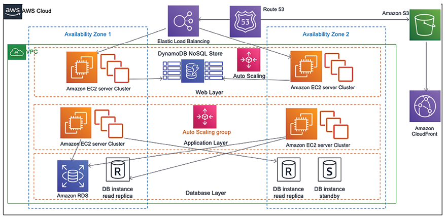
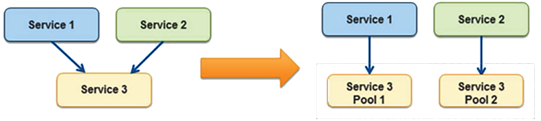
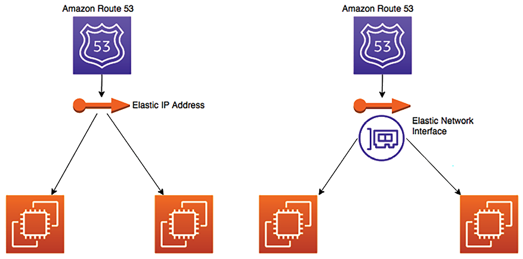
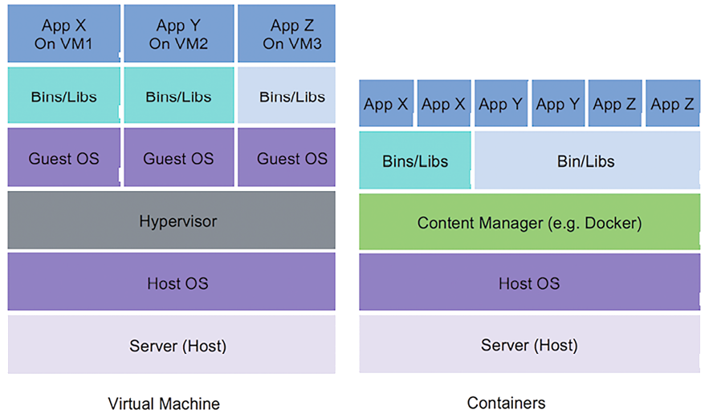
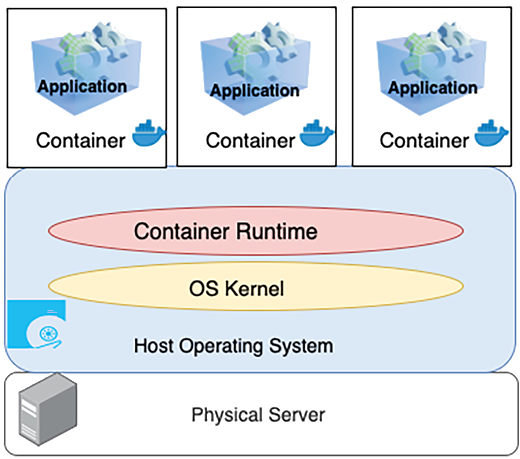
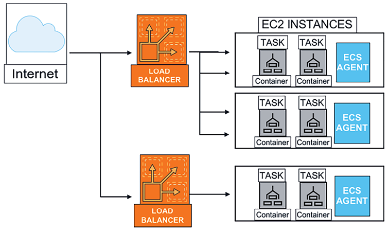
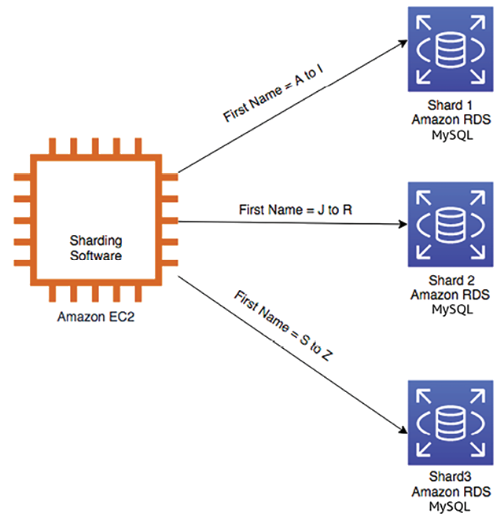

# الگوهای طراحی معماری راه حل

آیا تا به حال فکر کرده اید که چگونه شرکت های بزرگ سیستم های مقیاس پذیر را طراحی می کنند؟ قبل از شروع توسعه برنامه، راه حل ها
معماران در سراسر سازمان‌ها کار می‌کنند و گزینه‌های متعددی را برای توسعه طرح‌های معماری برای مدیریت کسب‌وکارشان بررسی می‌کنند
نیاز دارد.

راه های مختلفی برای طراحی یک راه حل وجود دارد. یک معمار راه حل نیاز به اتخاذ رویکرد صحیح بر اساس کاربر دارد
الزامات و محدودیت های معماری هزینه، عملکرد، مقیاس پذیری و در دسترس بودن. در این فصل، شما
در مورد الگوهای معماری راه حل های مختلف، معماری های مرجع و نحوه به کارگیری آنها در دنیای واقعی یاد خواهد گرفت
سناریوها

در فصل های قبل با اصول طراحی معماری راه حل آشنا شدید. این فصل هیجان انگیز است و
ضروری است زیرا می توانید یادگیری خود را در الگوهای مختلف طراحی معماری اعمال کنید. در این فصل، شما یک
درک برخی از الگوهای معماری راه حل های مهم، مانند لایه لایه، رویداد محور، میکروسرویس،
معماری‌های با اتصال آزاد، سرویس‌گرا و RESTful.

با مزایای طرح های مختلف معماری آشنا می شوید و به نمونه هایی نگاه می کنید که نشان می دهد چه زمانی باید از آنها استفاده کنید.
آنها را علاوه بر معماری زیر، درک درستی از ضدالگوهای طراحی معماری نیز به دست خواهید آورد
الگوهای طراحی:

- ساخت یک معماری لایه ای n
- ایجاد یک معماری مبتنی بر SaaS چند مستاجر
- آشنایی با معماری سرویس گرا
- معماری وب سرویس آرام
- ساخت معماری مبتنی بر حافظه پنهان
- معماری **Model-View-Controller** (**MVC**).
- ساختمان **طراحی مبتنی بر دامنه** (**DDD**)
- آشنایی با الگوی قطع کننده مدار
- اجرای الگوی بالک
- ایجاد یک الگوی IP شناور
- استقرار یک برنامه با یک کانتینر
- مدیریت پایگاه داده در معماری اپلیکیشن
- معماری پاک
- اجتناب از ضد الگوها در معماری راه حل

در پایان فصل، می‌دانید که چگونه طراحی معماری راه‌حل خود را بهینه کنید و بهترین شیوه‌ها را اعمال کنید.
این فصل را به نقطه مرکزی و هسته یادگیری خود تبدیل کنید.

# ساخت معماری لایه ای n

در معماری _n_\-tier (همچنین به عنوان **معماری چندگانه** شناخته می شود)، شما باید طراحی با جفت آزاد را اعمال کنید.
اصول و ویژگی های مقیاس پذیری و کشش. در معماری n-tier، شما عملکردهای محصول خود را به دو دسته تقسیم می کنید
چندین لایه، مانند ارائه، کسب و کار، پایگاه داده و خدمات، به طوری که هر لایه را می توان پیاده سازی کرد و
به طور مستقل مقیاس شده است.

با معماری n-tier، پذیرش فناوری های جدید و کارآمدتر کردن توسعه آسان است. این لایه بندی شده
معماری انعطاف‌پذیری را برای افزودن ویژگی‌های جدید در هر لایه بدون ایجاد اختلال در ویژگی‌های لایه‌های دیگر فراهم می‌کند.
از نظر امنیت، شما می توانید هر لایه را ایمن و جدا از لایه های دیگر نگه دارید، بنابراین اگر یک لایه به خطر بیفتد،
لایه های دیگر تحت تأثیر قرار نمی گیرند. عیب یابی و مدیریت برنامه نیز به سرعت قابل مدیریت می شود
مشخص کنید که مشکل از کجا می آید و کدام قسمت از برنامه باید عیب یابی شود.

رایج ترین معماری در طراحی چندلایه **معماری سه لایه** است، پس بیایید در مورد آن بیشتر بدانیم. را
نمودار زیر یک معماری نمونه AWS را نشان می دهد که به شما امکان می دهد با یک برنامه وب از مرورگر تعامل داشته باشید
و عملکردهای مورد نیاز را انجام دهید، به عنوان مثال، سفارش تی شرت مورد علاقه خود یا خواندن یک وبلاگ و گذاشتن نظر:

شکل 4.1: معماری وب سایت سه لایه

در معماری قبلی، شما سه لایه زیر را دارید:

- **لایه وب**: لایه وب بخشی از برنامه است که رو به روی کاربر است. کاربران نهایی با لایه وب تعامل دارند
  جمع آوری یا ارائه اطلاعات
- **لایه برنامه**: لایه برنامه عمدتاً حاوی منطق تجاری است و بر اساس اطلاعات دریافتی از آن عمل می کند
  لایه وب
- **لایه پایگاه داده**: انواع داده های کاربر و داده های برنامه در لایه پایگاه داده ذخیره می شود.

بیایید با جزئیات بیشتری به این لایه ها نگاه کنیم.

## لایه وب

لایه وب به عنوان **سطح ارائه** نیز شناخته می شود. لایه وب یک رابط کاربری فراهم می کند که به پایان کمک می کند
کاربر برای تعامل با برنامه لایه وب رابط کاربری شما (در این مورد، صفحه وب سایت) است که در آن
کاربر اطلاعات را وارد می کند یا آن را مرور می کند. توسعه دهندگان وب ممکن است یک رابط کاربری سطح ارائه در فناوری هایی از این قبیل بسازند
به عنوان HTML، CSS، Angular، React، **صفحات جاواسرور** (**JSP**)، و **صفحات سرور فعال** (**ASP**). این ردیف جمع می شود
اطلاعات را از کاربر دریافت کرده و به لایه برنامه ارسال می کند.

لایه وب رو به کاربر است، بنابراین سازمان ها بیشتر وقت خود را صرف بهبود تجربه کاربری می کنند. زیاد
سازمان‌ها تیم‌های **تجربه کاربر** (**UX**) را در حال تحقیق در زمینه‌های مختلف برای درک چگونگی کاربران
تعامل با برنامه ها

همچنین، معمار راه حل ها باید مطمئن شود که طراحی معماری شامل ورودی UX و عملکرد بارگذاری صفحه است. آنجا
باید یک اطلاعات بدون درز fپایین بین لایه های وب و برنامه برای بازگرداندن اطلاعات صحیح به کاربران
در بازه زمانی مورد انتظار، مانند ورود کاربر، بارگذاری نمایه و غیره.

بیایید به لایه برنامه نگاه کنیم.

## لایه برنامه

لایه برنامه همچنین به عنوان **لایه منطقی** شناخته می شود، زیرا این هسته محصول است که در آن همه مشاغل
منطق ساکن است لایه ارائه اطلاعات را از کاربر جمع آوری می کند و برای پردازش به لایه منطقی ارسال می کند
و نتیجه بگیر به عنوان مثال، در یک وب سایت تجارت الکترونیک مانند آمازون، کاربران می توانند محدوده تاریخ را در وب سایت وارد کنند
صفحه سفارش برای یافتن خلاصه سفارش آنها. در عوض، لایه وب اطلاعات محدوده داده را به برنامه ارسال می کند
لایه. لایه برنامه ورودی کاربر را پردازش می کند تا منطق تجاری را انجام دهد، مانند تعداد سفارشات، مجموع
مقدار و تعداد اقلام خریداری شده این اطلاعات را به لایه وب برمی گرداند تا برای کاربر ارائه شود.

به طور کلی، در یک معماری سه لایه، همه الگوریتم ها و منطق پیچیده در لایه برنامه زندگی می کنند، از جمله
ایجاد یک موتور توصیه یا نمایش صفحات شخصی شده به کاربر طبق تاریخچه مرور وی. می توانید اضافه کنید
لایه هایی مانند لایه دامنه، لایه دسترسی به داده یا لایه ارائه برای ایجاد یک معماری چهار یا پنج لایه.
توسعه دهندگان ممکن است انتخاب کنند که این لایه را در یک زبان برنامه نویسی سمت سرور، به عنوان مثال، C++، Java، .NET یا
Node.js. لایه کاربردی مرکز طراحی سیستم است و به بیشترین تلاش طراحی نیاز دارد. بیشتر
ویژگی های برنامه به منطق ساخته شده در لایه برنامه بستگی دارد. لایه برنامه منطقی را روی داده ها انجام می دهد
در لایه پایگاه داده ذخیره می شود. بیایید به لایه پایگاه داده با جزئیات بیشتری نگاه کنیم.

## لایه پایگاه داده

لایه پایگاه داده که به عنوان **سطح داده** نیز شناخته می شود، تمام اطلاعات مربوط به پروفایل های کاربر و
معاملات اساساً، حاوی هر داده ای است که باید در ردیف داده ذخیره شود. این اطلاعات
برای پردازش منطقی به لایه برنامه بازگردانده می شود و در نهایت برای کاربر در وب رندر می شود.
لایه. به عنوان مثال، فرض کنید کاربر با شناسه و رمز عبور خود وارد یک وب سایت شده است. در آن صورت، برنامه
لایه اعتبار کاربر را با اطلاعات ذخیره شده در پایگاه داده تایید می کند. اگر اعتبارنامه با ذخیره شده مطابقت داشته باشد
اطلاعات، کاربر مجاز است وارد سایت شده و به قسمت مجاز وب سایت دسترسی داشته باشد.

معمار ممکن است انتخاب کند که یک ردیف داده در پایگاه داده های رابطه ای بسازد، به عنوان مثال، PostgreSQL، MariaDB، Oracle.
پایگاه داده، MySQL، Microsoft SQL Server، Amazon Aurora یا Amazon RDS. معمار ممکن است یک پایگاه داده NoSQL مانند
Amazon DynamoDB، MongoDB یا Apache Cassandra.

لایه داده برای ذخیره اطلاعات تراکنش و نگهداری اطلاعات جلسه کاربر و پیکربندی برنامه استفاده می شود.
یک معمار ممکن است برای رفع نیازهای عملکرد، پایگاه داده‌های ذخیره‌سازی مانند Memcached و Redis را اضافه کند. یاد خواهید گرفت
اطلاعات بیشتر در مورد پایگاه داده های مختلف در _فصل 12_، _مهندسی داده برای معماری راه حل_.

لایه داده از نظر امنیت نیاز به توجه ویژه دارد. شما باید با اعمال داده ها از اطلاعات کاربر محافظت کنید
رمزگذاری در حالت استراحت و در حال انتقال در نمودار معماری لایه لایه _n_\- متوجه خواهید شد که هر لایه دارای
پیکربندی مقیاس‌بندی خودکار خودش، به این معنی که می‌توان آن را به طور مستقل مقیاس‌بندی کرد. همچنین، هر لایه دارای یک مرز شبکه است،
یعنی دسترسی به یک لایه اجازه دسترسی به لایه های دیگر را نمی دهد. در مورد امنیت بیشتر خواهید آموخت
ملاحظات در _فصل 7_، _ملاحظات امنیتی_.

معمار باید بر اساس پیچیدگی برنامه و نیازهای کاربر در مورد تعداد لایه ها تصمیم بگیرد. مثلا،
می‌توانید لایه‌های اضافی مانند یک لایه دسترسی به داده برای منطق دسترسی به پایگاه داده اضافه کنید و لایه ذخیره‌سازی داده را حفظ کنید
برای موتور پایگاه داده می توانید با تعریف جداسازی منطقی، لایه های بیشتری برای کاهش پیچیدگی اضافه کنید که می تواند کمک کند
افزایش قابلیت نگهداری عمومی برنامه و توانایی مقیاس و دستیابی به عملکرد.

# ایجاد یک معماری مبتنی بر SaaS چند مستاجر

در بخش قبل، با معماری چند لایه آشنا شدید که به آن **اجاره واحد** نیز گفته می شود، زمانی که برای
سازمان واحد با استقبال سازمان‌ها از انقلاب دیجیتال، معماری چند مستاجر محبوب‌تر می‌شود
در حالی که برنامه کلی و هزینه عملیاتی پایین نگه داشته می شود.

مدل **نرم افزار به عنوان سرویس** (**SaaS**) بر اساس یک معماری چند مستاجر ساخته شده است، که در آن نمونه ای از
نرم افزار و زیرساخت های همراه آن به مشتریان متعددی پاسخ می دهد. در این چارچوب، هر مشتری از
برنامه و پایگاه داده به صورت مشترک هر مستاجر با پیکربندی منحصر به فرد خود جدا می شود،
هویت، و داده ها، در حالی که یک محصول را به اشتراک می گذارند، برای یکدیگر نامرئی می مانند.

از آنجایی که ارائه دهندگان SaaS چند مستاجر مسئولیت همه چیز از سخت افزار گرفته تا نرم افزار، محصولات مبتنی بر SaaS را بر عهده دارند.
تخلیه مسئولیت های سازمان در قبال نگهداری و به روز رسانی برنامه، الف

ارائه دهنده SaaS مراقبت می کند
از این.

هر سازمانی که خریدار محصول SaaS است را مستاجر می داند. این مستاجران می توانند رابط کاربری خود را سفارشی کنند
با استفاده از پیکربندی بدون تغییر کد. از آنجایی که چندین مشتری زیرساخت مشترکی را به اشتراک می گذارند، از آن سود می برند
مقیاس، که هزینه را بیشتر کاهش می دهد. برخی از محبوب ترین ارائه دهندگان SaaS عبارتند از Salesforce CRM، Jira Software، Slack،
Google Workspace و Amazon Connect.

همانطور که در نمودار معماری زیر نشان داده شده است، دو سازمان (مستاجر) از یک نرم افزار و زیرساخت استفاده می کنند.
فروشنده SaaS با تخصیص شناسه مستاجر منحصر به فرد به هر سازمان، دسترسی به لایه برنامه را فراهم می کند:

شکل 4.2: معماری SaaS چند مستاجر

طراحی معماری قبلی نشان می دهد که لایه ارائه یک رابط کاربری و لایه برنامه را فراهم می کند
منطق کسب و کار را حفظ می کند. در لایه دسترسی به داده، هر مستاجر ایزوله در سطح داده با یکی از موارد زیر خواهد بود
مواد و روش ها:

- **Database-Level Isolation**: در این مدل، هر مستاجر پایگاه داده خود را با شناسه مستاجر خود مرتبط می کند. زمانی که هر کدام
  مستاجر داده ها را از رابط کاربری جستجو می کند، آنها به پایگاه داده خود هدایت می شوند. این مدل در صورتی مورد نیاز است که
  مشتری به دلایل انطباق و امنیتی یک پایگاه داده مشترک نمی خواهد.
- **Table-Level Isolation**: این سطح ایزوله را می توان با تهیه جدول جداگانه برای هر مستأجر به دست آورد. در این
  در مدل، جداول باید به طور منحصر به فرد به هر مستأجر اختصاص داده شود، به عنوان مثال، با پیشوند شناسه مستاجر. زمانی که هر مستاجر
  داده‌ها را از رابط کاربری جستجو می‌کند، آنها مطابق با شناسه منحصر به فرد خود به جداول خود هدایت می‌شوند.
- ** جداسازی در سطح ردیف**: همه مستاجرین در این سطح جداسازی جدول یکسانی را در یک پایگاه داده به اشتراک می گذارند. یک ... وجود دارد
  ستون اضافی در یک جدول که در آن یک شناسه مستاجر منحصر به فرد در مقابل هر ردیف ذخیره می شود. زمانی که یک مستاجر فردی بخواهد
  به داده های آنها از رابط کاربری دسترسی داشته باشند، لایه دسترسی به داده های برنامه یک پرس و جو را بر اساس شناسه مستاجر فرموله می کند
  به میز مشترک هر مستاجر ردیفی دریافت می کند که فقط به کاربرانش تعلق دارد.

برای مشتریان سازمانی، یک ارزیابی دقیق باید انجام شود تا بفهمد آیا راه حل SaaS برای آنها مناسب است یا خیر
بر اساس نیازهای ویژگی های منحصر به فرد آنها. این به این دلیل است که اغلب، یک مدل SaaS سفارشی سازی محدودی دارد
توانایی ها.

انتخاب رویکردهای جداسازی بر اساس ملاحظات پیرامون انطباق سازمان، امنیت، هزینه،
و الزامات قراردادی مستاجر

اگر کاربران زیادی نیاز به اشتراک داشته باشند، یافتن پیشنهاد ارزش هزینه بسیار مهم است. مقایسه هزینه باید باشد
بر اساس هزینه کل مالکیت هنگام تصمیم گیری _build در مقابل خرید_ محاسبه می شود. این به این دلیل است که ساختمان
نرم افزار کسب و کار اصلی اکثر سازمان ها نیست، بنابراین مدل SaaS بسیار محبوب شده است
سازمان‌ها می‌توانند روی کسب‌وکار خود تمرکز کنند و به متخصصان اجازه دهند بخش فناوری اطلاعات آن را مدیریت کنند.

**معماری سرویس گرا** (**SOA**) یک رویکرد محبوب برای طراحی و ساخت برنامه های کاربردی است، به ویژه
زمانی که سازمان ها دارای الزامات منحصر به فرد و سفارشی هستند. بیایید در مورد آن بیشتر بدانیم.

# درک معماری سرویس گرا

در الگوهای **SOA**، اجزای مختلف برنامه با استفاده از یک پروتکل ارتباطی از طریق شبکه تعامل دارند. هر یک
این سرویس قابلیت های سرتاسری را ارائه می دهد، به عنوان مثال، واکشی تاریخچه سفارش. SOA به طور گسترده توسط بزرگان پذیرفته شده است
سیستم هایی برای ادغام فرآیندهای تجاری، به عنوان مثال، گرفتن سرویس پرداخت خود از برنامه اصلی و قرار دادن
آن را به عنوان یک راه حل جداگانه.

در یک مفهوم کلی، SOAها برنامه‌های کاربردی یکپارچه را می‌گیرند و برخی از آن عملیات را در سرویس‌های منفرد گسترش می‌دهند.
که مستقل عمل می کنند. هدف از استفاده از SOA کاهش اتصال سرویس های برنامه شما است.
گاهی اوقات، یک SOA شامل تقسیم خدمات جدا از یکدیگر و تقسیم منابع به نمونه های جداگانه است
آن سرویس به عنوان مثال، در حالی که برخی تصمیم می گیرند داده های شرکت خود را در یک پایگاه داده منفرد که بر اساس جداول تقسیم شده است ذخیره کنند، یک SOA
ماژولار کردن برنامه توسط تابع در پایگاه داده های مجزا به طور کلی در نظر گرفته می شود. این به شما امکان می دهد مقیاس و
مدیریت توان عملیاتی بر اساس نیازهای جداگانه جداول برای هر پایگاه داده.

SOA مزایای متعددی دارد، به عنوان مثال، موازی سازی توسعه، استقرار و عملیات. آن را جدا می کند
خدمات به طوری که شما می توانید بهینه سازی و مقیاس هر سرویس به صورت جداگانه.

با این حال، برای اطمینان از اینکه کار انجام شده توسط تیم هر سرویس یکسان است، نیاز به حاکمیت قوی تری دارد
استاندارد با SOA، راه حل می تواند به اندازه ای پیچیده شود که سربار را برای متعادل کردن آن افزایش دهد، بنابراین شما نیاز دارید
ابزارها را انتخاب کنید و اتوماسیون را برای نظارت، استقرار و مقیاس بندی خدمات پیاده سازی کنید.

راه های مختلفی برای پیاده سازی SOA وجود دارد.

**پروتکل دسترسی به اشیاء ساده** (**SOAP**) در ابتدا محبوب ترین پروتکل پیام رسانی بود، اما به عنوان سنگین وزن است.
برای تبادل داده کاملاً به XML متکی است. معمار **انتقال دولتی نمایندگی** (**REST**).

تور در حال تبدیل شدن است
محبوبیت بیشتری دارد زیرا توسعه دهندگان نیاز به ساخت اپلیکیشن های موبایل و وب سبک وزن بیشتری دارند. تا زمان نگارش، SOAP
معماری به عنوان معماری میراثی در نظر گرفته می شود، بنابراین در این نسخه از کتاب، بر یادگیری REST تمرکز خواهیم کرد
معماری.

## معماری خدمات وب آرامش بخش

سرویس وب **REST** یا RESTful به دلیل معماری سبک وزن عملکرد بهتری را ارائه می دهد. متفاوت اجازه می دهد
فرمت های پیام، مانند JSON، متن ساده، HTML و XML، در مقایسه با SOAP، که فقط XML را مجاز می کند. REST یک است
سبک معماری که استانداردی را برای طراحی برنامه های کاربردی با اتصال آزاد با استفاده از پروتکل HTTP برای داده ها تعریف می کند
انتقال.

**نمادگذاری شی جاوا اسکریپت** (**JSON**) فرمت قابل دسترس تری برای تبادل داده در معماری REST است. JSON است
همچنین سبک وزن و مستقل از زبان. این شامل یک جفت کلید-مقدار ساده است که آن را با داده ها سازگار می کند
ساختارهایی که در اکثر زبان های برنامه نویسی تعریف شده اند.

وب سرویس‌های RESTful که با نام خدمات وب REST نیز شناخته می‌شوند، چارچوبی با قوانین خاص برای طراحی وب سرویس‌ها ایجاد می‌کنند.
هدف آنها حصول اطمینان از سازگاری بین سیستم های کامپیوتری مختلف متصل از طریق اینترنت است. با RESTful
سرویس‌های وب، سیستم‌ها می‌توانند با دسترسی و اصلاح داده‌های مبتنی بر متن در وب با استفاده از یک سازگار و سازگار با یکدیگر ارتباط برقرار کنند.
مجموعه ای از عملیات از پیش تعریف شده که به تعاملات یا حالات گذشته متکی نیستند. در اینجا برخی از اصول اساسی وجود دارد
معماری وب سرویس RESTful، همراه با تصویری از اصول معماری وب سرویس RESTful با استفاده از
مثال یک وب سایت تجارت الکترونیک:

- **Stateless**: هر درخواست مشتری به سرور باید شامل تمام اطلاعات مورد نیاز سرور باشد
  درک و پردازش کنید. هر درخواستی که توسط مشتری ارائه می شود شامل تمام اطلاعات لازم برای انجام آن درخواست است،
  و نیازی به نگهداری اطلاعات مربوط به جلسه در سرور نیست. در عوض، به طور کامل بر روی مدیریت می شود
  سمت مشتری با در نظر گرفتن مثال از یک وب سایت تجارت الکترونیک، هر درخواست مشتری، مانند مشاهده یک محصول یا افزودن آن
  آن را به سبد خرید، باید شامل تمام اطلاعات مورد نیاز برای پردازش باشد. اگر کاربر بخواهد سبد خرید خود را مشاهده کند، درخواست می کند
  باید شامل شناسه کاربر یا هر جزییات مرتبط دیگری باشد تا سرور بتواند شناسایی کند و با موارد مناسب پاسخ دهد
  جزئیات کارت.
- **معماری مشتری-سرور**: در این طرح دو قسمت متمایز مشتری و سرور وجود دارد که
  از طریق شبکه با یکدیگر ارتباط برقرار کنند. مشتری مسئول مدیریت رابط کاربری و تعامل است
  با کاربر، و سرور مسئول پشتیبان و پردازش داده ها است. آنها می توانند به طور جداگانه بدون
  بر یکدیگر تأثیر می گذارند. مشتری (مرورگر یا برنامه) تعامل کاربر را مانند انتخاب محصولات در حالی که سرور مدیریت می کند
  بازیابی داده ها، مدیریت سبد خرید و پردازش پرداخت را انجام می دهد. آنها از طریق درخواست ها و پاسخ های HTTP تعامل دارند.
- **رابط یکنواخت**: REST از یک رابط یکنواخت استفاده می کند و معماری را ساده و جدا می کند. برای API های RESTful،
  تعاملات از طریق مجموعه ای از روش های استاندارد HTTP که با **CRUD** مطابقت دارند تسهیل می شود (**ایجاد، خواندن، به روز رسانی،
  حذف **) عملیات. این روش ها عبارتند از:

- **GET**: این روش برای بازیابی اطلاعات از سرور استفاده می شود. به عنوان مثال، زمانی که کاربر می خواهد لیستی از
  محصولات موجود در example.com، مرورگر آنها یک درخواست GET را به سرور ارسال می کند. URL ممکن است به نظر برسد
  «https://example.com/api/products»، و سرور با فهرستی از محصولات در قالبی ساختاریافته مانند JSON پاسخ می‌دهد.
  یا XML.
- **POST**: از این روش برای ایجاد یک منبع جدید در سرور استفاده می شود. فرض کنید کاربری می خواهد محصول جدیدی را به آن اضافه کند
  سبد خرید آنها در `example.com`. آنها ممکن است فرمی را با جزئیات محصول پر کنند و روی **افزودن به سبد خرید** کلیک کنند.
  این اقدام یک درخواست POST را به «https://example.com/api/cart»، از جمله جزئیات محصول در درخواست، راه‌اندازی می‌کند.
  بدن سپس سرور این داده ها را پردازش می کند و محصول جدید را به سبد خرید کاربر اضافه می کند.
- **PUT**: این روش برای به روز رسانی یک منبع موجود در سرور استفاده می شود. اگر کاربر بخواهد مقدار آن را به روز کند
  یک محصول در سبد خرید آنها، یک درخواست PUT به یک URL خاص مانند «https://example.com/api/cart/{productId}» ارسال می‌شود.
  بدنه درخواست شامل مقدار به روز شده می شود و سرور مورد مربوطه را در کاربر به روز می کند
  سبد خرید
- **DELETE**: این روش برای حذف یک منبع از سرور استفاده می شود. به عنوان مثال، اگر کاربر تصمیم به حذف a
  محصول از سبد خرید خود، مرورگر آنها یک درخواست DELETE را به یک URL مانند ارسال می کند
  «https://example.com/api/cart/{productId}». سپس سرور محصول مشخص شده را از سبد خرید حذف می کند.

با پایبندی به این روش‌های استاندارد، APIها روشی ثابت برای توسعه‌دهندگان برای تعامل با سرویس‌های وب فراهم می‌کنند.
آنها را قادر می سازد تا عملیات اساسی را بر روی منابع بدون نیاز به درک پیاده سازی اساسی انجام دهند
جزئیات.

- **بر اساس منبع**: در REST همه چیز یک منبع در نظر گرفته می شود و یک URL خاص می تواند

دسترسی به هر منبع
منابع انتزاعات کلیدی در REST هستند و یک منبع می تواند یک شی واحد یا مجموعه ای از اشیاء را نشان دهد.
منابعی مانند محصولات، کاربران، سفارش‌ها و اقلام سبد خرید همگی با URL شناسایی می‌شوند. به عنوان مثال، یک محصول خاص می تواند
در «www.amazon.com/products/{product_id}» قابل دسترسی است.

- **نمایش منابع**: منابع می توانند نمایش های متفاوتی داشته باشند، مانند JSON، XML، HTML و غیره.
  تعامل با منابع از طریق به دست آوردن بازنمایی از آنها و دستکاری این بازنمایی ها. وقتی مشتری نگه می دارد
  یک نمایش از یک منبع، اطلاعات کافی برای تغییر منبع در سرور را دارد. همین محصول
  منبع ممکن است برای یک مرورگر وب متفاوت از یک برنامه تلفن همراه ارائه شود.
- **سیستم لایه ای**: معماری اجازه می دهد تا یک لایه میانی (مانند یک متعادل کننده بار یا یک لایه کش) وجود داشته باشد.
  بدون تأثیر بر نحوه تعامل مشتری با سرور معرفی شد. هر لایه می تواند مجموعه خاصی از
  قابلیت ها، بهبود مقیاس پذیری و قابلیت نگهداری سیستم. یک وب سایت تجارت الکترونیکی می تواند موارد مختلفی داشته باشد
  لایه‌ها، مانند متعادل‌کننده‌های بار، لایه‌های حافظه پنهان یا لایه‌های احراز هویت. مشتری نیازی به دانستن این موارد ندارد
  لایه های. درخواست برای مشاهده یک محصول ممکن است از یک لایه کش عبور کند تا زمان پاسخگویی را بدون نیاز به مشتری بهبود بخشد
  اطلاع.
- **کد بر حسب تقاضا**: سرورها می توانند کدهای اجرایی را در اختیار مشتری قرار دهند تا در زمینه مشتری اجرا شود. این
  اجازه می دهد تا بخشی از منطق برنامه به مشتری منتقل شود. یک وب سایت تجارت الکترونیک می تواند کد جاوا اسکریپت را ارسال کند
  به مرورگر مشتری برای اجرای عملکردهای خاصی مانند اعتبار سنجی سمت مشتری یا افزایش تعامل در داخل
  تجربه مرور کاربر

سبک معماری RESTful از روش های استاندارد HTTP استفاده می کند و با رعایت این اصول، خدمات وب RESTful
سعی کنید ساده، مقیاس پذیر و قابل نگهداری باشد. بسیاری از APIهای وب مدرن با پیروی از اصول RESTful و با استفاده از توسعه داده شده اند
قراردادهای استاندارد برای انجام عملیات CRUD بر روی منابع. بیایید در مورد معماری مرجع بر اساس آن بیاموزیم
معماری آرامش بخش

## ساخت یک وب سایت تجارت الکترونیک مبتنی بر معماری RESTful

یک وب سایت تجارت الکترونیک مانند [www.amazon.com] (http://www.amazon.com) دارای کاربرانی در سراسر جهان و کاتالوگ وسیعی با
میلیون ها محصول هر محصول دارای چندین تصویر، نقد و ویدیو است. نگهداری چنین کاتالوگ گسترده ای برای الف
پایگاه کاربر جهانی یک کار بسیار چالش برانگیز است.

این معماری مرجع در AWS از اصول RESTful پیروی می کند. خدمات تا حد امکان مستقل عمل می کنند
از یکدیگر:

شکل 4.3: معماری RESTful برای یک وب سایت تجارت الکترونیک

همانطور که در نمودار معماری قبلی نشان داده شده است، می توانیم به موارد زیر توجه کنیم:

- هنگامی که کاربر آدرس وب سایتی را در مرورگر تایپ می کند، درخواست کاربر برای بارگیری به سرور DNS می رسد
  سایت اینترنتی. درخواست های DNS برای وب سایت توسط Amazon Route 53 به سروری که برنامه های وب در آن قرار دارند هدایت می شوند
  میزبانی شدن
- پایگاه کاربر جهانی است و کاربران به جستجوی محصولات برای خرید ادامه می دهند زیرا وب سایت دارای یک محصول گسترده است
  کاتالوگ با تصاویر و فیلم های ثابت یک شبکه توزیع محتوا مانند Amazon CloudFront استاتیک را در حافظه پنهان ذخیره می کند و ارائه می دهد
  دارایی به کاربران
- محتویات کاتالوگ، مانند تصاویر و ویدئوهای محصول ثابت، و سایر داده های برنامه، مانند فایل های گزارش، هستند.
  ذخیره شده در آمازون S3.
- کاربران وب سایت را از چندین دستگاه مرور می کنند. به عنوان مثال، آنها مواردی را از تلفن همراه خود به سبد خرید اضافه می کنند و
  سپس پرداخت را روی دسکتاپ انجام دهید. برای مدیریت جلسات کاربر به یک فروشگاه نشست دائمی مانند DynamoDB نیاز است.
  DynamoDB یک پایگاه داده NoSQL است که در آن نیازی به ارائه یک طرح ثابت ندارید، بنابراین یک گزینه ذخیره سازی عالی برای محصول است.
  کاتالوگ ها و ویژگی ها.\* Amazon ElastiCache به عنوان یک لایه ذخیره برای محصول برای کاهش خواندن و نوشتن استفاده می شود.
  عملیات روی پایگاه داده برای ارائه عملکرد بالا و کاهش تاخیر.
- یک ویژگی جستجوی راحت برای فروش محصول و موفقیت تجاری حیاتی است. Amazon CloudSearch به ساخت کمک می کند
  قابلیت جستجوی مقیاس پذیر با بارگیری کاتالوگ محصول از DynamoDB. شما همچنین می توانید از Amazon Kendra برای یک استفاده کنید
  موتور جستجوی مبتنی بر هوش مصنوعی.
- یک توصیه می تواند کاربران را به خرید محصولات اضافی بر اساس تاریخچه مرور و خریدهای گذشته ترغیب کند. آ
  سرویس توصیه جداگانه می تواند داده های گزارش ذخیره شده در Amazon S3 را مصرف کند و محصول بالقوه را ارائه دهد
  توصیه هایی به کاربر
- اپلیکیشن تجارت الکترونیک همچنین می تواند دارای لایه ها و اجزای متعددی باشد که مستلزم استقرار مکرر هستند. AWS Elastic
  Beanstalk تامین خودکار زیرساخت را مدیریت می کند، برنامه را مستقر می کند، بار را با اعمال اعمال می کند
  مقیاس خودکار، و برنامه را نظارت می کند.

در این بخش با معماری RESTful آشنا شدید. بیایید در مورد جنبه بحرانی مبتنی بر حافظه پنهان بیشتر بیاموزیم
طراحی معماری.

# ساخت معماری مبتنی بر حافظه پنهان

ذخیره سازی شامل ذخیره موقت است

داده ها یا فایل ها را در یک مکان میانی که بین درخواست کننده و درخواست کننده قرار دارد
ذخیره سازی دائمی این عمل با هدف افزایش سرعت درخواست های آینده و به حداقل رساندن استفاده از پهنای باند شبکه است. ذخیره سازی
سرعت برنامه را افزایش می دهد و هزینه را کاهش می دهد. به شما امکان می دهد از داده های بازیابی شده قبلی استفاده مجدد کنید. برای افزایش کاربرد
عملکرد، کش را می توان در لایه های مختلف معماری اعمال کرد، مانند لایه وب، لایه برنامه،
لایه داده و لایه شبکه.

معمولاً از **حافظه دسترسی تصادفی** (**RAM**) و موتورهای کش درون حافظه سرور برای پشتیبانی استفاده می شود.
حافظه پنهان برنامه با این حال، اگر حافظه نهان به یک سرور محلی متصل شود، در صورت وجود یک حافظه کش، داده ها باقی نمی ماند.
خرابی سرور اکثر برنامه ها در یک محیط توزیع شده هستند، بنابراین بهتر است یک لایه کش اختصاصی داشته باشید
باید مستقل از چرخه عمر برنامه باشد. اگر مقیاس افقی را برای برنامه خود اعمال کنید، همه سرورها
برای دستیابی به بهترین عملکرد باید به لایه ذخیره سازی متمرکز دسترسی داشته باشد.

نمودار زیر مکانیسم ذخیره سازی در لایه های مختلف معماری راه حل را نشان می دهد:

شکل 4.4: ذخیره سازی در لایه های معماری

همانطور که در نمودار قبل نشان داده شده است، مکانیسم های ذخیره سازی در هر لایه از معماری به شرح زیر است:

- **Client-side caching**: caching سمت کلاینت برای دستگاه های کاربر مانند موبایل و دسکتاپ اعمال می شود. سمت مشتری
  cache کردن محتوای وب قبلاً بازدید شده را برای پاسخ سریعتر به درخواست بعدی ذخیره می کند. هر مرورگر خود را دارد
  مکانیسم کش کش HTTP با ذخیره محتوا در مرورگر محلی، برنامه را سریعتر می کند. کنترل کش
  هدر HTTP سیاست های کش مرورگر را برای درخواست های مشتری و پاسخ های سرور تعریف می کند. این سیاست ها تعیین می کنند که کجا
  محتوا باید ذخیره شود و چه مدت باقی می ماند، که به عنوان **زمان زندگی** (**TTL**) شناخته می شود. کوکی ها چیز دیگری است
  روشی که برای ذخیره اطلاعات در دستگاه مشتری استفاده می شود تا سریعتر به مرورگر پاسخ دهد.
- **کش DNS اینترنت**: وقتی کاربر آدرس وب سایت را از طریق اینترنت تایپ می کند، **سیستم نام دامنه عمومی**
  سرور (**DNS**) آدرس IP را جستجو می کند. ذخیره این اطلاعات رزولوشن DNS زمان بارگذاری وب سایت را کاهش می دهد.
  اطلاعات DNS را می توان پس از اولین درخواست و هر درخواست دیگری برای آن در یک سرور یا مرورگر محلی ذخیره کرد
  وب سایت سریعتر خواهد بود
- ** ذخیره محتوای وب **: بیشتر درخواست ها شامل بازیابی محتوای وب مانند تصاویر، فیلم ها و صفحات HTML است.
  ذخیره این دارایی ها در نزدیکی مکان کاربر می تواند پاسخ بسیار سریع تری را برای بارگذاری صفحه ارائه دهد. این نیز حذف می کند
  خواندن دیسک و زمان بارگذاری سرور **شبکه توزیع محتوا** (**CDN**) شبکه ای از مکان های لبه را فراهم می کند
  محتوای ایستا، مانند تصاویر و ویدیوهای با وضوح بالا را می توان در کش ذخیره کرد. برای خواندن برنامه های سنگین مفید است
  مانند بازی ها، وبلاگ ها، صفحات کاتالوگ محصولات تجارت الکترونیک و موارد دیگر. جلسه کاربر حاوی اطلاعات زیادی است
  در مورد اولویت کاربر و وضعیت آنها. با ذخیره کردن جلسه کاربر در خود، تجربه کاربری عالی را فراهم می کند
  ذخیره کلید ارزش برای پاسخ سریع کاربر.
- **ذخیره سازی برنامه**: در لایه برنامه، حافظه پنهان را می توان برای ذخیره نتیجه یک تکرار پیچیده اعمال کرد.
  درخواست برای جلوگیری از محاسبات منطق تجاری و بازدید از پایگاه داده. به طور کلی، عملکرد برنامه را بهبود می بخشد و کاهش می دهد
  بار روی پایگاه داده و زیرساخت
- **کش کردن پایگاه داده**: عملکرد برنامه به شدت به سرعت و توان عملیاتی ارائه شده توسط پایگاه داده بستگی دارد.
  کش پایگاه داده، توان عملیاتی پایگاه داده را به میزان قابل توجهی افزایش می دهد و تأخیر بازیابی داده ها را کاهش می دهد. کش پایگاه داده می تواند باشد
  در مقابل هر پایگاه داده رابطه ای یا غیر رابطه ای اعمال می شود. برخی از ارائه دهندگان پایگاه داده، کش را ادغام می کنند، در حالی که
  برنامه های کاربردی حافظه نهان محلی را مدیریت می کنند.

**Redis** و **Memcached** محبوب ترین موتورهای کش هستند. در حالی که Memcached سریعتر است (برای
داده های با ساختار پایین و ذخیره داده ها در قالب مقدار کلیدی)، Redis یک موتور ذخیره سازی پایدارتر است و قادر است
مدیریت ساختارهای داده پیچیده مورد نیاز برای یک برنامه کاربردی مانند تابلوی امتیازات بازی. جزئیات بیشتری را یاد خواهید گرفت
در بخش _Memcached vsus Redis_ در این فصل. بیایید با چند الگوی طراحی حافظه پنهان بیشتر آشنا شویم.

## الگوی توزیع کش در یک معماری وب سه لایه

معماری میزبانی وب معمولی از یک مدل برنامه کاربردی وب سه لایه رایج پیروی می کند که معماری را تقسیم می کند
به لایه های ارائه، کاربرد، و ماندگاری.

همانطور که در نمودار معماری AWS زیر نشان داده شده است، کش در لایه های وب، برنامه و پایگاه داده اعمال می شود:

شکل 4.5: معماری الگوی توزیع کش

در الگوهای کش، هدف شما این است که سعی کنید تا حد امکان کمتر به backend ضربه بزنید. شما می توانید برنامه ای بنویسید که در آن
شما می توانید تصاویر، جاوا اسکریپت یا حتی صفحات کامل را ذخیره کنید تا تجربه بهتری را برای کاربران خود فراهم کنید. در نمودار
ab

علاوه بر این، کش به صورت استراتژیک در لایه های مختلف معماری پیاده سازی می شود:

- Amazon Route 53 در کش کردن نگاشت های DNS-to-IP نقش دارد و مدیریت دامنه را ساده می کند.
- آمازون S3 به عنوان محل ذخیره سازی محتوای ثابت، از جمله تصاویر و ویدیوهای با وضوح بالا عمل می کند.
- Amazon CloudFront با استفاده از هدرهای کنترل حافظه پنهان برای تعیین به روز رسانی، حافظه پنهان لبه را برای محتوای پر ترافیک ارائه می دهد.
  فرکانس از مبدا
- آمازون DynamoDB برای فروشگاه های جلسه استفاده می شود و به برنامه های کاربردی وب کمک می کند تا جلسات کاربر را از طریق کش مدیریت کنند.
- Elastic Load Balancing ترافیک را بین گروه های مقیاس خودکار وب سرور توزیع می کند.
- Amazon ElastiCache خدمات ذخیره سازی را برای برنامه ارائه می دهد و به طور موثر بار روی ردیف پایگاه داده را کاهش می دهد.

به طور معمول، محتوای ثابت در حافظه پنهان ذخیره می شود، اما سناریوهایی وجود دارد که در آن ذخیره محتوای پویا یا منحصر به فرد می تواند بهبود یابد.
عملکرد برنامه تصمیم به الگوهای استفاده و تقاضاهای خاص بستگی دارد.

بیایید یک الگوی خاص تر را بررسی کنیم.

## تغییر نام الگوی توزیع

هنگام استفاده از **CDN** مانند Amazon CloudFront، داده‌های پرکاربرد را در یک مکان لبه نزدیک کاربر ذخیره می‌کنید.
عملکرد سریع اغلب، شما TTL را در CDN برای داده‌های خود تنظیم می‌کنید، به این معنی که مکان لبه بازخواست نمی‌شود.
به سرور برای داده های به روز شده تا زمانی که TTL منقضی شود. TTL زمانی است که یک شی قبل از ذخیره در یک سیستم کش ذخیره می شود
حذف یا به روز شده است. ممکن است شرایطی داشته باشید که لازم باشد محتوای ذخیره شده CDN را فوراً به روز کنید، به عنوان مثال، اگر
شما باید توضیحات اشتباه محصول را اصلاح کنید.

در چنین شرایطی نمی توانید منتظر بمانید تا TTL فایل منقضی شود. تغییر نام الگوی توزیع به شما کمک می کند تا به روز رسانی کنید
به محض انتشار تغییرات جدید، حافظه پنهان را ذخیره کنید تا کاربر بتواند بلافاصله اطلاعات به روز شده را دریافت کند. نمودار زیر
این الگو را با AWS نشان می دهد:

شکل 4.6: تغییر نام معماری الگوی توزیع

همانطور که در نمودار قبل نشان داده شده است، استفاده از الگوی توزیع تغییر نام با الگوی توزیع کش کمک می کند
مشکل آپدیت را حل کنید با این الگو، به جای بازنویسی فایل در سرور مبدا و منتظر TTL
در CloudFront تا منقضی شود، سرور فایل به روز شده را با نام فایل جدید آپلود می کند و سپس صفحه وب را با
URL جدید وقتی کاربر محتوای اصلی را درخواست می‌کند، CloudFront باید آن را از مبدا دریافت کند و نمی‌تواند به آن سرویس دهد.
فایل منسوخ شده ای که قبلاً کش شده است.

با این حال، می توانید بلافاصله فایل قدیمی را باطل کنید، اما این هزینه بیشتر خواهد بود، بنابراین بهتر است یک نسخه جدید قرار دهید.
فایلی که CDN فوراً انتخاب شود. مجدداً، شما باید URL موجود در برنامه را به روز کنید تا یک فایل جدید انتخاب کنید.
اضافه کردن مقداری سربار در مقایسه با گزینه باطل. بهترین کار این است که بر اساس نیازهای تجاری خود تصمیم بگیرید
و بودجه

شما می توانید از سرور کش پروکسی برای استفاده از چیزی غیر از CDN برای پایگاه کاربر توزیع شده در سراسر کشور استفاده کنید.
بیایید در بخش بعدی بیشتر در مورد آن بیاموزیم.

## الگوی پروکسی کش

با افزودن یک لایه کش می توانید عملکرد برنامه خود را به میزان قابل توجهی افزایش دهید. در الگوی پروکسی کش، ایستا یا
محتوای پویا در بالادست سرور برنامه وب ذخیره می شود. همانطور که در نمودار معماری زیر نشان داده شده است، شما یک
لایه کش در مقابل خوشه برنامه وب:

شکل 4.7: معماری الگوی پروکسی کش

در نمودار قبل، برای تحویل با کارایی بالا، محتوای کش توسط سرور کش تحویل داده می شود. چند مزیت
الگوهای کش پروکسی به شرح زیر است:

- الگوهای پراکسی کش به شما کمک می کنند تا محتوا را با استفاده از حافظه پنهان ارائه دهید، به این معنی که نیازی به تغییر در وب نیست.
  سرور یا سطح سرور برنامه
- بار تولید محتوا را برای محتوای پویا کاهش می دهند.
- می توانید یک کش در سطح مرورگر، مانند هدرهای HTTP، URL ها، کوکی ها و موارد دیگر راه اندازی کنید. متناوبا، شما می توانید
  اگر نمی خواهید اطلاعات کش را در لایه کش ذخیره کنید.

در الگوی پراکسی کش، باید چندین کپی از حافظه پنهان نگهداری کنید تا از یک نقطه شکست جلوگیری کنید.
گاهی اوقات، ممکن است بخواهید محتوای استاتیک خود را هم از سرور و هم از CDN ارائه دهید، که هر کدام به رویکرد متفاوتی نیاز دارند.
بیایید در بخش بعدی عمیقاً به این وضعیت ترکیبی بپردازیم.

## الگوی پروکسی را بازنویسی کنید

گاهی اوقات، شما می خواهید مقصد دسترسی محتوای ثابت وب سایت، مانند تصاویر و ویدیوها را تغییر دهید، اما شما
نمی خواهند سیستم های موجود را تغییر دهند. شما می توانید با ارائه یک سرور پروکسی با استفاده از پروکسی بازنویسی به این هدف برسید
الگوها برای تغییر مقصد محتوای ثابت به فضای ذخیره‌سازی دیگر، مانند سرویس محتوا یا فضای ذخیره‌سازی اینترنتی،
می توانید از یک سرور پروکسی در مقابل ناوگان وب سرور استفاده کنید. همانطور که در نمودار معماری زیر نشان داده شده است، شما یک
سرور پروکسی در مقابل لایه برنامه شما، که به تغییر مقصد تحویل محتوا کمک می کند
تغییر برنامه واقعی:

شکل 4.8: معماری الگوی پروکسی را بازنویسی کنید

همانطور که در نمودار قبل نشان داده شده است، سرور پراکسی را در مقابل سیستم در حال اجرا قرار دهید تا پروکسی بازنویسی شود.
الگو. می توانید با استفاده از نرم افزارهایی مانند **Apache** یا **NGINX** یک سرور پراکسی بسازید. در زیر مراحل انجام شده است
با استفاده از AWS به عنوان مثال، یک الگوی بازنویسی پروکسی بسازید:

- یک سرور پراکسی در حال اجرا را روی یک نمونه EC2 قرار دهید، که می تواند محتوا را بین **لود متعادل کننده** و
  سرویس ذخیره سازی، مانند **Amazon S3** که محتوای ثابت را ذخیره می کند.2. قوانین رونویسی را به پروکسی سرور اضافه کنید
  آدرس های اینترنتی درون محتوا این قوانین به **تعادل بار الاستیک** (**ELB**) کمک می کند تا به مکان جدیدی اشاره کند، همانطور که نشان داده شده است.
  در نمودار قبلی، که قانون سرور پراکسی را از «https://cdn/test.jpg به /test.jpg» هدایت می‌کند. ELB یک است
  سرویس ارائه شده توسط AWS که به طور خودکار ترافیک برنامه های دریافتی را در چندین هدف، مانند
  سرورها، کانتینرها و آدرس های IP آمازون EC2.
- در صورت نیاز، با پیکربندی حداقل و حداکثر مقدار سرور پروکسی، مقیاس خودکار را برای سرورهای پراکسی اعمال کنید.
  بارگذاری برنامه

در این ساختمان یک بخش معماری مبتنی بر حافظه پنهان، یاد گرفتید که چگونه برای توزیع محتوای ثابت، کش را مدیریت کنید
از طریق شبکه با این حال، کش در لایه برنامه برای بهبود عملکرد برنامه بسیار مهم است
تجربه کلی کاربر بیایید درباره الگوی حافظه پنهان برنامه برای رسیدگی به تحویل پویا اطلاعات کاربر بیشتر بیاموزیم
کارایی.

## الگوی ذخیره برنامه

وقتی نوبت به اعمال کش در برنامه ها می رسد، می خواهید یک لایه موتور کش بین سرورهای برنامه خود اضافه کنید
و پایگاه داده الگوی حافظه پنهان برنامه به شما امکان می دهد تا بار روی پایگاه داده را کاهش دهید، زیرا بیشترین پرس و جو است
از لایه کش ارائه می شود. الگوی حافظه پنهان _app_ عملکرد کلی برنامه و پایگاه داده را بهبود می بخشد.

همانطور که در نمودار زیر نشان داده شده است، می توانید لایه کش اعمال شده بین لایه برنامه و پایگاه داده را مشاهده کنید
لایه در AWS:

شکل 4.9: معماری الگوی حافظه پنهان برنامه

همانطور که در نمودار قبل نشان داده شده است، می توانید بر اساس دسترسی به داده های خود، از ** caching تنبل** یا **writ-through** استفاده کنید.
الگو. در حافظه نهان تنبل، موتور کش بررسی می کند که آیا داده ها در حافظه نهان قرار دارند یا خیر و در غیر این صورت، آن ها را از حافظه پنهان دریافت می کند.
پایگاه داده و آن را در حافظه پنهان نگه می دارد تا درخواست های بعدی را ارائه دهد. کش کردن تنبل، **الگوی کناری کش** نیز نامیده می شود. که در
در روش **نوشتن از طریق**، داده ها به طور همزمان در حافظه پنهان و در ذخیره سازی داده ها نوشته می شوند. اگر داده ها از بین برود
از کش، می تواند آن را دوباره از پایگاه داده دریافت کند.

هنگامی که یک برنامه خواندنی سنگین با داده‌های قدیمی قابل قبول دارید، کش تنبل را انتخاب کنید و ذخیره‌سازی از طریق نوشتن را انتخاب کنید.
هنگامی که با عملیات سنگین نوشتن که نیاز به یکپارچگی داده فوری دارند، سر و کار دارید. به عنوان مثال، می توانید از caching تنبل استفاده کنید
یک کاتالوگ محصول در یک وب سایت تجارت الکترونیک که در آن جزئیات محصول اغلب خوانده می شود اما کمتر به روز می شود. زمانی که یک کاربر
به جزئیات محصولی که در حافظه پنهان نیست دسترسی پیدا می‌کند، از پایگاه داده واکشی شده و در کش ذخیره می‌شود.
دسترسی بعدی، کاهش بار پایگاه داده. ممکن است بخواهید از نوشتن از طریق بخش بررسی کاربر در یک استفاده کنید
وب سایت تجارت الکترونیک، که در آن نظرات تولید شده توسط کاربر فوراً در صفحه محصول نمایش داده می شود. هنگامی که یک کاربر یک را ارسال می کند
بررسی، به طور همزمان در حافظه پنهان و پایگاه داده نوشته می شود و اطمینان حاصل می شود که هر درخواست خواندن بعدی واکشی می شود
جدیدترین داده ها

بیایید در مورد موتورهای کش محبوب _Redis_ و _Memcached_ بیشتر بیاموزیم.

## Memcached در مقابل Redis

Redis و Memcached دو موتور کش محبوب هستند که در طراحی برنامه ها استفاده می شوند. موتور کش Redis اغلب مورد نیاز است
برای نیازهای پیچیده تر در حافظه پنهان برنامه، مانند ایجاد تابلوی امتیازات برای یک بازی. با این حال، Memcached بیشتر است
عملکرد بالا دارد و به مدیریت بارهای سنگین برنامه کمک می کند. هر موتور کش مزایا و معایب خود را دارد. بیا یک نگاهی بیندازیم
در تفاوت های قابل توجه بین آنها، که به شما در تصمیم گیری در مورد استفاده از آنها کمک می کند:

**مم کش**

**ردیس**

چند رشته ای را ارائه می دهد

تک رشته ای

قادر به استفاده از هسته های CPU بیشتر برای پردازش سریعتر

قادر به استفاده از پردازنده چند هسته ای نیست که منجر به عملکرد نسبتاً کند می شود

از داده های سبک کلید-مقدار پشتیبانی می کند

از ساختارهای داده پیچیده و پیشرفته پشتیبانی می کند

عدم تداوم داده ها؛ در صورت خرابی، داده های ذخیره شده در حافظه پنهان را از دست می دهد

داده‌ها می‌توانند با استفاده از نسخه‌های خواندنی داخلی با failover باقی بمانند

تعمیر و نگهداری آسان

به دلیل نیاز به حفظ خوشه، پیچیدگی بیشتری وجود دارد

برای کش کردن رشته های مسطح مانند صفحات HTML مسطح، JSON سریالی و غیره خوب است

ایجاد حافظه پنهان برای تابلوی امتیازات بازی، برنامه رای گیری زنده و موارد دیگر خوب است

جدول 4.1 - مقایسه Memcached در مقابل Redis

اگر می خواهید تصمیم بگیرید که از کدام موتور استفاده کنید، آن را بر اساس یک مورد استفاده قرار دهید که می تواند استفاده از Redis یا Memcached را توجیه کند. Memcached است

ساده و تعمیر و نگهداری کمتری دارد و معمولاً زمانی ترجیح داده می شود که کش شما به ویژگی های پیشرفته آن نیاز نداشته باشد
ردیس پیشنهاد می کند. با این حال، اگر به مزیت ماندگاری داده، انواع داده های پیشرفته یا نیاز دارید، Redis بهترین راه حل است
هر یک از ویژگی های دیگر ذکر شده

هنگام پیاده سازی کش، درک اعتبار داده هایی که باید در حافظه پنهان شوند، ضروری است. اگر ** کش
نرخ ضربه** بالا است، داده ها در صورت نیاز در حافظه پنهان در دسترس هستند. برای نسبت ضربه کش بالاتر، پایگاه داده را بارگیری کنید
با کاهش پرس و جوهای مستقیم، بهبود عملکرد کلی برنامه. ** از دست دادن حافظه پنهان** زمانی رخ می دهد که داده ها وجود نداشته باشند
موجود در حافظه نهان، که باعث افزایش بار در پایگاه داده می شود. حافظه نهان یک ذخیره بزرگ داده نیست، بنابراین باید تنظیم کنید
TTL و کش را طبق نیاز برنامه خود خارج کنید.

همانطور که در این بخش مشاهده کردید، اعمال کش مزایای متعددی دارد، از جمله بهبود عملکرد برنامه،
توانایی ارائه عملکرد قابل پیش بینی و کاهش هزینه پایگاه داده.

بیایید در مورد معماری مبتنی بر کاربرد بیشتری بیاموزیم که اصل کوپلینگ شل را نشان می دهد و
مدیریت محدودیت، معماری MVC.

# معماری Model-View-Controller (MVC).

MVC یکی از محبوب ترین الگوهای طراحی برای توسعه نرم افزارهای کاربردی است. این یک برنامه را به جدا می کند
سه جزء به هم پیوسته: Model، View و Controller. این جداسازی توسعه مدولارتر و آسانتر را امکان پذیر می کند
تست و نگهداری عالی بیایید این مؤلفه ها را با جزئیات بررسی کنیم:

- **Model**: مدل نشان دهنده وضعیت داخلی برنامه به همراه قوانین، منطق و داده هایی است که
  آن دولت را اداره و دستکاری می کند. این مدل به View یا Controller بستگی ندارد، یعنی تغییراتی در UI یا
  منطق کسب و کار بر مدیریت داده ها تأثیر نمی گذارد. این تضمین می کند که داده های برنامه در سراسر یکنواخت باقی می مانند
  بخش های مختلف اپلیکیشن مسئولیت های آن عبارتند از:

- **مدیریت داده**: شامل تمامی منطق مربوط به داده ها می باشد. چه بازیابی داده ها از یک پایگاه داده یا یک API باشد،
  مدل آن را اداره می کند
- **اجرای قوانین تجاری**: منطق تجاری مانند محاسبات یا تبدیل داده ها را پیاده می کند.
- **اطلاع رسانی از تغییرات**: به نماها و کنترلرهای مرتبط با تغییر داده ها اطلاع می دهد تا بتوانند به روز شوند.
  خودشان بر این اساس

- **View**: View نمایش تصویری داده های مدل است. دقیقا مشخص می کند که داده های برنامه چگونه است
  به کاربر ارائه شده است. وقتی داده‌های مدل اصلی تغییر می‌کند، View به‌طور خودکار به‌روزرسانی می‌شود و این اطمینان را به کاربر می‌دهد که همیشه
  جدیدترین داده ها را می بیند. نماهای چندگانه را می توان از داده های مدل یکسان ایجاد کرد که امکان نمایش های مختلف را فراهم می کند
  (به عنوان مثال، جداول، نمودارها، نماهای دقیق). مسئولیت های آن عبارتند از:

- **نمایش داده**: داده ها را از مدل می گیرد و در قالبی ارائه می دهد که به راحتی قابل درک باشد.
- ** مدیریت رابط کاربری** (**UI**): تمام منطق رابط کاربری برنامه را مدیریت می کند، مانند فیلدهای ورودی کاربر،
  دکمه ها، صفحه نمایش و غیره

- **Controller**: Controller بین Model و View واسطه می شود. ورودی های کاربر را از View، پردازش ها می گیرد
  آنها را (با به روز رسانی های احتمالی مدل)، و نمایش خروجی را به View برمی گرداند. کنترل کننده تضمین می کند که
  View و Model همیشه با یکدیگر همگام هستند. این به عنوان یک کنترل کننده متمرکز برای تمام تعاملات کاربر عمل می کند،
  مدیریت آن تعاملات را سیستماتیک تر و سازماندهی می کند. مسئولیت های آن عبارتند از:

- ** مدیریت ورودی کاربر **: دستورات کاربر را می گیرد و تفسیر می کند و آنها را به اقداماتی تبدیل می کند که باید توسط
  مدل
- **به روز رسانی مدل**: داده های موجود در مدل را با ارسال دستوراتی به آن تغییر می دهد
- **به روز رسانی نمای**: آنچه را که در View ارائه می شود بر اساس ورودی کاربر و تغییرات مدل تغییر می دهد.

مزایای اصلی استفاده از الگوی MVC به شرح زیر است:

- **جداسازی نگرانی ها**: با جداسازی داده های برنامه، رابط کاربری و منطق کنترل، MVC ترویج می کند
  توسعه مدولار
- **قابلیت استفاده مجدد**: کامپوننت ها را می توان در قسمت های مختلف یک برنامه کاربردی یا حتی برنامه های مختلف مورد استفاده مجدد قرار داد.
- **قابلیت نگهداری**: به روز رسانی، تست و اشکال زدایی بخش های مختلف برنامه را آسان تر می کند.
- **انعطاف پذیری**: توسعه دهندگان را قادر می سازد تا یک قسمت از سیستم را بدون تأثیر بر سایرین تغییر دهند، مانند تغییر رابط کاربری
  بدون تغییر در پردازش داده های اساسی.

MVC یک الگوی معماری قدرتمند است که مدیریت قوی داده، رابط کاربری و منطق تجاری را ارائه می دهد
مدیریت. این به طور گسترده در محیط های مختلف توسعه برنامه، از چارچوب های توسعه وب تا دسکتاپ استفاده می شود
برنامه های کاربردی، برای ایجاد نرم افزار مقیاس پذیر و قابل نگهداری. با پیروی از اصول MVC، معماران اپلیکیشن
می تواند برنامه های سازمان یافته، کارآمد و انعطاف پذیری ایجاد کند که به روز رسانی و نگهداری آسان تر باشد. بیایید یک را در نظر بگیریم
مثال برای درک بهتر MVC.

## استفاده از MVC برای طراحی کتابفروشی آنلاین

هنگام طراحی یک کتابفروشی آنلاین، f

یا به عنوان مثال، معماری MVC به طور موثر تعاملات پیچیده بین را مدیریت می کند
داده های کتاب، رابط کاربری و ورودی های کاربر، منجر به سیستم قوی تر و مقیاس پذیرتر می شود. بیایید به جزئیات نگاه کنیم
هر ماژول:

- **مدل**: مدیریت داده های مربوط به کتاب ها، نویسندگان، دسته ها، نظرات مشتریان و غیره. نمونه هایی از عملیات عبارتند از:
- بازیابی جزئیات یک کتاب خاص
- به روز رسانی موجودی پس از خرید
- اضافه کردن یک کتاب جدید به کاتالوگ
- **نمایش**: نمایش اطلاعات به کاربر در قالبی خوانا و تعاملی. نمونه هایی از نماها عبارتند از:
- **صفحه فهرست کتاب**: فهرستی از کتاب ها را با عنوان، جلد و قیمت آنها نمایش می دهد
- **صفحه جزئیات کتاب**: اطلاعات دقیق درباره یک کتاب خاص از جمله نویسنده، توضیحات، نقدها و غیره را نشان می دهد.
- **صفحه سبد خرید **: به کاربران اجازه می دهد موارد را از سبد خرید خود مشاهده، اضافه یا حذف کنند.
- **کنترل کننده**: مدیریت تعامل کاربر، به روز رسانی مدل در صورت نیاز، و به روز رسانی View برای منعکس کردن تغییرات.
  نمونه هایی از اقدامات عبارتند از:
- **جستجوی کتاب**: کاربر عبارت جستجو را وارد می کند. کنترلر مدل را برای تطبیق کتابها و
  نمایش را برای نمایش نتایج به روز می کند.
- **افزودن به سبد خرید**: کاربر روی **افزودن به سبد خرید** کلیک می کند، کنترلر مدل را به روز می کند تا آیتم جدید را در صفحه نمایش دهد.
  سبد خرید، و نمای برای نشان دادن وضعیت جدید سبد خرید به روز می شود.
- **تسویه حساب**: کاربر تصمیم به خرید می گیرد. کنترلر تراکنش را پردازش می کند، مدل را به روز می کند (از جمله
  موجودی)، و به نمای تایید هدایت می شود.

الگوی MVC جداسازی دقیق نگرانی ها را فراهم می کند و گسترش، نگهداری و آزمایش برنامه ها را آسان تر می کند.

# طراحی دامنه محور (DDD)

**طراحی دامنه محور** (**DDD**) متدولوژی و مجموعه ای از اقدامات با هدف درک و حل پیچیدگی است.
در قلب نرم افزار این رویکرد برای طراحی و مدل‌سازی نرم‌افزار بر اساس «دامنه» یا کسب‌وکار استفاده می‌شود
منطق اصلی و مفاهیم کلیدی با استفاده از یک زبان مشترک و تقسیم سیستم به زمینه های روشن، DDD یک عمق را ترویج می کند
درک فضای مشکل و منجر به طرحی می شود که به دقت نیازهای اساسی کسب و کار را منعکس می کند. این است
به ویژه در حوزه‌های پیچیده، که در آن نرم‌افزار با مفاهیم دنیای واقعی که نشان‌دهنده آن است، بسیار ارزشمند است.
حیاتی است.

بیایید با استفاده از یک مثال عینی و مورد استفاده به DDD بپردازیم. برای این، دامنه یک **Healthcare را در نظر خواهیم گرفت
سیستم مدیریت ** (**HMS**). تصور کنید ما در حال توسعه سیستمی هستیم که سوابق بیمار، قرار ملاقات ها، پزشکی را مدیریت می کند
درمان، صورتحساب، و غیره برای یک ارائه دهنده مراقبت های بهداشتی. در اینجا نحوه اعمال مفاهیم DDD در این دامنه آمده است:

- **دامنه**: "دامنه" به ناحیه مشکل خاصی اشاره می کند که نرم افزار قصد دارد به آن رسیدگی کند. منطق برنامه
  حول محور دانش و فعالیت می چرخد. درک دامنه برای ایجاد سیستمی ضروری است که
  واقعا نیازهای کسب و کار را برآورده می کند. برای HMS، دامنه مدیریت مراقبت های بهداشتی با تمرکز بر بیماران، پزشکی خواهد بود
  کارکنان، قرار ملاقات ها، درمان ها، و صورت حساب.
- ** زبان فراگیر **: زبان فراگیر یک زبان مشترک بین توسعه دهندگان و ذینفعان غیر فنی است
  که دامنه را توصیف می کند. این زبان مشترک تضمین می کند که همه اعضای تیم مفاهیم و اصطلاحات کلیدی را درک می کنند
  به همین ترتیب، کاهش سوء تفاهم ها و ترویج ارتباطات واضح برای HMS، ایجاد یک زبان مشترک که
  هم متخصصان پزشکی و هم توسعه دهندگان می دانند، برای مثال، **بیمار**، **قرار ملاقات**، **درمان**،
  **کارکنان پزشکی** و غیره
- **زمینه های محدود**: در DDD، برنامه به زمینه های محدود متفاوتی تقسیم می شود که هر یک نشان دهنده یک زمینه خاص است.
  مسئولیت یا عملکرد در دامنه کلی. یک زمینه محدود همه اصطلاحات، تعاریف،
  و منطق برای آن بخش خاص از دامنه، و در مورد آنچه در داخل و خارج از مرزهای آن است، صریح است. برای
  به عنوان مثال، زمینه **مدیریت بیمار** محدود به سوابق بیمار، اطلاعات شخصی، سابقه پزشکی و غیره می‌پردازد.
  یک زمینه محدود **زمان‌بندی قرار ملاقات** شامل مدیریت قرارها، زمان‌بندی، لغو، زمان‌بندی مجدد،
  و غیره، و زمینه **صورتحساب** شامل پردازش پرداخت ها، بیمه، فاکتورها و غیره است.
- **موجودات**: این اشیاء دارای هویت متمایزی هستند که در طول زمان و حالات مختلف می گذرد، به عنوان مثال،
  بیماران (با شناسه منحصر به فرد) و کادر پزشکی (با اعتبار منحصر به فرد).
- **اشیاء ارزشی**: اشیایی که ویژگی های یک چیز را توصیف می کنند اما هویت مفهومی ندارند. آن ها هستند
  غیر قابل تغییر است و به راحتی قابل تعویض است. به عنوان مثال، **آدرس**، **تاریخ تولد**، و **تاریخ پزشکی** (به شرح زیر
  هویت فردی ندارند).
- **Aggregates**: یک مجموعه، خوشه ای از اشیاء مرتبط است که به عنوان یک واحد برای تغییرات داده ها در نظر گرفته می شود. یک موجودیت
  در مجموع ریشه است، و مراجع خارجی برای اطمینان از یکپارچگی به این ریشه محدود می شوند. مثلا،
  در یک سیستم مدیریت مراقبت های بهداشتی آنلاین، یک قرار پزشکی حدودا

n به عنوان یک مجموع مدل شود. ممکن است کل
شامل نهادها و اشیاء ارزشی مانند **بیمار** (که قرار ملاقات برای آنهاست)، **کارکنان پزشکی** (که در جلسه حضور خواهند داشت)
بیمار)، **اتاق درمان** (محل قرار ملاقات) و **زمان زمانی** (زمانی که قرار ملاقات است)
برنامه ریزی شده). در اینجا، موجودیت **Appointment** ریشه کل خواهد بود. هر گونه تغییر در **بیمار**، **پزشکی
کارکنان **، **اتاق درمان**، یا **زمان زمانی** مربوط به یک قرار ملاقات خاص از طریق قرار ملاقات انجام می شود.
وجود، موجودیت. این تضمین می کند که کل انتصاب یکنواخت را حفظ می کند و تمام قوانین تجاری مربوط به آن را اجرا می کند
قرار ملاقات های پزشکی

- **Repositories**: مخازن برای بازیابی انباشته ها از لایه پایداری زیرین استفاده می شوند. آنها ارائه می کنند
  انتزاعی که به بقیه برنامه اجازه می دهد تا با ذخیره داده به شیوه ای سازگار با دامنه تعامل داشته باشند
  مدل. به عنوان مثال، مخزن **بیمار** برای واکشی و مدیریت موجودیت های بیمار، و قرار ملاقات استفاده می شود.
  مخزن برای بازیابی و ذخیره مجموعه‌های Appointment استفاده می‌شود.
- **کارخانجات**: کارخانه ها وظیفه کپسوله کردن منطق ایجاد اشیاء و مصالح پیچیده را بر عهده دارند. آنها
  اطمینان حاصل کنید که یک شی یا مجموعه در یک حالت سازگار و معتبر ایجاد شده است. مثلاً کارخانه **بیمار** است
  برای ایجاد یک موجود **بیمار** جدید با حالت اولیه معتبر و کارخانه **Appointment** برای ایجاد یک مورد استفاده می شود.
  مجموع **قرار ملاقات** جدید با جزئیات مورد نیاز.
- **سرویس ها**: وقتی یک عملیات به طور منطقی به یک شیء یا موجودیت مقدار تعلق ندارد، می توان آن را به عنوان یک سرویس تعریف کرد.
  خدمات بخشی از مدل دامنه هستند و حاوی منطق تجاری هستند که بر اساس مفاهیم دامنه عمل می کنند. به عنوان مثال، در
  در زمینه **صورتحساب**، سرویس صورتحساب شامل عملیاتی مانند محاسبه کل هزینه ها، اعمال بیمه است
  تخفیف، تولید فاکتور و غیره
- **رویدادهای دامنه**: رویدادهای دامنه این واقعیت را نشان می دهد که اتفاق مهمی در دامنه رخ داده است. آنها می توانند
  فعالیت های دیگری را در داخل سیستم یا در سیستم های دیگر راه اندازی کند. به عنوان مثال، یک قرار ملاقات برنامه ریزی شده فعال شد
  هنگامی که یک قرار جدید برنامه ریزی شده است، ممکن است به کارکنان مربوطه اطلاع داده شود و پس از آن یک رویداد پردازش پرداخت رخ می دهد
  پرداخت موفق، که ممکن است فرآیند تولید رسید را آغاز کند.
- **لایه ضد فساد**: این لایه بین بخش های مختلف سیستم که از زبان های مختلف استفاده می کنند ترجمه می کند.
  مدل ها. این تضمین می کند که یکپارچگی هر مدل حفظ می شود و ناسازگاری ها رسیدگی می شود. اگر سیستم صورتحساب
  باید با درگاه پرداخت شخص ثالث خارجی تعامل داشته باشد، یک لایه ضد فساد می تواند بین دامنه ترجمه شود
  مدل در زمینه صورتحساب و مدل استفاده شده توسط سیستم خارجی.

در این HMS، DDD تضمین می‌کند که منطق دامنه پیچیده با دقت مدل‌سازی و سازماندهی شده است. همکاری را تشویق می کند
بین متخصصان مراقبت های بهداشتی (متخصصان حوزه) و توسعه دهندگان برای ایجاد درک و زبان مشترک.

طراحی سیستم با تعریف زمینه‌های محدود، موجودیت‌ها، کاملاً با عملیات مراقبت‌های بهداشتی در دنیای واقعی همسو می‌شود.
مصالح و سایر مفاهیم DDD. این هم ترازی تضمین می کند که نرم افزار راه حلی قوی و انعطاف پذیر ارائه می دهد
متناسب با نیازهای خاص حوزه مراقبت های بهداشتی.

این مثال نشان می دهد که چگونه DDD می تواند یک ابزار ضروری در ساخت سیستم های پیچیده و با ساختار خوب با تمرکز بر هسته باشد.
حوزه و تسهیل همکاری بین ذینفعان مختلف.

مدیریت وابستگی یک جنبه مهم هنگام کار در سیستم های پیچیده است. بیایید در مورد نحوه مدیریت وابستگی بیاموزیم
بین سرویس های مختلف از طریق قطع کننده مدار مطمئن شوید که خطا در یک سرویس کل سیستم را به ارمغان نمی آورد
پایین.

# درک الگوی قطع کننده مدار

برای یک سیستم توزیع شده معمول است که با سایر سرویس های پایین دستی تماس برقرار کند و تماس ممکن است با شکست مواجه شود یا قطع شود.
بدون پاسخ اغلب کدی را می بینید که تماس ناموفق را چندین بار تکرار می کند. مشکل از راه دور
خدمات این است که ممکن است چند دقیقه یا حتی چند ساعت طول بکشد تا اصلاح شود، و یک امتحان مجدد فوری ممکن است منجر به شکست دیگری شود.
در نتیجه، در حالی که کد شما چندین بار تکرار می‌شود، کاربران نهایی برای دریافت پاسخ خطا مدت بیشتری منتظر می‌مانند. این تابع سعی مجدد
رزوه ها را مصرف می کند و به طور بالقوه باعث خرابی آبشاری می شود.

الگوی قطع کننده مدار در مورد درک سلامت وابستگی های پایین دست است. تشخیص می دهد که چه زمانی آن ها
وابستگی‌ها ناسالم هستند و منطق را پیاده‌سازی می‌کنند تا درخواست‌ها را تا زمانی که تشخیص دهد سالم هستند، به‌خوبی ناکام می‌گذارند.
از نو. قطع کننده مدار را می توان با استفاده از یک لایه پایدار برای نظارت بر درخواست های سالم و ناسالم اجرا کرد
فاصله درخواست گذشته

اگر درصد معینی از درخواست‌ها رفتار ناسالمی را در بازه زمانی گذشته مشاهده کنند یا تعداد کل استثناها را مشاهده کنند،
بدون در نظر گرفتن درصد، مدار به عنوان باز علامت گذاری می شود. در چنین شرایطی، همه درخواست‌ها به جای اینکه استثناها را ایجاد کنند
با وابستگی برای یک بازه زمانی مشخص ادغام شود. یک بار تی

او دوره تایم اوت فروکش کرده است، درصد کمی از
درخواست‌ها سعی می‌کنند با وابستگی پایین‌دستی ادغام شوند تا تشخیص دهند که سلامتی چه زمانی بازگشته است. یک بار کافی
درصد درخواست ها دوباره در یک بازه زمانی سالم هستند، یا هیچ خطایی مشاهده نمی شود، مدار دوباره بسته می شود، و همه
به درخواست‌ها اجازه داده می‌شود همانطور که معمولاً یکپارچه می‌شوند.

تصمیمات پیاده سازی شامل ردیابی/اشتراک گذاری تعداد درخواست های سالم/ناسالم توسط ماشین دولتی است. ایالت ها
سرویس‌ها را می‌توان در DynamoDB، Redis/Memcached یا سایر فروشگاه‌های با تأخیر کم نگهداری کرد.

بیایید در مرحله بعد به الگوی معماری بالک بپردازیم، که به کاهش وابستگی بین خدمات و کاهش کمک می کند.
وضعیت در مورد خطا گرفتن یک سرویس.

# اجرای الگوی بالک

بالک هدها پارتیشن‌های ساختاری هستند که در کشتی‌ها برای ایجاد بخش‌های ضد آب جداگانه استفاده می‌شوند. هدف اولیه این است که
حاوی عواقب هر گونه شکاف در بدنه کشتی است، در نتیجه از پخش شدن آب در سراسر کشتی جلوگیری می کند.
در صورت آسیب این طرح به عنوان یک اقدام ایمنی حیاتی عمل می کند و هدف آن به حداقل رساندن خطر کل کشتی است
اگر یک منطقه به خطر بیفتد غرق می شود.

همین مفهوم برای محدود کردن دامنه شکست در معماری سیستم‌های بزرگ که می‌خواهید مفید است
سیستم خود را پارتیشن بندی کنید تا وابستگی ها بین سرویس ها جدا شود. ایده این است که یک شکست نباید باعث شود
کل سیستم از کار بیفتد، همانطور که در نمودار زیر نشان داده شده است:

شکل 4.10: الگوی باک

در الگوی دیوار، بهتر است عنصر برنامه را در استخر برای سرویس ایزوله کنید که دارای یک
وابستگی بالا؛ بنابراین، اگر یکی شکست بخورد، دیگران به خدمات بالادستی ادامه می دهند. **سرویس 3** به دو قسمت تقسیم شده است
استخرها از یک سرویس واحد در نمودار قبل. در اینجا، اگر **سرویس 3** با شکست مواجه شود، تأثیر یکی از **سرویس ها خواهد بود
1** یا **سرویس 2** به وابستگی آنها به استخر بستگی دارد، اما کل سیستم از بین نمی رود. موارد زیر هستند
نکات قابل توجهی که باید در هنگام معرفی الگوی دیوار در طراحی خود، به ویژه برای طرح های مشترک، در نظر بگیرید
مدل خدمات:

- ذخیره بخشی از کشتی، به این معنی که برنامه شما نباید به دلیل خرابی یک سرویس بسته شود.
- تصمیم بگیرید که آیا استفاده کمتر کارآمد از منابع مشکلی ندارد. مشکلات عملکرد در یک پارتیشن باید برای آن خوب باشد
  کاربرد کلی
- یک دانه بندی مفید را انتخاب کنید. اطمینان حاصل کنید که استخرهای خدمات قابل مدیریت هستند. مطمئن شوید که آنها می توانند برنامه را مدیریت کنند
  بار.
- عملکرد هر پارتیشن سرویس را نظارت کنید و به SLA پایبند باشید. اطمینان حاصل کنید که تمام قطعات متحرک با هم کار می کنند و
  برنامه کلی را هنگامی که یک استخر خدمات خراب است آزمایش کنید.

شما باید برای هر کسب و کار یا نیاز فنی یک پارتیشن سرویس تعریف کنید. بهتر است از این استفاده کنید
الگویی برای جلوگیری از شکست آبشاری برنامه و جداسازی مصرف کنندگان مهم از مصرف کننده استاندارد.

اغلب، سرورهای برنامه قدیمی دارای پیکربندی با آدرس‌های **پروتکل اینترنت** (**IP**) یا
نام های **سیستم نام دامنه** (**DNS**). ایجاد هرگونه تغییر سرور برای نوسازی و ارتقا مستلزم تغییر و
اعتبار سنجی مجدد برنامه در این موارد، شما می خواهید آدرس سرور را ثابت نگه دارید. در بخش بعدی، اجازه دهید
یاد بگیرید که چگونه چنین وضعیتی را با یک IP شناور مدیریت کنید.

# ایجاد یک الگوی IP شناور

معمولاً برنامه های یکپارچه وابستگی های زیادی به سروری دارند که در آن مستقر می شوند. کاربرد
پیکربندی و کد اغلب دارای پارامترهای کد سختی بر اساس نام DNS و آدرس IP سرور هستند. IP هاردکد
اگر بخواهید سرور جدیدی را در صورت مشکل با سرور اصلی ایجاد کنید، پیکربندی چالش هایی ایجاد می کند.
علاوه بر این، شما نمی خواهید کل برنامه را برای ارتقاء پایین بیاورید، که ممکن است باعث خرابی قابل توجهی شود.

برای رسیدگی به چنین شرایطی، باید یک سرور جدید ایجاد کنید که همان آدرس IP سرور و نام DNS را حفظ کند. این میتواند باشد
با انتقال رابط شبکه از یک نمونه مشکل ساز به سرور جدید به دست می آید. رابط شبکه است
به طور کلی بر اساس **کارت رابط شبکه** (**NIC**)، که ارتباط بین سرورها را از طریق یک
شبکه. می تواند به صورت سخت افزاری یا نرم افزاری باشد. انتقال رابط شبکه به این معنی است که اکنون سرور جدید شما
هویت سرور قدیمی را در نظر می گیرد. برنامه شما می تواند با همان DNS و آدرس IP زندگی کند. همچنین اجازه می دهد تا آسان
بازگشت با انتقال رابط شبکه به نمونه اصلی.

ابر عمومی (به عنوان مثال AWS) با ارائه **Elastic IP** (**EIP**) و **Elastic Network کار را آسان کرد.
رابط ** (**ENI**). اگر نمونه شما با شکست مواجه شد و باید ترافیک را با همان IP عمومی به نمونه دیگری منتقل کنید
آدرس، سپس می توانید آدرس EIP را از یک سرور به سرور دیگر منتقل کنید، همانطور که در نمودار معماری زیر نشان داده شده است:

شکل 4.11: IP شناور و الگوی رابط

از آنجایی که شما در حال انتقال EIP هستید، ممکن است DNS نیازی به به روز رسانی نداشته باشد. EIP می تواند IP عمومی سرور شما را در بین نمونه ها جابجا کند. اگر
شما باید آدرس‌های IP عمومی و خصوصی را جابه‌جا کنید، از یک رویکرد انعطاف‌پذیرتر مانند ENI استفاده کنید، همانطور که در سمت راست نشان داده شده است.
نمودار قبلی ENI می تواند در بین نمونه ها حرکت کند و شما می توانید از همان آدرس عمومی و خصوصی برای ترافیک استفاده کنید
مسیریابی یا ارتقاء برنامه

تا کنون، شما در مورد الگوهای معماری متعددی که در آن برنامه ها در ماشین مجازی مستقر می شوند، یاد گرفته اید.
با این حال، ممکن است در بسیاری از موارد برای استفاده از ماشین مجازی به کمک نیاز داشته باشید. برای بهینه سازی بیشتر استفاده خود، می توانید
برنامه خود را در کانتینرها مستقر کنید. کانتینرها برای استقرار میکروسرویس مناسب ترین هستند. بیایید بیشتر بدانیم
استقرار مبتنی بر کانتینر در بخش بعدی.

# استقرار یک برنامه با یک کانتینر

همانطور که بسیاری از زبان های برنامه نویسی اختراع می شوند و فن آوری ها تکامل می یابند، این چالش های جدیدی ایجاد می کند. کاربرد متفاوت
پشته ها به محیط های استقرار سخت افزاری و نرم افزاری مختلفی نیاز دارند. اغلب، نیاز به اجرای برنامه ها وجود دارد
در پلتفرم های مختلف و مهاجرت از یک پلت فرم به پلتفرم دیگر. راه حل ها به چیزی نیاز دارند که بتواند هر چیزی را اجرا کند
در همه جا و سازگار، سبک و قابل حمل است.

همانطور که کانتینرهای حمل و نقل حمل و نقل کالا را استاندارد می کنند، کانتینرهای نرم افزاری نیز حمل و نقل کالا را استاندارد می کنند
برنامه های کاربردی. داکر ظرفی ایجاد می‌کند که شامل همه چیزهایی است که یک نرم‌افزار برای اجرای فایل‌هایش نیاز دارد.
مانند ساختار سیستم فایل، دیمون ها، کتابخانه ها و وابستگی های برنامه.

کانتینرها برای نرم افزار در محیط های توسعه و مرحله بندی مربوطه ایزوله سازی می کنند. این انزوا است
ضروری است زیرا از بروز درگیری در زمانی که چندین تیم در حال اجرای برنامه های نرم افزاری مختلف هستند جلوگیری می کند
همان زیرساخت های اساسی

VM ها در سطح سیستم عامل ایزوله می شوند و کانتینرها در سطح هسته ایزوله می شوند. این انزوا اجازه می دهد
چندین برنامه کاربردی برای اجرا بر روی یک سیستم عامل تک هاست و در عین حال هنوز سیستم فایل، ذخیره سازی، رم خود را دارند،
کتابخانه‌ها و عمدتاً دیدگاه آنها از سیستم:

شکل 4.12: ماشین ها و کانتینرهای مجازی برای استقرار برنامه

همانطور که در نمودار قبل نشان داده شده است، کانتینرها چندین برنامه کاربردی را در یک ماشین مجازی منفرد مستقر می کنند. هر برنامه
محیط زمان اجرا خود را دارد، بنابراین می توانید بسیاری از برنامه های کاربردی را اجرا کنید و در عین حال تعداد سرورهای مشابهی را حفظ کنید.
کانتینرها هسته سیستم عامل ماشین را به اشتراک می گذارند. آنها مزایایی مانند زمان راه اندازی سریع و استفاده کارآمد را ارائه می دهند
منابع محاسباتی مانند RAM تصاویر کانتینر با استفاده از لایه‌های سیستم فایل ساخته می‌شوند و می‌توانند به اشتراک بگذارند
فایل های رایج این رویکرد منبع مشترک، استفاده از دیسک را کاهش می دهد و روند دانلود کانتینر را سرعت می بخشد
تصاویر.

بیایید ببینیم چرا ظروف و مزایای آنها محبوب تر می شوند.

## فایده ظروف

این سوالات اغلب در مورد ظروف پرسیده می شود:

- وقتی نمونه هایی داریم چرا به ظروف نیاز داریم؟
- آیا نمونه ها قبلاً ما را از سخت افزار اصلی جدا نمی کنند؟

در حالی که سؤالات قبلی معتبر هستند، چندین مزیت از استفاده از سیستمی مانند **Docker** حاصل می شود. یکی از کلیدها
مزایای Docker این است که به شما امکان می دهد با میزبانی چندگانه از منابع ماشین مجازی خود به طور کامل استفاده کنید
برنامه های کاربردی (در پورت های مجزا) در همان نمونه.

داکر از ویژگی‌های خاصی از هسته لینوکس، یعنی فضاهای نام هسته و گروه‌ها برای رسیدن به ایزوله‌سازی کامل استفاده می‌کند.
بین هر فرآیند داکر، همانطور که در نمودار معماری زیر نشان داده شده است:

شکل 4.13: لایه کانتینر در زیرساخت برنامه

همانطور که در نمودار قبل نشان داده شده است، می توان دو یا چند برنامه را اجرا کرد که به نسخه های مختلف نیاز دارند.
زمان اجرا جاوا در همان ماشین، زیرا هر کانتینر Docker دارای نسخه جاوا و کتابخانه های مرتبط است
نصب شده است. به نوبه خود، لایه کانتینر در زیرساخت برنامه، تجزیه برنامه های شما را آسان تر می کند
به میکروسرویس هایی که می توانند در یک نمونه در کنار هم اجرا شوند. ظروف دارای مزایای زیر هستند:

- **محیط برنامه زمان اجرا قابل حمل**: کانتینرها قابلیت های مستقل از پلت فرم را ارائه می دهند، جایی که شما می سازید
  برنامه خود را یک بار و بدون در نظر گرفتن سیستم عامل اصلی آن را در هر مکانی مستقر کنید.
- ** چرخه های توسعه و استقرار سریعتر **: برنامه را تغییر دهید و آن را در هر جایی با زمان راه اندازی سریع اجرا کنید.
  معمولا در عرض چند ثانیه
- ** وابستگی های بسته و برنامه در یک آرتیفکت واحد **: کد، کتابخانه و وابستگی ها را با هم بسته بندی کنید تا
  برنامه را در هر سیستم عاملی اجرا کنید
  متر
- ** اجرای نسخه های مختلف برنامه **: برنامه های کاربردی با وابستگی های مختلف به طور همزمان در یک واحد اجرا می شوند
  سرور
- **همه چیز را می توان خودکار کرد**: مدیریت کانتینر و استقرار از طریق اسکریپت انجام می شود که به کاهش کمک می کند
  هزینه و خطر خطای انسانی
- **استفاده بهتر از منابع**: کانتینرها مقیاس بندی کارآمد و در دسترس بودن بالا و چندین نسخه از
  همان کانتینر میکروسرویس را می توان در سراسر سرورها برای برنامه شما مستقر کرد.
- ** مدیریت آسان جنبه امنیتی **: کانتینرها به جای برنامه خاص، مختص پلتفرم هستند.

استقرار کانتینر به دلیل مزایای آن بسیار محبوب شده است. راه های متعددی برای تنظیم کانتینرها وجود دارد.
بیایید در ادامه به استقرار کانتینر با جزئیات بیشتری نگاه کنیم.

## استقرار کانتینر

برنامه های پیچیده با چندین میکروسرویس را می توان به سرعت با استفاده از استقرار کانتینر اجرا کرد. ظرف می سازد
ساخت و استقرار برنامه قابل مدیریت تر است زیرا محیط یکسان است. ظرف را بسازید
حالت توسعه را فشار دهید تا آزمایش شود و سپس آن را برای تولید رها کنید. برای محیط های ابری ترکیبی، کانتینر
استقرار بسیار مفید است. کانتینرها سازگاری محیط را در میان ریزسرویس ها آسان تر می کنند. مانند
میکروسرویس ها همیشه منابع زیادی مصرف نمی کنند، می توان آنها را در یک نمونه کنار هم قرار داد تا هزینه را کاهش دهد.

گاهی اوقات، مشتریان گردش کار کوتاهی دارند که نیاز به یک تنظیم موقت محیط دارند. آن محیط ها ممکن است در صف باشند
سیستم ها یا کارهای یکپارچه سازی مداوم، که همیشه از منابع سرور به طور موثر استفاده نمی کنند. ارکستراسیون کانتینری
سرویس‌هایی مانند Docker و Kubernetes می‌توانند راه‌حلی باشند که به آن‌ها اجازه می‌دهد تا کانتینرها را روی نمونه فشار دهند و پاپ کنند.

پلت فرم مجازی سازی کانتینر سبک وزن Docker ابزارهایی را برای مدیریت برنامه های شما فراهم می کند. مستقل است
برنامه را می توان بر روی هر کامپیوتری برای اجرای کانتینرها نصب کرد. Kubernetes یک سرویس ارکستراسیون کانتینری است که
با داکر و پلتفرم کانتینری دیگر کار می کند. Kubernetes امکان تهیه کانتینر خودکار و با پشتکار را فراهم می کند
جنبه های امنیت، شبکه و مقیاس بندی را مدیریت می کند.

کانتینرها به شرکت کمک می کنند تا بارهای کاری بومی ابری بیشتری ایجاد کند و ارائه دهندگان ابر عمومی مانند AWS گسترش دهند.
خدماتی برای مدیریت کانتینرهای Docker و Kubernetes.

نمودار زیر مدیریت کانتینر Docker را با استفاده از Amazon **Elastic Container Service ** (**ECS**) نشان می دهد.
ارائه یک سرویس الاستیک کاملاً مدیریت شده برای خودکار کردن مقیاس بندی و هماهنگ سازی کانتینرهای Docker:

شکل 4.14: معماری استقرار کانتینر

در نمودار قبل، چندین کانتینر در یک ماشین مجازی آمازون EC2 که از طریق آمازون مدیریت می شود مستقر شده اند.
ECS، که خدمات ارتباطی عامل و مدیریت خوشه را تسهیل می کند. همه درخواست های کاربر با استفاده از a توزیع می شوند
متعادل کننده بار در بین کانتینرها به طور مشابه، AWS Amazon **Elastic Kubernetes Service ** (**EKS**) را برای مدیریت فراهم می کند.
ظروف با استفاده از Kubernetes.

کانتینرها موضوع گسترده ای هستند و به عنوان یک معمار راه حل، باید با تمام گزینه های موجود آشنا باشید. این
بخش نمای کلی کانتینرها را ارائه می دهد. با این حال، اگر از ظروف برای خود استفاده می کنید، باید بیشتر غواصی کنید
استقرار میکروسرویس بیایید معماری مبتنی بر کانتینر را در بخش بعدی بررسی کنیم.

## معماری مبتنی بر کانتینر ساختمان

همانطور که در بخش قبل یاد گرفتید، Containerization به ایجاد محیط هایی برای تکرارپذیری و مقیاس پذیری کمک می کند
برنامه های کاربردی. برای شروع پذیرش کانتینر، باید حجم کاری آزمایشی که از طریق کانتینر مدیریت می شود را شناسایی کنید
تنظیم و ارکستراسیون. می توانید اجزای میکروسرویس موجود را بردارید و آنها را در کانتینرها مستقر کنید. پس از شناسایی شکاف ها و
نیازهای عملیاتی، می توانید یک استراتژی مهاجرت برای انتقال حجم کاری خود به کانتینرها تعریف کنید.

اگر برنامه های شما در اصل برای کار در یک کانتینر طراحی نشده باشند، مهاجرت کانتینر می تواند چالش برانگیز باشد
محیط. این به این دلیل است که بسیاری از برنامه‌ها معمولاً فایل‌ها را به صورت محلی ذخیره می‌کنند و به جلسات stateful متکی هستند. چه زمانی
با مهاجرت به کانتینرها، رسیدگی به این الزامات خاص و اطمینان از اینکه برنامه های شما می توانند این کار را انجام دهند، ضروری است
عملکرد روان در محیط کانتینر

برای سکوهای کانتینری، می توانید انتخاب کنید. می توانید Docker، OpenShift، Kubernetes و غیره را انتخاب کنید. با این حال،
Kubernetes در حال تبدیل شدن به یک ارکستراتور کانتینر منبع باز محبوب است. فروشندگان ابر عمومی مانند AWS ارائه می دهند
پلتفرمی برای مدیریت کانتینرها، مانند Amazon ECS برای Docker و Amazon EKS برای Kubernetes. این خدمات ابری
یک صفحه کنترل برای انتخاب گزینه های محاسباتی مختلف برای انتخاب گره های خود مدیریت، گره های مدیریت شده یا بدون سرور ارائه کنید.
گزینه ها با AWS Fargate. صفحه کنترل به عنوان رابط مدیریت مرکزی عمل می کند که امکان ارکستراسیون را فراهم می کند
و نظارت عملیاتی بر برنامه های کاربردی کانتینری و منابع آنها. اگر از Amazon EKS استفاده می کنید
استقرار یک میکروسروی

برنامه مبتنی بر ces، به عنوان مثال، هواپیمای کنترل Kubernetes که توسط AWS مدیریت می شود، از
سازماندهی استقرار کانتینر، مدیریت وضعیت، و حفظ تنظیمات مورد نظر. این تنظیمات به شما این امکان را می دهد
تمرکز بر توسعه اپلیکیشن به جای مدیریت زیرساخت.

نمودار معماری زیر اجرای یک سرویس حالت دار را در آمازون EKS در زبان های برنامه نویسی شما نشان می دهد
انتخاب، مانند جاوا یا دات نت. با توجه به معماری، می توانید وضعیت جلسه را در پایگاه داده Redis مدیریت کنید.

شکل 4.15: استقرار یک برنامه stateful بر روی یک کانتینر

همانطور که در نمودار قبلی مشاهده می کنید، معماری مبتنی بر کانتینر شامل چندین جزء کلیدی است:

- Amazon ** Virtual Private Cloud** (**VPC**) با زیرشبکه های خاص:

- Subnet Public: میزبان بار متعادل کننده است
- زیرشبکه های خصوصی: برای استقرار برنامه و پایگاه داده استفاده می شود

- یک Application Load Balancer، مسئول ارائه دسترسی به وب سایت میزبانی شده در کانتینرها.
- خوشه **خدمات Kubernetes Elastic Amazon** (**EKS**) که دارای یک گروه گره مدیریت شده در Kubernetes است. اینها
  گره ها مسئول اجرای چندین کانتینر برنامه هستند.
- پایگاه داده Amazon ElastiCache Redis که برای ذخیره وضعیت جلسه کاربر استفاده می شود.

این معماری امکان مقیاس پذیری برنامه را با ذخیره جلسات کاربر در پایگاه داده Redis فراهم می کند. با این حال،
لطفاً توجه داشته باشید که اجرای این راه حل ممکن است نیاز به تغییراتی در کد برنامه داشته باشد که ممکن است امکان پذیر نباشد
در سناریوهای خاص

اکنون، با الگوهای مختلف معماری با تمرکز بر توسعه اپلیکیشن آشنا شده اید. داده ها بخشی جدایی ناپذیر است
از هر طرح معماری، و بیشتر معماری حول محور جمع آوری، ذخیره و پردازش داده ها می چرخد.
تجسم. در بخش بعدی، بیایید در مورد مدیریت داده ها در معماری برنامه بیشتر بیاموزیم.

# مدیریت پایگاه داده در معماری برنامه

داده ها همیشه برای هر برنامه کاربردی مرکزی هستند و مقیاس بندی داده ها همیشه چالش برانگیز بوده است. مدیریت داده ها
تأخیر و عملکرد برنامه را به طور موثر بهبود می بخشد. در بخش قبلی _ساخت معماری مبتنی بر کش_،
شما یاد گرفتید که چگونه با قرار دادن یک کش در جلوی پایگاه داده خود در زیر حافظه پنهان برنامه، داده های اغلب مورد پرسش را مدیریت کنید.
الگو. شما می توانید یک حافظه کش Memcached یا Redis را در جلوی پایگاه داده خود قرار دهید و تعداد بازدیدهای پایگاه داده را کاهش دهید.
و بهبود تاخیر پایگاه داده

در استقرار برنامه، همانطور که پایگاه کاربر برنامه شما رشد می کند، باید داده های بیشتری را با رابطه خود مدیریت کنید.
پایگاه داده شما باید با افزودن حافظه بیشتر و قدرت CPU، فضای ذخیره بیشتری اضافه کنید یا سرور پایگاه داده را به صورت عمودی مقیاس کنید.
اغلب، مقیاس افقی زمانی که به مقیاس بندی پایگاه داده های رابطه ای می رسد، پیچیده تر است. اگر درخواست شما است
read-heavy، می‌توانید با ایجاد یک نسخه خواندنی به مقیاس افقی برسید. همه درخواست های خواندن را به خواندن پایگاه داده هدایت کنید
Replicas در حالی که گره اصلی پایگاه داده را برای ارائه درخواست های نوشتن و به روز رسانی نگه می دارد. به عنوان یک ماکت خوانده شده دارای ناهمزمان است
تکرار، می تواند مقداری تاخیر اضافه کند. اگر برنامه شما می تواند برخی را تحمل کند، باید گزینه read replica را انتخاب کنید
میلی ثانیه تاخیر می‌توانید از نسخه‌های خواندنی برای بارگذاری گزارش استفاده کنید.

شما می توانید از اشتراک گذاری پایگاه داده برای ایجاد یک مولتی مستر برای پایگاه داده رابطه ای خود و تزریق مفهوم افقی استفاده کنید
پوسته پوسته شدن تکنیک اشتراک گذاری برای بهبود عملکرد نوشتن با چندین سرور پایگاه داده استفاده می شود. پایگاه داده است
ساختار یافته و به بخش های یکسان تقسیم می شود، با ستون های جدول مناسب به عنوان کلید برای توزیع
فرآیندهای نوشتن

همانطور که در نمودار معماری زیر نشان داده شده است، پایگاه داده مشتری را می توان به چند خرده تقسیم کرد:

شکل 4.16: اشتراک گذاری پایگاه داده رابطه ای

همانطور که در نمودار قبل نشان داده شده است، بدون _shards_، همه داده ها در یک پارتیشن قرار دارند، به عنوان مثال، نام های کوچک
همه کاربران در یک پایگاه داده واحد هستند. با شاردینگ، داده ها به تکه های بزرگی به نام خرده تقسیم می شوند. مثلا همه
نام‌های کاربران که با **A تا I** شروع می‌شوند در یک پایگاه داده، **J به R** در پایگاه داده دیگر و **S به Z** در پایگاه داده سوم قرار دارند.
پایگاه داده در بسیاری از شرایط، شاردینگ به شما عملکرد بالاتر و راندمان عملیاتی بهتری می دهد.

استفاده از Amazon RDS برای به اشتراک گذاری پایگاه های داده باطن شامل نصب نرم افزار اشتراک گذاری، مانند MySQL، همراه با
موتور ذخیره سازی عنکبوت در یک نمونه آمازون EC2. پس از آن، می توانید با راه اندازی چندین پایگاه داده RDS و
استفاده از آنها به عنوان پایگاه داده های پشتیبان برای اشتراک گذاری.

با این حال، اگر نمونه پایگاه داده اصلی شما از بین برود، چه؟ در این صورت، باید در دسترس بودن بالا را برای خود حفظ کنید
پایگاه داده بیایید نگاهی دقیق تر به الگوی پایگاه داده با در دسترس بودن بالا بیندازیم.

## الگوی پایگاه داده با در دسترس بودن بالا

برای در دسترس بودن برنامه شما بسیار مهم است

برای اینکه پایگاه داده خود را همیشه فعال نگه دارید. مانند
مقیاس بندی افقی یک گزینه ساده در پایگاه داده رابطه ای نیست، چالش های بیشتری ایجاد می کند. به
برای دستیابی به در دسترس بودن پایگاه داده بالا، می توانید یک نسخه آماده به کار از نمونه اصلی پایگاه داده داشته باشید، همانطور که در نشان داده شده است.
نمودار زیر:

شکل 4.17: الگوی پایگاه داده با دسترسی بالا

همانطور که در نمودار قبل نشان داده شده است، سرور برنامه شما در صورت استفاده از نمونه اولیه، به حالت آماده به کار سوئیچ می کند.
پایین می رود. یک نسخه خواندنی بار را از نمونه اولیه برای رسیدگی به تأخیر برداشته است. اولیه و آماده به کار قرار دارند
در **مناطق در دسترس** مختلف، بنابراین برنامه شما همچنان فعال خواهد بود حتی زمانی که کل منطقه در دسترس بودن خاموش باشد.
این معماری همچنین به دستیابی به توقف صفر کمک می کند، که ممکن است در طول پنجره نگهداری پایگاه داده ایجاد شود. چه زمانی
یک نمونه اولیه برای تعمیر و نگهداری از کار افتاده است، برنامه می تواند در یک نمونه آماده به کار ثانویه شکست بخورد و ادامه یابد
ارائه درخواست های کاربران

برای بازیابی فاجعه، می‌خواهید بسته به نوع خود استراتژی پشتیبان‌گیری و آرشیو پایگاه داده را تعریف کنید
**هدف نقطه بازیابی** (**RPO**) برنامه از تعداد دفعاتی که می خواهید بک آپ بگیرید. در مورد آن خواهید آموخت
RPOها و RTOها به طور عمیق در _فصل 8_، ملاحظات قابلیت اطمینان معماری\_.

اگر RPO شما 30 دقیقه است، به این معنی است که سازمان شما فقط می تواند 30 دقیقه از دست دادن داده را تحمل کند. در این مورد،
شما باید هر نیم ساعت یک نسخه پشتیبان تهیه کنید. در حین ذخیره سازی نسخه پشتیبان، باید تعیین کنید که داده ها چقدر می توانند طولانی باشند
برای اهداف درخواست مشتری ذخیره می شود. می توانید داده ها را به مدت شش ماه به عنوان یک پشتیبان فعال و سپس در یک فروشگاه آرشیو ذخیره کنید
طبق الزامات انطباق

در نظر بگیرید که چقدر سریع باید به نسخه پشتیبان خود دسترسی پیدا کنید و نوع اتصال شبکه مورد نیاز برای برقراری ارتباط با خود را تعیین کنید
الزامات پشتیبان گیری و بازیابی طبق **هدف زمان بازیابی ** (**RTO**) شرکت.

به عنوان مثال، اگر RTO شرکت شما 60 دقیقه است، به این معنی است که شما باید پهنای باند شبکه کافی برای بازیابی و بازیابی داشته باشید.
پشتیبان خود را ظرف یک ساعت بازیابی کنید. همچنین، مشخص کنید که آیا از عکس‌های فوری سیستم‌ها یا حجم‌های کامل نسخه پشتیبان تهیه می‌کنید
متصل به سیستم ها

همچنین ممکن است لازم باشد داده های خود را طبقه بندی کنید، برای مثال، اگر اطلاعات حساس به مشتری مانند ایمیل، آدرس ها،
اطلاعات قابل شناسایی شخصی و موارد دیگر. بهتر است استراتژی رمزگذاری داده ها را بر این اساس تعریف کنید.
در _فصل 7_، _ملاحظات امنیتی_ درباره امنیت داده ها بیشتر خواهید آموخت.

بسته به رشد و پیچیدگی برنامه خود، مهاجرت از یک RDBMS به یک پایگاه داده NoSQL را در نظر بگیرید. NoSQL می تواند
مقیاس پذیری، مدیریت، عملکرد و قابلیت اطمینان بیشتری را نسبت به بسیاری از پایگاه های داده رابطه ای ارائه می دهد. با این حال
فرآیند مهاجرت به NoSQL از یک RDBMS می تواند زمان بر و کار فشرده باشد.

داده های زیادی برای پردازش در هر برنامه ای وجود دارد، به عنوان مثال، داده های کلیک جریان، داده های گزارش برنامه، رتبه بندی و
بررسی داده ها، داده های رسانه های اجتماعی و موارد دیگر. تجزیه و تحلیل این مجموعه داده ها و به دست آوردن بینش می تواند به شما در رشد شما کمک کند
سازمان به صورت تصاعدی _فصل 12_، _مهندسی داده برای معماری راه حل_، در مورد این موارد بیشتر به شما آموزش می دهد.
از موارد و الگوها استفاده کنید.

اکنون، بیایید در مورد ساخت یک سیستم قابل نگهداری با استفاده از Clean Architecture بیاموزیم.

# معماری پاک

معماری پاک، همچنین به عنوان معماری شش ضلعی یا پورت ها و آداپتورها شناخته می شود، یک الگوی معماری است که در
طراحی اپلیکیشن های تجاری رابرت سی مارتین آن را پیشنهاد کرد و بر تفکیک نگرانی ها تأکید می کند.
قابلیت نگهداری و آزمایش پذیری هدف معماری پاک ایجاد یک سیستم انعطاف پذیر، سازگار و قابل نگهداری است
زمان.

Clean Architecture برنامه شما را به پنج جزء کلیدی تقسیم می کند. بیایید آنها را از طریق مثال an درک کنیم
کتابفروشی آنلاین:

1. **نهادها (داخلی ترین لایه)**: موجودیت ها اشیاء تجاری هستند که قوانین اصلی کسب و کار را در بر می گیرند. آن ها هستند
   مستقل از هر فناوری، پایگاه داده یا چارچوب خاصی. موجودیت ها «چیزها» را در سیستم و چه چیزی را نشان می دهند
   آنها می توانند انجام دهند. در یک کتابفروشی آنلاین، موجودیت «کتاب» ممکن است دارای ویژگی هایی مانند عنوان، نویسنده، قیمت و روش هایی برای
   در دسترس بودن را بررسی کنید یا تخفیف اعمال کنید.
2. ** موارد استفاده **: موارد استفاده حاوی قوانین خاص برنامه است و نحوه تعامل موجودیت ها را برای تحقق تعریف می کند.
   سناریوهای خاص یا داستان های کاربر. آنها جریان داده ها و اقدامات بین موجودیت ها و خارجی ها را هماهنگ می کنند
   رابط ها آن‌ها همچنین نسبت به فناوری آگاه هستند و فقط بر منطق تجاری تمرکز می‌کنند. مورد استفاده از تسویه حساب ممکن است شامل شود
   برای مثال اعتبار سبد خرید، اعمال تخفیف، محاسبه حمل و نقل و پردازش پرداخت.
3. **رابط ها (پورت ها)**: رابط ها قراردادهایی را برای نحوه تعامل لایه های مختلف سیستم با یکدیگر تعریف می کنند.
   آنها مرزی ایجاد می کنند که لایه های داخلی (موجودات و موارد استفاده) را از لایه های بیرونی (آداپتورها) جدا می کند.

چارچوب ها و درایورها). این جداسازی انعطاف پذیری و نگهداری را ممکن می سازد. ممکن است یک رابط برای وجود داشته باشد
پردازش پرداخت که روش هایی مانند پردازش پرداخت ها و بازپرداخت را تعریف می کند. 4. **آداپتورها**: آداپتورها رابط ها را پیاده سازی می کنند و بین لایه های داخلی و خارجی ترجمه می کنند. آنها اجازه می دهند
برنامه ای برای تعامل با اجزای خارجی مانند پایگاه های داده، API ها یا کتابخانه های شخص ثالث. آداپتورها به هسته اجازه می دهند
منطقی است که از تغییرات تکنولوژیکی یا وابستگی های خارجی جدا بماند. یک آداپتور پایگاه داده ممکن است یک داده را پیاده سازی کند
دسترسی به رابط برای مدیریت تعامل با یک فناوری پایگاه داده خاص. 5. **فریم ورک ها و درایورها (بیرونی ترین لایه)**: این لایه شامل تمام جزئیات فنی و ابزار مورد استفاده برای ساخت است.
برنامه. این شامل سرورهای وب، پایگاه‌های داده، چارچوب‌های رابط کاربری، کتابخانه‌های شخص ثالث و غیره است. این لایه تعامل دارد.
با آداپتورها برای اتصال برنامه اصلی به دنیای خارج. این می تواند شامل اجرای یک API RESTful باشد
استفاده از یک چارچوب وب خاص، راه‌اندازی اتصال به پایگاه داده SQL یا ادغام با پرداخت شخص ثالث
دروازه

در معماری پاک، هر لایه مستقل از لایه‌های دیگر است و اجازه می‌دهد تا در یک لایه بدون تأثیر بر آن، تغییراتی ایجاد شود
دیگران. می‌توانید پایگاه‌های داده را تغییر دهید، چارچوب UI را تغییر دهید یا منطق تجاری را بدون ایجاد اثرات موج‌دار تغییر دهید
در سراسر سیستم از آنجایی که معماری شما دارای رابط های کاملاً مشخصی است، ساختن مسخره یا خرد برای آنها آسان تر است
آزمایش کردن. منطق کسب و کار اصلی را می توان به طور مستقل از پایگاه داده، UI یا سایر وابستگی های خارجی آزمایش کرد.

هنگام استفاده از معماری پاک، مطمئن شوید که از مهندسی بیش از حد خودداری کنید. برای پروژه های ساده یا کوچک، پیچیدگی و
سربار معماری پاک ممکن است نیاز به بازنگری داشته باشد. این مستلزم بررسی دقیق در مورد اینکه آیا مزایای آن است
از افزایش پیچیدگی و زمان توسعه بیشتر است.

Clean Architecture پایه ای قوی و انعطاف پذیر برای توسعه نرم افزاری فراهم می کند که می تواند با تغییرات سازگار شود
فن آوری ها و الزامات تمرکز بر جداسازی نگرانی ها و مرزهای روشن بین لایه ها باعث ارتقاء آن می شود
قابلیت نگهداری، مقیاس پذیری و آزمایش پذیری. این یک الگوی قوی است که می تواند در سیستم های پیچیده به خوبی عمل کند، اما باید باشد
با درک نیازها و زمینه پروژه خاص برای جلوگیری از پیچیدگی های غیر ضروری استفاده می شود.

اکنون، با الگوهای مختلف معماری و بهترین شیوه ها آشنا شده اید. بیایید در مورد ضد الگوهای کلیدی یاد بگیریم
هنگام طراحی معماری اپلیکیشن باید مراقب آن باشید.

# اجتناب از ضد الگوها در معماری راه حل

در این فصل با روشی متفاوت از طراحی معماری راه حل با الگوهای طراحی متنوع آشنا شده اید.
اغلب، تیم ها می توانند به دلیل فشار جدول زمانی یا در دسترس نبودن منابع، از بهترین شیوه ها دور شوند. این است
توصیه می شود سعی کنید از ضد الگوهای طراحی معماری زیر اجتناب کنید. یک ضد الگو به عنوان نمونه ای از الف عمل می کند
سیستم ضعیف طراحی شده:

- در یک ضد الگو، پوسته پوسته شدن به صورت واکنشی و دستی انجام می شود. زمانی که سرورهای برنامه به حداکثر ظرفیت خود می رسند
  و منابع بیشتری در دسترس ندارند، کاربران در دسترسی به برنامه با اختلال مواجه می شوند. این تنها زمانی است که کاربران شروع به کار کنند
  گزارش مشکلاتی که مدیر از مشکل آگاه می شود. سپس مدیر فرآیند راه اندازی را آغاز می کند
  یک نمونه سرور جدید برای کاهش بار روی سرورهای موجود. با این حال، یک اشکال در این رویکرد وجود دارد
  معمولاً یک تاخیر چند دقیقه ای بین راه اندازی نمونه و در دسترس بودن واقعی آن است. طی این مداخله
  در این مدت، کاربران با وقفه های خدمات مواجه می شوند و نمی توانند به برنامه دسترسی داشته باشند. شما باید فعالانه عمل کنید
  رویکرد و استفاده از مقیاس خودکار برای افزودن قدرت پردازش زمانی که سرورها به آستانه خاصی مانند 60٪ CPU یا 60٪ حافظه می رسند.
  استفاده
- با ضد الگوها، اتوماسیون وجود ندارد. هنگامی که سرورهای برنامه از کار می افتند، ادمین به صورت دستی راه اندازی و پیکربندی می شود
  سرور جدید و به صورت دستی به کاربران اطلاع می دهد. تشخیص خودکار منابع ناسالم و راه اندازی
  منابع جایگزین می تواند عملیات را ساده کند. علاوه بر این، امکان پیاده‌سازی اعلان‌های خودکار در زمان وجود دارد
  چنین تغییراتی در منابع رخ می دهد.\* با ضد الگوها، سرور برای مدت طولانی با آدرس های IP هاردکد نگهداری می شود که
  از انعطاف پذیری جلوگیری می کند با گذشت زمان، تنظیمات سرور ممکن است ناسازگار شود و منجر به تخصیص ناکارآمد شود
  منابع، با برخی از منابع در حال اجرا در مواقعی که نیازی به آنها نیست. اگر همه سرورها را یکسان نگه دارید مفید خواهد بود
  و قابلیت سوئیچ به آدرس IP جدید را داشت. شما باید به طور خودکار منابع استفاده نشده را خاتمه دهید.
- با آنتی پترن ها، اپلیکیشنی به صورت یکپارچه ساخته می شود که در آن تمامی لایه های معماری از جمله وب،
  برنامه ها و لایه های داده به شدت به هم پیوسته و وابسته به سرور هستند. اگر یک سرور از کار بیفتد، کل آن را خراب می کند
  کاربرد. برنامه و لایه های وب را با اضافه کردن یک متعادل کننده بار در بین آنها مستقل نگه دارید. در صورتی که ا

ne
سرورهای برنامه از دسترس خارج می شود، متعادل کننده بار به طور خودکار تمام ترافیک را به بقیه هدایت می کند
سرورهای سالم

- با آنتی پترن ها، اپلیکیشن به سرور متصل می شود و سرورها مستقیماً با یکدیگر ارتباط برقرار می کنند. کاربر
  احراز هویت و جلسات به صورت محلی در سرور ذخیره می شوند و تمام فایل های استاتیک از سرور محلی ارائه می شوند. شما
  باید یک معماری RESTful سرویس گرا ایجاد کند که در آن سرویس ها با استفاده از یک پروتکل استاندارد با یکدیگر صحبت کنند
  مانند HTTP. احراز هویت کاربر و جلسات باید در فضای ذخیره‌سازی توزیع‌شده با تأخیر کم ذخیره شوند تا مقیاس آن افزایش یابد
  کاربرد به صورت افقی دارایی استاتیک باید در ذخیره سازی متمرکز شی جدا از سرور ذخیره شود.
- با آنتی الگوها از یک پایگاه داده واحد برای انواع نیازها استفاده می شود. شما از یک پایگاه داده رابطه ای برای همه نیازها استفاده می کنید،
  که مسائل مربوط به عملکرد و تأخیر را معرفی می کند. شما باید از فضای ذخیره سازی مناسب برای نیاز مناسب استفاده کنید، مانند
  ذیل:
- NoSQL برای ذخیره جلسه کاربر
- ذخیره سازی حافظه پنهان برای در دسترس بودن داده ها با تأخیر کم
- انبار داده برای گزارش نیازها
- پایگاه داده رابطه ای برای داده های تراکنش
- با ضد الگوها، با داشتن یک نمونه پایگاه داده واحد برای ارائه خدمات، یک نقطه شکست را پیدا خواهید کرد.
  کاربرد. هر زمان که امکان پذیر است، تنها نقاط شکست را از معماری خود حذف کنید. یک سرور ثانویه ایجاد کنید
  (استاندبای) و داده ها را تکرار کنید. در صورت خرابی سرور پایگاه داده اولیه، سرور ثانویه می تواند آن را تصاحب کند
  حجم کار.\* با ضد الگوها، محتوای ثابت مانند تصاویر و ویدیوهای با وضوح بالا مستقیماً از
  سرور بدون کش بهتر است از CDN برای ذخیره محتوای سنگین در نزدیکی محل کاربر استفاده کنید.
  که به بهبود تاخیر صفحه و کاهش زمان بارگذاری صفحه کمک می کند.
- با ضد الگوها، می توانید حفره های امنیتی را پیدا کنید که دسترسی سرور را بدون سیاست امنیتی دقیق باز می کند.
  شما باید همیشه از اصل حداقل امتیاز استفاده کنید، یعنی بدون دسترسی شروع کنید و فقط به آن دسترسی بدهید
  گروه کاربری مورد نیاز

نکات پیشین برخی از رایج ترین ضد الگوها را ارائه می دهند. در طول این کتاب، بهترین ها را خواهید آموخت
روش هایی برای اجتناب از آنها در طراحی راه حل.

# خلاصه

این فصل به ساخت معماری های نرم افزاری قوی و مقیاس پذیر از طریق معماری های مختلف پرداخت
پارادایم ها این کار با کاوش در معماری لایه‌ای n، تشریح اجزای ضروری که وب را تشکیل می‌دهند، آغاز شد.
لایه های برنامه و پایگاه داده بحث به دنیای پیچیده چند مستاجر تبدیل شد
**معماری نرم افزار به عنوان سرویس** (**SaaS**)، بررسی پیچیدگی ها و مزایای انطباق با انواع مختلف
پایگاه های کاربران در یک چارچوب یکپارچه

در مورد خدمات وب، این فصل به سبک معماری RESTful می پردازد و اصول و کاربردهای آن را توضیح می دهد.
به دنبال آن سفری از طریق ساخت یک معماری تجارت الکترونیک RESTful، ارائه بینش های عملی در مورد
پیاده سازی در دنیای واقعی

سپس معماری‌های مبتنی بر حافظه پنهان، با کاوش جامعی از توزیع کش، الگوهای پراکسی مورد بحث قرار گرفتند.
مانند پروکسی کش و پروکسی بازنویسی و استراتژی های کش کارآمد مانند کش کردن برنامه ها. مطالعه تطبیقی از
Memcached و Redis به انتخاب راه حل بهینه ذخیره سازی اشاره می کنند.

اهمیت الگوهای معماری با کاوش در رویکرد **Model-View-Controller** (**MVC**) مورد تاکید قرار گرفت.
و روش **طراحی دامنه محور** (**DDD**)، توانمندسازی معماران برای ایجاد ساختار یافته، سازگار، و
سیستم های قابل نگهداری

انعطاف‌پذیری معماری از طریق یک بخش عمیق در الگوی قطع کننده مدار و اجرای
الگوی دیوار برای افزایش پایداری سیستم پوشش الگوی IP شناور، مجموعه ابزار شما را غنی تر کرد
دستیابی به دسترسی بالا

این فصل به کانتینری‌سازی می‌پردازد، مزایای متعدد کانتینرها را کشف می‌کند و یک نقشه راه برای
استقرار کانتینر موثر استراتژی های مدیریت پایگاه داده در معماری برنامه مورد بررسی قرار گرفت
الگوهای دسترسی بالا برای اطمینان از یکپارچگی داده ها و عملکرد مداوم.

این فصل با توجه به اصول معماری پاک و ارائه راهبردهایی برای اجتناب به پایان رسید.
ضد الگوهای مضر در معماری راه حل

با شروع به این سفر معماری، بینش عمیقی در مورد پیچیدگی های ساختمان به دست آورده اید.
سیستم‌های نرم‌افزاری انعطاف‌پذیر، مقیاس‌پذیر و آماده آینده، و اکنون به دانش لازم برای هدایت
چشم انداز پویا تکنولوژی مدرن
