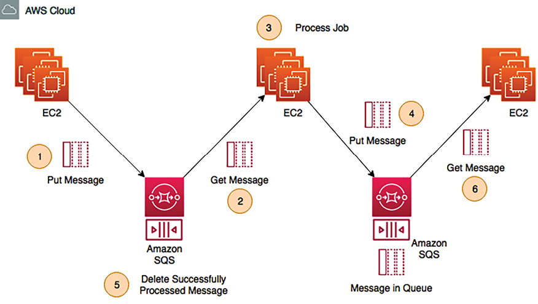

# الگوهای طراحی معماری بومی ابری

در عصر تحول دیجیتال سریع، کسب‌وکارها به طور فزاینده‌ای برای ارائه راه‌حل‌های مقیاس‌پذیر، انعطاف‌پذیر و مقرون‌به‌صرفه به ابر روی می‌آورند. اتخاذ معماری‌های بومی ابری برای سازمان‌هایی که به دنبال چابکی، نوآوری و کارایی عملیاتی هستند، به یک ضرورت استراتژیک تبدیل شده است. این فصل شما را در مسیر طراحی و پیاده‌سازی معماری‌های بومی ابری با تمرکز بر الگوها، طرح‌ها و بهترین شیوه‌ها راهنمایی می‌کند.

این فصل به طور جامع الگوهای مختلف طراحی بومی ابری، از جمله اصول طراحی و نمونه های دنیای واقعی را پوشش می دهد. علاوه بر الگوهای طراحی معماری، دانشی در مورد ضدالگوهای طراحی معماری بومی ابری نیز کسب خواهید کرد و بینش هایی را در مورد اقداماتی که باید اجتناب کنید به شما ارائه می دهد.

در این فصل با موضوعات زیر آشنا خواهید شد.

- معماری بومی ابری چیست؟
- ساخت معماری بدون سرور
- ساختن طرح های معماری بدون دولت و دولتی
- ایجاد معماری میکروسرویس
- معماری واکنشی
- معماری مبتنی بر صف ساختمان
- معماری لوله ها و فیلترها
- ایجاد معماری رویداد محور
- Backend برای Frontend (BFF)
- ضد الگوهای معماری بومی ابر

در پایان این فصل، شما درک کاملی از الگوهای معماری بومی ابری خواهید داشت و به خوبی برای طراحی، ساخت و بهینه سازی راه حل های بومی ابری خود مجهز خواهید بود.

# معماری بومی ابری چیست؟

در _فصل 3_، _ مهاجرت ابری و طراحی معماری ابری ترکیبی_، با استراتژی های مختلفی برای مهاجرت ابری از جمله lift and shift، replatform، repurchase، retire و غیره آشنا شدید. برای استفاده کامل از مزایا و مدل های قیمت گذاری ابر، اتخاذ معماری بومی ابری بسیار مهم است. معماری بومی ابری به یک رویکرد طراحی برای ساخت و اجرای برنامه‌هایی اشاره دارد که از مزایا و قابلیت‌های رایانش ابری تا حد زیادی بهره می‌برد. این شامل ساخت برنامه هایی برای کارآمد، مقیاس پذیر و انعطاف پذیر در محیط های ابری پویا است.

برنامه های کاربردی Cloud-Native با اصولی توسعه می یابند که از خدمات ابری، اتوماسیون و شیوه های توسعه مدرن بهره می برند. ویژگی های کلیدی معماری بومی ابری عبارتند از:

- **Microservices**: برنامه های کاربردی Cloud-Native اغلب از سرویس های کوچکتر و با اتصال آزاد به نام microservices تشکیل شده اند. هر میکروسرویس یک قابلیت تجاری خاص را مدیریت می کند و می تواند به طور مستقل توسعه داده، مستقر و مقیاس شود.
- **محاسبات بدون سرور**: برنامه های کاربردی ابری اغلب از محاسبات بدون سرور برای دستیابی به مقیاس پذیری یکپارچه و کاهش هزینه استفاده می کنند. این رویکرد به توسعه دهندگان اجازه می دهد تا بدون نگرانی در مورد مدیریت سرورها بر روی کد و منطق برنامه خود تمرکز کنند، مقیاس خودکار و استفاده کارآمد از منابع را امکان پذیر می کند، که می تواند هزینه های عملیاتی را به میزان قابل توجهی کاهش دهد. معماری بدون سرور برنامه‌ها و وابستگی‌های آن‌ها را بسته‌بندی می‌کند و از ثبات در محیط‌های مختلف اطمینان می‌دهد. استقرار بدون درز، مقیاس بندی و قابلیت حمل برنامه ها را تسهیل می کند.
- **کشش و مقیاس پذیری**: برنامه های کاربردی Cloud-Native می توانند بر اساس تقاضا کاهش یابند و امکان استفاده کارآمد از منابع و صرفه جویی در هزینه ها را فراهم کنند. این از طریق جرم گیری خودکار و متعادل سازی بار حاصل می شود.
- **تاب آوری و تحمل خطا**: برنامه های کاربردی Cloud-native به گونه ای طراحی شده اند که در برابر خرابی ها مقاوم باشند. آنها شیوه هایی مانند افزونگی، بازیابی خودکار، و مکانیسم های تحمل خطا را برای اطمینان از عملکرد مداوم حتی در مواجهه با خرابی ها ترکیب می کنند.
- **اتوماسیون **: معماری‌های بومی ابری بر اتوماسیون برای فرآیندهای مختلف از جمله استقرار، مقیاس‌بندی، نظارت و بازیابی تأکید دارند. اتوماسیون مداخله دستی را کاهش می دهد، کارایی را افزایش می دهد و خطر خطاهای انسانی را کاهش می دهد.
- **روش‌های DevOps**: توسعه بومی ابری همکاری نزدیک بین تیم‌های توسعه و عملیات را تشویق می‌کند و فرهنگ یکپارچه‌سازی مداوم، تحویل مستمر و تکرار سریع را ترویج می‌کند.
- **Statelessness**: برنامه های کاربردی Cloud-native به گونه ای طراحی شده اند که حالت ندارند، به این معنی که هر جزء به وضعیت محلی یک سرور متکی نیست. این مقیاس پذیری را افزایش می دهد و اجازه می دهد تا مقیاس افقی آسان تر شود.
- **API-first**: **API ها** (**رابط های برنامه نویسی برنامه**) در معماری بومی ابری بسیار مهم هستند. برنامه‌ها با APIهای واضح و مستند طراحی شده‌اند که امکان برقراری ارتباط بین میکروسرویس‌ها و ارتقای یکپارچگی با سایر سرویس‌ها را فراهم می‌کنند.
- **نظارت و بهبود مستمر **: برنامه های کاربردی Cloud-Native به طور مداوم نظارت می شوند تا از عملکرد و قابلیت اطمینان بهینه اطمینان حاصل شود. بینش های مبتنی بر داده برای شناسایی زمینه های بهبود و بهینه سازی استفاده می شود.

هنگام انتقال برنامه‌ها به فضای ابری، صرفاً این نیست که آنها را به همان شکلی که هستند جابه‌جا کنید. در عوض، این فرصتی برای بهینه سازی و استفاده از ویژگی های ابر برای حداکثر مزیت است. اول از همه، مدل پرداخت در فضای ابری یک تغییر دهنده بازی است. من

t به این معنی است که شما فقط برای منابعی که استفاده می کنید پرداخت می کنید و هزینه ها را مستقیماً با مصرف واقعی خود هماهنگ می کنید. این قابلیت کشش و کارایی هزینه را فراهم می کند، زیرا می توانید بر اساس تقاضا بدون سرمایه گذاری در زیرساخت های ثابت، مقیاس را افزایش یا کاهش دهید. برنامه ریزی دقیق تامین منابع برای جلوگیری از تامین بیش از حد و هزینه های غیر ضروری ضروری است.

زیرساخت جهانی موجود در فضای ابری یکی دیگر از مزایای قابل توجه است. شما می توانید برنامه خود را به کاربران خود در مناطق مختلف نزدیک تر استقرار دهید و تاخیر را کاهش دهید و تجربه کاربری را بهبود بخشید. این دسترسی جهانی به شما این امکان را می‌دهد که بدون سرمایه‌گذاری در مراکز داده فیزیکی در سراسر جهان، به مخاطبان گسترده‌تری پاسخ دهید.

تغییر از **هزینه سرمایه** (**CapEx**) به**هزینه عملیاتی** (**OpEx**) یک مزیت مالی قابل توجه در فضای ابری است. به جای سرمایه گذاری اولیه در سخت افزار و تعمیر و نگهداری، هزینه ها در طول زمان تقسیم می شوند. این با برنامه ریزی بودجه هماهنگی بهتری دارد و به شما امکان می دهد منابع را به طور موثرتری تخصیص دهید. با این حال، با تیم ها و برنامه های کاربردی توزیع شده، مدیریت هزینه به یک چالش تبدیل می شود. ایجاد اقدامات موثر کنترل هزینه در تیم های مختلف بسیار مهم است.

معماری بومی ابری به سازمان ها اجازه می دهد تا از مزایای محاسبات ابری، از جمله مقیاس پذیری، انعطاف پذیری و مقرون به صرفه بودن، به طور کامل بهره ببرند. نمونه‌ای از یک برنامه پخش رسانه را در نظر بگیرید تا تمایزات و مزایای معماری بومی ابری را با رویکرد بدون سرور در مقایسه با معماری داخلی برجسته کنید.

در معماری بومی ابری، برنامه پخش رسانه با استفاده از میکروسرویس ها و محاسبات بدون سرور طراحی شده است. جنبه های مختلف برنامه، مانند احراز هویت کاربر، توصیه محتوا، رمزگذاری ویدئو، و ذخیره سازی، هر کدام به عنوان میکروسرویس های جداگانه توسعه یافته اند. این میکروسرویس ها در توابع بدون سرور کپسوله شده اند و به آنها اجازه می دهند در پاسخ به رویدادها یا محرک های خاص اجرا شوند. به عنوان مثال، هنگام آپلود یک ویدیوی جدید، عملکردهای رمزگذاری ویدیو را می توان به طور خودکار فراخوانی کرد و عملکردهای توصیه محتوا می توانند به تعاملات کاربر پاسخ دهند. سرویس های ابری مدیریت شده پایگاه داده، ذخیره سازی، احراز هویت و حتی اجرای توابع بدون سرور را مدیریت می کنند.

برنامه پخش رسانه بر روی سرورها و زیرساخت های شرکت در معماری داخلی میزبانی می شود. برنامه یکپارچه همه وظایف، از جمله احراز هویت، ارائه محتوا، و پردازش ویدئو را انجام می دهد. مقیاس بندی نیاز به مداخله دستی و تهیه سخت افزار اضافی دارد.

هنگام اتخاذ توسعه ابر بومی، مهم است که از پتانسیل قفل شدن ارائه دهنده آگاه باشید. این بدان معنی است که طراحی معماری شما با ابزارها و خدمات بومی یک ارائه دهنده ابر خاص، مانند AWS، ممکن است به دلیل ماهیت منحصر به فرد و اختصاصی پیشنهادات هر پلتفرم، به طور یکپارچه به ارائه دهنده دیگری منتقل نشود. سرویس‌ها در سراسر پلتفرم‌ها ممکن است نام‌های مختلفی داشته باشند و روش‌های فراخوانی این سرویس‌ها می‌تواند به طور قابل توجهی متفاوت باشد. در حالی که ویژگی‌های بومی ابر قابلیت‌های قدرتمندی را ارائه می‌دهند که برای بهینه‌سازی عملیات شما در یک پلت‌فرم خاص طراحی شده‌اند، اگر بعداً تصمیم به مهاجرت به یک ارائه‌دهنده ابری دیگر بگیرید، می‌توانند چالش‌هایی را نیز ایجاد کنند. تعادل بین استفاده از این ویژگی های پیشرفته و حفظ سطحی از استقلال پلت فرم را به دقت در نظر بگیرید.

پذیرش یک معماری بومی ابری با رویکرد بدون سرور، مزایای زیادی را نسبت به تنظیمات داخلی سنتی دارد. ترکیبی از میکروسرویس‌ها و محاسبات بدون سرور، برنامه‌ها را قادر می‌سازد تا عملکرد استثنایی، مقیاس‌پذیری، کارایی هزینه و نوآوری سریع را ارائه دهند و در عین حال از انعطاف‌پذیری و پاسخگویی در زمان واقعی به خواسته‌های پویا کاربران اطمینان حاصل کنند.

بیایید معماری بدون سرور را با جزئیات بیشتری بررسی کنیم.

# ساخت معماری بدون سرور

در یک سناریوی سنتی، اگر می خواهید یک برنامه کاربردی توسعه دهید، باید سروری داشته باشید که سیستم عامل مورد نظر و نرم افزار مورد نیاز شما در آن نصب شود. هنگام نوشتن کد خود، باید مطمئن شوید که سرور شما راه اندازی و کار می کند. در طول استقرار، باید سرورهای بیشتری را اضافه کنید تا با تقاضای کاربر مطابقت داشته باشید و مکانیسم‌های مقیاس‌بندی مانند **مقیاس‌سازی خودکار** را اضافه کنید تا تعداد مورد نظر سرور را برای انجام درخواست‌های کاربران مدیریت کنید. در این شرایط تلاش زیادی برای مدیریت و نگهداری زیرساخت ها انجام می شود که ربطی به مشکل کسب و کار شما ندارد.

بدون سرور به این معنی است که هیچ سروری برای میزبانی کد شما مورد نیاز نیست، و شما را از مقیاس‌بندی خودکار و جداسازی هزینه‌های سربار آزاد می‌کند و در عین حال مدلی کم‌هزینه ارائه می‌دهد. بدون سرور به شما امکان می دهد روی برنامه خود تمرکز کنید و کدی را برای پیاده سازی ویژگی بنویسید بدون اینکه نگران تعمیر و نگهداری زیرساخت های اساسی باشید.

در رابطه با AWS، وقتی در مورد بدون سرور صحبت می کنید، اولین چیزی که به ذهن می رسد توابع AWS Lambda است، یک **عملکرد به عنوان سرویس** (**FaaS**) ارائه شده توسط ابر AWS. برای اینکه برنامه شما سرویس گرا باشد، Amazon API Gateway به شما این امکان را می دهد که نقاط پایانی RESTful را در مقابل عملکرد AWS Lambda خود قرار دهید.

به شما کمک می کند تا آنها را به عنوان ریزسرویس در معرض دید قرار دهید. Amazon DynamoDB یک پایگاه داده NoSQL بسیار مقیاس پذیر، یک فروشگاه داده NoSQL کاملاً بدون سرور، و Amazon **Simple Storage Service** (**S3**) ذخیره سازی داده های شیء بدون سرور را فراهم می کند.

بیایید به یک نمونه از معماری بدون سرور برای ارائه یک نظرسنجی امن با AWS در نمودار زیر نگاهی بیندازیم:

شکل 5.1: نمونه معماری بدون سرور AWS برای تحویل نظرسنجی ایمن

نمودار قبلی جریان یک معماری امن بدون سرور را نشان می دهد که برای برنامه نظرسنجی مشتری میزبانی شده در AWS استفاده می شود:

1. یک مشتری یک درخواست HTTPS امن برای وب سایت نظرسنجی می کند. صفحه وب استاتیک، از جمله هر اسکریپت سمت سرویس گیرنده برای تماس های AJAX، مستقیماً از یک سطل آمازون S3 ارائه می شود که برای میزبانی وب پیکربندی شده است.
2. پس از تکمیل نظرسنجی، مشتری پاسخ های خود را ارسال می کند. این یک تماس AJAX از مرورگر مشتری به دروازه API آمازون را آغاز می کند. API Gateway به گونه‌ای پیکربندی شده است که نقاط پایانی لازم برای دریافت داده‌های نظرسنجی را نشان دهد و برای اطمینان از پردازش فقط تماس‌های مجاز، ایمن شده است.
3. Amazon API Gateway دارای یکپارچه سازی داخلی با AWS CloudTrail است که تمام درخواست های ارسال شده به API را ثبت می کند. این بدان معنی است که هر ارسال نظرسنجی ثبت می شود و یک مسیر حسابرسی ارائه می دهد که می تواند برای عیب یابی داده های از دست رفته یا بررسی فعالیت های مشکوک مفید باشد.
4. API Gateway تماس ورودی AJAX را به رویدادی تبدیل می کند که یک تابع AWS Lambda را راه اندازی می کند. این عملکرد بدون سرور مسئول پردازش داده های نظرسنجی است که ممکن است شامل اعتبار سنجی، تبدیل و اعمال منطق تجاری خاص برای نیازهای نظرسنجی باشد.
5. پس از پردازش داده ها، تابع Lambda به طور ایمن نتایج نظرسنجی را به یک سطل دیگر آمازون S3 که برای ذخیره این موارد ارسالی اختصاص داده شده است، ارسال می کند. نتایج با استفاده از رمزگذاری سمت سرور رمزگذاری می‌شوند تا اطمینان حاصل شود که داده‌ها در حالت استراحت در برابر دسترسی غیرمجاز محافظت می‌شوند.
6. در کنار نتایج نظرسنجی رمزگذاری شده، هر ابرداده غیر حساس (به استثنای اطلاعات قابل شناسایی شخصی) به طور همزمان در جدول DynamoDB آمازون ذخیره می شود. این ابرداده می‌تواند شامل مُهرهای زمانی، اطلاعات نسخه نظرسنجی یا سایر داده‌های متنی مربوط به پرسش‌های آینده، گزارش‌دهی یا اهداف تحلیلی باشد.

با توجه به محبوبیت روزافزون معماری بدون سرور، در ادامه این کتاب، نمونه معماری های بیشتری را با استفاده از خدمات بدون سرور مشاهده خواهید کرد. اکنون AWS **SAM** (**مدل برنامه کاربردی بدون سرور**) نحو ساده ای را برای ایجاد توابع، APIها و پایگاه های داده متناسب با محیط های بدون سرور ارائه می دهد. بیایید در مورد ملاحظات طراحی برای معماری بدون سرور بیشتر بیاموزیم.

## ملاحظات برای معماری بدون سرور

هنگام ایجاد یک معماری بدون سرور، در نظر گرفتن عوامل کلیدی که استقرار و عملکرد موفقیت آمیز برنامه شما را تضمین می کنند بسیار مهم است. معماری بدون سرور برای طرح هایی که می توانند به اجزای ماژولارتر تقسیم شوند بسیار مناسب است. این رویکرد زمانی می درخشد که بتوانید برنامه خود را به خدمات گسسته و مستقل مقیاس پذیر تقسیم کنید. با این حال، اگر پروژه شما شامل ساخت یک منطق بزرگ و پیچیده در یک ماژول منفرد و یکپارچه باشد، ممکن است انتخاب یک رویکرد مبتنی بر سرور سنتی سودمندتر باشد.

معماری بدون سرور، در حالی که مزایای متعددی را ارائه می دهد، اغلب با چالش شروع سرد مواجه می شود که می تواند بر تأخیر شروع برنامه تأثیر بگذارد. اگرچه این زیرساخت برای کاربر بدون سرور به نظر می رسد، ارائه دهندگان ابری مانند AWS با ایجاد یک لایه انتزاعی در پس زمینه کار می کنند و به صورت پویا سرورها را در صورت نیاز به چرخش در می آورند. این فرآیند گاهی اوقات ممکن است زمان ببرد و منجر به تأخیر - یا "شروع سرد" - زمانی که تابع پس از بیکار بودن فراخوانی می شود، شود. مهم است که هنگام طراحی با معماری بدون سرور به مسائل شروع سرد توجه داشته باشید و استراتژی هایی را برای کاهش آن پیاده سازی کنید تا اطمینان حاصل کنید که برنامه شما پاسخگو و کارآمد است.

بیایید این را از طریق یک مثال بررسی کنیم: توسعه یک سیستم اطلاع رسانی در زمان واقعی برای یک پلت فرم رسانه های اجتماعی. هر زمان که کاربران لایک، نظر یا درخواست دوستی جدید دریافت کردند، سیستم باید اعلان‌های فوری را به دستگاه‌های خود ارسال کند. در اینجا برخی از ملاحظات مهم برای معماری بدون سرور برای سیستم اطلاع رسانی ما وجود دارد:

- **طراحی تابع دانه ای**: منطق برنامه خود را به توابع کوچک و مجزا تقسیم کنید. هر تابع باید یک کار خاص را انجام دهد یا یک رویداد خاص را مدیریت کند. این دانه بندی استفاده کارآمد از منابع و مقیاس پذیری بهتر را تضمین می کند. ممکن است عملکردهای جداگانه ای برای ارسال لایک، نظر و درخواست دوست داشته باشید.
- **بی حالتی**: توابع بدون سرور به گونه ای طراحی شده اند که حالت ندارند. هر حالت مورد نیاز باید به صورت خارجی مدیریت شود، مانند یک پایگاه داده یا سرویس ذخیره سازی. این تضمین می کند که عملکردها می توانند مقیاس شوند و به راحتی جایگزین شوند بدون اینکه بر رفتار برنامه تأثیر بگذارند. اطمینان حاصل کنید که هر تابع بدون حالت است و به حافظه محلی متکی نیست. همه لازم

داده ها، مانند تنظیمات برگزیده کاربر یا تاریخچه اعلان ها، باید در یک پایگاه داده ذخیره شوند.

- **طراحی رویداد محور **: معماری بدون سرور برای برنامه های کاربردی رویداد محور مناسب است. توابع خود را طوری طراحی کنید که در پاسخ به رویدادهای خاص، مانند اقدامات کاربر یا تغییرات در داده، فعال شوند. به عنوان مثال، زمانی که کاربر یک درخواست دوستی جدید دریافت می کند، یک رویداد باید تابع مربوطه را فعال کند.
- **شروع سرد**: توابع بدون سرور هنگام فراخوانی برای اولین بار می توانند با تاخیر مواجه شوند که به عنوان "شروع سرد" شناخته می شود. این امر می‌تواند تحویل اعلان‌ها را به تأخیر بیندازد، بنابراین معماری باید به گونه‌ای طراحی شود که تأثیر شروع سرد را به حداقل برساند، مانند استفاده از همزمانی تدارک دیده شده برای گرم نگه داشتن تعداد معینی از نمونه‌های تابع و آماده برای رسیدگی به درخواست‌های دریافتی.
- ** مقیاس پذیری **: پلت فرم های بدون سرور به طور خودکار عملکردها را بر اساس تقاضا مقیاس می دهند. این به برنامه شما اجازه می دهد تا بدون مداخله دستی، جهش های ناگهانی در ترافیک را مدیریت کند. با افزایش فعالیت کاربر، سیستم اعلان‌های بیشتری را بدون دخالت دستی انجام می‌دهد.
- **ملاحظات عملکرد**: محدودیت های پلتفرم های بدون سرور، مانند محدودیت های زمانی اجرا و محدودیت های حافظه را درک کنید. عملکردهای خود را برای عملکرد بهینه کنید تا مطمئن شوید که سیستم اعلان شما حتی در دوره‌های پرترافیک پاسخگو باقی می‌ماند.
- **ردیابی و نظارت توزیع شده**: نظارت و ردیابی توزیع شده را برای مشاهده عملکرد عملکردهای بدون سرور خود اجرا کنید. این برای شناسایی تنگناها و تشخیص مشکلات در ارائه اعلان ها بسیار مهم خواهد بود.
- **امنیت**: بهترین شیوه های امنیتی را برای برنامه های بدون سرور اجرا کنید تا از دسترسی غیرمجاز به اعلان ها جلوگیری کنید. این شامل احراز هویت مناسب، مجوز، و رمزگذاری داده ها در حالت استراحت و در حال انتقال است.
- **مدیریت هزینه**: در حالی که بدون سرور می تواند مقرون به صرفه باشد، نظارت بر استفاده و هزینه ها ضروری است. هشدارهای بودجه را تنظیم کنید و از ابزارهای ارائه دهنده ابر برای تجزیه و تحلیل الگوهای هزینه استفاده کنید. با استفاده از سرور بدون سرور، شما هزینه زمان اجرا را پرداخت می کنید، بنابراین کد را برای کاهش آن بهینه کنید و از ابزارهای تحلیل هزینه برای نظارت بر استفاده استفاده کنید.
- **ذخیره و ماندگاری داده**: راه حل های ذخیره سازی مناسب را برای داده های خود انتخاب کنید، مانند پایگاه های داده مدیریت شده، ذخیره سازی اشیا یا انبارهای داده. از ماندگاری داده ها در فراخوانی تابع اطمینان حاصل کنید. برای سیستم اعلان خود، ترجیحات کاربر و تاریخچه اعلان‌ها را در یک پایگاه داده مدیریت شده ذخیره می‌کنیم و از ماندگاری داده‌ها در فراخوانی‌های عملکرد اطمینان می‌دهیم.
- **وابستگی**: مراقب وابستگی ها در عملکردهای خود باشید. گنجاندن کتابخانه ها یا مؤلفه های غیر ضروری می تواند اندازه بسته استقرار شما را افزایش دهد و بر عملکرد تأثیر بگذارد. برای کوچک و کارآمد نگه داشتن بسته استقرار تابع، وابستگی ها را به حداقل برسانید.
- **تست و اشکال زدایی**: استراتژی های تست موثری را برای عملکردهای بدون سرور خود ایجاد کنید. از شبیه سازهای محلی و ابزارهای اشکال زدایی ارائه شده توسط ارائه دهنده ابر استفاده کنید.
- **استفاده از خدمات مدیریت شده**: بدون سرور به این معنا نیست که هر جزء باید یک تابع باشد. از سرویس های مدیریت شده برای بخش های دیگر معماری برنامه خود مانند پایگاه های داده، صف ها و احراز هویت استفاده کنید.
- **انطباق و مقررات**: هر گونه انطباق یا الزامات نظارتی را که در مورد برنامه شما اعمال می شود، در نظر بگیرید، به ویژه هنگامی که با داده های حساس یا صنایع دارای مقررات سختگیرانه سروکار دارید. اطمینان حاصل کنید که معماری با مقررات حفاظت از داده ها، به ویژه هنگام مدیریت اطلاعات شخصی، مطابقت دارد.

با پرداختن دقیق به این ملاحظات، می توانید یک برنامه بدون سرور با معماری خوب ایجاد کنید که از مقیاس بندی خودکار، کارایی هزینه و مدیریت ساده سود می برد. معماری بدون سرور، تحویل اعلان های مقیاس پذیر، مقرون به صرفه و پاسخگو را بدون نگرانی در مورد مدیریت زیرساخت تضمین می کند.

هنگام توسعه یک معماری بدون سرور، تأکید بر عدم تابعیت بسیار مهم است. با طراحی برنامه های بدون حالت، وابستگی به حالت های جلسه مدیریت شده توسط سرور را کاهش می دهید، که به نوبه خود به مقیاس پذیری کمک می کند. معماری بدون دولت کلیدی برای مقیاس‌بندی معماری بومی ابری است. بیایید در مورد آن بیشتر بدانیم.

# ساختن طرح های معماری بدون دولت و دولتی

طرح‌های معماری بدون دولت و دولت نشان‌دهنده دو رویکرد متفاوت برای مدیریت تعاملات مشتری و سرور در برنامه‌های نرم‌افزاری است. معماری های بدون حالت هر درخواست مشتری را به عنوان یک تراکنش جداگانه و مستقل در نظر می گیرند که نیازی به آگاهی از تعاملات قبلی ندارد. این امر طراحی را ساده می کند و مقیاس پذیری را افزایش می دهد، زیرا هر سروری می تواند به هر درخواستی بدون نیاز به حفظ اطلاعات جلسه پاسخ دهد. از سوی دیگر، معماری های حالت دار، اطلاعات جلسه مشتری را در چندین درخواست حفظ می کنند، که امکان تعاملات شخصی و آگاه از زمینه را فراهم می کند، اما به قیمت افزایش پیچیدگی در مدیریت داده های جلسه و چالش ها در مقیاس بندی، زیرا وضعیت باید به طور مداوم در دسترس و هماهنگ باشد. نمونه های سرور

در حین طراحی یک برنامه کاربردی پیچیده مانند وب سایت تجارت الکترونیک، باید به آن رسیدگی کنید

حالت کاربر برای حفظ جریان فعالیت، که در آن کاربران ممکن است زنجیره ای از فعالیت ها مانند افزودن به سبد خرید، ثبت سفارش، انتخاب روش حمل و نقل و پرداخت را انجام دهند. کاربران می‌توانند از کانال‌های مختلفی برای دسترسی به یک برنامه استفاده کنند، بنابراین احتمال زیادی وجود دارد که بین دستگاه‌ها جابه‌جا شوند - به عنوان مثال، مواردی را از تلفن همراه خود به سبد خرید اضافه کنند و سپس پرداخت و پرداخت را از طریق لپ‌تاپ تکمیل کنند. برای رفع این وضعیت، باید فعالیت کاربر را در سراسر دستگاه ها ادامه دهید و وضعیت آنها را تا پایان تراکنش حفظ کنید. بنابراین، طراحی معماری و اجرای برنامه شما باید برای مدیریت جلسه کاربر برنامه ریزی کند تا این نیاز را برآورده کند.

برای تداوم وضعیت های کاربر و بی حالت کردن برنامه ها، اطلاعات جلسه کاربر باید در لایه های پایگاه داده دائمی مانند پایگاه داده NoSQL ذخیره شود. این حالت کاربری را می توان بین چندین وب سرور یا میکروسرویس به اشتراک گذاشت.

به طور سنتی، یک برنامه یکپارچه از معماری stateful استفاده می کند و اطلاعات جلسه کاربر را در سرور ذخیره می کند و نه از طریق ذخیره سازی پایگاه داده پایدار خارجی.

تمایز کلیدی بین طرح های برنامه کاربردی بدون حالت و حالت در نحوه مدیریت ذخیره سازی جلسه نهفته است. در برنامه های حالت دار، اطلاعات جلسه به صورت محلی بر روی سرور ذخیره می شود، به این معنی که نمی توان آن را به راحتی با سرورهای دیگر به اشتراک گذاشت. این راه‌اندازی چالشی برای مقیاس‌پذیری ایجاد می‌کند و برای معماری‌های میکروسرویس مدرن مناسب نیست، زیرا نیاز دارد که تمام درخواست‌های بعدی از همان کاربر به سرور اصلی که اولین درخواست را رسیدگی کرده است، هدایت شوند. این می تواند به طور قابل توجهی توانایی برنامه در مقیاس پذیری در چندین سرور یا نمونه را محدود کند. از سوی دیگر، طرح‌های بدون حالت، داده‌های جلسه را روی سرور ذخیره نمی‌کنند، و به هر سروری اجازه می‌دهند تا هر درخواستی را انجام دهد، که مقیاس‌پذیری و انعطاف‌پذیری برنامه را افزایش می‌دهد. انتخاب بین اتخاذ رویکرد بدون حالت یا حالت به الزامات برنامه بستگی دارد، به ویژه اینکه چگونه نیاز به مقیاس‌پذیری را با میل به تجربه کاربر مستمر و شخصی‌سازی شده متعادل می‌کند.

## معماری دولتی

در یک برنامه حالت دار، اطلاعات وضعیت توسط سرور مدیریت می شود، بنابراین هنگامی که کاربران با یک سرور خاص ارتباط برقرار می کنند، باید تا پایان تراکنش به آن بچسبند. شما می توانید یک load balancer را در مقابل برنامه stateful قرار دهید، اما برای انجام این کار، باید جلسات چسبنده را در یک load balancer فعال کنید.

جلسات چسبنده تکنیکی است که برای اطمینان از اینکه تمام درخواست‌های یک جلسه کاربر خاص به همان سروری هدایت می‌شوند که درخواست اولیه را مدیریت می‌کند، استفاده می‌شود. این رویکرد در برنامه‌های حالت دار برای حفظ ثبات جلسه ضروری است، زیرا از از بین رفتن داده‌های جلسه هنگام ارسال درخواست‌های بعدی به سرورهای مختلف جلوگیری می‌کند. با استفاده از جلسات چسبنده، متعادل کننده بار از رویه استاندارد خود در توزیع درخواست ها به طور مساوی در بین سرورها، که معمولاً از طریق روش دور برگشتی انجام می شود، منحرف می شود و در عوض، درخواست های کاربر را به سرور خاصی که اطلاعات جلسه آنها در آن قرار دارد، هدایت می کند. در حالی که این روش از ماندگاری جلسه پشتیبانی می‌کند، چالش‌هایی مانند پتانسیل بارگذاری بیش از حد یک سرور واحد با اتصالات مداوم بیش از حد را معرفی می‌کند. برای کاهش این امر، پیاده‌سازی مکانیزم زمان‌بندی جلسه ضروری است، و اطمینان حاصل می‌کند که جلسات به طور نامحدود منابع سرور را مصرف نمی‌کنند.

اغلب، یک برنامه حالت دار از مقیاس افقی به خوبی پشتیبانی نمی کند، زیرا وضعیت برنامه در سرور باقی می ماند که نمی توان آن را جایگزین کرد. برنامه Stateful در اوایل زمانی که پایگاه کاربر کوچک است به خوبی کار می کند. با این حال، با گسترش روزافزون اینترنت، منطقی است که فرض کنیم میلیون ها کاربر فعال در یک برنامه وب خواهید داشت. بنابراین، مقیاس بندی افقی کارآمد برای مدیریت یک پایگاه بزرگ کاربر و دستیابی به تأخیر کم برنامه ضروری است.

## معماری بدون دولت

با استفاده از روش بدون حالت، رویکرد طراحی شما باید بیشتر بر وضعیت جلسه مشترک تمرکز کند، زیرا امکان مقیاس بندی افقی را فراهم می کند.

نمودار زیر یک معماری را نشان می دهد که یک برنامه بدون حالت را برای یک برنامه وب نمونه با AWS نشان می دهد:

شکل 5.2: معماری برنامه بدون حالت

معماری AWS به تصویر کشیده شده، یک محیط امن، بسیار در دسترس و مقیاس پذیر را برای یک برنامه کاربردی سه لایه در دو منطقه در دسترس برای تحمل خطا فراهم می کند. از Elastic Load Balancing برای توزیع ترافیک در میان خوشه‌های سرور EC2 استفاده می‌کند که به صورت پویا با مقیاس خودکار مقیاس‌بندی می‌شوند تا نیازهای متغیر را برآورده کنند. لایه پایگاه داده که توسط Amazon RDS پشتیبانی می شود، شامل یک نسخه خواندنی برای مقیاس بندی پرس و جو و یک نمونه آماده به کار برای failover است که دوام داده ها و در دسترس بودن بالا را تضمین می کند. محتوای استاتیک از طریق Amazon S3 ارائه می شود و به طور موثر از طریق Amazon CloudFront ارائه می شود، با AWS Route 53 که خدمات DNS را برای بهینه سازی مسیریابی ترافیک کاربر مدیریت می کند. این راه‌اندازی انعطاف‌پذیری عملیاتی، کارایی هزینه، و p

بهینه سازی عملکرد برای برنامه برای اینکه برنامه‌ها به‌طور ضعیف و مقیاس‌پذیر همراه شوند، تمام جلسات کاربر به طور مداوم در پایگاه داده NoSQL ذخیره می‌شوند، به عنوان مثال، Amazon DynamoDB.

برای شناسه جلسه، باید از فضای ذخیره سازی سمت سرویس گیرنده، مانند کوکی ها استفاده کنید. این معماری به شما امکان می دهد برنامه را به صورت افقی با افزودن سرورهای بیشتر بدون نگرانی در مورد از دست دادن اطلاعات وضعیت کاربر مقیاس کنید. یک معماری بدون حالت، سربار ایجاد و نگهداری جلسات کاربر را حذف می‌کند و اجازه می‌دهد تا در ماژول‌های برنامه سازگاری داشته باشد. یک برنامه بدون حالت دارای مزایای عملکردی نیز می باشد، زیرا استفاده از حافظه را از سمت سرور کاهش می دهد و مشکل زمان پایان جلسه را حذف می کند.

پیاده سازی یک معماری بدون حالت شامل پیچیدگی هایی مانند یکپارچه سازی اجزای پایگاه داده اضافی برای ذخیره جلسات کاربر و ایجاد یک لایه تکمیلی برای بازیابی جلسه صحیح کاربر در سرورها است. با این حال، با رویکرد صحیح، می توانید تجربه ای مفید برای پایگاه کاربری خود داشته باشید. شما می توانید برنامه های کاربردی را با استفاده از رویکرد میکروسرویس با الگوهای طراحی REST توسعه دهید و آنها را در کانتینرها مستقر کنید. برای این کار از احراز هویت و مجوز برای اتصال کاربران به سرور استفاده کنید.

در بخش‌های بعدی با میکروسرویس‌ها و الگوهای طراحی REST بیشتر آشنا می‌شوید. از آنجایی که دسترسی به اطلاعات جلسه کاربر از چندین وب سرور بر روی یک مکان ذخیره سازی داده متمرکز است، باید احتیاط کنید تا از تبدیل شدن به گلوگاه عملکرد فروشگاه داده جلوگیری کنید.

# ایجاد معماری میکروسرویس

در معماری بومی ابری، میکروسرویس‌ها نقشی حیاتی در تجزیه ویژگی‌های گسترده به قطعات کوچکتر و قابل مدیریت دارند که می‌توانند به طور مستقل مقیاس شوند. این رویکرد به اجزای خاص اجازه می دهد تا در صورت نیاز، بدون تأثیر بر کل سیستم، بزرگ یا کوچک شوند. با استفاده از میکروسرویس‌ها، یک سیستم به گونه‌ای طراحی می‌شود که عیب‌پذیر باشد، به این معنی که با در نظر گرفتن خرابی‌های بالقوه ساخته شده است و امکان کاهش چشمگیر در دسترس بودن برنامه و جلوگیری از خرابی‌های گسترده سیستم را فراهم می‌کند.

مزیت واضح میکروسرویس ها این است که شما باید سطح کد کوچکتری را حفظ کنید. میکروسرویس ها همیشه باید مستقل باشند. می‌توانید هر سرویس را بدون وابستگی خارجی بسازید که در آن همه پیش‌نیازها گنجانده شده است، که وابستگی متقابل بین ماژول‌های برنامه را کاهش می‌دهد و کوپلینگ آزاد را ممکن می‌سازد.

مفهوم فراگیر دیگر میکروسرویس ها **زمینه های محدود** است که بلوک هایی هستند که با هم ترکیب می شوند تا یک دامنه تجاری واحد را ایجاد کنند. یک دامنه تجاری می تواند خرده فروشی، تولید خودرو، کتاب فروشی یا تعاملات شبکه های اجتماعی که شامل یک فرآیند کامل تجاری است باشد. یک میکروسرویس مجزا مرزهایی را تعریف می کند که در آن تمام جزئیات محصور شده اند. به عنوان مثال، بیایید یک پلت فرم تجارت الکترونیک را در نظر بگیریم. در چنین سیستمی، شما چندین میکروسرویس خواهید داشت که جنبه های مختلف کسب و کار را مدیریت می کنند. در اینجا چند زمینه محدود در این پلت فرم وجود دارد:

2. **زمینه حساب کاربری**: این میکروسرویس همه چیز مربوط به حساب های کاربری از جمله ثبت نام کاربر، مدیریت نمایه، ورود به سیستم و احراز هویت را مدیریت می کند. مرز آن شامل اطلاعات کاربر و عملیاتی است که می توان روی این داده ها انجام داد، مانند به روز رسانی نمایه یا تنظیم مجدد رمز عبور. هیچ میکروسرویس دیگری این عملیات را مدیریت نخواهد کرد.
3. **زمینه کاتالوگ محصولات**: این میکروسرویس مسئول مدیریت لیست محصولات، دسته بندی ها و جزئیات محصول است. مستقل از زمینه حساب کاربری عمل می کند و تنها بر روی محصولات، سازمان آنها و ارائه آنها به کاربر تمرکز می کند.
4. **زمینه پردازش سفارش**: این میکروسرویس فرآیند پرداخت، ردیابی سفارش و پردازش پرداخت را انجام می دهد. از اطلاعات مربوط به کاتالوگ محصول (مانند شناسه‌های محصول، قیمت‌ها) و زمینه حساب کاربری (مانند جزئیات مشتری) برای انجام وظایف خود استفاده می‌کند، اما عملیات جداگانه خود را حفظ می‌کند، مانند به‌روزرسانی وضعیت سفارش یا پردازش برگشت‌ها.

هر بافت محدود شده یک سیستم مستقل با منطق دامنه و پایگاه داده خاص خود است که از طریق APIهای کاملاً تعریف شده با دیگران ارتباط برقرار می کند. این مرزها به هر میکروسرویس اجازه می دهد تا به طور مستقل توسعه، استقرار، مقیاس بندی و به روز شود و سیستم کلی را انعطاف پذیرتر و سازگارتر با تغییرات کند.

با تعریف این مرزها، پلتفرم تجارت الکترونیک می‌تواند اطمینان حاصل کند که تغییرات در یک زمینه، مانند افزودن روش‌های پرداخت جدید در زمینه پردازش سفارش، بر حساب کاربری یا زمینه‌های کاتالوگ محصول تأثیری نمی‌گذارد و منجر به سیستم قابل نگهداری و مقیاس‌پذیری می‌شود.

مقیاس بندی هر سرویس در هنگام برخورد با دسترسی در مقیاس بزرگ برنامه ها ضروری است، جایی که بارهای کاری مختلف نیازهای مقیاس بندی متفاوتی دارند.

بیایید با برخی از بهترین روش‌ها برای طراحی معماری میکروسرویس آشنا شویم:

- **ایجاد یک فروشگاه داده جداگانه**: اتخاذ یک فروشگاه داده جداگانه برای هر میکروسرویس به تیم فردی اجازه می دهد تا بهترین پایگاه داده را برای خدمات خود انتخاب کند. به عنوان مثال، تیم ترافیک وب سایت می تواند استفاده کند

یک پایگاه داده مقیاس پذیر NoSQL برای ذخیره داده های نیمه ساختار یافته. تیمی که خدمات سفارش را مدیریت می کند می تواند از یک پایگاه داده رابطه ای برای اطمینان از یکپارچگی داده ها و ثبات تراکنش ها استفاده کند. این همچنین به دستیابی به اتصال آزاد کمک می کند که در آن تغییرات در یک پایگاه داده بر سایر خدمات تأثیر نمی گذارد.

- **Keep servers stateless**: همانطور که در قسمت قبل آموختید، _ساخت طرح های معماری بدون حالت و حالت_، نگه داشتن سرور شما بدون حالت به مقیاس سازی کمک می کند. سرورها باید بتوانند به راحتی از کار بیفتند و جایگزین شوند، بدون نیاز به ذخیره سازی وضعیت در سرورها.
- **ایجاد یک بیلد جداگانه**: ایجاد یک ساخت مجزا برای هر میکروسرویس، ایجاد تغییرات جدید و بهبود چابکی انتشار ویژگی جدید را برای تیم توسعه آسان تر می کند. این کمک می کند تا اطمینان حاصل شود که تیم توسعه تنها کد مورد نیاز برای یک میکروسرویس خاص را می سازد و بر سایر خدمات تأثیر نمی گذارد.
- **استقرار در یک کانتینر**: استقرار در یک کانتینر به شما این ابزار را می دهد که همه چیز را به همان روش استاندارد مستقر کنید. با استفاده از کانتینرها، می‌توانید همه میکروسرویس‌ها را بدون در نظر گرفتن ماهیت آن‌ها به یک روش اجرا کنید. شما می توانید از خدمات استقرار کانتینر بدون سرور مانند Amazon Fargate برای مدیریت کانتینر خود بدون نگرانی در مورد زیرساخت استفاده کنید.
- **بدون سرور **: سعی کنید از یک پلت فرم بدون سرور یا یک عملکرد اهرمی با قابلیت سرویس، مانند AWS Lambda استفاده کنید، زمانی که میکروسرویس های شما به اندازه کافی ساده هستند. معماری بدون سرور به شما کمک می کند تا از هزینه های مدیریت زیرساخت جلوگیری کنید.
- **استقرار سبز-آبی**: برای استقرار اپلیکیشن، بهترین رویکرد ایجاد یک کپی از محیط تولید است. ویژگی جدید را اجرا کنید و درصد کمی از ترافیک کاربر را هدایت کنید تا مطمئن شوید که ویژگی جدید همانطور که انتظار می رود در یک محیط جدید کار می کند. پس از آن، ترافیک را در محیط جدید افزایش دهید تا زمانی که کل پایگاه کاربر بتواند ویژگی جدید را ببیند. درباره استقرار سبز-آبی در _فصل 11_، _DevOps and Solution Architecture Framework_ بیشتر خواهید آموخت.\* **نظارت بر محیط خود**: نظارت خوب تفاوت بین واکنش به خاموشی و جلوگیری فعالانه از خاموشی با مسیریابی مجدد، مقیاس بندی مناسب است. و تخریب مدیریت شده برای جلوگیری از خرابی برنامه، می‌خواهید خدمات ارائه شود و وضعیت سلامت خود را به لایه نظارت برسانند، زیرا چه چیزی بیشتر از خود سرویس درباره وضعیت می‌داند؟ نظارت را می توان به روش های مختلفی انجام داد، مانند با افزونه ها یا با نوشتن در یک API نظارت.

در حالی که معماری های میکروسرویس دارای مزایای مختلفی هستند، یک رویکرد مدولار با هزینه های سربار مدیریت زیرساخت های بیشتر همراه است. شما باید با دقت ابزارهایی را انتخاب کنید که به شما در مدیریت و مقیاس بندی چندین ماژول به صورت موازی کمک کنند. در حین طراحی معماری میکروسرویس، سعی کنید تا حد امکان از پلتفرم های بدون سرور استفاده کنید که به کاهش زیرساخت و هزینه های عملیاتی کمک می کند. بیایید به یک معماری نمونه مبتنی بر میکروسرویس برای یک برنامه رای گیری بلادرنگ نگاه کنیم.

در نمودار زیر، طرحی را نشان می‌دهیم که از میکروسرویس‌ها برای یک برنامه رای‌گیری زنده استفاده می‌کند. این برنامه با داشتن سرویس های کوچک و مجزا کار می کند که رای کاربران را مدیریت و شمارش می کند. هنگامی که شخصی با استفاده از دستگاه تلفن همراه خود رای می دهد، برنامه هر رأی را ضبط می کند و سپس همه این آرا را با هم در پایگاه داده NoSQL، Amazon DynamoDB ذخیره می کند.

منطق کاربردی در تابع AWS Lambda وجود دارد که تمام داده های رای گیری ارسال شده توسط کاربران را به بازیگر مورد علاقه خود جمع می کند و نتایج نهایی را برمی گرداند:

شکل 5.3: معماری برنامه رای گیری بلادرنگ مبتنی بر میکروسرویس با AWS

در معماری قبلی، موارد زیر در حال وقوع است:

1. کاربران یک رای را به یک شماره تلفن یا یک کد کوتاه ارائه شده توسط شخص ثالث مانند _Twilio_ پیامک می کنند.
2. شخص ثالث برای ارسال محتوای پیام به نقطه پایانی ایجاد شده توسط Amazon API Gateway پیکربندی شده است، که سپس پاسخ را به یک تابع ساخته شده در AWS Lambda ارسال می کند.
3. این تابع رای را از محتوای پیام استخراج می کند و نتیجه و هر متادیتا را در جدولی در Amazon DynamoDB می نویسد.
4. این جدول دارای DynamoDB Streams است که تغییرات جداول شما را به صورت متوالی ردیابی می کند.
5. پس از به روز رسانی، DynamoDB Streams تابع دوم AWS Lambda را با منطق برنامه برای جمع آوری آرا (به هر ثانیه) و نوشتن آنها در جدول DynamoDB دیگری مطلع می کند. جدول دوم فقط مجموع آرا را برای هر دسته ذخیره می کند.
6. داشبوردی برای نمایش خلاصه ای از آرا با استفاده از HTML و جاوا اسکریپت ایجاد شده و به عنوان یک وب سایت ثابت در آمازون S3 میزبانی می شود. این صفحه از AWS JavaScript SDK برای جستجو در جدول DynamoDB آمازون و نمایش نتایج رای گیری در زمان واقعی استفاده می کند.
7. در نهایت، Amazon Route 53 یک ارائه دهنده DNS برای ایجاد یک منطقه میزبانی است که به نام دامنه سفارشی در سطل Amazon S3 اشاره می کند. این به شما این امکان را می دهد که وب سایت های ثابت را در سطل های S3 به روشی مقرون به صرفه بدون سرور میزبانی کنید.

این معماری نه تنها مبتنی بر میکروسرویس است بلکه بدون سرور نیز می باشد. با استفاده از میکروسرویس ها می توانید ایجاد کنید

برنامه های کاربردی ساخته شده از اجزای کوچک مستقل، که قطعات کوچکتری را برای تکرار تشکیل می دهند. معماری مبتنی بر میکروسرویس به این معنی است که هزینه، اندازه و ریسک تغییر کاهش می‌یابد و نرخ تغییر را افزایش می‌دهد.

اگر سیستم شما با استفاده از میکروسرویس ها توزیع شود، هماهنگی بین چندین سرویس حیاتی می شود. بیایید در ادامه بیاموزیم که چگونه چندین میکروسرویس را هماهنگ کنیم.

## الگوی حماسه

الگوی ساگا یک الگوی طراحی است که برای مدیریت تراکنش های تجاری طولانی مدت و پیچیده استفاده می شود. این در معماری های میکروسرویس مفید است، جایی که یک تراکنش تجاری ممکن است شامل چندین ریزسرویس باشد. الگوی Saga به جای استفاده از یک تعهد دو فازی سنتی، تراکنش را به چندین تراکنش کوچکتر و مجزا تقسیم می کند. یک سرویس متفاوت هر یک از این تراکنش‌های کوچک‌تر را مدیریت می‌کند و آنها برای اطمینان از سازگاری داده‌ها در بین سرویس‌ها هماهنگ می‌شوند. اگر یکی از تراکنش‌های کوچک‌تر شکست بخورد، تراکنش‌های جبران‌کننده برای لغو مراحل قبلی اجرا می‌شوند.

در سیستم‌های پیچیده‌ای که چندین سرویس برای انجام یک عملیات واحد، مانند پردازش یک سفارش یا رزرو پرواز، نیاز به همکاری با یکدیگر دارند، الگوی Saga کمک می‌کند تا اطمینان حاصل شود که اگر مشکلی در هر نقطه‌ای پیش بیاید، کل عملیات می‌تواند به طور کامل تکمیل شود یا انجام شود. بازگشت.

در اینجا نحوه عملکرد الگوی Saga آمده است:

- **تجزیه**: عملیاتی که باید انجام شود به مراحل یا تراکنش های کوچکتر و مجزا تقسیم می شود. هر مرحله مربوط به یک عمل انجام شده توسط یک میکروسرویس خاص است.
- **اقدامات جبرانی**: برای هر مرحله یک اقدام جبرانی مربوطه تعریف می شود. اگر مرحله ای با شکست مواجه شود یا خطایی رخ دهد، عمل جبران برای معکوس کردن اثرات مراحل قبلی اجرا می شود. این سیستم را به یک وضعیت ثابت باز می‌گرداند.\* **Coordinator**: یک هماهنگ‌کننده مسئول هماهنگی ترتیب مراحل و اقدامات جبرانی مربوط به آنها است. حماسه را آغاز می کند، پیشرفت آن را نظارت می کند و اطمینان می دهد که تمام مراحل تکمیل شده یا اقدامات جبرانی لازم انجام شده است.
- **تراکنش های محلی**: هر مرحله و عمل جبران آن در یک تراکنش محلی در میکروسرویس های مربوطه کپسوله می شود. این امکان اتمی بودن عملیات در هر میکروسرویس را فراهم می کند.
- **پیوستگی نهایی**: الگوی Saga سازگاری نهایی را در بر می گیرد، به این معنی که حتی اگر یک شکست رخ دهد، سیستم در نهایت با تکمیل موفقیت آمیز کل عملیات یا بازگشت به حالت ثابت، به یک وضعیت ثابت می رسد.

یک اپلیکیشن تجارت الکترونیک را تصور کنید که در آن مشتری سفارشی را ثبت می کند. الگوی Saga می تواند برای مدیریت کل جریان پردازش سفارش استفاده شود:

1. **شروع **: سرویس سفارش حماسه جدیدی را برای پردازش سفارش شروع می کند.
2. **مراحل**: حماسه شامل مراحل متعددی است که توسط میکروسرویس های مختلف انجام می شود: برای مثال بررسی در دسترس بودن محصول، شارژ مشتری، به روز رسانی موجودی، و اطلاع دادن به مشتری، برای مثال.
3. **اقدامات جبران خسارت**: اقدامات جبرانی مربوطه تعریف می شود، به عنوان مثال، اگر کالا تمام شده باشد: مبلغ شارژ شده را آزاد کنید، محصول را مجدداً ذخیره کنید و یک ایمیل عذرخواهی برای مشتری ارسال کنید.
4. ** هماهنگ کننده **: هماهنگ کننده حماسه را نظارت می کند و اطمینان می دهد که هر مرحله با موفقیت اجرا یا جبران شده است. به عنوان مثال، مراحل از بررسی در دسترس بودن محصول تا ثبت سفارش، هزینه از مشتری و انجام سفارش برای تحویل جریان دارد.
5. **ثبات نهایی**: اگر مرحله ای در هر نقطه ای با شکست مواجه شود (مثلاً اگر شارژ مشتری با شکست مواجه شود)، اقدامات جبرانی برای بازگرداندن سیستم به حالت ثابت آغاز می شود.

همانطور که در نمودار زیر نشان داده شده است، هر سرویسی که در Saga دخیل است، رویدادها را تولید و گوش می دهد:

شکل 5.4: نمودار توالی الگوی حماسه برای معماری برنامه های کاربردی تجارت الکترونیک

همانطور که در نمودار قبل نشان داده شده است، هنگامی که یک سرویس بخش خود را از تراکنش کامل می کند، رویدادی را ایجاد می کند که سرویس بعدی را در حماسه راه اندازی می کند. مثلا:

1. **سرویس سفارش** درخواستی برای ایجاد سفارش دریافت می کند.
2. **Order Service** حماسه را با ایجاد سفارش در حالت **در حال انتظار** و انتشار یک رویداد **OrderCreated** شروع می کند.
3. **سرویس پرداخت** به رویداد **OrderCreated** گوش می دهد، پرداخت را پردازش می کند و یک رویداد **PaymentProcessed** را منتشر می کند.
4. **Stock Service** به رویداد **PaymentProcessed** گوش می دهد، تأیید می کند که اقلام موجود هستند، سهام را رزرو می کند و یک رویداد **StockReserved** را منتشر می کند.
5. **سرویس حمل و نقل** به رویداد **StockReserved** گوش می دهد، تحویل را برنامه ریزی می کند و یک رویداد **ShipmentScheduled** را منتشر می کند.
6. **سرویس سفارش** به رویداد **ShipmentScheduled** گوش می دهد و سفارش را به حالت **تکمیل شده** به روز می کند.

اگر هر یک از سرویس‌ها نتواند بخشی از تراکنش خود را تکمیل کند، یک رویداد جبران‌کننده منتشر می‌کند تا بازگرداندن مراحل قبلی را آغاز کند. برای مثال، اگر **Stock Service** متوجه شود که موجودی کافی نیست، ممکن است

d یک رویداد **StockInsufficient** را منتشر کنید. **سرویس پرداخت** به این رویداد گوش می دهد و بازپرداخت را آغاز می کند. **سرویس سفارش** به رویداد **StockInsufficient** گوش می دهد و سفارش را به وضعیت **شکست خورده** به روز می کند.

الگوی Saga یک راه حل طراحی است که به چالش سازگاری داده ها در سیستم های توزیع شده، به ویژه هنگام کار با میکروسرویس ها می پردازد. الگوی Saga به جای تکیه بر یک تراکنش در مقیاس بزرگ برای اطمینان از سازگاری داده ها در سرویس های مختلف، تراکنش را به یک سری تراکنش های محلی برای هر سرویس تقسیم می کند. هر تراکنش محلی پایگاه داده را به روز می کند و رویداد یا پیامی را منتشر می کند که موفقیت یا شکست تراکنش را نشان می دهد. با این حال، الگوی Saga مفهوم سازگاری نهایی را معرفی می کند، به این معنی که وضعیت سیستم در طول زمان ثابت می شود، اما نه لزوماً بلافاصله. علاوه بر این، پیاده‌سازی الگوی Saga می‌تواند پیچیده باشد زیرا مستلزم رسیدگی به سناریوهای شکست و اطمینان از اینکه تراکنش‌های جبرانی به درستی عملیات قبلی را خنثی می‌کند، دارد. این اغلب شامل هماهنگی پیچیده و سیستم های پیام رسانی قوی برای مدیریت ارتباط ناهمزمان بین سرویس ها است.

الگوی Saga اجازه می دهد تا عملیات پیچیده به مراحل قابل مدیریت تقسیم شود، با یک شبکه ایمنی برای رسیدگی به خرابی ها و حفظ یکپارچگی داده ها. با اطمینان از اینکه سیستم منسجم و در نهایت سازگار باقی می ماند، حتی در صورت بروز شکست، انعطاف پذیری بهتر را در سیستم های توزیع شده ارتقا می دهد. با این حال، اجرای الگوی Saga نیازمند طراحی و هماهنگی دقیق برای مدیریت موثر سناریوهای شکست است. اگر اطلاعات گسترده‌ای دارید که باید توسط چندین میکروسرویس پردازش شود، اما برای ایجاد بینش معنادار باید ادغام شود، چه؟ در چنین سناریوهایی، الگوی fan-out/fan-in می تواند شما را نجات دهد. بیایید در مورد آن بیشتر بدانیم.

## الگوی Fan out/fan-in

الگوی fan-out/fan-in یک الگوی طراحی است که معمولاً در سیستم های توزیع شده برای پردازش درخواست ها و جمع آوری داده ها از منابع متعدد استفاده می شود. برای سناریوهایی که داده ها باید از جریان ها یا منابع ورودی مختلف جمع آوری، پردازش و ادغام شوند مفید است. این الگو نام خود را از نحوه خروج هواداران داده از چندین منبع و سپس بازگرداندن فن ها برای جمع آوری گرفته است.

یک سیستم تجزیه و تحلیل بلادرنگ برای یک پلتفرم رسانه اجتماعی در نظر بگیرید. الگوی fan-out/fan-in را می توان برای جمع آوری و پردازش داده ها از فعالیت های مختلف کاربر اعمال کرد. بیایید ببینیم که الگوی fan-out/fan-in چگونه کار می کند:

- **مرحله فن اوت**:

  - در مرحله fan-out، داده ها از چندین منبع، از جمله میکروسرویس های مختلف، API ها یا جریان های داده جمع آوری می شوند. هر منبع داده های خود را به یک جزء پردازشی جداگانه ارسال می کند. پست‌ها، نظرات، لایک‌ها، اشتراک‌گذاری‌ها و دنبال‌کنندگان کاربر، جریان‌های داده‌ای در زمان واقعی ایجاد می‌کنند.
  - مولفه پردازش برای هر منبع به طور مستقل و همزمان عمل می کند. این امکان پردازش موازی کارآمد را فراهم می کند و زمان جمع آوری داده ها از منابع مختلف را کاهش می دهد. هر نوع فعالیت دارای یک جزء پردازش اختصاصی است که آمارهایی مانند نرخ تعامل، محتوای محبوب و موضوعات پرطرفدار را محاسبه می‌کند.

- **فاز ورود **: هنگامی که پردازش فردی کامل شد، نتایج حاصل از هر جزء پردازشی جمع یا ترکیب می شوند، در این مورد برای محاسبه معیارهای تعامل کلی پلت فرم. این تجمیع می تواند شامل محاسبات، خلاصه سازی یا هر عملیات دیگری باشد که برای نتیجه نهایی لازم است. داده های انباشته شده، نتیجه مورد نظر یا گزارش نهایی را ایجاد می کند. این می تواند یک گزارش واحد، یک تجزیه و تحلیل خلاصه، یا هر شکل دیگری از داده های تلفیقی باشد. برای مثال ما، این به عنوان داشبوردی به مدیران ارائه می‌شود که اطلاعات بینش تعامل در زمان واقعی را نشان می‌دهد.

در این مثال، الگوی fan-out/fan-in به سیستم تحلیلی اجازه می‌دهد تا داده‌های مربوط به فعالیت‌های چند کاربر را به طور موثر پردازش و تجمیع کند و به مدیران بینش‌های بی‌درنگ درباره تعامل پلتفرم ارائه دهد.

**مزایای الگوی fan-out/fan-in**

الگوی fan-out/fan-in یک رویکرد استراتژیک در سیستم های توزیع شده است که به طور قابل توجهی نحوه مدیریت و پردازش داده ها را بهبود می بخشد. در اینجا مزایای کلیدی استفاده از این الگو وجود دارد:

- **موازی**: این الگو از پردازش موازی استفاده می کند و امکان جمع آوری و تجمیع داده ها را سریعتر از منابع متعدد فراهم می کند.
- **کارایی**: این الگو به جای پردازش متوالی داده ها از هر منبع، زمان پردازش را با کار بر روی چندین منبع به طور همزمان بهینه می کند.
- **مقیاس پذیری**: هر منبع را می توان به طور مستقل پردازش کرد، که سیستم را قادر می سازد تا با افزایش تعداد منابع، مقیاس کارآمد را انجام دهد.
- ** مدولاریت **: این الگو با جداسازی فاز جمع آوری داده ها (فن خروجی) از مرحله تجمع (فن ورودی) طراحی مدولار را تشویق می کند. این امر نگهداری و گسترش سیستم را آسان تر می کند.

الگوی fan-out/fan-in، در حالی که برای پردازش موازی و افزایش کارایی در سیستم‌های توزیع‌شده مفید است، چالش‌های خاصی را معرفی می‌کند که باید در مسیریابی قرار گیرند.

با دقت اد. اجرای این الگو به دلیل نیاز به هماهنگی دقیق بین وظایف موازی متعددی که آغاز می کند و تجمع بعدی آنها، پیچیدگی می افزاید. مدیریت خطا پیچیده‌تر می‌شود، زیرا سیستم باید خطاهای احتمالی را در هر یک از وظایف fan-out حساب کند و از مکانیزم‌های قوی برای بازیابی برای حفظ ثبات داده‌ها اطمینان حاصل کند.

این الگو همچنین می‌تواند منابع فشرده باشد، زیرا ممکن است به قدرت محاسباتی قابل توجهی برای مدیریت فرآیندهای موازی نیاز داشته باشد که به طور بالقوه منجر به هزینه‌های عملیاتی بالاتر و نیاز به استراتژی‌های مقیاس‌بندی پیشرفته می‌شود. علاوه بر این، مرحله تجمیع می تواند به یک گلوگاه تبدیل شود، به خصوص اگر شامل پردازش حجم زیادی از داده ها باشد، که ممکن است جدول زمانی کلی پردازش داده ها را به تاخیر بیندازد. علاوه بر این، سیستم ممکن است تنها به ثبات نهایی برسد و چالش هایی را برای برنامه هایی که نیاز به پردازش بلادرنگ دارند ایجاد کند. در نهایت، ماهیت توزیع‌شده این الگو اشکال‌زدایی و نظارت را پیچیده می‌کند و به ابزارهای جامعی برای اطمینان از دیده شدن در تمام وظایف نیاز دارد. با وجود این چالش‌ها، با طراحی و مدیریت دقیق، الگوی fan-out/fan-in یک استراتژی قوی برای بهبود کارایی پردازش داده در معماری‌های توزیع شده باقی می‌ماند.

به طور کلی، الگوی fan-out/fan-in برای مدیریت و پردازش داده ها از منابع مختلف در سیستم های توزیع شده ارزشمند است و پردازش موازی کارآمد و تجمیع کارآمد را ممکن می سازد.

افزایش تعداد میکروسرویس ها مستلزم ارکستراسیون دقیق است، جایی که مش سرویس در تصویر ظاهر می شود. بیایید در مورد آن بیشتر بدانیم.

## الگوی مش سرویس

در توسعه نرم افزار مدرن، میکروسرویس ها به یک رویکرد پیشرو برای ساخت برنامه های کاربردی انعطاف پذیر و مقیاس پذیر تبدیل شده اند. با این حال، با افزایش تعداد ریز سرویس‌ها، مدیریت ارتباطات و قابلیت اطمینان آن‌ها می‌تواند چالش‌برانگیزتر از پیمایش یک تقاطع جاده‌ای شلوغ باشد. اینجاست که مفهوم مش سرویس وارد تصویر می شود و ارتباطات میکروسرویس ها را ساده می کند و در عین حال استحکام آنها را افزایش می دهد.

تصور کنید در یک تقاطع شهری شلوغ با چندین خط ترافیک هستید. هر وسیله نقلیه نشان دهنده یک میکروسرویس است که در خدمت هدف خاصی است. برای اطمینان از جریان روان ترافیک و جلوگیری از برخورد، چراغ های راهنمایی، علائم و قوانین جاده ضروری است. به طور مشابه، مش سرویس به عنوان کنترل کننده ترافیک برای میکروسرویس ها عمل می کند، تعاملات آنها را تنظیم می کند و از کار هماهنگ آنها اطمینان می دهد.

سرویس مش لایه ای از زیرساخت است که ارتباط بین سرویس های مختلف را در یک برنامه ابری مدیریت می کند. ارائه پیام قابل اعتماد در میان این خدمات را تضمین می کند. سازندگان می‌توانند روی برنامه‌نویسی برنامه‌های اصلی تمرکز کنند، در حالی که سرویس مش از شبکه و امنیت در زیرساخت سیستم مراقبت می‌کند.

نمودار زیر یک زیرساخت مش سرویس با خدمات AWS را به عنوان مثال نشان می دهد.

شکل 5.5: معماری الگوی مش سرویس در ابر AWS

بیایید از طریق هر مرحله که در نمودار مش خدمات نشان داده شده است قدم برداریم:

2. **EC2 Service A**: این نشان دهنده یک نمونه آمازون EC2 است که یک سرویس را اجرا می کند (**Service A)**. نمونه‌های EC2 ظرفیت محاسباتی مقیاس‌پذیر را در ابر سرویس‌های وب آمازون** (**AWS\*\*) ارائه می‌کنند.

- **سرویس B** را فرا می خواند: سرویس A یک تماس با **سرویس B** را آغاز می کند. این آغاز یک فرآیند ارتباط بین خدماتی است.
- **ارتباط**: این بلوک لایه ارتباطی را نشان می دهد که در آن درخواست سرویس A برای مسیریابی از طریق مش سرویس گرفته می شود.
- **از طریق App Mesh**: درخواست سرویس A از طریق AWS App Mesh می رود، که یک مش سرویس است که شبکه در سطح برنامه را ارائه می دهد. App Mesh نحوه ارتباط سرویس‌ها را استاندارد می‌کند، دید سرتاسری را ارائه می‌کند و در دسترس بودن برنامه‌ها را تضمین می‌کند.
- **مسیرها به سرویس B**: AWS App Mesh درخواست را به سرویس مناسب هدایت می کند، در این مورد، سرویس B.
- **ECS Service B**: این یک وظیفه Amazon **Elastic Container Service** (**ECS**) را نشان می دهد که سرویس B را اجرا می کند. ECS یک سرویس مدیریت کانتینر بسیار مقیاس پذیر و با کارایی بالا است که از کانتینرهای Docker پشتیبانی می کند.
- **سرویس C** را فرا می خواند: پس از اتمام پردازش سرویس B، **سرویس C** را فرا می خواند. این می تواند بخشی از یک تراکنش بزرگتر باشد که شامل چندین میکروسرویس است.
- **مسیرها به سرویس C**: دوباره، AWS App Mesh تماس را از سرویس B به سرویس C هدایت می کند.
- **سرویس Lambda C**: این یک تابع AWS Lambda را برای سرویس C نشان می دهد. AWS Lambda به شما امکان می دهد کد را بدون تهیه یا مدیریت سرورها اجرا کنید. کد شما را فقط در صورت نیاز اجرا می کند و به صورت خودکار مقیاس می شود.

این معماری تعامل پیچیده سرویس‌ها را در یک مش سرویس خلاصه می‌کند و نقش AWS App Mesh را در مدیریت، مسیریابی و کنترل ارتباط بین سرویس‌های مختلف نشان می‌دهد.

در اینجا ویژگی های اولیه ارائه شده توسط مش سرویس آمده است:

- **مدیریت ترافیک**: مش های سرویس کنترل دقیقی بر رفتار ترافیک با قوانین مسیریابی غنی، تلاش های مجدد، خطاها ارائه می دهند.

، و تزریق خطا.

- **قابلیت مشاهده**: آنها از طریق تجسم، ردیابی، نظارت و ثبت ترافیک بین سرویس ها، بینش عمیقی در مورد برنامه های شما به شما می دهند.
- **امنیت**: مش های سرویس رمزگذاری خودکار **TLS** متقابل (**mTLS**) ترافیک بین سرویس های شما را ارائه می دهند.
- **اجرای خط مشی**: آنها به شما امکان می دهند خط مشی هایی را به طور مداوم در همه سرویس های خود تعریف و اجرا کنید، صرف نظر از اینکه کجا اجرا می شوند.
- **تاب آوری**: مش های سرویس، تعادل بار پیشرفته، وقفه های زمانی و تلاش مجدد را فعال می کنند و به شما در ایجاد برنامه های کاربردی انعطاف پذیرتر کمک می کنند.

یک راه محبوب برای پیاده‌سازی سرویس مش استفاده از پراکسی‌های sidecar است. هر نمونه سرویس در یک برنامه میکروسرویس با یک پراکسی sidecar جفت می شود، که تمام ارتباطات شبکه به و از سرویس را مدیریت می کند. همه این پراکسی‌ها در یک شبکه شبکه‌سازی شده‌اند، از این رو «مش خدمات» نامیده می‌شود.

مش های سرویس در حال تبدیل شدن به بخشی ضروری از معماری های کاربردی مدرن و بومی ابری هستند و پیاده سازی های متنوعی را متناسب با نیازها و محیط های مختلف ارائه می دهند. از جمله محبوب‌ترین پیاده‌سازی‌های سرویس مش عبارتند از:

- **Istio**: این راه حل مش سرویس جامع راهی قوی برای کنترل ارتباطات سرویس به سرویس در معماری میکروسرویس فراهم می کند. این به توسعه‌دهندگان اجازه می‌دهد تا قوانین و سیاست‌های مسیریابی دقیق را تعریف کنند، الگوهای انعطاف‌پذیری مانند تلاش‌های مجدد و قطع‌کننده‌های مدار را پیاده‌سازی کنند، و بینش‌هایی را در مورد جریان ترافیک برنامه جمع‌آوری کنند. توانایی ایستیو در اجرای سیاست‌ها و جمع‌آوری معیارها به ایمن‌سازی و مشاهده ارتباطات بین سرویس‌ها کمک می‌کند و در نتیجه قابلیت اطمینان و عملکرد شبکه را افزایش می‌دهد.
- **Linkerd**: Linkerd که به دلیل تمرکز بر سادگی و عملکرد شناخته می شود، یک شبکه سرویس منبع باز است که ویژگی های حیاتی مانند کشف سرویس، مسیریابی، مدیریت خرابی و قابلیت مشاهده برای زیرساخت های کاربردی مدرن را ارائه می دهد. این طراحی شده است که سبک وزن و نصب آن آسان باشد، با حداقل ردپایی که آن را به انتخابی جذاب برای تیم هایی تبدیل می کند که به دنبال استفاده از فناوری مش خدمات بدون هزینه های اضافی هستند.
- **AWS App Mesh**: به طور خاص برای کاربران AWS طراحی شده است، App Mesh یک سرویس مش سرویس مدیریت شده است که مدیریت و کنترل ارتباطات بین میکروسرویس ها در سراسر سرویس های AWS را آسان می کند. این شبکه از شبکه در سطح برنامه پشتیبانی می کند و سرویس های برنامه را قادر می سازد تا با دید و کنترل بیشتر از طریق شبکه ارتباط برقرار کنند. AWS App Mesh پیکربندی ارتباطات سرویس را ساده می‌کند، بینش‌های سطح برنامه را ارائه می‌کند و در دسترس بودن بالا را برای برنامه‌های شما تضمین می‌کند.
- **Consul Connect**: بخشی از کنسول HashiCorp، Consul Connect بر ایمن سازی ارتباط سرویس به سرویس با رمزگذاری خودکار TLS و مجوز مبتنی بر هویت متمرکز است. این سیستم به گونه ای ساخته شده است که یک پلتفرم آگنوستیک داشته باشد و یک روش یکپارچه و منسجم برای ایمن سازی و پیکربندی ارتباطات در بین سرویس ها، بدون توجه به پلتفرم زیربنایی، ارائه دهد. Consul Connect با تاکید بر امنیت تضمین می کند که فقط سرویس های مجاز می توانند با یکدیگر ارتباط برقرار کنند و در نتیجه خطر تهدیدات داخلی را کاهش می دهند.

در حالی که مش های سرویس طیف وسیعی از مزایا را برای معماری میکروسرویس ارائه می دهند، مانند بهبود ارتباطات سرویس به سرویس، امنیت افزایش یافته و قابلیت مشاهده بهتر، بسیار مهم است که پیچیدگی آن ها را به زیرساخت شما در نظر بگیرید. ترکیب سرویس مش شامل اجزای اضافی برای مدیریت، نظارت و نگهداری است که می تواند هزینه عملیاتی را برای تیم شما افزایش دهد. این لایه اضافه شده از زیرساخت نیاز به برنامه ریزی دقیق، پرسنل ماهر برای مدیریت آن و درک روشنی از تأثیر آن بر عملکرد و پیچیدگی سیستم شما دارد. بنابراین، ارزیابی نیازهای خاص برنامه شما و سنجیدن مزایا در برابر افزایش بالقوه پیچیدگی زیرساخت، قبل از تصمیم‌گیری برای اجرای مش خدمات ضروری است. این رویکرد محتاطانه تضمین می‌کند که مزایای استفاده از مش سرویس با الزامات برنامه شما و ظرفیت تیم شما برای مدیریت پیچیدگی اضافی همخوانی دارد.

AWS App Mesh سرویسی است که ارتباطات را در سراسر سرویس‌های شما عادی می‌کند، نظارت جامع را ارائه می‌کند و در دسترس بودن را ارتقا می‌دهد. نمودار معماری زیر اجرای الگوی مش سرویس را با استفاده از سرویس های ابری AWS نشان می دهد:

شکل 5.6 - یک برنامه تجارت الکترونیکی که توسط App Mesh در AWS مدیریت می شود

همانطور که در نمودار قبل نشان داده شده است، Amazon Fargate به عنوان یک موتور بدون سرور برای محاسبات کانتینری، سازگار با Amazon **Elastic Container Service** (**ECS**) و Amazon **Elastic Kubernetes Service** (**EKS**) عمل می کند. ). مراحل زیر برای پیاده سازی یک برنامه تجارت الکترونیکی که توسط App Mesh مدیریت می شود آورده شده است:

1. **خدمات Fargate ایجاد کنید**: هر میکروسرویس (کاربر، سفارش، پرداخت، کاتالوگ محصولات و احراز هویت) را به عنوان Amazon Fargate در EKS با تعاریف وظایف مورد نیاز تعریف کنید.
2. **تنظیم AWS App Mesh**: مشی ایجاد کنید که به عنوان گزارش عمل می کند

مرزی برای ترافیک شبکه بین سرویس ها. 3. **تعریف گره های مجازی**: یک گره مجازی برای هر سرویس ECS در App Mesh ایجاد کنید. یک گره مجازی به عنوان یک اشاره گر منطقی برای یک سرویس ECS خاص عمل می کند. 4. **ایجاد روترها و مسیرهای مجازی**: مسیریاب ها و مسیرهای مجازی را برای کنترل جریان ترافیک بین گره های مجازی تعریف کنید. 5. **خدمات مجازی را پیکربندی کنید**: سرویس های مجازی ترافیک را به گره های مجازی هدایت می کنند و امکان کشف سرویس ها در مش را فراهم می کند. 6. **استقرار پراکسی های سایدکار**: یک پروکسی Envoy را به هر تعریف کار ECS به عنوان ظرف کناری متصل کنید. پروکسی های فرستاده ترافیک بین میکروسرویس ها را رهگیری و مدیریت می کنند. 7. **مانیتور و ثبت نام**: از AWS CloudWatch و AWS X-Ray برای نظارت و ثبت ترافیک عبوری از مش استفاده کنید.

پیاده سازی یک سرویس مش می تواند ارتباطات سرویس به سرویس، امنیت و قابلیت مشاهده را افزایش دهد. این رویکرد به شما امکان می دهد معماری میکروسرویس را کارآمدتر و موثرتر مدیریت کنید و راه حلی قوی و مقیاس پذیر برای کاربردهای پیچیده ارائه دهید. بازیابی از شکست یک جنبه مهم در ساختمان معماری در مقیاس بزرگ است. بیایید در مورد معماری واکنشی برای حل این مشکل بیاموزیم.

# معماری واکنشی

از آنجایی که معماری بومی ابری می‌تواند قطعات متحرک مختلفی را به دلیل ریزسرویس‌های متعدد و ماژول‌های کوچک داشته باشد، باید از آنها در برابر شکست محافظت شود. معماری واکنش‌گرا یک رویکرد طراحی برای ساختن نرم‌افزار است که می‌تواند به طور موثر تغییرات را مدیریت کند و تحت شرایط مختلف پاسخگو بماند. به نفع سیستم‌های مقیاس بزرگ و توزیع‌شده است که باید در دسترس بودن و پاسخ‌گویی بالا را حتی در مواجهه با خرابی‌ها یا تقاضای بالا حفظ کنند.

اصول معماری واکنشی مبتنی بر Manifesto Reactive است، سندی که ویژگی‌های اصلی سیستم‌های واکنش‌گرا را مشخص می‌کند: پاسخ‌گو، انعطاف‌پذیر، الاستیک و پیام محور. می‌توانید جزئیات مانیفست واکنش‌گرا را با مراجعه به: [https://www.reactivemanifesto.org/](https://www.reactivenifesto.org/) بیابید:

- **پاسخگو**: سیستم های واکنشی پاسخگویی را در اولویت قرار می دهند و اطمینان حاصل می کنند که بدون توجه به بار یا وضعیت سیستم به درخواست های کاربر به سرعت پاسخ می دهند.
- ** ارتجاعی **: سیستم های واکنشی برای رسیدگی به شکست ها طراحی شده اند. آنها می توانند به سرعت بازیابی و کار کنند، حتی زمانی که برخی از اجزاء از کار بیفتند.
- **الاستیک**: سیستم‌های واکنشی می‌توانند بر اساس تقاضا، با استفاده مؤثر از منابع و حفظ پاسخگویی تحت بارهای کاری مختلف، افزایش یا کاهش پیدا کنند.
- **Message-driven**: در سیستم های واکنشی، اجزا با استفاده از پیام هایی که به صورت ناهمزمان ارسال می شوند، ارتباط برقرار می کنند. این رویکرد به اجزا اجازه می دهد تا به طور آزاد به هم متصل شوند، به طور مستقل ایزوله شوند و از مکان های مختلف قابل دسترسی باشند.

سبک معماری واکنشی به شدت بر میکروسرویس ها تکیه دارد که عملکرد را به سرویس های کوچکتر و مستقل مقیاس پذیر تقسیم می کنند تا مقیاس پذیری بهبود یافته، قابلیت نگهداری و چرخه های استقرار سریع تر. ارتباطات در سیستم‌های واکنش‌گرا مبتنی بر رویداد است، به این معنی که اجزا با رویدادهای ناهمزمان تعامل و واکنش نشان می‌دهند که منجر به استفاده کارآمدتر از منابع و عملکرد بهتر سیستم می‌شود.

برای مدیریت داده‌ها، معماری‌های واکنشی یک رویکرد غیرمتمرکز را اتخاذ می‌کنند، که در آن هر میکروسرویس داده‌های خود را مدیریت می‌کند و وابستگی و اختلاف بر سر منابع داده مشترک را به حداقل می‌رساند. این نه تنها انعطاف پذیری سیستم را تقویت می کند، بلکه توانایی آن را برای بازیابی سریع از خرابی ها نیز تقویت می کند. جداسازی و استقلال برای سیستم‌های واکنش‌گرای مرکزی هستند و تضمین می‌کنند که اجزا می‌توانند به طور مستقل بدون تأثیر بر دسترسی کلی سیستم از کار بیفتند، بنابراین تحمل خطا را افزایش می‌دهند.

مقیاس پذیری از طریق مقیاس بندی افقی حاصل می شود، جایی که سیستم می تواند رشد کند تا با افزودن نمونه های بیشتری از خدمات به جای ارتقاء ظرفیت نمونه های موجود، بارهای افزایش یافته را در خود جای دهد.

علاوه بر این، معماری‌های واکنشی الگوهای انعطاف‌پذیری مانند قطع کننده‌های مدار، زمان‌بندی و تلاش‌های مجدد را پیاده‌سازی می‌کنند. این مکانیسم‌ها به مدیریت و بازیابی خرابی‌ها کمک می‌کنند و از تبدیل شدن مشکلات یک مؤلفه به اختلالات کل سیستم جلوگیری می‌کنند. این اصول با هم، ایجاد سیستم‌هایی را تسهیل می‌کنند که بیشتر به خواسته‌های کاربر پاسخ می‌دهند، در برابر خرابی‌ها انعطاف‌پذیر هستند و می‌توانند تحت بار تخریب شوند.

معماری واکنش‌گرا به نفع سیستم‌های توزیع‌شده در مقیاس بزرگ است که نیاز به مدیریت بارهای کاری مختلف، بهبود سریع خرابی‌ها و ارائه یک تجربه کاربری پاسخگو دارند.

تصور کنید یک پلتفرم بازی آنلاین با هزاران بازیکن به طور همزمان در دنیای مجازی تعامل دارند. معماری واکنش‌گرا را می‌توان در اینجا برای اطمینان از تجربه بازی بدون درز و پاسخگو اعمال کرد:

- ** پاسخگو **: سیستم به سرعت به اقدامات بازیکنان پاسخ می دهد و به شخصیت ها اجازه می دهد حرکت کنند، طلسم کنند و با اشیا در زمان واقعی تعامل داشته باشند.
- **Resilient**: اگر سروری به دلیل نقص فنی ناگهانی از کار بیفتد، معماری به طور خودکار بار را به سرورهای سالم توزیع می کند و از گیم پلی بدون وقفه برای بازیکنان دیگر اطمینان حاصل می کند.
- **الاستیک**: با پیوستن بازیکنان بیشتر به بازی در ساعات اوج مصرف

، معماری به صورت پویا منابع سرور اضافی را برای مدیریت بار افزایش یافته تخصیص می دهد. وقتی تعداد بازیکنان کاهش می یابد، منابع مازاد برای صرفه جویی در هزینه ها آزاد می شود.

- **پیام محور **: اقدامات بازیکن، مانند طلسم ریختن یا معاملات آیتم ها، از طریق پیام ها ارتباط برقرار می کنند. این ارتباط ناهمزمان، تنگناها را به حداقل می رساند و علیرغم بسیاری از اقدامات همزمان، گیم پلی روان را تضمین می کند.

برای پیاده سازی معماری واکنشی می توانید مراحل زیر را انجام دهید:

- اجزایی را برای برقراری ارتباط ناهمزمان با استفاده از صف های پیام طراحی کنید. این از مسدود شدن جلوگیری می کند و پاسخگویی را افزایش می دهد.
- پیاده سازی مدل Actor، که در آن اجزاء (بازیگران) از طریق پیام ها ارتباط برقرار می کنند. هر بازیگر پیام ها را به صورت متوالی پردازش می کند و از مسائل همزمان اجتناب می کند.
- الگوهای انعطاف پذیری مانند Circuit Breaker و Bulkhead را برای مدیریت خرابی ها و جلوگیری از خطاهای آبشاری ادغام کنید. شما با این الگوها در _فصل 4_، _ الگوهای طراحی معماری راه حل_ آشنا شدید.
- از مکانیسم های مقیاس خودکار برای تخصیص منابع بر اساس بار به صورت پویا استفاده کنید. پلتفرم های ابری مانند AWS ابزارهایی را برای این منظور فراهم می کنند.
- از کتابخانه‌های واکنش‌گرا یا چارچوب‌هایی مانند Akka، Spring WebFlux یا ReactiveX استفاده کنید که انتزاعی‌هایی را برای ساختن سیستم‌های واکنشی ارائه می‌دهند.

بیایید نحوه پیاده‌سازی معماری واکنش‌گرا را با استفاده از خدمات AWS برای یک مورد استفاده از ردیابی تبلیغات بررسی کنیم. نمودار زیر معماری واکنشی را برای یک شرکت فناوری تبلیغات نشان می دهد:

شکل 5.7 – معماری مرجع برای یک برنامه کاربردی ردیابی تبلیغات

معماری نشان داده شده در نمودار قبلی، یک برنامه ردیابی تبلیغات را با استفاده از معماری AWS برای پردازش بلادرنگ و دسته ای نشان می دهد.

در طرح معماری داده شده، زمانی که کاربر یک تبلیغ را مشاهده یا کلیک می کند، متعادل کننده بار برنامه این درخواست را دریافت می کند و آن را به سرویس مناسب در برنامه اصلی ارسال می کند. برنامه به طور مستقل هر درخواست را به موقع و قوی پردازش می کند و از نوشتن فوری پایگاه داده جلوگیری می کند. در عوض، Amazon Kinesis Data Streams این رویدادها را جمع‌آوری می‌کند و سپس یک تابع AWS Lambda مسئول ثبت اطلاعات در جدول DynamoDB Amazon است. Amazon Kinesis Data Streams یک سرویس جریان داده در زمان واقعی مقیاس پذیر و بادوام است که برای جمع آوری، پردازش و تجزیه و تحلیل داده های جریان طراحی شده است. این تنظیم از جریان های داده به عنوان یک واسطه محافظ عمل می کند و تضمین می کند که هیچ داده ای در طول دوره های پر ترافیک از بین نمی رود.

برای بهینه سازی سرعت دسترسی به داده های ضروری، Amazon ElastiCache for Redis به عنوان حافظه پنهان اصلی عمل می کند. به‌روزرسانی‌های داده‌های اصلی از طریق معماری ارسال پیام، با استفاده از جریان‌های رویداد برای ثبت و انتقال تغییرات از همه سیستم‌های مشارکت‌کننده، همگام‌سازی می‌شوند. این چیدمان امکان رسیدگی به حجم درخواست های مختلف را فراهم می کند، با توابع Lambda که داده های جریان را پردازش می کند و حافظه پنهان اولیه را تازه می کند تا از یکپارچگی و عملکرد سیستم اطمینان حاصل شود.

ادغام این خدمات AWS به شما امکان می دهد یک معماری واکنشی برای پلت فرم تبلیغات آنلاین خود بسازید. خدمات ارائه شده توسط AWS با اصول اصلی پاسخگویی، انعطاف پذیری، کشش و ارتباطات مبتنی بر پیام که یک سیستم واکنشی را تعریف می کند، همراستا هستند. معماری کم‌پیوسته نقشی کلیدی در ساخت معماری بومی ابری بسیار مقیاس‌پذیر ایفا می‌کند و صف‌های پیام نقشی محوری در آن دارند، بنابراین بیایید با برخی از الگوهای معماری مبتنی بر صف آشنا شویم.

# معماری مبتنی بر صف ساختمان

در قسمت های قبل با طراحی میکروسرویس با استفاده از معماری RESTful آشنا شدید. معماری RESTful به میکروسرویس شما کمک می کند تا به راحتی قابل شناسایی باشد، اما اگر سرویس شما از کار بیفتد چه اتفاقی می افتد؟ RESTful یک معماری معاصر است که در آن سرویس مشتری شما منتظر پاسخ از سرویس میزبان است، به این معنی که درخواست HTTP API را مسدود می کند. گاهی اوقات، اطلاعات شما ممکن است به دلیل در دسترس نبودن یک سرویس پایین دستی از بین برود. برای حفظ اطلاعات خود در چنین مواردی باید برخی از منطق تلاش مجدد را اجرا کنید.

یک معماری مبتنی بر صف این مشکل را با افزودن صف های پیام بین سرویس ها که اطلاعات را از طرف سرویس ها نگهداری می کنند، حل می کند. معماری مبتنی بر صف، ارتباطات کاملاً ناهمزمان و یک معماری جفت شده آزاد را فراهم می کند. در معماری مبتنی بر صف، اطلاعات شما همچنان در پیام موجود است. اگر سرویسی از کار بیفتد، به محض اینکه سرویس در دسترس قرار گرفت، پیام می تواند فرآیند را دریافت کند. بیایید برخی از اصطلاحات معماری مبتنی بر صف را بیاموزیم:

- **پیام**: یک پیام دارای دو بخش سرصفحه و متن است. هدر حاوی ابرداده در مورد پیام است، در حالی که بدنه حاوی پیام واقعی است.
- **صف **: صف پیام هایی را نگه می دارد که در صورت نیاز می توان از آنها استفاده کرد.
- **Producer**: سرویسی که پیامی را در صف تولید و منتشر می کند.
- **مصرف کننده**: سرویسی که پیام را مصرف می کند و از آن استفاده می کند.\* **کارگزار پیام**: به جمع آوری، مسیریابی و توزیع پیام ها بین تولید کننده و مصرف کننده کمک می کند.

بیایید برخی از الگوهای معماری معمولی مبتنی بر صف را بررسی کنیم

برای درک نحوه کار آنها

## الگوی زنجیره صف

یک الگوی زنجیره صف زمانی اعمال می شود که پردازش متوالی نیاز به اجرا در چندین سیستم مرتبط دارد. بیایید الگوی زنجیره صف را با استفاده از مثال یک برنامه پردازش تصویر درک کنیم. در خط لوله پردازش تصویر، عملیات متوالی گرفتن تصویر و ذخیره آن در یک سرور، اجرای یک کار برای ایجاد کپی با وضوح متفاوت از تصویر، واترمارک کردن تصویر، و تولید ریز عکسها به شدت به یکدیگر مرتبط هستند. خرابی در یک قسمت می تواند باعث اختلال در کل عملیات شود.

می‌توانید از صف‌ها بین سیستم‌ها و کارهای مختلف برای حذف یک نقطه از شکست استفاده کنید و سیستم‌های با جفت آزاد واقعی را طراحی کنید. الگوی زنجیره صف به شما کمک می کند تا سیستم های مختلف را به یکدیگر پیوند دهید و تعداد سرورهایی را که می توانند پیام ها را به صورت موازی پردازش کنند افزایش می دهد. اگر تصویری برای پردازش وجود ندارد، می‌توانید **مقیاس‌سازی خودکار** را برای پایان دادن به سرورهای اضافی پیکربندی کنید.

نمودار زیر معماری الگوی زنجیره صف را برای برنامه پردازش تصویر ما نشان می دهد. در اینجا، صف ارائه شده توسط AWS Amazon **Simple Queue Service ** (**SQS**) نامیده می شود:

شکل 5.8: معماری الگوی زنجیره صف

معماری قبلی دارای مراحل زیر است:

2. هنگامی که تصویر خام در سرور آپلود می شود، برنامه باید تمام تصاویر را با لوگوی شرکت واترمارک کند. ناوگانی از سرورهای آمازون **EC2** (**Elastic Cloud Compute**) کارهای دسته ای را اجرا می کنند تا تمام تصاویر را واترمارک کنند و تصویر پردازش شده را به صف آمازون SQS فشار دهند.

- دومین ناوگان سرورهای آمازون EC2 تصاویر واترمارک شده را از صف آمازون SQS بیرون می کشد.
- ناوگان دوم کارگران EC2 تصویر را پردازش می کند و تغییراتی با وضوح های مختلف ایجاد می کند.
- پس از رمزگذاری تصاویر، کارگران EC2 پیام را به صف دیگر آمازون SQS برای ایجاد تصاویر کوچک فشار می دهند.
- همانطور که تصویر پردازش می شود، کار پیام را از صف قبلی حذف می کند تا فضا ایجاد شود.
- ناوگان نهایی سرورهای EC2 پیام های کدگذاری شده را از صف دریافت می کند و تصاویر کوچک را همراه با حق چاپ ایجاد می کند.

مزایای این معماری به شرح زیر است:

- می توانید از پردازش ناهمزمان با جفت آزاد برای بازگرداندن سریع پاسخ ها بدون منتظر ماندن برای تأیید سرویس دیگر استفاده کنید.
- می توانید سیستم را با اتصال آزادانه نمونه ها یا کانتینرهای EC2 آمازون با استفاده از Amazon SQS ساختار دهید.
- یک پیام در سرویس صف دست نخورده باقی می ماند حتی اگر در مورد آمازون EC2 نقصی وجود داشته باشد. این برای حفظ یکپارچگی داده ها و استحکام سیستم بسیار مهم است، زیرا تضمین می کند که پس از آنلاین شدن سرور، پردازش می تواند از سر گرفته شود. این طراحی یک سیستم انعطاف‌پذیر ایجاد می‌کند که می‌تواند بدون از دست دادن داده‌های حیاتی، در برابر خرابی‌های سرور مقاومت کند و بازیابی کند.

ممکن است نوساناتی در تقاضای برنامه داشته باشید که می تواند باعث بارگیری پیام غیرمنتظره شود. خودکار کردن حجم کاری خود با استفاده از الگوی زنجیره صف به شما کمک می کند تا هر نوسانی را مدیریت کنید. بیایید در مورد استفاده از الگوی مشاهده کار برای مدیریت نوسانات بار کاری ناگهانی بیشتر بیاموزیم.

## الگوی ناظر شغلی

الگوهای زنجیره ای صف به شما کمک می کند تا یک معماری جفت شده را طراحی کنید، اما چگونه می توانید با افزایش حجم کار مقابله کنید؟ در مورد نوسان درخواست، باید قدرت پردازش خود را بر اساس تقاضای کاربر تنظیم کنید، که الگوی ناظر شغلی می تواند به آن رسیدگی کند.

در الگوی مشاهده کار، می‌توانید یک گروه مقیاس‌بندی خودکار بر اساس تعداد پیام‌های موجود در صف پردازش ایجاد کنید. الگوی مشاهده کار به شما کمک می کند تا با افزایش یا کاهش تعداد نمونه های سرور مورد استفاده در پردازش کار، عملکرد را حفظ کنید.

نمودار زیر الگوی ناظر شغلی را نشان می دهد:

شکل 5.9: معماری الگوی ناظر شغلی

در معماری قبلی، اولین ناوگان سرورهای آمازون **EC2**، که سرور مجازی AWS است، در سمت چپ قرار دارد و کارهای دسته‌ای را اجرا می‌کند و پیام‌هایی مانند ابرداده تصویر را در صف قرار می‌دهد. ناوگان دوم از سرورهای EC2 در سمت راست در حال مصرف و پردازش آن پیام ها هستند، به عنوان مثال، رمزگذاری تصویر. با رسیدن پیام به آستانه خاصی، آمازون CloudWatch مقیاس خودکار را برای اضافه کردن سرور اضافی در ناوگان مصرف کننده برای سرعت بخشیدن به پردازش کار آغاز می کند. مقیاس خودکار همچنین سرورهای اضافی را هنگامی که عمق صف به زیر آستانه می رود حذف می کند.

الگوی ناظر شغلی مقیاس را با اندازه کار محاسبه می کند و کارایی و صرفه جویی در هزینه را ارائه می دهد. معماری الگوی مشاهده کار اجازه می دهد تا کار به سرعت تکمیل شود. این فرآیند انعطاف‌پذیر است، به این معنی که در صورت خرابی سرور، پردازش کار متوقف نمی‌شود.

در حالی که معماری مبتنی بر صف، اتصال آزاد را فراهم می‌کند، اما عمدتاً روی روش ** p\*\*** ناهمزمان ull\*\* کار می‌کند، جایی که مصرف‌کننده می‌تواند پیام‌ها را در صورت در دسترس بودن از صف بیرون بکشد.

در معماری بومی ابری، اگر گام‌های مستقل کوچک‌تری بین اجزای معماری مختلف بسازید، که در آن یک رویداد باید رویدادهای دیگر را ایجاد کند، اغلب کمک می‌کند. برای پیاده سازی این، بیایید abo بیشتر بیاموزیم

از معماری Pipes-and-Filters در بخش بعدی استفاده کنید.

# معماری لوله‌ها و فیلترها

معماری Pipes-and-Filters یک الگوی طراحی نرم افزاری است که وظایف پیچیده را به دنباله ای از مراحل یا مراحل پردازش کوچکتر و مستقل تقسیم می کند. هر مرحله عملیات خاصی را روی داده های ورودی انجام می دهد و داده های تبدیل شده را از طریق یک "لوله" به مرحله بعدی منتقل می کند. مراحل "فیلتر" و اتصال دهنده ها "لوله" نامیده می شوند. بیایید نگاهی دقیق تر به اجزای اصلی این معماری بیندازیم:

- **فیلترها**: این واحدهای پردازشی عملیات خاصی را روی داده ها انجام می دهند. فیلترها داده های ورودی را می خوانند، آنها را پردازش می کنند و داده های خروجی را تولید می کنند. هر فیلتر به طور مستقل کار می کند و می تواند به طور جداگانه پیاده سازی و آزمایش شود.
- **لوله**: لوله ها رابط هایی هستند که داده ها را بین فیلترها منتقل می کنند. آنها می توانند جریان های داده ساده یا مکانیسم های پیچیده تر مانند صف های پیام باشند که بافر، همگام سازی و تبدیل فرمت داده را فراهم می کنند.

مزیت اصلی این الگوی معماری این است که ساختاری مستحکم است که جداسازی نگرانی ها و مدولار بودن را ترویج می کند و درک، اصلاح و نگهداری سیستم های پیچیده را آسان تر می کند. به دلیل قابلیت استفاده مجدد، ترکیب پذیری، پردازش متوالی و مقیاس پذیری آن مورد علاقه است. فیلترهای مجزا، که وظایف پردازش گسسته را انجام می دهند، می توانند در برنامه های مختلف مورد استفاده مجدد قرار گیرند و از ثبات و کاهش زمان توسعه اطمینان حاصل کنند. ترکیب پذیری این فیلترها امکان ساخت زنجیره های پردازش پیچیده را فراهم می کند که به راحتی می توان با مرتب کردن مجدد فیلترها در صورت نیاز اصلاح کرد. داده ها از طریق خط لوله به روشی واضح و متوالی جریان می یابد و به هر فیلتر اجازه می دهد تا داده ها را گام به گام تغییر دهد که درک و حفظ سیستم را ساده می کند. علاوه بر این، این الگو از مقیاس‌پذیری پشتیبانی می‌کند، زیرا فیلترها می‌توانند به صورت موازی اجرا شوند و در چندین گره محاسباتی توزیع شوند و سیستم را قادر می‌سازد تا به طور موثر بارهای کاری را افزایش دهد.

بیایید این را با مثالی درک کنیم. خط لوله پردازش متنی را تصور کنید که یک فایل متنی را می‌خواند، کلمات توقف را حذف می‌کند، پایه‌گذاری می‌کند (کلمات را به شکل ریشه‌شان تقلیل می‌دهد)، و تکرار هر کلمه را می‌شمرد. این را می توان با استفاده از معماری Pipes-and-Filters پیاده سازی کرد:

1. **فیلتر 1—Read File**: فایل متنی را می خواند و خطوط متن را خروجی می کند.
2. **فیلتر 2—Tokenize**: خطوط را به کلمات جداگانه تقسیم می کند
3. **فیلتر 3—حذف Stop Words**: کلمات رایجی مانند «and»، «the»، «is» و غیره را حذف می کند.
4. **فیلتر 4 - ریشه **: کلمات را به شکل ریشه آنها کاهش می دهد (به عنوان مثال، "راه رفتن" به "راه رفتن")
5. **Filter 5—Count Words**: تعداد دفعات هر کلمه را شمارش می کند

فیلترها با لوله هایی متصل می شوند که داده ها را بین آنها انتقال می دهد. خط لوله فایل متنی را می خواند، آن را مرحله به مرحله پردازش می کند و فرکانس های کلمه را خروجی می دهد.

معماری Pipes-and-Filters یک الگوی طراحی قدرتمند برای ساخت سیستم های مدولار و به راحتی قابل توسعه است. معماران می توانند برنامه های کاربردی انعطاف پذیر، قابل نگهداری و مقیاس پذیر را با تقسیم وظایف پیچیده به دنباله ای از فیلترهای کوچکتر و مستقل که توسط لوله ها متصل شده اند ایجاد کنند.

در مرحله بعد، بیایید درباره **معماری رویداد محور** (**EDA**)، یک پارادایم طراحی که در آن جریان برنامه توسط رویدادهایی مانند اقدامات کاربر یا پیام های سایر برنامه ها تعیین می شود، بیشتر بیاموزیم. این رویدادها به‌صورت ناهمزمان توسط مؤلفه‌های مستقل پردازش می‌شوند و به سیستم‌ها اجازه می‌دهند تا نسبت به تغییرات یا نوسانات بار کاری بسیار پاسخگو و سازگار باشند.

# ایجاد معماری رویداد محور

هنگامی که EDA در یک معماری بومی ابری پیاده سازی می شود، توانایی سیستم را برای واکنش به داده ها و رویدادهای بلادرنگ افزایش می دهد. این ترکیب می تواند منجر به سیستم های بسیار کارآمد و مقیاس پذیر شود که می توانند به سرعت به تغییرات پاسخ دهند. محیط ابری بومی از تخصیص پویا منابع برای مدیریت بارهای متغیر سیستم‌های رویداد محور پشتیبانی می‌کند، در حالی که EDA مکانیسمی را برای پردازش فوری و واکنشی فراهم می‌کند.

EDA به شما کمک می کند مجموعه ای از رویدادها را برای تکمیل یک جریان عملکردی زنجیره ای کنید. به عنوان مثال، هنگامی که برای خرید چیزی در یک وب سایت پرداخت می کنید، انتظار دارید به محض اتمام پرداخت، فاکتور سفارش شما تولید شود و یک ایمیل دریافت کنید. معماری رویداد محور به طناب زدن در همه این رویدادها کمک می کند تا پرداخت می تواند کار دیگری را برای تکمیل جریان سفارش آغاز کند. اغلب، هنگام صحبت در مورد EDA، صف‌های پیام را می‌بینید که در بخش قبل با آن آشنا شدید. EDA همچنین می‌تواند بر اساس مدل‌های ناشر/مشترک یا جریان رویداد باشد.

## مدل ناشر/مشترک

در مدل **publisher**/**subscriber** (**pub**/**sub**) زمانی که رویدادی منتشر می شود برای همه مشترکین اعلان ارسال می شود و هر مشترک می تواند اقدامات لازم را انجام دهد. مطابق با الزامات آنها برای پردازش داده ها.

بیایید به مثالی از یک برنامه استودیوی عکس نگاه کنیم که یک عکس را با فیلترهای مختلف غنی می کند و یک اعلان برای کاربر ارسال می کند. معماری زیر این مدل میخانه/فرعی را به تصویر می کشد:

شکل 5.10

: معماری برنامه‌های استودیو عکس میخانه/فرعی رویداد محور

در نمودار قبلی موارد زیر را مشاهده خواهید کرد:

- کاربر ابتدا تصویر را در سطل **Amazon S3** با استفاده از یک برنامه وب/موبایل آپلود می کند.2. سپس سطل **Amazon S3** یک اعلان به **سرویس اطلاع رسانی ساده** (**SNS**) آمازون ارسال می کند. **Amazon SNS** یک موضوع پیام با مشترکین زیر است:

  - در اینجا اولین مشترک از سرویس ایمیل استفاده می کند و به محض اتمام آپلود عکس، ایمیلی برای کاربر ارسال می شود.
  - مشترک دوم از یک صف **Amazon SQS** استفاده می کند که پیامی را از مبحث **Amazon SNS** دریافت می کند و فیلترهای مختلفی را با کد نوشته شده در AWS Lambda برای بهبود کیفیت تصویر اعمال می کند.
  - مشترک سوم از عملکرد مستقیم **AWS Lambda** استفاده می کند که تصویر کوچک تصویر را ایجاد می کند.

در این معماری، آمازون S3 پیامی را برای موضوع SNS به عنوان یک تولیدکننده منتشر می کند که چندین مشترک آن را مصرف می کنند. علاوه بر این، به محض اینکه پیام به SQS می رسد، رویدادی را برای عملکرد Lambda برای پردازش تصاویر ایجاد می کند.

## مدل جریان رویداد

در مدل جریان رویداد، مصرف کننده می تواند جریان پیوسته رویدادها را از تولیدکننده بخواند. به عنوان مثال، می‌توانید از جریان رویداد برای ضبط جریان پیوسته گزارش جریان کلیک استفاده کنید و همچنین در صورت مشاهده هر گونه ناهنجاری هشدار ارسال کنید، همانطور که در نمودار معماری زیر نشان داده شده است:

شکل 5.11: معماری جریان رویداد تحلیل جریان کلیک

Amazon Kinesis سرویسی است که برای جذب، پردازش و ذخیره داده های جریان مداوم استفاده می شود. در نمودار قبلی، مشتریان مختلفی که روی برنامه‌های تجارت الکترونیک از برنامه‌های وب و موبایل کلیک می‌کنند، جریانی از رویدادهای کلیک را تولید می‌کنند.

این کلیک‌ها با استفاده از **Amazon API Gateway** برای تجزیه و تحلیل بلادرنگ به برنامه‌های تحلیلی ارسال می‌شوند. در این برنامه تحلیلی، **Amazon Kinesis Data Analytics** **نرخ تبدیل** را در یک دوره معین محاسبه می کند، به عنوان مثال، تعداد افرادی که در پنج دقیقه گذشته خرید کرده اند. پس از تجمیع داده‌ها در زمان واقعی، **Amazon Kinesis Data Analytics** نتایج را به **Amazon Kinesis Data Firehose** می‌فرستد، که تمام فایل‌های داده را در حافظه **Amazon S3** برای پردازش بیشتر در صورت نیاز ذخیره می‌کند.

یک تابع Lambda از جریان رویداد می خواند و شروع به بررسی داده ها برای **ناهنجاری ها** می کند. با شناسایی ناهنجاری‌ها در نرخ تبدیل، عملکرد **AWS Lambda** یک اعلان از طریق ایمیل برای تیم کمپین ارسال می‌کند تا مطلع شوند. در این معماری، جریان رویداد به طور مداوم اتفاق می‌افتد و **AWS Lambda** برای یک رویداد خاص از جریان می‌خواند.

در EDA، تولیدکنندگان و مصرف کنندگان به طور مستقل عمل می کنند و رویدادها به عنوان رسانه ارتباطی عمل می کنند. این جداسازی به این معنی است که تولیدکنندگان می‌توانند رویدادها را بدون اینکه بدانند کدام مصرف‌کننده آن‌ها را پردازش می‌کند، ارسال می‌کنند، و مصرف‌کنندگان می‌توانند بدون اینکه بدانند چه کسی آنها را تولید کرده است، به رویدادهایی که به آنها علاقه دارند گوش دهند. این منجر به یک سیستم انعطاف‌پذیر و قابل گسترش می‌شود که در آن می‌توان مصرف‌کنندگان جدید را بدون تغییر تولیدکنندگان موجود به فرآیندها اضافه کرد و مقیاس‌پذیری و سازگاری را تسهیل کرد. با این حال، با مزایای EDA، چالش هایی نیز وجود دارد که باید مورد توجه قرار گیرد:

- **اجتناب از پردازش تکراری**: در سیستم های توزیع شده، یک رویداد ممکن است بیش از یک بار به دلیل تلاش های مجدد شبکه یا قطع سرویس ارائه شود. اجرای ناتوانی در مصرف کنندگان رویداد تضمین می کند که پردازش چندین بار یک رویداد منجر به رفتار نادرست یا تناقض داده ها نمی شود.
- ** مدیریت پیام خطا **: یک EDA قوی باید مکانیزمی برای مدیریت موثر خطاها داشته باشد. این می‌تواند شامل صف‌های مرده باشد که در آن رویدادهایی که قابل پردازش نیستند برای بازرسی بعدی ذخیره می‌شوند یا دوباره امتحان می‌شوند، و منطق رسیدگی به خطا در مصرف‌کنندگان برای مدیریت استثناها بدون ایجاد اختلال در کل سیستم.
- ** ترتیب رویداد**: اطمینان از اینکه رویدادها به ترتیب صحیح پردازش می شوند می تواند بسیار مهم باشد. این ممکن است شامل الگوهای توالی یا استفاده از منبع رویداد برای حفظ ترتیب رویدادها برای هر موجودیت باشد.
- **ردیابی و نظارت بر رویداد**: با افزایش مقیاس سیستم، ردیابی جریان رویدادها و نظارت بر سلامت سیستم ضروری می شود. پیاده‌سازی مکانیسم‌های مناسب ثبت، ردیابی و هشدار، دید عملکرد سیستم و تشخیص سریع مشکلات را تضمین می‌کند.
- **مدیریت طرحواره رویداد**: با تکامل سیستم ها، طرحواره های رویداد ممکن است تغییر کنند. مدیریت این تغییرات بدون ایجاد اختلال در سیستم نیازمند یک رجیستری طرحواره و استراتژی نسخه‌سازی است که به مصرف‌کنندگان اجازه می‌دهد نسخه‌های مختلف یک رویداد را درک کنند.

در حالی که EDA یک معماری بومی ابری بسیار مقیاس‌پذیر و قابل توسعه را تقویت می‌کند، نیاز به طراحی دقیق و ملاحظات عملیاتی برای اطمینان از انعطاف‌پذیری، سازگاری و نگهداری سیستم دارد.

هنگام بحث در مورد معماری مدولار، ضروری است که ماژولار بودن در تمام لایه های معماری گسترش یابد تا واقعاً مقیاس پذیری حاصل شود. بیایید الگوی طراحی BFF را که حامی این رویکرد است، بررسی کنیم.

# Backend برای Frontenالگوی d

الگوی BFF یک رویکرد معماری بومی ابری است که خدمات باطن را برای هر نوع خاص از برنامه های ظاهری طراحی می کند. BFF یک الگوی طراحی است که به عنوان پاسخی به پیچیدگی روزافزون برنامه های مدرن وب و موبایل پدیدار شد. این شامل ایجاد خدمات باطن جداگانه متناسب با هر فرانت اند یا تجربه کاربر است. با انجام این کار، BFF قصد دارد توسعه فرانت اند را ساده کند و پاسخ های باطن را مطابق با نیازهای منحصر به فرد هر فرانت اند بهینه کند.

در اینجا یک مرور کلی از جنبه های کلیدی الگوی BFF آورده شده است:

- **APIهای سفارشی**: هر فرانت اند (مثلاً وب، تلفن همراه یا تلویزیون هوشمند) سرویس پشتیبان مخصوص به خود (**BFF**) متناسب با نیازهای خاص خود دارد. BFF ها API هایی را ارائه می دهند که فقط داده های مورد نیاز فرانت اند را در قالب مناسب ارائه می دهند. این رویکرد نیاز به تبدیل داده ها را کاهش می دهد و منجر به پاسخ های API بهینه می شود.
- **توسعه ظاهری ساده**: توسعه دهندگان Frontend می توانند با BFF همکاری نزدیک داشته باشند و امکان همکاری بهتر و چرخه های توسعه سریعتر را فراهم کنند. BFFها را می‌توان به همان زبان پیش‌نمایش نوشت، و درک و اصلاح باطن را برای توسعه‌دهندگان فرانت‌اند آسان‌تر می‌کند.
- **پیچیدگی تفویض شده**: BFFها می توانند وظایفی را انجام دهند که در غیر این صورت، بخش فرعی را تحت فشار قرار می دهد، مانند احراز هویت، تجمیع داده ها، و مدیریت خطا. این تفویض پیچیدگی، بار کاری قسمت جلویی را کاهش می‌دهد و منجر به تجربه کاربری روان‌تر می‌شود.
- **تکامل مستقل**: هر BFF می تواند به طور مستقل تکامل یابد، و ارائه به روز رسانی ها و ویژگی ها را برای فرانت اندهای خاص بدون تأثیر بر دیگران آسان تر می کند. BFF ها به عنوان آداپتور بین فرانت اند و خدمات باطن اصلی عمل می کنند و تاثیر تغییرات در هر دو لایه را به حداقل می رسانند.

بیایید یک برنامه تجارت الکترونیک با صفحات وب، موبایل و تلویزیون هوشمند را در نظر بگیریم:

- **Web BFF**: جزئیات محصول، نظرات کاربران و توصیه هایی را برای صفحه وب ارائه می دهد. داده‌ها را از چندین سرویس پشتیبان، مانند اطلاعات محصول، نمایه‌های کاربر، و موتورهای توصیه جمع‌آوری می‌کند. داده ها را به فرمتی مناسب برای نمایش وب تبدیل می کند.
- **Mobile BFF**: نمای محصول ساده شده، نظرات کاربران و توصیه های بهینه سازی شده برای دستگاه های تلفن همراه را ارائه می دهد. کارهایی مانند تغییر اندازه تصویر برای تناسب با صفحه نمایش های کوچکتر را انجام می دهد. داده‌ها را جمع‌آوری می‌کند و آن‌ها را برای نیازهای خاص تلفن همراه تطبیق می‌دهد.
- **تلویزیون هوشمند BFF**: اطلاعات محصول، نظرات کاربران و توصیه های متناسب با نمایشگر تلویزیون هوشمند را ارائه می دهد. داده ها را به تناسب صفحه نمایش بزرگتر و گزینه های ناوبری ساده تر تلویزیون های هوشمند تغییر می دهد. داده‌ها را جمع‌آوری می‌کند و آن را برای نیازهای تلویزیون هوشمند تطبیق می‌دهد.

با داشتن BFF های جداگانه برای هر فرانت اند، برنامه تجارت الکترونیکی می تواند تجربیات کاربر بهینه شده را در پلتفرم های مختلف ارائه دهد و در عین حال توسعه frontend را ساده کرده و پیچیدگی خدمات باطن را کاهش دهد.

الگوی طراحی BFF برای ساخت برنامه‌های کاربردی وب و موبایل مدرن، ارائه APIهای متناسب، توسعه ظاهر ساده، پیچیدگی تفویض شده و تکامل مستقل قدرتمند است. معماران از BFF ها برای ایجاد برنامه های کارآمدتر، پاسخگو و کاربرپسندتر در چندین پلتفرم استفاده می کنند.

تاکنون در این فصل، شما با الگوهای مختلف طراحی معماری بومی ابری آشنا شده اید. اکنون، بیایید با برخی از ضد الگوهایی که باید از آنها اجتناب کنیم، یاد بگیریم.

# ضد الگوهای معماری بومی ابر

در معماری بومی ابری، مانند هر طراحی سیستمی، برخی از روش‌ها به عنوان ضد الگو در نظر گرفته می‌شوند. ضد الگو روشی است که مفید به نظر می رسد اما معمولاً کوتاهی می کند و حتی می تواند برای برنامه شما مضر باشد. در اینجا برخی از ضد الگوهای رایج برای اجتناب از معماری بومی ابری آورده شده است.

## تنها نقطه شکست

یک نقطه شکست زمانی اتفاق می افتد که خرابی یک جزء می تواند کل سیستم را از بین ببرد. معماری بومی ابری خود را با مکانیسم‌های افزونگی و خرابی طراحی کنید تا چنین خرابی‌هایی را به خوبی مدیریت کنید. یک برنامه ابری که بر یک نمونه پایگاه داده تکی بدون هیچ نسخه پشتیبان یا تکراری متکی است، در صورت از کار افتادن آن نمونه پایگاه داده، در برابر شکست در سراسر سیستم آسیب پذیر است. پیاده سازی یک راه اندازی پایگاه داده اضافی با تکرار و شکست خودکار از این سناریو جلوگیری می کند.

## مقیاس بندی دستی

مقیاس بندی دستی شامل افزودن یا حذف منابع دستی برای تطبیق با تغییرات تقاضا است. می تواند زمان بر، مستعد خطا و ناکارآمد باشد. از یک سرویس بدون سرور و ویژگی های مقیاس خودکار استفاده کنید که به طور خودکار تعداد نمونه های در حال اجرا را بر اساس تقاضا تنظیم می کند.

برای مثال، اگر یک سرویس پخش جریانی در طول یک رویداد محبوب، افزایش ناگهانی بینندگان را تجربه کند، افزایش دستی زیرساخت ممکن است به اندازه کافی سریع نباشد. استفاده از سرویس‌های بدون سرور یا مقیاس‌بندی خودکار به سرویس اجازه می‌دهد تا به سرعت منابع را برای پاسخگویی به تقاضا افزایش دهد و پس از کاهش تقاضا کاهش یابد.

## خدمات کاملاً مرتبط

در معماری میکروسرویس، سرویس‌ها باید به‌طور آزاد با هم جفت شوند تا مستقل عمل کنند. سرویس‌های به‌هم‌پیوسته می‌توانند به سیستمی شکننده منجر شوند که نگهداری و تکامل آن دشوار است. برای مثال، اگر یک سرویس پرداخت و الف

خدمات حمل و نقل در یک پلت فرم تجارت الکترونیکی به شدت مرتبط هستند، تغییرات در یک سرویس می تواند ناخواسته بر دیگری تأثیر بگذارد. طراحی این سرویس ها با مرزها و API های واضح به آنها اجازه می دهد تا به طور مستقل تکامل یابند.

## نادیده گرفتن بهترین شیوه های امنیتی

امنیت باید اولویت اصلی در هر معماری بومی ابری باشد. نادیده گرفتن بهترین شیوه های امنیتی می تواند منجر به نقض داده ها، دسترسی غیرمجاز و سایر حوادث امنیتی شود. برنامه‌ای که رمزهای عبور کاربر را در متن ساده ذخیره می‌کند، در برابر نفوذ اطلاعات آسیب‌پذیر است. اجرای صحیح هش رمز عبور، نمک زدن و سایر اقدامات امنیتی می تواند از چنین حوادثی جلوگیری کند.

## نظارت یا ورود به سیستم نیست

نظارت و ثبت گزارش برای تشخیص مسائل، بهینه سازی عملکرد و درک رفتار سیستم ضروری است. پیاده سازی ابزارهای نظارتی برای ردیابی سلامت برنامه و گزارش ها برای تشخیص مشکلات. اگر یک برنامه ابری با مشکلات عملکردی مواجه شود، نظارت دقیق و ثبت گزارش می تواند به شناسایی علت، مانند افزایش تاخیر شبکه، محدودیت منابع، یا خطاهای برنامه کمک کند.

## نادیده گرفتن تاخیر شبکه

تأخیر شبکه می تواند بر عملکرد برنامه در یک سیستم توزیع شده تأثیر بگذارد. سیستم خود را طوری طراحی کنید که تأخیر شبکه را به خوبی مدیریت کند. به عنوان مثال، در یک پلت فرم تجارت الکترونیک مبتنی بر میکروسرویس، تاخیر شبکه بین سرویس‌ها می‌تواند تعاملات کاربر مانند مرور محصولات یا بررسی را کاهش دهد. پیاده‌سازی تکنیک‌هایی مانند حافظه پنهان، تکثیر داده‌ها و ارتباطات ناهمزمان می‌تواند این اثرات را کاهش دهد.

## عدم تست

آزمایش مناسب تضمین می کند که برنامه شما مطابق انتظار عمل می کند و به شناسایی مشکلات قبل از رسیدن به تولید کمک می کند. یک برنامه بومی ابری که داده‌های کاربر را پردازش می‌کند، باید واحد جامع، یکپارچه‌سازی و آزمایش‌های سرتاسری داشته باشد تا اطمینان حاصل شود که پردازش داده‌ها به درستی کار می‌کند، از از بین رفتن یا خرابی داده‌ها جلوگیری می‌کند و یکپارچگی مناسب بین سرویس‌ها را تأیید می‌کند.

## بهینه سازی بیش از حد

بهینه سازی بیش از حد برنامه های کاربردی شما می تواند کد را پیچیده و نگهداری آن را سخت کند. پیاده‌سازی یک ساختار داده سفارشی و بسیار بهینه برای یک برنامه ابری ممکن است عملکرد را کمی بهبود بخشد، اما همچنین می‌تواند درک، نگهداری و تطبیق کد با تغییرات آینده را سخت‌تر کند.

## بدون در نظر گرفتن هزینه ها

اگر به درستی مدیریت نشود، خدمات ابری ممکن است گران باشد. استفاده از منابع ابری خود را نظارت و بهینه سازی کنید تا از هزینه های غیرمنتظره جلوگیری کنید. برای مثال، اجرای نمونه‌های ماشین مجازی بزرگ 24/7 برای برنامه‌هایی با تقاضای نوسانی پرهزینه است. اجرای مقیاس‌بندی خودکار و استفاده از خدمات بدون سرور می‌تواند هزینه‌ها را با تطبیق با تقاضا بهینه کند.

شما می توانید با اجتناب از این ضدالگوها، یک معماری بومی ابری قوی، مقیاس پذیر و قابل نگهداری ایجاد کنید. با پیروی از بهترین شیوه ها، اجتناب از الگوهای ضد مانند اینها، و استفاده از رویکرد میکروسرویس، می توانید اطمینان حاصل کنید که برنامه های ابری خود مقیاس پذیر، قوی و ایمن هستند. همانطور که به ساخت و تکامل برنامه های خود ادامه می دهید، در مورد چالش های احتمالی هوشیار باشید و برای بهبود مستمر طرح ها، عملیات و استراتژی های نظارتی خود تلاش کنید.

# خلاصه

در این فصل، معماری‌های بومی ابری را به طور جامع بررسی کردید و مفاهیم، الگوها و شیوه‌های ضروری برای طراحی سیستم‌های انعطاف‌پذیر، مقیاس‌پذیر و کارآمد را کشف کردید.

شما با کشف ماهیت معماری بومی ابری و به دست آوردن قدردانی از پتانسیل تحول آفرین آن در توسعه نرم افزار مدرن شروع کردید. شما در مورد مزایای اصلی آن، از جمله مقیاس پذیری، انعطاف پذیری و چابکی، که آن را در چشم انداز نرم افزار پویا امروزی ضروری کرده است، آشنا شدید.

شما عمیقاً در معماری بدون سرور کاوش کردید و کشف کردید که چگونه باعث صرفه جویی در هزینه، مقیاس پذیری یکپارچه و سادگی عملیاتی می شود. شما در مورد تضادها و تفاوت‌های ظریف بین طرح‌های بدون حالت و طرح‌های دارای حالت، درک موارد استفاده مربوطه، چالش‌ها و استراتژی‌های پیاده‌سازی آنها را یاد گرفتید. شما وارد حوزه معماری میکروسرویس شده اید و از مزایای ذاتی آن در مقیاس پذیری، تحمل خطا و سهولت استقرار استفاده کرده اید.

شما با الگوی Saga مواجه شدید، بینش هایی در مورد استفاده از آن برای مدیریت تراکنش های بلندمدت به دست آوردید و در مورد ملاحظات اجرای موثر آن آگاهی پیدا کردید. شما الگوی fan-out/fan-in را بررسی کردید و قدرت آن را در پردازش موازی داده و تجمع بعدی درک کردید. شما در مورد الگوی مش سرویس، قدردانی از مشارکت آن در مدیریت خدمات غیرمتمرکز، قابلیت مشاهده افزایش یافته و مدیریت ترافیک را یاد گرفتید.

شما خود را در معماری واکنشی غوطه ور کردید، طبیعت ناهمزمان و رویداد محور آن را درک کردید و پتانسیل آن را برای بهبود پاسخگویی و مقیاس پذیری شناختید. شما قلمرو معماری های مبتنی بر صف را کاوش کردید و در مورد مزایای آنها در جداسازی و پردازش ناهمزمان یاد گرفتید. شما الگوی زنجیره صف را مطالعه کردید و در مورد کاربردها و استراتژی‌های آن برای ایجاد گردش‌های کاری متوالی قوی اطلاعاتی کسب کردید.

شما با الگوی مشاهده کار آشنا شدید و کاربرد آن را در efi درک کردید

نظارت و مدیریت دقیق مشاغل شما معماری Pipes-and-Filters را کشف کردید و از انعطاف پذیری و ترکیب پذیری آن برای پردازش جریان های داده قدردانی کردید. شما به معماری‌های رویداد محور ورود کردید و در مورد مقیاس‌پذیری، پاسخ‌دهی و مزایای جداسازی آن‌ها یاد گرفتید. شما مدل ناشر/مشترک را بررسی کردید، با درک پتانسیل آن برای توزیع رویداد مقیاس‌پذیر و کم‌پیوند، و با درک مزایای آن در مدیریت جریان رویداد پیوسته، به مدل جریان رویداد پرداختید.

شما الگوی BFF را کاوش کردید و در مورد توانایی آن در تنظیم پشتیبان ها برای رابط های کاربری خاص برای انعطاف پذیری و عملکرد بیشتر، یاد گرفتید. در نهایت، شما ضد الگوهای رایج معماری بومی ابری را کشف کردید، و یاد گرفتید که چگونه از این دام ها اجتناب کنید و بهترین شیوه ها را دنبال کنید.

با این درک جدید از معماری بومی ابری، شما برای طراحی سیستم‌های بومی ابری قوی، مقیاس‌پذیر و کارآمد که با الزامات و اهداف منحصربه‌فرد شما هماهنگ هستند، مجهزتر هستید.

در حالی که در این فصل با الگوهای مختلف معماری آشنا شدید، در فصل بعدی با اصول طراحی معماری برای بهینه سازی عملکرد آشنا خواهید شد. علاوه بر این، شما عمیقاً به انتخاب فناوری در محاسبات، ذخیره سازی، پایگاه داده و شبکه خواهید پرداخت که می تواند به بهبود عملکرد برنامه شما کمک کند.
