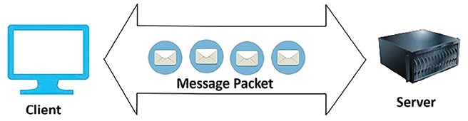

# ملاحظات عملکرد

آزمایش‌ها نشان می‌دهند که هر ثانیه تاخیر بارگذاری برنامه باعث ضرر قابل توجهی در درآمد یک سازمان می‌شود. بنابراین، عملکرد یک برنامه یکی از مهم ترین ویژگی های طراحی راه حل است که می تواند بر رشد پذیرش محصول شما تأثیر بگذارد.

در فصل قبل، الگوهای طراحی معماری راه حل های مختلفی را مورد بحث قرار دادیم که می توانند برای حل یک مشکل پیچیده تجاری مورد استفاده قرار گیرند. در این فصل، ما برخی از بهترین روش‌ها را برای بهینه‌سازی عملکرد برنامه شما که باید در هر لایه و با هر جزء معماری انجام شود، بررسی خواهیم کرد. شما یاد خواهید گرفت که چگونه فناوری مناسبی را برای لایه های مختلف معماری خود انتخاب کنید تا به طور مداوم عملکرد برنامه خود را بهبود ببخشید. ما در این فصل بر روی موضوعات زیر تمرکز خواهیم کرد:

- اصول طراحی برای معماری با کارایی بالا
- انتخاب فناوری برای بهینه سازی عملکرد
- ملاحظات عملکرد برای برنامه های کاربردی تلفن همراه
- ازمایش عملکرد
- مدیریت نظارت بر عملکرد

در پایان فصل، ویژگی‌های مهم بهبود عملکرد، مانند تأخیر، توان عملیاتی و همزمانی را درک خواهید کرد. شما می توانید تصمیمات بهتری در مورد انتخاب فناوری خود بگیرید که به شما کمک می کند عملکرد در لایه های مختلف معماری مانند محاسبات، ذخیره سازی، پایگاه داده و شبکه را بهبود بخشید.

# اصول طراحی برای معماری با کارایی بالا

کارایی عملکرد معماری بر استفاده از زیرساخت ها و منابع برنامه برای پاسخگویی به تقاضای فزاینده و تکامل تکنولوژیکی تمرکز دارد. کارایی عملکرد معماران را راهنمایی می‌کند تا سیستم‌هایی ایجاد کنند که نه تنها نیازهای فعلی را برآورده می‌کنند، بلکه به اندازه کافی چابک هستند تا مقیاس و تکامل پیدا کنند، و تضمین می‌کند که با تغییر انتظارات کاربر و چشم‌اندازهای تکنولوژیکی، عملکرد قوی و پاسخگو باقی می‌ماند. بیایید برخی از اصول طراحی حیاتی را برای بهینه سازی عملکرد حجم کاری شما بررسی کنیم.

## کاهش تاخیر

تأخیر می تواند به طور قابل توجهی بر پذیرش محصول شما تأثیر بگذارد زیرا کاربران به دنبال سریع ترین برنامه ها هستند. مهم نیست که کاربران شما در کجا قرار دارند. شما باید یک سرویس کارآمد و قابل اعتماد برای رشد محصول خود ارائه دهید. تأخیر اندازه گیری زمان صرف شده برای یک بسته داده از یک نقطه تعیین شده به نقطه دیگر است. به عبارت ساده تر، این تاخیر یا تاخیری است که بین شروع یک عمل و مشاهده پاسخ در دستگاه یا سیستم خود تجربه می کنید. این تاخیر می تواند تحت تاثیر عوامل مختلفی از جمله فاصله فیزیکی بین مشتری و سرور، سرعت رسانه انتقال (مانند کابل های فیبر نوری یا سیگنال های بی سیم) و میزان شلوغی شبکه باشد.

به عنوان مثال، در نظر بگیرید که در حال مرور یک وب سایت هستید. وقتی روی پیوندی کلیک می‌کنید یا دکمه‌ای را فشار می‌دهید، درخواستی از دستگاه شما به سرور وب‌سایت ارسال می‌شود. این سرور ممکن است در همان شهر شما واقع شده باشد یا ممکن است در نیمه راه در سراسر جهان باشد. زمانی که طول می کشد تا درخواست شما به سرور سفر کند، تا سرور آن درخواست را پردازش کند و سپس یک پاسخ را ارسال کند، چیزی است که ما به آن تاخیر می گوییم. ممکن است به تاخیر صفر دست یابید، اما هدف باید این باشد که زمان پاسخ در محدوده تحمل کاربران باشد.

همانطور که در نمودار زیر نشان داده شده است، سناریویی را تصور کنید که در آن 600 ** میلی ثانیه** (**ms**) طول می کشد تا یک پیام از دستگاه شما به سرور برسد (این ممکن است به دلیل فاصله فیزیکی مورد نیاز داده ها باشد. سفر یا به این دلیل که بسته های داده از طریق چندین دستگاه واسطه مانند روترها و سوئیچ ها هدایت می شوند. اگر سرور 900 میلی‌ثانیه دیگر طول بکشد تا درخواست را پردازش کند و پاسخ را ارسال کند، کل تأخیر تجربه شده 1.5 ثانیه (1500 میلی‌ثانیه) خواهد بود. در این مدت، ممکن است متوجه تاخیر در بارگذاری صفحه وب شوید.

شکل 6.1: تأخیر درخواست-پاسخ در مدل مشتری-سرور

اکنون، هر برنامه کاربردی برای داشتن مجموعه ای متنوع از کاربران جهانی در سراسر جهان به عنوان مصرف کننده، نیاز به دسترسی به اینترنت دارد. این کاربران بدون توجه به موقعیت جغرافیایی خود، انتظار ثبات در عملکرد را دارند. گاهی اوقات چالش برانگیز است زیرا انتقال داده ها از طریق شبکه از یک نقطه جهان به نقطه دیگر زمان می برد.

عوامل مختلفی مانند **رسانه انتقال شبکه**، **پرش روتر** و **انتشار** می توانند باعث تأخیر شبکه شوند. شرکت ها معمولاً از یک خط فیبر نوری برای راه اندازی اتصال بین شبکه شرکتی خود و ابر استفاده می کنند که به جلوگیری از ناهماهنگی کمک می کند. سازمان‌ها همچنین می‌توانند از **شبکه توزیع محتوا** (**CDN**) برای ذخیره داده‌های سنگین تصویر و ویدیو در نزدیکی مکان‌های کاربر برای کاهش تأخیر شبکه و بهبود عملکرد استفاده کنند. با مکان های لبه، استقرار بارهای کاری نزدیک به پایگاه کاربر آسان تر است.

علاوه بر مشکلات ناشی از شبکه، تأخیر می تواند در اجزای مختلف معماری رخ دهد. سرور محاسباتی شما ممکن است در سطح زیرساخت به دلیل مشکلات حافظه و پردازنده مشکلات تاخیر داشته باشد، جایی که انتقال داده بین CPU و RAM _ کند_ است. دیسک حدودا

n به دلیل کندی فرآیندهای خواندن و نوشتن، تاخیر دارند. تأخیر در **درایو دیسک سخت** (**HDD**) بستگی به زمان انتخاب بخش حافظه دیسک و قرار گرفتن آن بخش در زیر سر دیسک برای خواندن و نوشتن دارد. بخش حافظه دیسک محل فیزیکی داده ها در دیسک حافظه است. در یک HDD، داده ها در بخش های حافظه در طول عملیات نوشتن توزیع می شوند. از آنجایی که دیسک به طور مداوم در حال چرخش است، داده ها را می توان به صورت تصادفی نوشت. در طول عملیات خواندن، هد باید منتظر چرخش باشد تا آن را به بخش حافظه دیسک مناسب برساند.

در سطح پایگاه داده، تاخیر می تواند ناشی از خواندن و نوشتن کند داده ها به دلیل تنگناهای سخت افزاری یا پردازش کند پرس و جو باشد. کاهش بار پایگاه داده با توزیع داده ها با پارتیشن بندی و اشتراک گذاری می تواند تأخیر را کاهش دهد.

تأخیر کم به معنای _ توان عملیاتی بالاتر _ است، زیرا تأخیر و توان عملیاتی مستقیماً با هم مرتبط هستند، پس بیایید درباره توان عملیاتی بیشتر بدانیم.

## بهبود توان عملیاتی

توان عملیاتی شبکه به مقدار داده ای اشاره دارد که در یک بازه زمانی معین با موفقیت از طریق شبکه منتقل می شود. این معیار برای درک اینکه چگونه یک شبکه تحت شرایط و بارهای خاص عملکرد خوبی دارد، بسیار مهم است. توان عملیاتی می تواند تحت تأثیر عوامل مختلفی از جمله ظرفیت شبکه (پهنای باند)، کیفیت اتصال و پروتکل های مورد استفاده برای انتقال داده باشد. پهنای باند حداکثر مقدار داده ای را که می توان از طریق شبکه منتقل کرد تعیین می کند.

بازده و تأخیر رابطه مستقیمی دارند. تأخیر کم به معنای توان عملیاتی بالا است زیرا داده های بیشتری را می توان در زمان کمتری منتقل کرد. برای درک بهتر این موضوع، بیایید از قیاس زیرساخت های حمل و نقل یک کشور استفاده کنیم.

بیایید بگوییم که بزرگراه های دارای خطوط خطوط لوله شبکه هستند و اتومبیل ها بسته های داده هستند. فرض کنید یک بزرگراه 16 خط بین 2 شهر دارد. همه وسایل نقلیه نمی توانند در زمان مورد نظر به مقصد برسند. آنها ممکن است به دلیل ازدحام ترافیک، بسته شدن خطوط یا تصادفات تاخیر داشته باشند. در اینجا، تأخیر تعیین می‌کند که یک خودرو با چه سرعتی می‌تواند از شهری به شهر دیگر سفر کند، در حالی که توان عملیاتی به ما می‌گوید که چند خودرو می‌توانند به مقصد برسند. استفاده از پهنای باند کامل برای یک شبکه به دلیل خطاها و تراکم ترافیک چالش برانگیز است.

توان عملیاتی شبکه با مقدار داده ارسالی از طریق شبکه بر حسب بیت در ثانیه (bps) اندازه گیری می شود. پهنای باند شبکه حداکثر اندازه خط لوله شبکه است که می تواند پردازش شود. نمودار زیر میزان داده های منتقل شده بین مشتری و سرور را نشان می دهد:

شکل 6.2: توان عملیاتی در یک شبکه

علاوه بر شبکه، توان عملیاتی در سطح دیسک نیز قابل اجرا است. توان عملیاتی دیسک یک معیار مهم است که سرعت خواندن یا نوشتن داده ها را از یک دستگاه ذخیره سازی توصیف می کند. بر حسب **مگابایت در ثانیه** (**MB/s**) اندازه گیری می شود و تحت تاثیر دو عامل اصلی قرار می گیرد: **عملیات ورودی/خروجی در ثانیه** (**IOPS**) و اندازه از هر عملیات I/O (اندازه متوسط I/O).

فرمول محاسبه توان دیسک به صورت زیر است:

در اینجا تفکیک فرمول آمده است:

- **متوسط اندازه ورودی/خروجی** اندازه متوسط هر عملیات خواندن یا نوشتن است که بر حسب بایت اندازه گیری می شود. این می تواند بسته به حجم کار متفاوت باشد. به عنوان مثال، عملیات پایگاه داده ممکن است اندازه ورودی/خروجی کوچکتری در مقایسه با پخش فایل های ویدئویی بزرگ داشته باشد.
- **IOPS** (عملیات ورودی/خروجی در هر ثانیه) تعداد عملیات خواندن یا نوشتن را که ذخیره سازی می تواند در یک ثانیه انجام دهد را اندازه می گیرد. مقدار بالای IOPS نشان‌دهنده یک سیستم ذخیره‌سازی سریع است که قادر است بسیاری از عملیات را به صورت موازی انجام دهد.
- **Throughput بر حسب مگابایت بر ثانیه** اندازه گیری سرعت انتقال داده واقعی دستگاه ذخیره سازی را ارائه می دهد. این IOPS و اندازه متوسط ورودی/خروجی را با هم ترکیب می‌کند تا نشان دهد چه مقدار داده می‌تواند در هر ثانیه به داخل و خارج از سیستم ذخیره‌سازی منتقل شود.

برای تبدیل نتیجه به مگابایت بر ثانیه، حاصل ضرب متوسط اندازه ورودی/خروجی و IOPS را بر 1024\*1024 تقسیم می‌کنیم (زیرا 1024 بایت در کیلوبایت و 1024 کیلوبایت در مگابایت وجود دارد).

با توجه به IOPS دیسک 20000 و اندازه ورودی/خروجی 4 کیلوبایت (که 4 \* 1024 بایت = 4096 بایت است)، می توانید توان عملیاتی را به صورت زیر محاسبه کنید:

1. ابتدا اندازه ورودی/خروجی را از بایت به مگابایت تبدیل کنید:
   - 
2. سپس در IOPS ضرب کنید تا توان عملیاتی را بر حسب مگابایت بر ثانیه بدست آورید:
   - توان عملیاتی = اندازه ورودی/خروجی به مگابایت × IOPS
   - توان عملیاتی = 0.00390625 مگابایت × 20000
   - توان عملیاتی = 78.125 مگابایت بر ثانیه

بنابراین، با IOPS دیسک 20000 و اندازه ورودی/خروجی 4 کیلوبایت، خروجی تقریباً 78.125 مگابایت بر ثانیه است. این محاسبه میزان کل داده‌هایی را که در این شرایط می‌توان از روی دیسک خواند یا روی دیسک نوشت، نشان می‌دهد.

در سطح سیستم عامل، توان عملیاتی با مقدار داده ای که بین CPU و RAM در هر ثانیه منتقل می شود تعیین می شود. در سطح پایگاه داده، توان عملیاتی با تعداد تراکنش هایی که یک پایگاه داده می تواند در هر ثانیه پردازش کند، تعیین می شود. در سطح برنامه، کد شما باید تراکنش‌هایی را مدیریت کند که می‌توانند هر ثانیه با مدیریت حافظه برنامه پردازش شوند

y با کمک مدیریت جمع آوری زباله و استفاده کارآمد از کش حافظه.

وقتی به تأخیر، توان عملیاتی و پهنای باند نگاه می کنید، فاکتور دیگری به نام همزمانی وجود دارد که برای اجزای مختلف معماری اعمال می شود و به بهبود عملکرد برنامه کمک می کند. بیایید در مورد همزمانی بیشتر بدانیم.

## مدیریت همزمان

همزمانی نقش حیاتی در طراحی برنامه های کاربردی مقیاس پذیر و کارآمد دارد. این به یک برنامه اجازه می دهد تا چندین کار را به طور همزمان انجام دهد و از منابع سیستم بهتر استفاده کند و عملکرد کلی برنامه را بهبود بخشد. با اجرای همزمان، توسعه دهندگان می توانند اطمینان حاصل کنند که برنامه های کاربردی آنها می توانند چندین عملیات را به طور همزمان انجام دهند بدون اینکه منتظر بمانند تا یک کار قبل از شروع کار دیگر تکمیل شود. این امر به ویژه در برنامه‌های کاربردی وب که به هزاران کاربر خدمات رسانی می‌کنند و در وظایف پردازش داده‌ای که باید حجم زیادی از داده‌ها را به طور کارآمد مدیریت کنند، مهم است. پیاده‌سازی همزمانی می‌تواند منجر به بهبود قابل توجهی در زمان پاسخ‌دهی و توان عملیاتی شود و تجربه کاربر و توانایی برنامه در مقیاس‌سازی را افزایش دهد.

موازی سازی یکی دیگر از مفاهیم مهم در طراحی نرم افزار است که با اجرای چندین عملیات به طور همزمان در پردازنده ها یا هسته های مختلف، همزمانی را تکمیل می کند. در حالی که همزمانی شامل انجام همزمان چندین کار است (به عنوان مثال، چند وظیفه‌ای در یک CPU تک هسته‌ای، که در آن وظایف به سرعت تغییر می‌کنند تا ظاهر اجرای هم‌زمان به نظر برسد)، موازی‌سازی با انجام واقعی چندین عملیات به طور همزمان، این امر را یک گام فراتر می‌برد. از طریق پردازنده های چند هسته ای یا سیستم های توزیع شده. این رویکرد با تقسیم کار به تکه های کوچکی که می توانند به صورت موازی پردازش شوند، زمان پردازش کارهای محاسباتی را به طور قابل توجهی افزایش می دهد. برنامه‌هایی که مجموعه داده‌های بزرگ، محاسبات پیچیده یا وظایفی را که می‌توان به واحدهای مستقل تقسیم کرد، پردازش می‌کنند، به میزان زیادی از موازی‌سازی سود می‌برند و به توان عملیاتی و کارایی بالاتری دست می‌یابند.

همانطور که در نمودار زیر نشان داده شده است، همزمانی مانند یک سیگنال چراغ راهنمایی است که محل جریان ترافیک بین هر چهار خط را کنترل می کند. از آنجایی که یک رشته واحد وجود دارد که شما باید تمام ترافیک را در امتداد آن رد کنید، پردازش در خطوط دیگر باید متوقف شود در حالی که ترافیک در یک خط در فرآیند پاکسازی است. در مورد موازی، یک خط موازی در دسترس است و همه خودروها می توانند به صورت موازی بدون قطع یکدیگر حرکت کنند، همانطور که در نمودار زیر نشان داده شده است:

شکل 6.3: همزمانی در مقابل موازی

پایگاه داده همیشه نقطه مرکزی طراحی معماری است. همزمانی نقش اساسی در مدیریت داده ایفا می کند، زیرا پایگاه داده باید توانایی پاسخگویی به چندین درخواست را به طور همزمان داشته باشد. همزمانی پایگاه داده پیچیده‌تر است زیرا ممکن است یک کاربر سعی در خواندن یک رکورد داشته باشد در حالی که کاربر دیگری همزمان آن را به‌روزرسانی می‌کند. پایگاه داده تنها زمانی باید اجازه دهد که داده ها به طور کامل ذخیره شوند. قبل از اینکه کاربر دیگری بخواهد آن را به روز کند، اطمینان حاصل کنید که داده ها کاملاً متعهد هستند.

ذخیره سازی می تواند عملکرد را به طور قابل توجهی بهبود بخشد. بیایید در مورد انواع مختلف حافظه پنهان در معماری بیاموزیم.

## استفاده از کش

در _فصل 4_، _ الگوهای طراحی معماری راه حل_، نحوه اعمال کش در سطوح مختلف معماری را در بخش _معماری مبتنی بر کش_ یاد گرفتید. ذخیره سازی به بهبود عملکرد برنامه به طور قابل توجهی کمک می کند. اگرچه با افزودن یک موتور حافظه پنهان خارجی و فناوری مانند **شبکه تحویل محتوا** (**CDN**) در مورد الگوهای طراحی مختلف برای اعمال در حافظه پنهان یاد گرفته اید، اما درک این نکته ضروری است که تقریباً هر مؤلفه برنامه و زیرساخت دارای مکانیزم کش است. استفاده از مکانیسم کش در هر لایه می تواند به کاهش تاخیر و بهبود عملکرد برنامه کمک کند.

CPU حافظه پنهان سخت افزاری خود را در سطح سرور دارد که باعث کاهش تأخیر هنگام دسترسی به داده ها از حافظه اصلی می شود. حافظه پنهان CPU شامل دستورالعمل ها و کش داده ها است. کش داده کپی هایی از داده های پرکاربرد را ذخیره می کند. کش نیز در سطح دیسک استفاده می شود، اما توسط نرم افزار سیستم عامل (معروف به **صفحه کش**) مدیریت می شود. با این حال، کش CPU به طور کامل توسط سخت افزار مدیریت می شود. حافظه پنهان دیسک از ذخیره سازی ثانویه مانند HDD یا **درایو حالت جامد** (**SSD**) منشا می گیرد. داده‌هایی که اغلب استفاده می‌شوند در بخش استفاده‌نشده از حافظه اصلی ذخیره می‌شوند (یعنی RAM به عنوان کش صفحه، که منجر به دسترسی سریع‌تر به محتوا می‌شود).

اغلب، پایگاه های داده دارای مکانیزم کش هستند که نتایج را از پایگاه داده ذخیره می کند تا سریعتر پاسخ دهند. آنها یک کش داخلی دارند که داده ها را بر اساس الگوهای استفاده شما در حافظه پنهان آماده می کند. آنها همچنین دارای یک کش کوئری هستند که در صورت درخواست بیش از یک بار، داده ها را در حافظه سرور اصلی (RAM) ذخیره می کند. در صورت تغییر هر گونه داده در جدول، کش کوئری پاک می شود. اگر حافظه سرور تمام شود، قدیمی ترین نتیجه پرس و جو برای ایجاد فضا حذف می شود.

شما یک کش DNS در سطح شبکه دارید که نام دامنه وب و corr را ذخیره می کند

پاسخ به آدرس IP به صورت محلی روی سرور. اگر دوباره به همان نام دامنه وب سایت مراجعه کنید، ذخیره DNS امکان جستجوی سریع DNS را فراهم می کند. سیستم عامل کش DNS را مدیریت می کند و شامل تمام بازدیدهای اخیر وب سایت است. شما در مورد مکانیسم های کش سمت سرویس گیرنده مانند **کش مرورگر** و موتورهای ذخیره سازی مانند **Memcached** و **Redis** در _فصل 4_، _ الگوهای طراحی معماری راه حل_ آشنا شدید.

در این بخش در مورد اصول طراحی برای معماری با کارایی بالا، با عوامل طراحی اصلی مانند تأخیر، توان عملیاتی، همزمانی و حافظه پنهان آشنا شدید که برای بهینه‌سازی عملکرد معماری باید به آنها توجه شود. هر جزء از معماری (چه یک شبکه در سطح سرور یا یک برنامه کاربردی در سطح پایگاه داده) دارای درجه خاصی از تاخیر و یک مسئله همزمانی است که باید رسیدگی شود.

شما باید برنامه خود را برای عملکرد مورد نظر طراحی کنید زیرا بهبود عملکرد هزینه دارد. ویژگی های بهینه سازی عملکرد ممکن است از برنامه ای به برنامه دیگر متفاوت باشد. معماری راه‌حل باید تلاش را بر این اساس هدایت کند - برای مثال، یک برنامه معاملات سهام نمی‌تواند حتی تاخیر زیر میلی‌ثانیه‌ای را تحمل کند. از سوی دیگر، یک وب سایت تجارت الکترونیک می تواند با تاخیر چند ثانیه ای زندگی کند. برای غلبه بر چالش های عملکرد، بیایید در مورد انتخاب فناوری برای سطوح مختلف معماری بیاموزیم.

# انتخاب فناوری برای بهینه سازی عملکرد

در _فصل 4_ و _فصل 5_، با الگوهای طراحی مختلف، از جمله الگوهای میکروسرویس، رویداد محور، مبتنی بر حافظه پنهان و الگوهای بدون حالت آشنا شدید. یک سازمان ممکن است ترکیبی از این الگوهای طراحی را بسته به نیازهای طراحی راه حل خود انتخاب کند. بسته به حجم کاری خود می توانید چندین رویکرد برای طراحی معماری داشته باشید. هنگامی که استراتژی خود را نهایی کردید و شروع به پیاده سازی راه حل خود کردید، گام بعدی بهینه سازی برنامه است. برای بهینه سازی برنامه خود، باید داده ها را با انجام آزمایش بار و تعیین معیار مطابق با الزامات عملکرد برنامه خود جمع آوری کنید.

بهینه سازی عملکرد یک فرآیند بهبود مستمر است که در آن شما باید از استفاده بهینه از منابع از ابتدای طراحی راه حل تا پس از راه اندازی برنامه آگاه باشید. شما باید منابع مناسب را بر اساس حجم کاری انتخاب کنید یا پیکربندی برنامه و زیرساخت را تنظیم کنید. به عنوان مثال، ممکن است یک پایگاه داده NoSQL را برای ذخیره وضعیت نشست برنامه خود و ذخیره تراکنش ها در یک پایگاه داده رابطه ای انتخاب کنید.

برای اهداف تجزیه و تحلیل و گزارش، می توانید پایگاه داده تولید خود را با بارگیری داده ها از پایگاه داده برنامه در راه حل های انبار داده و ایجاد گزارش از آنجا بارگیری کنید.

در مورد سرورها می توانید ماشین مجازی یا کانتینرها را انتخاب کنید. شما می توانید یک رویکرد کاملاً بدون سرور برای ساخت و استقرار کد برنامه خود داشته باشید. صرف نظر از رویکرد و حجم کاری برنامه شما، باید نوع منبع اصلی را انتخاب کنید: محاسبات، ذخیره سازی، پایگاه داده یا شبکه. بیایید با جزئیات بیشتری به انتخاب این نوع منابع برای بهینه سازی عملکرد نگاه کنیم.

## انتخاب محاسباتی

در این بخش، استفاده از عبارت _compute_ را به جای _server_ مشاهده خواهید کرد، زیرا امروزه استقرار نرم افزارها به سرورها محدود نمی شود. یک ارائه دهنده ابر عمومی مانند AWS دارای پیشنهادات بدون سرور است، جایی که برای اجرای برنامه خود نیازی به سرور ندارید. یکی از محبوب ترین پیشنهادات FaaS AWS Lambda است. مانند AWS Lambda، سایر ارائه‌دهندگان ابر عمومی محبوب راه‌حل‌هایی را در فضای FaaS ارائه می‌کنند - برای مثال، Microsoft Azure دارای توابع Azure و GCP دارای توابع ابری Google است.

با این حال، سازمان‌ها همچنان انتخاب پیش‌فرض سرورهایی با ماشین‌های مجازی را دارند. کانتینرها نیز با افزایش نیاز به اتوماسیون و استفاده از منابع محبوب می شوند. کانتینرها به انتخاب ارجح تبدیل می شوند، به ویژه در زمینه استقرار برنامه های میکروسرویس.

انتخاب بهینه محاسبات - چه بخواهید نمونه های سرور، کانتینرها یا بدون سرور را انتخاب کنید - به مورد استفاده برنامه شما بستگی دارد. بیایید به انتخاب های مختلف محاسباتی نگاه کنیم.

جدول زیر تصویری از تفاوت‌های بین پردازنده‌های مرکزی، **واحدهای پردازش گرافیک** (**GPU**)، **آرایه‌های دروازه قابل برنامه‌ریزی میدانی** (**FPGA**) و **یکپارچه‌شده ویژه برنامه را ارائه می‌کند. مدارها** (**ASIC**)، با تمرکز بر کاربردهای اولیه، سهولت برنامه نویسی، ساختارهای اصلی، پیامدهای هزینه، و مناسب بودن آنها برای پردازش موازی، از جمله ویژگی های دیگر. بیایید ابتدا هر یک از این اصطلاحات را تعریف کنیم:

- **CPU**: پردازنده اولیه در یک کامپیوتر که اکثر عملیات پردازش داده را انجام می دهد، که اغلب به عنوان "مغز" کامپیوتر شناخته می شود.
- **GPU**: مدار الکترونیکی تخصصی طراحی شده برای دستکاری و تغییر سریع حافظه برای تسریع در ایجاد تصاویر در بافر فریم که برای خروجی به نمایشگر در نظر گرفته شده است.
- **FPGA**: مدار مجتمع طراحی شده برای پیکربندی توسط مشتری یا طراح پس از manufa

cturing - بنابراین "قابل برنامه ریزی در میدان"

- **ASIC**: تراشه ای که برای یک کاربرد خاص سفارشی شده است، نه برای استفاده عمومی

ممکن است از یک یا چند مورد از این گزینه های واحد پردازش استفاده کنید زیرا حجم کاری شما متفاوت است.

| ویژگی                  | سی پی یو                                      | پردازنده گرافیکی                                    | FPGA                                          | ASIC                                               |
| ---------------------- | --------------------------------------------- | --------------------------------------------------- | --------------------------------------------- | -------------------------------------------------- |
| **استفاده اولیه**      | برنامه های کاربردی همه منظوره                 | پردازش گرافیکی، موارد استفاده از داده های بزرگ      | سخت افزار قابل برنامه ریزی برای کارهای خاص    | مدارهای مجتمع سفارشی برای کاربردهای خاص            |
| **سهولت برنامه نویسی** | آسان                                          | نیاز به دانش کتابخانه های خاص (به عنوان مثال، CUDA) | پیچیده، نیازمند برنامه نویسی سخت افزاری       | N/A (سخت افزار به صورت سفارشی طراحی شده است)       |
| **چند وظیفه**          | بله                                           | محدود شده توسط تمرکز طراحی بر موازی                 | بله با پیکربندی مجدد                          | خیر تک منظوره                                      |
| **تطبیق پذیری**        | بالا                                          | متوسط                                               | متوسط، قابل تنظیم مجدد برای وظایف             | کم، ویژه برنامه                                    |
| **اندازه گیری عملکرد** | گیگاهرتز (میلیاردها سیکل در ثانیه)            | TFLOP (تریلیون ها عملیات ممیز شناور در ثانیه)       | به طور معمول در Flops اندازه گیری نمی شود     | بهینه شده برای مصرف انرژی و عملکرد                 |
| **ساختار هسته**        | چند هسته بزرگ                                 | هزاران هسته کوچک                                    | عناصر منطقی قابل تنظیم مجدد                   | N/A (طراحی سفارشی)                                 |
| **پردازش موازی**       | محدود                                         | بالا، با **پردازش انبوه موازی** (**MPP**)           | دارای MPP، قابل تنظیم به عنوان CPU            | بهینه شده برای برنامه های خاص                      |
| **هزینه**              | کم                                            | بالاتر از CPU                                       | بالاتر از CPU و GPU، نیاز به سفارشی سازی دارد | بالاترین، به دلیل طراحی سفارشی و چرخه توسعه طولانی |
| **مصرف برق**           | متوسط                                         | بالا                                                | کم                                            | بهینه شده برای برنامه                              |
| **انعطاف پذیری**       | همه کاره برای طیف وسیعی از برنامه های کاربردی | ویژه برنامه های کاربردی محاسباتی                    | قابل تنظیم مجدد اما نیاز به توسعه دارد        | رفع شد، برای تغییرات نیاز به طراحی مجدد دارد       |
| **چرخه توسعه**         | کوتاه                                         | کوتاه تا متوسط                                      | طولانی، به دلیل نیاز به سفارشی سازی           | طولانی ترین، طراحی مجدد در سطح سخت افزار مورد نیاز |

جدول 6.1: مقایسه انواع مختلف پردازنده

جدول قبل انواع پردازش را با هم مقایسه می کند. ASIC کارآمدترین است اما چرخه توسعه طولانی برای پیاده سازی دارد. ASIC ها بهینه ترین عملکرد را ارائه می دهند اما کمترین انعطاف را برای استفاده مجدد دارند، در حالی که CPU ها بسیار منعطف هستند و می توانند در بسیاری از موارد استفاده مناسب باشند.

امروزه CPU به یک کالا تبدیل شده است و در همه جا برای دستگاه های همه منظوره برای پایین نگه داشتن هزینه ها استفاده می شود. GPU به دلیل برنامه های فشرده محاسباتی معروف شده است و FPGA به اولین انتخابی تبدیل شده است که در آن عملکرد سفارشی تر مورد نیاز است. این انتخاب های پردازشی از ارائه دهندگان ابر عمومی مانند AWS در دسترس هستند.

در این بخش با محبوب ترین انتخاب های محاسباتی آشنا شدید.

همچنین ممکن است در مورد انواع دیگری از پردازنده ها مانند **واحد پردازش شتاب** (**APU**) بشنوید. APU ترکیبی از CPU، GPU و **پردازنده سیگنال دیجیتال** (**DSP**) است که برای تجزیه و تحلیل سیگنال های آنالوگ بهینه شده است و به پردازش داده ها در زمان واقعی با سرعت بالا نیاز دارد.

بیایید در مورد سایر کانتینرهای محبوب نوع محاسباتی که به دلیل توانایی آنها در بهینه سازی استفاده از منابع در ماشین مجازی به سرعت در حال محبوبیت هستند بیشتر بیاموزیم.

### کار با کانتینرها

در _فصل 4_، _ الگوهای طراحی معماری راه حل_، در قسمتی با عنوان _استقرار اپلیکیشن با کانتینر_ با مزایای استقرار کانتینر آشنا شدید. استفاده از کانتینرها به دلیل سهولت اتوماسیون و بهره وری استفاده از منابع، تبدیل به یک هنجار برای استقرار برنامه های کاربردی میکروسرویس پیچیده شده است. پلتفرم های مختلفی برای شرکت در دسترس است

استقرار ntainer

به دلیل محبوبیت و قابلیت‌های مستقل از پلتفرم، کانتینرها به اولین انتخاب برای ساخت پلتفرم‌های ابری آگنوستیک تبدیل شده‌اند. می توانید کانتینرها را در مرکز داده داخلی خود مستقر کنید و آنها را از طریق ابر خود مدیریت کنید. همچنین، می‌توانید یک رویکرد جابه‌جایی را در پیش بگیرید و یک کانتینر را از داخل محل به فضای ابری بدون نیاز به ایجاد هیچ تغییری منتقل کنید.

شما می توانید یک پلتفرم چند ابری با یک کانتینر بسازید، و اکنون، هر فروشنده بزرگ ابر عمومی ابزارهایی را برای مدیریت یک محیط کانتینری که در چندین پلتفرم پخش شده است، فراهم می کند. به عنوان مثال، AWS **سرویس کانتینر الاستیک** (**ECS**) **هرجا** را ارائه می‌کند و به شما امکان می‌دهد تا بارهای کاری کانتینر را در زیرساخت‌های مدیریت شده توسط مشتری به راحتی اجرا و مدیریت کنید. به طور مشابه، GCP **Google Anthos** را ارائه می‌کند که به شما امکان مدیریت کانتینر در داخل محل و سایر پلتفرم‌های ابری را می‌دهد. بیایید در مورد برخی از محبوب ترین انتخاب ها در منطقه کانتینر، تفاوت های آنها و نحوه کار آنها با یکدیگر بیاموزیم.

#### داکر

Docker یکی از پرتقاضاترین فناوری هاست. این به شما امکان می دهد یک برنامه کاربردی و وابستگی های مربوط به آن را با هم به عنوان یک ظرف بسته بندی کنید و آن را در هر پلتفرم سیستم عامل مستقر کنید. داکر قابلیت‌های مستقل از پلتفرم را برای یک برنامه نرم‌افزاری فراهم می‌کند و فرآیند کلی توسعه، آزمایش و استقرار نرم‌افزار را ساده و در دسترس می‌سازد.

کانتینرهای Docker به شما کمک می کنند تا یک برنامه کاربردی چند لایه پیچیده تر بسازید. به عنوان مثال، شما باید سرور برنامه، پایگاه داده و صف پیام را با هم اجرا کنید. در این صورت می توانید با استفاده از تصاویر مختلف Docker آنها را در کنار هم اجرا کنید و بین آنها ارتباط برقرار کنید. هر یک از این لایه‌ها ممکن است نسخه‌های کتابخانه‌ای اصلاح‌شده داشته باشند و داکر به آن‌ها اجازه می‌دهد بدون درگیری روی یک ماشین محاسباتی اجرا شوند.

تصاویر ظرف Docker از یک سیستم به سیستم دیگر از طریق یک شبکه محلی یا در سراسر اینترنت با استفاده از Docker Hub قابل حمل هستند. شما می توانید کانتینر خود را با استفاده از مخزن کانتینر Docker Hub مدیریت و توزیع کنید. فرض کنید تغییراتی در تصویر Docker ایجاد کرده اید که باعث ایجاد مشکلات زیست محیطی می شود. در این صورت، بازگشت به نسخه کاری تصویر ظرف آسان است و عیب‌یابی کلی را آسان‌تر می‌کند.

هنگام استفاده از Docker، تیم توسعه یک برنامه کاربردی می‌سازد و آن را با وابستگی‌های مورد نیاز در یک تصویر ظرف بسته بندی می‌کند. این تصویر برنامه در یک کانتینر در میزبان داکر اجرا می شود. همانطور که شما کد را در یک مخزن کد مانند GitHub مدیریت می کنید، به همین ترتیب، یک تصویر Docker نیز باید در یک رجیستری ذخیره شود. Docker Hub یک رجیستری عمومی است و سایر فروشندگان ابر عمومی رجیستری های خود را ارائه می کنند، مانند **AWS** **Elastic Container Registry** (**ECR**) و **Azure Container Registry**. علاوه بر این، می توانید یک رجیستری خصوصی در محل برای تصاویر Docker خود داشته باشید.

ارائه دهندگان ابر عمومی مانند AWS پلتفرم های مدیریت کانتینر مانند **Amazon ECS** را ارائه می دهند. مدیریت کانتینر، کانتینرهای داکر را در بالای ماشین مجازی ابری، آمازون EC2 مدیریت می کند. AWS همچنین یک گزینه بدون سرور برای استقرار کانتینر با استفاده از آمازون Fargate ارائه می دهد، که در آن می توانید کانتینرها را بدون تهیه ماشین های مجازی مستقر کنید.

برنامه های کاربردی پیچیده سازمانی بر اساس میکروسرویس هایی ساخته شده اند که ممکن است چندین کانتینر را در بر گیرند. مدیریت کانتینرهای مختلف Docker به عنوان بخشی از یک برنامه می تواند پیچیده باشد. Kubernetes به حل چالش های محیط چند کانتینری کمک می کند. بیایید درباره Kubernetes بیشتر بدانیم.

#### Kubernetes

Kubernetes در مدیریت و سازماندهی چندین کانتینر در تنظیمات تولید برتر است و به عنوان یک سیستم ارکستراسیون کانتینر جامع عمل می کند. از میزبانی کانتینرهای Docker بر روی سرورهای فیزیکی یا گره‌های ماشین مجازی، که معمولاً به عنوان گره‌های کارگر نامیده می‌شوند، پشتیبانی می‌کند. Kubernetes به طور کارآمدی عملیات را در سراسر مجموعه ای از این گره ها هماهنگ می کند، وظایفی مانند استقرار، مقیاس بندی، و مدیریت برنامه های کاربردی کانتینری را خودکار می کند، بنابراین عملکرد نرم و قابل اعتماد برنامه را در سراسر زیرساخت تضمین می کند.

Kubernetes با جایگزینی ظروف بدون پاسخ در صورت بروز هر گونه خطای برنامه، برنامه شما را به خود ترمیم می کند. همچنین قابلیت های مقیاس افقی و قابلیت استقرار آبی-سبز را برای جلوگیری از خرابی فراهم می کند. Kubernetes بار ترافیک ورودی کاربر را بین کانتینرها توزیع می کند و فضای ذخیره سازی به اشتراک گذاشته شده توسط کانتینرهای مختلف را مدیریت می کند.

نمودار زیر نشان می دهد که Kubernetes و Docker به خوبی با هم کار می کنند تا برنامه نرم افزاری شما را هماهنگ کنند. Kubernetes ارتباط شبکه بین گره های کارگر و کانتینرهای Docker را مدیریت می کند:

شکل 6.4: Docker و Kubernetes

Docker به عنوان یک قطعه جداگانه از برنامه کار می کند و Kubernetes از ارکستراسیون مراقبت می کند تا مطمئن شود که همه این قطعات مطابق طراحی با هم کار می کنند. خودکار کردن استقرار و مقیاس بندی کلی برنامه با Kubernetes آسان است. در Docker، کانتینرها در گره ها میزبانی می شوند و هر کانتینر داکر در یک گره واحد فضای IP یکسانی را به اشتراک می گذارد. در داکر، شما

باید اتصالات بین کانتینرها را با مدیریت هرگونه تضاد IP مدیریت کند. Kubernetes با داشتن یک نمونه اولیه که تمام گره‌های میزبان Pods را ردیابی می‌کند، این مشکل را حل می‌کند.

گره اصلی Kubernetes یک آدرس IP اختصاص می‌دهد و یک ذخیره‌سازی کلید-مقدار برای پیکربندی کانتینر و یک **kubelet** برای مدیریت کانتینرها میزبانی می‌کند. Kubelet "عامل گره" اولیه است که روی هر گره اجرا می شود و تضمین می کند که کانتینرهای تعریف شده در Pods شروع شده و به کار ادامه می دهند. کانتینرهای Docker در **Pods** گروه بندی می شوند که آدرس IP یکسانی دارند. کل این تنظیمات ** خوشه Kubernetes ** نامیده می شود.

نگهداری Kubernetes پیچیده است. ارائه دهندگان ابر ابزارهای مدیریتی خود را برای آن فراهم می کنند. به عنوان مثال، AWS Amazon **Elastic Kubernetes Service** (**EKS**) را برای ساده سازی مدیریت خوشه Kubernetes ارائه می دهد. OpenShift یکی دیگر از توزیع‌های Kubernetes است که توسط Red Hat مدیریت می‌شود و به عنوان یک **پلتفرم به عنوان سرویس** (**PaaS**) ارائه می‌شود. به طور مشابه، Microsoft Azure **سرویس Kubernetes Azure** (**AKS**) را ارائه می دهد و GCP **Google Kubernetes Engine** (**GKE**) را ارائه می دهد که راهی ساده برای استقرار، مقیاس و مدیریت Kubernetes ارائه می دهد. بطور خودکار.

به طور کلی، کانتینرها یک لایه مجازی سازی را به کل زیرساخت برنامه اضافه می کنند. در حالی که آنها در استفاده از منابع مفید هستند، اگر به تاخیر بسیار کم نیاز دارد، یک ماشین فیزیکی بدون فلز را برای استقرار برنامه خود انتخاب کنید.

### بدون سرور

در سال‌های اخیر، محاسبات بدون سرور به دلیل محبوبیت راه‌حل‌های ابر عمومی از سوی ارائه‌دهندگان ابری مانند آمازون، گوگل و مایکروسافت امکان‌پذیر شده است. محاسبات بدون سرور به توسعه دهندگان این امکان را می دهد که روی توسعه کد و برنامه های کاربردی خود بدون نگرانی در مورد تامین، پیکربندی و مقیاس بندی زیرساخت های اساسی تمرکز کنند. راه‌حل‌های بدون سرور، تصمیمات مدیریت سرور و زیرساخت‌ها را از توسعه‌دهندگان انتزاعی می‌کنند و به آن‌ها اجازه می‌دهند بر حوزه تخصص خود و مشکل تجاری که در تلاش برای حل آن هستند تمرکز کنند. محاسبات بدون سرور مفهوم نسبتاً جدید **function as a service** (**FaaS**) را به ارمغان می آورد.

پیشنهادات FaaS از AWS Lambda، Microsoft Azure Functions و Google Cloud Functions در دسترس هستند. برای مثال، می‌توانید کد خود را در ویرایشگر ابری بنویسید و AWS Lambda زیرساخت محاسباتی زیر آن را برای اجرا و مقیاس‌بندی عملکرد شما مدیریت می‌کند. می‌توانید معماری مبتنی بر رویداد یا میکروسرویس‌های RESTful را با افزودن یک نقطه پایانی API با استفاده از Amazon API Gateway و توابع AWS Lambda طراحی کنید. Amazon API Gateway یک سیستم ابری نگهداری شده است که APIهای RESTful و WebSocket APIها را به عنوان فرانت‌اند برای توابع Lambda اضافه می‌کند و ارتباط بی‌درنگ بین برنامه‌ها را امکان‌پذیر می‌سازد. شما می توانید میکروسرویس خود را به کارهای کوچکی تقسیم کنید که می توانند به طور خودکار و مستقل مقیاس شوند.

علاوه بر تمرکز روی کد خود، هرگز مجبور نیستید برای منابع غیرفعال با مدل FaaS هزینه کنید. به جای مقیاس بندی کل سرویس خود، می توانید عملکردهای مورد نیاز را به طور مستقل با در دسترس بودن داخلی و تحمل خطا مقیاس کنید. با این حال، اگر هزاران ویژگی برای هماهنگی دارید، این می‌تواند دلهره‌آور باشد و پیش‌بینی هزینه مقیاس‌بندی خودکار می‌تواند مشکل باشد. برای زمان‌بندی کارها، پردازش درخواست‌های وب و صف‌بندی پیام‌ها عالی است.

در این بخش، با انتخاب های محاسباتی مختلفی که می توانید برای بهینه سازی عملکرد انتخاب کنید، آشنا شده اید. ما به نمونه های سرور، کانتینرها و گزینه های بدون سرور نگاه کردیم. شما باید خدمات محاسباتی مناسب را برای نیازهای برنامه خود انتخاب کنید. هیچ قانونی شما را مجبور به انتخاب نوع خاصی از محاسبات نمی کند. همه چیز به انتخاب فناوری سازمان شما، سرعت نوآوری و ماهیت برنامه نرم افزار مربوط می شود.

با این حال، شما می توانید به طور کلی برای یک برنامه یکپارچه به یک ماشین مجازی یا بدون فلز متصل شوید و برای میکروسرویس های پیچیده، می توانید ظروف را انتخاب کنید. برای برنامه‌ریزی ساده کار یا برنامه‌های مبتنی بر رویداد، توابع بدون سرور یک انتخاب واضح هستند. بسیاری از سازمان ها برنامه های پیچیده ای را به طور کامل بر روی محاسبات بدون سرور ساخته اند که به آنها کمک کرد تا هزینه ها را کاهش دهند و بدون مدیریت زیرساخت به دسترسی بالا دست یابند.

بیایید در مورد یکی دیگر از جنبه های مهم زیرساخت شما و اینکه چگونه می تواند به شما در بهینه سازی عملکرد کمک کند، بیاموزیم.

## انتخاب ذخیره سازی

Storage نقشی محوری در عملکرد هر برنامه نرم افزاری ایفا می کند و مفهوم **وابستگی داده** در بحث ذخیره سازی برای یک برنامه بسیار مهم است. قرابت داده به قرار دادن استراتژیک داده ها در مجاورت برنامه مصرف کننده با هدف کاهش تأخیر، بهبود عملکرد و اطمینان از بازیابی کارآمد داده ها اشاره دارد.

در یک محیط ابری چند ابری یا ترکیبی، این تصور که تمام فضای ذخیره سازی باید در مجاورت سرور برنامه باشد، همیشه صادق نیست. سیستم‌های توزیع‌شده مدرن به گونه‌ای طراحی شده‌اند که به داده‌ها اجازه می‌دهند در مکان‌های مختلف، چه در محل و چه در ارائه‌دهندگان ابری مختلف، ساکن شوند، در حالی که همچنان سطوح قابل قبول تأخیر و عملکرد را حفظ می‌کنند. این flexibi

برای سازمان‌هایی که از خدمات ابری مختلف استفاده می‌کنند یا برای آن‌هایی که الزامات اقامت داده‌ای دارند که داده‌های خاصی را مجبور می‌کنند در محدوده‌های جغرافیایی یا حوزه قضایی خاص باقی بمانند، بسیار مهم است.

با این حال، تصمیم گیری در مورد محل ذخیره داده ها - چه نزدیک به سرویس برنامه یا در یک مکان متفاوت - مستلزم بررسی دقیق چندین عامل است:

- ** الزامات تأخیر **: تأخیر قابل قبول بین یک درخواست و یک پاسخ می تواند به طور قابل توجهی بر محل ذخیره داده ها تأثیر بگذارد. برنامه‌هایی که نیاز به دسترسی بلادرنگ به داده‌ها دارند ممکن است به راه‌حل‌های ذخیره‌سازی با حداقل تأخیر نیاز داشته باشند، که اغلب به نزدیکی فیزیکی یا شبکه دلالت دارد.
- **حاکمیت و انطباق داده**: الزامات قانونی و مقرراتی ممکن است تعیین کند که داده ها کجا ذخیره و پردازش شوند، به این معنی که معماری باید با الزامات انطباق مطابقت داشته باشد.
- ** ملاحظات هزینه **: ذخیره و دسترسی به داده ها در مکان ها یا ابرهای مختلف می تواند هزینه های اضافی را به همراه داشته باشد. متعادل کردن نیازهای عملکرد با محدودیت‌های بودجه ضروری است، به‌ویژه زمانی که هزینه‌های خروج داده در محیط‌های ابری در نظر گرفته می‌شود.
- **پهنای باند و توان عملیاتی**: پهنای باند شبکه و توان عملیاتی موجود بین سرور برنامه و محل ذخیره داده ها می تواند بر عملکرد تأثیر بگذارد. پهنای باند و توان عملیاتی بالا می‌تواند برخی از مشکلات تأخیر را کاهش دهد و گزینه‌های ذخیره‌سازی داده‌ها را انعطاف‌پذیرتر کند.
- **الگوهای دسترسی به داده**: درک اینکه برنامه شما چگونه به داده ها دسترسی پیدا می کند (به عنوان مثال، داده هایی که به ندرت به آنها دسترسی دارند) می تواند به شما در انتخاب مکان ذخیره سازی مناسب کمک کند. داده‌هایی که اغلب به آن‌ها دسترسی پیدا می‌کنند ممکن است از نزدیک‌تر بودن به برنامه برای سرعت بخشیدن به زمان دسترسی سود ببرند.
- **بازیابی فاجعه و در دسترس بودن**: استراتژی های مقاوم سازی داده ها ممکن است نیازمند تکثیر داده ها در مکان های جغرافیایی مختلف برای اطمینان از در دسترس بودن در صورت خرابی باشد.

در استراتژی‌های چند ابری، پیاده‌سازی راه‌حل‌های حافظه پنهان، تکثیر داده یا محاسبات لبه‌ای می‌تواند به حفظ استانداردهای عملکرد با نگه‌داشتن یک کپی همگام از داده‌های حیاتی نزدیک به برنامه، بدون توجه به محل ذخیره داده اولیه، کمک کند. این رویکردها به برنامه‌ها اجازه می‌دهند تا با کمترین تأخیر به داده‌ها دسترسی داشته باشند، حتی اگر منبع داده اولیه از نظر جغرافیایی دور باشد.

انتخاب انبار مناسب به تجزیه و تحلیل کامل این عوامل بستگی دارد. هدف شما باید ایجاد تعادل بین الزامات عملیاتی، عملکرد، هزینه و انطباق باشد. هدف نهایی طراحی راه حلی است که نیازهای عملکرد برنامه را برآورده کند و در عین حال به محدودیت های سازمانی، قانونی و بودجه ای پایبند باشد.

ابتدا باید تصمیم بگیرید که آیا داده های شما در ذخیره سازی بلوک، فایل یا شی ذخیره می شوند. اینها فرمت های ذخیره سازی هستند که داده ها را به طور متفاوتی ذخیره و ارائه می کنند. بیایید به این موضوع با جزئیات بیشتری نگاه کنیم.

### کار با ذخیره سازی بلوک و شبکه منطقه ذخیره سازی

ذخیره سازی بلوک داده ها را به بلوک ها تقسیم می کند و آنها را به عنوان تکه های داده ذخیره می کند. هر بلوک دارای یک شناسه منحصربه‌فرد است که به سیستم اجازه می‌دهد داده‌ها را در هر جایی که به راحتی در دسترس است قرار دهد، زیرا بلوک‌ها هیچ ابرداده‌ای درباره فایل‌ها ذخیره نمی‌کنند. از این رو، یک سیستم عامل مبتنی بر سرور، این بلوک ها را در هارد دیسک مدیریت و استفاده می کند. هر زمان که سیستم درخواست داده باشد، سیستم ذخیره سازی بلوک ها را جمع آوری کرده و نتیجه را به کاربر باز می گرداند.

ذخیره سازی بلوک مستقر در **شبکه منطقه ذخیره سازی** (**SAN**) داده ها را به طور موثر و قابل اعتماد ذخیره می کند. هنگامی که حجم زیادی از داده ها نیاز به ذخیره و دسترسی مکرر داشته باشند، به خوبی کار می کند - به عنوان مثال، استقرار پایگاه داده، سرورهای ایمیل، استقرار برنامه ها و ماشین های مجازی.

ذخیره سازی SAN پیچیده است و از برنامه های پیچیده و حیاتی برای ماموریت پشتیبانی می کند. این یک سیستم ذخیره سازی با کارایی بالا است که داده های سطح بلوک را بین سرور و ذخیره سازی ارتباط برقرار می کند. با این حال، SAN ها گران هستند و باید برای برنامه های سازمانی در مقیاس بزرگ که به تاخیر کم نیاز است استفاده شوند.

برای پیکربندی فضای ذخیره سازی مبتنی بر بلوک، باید بین SSD و HDD یکی را انتخاب کنید. HDD ها سیستم ذخیره سازی داده های قدیمی برای سرورها و آرایه های ذخیره سازی سازمانی هستند. HDD ها ارزان هستند اما کند هستند و نیاز به قدرت و خنک کننده زیادی دارند. SSD ها از تراشه های نیمه هادی استفاده می کنند و سریعتر از HDD ها هستند. آنها بسیار پرهزینه تر هستند. با این حال، SSD ها با پیشرفت فناوری به دلیل کارایی و نیاز کمتر به انرژی و خنک کننده، مقرون به صرفه تر و محبوب تر شده اند.

### کار با ذخیره سازی فایل و ذخیره سازی منطقه شبکه

ذخیره سازی فایل برای مدت طولانی در دسترس بوده و به طور گسترده ای مورد استفاده قرار می گیرد. در ذخیره سازی فایل، داده ها به عنوان یک تکه اطلاعات ذخیره می شوند و در داخل پوشه ها سازماندهی می شوند. هنگامی که نیاز به دسترسی به داده ها دارید، مسیر فایل را ارائه می دهید و فایل های داده را دریافت می کنید. با این حال، یک مسیر فایل می تواند پیچیده شود، زیرا فایل ها در زیر سلسله مراتب پوشه های متعدد تو در تو قرار می گیرند.

هر رکورد دارای ابرداده محدودی است، از جمله نام فایل، زمان ایجاد، و مُهرهای زمانی به‌روز. قیاس یک کتابخانه را در نظر بگیرید که در آن کتاب‌ها را در قفسه‌ها ذخیره می‌کنید و فهرستی از محل هر کتاب نگه می‌دارید.

** فضای ذخیره سازی شبکه** (**NAS**) یک فایل st

سیستم orage که به شبکه متصل است و به کاربر نمایش می دهد که در آن می تواند فایل های خود را ذخیره کرده و به آن دسترسی داشته باشد. NAS همچنین امتیاز کاربر، قفل کردن فایل و سایر مکانیسم‌های امنیتی که از داده‌ها محافظت می‌کنند را مدیریت می‌کند. NAS برای سیستم های اشتراک فایل و آرشیوهای محلی به خوبی کار می کند. با این حال، با توجه به اینکه اطلاعات فراداده محدود و سلسله مراتب پوشه پیچیده ای دارد، راه حل های بهتری برای ذخیره میلیاردها فایل نسبت به NAS وجود دارد. برای ذخیره میلیاردها فایل، باید از ذخیره سازی اشیا استفاده کنید. بیایید در مورد ذخیره سازی اشیا و مزایای آن در مقایسه با ذخیره سازی فایل بیشتر بیاموزیم.

### کار با ذخیره سازی اشیا و ذخیره سازی داده های ابری

ذخیره‌سازی شیء داده‌ها را با یک شناسه و فراداده منحصربه‌فرد که قابل سفارشی‌سازی است، جمع می‌کند. ذخیره سازی شی از یک فضای آدرس مسطح استفاده می کند، برخلاف آدرس های سلسله مراتبی در ذخیره سازی فایل یا آدرس هایی که بر روی یک تکه بلوک در ذخیره سازی بلوک توزیع شده اند. یک فضای آدرس مسطح، مکان یابی و بازیابی سریع داده ها را بدون توجه به محل ذخیره داده ها آسان تر می کند. ذخیره سازی اشیاء همچنین به کاربر کمک می کند تا به مقیاس پذیری نامحدود ذخیره سازی دست یابد.

ابرداده ذخیره سازی اشیاء می تواند جزئیات زیادی مانند نام شی، اندازه، مهر زمانی و غیره داشته باشد و کاربران می توانند آن را سفارشی کنند تا اطلاعات بیشتری نسبت به برچسب گذاری در ذخیره سازی فایل اضافه کنند. یک تماس ساده API می تواند به داده ها دسترسی داشته باشد و ذخیره آن بسیار مقرون به صرفه است. ذخیره سازی اشیا برای داده های با حجم بالا و بدون ساختار بهترین عملکرد را دارد. با این حال، اشیاء را نمی توان تغییر داد، بلکه فقط آنها را جایگزین کرد، که باعث می شود مورد استفاده خوبی برای پایگاه داده نباشد.

ذخیره‌سازی داده‌های ابری، مانند **Amazon Simple Storage Service** (**S3**)، ذخیره‌سازی داده‌های شیء مقیاس‌پذیر نامحدود را با در دسترس بودن و دوام بالا فراهم می‌کند. شما می توانید با یک شناسه جهانی منحصر به فرد و پیشوند فایل ابرداده به داده ها دسترسی داشته باشید.

نمودار زیر هر سه سیستم ذخیره سازی را به طور خلاصه نشان می دهد:

شکل 6.5: سیستم های ذخیره سازی داده ها

همانطور که در نمودار قبل نشان داده شده است، ذخیره سازی بلوک داده ها را در بلوک ها ذخیره می کند. ذخیره سازی بلوک برای سناریوهایی ایده آل است که در آن یک نمونه نیاز به دسترسی انحصاری به فضای ذخیره سازی دارد، مانند پایگاه های داده یا برنامه هایی که نیاز به عملکرد بالا و دسترسی سریع به داده ها دارند. ذخیره سازی فایل ها داده ها را در یک ساختار پوشه سلسله مراتبی با تاخیر سربار کمی ذخیره می کند. هنگامی که نیاز است چندین نمونه به طور همزمان به داده های شما دسترسی داشته باشند، باید از یک سیستم ذخیره سازی فایل استفاده کنید، دقیقاً مانند اینکه افراد مختلف ممکن است نیاز به دسترسی به فایل ها در یک اتاق مشترک داشته باشند. ذخیره سازی اشیاء داده ها را در سطل هایی با یک شناسه منحصر به فرد برای هر شی ذخیره می کند. دسترسی از طریق وب را برای کاهش تأخیر و افزایش توان عملیاتی فراهم می کند. برای ذخیره و دسترسی به محتوای ثابت، مانند تصاویر و ویدیوها، باید از ذخیره سازی اشیا استفاده کنید. شما می توانید حجم بالایی از داده ها را در فروشگاه های شی ذخیره کنید و پردازش و تجزیه و تحلیل داده های بزرگ را انجام دهید.

**ذخیره سازی متصل مستقیم** (**DAS**) نوع دیگری از ذخیره سازی داده است که مستقیماً به سرور میزبان متصل می شود. با این حال، مقیاس پذیری و ظرفیت ذخیره سازی بسیار محدودی دارد.

درایو نوار مغناطیسی یکی دیگر از سیستم های ذخیره سازی پشتیبان و بایگانی محبوب است. درایوهای نوار مغناطیسی به دلیل هزینه کم و در دسترس بودن زیاد، برای اهداف بایگانی استفاده می‌شوند، اما تأخیر بالایی دارند و برای استفاده در برنامه‌های مستقیم نامناسب هستند.

اغلب، شما نیاز به افزایش توان عملیاتی و حفاظت از داده ها برای یک برنامه کاربردی حیاتی دارید، مانند پایگاه داده تراکنش، جایی که داده ها در ذخیره سازی SAN ذخیره می شوند.

راه حل ذخیره سازی را انتخاب کنید که با الگوی دسترسی شما مطابقت دارد تا عملکرد را به حداکثر برسانید. گزینه های مختلفی با ارائه ابر برای روش ذخیره سازی بلوک، فایل و شی شما در دسترس است. برای مثال، ابر عمومی AWS **Amazon Elastic Block Store** (**EBS**) را به عنوان ذخیره سازی SAN در فضای ابری و **Amazon Elastic File System** (**EFS**) را به عنوان ذخیره سازی NAS در فضای ابری ارائه می کند. ابر

آمازون S3 برای ذخیره سازی اشیا بسیار محبوب است. به طور مشابه، Microsoft Azure Azure Disk Storage را برای SAN، Azure Files برای NAS و Azure Blob Storage را برای ذخیره سازی بلوک فراهم می کند.

### ذخیره سازی برای پایگاه های داده

انتخاب نوع مناسب ذخیره سازی برای عملکرد پایگاه داده برای اطمینان از عملکرد و کارایی بهینه بسیار مهم است. انتخاب اغلب به نیازهای خاص حجم کاری پایگاه داده بستگی دارد، مانند IOPS، اندازه پایگاه داده، موقعیت جغرافیایی دسترسی به داده، و ماهیت عملیات پایگاه داده (**پردازش تراکنش آنلاین** (**OLTP**) در مقابل **پردازش تحلیلی آنلاین** (**OLAP**)). در زیر یک جدول مقایسه ای وجود دارد که معیارهای انتخاب و مناسب بودن انواع مختلف ذخیره سازی برای پایگاه های داده را نشان می دهد.
| **نوع ذخیره سازی** | **قابلیت IOPS** | **سایز DB مناسب** | **توجه به موقعیت** | **بهترین حالت استفاده** | **مناسب** |
|------------------------------------------|------ ----------------|-------------------------------| ------------------------------------------|----- ------------------------------------------------ ----------------------------------------------|
| **SSD** | بالا | کوچک به بزرگ | نزدیک به سرور برنامه | OLTP و OLAP | بسیار مناسب برای اکثر پایگاه های داده، e

به خصوص در مواردی که IOPS بالا و تأخیر کم بسیار مهم هستند. |
| **HDD** | متوسط تا کم | بزرگ | نزدیک به سرور برنامه | OLAP بزرگ | مناسب برای پایگاه داده های بزرگ و کم دسترسی یا جاهایی که هزینه آن نگران کننده است، اما برای سیستم های OLTP با کارایی بالا توصیه نمی شود. |
| **NAS** | کم تا متوسط | کوچک تا متوسط | انعطاف پذیر، می تواند خارج از محل | OLAP و پشتیبان | مناسب برای پایگاه های داده با الزامات عملکرد متوسط یا برای اهداف پشتیبان / آرشیو. |
| **سان** | بالا | بزرگ | انعطاف پذیر، ترجیحاً در نزدیکی | OLTP و OLAP | بسیار مناسب برای پایگاه داده های بزرگ که نیاز به IOPS، توان عملیاتی و مقیاس پذیری بالایی دارند. می تواند در محل یا مبتنی بر ابر باشد. |
| ** فضای ذخیره سازی ابری ** | متغیر | متغیر | در محل یا ابر | OLTP و OLAP | مناسب برای طیف گسترده ای از اندازه ها و انواع پایگاه داده. عملکرد و مناسب بودن به ارائه خدمات ابری خاص بستگی دارد. |

جدول 6.2: مقایسه انواع ذخیره سازی

در سناریوهایی که شامل تنظیمات چند ابری یا ترکیبی است، عوامل اضافی مانند حاکمیت داده و انطباق (که دیکته می‌کند کجا می‌توان داده‌ها را بر اساس مقررات ذخیره کرد)، الگوهای دسترسی (اعم از خواندن داده‌ها یا نوشتن سنگین)، تأخیر شبکه، پهنای باند و ملاحظات هزینه نیز نقش مهمی دارند. این جنبه‌ها به‌ویژه زمانی که پایگاه‌های داده از طریق **شبکه‌های منطقه وسیع** (**WAN**) قابل دسترسی هستند، بسیار مهم هستند، جایی که تاخیرها می‌توانند عملکرد را مختل کنند.

اکنون که در مورد انتخاب‌های محاسباتی و ذخیره‌سازی مورد نیاز برای دستیابی به عملکرد بهینه آموخته‌اید، بیایید به مؤلفه حیاتی بعدی توسعه برنامه‌ها نگاه کنیم: پایگاه داده. انتخاب پایگاه داده مناسب برای نیاز مناسب، عملکرد برنامه شما را بهبود می بخشد و تاخیر کلی برنامه را کاهش می دهد. انواع مختلف پایگاه داده در دسترس است و انتخاب صحیح آن بسیار مهم است.

## انتخاب پایگاه داده

اغلب، شما می خواهید یک پلت فرم مشترک را استاندارد کنید و از یک پایگاه داده برای سهولت مدیریت استفاده کنید. با این حال، با توجه به نیازهای داده خود، از یک راه حل پایگاه داده متفاوت استفاده کنید. انتخاب راه حل نادرست پایگاه داده می تواند بر تأخیر و عملکرد سیستم تأثیر بگذارد.

پایگاه داده ای که انتخاب می کنید به در دسترس بودن، مقیاس پذیری، ساختار داده، توان عملیاتی و دوام برنامه شما بستگی دارد. هنگام انتخاب پایگاه داده مورد استفاده باید عوامل متعددی را در نظر گرفت. به عنوان مثال، الگوی دسترسی بسته به تعداد کاربران و فرکانس دسترسی به داده ها، می تواند به طور قابل توجهی بر انتخاب فناوری پایگاه داده تأثیر بگذارد. بهتر است پایگاه داده خود را بر اساس الگوی دسترسی بهینه سازی کنید.

پایگاه‌های داده معمولاً یک گزینه پیکربندی برای بهینه‌سازی حجم کار دارند. باید پیکربندی حافظه، کش، بهینه سازی ذخیره سازی و غیره را در نظر بگیرید. شما همچنین باید جنبه های عملیاتی فناوری های پایگاه داده در مورد مقیاس پذیری، پشتیبان گیری، بازیابی و نگهداری را بررسی کنید. بیایید به فناوری های مختلف پایگاه داده ای که می توانند برای برآورده کردن الزامات پایگاه داده برنامه ها استفاده شوند، نگاه کنیم.

### پردازش آنلاین تراکنش

در نظر گرفته می‌شود که اکثر پایگاه‌های داده سنتی رابطه‌ای از **پردازش تراکنش آنلاین** (**OLTP**) استفاده می‌کنند. پایگاه داده تراکنشی قدیمی ترین و محبوب ترین روش ذخیره و مدیریت داده های برنامه است. برخی از نمونه‌های پایگاه داده OLTP رابطه‌ای عبارتند از Oracle، Microsoft SQL Server، MySQL، PostgreSQL و Amazon RDS. الگوی دسترسی به داده برای OLTP شامل واکشی یک مجموعه داده کوچک با جستجوی شناسه آن است. تراکنش پایگاه داده به این معنی است که یا همه به روز رسانی های پایگاه داده مرتبط کامل شده اند یا هیچ یک از آنها تکمیل نشده اند.

مدل رابطه ای امکان پردازش تراکنش های تجاری پیچیده در یک برنامه کاربردی مانند بانکداری، تجارت و تجارت الکترونیک را فراهم می کند. این به شما امکان می دهد داده ها را جمع آوری کنید و پرس و جوهای پیچیده را با استفاده از اتصالات متعدد در جداول ایجاد کنید.

هنگام بهینه سازی پایگاه داده رابطه ای خود، باید بهینه سازی های زیر را در نظر بگیرید:

- سرور پایگاه داده که شامل محاسبات، حافظه، ذخیره سازی و شبکه است
- تنظیمات سطح سیستم عامل، مانند حجم ذخیره سازی، مدیریت حجم، و اندازه بلوک
- پیکربندی موتور پایگاه داده و پارتیشن بندی در صورت نیاز
- گزینه های مربوط به پایگاه داده، مانند طرحواره، فهرست، و نمایش

مقیاس‌گذاری می‌تواند برای پایگاه‌های داده رابطه‌ای دشوار باشد، زیرا می‌توانند به صورت عمودی مقیاس شوند و به حداکثر ظرفیت سیستم برسند. برای توزیع بار خوانده شده از کپی های خواندنی استفاده کنید. این به شما امکان می‌دهد تا کوئری‌های خواندنی را از پایگاه داده اولیه به یک یا چند نسخه بارگذاری کنید و ظرفیت خواندن سیستم را افزایش دهید. اجرای پارتیشن بندی (شاردینگ) برای مقیاس بندی نوشته ها. با تقسیم یک پایگاه داده بزرگتر به قطعات کوچکتر و قابل مدیریت تر (پارتیشن ها یا خرده ها) که هر کدام دارای زیرمجموعه ای از داده ها هستند، می توانید بار نوشتن را در چندین سرور یا نمونه توزیع کنید و عملکرد نوشتن را بهبود بخشید.

در فصل قبل، یاد گرفتید که چگونه یک پایگاه داده رابطه‌ای را در بخش \_Database handling در بخش Applicationarchitectural مقیاس‌گذاری کنید.

پایگاه های داده OLTP برای برنامه های کاربردی تراکنش های بزرگ و پیچیده مناسب هستند. با این حال، آنها نیاز به مقیاس بهتر زمانی که یک عظیم است

مقدار داده ها باید تجمیع و پرس و جو شوند. همچنین، با رونق اینترنت، بسیاری از داده‌های بدون ساختار از همه جا می‌آیند و پایگاه‌های اطلاعاتی رابطه‌ای نمی‌توانند داده‌های بدون ساختار را به‌طور کارآمد خارج از جعبه مدیریت کنند. در این مورد، یک پایگاه داده غیررابطه ای یا NoSQL به کمک می آید. بیایید در مورد نحوه رسیدگی به آنها بیشتر بیاموزیم.

### پایگاه های اطلاعاتی غیر رابطه ای

بسیاری از داده‌های بدون ساختار و نیمه ساختاریافته توسط برنامه‌هایی مانند برنامه‌های رسانه‌های اجتماعی، **اینترنت اشیا** (**IoT**)، داده‌های جریان کلیک، و گزارش‌ها تولید می‌شوند که در آن شما طرح‌واره‌های بسیار پویا دارید. این نوع داده ها ممکن است طرحواره های متفاوتی برای هر مجموعه از رکوردها داشته باشند. ذخیره این داده ها در یک پایگاه داده رابطه ای می تواند یک کار بسیار خسته کننده باشد. همه چیز باید در یک طرحواره ثابت ثبت شود، که می تواند باعث مقدار زیادی تهی یا از دست دادن داده شود. پایگاه های داده غیرمرتبطی که معمولاً به نام NoSQL ("نه فقط SQL" یا "غیر SQL" نامیده می شود)، یک رویکرد انعطاف پذیر برای ذخیره سازی و مدیریت داده ها ارائه می دهد. برخلاف پایگاه‌های داده رابطه‌ای سنتی، که قبل از ذخیره داده‌ها به یک طرح واره ثابت نیاز دارند، پایگاه‌های داده NoSQL به شما اجازه می‌دهند تا داده‌ها را بدون محدودیت‌های طرح‌واره از پیش تعریف‌شده ذخیره و مدیریت کنید. رکوردهایی با تعداد ستون های متغیر را می توان در همان جدول ذخیره کرد.

پایگاه های داده NoSQL می توانند حجم زیادی از داده ها را ذخیره کرده و _تأخیر با دسترسی کم_ را ارائه دهند. مقیاس آنها با افزودن گره های بیشتر در صورت لزوم آسان است و می توانند از مقیاس افقی خارج از جعبه پشتیبانی کنند. آنها یک انتخاب عالی برای ذخیره داده های جلسه کاربر و بی حالت کردن برنامه شما به منظور دستیابی به مقیاس افقی بدون به خطر انداختن تجربه کاربر هستند. می‌توانید یک برنامه توزیع‌شده در بالای پایگاه داده NoSQL ایجاد کنید، که تأخیر و مقیاس‌بندی خوبی را ارائه می‌کند، اما پیوستن پرس و جو باید در لایه برنامه انجام شود زیرا پایگاه‌های داده NoSQL از پرس‌و‌جوهای پیچیده مانند پیوستن به جداول و موجودیت‌ها پشتیبانی نمی‌کنند.

گزینه های مختلف پایگاه داده NoSQL مانند Cassandra، HBase و MongoDB در دسترس هستند که می توانید آنها را در مجموعه ای از ماشین های مجازی نصب کنید. AWS یک پایگاه داده NoSQL مدیریت شده به نام **Amazon DynamoDB** را ارائه می دهد که تاخیر زیر میلی ثانیه ای با توان عملیاتی بالا را با مقیاس گذاری نامحدود فراهم می کند.

می توانید از OLTP برای پایگاه داده رابطه ای استفاده کنید، اما ظرفیت ذخیره سازی محدودی دارد. باید به پرس و جوها برای مقادیر زیاد داده پاسخ بهتری بدهد و آنگونه که برای انبارهای داده نیاز است، تجمیع هایی را انجام دهد. نیازهای انبار داده بیشتر تحلیلی هستند تا معاملاتی. **OLAP** شکاف های موجود در قابلیت های OLTP برای پرس و جو از مجموعه داده های بزرگ را پر می کند. بیایید درباره OLAP بیشتر بیاموزیم.

### پردازش تحلیلی آنلاین

پایگاه داده های OLTP و NoSQL برای استقرار برنامه مفید هستند اما قابلیت های محدودی برای تجزیه و تحلیل در مقیاس بزرگ دارند. OLAP در درجه اول در فناوری انبار داده استفاده می شود. پرس و جو برای حجم زیادی از داده های ساختاریافته برای اهداف تحلیلی، توسط یک پلتفرم انبار داده که برای دسترسی سریعتر به داده های ساخت یافته طراحی شده است، بهتر ارائه می شود. انبارهای داده مدرن از فرمت های ذخیره سازی ستونی و معماری **پردازش موازی گسترده** (**MPP**) استفاده می کنند تا سرعت بازیابی و تجزیه و تحلیل داده ها را به میزان قابل توجهی افزایش دهند. برخلاف پایگاه‌های داده ردیف‌گرا سنتی که داده‌ها در ردیف‌ها ذخیره می‌شوند، ذخیره‌سازی ستونی داده‌ها را در ستون‌ها سازماندهی می‌کند.

قالب ستونی به این معنی است که وقتی نیاز به جمع آوری تنها یک ستون برای داده دارید، نیازی به اسکن کل جدول ندارید - برای مثال، اگر می خواهید میزان فروش موجودی خود را در یک ماه مشخص تعیین کنید. ممکن است صدها ستون در جدول سفارش وجود داشته باشد، اما شما فقط باید داده ها را از ستون خرید جمع آوری کنید. با فرمت ستونی، شما فقط ستون خرید را اسکن می کنید، که میزان داده های اسکن شده را در مقایسه با فرمت ردیف کاهش می دهد و عملکرد پرس و جو را افزایش می دهد.

با MPP، داده ها را به صورت توزیع شده بین گره های فرزند ذخیره می کنید و یک پرس و جو را به گره های رهبر ارسال می کنید. بر اساس کلید پارتیشن شما، گره رهبر کوئری ها را بین گره های فرزند توزیع می کند. سپس هر گره بخشی از یک پرس و جو را برای انجام پردازش موازی انتخاب می کند. سپس گره رهبر نتیجه فرعی را از هر گره فرزند جمع آوری می کند و نتیجه جمع آوری شده شما را برمی گرداند. این پردازش موازی به شما کمک می کند تا پرس و جو را سریعتر اجرا کنید و حجم زیادی از داده ها را به سرعت پردازش کنید.

می‌توانید با نصب نرم‌افزارهایی مانند IBM Netezza یا Microsoft SQL Server بر روی یک ماشین مجازی از این نوع پردازش استفاده کنید، یا می‌توانید به سراغ راه‌حل‌های ابری‌تر مانند Snowflake بروید. AWS، به عنوان یک ابر عمومی، راه حل ذخیره سازی داده در مقیاس پتابایت آمازون Redshift را ارائه می دهد که از فرمت ستونی و MPP استفاده می کند. در _فصل 12_، _مهندسی داده برای معماری راه حل_ درباره پردازش و تجزیه و تحلیل داده ها بیشتر خواهید آموخت.

شما باید حجم زیادی از داده ها را ذخیره و جستجو کنید، به خصوص زمانی که می خواهید یک خطای خاص را در گزارش های خود پیدا کنید یا یک موتور جستجوی اسناد بسازید. برای این نوع قابلیت، برنامه شما نیاز به ایجاد قابلیت جستجوی داده دارد. بیایید در مورد عملکرد جستجوی داده ها بیاموزیم.

### ساخت یک قابلیت جستجوی داده

اغلب، شما باید حجم زیادی از داده ها را جستجو کنید تا مشکلات را به سرعت یا به سرعت حل کنید

بینش تجاری جستجوی داده های برنامه های کاربردی به شما کمک می کند تا به اطلاعات دقیق از نماهای مختلف دسترسی پیدا کرده و آن ها را تجزیه و تحلیل کنید. برای جستجوی داده هایی با تاخیر کم و توان عملیاتی بالا، به موتورهای جستجو نیاز دارید.

Elasticsearch یکی از محبوب ترین پلتفرم های موتور جستجو است. این در بالای کتابخانه **Apache Lucene** ساخته شده است. آپاچی لوسن یک کتابخانه نرم افزاری رایگان و منبع باز است که پایه و اساس بسیاری از موتورهای جستجوی محبوب است. پشته **ELK** (مخفف **Elasticsearch**، **Logstash**، **و Kibana**) برای کشف داده های در مقیاس بزرگ و فهرست بندی آن ها برای جستجوی خودکار آسان است. به دلیل خواص آن، ابزارهای متعددی در اطراف Elasticsearch برای تجسم و تجزیه و تحلیل توسعه داده شده است. به عنوان مثال، **Logstash** با Elasticsearch برای جمع آوری، تبدیل و تجزیه و تحلیل مقدار زیادی از داده های گزارش برنامه کار می کند. **کیبانا** دارای یک رابط داخلی با Elasticsearch است که راه حل ساده ای برای ایجاد داشبورد و تجزیه و تحلیل داده های فهرست شده ارائه می دهد. Elasticsearch را می توان در ماشین های مجازی مستقر کرد و به صورت افقی برای افزایش ظرفیت با افزودن گره های جدید به خوشه مقیاس کرد. ابر عمومی AWS، **سرویس جستجوی باز آمازون** مدیریت شده را ارائه می کند، که مقیاس بندی و مدیریت خوشه Elasticsearch در ابر را مقرون به صرفه و ساده می کند.

در این بخش با فناوری های مختلف پایگاه داده و محل استفاده از آنها آشنا شدید. برنامه های کاربردی شما می توانند از ترکیبی از فناوری های پایگاه داده برای اجزای مختلف خود برای دستیابی به عملکرد مطلوب استفاده کنند. برای تراکنش های پیچیده، باید از پایگاه داده OLTP رابطه ای استفاده کنید و برای ذخیره و پردازش داده های بدون ساختار یا نیمه ساختاریافته، باید از پایگاه داده NoSQL غیر رابطه ای استفاده کنید. هنگامی که به تأخیر بسیار کم در چندین منطقه جغرافیایی نیاز است و زمانی که نیاز به رسیدگی به پرس و جوهای پیچیده در لایه برنامه دارید، مانند یک برنامه بازی، باید از پایگاه داده NoSQL استفاده کنید. اگر نیاز به انجام تجزیه و تحلیل در مقیاس بزرگ روی داده های ساختار یافته دارید، از پایگاه داده OLAP انبار داده استفاده کنید.

بیایید به یکی دیگر از اجزای حیاتی معماری شما نگاه کنیم: **شبکه سازی**. شبکه ستون فقرات کل برنامه است و ارتباط بین سرورها و دنیای خارج را برقرار می کند. بیایید در مورد شبکه از آنجایی که به عملکرد برنامه مربوط می شود بیاموزیم.

## بهبود عملکرد شبکه

در این عصر دسترسی سریع به اینترنت تقریباً در هر گوشه جهان، انتظار می‌رود اپلیکیشن‌ها دسترسی جهانی به کاربران داشته باشند. هرگونه تاخیر در زمان پاسخگویی سیستم به بار درخواست و فاصله کاربر نهایی از سرور بستگی دارد. اگر سیستم قادر به پاسخگویی سریع به درخواست‌های کاربر نباشد، می‌تواند با تداوم درگیر کردن تمام منابع سیستم و انباشتن تعداد زیادی درخواست عقب‌افتاده، اثر موجی داشته باشد که عملکرد کلی سیستم را کاهش می‌دهد.

برای کاهش تاخیر، باید مکان و محیط کاربر را شبیه سازی کنید تا شکاف ها را شناسایی کنید. با استفاده از یافته های خود، باید مکان فیزیکی سرور و مکانیزم ذخیره سازی را برای کاهش تأخیر شبکه طراحی کنید. با این حال، انتخاب راه حل شبکه برای یک برنامه کاربردی به سرعت شبکه، توان عملیاتی و الزامات تاخیر بستگی دارد. یک برنامه کاربردی برای مدیریت یک پایگاه کاربر جهانی نیاز به اتصال سریع با مشتریان خود دارد و مکان نقش مهمی ایفا می کند. مکان‌های لبه ارائه‌شده توسط CDN به بومی‌سازی محتوای غنی و کاهش تأخیر کلی کمک می‌کنند.

در _فصل 4_، _ الگوهای طراحی معماری راه حل_، یاد گرفتید که چگونه از یک CDN برای قرار دادن داده ها در نزدیکی مکان کاربر خود در بخش با عنوان _معماری مبتنی بر حافظه پنهان_ استفاده کنید. راه حل های CDN مختلفی با شبکه گسترده ای از مکان های لبه موجود است. اگر برنامه شما دارای محتوای ثابت است، به عنوان مثال، اگر نیاز دارید حجم زیادی از محتوای تصویر و ویدیو را به کاربر نهایی خود تحویل دهید، می توانید از CDN استفاده کنید. برخی از راه حل های محبوب CDN عبارتند از Akamai، Cloudflare، و Amazon CloudFront (ارائه شده توسط ابر AWS).

### استفاده از محاسبات لبه

محاسبات لبه یک الگوی محاسباتی توزیع‌شده است که محاسبات و ذخیره‌سازی داده‌ها را به مکانی که برای بهبود زمان پاسخ و صرفه‌جویی در پهنای باند مورد نیاز است، نزدیک‌تر می‌کند. اینها مراکز داده کوچکی هستند که زیرساخت فناوری اطلاعات را در نزدیکی مکانی که در آن استفاده می شود ارائه می دهند. محاسبات لبه به عنوان یک استراتژی تغییردهنده بازی برای بهینه‌سازی عملکرد برنامه‌های کاربردی نرم‌افزار، عمدتاً زمانی که تأخیر، پهنای باند و پردازش داده‌های بلادرنگ حیاتی هستند، پدیدار شده است. می‌توانید از محاسبات لبه‌ای برای افزایش عملکرد برنامه‌تان استفاده کنید، برنامه‌ای که پایگاه کاربر در سطح جهانی دارد.

سناریویی را در نظر بگیرید که در آن یک وب‌سایت رسانه‌های اجتماعی مشهور جهانی مانند فیس‌بوک، X یا TikTok به دلیل یک رویداد زنده، مانند یک بازی ورزشی بزرگ یا اعلامیه افراد مشهور، افزایش فعالیت کاربران را تجربه می‌کند. در مدل سنتی، سرورهای متمرکز ممکن است برای رسیدگی به هجوم انبوه درخواست‌ها به کمک نیاز داشته باشند که منجر به کاهش زمان بارگذاری و اختلالات احتمالی می‌شود. اینجاست که **شبکه های تحویل محتوا** (**CDNs**) با غول های صنعتی مانند Akamai وارد عمل می شوند.

Cloudflare، Imperva، و Amazon CloudFront پیشرو هستند.

Akamai، یکی از پیشگامان در فضای CDN، دارای شبکه گسترده ای از سرورهای لبه است که به صورت استراتژیک در کشورها و شهرهای متعددی در سراسر جهان واقع شده اند. سرورهای لبه Akamai در توکیو زمانی شروع به کار می کنند که کاربر مثلاً از توکیو ژاپن به سایت رسانه های اجتماعی جهانی خود در طی یک رویداد پر ترافیک دسترسی پیدا می کند. این سرورها محتوای با دسترسی مکرر مانند تصاویر، ویدیوها و فایل‌های ثابت را از مکانی بسیار نزدیک‌تر از مراکز داده متمرکز به کاربر ذخیره می‌کنند و ارائه می‌دهند. در نتیجه، کاربر زمان بارگذاری سریع، کاهش تأخیر و ارائه محتوای روان را تجربه می کند.

علاوه بر این، سرورهای لبه Akamai همچنین ویژگی‌های امنیتی پیشرفته‌ای را ارائه می‌کنند، مانند محافظت از **منکر خدمات توزیع شده** (**DDoS**) و قابلیت‌های **فایروال برنامه‌های وب** (**WAF**) و تضمین می‌کنند که شبکه اجتماعی وب سایت رسانه در برابر حملات سایبری و دسترسی غیرمجاز مقاوم است. Amazon CloudFront، به شدت با **Amazon Web Services** (**AWS**) یکپارچه شده است، همچنین یک راه حل محاسباتی لبه قوی برای مشاغل در هر اندازه ارائه می دهد.

فراتر از رسانه های اجتماعی، محاسبات لبه در حال تغییر صنایع مختلف است. به عنوان مثال، در وسایل نقلیه خودران، دستگاه‌های لبه داده‌های حسگرها را در زمان واقعی پردازش می‌کنند تا در چند ثانیه تصمیم بگیرند و ایمنی در جاده را تضمین کنند. در حوزه اینترنت اشیا، محاسبات لبه دستگاه‌های هوشمند را قادر می‌سازد تا داده‌ها را به صورت محلی تجزیه و تحلیل کنند، تأخیر را کاهش داده و پهنای باند را حفظ کنند. به عنوان مثال، یک ترموستات هوشمند می تواند تنظیمات دما را بر اساس داده های حسگر محلی بدون نیاز به ارتباط مداوم با سرورهای متمرکز تنظیم کند.

در مراقبت های بهداشتی، محاسبات لبه برای نظارت از راه دور بیمار استفاده می شود. دستگاه‌های پوشیدنی مجهز به قابلیت‌های پردازش لبه می‌توانند داده‌های سلامت را در زمان واقعی تجزیه و تحلیل کنند و در صورت بروز ناهنجاری، هشدارهایی را به ارائه‌دهندگان مراقبت‌های بهداشتی یا خود بیماران ارسال کنند و امکان مداخلات به موقع را فراهم کنند.

محاسبات لبه با نزدیک‌تر کردن محاسبات به منابع داده و کاربران نهایی، عملکرد، پاسخگویی و مقیاس‌پذیری را افزایش می‌دهد و آن را به یک فناوری مهم برای بهبود عملکرد برنامه تبدیل می‌کند.

بیایید به برخی از استراتژی های مسیریابی DNS برای دستیابی به تأخیر کم در صورت استقرار برنامه شما در سطح جهانی نگاه کنیم.

### تعریف استراتژی مسیریابی DNS

می توانید برنامه خود را در چندین منطقه جغرافیایی مستقر کنید تا دسترسی جهانی داشته باشید. وقتی صحبت از مسیریابی درخواست کاربر می شود، باید درخواست های کاربر را به نزدیک ترین و سریع ترین سرور موجود هدایت کنید تا به سرعت از برنامه خود پاسخ دهید. روتر DNS نگاشت بین نام دامنه و آدرس های IP را فراهم می کند. وقتی کاربر نام دامنه را تایپ می‌کند، تضمین می‌کند که درخواست‌ها توسط سرور صحیح ارائه می‌شوند - به عنوان مثال، وقتی [amazon.com](http://amazon.com) را در مرورگر خود تایپ می‌کنید تا مقداری خرید انجام دهید، درخواست شما همیشه به سرویس DNS سرور برنامه آمازون هدایت می شود.

AWS یک سرویس DNS به نام **Amazon Route 53** ارائه می دهد که در آن می توانید نوع متفاوتی از خط مشی مسیریابی را بر اساس نیازهای برنامه خود تعریف کنید. Amazon Route 53 خدمات DNS را برای ساده سازی مدیریت دامنه ارائه می دهد. رایج‌ترین سیاست‌های مسیریابی به شرح زیر است:

- **خط مشی مسیریابی ساده**: همانطور که از نام آن پیداست، این ساده ترین خط مشی مسیریابی است و هیچ گونه عارضه ای در بر ندارد. مسیریابی ترافیک به یک منبع مفید است - به عنوان مثال، یک وب سرور که برای ارائه اطلاعات به یک وب سایت خاص استفاده می شود.
- **خط مشی مسیریابی Failover**: این خط مشی مسیریابی شما را ملزم می کند تا با پیکربندی failover فعال-غیرفعال دسترسی بالایی داشته باشید. اگر برنامه شما در یک منطقه از کار بیفتد، تمام ترافیک می تواند به طور خودکار به منطقه دیگری هدایت شود.
- **خط مشی مسیریابی موقعیت جغرافیایی**: اگر کاربر به مکان خاصی تعلق دارد، می توانید از خط مشی موقعیت جغرافیایی استفاده کنید. یک سیاست مسیریابی موقعیت جغرافیایی، ترافیک را به یک منطقه خاص هدایت می کند.
- **خط مشی مسیریابی نزدیکی جغرافیایی**: این مانند یک سیاست موقعیت جغرافیایی است، اما در صورت نیاز می توانید ترافیک را به مکان های نزدیک منتقل کنید.
- **خط مشی مسیریابی تأخیر**: اگر برنامه شما در چندین منطقه اجرا می شود، می توانید از یک خط مشی تأخیر برای سرویس دهی به ترافیک از منطقه ای استفاده کنید که کمترین تأخیر را می توان به دست آورد.
- **سیاست مسیریابی وزن دار**: یک خط مشی مسیریابی وزنی برای تست A/B استفاده می شود، که در آن شما می خواهید مقدار مشخصی از ترافیک را به یک منطقه ارسال کنید و با موفقیت بیشتر و بیشتر آزمایشی، این ترافیک را افزایش دهید.

علاوه بر این، Amazon Route 53 می‌تواند ناهنجاری‌ها را در منبع و حجم کوئری‌های DNS شناسایی کند و درخواست‌های کاربرانی را که به عنوان قابل اعتماد شناخته می‌شوند، اولویت بندی کند. همچنین از برنامه شما در برابر حمله DDoS محافظت می کند.

هنگامی که ترافیک از سرور DNS عبور می کند، در بیشتر موارد، توقف بعدی یک بار متعادل کننده خواهد بود که ترافیک را بین خوشه ای از سرورها توزیع می کند. بیایید در مورد متعادل کننده بار بیشتر بیاموزیم.

### استفاده از متعادل کننده بار

متعادل کننده بار ترافیک شبکه را در بین سرورها توزیع می کند تا همزمانی، قابلیت اطمینان و تأخیر برنامه را بهبود بخشد. متعادل کننده های بار می توانند _فیزیکی_ یا _ مجازی_ باشند. بهتر است تعادل بار را انتخاب کنید

er که با نیازهای برنامه شما مطابقت دارد. معمولاً، دو نوع متعادل کننده بار را می توان توسط یک برنامه کاربردی استفاده کرد:

- **لایه 4 یا متعادل کننده بار شبکه**: متعادل کننده بار لایه 4 بسته ها را بر اساس اطلاعات موجود در هدر بسته - به عنوان مثال، آدرس های IP مبدا/مقصد و پورت ها هدایت می کند. متعادل‌سازی بار لایه 4 محتویات بسته را بررسی نمی‌کند، و این باعث می‌شود حجم محاسباتی کمتری نسبت به لایه 7 یا متعادل‌سازی بار برنامه داشته باشد و بنابراین سریع‌تر است. یک متعادل کننده بار شبکه می تواند میلیون ها درخواست را در ثانیه انجام دهد.
- **لایه 7 یا متعادل کننده بار برنامه **: متعادل کننده بار لایه 7 بسته ها را بر اساس محتویات کامل بسته بازرسی و مسیریابی می کند. لایه 7 در ارتباط با درخواست های HTTP استفاده می شود. موادی که تصمیمات مسیریابی را تعیین می کنند عواملی مانند هدرهای HTTP، مسیر URI و نوع محتوا هستند. این امکان را برای قوانین مسیریابی قوی تری فراهم می کند، اما به زمان محاسباتی بیشتری برای مسیریابی بسته ها نیاز دارد. متعادل کننده بار برنامه می تواند درخواست ها را بر اساس شماره پورت متمایزشان به کانتینرهای خوشه شما هدایت کند.

بسته به محیط، می‌توانید بار متعادل‌کننده‌های مبتنی بر سخت‌افزار را انتخاب کنید، مانند یک بار متعادل‌کننده F5 یا یک متعادل‌کننده بار Cisco. شما همچنین می توانید یک متعادل کننده بار مبتنی بر نرم افزار مانند **Nginx** را انتخاب کنید.

AWS یک متعادل کننده بار مجازی مدیریت شده به نام Amazon **Elastic Load Balancing** (**ELB**) ارائه می دهد. ELB را می توان در لایه 7 به عنوان متعادل کننده بار کاربردی و لایه 4 به عنوان متعادل کننده بار شبکه اعمال کرد.

متعادل کننده بار یک راه عالی برای ایمن سازی برنامه شما است که با ارسال درخواست به نمونه های سالم، آن را بسیار در دسترس قرار می دهد. برای افزودن یا حذف نمونه ها در صورت لزوم، همراه با مقیاس خودکار کار می کند. بیایید مقیاس خودکار را بررسی کنیم و یاد بگیریم که چگونه به بهبود عملکرد کلی و اطمینان از در دسترس بودن بالای برنامه شما کمک می کند.

### اعمال مقیاس خودکار

شما با مقیاس خودکار در _فصل 2_، _اصول طراحی معماری راه حل_ آشنا شدید. در بخش _Design for scale_ با مقیاس خودکار پیش بینی و واکنشی آشنا شدید. مفهوم مقیاس خودکار با چابکی ارائه شده توسط پلت فرم های رایانش ابری رایج شد. زیرساخت ابری به شما این امکان را می‌دهد تا به سرعت ناوگان سرور خود را بر اساس تقاضای کاربر یا منبع کاهش دهید.

با یک پلت فرم ابر عمومی مانند AWS، می توانید مقیاس خودکار را در هر لایه معماری خود اعمال کنید. می‌توانید ناوگان وب سرور را بر اساس تعداد درخواست‌های موجود در لایه ارائه مقیاس‌بندی کنید و لایه برنامه را بر اساس حافظه سرور و استفاده از CPU مقیاس کنید. همچنین می‌توانید مقیاس‌بندی برنامه‌ریزی‌شده را در صورت اطلاع از الگوی ترافیک هنگام افزایش بار سرور انجام دهید. در سطح پایگاه داده، مقیاس خودکار برای پایگاه داده های رابطه ای مانند Amazon Aurora Serverless و Microsoft Azure SQL Database در دسترس است. پایگاه داده NoSQL مانند DynamoDB آمازون را می توان بر اساس ظرفیت توان مقیاس خودکار کرد.

هنگام مقیاس بندی خودکار، باید تعداد نمونه های سرور مورد نظر را مشخص کنید. شما باید حداکثر و حداقل ظرفیت سرور را بر اساس نیازهای مقیاس پذیری برنامه خود تعیین کنید. تصویر زیر پیکربندی مقیاس‌بندی خودکار در ابر AWS را به عنوان مثال نشان می‌دهد:

شکل 6.6: پیکربندی خودکار مقیاس

در تنظیمات پیکربندی مقیاس خودکار قبلی، اگر سه نمونه وب سرور در حال اجرا باشد، اگر استفاده از CPU از سرورها بالاتر از 50٪ باشد، می تواند تا 5 نمونه مقیاس شود و اگر استفاده از CPU کمتر از 20٪ باشد به دو نمونه کاهش یابد. اگر یک نمونه در یک سناریوی استاندارد ناسالم شود، تعداد کل نمونه ها کمتر از ظرفیت مورد نظر خواهد بود. در این حالت، متعادل کننده بار سلامت نمونه را کنترل می کند و از مقیاس خودکار برای ارائه نمونه های جدید استفاده می کند. متعادل کننده بار سلامت نمونه را کنترل می کند و مقیاس خودکار را برای ارائه نمونه های جدید در صورت لزوم آغاز می کند.

مقیاس خودکار یک ویژگی خوب است، اما مطمئن شوید که پیکربندی مناسب را برای محدود کردن هزینه تغییر در استفاده از CPU تنظیم کرده اید. مقیاس‌بندی خودکار می‌تواند هزینه‌ها را در موارد ترافیک پیش‌بینی‌نشده به دلیل حمله **انکار سرویس توزیع‌شده** (**DDoS**) به میزان قابل توجهی افزایش دهد. این به محافظت از سیستم شما در برابر چنین رویدادهایی کمک می کند. در _فصل 7_، _ملاحظات امنیتی_ درباره این موضوع بیشتر خواهید آموخت.

در این بخش با اجزای مختلف شبکه آشنا شده اید که می توانند به بهبود عملکرد برنامه کمک کنند. شما می توانید ترافیک شبکه برنامه خود را با توجه به موقعیت کاربر و تقاضای برنامه خود بهینه کنید. از آنجایی که موبایل در حال تبدیل شدن به رابط کاربری برای بسیاری از برنامه‌ها است، برای بهبود تجربه مشتری باید نظارت فعالانه عملکرد برنامه‌های تلفن همراه را انجام دهید. بیایید در ادامه درباره ملاحظات عملکرد برنامه های تلفن همراه بیشتر بیاموزیم.

# ملاحظات عملکرد برای برنامه های کاربردی تلفن همراه

اپلیکیشن های موبایل اکنون به بخش اساسی بسیاری از پلتفرم های دیجیتال تبدیل شده اند. امروزه، کاربران اغلب قبل از بازدید از وب سایت دسکتاپ ابتدا اپلیکیشن موبایل را بررسی می کنند. علاوه بر این، بخش قابل توجهی از ترافیک کاربران از طریق برنامه های کاربردی تلفن همراه هدایت می شود، که اطمینان از آن را ضروری می کند

این برنامه ها کارایی بالایی دارند. از آنجایی که برنامه های تلفن همراه به طور فزاینده ای جزء اصلی تعاملات دیجیتال ما می شوند، تضمین عملکرد، امنیت و قابلیت استفاده آنها بسیار مهم است. بیایید برخی از بهترین شیوه ها را برای ساختن برنامه های کاربردی موبایل کارآمد بررسی کنیم.

## بهینه سازی زمان بارگذاری

در برنامه های تلفن همراه، زمان بارگذاری یک عامل مهم است که می تواند تعامل کاربر را افزایش دهد یا به عنوان یک عامل بازدارنده عمل کند. زمان‌های بارگذاری سریع و کارآمد ضروری است، به‌ویژه با توجه به اینکه کاربران اغلب از برنامه‌های کاربردی در حال حرکت استفاده می‌کنند و نیاز به پاسخ‌های فوری دارند. برخی از راه‌های افزایش زمان بارگذاری عبارتند از: بهینه‌سازی اندازه‌های تصویر، استفاده از بارگذاری تنبل برای عناصر، و اطمینان از اینکه محتوای قابل مشاهده اولیه به‌سرعت بارگیری می‌شود.

## استفاده کارآمد از منابع

منابع محدود، مانند CPU، حافظه و باتری، دستگاه های تلفن همراه را محدود می کند. برای اطمینان از اجرای روان برنامه بدون تخلیه منابع دستگاه، توسعه دهندگان باید حداقل استفاده از این منابع را در اولویت قرار دهند. استراتژی‌ها شامل استفاده از الگوریتم‌های کارآمد، کاهش نشت حافظه با مدیریت مناسب تخصیص حافظه و بهینه‌سازی پرس‌وجوها برای واکشی تنها داده‌های ضروری است.

## رابط کاربری پاسخگو (UI)

رابط کاربری باید بصری و بسیار پاسخگو باشد و اطمینان حاصل کند که ورودی های کاربر بازخورد فوری دارند. برای دستیابی به این هدف، هر فرآیند محاسباتی فشرده، مانند بازیابی داده یا پردازش تصویر، باید در پس‌زمینه اجرا شود و از تداخل آن با تعاملات UI جلوگیری شود. استفاده از برنامه نویسی ناهمزمان و چند رشته ای می تواند رابط کاربری را چابک و پاسخگو نگه دارد.

## کارایی شبکه

با توجه به پتانسیل اتصالات شبکه ناپایدار یا کند در محیط های تلفن همراه، یک برنامه کاربردی باید به خوبی درخواست های شبکه را مدیریت کند. پیاده‌سازی حافظه پنهان برای داده‌هایی که به طور مکرر تغییر نمی‌کنند، بهینه‌سازی تماس‌های API، و مدیریت دقیق خرابی‌های شبکه با ارائه بازخورد مناسب کاربر، می‌تواند تجربه کاربر و عملکرد برنامه را به‌طور چشمگیری افزایش دهد.

## مصرف باتری

برنامه ای که بیش از حد باتری را خالی می کند، به سرعت مورد توجه کاربران قرار می گیرد. شما باید مراقب بهینه سازی فرآیندها و مدیریت وظایف پس زمینه برای به حداقل رساندن مصرف انرژی باشید. حصول اطمینان از اینکه GPS، بلوتوث و سایر فرآیندهای پرمصرف انرژی مورد استفاده قرار می گیرند و در صورت عدم نیاز خاموش می شوند، بسیار مهم است.

## سازگاری بین پلتفرم

با تعداد زیادی دستگاه، سیستم عامل و اندازه صفحه نمایش موجود، یک برنامه باید عملکرد بالایی را در پلتفرم های مختلف حفظ کند. استفاده از چارچوب‌های توسعه بین پلتفرمی و آزمایش کامل برنامه بر روی دستگاه‌های مختلف، تجربه کاربری سازگار و بهینه را تضمین می‌کند.

## طراحی تجربه کاربری (UX).

اطمینان از یکپارچه بودن و شهودی UX برای موفقیت هر برنامه ای بسیار مهم است. این شامل ایجاد یک طراحی کاربر پسند، اطمینان از سهولت ناوبری، و حفظ یک جریان منطقی در سراسر برنامه است و اطمینان حاصل می کند که کاربران می توانند اقدامات مورد نظر خود را با حداقل تلاش انجام دهند.

## مدیریت موثر داده ها

مدیریت کارآمد داده‌ها با استفاده از ذخیره‌سازی محلی برای داده‌های پرکاربرد و اطمینان از همگام‌سازی روان بین داده‌های محلی و راه دور برای ارائه اطلاعات به‌روز به کاربران بدون به خطر انداختن عملکرد ضروری است.

## تست و تضمین کیفیت

اجرای پروتکل‌های تست دقیق، که شامل تست عملکرد در شرایط مختلف و در دستگاه‌های مختلف است، تضمین می‌کند که برنامه می‌تواند عملکرد بهینه را حتی تحت فشار حفظ کند. استفاده از تست خودکار و یکپارچه سازی مداوم می تواند به شناسایی و اصلاح سریع مسائل در مرحله توسعه کمک کند.

ساخت یک اپلیکیشن موبایل با کارایی بالا شامل ترکیبی هماهنگ از طراحی کاربر محور و مهارت فنی است. با بهینه سازی دقیق هر جنبه از یک برنامه، از رابط و زمان بارگذاری گرفته تا مدیریت داده ها و ویژگی های امنیتی، توسعه دهندگان می توانند از عملکرد بهینه آن در شرایط مختلف و در دستگاه های متعدد اطمینان حاصل کنند. در حالی که در حال اجرای استراتژی های مختلف برای بهبود عملکرد برنامه هستید، همیشه توصیه می شود آن را نیز آزمایش کنید. بیایید در مورد تست عملکرد بیشتر بیاموزیم.

# ازمایش عملکرد

تست عملکرد یک زیرمجموعه مهم از تست نرم افزار است که هدف آن اطمینان از اینکه یک برنامه نرم افزاری تحت بارهای کاری مورد انتظار به خوبی عمل می کند. حول محور سنجش پایداری، سرعت، پاسخگویی و مقیاس پذیری برنامه تحت شرایط مختلف می چرخد. به جای شناسایی اشکالات یا نقص ها، تست عملکرد تعیین می کند که یک برنامه چگونه به سطوح مختلف تقاضا واکنش نشان می دهد. با توجه به این واقعیت که کاربران امروزی انتظار عملکرد یکپارچه و سریع را دارند، تست عملکرد هرگز مهمتر از این نبوده است.

اهمیت یک برنامه کاربردی با عملکرد خوب در عصر دیجیتال امروزی قابل اغراق نیست. در درجه اول، به طور مستقیم بر رضایت کاربر تأثیر می گذارد. کاربران به تعاملات سریع و بدون درز در دستگاه های خود عادت دارند. بنابراین، یک برنامه کند یا اغلب خراب می‌شود، می‌تواند یک خاموشی بزرگ باشد. هیچ کس نمی خواهد وقت خود را برای یک اپلیکیشن تلف کند

عملکردی که به‌سرعت تحویل نمی‌شود، به‌ویژه در زمان‌های تقاضای بالا یا اوج استفاده. ناامیدی ناشی از چنین تجربیاتی می تواند باعث شود تا کاربران به طور کامل برنامه را کنار بگذارند و به نفع رقبایی که تجربه روان تری ارائه می دهند، شود.

یک وب سایت تجارت الکترونیک محبوب را در نظر بگیرید که برای فروش جمعه سیاه آماده شده است. با وجود هزاران، اگر نگوییم میلیون‌ها نفر، انتظار می‌رود که از سایت بازدید کنند، اطمینان از خراب نشدن سیستم، پردازش سریع تراکنش‌ها و حتی با افزایش تعداد کاربران، تجربه کاربر روان باقی خواهد ماند. تست عملکرد، در این مورد، نه تنها مفید بلکه ضروری است.

## انواع تست عملکرد

انواع مختلفی از تست عملکرد وجود دارد که هر کدام برای پرداختن به جنبه های خاصی از عملکرد یک برنامه طراحی شده اند. در اینجا یک مرور مختصر از انواع اصلی تست عملکرد آورده شده است:

- **تست بار**: این نوع تست در مورد درک نحوه رفتار یک سیستم تحت بارهای مورد انتظار و دنیای واقعی است. این معادل آزمایش یک پل با اضافه کردن تدریجی وزن تا زمانی است که حداکثر تعداد وسایل نقلیه مورد انتظار را حمل کند. به عنوان مثال، اگر یک وب‌سایت تجارت الکترونیک در طول فروش تعطیلات انتظار 10000 بازدیدکننده داشته باشد، آزمایش بار این 10000 کاربر را شبیه‌سازی می‌کند تا اطمینان حاصل شود که سایت تحت چنین شرایطی به خوبی کار می‌کند.
- **تست استرس**: تصور کنید افراد زیادی را در یک آسانسور، فراتر از ظرفیت آن، جمع کنید تا ببینید آیا هنوز کار می کند یا خراب می شود. این جوهر تست استرس است. این طراحی شده است تا سیستم ها را به نقطه شکست خود برساند، و تضمین می کند که حتی در بدترین سناریوها، خرابی ها منجر به نتایج فاجعه آمیز نمی شوند. به عنوان مثال، یک برنامه بانکی ممکن است تحت آزمایش استرس قرار گیرد تا ببینیم اگر یک میلیون کاربر به طور همزمان سعی کنند به سیستم وارد شوند، چگونه رفتار می کند، که بسیار بیشتر از ترافیک معمولی آن است.
- **تست استقامت**: پاسخ به سوال تست استقامت این است که "آیا سیستم می تواند زمانی که تحت یک بار مورد انتظار برای مدت زمان طولانی قرار می گیرد کارآمد باشد؟" به عنوان مثال، یک سرویس استریم ممکن است برای اطمینان از اینکه می‌تواند فیلم‌ها و نمایش‌ها را به طور مداوم در یک آخر هفته بدون افت کیفیت یا سرعت برای کاربران پخش کند، تست استقامت شود.
- **تست اسپایک**: در دنیای واقعی، ترافیک کاربر می تواند غیرقابل پیش بینی باشد. تست اسپایک مانند مشاهده واکنش یک شبکه برق است، زمانی که همه به طور همزمان کولر گازی خود را به طور همزمان در طول موج گرما روشن می کنند. یک مثال ممکن است آزمایش یک وب سایت خبری در طول یک رویداد مهم مانند المپیک باشد، که در آن هجوم ناگهانی کاربران ممکن است بخواهند نتایج یا به روز رسانی ها را بررسی کنند.
- **تست حجم**: در اینجا تاکید بر داده است. این شبیه به بررسی این است که چگونه یک کتابخانه می تواند میلیون ها کتاب را سازماندهی و به امانت بدهد. برای یک برنامه کاربردی مبتنی بر پایگاه داده، آزمایش حجم ممکن است شامل دیدن نحوه رفتار سیستم در زمانی که پایگاه داده میلیاردها ورودی دارد، باشد. یک مثال عملی یک سرویس ایمیل جهانی است که پاسخگویی سیستم خود را هنگام جستجو در تعداد زیادی ایمیل ذخیره شده آزمایش می کند.

بسیاری از ابزارهای تست عملکرد در دسترس هستند، مانند **JMeter**، **LoadRunner** و **WebLoad**. این ابزارها سناریوها و بارهای مختلف را برای آزمایش عملکرد برنامه شبیه‌سازی می‌کنند.

تست عملکرد نقش مهمی در چرخه عمر توسعه نرم افزار ایفا می کند. اطمینان از استحکام، قابلیت اطمینان و سرعت برنامه برای موفقیت آن در دنیای واقعی حیاتی است.

تست عملکرد و نظارت بر عملکرد دو جنبه حیاتی برای اطمینان از کارایی و قابلیت اطمینان یک برنامه کاربردی هستند، اما در طول چرخه عمر توسعه و استقرار اهداف متفاوتی را دنبال می‌کنند. تست عملکرد در مورد شناسایی مشکلات بالقوه عملکرد قبل از تأثیرگذاری بر کاربران است، در حالی که نظارت بر عملکرد مربوط به نظارت بر عملکرد سیستم و واکنش سریع به هر مشکلی است که پس از استقرار رخ می دهد. بیایید در بخش بعدی درباره نظارت بر عملکرد بیشتر بیاموزیم.

# مدیریت نظارت بر عملکرد

نظارت بر عملکرد زمانی ضروری است که سعی می‌کنید مسائل مربوط به عملکرد را زیر نظر داشته باشید و به طور فعال تأثیر کاربر نهایی را کاهش دهید.

شما باید خط پایه عملکرد خود را مشخص کنید و در صورت نقض آستانه به تیم هشدار دهید - برای مثال، زمان بارگذاری برنامه تلفن همراه یک برنامه نباید بیش از سه ثانیه باشد. زنگ هشدار شما باید بتواند یک اقدام خودکار را برای مدیریت اجزای ضعیف راه‌اندازی کند - به عنوان مثال، اضافه کردن گره‌های بیشتر به یک کلاستر برنامه وب برای کاهش بار درخواست.

ابزارهای نظارتی متعددی وجود دارد که عملکرد برنامه و زیرساخت کلی را اندازه گیری می کند. می توانید از ابزار شخص ثالث مانند Splunk یا Amazon CloudWatch ارائه شده توسط AWS برای نظارت بر هر برنامه استفاده کنید.

راه حل های نظارت را می توان به راه حل های **نظارت فعال** و **نظارت غیرفعال** دسته بندی کرد:

- با نظارت فعال، باید فعالیت کاربر را شبیه سازی کنید و شکاف های عملکرد را از قبل شناسایی کنید. داده های برنامه و موقعیت های بار کاری دائماً تغییر می کند و نیاز به نظارت فعالانه مستمر دارد. نظارت فعال در کنار نظارت غیرفعال کار می کند زیرا سناریوهای ممکن شناخته شده را برای تکرار تجربه کاربر اجرا می کنید. شما باید مانیتور فعال را اجرا کنید

در همه محیط‌های توسعه‌دهنده، آزمایشی و پرود برای رفع هر مشکلی قبل از رسیدن به کاربر.

- نظارت غیرفعال سعی در شناسایی الگوهای ناشناخته در زمان واقعی دارد. برای یک برنامه مبتنی بر وب، نظارت غیرفعال باید معیارهای ضروری را از مرورگر جمع‌آوری کند که می‌تواند باعث مشکلات عملکرد شود. برای درک تجربه کاربری و عملکرد جغرافیایی برنامه‌تان، می‌توانید معیارهایی را از کاربران در رابطه با موقعیت جغرافیایی، انواع مرورگر و انواع دستگاه جمع‌آوری کنید. نظارت همه چیز در مورد داده ها، از جمله جذب، پردازش، و تجسم بسیاری از داده ها است.

عملکرد همیشه هزینه دارد و به عنوان یک معمار راه حل، برای اتخاذ رویکرد درست باید به معاوضه ها فکر کنید. به عنوان مثال، برنامه های داخلی یک سازمان، مانند جدول زمانی و برنامه های منابع انسانی، ممکن است به عملکرد بالایی مانند محصولات خارجی مانند برنامه های کاربردی تجارت الکترونیک نیاز نداشته باشند. اپلیکیشنی که با تجارت سر و کار دارد (مثلا) به عملکرد بسیار بالایی نیاز دارد که نیاز به سرمایه گذاری بیشتری دارد. شما باید دوام، ثبات، هزینه و عملکرد را متناسب با نیازهای برنامه خود متعادل کنید. شما همچنان در مورد روش‌ها و ابزارهای نظارتی مختلف در فصل‌های آتی یاد خواهید گرفت و در _فصل 8_، ملاحظات قابلیت اطمینان معماری\_ عمیقاً به نظارت و هشدارها خواهید پرداخت.

ردیابی و بهبود عملکرد کارهای پیچیده ای هستند که در آن شما نیاز به جمع آوری داده های زیادی و تجزیه و تحلیل الگوها دارید. یک الگوی دسترسی به شما کمک می کند تا انتخاب مناسبی برای بهینه سازی عملکرد داشته باشید. اعمال نظارت فعال مداوم در ترکیب با نظارت غیرفعال به شما کمک می کند تا عملکرد ثابت برنامه خود را حفظ کنید.

# خلاصه

در این فصل، شما با اصول مختلف طراحی معماری که بر عملکرد برنامه‌ها تأثیر می‌گذارند، آشنا شدید. شما در مورد تأخیر و توان عملیاتی در لایه های مختلف معماری و نحوه ارتباط آنها با یکدیگر یاد گرفتید.

برای کاربردهای با کارایی بالا، باید در هر لایه معماری تاخیر کم و توان عملیاتی بالا داشته باشید. همزمانی به پردازش تعداد زیادی درخواست کمک می کند. شما همچنین تفاوت های بین موازی و همزمانی را یاد گرفتید و بینش هایی در مورد اینکه چگونه کش می تواند به بهبود عملکرد کلی برنامه کمک کند به دست آوردید.

سپس، با انتخاب فناوری خود و مدل های کاری آن آشنا شدید، که می تواند به دستیابی به عملکرد برنامه مورد نظر شما کمک کند. در حالی که به گزینه های محاسباتی نگاه می کنید، با انواع مختلف پردازنده و تفاوت های بین آنها آشنا شدید تا در انتخاب نمونه های سرور به شما کمک کند انتخاب درستی داشته باشید. شما در مورد کانتینرها و اینکه چگونه آنها می توانند به شما کمک کنند تا از منابع به طور موثر استفاده کنید و در عین حال به بهبود عملکرد کمک کنند، آموختید. همچنین یاد گرفتید که Docker و Kubernetes چگونه به خوبی با یکدیگر کار می کنند و با معماری شما مطابقت دارند.

در قسمت انتخاب فضای ذخیره سازی، با انواع ذخیره سازی مانند ذخیره سازی بلوک، فایل و شی و تفاوت های بین آنها آشنا شدید. همچنین درباره گزینه‌های ذخیره‌سازی موجود در محیط‌های داخلی و ابری اطلاعاتی کسب کردید.

در بخش انتخاب پایگاه داده با انواع مختلف پایگاه داده از جمله پایگاه داده رابطه ای، پایگاه داده غیررابطه ای و انبار داده آشنا شدید. همچنین درباره استراتژی‌های مختلف مسیریابی درخواست که می‌تواند به شما در بهبود تأخیر شبکه برای کاربران توزیع‌شده در سطح جهانی کمک کند، یاد گرفتید و یاد گرفتید که چگونه متعادل‌کننده‌های بار و مقیاس خودکار می‌توانند به شما در مدیریت بسیاری از درخواست‌های کاربر بدون به خطر انداختن عملکرد برنامه کمک کنند. از آنجایی که برنامه های تلفن همراه برای هر برنامه ای حیاتی هستند، شما در مورد ملاحظات عملکرد برنامه های تلفن همراه یاد گرفتید. شما همچنین در مورد اهمیت تست عملکرد و نظارت بر برنامه خود برای عملکرد یاد گرفتید.

در فصل بعد، یاد خواهید گرفت که چگونه برنامه خود را با استفاده از احراز هویت و مجوز ایمن کنید، که به شما کمک می کند تا داده های خود را هم در حالت استراحت و هم در حین حمل و نقل ایمن کنید و اطمینان حاصل کنید که برنامه شما در برابر تهدیدات و حملات محافظت می شود. همچنین در مورد الزامات انطباق و نحوه برآورده کردن آنها هنگام طراحی برنامه خود خواهید آموخت. شما در مورد ممیزی های امنیتی، هشدارها، نظارت و اتوماسیون یاد خواهید گرفت.
