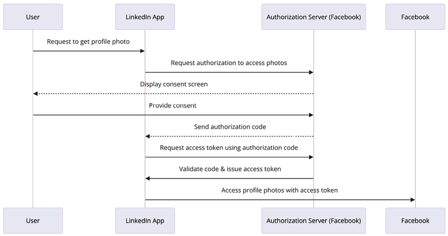

# ملاحظات امنیتی

امنیت همیشه در مرکز طراحی معماری قرار دارد. بسیاری از شرکت ها به دلیل امنیت متحمل ضرر مالی می شوند
هنگامی که اطلاعات مشتریان آنها درز می کند، نقض می شود. بنابراین، سازمان ها نه تنها می توانند اعتماد مشتری را از دست بدهند، بلکه می توانند اعتماد مشتری را نیز از دست بدهند
کل تجارت

مقررات و انطباق های استانداردهای صنعتی زیادی وجود دارد تا مطمئن شوید که برنامه شما _ایمن_ است و
از داده های حساس به مشتری محافظت می کند. در فصل قبل با جنبه های مختلف بهبود عملکرد آشنا شدید
و انتخاب های تکنولوژی برای معماری شما. در این فصل، شما به درک درستی از بهترین شیوه ها دست خواهید یافت
برنامه خود را ایمن کنید و مطمئن شوید که با مقررات استاندارد صنعتی مطابقت دارد.

امنیت در معماری تنها به معنای محافظت از لبه حجم کاری IT شما نیست. این همچنین شامل اطمینان از آن است
بخش های مختلف زیرساخت برنامه شما از یکدیگر ایمن هستند. به عنوان مثال، در یک سرور، می توانید از a استفاده کنید
فایروال برای کنترل اینکه کدام داده ها می توانند وارد یا خارج شوند و به کجا بروند. به این ترتیب، اگر یک قسمت مشکل امنیتی داشته باشد، آن را
بقیه را تحت تأثیر قرار نخواهد داد شما باید این کار را برای همه قسمت ها مانند داده ها و برنامه های خود انجام دهید. امنیت باید باشد
برای هر لایه و هر جزء از معماری اعمال می شود. این فصل همچنین راه های مختلفی را برای حفظ شما مورد بحث قرار می دهد
سیستم ابری ایمن

در این فصل با اقدامات امنیتی زیر آشنا خواهید شد:

- اصول طراحی برای امنیت معماری
- انتخاب تکنولوژی برای امنیت معماری
- گواهینامه های امنیتی و انطباق
- مدل مسئولیت امنیتی مشترک ابر
- مدل سازی تهدیدات امنیتی

# اصول طراحی برای امنیت معماری

امنیت به توانایی محافظت از سیستم و اطلاعات شما در حین ارائه ارزش تجاری برای شما مربوط می شود
مشتریان فقدان امنیت خوب می تواند تأثیر جدی بر مشتریان و کسب و کار شما داشته باشد.

شما باید یک ارزیابی عمیق از ریسک امنیتی انجام دهید و یک استراتژی کاهش برای عملیات مستمر برنامه ریزی کنید
شغلت. بخش‌های زیر در مورد اصول طراحی استاندارد صحبت می‌کنند که به شما کمک می‌کند تا خود را تقویت کنید
امنیت معماری

## اجرای کنترل احراز هویت و مجوز

هدف از **احراز هویت** تعیین این است که آیا کاربر می تواند با اعتبار ارائه شده به سیستم دسترسی داشته باشد یا خیر.
در حالی که **مجوز** تعیین می کند که کاربر پس از حضور در سیستم چه کاری می تواند انجام دهد.

شما باید یک سیستم متمرکز برای مدیریت احراز هویت و مجوز کاربران خود ایجاد کنید. یک کاربر متمرکز
سیستم مدیریت به شما کمک می کند تا فعالیت کاربران را پیگیری کنید تا در صورتی که دیگر عضوی از آن نیستند، بتوانید آنها را غیرفعال کنید
سیستم یا دیگر از آن به درستی استفاده نمی کنید. می توانید قوانین استانداردی را برای ورود به یک کاربر جدید تعریف کرده و حذف کنید
دسترسی برای کاربران غیر فعال یک سیستم متمرکز اتکا به اعتبارنامه های بلند مدت را از بین می برد و به شما امکان پیکربندی را می دهد
سایر روش های امنیتی مانند چرخش رمز عبور.

برای مجوز، باید با **اصل حداقل امتیاز** شروع کنید - این بدان معناست که کاربران نباید هیچ امتیازی داشته باشند.
برای شروع دسترسی دارند و تنها انواع دسترسی های مورد نیاز را با توجه به نقش شغلی خود اختصاص می دهند. ایجاد یک دسترسی
گروه با توجه به نقش شغلی به مدیریت خط مشی مجوز در یک مکان و اعمال محدودیت های مجوز کمک می کند
در میان تعداد زیادی از کاربران به عنوان مثال، می توانید تیم توسعه را برای دسترسی کامل به آن محدود کنید
محیط توسعه و دسترسی فقط خواندنی به محیط تولید. اگر هر توسعه دهنده جدیدی ملحق شود، باید بپیوندد
به این گروه برنامه‌نویس اضافه شد، جایی که تمام خط‌مشی‌های مجوز به صورت مرکزی مدیریت می‌شوند.

فعال کردن **تک ثبت نام** (**SSO**) با یک مخزن متمرکز کاربر به کاهش دردسر به خاطر سپردن کمک می کند.
چندین کلمه عبور برای پایگاه کاربری شما وجود دارد و خطر نشت رمز عبور را از بین می برد. برای افزایش بیشتر امنیت،
ادغام ** احراز هویت چند عاملی** (**MFA**) با SSO یک لایه حفاظتی اضافی اضافه می کند. وزارت امور خارجه نیاز دارد
کاربران برای دسترسی به یک منبع، دو یا چند فاکتور تأیید را فراهم کنند، مانند نشانه امنیتی، اثر انگشت،
یا تشخیص چهره

سازمان‌های بزرگ از ابزارهای مدیریت کاربر متمرکز مانند **Active Directory** (**AD**) برای کارمندان استفاده می‌کنند.
احراز هویت و مجوز برای ارائه دسترسی به برنامه های داخلی سازمانی مانند سیستم منابع انسانی،
سیستم هزینه و کاربرد برگه زمانی

در یک برنامه کاربردی با مشتری، مانند تجارت الکترونیک و وب سایت های رسانه های اجتماعی، می توانید از احراز هویت OpenID استفاده کنید.
سیستم برای حفظ یک سیستم متمرکز OpenID یک پروتکل احراز هویت استاندارد باز است. در مورد آن خواهید آموخت
ابزارهای مدیریت کاربر در مقیاس بزرگ با جزئیات بیشتر در بخش _OAuth و OpenID Connect_ این فصل.

## اعمال امنیت در همه جا

اغلب، سازمان ها در درجه اول بر اطمینان از ایمنی فیزیکی مرکز داده خود و محافظت از بیرون تمرکز می کنند
لایه شبکه از هرگونه حمله به جای تمرکز روی یک لایه بیرونی، اطمینان حاصل کنید که امنیت در آن اعمال می شود
هر لایه کاربردی

**دفاع در عمق** را اعمال کنید
رویکرد (**DiD**) برای کنترل های امنیتی لایه در سراسر یک برنامه. به عنوان مثال، الف
برنامه وب باید با محافظت از **نرخ داده های پیشرفته برای جهانی از ترافیک اینترنت خارجی ایمن شود
شبکه تکامل** (**EDGE**) و مسیریابی **سیستم نام دامنه** (**DNS**). اعمال امنیت در بار متعادل کننده و
لایه های شبکه برای مسدود کردن ترافیک مخرب

با اجازه دادن فقط به ترافیک ورودی و خروجی مورد نیاز در برنامه وب، هر نمونه برنامه ای را ایمن کنید
لایه پایگاه داده از سیستم عامل ها با نرم افزار آنتی ویروس محافظت کنید تا در برابر هرگونه حمله بدافزار محافظت کنید. هر دو را اعمال کنید
اقدامات پیشگیرانه و واکنشی حفاظت با قرار دادن **سیستم تشخیص نفوذ** (**IDS**) و ** نفوذ
سیستم پیشگیری** (**IPS**) در مقابل جریان ترافیک شما و با استفاده از **فایروال برنامه وب** (**WAF**)
از برنامه خود در برابر انواع حملات محافظت کنید. جزئیات بیشتری در مورد ابزارهای امنیتی مختلف به یاد خواهید گرفت
در بخش _انتخاب فناوری برای امنیت معماری_ این فصل استفاده کنید.

## کاهش شعاع انفجار

در حالی که اقدامات امنیتی را در هر لایه اعمال می کنید، باید سیستم خود را در یک جیب کوچک ایزوله نگه دارید تا کاهش یابد
شعاع انفجار اگر مهاجمان به یک قسمت از سیستم دسترسی پیدا کنند، باید بتوانید یک نقض امنیتی را به آن محدود کنید
کوچکترین منطقه ممکن از برنامه به عنوان مثال، در یک برنامه وب، متعادل کننده بار خود را در یک مکان جداگانه نگه دارید
شبکه از دیگر لایه‌های معماری، به عنوان رو به اینترنت. علاوه بر این، جداسازی شبکه را اعمال کنید
در لایه های وب، برنامه و پایگاه داده. اگر حمله در یک لایه اتفاق می افتد، باید از گسترش آن به آن جلوگیری کنید
لایه های دیگر معماری

قوانین مشابهی در مورد سیستم مجوز شما اعمال می شود که کمترین امتیاز را به کاربران می دهد و فقط آنها را ارائه می دهد
حداقل دسترسی مورد نیاز MFA را به گونه‌ای پیاده کنید که حتی در صورت نقض دسترسی کاربر، مهاجم همیشه به یک مورد نیاز داشته باشد
سطح دوم احراز هویت برای ورود به سیستم.

برای اطمینان از اینکه کل سیستم را در معرض دید قرار نمی دهید، حداقل دسترسی را به سیستم ارائه دهید، و به طور موقت ارائه دهید
اعتبار برای اطمینان از باز نگه داشتن دسترسی برای مدت کوتاهی. هنگام ارائه دسترسی برنامه‌ای توسط احتیاط‌های لازم را انجام دهید
قرار دادن توکن ایمن با چرخش مکرر کلید.

## نظارت و ممیزی همه چیز همیشه

شما برای هر فعالیتی در سیستم خود به مکانیزم ثبت نیاز دارید و باید یک ممیزی منظم انجام دهید. حسابرسی
قابلیت ها اغلب از مقررات مختلف مطابقت با صنعت مورد نیاز است. جمع‌آوری گزارش‌ها از هر مؤلفه،
از جمله تمام تراکنش ها و هر تماس API، برای ایجاد نظارت متمرکز. این تمرین خوبی است برای اضافه کردن یک
سطح امنیت و محدودیت های دسترسی به یک حساب ورود به سیستم متمرکز به طوری که هیچ کس نتواند آن را دستکاری کند.

یک رویکرد پیشگیرانه اتخاذ کنید و آماده باشید تا قبل از اینکه کاربر تحت تأثیر قرار بگیرد، هر حادثه ای را مدیریت کنید. قابلیت هشدار با
نظارت متمرکز به شما کمک می کند تا اقدام سریع انجام دهید و هر گونه حادثه را کاهش دهید. تمام فعالیت ها و برنامه های کاربر را نظارت کنید
حساب‌ها برای محدود کردن نقض امنیتی

## خودکار کردن همه چیز

اتوماسیون برای اعمال کاهش سریع برای هر گونه نقض قوانین امنیتی ضروری است. برای برگرداندن می توانید از اتوماسیون استفاده کنید
تغییر در تنظیمات مورد نظر و هشدار به تیم امنیتی - برای مثال، اگر شخصی کاربران سرپرست را به شما اضافه کند
سیستم و یک فایروال باز به یک پورت یا آدرس IP غیرمجاز. برای حذف چنین موارد نامطلوبی می توانید از اتوماسیون استفاده کنید
تغییرات در سیستم

استفاده از اتوماسیون برای سیستم های امنیتی با مفهوم DevSecOps محبوب شده است. DevSecOps در مورد اضافه کردن است
امنیت در هر بخش از توسعه برنامه و عملیات. در _فصل 11_ درباره DevSecOps بیشتر خواهید آموخت،
_DevOps و چارچوب معماری راه حل_.

ایجاد معماری امن و پیاده سازی کنترل های امنیتی که به عنوان کد تعریف و مدیریت می شوند. تو می توانی
نسخه- امنیت خود را به عنوان یک الگوی کد کنترل کنید و تغییرات را در صورت لزوم تجزیه و تحلیل کنید. مکانیزم های امنیتی خودکار به عنوان
کد نرم افزار به شما کمک می کند تا عملیات امنیتی را سریعتر و مقرون به صرفه تر مقیاس دهید.

## محافظت از داده ها

داده ها در مرکز معماری شما قرار دارند و ایمن سازی و محافظت از آنها ضروری است. اکثر انطباق
مقررات موجود برای محافظت از اطلاعات و هویت مشتری وجود دارد. اکثر حملات قصد سرقت کاربر را دارند
داده ها.

شما باید داده های خود را بر اساس سطح حساسیت آن دسته بندی کنید و بر اساس آن از آنها محافظت کنید. به عنوان مثال، کارت اعتباری مشتری
اطلاعات باید حساس ترین داده باشد و باید با نهایت دقت مورد استفاده قرار گیرد. از سوی دیگر، الف
نام کوچک مشتری ممکن است آنقدر حساس نباشد، در حالی که شماره کارت اطلاعات حساسی است.

حفاظت از داده ها در طول چرخه عمر آن برای حفظ محرمانه بودن، یکپارچگی و در دسترس بودن آن بسیار مهم است.
داده ها می توانند در سه حالت وجود داشته باشند و هر ایالت برای تضمین حفاظت جامع به اقدامات امنیتی خاصی نیاز دارد:

- **داده در حالت استراحت**: این به داده های ذخیره شده در رسانه های فیزیکی، اعم از هارد دیسک سرور، لپ تاپ، USB اشاره دارد.
  چوب، یا کلو

  ذخیره سازی ud یکی از مکانیسم‌های حفاظتی برای داده‌ها در حالت استراحت، رمزگذاری است که حتی اگر ذخیره‌سازی را تضمین می‌کند
  دستگاه به دست اشتباه می افتد، داده ها بدون کلید رمزگذاری غیرقابل دسترسی باقی می مانند. علاوه بر این، شما نیاز دارید
  کنترل‌های دسترسی و ممیزی‌های منظم برای اطمینان از اینکه فقط کاربران مجاز می‌توانند به داده‌ها دسترسی داشته باشند یا آن‌ها را اصلاح کنند، داشته باشید.

- **داده در حال انتقال**: هنگامی که داده ها در یک شبکه - از رایانه کاربر به سرور، بین سرورها یا در سراسر شبکه منتقل می شوند.
  اینترنت - در حال حمل و نقل در نظر گرفته می شود. برای محافظت از داده ها در حین انتقال، می توانید از پروتکل های رمزگذاری مانند
  ** امنیت لایه حمل و نقل** (**TLS**). این تضمین می کند که حتی اگر داده ها در حین انتقال رهگیری شوند، آن ها
  برای مهاجم ناخوانا باقی می ماند.
- **داده در حال استفاده**: این اغلب چالش برانگیزترین حالت برای محافظت است زیرا داده ها در حال پردازش یا استفاده هستند
  برنامه های کاربردی. رمزگذاری می‌تواند از داده‌ها در حالت استراحت و انتقال محافظت کند، اما پس از بارگیری در حافظه و استفاده توسط یک
  برنامه، به صورت متن ساده و به طور بالقوه آسیب پذیر است. فناوری های جدید مانند **محیط های اجرایی قابل اعتماد**
  (**TEEs**) و رمزگذاری همومورفیک در حال ظهور هستند تا داده های مورد استفاده را ایمن کنند و امکان عملیات بر روی داده های رمزگذاری شده بدون
  ابتدا نیاز به رمزگشایی

مکانیزم ها و ابزارهایی ایجاد کنید که نیاز به دسترسی مستقیم به داده ها را به حداقل برساند. با اعمال از پردازش دستی داده ها خودداری کنید
اتوماسیون مبتنی بر ابزار که خطای انسانی را از بین می برد، به خصوص هنگام مدیریت داده های حساس. اعمال محدودیت های دسترسی به
داده ها را تا جایی که ممکن است برای کاهش خطر از دست دادن داده ها یا اصلاح داده ها.

هنگامی که داده ها را بر اساس حساسیت دسته بندی کردید، می توانید از رمزگذاری، رمزگذاری و کنترل دسترسی مناسب استفاده کنید.
حفاظت از داده ها داده ها نه تنها در حالت سکون بلکه در حال حرکت نیز باید محافظت شوند - هنگام انتقال از طریق
شبکه - همچنین. با مکانیسم های مختلف برای محافظت از داده ها در بخش _Data Security_ این فصل آشنا خواهید شد.

## پاسخگویی به حوادث امنیتی

خود را برای هر رویداد امنیتی آماده نگه دارید. طبق خط مشی سازمانی خود یک فرآیند مدیریت حادثه ایجاد کنید
الزامات. مدیریت حوادث می تواند از یک سازمان به سازمان دیگر و از یک برنامه به برنامه دیگر متفاوت باشد. برای
به عنوان مثال، اگر برنامه شما **اطلاعات شناسایی شخصی** (**PII**) مشتریان شما را مدیریت می کند، باید
اقدامات امنیتی شدیدتر در واکنش به حادثه شما با این حال، اگر برنامه در حال رسیدگی به مقادیر کمی از حساس است
داده ها، مانند برنامه مدیریت موجودی، پس از آن رویکرد متفاوتی خواهد داشت.

مطمئن شوید که پاسخ حادثه را شبیه سازی کرده اید تا ببینید تیم امنیتی شما چگونه از یک موقعیت بهبود می یابد.

تیم شما باید از ابزارهای اتوماسیون برای سرعت بخشیدن به تشخیص، بررسی و پاسخ به هر رویداد امنیتی استفاده کند. شما خواهد شد
برای جلوگیری از چنین رویدادهایی باید مکانیسم‌های هشدار، نظارت و ممیزی را برای انجام **تحلیل ریشه‌ای** (**RCA**) تنظیم کرد.
از وقوع دوباره

در این بخش با اصول کلی امنیتی که باید در معماری خود برای کاربرد اعمال کنید آشنا شدید
امنیت. در بخش بعدی، نحوه به کارگیری این اصول را با استفاده از ابزارها و تکنیک های مختلف خواهید آموخت.

# انتخاب تکنولوژی برای امنیت معماری

بخش قبل بر روی قوانین امنیتی عمومی برنامه که در طراحی معماری باید در نظر گرفته شود، تمرکز داشت. هنوز،
سوال این است: _چگونه این قوانین را برای ایمن سازی اپلیکیشن در حین اجرا اعمال کنیم؟_ انواع مختلفی دارد
ابزارها و فناوری های موجود برای هر لایه از برنامه شما برای ایمن کردن آن.

در این بخش، به طور مفصل با انتخاب های متعدد فناوری که در حوزه مدیریت کاربر دارید آشنا خواهید شد
و محافظت از لایه وب، زیرساخت و داده های برنامه شما. بیایید با اولین منطقه، کاربر شروع کنیم
مدیریت هویت و دسترسی

## هویت کاربر و مدیریت دسترسی

هویت کاربر و مدیریت دسترسی بخش های حیاتی امنیت اطلاعات هستند. این به این دلیل است که بهتر است اطمینان حاصل شود
فقط کاربران تایید شده و مجاز می توانند به منابع سیستم شما به روشی تعریف شده دسترسی داشته باشند.

مدیریت کاربر می تواند یک کار دلهره آور باشد، زیرا سازمان شما رشد می کند و محصول شما به طور گسترده ای پذیرفته می شود. دسترسی کاربر
مدیریت باید دسترسی به کارکنان، فروشندگان و مشتریان سازمان را متمایز و مدیریت کند.

کاربران سازمانی یا شرکتی می توانند کارمندان، پیمانکاران یا فروشندگان سازمان باشند. آنها کاربران متخصص هستند
با امتیازات ویژه برای توسعه، آزمایش و استقرار برنامه. علاوه بر آن، احتمالاً نیاز به دسترسی دارند
به سایر سیستم های شرکتی برای انجام کارهای روزانه خود - به عنوان مثال، یک **سیستم منابع سازمانی** (**ERP**)، یک لیست حقوق و دستمزد
سیستم، سیستم منابع انسانی، برنامه زمانی برگه، و غیره. همانطور که سازمان شما رشد می کند، تعداد کاربران می تواند افزایش یابد
صدها تا هزاران

کاربران نهایی مشتریانی هستند که از برنامه های شما استفاده می کنند و دسترسی کافی برای کاوش و استفاده از برنامه های مورد نظر دارند
ویژگی برنامه - به عنوان مثال، بازیکنان یک برنامه بازی، کاربران برنامه های رسانه های اجتماعی یا
مشتریان از

یک وب سایت تجارت الکترونیک تعداد این کاربران می تواند از هزاران تا میلیون ها نفر به عنوان محبوبیت باشد
محصول یا برنامه شما رشد می کند. هنگام قرار دادن برنامه در معرض خطر، باید مراقب امنیت خاصی باشید
ترافیک اینترنت خارجی برای محافظت از آن در برابر تهدیدات مختلف.

بیایید ابتدا در مورد مدیریت کاربران شرکتی صحبت کنیم. برای اجرای سیاست های امنیتی باید یک مخزن متمرکز داشته باشید
مانند ایجاد رمز عبور قوی، چرخش رمز عبور و MFA برای مدیریت بهتر کاربر. وزارت امور خارجه ابزار دیگری را فراهم می کند
تأیید هویت شخصی در صورتی که رمز عبور قبلاً در معرض خطر قرار گرفته باشد. ارائه دهندگان معروف MFA عبارتند از Google
Authenticator، Gemalto، YubiKey، RSA SecurID، Duo، و Microsoft Authenticator.

از دیدگاه دسترسی کاربر، ** احراز هویت مبتنی بر نقش** (**RBA**) مدیریت کاربر را ساده می کند. می توانید کاربر ایجاد کنید
گروه هایی برای نقش های کاربران و تعیین خط مشی دسترسی مناسب. همانطور که در نمودار زیر نشان داده شده است، می توانید
دارای سه گروه - مدیر، توسعه دهنده و آزمایش کننده - با خط مشی دسترسی مربوطه که برای هر گروه اعمال می شود. مثلا،
یک ادمین می‌تواند به هر سیستمی، از جمله تولید، دسترسی داشته باشد، در حالی که دسترسی توسعه‌دهنده به محیط توسعه‌دهنده محدود است
تستر فقط می تواند به محیط تست دسترسی داشته باشد:

شکل 7.1: سازمان گروه کاربر

همانطور که در نمودار قبل نشان داده شده است، هنگامی که کاربران جدید به تیم ملحق می شوند، آنها به گروه مناسب برای خود اختصاص داده می شوند.
نقش. به این ترتیب، هر کاربر یک مجموعه تعریف شده از دسترسی استاندارد دارد. گروه کاربری همچنین می‌تواند دسترسی را در صورت جدید به‌روزرسانی کند
محیط توسعه معرفی شده است و همه توسعه دهندگان باید به آن دسترسی داشته باشند.

SSO یک فرآیند استاندارد است که به کاهش نقص های امنیتی و خودکارسازی سیستم کمک می کند. SSO به کاربران امکان ورود به سیستم را می دهد
به سیستم های مختلف شرکتی با استفاده از یک شناسه کاربری و رمز عبور. **مدیریت هویت فدرال** (**FIM**)
به کاربران اجازه می دهد بدون رمز عبور با مکانیزمی از پیش احراز هویت شده به سیستم دسترسی داشته باشند. بیایید به برخی دیگر نگاه کنیم
جزئیات.

### مدیریت هویت فدرال و ثبت نام واحد

**FIM** زمانی که اطلاعات کاربر در یک شخص ثالث ذخیره می شود، راهی برای اتصال سیستم مدیریت هویت فراهم می کند
**ارائه دهنده هویت** (**IdP**). با FIM، کاربر فقط اطلاعات احراز هویت را در اختیار IdP قرار می دهد که به نوبه خود،
قبلاً یک رابطه قابل اعتماد با سرویس دارد.

همانطور که در نمودار زیر نشان داده شده است، هنگامی که یک کاربر برای دسترسی به یک سرویس وارد سیستم می شود، ارائه دهنده خدمات اعتبارنامه را دریافت می کند.
از IdP به جای دریافت مستقیم آنها از کاربر:

شکل 7.2: جریان احراز هویت FIM

SSO امکان استفاده از یک مجموعه واحد از جزئیات ورود را فراهم می کند که با آن کاربر می تواند به چندین سرویس دسترسی داشته باشد. اینجا
ارائه‌دهنده خدمات می‌تواند محیطی را هدف قرار دهد که می‌خواهید به آن وارد شوید - به عنوان مثال، یک رابطه ** مشتری
برنامه مدیریت ** (**CRM**) یا برنامه ابری شما. IdP می تواند یک AD شرکتی باشد. فدراسیون اجازه می دهد
احراز هویت مشابه SSO اما بدون رمز عبور، زیرا سرور فدراسیون کاربران را می شناسد و به آنها اجازه دسترسی می دهد.
اطلاعات

راه های مختلفی برای پیاده سازی FIM و SSO وجود دارد. بیایید به برخی از محبوب ترین **مدیریت هویت و دسترسی** نگاه کنیم.
گزینه های (**IAM**).

### Kerberos

Kerberos یک پروتکل احراز هویت است که به دو سیستم اجازه می دهد یکدیگر را به طور ایمن شناسایی کنند و SSO را پیاده سازی می کند. آی تی
بر روی مدل مشتری-سرور کار می کند و از یک سیستم بلیط برای هویت کاربر استفاده می کند.

Kerberos دارای **مرکز توزیع کلید** (**KDC**) است که احراز هویت بین دو سیستم را تسهیل می کند. KDC
از دو بخش منطقی تشکیل شده است - **سرور احراز هویت** (**AS**) و **سرور اعطای بلیط** (**TGS**).

Kerberos کلیدهای مخفی هر مشتری و سرور را در فروشگاه داده ذخیره و نگهداری می کند. امن ایجاد می کند
جلسه بین دو سیستم در طول ارتباط آنها و آنها را با کلید مخفی ذخیره شده شناسایی می کند. به شرح زیر
نمودار جریان احراز هویت Kerberos را نشان می دهد:

شکل 7.3: احراز هویت Kerberos

همانطور که در نمودار قبل نشان داده شده است، زمانی که می خواهید به یک سرویس دسترسی داشته باشید، مراحل زیر شامل می شود:

2. هنگامی که می خواهید به یک سرویس در شبکه کامپیوتری خود دسترسی پیدا کنید، کامپیوتر شما (کلاینت) از یک سرور مخصوص به نام می پرسد
   **سرور احراز هویت** **AS** برای بلیط.

- AS بررسی می کند که آیا شما در پایگاه داده آن هستید یا خیر. اگر شما هستید، یک **بلیت اعطای بلیط** (**TGT**) و یک جلسه ایجاد می کند.
  کلید، سپس آنها را به کامپیوتر شما می فرستد. شما می توانید کلید جلسه را با رمز عبور خود باز کنید، اما نمی توانید آن را باز کنید
  TGT زیرا با کلیدی که فقط **سرور اعطای بلیط** قفل شده است.
- رایانه شما این TGT را می گیرد و از سرور دیگری به نام TGS درخواست بلیط سرویس می کند تا به سرویس مورد نظر شما دسترسی پیدا کند.
- TGS TGT را بررسی می کند و اگر همه چیز خوب به نظر می رسد، یک بلیط خدمات را پس می فرستد که رایانه شما می تواند از آن برای اثبات استفاده کند.
  به سرویسی که مجوز آن را دارید

به آن دسترسی داشته باشید.

- رایانه شما این بلیط را به سرویس نشان می دهد و اگر سرویس موافقت کند که بلیط معتبر است، شما دسترسی پیدا می کنید.

در حالی که Kerberos می تواند مفید باشد، یک پروتکل منبع باز است و به طور کلی، شرکت های بزرگ دوست دارند بیشتر استفاده کنند.
نرم افزار مدیریت شده با پشتیبانی قوی، مانند AD. بیایید به مکانیسم کار یکی از محبوب ترین کاربران نگاه کنیم
ابزارهای مدیریتی، Microsoft AD، که بر اساس **پروتکل دسترسی به دایرکتوری سبک** (**LDAP**) است.

### اکتیو دایرکتوری مایکروسافت

**AD** یک سرویس هویت است که توسط مایکروسافت برای کاربران و ماشین‌ها توسعه یافته است. AD یک کنترل کننده دامنه دارد که به آن نیز می گویند
**خدمات دامنه اکتیو دایرکتوری** (**AD DS**)، که اطلاعات کاربر، اعتبار دسترسی و هویت کاربر را ذخیره می کند،
و همچنین اطلاعات سیستم

نمودار زیر یک جریان ساده از فرآیند احراز هویت را نشان می دهد:

شکل 7.4: جریان احراز هویت AD

همانطور که در نمودار قبل نشان داده شده است، ورود کاربر توسط AD در شبکه های دامنه مدیریت می شود. کاربران ابتدا درخواست را ارسال می کنند
به کنترل کننده دامنه با اعتبار آنها و ارتباط با **کتابخانه احراز هویت اکتیو دایرکتوری**
(**ADAL**). ADAL اعتبار کاربر را تأیید می کند و یک نشانه دسترسی را با یک جلسه پیوسته برای کاربر ارسال می کند
خدمات درخواستی

**LDAP** پروتکل استانداردی است که ساختار سلسله مراتبی درخت مانند اطلاعات ذخیره شده در آن را مدیریت می کند
دایرکتوری ها ** Active Directory Lightweight Directory Services** (**AD LDS**) یک رابط LDAP را برای
فهرست کاربران و سیستم ها برای رمزگذاری فایل و رمزگذاری ترافیک شبکه، **گواهی دایرکتوری اکتیو
Services** (**AD CS**) عملکرد زیرساخت کلیدی را فراهم می کند. **خدمات فدراسیون Active Directory** (**AD
FS**) مکانیسم های دسترسی به منابع خارجی مانند ورود به برنامه های وب را برای بسیاری از کاربران فراهم می کند.

همانطور که بسیاری از سازمان‌ها استفاده از سرویس‌های ابری را آغاز کرده‌اند، بیایید در مورد سرویس دایرکتوری فعال که AWS ابری است بیاموزیم
فراهم می کند.

#### خدمات فهرست خدمات وب آمازون

**سرویس وب آمازون** (**AWS**) Directory Service منابع AWS را در حساب شما به یک محل موجود در محل متصل می کند
ابزار مدیریت کاربر مانند AD. سرویس دایرکتوری AWS یک فهرست مدیریت کاربر جدید را در ابر AWS راه اندازی می کند. آی تی
اتصال ایمن به دایرکتوری در محل را تسهیل می کند. پس از برقراری ارتباط، همه کاربران می توانند دسترسی داشته باشند
منابع ابری و برنامه‌های کاربردی داخلی با اعتبار موجودشان.

AWS AD Connector سرویس دیگری است که به شما کمک می کند Microsoft AD موجود را به ابر AWS متصل کنید. شما به a نیاز ندارید
ابزار همگام سازی دایرکتوری خاص کاربران ادمین می توانند منابع AWS را با استفاده از AWS IAM مدیریت کنند.

AD Connector با ادغام با زیرساخت MFA موجود شما، مانند YubiKey، یک توکن Gemalto، به فعال کردن MFA کمک می کند.
یا یک توکن RSA

برای یک پایگاه کاربر کوچک (کمتر از 5000 کاربر)، AWS Simple AD را ارائه می دهد که یک فهرست مدیریت شده توسط _Samba 4 است.
سرور سازگار Active Directory_. Simple AD دارای ویژگی های مشترکی مانند مدیریت حساب کاربری، گروه کاربری است
مدیریت، SSO بر اساس Kerberos، و سیاست های گروه کاربر.

سایر خدمات دایرکتوری ارائه شده توسط شرکت های بزرگ فناوری عبارتند از Okta، Centrify، Ping Identity و Oracle.
**سرویس ابر هویت** (**IDCS**).

### زبان نشانه گذاری ادعای امنیتی

قبلاً در این بخش، در بخش _مدیریت هویت فدرال و تک ورود_ با IdP ها و
ارائه دهندگان خدمات. برای دسترسی به یک سرویس، کاربر توسط IdP تایید می شود که به نوبه خود یک رابطه قابل اعتماد دارد
با ارائه دهنده خدمات **زبان نشانه گذاری ادعای امنیتی** (**SAML**) می تواند برای ایجاد یک مورد اعتماد استفاده شود
رابطه بین IdP و ارائه دهنده خدمات از طریق **زبان نشانه گذاری توسعه پذیر** (**XML**)، که استانداردسازی می کند
ارتباط بین یک IdP و یک ارائه دهنده خدمات.

ادعای SAML یک سند XML است که IdP با مجوز کاربر برای ارائه دهنده خدمات ارسال می کند. به شرح زیر
نمودار جریان ادعای SAML را نشان می دهد:

شکل 7.5: احراز هویت کاربر با استفاده از SAML

همانطور که در نمودار قبل ذکر شد، مراحل زیر برای پیاده سازی احراز هویت کاربر با استفاده از SAML انجام می شود:

1. یک کاربر درخواستی برای دسترسی به سرویس - برای مثال، برنامه Salesforce CRM - به عنوان یک ارائه دهنده خدمات ارسال می کند.
2. ارائه دهنده خدمات (یک برنامه کاربردی CRM) یک درخواست SAML با اطلاعات کاربر به SAML IdP ارسال می کند.
3. SAML IdP صفحه ورود به سیستم SSO را باز می کند، جایی که کاربران اطلاعات احراز هویت را وارد می کنند.
4. اعتبار دسترسی کاربر به پایگاه داده کاربر، یک فروشگاه هویت برای اعتبار سنجی می رود. در این حالت کاربر
   فروشگاه هویت یک _AD_ است.
5. فروشگاه هویت کاربر وضعیت اعتبار سنجی کاربر را به SAML IdP می فرستد، که فروشگاه هویت دارای یک مورد اعتماد است.
   ارتباط.
6. SAML IdP یک ادعای SAML را به

ارائه دهنده خدمات (یک برنامه کاربردی CRM) با اطلاعاتی در مورد کاربر
تایید. 7. پس از دریافت پاسخ SAML، ارائه دهنده خدمات اجازه دسترسی برنامه را به کاربر می دهد.

گاهی اوقات، یک ارائه دهنده خدمات می تواند به عنوان یک IdP نیز عمل کند. SAML برای ایجاد رابطه بین
هر فروشگاه هویت و ارائه دهنده خدمات. همه برنامه های کاربردی فروشگاه هویت مدرن با SAML 2.0 سازگار هستند که این امکان را فراهم می کند
آنها به طور یکپارچه با یکدیگر ارتباط برقرار کنند. SAML اجازه می دهد تا هویت کاربر فدرال شود و SSO را برای سازمانی فعال می کند
کاربران

برای پایگاه های کاربری بزرگ مانند رسانه های اجتماعی و وب سایت های تجارت الکترونیک، **OAuth** (مخفف **Open Authorization**) و
**OpenID** مناسب تر از SAML هستند. بیایید درباره OAuth و **OpenID Connect** (**OIDC**) بیاموزیم.

### OAuth

OAuth یک پروتکل مجوز استاندارد باز است که تفویض دسترسی ایمن به یک برنامه را فراهم می کند. OAuth ندارد
داده های رمز عبور را به اشتراک بگذارید، اما از یک رمز مجوز برای ایجاد هویت بین ارائه دهندگان خدمات و مصرف کنندگان استفاده می کند.
کاربران یک برنامه بدون دادن اعتبار ورود به اطلاعات خود دسترسی به اطلاعات خود را فراهم می کنند.

در حالی که OAuth عمدتا برای مجوز است، بسیاری از سازمان ها شروع به اضافه کردن مکانیسم های خود برای احراز هویت کرده اند.

OIDC پروتکلی است که استاندارد احراز هویت را در بالای چارچوب مجوز OAuth 2.0 تعریف می کند. در حالی که OAuth
2.0 چارچوبی برای مجوز (اعطای دسترسی به منابع) فراهم می کند، OIDC یک لایه اضافی برای مدیریت کاربر اضافه می کند.
احراز هویت. این بدان معناست که OIDC نه تنها به برنامه‌ها کمک می‌کند تا بدانند کاربر به چه منابعی می‌تواند دسترسی داشته باشد، بلکه تأیید می‌کند
هویت کاربری که به سرویس دسترسی دارد. این راهی است که مشتریان می توانند هویت کاربر را بر اساس آن تأیید کنند
احراز هویت انجام شده توسط سرور مجوز، و همچنین برای به دست آوردن اطلاعات نمایه اولیه در مورد کاربر در یک
قابلیت همکاری و شبیه به REST.

شرکت های بزرگ فناوری مانند آمازون، فیس بوک، گوگل و ایکس به کاربران اجازه می دهند اطلاعات را در حساب های خود به اشتراک بگذارند
با برنامه های شخص ثالث به عنوان مثال، می توانید با استفاده از لاگین فیس بوک خود وارد یک برنامه عکس جدید شوید و مجوز دهید
برنامه جدید فقط برای دسترسی به اطلاعات عکس فیس بوک شما. نمودار زیر یک تفویض دسترسی OAuth را نشان می دهد
flow، جایی که کاربر از اپلیکیشن LinkedIn درخواست می کند تا عکس نمایه خود را از فیس بوک دریافت کند:

شکل 7.6: تفویض اختیار دسترسی کاربر با OAuth 2.0

همانطور که در نمودار قبل نشان داده شده است، جریان احراز هویت این مراحل را دنبال می کند:

1. در این سناریو، کاربر از اپلیکیشن LinkedIn درخواست می کند تا عکس پروفایل شما را از فیس بوک دریافت کند.
2. برنامه LinkedIn برای دسترسی به عکس های نمایه فیس بوک مجوز درخواست می کند.
3. سرور مجوز (که در این مورد اکانت فیس بوک شما است) یک صفحه رضایت ایجاد و نمایش می دهد.
   کاربر.
4. کاربر با درخواست برنامه LinkedIn برای دسترسی فقط به عکس های نمایه فیس بوک خود موافقت می کند.
5. پس از دریافت تایید کاربر، سرور مجوز فیس بوک یک کد مجوز را به درخواست کننده ارسال می کند
   اپلیکیشن لینکدین
6. سپس برنامه LinkedIn یک رمز دسترسی از سرور مجوز (حساب فیس بوک) با استفاده از
   کد مجوز
7. سرور مجوز برنامه LinkedIn را شناسایی می کند و اعتبار کد احراز هویت را بررسی می کند. اگر
   رمز دسترسی تأیید شده است، سرور یک رمز دسترسی به برنامه LinkedIn صادر می کند.
8. اپلیکیشن LinkedIn اکنون می تواند با استفاده از توکن دسترسی به منابعی مانند عکس های پروفایل فیس بوک دسترسی داشته باشد.

OAuth 2.0 که سریعتر از OAuth 1.0 است و پیاده سازی آن راحت تر است، اکنون بیشتر مورد استفاده قرار می گیرد.

**JSON Web Token** (**JWT**) یک فرمت توکن ساده و در دسترس است که می تواند با OAuth استفاده شود و در بین مردم محبوب است.
OpenID; ما در ادامه به این نگاه می کنیم

### JWT

JWT یک روش فشرده و مستقل برای انتقال ایمن اطلاعات بین طرفین به عنوان یک شی JSON است. این
اطلاعات را می توان تأیید و اعتماد کرد زیرا به صورت دیجیتالی امضا شده است. JWT ها را می توان با استفاده از یک راز یا یک امضا کرد
جفت کلید عمومی/خصوصی

یک JWT دارای ساختار JSON است که اطلاعاتی در مورد زمان انقضا، صادرکننده، موضوع و غیره دارد. قوی تر است
از **توکن وب ساده** (**SWT**) و ساده تر از SAML 2.0. شما می توانید یک JWT را در تصویر زیر مشاهده کنید:

شکل 7.7: نمونه JWT

اسکرین شات قبلی JWT ها را نشان می دهد که دارای سه قسمت هستند که هر کدام با یک نقطه از هم جدا شده اند. قسمت اول، سربرگ،
نوع رمز - JWT - و الگوریتمی را که برای امضا استفاده می کند، مانند HS256 یا RSA به ما می گوید. بخش دوم، محموله،
ادعاهایی دارد که اطلاعات مربوط به کاربر و سایر داده ها است. قسمت آخر امضا است که باعث می شود
مطمئن شوید که توکن تغییر نکرده است و تأیید می کند که چه کسی JWT را ارسال کرده است.

JSON ساختار ساده‌تری نسبت به XML دارد و کوچک‌تر است، که JWT را فشرده‌تر از SAML می‌کند. JWT یک انتخاب عالی برای
انتقال اطلاعات به محیط های HTML و HTTP. JWT ها به دلیل اندازه کوچکشان هستند

یک انتخاب ایده آل برای گذراندن
هویت کاربران احراز هویت شده بین سرویس‌ها در معماری میکروسرویس‌ها یا برای ارائه توکن‌های دسترسی
به کاربران اجازه دسترسی به منابع را می دهد. آنها در سناریوهای مختلف احراز هویت و مجوز، به ویژه در وب استفاده می شوند
و اپلیکیشن های موبایل

در این بخش با رایج ترین ابزارها و خدمات مدیریت کاربر آشنا شدید. با این حال، موارد مختلف دیگری نیز وجود دارد
پروتکل ها و خدمات موجود برای احراز هویت و مجوز کاربر. اجرای پروتکل ها
که قبلاً ذکر شد می تواند پیچیده باشد، و مقدار زیادی نرم افزار بسته بندی شده در دسترس است که این کار را انجام می دهد
آسان تر.

Amazon Cognito یک سرویس مدیریت دسترسی کاربر ارائه شده توسط AWS است که شامل مجوزهای مبتنی بر استاندارد مانند
SAML 2.0، OIDC، و OAuth 2.0، همراه با یک فهرست کاربری سازمانی که امکان اتصال با AD را فراهم می کند.
Okta و Ping Identity مدیریت کاربران سازمانی و توانایی برقراری ارتباط با ارائه دهندگان خدمات مختلف را فراهم می کنند
ابزار در یک مکان

هنگامی که برنامه شما در معرض اینترنت قرار می گیرد، همیشه انواع مختلفی از حملات ممکن است رخ دهد. بیا یاد بگیریم
در مورد برخی از رایج ترین حملات و نحوه راه اندازی اولین لایه دفاعی برای محافظت از لایه وب.

## مدیریت امنیت وب

از آنجایی که تقاضای کاربر در حال تغییر است و نیاز به در دسترس بودن خدمات 24 ساعته دارد، کسب‌وکارها در حال تبدیل شدن به حالت آنلاین هستند و
برای انجام این کار، آنها از مدل های برنامه وب استفاده می کنند. برنامه های کاربردی وب همچنین به یک شرکت کمک می کند تا پایگاه مشتری جهانی را به دست آورد.
مشاغلی مانند بانکداری آنلاین و وب سایت های تجارت الکترونیک همیشه در دسترس هستند و با مشتریان حساس سروکار دارند
داده هایی مانند اطلاعات پرداخت و هویت پرداخت کننده.

در حال حاضر، برنامه های کاربردی وب در هر کسب و کاری مرکزی هستند و این برنامه ها در معرض دید جهانیان قرار می گیرند. برنامه های وب می توانند
دارای آسیب‌پذیری‌هایی هستند که آنها را در معرض حملات سایبری و نقض داده‌ها قرار می‌دهند. بیایید برخی از انواع رایج حملات سایبری را بررسی کنیم
و چگونه می توان آنها را کاهش داد.

### حملات سایبری

برنامه های کاربردی وب در برابر نقض های امنیتی آسیب پذیر هستند. هکرها حملات سایبری را از مکان‌ها و مکان‌های مختلف سازماندهی می‌کنند
روش های مختلف همانطور که شما یک ساختمان فیزیکی را قفل می کنید و از آن محافظت می کنید، به همان ترتیب، برنامه وب شما نیز باید باشد
از فعالیت های غیرقانونی محافظت می شود. بیایید برخی از روش‌های استاندارد حمله را که می‌توانند باعث آسیب‌پذیری‌های امنیتی شوند، بررسی کنیم
در برنامه وب شما

#### حملات انکار سرویس و انکار سرویس توزیع شده

حمله **انکار سرویس** (**DoS**) سعی می کند وب سایت شما را برای کاربران شما غیر قابل دسترس کند. برای دستیابی به الف
حمله موفقیت آمیز DoS، مهاجم از فناوری های مختلفی استفاده می کند که منابع شبکه و سیستم را مصرف می کند، بنابراین
قطع دسترسی برای کاربران قانونی مهاجم از چندین میزبان برای سازماندهی حمله علیه یک واحد استفاده می کند
هدف.

حمله **انکار سرویس توزیع شده** (**DDoS**) شامل استفاده از بسیاری از سیستم های ربوده شده، اغلب آلوده به بدافزار است.
برای پر کردن یک سیستم هدف واحد با درخواست ها. این امر هدف را تحت تأثیر قرار می دهد و باعث اختلال در خدمات می شود. مهاجم
از راه دور سیستم های در معرض خطر را برای انجام حمله کنترل می کند. همانطور که در نمودار زیر نشان داده شده است، یک حمله DDoS
زمانی اتفاق می‌افتد که چندین سیستم پهنای باند منابع یک سیستم هدف را تمام کنند:

شکل 7.8: حمله DDoS

مفهوم کلی یک حمله DDoS این است که از میزبان های اضافی برای تقویت درخواست های ارسال شده به هدف استفاده کند.
آنها را بیش از حد تامین و در دسترس نیست. یک حمله DDoS اغلب نتیجه چندین سیستم در معرض خطر است،
به موجب آن یک بات نت سیل ترافیکی را در سیستم هدف قرار می دهد.

بات نت شبکه ای از دستگاه هایی است که توسط بدافزار آلوده شده و از طریق آن کنترل می شود.

رایج ترین حمله DDoS در لایه برنامه، با استفاده از یک سیل DNS یا یک **لایه سوکت های امن** اتفاق می افتد.
(**SSL**) حمله مذاکره. در سیل‌های DNS، مهاجمان منابع یک سرور DNS را با درخواست‌های بیش از حد خسته می‌کنند.
در طول مذاکرات SSL، مهاجمان حجم زیادی از داده های نامفهوم را برای SSL گران قیمت محاسباتی ارسال می کنند
رمزگشایی مهاجم می تواند سایر حملات مبتنی بر SSL را بر روی ناوگان سرور انجام دهد و آن را با کارهای غیر ضروری بارگذاری کند.
در حال پردازش.

در لایه زیرساخت، یک حمله DDoS معمولی به شکل زیر رخ می دهد:

- **پروتکل دیتاگرام کاربر** (**UDP**) **بازتاب**: با انعکاس UDP، مهاجمان IP سرور هدف را جعل می کنند
  آدرس دهید و درخواستی را ارائه دهید که پاسخ های تقویت شده قابل توجهی را از یک سرور بازتابنده هک شده برمی گرداند.
- **سیل SYN**: با سیل SYN، مهاجمان **پروتکل کنترل انتقال** سرور مورد نظر را خسته می کنند (**TCP**)
  خدمات با ایجاد و رها کردن تعداد زیادی اتصال، مسدود کردن دسترسی کاربران قانونی به سرور.

اغلب، مهاجمان سعی می کنند داده های حساس مشتری را به دست آورند و برای این منظور از نوع دیگری از حمله به نام استفاده می کنند
**تزریق SQL** (**SQLi**). بیایید در مورد آن بیشتر بدانیم.

#### حملات SQLi

همانطور که از نام آن پیداست، در

یک حمله SQLi، مهاجمان برای به دست آوردن کنترل، **Structure Query Language** (**SQL**) مخرب را تزریق می کنند.
از یک پایگاه داده SQL و واکشی داده های حساس کاربر. مهاجم از SQLi برای دسترسی به اطلاعات غیرمجاز استفاده می کند
کنترل یک برنامه، افزودن کاربران جدید و غیره.

یک مثال از یک برنامه وب پردازش وام را در نظر بگیرید. شما «loanId» را به عنوان فیلدی دارید که مشتریان می توانند از آن برای دریافت همه موارد استفاده کنند
اطلاعات مربوط به وام آنها اگر دقت لازم صورت نگیرد، مهاجمان می‌توانند کوئری مانند «SELECT \* FROM» را اجرا کنند
وام WHERE loanId = 117 یا '1=1'' و به کل پایگاه داده مشتری دسترسی داشته باشید، زیرا این پرس و جو همیشه
نتیجه واقعی

راه متداول دیگر برای هک کردن داده های کاربر از طریق تزریق اسکریپت **اسکریپت بین سایتی** (**XSS**) است که در آن یک هکر
جعل هویت کاربر قانونی بیایید در مورد آن بیشتر بدانیم.

#### حملات XSS

احتمالاً با ایمیل‌های فیشینگ مواجه شده‌اید که دارای پیوندهایی هستند که جعل هویت یک وب‌سایت شناخته شده برای شما هستند. روی اینها کلیک کنید
پیوندها ممکن است به داده های در معرض خطر از طریق XSS منجر شوند. در یک حمله XSS، مهاجم کد مخرب خود را در a جاسازی می کند
وب سایت قانونی این کد سپس زمانی اجرا می شود که کاربر ناآگاه از صفحه وب بازدید می کند.

مهاجم می تواند این کد را به روش های مختلفی معرفی کند، مانند جاسازی مستقیم آن در یک رشته URL یا با درج یک
قطعه کد جاوا اسکریپت در صفحه وب. وقتی صفحه وب را بارگیری می کنید، این کد جاوا اسکریپت سمت سرویس گیرنده اجرا می شود
و کوکی های مرورگر شما را می دزدد.

این کوکی‌ها اغلب حاوی اطلاعات حساسی هستند، مانند رمز دسترسی و احراز هویت به بانک شما یا
وب سایت های تجارت الکترونیک با استفاده از این کوکی‌های دزدیده شده، هکر می‌تواند حساب بانکی شما را در میان حساب‌های دیگر وارد کرده و بگیرد
پولی که به سختی به دست آورده ای

#### حملات جعل درخواست بین سایتی

حمله **جعل درخواست بین سایتی** (**CSRF**) از هویت کاربر با ایجاد سردرگمی و فریب استفاده می کند.
احراز هویت کاربران در فعالیت های تغییر وضعیت، به عنوان مثال، تغییر رمز عبور یک وب سایت خرید یا
درخواست انتقال پول به بانک شما

این کمی متفاوت از یک حمله XSS است، زیرا با CSRF، مهاجم سعی می کند به جای درج یک درخواست، یک درخواست جعل کند.
اسکریپت کد برای مثال، مهاجم می‌تواند درخواستی مبنی بر انتقال مقدار معینی از پول از بانک کاربر جعل کند
و آن لینک را در یک ایمیل برای کاربر ارسال کنید. وقتی کاربران روی آن لینک کلیک می کنند، بانک درخواستی دریافت می کند و آن را انتقال می دهد
پول به حساب مهاجم اگر مهاجمان بتوانند وارد حساب مدیریت شوند، CSRF می تواند به ویژه مضر باشد.

#### حملات سرریز بافر و تخریب حافظه

یک برنامه نرم افزاری داده ها را در یک ناحیه حافظه موقت برای پردازش سریع می نویسد که به آن **بافر** می گویند. با یک
حمله سرریز بافر، مهاجم می تواند بخشی از حافظه متصل به بافر را عمدا بازنویسی کند.
ایجاد سرریز بافر و دسترسی به حافظه متصل، جایی که یک برنامه اجرایی ممکن است ذخیره شود. مهاجم
می تواند فایل اجرایی را با برنامه واقعی جایگزین کند و کنترل کل سیستم را در دست بگیرد. نگاهی به کلیت
برنامه، تهدیدات امنیتی بیشتری در لایه زیرساخت، لایه شبکه و لایه داده وجود دارد. بیایید برخی را بررسی کنیم
روش های استاندارد برای کاهش و جلوگیری از خطرات امنیتی در لایه وب.

### کاهش امنیت وب

امنیت باید در هر لایه از برنامه شما اعمال شود و توجه ویژه ای به لایه وب لازم است
برای قرار گرفتن در معرض آن در جهان. برای محافظت از وب، اقدامات لازم شامل پیگیری آخرین وصله‌های امنیتی،
پیروی از بهترین شیوه‌های توسعه نرم‌افزار، و اطمینان از اینکه احراز هویت و مجوز مناسب انجام می‌شود
بیرون

چندین روش برای محافظت و ایمن سازی برنامه های کاربردی وب وجود دارد. بیایید دو روش رایج را بررسی کنیم.

#### فایروال برنامه های وب

WAF ها فایروال هایی هستند که قوانین خاصی را برای ترافیک HTTP و HTTPS اعمال می کنند (یعنی پورت های '80' و '443'). WAF ها بازرسی می کنند
ترافیک وب شما و بررسی کنید که با هنجارهای رفتار مورد انتظار مطابقت دارد. آنها یک لایه اضافی از
محافظت در برابر حملات وب

محدودیت نرخ WAF توانایی مشاهده مقدار یا نوع درخواست های ارسال شده به سرویس شما و تعیین آستانه است.
که تعداد درخواست های مجاز برای هر کاربر، جلسه یا آدرس IP را محدود می کند. لیست های تایید شده و تایید نشده شما را قادر می سازد
به صراحت کاربران را مجاز یا مسدود می کند.

AWS WAF نمونه‌ای از WAF است که با ایجاد و اعمال قوانین برای فیلتر کردن وب، امنیت را به لایه وب شما می‌افزاید.
ترافیک این قوانین بر اساس شرایطی هستند که شامل هدرهای HTTP، موقعیت جغرافیایی کاربر، آدرس های IP مخرب، سفارشی
**شناسه منبع یکسان** (**URI**) و غیره. قوانین AWS WAF، بهره برداری های رایج وب مانند XSS و SQLi را مسدود می کند.
شما می توانید مجموعه ای از قوانین را برای محیطی ایجاد کنید که وب سایت ها و برنامه های وب مختلفی در حال اجرا هستند و شما
می تواند به جای ایجاد مجدد قوانین در سراسر برنامه ها از آنها استفاده مجدد کند.

به طور کلی، WAF ابزاری است که مجموعه ای از قوانین را برای ترافیک HTTP اعمال می کند. درخواست های وب را بر اساس داده هایی مانند IP فیلتر می کند
آدرس‌ها، هدرهای HTTP، بدنه‌های HTTP یا رشته‌های URI. این می تواند حملات DDoS را با بارگذاری غیر قانونی کاهش دهد

ترافیک الکترونیکی
بیایید در مورد کاهش DDoS بیشتر بیاموزیم.

#### کاهش DDoS

معماری انعطاف پذیر می تواند از حملات DDoS جلوگیری یا کاهش دهد. یک اصل اساسی در حفظ زیرساخت شما
امن کاهش تعداد بالقوه اهدافی است که یک مهاجم می تواند به آن ضربه بزند. به طور خلاصه، اگر یک نمونه نیازی به وجود نداشته باشد
عمومی، پس آن را عمومی نکنید.

شما می توانید استراتژی های مختلفی را برای به حداقل رساندن سطح حمله اعمال کنید:

- در صورت امکان، تعداد نقاط ورود به اینترنت ضروری را کاهش دهید - برای مثال، دسترسی به اینترنت ورودی را باز کنید
  متعادل کننده بار شما، نه سرورهای وب.
- نقاط ورود غیر ضروری به اینترنت را شناسایی و حذف کنید. به عنوان مثال، می توانید ذخیره سازی اشتراک فایل را تنظیم کنید
  برای فروشندگان برای آپلود داده ها، اما دسترسی به یک گروه محدود را به جای در دسترس قرار دادن آن برای کل محدود کنید
  ترافیک جهانی اینترنت
- نقاط ورودی اینترنت مورد نیاز را از کاربران نهایی غیرقابل اعتماد پنهان کنید تا نتوانند به آنها دسترسی داشته باشند.
- نقطه دسترسی را ایزوله کنید و یک خط مشی محدودیت خاص برای ترافیک کاربر نهایی در مقایسه با برنامه اعمال کنید
  مدیریت ترافیک
- یک نقطه ورودی اینترنت جدا شده ایجاد کنید تا سطح حمله را به حداقل برسانید.

هدف اصلی شما کاهش حملات DDoS در محل لبه CDN است. چالش برانگیزتر و پرهزینه تر است
اگر حملات DDoS به سرورهای برنامه شما برسد، مدیریت کنید. نمودار زیر یک کاهش DDoS را نشان می دهد
مثال برای بار کاری ابری AWS:

شکل 7.9: استراتژی کاهش ساندویچ DDoS WAF

نمودار قبلی یک **معماری ساندویچ WAF** را نشان می دهد که در آن دستگاه WAF بین دو بار قرار می گیرد.
متعادل کننده ها برای مدیریت یک حمله DDoS.

حملات DDoS مکرر از راهبردهایی مانند سیل SYN و بازتاب UDP ناشی می شوند که Amazon CloudFront از آنها جلوگیری می کند.
فقط قبل از اینکه استراتژی حمله به سرورهای برنامه شما برسد، اتصالات خوب را بپذیرید. CDN مانند
Amazon CloudFront به مقابله با حملات DDoS با جداسازی آنها در یک مکان ایزوله جغرافیایی و جلوگیری از حملات کمک می کند.
ترافیک از تأثیر بر مکان های دیگر امنیت فایروال شبکه به شما کمک می کند تا ترافیک ورودی و خروجی را کنترل کنید
سطح سرور فردی

همانطور که در بخش قبل ذکر شد، WAF ها برای محافظت از برنامه های کاربردی وب در برابر حملات اکسپلویت مانند XSS و
حملات SQLi علاوه بر این، WAF ها همچنین به شناسایی و جلوگیری از حملات DDoS در لایه برنامه وب کمک می کنند.

برای مدیریت یک حمله DDoS، می توانید مقیاس افقی یا عمودی را اعمال کنید. شما می توانید از مزایای مقیاس گذاری در
راه زیر:

1. ابتدا اندازه و پیکربندی سرور مناسب را برای برنامه وب خود انتخاب کنید.
2. دوم، از یک متعادل کننده بار برای توزیع ترافیک بین ناوگان سرورها و اضافه کردن مقیاس خودکار برای افزودن/حذف استفاده کنید.
   سرورها در صورت نیاز
3. در نهایت، از سرور CDN و DNS استفاده کنید، زیرا آنها برای مدیریت ترافیک در مقیاس ساخته شده اند.

مقیاس گذاری برای حملات DDoS یک مثال عالی از این است که چرا تعیین حداکثر تعداد معقول برای شما ضروری است.
سرورها یک حمله DDoS می‌تواند سرورهای شما را به عددی تبدیل کند که در عین حال بالقوه بسیار پرهزینه باشد
قادر به جلوگیری از در دسترس نشدن سرور نیست. داشتن حداکثر حد معقول برای انتظارات
افزایش منظم ترافیک باعث می شود که حمله DDoS هزینه زیادی برای شرکت شما نداشته باشد.

در این بخش با خطرات و آسیب پذیری های امنیتی مختلف در لایه وب و چند روش استاندارد آشنا شدید
از آنها محافظت کن. از آنجایی که امنیت باید در هر لایه اعمال شود، اجازه دهید حفاظت از لایه زیرساخت را بیشتر بررسی کنیم
جزئیات

## ایمن سازی یک اپلیکیشن و زیرساخت آن

در قسمت قبل با ایمن سازی لایه وب آشنا شدید. همانطور که امنیت باید در هر لایه اعمال شود
حجم کاری شما، بیایید در مورد ایمن سازی برنامه و لایه های شبکه معماری شما بیاموزیم.

### سخت شدن برنامه و سیستم عامل

حذف کامل آسیب پذیری ها در برنامه شما غیرممکن است، اما می توانید حملات سیستم را با سخت شدن محدود کنید
سیستم عامل، سیستم فایل و دایرکتوری برنامه شما. هنگامی که مهاجمان بتوانند وارد برنامه شما شوند، می توانند
دسترسی روت داشته باشید و حمله ای را به کل زیرساخت سازماندهی کنید.

محدود کردن حملات به سطح برنامه با محدود کردن دایرکتوری توسط _hardening permission_ ضروری است. در
سطح فرآیند، محدود کردن حافظه و استفاده از CPU برای جلوگیری از حمله DoS.

مجوز مناسب را در سطوح پارتیشن فایل، پوشه و فایل تنظیم کنید. از دادن امتیازات روت به برنامه خودداری کنید
یا کاربران آن شما باید یک دایرکتوری جداگانه ایجاد کنید که فقط شامل دسترسی مورد نیاز برای هر برنامه باشد تا
فقط کاربر مورد نیاز به برنامه دسترسی دارد. فقط برای برخی از برنامه ها از دسترسی مشترک استفاده کنید.

با استفاده از ابزارهای پردازشی مانند **DAEMON Tools** و **Supervisord** راه اندازی مجدد برنامه را به صورت خودکار انجام دهید تا از یک کتابچه راهنمای کاربر جلوگیری شود.
رویکردی که به موجب آن کاربران برای شروع باید وارد سرور شوند. برای سیستم عامل لینوکس

ems، ابزاری مانند
اسکریپت های **systemd** یا **System V init** می توانند برنامه را شروع/توقف کنند.

### کاهش آسیب پذیری نرم افزار و کد ایمن

همیشه توصیه می شود که آخرین وصله امنیتی ارائه شده توسط فروشنده سیستم عامل خود را اعمال کنید. این به پر کردن کمک می کند
هر گونه حفره امنیتی در سیستم و محافظت از سیستم شما در برابر آسیب پذیری هایی که مهاجمان می توانند امنیت شما را بدزدند
گواهی یا اجرای کد دلخواه

به روز نگه داشتن سیستم خود با آخرین وصله های امنیتی بسیار مهم است. بهتر است فرآیند را خودکار کنید
از آخرین نصب پچ به محض در دسترس قرار گرفتن. با این حال، اجرای یک وصله امنیتی گاهی اوقات ممکن است
نرم افزار کار خود را خراب کنید، بنابراین راه اندازی **ادغام پیوسته** **و** **استقرار مستمر** مفید است
خط لوله (**CI/CD**) با آزمایش و استقرار خودکار. در مورد فرآیند CI/CD در _فصل 11_ بیشتر خواهید آموخت،
_DevOps و چارچوب معماری راه حل_.

ابر AWS یک ابزار مدیریت سیستم را فراهم می کند که به شما امکان می دهد وصله های امنیتی را اعمال کنید و ناوگان سرور خود را در آن نظارت کنید
ابر. برای خودکارسازی وصله امنیتی می‌توانید از ابزاری مانند **به‌روزرسانی‌های خودکار** یا **به‌روزرسانی‌های بدون نظارت** استفاده کنید.
نصب و راه اندازی. هنگامی که خدمات مدیریت شده از ارائه دهندگان ابر را انتخاب می کنید، اساساً خود را از موارد زیرین رها می کنید
بار عملیاتی زیرساخت ارائه دهنده ابر از راه اندازی، مدیریت، بهره برداری و بهینه سازی مراقبت می کند
از خدمات این شامل وظایف تعمیر و نگهداری منظم، مانند وصله، که برای امنیت و حیاتی است
کارایی.

همانطور که در **Open توصیه می شود، مطمئن شوید که بهترین شیوه های کدنویسی ایمن را در فرآیند توسعه نرم افزار خود ادغام کرده اید
پروژه امنیت وب اپلیکیشن** (**OWASP**)، جزئیات مربوط به آن را می توانید در اینجا بیابید:
[owasp.org/www-project-secure-coding-practices-quick-reference-guide/stable-en/01-introduction/05-introduction](http://owasp.org/www-project-secure-coding- تمرینات-راهنمای-مرجع-سریع/stable-en/01-مقدمه/05-مقدمه).

### امنیت شبکه

وقتی نوبت به حفاظت از زیرساخت شما می رسد، ایمن سازی شبکه باید اولین نکته شما باشد. فیزیکی
امنیت زیرساخت فناوری اطلاعات شما در مرکز داده باید توسط ارائه دهندگان مرکز داده مراقبت شود. بیا صحبت کنیم
در مورد تضمین امنیت شبکه، که مسئولیت شما به عنوان مالک برنامه است.

بیایید یک مثال از یک ارائه دهنده ابر عمومی مانند AWS برای کمک به درک امنیت شبکه بیاوریم. می توانید درخواست دهید
همین مثال برای زیرساخت شبکه ابری داخلی یا خصوصی شما نیز وجود دارد.

همانطور که در نمودار زیر نشان داده شده است، امنیت باید در هر لایه اعمال شود و مرزهای مطمئن در اطراف هر لایه اعمال شود.
لایه با حداقل دسترسی باید تعریف شود:

شکل 7.10: پیکربندی شبکه برای امنیت زیرساخت

در نمودار قبل، بار متعادل کننده در یک زیر شبکه عمومی است که می تواند ترافیک اینترنت را بپذیرد و آن را توزیع کند.
به ناوگان سرور برنامه ترافیک فیلتر WAF بر اساس قوانین تنظیم شده است و از برنامه شما در برابر موارد مختلف محافظت می کند
همانطور که در بخش قبل یاد گرفتید، حملات. ناوگان سرور برنامه و سرورهای پایگاه داده خصوصی هستند
زیرشبکه ها، یعنی دسترسی مستقیم به اینترنت در دسترس نیست.

بیایید عمیقاً در نمودار معماری قبلی غوطه ور شویم و از هر لایه به صورت زیر عبور کنیم:

- **Amazon Virtual Private Cloud** (**VPC**) یک شبکه منطقی ایزوله برای زیرساخت ابری شما فراهم می کند. آی تی
  به عنوان محیط شبکه شخصی شده شما در فضای ابری عمل می کند و منابع مختلفی را میزبانی می کند. طراحی شده برای افزایش
  کنترل، امکان تفکیک محیط ها و منابع مختلف را فراهم می کند. می توانید چندین VPC را در هر AWS تنظیم کنید
  حساب یا منطقه هنگام راه‌اندازی VPC، محدوده آدرس‌های IP آن را با استفاده از **مسیریابی بین دامنه‌ای بدون کلاس** تعیین می‌کنید.
  نماد (**CIDR**). این نماد روشی مختصر برای نشان دادن یک دامنه خاص از آدرس های IP است. به عنوان مثال، CIDR
  بلوک «10.0.0.0/16» همه آدرس‌های IP از «10.0.0.0» تا «10.0.255.255» را در بر می‌گیرد. این محدوده در مجموع شامل
  65535 آدرس IP در دسترس برای استفاده.
- **زیر شبکه ها** بخش هایی از یک شبکه هستند که با استفاده از محدوده CIDR تقسیم می شوند و مرزهای امنی را بین خصوصی و خصوصی ایجاد می کنند.
  منابع عمومی به جای سازماندهی زیرشبکه ها بر اساس برنامه یا عملکرد (مانند وب، برنامه یا سطوح داده)،
  ترتیب آنها بر اساس دسترسی به اینترنت موثرتر است. این راه‌اندازی جداسازی واضح در سطح زیرشبکه را امکان‌پذیر می‌کند،
  تمایز بین منابع داخلی عمومی و خصوصی

در این تنظیم، منابعی که نیاز به دسترسی به اینترنت دارند، مانند بار متعادل کننده های عمومی، **ترجمه آدرس شبکه**
نمونه های (**NAT**) و میزبان های سنگر در یک **زیر شبکه عمومی** قرار می گیرند. منابع دیگر مانند پایگاه های داده و
برنامه های کاربردی، در یک زیرشبکه خصوصی ساکن هستند. این باعث ایجاد لایه های متمایز جدایی بین سطوح مختلف منابع می شود.
با نمونه های برنامه و منابع داده ای که هر کدام به آنها اختصاص داده شده است

زیرشبکه های خصوصی خودشان در AWS، بیشتر منابع می توانند باشند
میزبانی در **زیر شبکه های خصوصی **، استفاده از زیرشبکه های عمومی تنها زمانی که دسترسی به اینترنت مورد نیاز است. در نتیجه، این است
توصیه می شود تعداد بیشتری از آدرس های IP را به زیرشبکه های خصوصی خود نسبت به زیرشبکه های عمومی اختصاص دهید، که تضمین می کند
فضای کافی برای اکثر منابع شما که در شبکه خصوصی قرار دارند. زیرشبکه ها جداسازی اساسی را فراهم می کنند
بین منابع دارای قوانین **لیست کنترل دسترسی به شبکه** (**NACL**)، اما گروه های امنیتی جزئیات بیشتری را ارائه می دهند.
سطح مدیریت ترافیک این رویکرد از زیرساخت های بیش از حد پیچیده و استفاده ناکارآمد از IP جلوگیری می کند
آدرس ها.

- یک **جدول مسیریابی** شامل قوانینی است که به عنوان مسیرها شناخته می شوند و تعیین می کنند کدام سرورهای برنامه شبکه را دریافت کنند.
  ترافیک برای افزایش امنیت، توصیه می شود از یک جدول مسیر سفارشی مجزا برای هر زیر شبکه استفاده کنید.
- **گروه های امنیتی** به عنوان فایروال مجازی عمل می کنند که ترافیک ورودی و خروجی را برای یک یا چند مورد مدیریت می کند.
  نمونه ها این نمونه‌ها می‌توانند در یک محدوده بلوک CIDR مشخص شوند یا می‌توانند بخشی از دیگری تعیین‌شده باشند
  گروه امنیتی با پیروی از اصل حداقل امتیاز، گروه‌های امنیتی قرار است تمام ترافیک ورودی را رد کنند
  پیش فرض سپس می توانید قوانین خاصی را برای فیلتر کردن ترافیک بر اساس پروتکل هایی مانند TCP، UDP و **اینترنت ایجاد کنید.
  پروتکل پیام کنترل** (**ICMP**). این تنظیم تضمین می کند که فقط ترافیک لازم و مجاز می تواند به شما دسترسی داشته باشد
  مواردی که امنیت شبکه شما را افزایش می دهد.
- **NACL** یک لایه امنیتی اختیاری به شکل فایروال مجازی است که هم ورودی و هم خروجی را کنترل می کند.
  ترافیک در سطح زیرشبکه در شبکه شما بر خلاف یک گروه امنیتی که حالتی است، یک NACL در یک عمل می کند
  شیوه بی تابعیتی این بی تابعیتی به این معنی است که هر درخواست، چه ورودی و چه خروجی، به طور مستقل مورد بررسی قرار می گیرد.
  به عنوان مثال، حتی اگر یک درخواست ورودی مجاز باشد، پاسخ خروجی مربوطه نیز باید صریح باشد.
  توسط قوانین تعیین شده در NACL مجاز است. این امر مستلزم آن است که قوانین ترافیک ورودی و خروجی را به دقت تعریف کنید
  برای اطمینان از جریان ترافیک مناسب و امنیت در سطح زیرشبکه.
- ترافیک اینترنت از طریق **دروازه اینترنتی** (**IGW**) جهت عمومی کردن یک زیرشبکه هدایت می شود. به طور پیش فرض اینترنت
  دسترسی به ترافیک اینترنت در محیط شما ممنوع است. یک IGW باید به VPC شما وصل شود
  جدول مسیر زیرشبکه باید قوانین IGW را تعریف کند.
- یک زیرشبکه خصوصی تمام ترافیک ورودی و خروجی اینترنت را مسدود می کند، اما سرورها ممکن است به ترافیک اینترنت خروجی نیاز داشته باشند.
  نصب نرم افزار و وصله امنیتی یک **درگاه NAT** نمونه هایی را در یک زیرشبکه خصوصی قادر می سازد تا خروجی را آغاز کنند
  ترافیک به اینترنت و محافظت از منابع از ترافیک اینترنت ورودی.
- **میزبان سنگر** مانند یک سرور پرش عمل می کند که امکان دسترسی به منابع دیگر در زیرشبکه خصوصی را فراهم می کند. یک سنگر
  هاست باید با امنیت بیشتر سخت‌تر شود تا فقط افراد مناسب بتوانند به آن دسترسی داشته باشند. برای ورود به سرور،
  همیشه از رمزنگاری کلید عمومی\_ برای احراز هویت به جای یک شناسه کاربر معمولی و روش رمز عبور استفاده کنید.

سازمان‌ها اغلب گزارش‌های جریان شبکه را به دلایل متعدد جمع‌آوری، ذخیره و بررسی می‌کنند. اینها شامل تشخیص است
مشکلات اتصال، حل مسائل امنیتی و ارزیابی سیاست های دسترسی به شبکه. باید ترافیک را زیر نظر داشته باشید
جریان به VPC سیستم شما، که شامل ضبط اطلاعات ترافیک ورودی و خروجی از شبکه شما است. **VPC
گزارش‌های جریان ** شما را قادر می‌سازد آن اطلاعات را به همراه اطلاعات ترافیک پذیرفته شده و رد شده برای
منبع تعیین شده، که به شما کمک می کند الگوهای ترافیک را بهتر درک کنید.

گزارش های جریان به عنوان یک ابزار امنیتی برای نظارت بر ترافیک به نمونه ها عمل می کنند. می توانید برای انواع ترافیک خاص آلارم تنظیم کنید
و معیارهایی برای شناسایی روندها و الگوها ایجاد کنید. گزارش های جریان را می توان برای یک VPC، یک زیرشبکه یا یک شبکه ایجاد کرد
رابط. هنگامی که برای یک زیرشبکه یا VPC ایجاد می شود، آنها بر هر رابط شبکه در آن زیر شبکه یا VPC نظارت می کنند. مثلا،
سناریویی را در نظر بگیرید که در آن یک VPC با چندین زیرشبکه دارید. با تنظیم یک گزارش جریان برای VPC، می توانید نظارت داشته باشید
تمام ترافیک ورودی و خروجی از طریق رابط های شبکه آن. اگر متوجه الگوهای ترافیکی غیرعادی شدید، مانند یک
افزایش غیرمنتظره در درخواست های داده از یک آدرس IP ناشناخته، می توانید یک زنگ هشدار را پیکربندی کنید تا به شما هشدار دهد. این فعالانه
نظارت به شناسایی تهدیدهای امنیتی بالقوه یا ناکارآمدی شبکه در مراحل اولیه کمک می کند.

همانطور که می بینید، چندین لایه امنیتی در لایه شبکه وجود دارد که می تواند به محافظت از شما کمک کند
زیر ساخت. نگه داشتن منابع در زیر شبکه ایزوله آنها به کاهش شعاع انفجار کمک می کند. اگر مهاجم بتواند
با نفوذ به یک جزء، باید بتوانید آنها را به منابع محدود محدود کنید. می توانید از IDS و IPS در داخل استفاده کنید
جلوی زیرساخت شما برای شناسایی و جلوگیری از هرگونه ترافیک مخرب. در ادامه با آنها آشنا می شویم.

### سیستم تشخیص نفوذ و سیستم جلوگیری از نفوذ

یک دستگاه IDS

هرگونه حمله سایبری را که از طریق ترافیک شبکه رخ می دهد با شناسایی الگوی حمله انجام می دهد. یک IPS یک قدم پیش می رود
بیشتر و فعالانه به توقف ترافیک مخرب کمک می کند.

یک IPS تجزیه و تحلیل انتقادی تهدیدات بالقوه را که در پشت فایروال قرار دارد، ارائه می دهد. محتوای خطرناک را شناسایی می کند،
مانند بسته های مخرب، و می تواند ترافیک را مسدود کند یا اتصالات را بازنشانی کند. IPS از دو روش تشخیص اولیه استفاده می کند:

- **تشخیص مبتنی بر امضا**: این روش بر یک پایگاه داده در حال رشد از الگوهای منحصر به فرد یا "امضاها" متکی است.
  مرتبط با هر اکسپلویت شناخته شده
- **تشخیص مبتنی بر ناهنجاری آماری**: این رویکرد مبنایی را برای عملکرد عادی شبکه و
  نمونه های تصادفی ترافیک شبکه را با این خط پایه مقایسه می کند. اگر ترافیک به طور قابل توجهی منحرف شود، IPS مداخله می کند.

شما باید قابلیت کاربرد سیستم IDS/IPS را با الزامات برنامه خود تعیین کنید. یک IDS می تواند باشد
مبتنی بر میزبان یا مبتنی بر شبکه.

#### IDS مبتنی بر میزبان

یک IDS مبتنی بر میزبان یا عامل بر روی هر میزبان محیط شما اجرا می شود. می تواند فعالیت در آن میزبان را بررسی کند
تعیین کنید که آیا حمله ای رخ داده و موفق شده است یا خیر. می تواند این کار را با بازرسی لاگ ها، نظارت بر سیستم فایل انجام دهد،
نظارت بر اتصالات شبکه به میزبان و غیره. سپس نرم افزار یا عامل با یک مرکز/فرمان ارتباط برقرار می کند
برنامه ای در مورد سلامت یا امنیت میزبانی که نظارت می کند.

مزایای راه حل های مبتنی بر میزبان شامل این است که آنها می توانند فعالیت های داخل هر میزبان را عمیقاً بررسی کنند. آنها می توانند مقیاس شوند
در صورت نیاز به صورت افقی (هر میزبان عامل خود را دریافت می کند) و نیازی به تأثیرگذاری بر عملکرد اجرا نیست
برنامه های کاربردی. معایب شامل هزینه‌های اضافی مدیریت پیکربندی است که در صورت وجود عوامل می‌توان آن را معرفی کرد
در بسیاری از سرورها مدیریت می شود که برای یک سازمان سنگین هستند.

از آنجایی که هر عامل به صورت مجزا عمل می کند، شناسایی حملات گسترده/هماهنگ شده دشوار است. برای رسیدگی به هماهنگی
در حملات، سیستم باید فوراً در تمام میزبان ها پاسخ دهد، که نیاز به راه حل مبتنی بر میزبان برای همکاری دارد
با اجزای دیگر، مانند سیستم عامل و رابط برنامه، بر روی هاست مستقر شده است.

#### IDS مبتنی بر شبکه

یک IDS مبتنی بر شبکه، دستگاهی را وارد شبکه می‌کند که از طریق آن تمام ترافیک مسیریابی و بررسی می‌شود.
حملات

مزایا شامل یک جزء ساده/تک است که باید به دور از میزبان برنامه مستقر و مدیریت شود. همچنین،
سخت شده یا به گونه ای نظارت می شود که ممکن است برای همه میزبان ها سنگین باشد. دیدگاه فردی / مشترک از امنیت
در یک مکان واحد وجود دارد تا بتوان تصویر بزرگ را برای ناهنجاری ها/حملات بررسی کرد.

با این حال، یک IDS مبتنی بر شبکه شامل موفقیت عملکرد اضافه کردن یک پرش شبکه به برنامه‌ها می‌شود. مجبور بودن
رمزگشایی/رمزگذاری مجدد ترافیک برای بازرسی آن، هم عملکرد عظیمی دارد و هم یک خطر امنیتی است که شبکه را ایجاد می کند
دستگاه یک هدف جذاب هر ترافیکی که IDS نتواند رمزگشایی کند، نمی‌تواند چیزی را بازرسی/تشخیص دهد.

IDS یک ابزار تشخیص و نظارت است و به تنهایی عمل نمی کند. یک IPS بر اساس ترافیک را شناسایی، می پذیرد و رد می کند
در قوانین تعیین شده راه حل های IDS/IPS به دلیل قابلیت های تشخیص ناهنجاری که باعث می شود از حملات DDoS جلوگیری شود.
قادر به تشخیص زمان استفاده از پروتکل های معتبر به عنوان وسیله نقلیه حمله است. یک IDS و یک IPS با تجزیه و تحلیل شبکه کار می کنند
بسته ها و مقایسه محتوای آنها با پایگاه داده تهدیدات شناخته شده. این فرآیند به آنها اجازه می دهد تا شناسایی و
به خطرات امنیتی احتمالی پاسخ دهد. ممیزی و اسکن مداوم برای زیرساخت شما برای ایمن سازی آن مورد نیاز است
از هر حمله ای فعالانه

در این بخش، همه چیز را در مورد ایمن سازی زیرساخت های خود در برابر انواع مختلف حملات یاد گرفتید. هدف اینها
حملات برای به دست آوردن اطلاعات شما است. شما باید داده های خود را به گونه ای ایمن کنید که مهاجم نتواند حساس به دست آورد
اطلاعات حتی پس از در دست گرفتن داده ها. بیایید در مورد حفاظت از داده ها با استفاده از امنیت در لایه داده بیاموزیم،
رمزگذاری و پشتیبان گیری

## امنیت داده ها

در دنیای دیجیتال امروزی، هر سیستمی حول محور داده می چرخد. گاهی اوقات، این داده ها ممکن است حاوی اطلاعات حساسی باشد
به عنوان سوابق سلامت مشتری، اطلاعات پرداخت و هویت دولتی. ایمن سازی اطلاعات مشتری برای جلوگیری از هرگونه
دسترسی غیرمجاز بسیار مهم است. بسیاری از صنایع بر حفاظت و امنیت داده ها تاکید زیادی دارند.

قبل از طراحی هر راه حلی، باید اقدامات امنیتی اساسی را تعریف کنید که با هدف شما همسو باشد، مانند
مطابق با الزامات نظارتی

چندین روش مختلف برای محافظت از داده ها استفاده می شود. بیایید در بخش های آینده به آنها نگاه کنیم.

### طبقه بندی داده ها

یکی از بهترین روش ها طبقه بندی داده های شما است که راهی برای طبقه بندی و مدیریت داده های سازمانی ارائه می دهد.
بر اساس سطوح حساسیت

با توجه به حساسیت داده ها، می توانید حفاظت از داده ها، رمزگذاری داده ها و الزامات دسترسی به داده ها را برنامه ریزی کنید.

با مدیریت طبقه بندی داده ها بر اساس نیازهای بار کاری سیستم خود، می توانید کنترل ها و سطح داده ها را ایجاد کنید
دسترسی مورد نیاز برای داده ها مثلا

، محتوایی مانند رتبه بندی و بررسی کاربر اغلب عمومی است و خوب است
دسترسی عمومی را فراهم می کند، اما اطلاعات کارت اعتباری کاربر داده های بسیار حساسی هستند که باید رمزگذاری و قرار داده شوند
تحت دسترسی بسیار محدود

در سطح بالا، می توانید داده ها را به دسته های زیر طبقه بندی کنید:

- **داده های محدود**: این شامل اطلاعاتی است که در صورت در معرض خطر قرار گرفتن می تواند مستقیماً به مشتری آسیب برساند.
  استفاده نادرست از داده های محدود شده می تواند به اعتبار یک شرکت آسیب برساند و بر تجارت تأثیر منفی بگذارد. داده های محدود ممکن است
  شامل اطلاعات PII مشتری، مانند شماره تامین اجتماعی، جزئیات گذرنامه، شماره کارت اعتباری، و پرداخت
  اطلاعات
- **داده های خصوصی**: داده ها را می توان به عنوان خصوصی دسته بندی کرد اگر حاوی اطلاعات حساس مشتری باشد که یک مهاجم
  می توانند برای برنامه ریزی برای به دست آوردن داده های محدود خود استفاده کنند. داده های خصوصی ممکن است شامل شناسه ایمیل مشتری، شماره تلفن، نام کامل،
  و آدرس ها
- **اطلاعات عمومی**: این برای همه در دسترس و قابل دسترسی است و به حداقل محافظت نیاز دارد - به عنوان مثال، مشتری
  رتبه‌بندی‌ها و نظرات، موقعیت مکانی مشتری و نام کاربری مشتری در صورتی که کاربر آن را عمومی کرده باشد.

بسته به نوع صنعت و ماهیت داده های کاربر، می توانید دسته بندی دقیق تری داشته باشید. داده ها
طبقه بندی باید قابلیت استفاده از داده ها را در مقابل دسترسی به داده ها متعادل کند. تنظیم سطوح مختلف دسترسی همانطور که گفته شد
قبلاً، فقط به محدود کردن داده‌های ضروری کمک می‌کند و اطمینان حاصل می‌کند که داده‌های حساس در معرض نمایش قرار نمی‌گیرند. همیشه از دادن خودداری کنید
دسترسی انسان به داده‌ها را مستقیماً هدایت کنید و ابزارهایی را اضافه کنید که می‌توانند گزارشی فقط خواندنی برای کاربران ایجاد کنند تا در الف
شیوه ای محدود کننده

### رمزگذاری داده در حالت استراحت

داده در حالت استراحت به معنای داده هایی است که در جایی ذخیره می شوند، مانند **شبکه منطقه ذخیره سازی** (**SAN**)، **متصل به شبکه
ذخیره سازی** (**NAS**) درایو، یا در فضای ذخیره سازی ابری. تمام داده های حساس باید با اعمال متقارن یا نامتقارن محافظت شوند
رمزگذاری، که در این بخش توضیح داده شده است، با مدیریت صحیح کلید.

علاوه بر رمزگذاری، روش‌های دیگری نیز برای محافظت از داده‌ها در حالت استراحت وجود دارد، مانند پوشاندن و رمزگذاری. اینها
روش‌ها لایه‌های بیشتری از امنیت را فراهم می‌کنند و به ویژه در موقعیت‌هایی که اطلاعات حساس هستند، مفید هستند
باید بدون افشای داده های واقعی استفاده یا به اشتراک گذاشته شود.

رمزگذاری داده ها راهی برای محافظت از داده های شما است که به موجب آن داده های خود را از متن ساده به متن رمزگذاری شده تبدیل می کنید.
با استفاده از یک کلید رمزگذاری فرمت کنید. این متن رمزی قبل از خواندن باید با استفاده از کلید رمزگشایی رمزگشایی شود.
و فقط کاربران مجاز به کلید رمزگشایی دسترسی خواهند داشت.

رمزگذاری مبتنی بر کلید معمولاً به یکی از دو دسته رمزنگاری تقسیم می شود:

- **رمزگذاری با کلید متقارن**: با الگوریتم های رمزگذاری متقارن، از همان کلید برای رمزگذاری و رمزگشایی استفاده می شود.
  داده ها. هر بسته داده با یک کلید مخفی رمزگذاری می شود. داده ها هنگام ذخیره رمزگذاری می شوند و در طی آن رمزگشایی می شوند
  بازیابی رمزگذاری متقارن طبق **استاندارد رمزگذاری داده** (**DES**) که از یک
  کلید 56 بیتی اکنون، **استاندارد رمزگذاری پیشرفته** (**AES**) به طور گسترده برای رمزگذاری متقارن استفاده می شود که بیشتر
  قابل اعتماد است زیرا از کلیدهای 128 بیتی، 192 بیتی یا 256 بیتی استفاده می کند.
- **رمزگذاری با کلید نامتقارن**: با کمک الگوریتم های نامتقارن می توان از دو کلید مختلف استفاده کرد: یکی برای رمزگذاری
  داده ها و یکی برای رمزگشایی داده ها. در بیشتر موارد، کلید رمزگذاری یک کلید عمومی و کلید رمزگشایی یک کلید خصوصی است.
  رمزگذاری کلید نامتقارن با نام **رمزگذاری کلید عمومی** نیز شناخته می شود. کلیدهای عمومی و خصوصی غیریکسان هستند اما
  آنها با هم جفت می شوند. کلید خصوصی فقط برای یک کاربر در دسترس است، در حالی که کلید عمومی را می توان در سراسر جهان توزیع کرد
  منابع متعدد فقط کاربری که دارای کلید خصوصی است می تواند داده ها را رمزگشایی کند. **Rivest–Shamir–Adleman** (**RSA**) یکی است
  از اولین و محبوب ترین الگوریتم های رمزگذاری کلید عمومی که برای ایمن سازی انتقال داده ها از طریق شبکه استفاده می شود.

رمزگذاری و رمزگشایی داده ها با قیمت کارایی همراه است زیرا یک لایه پردازش اضافی اضافه می کند. شما نیاز دارید
هنگام انتخاب داده ها برای رمزگذاری، یک مبادله دقیق انجام دهید. شاید بهتر باشد از رمزگذاری فقط در جایی که هست استفاده کنید
برای کاهش عملکرد و سربار مدیریت کلیدی ضروری است.

اگر داده های خود را با یک کلید امنیتی AES 256 بیتی رمزگذاری کنید، شکستن رمزگذاری تقریبا غیرممکن است. تنها راه
رمزگشایی آن با گرفتن کلید رمزگذاری است، به این معنی که باید کد خود را ایمن کنید و آن را در یک
محل امن. بیایید در مورد برخی از روش های مدیریت ضروری برای محافظت از کلید رمزگذاری خود بیاموزیم.

#### مدیریت کلید رمزگذاری

مدیریت کلید برای رمزگذاری موثر ضروری است. این تضمین می کند که فقط پرسنل مجاز می توانند دسترسی داشته باشند و مدیریت کنند
کلیدهای رمزگذاری این شامل ایجاد، ذخیره سازی، چرخش، و حذف کلیدها، همراه با کنترل افرادی است که می توانند
به آنها دسترسی داشته باشید. رمزگذاری پاکت یک تکنیک مدیریت کلید خاص است که در رمزگذاری متقارن که در آن کلید داده استفاده می شود
متن ساده را رمزگذاری می کند و یک کلید اصلی کلید داده را رمزگذاری می کند. این روش با نیاز به دو کلید امنیت را افزایش می دهد

برای
رمزگشایی، اضافه کردن یک لایه حفاظتی اضافی.

AWS **سرویس مدیریت کلید** (**KMS**) قابلیت رمزگذاری پاکت را فراهم می کند. یک محیط امن را فراهم می کند
جایی که کلیدهای داده اطلاعات مشتری را رمزگذاری می کنند و کلیدهای اصلی از KMS کلیدهای داده را رمزگذاری می کنند. این سرویس به صورت متمرکز ارائه می کند
کنترل بر مدیریت کلید، از جمله دسترسی کاربر و چرخش کلید.

AWS KMS یک ماژول مدیریت کلید چندمنظوره است. سایر فروشندگان ابر یک سیستم مدیریت کلید مشابه را ارائه می دهند، مانند
مدیریت کلید ابری از GCP و Azure Key Vault از مایکروسافت.

گاهی اوقات، به دلیل الزامات قانونی، مشتریان یک فروشگاه مدیریت کلید اختصاصی را ترجیح می دهند که دارای فیزیکی باشد
امنیت سخت افزاری در این مورد، آنها می توانند کلیدهای خود را در **ماژول امنیتی سخت افزار** (**HSM**) ذخیره کنند. ابر
ارائه دهندگانی مانند AWS نیز فروشگاه هایی مانند AWS **CloudHSM** را ارائه می دهند. شما می توانید فروشنده HSM خود را نیز انتخاب کنید.

HSM یک دستگاه تخصصی است که برای محافظت از کلیدهای رمزنگاری و عملیات طراحی شده است که دارای ویژگی های فیزیکی و قوی است.
مکانیسم های امنیتی منطقی از نظر فیزیکی، برای شناسایی و پاسخ به دستکاری با پاک کردن کلیدها برای جلوگیری از آن طراحی شده است
نقض ها از نظر منطقی، از کنترل‌های دسترسی دقیق استفاده می‌کند، که تنها به کاربران مجاز اجازه می‌دهد نقش‌های خاص و
تعامل با دستگاه برای جلوگیری از از دست دادن داده ها، اطمینان از در دسترس بودن HSM بسیار مهم است، معمولاً توسط
استقرار چندین واحد در مکان های مختلف

### رمزگذاری داده در حال انتقال

داده در حال انتقال به معنای داده هایی است که از طریق شبکه منتقل می شوند. می توانید داده ها را در حالت استراحت در منبع و رمزگذاری کنید
مقصد اما خط لوله انتقال داده شما باید هنگام انتقال داده ایمن باشد. هنگام انتقال داده ها بر روی یک
پروتکل رمزگذاری نشده مانند HTTP، می توان از طریق حمله ای مانند **حمله استراق سمع** یا
**حمله مرد در وسط** (**MITM**).

در یک حمله استراق سمع، مهاجم یک بسته کوچک را از یک شبکه می گیرد و از آن برای جستجوی هر نوع دیگری استفاده می کند.
از اطلاعات حمله MITM یک حمله مبتنی بر دستکاری است که در آن مهاجم مخفیانه ارتباط را تغییر می دهد تا شروع شود
ارتباط از طرف گیرنده با انتقال داده ها از طریق SSL با استفاده از a می توان از این نوع حملات جلوگیری کرد
پروتکل قوی مانند **لایه امنیتی حمل و نقل** (**TSL**).

مشاهده خواهید کرد که اکثر وب سایت ها اکنون از HTTPS برای ارتباط استفاده می کنند که داده ها را با استفاده از SSL رمزگذاری می کند. به طور پیش فرض، HTTP
ترافیک محافظت نشده است همه وب سرورها و مرورگرها از حفاظت SSL/TSL برای ترافیک HTTP (HTTPS) پشتیبانی می کنند. ترافیک HTTP
همچنین برای معماری‌های سرویس‌گرا مانند **انتقال وضعیت نمایندگی** (**REST**) و **ساده کاربرد دارد.
معماری های مبتنی بر پروتکل دسترسی به شی** (**SOAP**).

دست دادن های SSL/TSL از گواهی ها برای مبادله یک کلید عمومی با استفاده از رمزگذاری نامتقارن استفاده می کنند و سپس از کلید عمومی استفاده می کنند.
با استفاده از رمزگذاری متقارن، یک کلید خصوصی را مبادله کنید. گواهی امنیتی توسط یک **گواهینامه قابل قبول صادر می شود
مرجع ** (**CA**) مانند Verisign. گواهی های امنیتی تهیه شده باید با استفاده از **کلید عمومی ایمن شوند
زیرساخت** (**PKI**). در اینجا یک نمای کلی از فرآیند استاندارد دست دادن SSL با استفاده از تبادل کلید RSA آورده شده است:

1. **Client Hello**: کلاینت ارتباط SSL را با ارسال یک پیام به سرور آغاز می کند. این پیام
   شامل شماره نسخه SSL، تنظیمات رمز ترجیحی، و داده های مختص جلسه کاربر است.
2. **Server Hello**: سرور به مشتری پاسخ می دهد و با استفاده از SSL موافقت می کند که ارتباط برقرار کند. این نسخه SSL را تأیید می کند
   شماره و گواهی آن را که حاوی کلید عمومی است ارسال می کند.
3. ** احراز هویت و تولید مخفی از قبل اصلی **: کلاینت گواهی سرور را احراز هویت می کند و آن را بررسی می کند.
   نام مشترک، مدت اعتبار، و مرجع صادر کننده. سپس بر اساس رمز انتخاب شده، یک راز پیش از استاد تولید می کند
   و قبل از ارسال آن را با کلید عمومی سرور رمزگذاری می کند.
4. **رمزگشایی و ایجاد راز اصلی**: سرور از کلید خصوصی خود برای رمزگشایی راز اصلی استفاده می کند. هر دو
   سپس طرفین از این راز pre-master برای ایجاد یک راز اصلی استفاده می کنند، مراحلی که توسط رمز انتخاب شده تعریف شده است.
5. **رمزگذاری کلید جلسه**: هم سرور و هم سرویس گیرنده پیام هایی ارسال می کنند که نشان می دهد ارتباطات بعدی
   با استفاده از کلید جلسه، که به عنوان راز مشترک نیز شناخته می شود، رمزگذاری شود. آنها رمزگذاری و رمزگشایی پیام را تأیید می کنند
   موفقیت آمیز هستند و اطمینان حاصل می کنند که بقیه ارتباطات جلسه به طور ایمن رمزگذاری شده است.

انتقال غیر وب داده ها از طریق شبکه نیز باید رمزگذاری شود، از جمله **Secure Shell** (**SSH**) و
**امنیت پروتکل اینترنت** (**IPsec**) رمزگذاری. SSH در هنگام اتصال به سرورها و IPsec بیشترین شیوع را دارد
برای ترافیک ایمن شرکت منتقل شده از طریق **شبکه خصوصی مجازی** (**VPN**) اعمال می شود. انتقال فایل باید باشد
با استفاده از **پروتکل انتقال فایل SSH** (**SFTPS**) یا **FTP Secure** (**FTPS**) و ارتباط با سرور ایمیل ایمن شده است.
باید با **پروتکل ساده انتقال نامه امن** (**SMTPS**) یا **پروتکل دسترسی به پیام اینترنتی** ایمن شود.
(**IMAP**).

در این بخش، شما با روش های مختلف ایمن سازی داده ها در حالت استراحت و حرکت با رمزنگاری های مختلف آشنا شدید
تکنیک.

پشتیبان‌گیری و بازیابی اطلاعات یک جنبه ضروری برای محافظت از داده‌های شما در صورت بروز هرگونه حادثه پیش‌بینی نشده است. شما
درباره پشتیبان‌گیری از داده‌ها در _فصل 8_، ملاحظات قابلیت اطمینان معماری\_، در بازیابی فاجعه اطلاعات بیشتری کسب خواهد کرد.
بخش برنامه ریزی

## ایمن سازی API ها

**رابط برنامه نویسی برنامه** (**API**) بافت همبند بین سیستم های نرم افزاری مختلف است. آنها
تعامل یکپارچه و انتقال داده را تسهیل می کند. یک API را به عنوان یک سرور در یک رستوران در نظر بگیرید. شما (نرم افزار
برنامه) سفارش خود را به پیشخدمت (API) بدهید (درخواست) و پیشخدمت ظرف را بازگرداند (داده/پاسخ)
از آشپزخانه (سیستم نرم افزاری دیگر یا پایگاه داده). با توجه به نقش مهمی که API ها در نرم افزارهای مدرن ایفا می کنند
زیرساخت‌ها، به‌ویژه در سرویس‌های ابری و معماری‌های میکروسرویس، به اهدافی فریبنده برای سایبری تبدیل شده‌اند
مهاجمان به این ترتیب، ایمن سازی آنها هرگز مهمتر از این نبوده است. API ها، به دلیل ماهیت خود، دروازه ای را در معرض دید قرار می دهند
توابع و داده های کاربردی بالقوه حساس. هنگامی که API ها به طور نامناسب ایمن شوند، می توانند به تهدیدات مختلفی مانند
دسترسی غیرمجاز به داده های حساس، خرابی داده ها، انکار سرویس و گاهی اوقات به خطر افتادن کامل سیستم.
علاوه بر این، با توجه به ماهیت به هم پیوسته اکوسیستم های نرم افزاری امروزی، آسیب پذیری در یک API می تواند
به طور بالقوه مجموعه کاملی از برنامه ها و خدمات را به خطر می اندازد. همانطور که کسب و کارها به طور فزاینده ای به APIها متکی هستند
ادغام خدمات شخص ثالث و فعال کردن قابلیت هایی مانند دروازه های پرداخت، پیامدهای نقض API می تواند
شدید باشد و بر درآمد، شهرت برند و جایگاه قانونی تأثیر بگذارد.

در اینجا برخی از بهترین روش ها برای اطمینان از امنیت API آورده شده است:

- ** احراز هویت و مجوز **: از روش های احراز هویت قوی مانند OAuth یا JWT برای تأیید اعتبار استفاده کنید
  هویت نهادهایی که تلاش می کنند به API دسترسی پیدا کنند. علاوه بر این، پروتکل های مجوز موثر را برای مدیریت پیاده سازی کنید
  حقوق دسترسی. این بدان معناست که حتی کاربران احراز هویت شده فقط می‌توانند به داده‌ها و عملکردهایی که به صراحت دارند دسترسی داشته باشند
  مجاز به. یک API امن می‌داند چه کسی درخواست می‌دهد و آن نهاد مجاز به دسترسی به چه چیزی است.

یک برنامه بانکی از یک API استفاده می کند تا به کاربران اجازه دهد موجودی حساب را بررسی کنند. این برنامه از OAuth استفاده می کند تا مطمئن شود که فقط احراز هویت و
کاربران مجاز می توانند جزئیات حساب خاص خود را مشاهده کنند.

- **محدود کردن نرخ**: محدودیت نرخ را برای جلوگیری از هرگونه سوء استفاده از جمله حملات brute-force اعمال کنید. با محدود کردن
  تعداد درخواست‌هایی که یک کاربر یا IP می‌تواند در یک بازه زمانی تعیین‌شده انجام دهد، می‌توانید مهاجمان احتمالی را خنثی کنید.
  سیستم خود را تحت تأثیر قرار دهید یا ترکیبات متعددی را پشت سر هم امتحان کنید. API یک فروشگاه آنلاین می تواند از کاربران جلوگیری کند
  از ایجاد بیش از ده درخواست در دقیقه برای جلوگیری از اضافه بار سیستم و سوء استفاده احتمالی.
- ** اعتبار سنجی ورودی **: همیشه داده های ارسال شده به API خود را تأیید و پاکسازی کنید. این می تواند از انواع مختلف حملات جلوگیری کند،
  از جمله SQLi، جایی که مهاجمان داده های مخرب را به امید دستکاری سیستم های شما ارسال می کنند. فرم بازخورد آنلاین
  از یک API برای ارسال نظرات کاربران استفاده می کند. سیستم بررسی می‌کند تا مطمئن شود ورودی‌ها حاوی اسکریپت‌های مخربی نیستند
  وب سایت را به خطر بیاندازد
- **رمزگذاری**: داده های در حال انتقال به و از API شما باید با استفاده از پروتکل هایی مانند TLS رمزگذاری شوند. این تضمین می کند
  که حتی اگر بسته های داده رهگیری شوند، برای اشخاص غیرمجاز نامفهوم باقی می مانند. یک برنامه پیام رسانی تضمین می کند
  که پیام های ارسال شده بین کاربران رمزگذاری شده است. اگر کسی پیام‌ها را رهگیری کند، فقط به هم ریختگی را می‌بیند
  شخصیت ها به جای محتوای واقعی آن را به عنوان صحبت با یک زبان رمزگذاری شده در نظر بگیرید. حتی اگر کسی صدای شما را بشنود
  مکالمه، آنها فقط در صورتی متوجه خواهند شد که کد را بدانند.\* **به طور منظم نظارت و ممیزی**: نظارت مستمر
  فعالیت API. هر گونه الگوی غیرمعمول، مانند افزایش غیرمنتظره در درخواست ها یا الگوهای دسترسی غیرعادی به داده، می تواند
  نشانه های اولیه یک حمله یا سوء استفاده از آسیب پذیری. ممیزی های منظم همچنین می تواند به شناسایی هرگونه امنیت پایدار کمک کند
  تنظیمات اشتباه یک ارائه‌دهنده ذخیره‌سازی ابری APIهای خود را برای الگوهای غیرعادی انتقال داده نظارت می‌کند و از بزرگ بودن آن اطمینان می‌دهد
  مقادیری از داده ها به طور غیرمنتظره بارگیری یا آپلود نمی شوند، که می تواند نشان دهنده یک نقض امنیتی باشد. در نظر گرفتن
  دوربین های امنیتی در فروشگاه ها آنها بر فعالیت نظارت می کنند و می توانند سرقت را دستگیر کرده و از آن جلوگیری کنند.
- ** پیاده سازی دروازه های API **: استفاده از دروازه های API می تواند به عنوان یک لایه حفاظتی اضافه عمل کند. آنها مسیریابی درخواست را مدیریت می کنند،
  ترکیب API و سایر عملکردها، تضمین می‌کند که فقط درخواست‌های قانونی به سیستم‌های بک‌اند شما می‌رسند. یک سایت تجارت الکترونیک
  از یک دروازه API برای مدیریت درخواست‌ها استفاده می‌کند و اطمینان می‌دهد که فقط درخواست‌های قانونی و ساختار یافته به پایگاه داده آن می‌رسند.
  فیلتر کردن موارد بالقوه مضر یک دربان هتل را در نظر بگیرید که قبلا رزرو شما را بررسی و تایید می کند
  به شما اجازه می دهد تا به اتاق خود بروید.
- ** رسیدگی به خطاها **: از افشای حساسیت خودداری کنید
  اطلاعات از طریق پیام های خطا یک پیام خطای عمومی باید باشد
  به کاربر بازگردانده می شود، در حالی که سیاهههای مربوط به خطا باید به طور ایمن در سمت سرور برای تشخیص نگهداری شوند.
  اهداف هنگامی که کاربر سعی می کند رمز عبور را بازنشانی کند و ایمیل او شناسایی نمی شود، سیستم مشخص نمی کند که آیا
  ایمیل اشتباه است یا وجود ندارد. این به سادگی از آنها می خواهد که دوباره تلاش کنند و از فیشینگ داده ها جلوگیری می کند.
- **از فایروال های برنامه های کاربردی وب استفاده کنید**: WAF ها می توانند درخواست های مخرب به API شما را شناسایی و مسدود کنند و یک لایه دیگر ارائه دهند.
  دفاع در برابر تهدیدات رایج مبتنی بر وب به عنوان مثال، اگر شما یک پلتفرم تجارت الکترونیک را اجرا می کنید، WAF می تواند
  ترافیک ورودی به نقاط پایانی API خود را بررسی کنید، درخواست‌های بالقوه مضر مانند SQLi را شناسایی و خنثی کنید.
  و حملات XSS این تضمین می‌کند که فقط درخواست‌های قانونی پردازش می‌شوند و از برنامه شما در برابر سایبری محافظت می‌کنند
  تهدیدها.\* **Versioning**: نسخه سازی را در API های خود پیاده سازی کنید. اگر مشکل امنیتی در یک نسخه API شناسایی شود، می تواند
  بدون تأثیر بر نسخه‌های دیگر رسیدگی شود، و از تداوم سرویس برای برنامه‌هایی که از نسخه‌های بی‌تأثیر استفاده می‌کنند اطمینان حاصل شود.
  نسخه ها به عنوان مثال، فرض کنید یک برنامه تلفن همراه دارید که برای واکشی اطلاعات کاربر به یک API متکی است. توسط
  پیاده سازی نسخه (به عنوان مثال، v1، v2، v3)، اگر یک آسیب پذیری امنیتی در نسخه 2 کشف شد، می توانید به سرعت آن را برطرف کنید.
  مشکل در آن نسخه در حالی که نسخه های قدیمی (v1) و جدیدتر (v3) به طور ایمن و بدون اختلال به کار خود ادامه می دهند. این
  رویکرد به تیم توسعه‌دهنده شما اجازه می‌دهد تا نسخه‌های خاصی از API را اصلاح کند یا ارتقا دهد، و تأثیر آن را به حداقل برساند
  کاربران
- **تست امنیتی منظم**: API های خود را به صورت دوره ای تحت آزمایش نفوذ و ارزیابی آسیب پذیری قرار دهید.
  این رویکرد پیشگیرانه می تواند به شناسایی و اصلاح نقاط ضعف احتمالی قبل از بهره برداری از آنها کمک کند. یک جریان موسیقی
  پلتفرم به طور دوره‌ای API خود را آزمایش می‌کند تا اطمینان حاصل کند که کاربران غیرمجاز نمی‌توانند به ویژگی‌های ممتاز بدون یک معتبر دسترسی داشته باشند.
  اشتراک، ابونمان.

از آنجایی که APIها همچنان محور اصلی زیرساخت های دیجیتال مدرن هستند، نیاز به ایمن سازی آنها تشدید می شود. توسط
با رعایت بهترین شیوه های صنعت و حفظ وضعیت امنیتی فعال، کسب و کارها می توانند از آنها محافظت کنند
عملیات، مشتریان و شهرت ناشی از هر گونه تهدیدی که ایجاد می شود.

بسیاری از نهادهای حاکم وجود دارند که انطباق در مورد امنیت داده ها را منتشر می کنند که می تواند به شکل مجموعه ای باشد
چک لیست هایی که باید رعایت شود انطباق همچنین تضمین می کند که سازمان ها از قوانین صنعت و دولت محلی پیروی می کنند.
بیایید در بخش بعدی درباره اقدامات مختلف انطباق بیشتر بیاموزیم.

# گواهینامه های امنیتی و انطباق

بسیاری از گواهینامه های انطباق برای محافظت از حریم خصوصی مشتری و داده های ایمن به صنعت و موقعیت جغرافیایی شما بستگی دارد.
محل. برای هر طراحی راه حل، الزامات انطباق از جمله معیارهای حیاتی هستند که باید ارزیابی شوند.
موارد زیر برخی از شناخته‌شده‌ترین انطباق‌های جغرافیایی و استانداردهای صنعتی هستند:

- انطباق جهانی شامل گواهینامه هایی است که همه سازمان ها بدون توجه به منطقه خود باید به آن پایبند باشند. اینها
  شامل ISO 9001، ISO 27001، ISO 27017، ISO 27018، SOC 1، SOC 2، SOC 3 و CSA STAR برای امنیت ابری.
- دولت ایالات متحده به انواع مختلفی از انطباق برای رسیدگی به حجم کاری بخش عمومی نیاز دارد. اینها عبارتند از FedRAMP،
  DoD SRG Level-2، 4، و 5، FIPS 140، NIST SP 800، IRS 1075، ITAR، VPAT، و CJIS.
- انطباق یک برنامه کاربردی در سطح صنعت برای صنایع خاصی اعمال می شود. اینها شامل PCI DSS، CDSA، MPAA،
  FERPA، CMS MARS-E، NHS IG Toolkit (در انگلستان)، HIPAA، FDA، FISC (در ژاپن)، FACT (در انگلستان)، ارزیابی مشترک، و
  GLBA.
- گواهی انطباق منطقه ای برای یک کشور یا منطقه خاص اعمال می شود. اینها شامل GDPR اتحادیه اروپا، مدل اتحادیه اروپا است
  Clauses، UK G-Cloud، China DJCP، سنگاپور MTCS، آرژانتین PDPA، استرالیا IRAP، هند MeitY، نیوزلند GCIO، ژاپن CS
  مارک گلد، اسپانیا ENS و DPA، قانون حفظ حریم خصوصی کانادا، و سپر حریم خصوصی ایالات متحده.

همانطور که می بینید، بسیاری از گواهینامه های انطباق موجود از نهادهای نظارتی مختلف وجود دارد که مربوط به
صنعت، منطقه و سیاست دولت ما قصد نداریم وارد جزئیات انطباق شویم، اما شما باید خود را ارزیابی کنید
برنامه با الزامات انطباق قبل از شروع طراحی راه حل خود، زیرا الزامات انطباق بر روی آن تأثیر می گذارد
طراحی کلی راه حل به شدت. شما باید تصمیم بگیرید که چه نوع رمزگذاری مورد نیاز است و همچنین ورود به سیستم،
ممیزی، و محل بار کاری شما بر اساس نیازهای انطباق شما.

ثبت و نظارت به اطمینان از امنیت و انطباق قوی کمک می کند و ضروری است. اگر حادثه ای رخ دهد، تیم شما
باید فوراً اطلاع داده شود و آماده پاسخگویی باشد. در مورد روش های نظارت و هشدار بیشتر خواهید آموخت
_فصل 9_ ملاحظات تعالی عملیاتی.

چندین صنعت انطباق به موقعیت جغرافیایی برنامه شما، صنعت و قوانین دولتی بستگی دارند. تو یاد گرفتی
در مورد دسته های مختلف انطباق و برخی استانداردهای انطباق رایج مناسب برای هر گروه.

زیاد
سازمان‌ها به سمت ابر حرکت می‌کنند، بنابراین درک امنیت در ابر حیاتی است.

# مدل مسئولیت امنیتی مشترک ابر

همانطور که ابر در حال تبدیل شدن به یک هنجار است و بسیاری از سازمان ها حجم کار خود را به یک ابر عمومی مانند AWS، GCP منتقل می کنند.
و Azure، مشتری باید مدل امنیت ابر را درک کند.

امنیت در ابر یک تلاش مشترک بین مشتری و ارائه دهنده ابر است.

مشتریان مسئول کارهایی هستند که با استفاده از سرویس های ابری و برنامه های کاربردی متصل به ابر پیاده سازی می کنند. که در
در فضای ابری، مسئولیت مشتری در قبال امنیت برنامه به ارائه‌دهنده ابری که آنها استفاده می‌کنند بستگی دارد
پیچیدگی سیستم آنها

نمودار زیر یک مدل امنیت ابری را از یکی از بزرگترین ارائه دهندگان ابر عمومی (AWS) نشان می دهد و
تقریباً برای هر ارائه دهنده ابر عمومی مانند Azure، GCP، Oracle، IBM و Alibaba قابل استفاده است:

شکل 7.11: مدل مسئولیت امنیتی مشترک AWS Cloud

مشتری **امنیت در فضای ابری** را مدیریت می کند که شامل موارد زیر است:

- **سیستم عامل سرور**: سیستم عامل نصب شده روی سرور ممکن است در برابر حملات آسیب پذیر باشد. وصله زدن
  و نگهداری از سیستم عامل مسئولیت مشتری است، زیرا برنامه های کاربردی نرم افزار به شدت به آن بستگی دارد
  آی تی.
- **Application**: هر برنامه و محیط های آن مانند dev، test و prod توسط مشتری نگهداری می شود.
  بنابراین، مدیریت سیاست های رمز عبور و مدیریت دسترسی به عهده مشتری است.
- **سیستم عامل/فایروال های مبتنی بر میزبان**: مشتریان باید از کل سیستم خود در برابر حملات خارجی محافظت کنند. ابر
  امنیت را در آن منطقه فراهم می کند، اما مشتریان باید یک IDS یا یک IPS برای افزودن یک لایه امنیتی اضافی در نظر بگیرند.
- **پیکربندی شبکه و گروه امنیتی**: ابر ابزارهایی برای ایجاد فایروال شبکه فراهم می کند، اما کدام ترافیک
  نیاز به توقف یا اجازه عبور بستگی به الزامات برنامه دارد. مشتریان مسئول هستند
  تنظیم قوانین فایروال برای ایمن سازی سیستم های خود از ترافیک شبکه خارجی و داخلی.
- **داده های مشتری و رمزگذاری**: مدیریت داده ها به عهده مشتری است، زیرا آنها از سطح آگاهی بیشتری دارند.
  حفاظت از داده های مورد نیاز ابر ابزارهایی را برای حفاظت از داده ها با استفاده از مکانیسم های رمزگذاری مختلف فراهم می کند، اما اینطور است
  مسئولیت مشتری برای اعمال آن ابزارها و ایمن سازی داده های آنهاست.

همانطور که در _شکل 7.11_ نشان داده شده است، AWS و سایر ارائه دهندگان ابر عمومی مسئول **ایمن سازی ابر** هستند، به ویژه
زیرساخت فیزیکی که میزبان منابع شماست. این امنیت چندین حوزه کلیدی را در بر می گیرد:

- **مراکز داده**: مراکز داده AWS امکاناتی غیر توصیفی هستند که از نگهبانان امنیتی شبانه روزی استفاده می کنند. آنها
  اجرای کنترل های دسترسی دقیق، از جمله احراز هویت دو مرحله ای، ثبت دسترسی جامع و بررسی منظم،
  و نظارت تصویری علاوه بر این، AWS از دفع ایمن دستگاه های ذخیره سازی داده ها از طریق روش هایی مانند دیسک اطمینان می دهد
  زن زدایی و تخریب
- **زیرساخت سخت افزار**: این شامل سرورها، دستگاه های ذخیره سازی و وسایل مختلف دیگری است که زیربنای AWS هستند.
  خدمات. AWS امنیت و یکپارچگی این سخت افزار را تضمین می کند.
- **زیرساخت نرم افزار**: به سیستم عامل میزبان، برنامه های کاربردی سرویس و مجازی سازی اشاره دارد
  نرم افزار مورد استفاده در خدمات AWS AWS امنیت این لایه نرم افزاری را حفظ می کند و از مقاوم بودن آن در برابر تهدیدات اطمینان می دهد.
- **زیرساخت شبکه**: AWS زیرساخت شبکه خود را که شامل روترها، سوئیچ ها، متعادل کننده های بار است، ایمن می کند.
  فایروال، کابل کشی و موارد دیگر. بخشی از این اقدام امنیتی شامل نظارت مستمر بر بیرونی شبکه است
  مرزها AWS همچنین نقاط دسترسی امن و زیرساخت شبکه اضافی را برای جلوگیری از اختلالات و
  افزایش امنیت

برای ایجاد برنامه خود با مقررات صنعتی مانند PCI-DSS برای امنیت داده های مالی و GDPR برای حفاظت از داده ها
در اروپا، شما نیاز به رسیدگی و تکمیل ممیزی برای شکایات در سطح برنامه دارید. ابر عمومی انواع مختلفی را فراهم می کند
گواهی‌های انطباق که برای بخش‌های سخت‌افزاری که مدیریت می‌کنند اعمال می‌شود. به عنوان یک مشتری، شما یک مبلغ اضافی دریافت می کنید
مزیت با به ارث بردن امنیت و انطباق ارائه شده توسط ارائه دهنده ابر.

ابر انواع ابزارها و خدمات را برای ایمن سازی برنامه شما در فضای ابری به همراه امنیت داخلی ارائه می دهد
در سطح زیرساخت فناوری اطلاعات با این حال، این به مشتری بستگی دارد که چگونه می‌خواهد از آن خدمات استفاده کند و آن را ارائه دهد
برنامه ایمن در فضای ابری ابر دید افزایش یافته و کنترل متمرکز بر موجودی IT شما را ارائه می دهد،
کمک به مدیریت موثر و امنیت سیستم های شما.

امنیت برای هر راه حلی اولویت است و معمار راه حل ها باید از ایمن بودن برنامه آنها اطمینان حاصل کند
از هر حمله ای محافظت شود هدف این است که بهترین شیوه های امنیتی خودکار را تا آنجا که p

ممکن است با استفاده از
مکانیسم های امنیتی مبتنی بر نرم افزار می توانند مقیاس پذیری، مقرون به صرفه بودن و امنیت کلی شما را به میزان قابل توجهی افزایش دهند.
با ایجاد یک تصویر پایه سفارشی از یک سرور مجازی، که استانداردهای امنیتی شما را در بر می گیرد، شروع کنید. این تصویر
سپس می تواند به طور مداوم برای هر سرور جدیدی که مستقر می کنید استفاده شود و امنیت یکنواخت را در زیرساخت شما تضمین کند.
علاوه بر این، کل زیرساخت خود را در قالبی طراحی کنید که آن را تعریف و مدیریت می کند. این رویکرد به شما اجازه می دهد
تا در هر محیط جدیدی که ایجاد می کنید، بهترین شیوه های امنیتی ایجاد شده خود را تکرار کنید.

امنیت یک تلاش مستمر است. هر حادثه امنیتی باید به عنوان فرصتی برای بهبود در نظر گرفته شود
کاربرد. یک مکانیسم امنیتی قوی باید دارای کنترل‌های احراز هویت و مجوز باشد. سازمان ها و
برنامه ها باید پاسخ ها به رویدادهای امنیتی را خودکار کنند و از زیرساخت ها در سطوح مختلف محافظت کنند.

# ایمن سازی مدل سازی تهدید

مدل‌سازی تهدید روشی ساختاریافته برای شناسایی، ارزیابی و اولویت‌بندی تهدیدات احتمالی برای برنامه شما است. توسط
با درک تهدیدهای بالقوه، می توانید اقدامات متقابل مناسبی را برای پیشگیری، شناسایی و یا طراحی و اجرا کنید
تاثیر این تهدیدات را کاهش دهد. مدل‌سازی تهدید اغلب در توسعه نرم‌افزار استفاده می‌شود، اما می‌توان آن را نیز به کار برد
سایر زمینه ها مانند زیرساخت ها و عملیات.

مولفه های مدل سازی تهدید به شرح زیر است:

- **نمایش سیستم**: قبل از تجزیه و تحلیل تهدیدات، به درک روشنی از سیستم نیاز دارید. این اغلب شامل می شود
  ایجاد نمودارها یا مدل هایی از معماری سیستم، اجزاء، جریان داده ها و نقاط ورودی بالقوه. برای یک
  وب‌سایت تجارت الکترونیک آنلاین ساده، ممکن است یک فرانت‌اند برای کاربران، یک سرور بک‌اند برای رسیدگی به درخواست‌ها، یک پایگاه داده داشته باشید.
  ذخیره اطلاعات کاربری و یک دروازه پرداخت خارجی برای تراکنش ها. قبل از راه اندازی یک ویژگی جدید که اجازه می دهد
  کاربران برای ذخیره چندین آدرس تحویل، تیم توسعه می خواهد اطمینان حاصل کند که هیچ حفره امنیتی وجود ندارد. آنها
  یک نمودار جریان داده ایجاد کنید که نحوه تعامل این ویژگی جدید با سیستم موجود را نشان می دهد.
- **شناسایی تهدید**: تهدیدهای بالقوه را بر اساس نمایش سیستم برشمارید. این می تواند شامل استفاده باشد
  تکنیک هایی مانند ** جعل، دستکاری، انکار، افشای اطلاعات، انکار خدمات، و بالا بردن
  امتیاز** (**STRIDE**) و حمله به درختان. برای سایت تجارت الکترونیک ما، تهدیدها می توانند شامل تزریق SQL (برای دسترسی به
  پایگاه داده)، حملات فیشینگ (برای سرقت اطلاعات کاربری کاربر)، یا حملات DoS (برای پایین آوردن سایت). تیم متوجه این موضوع است
  اجازه دادن به کاربران برای ذخیره آدرس‌ها ممکن است در صورت نقض داده، آن آدرس‌ها را افشا کند. آنها این تهدید را در کنار آن فهرست می کنند
  دیگران.
- **تحلیل تهدید**: تأثیر بالقوه و احتمال هر تهدید شناسایی شده را ارزیابی کنید. این می تواند به شما کمک کند
  تهدیدها را در اولویت قرار دهید در حالی که SQLi می تواند بسیاری از داده های حساس کاربر را در معرض نمایش بگذارد، یک حمله فیشینگ ممکن است کاربران کمتری را هدف قرار دهد اما
  احتمال وقوع بیشتر است. تیم توسعه ارزیابی می‌کند که نقض داده‌ای که آدرس‌های ذخیره‌شده را نشان می‌دهد می‌تواند منجر به از دست دادن شود
  اعتماد کاربر و سوء استفاده احتمالی آنها به این تهدید درجه بندی شدیدی می دهند.
- **استراتژی کاهش**: برای هر تهدید شناسایی شده، بهترین اقدام را برای کاهش ریسک آن تعیین کنید. این می تواند
  شامل اضافه کردن کنترل های امنیتی، تغییر معماری سیستم، یا حتی پذیرش ریسک در صورت تاثیر بالقوه آن است
  قابل قبول برای جلوگیری از تزریق SQL، تیم می تواند از پرس و جوهای پارامتری استفاده کند. برای مبارزه با فیشینگ، ممکن است معرفی کنند
  احراز هویت دو مرحله ای برای محافظت از آدرس های کاربران، تیم تصمیم می گیرد آنها را در پایگاه داده رمزگذاری کند. آنها نیز اضافه می کنند
  هشدار برای هر گونه فعالیت مشکوک مرتبط با تغییرات آدرس.
- **اسناد **: یافته ها را مستند کنید، از جمله تهدیدات بالقوه، شدت آنها، و کاهش انتخاب شده
  استراتژی ها. سندی ایجاد می‌شود که در آن آدرس‌های کاربر رمزگذاری شده و روش رمزگذاری استفاده شده است. شش ماه
  بعداً، نیاز به انتقال به پایگاه داده دیگری وجود دارد. اسناد به تیم جدید پایگاه داده کمک می کند تا درک کنند
  اقدامات امنیتی موجود است.\* **بازبینی و به روز رسانی**: مدل سازی تهدید یک کار یکباره نیست. با تکامل سیستم ها، جدید
  تهدیدها ممکن است ظاهر شوند، در حالی که دیگران ممکن است کمتر مرتبط شوند. بررسی و به روز رسانی منظم مدل تهدید تضمین می کند
  که مرتبط باقی بماند. سایت تجارت الکترونیک تصمیم گرفت قابلیت جدید چت بات را معرفی کند. قبل از استقرار ربات چت،
  تیم به مدل تهدید خود مراجعه می کند تا ببیند که آیا معرفی این ویژگی جدید آسیب پذیری جدیدی به همراه دارد یا
  تهدیدهای موجود تکامل یافته اند.

در اصل، مدل‌سازی تهدید به تیم‌ها کمک می‌کند تا در تلاش‌های امنیتی خود فعال باشند و آسیب‌پذیری‌های احتمالی را برطرف کنند.
قبل از اینکه به مسئله تبدیل شوند

# خلاصه

در این فصل، شما با اصول طراحی مختلف آشنا شدید تا بهترین شیوه های امنیتی را برای طراحی راه حل خود اعمال کنید.
این اصول شامل ملاحظات کلیدی برای محافظت از برنامه شما با استفاده از کنترل دسترسی مناسب، داده ها است
حفاظت و نظارت

شما نه

ed برای اعمال امنیت در هر لایه. با شروع احراز هویت و مجوز کاربر، در مورد آن یاد گرفتید
اعمال امنیت در لایه وب، لایه برنامه، لایه زیرساخت و لایه پایگاه داده. هر لایه است
در برابر حملات مختلف آسیب پذیر است و روش های مختلفی را برای محافظت از برنامه خود با موارد موجود یاد گرفته اید
انتخاب های تکنولوژی

برای مدیریت کاربر، یاد گرفتید که چگونه از FIM و SSO برای مدیریت کاربران شرکتی و روش های مختلف پیاده سازی استفاده کنید
احراز هویت و مجوز کاربر از جمله خدمات مدیریت سازمانی مانند Microsoft AD و AWS Directory
سرویس. همچنین می توانید میلیون ها کاربر را با استفاده از OAuth 2.0 مدیریت کنید.

در لایه وب، انواع حملات مانند **DDoS**، **SQLi** و **XSS** را یاد گرفتید. یاد گرفتی چطور
با استفاده از تکنیک های مختلف پیشگیری و فایروال های شبکه در برابر آن حملات محافظت کنید. چیزهای مختلفی یاد گرفتی
تکنیک هایی برای محافظت از کد در لایه برنامه و تضمین امنیت زیرساخت شما. تو عمیقا فرو می روی
اجزای شبکه و روش های مختلف برای ایجاد مرزهای قابل اعتماد برای محدود کردن شعاع حمله.

با قرار دادن طبقه‌بندی مناسب داده‌ها و برچسب‌گذاری داده‌های خود به‌عنوان محرمانه، درباره حفاظت از داده‌ها یاد گرفتید،
خصوصی، یا عمومی شما با الگوریتم های متقارن و نامتقارن و تفاوت آنها آشنا شدید. شما به استفاده از کلید نگاه کردید
مدیریت برای محافظت از کلید رمزگذاری عمومی/خصوصی. داده‌ها می‌توانند در حال حرکت یا در فضای ذخیره‌سازی باشند
نحوه محافظت از داده ها در هر دو حالت شما امنیت API و بهترین شیوه‌ها را برای اطمینان از همه APIهایی که شما را افشا می‌کنند بررسی کردید
برنامه ها امن هستند شما مدل‌های مختلف انطباق و مسئولیت امنیتی مشترک را که قابل اجرا هستند کشف کردید
به حجم کار ابری در پایان با ساخت مدل های تهدید آشنا شدید.

در حالی که این فصل در مورد استفاده از بهترین شیوه های امنیتی بود، قابلیت اطمینان یکی دیگر از جنبه های ضروری هر راه حل است
طرح. برای موفقیت در کسب و کار خود، باید یک راه حل قابل اعتماد ایجاد کنید که همیشه در دسترس باشد و بتواند از عهده آن برآید
نوسان حجم کار در فصل بعدی، بهترین روش ها را برای قابل اعتماد کردن برنامه خود با
فن آوری های موجود شما در مورد بازیابی فاجعه های مختلف و استراتژی های تکرار داده ها برای ایجاد خود یاد خواهید گرفت
برنامه قابل اطمینان تر
