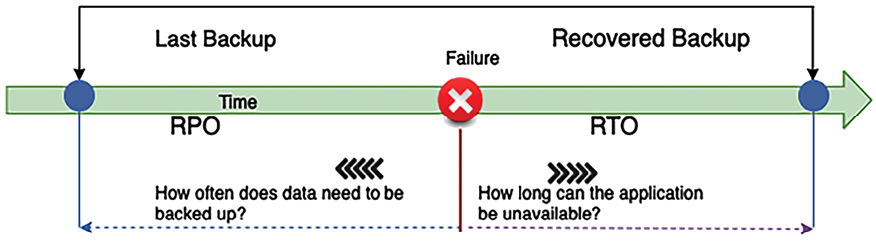
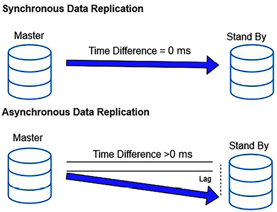
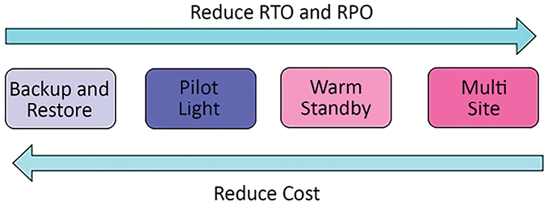
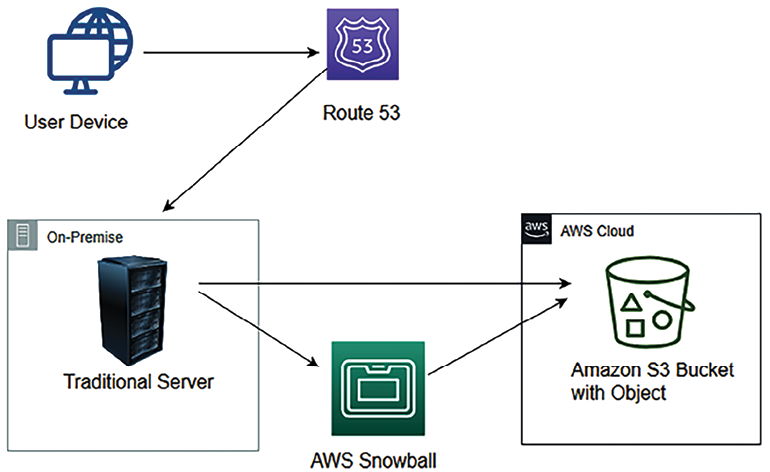
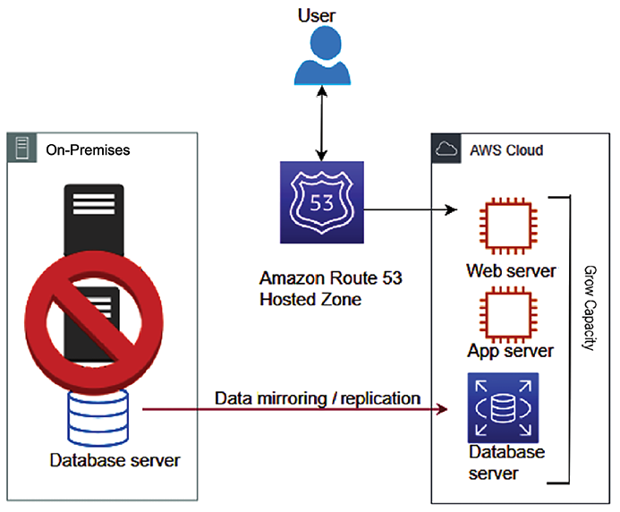
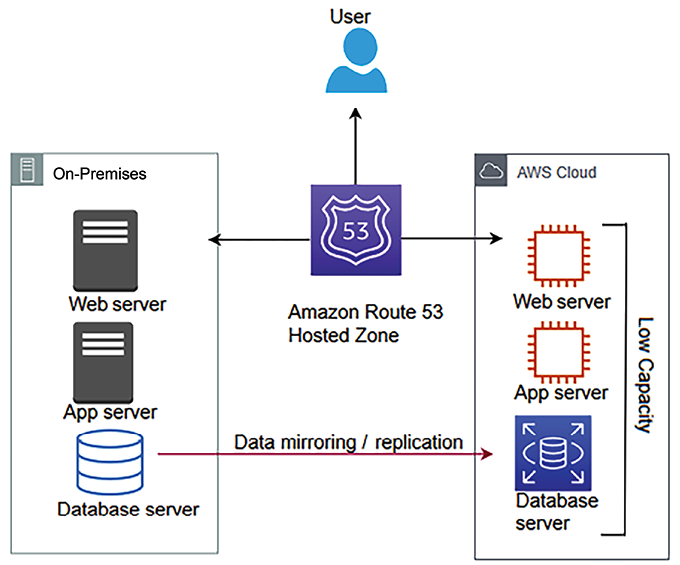
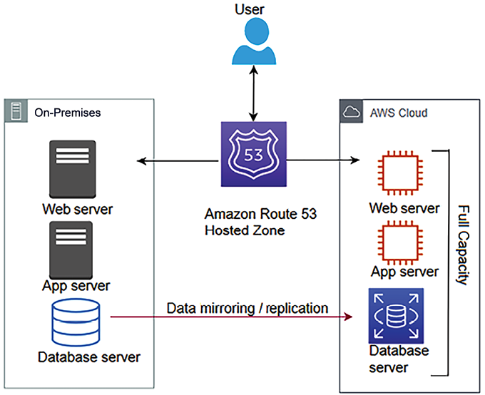

# ملاحظات قابلیت اطمینان معماری

قابلیت اطمینان برنامه یک جنبه ضروری در طراحی معماری است و برای موفقیت هر کسب و کاری حیاتی است.

**قابلیت اطمینان** به معنای توانایی سیستم برای بازیابی از خرابی است. این در مورد این است که برنامه خود را مقاوم به خطا کنید و قادر به بازیابی از هرگونه خرابی زیرساخت یا سرور بدون تأثیر بر تجربه مشتری است. سیستم شما باید آماده رسیدگی به هر موقعیتی باشد که می تواند باعث اختلال شود.

از آنجایی که اکنون انواع مشاغل آنلاین هستند، در دسترس بودن بالا نیز به یک معیار اجباری برای برنامه های آنلاین تبدیل شده است. کاربران می خواهند هر زمان که خواستند برنامه شما را مرور کنند و کارهایی مانند خرید و بانکداری را به راحتی انجام دهند. در این فصل، اصول طراحی مختلف را یاد خواهید گرفت تا راه حل خود را قابل اعتماد کنید. هنگام ارزیابی قابلیت اطمینان، باید تمام اجزای معماری را در نظر بگیرید. شما خواهید فهمید که چگونه فناوری مناسب را برای اطمینان از قابلیت اطمینان معماری خود در هر لایه انتخاب کنید.

بهترین روش های زیر را برای قابلیت اطمینان در این فصل خواهید آموخت:

- اصول طراحی برای قابلیت اطمینان معماری
- انتخاب فناوری برای قابلیت اطمینان معماری
- بهبود قابلیت اطمینان با استفاده از ابر

در پایان این فصل، شما با تکنیک‌های مختلف بازیابی فاجعه و روش‌های تکثیر داده‌ها آشنا می‌شوید تا از در دسترس بودن برنامه خود و تداوم فرآیندهای تجاری اطمینان حاصل کنید.

# اصول طراحی برای قابلیت اطمینان معماری

قابلیت اطمینان و **در دسترس بودن بالا** (**HA**) ستون های اساسی برای اطمینان از اینکه برنامه ها و زیرساخت ها می توانند خواسته های کاربر را بدون وقفه برآورده کنند، هستند. قابلیت اطمینان بر توانایی سیستم برای عملکرد صحیح تحت شرایط خاص و برای یک دوره خاص تمرکز دارد.

این شامل طراحی سیستم‌هایی برای مهار و مدیریت خرابی‌ها در کوچک‌ترین محدوده ممکن است و تأثیر آن بر عملیات کلی را به حداقل می‌رساند. این رویکرد مستلزم درک جامع حالت‌های شکست بالقوه و اجرای استراتژی‌های کاهش هدفمند برای جلوگیری از این خرابی‌ها یا بهبودی دلپذیر از آنها است.

HA، که در _فصل 2_ به تفصیل مورد بحث قرار گرفت، ارتباط نزدیکی با قابلیت اطمینان دارد، اما با تاکید بر اطمینان از اینکه سرویس ها همیشه در دسترس هستند. استراتژی‌های HA شامل ایجاد سیستم‌ها و مؤلفه‌های اضافی برای از بین بردن نقاط شکست منفرد است، در نتیجه امکان خرابی بدون درز را در صورت قطعی فراهم می‌کند. هدف حفظ تداوم خدمات حتی در مواجهه با خرابی های سخت افزاری، اختلالات شبکه یا اشکالات نرم افزاری است. با یکپارچه‌سازی قابلیت اطمینان و HA در طراحی سیستم، سازمان‌ها می‌توانند اطمینان حاصل کنند که برنامه‌های کاربردی آن‌ها در برابر خرابی قوی هستند و می‌توانند سطوح خدمات ثابت را حفظ کنند.

در این بحث اصول طراحی استاندارد وجود دارد که به شما کمک می کند تا قابلیت اطمینان سیستم خود را تقویت کنید. متوجه خواهید شد که تمام اصول طراحی قابلیت اطمینان ارتباط نزدیکی با هم دارند و مکمل یکدیگر هستند.

## ساخت سیستم های خودترمیمی با استفاده از اتوماسیون

ادغام قابلیت‌های خوددرمانی و اتوماسیون در طراحی سیستم شما، قابلیت اطمینان آن را افزایش می‌دهد و به آن اجازه می‌دهد تا به طور مستقل خرابی‌ها را پیش‌بینی کند و از آن بازیابی کند. یک سیستم خود ترمیم کننده به طور فعال خرابی ها را در لایه های مختلف سیستم - اعم از سخت افزار، شبکه یا نرم افزار - شناسایی و تصحیح می کند و تأثیر آن بر کاربران نهایی را به حداقل می رساند. این رویکرد مستلزم شناسایی **شاخص‌های کلیدی عملکرد** (**KPI**) مرتبط با برنامه و عملیات تجاری شما است، مانند ظرفیت رسیدگی به درخواست در ثانیه یا زمان بارگذاری صفحه وب. KPIهای سطح زیرساخت ممکن است شامل آستانه هایی برای استفاده از CPU و حافظه باشند، و اطمینان حاصل کنند که از محدودیت های از پیش تعریف شده تجاوز نمی کنند.

برای دستیابی به معماری خودترمیمی، یک سیستم نظارتی قوی را پیاده سازی کنید که این KPI ها را ردیابی می کند و با نزدیک شدن به آستانه های بحرانی به شما هشدار می دهد. این سیستم باید توسط استراتژی‌های اتوماسیونی پشتیبانی شود که به عنوان مثال می‌تواند سرورهای اضافی را برای مدیریت بار افزایش یافته در زمانی که استفاده از CPU به حداکثر درصد مجاز خود نزدیک می‌شود، بچرخاند. این سطح از نظارت فعال و پاسخ خودکار نه تنها از خرابی های احتمالی جلوگیری می کند، بلکه از سیستم در حفظ سطوح عملکرد بهینه بدون مداخله دستی نیز پشتیبانی می کند.

علاوه بر این، استفاده از اتوماسیون در طول چرخه عمر برنامه شما - از استقرار و پیکربندی گرفته تا مقیاس بندی زیرساخت - باعث ایجاد یک محیط چابک تر و انعطاف پذیرتر می شود. این تیم شما را قادر می‌سازد تا ویژگی‌های جدید را به سرعت اجرا کند، آزادانه‌تر آزمایش کند و عملکرد سیستم را بدون توجه به نوسان بار کاری تضمین کند. خودکارسازی مقیاس‌بندی منابع بر اساس تقاضاهای برنامه‌ریزی‌شده یا افزایش ناگهانی ترافیک، تضمین می‌کند که برنامه پاسخگو و در دسترس باقی می‌ماند. با استفاده از اتوماسیون برای استقرار مشاغل مستقل و جمع‌آوری نتایج آنها، می‌توانید نه تنها به قابلیت اطمینان و کارایی بالاتری دست یابید، بلکه توانایی سیستم را برای بازیابی خود از حوادث افزایش دهید و زیرساخت‌های خود را واقعاً انعطاف‌پذیر و خودپایدار کنید.

### تضمین کیفیت

اغلب، شما باید همان پیکربندی را که در محیط توسعه خود دارید در محیط های **تضمین کیفیت** (**QA**) اعمال کنید. ممکن است چندین محیط QA برای هر مرحله تست وجود داشته باشد که شامل تست عملکرد، **تست پذیرش کاربر** (**UAT**) و محیط های تست استرس می باشد.

اغلب، یک آزمایش‌کننده QA نقصی را کشف می‌کند که ناشی از پیکربندی اشتباه منابع است، که می‌تواند باعث تاخیر بیشتر در برنامه آزمایش شود. مهمتر از همه، شما نمی توانید یک خطای پیکربندی در سرورهای تولید را تحمل کنید، که می تواند باعث قطعی گسترده شود، بنابراین بهتر است آنها را از قبل آزمایش کنید.

برای بازتولید دقیقاً همان پیکربندی محیط توسعه خود در محیط QA خود، ممکن است لازم باشد دستورالعمل های پیکربندی گام به گام را مستند کنید. تکرار مراحل مشابه برای پیکربندی هر محیط به صورت دستی می تواند مستعد خطا باشد. همیشه احتمال خطای انسانی وجود دارد، مانند اشتباه تایپی، به عنوان مثال، در نام پایگاه داده. راه حل این چالش، خودکارسازی این مراحل با ایجاد یک اسکریپت است. خود اسکریپت اتوماسیون می تواند مستند باشد.

تا زمانی که اسکریپت صحیح باشد، قابل اعتمادتر از پیکربندی دستی است. بدون شک قابل تکرار است. شناسایی منابع ناسالم و راه‌اندازی منابع جایگزین می‌تواند خودکار باشد و می‌توانید در صورت تغییر منابع، تیم عملیات فناوری اطلاعات را مطلع کنید. اتوماسیون یک اصل طراحی اساسی است که باید در همه جای سیستم شما اعمال شود.

## ایجاد یک سیستم توزیع شده

برنامه های کاربردی یکپارچه از قابلیت اطمینان پایینی در مورد آپتایم سیستم برخوردار هستند، زیرا یک مشکل کوچک در یک ماژول خاص می تواند کل سیستم را از بین ببرد. تقسیم برنامه شما به چندین سرویس کوچک باعث کاهش _Impact area_ می شود. یک بخش از برنامه نباید کل سیستم را تحت تأثیر قرار دهد و برنامه می تواند به عملکردهای حیاتی خود ادامه دهد. به عنوان مثال، در یک وب‌سایت تجارت الکترونیک، مشکل در سرویس پرداخت نباید بر توانایی مشتری برای سفارش‌دادن تأثیر بگذارد، زیرا پرداخت می‌تواند بعداً پردازش شود.

در سطح خدمات، برنامه خود را به صورت افقی مقیاس دهید تا در دسترس بودن سیستم افزایش یابد. سیستمی را طراحی کنید تا از چندین جزء کوچکتر که با هم کار می کنند به جای یک سیستم یکپارچه واحد برای کاهش ناحیه ضربه استفاده کنید. در طراحی توزیع‌شده، درخواست‌ها توسط اجزای مختلف سیستم مدیریت می‌شوند و خرابی یک جزء بر عملکرد سایر بخش‌های سیستم تأثیری ندارد. به عنوان مثال، در یک وب سایت تجارت الکترونیک، خرابی اجزای مدیریت انبار تأثیری بر سفارش مشتری نخواهد داشت.

با این حال، مکانیسم ارتباطی می تواند در یک سیستم توزیع شده پیچیده باشد. این پیچیدگی از نیاز به اطمینان از تبادل اطلاعات قابل اعتماد در میان رایانه های مختلف شبکه ای ناشی می شود که هر کدام احتمالاً سیستم عامل های مختلفی را اجرا می کنند و در مناطق جغرافیایی مختلف قرار دارند. چالش‌ها شامل رسیدگی به تأخیر شبکه، مدیریت ضمانت‌های تحویل پیام، همگام‌سازی داده‌ها در گره‌ها برای اطمینان از ثبات، و اجرای تحمل خطا برای مقاومت در برابر خرابی‌های جزئی سیستم است. علاوه بر این، توسعه و نگهداری یک پروتکل ارتباطی که به طور موثر از نیازهای متنوع یک معماری توزیع شده پشتیبانی می کند، به پیچیدگی آن می افزاید.

الگوی قطع کننده مدار می تواند در اینجا به مدیریت وابستگی های سیستم کمک کند. همانطور که در مورد الگوی قطع کننده مدار در _فصل 4_، _ الگوهای طراحی معماری راه حل_ آموختید، ایده اولیه ساده است. شما یک فراخوانی تابع محافظت شده را در یک شیء قطع کننده مدار قرار می دهید، که خرابی ها را کنترل می کند و برای کاهش آنها اقدامات خودکار انجام می دهد.

## نظارت و افزایش ظرفیت

اشباع منابع رایج ترین دلیل شکست برنامه است. اغلب، شما با این مشکل مواجه می شوید که برنامه های شما به دلیل بارگذاری بیش از حد CPU، حافظه یا هارد دیسک شروع به رد درخواست می کنند.

در یک محیط داخلی سنتی، باید ظرفیت سرور را بر اساس این فرض از قبل محاسبه کنید. ترافیک آنلاین بسیار غیرقابل پیش بینی است و به دلیل روندهای جهانی به شدت در نوسان است. معمولا، تهیه سخت افزار بین 3 تا 6 ماه طول می کشد، و حدس زدن ظرفیت از قبل دشوار است. سفارش سخت‌افزار اضافی هزینه‌های اضافی را به همراه خواهد داشت زیرا منبع بی‌کار می‌ماند، و کمبود منابع باعث از دست رفتن کسب‌وکار به دلیل عدم اطمینان برنامه می‌شود.

شما به محیطی نیاز دارید که در آن نیازی به حدس زدن ظرفیت نباشد و برنامه شما بتواند بر اساس تقاضا مقیاس پذیر باشد.

یک ارائه‌دهنده ابر عمومی مانند **Amazon Web Services** (**AWS**) **زیرساخت را به عنوان یک سرویس** (**IaaS**) فراهم می‌کند، که دسترسی به تقاضای منابع را تسهیل می‌کند.

در فضای ابری، می‌توانید عرضه و تقاضای سیستم را کنترل کنید. در صورت نیاز می‌توانید افزودن یا حذف منابع را خودکار کنید. این به شما امکان می دهد تا سطح منابعی را که بدون تامین بیش از حد یا کم تامین تقاضا را برآورده می کند، حفظ کنید.

## انجام اعتبار سنجی بازیابی

وقتی نوبت به اعتبارسنجی زیرساخت می‌رسد، بیشتر اوقات، سازمان‌ها بر اعتبار بخشیدن به مسیری شاد تمرکز می‌کنند که در آن همه چیز کار می‌کند. که در

درعوض، باید بررسی کنید که سیستم شما چگونه از کار می افتد و روش های بازیابی چقدر خوب کار می کنند. درخواست خود را تأیید کنید، با این فرض که همه چیز همیشه شکست بخورد. فقط انتظار نداشته باشید که استراتژی های بازیابی و شکست شما کارساز باشد. مطمئن شوید که آنها را به طور منظم آزمایش کنید تا اگر مشکلی پیش آمد تعجب نکنید.

اعتبار سنجی مبتنی بر شبیه سازی به شما کمک می کند تا خطرات احتمالی را کشف کنید. می‌توانید سناریوی احتمالی را که می‌تواند باعث از کار افتادن سیستم شما شود، خودکار کنید و بر اساس آن یک پاسخ حادثه را آماده کنید. اعتبار سنجی شما باید قابلیت اطمینان برنامه را بهبود بخشد تا هیچ چیز در تولید شکست نخورد.

بازیابی گاهی اوقات به عنوان یکی از اجزای در دسترس بودن نادیده گرفته می شود. برای بهبود **هدف نقطه بازیابی** (**RPO**) و **هدف زمان بازیابی** (**RTO**) سیستم، باید از داده ها و برنامه ها و پیکربندی آنها به عنوان تصویر ماشین نسخه پشتیبان تهیه کنید. در بخش بعدی با RTO و RPO بیشتر آشنا خواهید شد. فرض کنید یک بلای طبیعی یک یا چند مؤلفه را از دسترس خارج می کند یا منبع داده اولیه شما را از بین می برد. در این صورت، باید بتوانید سرویس را به سرعت و بدون از دست دادن اطلاعات بازیابی کنید. بیایید در ادامه درباره استراتژی‌های خاص بازیابی بلایا برای بهبود قابلیت اطمینان برنامه و انتخاب‌های فناوری مرتبط بحث کنیم.

# انتخاب فناوری برای قابلیت اطمینان معماری

قابلیت اطمینان برنامه اغلب به در دسترس بودن برنامه برای ارائه خدمات به کاربران نگاه می کند. عوامل متعددی باعث می شود تا برنامه شما در دسترس باشد. با این حال، **تحمل خطا** به افزونگی داخلی اجزای برنامه اشاره دارد. برنامه شما ممکن است بسیار در دسترس باشد، اما 100٪ تحمل خطا نداشته باشد. به عنوان مثال، اگر برنامه شما به چهار سرور برای رسیدگی به درخواست کاربر نیاز دارد، آنها را بین دو مرکز داده برای HA تقسیم می کنید.

اگر یک سایت از کار بیفتد، سیستم شما همچنان با ظرفیت 50 درصد در دسترس است، اما ممکن است انتظارات عملکرد کاربر را تحت تاثیر قرار دهد. با این حال، اگر افزونگی یکسانی را در هر دو سایت با چهار سرور ایجاد کنید، برنامه شما نه تنها بسیار در دسترس خواهد بود، بلکه 100% تحمل خطا نیز خواهد داشت.

فرض کنید برنامه شما 100% قابل تحمل خطا نیست. در این صورت، می‌خواهید مقیاس‌پذیری خودکار را اضافه کنید، و تعریف کنید که چگونه زیرساخت برنامه شما به نیازهای افزایش ظرفیت پاسخ می‌دهد تا اطمینان حاصل شود که برنامه شما در دسترس است و مطابق با استانداردهای مورد نیاز شما عمل می‌کند. برای قابل اعتماد کردن برنامه خود، باید بتوانید خدمات را به سرعت و بدون از دست دادن داده بازیابی کنید. در ادامه، این فرآیند بازیابی را به عنوان **بازیابی فاجعه** (**DR**) بررسی خواهیم کرد. قبل از پرداختن به سناریوهای مختلف DR، بیایید در مورد RTO/RPO و تکثیر داده‌ها بیشتر بیاموزیم زیرا یک عامل کلیدی برای اندازه‌گیری هنگام برنامه‌ریزی برای DR است.

## برنامه ریزی RPO و RTO

برنامه های کاربردی تجاری باید در دسترس بودن خدمات را در قالب یک توافق نامه در سطح خدمات ** (**SLA**) تعریف کنند. سازمان ها SLA را برای اطمینان از در دسترس بودن و قابلیت اطمینان برنامه برای کاربران خود تعریف می کنند. به عنوان مثال، ممکن است در یک SLA بگویید که برنامه شما باید 99.9٪ در یک سال معین در دسترس باشد، یا اینکه سازمان می تواند 43 دقیقه در ماه خرابی را تحمل کند و غیره. SLA تعریف شده در درجه اول RPO و RTO را برای یک برنامه کاربردی هدایت می کند.

RPO مقدار از دست دادن داده ای است که یک سازمان می تواند در یک دوره معین تحمل کند. به عنوان مثال، درخواست من در صورتی قابل قبول است که 15 دقیقه داده را از دست بدهد. در این حالت، اگر هر 15 دقیقه یک بار سفارشات مشتری را برای انجام پردازش پردازش می کنید، می توانید در صورت بروز هرگونه خرابی سیستم در برنامه انجام سفارش، پردازش مجدد آن داده ها را تحمل کنید. RPO به تعریف استراتژی پشتیبان گیری از داده ها کمک می کند.

RTO در مورد زمان از کار افتادن برنامه و مدت زمان لازم برای بازیابی و عملکرد نرمال برنامه پس از وقوع خرابی است. نمودار زیر تفاوت بین RTO و RPO را نشان می دهد:

شکل 8.1: RTO و RPO

در نمودار قبل، فرض کنید خرابی در ساعت 10 صبح رخ می دهد. و آخرین نسخه پشتیبان را در ساعت 9 صبح گرفتید. در صورت خرابی سیستم، 1 ساعت داده را از دست خواهید داد. هنگامی که سیستم خود را بازیابی می کنید، یک ساعت اطلاعات از دست می رود، زیرا هر ساعت از داده ها نسخه پشتیبان تهیه می کنید.

در این مورد، RPO سیستم شما 1 ساعت است، زیرا می تواند زندگی با یک ساعت از دست دادن داده را تحمل کند. در این حالت، RPO نشان می دهد که حداکثر از دست دادن داده قابل تحمل 1 ساعت است.

اگر سیستم شما 30 دقیقه طول بکشد تا به نسخه پشتیبان بازگردد و سیستم را بالا بیاورد، RTO شما را نیم ساعت تعریف می کند. این به این معنی است که حداکثر زمان خاموشی قابل تحمل 30 دقیقه است. RTO مدت زمانی است که برای بازیابی کل سیستم پس از خرابی که باعث خرابی می شود، که در این مورد 30 دقیقه است، طول می کشد.

یک سازمان معمولاً در مورد RPO و RTO قابل قبول بر اساس تجربه کاربر و تأثیر مالی یا اعتبار بر تجارت در صورت در دسترس نبودن سیستم تصمیم می گیرد. سازمان‌ها راه‌حل‌هایی را برای بازیابی مؤثر سیستم در هر سازمان برنامه‌ریزی می‌کنند

RTO و RPO را جریمه کرد. با گذشت زمان، شما باید RTO/RPO را کاهش دهید، که به طور مستقیم به مزایای تجاری منجر می شود زیرا برنامه زمان کار بیشتری خواهد داشت. اکنون می توانید ببینید که چگونه داده ها کلید بازیابی سیستم هستند، بنابراین بیایید روش هایی را برای به حداقل رساندن از دست دادن داده ها بیاموزیم.

## تکرار داده ها

تکثیر داده ها و عکس های فوری کلیدهای DR و قابل اعتماد کردن سیستم شما هستند. Replication یک کپی از سایت داده اولیه در سایت ثانویه ایجاد می کند. در صورت خرابی سیستم اولیه، سیستم می تواند به سیستم ثانویه خراب شود و به طور قابل اعتماد به کار خود ادامه دهد. این می تواند داده های فایل شما ذخیره شده در **درایو NAS**، **عکس فوری پایگاه داده**، یا **عکس فوری تصویر ماشین** باشد. سایت‌ها می‌توانند دو سیستم داخلی، دو دستگاه جداگانه در یک محل، یا یک ابر عمومی جدا شده فیزیکی باشند.

تکثیر داده ها نه تنها برای بازیابی فاجعه مفید است، بلکه می تواند با ایجاد سریع یک محیط جدید برای آزمایش و توسعه، چابکی سازمان را افزایش دهد. تکثیر داده ها می تواند همزمان یا ناهمزمان باشد.

### همزمان در مقابل تکرار ناهمزمان

همانندسازی همزمان یک کپی داده را در زمان واقعی ایجاد می کند. تکثیر بلادرنگ داده ها به کاهش RPO و افزایش قابلیت اطمینان در صورت وقوع فاجعه کمک می کند. با این حال، گران است زیرا به منابع اضافی در سیستم اولیه برای تکرار مداوم داده ها نیاز دارد.

همانندسازی ناهمزمان، کپی هایی از داده ها را با مقداری تأخیر یا طبق برنامه زمانی تعریف شده ایجاد می کند. با این حال، همانندسازی ناهمزمان هزینه کمتری دارد زیرا از منابع کمتری نسبت به تکرار همزمان استفاده می کند. اگر سیستم شما بتواند با RPO طولانی‌تری کار کند، می‌توانید همانندسازی ناهمزمان را انتخاب کنید.

در مورد فناوری پایگاه داده مانند Amazon RDS، اگر یک RDS با چندین خطای **Availability Zone** (**AZ**) ایجاد کنیم، همانندسازی همزمان اعمال می شود. این راه‌اندازی تضمین می‌کند که پایگاه داده اصلی شما و نسخه مشابه آن در AZ دیگر همیشه همگام هستند و HA و دوام داده را فراهم می‌کنند. اگر پایگاه داده اولیه با مشکلاتی مواجه شود، سرویس می تواند به طور خودکار با کمترین اختلال در نسخه مشابه از کار بیفتد. برای کپی‌های خواندنی، تکرار ناهمزمان وجود دارد، و می‌توانید از آن برای ارائه گزارش‌ها و خواندن درخواست‌ها استفاده کنید.

همانطور که در نمودار معماری زیر نشان داده شده است، در تکرار همزمان، هیچ تاخیری از تکرار داده ها بین نمونه اصلی و آماده به کار پایگاه داده وجود ندارد، در حالی که، در مورد تکرار ناهمزمان، ممکن است در حین تکرار داده ها بین اولیه، تاخیر وجود داشته باشد. و نمونه تکرار:

شکل 8.2: تکثیر داده های همزمان و ناهمزمان

بیایید برخی از روش‌های تکثیر داده را برای رویکردهای همزمان و ناهمزمان بررسی کنیم.

### روش های تکرار

روش تکرار روشی برای استخراج داده ها از سیستم منبع و ایجاد یک کپی برای اهداف بازیابی اطلاعات است. روش‌های تکثیر مختلفی برای ذخیره یک کپی از داده‌ها در هر نوع ذخیره‌سازی برای ادامه فرآیند کسب‌وکار موجود است. تکرارها را می توان به روش های زیر پیاده سازی کرد:

- **تکثیر مبتنی بر آرایه**: در این نرم افزار داخلی به صورت خودکار داده ها را تکرار می کند. با این حال، آرایه های ذخیره سازی مبدأ و مقصد باید برای تکرار داده ها سازگار و همگن باشند. یک آرایه ذخیره سازی شامل چندین دیسک ذخیره سازی در یک رک است.

   شرکت های بزرگ به دلیل سهولت استقرار و کاهش قدرت محاسباتی سیستم میزبان، از تکرار مبتنی بر آرایه استفاده می کنند. می‌توانید محصولات تکراری مبتنی بر آرایه مانند HP Storage، EMC SAN Copy و NetApp SnapMirror را انتخاب کنید.

- **تکثیر مبتنی بر شبکه**: این می تواند داده ها را بین انواع مختلف آرایه های ذخیره سازی ناهمگن کپی کند. از یک سوئیچ یا ابزار اضافی بین آرایه های ذخیره سازی ناسازگار برای تکثیر داده ها استفاده می کند. در تکثیر مبتنی بر شبکه، هزینه تکثیر می‌تواند بالاتر باشد، زیرا چندین بازیکن وارد تصویر می‌شوند. شما می توانید از بین محصولات تکراری مبتنی بر شبکه مانند NetApp Replication X و EMC RecoverPoint انتخاب کنید.
- **تکثیر مبتنی بر هاست**: در این کار، یک عامل نرم افزاری روی هاست خود نصب می کنید که می تواند داده ها را در هر سیستم ذخیره سازی مانند NAS، SAN یا DAS کپی کند. شما می توانید از یک فروشنده نرم افزار مبتنی بر میزبان، به عنوان مثال، Symantec، Commvault، CA یا Vision Solution استفاده کنید.

   این امر در **کسب و کارهای کوچک و متوسط** (**SMBs**) به دلیل هزینه های اولیه پایین تر و سازگاری دستگاه های ناهمگن رایج است. با این حال، به دلیل نیاز به نصب عامل بر روی سیستم عامل میزبان، توان محاسباتی بیشتری مصرف می کند.

- **تکثیر مبتنی بر Hypervisor**: این VM-aware است که به معنی کپی کردن کل ماشین مجازی از یک هاست به میزبان دیگر است. از آنجایی که سازمان ها بیشتر از ماشین های مجازی استفاده می کنند، یک رویکرد DR بسیار کارآمد برای کاهش RTO ارائه می دهد. تکثیر مبتنی بر Hypervisor بسیار مقیاس پذیر است و منابع کمتری را نسبت به تکرار مبتنی بر میزبان مصرف می کند. این می تواند توسط سیستم های بومی ساخته شده در VMware و Microsoft Windows انجام شود. برای اجرای هایپ می توانید محصولی مانند Zerto را انتخاب کنید

تکرار مبتنی بر rvisor یا محصول دیگری از فروشندگان مختلف.

قبلاً در _فصل ۲_ _اصول طراحی معماری راه حل_ با مقیاس پذیری و تحمل خطا آشنا شدید. در _فصل 4_، _الگوهای طراحی معماری راه حل_، با الگوهای طراحی مختلف آشنا شدید تا معماری خود را بسیار در دسترس قرار دهید. اکنون، راه های متعددی برای بازیابی سیستم خود از خرابی و قابل اعتماد ساختن آن بسیار کشف خواهید کرد.

## برنامه ریزی برای بازیابی فاجعه

DR در مورد حفظ تداوم کسب و کار در هنگام شکست سیستم است. این در مورد آماده سازی سازمان برای هرگونه خرابی احتمالی سیستم و توانایی بازیابی از آن است. برنامه ریزی DR ابعاد متعددی از جمله خرابی سخت افزار و نرم افزار را پوشش می دهد.

هنگام برنامه ریزی برای DR، همیشه مطمئن شوید که تلفات عملیاتی مانند قطع برق، قطع شبکه، خرابی سیستم گرمایش و سرمایش، نقض امنیت فیزیکی و سایر حوادث مانند آتش سوزی، سیل یا خطای انسانی را در نظر می گیرید.

سازمان ها بر اساس اهمیت و تأثیر سیستم، تلاش و پول را در برنامه ریزی DR سرمایه گذاری می کنند. یک برنامه کاربردی درآمدزا باید همیشه فعال باشد زیرا به طور قابل توجهی بر روی تصویر و سودآوری شرکت تأثیر می گذارد. برای چنین برنامه‌ای، سازمان تلاش زیادی برای ایجاد زیرساخت‌های خود و آموزش کارکنان خود برای وضعیت DR انجام می‌دهد. DR مانند یک بیمه نامه است که باید روی آن سرمایه گذاری کنید و حتی زمانی که از آن استفاده نمی کنید آن را حفظ کنید، زیرا در صورت اتفاقات غیرقابل پیش بینی، یک طرح DR نجاتی برای کسب و کار شما خواهد بود.

پایه‌های اهمیت تجاری، مانند برنامه‌های کاربردی نرم‌افزار، را می‌توان بر روی طیفی از پیچیدگی قرار داد. چهار سناریو DR وجود دارد که از بالاترین به پایین ترین RTO/RPO به صورت زیر طبقه بندی شده اند:

- پشتیبان گیری و بازیابی
- چراغ خلبان
- آماده باش گرم
- چند سایتی

همانطور که در نمودار زیر نشان داده شده است، در برنامه ریزی DR، با پیشرفت در هر گزینه، RTO و RPO شما کاهش می یابد در حالی که هزینه پیاده سازی افزایش می یابد. شما باید یک مبادله مناسب بین الزامات RTO/RPO و هزینه بر اساس الزامات قابلیت اطمینان برنامه خود ایجاد کنید:

شکل 8.3: طیف گزینه های DR

استراتژی‌های DR به شدت برای نیازهای منحصربه‌فرد هر سازمان سفارشی می‌شوند، با تصمیم برای اجرای یک خرابی کامل سایت بسته به عوامل حیاتی مختلف. نقطه آغاز چنین اقدامات شدیدی متفاوت است، از اختلالات جزئی تا فجایع بزرگ مانند تخریب مرکز داده. به عنوان مثال، در صورت وقوع یک فاجعه مهم، یک سازمان ممکن است نیاز به ارزیابی سریع و اولویت بندی خدمات حیاتی داشته باشد - اغلب خدماتی که بخش قابل توجهی از درآمد آن را تشکیل می دهند. این خدمات اولویت دار ممکن است دارای یک RTO از پیش تعریف شده باشند، مانند یک پنجره 24 ساعته برای از سرگیری عملیات قبل از اینکه تأثیر مالی بسیار شدید شود، با در نظر گرفتن ضررهای احتمالی مانند جریمه، نقض SLA و کاهش فروش. از سوی دیگر، برای اختلالات خدماتی کم‌تر فاجعه‌آمیز اما همچنان حیاتی، یک شرکت ممکن است پروتکل‌های شکست خودکار را برای تحمل خرابی بسیار کوتاه‌تر، مانند 15 دقیقه تنظیم کند. در هر دو سناریو، معیارهای تصمیم گیری برای DR شامل ارزیابی تحلیل تاثیر کسب و کار، درک RTO و RPO برای خدمات ضروری، ارزیابی هزینه خرابی در برابر فرآیند بازیابی و اطمینان از انطباق با هرگونه الزامات قانونی است. علاوه بر این، امکان سنجی فنی، از جمله در دسترس بودن و آماده بودن یک سایت ثانویه، نقش مهمی در تعیین پاسخ مناسب برای اطمینان از تداوم و به حداقل رساندن اختلالات عملیاتی ایفا می کند.

بیایید هر یک از گزینه های ذکر شده در بالا را با جزئیات در مورد انتخاب های تکنولوژی مورد بررسی قرار دهیم. توجه داشته باشید که ابرهای عمومی مانند AWS شما را قادر می سازد تا هر یک از استراتژی های DR قبلی را مقرون به صرفه و کارآمد اجرا کنید.

### پشتیبان گیری و بازیابی

پشتیبان گیری و بازیابی کم هزینه ترین گزینه است که منجر به RPO و RTO بالاتر می شود. این روش برای شروع ساده و بسیار مقرون به صرفه است زیرا فقط به فضای ذخیره سازی پشتیبان نیاز دارید. این ذخیره سازی پشتیبان می تواند یک درایو نوار، هارد دیسک یا درایو دسترسی به شبکه باشد. همانطور که نیازهای ذخیره سازی شما افزایش می یابد، افزودن و نگهداری سخت افزار بیشتر در مناطق می تواند یک کار دلهره آور باشد. یکی از مقرون به صرفه ترین و ساده ترین گزینه ها استفاده از ابر به عنوان ذخیره سازی پشتیبان است. آمازون S3 یک مثال است. ظرفیت ذخیره سازی نامحدودی را با هزینه کم و با یک مدل پرداختی ارائه می دهد.

نمودار زیر یک سیستم DR اساسی را نشان می دهد. در این نمودار، داده ها در یک مرکز داده سنتی قرار دارند و نسخه های پشتیبان آن در AWS ذخیره می شوند. انواع هارد درایوهای فیزیکی AWS Import/Export یا Snowball در محدوده اندازه 8 ترابایت تا 100 ترابایت برای دریافت داده ها به AWS استفاده می شود و اطلاعات بعداً در Amazon S3 ذخیره می شود:

شکل 8.4: پشتیبان گیری از داده ها در آمازون S3 از زیرساخت داخلی

می توانید از راه حل های شخص ثالث دیگر موجود برای پشتیبان گیری و بازیابی استفاده کنید. برخی از محبوب ترین گزینه ها عبارتند از NetApp، VMware، Tivoli و Commvault.

هنگام برنامه ریزی برای DR در یک محیط ابری، ترکیب آن بسیار مهم است

استراتژی‌هایی که از نقاط قوت ارائه‌دهندگان ابری مختلف، مانند AWS، **Google Cloud Platform** (**GCP**) و Microsoft Azure استفاده می‌کنند. این رویکرد انعطاف پذیری و انعطاف پذیری را در پلتفرم های مختلف تضمین می کند. در اینجا یک روش کلی قابل اجرا در این خدمات ابری وجود دارد:

- **راه‌حل‌های پشتیبان‌گیری و ذخیره‌سازی**: از خدمات ذخیره‌سازی ابری برای نگهداری نسخه پشتیبان از سیستم‌های خود استفاده کنید. برای AWS، آمازون S3 می تواند به عنوان یک راه حل ذخیره سازی پشتیبان قابل اعتماد عمل کند. در GCP، Google Cloud Storage ذخیره‌سازی شی بادوام و بسیار در دسترس را ارائه می‌کند. معادل Azure، Azure Blob Storage، سرویس مشابهی را برای ذخیره مقادیر زیادی از داده‌های بدون ساختار ارائه می‌دهد.\* **تصاویر ماشین و پیکربندی**: تصاویر ماشین را آماده کنید که شامل سیستم عامل، برنامه‌ها و پیکربندی‌های شما باشد. AWS از **Amazon Machine Images** (**AMIs**) استفاده می کند، GCP از تصاویر Compute Engine استفاده می کند و Azure تصاویر ماشین مجازی Azure را ارائه می دهد. این تصاویر را می توان با نرم افزارها و وصله های امنیتی لازم سفارشی و از پیش پیکربندی کرد تا در صورت بروز فاجعه آماده استقرار شوند.
- **مستندات بازیابی سیستم**: مراحل مورد نیاز برای بازیابی سیستم خود را از پشتیبان گیری در پلتفرم های مختلف ابری به وضوح مستند کنید. این مستندات باید شامل نحوه استقرار تصاویر ماشین ذخیره شده و نحوه بازیابی پایگاه داده ها و برنامه ها از پشتیبان گیری باشد.
- **روش‌های مسیریابی و خطای ترافیک **: روند مسیریابی مجدد ترافیک از سایت اصلی به سایت پشتیبان در ابر را مشخص کنید. AWS Route 53 را برای مدیریت DNS و مسیریابی ترافیک ارائه می دهد، GCP دارای Cloud DNS و Traffic Director است و Azure Azure Traffic Manager و DNS Zone را ارائه می دهد. درک نحوه استفاده از این خدمات برای سناریوهای شکست ضروری است.
- ** استقرار runbook **: یک runbook جامع ایجاد کنید که پیکربندی‌های استقرار و مسائل احتمالی را همراه با وضوح آن‌ها شرح دهد. این ران‌بوک باید دارای ابر ناشناس باشد و با ویژگی‌های AWS، GCP و Azure سازگار باشد، و اطمینان حاصل کند که تیم‌ها بدون توجه به پلتفرم ابری مورد استفاده آماده هستند.

در مرحله آماده سازی، تصاویر و نسخه های پشتیبان سفارشی ماشین را در راه حل های ذخیره سازی ابری مربوطه ایجاد و ذخیره کنید - S3 برای AWS، Cloud Storage برای GCP و Blob Storage برای Azure. همچنین، عکس های فوری از پایگاه های داده، حجم های ذخیره سازی و هر فایل ضروری را آماده کنید. این رویکرد پیشگیرانه تضمین می‌کند که بدون در نظر گرفتن ارائه‌دهنده ابر، سازمان شما می‌تواند به سرعت از یک فاجعه با کمترین زمان خرابی و از دست دادن داده بازیابی کند.

این الگوی DR تنظیم آسان و نسبتاً ارزان است. با این حال، در این سناریو، هم RPO و هم RTO بالا خواهند بود. RTO تا زمانی که سیستم از نسخه پشتیبان بازیابی شود و شروع به کار کند، زمان خاموشی خواهد بود، در حالی که RPO از بین رفته به فرکانس پشتیبان گیری سیستم بستگی دارد. بیایید رویکرد بعدی را بررسی کنیم، چراغ آزمایشی، که RTO و RPO شما را بیشتر بهبود می‌بخشد.

### چراغ پیلوت

رویکرد نور آزمایشی، روش DR کم‌هزینه بعدی پس از پشتیبان‌گیری و بازیابی است. مانند چراغ راهنما در بخاری گازی شما، شعله کوچکی که همیشه روشن است و می تواند به سرعت کل کوره را برای گرم کردن خانه روشن کند، با این روش DR، شما باید حداقل تعداد خدمات اصلی را در مناطق مختلف فعال نگه دارید. در صورت بروز فاجعه می‌توانید منابع اضافی را به سرعت بچرخانید.

شما می توانید به طور فعال لایه پایگاه داده را تکرار کنید، سپس نمونه هایی را از یک تصویر ماشین مجازی بچرخانید یا با استفاده از زیرساخت به عنوان کد، مانند CloudFormation، Terraform، Ansible و غیره، زیرساخت ایجاد کنید.

نمودار زیر یک الگوی نور پیلوت DR را نشان می دهد. در این مورد، پایگاه داده به AWS تکثیر می‌شود و نمونه‌های آمازون EC2 از وب سرورها و سرورهای برنامه آماده کار هستند اما در حال حاضر در حال اجرا نیستند:

شکل 8.5: شبیه سازی داده های نور آزمایشی به سناریوی سایت DR

یک سناریو نور آزمایشی شبیه به پشتیبان گیری و بازیابی است، که در آن شما از اکثر اجزاء یک نسخه پشتیبان تهیه می کنید و آنها را به صورت غیرفعال ذخیره می کنید. با این حال، شما نمونه‌های فعال را با ظرفیت کمتری برای اجزای حیاتی مانند پایگاه داده یا سرور احراز هویت نگهداری می‌کنید، که چرخش آن‌ها می‌تواند زمان زیادی طول بکشد. در صورت نیاز باید تمام منابع مورد نیاز از جمله تنظیمات شبکه، متعادل کننده بار و تصاویر ماشین مجازی را به طور خودکار راه اندازی کنید. از آنجایی که قطعات اصلی در حال اجرا هستند، زمان بازیابی سریعتر از روش پشتیبان گیری و بازیابی است. روش نور آزمایشی بسیار مقرون به صرفه است زیرا شما فقط برخی از منابع را با ظرفیت کامل استفاده می کنید.

شما باید تکثیر تمام داده های حیاتی را در سایت DR فعال کنید - در این مورد، ابر AWS. می‌توانید از سرویس انتقال داده AWS برای تکثیر داده‌ها بین پایگاه‌های داده داخلی و ابری استفاده کنید. برای داده های مبتنی بر فایل، می توانید از دروازه فایل آمازون استفاده کنید.

بسیاری دیگر از ابزارهای مدیریت شده توسط شخص ثالث، راه حل های تکثیر داده را به طور موثر ارائه می دهند، مانند Attunity، Quest، Syncsort، Alooma و JumpMind.

اگر سیستم اولیه خراب شود، همانطور که در نمودار زیر نشان داده شده است، می توانید نمونه های آمازون EC2 را با آخرین نسخه از داده ها راه اندازی کنید. سپس، شما دوباره

مسیر 53 آمازون را اصلاح کنید تا به وب سرور جدید اشاره کنید:

شکل 8.6: بازیابی در روش پیلوت لایت

برای روش نور آزمایشی، در صورت وقوع فاجعه، باید مراحل زیر را انجام دهید:

1. برنامه و سرورهای وب را که در حالت آماده به کار بودند راه اندازی کنید. علاوه بر این، سرورهای برنامه را با مقیاس افقی با استفاده از متعادل کننده بار بزرگ کنید.
2. به صورت عمودی نمونه پایگاه داده ای را که با ظرفیت کم اجرا می شد، افزایش دهید.
3. رکورد DNS را در روتر خود به روز کنید تا به سایت جدید اشاره کند.

در روش نور آزمایشی، شما منابع را در اطراف مجموعه داده اصلی تکرار شده به طور خودکار بالا می آورید و سیستم را به اندازه مورد نیاز برای مدیریت ترافیک فعلی مقیاس می دهید. راه اندازی الگوی DR چراغ راهنما نسبتاً آسان و ارزان است. با این حال، در این سناریو، RTO برای نمایش خودکار یک سیستم جایگزین بیشتر طول می کشد، در حالی که RPO تا حد زیادی به نوع تکرار بستگی دارد. بیایید رویکرد بعدی، آماده‌باش گرم را بررسی کنیم، که RTO و RPO شما را بیشتر بهبود می‌بخشد.

### آماده به کار گرم

آماده به کار گرم، یا آماده به کار با ظرفیت کم، یک رویکرد پیشرفته به DR را با استفاده از انعطاف پذیری ابر برای ارائه یک راه حل DR مقرون به صرفه نشان می دهد. این روش با حفظ زیرمجموعه‌ای از خدمات محیط شما در حالت کار مداوم، البته با ظرفیت کمتر از محیط تولید کامل شما، استراتژی اصلی نور آزمایشی را افزایش می‌دهد.

مزیت کلیدی رویکرد آماده به کار گرم، تعادل آن بین صرفه جویی در هزینه و آمادگی برای بازیابی است. با داشتن سرویس‌های ضروری از قبل راه‌اندازی و اجرا شده، هرچند در مقیاس کوچک‌تر، زمان بازیابی در صورت وقوع فاجعه در مقایسه با استراتژی‌های سرد یا سبک آزمایشی که در آن منابع نیاز به تهیه یا افزایش مقیاس در طول فرآیند بازیابی است، به طور قابل‌توجهی کاهش می‌یابد.

سازمان ها می توانند محیط آماده به کار گرم خود را برای رسیدگی به درصد خاصی از ترافیک تولید خود، مانند 20، 30، یا 50 درصد، بسته به اهداف بازیابی و ملاحظات بودجه خود تنظیم کنند. این انعطاف‌پذیری به یک راه‌حل سفارشی DR اجازه می‌دهد که با نیازهای تجاری و سطوح تحمل ریسک همسو باشد.

علاوه بر این، محیط آماده به کار گرم فقط به سناریوهای DR محدود نمی شود. همچنین می‌تواند با فراهم کردن بستری برای استفاده‌های غیرتولیدی مانند آزمایش، مرحله‌بندی، یا کار توسعه، اهداف دوگانه را ارائه دهد. این استفاده دوگانه از محیط آماده به کار گرم، ارزش سرمایه گذاری DR را با استفاده از زیرساخت برای اهداف اضافی فراتر از آمادگی صرف، به حداکثر می رساند و در نتیجه استفاده از منابع و کارایی هزینه را بهینه می کند.

نمودار زیر دو سیستم در حال اجرا در روش آماده به کار گرم - سیستم مرکزی و یک سیستم کم ظرفیت - را در یک ابر AWS نشان می‌دهد. شما می توانید از روتر مانند Amazon Route 53 برای توزیع درخواست ها بین سیستم مرکزی و سیستم ابری استفاده کنید:

شکل 8.7: سناریوی آماده به کار گرم در حال اجرای یک بار کاری فعال-فعال با ظرفیت کم

وقتی صحبت از پایگاه‌های داده می‌شود، آماده‌باش گرم رویکردی مشابه با نور آزمایشی دارد، جایی که داده‌ها به طور مداوم از سایت اصلی به سایت DR تکرار می‌شوند. با این حال، در حالت آماده به کار گرم، تمام اجزای لازم را 24/7 اجرا می کنید، اما آنها برای ترافیک تولید افزایش نمی یابند.

اغلب، سازمان یک استراتژی آماده به کار گرم را برای بارهای کاری حیاتی تر انتخاب می کند، بنابراین باید با استفاده از آزمایش مداوم مطمئن شوید که هیچ مشکلی در سایت DR وجود ندارد. بهترین روش آزمایش A/B است، جایی که سایت پیشرو ترافیک قابل توجهی را مدیریت می کند. مقدار کمی از ترافیک، تقریباً 1٪ تا 5٪، به سایت DR هدایت می شود. این اطمینان حاصل می کند که سایت DR قادر به ارائه ترافیک در زمانی که سایت اصلی خاموش است می باشد. همچنین، حتما نرم افزار را در سایت DR به طور مرتب وصله و به روز کنید تا با محیط تولید هماهنگ باشد.

همانطور که در نمودار زیر نشان داده شده است، در هنگام در دسترس نبودن محیط اولیه، روتر شما به سیستم ثانویه سوئیچ می کند، که به گونه ای طراحی شده است که به طور خودکار ظرفیت خود را در صورت خرابی از سیستم اولیه افزایش دهد:

شکل 8.8: مرحله بازیابی در سناریوی آماده به کار گرم

فرض کنید یک خرابی در سایت اولیه رخ می دهد. در این صورت می توانید روش زیر را در پیش بگیرید:

1. با افزایش مسیریابی ترافیک از 5% به 100% در سایت ثانویه، انتقال فوری ترافیک بار کاری حیاتی تولید را به سایت DR انجام دهید. به عنوان مثال، در یک کسب و کار بانکی، ابتدا باید وب سایت مشتری رو به کار خود را به نمایش بگذارید تا به کار خود ادامه دهید.
2. محیطی را که با ظرفیت کم کار می کرد افزایش دهید. شما می توانید مقیاس عمودی را برای پایگاه داده ها و مقیاس بندی افقی را برای سرورها اعمال کنید.
3. همانطور که محیط را افزایش می دهید، دیگر بارهای کاری غیر بحرانی که در پس زمینه کار می کنند اکنون می توانند منتقل شوند، مانند مدیریت انبار و حمل و نقل.

ابزارهایی که می‌توانید برای آماده‌باش گرم استفاده کنید، مانند Terraform، یک ابزار منبع باز توسعه‌یافته توسط HashiCorp

، به دلیل توانایی خود در ساخت، تغییر و نسخه سازی زیرساخت به شیوه ای ایمن و کارآمد در ارائه دهندگان مختلف ابری مشهور است. علاوه بر این، Veeam با ارائه راه‌حل‌های جامع پشتیبان‌گیری و تکرار که به محیط‌های ابری، مجازی و فیزیکی پاسخ می‌دهد، متمایز می‌شود و از پشتیبانی قوی از استراتژی‌های چند ابری اطمینان می‌دهد. Zerto این قابلیت‌ها را با ارائه نرم‌افزار تحرک بازیابی، پشتیبان‌گیری و حجم کار که برای زیرساخت‌های مجازی و تنظیمات ابری طراحی شده است، تکمیل می‌کند.

راه اندازی یک الگوی آماده به کار گرم DR نسبتاً پیچیده و گران است. RTO برای بار کاری حیاتی بسیار سریعتر از چراغ راهنما است. با این حال، برای بارهای کاری غیر بحرانی، بستگی به این دارد که با چه سرعتی می توانید سیستم را افزایش دهید، در حالی که RPO تا حد زیادی به نوع تکرار بستگی دارد. بیایید رویکرد بعدی را بررسی کنیم، چند سایت، که RTO و RPO نزدیک به صفر را ارائه می دهد.

### چند سایت

در نهایت، استراتژی چند سایت، همچنین به عنوان آماده به کار داغ شناخته می شود، به شما کمک می کند تا RTO و RPO نزدیک به صفر داشته باشید. با این روش، سایت DR شما یک کپی از سایت اولیه با تکرار مداوم داده ها و جریان ترافیک بین سایت ها است. به دلیل تعادل بار خودکار ترافیک در سراسر مناطق یا بین محل و ابر، به معماری چند سایتی معروف است.

همانطور که در نمودار زیر نشان داده شده است، چند سایت سطح بعدی DR است که دارای یک سیستم کاملاً کاربردی است که همزمان با سیستم های داخلی در فضای ابری اجرا می شود:

شکل 8.9: سناریوی چند سایتی در حال اجرای یک بار کاری فعال-فعال با ظرفیت کامل در AWS

مزیت رویکرد چند سایتی این است که در هر لحظه آماده است تا بار کامل تولید را تحمل کند. این شبیه به حالت آماده به کار گرم است اما در سایت DR با ظرفیت کامل کار می کند. اگر سایت اصلی از کار بیفتد، تمام ترافیک می‌تواند بلافاصله به سایت DR برود، که نسبت به از دست دادن عملکرد و زمان در هنگام تعویض و افزایش مقیاس سایت DR در حالت آماده به کار گرم، بهبود می‌یابد.

اجرای یک استراتژی چند سایتی برای DR مستلزم مجموعه ای از ابزارها و فن آوری های پیشرفته است که برای خودکارسازی و مدیریت فرآیند شکست بدون درز طراحی شده اند و از تداوم عملیاتی با حداقل کاهش عملکرد اطمینان حاصل می کنند. پلتفرم‌های مدیریت ابری مانند VMware's vRealize Automation و Microsoft Azure Site Recovery نقش مهمی در سازماندهی تکرار ماشین‌های مجازی و داده‌ها ایفا می‌کنند و در صورت لزوم، انتقال فوری به سایت DR را تسهیل می‌کنند. متعادل کننده های بار و مدیران ترافیک جهانی، از جمله راه حل هایی مانند F5 BIG-IP و AWS Route 53، به صورت پویا ترافیک را بر اساس در دسترس بودن و بارگذاری سایت هدایت می کنند و اطمینان می دهند که سایت DR می تواند درخواست های دریافتی را فوراً مدیریت کند.

ابزارهای **Infrastructure-as-Code** (**IaC**) مانند Terraform و AWS CloudFormation، فراهم کردن سریع و مقیاس‌بندی زیرساخت‌های لازم را امکان‌پذیر می‌سازد و به سایت DR اجازه می‌دهد تا به سرعت قابلیت‌های محیط تولید را منعکس کند. علاوه بر این، ابزارهای نظارت بر عملکرد شبکه مانند SolarWinds و Nagios بینش‌های بی‌درنگ درباره سلامت شبکه ارائه می‌کنند و به تشخیص سریع مسائلی که ممکن است نیاز به خرابی داشته باشند، کمک می‌کنند.

یک الگوی DR چند سایتی گران‌ترین است، زیرا برای ساخت همه اجزا به افزونگی نیاز دارد. با این حال، برای کسب‌وکارهایی که به HA نیاز دارند و نمی‌توانند از پس هیچ گونه خرابی برآیند، مانند موسسات مالی، خدمات مراقبت‌های بهداشتی، و پلت‌فرم‌های تجارت الکترونیک، سرمایه‌گذاری در راه‌اندازی چند سایت را می‌توان با هزینه بالای خرابی احتمالی توجیه کرد.

RTO برای همه بارهای کاری در این سناریو بسیار سریعتر است، در حالی که RPO تا حد زیادی به نوع تکرار بستگی دارد.

بیایید برخی از بهترین روش‌ها را در مورد DR بررسی کنیم تا مطمئن شویم سیستم شما به طور قابل اعتماد کار می‌کند.

## اعمال بهترین شیوه ها برای DR

همانطور که شروع به فکر کردن در مورد DR می کنید، در اینجا چند نکته مهم وجود دارد:

- **کوچک شروع کنید و در صورت نیاز بسازید**: مطمئن شوید که ابتدا بارهای کاری حیاتی را که بیشترین تأثیر را در کسب و کار دارند مطرح کرده اید و بر روی آن کار کنید تا بارهای بحرانی کمتری را ایجاد کنید.
- **اعمال چرخه عمر پشتیبان گیری از داده ها**: از همه چیز، اعم از سرور فایل، تصویر ماشین یا پایگاه داده، نسخه پشتیبان تهیه کنید. با این حال، نگه‌داشتن تعداد زیادی پشتیبان‌گیری فعال می‌تواند هزینه‌ها را افزایش دهد، بنابراین مطمئن شوید که از یک سیاست چرخه عمر برای آرشیو و حذف داده‌ها بر اساس نیازهای کسب‌وکار خود استفاده می‌کنید. برای مثال، می‌توانید انتخاب کنید که یک نسخه پشتیبان ۹۰ روزه فعال نگه دارید و پس از این مدت، آن را در فضای ذخیره‌سازی بایگانی کم‌هزینه مانند درایو نوار یا Amazon Glacier ذخیره کنید. پس از 1 یا 2 سال، ممکن است بخواهید یک خط مشی چرخه عمر برای حذف داده ها تنظیم کنید. مطابقت با استانداردهایی مانند PCI-DSS ممکن است شما را ملزم به ذخیره سازی داده ها به مدت هفت سال کند و در این صورت، برای کاهش هزینه ها باید ذخیره سازی داده های آرشیوی را انتخاب کنید.
- **مجوزهای نرم افزار خود را بررسی کنید**: مدیریت مجوزهای نرم افزار می تواند یک کار دلهره آور باشد، به ویژه در محیط معماری میکروسرویس فعلی، که در آن چندین سرویس به طور مستقل بر روی ماشین های مجازی و پایگاه داده آنها اجرا می شوند. مجوزهای نرم افزار می تواند با چندین نصب، تعدادی CPU و چندین کاربر مرتبط باشد. می شود

وقتی به سراغ مقیاس بندی می روید مشکل است. نظارت و بررسی این موارد مهم است. شما باید مجوزهای کافی برای پشتیبانی از نیازهای مقیاس بندی خود داشته باشید. همچنین اطمینان حاصل کنید که مجوزهای بیش از حد را خریداری نمی کنید، که ممکن است از آنها استفاده نکنید و هزینه بیشتری برای شما در بر خواهد داشت. به طور کلی، مطمئن شوید که موجودی مجوز خود را مدیریت کنید، مانند زیرساخت یا نرم افزار.
- ** مقیاس خود را برنامه ریزی کنید **: برای مقیاس افقی، نمونه های بیشتری را با نرم افزار نصب شده اضافه کنید و در مقیاس عمودی، CPU یا حافظه بیشتری اضافه کنید. شما باید توافقنامه مجوز نرم افزار خود را درک کنید و اطمینان حاصل کنید که مجوزهای کافی برای انجام مقیاس بندی سیستم دارید.
- **راه حل های خود را اغلب آزمایش کنید**: سایت های DR برای رویدادهای نادر DR ایجاد می شوند و اغلب نادیده گرفته می شوند. شما باید مطمئن شوید که راه حل DR شما همانطور که انتظار می رود کار می کند تا در صورت بروز حادثه به قابلیت اطمینان بالایی دست یابد. به خطر انداختن یک SLA تعریف شده می‌تواند تعهدات قراردادی را نقض کند و باعث از دست رفتن پول و اعتماد مشتری شود.\* **Play gameday**: یکی از راه‌های آزمایش اغلب راه حل، بازی _gameday_ است. برای بازی روز بازی، روزی را انتخاب می کنید که حجم کار تولید کم باشد و تمام تیم مسئول حفظ محیط تولید را جمع آوری کنید. شما می توانید یک رویداد فاجعه را با پایین آوردن بخشی از محیط تولید شبیه سازی کنید و به تیم اجازه دهید شرایط را مدیریت کند تا محیط را فعال نگه دارد. این رویدادها تضمین می‌کنند که پشتیبان‌گیری، عکس‌های فوری و تصاویر ماشینی برای مدیریت رویدادهای فاجعه‌بار دارید.
- **نظارت مستمر منابع**: یک سیستم مانیتورینگ را در محل قرار دهید تا مطمئن شوید که در صورت وقوع رویدادی، خطای خودکار در سایت DR اتفاق می افتد. نظارت به شما کمک می کند تا رویکردی فعال داشته باشید و ظرفیت نظارت شما را از مشکلات اشباع منابع نجات می دهد، که می تواند بر قابلیت اطمینان برنامه شما تأثیر بگذارد.

ایجاد یک طرح DR و انجام اعتبار سنجی بازیابی منظم به دستیابی به قابلیت اطمینان برنامه مورد نظر کمک می کند. بیایید در ادامه درباره بهبود قابلیت اطمینان از طریق استفاده از ابر عمومی بیشتر بیاموزیم.

# بهبود قابلیت اطمینان با ابر

در بخش های قبلی نمونه هایی از حجم کار ابری برای سایت DR را مشاهده کردید. بسیاری از سازمان ها شروع به انتخاب ابر برای سایت های DR برای بهبود قابلیت اطمینان برنامه کرده اند. همچنین، بازارهای ابری از ارائه‌دهندگان اصلی مانند AWS، Azure و GCP طیف گسترده‌ای از راه‌حل‌های شخص ثالث را ارائه می‌کنند که می‌توانند در برنامه‌ریزی و اجرای DR ادغام شوند. این پیشنهادات معمولاً شامل ابزارهایی برای پشتیبان گیری و تکرار، هماهنگ سازی، نظارت و امنیت است.

ابر مراکز داده ای را فراهم می کند که در سراسر مکان های جغرافیایی در دسترس شما هستند. شما می توانید یک سایت قابل اعتماد در قاره ای دیگر بدون هیچ زحمتی ایجاد کنید. با استفاده از فضای ابری، می‌توانید به راحتی زیرساخت‌های خود مانند پشتیبان‌گیری و تصاویر ماشین را ایجاد و ردیابی کنید.

در فضای ابری، نظارت و ردیابی آسان به شما کمک می کند تا مطمئن شوید که برنامه شما مطابق با SLA تعریف شده توسط کسب و کار بسیار در دسترس است. ابر به شما کنترل دقیقی بر منابع فناوری اطلاعات، هزینه، و مبادلات مربوط به نیازهای RPO/RTO می دهد.

ابر آزمایش آسان و مؤثر طرح DR شما را فراهم می کند. شما ویژگی‌های موجود در ابر را به ارث می‌برید، مانند گزارش‌ها و معیارهای سرویس‌های ابری مختلف. معیارهای داخلی ابزاری قدرتمند برای به دست آوردن بینش در مورد سلامت سیستم شما هستند.

با تمام قابلیت‌های نظارتی موجود، می‌توانید تیم را از هرگونه نقض آستانه یا اتوماسیون برای خوددرمانی سیستم مطلع کنید. برای مثال، AWS CloudWatch را ارائه می‌کند که گزارش‌ها را جمع‌آوری می‌کند و معیارها را در حین نظارت بر برنامه‌های مختلف و اجزای زیرساخت ایجاد می‌کند. این می تواند اتوماسیون های مختلفی را برای مقیاس بندی برنامه شما راه اندازی کند.

ابر یک مکانیسم داخلی مدیریت تغییر را فراهم می کند که به ردیابی منابع ارائه شده کمک می کند. ارائه‌دهندگان ابر قابلیت‌های خارج از جعبه را گسترش می‌دهند تا اطمینان حاصل کنند که برنامه‌ها و محیط‌های عملیاتی نرم‌افزار شناخته‌شده را اجرا می‌کنند و می‌توانند به روشی کنترل‌شده وصله یا جایگزین شوند. به عنوان مثال، AWS AWS Systems Manager را ارائه می دهد که قابلیت وصله و به روز رسانی سرورهای ابری را به صورت انبوه دارد.

با استفاده از ابر، می‌توانید یک سیستم مقیاس‌پذیر طراحی کنید و انعطاف‌پذیری را برای افزودن و حذف منابع به طور خودکار برای مطابقت با تقاضای فعلی فراهم کنید. داده ها یکی از جنبه های اساسی قابلیت اطمینان هر برنامه ای است. ابر ابزارهای پشتیبان گیری و تکرار داده های خارج از جعبه، از جمله تصاویر ماشین، پایگاه داده ها و فایل ها را ارائه می دهد. در یک فاجعه، از تمام داده های شما نسخه پشتیبان تهیه می شود و به طور مناسب در فضای ابری ذخیره می شود، که به سیستم کمک می کند تا به سرعت بازیابی شود.

تعامل منظم بین تیم توسعه و عملیات برنامه به رسیدگی و جلوگیری از مشکلات شناخته شده و شکاف های طراحی کمک می کند و در نتیجه خطر خرابی ها و قطعی ها را کاهش می دهد. به طور مداوم برنامه های خود را طراحی کنید تا به انعطاف پذیری دست پیدا کنید و آنها را برای رسیدگی به هرگونه قطعی توزیع کنید.

# خلاصه

در این فصل با اصول مختلفی برای قابل اعتماد کردن سیستم خود آشنا شدید. این اصول شامل خودترمیمی کردن سیستم شما با اعمال قوانین اتوماسیون و کاهش تاثیر در صورت خرابی با طراحی یک سیستم توزیع شده است که در آن

orkload منابع متعددی را در بر می گیرد.

قابلیت اطمینان کلی سیستم به شدت به در دسترس بودن و توانایی سیستم شما برای بازیابی پس از حوادث فاجعه بستگی دارد. شما در مورد انواع تکثیر داده های همزمان و ناهمزمان و نحوه تأثیر آنها بر قابلیت اطمینان سیستم خود یاد گرفتید. شما در مورد روش های مختلف تکثیر داده ها، از جمله روش های مبتنی بر آرایه، مبتنی بر شبکه، مبتنی بر میزبان و مبتنی بر هایپروایزر آشنا شدید. هر روش تکرار مزایا و معایب خود را دارد. محصولات فروشنده های متعددی برای دستیابی به تکرار داده های مورد نظر در دسترس هستند.

بسته به نیاز سازمان و RTO و RPO در مورد روش های مختلف برنامه ریزی بلایا یاد گرفتید. با روش پشتیبان گیری و بازیابی آشنا شدید که RTO و RPO بالایی دارد و به راحتی قابل پیاده سازی است. روش نور آزمایشی RTO/RPO شما را با فعال نگه داشتن منابع حیاتی مانند پایگاه داده در سایت DR بهبود می بخشد. روش‌های آماده به کار گرم و چند سایت، یک کپی فعال از حجم کاری سایت DR را حفظ می‌کنند و با کاهش RTO/RTO سیستم و پیچیدگی و هزینه‌های سیستم، قابلیت اطمینان برنامه را افزایش می‌دهند.

شما در مورد استفاده از قابلیت داخلی ابر برای اطمینان از قابلیت اطمینان برنامه یاد گرفتید.

طراحی راه حل و راه اندازی ممکن است فقط گاهی اتفاق بیفتد، اما تعمیر و نگهداری عملیاتی یک کار روزمره است. در فصل بعدی، با جنبه‌های هشدار و نظارت معماری راه‌حل، از جمله اصول طراحی مختلف و انتخاب‌های فناوری برای کارآمد کردن برنامه کاربردی خود و دستیابی به برتری عملیاتی آشنا خواهید شد.