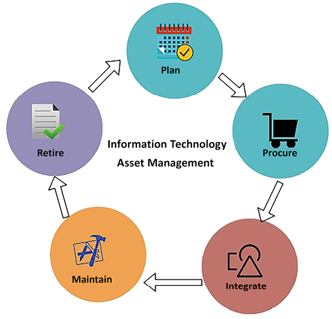
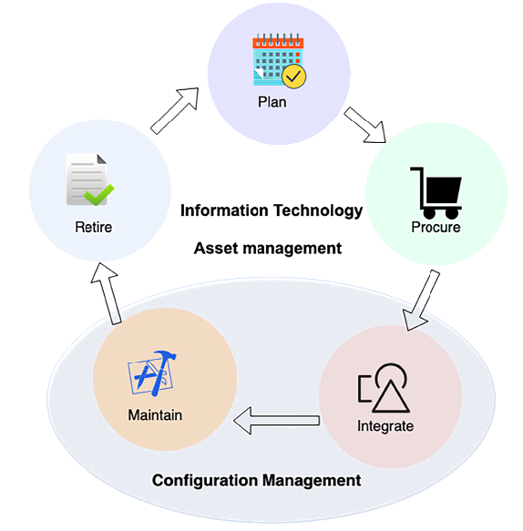
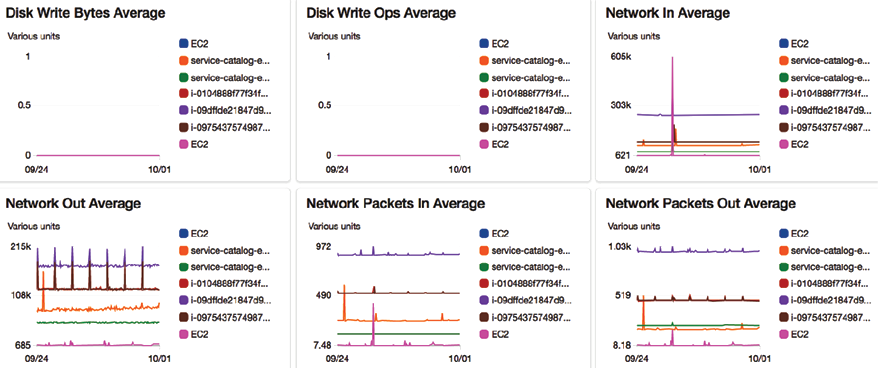
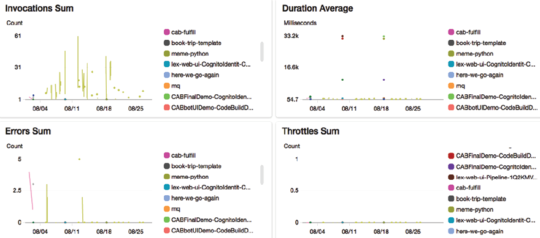
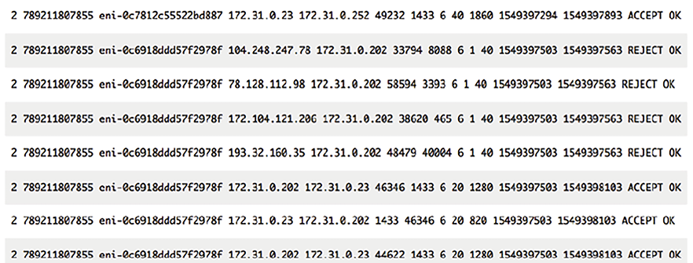
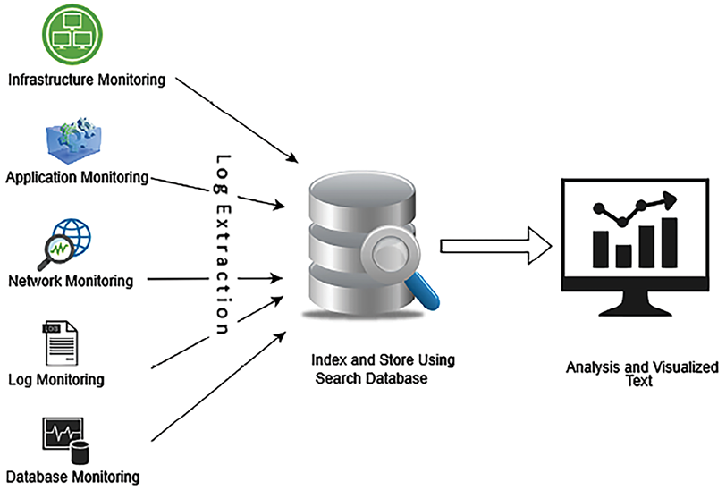
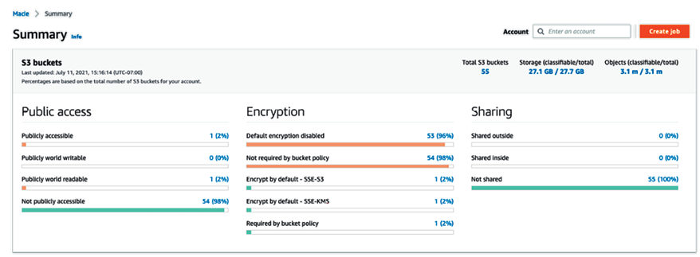

# ملاحظات تعالی عملیاتی

قابلیت نگهداری برنامه یکی از جنبه های اصلی است که معمار راه حل ها باید در طول طراحی معماری در نظر بگیرد. هر پروژه جدید با برنامه ریزی و منابع زیادی در ابتدا شروع می شود و تیم ها ماه های اولیه را صرف ایجاد و راه اندازی برنامه شما می کنند. پس از راه‌اندازی تولید، برنامه برای ادامه کار نیاز به رعایت چندین نکته دارد. شما باید به طور مداوم برنامه خود را برای یافتن و حل هر مشکلی به صورت روزانه کنترل کنید.

تیم عملیات باید زیرساخت برنامه، امنیت و هر گونه مشکل نرم افزاری را مدیریت کند تا مطمئن شود برنامه شما به طور قابل اعتماد بدون هیچ مشکل یا مشکلی اجرا می شود. اغلب، برنامه‌های کاربردی سازمانی پیچیده هستند، با **توافقنامه‌های سطح خدمات** (**SLA**) در رابطه با در دسترس بودن برنامه‌ها. تیم عملیات شما باید الزامات کسب و کار را درک کند و خود را بر این اساس برای پاسخگویی به هر رویدادی آماده کند.

تعالی عملیاتی به معنای تضمین این است که هر جزء و لایه معماری سیستم شما به روشی کارآمد عمل می کند. این شامل نظارت مستمر، بهینه سازی و بهبود فرآیندها، سیستم ها و خدمات است.

تعالی عملیاتی باید در تمامی اجزا و لایه های معماری اجرا شود. در کاربردهای میکروسرویس مدرن، قطعات متحرک زیادی درگیر هستند که عملیات و نگهداری سیستم را به یک کار پیچیده تبدیل می کند.

تیم عملیاتی شما باید مکانیسم‌های نظارت و هشدار مناسب را برای مقابله با هر مشکلی که می‌تواند جریان کسب‌وکار را مختل کند، ایجاد کند. مسائل عملیاتی شامل هماهنگی چندین تیم برای آماده سازی و حل است.

در این فصل، اصول طراحی مختلف قابل اجرا برای دستیابی به برتری عملیاتی راه حل خود را یاد خواهید گرفت. شما درک درستی از انتخاب صحیح فناوری ها برای اطمینان از قابلیت نگهداری عملیاتی در هر لایه از برنامه نرم افزاری خود خواهید داشت. شما بهترین شیوه های تعالی عملیاتی زیر را خواهید آموخت:

- اصول طراحی برای تعالی عملیاتی
- انتخاب فن آوری برای تعالی عملیاتی
- دستیابی به تعالی عملیاتی در ابر عمومی
- بهره وری رانندگی با CloudOps

در پایان این فصل، فرآیندها و روش های مختلفی برای دستیابی به برتری عملیاتی را خواهید شناخت. شما در مورد بهترین شیوه هایی که می توانید در طول طراحی برنامه، پیاده سازی و پس از تولید برای بهبود عملکرد برنامه به کار ببرید، یاد خواهید گرفت.

# اصول طراحی برای تعالی عملیاتی

تعالی عملیاتی در مورد اجرای برنامه شما با حداقل وقفه ممکن برای به دست آوردن حداکثر ارزش تجاری است. این در مورد اعمال بهبود مستمر برای کارآمد کردن سیستم است.

بخش‌های زیر در مورد اصول طراحی استاندارد صحبت می‌کنند که می‌تواند به شما در تقویت قابلیت نگهداری سیستم کمک کند. متوجه خواهید شد که تمام اصول طراحی تعالی عملیاتی ارتباط نزدیکی با یکدیگر دارند و مکمل یکدیگر هستند.

## خودکارسازی وظایف دستی

فناوری به سرعت حرکت می کند و عملیات فناوری اطلاعات باید با آن همگام باشد، به ویژه در جایی که موجودی های سخت افزار و نرم افزار از چندین فروشنده تهیه می شود. شرکت‌ها در حال ساخت سیستم‌های ابری و چند ابری ترکیبی هستند، بنابراین شما باید یاد بگیرید که چگونه عملیات‌های داخلی و ابری را مدیریت کنید. سیستم‌های مدرن پایگاه‌های کاربری گسترده‌ای دارند، با میکروسرویس‌های مختلف با هم کار می‌کنند و میلیون‌ها دستگاه متصل در یک شبکه. قطعات متحرک زیادی در عملیات IT وجود دارد که اجرای دستی کارها را دشوار می کند.

سازمان ها چابکی را حفظ می کنند و عملیات باید سریع باشد تا از زیرساخت های مورد نیاز برای توسعه و استقرار خدمات جدید استفاده کند. تیم عملیات مسئولیت مهم تری برای راه اندازی و راه اندازی سرویس ها و بازیابی سریع در صورت وقوع یک رویداد غیرمنتظره دارد. در حال حاضر، به جای اینکه منتظر وقوع یک حادثه باشیم و سپس واکنش نشان دهیم، باید رویکردی پیشگیرانه در عملیات فناوری اطلاعات در پیش گرفت.

تیم عملیات شما می تواند با استفاده از اتوماسیون بسیار کارآمد کار کند. کارهای دستی باید خودکار شوند تا تیم بتواند بر ابتکارات استراتژیک تری تمرکز کند تا اینکه با کارهای تاکتیکی بیش از حد کار کند. کشف و پاسخ خودکار فعال برای هر تهدید امنیتی برای آزاد کردن تیم بسیار مهم است. چرخش یک سرور جدید یا راه‌اندازی و توقف سرویس‌ها باید با استفاده از رویکرد **زیرساخت به عنوان کد** (**IaC**) خودکار شود. اتوماسیون به تیم اجازه می دهد تا زمان بیشتری را به نوآوری اختصاص دهد.

برای برنامه کاربردی وب خود، می توانید ناهنجاری ها را از قبل با استفاده از پیش بینی یادگیری ماشین تشخیص دهید، قبل از اینکه روی سیستم شما تأثیر بگذارند. اگر شخصی سرور شما را با پورت HTTP '80' در معرض دید جهانیان قرار دهد، می توانید یک بلیط امنیتی خودکار ایجاد کنید. تقریباً می‌توانید کل زیرساخت را خودکار کنید و چندین بار آن را به عنوان یک راه حل با یک کلیک مجدداً مستقر کنید. اتوماسیون همچنین به جلوگیری از خطای انسانی کمک می کند، که ممکن است حتی اگر یک فرد همان کار را به طور مکرر انجام دهد، رخ می دهد. اتوماسیون در حال حاضر یکی از ضروریات عملیات IT است.

## ساختن افزایشی وتغییرات برگشت پذیر

بهینه سازی عملیاتی یک فرآیند مداوم است که در آن تلاش مستمر برای شناسایی شکاف ها و بهبود آنها مورد نیاز است. این شکاف ها می توانند بر قابلیت اطمینان، در دسترس بودن، عملکرد و مقرون به صرفه بودن متمرکز شوند و اطمینان حاصل کنند که معماری از اهداف تجاری پشتیبانی می کند و با نیازهای در حال تغییر سازگار است. دستیابی به تعالی عملیاتی یک سفر است. برای حفظ آن، همیشه در تمام قسمت های حجم کاری شما تغییراتی لازم است. به عنوان مثال، اغلب، سیستم عامل های سرور شما باید با یک وصله امنیتی ارائه شده توسط فروشنده شما به روز شود. نرم افزارهای مختلفی که برنامه شما از آنها استفاده می کند نیاز به ارتقاء نسخه دارند. ممکن است لازم باشد تغییراتی در سیستم ایجاد کنید تا به الزامات انطباق جدید پایبند باشید.

شما باید حجم کاری خود را به گونه ای طراحی کنید که به همه اجزای سیستم اجازه دهد به طور منظم به روز شوند تا سیستم از جدیدترین و مهم ترین به روز رسانی های موجود بهره مند شود. جریان خود را خودکار کنید تا تغییرات کوچک و تدریجی اعمال شود تا از تأثیرات مهم جلوگیری شود. برای بازگرداندن شرایط کاری سیستم در صورت بروز هرگونه مشکل، هرگونه تغییر باید قابل برگشت باشد. تغییرات افزایشی به آزمایش کامل کمک می کند و قابلیت اطمینان کلی سیستم را بهبود می بخشد. برای جلوگیری از خطای انسانی و دستیابی به کارایی، هرگونه مدیریت تغییر را خودکار کنید.

## پیش بینی شکست و پاسخ دادن

جلوگیری از شکست برای دستیابی به تعالی عملیاتی حیاتی است. شکست‌ها حتماً اتفاق می‌افتند، و شناسایی آن‌ها تا حد امکان از قبل ضروری است. در طول طراحی معماری، شکست را پیش بینی کنید و مطمئن شوید که برای شکست طراحی می کنید تا از وقوع آن جلوگیری کنید. فرض کنید همه چیز همیشه شکست خواهد خورد و یک برنامه پشتیبان آماده داشته باشید. تمرینات منظم را برای شناسایی هر منبع احتمالی شکست انجام دهید. سعی کنید هر منبعی را که می تواند در حین کار سیستم باعث خرابی شود را حذف یا کاهش دهید.

یک سناریوی آزمایشی بر اساس SLA خود ایجاد کنید که شامل سیستم **هدف زمان بازیابی** (**RTO**) و **هدف نقطه بازیابی** (**RPO**) است. سناریوی خود را آزمایش کنید و مطمئن شوید که تاثیر آنها را درک کرده اید. اطمینان حاصل کنید که تیم شما آماده پاسخگویی به هر حادثه ای با شبیه سازی یک سناریوی شبیه تولید است. روش پاسخگویی خود را آزمایش کنید تا مطمئن شوید که مشکلات را به طور موثر حل می کند و یک تیم مطمئن ایجاد کنید که با اجرای پاسخ آشنا باشد.

## درس گرفتن از اشتباهات و اصلاح

از آنجایی که خرابی های عملیاتی در سیستم شما رخ می دهد، باید از اشتباهات درس گرفته و شکاف های مربوطه را شناسایی کنید. مطمئن شوید که همان رویدادها دوباره تکرار نمی شوند و در صورت تکرار یک شکست باید راه حلی آماده داشته باشید.

یکی از راه‌های بهبود، اجرای **تحلیل علت ریشه** (**RCA**) است. در طول RCA، تیم را جمع می‌کنید و از پنج _Whys_ می‌پرسید. با هر _why_، یک لایه از مشکل را جدا می کنید و پس از پرسیدن آخرین _why_، به اصل موضوع می پردازید. پس از شناسایی علت واقعی یک مشکل، می‌توانید راه‌حلی تهیه کنید و runbook عملیاتی را با راه‌حل آماده به‌روز کنید.

از آنجایی که حجم کاری شما با گذشت زمان تغییر می کند، باید اطمینان حاصل کنید که روند عملیات مطابق با آن به روز می شود. مطمئن شوید که همه روش‌ها را به‌طور منظم تأیید و آزمایش کرده‌اید و تیم با آخرین به‌روزرسانی‌ها برای اجرای آنها آشنا است.

## به روز نگه داشتن runbook عملیاتی

اغلب، یک تیم اسناد را نادیده می گیرد، که منجر به یک runbook قدیمی می شود. یک Runbook راهنمایی برای اجرای مجموعه ای از اقدامات برای حل مشکلات ناشی از رویدادهای خارجی یا داخلی ارائه می دهد. فقدان مستندات می تواند عملیات شما را به افراد وابسته کند، که به دلیل فرسایش تیم می تواند خطرآفرین باشد. همیشه فرآیندهایی را ایجاد کنید تا عملیات سیستم خود را مستقل از افراد نگه دارید و همه جنبه ها را مستند کنید.

در runbook، شما می خواهید تمام رویدادها و اقدامات قبلی که توسط اعضای تیم برای حل آنها انجام شده است را پیگیری کنید تا هر عضو جدید تیم بتواند به سرعت حوادث مشابه را در حین پشتیبانی عملیات حل کند.

سرپرست سیستم باید runbook را با مراحل شروع، توقف، اصلاح و به‌روزرسانی سیستم حفظ کند. تیم عملیات باید نتیجه آزمایش و اعتبارسنجی سیستم را همراه با روش پاسخگویی به رویداد شامل شود. runbook شما همچنین باید شامل SLA تعریف شده در مورد RTO/RPO، تأخیر، مقیاس پذیری، عملکرد و غیره باشد.

خودکار کردن فرآیندها برای حاشیه نویسی اسناد به عنوان یک تیم، تغییرات را در سیستم و همچنین پس از هر ساخت اعمال می کند. شما می توانید از حاشیه نویسی برای خودکار کردن عملیات خود استفاده کنید و به راحتی با کد قابل خواندن است تا اولویت های تجاری و نیازهای مشتری را به طور مداوم برآورده کند.

# انتخاب فن آوری برای تعالی عملیاتی

تیم عملیات باید رویه‌ها و مراحلی را برای رسیدگی به هر گونه حادثه عملیاتی ایجاد کند و اثربخشی اقدامات خود را تأیید کند. آنها باید نیاز کسب و کار را برای ارائه پشتیبانی کارآمد و جمع آوری سیستم ها و معیارهای تجاری برای اندازه گیری دستیابی به نتایج کسب و کار درک کنند.

روند عملیاتی را می توان به سه مرحله - برنامه ریزی، عملکرد و بهبود طبقه بندی کرد. بیایید فناوری‌هایی را که می‌توانند در هر مرحله کمک کنند، بررسی کنیم.

## برنامه ریزی برای تعالی عملیاتی

مرحله اول i

فرآیند تعالی عملیاتی، تعریف اولویت‌های عملیاتی برای تمرکز بر حوزه‌های با تأثیر تجاری بالا است. این زمینه ها می تواند به عنوان مثال، به کارگیری اتوماسیون، ساده سازی نظارت، توسعه مهارت های تیمی با تکامل حجم کار، و تمرکز بر بهبود عملکرد کلی حجم کار باشد.

ابزارها و خدماتی در دسترس هستند که با اسکن گزارش‌ها و فعالیت‌های سیستم در سیستم شما می‌خزند. این ابزارها مجموعه ای اساسی از ارزیابی ها را ارائه می دهند که پیشرفت هایی را برای محیط سیستم پیشنهاد می کنند. آنها با ارائه بینش ها و توصیه های کلیدی برای بهینه سازی به شکل گیری اولویت ها کمک می کنند.

پس از شناسایی و درک اولویت ها، باید عملیات را طراحی کنید که شامل حجم کاری برای طراحی و ساخت رویه هایی برای پشتیبانی از آنها می شود. طراحی حجم کاری باید شامل پیاده سازی، استقرار، فرآیند به روز رسانی و استراتژی عملیاتی آن باشد. کل حجم کاری را می توان به عنوان اجزای مختلف برنامه، اجزای زیرساخت، امنیت، حاکمیت داده و اتوماسیون عملیات مشاهده کرد. پس از طراحی عملیات، یک چک لیست برای آمادگی عملیاتی ایجاد کنید. این چک لیست ها باید جامع باشند تا اطمینان حاصل شود که سیستم برای پشتیبانی عملیاتی در هنگام شروع به کار در تولید آماده است. این شامل ثبت و نظارت، یک برنامه ارتباطی، یک مکانیسم هشدار، مجموعه مهارت های تیم، یک منشور پشتیبانی تیم، یک مکانیسم پشتیبانی فروشنده و غیره است.

برای برنامه ریزی تعالی عملیاتی، موارد زیر به ابزارهای مناسب برای آماده سازی نیاز دارید:

- مدیریت دارایی فناوری اطلاعات
- مدیریت پیکربندی

بیایید هر منطقه را با جزئیات بیشتری بررسی کنیم تا ابزارها و فرآیندهای موجود را درک کنیم.

## مدیریت دارایی فناوری اطلاعات

برنامه ریزی تعالی عملیاتی مستلزم فهرستی از موجودی های فناوری اطلاعات و ردیابی استفاده از آنها است. این موجودی ها شامل سخت افزارهای زیرساختی مانند سرورهای فیزیکی، دستگاه های شبکه، ذخیره سازی، دستگاه های کاربر نهایی و غیره است. همچنین باید مجوزهای نرم افزار، داده های عملیاتی، قراردادهای قانونی، انطباق و غیره را پیگیری کنید. دارایی های فناوری اطلاعات شامل هر سیستم، سخت افزار یا اطلاعاتی است که یک شرکت برای انجام یک فعالیت تجاری از آن استفاده می کند.

ردیابی دارایی های IT به سازمان کمک می کند تا تصمیمات استراتژیک و تاکتیکی در مورد پشتیبانی عملیاتی و برنامه ریزی اتخاذ کند. با این حال، مدیریت دارایی های فناوری اطلاعات در یک سازمان بزرگ می تواند دلهره آور باشد. ابزارهای مختلف **مدیریت دارایی فناوری اطلاعات** (**ITAM**) برای تیم عملیات در دسترس هستند تا در فرآیند مدیریت دارایی کمک کنند. برخی از محبوب ترین ابزارهای ITAM عبارتند از **SolarWinds**، **Freshservice**، **ServiceDesk Plus**، **Asset Panda**، **PagerDuty** و **Jira Service Desk**.

مدیریت فناوری اطلاعات چیزی فراتر از ردیابی دارایی های فناوری اطلاعات است. همچنین شامل نظارت و جمع آوری داده های دارایی به طور مداوم برای بهینه سازی هزینه های استفاده و عملیات است. ITAM با ارائه دید سرتاسر و امکان اعمال سریع وصله ها و ارتقاء، سازمان را چابک تر می کند. نمودار زیر ITAM را نشان می دهد:

شکل 9.1: فرآیند ITAM

همانطور که در نمودار قبل نشان داده شده است، فرآیند ITAM شامل مراحل زیر است:

- **طرح**: چرخه عمر دارایی با برنامه ریزی شروع می شود، تمرکز استراتژیک تر برای تعیین نیاز به کلی دارایی های فناوری اطلاعات و روش های تدارکات. این شامل تجزیه و تحلیل هزینه-فایده و کل هزینه مالکیت است.
- **تدارکات**: در مرحله تدارکات، سازمان ها دارایی را بر اساس نتیجه برنامه ریزی به دست می آورند. آنها همچنین ممکن است تصمیم بگیرند در صورت لزوم برخی از منابع را توسعه دهند - به عنوان مثال، نرم افزار داخلی برای ورود به سیستم و نظارت.
- **Integrate**: در این مرحله یک دارایی در اکوسیستم فناوری اطلاعات نصب می شود. این مرحله شامل عملیات و پشتیبانی از دارایی، از جمله تعریف دسترسی کاربر - برای مثال، نصب یک عامل گزارش برای جمع‌آوری گزارش‌ها از همه سرورها در یک داشبورد متمرکز و محدود کردن معیارهای نظارت داشبورد برای تیم عملیات فناوری اطلاعات است.\* **حفظ **: در مرحله تعمیر و نگهداری، تیم عملیات فناوری اطلاعات دارایی‌ها را ردیابی می‌کند و برای ارتقا یا انتقال آن‌ها بر اساس چرخه عمر دارایی اقدام می‌کند - به عنوان مثال، استفاده از یک وصله امنیتی ارائه‌شده توسط فروشنده نرم‌افزار. این شامل پیگیری پایان عمر نرم افزارهای دارای مجوز است، مانند برنامه ریزی برای مهاجرت از Windows Server 2008 به Windows 2022، زیرا سیستم عامل قدیمی در حال پایان یافتن است.
- **بازنشستگی**: در مرحله بازنشستگی، تیم عملیات دارایی پایان عمر را دفع می کند. به عنوان مثال، اگر یک سرور پایگاه داده قدیمی به پایان عمر خود می رسد، تیم برای ارتقاء آن و انتقال کاربران و پشتیبانی مورد نیاز به سرور جدید اقدام می کند.

ITAM به سازمان ها کمک می کند تا الزامات انطباق با **ISO 19770** را رعایت کنند. این شامل تهیه، استقرار، ارتقاء و پشتیبانی نرم افزار است. ITAM امنیت داده های بهتری را فراهم می کند و به بهبود انطباق نرم افزار کمک می کند. همچنین ارتباط بهتری بین واحدهای تجاری مانند عملیات، مالی، تیم های بازاریابی و کارکنان خط مقدم فراهم می کند. مدیریت پیکربندی جنبه دیگری از برنامه ریزی برای تعالی عملیاتی است که به ما کمک می کند

اطلاعات موجودی IT را همراه با جزئیاتی مانند مالک و وضعیت فعلی در نظر بگیرید. بیایید در مورد آن بیشتر بدانیم.

### مدیریت پیکربندی

مدیریت پیکربندی **اقلام پیکربندی** (**CIs**) را برای مدیریت و ارائه یک سرویس فناوری اطلاعات نگهداری می کند. CI ها در **پایگاه داده مدیریت پیکربندی** (**CMDB**) ردیابی می شوند. CMDB فیزیکی یا مجازی بودن سرور، سیستم عامل و نسخه آن (به عنوان مثال، ویندوز 2022 یا **Red Hat Enterprise Linux** (**RHEL**) 8.0)، صاحب سرور ( یعنی پشتیبانی، بازاریابی یا منابع انسانی) و اینکه آیا به سرورهای دیگر مانند مدیریت سفارش و غیره وابستگی دارد یا خیر.

مدیریت پیکربندی با مدیریت دارایی متفاوت است. مدیریت دارایی کل چرخه عمر یک دارایی، از برنامه ریزی تا بازنشستگی را مدیریت می کند، در حالی که CMDB جزء مدیریت دارایی است که سوابق پیکربندی یک دارایی فردی را ذخیره می کند. همانطور که در نمودار زیر نشان داده شده است، مدیریت پیکربندی بخش یکپارچه سازی و نگهداری مدیریت دارایی را پیاده سازی می کند:

شکل 9.2: چرخه عمر دارایی فناوری اطلاعات در مقابل مدیریت پیکربندی

مدیریت پیکربندی، همانطور که در نمودار قبل نشان داده شده است، بخش _Integrate_ and _Maintain_ مدیریت دارایی را پیاده سازی می کند.

مدیریت پیکربندی و مدیریت تغییر فرآیندهای تکمیلی در عملیات فناوری اطلاعات هستند. مدیریت پیکربندی بر حفظ یک رکورد دقیق و به‌روز از تمام اجزای محیط فناوری اطلاعات سازمان، از جمله نسخه‌ها، پیکربندی‌ها و روابط متقابل آنها تمرکز دارد. این تضمین می کند که سیستم ها به طور مداوم و کارآمد مستقر و کار می کنند. از سوی دیگر، مدیریت تغییر بر تغییرات زیرساخت فناوری اطلاعات نظارت و کنترل می‌کند و اطمینان حاصل می‌کند که تغییرات به شیوه‌ای هماهنگ و سیستماتیک برای جلوگیری از عواقب ناخواسته اجرا می‌شوند. آنها با هم به حفظ یکپارچگی و پایداری دارایی های فناوری اطلاعات کمک می کنند، با مدیریت پیکربندی اطلاعات دقیق لازم برای ارزیابی تأثیر تغییرات را ارائه می دهد و مدیریت تغییر را تضمین می کند که تغییرات در پیکربندی ها به درستی برنامه ریزی، اجرا و مستند شده است.

یک ابزار مدیریت پیکربندی می‌تواند به تیم عملیات کمک کند تا با ارائه اطلاعات در دسترس در مورد پیکربندی دارایی، زمان خرابی را کاهش دهد. محبوب ترین ابزارهای مدیریت پیکربندی عبارتند از Chef، Puppet، Ansible و Bamboo. در _فصل 11_، _DevOps و Solution Architecture Framework_ جزئیات بیشتری در مورد آنها خواهید آموخت.

اگر حجم کار شما در یک ابر عمومی مانند AWS، Microsoft Azure یا GCP باشد، مدیریت فناوری اطلاعات آسان‌تر می‌شود. فروشندگان ابر ابزارهای داخلی را برای ردیابی و مدیریت موجودی‌ها و پیکربندی‌های IT در یک مکان ارائه می‌کنند. به عنوان مثال، AWS خدماتی مانند AWS Config را ارائه می‌کند که تمام موجودی‌های IT را که به عنوان بخشی از بار کاری ابری AWS شما می‌چرخند، و خدماتی مانند AWS Trusted Advisor را ردیابی می‌کند که هزینه، عملکرد و بهبودهای امنیتی را توصیه می‌کند که می‌توانید از آنها استفاده کنید. تصمیم بگیرید که چگونه حجم کاری خود را مدیریت کنید. در تصویر زیر می توانید نمونه ای از AWS Trusted Advisor را مشاهده کنید:

شکل 9.3: داشبورد مشاور معتمد AWS

همانطور که در تصویر قبلی نشان داده شده است، داشبورد AWS **Trusted Advisor** 12 مشکل امنیتی را نشان می دهد که می توان برای یافتن جزئیات بیشتر، از جمله موارد دیگر، بیشتر مورد بررسی قرار داد.

مدیریت پیکربندی نقش مهمی در نظارت و مستندسازی مداوم پیکربندی‌های منابع IT ایفا می‌کند و امکان خودکارسازی ارزیابی‌های پیکربندی را در برابر استانداردهای از پیش تعریف‌شده فراهم می‌کند. مزایای مدیریت پیکربندی عبارتند از:

- **نظارت مستمر**: امکان مشاهده و مستندسازی مداوم تغییرات در تنظیمات منابع IT شما را فراهم می کند.
- **مدیریت تغییر**: به ردیابی ارتباطات بین منابع و بررسی وابستگی ها قبل از اجرای هر گونه تغییر کمک می کند.
- **ارزیابی مستمر**: ممیزی ها و ارزیابی های منظم را تسهیل می کند تا اطمینان حاصل شود که منابع IT شما با خط مشی ها و دستورالعمل های سازمان شما مطابقت دارد.
- **نظارت بر انطباق در سطح سازمان**: نمای جامعی از وضعیت انطباق در سراسر شرکت شما ارائه می دهد، هر گونه حساب غیرمنطبق را مشخص می کند، و امکان بررسی عمیق در سطح حساب منطقه ای را فراهم می کند.\* **مدیریت شخص ثالث منابع**: مستندات پیکربندی ها را برای منابع شخص ثالث، مانند مخازن GitHub، منابع Microsoft Active Directory، و سرورها، چه در محل و چه مبتنی بر ابر، فعال می کند.
- **عیب یابی عملیاتی**: تاریخچه مفصلی از تغییرات پیکربندی را ثبت می کند که به ساده سازی حل مشکلات عملیاتی کمک می کند.

از طریق مدیریت پیکربندی، شما توانایی انجام تجزیه و تحلیل های امنیتی، نظارت مستمر بر پیکربندی منابع و ارزیابی این پیکربندی ها را از نظر آسیب پذیری های امنیتی بالقوه به دست می آورید. در تضمین انطباق با سیاست‌های داخلی و استانداردهای نظارتی در پیکربندی‌های IT و منابع شخص ثالث شما و در

بررسی مداوم تغییرات پیکربندی منابع در برابر استانداردهای مورد نظر شما.

در این بخش با مدیریت دارایی و مدیریت پیکربندی آشنا شدید. اینها بخشی از چارچوب **کتابخانه زیرساخت فناوری اطلاعات** (**ITIL**) هستند که **مدیریت خدمات فناوری اطلاعات** (**ITSM**) را که به تعالی عملیاتی مرتبط است را پیاده سازی می کند. ITSM به سازمان ها کمک می کند تا عملیات IT خود را روزانه اجرا کنند. می توانید با مراجعه به وب سایت آن ([https://www.axelos.com/best-practice-solutions/itil](https://www.axelos.com/best-) درباره ITIL از نهاد حاکم آن، AXELOS، اطلاعات بیشتری کسب کنید. تمرین-راه حل/itil)). AXELOS گواهینامه ITIL را برای توسعه مهارت ها در فرآیند مدیریت خدمات فناوری اطلاعات ارائه می دهد.

همانطور که در مورد برنامه ریزی یاد گرفتید، اکنون در بخش بعدی عملکرد عملیات فناوری اطلاعات را بررسی می کنیم.

## عملکرد تعالی عملیاتی

تعالی عملیاتی با نظارت فعال و پاسخ و بازیابی سریع در صورت وقوع یک رویداد غیرمنتظره تعیین می شود. با درک سلامت عملیاتی یک حجم کاری، می توان تشخیص داد که رویدادها و پاسخ ها چه زمانی بر آن تأثیر می گذارند. از ابزارهایی استفاده کنید که به شما در درک سلامت عملیاتی سیستم با استفاده از **متریک** و **داشبورد** کمک می کند. شما باید داده های گزارش را به ذخیره سازی متمرکز ارسال کنید و معیارهایی را برای ایجاد یک معیار تعریف کنید. این ابزارها همچنین خودکارسازی پاسخ‌ها به رویدادهای عملیاتی را امکان‌پذیر می‌کنند و اجرای آن‌ها را در پاسخ به هشدارهای خاص آغاز می‌کنند.

اجزای حجم کاری خود را طوری طراحی کنید که قابل تعویض باشند. این رویکرد به این معنی است که به جای صرف زمان برای رفع مشکلات، می‌توانید زمان بازیابی را با جایگزین کردن اجزای خراب با نسخه‌های شناخته شده و قابل اعتماد کاهش دهید. سپس، منابع شکست خورده را بدون تأثیر بر محیط تولید تجزیه و تحلیل کنید.

برای عملکرد تعالی عملیاتی، موارد زیر به ابزارهای مناسب نیاز است:

- نظارت بر سلامت سیستم
- رسیدگی به هشدارها و واکنش به حادثه

بیایید هر منطقه را با اطلاعاتی در مورد ابزارها و فرآیندهای موجود بررسی کنیم.

### نظارت بر سلامت سیستم

پیگیری سلامت سیستم برای درک _رفتار بار کاری_ ضروری است. تیم عملیات از نظارت بر سلامت سیستم برای ثبت هرگونه ناهنجاری در اجزای سیستم استفاده می کند و بر اساس آن عمل می کند. به طور سنتی، نظارت به لایه زیرساخت محدود می‌شود و CPU سرور و استفاده از حافظه را پیگیری می‌کند. با این حال، نظارت باید در هر لایه از معماری اعمال شود. اجزای مهمی که در آن نظارت اعمال می شود عبارتند از:

- نظارت بر زیرساخت ها
- نظارت بر برنامه
- نظارت بر پلت فرم
- نظارت بر ورود
- نظارت بر امنیت

در بخش های فرعی زیر این موارد را مورد بحث قرار می دهیم.

#### نظارت بر زیرساخت

نظارت بر زیرساخت ضروری است و محبوب ترین شکل نظارت است. زیرساخت شامل اجزای مورد نیاز برای میزبانی برنامه ها است. اینها خدمات اصلی مانند ذخیره سازی، سرورها، ترافیک شبکه، متعادل کننده بار و غیره هستند.

نظارت بر زیرساخت ممکن است از معیارهایی مانند موارد زیر تشکیل شود:

- **مصرف CPU**: درصد CPU استفاده شده توسط سرور در یک دوره معین\* **مصرف حافظه**: درصد **حافظه دسترسی تصادفی** (**RAM**) استفاده شده توسط سرور در یک دوره معین
- **استفاده از شبکه**: بسته های شبکه _in و out_ در طول دوره معین
- استفاده از دیسک: توان خواندن/نوشتن دیسک و **عملیات ورودی/خروجی در ثانیه** (**IOPS**)
- **تعادل کننده بار **: تعداد تعداد درخواست ها در یک دوره معین

معیارهای بسیار بیشتری در دسترس هستند و سازمان ها باید آن معیارهای نظارتی را مطابق با الزامات نظارت بر برنامه خود سفارشی کنند. تصویر زیر نمونه ای از داشبورد نظارت بر ترافیک شبکه را نشان می دهد:

شکل 9.4: داشبورد نظارت بر زیرساخت

می‌توانید در داشبورد سیستم قبلی مشاهده کنید که یک روز در پنجره **شبکه به‌طور میانگین** یک جهش وجود دارد که کد رنگی برای سرورهای مختلف اعمال می‌شود. تیم عملیات می‌تواند عمیقاً در این نمودار و سایر نمودارها و منابع غوطه‌ور شود تا نمای دقیق‌تری برای تعیین سلامت کلی زیرساخت به دست آورد.

#### نظارت بر برنامه

گاهی اوقات، زیرساخت شما کاملا سالم است، به جز برنامه هایی که به دلیل اشکال در کد شما یا هر مشکل نرم افزاری شخص ثالث مشکل دارند. ممکن است برخی از وصله های امنیتی سیستم عامل ارائه شده توسط فروشنده را اعمال کرده باشید که برنامه شما را خراب کرده است. نظارت بر برنامه به این امر کمک می کند.

نظارت بر برنامه ممکن است شامل معیارهایی مانند موارد زیر باشد:

- ** فراخوانی نقطه پایانی **: تعداد درخواست ها در یک دوره معین
- **زمان پاسخ**: میانگین زمان پاسخگویی برای انجام درخواست
- **دریچه گاز**: تعداد درخواست‌های معتبری که با اتمام ظرفیت سیستم برای رسیدگی به درخواست‌های اضافی خارج می‌شود.
- **خطا**: برنامه هنگام پاسخ دادن به یک درخواست خطا می دهد

تصویر زیر یک نمونه داشبورد نظارت بر نقطه پایانی برنامه را نشان می دهد:

شکل 9.5: داشبورد نظارت بر برنامه

وجود دارد

معیارهای بسیار بیشتری بر اساس کاربرد و فناوری باشد. به عنوان مثال، مقدار جمع آوری زباله حافظه برای یک برنامه جاوا، چندین درخواست HTTP «POST» و «GET» برای یک سرویس RESTful، تعداد خطاهای مشتری «4XX»، تعداد خطاهای سرور «5XX» برای یک برنامه وب، و آنچه آنها ممکن است به دنبال آن باشند نشان دهنده سلامت ضعیف برنامه است.

#### نظارت بر پلت فرم

برنامه شما ممکن است از چندین پلتفرم و ابزار شخص ثالث استفاده کند که باید نظارت شود. اینها ممکن است شامل موارد زیر باشد:

- **حافظه کش**: Redis و Memcached\* **پایگاه داده رابطه**: پایگاه داده Oracle، Microsoft SQL Server، Amazon **سرویس پایگاه داده رابطه** (**RDS**)، PostgreSQL
- ** پایگاه داده NoSQL**: Amazon DynamoDB، Apache Cassandra، MongoDB\* **پلتفرم داده بزرگ**: Apache Hadoop، Apache Spark، Apache Hive، Apache Impala، Amazon **Elastic MapReduce** (**EMR** )
- **کانتینرها**: Docker، Kubernetes، OpenShift
- **ابزار هوش تجاری**: Tableau، MicroStrategy، Kibana، Amazon QuickSight
- **سیستم پیام رسانی**: MQSeries، **سرویس پیام جاوا** (**JMS**)، RabbitMQ، **سرویس صف ساده** (**SQS**)
- **جستجو**: جستجو را باز کنید، برنامه مبتنی بر جستجوی Solr

هر یک از ابزارهای ذکر شده در بالا مجموعه معیارهای خاص خود را دارد که باید آنها را بررسی کنید تا مطمئن شوید که برنامه شما به طور کلی سالم است. تصویر زیر داشبورد مانیتورینگ یک پلت فرم پایگاه داده رابطه ای را نشان می دهد:

شکل 9.6: داشبورد مانیتورینگ پلت فرم برای یک سیستم مدیریت پایگاه داده رابطه ای (RDBMS)

در داشبورد قبلی، می‌توانید مشاهده کنید که پایگاه داده دارای فعالیت‌های نوشتاری زیادی است، که نشان می‌دهد برنامه به طور مداوم داده‌ها را می‌نویسد. از سوی دیگر، رویدادهای خوانده شده به جز برخی از نوک ها، نسبتاً سازگار هستند.

#### نظارت بر گزارش

به طور سنتی، نظارت بر گزارش یک فرآیند دستی بود و سازمان‌ها رویکردی واکنشی برای تجزیه و تحلیل گزارش‌ها در هنگام مواجهه با مشکلات در پیش گرفتند. با این حال، با رقابت بیشتر و افزایش انتظارات کاربران، انجام اقدامات سریع قبل از اینکه کاربران متوجه هر گونه مشکلی شوند ضروری شده است. برای یک رویکرد پیشگیرانه، باید این توانایی را داشته باشید که گزارش ها را در یک مکان متمرکز پخش کنید و پرس و جوهایی را برای نظارت و شناسایی مسائل اجرا کنید. به عنوان مثال، اگر برخی از صفحات محصول با خطا مواجه شوند، باید فوراً خطا را بدانید و قبل از شکایت کاربر، مشکل را برطرف کنید. در غیر این صورت، شما متحمل از دست دادن درآمد خواهید شد.

در صورت حمله به شبکه، باید گزارش شبکه خود را تجزیه و تحلیل کنید و آدرس های IP مشکوک را مسدود کنید. این IP ها ممکن است تعداد اشتباهی بسته داده را برای حذف برنامه شما ارسال کنند. سیستم های نظارتی مانند AWS CloudWatch، Logstash، Splunk، Google Stackdriver و غیره عاملی را برای نصب بر روی سرور برنامه شما ارائه می دهند. عامل گزارش‌ها را به یک مکان ذخیره‌سازی متمرکز پخش می‌کند. می‌توانید مستقیماً از ذخیره‌سازی گزارش مرکزی سؤال کنید و هشدارهایی را برای هر گونه ناهنجاری تنظیم کنید.

تصویر زیر یک نمونه گزارش شبکه جمع آوری شده در یک مکان متمرکز را نشان می دهد:

شکل 9.7: گزارش شبکه خام که در یک فروشگاه داده متمرکز جریان دارد

همانطور که در تصویر زیر نشان داده شده است، می‌توانید یک پرس‌وجو را در این گزارش‌ها اجرا کنید و 10 آدرس IP منبع برتر با بیشترین تعداد درخواست‌های رد شده را بیابید:

شکل 9.8: بینش از گزارش شبکه خام با اجرای پرس و جو

همانطور که در ویرایشگر پرس و جو قبلی نشان داده شده است، اگر تعداد ردهای شناسایی شده از آستانه خاصی مانند بیش از 5000 عبور کند، می توانید یک نمودار ایجاد کنید و زنگ هشدار تنظیم کنید.

#### نظارت بر امنیت

امنیت یک جنبه حیاتی در هر برنامه ای است. نظارت بر امنیت باید در طول طراحی راه حل در نظر گرفته شود. همانطور که هنگام بررسی امنیت در اجزای مختلف معماری در _فصل 7_، ملاحظات امنیتی\_ متوجه شدید، امنیت باید در همه لایه ها اعمال شود. توصیه می شود برای اقدام و واکنش به هر رویداد نامطلوب، نظارت امنیتی اجرا شود.

لیست زیر نشان می دهد که در کجا نظارت امنیتی باید اعمال شود:

- **امنیت شبکه**: نظارت بر هرگونه باز شدن پورت غیرمجاز، آدرس IP مشکوک و فعالیت
- **دسترسی کاربر**: نظارت بر هرگونه دسترسی غیرمجاز کاربر و فعالیت مشکوک کاربر
- **امنیت برنامه**: نظارت بر هرگونه حمله بدافزار یا ویروس\* امنیت وب: نظارت بر حملات **انکار سرویس توزیع شده** (**DDoS**)، تزریق SQL، یا **اسکریپت بین سایتی** (**XSS**)
- **امنیت سرور**: نظارت بر هرگونه شکاف در وصله های امنیتی\* **تطابق**: نظارت بر هرگونه نقص مطابقت مانند نقض **صنعت کارت پرداخت** (**PCI**) بررسی های انطباق برای برنامه های پرداخت یا **قانون قابل حمل و پاسخگویی بیمه سلامت** (**HIPAA**) برای برنامه های مراقبت های بهداشتی
- **امنیت داده**: نظارت بر دسترسی غیرمجاز به داده ها، پوشاندن داده ها و رمزگذاری داده ها در حالت استراحت و در حال انتقال

یک نمونه از نظارت بر امنیت با استفاده از **Amazon GuardDuty** برای ابر AWS در زیر نشان داده شده است:

شکل 9.9: نظارت بر امنیت با استفاده از Amazon GuardDuty

ابزارهای دیگر

که می توانند برای نظارت بر امنیت استفاده شوند عبارتند از Imperva، McAfee، Qualys، Palo Alto Networks، Sophos و Symantec.

در حالی که ابزارهای نظارت بر برنامه را برای نظارت بر تمام اجزای سیستم خود قرار می دهید، نظارت بر سیستم نظارت ضروری است. مطمئن شوید که میزبان سیستم مانیتورینگ خود را نظارت کنید. به عنوان مثال، اگر ابزار نظارت خود را در Amazon **Elastic Compute Cloud** (**EC2**) میزبانی می کنید، آنگاه AWS CloudWatch می تواند سلامت EC2 را نظارت کند.

#### رسیدگی به هشدارها و پاسخ به حادثه

نظارت بخشی از عملکرد تعالی عملیاتی است. بخش دیگر شامل رسیدگی به هشدارها و اقدام بر اساس آنها است. با استفاده از هشدارها، می توانید آستانه سیستم و زمانی که می خواهید کار کنید را تعیین کنید. به عنوان مثال، اگر استفاده از CPU سرور به مدت 5 دقیقه به 70٪ برسد، ابزار مانیتورینگ استفاده بالای سرور را ثبت می کند و هشداری را به تیم عملیات ارسال می کند تا قبل از از کار افتادن سیستم، برای کاهش استفاده از CPU اقدام کنند. در پاسخ به این حادثه، تیم عملیات می تواند سرور را به صورت دستی اضافه کند. هنگامی که اتوماسیون وجود دارد، مقیاس خودکار هشدار را برای افزودن سرورهای بیشتری بر اساس تقاضا ایجاد می کند. همچنین یک اعلان به تیم عملیات ارسال می کند که می تواند بعداً به آن رسیدگی شود.

واکنش به حادثه برای برخورد با این هشدارها و حل مسائل ضروری است. اقدامات انجام شده می تواند به صورت خودکار یا مدیریت شده توسط یک تیم عملیاتی برای رفع قطعی یا خرابی سیستم باشد. این فرآیند تضمین می کند که هر گونه اختلال به سرعت و به طور موثر مدیریت می شود تا تأثیر آنها بر عملیات سازمان کاهش یابد و قابلیت اطمینان و در دسترس بودن سیستم برای کاربران و ذینفعان حفظ شود.

اغلب، اگر دسته هشدار و تیم عملیات را بر اساس شدت هشدار برای پاسخ آماده کنید، کمک خواهد کرد. سطوح شدت زیر نمونه ای از نحوه طبقه بندی اولویت هشدار را ارائه می دهد:

- **شدت 1**: این یک موضوع اولویت حیاتی است. مشکل Sev1 فقط باید زمانی مطرح شود که تأثیر قابل توجهی بر مشتری وجود داشته باشد که برای آن نیاز به مداخله فوری انسانی باشد. هشدار Sev1 می تواند این باشد که کل برنامه از کار افتاده است. تیم معمولی باید در عرض 15 دقیقه به این هشدارها پاسخ دهد و برای رفع مشکل به پشتیبانی 24 ساعته نیاز دارد.
- **شدت 2**: این یک هشدار با اولویت بالا است که باید در ساعات اداری به آن رسیدگی شود. به عنوان مثال، برنامه بالا است، اما سیستم رتبه بندی و بررسی برای یک دسته محصول خاص کار نمی کند. تیم معمولی باید در عرض 24 ساعت به این هشدارها پاسخ دهد و برای رفع مشکل به پشتیبانی ساعات اداری منظم نیاز دارد.
- **شدت 3**: این یک هشدار با اولویت متوسط است که می تواند در ساعات کاری در طول روز به آن پرداخته شود—مثلاً دیسک سرور قرار است تا 2 روز دیگر پر شود. تیم معمولی باید ظرف 72 ساعت به این نوع هشدارها پاسخ دهد و برای رفع مشکل به پشتیبانی ساعات اداری منظم نیاز دارد.
- **شدت 4**: این یک هشدار با اولویت پایین است که می تواند در ساعات کاری در طول هفته به آن رسیدگی شود—به عنوان مثال، گواهی **Secure Sockets Layer** (**SSL**) در عرض 2 هفته منقضی می شود. تیم معمولی باید در طول هفته به این نوع هشدارها پاسخ دهد و برای رفع مشکل به پشتیبانی ساعات اداری منظم نیاز دارد.
- **شدت 5**: این در دسته اعلان قرار می گیرد، جایی که نیازی به تشدید نیست، و می تواند اطلاعات ساده ای باشد - به عنوان مثال، ارسال اعلان مبنی بر اینکه استقرار کامل شده است. در اینجا، هیچ پاسخی در ازای آن لازم نیست زیرا فقط برای اهداف اطلاعاتی است.

هر سازمانی بر اساس نیازهای برنامه خود می تواند سطوح شدت هشدار متفاوتی داشته باشد. برخی از سازمان ها ممکن است بخواهند چهار سطح شدت را تعیین کنند، در حالی که برخی دیگر ممکن است شش سطح را تعیین کنند. همچنین، زمان پاسخ هشدار ممکن است متفاوت باشد. برخی از سازمان‌ها ممکن است بخواهند هشدارهای Sev2 را در عرض 6 ساعت به صورت 24 ساعته و 7 روز هفته در دستور کار قرار دهند نه اینکه منتظر رسیدگی به آنها در ساعات اداری باشند.

هنگام تنظیم هشدار، مطمئن شوید که عنوان و خلاصه آن _ توصیفی_ و _ مختصر_ باشد. اغلب، یک هشدار به تلفن همراه (به عنوان پیامک) یا یک پیجر (به عنوان پیام) ارسال می شود و باید به اندازه کافی کوتاه و آموزنده باشد تا گیرنده را قادر سازد تا اقدام فوری انجام دهد. مطمئن شوید که داده‌های معیارهای مناسب را در متن پیام لحاظ کنید. به عنوان مثال، در متن پیام، اطلاعات خاصی مانند _The disk is 90% full in production-web-1 server_ را به جای اینکه فقط بگویید _The disk is full_ را وارد کنید. تصویر زیر از **CloudWatch** نمونه داشبورد زنگ هشدار را نشان می دهد:

شکل 9.10: داشبورد هشدار

همانطور که در داشبورد هشدار قبلی نشان داده شده است، زمانی که یک جدول پایگاه داده NoSQL DynamoDB Amazon DynamoDB به نام testretail از واحد ظرفیت نوشتن کم استفاده می کند و باعث هزینه های اضافی غیر ضروری می شود، یک زنگ هشدار در حال انجام است.

آلارم‌های پایین و دو آلارم بالا وضعیت **OK** دارند زیرا داده‌ها در حین نظارت جمع‌آوری می‌شوند که به خوبی در آستانه است.

ممکن است گاهی هشدارهایی وجود داشته باشد که **داده ناکافی** را نشان می دهد، به این معنی که برای تعیین وضعیت منابعی که نظارت می کنید باید نقاط داده بیشتری وجود داشته باشد. این زنگ هشدار را در صورتی معتبر در نظر بگیرید که بتوان داده هایی را برای انتقال آن به th جمع آوری کرد

e حالت خوب.

آزمایش پاسخ حادثه در مورد هشدارهای حیاتی برای اطمینان از آمادگی شما برای پاسخگویی مطابق با SLA تعریف شده مهم است. مطمئن شوید آستانه شما به درستی تنظیم شده است تا فضای کافی برای رسیدگی به این مشکل داشته باشید و هشدارهای زیادی ارسال نکنید. اطمینان حاصل کنید که به محض رفع مشکل، هشدار شما به تنظیمات اصلی بازنشانی می‌شود و آماده ضبط مجدد داده‌های رویداد است.

حادثه هر گونه اختلال برنامه ریزی نشده ای است که بر سیستم و مشتری تأثیر منفی می گذارد. اولین پاسخ در طول یک حادثه، بازیابی سیستم و بازیابی تجربه مشتری است. رفع مشکل اساسی را می توان بعداً با بازیابی سیستم و شروع به کار کرد. هشدار خودکار به کشف فعال حادثه کمک می کند و تأثیر کاربر را به حداقل می رساند. در صورتی که کل سیستم از کار افتاده باشد، این می تواند به عنوان یک خطا برای یک سایت بازیابی فاجعه عمل کند. سیستم اولیه را می توان تعمیر و بعداً بازیابی کرد.

برای مثال، نتفلیکس از _Simian Army_ ([https://netflixtechblog.com/the-netflix-simian-army-16e57fbab116](https://netflixtechblog.com/the-netflix-simian-army-16e57fbab116) استفاده می کند. مجموعه ای از ابزارها برای آزمایش انعطاف پذیری سیستم، از جمله Chaos Monkey. Chaos Monkey خاتمه تصادفی یک سرور تولید را تنظیم می کند تا آزمایش کند که آیا سیستم می تواند به رویدادهای فاجعه پاسخ دهد بدون هیچ گونه تأثیری بر کاربران نهایی. به طور مشابه، نتفلیکس میمون‌های دیگری برای آزمایش ابعاد مختلف معماری سیستم دارد، مانند Security Monkey، Latency Monkey، و حتی Chaos Gorilla، که می‌توانند قطعی کل منطقه در دسترس را شبیه‌سازی کنند.

مانیتورینگ، هشدارها و واکنش به حادثه اجزای حیاتی برای دستیابی به برتری عملیاتی هستند. همه سیستم های مانیتورینگ معمولاً دارای یک ویژگی هشدار یکپارچه با آنها هستند. یک سیستم هشدار و نظارت کاملاً خودکار، توانایی تیم عملیات را برای حفظ سلامت سیستم و ارائه تخصص بهبود می‌بخشد و آنها را قادر می‌سازد تا اقدامات سریع و بهبود تجربه کاربر را انجام دهند.

همانطور که محیط برنامه خود را زیر نظر دارید، اعمال بهبود مستمر و تلاش مداوم برای دستیابی به برتری بسیار مهم است. بیایید در مورد بهبود تعالی عملیاتی بیشتر بیاموزیم.

## بهبود تعالی عملیاتی

بهبود مستمر برای هر فرآیند، محصول یا برنامه ای برای اکسل مورد نیاز است. تعالی عملیاتی برای رسیدن به بلوغ در طول زمان نیاز به بهبود مستمر دارد.

توصیه می شود در حین انجام RCA، تغییرات تدریجی کوچکی را اعمال کنید تا از فعالیت های عملیاتی مختلف درس بگیرید. یادگیری از شکست به شما کمک می کند تا هر رویداد عملیاتی را که ممکن است برنامه ریزی شده (مانند استقرار) یا برنامه ریزی نشده (مانند افزایش بهره برداری) باشد، پیش بینی کنید. شما باید تمام درس‌های آموخته شده را ثبت کنید و راه‌حل‌ها را به‌روزرسانی کنید. برای بهبود عملیاتی، موارد زیر به ابزارهای مناسب نیاز دارید:

- **تحلیل عملیات IT** (**ITOA**)
- RCA
- حسابرسی و گزارش

### تجزیه و تحلیل عملیات فناوری اطلاعات

ITOA عمل جمع آوری داده ها از منابع مختلف برای تصمیم گیری و پیش بینی هر مشکل احتمالی است که ممکن است با آن مواجه شوید. تجزیه و تحلیل همه رویدادها و فعالیت های عملیاتی برای بهبود ضروری است. تجزیه و تحلیل شکست ها به پیش بینی هر رویداد آینده کمک می کند و تیم را برای ارائه پاسخ مناسب آماده نگه می دارد.

یک سازمان بزرگ می تواند صدها سیستم داشته باشد که حجم عظیمی از داده را تولید می کند. مکانیزمی را برای جمع‌آوری گزارش‌های رویدادهای عملیات، فعالیت‌های مختلف در میان بارهای کاری و تغییرات زیرساخت، اجرا کنید و این داده‌ها را برای مدت زمان مشخصی مانند 90 یا 180 روز ذخیره کنید. ITOA از معماری کلان داده برای ذخیره و تحلیل چندین ترابایت داده از سراسر مکان استفاده می کند.

این به شما کمک می کند تا مسائلی را که با نگاه کردن به ابزارهای جداگانه نمی توانید پیدا کنید کشف کنید و به شما کمک می کند وابستگی بین سیستم های مختلف را تعیین کنید و یک دید کلی ارائه دهید.

همانطور که در نمودار زیر نشان داده شده است، هر سیستم ابزار نظارتی مخصوص به خود را دارد که به دریافت بینش کمک می کند و اجزای سیستم را حفظ می کند. برای تجزیه و تحلیل عملیات، باید این داده ها را در یک مکان متمرکز دریافت کنید. جمع‌آوری تمام داده‌های عملیات در یک مکان به شما منبعی از حقیقت می‌دهد، جایی که می‌توانید داده‌های مورد نیاز را پرس و جو کنید و تجزیه و تحلیل‌ها را اجرا کنید تا بینش معنی‌داری کسب کنید:

شکل 9.11: رویکرد کلان داده برای ITOA

برای ایجاد یک سیستم تجزیه و تحلیل عملیات، می توانید از ذخیره سازی داده های بزرگ مقیاس پذیر مانند Amazon **Simple Storage Service** (**S3**) استفاده کنید. همچنین می توانید داده ها را در یک خوشه Hadoop در محل ذخیره کنید. برای استخراج داده ها، عاملی مانند عامل آمازون CloudWatch را می توان روی هر سرور نصب کرد که می تواند تمام داده های نظارتی را به یک سیستم ذخیره سازی متمرکز ارسال کند. ابزارهای شخص ثالث مانند ExtraHop و Splunk می توانند به استخراج داده ها از سیستم های مختلف کمک کنند.

هنگامی که داده ها در ذخیره سازی متمرکز جمع آوری می شوند، می توانید تبدیل داده ها را برای تبدیل داده ها انجام دهید و آن را برای جستجو و تجزیه و تحلیل آماده کنید. تبدیل و تمیز کردن داده ها را می توان با استفاده از برنامه های کلان داده مانند Spark، MapReduce، AWS Glue و غیره به دست آورد.

تجسم کردن

با داده ها، می توانید از هر ابزار هوش تجاری مانند Tableau، MicroStrategy، Amazon QuickSight و غیره استفاده کنید. در اینجا، ما در حال بحث درباره ساخت خط لوله **Extract, Transform, and Load** (**ETL**) هستیم. جزئیات بیشتر را در _فصل 12_، _مهندسی داده برای معماری راه حل_ خواهید آموخت.

می‌توانید برای انجام تحلیل پیش‌بینی رویدادهای آینده، یادگیری ماشین را بیشتر انجام دهید. در _فصل 13_، _معماری یادگیری ماشینی_ درباره یادگیری ماشین بیشتر خواهید آموخت.

### بررسی دلیل ریشه ای

برای بهبود مستمر، می‌خواهید از تکرار هر گونه خطا جلوگیری کنید. اگر بتوانید مشکلات را به درستی شناسایی کنید، یک راه حل کارآمد می تواند ایجاد و اعمال شود. برای رفع مشکل، یافتن علت اصلی مشکل ضروری است.

**پنج چرا** تکنیکی ساده و در عین حال موثر برای شناسایی علت اصلی یک مشکل است. در تکنیک _پنج چرا_، تیم را برای نگاهی گذشته نگر به یک رویداد جمع می کنید و پنج سوال متوالی برای شناسایی مسائل واقعی می پرسید. نمونه ای از جایی که داده ها باید در داشبورد نظارت برنامه شما ظاهر شوند، اما در حال حاضر وجود ندارد، مثال بزنید. شما پنج دلیل برای رسیدن به علت اصلی خواهید پرسید.

**مشکل**: داشبورد برنامه هیچ داده ای را نشان نمی دهد.

1. چرا: زیرا برنامه قادر به اتصال با پایگاه داده نیست
2. چرا: چون برنامه در حال دریافت خطای اتصال به پایگاه داده است
3. چرا: چون فایروال شبکه روی پورت پایگاه داده پیکربندی نشده است
4. چرا: زیرا پورت پیکربندی یک بررسی دستی است و تیم زیرساخت آن را از دست داده است
5. چرا: چون تیم ابزارهای اتوماسیون را ندارد

**علت ریشه**: خطای پیکربندی دستی در حین ایجاد زیرساخت.

**راه حل**: ابزاری برای ایجاد زیرساخت خودکار اجرا کنید.

در مثال قبل، در نگاه اول، این موضوع به نظر می رسد که به برنامه مربوط می شود. بعد از تجزیه و تحلیل _پنج چرا_، معلوم می شود که مشکل بزرگ تری است و نیاز به معرفی اتوماسیون برای جلوگیری از حوادث مشابه وجود دارد.

RCA به تیم کمک می کند تا درس های آموخته شده را مستند کند و به طور مستمر بر اساس آنها برای برتری عملیاتی ایجاد کند. اطمینان حاصل کنید که runbook خود را به‌روزرسانی و نگهداری می‌کنید – زیرا بهترین شیوه‌ها را در تیم کدنویسی کرده و به اشتراک می‌گذارید.

### حسابرسی و گزارش

حسابرسی یک فعالیت ضروری برای شناسایی هرگونه فعالیت مخرب در سیستم با تداخل داخلی یا خارجی و ایجاد توصیه هایی برای کمک به حل آن است. ممیزی اهمیت ویژه ای پیدا می کند اگر درخواست شما باید با الزامات نهاد نظارتی مطابقت داشته باشد - برای مثال، PCI، HIPAA، **برنامه مدیریت ریسک و مجوز فدرال** (**FedRAMP**)، و **سازمان بین المللی استاندارد** (**ISO**). اکثر نهادهای نظارتی برای تهیه گزارش انطباق و اعطای گواهی نیاز به انجام ممیزی های منظم و تأیید هر فعالیت در حال انجام در سیستم دارند.

ممیزی برای پیشگیری و شناسایی رویدادهای امنیتی ضروری است. یک هکر ممکن است بی سر و صدا وارد سیستم شما شود و به طور سیستماتیک اطلاعات را بدون اینکه کسی متوجه شود سرقت کند. ممیزی های امنیتی منظم می تواند یک تهدید پنهان را کشف کند.

انجام یک ممیزی منظم برای بهینه سازی هزینه را در نظر بگیرید تا مشخص کنید که آیا منابع در صورت عدم نیاز در حال اجرا هستند یا خیر. همچنین تقاضای منابع و ظرفیت موجود را تعیین کنید تا بتوانید برنامه ریزی کنید.

ممیزی فناوری اطلاعات اطمینان حاصل می کند که از دارایی های فناوری اطلاعات و حفاظت از مجوزها محافظت می کنید و از یکپارچگی داده ها و عملیات به اندازه کافی برای دستیابی به هدف سازمانی خود اطمینان حاصل می کنید.

تصویر زیر یک ممیزی داده را نشان می دهد که در سطل آمازون S3 با استفاده از آمازون Macie ذخیره شده است. آمازون Macie یک سرویس امنیت داده و حفظ حریم خصوصی است که با فناوری‌های یادگیری ماشینی و تطبیق الگو پشتیبانی می‌شود. این به طور خاص برای شناسایی و محافظت از داده های حساس در محیط های AWS طراحی شده است.

شکل 9.12: خلاصه گزارش حسابرسی داده از آمازون مکی

گزارش ممیزی داده در اسکرین شات قبلی، گزارش‌های دسترسی، رمزگذاری، و اشتراک داده‌ها را همراه با جزئیات ذخیره‌سازی و اندازه داده‌ها نشان می‌دهد.

مراحل حسابرسی شامل برنامه ریزی، آماده سازی، ارزیابی و گزارش است. هر گونه اقلام خطر باید در گزارش برجسته شود و پیگیری‌ها باید برای رسیدگی به مسائل باز انجام شود.

# دستیابی به برتری عملیاتی در ابر عمومی

یک ارائه‌دهنده ابر عمومی مانند AWS، GCP یا Azure بسیاری از قابلیت‌ها و راهنمایی‌های داخلی را برای دستیابی به برتری عملیاتی در ابر ارائه می‌کند، برای مثال، ارائه‌دهندگان ابر از اتوماسیون، یکی از ضروری‌ترین عوامل برای تعالی عملیاتی، حمایت می‌کنند.

با در نظر گرفتن مثال ابر AWS، خدمات زیر می تواند به دستیابی به برتری عملیاتی کمک کند:

- خدمات AWS زیر به شما در مرحله **برنامه ریزی** کمک می کند:
  - **مشاور معتمد AWS**: مشاور معتمد AWS حجم کاری شما را بر اساس بهترین شیوه های از پیش ساخته شده بررسی می کند و توصیه هایی برای اجرای آنها ارائه می دهد.
  - **AWS CloudFormation**: با AWS CloudFormation، کل حجم کاری را می توان به صورت کد مشاهده کرد، از جمله برنامه ها، زیرساخت ها، خط مشی ها، حاکمیت و عملیات.
  - \*\* مدیر سیستم های AWS

\*\*: AWS Systems Manager توانایی مدیریت سرورهای ابری را به صورت انبوه برای اصلاح، به روز رسانی و نگهداری کلی فراهم می کند.

- خدمات AWS زیر به شما در مرحله **عملکرد** کمک می کند:
  - **Amazon CloudWatch**: CloudWatch صدها معیار داخلی را برای نظارت بر عملکرد حجم کار و ایجاد هشدارها مطابق با آستانه تعریف شده ارائه می دهد. این سیستم مدیریت گزارش مرکزی را فراهم می کند و یک پاسخ خودکار حادثه را راه اندازی می کند.
  - **AWS Lambda**: این سرویس AWS می تواند برای خودکارسازی پاسخ ها به رویدادهای عملیاتی استفاده شود.
- خدمات AWS زیر به شما در مرحله **بهبود** کمک می کند:
  - **Amazon OpenSearch**: OpenSearch را می توان برای تجزیه و تحلیل داده های گزارش برای به دست آوردن بینش و استفاده از تجزیه و تحلیل برای یادگیری از تجربه استفاده کرد.
  - **AWS CodeCommit**: می توانید یادگیری را با کتابخانه ها، اسکریپت ها و اسناد با نگهداری آنها در مخزن مرکزی به عنوان کد به اشتراک بگذارید.

AWS قابلیت های مختلفی را برای ارائه برنامه ها و زیرساخت های شما به عنوان کد ارائه می دهد. این قابلیت ها به شما کمک می کند تا عملیات و پاسخ به حادثه را خودکار کنید. با AWS می توانید به راحتی اجزای خراب را با یک نسخه خوب جایگزین کنید و منابع شکست خورده را بدون تأثیر بر محیط تولید تجزیه و تحلیل کنید.

در AWS، می‌توانید گزارش‌ها را از عملیات سیستم، فعالیت‌های حجم کاری و زیرساخت جمع‌آوری و ترکیب کنید تا یک تاریخچه جامع از فعالیت‌ها ایجاد کنید، کاری که به طور موثر با استفاده از خدماتی مانند AWS CloudTrail انجام می‌شود. با استفاده از ابزارهای AWS، سپس می‌توانید این گزارش‌های عملیاتی را در طول زمان پرس و جو و تجزیه و تحلیل کنید. این تجزیه و تحلیل می تواند به شما در شناسایی زمینه های بهبود و افزایش کارایی و امنیت سیستم شما کمک کند. در فضای ابری، کشف منابع آسان است، زیرا همه دارایی ها در زیر رابط های API و مبتنی بر وب در یک سلسله مراتب قرار دارند. همچنین می‌توانید حجم کاری خود را در فضای ابری نظارت کنید. برای ممیزی امنیتی در ابر AWS، Amazon GuardDuty و Amazon Detective بینش و جزئیات عالی را در چندین حساب ارائه می دهند.

تعالی عملیاتی مستلزم تعهد مستمر است. هر شکست عملیاتی باید به طور کامل تجزیه و تحلیل شود تا عملکرد و قابلیت اطمینان برنامه شما افزایش یابد. این فرآیند شامل درک خواسته ها و ویژگی های خاص بار برنامه شما و تطبیق استراتژی های عملیاتی شما بر این اساس است. علاوه بر این، با ثبت فعالیت‌های منظم به‌عنوان یک Runbook، دنبال کردن مراحل برای هدایت رسیدگی به مشکلات، استفاده از اتوماسیون و ایجاد آگاهی، عملیات شما برای مقابله با هر رویداد شکستی آماده خواهد بود.

# راندمان رانندگی با CloudOps

CloudOps به فرآیندها، ابزارها و بهترین شیوه‌ها برای عملکرد و مدیریت موثر محیط‌های ابری اشاره دارد. مزایای CloudOps شامل بهبود کارایی، کاهش هزینه‌ها، امنیت و انطباق بهتر، بازیابی سریع‌تر از خرابی‌ها و توانایی مقیاس‌پذیری سریع است.

ستون های کلیدی CloudOps که در سراسر ارائه دهندگان ابر قابل اجرا هستند، عبارتند از:

- ** راه اندازی حاکمیت **: یک محیط امن و با معماری خوب اجرا کنید. از ابزارهایی مانند AWS Organizations، Azure Management Groups، یا Google Cloud Resource Manager برای سازماندهی و مدیریت حساب استفاده کنید. خط‌مشی‌ها را با ابزارهایی مانند برج کنترل AWS، Azure Blueprints یا Google Cloud’s Policy Intelligence اجرا کنید.
- **فعال کردن انطباق**: پیکربندی ها را با ابزارهایی مانند پیکربندی AWS، خط مشی Azure یا مرکز فرماندهی امنیت Google Cloud به طور مداوم رصد کنید. بررسی های انطباق و اصلاح را به صورت خودکار انجام دهید تا با استانداردهای صنعت مطابقت داشته باشد.
- **تهیه و هماهنگی**: راه اندازی محیط را با استفاده از زیرساخت به عنوان کد با ابزارهایی مانند AWS CloudFormation، الگوهای مدیریت منابع Azure یا Google Cloud Deployment Manager تسریع کنید. از ابزارهایی مانند کاتالوگ خدمات AWS، کاتالوگ خدمات Azure، یا کاتالوگ خدمات ابری گوگل برای مدیریت سبد خدمات استاندارد فناوری اطلاعات استفاده کنید.
- **نظارت و مشاهده **: از قابلیت مشاهده با استفاده از ابزارهایی مانند AWS CloudWatch، Azure Monitor یا Google Cloud Operations Suite اطمینان حاصل کنید. به سرعت مشکلات را شناسایی و عیب یابی کنید تا عملکرد و قابلیت اطمینان سیستم حفظ شود.
- **متمرکز کردن عملیات**: زیرساخت خود را در مقیاس با استفاده از ابزارهایی مانند AWS Systems Manager، Azure Automation یا Google Cloud Operations برای اتوماسیون و مدیریت متمرکز مدیریت کنید و کارایی عملیاتی را افزایش دهید.
- **مدیریت هزینه ها**: با ابزارهایی مانند AWS Cost Explorer، Azure Cost Management یا Google Cloud Cost Management، هزینه ها را کنترل و بهینه کنید. تنظیم بودجه، نظارت بر مخارج، و تشخیص ناهنجاری ها برای کنترل هزینه ها.

با تراز کردن رویه‌های CloudOps، می‌توانید یک چارچوب عملیاتی سازگار و کارآمد را بدون توجه به محیط ابری حفظ کنید.

اتوماسیون ستون فقرات CloudOps است. این به سازمان‌ها کمک می‌کند تا محیط‌های ابری پیچیده را با کارآمدتر و با خطاهای کمتر مدیریت کنند. به عنوان مثال، تغییرات زیرساخت، که اگر به صورت دستی انجام شوند، مستعد خطا هستند، از طریق AWS CloudFormation یا ابزاری مشابه خودکار می‌شوند و ثبات و سرعت را تضمین می‌کنند. هنگامی که مشکلات عملکرد توسط ابزارهای نظارتی مانند AWS CloudWatch شناسایی می‌شوند، می‌توان اقدامات خودکار را برای رسیدگی به آن‌ها آغاز کرد.

مشکلات بدون دخالت دستی.

پذیرش CloudOps سفری است که با حاکمیت اساسی و انطباق آغاز می شود. به عنوان مثال، یک آژانس بازاریابی دیجیتال ممکن است قبل از حرکت به سمت اتوماسیون کامل خطوط لوله استقرار خود، با ایمن سازی محیط های ابری خود در راستای بهترین شیوه ها شروع کند. همانطور که آژانس های بازاریابی دیجیتال رشد می کنند، همکاری بین تیمی برای به اشتراک گذاری بهترین شیوه ها و ابزار بسیار مهم می شود. با شروع با حاکمیت و انطباق و افزودن تدریجی اتوماسیون، تیم ها می توانند هزینه ها را به طور موثر مدیریت کرده و عملیات را به طور کارآمد مقیاس کنند.

در اینجا، ما مثال AWS را در نظر گرفتیم، اما همین مفهوم برای هر ابر عمومی مانند GCP و Azure قابل اعمال است.

با CloudOps، کل چرخه زندگی ساخت، استقرار، نظارت و عملکرد محیط های ابری ساده می شود و راه را برای توسعه چابک و تعالی عملیاتی هموار می کند.

برای کسب اطلاعات بیشتر در مورد CloudOps، می توانید به کتاب دیگر ما، _AWS for Solutions Architects_ مراجعه کنید.

# خلاصه

تعالی عملیاتی را می توان با بهبود مستمر با توجه به نیازهای عملیاتی و درس های آموخته شده از رویدادهای گذشته به دست آورد. شما می توانید با افزایش تعالی عملیات خود به موفقیت تجاری دست یابید. بر توسعه و مدیریت برنامه‌ها به گونه‌ای تمرکز کنید که کارایی را افزایش داده و از استقرار بسیار پاسخگو اطمینان حاصل کنید. اجرای بهترین شیوه ها در حجم کاری شما کلید دستیابی به برتری عملیاتی است.

در این فصل با اصول طراحی برای دستیابی به برتری عملیاتی آشنا شدید. این اصول از اتوماسیون عملیات، بهبود مستمر، رویکردهای افزایشی، پیش‌بینی شکست و آمادگی برای پاسخگویی حمایت می‌کنند.

شما در مورد مراحل مختلف تعالی عملیاتی و انتخاب های مربوط به فناوری یاد گرفتید. در مرحله برنامه ریزی، در مورد ITAM برای ردیابی موجودی منابع IT و شناسایی وابستگی های بین آنها با استفاده از مدیریت پیکربندی یاد گرفتید.

شما در مورد هشدارها و نظارت در مرحله عملکرد تعالی عملیاتی یاد گرفتید و انواع مختلف نظارت از جمله زیرساخت، برنامه، گزارش، امنیت و نظارت بر پلت فرم را در نظر گرفتید. شما با اهمیت هشدارها و نحوه تعریف شدت هشدار و پاسخ به آن آشنا شدید.

در طول مرحله بهبود تعالی عملیاتی، با ایجاد یک خط لوله داده بزرگ برای تجزیه و تحلیل، روش‌های انجام RCA با استفاده از _پنج دلیل_ و اهمیت ممیزی برای نجات سیستم از هرگونه رفتار مخرب و تهدیدهای غیرقابل توجه، درباره تجزیه و تحلیل در عملیات IT اطلاعاتی کسب کردید.

شما در مورد تعالی عملیاتی در ابر و ابزارهای داخلی مختلف که می‌توانند برای تعالی عملیاتی در ابر AWS استفاده شوند، یاد گرفتید. در نهایت، درباره CloudOps و اینکه چگونه می‌تواند به شما در ساده‌سازی عملیات ابری کمک کند، یاد گرفتید.

در حال حاضر، شما بهترین شیوه ها را در زمینه های عملکرد، امنیت، قابلیت اطمینان و تعالی عملیاتی یاد گرفته اید. در فصل بعدی با بهترین روش ها برای بهینه سازی هزینه آشنا خواهید شد. همچنین در مورد ابزارها و تکنیک های مختلف برای بهینه سازی هزینه های کلی سیستم و نحوه استفاده از ابزارهای متعدد در فضای ابری برای مدیریت هزینه های فناوری اطلاعات خواهید آموخت.
