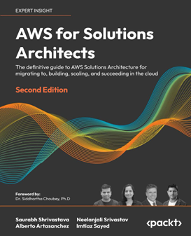
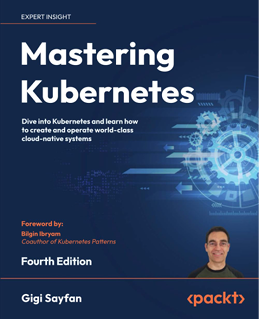

<html lang="en-US" xml:lang="en-US" xmlns="http://www.w3.org/1999/xhtml" xmlns:epub="http://www.idpf.org/2007/ops">
<head>
<title>Other_Books_You_May_Enjoy</title>
<link href="../Styles/syntax-highlighting.css" rel="stylesheet" type="text/css"/>
<link href="../Styles/epub.css" rel="stylesheet" type="text/css"/>
<!-- kobo-style -->

</head>
<body id="Other_Books_You_May_Enjoy">

<a href="http://packt.com">packt.com</a>

Subscribe to our online digital library for full access to over 7,000 books and videos, as well as industry leading tools to help you plan your personal development and advance your career. For more information, please visit our website.

<h1 class="heading-1" id="_idParaDest-532">Why subscribe?</h1>
<ul>
<li class="bulletList">Spend less time learning and more time coding with practical eBooks and Videos from over 4,000 industry professionals</li>
<li class="bulletList">Improve your learning with Skill Plans built especially for you</li>
<li class="bulletList">Get a free eBook or video every month</li>
<li class="bulletList">Fully searchable for easy access to vital information</li>
<li class="bulletList">Copy and paste, print, and bookmark content</li>
</ul>

At <a href="http://www.packt.com">www.packt.com</a>, you can also read a collection of free technical articles, sign up for a range of free newsletters, and receive exclusive discounts and offers on Packt books and eBooks.

<h1 class="mainHeading" id="_idParaDest-533">Other Books You May Enjoy</h1>

If you enjoyed this book, you may be interested in these other books by Packt:

<a href="https://www.packtpub.com/product/aws-for-solutions-architects-second-edition/9781803238951"></a>

<strong class="keyWord">AWS for Solutions Architects – Second Edition</strong>

Saurabh Shrivastava

Neelanjali Srivastav

Alberto Artasanchez

Imtiaz Sayed

ISBN: 978-1-80323-895-1

<ul>
<li class="bulletList">Optimize your Cloud Workload using the AWS Well-Architected Framework</li>
<li class="bulletList">Learn methods to migrate your workload using the AWS Cloud Adoption Framework</li>
<li class="bulletList">Apply cloud automation at various layers of application workload to increase efficiency</li>
<li class="bulletList">Build a landing zone in AWS and hybrid cloud setups with deep networking techniques</li>
<li class="bulletList">Select reference architectures for business scenarios, like data lakes, containers, and serverless apps</li>
<li class="bulletList">Apply emerging technologies in your architecture, including AI/ML, IoT and blockchain</li>
</ul>

<a href="https://www.packtpub.com/product/mastering-kubernetes-fourth-edition/9781804611395"></a>

<strong class="keyWord">Mastering Kubernetes – Fourth Edition</strong>

Gigi Sayfan

ISBN: 978-1-80461-139-5

<ul>
<li class="bulletList">Learn how to govern Kubernetes using policy engines</li>
<li class="bulletList">Learn what it takes to run Kubernetes in production and at scale</li>
<li class="bulletList">Build and run stateful applications and complex microservices</li>
<li class="bulletList">Master Kubernetes networking with services, Ingress objects, load balancers, and service meshes</li>
<li class="bulletList">Achieve high availability for your Kubernetes clusters</li>
<li class="bulletList">Improve Kubernetes observability with tools such as Prometheus, Grafana, and Jaeger</li>
<li class="bulletList">Extend Kubernetes with the Kubernetes API, plugins, and webhooks</li>
</ul>

<a href="https://www.packtpub.com/product/workflow-automation-with-microsoft-power-automate-second-edition/9781803237671"></a>

<strong class="keyWord">Workflow Automation with Microsoft Power Automate – Second Edition</strong>

Aaron Guilmette

ISBN: 978-1-80323-767-1

<ul>
<li class="bulletList">Learn the basic building blocks of Power Automate capabilities</li>
<li class="bulletList">Explore connectors in Power Automate to automate email workflows</li>
<li class="bulletList">Discover how to make a flow for copying files between cloud services</li>
<li class="bulletList">Configure Power Automate Desktop flows for your business needs</li>
<li class="bulletList">Build on examples to create complex database and approval flows</li>
<li class="bulletList">Connect common business applications like Outlook, Forms, and Teams</li>
<li class="bulletList">Learn the introductory concepts for robotic process automation</li>
<li class="bulletList">Discover how to use AI sentiment analysis</li>
</ul>

<h1 class="heading-1" id="_idParaDest-534">Packt is searching for authors like you</h1>

If you’re interested in becoming an author for Packt, please visit <a href="http://authors.packtpub.com">authors.packtpub.com</a> and apply today. We have worked with thousands of developers and tech professionals, just like you, to help them share their insight with the global tech community. You can make a general application, apply for a specific hot topic that we are recruiting an author for, or submit your own idea.

<h1 class="heading-1" id="_idParaDest-535">Share your thoughts</h1>

Now you’ve finished <em class="italic">Solutions Architect’s Handbook - Third Edition</em>, we’d love to hear your thoughts! If you purchased the book from Amazon, please <a href="https://packt.link/r/1835084230">click here to go straight to the Amazon review page</a> for this book and share your feedback or leave a review on the site that you purchased it from.

Your review is important to us and the tech community and will help us make sure we’re delivering excellent quality content.

</body>
</html>
